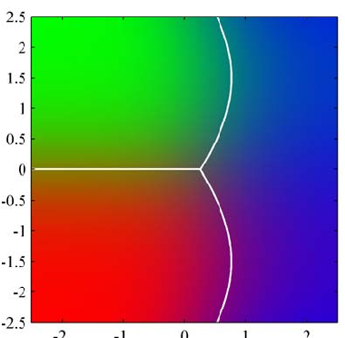

[Page 21]

# 1. Fundamentals

The problem of searching for patterns in data is a fundamental one and has a long and successful history. For instance, the extensive astronomical observations of Tycho Brahe in the 16th century allowed Johannes Kepler to discover the empirical laws of planetary motion, which in turn provided a springboard for the development of classical mechanics. Similarly, the discovery of regularities in atomic spectra played a key role in the development and verification of quantum physics in the early twentieth century. The field of pattern recognition is concerned with the automatic discovery of regularities in data through the use of computer algorithms and with the use of these regularities to take actions such as classifying the data into different categories.

Consider the example of recognizing handwritten digits, illustrated in Figure 1.1. Each digit corresponds to a $28 \times 28$ pixel image and so can be represented by a vector $\mathbf{x}$ comprising $784$ real numbers. The goal is to build a machine that will take such a vector $\mathbf{x}$ as input and that will produce the identity of the digit $0, \ldots, 9$ as the output. This is a nontrivial problem due to the wide variability of handwriting. It could be
[Page 22]

Figure 1.1 Examples of hand-written digits taken from US zip codes.

tackled using handcrafted rules or heuristics for distinguishing the digits based on the shapes of the strokes, but in practice such an approach leads to a proliferation of rules and of exceptions to the rules and so on, and invariably gives poor results.

Far better results can be obtained by adopting a machine learning approach in which a large set of $N$ digits $\{\mathbf{x}_1, \dots, \mathbf{x}_N\}$ called a training set is used to tune the parameters of an adaptive model. The categories of the digits in the training set are known in advance, typically by inspecting them individually and hand-labelling them. We can express the category of a digit using target vector $\mathbf{t}$, which represents the identity of the corresponding digit. Suitable techniques for representing categories in terms of vectors will be discussed later. Note that there is one such target vector $\mathbf{t}$ for each digit image $\mathbf{x}$.

The result of running the machine learning algorithm can be expressed as a function $\mathbf{y}(\mathbf{x})$ which takes a new digit image $\mathbf{x}$ as input and that generates an output vector $\mathbf{y}$, encoded in the same way as the target vectors. The precise form of the function $\mathbf{y}(\mathbf{x})$ is determined during the training phase, also known as the learning phase, on the basis of the training data. Once the model is trained it can then determine the identity of new digit images, which are said to comprise a test set. The ability to categorize correctly new examples that differ from those used for training is known as generalization. In practical applications, the variability of the input vectors will be such that the training data can comprise only a tiny fraction of all possible input vectors, and so generalization is a central goal in pattern recognition.

For most practical applications, the original input variables are typically preprocessed to transform them into some new space of variables where, it is hoped, the pattern recognition problem will be easier to solve. For instance, in the digit recognition problem, the images of the digits are typically translated and scaled so that each digit is contained within a box of a fixed size. This greatly reduces the variability within each digit class, because the location and scale of all the digits are now the same, which makes it much easier for a subsequent pattern recognition algorithm to distinguish between the different classes. This pre-processing stage is sometimes also called feature extraction. Note that new test data must be pre-processed using the same steps as the training data.

Pre-processing might also be performed in order to speed up computation. For example, if the goal is real-time face detection in a high-resolution video stream, the computer must handle huge numbers of pixels per second, and presenting these directly to a complex pattern recognition algorithm may be computationally infeasible. Instead, the aim is to find useful features that are fast to compute, and yet that
[Page 23]

also preserve useful discriminatory information enabling faces to be distinguished from non-faces. These features are then used as the inputs to the pattern recognition algorithm. For instance, the average value of the image intensity over a rectangular subregion can be evaluated extremely efficiently (Viola and Jones, 2004), and a set of such features can prove very effective in fast face detection. Because the number of such features is smaller than the number of pixels, this kind of pre-processing represents a form of dimensionality reduction. Care must be taken during pre-processing because often information is discarded, and if this information is important to the solution of the problem then the overall accuracy of the system can suffer.

Applications in which the training data comprises examples of the input vectors along with their corresponding target vectors are known as supervised learning problems. Cases such as the digit recognition example, in which the aim is to assign each input vector to one of a finite number of discrete categories, are called classification problems. If the desired output consists of one or more continuous variables, then the task is called regression. An example of a regression problem would be the prediction of the yield in a chemical manufacturing process in which the inputs consist of the concentrations of reactants, the temperature, and the pressure.

In other pattern recognition problems, the training data consists of a set of input vectors $\mathbf{x}$ without any corresponding target values. The goal in such unsupervised learning problems may be to discover groups of similar examples within the data, where it is called clustering, or to determine the distribution of data within the input space, known as density estimation, or to project the data from a high-dimensional space down to two or three dimensions for the purpose of visualization.

Finally, the technique of reinforcement learning (Sutton and Barto, 1998) is concerned with the problem of finding suitable actions to take in a given situation in order to maximize a reward. Here the learning algorithm is not given examples of optimal outputs, in contrast to supervised learning, but must instead discover them by a process of trial and error. Typically there is a sequence of states and actions in which the learning algorithm is interacting with its environment. In many cases, the current action not only affects the immediate reward but also has an impact on the reward at all subsequent time steps. For example, by using appropriate reinforcement learning techniques a neural network can learn to play the game of backgammon to a high standard (Tesauro, 1994). Here the network must learn to take a board position as input, along with the result of a dice throw, and produce a strong move as the output. This is done by having the network play against a copy of itself for perhaps a million games. A major challenge is that a game of backgammon can involve dozens of moves, and yet it is only at the end of the game that the reward, in the form of victory, is achieved. The reward must then be attributed appropriately to all of the moves that led to it, even though some moves will have been good ones and others less so. This is an example of a credit assignment problem. A general feature of reinforcement learning is the trade-off between exploration, in which the system tries out new kinds of actions to see how effective they are, and exploitation, in which the system makes use of actions that are known to yield a high reward. Too strong a focus on either exploration or exploitation will yield poor results. Reinforcement learning continues to be an active area of machine learning research. However, a
[Page 24]

detailed treatment lies beyond the scope of this book.

![The image depicts a line graph with a linear scale from 0 to 1 on the x-axis, labeled t, and a linear scale from 0 to 1 on the y-axis, labeled t. The graph has a green line that starts at the point (0, 0) and extends upwards to the right, then decreases to the left and then increases to the right again. The line appears to be a smooth curve, with no sharp edges or sharp dips. There are 7 dots plotted along the graph, each represented by a blue dot. The dots are evenly spaced along the x-axis, with a small gap between each dot. The dots are positioned at different points on the graph, with the dots closer to the left and the dots farther to the right. The graph is drawn on a white background, which makes the lines and dots stand out clearly. The graph is not labeled, but it is clear that the graph is meant](../Images/imageFile5.png)

Figure 1.2 Plot of a training data set of $N = 10$ points, shown as blue circles, each comprising an observation of the input variable $x$ along with the corresponding target variable $t$. The green curve shows the function $\sin(2\pi x)$ used to generate the data. Our goal is to predict the value of $t$ for some new value of $x$, without knowledge of the green curve.

Although each of these tasks needs its own tools and techniques, many of the key ideas that underpin them are common to all such problems. One of the main goals of this chapter is to introduce, in a relatively informal way, several of the most important of these concepts and to illustrate them using simple examples. Later in the book we shall see these same ideas re-emerge in the context of more sophisticated models that are applicable to real-world pattern recognition applications. This chapter also provides a self-contained introduction to three important tools that will be used throughout the book, namely probability theory, decision theory, and information theory. Although these might sound like daunting topics, they are in fact straightforward, and a clear understanding of them is essential if machine learning techniques are to be used to best effect in practical applications.

### 1.1. Example: Polynomial Curve Fitting

We begin by introducing a simple regression problem, which we shall use as a running example throughout this chapter to motivate a number of key concepts. Suppose we observe a real-valued input variable $x$ and we wish to use this observation to predict the value of a real-valued target variable $t$. For the present purposes, it is instructive to consider an artificial example using synthetically generated data because we then know the precise process that generated the data for comparison against any learned model. The data for this example is generated from the function $\sin(2\pi x)$ with random noise included in the target values, as described in detail in Appendix A.

Now suppose that we are given a training set comprising $N$ observations of $x$, written $\mathbf{x} \equiv (x_1, \ldots, x_N)^{\mathrm{T}}$, together with corresponding observations of the values of $t$, denoted $\mathbf{t} \equiv (t_1, \ldots, t_N)^{\mathrm{T}}$. Figure 1.2 shows a plot of a training set comprising $N = 10$ data points. The input data set $\mathbf{x}$ in Figure 1.2 was generated by choosing values of $x_n$, for $n = 1, \ldots, N$, spaced uniformly in range $[0, 1]$, and the target data set $\mathbf{t}$ was obtained by first computing the corresponding values of the function
[Page 25]

$\sin(2\pi x)$ and then adding a small level of random noise having a Gaussian distribution (the Gaussian distribution is discussed in Section 1.2.4) to each such point in order to obtain the corresponding value $t_n$. By generating data in this way, we are capturing a property of many real data sets, namely that they possess an underlying regularity, which we wish to learn, but that individual observations are corrupted by random noise. This noise might arise from intrinsically stochastic (i.e. random) processes such as radioactive decay but more typically is due to there being sources of variability that are themselves unobserved.

Our goal is to exploit this training set in order to make predictions of the value $t$ of the target variable for some new value $x$ of the input variable. As we shall see later, this involves implicitly trying to discover the underlying function $\sin(2\pi x)$. This is intrinsically a difficult problem as we have to generalize from a finite data set. Furthermore the observed data are corrupted with noise, and so for a given $x$ there is uncertainty as to the appropriate value for $t$. Probability theory, discussed in Section 1.2, provides a framework for expressing such uncertainty in a precise and quantitative manner, and decision theory, discussed in Section 1.5, allows us to exploit this probabilistic representation in order to make predictions that are optimal according to appropriate criteria.

For the moment, however, we shall proceed rather informally and consider a simple approach based on curve fitting. In particular, we shall fit the data using a polynomial function of the form

$$
y(x, \mathbf{w}) = w_0 + w_1 x + w_2 x^2 + \ldots + w_M x^M = \sum_{j=0}^{M} w_j x^j \tag{1.1}
$$

where $M$ is the order of the polynomial, and $x^j$ denotes $x$ raised to the power of $j$. The polynomial coefficients $w_0, \ldots, w_M$ are collectively denoted by the vector $\mathbf{w}$. Note that, although the polynomial function $y(x, \mathbf{w})$ is a nonlinear function of $x$, it is a linear function of the coefficients $\mathbf{w}$. Functions, such as the polynomial, which are linear in the unknown parameters have important properties and are called linear models and will be discussed extensively in Chapters 3 and 4.

The values of the coefficients will be determined by fitting the polynomial to the training data. This can be done by minimizing an error function that measures the misfit between the function $y(x, \mathbf{w})$, for any given value of $\mathbf{w}$, and the training set data points. One simple choice of error function, which is widely used, is given by the sum of the squares of the errors between the predictions $y(x_n, \mathbf{w})$ for each data point $x_n$ and the corresponding target values $t_n$, so that we minimize

$$
E(\mathbf{w}) = \frac{1}{2} \sum_{n=1}^{N} \{y(x_n, \mathbf{w}) - t_n\}^2 \tag{1.2}
$$

where the factor of $1/2$ is included for later convenience. We shall discuss the motivation for this choice of error function later in this chapter. For the moment we simply note that it is a nonnegative quantity that would be zero if, and only if, the
[Page 26]

function $y(x, \mathbf{w})$ were to pass exactly through each training data point. The geometrical interpretation of the sum-of-squares error function is illustrated in Figure 1.3.

![The image depicts a graph with two lines, labeled as y(x, w) and y(x, w). The x-axis is labeled as t and the y-axis is labeled as w. The graph is a line graph, with the x-axis labeled as t and the y-axis labeled as w. The line is drawn from the point (0, 0) to the point (1, 1) on the graph. The line starts at the point (0, 0) and extends upwards to the point (1, 1) on the graph. The line then starts at the point (0, 0) and extends upwards to the point (1, 1) on the graph. The line then starts at the point (0, 0) and extends upwards to the point (1, 1) on the graph. The line then starts at the point (0, 0) and extends upwards](../Images/imageFile6.png)

Figure 1.3 The error function (1.2) corresponds to (one half of) the sum of the squares of the displacements (shown by the vertical green bars) of each data point from the function $y(x, \mathbf{w})$.

We can solve the curve fitting problem by choosing the value of $\mathbf{w}$ for which $E(\mathbf{w})$ is as small as possible. Because the error function is a quadratic function of the coefficients $\mathbf{w}$, its derivatives with respect to the coefficients will be linear in the elements of $\mathbf{w}$, and so the minimization of the error function has a unique solution, denoted by $\mathbf{w}^{\star}$, which can be found in closed form. The resulting polynomial is given by the function $y(x, \mathbf{w}^{\star})$.

There remains the problem of choosing the order $M$ of the polynomial, and as we shall see this will turn out to be an example of an important concept called model comparison or model selection. In Figure 1.4, we show four examples of the results of fitting polynomials having orders $M = 0, 1, 3,$ and $9$ to the data set shown in Figure 1.2.

We notice that the constant ($M = 0$) and first order ($M = 1$) polynomials give rather poor fits to the data and consequently rather poor representations of the function $\sin(2\pi x)$. The third order ($M = 3$) polynomial seems to give the best fit to the function $\sin(2\pi x)$ of the examples shown in Figure 1.4. When we go to a much higher order polynomial ($M = 9$), we obtain an excellent fit to the training data. In fact, the polynomial passes exactly through each data point and $E(\mathbf{w}^{\star}) = 0$. However, the fitted curve oscillates wildly and gives a very poor representation of the function $\sin(2\pi x)$. This latter behaviour is known as over-fitting.

As we have noted earlier, the goal is to achieve good generalization by making accurate predictions for new data. We can obtain some quantitative insight into the dependence of the generalization performance on $M$ by considering a separate test set comprising 100 data points generated using exactly the same procedure used to generate the training set points but with new choices for the random noise values included in the target values. For each choice of $M$, we can then evaluate the residual value of $E(\mathbf{w}^{\star})$ given by (1.2) for the training data, and we can also evaluate $E(\mathbf{w}^{\star})$ for the test data set. It is sometimes more convenient to use the root-mean-square
[Page 27]

![The image is a graph consisting of four different lines, each represented by a different color. The lines are connected by a horizontal line and a vertical line. The x-axis is labeled as t and the y-axis is labeled as M. The graph is titled M = 0 and has a label M = 1. Each line in the graph has a different color: 1. The first line is red and has a label of M = 0 on the x-axis. 2. The second line is green and has a label of M = 0 on the x-axis. 3. The third line is blue and has a label of M = 0 on the x-axis. 4. The fourth line is green and has a label of M = 0 on the x-axis. Each line has a different slope and a different value of M.](../Images/imageFile7.png)

Figure 1.4 Plots of polynomials having various orders $M$, shown as red curves, fitted to the data set shown in Figure 1.2.

(RMS) error defined by

$$
E_{\text{RMS}} = \sqrt{2E(\mathbf{w}^{\star})/N} \tag{1.3}
$$

in which the division by $N$ allows us to compare different sizes of data sets on an equal footing, and the square root ensures that $E_{\text{RMS}}$ is measured on the same scale (and in the same units) as the target variable $t$. Graphs of the training and test set RMS errors are shown, for various values of $M$, in Figure 1.5. The test set error is a measure of how well we are doing in predicting the values of $t$ for new data observations of $x$. We note from Figure 1.5 that small values of $M$ give relatively large values of the test set error, and this can be attributed to the fact that the corresponding polynomials are rather inflexible and are incapable of capturing the oscillations in the function $\sin(2\pi x)$. Values of $M$ in the range $3 \le M \le 8$ give small values for the test set error, and these also give reasonable representations of the generating function $\sin(2\pi x)$, as can be seen, for the case of $M = 3$, from Figure 1.4.
[Page 28]

Figure 1.5 Graphs of the root-mean-square error, defined by (1.3), evaluated on the training set and on an independent test set for various values of $M$.

![The image is a line graph titled Training and Test. The graph is composed of two lines, each represented by a different color. The x-axis is labeled M and the y-axis is labeled Ers. The line on the left side of the graph is blue and represents Training and the line on the right side of the graph is red and represents Test. The graph shows a trend of decreasing training and test scores over time. The training line starts at a low point and then decreases, reaching a low point in the middle of the graph. The test line starts at a high point and then decreases, reaching a high point in the middle of the graph. The graph also includes a scale from 0 to 1, which indicates the range of values represented by the lines. The x-axis is labeled M and the y-axis is labeled Ers. The graph is labeled as Training and Test](../Images/imageFile8.png)

For $M = 9$, the training set error goes to zero, as we might expect because this polynomial contains $10$ degrees of freedom corresponding to the $10$ coefficients $w_0, \ldots, w_9$, and so can be tuned exactly to the $10$ data points in the training set. However, the test set error has become very large and, as we saw in Figure 1.4, the corresponding function $y(x, \mathbf{w}^{\star})$ exhibits wild oscillations.

This may seem paradoxical because a polynomial of given order contains all lower order polynomials as special cases. The $M = 9$ polynomial is therefore capable of generating results at least as good as the $M = 3$ polynomial. Furthermore, we might suppose that the best predictor of new data would be the function $\sin(2\pi x)$ from which the data was generated (and we shall see later that this is indeed the case). We know that a power series expansion of the function $\sin(2\pi x)$ contains terms of all orders, so we might expect that results should improve monotonically as we increase $M$.

We can gain some insight into the problem by examining the values of the coefficients $\mathbf{w}^{\star}$ obtained from polynomials of various order, as shown in Table 1.1. We see that, as $M$ increases, the magnitude of the coefficients typically gets larger. In particular for the $M = 9$ polynomial, the coefficients have become finely tuned to the data by developing large positive and negative values so that the correspond-

Table 1.1 Table of the coefficients $\mathbf{w}^{\star}$ for polynomials of various order. Observe how the typical magnitude of the coefficients increases dramatically as the order of the polynomial increases.

|               | $M = 0$ | $M = 1$ | $M = 3$  | $M = 9$       |
| :------------ | :------ | :------ | :------- | :------------ |
| $w_0^{\star}$ | $0.19$  | $0.82$  | $0.31$   | $0.35$        |
| $w_1^{\star}$ |         | $-1.27$ | $7.99$   | $232.37$      |
| $w_2^{\star}$ |         |         | $-25.43$ | $-5321.83$    |
| $w_3^{\star}$ |         |         | $17.37$  | $48568.31$    |
| $w_4^{\star}$ |         |         |          | $-231639.30$  |
| $w_5^{\star}$ |         |         |          | $640042.26$   |
| $w_6^{\star}$ |         |         |          | $-1061800.52$ |
| $w_7^{\star}$ |         |         |          | $1042400.18$  |
| $w_8^{\star}$ |         |         |          | $-557682.99$  |
| $w_9^{\star}$ |         |         |          | $125201.43$   |

[Page 29]

![The image is a scatter plot with two sets of data points. The x-axis is labeled N and the y-axis is labeled T. The data points are represented by red and green dots, respectively. The x-axis is labeled T and the y-axis is labeled T. The data points are scattered across the graph, with some points closer to the x-axis and others closer to the y-axis. The points are scattered in a random pattern, with no clear pattern or pattern in the data. The scatter plot is drawn with a white background and has a grid. The x-axis is labeled N and the y-axis is labeled T. The data points are scattered across the graph, with some points closer to the x-axis and others closer to the y-axis. The points are scattered in a random pattern, with no clear pattern or pattern in the data. The scatter plot is not perfectly symmetrical](../Images/imageFile9.png)

Figure 1.6 Plots of the solutions obtained by minimizing the sum-of-squares error function using the $M = 9$ polynomial for $N = 15$ data points (left plot) and $N = 100$ data points (right plot). We see that increasing the size of the data set reduces the over-fitting problem.

ing polynomial function matches each of the data points exactly, but between data points (particularly near the ends of the range) the function exhibits the large oscillations observed in Figure 1.4. Intuitively, what is happening is that the more flexible polynomials with larger values of $M$ are becoming increasingly tuned to the random noise on the target values.

It is also interesting to examine the behaviour of a given model as the size of the data set is varied, as shown in Figure 1.6. We see that, for a given model complexity, the over-fitting problem become less severe as the size of the data set increases. Another way to say this is that the larger the data set, the more complex (in other words more flexible) the model that we can afford to fit to the data. One rough heuristic that is sometimes advocated is that the number of data points should be no less than some multiple (say 5 or 10) of the number of adaptive parameters in the model. However, as we shall see in Chapter 3, the number of parameters is not necessarily the most appropriate measure of model complexity.

Also, there is something rather unsatisfying about having to limit the number of parameters in a model according to the size of the available training set. It would seem more reasonable to choose the complexity of the model according to the complexity of the problem being solved. We shall see that the least squares approach to finding the model parameters represents a specific case of maximum likelihood (discussed in Section 1.2.5), and that the over-fitting problem can be understood as a general property of maximum likelihood. By adopting a Bayesian approach, the over-fitting problem can be avoided. We shall see that there is no difficulty from a Bayesian perspective in employing models for which the number of parameters greatly exceeds the number of data points. Indeed, in a Bayesian model the effective number of parameters adapts automatically to the size of the data set.

For the moment, however, it is instructive to continue with the current approach and to consider how in practice we can apply it to data sets of limited size where we
[Page 30]

![The image presents two graphs, each with a different set of data points. The x-axis is labeled lina and the y-axis is labeled 18. The graph on the left shows a downward trend, while the graph on the right shows a upward trend. Both graphs have a horizontal line labeled ln(a) = 0 at the end of the graph. The first graph has a horizontal line labeled ln(a) = 0 at the end of the graph. The graph on the left shows a downward trend, while the graph on the right shows a upward trend. Both graphs have a vertical line labeled ln(a) = 0 at the end of the graph. The second graph has a horizontal line labeled ln(a) = 0 at the end of the graph. The graph on the left shows a downward trend, while the graph on the right shows a upward trend. Both graphs have](../Images/imageFile10.png)

Figure 1.7 Plots of $M = 9$ polynomials fitted to the data set shown in Figure 1.2 using the regularized error function (1.4) for two values of the regularization parameter $\lambda$ corresponding to $\ln \lambda = -18$ and $\ln \lambda = 0$. The case of no regularizer, i.e., $\lambda = 0$, corresponding to $\ln \lambda = -\infty$, is shown at the bottom right of Figure 1.4.

may wish to use relatively complex and flexible models. One technique that is often used to control the over-fitting phenomenon in such cases is that of regularization, which involves adding a penalty term to the error function (1.2) in order to discourage the coefficients from reaching large values. The simplest such penalty term takes the form of a sum of squares of all of the coefficients, leading to a modified error function of the form

$$
\widetilde{E}(\mathbf{w}) = \frac{1}{2} \sum_{n=1}^{N} \{y(x_n, \mathbf{w}) - t_n\}^2 + \frac{\lambda}{2} \|\mathbf{w}\|^2 \tag{1.4}
$$

where $\|\mathbf{w}\|^2 \equiv \mathbf{w}^{\mathrm{T}}\mathbf{w} = w_0^2 + w_1^2 + \ldots + w_M^2$, and the coefficient $\lambda$ governs the relative importance of the regularization term compared with the sum-of-squares error term. Note that often the coefficient $w_0$ is omitted from the regularizer because its inclusion causes the results to depend on the choice of origin for the target variable (Hastie et al., 2001), or it may be included but with its own regularization coefficient (we shall discuss this topic in more detail in Section 5.5.1). Again, the error function in (1.4) can be minimized exactly in closed form. Techniques such as this are known in the statistics literature as shrinkage methods because they reduce the value of the coefficients. The particular case of a quadratic regularizer is called ridge regression (Hoerl and Kennard, 1970). In the context of neural networks, this approach is known as weight decay.

Figure 1.7 shows the results of fitting the polynomial of order $M = 9$ to the same data set as before but now using the regularized error function given by (1.4). We see that, for a value of $\ln \lambda = -18$, the over-fitting has been suppressed and we now obtain a much closer representation of the underlying function $\sin(2\pi x)$. If, however, we use too large a value for $\lambda$ then we again obtain a poor fit, as shown in Figure 1.7 for $\ln \lambda = 0$. The corresponding coefficients from the fitted polynomials are given in Table 1.2, showing that regularization has the desired effect of reducing
[Page 31]

**Table 1.2** Table of the coefficients $\mathbf{w}^{\star}$ for $M = 9$ polynomials with various values for the regularization parameter $\lambda$. Note that $\ln \lambda = -\infty$ corresponds to a model with no regularization, i.e., to the graph at the bottom right in Figure 1.4. We see that, as the value of $\lambda$ increases, the typical magnitude of the coefficients gets smaller.

|               | $\ln \lambda = -\infty$ | $\ln \lambda = -18$ | $\ln \lambda = 0$ |
| :------------ | :---------------------- | :------------------ | :---------------- |
| $w_0^{\star}$ | $0.35$                  | $0.35$              | $0.13$            |
| $w_1^{\star}$ | $232.37$                | $4.74$              | $-0.05$           |
| $w_2^{\star}$ | $-5321.83$              | $-0.77$             | $-0.06$           |
| $w_3^{\star}$ | $48568.31$              | $-31.97$            | $-0.05$           |
| $w_4^{\star}$ | $-231639.30$            | $-3.89$             | $-0.03$           |
| $w_5^{\star}$ | $640042.26$             | $55.28$             | $-0.02$           |
| $w_6^{\star}$ | $-1061800.52$           | $41.32$             | $-0.01$           |
| $w_7^{\star}$ | $1042400.18$            | $-45.95$            | $-0.00$           |
| $w_8^{\star}$ | $-557682.99$            | $-91.53$            | $0.00$            |
| $w_9^{\star}$ | $125201.43$             | $72.68$             | $0.01$            |

the magnitude of the coefficients.

The impact of the regularization term on the generalization error can be seen by plotting the value of the RMS error (1.3) for both training and test sets against $\ln \lambda$, as shown in Figure 1.8. We see that in effect $\lambda$ now controls the effective complexity of the model and hence determines the degree of over-fitting.

The issue of model complexity is an important one and will be discussed at length in Section 1.3. Here we simply note that, if we were trying to solve a practical application using this approach of minimizing an error function, we would have to find a way to determine a suitable value for the model complexity. The results above suggest a simple way of achieving this, namely by taking the available data and partitioning it into a training set, used to determine the coefficients $\mathbf{w}$, and a separate validation set, also called a hold-out set, used to optimize the model complexity (either $M$ or $\lambda$). In many cases, however, this will prove to be too wasteful of valuable training data, and we have to seek more sophisticated approaches.

So far our discussion of polynomial curve fitting has appealed largely to intuition. We now seek a more principled approach to solving problems in pattern recognition by turning to a discussion of probability theory. As well as providing the foundation for nearly all of the subsequent developments in this book, it will also

![The image is a line graph titled Training and Test. The graph has a blue and red color scheme. The x-axis is labeled Enms, and the y-axis is labeled Enms. The graph shows the percentage of employees who have been trained and tested in the last 30 days. The training and testing percentages are shown as blue bars, and the percentage of employees who have been trained and tested is shown as red bars. The graph has a horizontal axis labeled Enms and a vertical axis labeled Enms. The x-axis is labeled Enms, and the y-axis is labeled Enms. The graph shows the percentage of employees who have been trained and tested in the last 30 days. The training and testing percentages are shown as blue bars, and the percentage of employees who have been trained and tested is shown as red bars. The graph has a title at the top of the image, which reads](../Images/imageFile11.png)

**Figure 1.8** Graph of the root-mean-square error (1.3) versus $\ln \lambda$ for the $M = 9$ polynomial.
[Page 32]

give us some important insights into the concepts we have introduced in the context of polynomial curve fitting and will allow us to extend these to more complex situations.

## 1.2. Probability Theory

A key concept in the field of pattern recognition is that of uncertainty. It arises both through noise on measurements, as well as through the finite size of data sets. Probability theory provides a consistent framework for the quantification and manipulation of uncertainty and forms one of the central foundations for pattern recognition. When combined with decision theory, discussed in Section 1.5, it allows us to make optimal predictions given all the information available to us, even though that information may be incomplete or ambiguous.

We will introduce the basic concepts of probability theory by considering a simple example. Imagine we have two boxes, one red and one blue, and in the red box we have 2 apples and 6 oranges, and in the blue box we have 3 apples and 1 orange. This is illustrated in Figure 1.9. Now suppose we randomly pick one of the boxes and from that box we randomly select an item of fruit, and having observed which sort of fruit it is we replace it in the box from which it came. We could imagine repeating this process many times. Let us suppose that in so doing we pick the red box 40% of the time and we pick the blue box 60% of the time, and that when we remove an item of fruit from a box we are equally likely to select any of the pieces of fruit in the box.

In this example, the identity of the box that will be chosen is a random variable, which we shall denote by $B$. This random variable can take one of two possible values, namely $r$ (corresponding to the red box) or $b$ (corresponding to the blue box). Similarly, the identity of the fruit is also a random variable and will be denoted by $F$. It can take either of the values $a$ (for apple) or $o$ (for orange).

To begin with, we shall define the probability of an event to be the fraction of times that event occurs out of the total number of trials, in the limit that the total number of trials goes to infinity. Thus the probability of selecting the red box is $4/10$

![The image displays two identical circles, each containing a number of green circles. The circles are arranged vertically, with each circle occupying the same space. The circles are colored in a gradient of green, with the top circle being a darker shade of green and the bottom circle being a lighter shade. The circles are evenly spaced, with no gaps between them. The background of the image is white, which makes the circles stand out clearly. The circles are placed on a flat surface, possibly a table or a surface with a smooth texture. The image does not contain any text, numbers, or other objects that would typically be found in a photograph or illustration. The focus is solely on the two circles, their arrangement, and the gradient of the green circles. ### Analysis and Description: **Objects and Elements:** 1. **Circles:** Two identical circles with a gradient of green. 2. **Background:** White surface with a smooth texture. 3.](../Images/imageFile12.png)

Figure 1.9 We use a simple example of two coloured boxes each containing fruit (apples shown in green and oranges shown in orange) to introduce the basic ideas of probability.
[Page 33]

Figure 1.10 We can derive the sum and product rules of probability by considering two random variables, $X$, which takes the values $\{x_i\}$ where $i = 1, \ldots, M$, and $Y$, which takes the values $\{y_j\}$ where $j = 1, \ldots, L$. In this illustration we have $M = 5$ and $L = 3$. If we consider a total number $N$ of instances of these variables, then we denote the number of instances where $X = x_i$ and $Y = y_j$ by $n_{ij}$, which is the number of points in the corresponding cell of the array. The number of points in column $i$, corresponding to $X = x_i$, is denoted by $c_i$, and the number of points in row $j$, corresponding to $Y = y_j$, is denoted by $r_j$.

and the probability of selecting the blue box is $6/10$. We write these probabilities as $p(B = r) = 4/10$ and $p(B = b) = 6/10$. Note that, by definition, probabilities must lie in the interval $[0,1]$. Also, if the events are mutually exclusive and if they include all possible outcomes (for instance, in this example the box must be either red or blue), then we see that the probabilities for those events must sum to one.

We can now ask questions such as: “what is the overall probability that the selection procedure will pick an apple?”, or “given that we have chosen an orange, what is the probability that the box we chose was the blue one?”. We can answer questions such as these, and indeed much more complex questions associated with problems in pattern recognition, once we have equipped ourselves with the two elementary rules of probability, known as the sum rule and the product rule. Having obtained these rules, we shall then return to our boxes of fruit example.

In order to derive the rules of probability, consider the slightly more general example shown in Figure 1.10 involving two random variables $X$ and $Y$ (which could for instance be the Box and Fruit variables considered above). We shall suppose that $X$ can take any of the values $x_i$ where $i = 1,\ldots,M$, and $Y$ can take the values $y_j$ where $j = 1,\ldots,L$. Consider a total of $N$ trials in which we sample both of the variables $X$ and $Y$, and let the number of such trials in which $X = x_i$ and $Y = y_j$ be $n_{ij}$. Also, let the number of trials in which $X$ takes the value $x_i$ (irrespective of the value that $Y$ takes) be denoted by $c_i$, and similarly let the number of trials in which $Y$ takes the value $y_j$ be denoted by $r_j$.

The probability that $X$ will take the value $x_i$ and $Y$ will take the value $y_j$ is written $p(X = x_i, Y = y_j)$ and is called the joint probability of $X = x_i$ and $Y = y_j$. It is given by the number of points falling in the cell $i,j$ as a fraction of the total number of points, and hence

$$
p(X = x_i, Y = y_j) = \frac{n_{ij}}{N}. \tag{1.5}
$$

Here we are implicitly considering the limit $N \to \infty$. Similarly, the probability that $X$ takes the value $x_i$ irrespective of the value of $Y$ is written as $p(X = x_i)$ and is given by the fraction of the total number of points that fall in column $i$, so that

$$
p(X = x_i) = \frac{c_i}{N}. \tag{1.6}
$$

Because the number of instances in column $i$ in Figure 1.10 is just the sum of the number of instances in each cell of that column, we have $c_i = \sum_j n_{ij}$ and therefore,
[Page 34]

from (1.5) and (1.6), we have

$$
p(X = x_i) = \sum_{j=1}^L p(X = x_i, Y = y_j) \tag{1.7}
$$

which is the sum rule of probability. Note that $p(X = x_i)$ is sometimes called the marginal probability, because it is obtained by marginalizing, or summing out, the other variables (in this case $Y$).

If we consider only those instances for which $X = x_i$, then the fraction of such instances for which $Y = y_j$ is written $p(Y = y_j|X = x_i)$ and is called the conditional probability of $Y = y_j$ given $X = x_i$. It is obtained by finding the fraction of those points in column $i$ that fall in cell $i,j$ and hence is given by

$$
p(Y = y_j|X = x_i) = \frac{n_{ij}}{c_i} \tag{1.8}
$$

From (1.5), (1.6), and (1.8), we can then derive the following relationship

$$
\begin{align*}
p(X = x_i, Y = y_j) &= \frac{n_{ij}}{N} = \frac{n_{ij}}{c_i} \cdot \frac{c_i}{N} \\
&= p(Y = y_j|X = x_i) p(X = x_i) \tag{1.9}
\end{align*}
$$

which is the product rule of probability.

So far we have been quite careful to make a distinction between a random variable, such as the box $B$ in the fruit example, and the values that the random variable can take, for example $r$ if the box were the red one. Thus the probability that $B$ takes the value $r$ is denoted $p(B = r)$. Although this helps to avoid ambiguity, it leads to a rather cumbersome notation, and in many cases there will be no need for such pedantry. Instead, we may simply write $p(B)$ to denote a distribution over the random variable $B$, or $p(r)$ to denote the distribution evaluated for the particular value $r$, provided that the interpretation is clear from the context.

With this more compact notation, we can write the two fundamental rules of probability theory in the following form.

**The Rules of Probability**

$$
\text{sum rule} \quad p(X) = \sum_Y p(X, Y) \tag{1.10}
$$

$$
\text{product rule} \quad p(X, Y) = p(Y|X) p(X) \tag{1.11}
$$

Here $p(X, Y)$ is a joint probability and is verbalized as "the probability of $X$ and $Y$". Similarly, the quantity $p(Y|X)$ is a conditional probability and is verbalized as "the probability of $Y$ given $X$", whereas the quantity $p(X)$ is a marginal probability
[Page 35]

and is simply “the probability of $X$”. These two simple rules form the basis for all of the probabilistic machinery that we use throughout this book.

From the product rule, together with the symmetry property $p(X,Y) = p(Y,X)$, we immediately obtain the following relationship between conditional probabilities

$$
p(Y|X) = \frac{p(X|Y)p(Y)}{p(X)} \tag{1.12}
$$

which is called Bayes’ theorem and which plays a central role in pattern recognition and machine learning. Using the sum rule, the denominator in Bayes’ theorem can be expressed in terms of the quantities appearing in the numerator

$$
p(X) = \sum_{Y} p(X|Y)p(Y). \tag{1.13}
$$

We can view the denominator in Bayes’ theorem as being the normalization constant required to ensure that the sum of the conditional probability on the left-hand side of (1.12) over all values of $Y$ equals one.

In Figure 1.11, we show a simple example involving a joint distribution over two variables to illustrate the concept of marginal and conditional distributions. Here a finite sample of $N = 60$ data points has been drawn from the joint distribution and is shown in the top left. In the top right is a histogram of the fractions of data points having each of the two values of $Y$. From the definition of probability, these fractions would equal the corresponding probabilities $p(Y)$ in the limit $N \to \infty$. We can view the histogram as a simple way to model a probability distribution given only a finite number of points drawn from that distribution. Modelling distributions from data lies at the heart of statistical pattern recognition and will be explored in great detail in this book. The remaining two plots in Figure 1.11 show the corresponding histogram estimates of $p(X)$ and $p(X|Y = 1)$.

Let us now return to our example involving boxes of fruit. For the moment, we shall once again be explicit about distinguishing between the random variables and their instantiations. We have seen that the probabilities of selecting either the red or the blue boxes are given by

$$
\begin{align}
p(B = r) &= 4/10 \tag{1.14} \\
p(B = b) &= 6/10 \tag{1.15}
\end{align}
$$

respectively. Note that these satisfy $p(B = r) + p(B = b) = 1$.

Now suppose that we pick a box at random, and it turns out to be the blue box. Then the probability of selecting an apple is just the fraction of apples in the blue box which is $3/4$, and so $p(F = a|B = b) = 3/4$. In fact, we can write out all four conditional probabilities for the type of fruit, given the selected box

$$
\begin{align}
p(F = a|B = r) &= 1/4 \tag{1.16} \\
p(F = o|B = r) &= 3/4 \tag{1.17} \\
p(F = a|B = b) &= 3/4 \tag{1.18} \\
p(F = o|B = b) &= 1/4. \tag{1.19}
\end{align}
$$

[Page 36]

![The image is a bar chart titled Y=1 with four different categories represented by blue bars. The x-axis is labeled Y and the y-axis is labeled P(X). The bars are color-coded to represent different values of P(X). ### Description of the Bar Chart: - **Y-Axis (X-Axis)**: The x-axis is labeled Y and the y-axis is labeled P(X). - **Bars**: There are four different categories represented by blue bars: - **X**: The category labeled x - **Y**: The category labeled y - **P(X)**: The category labeled P(X) ### Analysis: - **Bars Color Coding**: The bars are color-coded to represent different values of P(X). The colors are blue for x and red for y. - **](../Images/imageFile14.png)

Figure 1.11 An illustration of a distribution over two variables, $X$, which takes $9$ possible values, and $Y$, which takes two possible values. The top left figure shows a sample of $60$ points drawn from a joint probability distribution over these variables. The remaining figures show histogram estimates of the marginal distributions $p(X)$ and $p(Y)$, as well as the conditional distribution $p(X|Y = 1)$ corresponding to the bottom row in the top left figure.

Again, note that these probabilities are normalized so that

$$
p(F = a|B = r) + p(F = o|B = r) = 1
\tag{1.20}
$$

and similarly

$$
p(F = a|B = b) + p(F = o|B = b) = 1.
\tag{1.21}
$$

We can now use the sum and product rules of probability to evaluate the overall probability of choosing an apple

$$
\begin{align}
p(F = a) &= p(F = a|B = r)p(B = r) + p(F = a|B = b)p(B = b) \\
&= \frac{1}{4} \times \frac{4}{10} + \frac{3}{4} \times \frac{6}{10} = \frac{11}{20}
\end{align}
\tag{1.22}
$$

from which it follows, using the sum rule, that $p(F = o) = 1 - 11/20 = 9/20$.
[Page 37]

Suppose instead we are told that a piece of fruit has been selected and it is an orange, and we would like to know which box it came from. This requires that we evaluate the probability distribution over boxes conditioned on the identity of the fruit, whereas the probabilities in (1.16)–(1.19) give the probability distribution over the fruit conditioned on the identity of the box. We can solve the problem of reversing the conditional probability by using Bayes’ theorem to give

$$
p(B = r|F = o) = \frac{p(F = o|B = r)p(B = r)}{p(F = o)} = \frac{3}{4} \times \frac{4}{10} \times \frac{20}{9} = \frac{2}{3}. \tag{1.23}
$$

From the sum rule, it then follows that $p(B = b|F = o) = 1 - 2/3 = 1/3$.

We can provide an important interpretation of Bayes’ theorem as follows. If we had been asked which box had been chosen before being told the identity of the selected item of fruit, then the most complete information we have available is provided by the probability $p(B)$. We call this the prior probability because it is the probability available before we observe the identity of the fruit. Once we are told that the fruit is an orange, we can then use Bayes’ theorem to compute the probability $p(B|F)$, which we shall call the posterior probability because it is the probability obtained after we have observed $F$. Note that in this example, the prior probability of selecting the red box was $4/10$, so that we were more likely to select the blue box than the red one. However, once we have observed that the piece of selected fruit is an orange, we find that the posterior probability of the red box is now $2/3$, so that it is now more likely that the box we selected was in fact the red one. This result accords with our intuition, as the proportion of oranges is much higher in the red box than it is in the blue box, and so the observation that the fruit was an orange provides significant evidence favouring the red box. In fact, the evidence is sufficiently strong that it outweighs the prior and makes it more likely that the red box was chosen rather than the blue one.

Finally, we note that if the joint distribution of two variables factorizes into the product of the marginals, so that $p(X,Y) = p(X)p(Y)$, then $X$ and $Y$ are said to be independent. From the product rule, we see that $p(Y|X) = p(Y)$, and so the conditional distribution of $Y$ given $X$ is indeed independent of the value of $X$. For instance, in our boxes of fruit example, if each box contained the same fraction of apples and oranges, then $p(F|B) = p(F)$, so that the probability of selecting, say, an apple is independent of which box is chosen.

### 1.2.1 Probability densities

As well as considering probabilities defined over discrete sets of events, we also wish to consider probabilities with respect to continuous variables. We shall limit ourselves to a relatively informal discussion. If the probability of a real-valued variable $x$ falling in the interval $(x, x + \delta x)$ is given by $p(x)\delta x$ for $\delta x \to 0$, then $p(x)$ is called the probability density over $x$. This is illustrated in Figure 1.12. The probability that $x$ will lie in an interval $(a,b)$ is then given by

$$
p(x \in (a,b)) = \int_{a}^{b} p(x) \, dx. \tag{1.24}
$$

[Page 38]

Figure 1.12 The concept of probability for discrete variables can be extended to that of a probability density $p(x)$ over a continuous variable $x$ and is such that the probability of $x$ lying in the interval $(x, x+\delta x)$ is given by $p(x)\delta x$ for $\delta x \to 0$. The probability density can be expressed as the derivative of a cumulative distribution function $P(x)$.

![The image consists of a graph with two lines. The graph is titled P(x) and P(x). The x-axis is labeled as dz and the y-axis is labeled as η. The graph shows two lines, one blue line and another red line. The blue line is a straight line, while the red line is a curved line. The blue line starts at the point (0, 0) and extends upwards, while the red line starts at the point (0, 0) and extends downwards. The graph shows that the blue line is a straight line, while the red line is a curved line. The blue line has a higher value than the red line. This means that the blue line is more likely to be a straight line than the red line. The graph also shows that the blue line is not a straight line, but rather a curved line. This means that the blue line is not a straight line,](../Images/imageFile15.png)

Because probabilities are nonnegative, and because the value of $x$ must lie somewhere on the real axis, the probability density $p(x)$ must satisfy the two conditions

$$
p(x) \ge 0 \tag{1.25}
$$

$$
\int_{-\infty}^{\infty} p(x) \, \mathrm{d}x = 1. \tag{1.26}
$$

Under a nonlinear change of variable, a probability density transforms differently from a simple function, due to the Jacobian factor. For instance, if we consider a change of variables $x = g(y)$, then a function $f(x)$ becomes $\tilde{f}(y) = f(g(y))$. Now consider a probability density $p_x(x)$ that corresponds to a density $p_y(y)$ with respect to the new variable $y$, where the suffices denote the fact that $p_x(x)$ and $p_y(y)$ are different densities. Observations falling in the range $(x, x + \delta x)$ will, for small values of $\delta x$, be transformed into the range $(y, y + \delta y)$ where $p_x(x)\delta x \simeq p_y(y)\delta y$, and hence

$$
\begin{align}
p_y(y) &= p_x(x) \left| \frac{\mathrm{d}x}{\mathrm{d}y} \right| \nonumber \\
&= p_x(g(y)) |g'(y)|. \tag{1.27}
\end{align}
$$

One consequence of this property is that the concept of the maximum of a probability density is dependent on the choice of variable.

The probability that $x$ lies in the interval $(-\infty, z)$ is given by the cumulative distribution function defined by

$$
P(z) = \int_{-\infty}^{z} p(x) \, \mathrm{d}x \tag{1.28}
$$

which satisfies $P'(x) = p(x)$, as shown in Figure 1.12.

If we have several continuous variables $x_1, \ldots, x_D$, denoted collectively by the vector $\mathbf{x}$, then we can define a joint probability density $p(\mathbf{x}) = p(x_1, \ldots, x_D)$ such
[Page 39]

that the probability of $\mathbf{x}$ falling in an infinitesimal volume $\delta\mathbf{x}$ containing the point $\mathbf{x}$ is given by $p(\mathbf{x})\delta\mathbf{x}$. This multivariate probability density must satisfy

$$
\begin{align}
p(\mathbf{x}) &\geq 0 \tag{1.29} \\
\int p(\mathbf{x}) \, d\mathbf{x} &= 1 \tag{1.30}
\end{align}
$$

in which the integral is taken over the whole of $\mathbf{x}$ space. We can also consider joint probability distributions over a combination of discrete and continuous variables.

Note that if $x$ is a discrete variable, then $p(x)$ is sometimes called a probability mass function because it can be regarded as a set of ‘probability masses’ concentrated at the allowed values of $x$.

The sum and product rules of probability, as well as Bayes’ theorem, apply equally to the case of probability densities, or to combinations of discrete and continuous variables. For instance, if $x$ and $y$ are two real variables, then the sum and product rules take the form

$$
\begin{align}
p(x) &= \int p(x,y) \, dy \tag{1.31} \\
p(x,y) &= p(y|x)p(x). \tag{1.32}
\end{align}
$$

A formal justification of the sum and product rules for continuous variables (Feller, 1966) requires a branch of mathematics called measure theory and lies outside the scope of this book. Its validity can be seen informally, however, by dividing each real variable into intervals of width $\Delta$ and considering the discrete probability distribution over these intervals. Taking the limit $\Delta \to 0$ then turns sums into integrals and gives the desired result.

### 1.2.2 Expectations and covariances

One of the most important operations involving probabilities is that of finding weighted averages of functions. The average value of some function $f(x)$ under a probability distribution $p(x)$ is called the expectation of $f(x)$ and will be denoted by $\mathbb{E}[f]$. For a discrete distribution, it is given by

$$
\mathbb{E}[f] = \sum_{x} p(x)f(x) \tag{1.33}
$$

so that the average is weighted by the relative probabilities of the different values of $x$. In the case of continuous variables, expectations are expressed in terms of an integration with respect to the corresponding probability density

$$
\mathbb{E}[f] = \int p(x)f(x) \, dx. \tag{1.34}
$$

In either case, if we are given a finite number $N$ of points drawn from the probability distribution or probability density, then the expectation can be approximated as a
[Page 40]

finite sum over these points

$$
\mathbb{E}[f] \simeq \frac{1}{N} \sum_{n=1}^{N} f(x_{n}). \tag{1.35}
$$

We shall make extensive use of this result when we discuss sampling methods in Chapter 11. The approximation in (1.35) becomes exact in the limit $N \to \infty$.

Sometimes we will be considering expectations of functions of several variables, in which case we can use a subscript to indicate which variable is being averaged over, so that for instance

$$
\mathbb{E}_{x}[f(x, y)] \tag{1.36}
$$

denotes the average of the function $f(x, y)$ with respect to the distribution of $x$. Note that $\mathbb{E}_{x}[f(x, y)]$ will be a function of $y$.

We can also consider a conditional expectation with respect to a conditional distribution, so that

$$
\mathbb{E}_{x}[f|y] = \sum_{x} p(x|y)f(x) \tag{1.37}
$$

with an analogous definition for continuous variables. The variance of $f(x)$ is defined by

$$
\text{var}[f] = \mathbb{E}\left[ (f(x) - \mathbb{E}[f(x)])^{2} \right] \tag{1.38}
$$

and provides a measure of how much variability there is in $f(x)$ around its mean value $\mathbb{E}[f(x)]$. Expanding out the square, we see that the variance can also be written in terms of the expectations of $f(x)$ and $f(x)^{2}$

$$
\text{var}[f] = \mathbb{E}[f(x)^{2}] - \mathbb{E}[f(x)]^{2}. \tag{1.39}
$$

In particular, we can consider the variance of the variable $x$ itself, which is given by

$$
\text{var}[x] = \mathbb{E}[x^{2}] - \mathbb{E}[x]^{2}. \tag{1.40}
$$

For two random variables $x$ and $y$, the covariance is defined by

$$
\begin{aligned}
\text{cov}[x, y] &= \mathbb{E}_{x,y}[\{x - \mathbb{E}[x]\}\{y - \mathbb{E}[y]\}] \\
&= \mathbb{E}_{x,y}[xy] - \mathbb{E}[x]\mathbb{E}[y]
\end{aligned} \tag{1.41}
$$

which expresses the extent to which $x$ and $y$ vary together. If $x$ and $y$ are independent, then their covariance vanishes.

In the case of two vectors of random variables $\mathbf{x}$ and $\mathbf{y}$, the covariance is a matrix

$$
\begin{aligned}
\text{cov}[\mathbf{x}, \mathbf{y}] &= \mathbb{E}_{\mathbf{x},\mathbf{y}}[\{\mathbf{x} - \mathbb{E}[\mathbf{x}]\}\{\mathbf{y}^{\text{T}} - \mathbb{E}[\mathbf{y}^{\text{T}}]\}] \\
&= \mathbb{E}_{\mathbf{x},\mathbf{y}}[\mathbf{x}\mathbf{y}^{\text{T}}] - \mathbb{E}[\mathbf{x}]\mathbb{E}[\mathbf{y}^{\text{T}}].
\end{aligned} \tag{1.42}
$$

If we consider the covariance of the components of a vector $\mathbf{x}$ with each other, then we use a slightly simpler notation $\text{cov}[\mathbf{x}] \equiv \text{cov}[\mathbf{x}, \mathbf{x}]$.
[Page 41]

### 1.2.3 Bayesian probabilities

So far in this chapter, we have viewed probabilities in terms of the frequencies of random, repeatable events. We shall refer to this as the classical or frequentist interpretation of probability. Now we turn to the more general Bayesian view, in which probabilities provide a quantification of uncertainty.

Consider an uncertain event, for example whether the moon was once in its own orbit around the sun, or whether the Arctic ice cap will have disappeared by the end of the century. These are not events that can be repeated numerous times in order to define a notion of probability as we did earlier in the context of boxes of fruit. Nevertheless, we will generally have some idea, for example, of how quickly we think the polar ice is melting. If we now obtain fresh evidence, for instance from a new Earth observation satellite gathering novel forms of diagnostic information, we may revise our opinion on the rate of ice loss. Our assessment of such matters will affect the actions we take, for instance the extent to which we endeavour to reduce the emission of greenhouse gasses. In such circumstances, we would like to be able to quantify our expression of uncertainty and make precise revisions of uncertainty in the light of new evidence, as well as subsequently to be able to take optimal actions or decisions as a consequence. This can all be achieved through the elegant, and very general, Bayesian interpretation of probability.

The use of probability to represent uncertainty, however, is not an ad-hoc choice, but is inevitable if we are to respect common sense while making rational coherent inferences. For instance, Cox (1946) showed that if numerical values are used to represent degrees of belief, then a simple set of axioms encoding common sense properties of such beliefs leads uniquely to a set of rules for manipulating degrees of belief that are equivalent to the sum and product rules of probability. This provided the first rigorous proof that probability theory could be regarded as an extension of Boolean logic to situations involving uncertainty (Jaynes, 2003). Numerous other authors have proposed different sets of properties or axioms that such measures of uncertainty should satisfy (Ramsey, 1931; Good, 1950; Savage, 1961; deFinetti, 1970; Lindley, 1982). In each case, the resulting numerical quantities behave precisely according to the rules of probability. It is therefore natural to refer to these quantities as (Bayesian) probabilities.

In the field of pattern recognition, too, it is helpful to have a more general no-

> **Thomas Bayes (1701–1761)**
>
> 
>
> Thomas Bayes was born in Tunbridge Wells and was a clergyman as well as an amateur scientist and a mathematician. He studied logic and theology at Edinburgh University and was elected Fellow of the Royal Society in 1742. During the 18th century, issues regarding probability arose in connection with gambling and with the new concept of insurance. One particularly important problem concerned so-called inverse probability. A solution was proposed by Thomas Bayes in his paper ‘Essay towards solving a problem in the doctrine of chances’, which was published in 1764, some three years after his death, in the Philosophical Transactions of the Royal Society. In fact, Bayes only formulated his theory for the case of a uniform prior, and it was Pierre-Simon Laplace who independently rediscovered the theory in general form and who demonstrated its broad applicability.
> [Page 42]

tion of probability. Consider the example of polynomial curve fitting discussed in Section 1.1. It seems reasonable to apply the frequentist notion of probability to the random values of the observed variables $t_n$. However, we would like to address and quantify the uncertainty that surrounds the appropriate choice for the model parameters $\mathbf{w}$. We shall see that, from a Bayesian perspective, we can use the machinery of probability theory to describe the uncertainty in model parameters such as $\mathbf{w}$, or indeed in the choice of model itself.

Bayes’ theorem now acquires a new significance. Recall that in the boxes of fruit example, the observation of the identity of the fruit provided relevant information that altered the probability that the chosen box was the red one. In that example, Bayes’ theorem was used to convert a prior probability into a posterior probability by incorporating the evidence provided by the observed data. As we shall see in detail later, we can adopt a similar approach when making inferences about quantities such as the parameters $\mathbf{w}$ in the polynomial curve fitting example. We capture our assumptions about $\mathbf{w}$, before observing the data, in the form of a prior probability distribution $p(\mathbf{w})$. The effect of the observed data $\mathcal{D} = \{t_1, \ldots, t_N\}$ is expressed through the conditional probability $p(\mathcal{D}|\mathbf{w})$, and we shall see later, in Section 1.2.5, how this can be represented explicitly. Bayes’ theorem, which takes the form

$$
p(\mathbf{w}|\mathcal{D}) = \frac{p(\mathcal{D}|\mathbf{w})p(\mathbf{w})}{p(\mathcal{D})} \tag{1.43}
$$

then allows us to evaluate the uncertainty in $\mathbf{w}$ after we have observed $\mathcal{D}$ in the form of the posterior probability $p(\mathbf{w}|\mathcal{D})$.

The quantity $p(\mathcal{D}|\mathbf{w})$ on the right-hand side of Bayes’ theorem is evaluated for the observed data set $\mathcal{D}$ and can be viewed as a function of the parameter vector $\mathbf{w}$, in which case it is called the likelihood function. It expresses how probable the observed data set is for different settings of the parameter vector $\mathbf{w}$. Note that the likelihood is not a probability distribution over $\mathbf{w}$, and its integral with respect to $\mathbf{w}$ does not (necessarily) equal one.

Given this definition of likelihood, we can state Bayes’ theorem in words

$$
\text{posterior} \propto \text{likelihood} \times \text{prior} \tag{1.44}
$$

where all of these quantities are viewed as functions of $\mathbf{w}$. The denominator in (1.43) is the normalization constant, which ensures that the posterior distribution on the left-hand side is a valid probability density and integrates to one. Indeed, integrating both sides of (1.43) with respect to $\mathbf{w}$, we can express the denominator in Bayes’ theorem in terms of the prior distribution and the likelihood function

$$
p(\mathcal{D}) = \int p(\mathcal{D}|\mathbf{w})p(\mathbf{w}) \, \mathrm{d}\mathbf{w}. \tag{1.45}
$$

In both the Bayesian and frequentist paradigms, the likelihood function $p(\mathcal{D}|\mathbf{w})$ plays a central role. However, the manner in which it is used is fundamentally different in the two approaches. In a frequentist setting, $\mathbf{w}$ is considered to be a fixed parameter, whose value is determined by some form of ‘estimator’, and error bars
[Page 43]

on this estimate are obtained by considering the distribution of possible data sets $\mathcal{D}$. By contrast, from the Bayesian viewpoint there is only a single data set $\mathcal{D}$ (namely the one that is actually observed), and the uncertainty in the parameters is expressed through a probability distribution over $\mathbf{w}$.

A widely used frequentist estimator is maximum likelihood, in which $\mathbf{w}$ is set to the value that maximizes the likelihood function $p(\mathcal{D}|\mathbf{w})$. This corresponds to choosing the value of $\mathbf{w}$ for which the probability of the observed data set is maximized. In the machine learning literature, the negative log of the likelihood function is called an error function. Because the negative logarithm is a monotonically decreasing function, maximizing the likelihood is equivalent to minimizing the error.

One approach to determining frequentist error bars is the bootstrap (Efron, 1979; Hastie et al., 2001), in which multiple data sets are created as follows. Suppose our original data set consists of $N$ data points $\mathbf{X} = \{\mathbf{x}_1, \ldots, \mathbf{x}_N\}$. We can create a new data set $\mathbf{X}_B$ by drawing $N$ points at random from $\mathbf{X}$, with replacement, so that some points in $\mathbf{X}$ may be replicated in $\mathbf{X}_B$, whereas other points in $\mathbf{X}$ may be absent from $\mathbf{X}_B$. This process can be repeated $L$ times to generate $L$ data sets each of size $N$ and each obtained by sampling from the original data set $\mathbf{X}$. The statistical accuracy of parameter estimates can then be evaluated by looking at the variability of predictions between the different bootstrap data sets.

One advantage of the Bayesian viewpoint is that the inclusion of prior knowledge arises naturally. Suppose, for instance, that a fair-looking coin is tossed three times and lands heads each time. A classical maximum likelihood estimate of the probability of landing heads would give $1$, implying that all future tosses will land heads! By contrast, a Bayesian approach with any reasonable prior will lead to a much less extreme conclusion.

There has been much controversy and debate associated with the relative merits of the frequentist and Bayesian paradigms, which have not been helped by the fact that there is no unique frequentist, or even Bayesian, viewpoint. For instance, one common criticism of the Bayesian approach is that the prior distribution is often selected on the basis of mathematical convenience rather than as a reflection of any prior beliefs. Even the subjective nature of the conclusions through their dependence on the choice of prior is seen by some as a source of difficulty. Reducing the dependence on the prior is one motivation for so-called noninformative priors. However, these lead to difficulties when comparing different models, and indeed Bayesian methods based on poor choices of prior can give poor results with high confidence. Frequentist evaluation methods offer some protection from such problems, and techniques such as cross-validation remain useful in areas such as model comparison.

This book places a strong emphasis on the Bayesian viewpoint, reflecting the huge growth in the practical importance of Bayesian methods in the past few years, while also discussing useful frequentist concepts as required.

Although the Bayesian framework has its origins in the 18th century, the practical application of Bayesian methods was for a long time severely limited by the difficulties in carrying through the full Bayesian procedure, particularly the need to marginalize (sum or integrate) over the whole of parameter space, which, as we shall see, is required in order to make predictions or to compare different models. The development of sampling methods, such as Markov chain Monte Carlo (discussed in Chapter 11) along with dramatic improvements in the speed and memory capacity of computers, opened the door to the practical use of Bayesian techniques in an impressive range of problem domains. Monte Carlo methods are very flexible and can be applied to a wide range of models. However, they are computationally intensive and have mainly been used for small-scale problems.
[Page 44]

see, is required in order to make predictions or to compare different models. The development of sampling methods, such as Markov chain Monte Carlo (discussed in Chapter 11) along with dramatic improvements in the speed and memory capacity of computers, opened the door to the practical use of Bayesian techniques in an impressive range of problem domains. Monte Carlo methods are very flexible and can be applied to a wide range of models. However, they are computationally intensive and have mainly been used for small-scale problems.

More recently, highly efficient deterministic approximation schemes such as variational Bayes and expectation propagation (discussed in Chapter 10) have been developed. These offer a complementary alternative to sampling methods and have allowed Bayesian techniques to be used in large-scale applications (Blei et al., 2003).

###### 1.2.4 The Gaussian distribution

We shall devote the whole of Chapter 2 to a study of various probability distributions and their key properties. It is convenient, however, to introduce here one of the most important probability distributions for continuous variables, called the normal or Gaussian distribution. We shall make extensive use of this distribution in the remainder of this chapter and indeed throughout much of the book.

For the case of a single real-valued variable $x$, the Gaussian distribution is defined by

$$
\mathcal{N}(x|\mu,\sigma^2) = \frac{1}{(2\pi\sigma^2)^{1/2}} \exp \left\{ -\frac{1}{2\sigma^2} (x-\mu)^2 \right\} \tag{1.46}
$$

which is governed by two parameters: $\mu$, called the mean, and $\sigma^2$, called the variance. The square root of the variance, given by $\sigma$, is called the standard deviation, and the reciprocal of the variance, written as $\beta = 1/\sigma^2$, is called the precision. We shall see the motivation for these terms shortly. Figure 1.13 shows a plot of the Gaussian distribution.

From the form of (1.46) we see that the Gaussian distribution satisfies

$$
\mathcal{N}(x|\mu,\sigma^2) > 0. \tag{1.47}
$$

Also it is straightforward to show that the Gaussian is normalized, so that

###### Pierre-Simon Laplace 1749–1827

It is said that Laplace was seriously lacking in modesty and at one point declared himself to be the best mathematician in France at the time, a claim that was arguably true. As well as being prolific in mathematics, he also made numerous contributions to astronomy, including the nebular hypothesis by which the earth is thought to have formed from the condensation and cooling of a large rotating disk of gas and dust. In 1812 he published the first edition of Théorie Analytique des Probabilités, in which Laplace states that “probability theory is nothing but common sense reduced to calculation”. This work included a discussion of the inverse probability calculation (later termed Bayes’ theorem by Poincaré), which he used to solve problems in life expectancy, jurisprudence, planetary masses, triangulation, and error estimation.
[Page 45]

Figure 1.13 Plot of the univariate Gaussian showing the mean $\mu$ and the standard deviation $\sigma$.

![The image is a graph titled Vocals and it is a line graph. The graph has a horizontal axis labeled N and a vertical axis labeled O(r,r^2). The graph shows a horizontal line that starts at the point (0,0) and extends upwards to the right. The line then starts at the point (20,0) and extends upwards to the right. The line then starts at the point (0,0) and extends upwards to the right again. The line then starts at the point (0,0) and extends upwards to the right again. The line then starts at the point (0,0) and extends upwards to the right again. The line then starts at the point (0,0) and extends upwards to the right again. The line then starts at the point (0,0) and extends upwards to the right again. The line then starts at the point (0,0) and extends upwards](../Images/imageFile18.png)

$$
\int_{-\infty}^{\infty} \mathcal{N}(x | \mu, \sigma^2) \, dx = 1.
\tag{1.48}
$$

Thus (1.46) satisfies the two requirements for a valid probability density.

We can readily find expectations of functions of $x$ under the Gaussian distribution. In particular, the average value of $x$ is given by

$$
\mathbb{E}[x] = \int_{-\infty}^{\infty} \mathcal{N}(x | \mu, \sigma^2) x \, dx = \mu.
\tag{1.49}
$$

Because the parameter $\mu$ represents the average value of $x$ under the distribution, it is referred to as the mean. Similarly, for the second order moment

$$
\mathbb{E}[x^2] = \int_{-\infty}^{\infty} \mathcal{N}(x | \mu, \sigma^2) x^2 \, dx = \mu^2 + \sigma^2.
\tag{1.50}
$$

From (1.49) and (1.50), it follows that the variance of $x$ is given by

$$
\text{var}[x] = \mathbb{E}[x^2] - \mathbb{E}[x]^2 = \sigma^2
\tag{1.51}
$$

and hence $\sigma^2$ is referred to as the variance parameter. The maximum of a distribution is known as its mode. For a Gaussian, the mode coincides with the mean.

We are also interested in the Gaussian distribution defined over a $D$-dimensional vector $\mathbf{x}$ of continuous variables, which is given by

$$
\mathcal{N}(\mathbf{x} | \boldsymbol{\mu}, \boldsymbol{\Sigma}) = \frac{1}{(2\pi)^{D/2}} \frac{1}{|\boldsymbol{\Sigma}|^{1/2}} \exp \left\{ -\frac{1}{2} (\mathbf{x} - \boldsymbol{\mu})^T \boldsymbol{\Sigma}^{-1} (\mathbf{x} - \boldsymbol{\mu}) \right\}
\tag{1.52}
$$

where the $D$-dimensional vector $\boldsymbol{\mu}$ is called the mean, the $D \times D$ matrix $\boldsymbol{\Sigma}$ is called the covariance, and $|\boldsymbol{\Sigma}|$ denotes the determinant of $\boldsymbol{\Sigma}$. We shall make use of the multivariate Gaussian distribution briefly in this chapter, although its properties will be studied in detail in Section 2.3.
[Page 46]

![The image is a graph titled P(x) = N(x,N(x,0)), which represents the probability distribution of a variable named N(x,N(x,0)) over a set of values labeled x and x. The graph is a line graph with a horizontal axis labeled x and a vertical axis labeled N(x,N(x,0)). The graph has a single point labeled x=0 at the point x=0, indicating that the probability distribution is at its minimum value at x=0. The graph also has multiple points labeled x=1,...,x=N(x,N(x,0)) where x=1 and x=N(x,0) are the points where the graph intersects the horizontal axis. The graph has a horizontal axis labeled x and a vertical axis labeled N(x,N(](../Images/imageFile19.png)

Figure 1.14 Illustration of the likelihood function for a Gaussian distribution, shown by the red curve. Here the black points denote a data set of values $\{x_n\}$, and the likelihood function given by (1.53) corresponds to the product of the blue values. Maximizing the likelihood involves adjusting the mean and variance of the Gaussian so as to maximize this product.

Now suppose that we have a data set of observations $\mathsf{x} = (x_1, \ldots, x_N)^{\text{T}}$, representing $N$ observations of the scalar variable $x$. Note that we are using the typeface $\mathsf{x}$ to distinguish this from a single observation of the vector-valued variable $(x_1, \ldots, x_D)^{\text{T}}$, which we denote by $\mathbf{x}$. We shall suppose that the observations are drawn independently from a Gaussian distribution whose mean $\mu$ and variance $\sigma^2$ are unknown, and we would like to determine these parameters from the data set. Data points that are drawn independently from the same distribution are said to be independent and identically distributed, which is often abbreviated to i.i.d. We have seen that the joint probability of two independent events is given by the product of the marginal probabilities for each event separately. Because our data set $\mathsf{x}$ is i.i.d., we can therefore write the probability of the data set, given $\mu$ and $\sigma^2$, in the form

$$
p(\mathsf{x}|\mu, \sigma^2) = \prod_{n=1}^N \mathcal{N}(x_n|\mu, \sigma^2). \tag{1.53}
$$

When viewed as a function of $\mu$ and $\sigma^2$, this is the likelihood function for the Gaussian and is interpreted diagrammatically in Figure 1.14.

One common criterion for determining the parameters in a probability distribution using an observed data set is to find the parameter values that maximize the likelihood function. This might seem like a strange criterion because, from our foregoing discussion of probability theory, it would seem more natural to maximize the probability of the parameters given the data, not the probability of the data given the parameters. In fact, these two criteria are related, as we shall discuss in the context of curve fitting.

For the moment, however, we shall determine values for the unknown parameters $\mu$ and $\sigma^2$ in the Gaussian by maximizing the likelihood function (1.53). In practice, it is more convenient to maximize the log of the likelihood function. Because the logarithm is a monotonically increasing function of its argument, maximization of the log of a function is equivalent to maximization of the function itself. Taking the log not only simplifies the subsequent mathematical analysis, but it also helps numerically because the product of a large number of small probabilities can easily underflow the numerical precision of the computer, and this is resolved by computing instead the sum of the log probabilities. From (1.46) and (1.53), the log likelihood
[Page 47]

function can be written in the form

$$
\ln p(\mathbf{x} | \mu, \sigma^{2}) = -\frac{1}{2\sigma^{2}} \sum_{n=1}^{N} (x_{n} - \mu)^{2} - \frac{N}{2} \ln \sigma^{2} - \frac{N}{2} \ln (2\pi). \tag{1.54}
$$

Maximizing (1.54) with respect to $\mu$, we obtain the maximum likelihood solution given by

$$
\mu_{\text{ML}} = \frac{1}{N} \sum_{n=1}^{N} x_{n} \tag{1.55}
$$

which is the sample mean, i.e., the mean of the observed values $\{x_{n}\}$. Similarly, maximizing (1.54) with respect to $\sigma^{2}$, we obtain the maximum likelihood solution for the variance in the form

$$
\sigma_{\text{ML}}^{2} = \frac{1}{N} \sum_{n=1}^{N} (x_{n} - \mu_{\text{ML}})^{2} \tag{1.56}
$$

which is the sample variance measured with respect to the sample mean $\mu_{\text{ML}}$. Note that we are performing a joint maximization of (1.54) with respect to $\mu$ and $\sigma^{2}$, but in the case of the Gaussian distribution the solution for $\mu$ decouples from that for $\sigma^{2}$ so that we can first evaluate (1.55) and then subsequently use this result to evaluate (1.56).

Later in this chapter, and also in subsequent chapters, we shall highlight the significant limitations of the maximum likelihood approach. Here we give an indication of the problem in the context of our solutions for the maximum likelihood parameter settings for the univariate Gaussian distribution. In particular, we shall show that the maximum likelihood approach systematically underestimates the variance of the distribution. This is an example of a phenomenon called bias and is related to the problem of over-fitting encountered in the context of polynomial curve fitting.

We first note that the maximum likelihood solutions $\mu_{\text{ML}}$ and $\sigma_{\text{ML}}^{2}$ are functions of the data set values $x_{1}, \ldots, x_{N}$. Consider the expectations of these quantities with respect to the data set values, which themselves come from a Gaussian distribution with parameters $\mu$ and $\sigma^{2}$. It is straightforward to show that

$$
\mathbb{E}[\mu_{\text{ML}}] = \mu \tag{1.57}
$$

$$
\mathbb{E}[\sigma_{\text{ML}}^{2}] = \left( \frac{N - 1}{N} \right) \sigma^{2} \tag{1.58}
$$

so that on average the maximum likelihood estimate will obtain the correct mean but will underestimate the true variance by a factor $(N - 1)/N$. The intuition behind this result is given by Figure 1.15.

From (1.58) it follows that the following estimate for the variance parameter is unbiased

$$
\widetilde{\sigma}^{2} = \frac{N}{N - 1} \sigma_{\text{ML}}^{2} = \frac{1}{N - 1} \sum_{n=1}^{N} (x_{n} - \mu_{\text{ML}})^{2}. \tag{1.59}
$$

[Page 48]

Figure 1.15 Illustration of how bias arises in using maximum likelihood to determine the variance of a Gaussian. The green curve shows the true Gaussian distribution from which data is generated, and the three red curves show the Gaussian distributions obtained by fitting to three data sets, each consisting of two data points shown in blue, using the maximum likelihood results (1.55) and (1.56). Averaged across the three data sets, the mean is correct, but the variance is systematically under-estimated because it is measured relative to the sample mean and not relative to the true mean.

![The image depicts a graph with two axes labeled as a and b. The graph is a line graph with two lines, one of which is a straight line and the other a curve. The line on the graph is a straight line, while the curve is a curved line. The line on the graph is a straight line, while the curve is a curved line. ### Graph Description: - **Axes**: - The x-axis (horizontal axis) is labeled a and the y-axis (vertical axis) is labeled b. - The graph is a line graph, with two lines, one of which is a straight line and the other a curved line. ### Graph Components: - **Line Graph**: - The line on the graph is a straight line. - The line is a straight line. - The line is a straight line. - **Curve Graph**: - The curve on the graph](../Images/imageFile20.png)

- (a)
- (b)
- (c)

In Section 10.1.3, we shall see how this result arises automatically when we adopt a Bayesian approach.

Note that the bias of the maximum likelihood solution becomes less significant as the number $N$ of data points increases, and in the limit $N \to \infty$ the maximum likelihood solution for the variance equals the true variance of the distribution that generated the data. In practice, for anything other than small $N$, this bias will not prove to be a serious problem. However, throughout this book we shall be interested in more complex models with many parameters, for which the bias problems associated with maximum likelihood will be much more severe. In fact, as we shall see, the issue of bias in maximum likelihood lies at the root of the over-fitting problem that we encountered earlier in the context of polynomial curve fitting.

### 1.2.5 Curve fitting re-visited

We have seen how the problem of polynomial curve fitting can be expressed in terms of error minimization. Here we return to the curve fitting example and view it from a probabilistic perspective, thereby gaining some insights into error functions and regularization, as well as taking us towards a full Bayesian treatment.

The goal in the curve fitting problem is to be able to make predictions for the target variable $t$ given some new value of the input variable $x$ on the basis of a set of training data comprising $N$ input values $\mathbf{x} = (x_1, \ldots, x_N)^{\mathrm{T}}$ and their corresponding target values $\mathbf{t} = (t_1, \ldots, t_N)^{\mathrm{T}}$. We can express our uncertainty over the value of the target variable using a probability distribution. For this purpose, we shall assume that, given the value of $x$, the corresponding value of $t$ has a Gaussian distribution with a mean equal to the value $y(x, \mathbf{w})$ of the polynomial curve given by (1.1). Thus we have

$$
p(t|x,\mathbf{w},\beta) = \mathcal{N}(t|y(x,\mathbf{w}), \beta^{-1})
\tag{1.60}
$$

where, for consistency with the notation in later chapters, we have defined a precision parameter $\beta$ corresponding to the inverse variance of the distribution. This is illustrated schematically in Figure 1.16.
[Page 49]

Figure 1.16 Schematic illustration of a Gaussian conditional distribution for $t$ given $x$ given by (1.60), in which the mean is given by the polynomial function $y(x, \mathbf{w})$, and the precision is given by the parameter $\beta$, which is related to the variance by $\beta^{-1} = \sigma^2$.

![The image depicts a graph with two lines, labeled as y(x, w) and y(x, w). The x-axis is labeled as t and the y-axis is labeled as w. The graph is a curve that starts at the point (0, 0) and extends upwards to the right. The line on the graph starts at the point (0, 0) and extends to the right, then it starts at the point (0, 0) and extends to the right again. The line then starts at the point (0, 0) and extends to the right again, then it starts at the point (0, 0) and extends to the right again. The line then starts at the point (0, 0) and extends to the right again, then it starts at the point (0, 0) and extends to the right again. The line then starts at the point (0, 0) and](../Images/imageFile21.png)

We now use the training data $\{\mathbf{x}, \mathbf{t}\}$ to determine the values of the unknown parameters $\mathbf{w}$ and $\beta$ by maximum likelihood. If the data are assumed to be drawn independently from the distribution (1.60), then the likelihood function is given by

$$
p(\mathbf{t}|\mathbf{x}, \mathbf{w}, \beta) = \prod_{n=1}^{N} \mathcal{N}(t_n | y(x_n, \mathbf{w}), \beta^{-1}). \tag{1.61}
$$

As we did in the case of the simple Gaussian distribution earlier, it is convenient to maximize the logarithm of the likelihood function. Substituting for the form of the Gaussian distribution, given by (1.46), we obtain the log likelihood function in the form

$$
\ln p(\mathbf{t}|\mathbf{x}, \mathbf{w}, \beta) = -\frac{\beta}{2} \sum_{n=1}^{N} \{y(x_n, \mathbf{w}) - t_n\}^2 + \frac{N}{2} \ln \beta - \frac{N}{2} \ln (2\pi). \tag{1.62}
$$

Consider first the determination of the maximum likelihood solution for the polynomial coefficients, which will be denoted by $\mathbf{w}_{\text{ML}}$. These are determined by maximizing (1.62) with respect to $\mathbf{w}$. For this purpose, we can omit the last two terms on the right-hand side of (1.62) because they do not depend on $\mathbf{w}$. Also, we note that scaling the log likelihood by a positive constant coefficient does not alter the location of the maximum with respect to $\mathbf{w}$, and so we can replace the coefficient $\beta/2$ with $1/2$. Finally, instead of maximizing the log likelihood, we can equivalently minimize the negative log likelihood. We therefore see that maximizing likelihood is equivalent, so far as determining $\mathbf{w}$ is concerned, to minimizing the sum-of-squares error function defined by (1.2). Thus the sum-of-squares error function has arisen as a consequence of maximizing likelihood under the assumption of a Gaussian noise distribution.

We can also use maximum likelihood to determine the precision parameter $\beta$ of the Gaussian conditional distribution. Maximizing (1.62) with respect to $\beta$ gives

$$
\frac{1}{\beta_{\text{ML}}} = \frac{1}{N} \sum_{n=1}^{N} \{y(x_n, \mathbf{w}_{\text{ML}}) - t_n\}^2. \tag{1.63}
$$

[Page 50]

Again we can first determine the parameter vector $\mathbf{w}_{\text{ML}}$ governing the mean and subsequently use this to find the precision $\beta_{\text{ML}}$ as was the case for the simple Gaussian distribution.

Having determined the parameters $\mathbf{w}$ and $\beta$, we can now make predictions for new values of $x$. Because we now have a probabilistic model, these are expressed in terms of the predictive distribution that gives the probability distribution over $t$, rather than simply a point estimate, and is obtained by substituting the maximum likelihood parameters into (1.60) to give

$$
p(t|x, \mathbf{w}_{\text{ML}}, \beta_{\text{ML}}) = \mathcal{N}\left(t|y(x, \mathbf{w}_{\text{ML}}), \beta_{\text{ML}}^{-1}\right). \tag{1.64}
$$

Now let us take a step towards a more Bayesian approach and introduce a prior distribution over the polynomial coefficients $\mathbf{w}$. For simplicity, let us consider a Gaussian distribution of the form

$$
p(\mathbf{w}|\alpha) = \mathcal{N}(\mathbf{w}|\mathbf{0}, \alpha^{-1}\mathbf{I}) = \left(\frac{\alpha}{2\pi}\right)^{(M+1)/2} \exp\left\{-\frac{\alpha}{2}\mathbf{w}^{\text{T}}\mathbf{w}\right\} \tag{1.65}
$$

where $\alpha$ is the precision of the distribution, and $M+1$ is the total number of elements in the vector $\mathbf{w}$ for an $M^{\text{th}}$ order polynomial. Variables such as $\alpha$, which control the distribution of model parameters, are called hyperparameters. Using Bayes’ theorem, the posterior distribution for $\mathbf{w}$ is proportional to the product of the prior distribution and the likelihood function

$$
p(\mathbf{w}|\mathbf{x}, \mathbf{t}, \alpha, \beta) \propto p(\mathbf{t}|\mathbf{x}, \mathbf{w}, \beta)p(\mathbf{w}|\alpha). \tag{1.66}
$$

We can now determine $\mathbf{w}$ by finding the most probable value of $\mathbf{w}$ given the data, in other words by maximizing the posterior distribution. This technique is called maximum posterior, or simply MAP. Taking the negative logarithm of (1.66) and combining with (1.62) and (1.65), we find that the maximum of the posterior is given by the minimum of

$$
\frac{\beta}{2} \sum_{n=1}^{N} \{y(x_{n}, \mathbf{w}) - t_{n}\}^{2} + \frac{\alpha}{2}\mathbf{w}^{\text{T}}\mathbf{w}. \tag{1.67}
$$

Thus we see that maximizing the posterior distribution is equivalent to minimizing the regularized sum-of-squares error function encountered earlier in the form (1.4), with a regularization parameter given by $\lambda = \alpha/\beta$.

### 1.2.6 Bayesian curve fitting

Although we have included a prior distribution $p(\mathbf{w}|\alpha)$, we are so far still making a point estimate of $\mathbf{w}$ and so this does not yet amount to a Bayesian treatment. In a fully Bayesian approach, we should consistently apply the sum and product rules of probability, which requires, as we shall see shortly, that we integrate over all values of $\mathbf{w}$. Such marginalizations lie at the heart of Bayesian methods for pattern recognition.
[Page 51]

In the curve fitting problem, we are given the training data $\mathbf{x}$ and $\mathbf{t}$, along with a new test point $x$, and our goal is to predict the value of $t$. We therefore wish to evaluate the predictive distribution $p(t|x, \mathbf{x}, \mathbf{t})$. Here we shall assume that the parameters $\alpha$ and $\beta$ are fixed and known in advance (in later chapters we shall discuss how such parameters can be inferred from data in a Bayesian setting).

A Bayesian treatment simply corresponds to a consistent application of the sum and product rules of probability, which allow the predictive distribution to be written in the form

$$
p(t|x, \mathbf{x}, \mathbf{t}) = \int p(t|x, \mathbf{w})p(\mathbf{w}|\mathbf{x}, \mathbf{t}) \mathrm{d}\mathbf{w}. \tag{1.68}
$$

Here $p(t|x, \mathbf{w})$ is given by (1.60), and we have omitted the dependence on $\alpha$ and $\beta$ to simplify the notation. Here $p(\mathbf{w}|\mathbf{x}, \mathbf{t})$ is the posterior distribution over parameters, and can be found by normalizing the right-hand side of (1.66). We shall see in Section 3.3 that, for problems such as the curve-fitting example, this posterior distribution is a Gaussian and can be evaluated analytically. Similarly, the integration in (1.68) can also be performed analytically with the result that the predictive distribution is given by a Gaussian of the form

$$
p(t|x, \mathbf{x}, \mathbf{t}) = \mathcal{N}(t|m(x), s^{2}(x)) \tag{1.69}
$$

where the mean and variance are given by

$$
\begin{align}
m(x) &= \beta \boldsymbol{\phi}(x)^{\mathrm{T}} \mathbf{S} \sum_{n=1}^{N} \boldsymbol{\phi}(x_n) t_n \tag{1.70} \\
s^{2}(x) &= \beta^{-1} + \boldsymbol{\phi}(x)^{\mathrm{T}} \mathbf{S} \boldsymbol{\phi}(x). \tag{1.71}
\end{align}
$$

Here the matrix $\mathbf{S}$ is given by

$$
\mathbf{S}^{-1} = \alpha \mathbf{I} + \beta \sum_{n=1}^{N} \boldsymbol{\phi}(x_n) \boldsymbol{\phi}(x_n)^{\mathrm{T}} \tag{1.72}
$$

where $\mathbf{I}$ is the unit matrix, and we have defined the vector $\boldsymbol{\phi}(x)$ with elements $\phi_i(x) = x^i$ for $i = 0, \ldots, M$.

We see that the variance, as well as the mean, of the predictive distribution in (1.69) is dependent on $x$. The first term in (1.71) represents the uncertainty in the predicted value of $t$ due to the noise on the target variables and was expressed already in the maximum likelihood predictive distribution (1.64) through $\beta_{\mathrm{ML}}^{-1}$. However, the second term arises from the uncertainty in the parameters $\mathbf{w}$ and is a consequence of the Bayesian treatment. The predictive distribution for the synthetic sinusoidal regression problem is illustrated in Figure 1.17.
[Page 52]

Figure 1.17 The predictive distribution resulting from a Bayesian treatment of polynomial curve fitting using an $M = 9$ polynomial, with the fixed parameters $\alpha = 5 \times 10^{-3}$ and $\beta = 11.1$ (corresponding to the known noise variance), in which the red curve denotes the mean of the predictive distribution and the red region corresponds to $\pm 1$ standard deviation around the mean.

![The image depicts a graph with two main lines. The first line is a red dashed line, and the second line is a green dashed line. Both lines are connected by a dashed line. The red dashed line is positioned at the top of the graph, while the green dashed line is positioned at the bottom. The graph has a white background, and the lines are drawn with a black line. The x-axis is labeled as t, and the y-axis is labeled as t. The graph is titled Theory of Quantum Mechanics. The red dashed line is positioned at the top of the graph, while the green dashed line is positioned at the bottom. The red dashed line is positioned at the top of the graph, while the green dashed line is positioned at the bottom. The graph has a dashed line that is not clearly defined. The dashed line is not a straight line, but rather a curved line that appears to be a wave or a wave](../Images/imageFile22.png)

## 1.3. Model Selection

In our example of polynomial curve fitting using least squares, we saw that there was an optimal order of polynomial that gave the best generalization. The order of the polynomial controls the number of free parameters in the model and thereby governs the model complexity. With regularized least squares, the regularization coefficient $\lambda$ also controls the effective complexity of the model, whereas for more complex models, such as mixture distributions or neural networks there may be multiple parameters governing complexity. In a practical application, we need to determine the values of such parameters, and the principal objective in doing so is usually to achieve the best predictive performance on new data. Furthermore, as well as finding the appropriate values for complexity parameters within a given model, we may wish to consider a range of different types of model in order to find the best one for our particular application.

We have already seen that, in the maximum likelihood approach, the performance on the training set is not a good indicator of predictive performance on unseen data due to the problem of over-fitting. If data is plentiful, then one approach is simply to use some of the available data to train a range of models, or a given model with a range of values for its complexity parameters, and then to compare them on independent data, sometimes called a validation set, and select the one having the best predictive performance. If the model design is iterated many times using a limited size data set, then some over-fitting to the validation data can occur and so it may be necessary to keep aside a third test set on which the performance of the selected model is finally evaluated.

In many applications, however, the supply of data for training and testing will be limited, and in order to build good models, we wish to use as much of the available data as possible for training. However, if the validation set is small, it will give a relatively noisy estimate of predictive performance. One solution to this dilemma is to use cross-validation, which is illustrated in Figure 1.18. This allows a proportion $(S - 1)/S$ of the available data to be used for training while making use of all of the
[Page 53]

Figure 1.18 The technique of $S$-fold cross-validation, illustrated here for the case of $S = 4$, involves taking the available data and partitioning it into $S$ groups (in the simplest case these are of equal size). Then $S - 1$ of the groups are used to train a set of models that are then evaluated on the remaining group. This procedure is then repeated for all $S$ possible choices for the held-out group, indicated here by the red blocks, and the performance scores from the $S$ runs are then averaged.

data to assess performance. When data is particularly scarce, it may be appropriate to consider the case $S = N$, where $N$ is the total number of data points, which gives the leave-one-out technique.

One major drawback of cross-validation is that the number of training runs that must be performed is increased by a factor of $S$, and this can prove problematic for models in which the training is itself computationally expensive. A further problem with techniques such as cross-validation that use separate data to assess performance is that we might have multiple complexity parameters for a single model (for instance, there might be several regularization parameters). Exploring combinations of settings for such parameters could, in the worst case, require a number of training runs that is exponential in the number of parameters. Clearly, we need a better approach. Ideally, this should rely only on the training data and should allow multiple hyperparameters and model types to be compared in a single training run. We therefore need to find a measure of performance which depends only on the training data and which does not suffer from bias due to over-fitting.

Historically various ‘information criteria’ have been proposed that attempt to correct for the bias of maximum likelihood by the addition of a penalty term to compensate for the over-fitting of more complex models. For example, the Akaike information criterion, or AIC (Akaike, 1974), chooses the model for which the quantity

$$
\ln p(\mathcal{D}|\mathbf{w}_{\mathrm{ML}}) - M \tag{1.73}
$$

is largest. Here $p(\mathcal{D}|\mathbf{w}_{\mathrm{ML}})$ is the best-fit log likelihood, and $M$ is the number of adjustable parameters in the model. A variant of this quantity, called the Bayesian information criterion, or BIC, will be discussed in Section 4.4.1. Such criteria do not take account of the uncertainty in the model parameters, however, and in practice they tend to favour overly simple models. We therefore turn in Section 3.4 to a fully Bayesian approach where we shall see how complexity penalties arise in a natural and principled way.

### 1.4. The Curse of Dimensionality

In the polynomial curve fitting example we had just one input variable $x$. For practical applications of pattern recognition, however, we will have to deal with spaces
[Page 54]

![The image is a scatter plot with a white background. The plot is divided into two main sections, each with a different color. The x-axis is labeled x and the y-axis is labeled y. The plot is filled with red and green circles, with the red circles being scattered throughout the plot and the green circles being more concentrated in the middle. The x-axis is labeled x and the y-axis is labeled y. The plot is divided into two main sections, each with a different color. The red section is labeled 1 and the green section is labeled 0.5. The x-axis is labeled x and the y-axis is labeled y. The plot is filled with red and green circles, with the red circles being scattered throughout the plot and the green circles being more concentrated in the middle. The x-axis is labeled x and the y-axis is labeled](../Images/imageFile24.png)

**Figure 1.19** Scatter plot of the oil flow data for input variables $x_6$ and $x_7$, in which red denotes the ‘homogenous’ class, green denotes the ‘annular’ class, and blue denotes the ‘laminar’ class. Our goal is to classify the new test point denoted by ‘$\times$’.

of high dimensionality comprising many input variables. As we now discuss, this poses some serious challenges and is an important factor influencing the design of pattern recognition techniques.

In order to illustrate the problem we consider a synthetically generated data set representing measurements taken from a pipeline containing a mixture of oil, water, and gas (Bishop and James, 1993). These three materials can be present in one of three different geometrical configurations known as ‘homogenous’, ‘annular’, and ‘laminar’, and the fractions of the three materials can also vary. Each data point comprises a 12-dimensional input vector consisting of measurements taken with gamma ray densitometers that measure the attenuation of gamma rays passing along narrow beams through the pipe. This data set is described in detail in Appendix A. Figure 1.19 shows 100 points from this data set on a plot showing two of the measurements $x_6$ and $x_7$ (the remaining ten input values are ignored for the purposes of this illustration). Each data point is labelled according to which of the three geometrical classes it belongs to, and our goal is to use this data as a training set in order to be able to classify a new observation $(x_6,x_7)$, such as the one denoted by the cross in Figure 1.19. We observe that the cross is surrounded by numerous red points, and so we might suppose that it belongs to the red class. However, there are also plenty of green points nearby, so we might think that it could instead belong to the green class. It seems unlikely that it belongs to the blue class. The intuition here is that the identity of the cross should be determined more strongly by nearby points from the training set and less strongly by more distant points. In fact, this intuition turns out to be reasonable and will be discussed more fully in later chapters.

How can we turn this intuition into a learning algorithm? One very simple approach would be to divide the input space into regular cells, as indicated in Figure 1.20. When we are given a test point and we wish to predict its class, we first decide which cell it belongs to, and we then find all of the training data points that
[Page 55]

Figure 1.20 Illustration of a simple approach to the solution of a classification problem in which the input space is divided into cells and any new test point is assigned to the class that has a majority number of representatives in the same cell as the test point. As we shall see shortly, this simplistic approach has some severe shortcomings.

![The image is a scatter plot with a grid of points. The points are scattered across the image, with a grid of points forming a grid of squares. The points are colored in different colors, with each color representing a different number of points. The colors are red, green, blue, and pink. The points are scattered in a random pattern, with no clear pattern or pattern in the grid. The x-axis is labeled as x, and the y-axis is labeled as y. The x-axis is labeled as x1, and the y-axis is labeled as y1. The grid of points is filled with red, green, blue, and pink colors. The points are scattered in a random pattern, with no clear pattern or pattern in the grid. There are no labels or text on the image. The image is a simple scatter plot with no additional information. ### Analysis and Description: The scatter plot is a](../Images/imageFile25.png)

fall in the same cell. The identity of the test point is predicted as being the same as the class having the largest number of training points in the same cell as the test point (with ties being broken at random).

There are numerous problems with this naive approach, but one of the most severe becomes apparent when we consider its extension to problems having larger numbers of input variables, corresponding to input spaces of higher dimensionality. The origin of the problem is illustrated in Figure 1.21, which shows that, if we divide a region of a space into regular cells, then the number of such cells grows exponentially with the dimensionality of the space. The problem with an exponentially large number of cells is that we would need an exponentially large quantity of training data in order to ensure that the cells are not empty. Clearly, we have no hope of applying such a technique in a space of more than a few variables, and so we need to find a more sophisticated approach.

We can gain further insight into the problems of high-dimensional spaces by returning to the example of polynomial curve fitting and considering how we would

Figure 1.21 Illustration of the curse of dimensionality, showing how the number of regions of a regular grid grows exponentially with the dimensionality $D$ of the space. For clarity, only a subset of the cubical regions are shown for $D = 3$.

[Page 56]

extend this approach to deal with input spaces having several variables. If we have $D$ input variables, then a general polynomial with coefficients up to order 3 would take the form

$$
y(\mathbf{x}, \mathbf{w}) = w_0 + \sum_{i=1}^{D} w_i x_i + \sum_{i=1}^{D} \sum_{j=1}^{D} w_{ij} x_i x_j + \sum_{i=1}^{D} \sum_{j=1}^{D} \sum_{k=1}^{D} w_{ijk} x_i x_j x_k \tag{1.74}
$$

As $D$ increases, so the number of independent coefficients (not all of the coefficients are independent due to interchange symmetries amongst the $x$ variables) grows proportionally to $D^3$. In practice, to capture complex dependencies in the data, we may need to use a higher-order polynomial. For a polynomial of order $M$, the growth in the number of coefficients is like $D^M$. Although this is now a power law growth, rather than an exponential growth, it still points to the method becoming rapidly unwieldy and of limited practical utility.

Our geometrical intuitions, formed through a life spent in a space of three dimensions, can fail badly when we consider spaces of higher dimensionality. As a simple example, consider a sphere of radius $r = 1$ in a space of $D$ dimensions, and ask what is the fraction of the volume of the sphere that lies between radius $r = 1-\epsilon$ and $r = 1$. We can evaluate this fraction by noting that the volume of a sphere of radius $r$ in $D$ dimensions must scale as $r^D$, and so we write

$$
V_D(r) = K_D r^D \tag{1.75}
$$

where the constant $K_D$ depends only on $D$. Thus the required fraction is given by

$$
\frac{V_D(1) - V_D(1 - \epsilon)}{V_D(1)} = 1 - (1 - \epsilon)^D \tag{1.76}
$$

which is plotted as a function of $\epsilon$ for various values of $D$ in Figure 1.22. We see that, for large $D$, this fraction tends to $1$ even for small values of $\epsilon$. Thus, in spaces of high dimensionality, most of the volume of a sphere is concentrated in a thin shell near the surface!

As a further example, of direct relevance to pattern recognition, consider the behaviour of a Gaussian distribution in a high-dimensional space. If we transform from Cartesian to polar coordinates, and then integrate out the directional variables, we obtain an expression for the density $p(r)$ as a function of radius $r$ from the origin. Thus $p(r)\delta r$ is the probability mass inside a thin shell of thickness $\delta r$ located at radius $r$. This distribution is plotted, for various values of $D$, in Figure 1.23, and we see that for large $D$ the probability mass of the Gaussian is concentrated in a thin shell.

The severe difficulty that can arise in spaces of many dimensions is sometimes called the curse of dimensionality (Bellman, 1961). In this book, we shall make extensive use of illustrative examples involving input spaces of one or two dimensions, because this makes it particularly easy to illustrate the techniques graphically. The reader should be warned, however, that not all intuitions developed in spaces of low dimensionality will generalize to spaces of many dimensions.
[Page 57]

![The image is a graph with two axes labeled as x and y. The x-axis is labeled as volume fraction and the y-axis is labeled as volume fraction. The graph is a line graph with two lines, one of which is a straight line and the other is a curved line. The straight line is labeled as D=2 and the curved line is labeled as D=1. The graph has a scale from 0 to 1 on the x-axis, and a scale from 0.0 to 0.8 on the y-axis. The x-axis is labeled as volume fraction and the y-axis is labeled as volume fraction. The line on the graph is a straight line, and it is colored blue. The line is drawn from the bottom of the graph to the top, and it is a straight line. The graph has a scale from 0.0 to 0.8 on the x](../Images/imageFile27.png)

Figure 1.22 Plot of the fraction of the volume of a sphere lying in the range $r = 1-\epsilon$ to $r = 1$ for various values of the dimensionality $D$.

Although the curse of dimensionality certainly raises important issues for pattern recognition applications, it does not prevent us from finding effective techniques applicable to high-dimensional spaces. The reasons for this are twofold. First, real data will often be confined to a region of the space having lower effective dimensionality, and in particular the directions over which important variations in the target variables occur may be so confined. Second, real data will typically exhibit some smoothness properties (at least locally) so that for the most part small changes in the input variables will produce small changes in the target variables, and so we can exploit local interpolation-like techniques to allow us to make predictions of the target variables for new values of the input variables. Successful pattern recognition techniques exploit one or both of these properties. Consider, for example, an application in manufacturing in which images are captured of identical planar objects on a conveyor belt, in which the goal is to determine their orientation. Each image is a point

![The image depicts a graph with two lines, labeled as ( D ) and ( D = 2 ). The graph is a line graph with two points labeled ( r ) and ( r = 2 ). The x-axis is labeled as ( k ) and the y-axis is labeled as ( k = 1 ). The graph is drawn with a dashed line, indicating that the points are located at the endpoints of the dashed line. The line ( D ) is a straight line with a positive slope. The line ( D = 2 ) is a straight line with a negative slope. The line ( D = 2 ) is a parabola, as it is a parabola with a minimum point at ( r = 2 ). The graph also includes a dashed line labeled ( r = 1 ). This line is a straight line with a negative slope.](../Images/imageFile28.png)

Figure 1.23 Plot of the probability density with respect to radius $r$ of a Gaussian distribution for various values of the dimensionality $D$. In a high-dimensional space, most of the probability mass of a Gaussian is located within a thin shell at a specific radius.
[Page 58]

in a high-dimensional space whose dimensionality is determined by the number of pixels. Because the objects can occur at different positions within the image and in different orientations, there are three degrees of freedom of variability between images, and a set of images will live on a three dimensional manifold embedded within the high-dimensional space. Due to the complex relationships between the object position or orientation and the pixel intensities, this manifold will be highly nonlinear. If the goal is to learn a model that can take an input image and output the orientation of the object irrespective of its position, then there is only one degree of freedom of variability within the manifold that is significant.

## 1.5. Decision Theory

We have seen in Section 1.2 how probability theory provides us with a consistent mathematical framework for quantifying and manipulating uncertainty. Here we turn to a discussion of decision theory that, when combined with probability theory, allows us to make optimal decisions in situations involving uncertainty such as those encountered in pattern recognition.

Suppose we have an input vector $\mathbf{x}$ together with a corresponding vector $\mathbf{t}$ of target variables, and our goal is to predict $\mathbf{t}$ given a new value for $\mathbf{x}$. For regression problems, $\mathbf{t}$ will comprise continuous variables, whereas for classification problems $\mathbf{t}$ will represent class labels. The joint probability distribution $p(\mathbf{x}, \mathbf{t})$ provides a complete summary of the uncertainty associated with these variables. Determination of $p(\mathbf{x}, \mathbf{t})$ from a set of training data is an example of inference and is typically a very difficult problem whose solution forms the subject of much of this book. In a practical application, however, we must often make a specific prediction for the value of $\mathbf{t}$, or more generally take a specific action based on our understanding of the values $\mathbf{t}$ is likely to take, and this aspect is the subject of decision theory.

Consider, for example, a medical diagnosis problem in which we have taken an X-ray image of a patient, and we wish to determine whether the patient has cancer or not. In this case, the input vector $\mathbf{x}$ is the set of pixel intensities in the image, and output variable $t$ will represent the presence of cancer, which we denote by the class $\mathcal{C}_1$, or the absence of cancer, which we denote by the class $\mathcal{C}_2$. We might, for instance, choose $t$ to be a binary variable such that $t = 0$ corresponds to class $\mathcal{C}_1$ and $t = 1$ corresponds to class $\mathcal{C}_2$. We shall see later that this choice of label values is particularly convenient for probabilistic models. The general inference problem then involves determining the joint distribution $p(\mathbf{x}, \mathcal{C}_k)$, or equivalently $p(\mathbf{x}, t)$, which gives us the most complete probabilistic description of the situation. Although this can be a very useful and informative quantity, in the end we must decide either to give treatment to the patient or not, and we would like this choice to be optimal in some appropriate sense (Duda and Hart, 1973). This is the decision step, and it is the subject of decision theory to tell us how to make optimal decisions given the appropriate probabilities. We shall see that the decision stage is generally very simple, even trivial, once we have solved the inference problem.

Here we give an introduction to the key ideas of decision theory as required for the rest of the book. Further background, as well as more detailed accounts, can be found in Berger (1985) and Bather (2000).
[Page 59]

the rest of the book. Further background, as well as more detailed accounts, can be found in Berger (1985) and Bather (2000).

Before giving a more detailed analysis, let us first consider informally how we might expect probabilities to play a role in making decisions. When we obtain the X-ray image $\mathbf{x}$ for a new patient, our goal is to decide which of the two classes to assign to the image. We are interested in the probabilities of the two classes given the image, which are given by $p(\mathcal{C}_k|\mathbf{x})$. Using Bayes’ theorem, these probabilities can be expressed in the form

$$
p(\mathcal{C}_k|\mathbf{x}) = \frac{p(\mathbf{x}|\mathcal{C}_k)p(\mathcal{C}_k)}{p(\mathbf{x})} .
\tag{1.77}
$$

Note that any of the quantities appearing in Bayes’ theorem can be obtained from the joint distribution $p(\mathbf{x}, \mathcal{C}_k)$ by either marginalizing or conditioning with respect to the appropriate variables. We can now interpret $p(\mathcal{C}_k)$ as the prior probability for the class $\mathcal{C}_k$, and $p(\mathcal{C}_k|\mathbf{x})$ as the corresponding posterior probability. Thus $p(\mathcal{C}_1)$ represents the probability that a person has cancer, before we take the X-ray measurement. Similarly, $p(\mathcal{C}_1|\mathbf{x})$ is the corresponding probability, revised using Bayes’ theorem in light of the information contained in the X-ray. If our aim is to minimize the chance of assigning $\mathbf{x}$ to the wrong class, then intuitively we would choose the class having the higher posterior probability. We now show that this intuition is correct, and we also discuss more general criteria for making decisions.

### 1.5.1 Minimizing the misclassification rate

Suppose that our goal is simply to make as few misclassifications as possible. We need a rule that assigns each value of $\mathbf{x}$ to one of the available classes. Such a rule will divide the input space into regions $\mathcal{R}_k$ called decision regions, one for each class, such that all points in $\mathcal{R}_k$ are assigned to class $\mathcal{C}_k$. The boundaries between decision regions are called decision boundaries or decision surfaces. Note that each decision region need not be contiguous but could comprise some number of disjoint regions. We shall encounter examples of decision boundaries and decision regions in later chapters. In order to find the optimal decision rule, consider first of all the case of two classes, as in the cancer problem for instance. A mistake occurs when an input vector belonging to class $\mathcal{C}_1$ is assigned to class $\mathcal{C}_2$ or vice versa. The probability of this occurring is given by

$$
\begin{aligned}
p(\text{mistake}) &= p(\mathbf{x} \in \mathcal{R}_1, \mathcal{C}_2) + p(\mathbf{x} \in \mathcal{R}_2, \mathcal{C}_1) \\
&= \int_{\mathcal{R}_1} p(\mathbf{x}, \mathcal{C}_2) \, d\mathbf{x} + \int_{\mathcal{R}_2} p(\mathbf{x}, \mathcal{C}_1) \, d\mathbf{x} .
\end{aligned}
\tag{1.78}
$$

We are free to choose the decision rule that assigns each point $\mathbf{x}$ to one of the two classes. Clearly to minimize $p(\text{mistake})$ we should arrange that each $\mathbf{x}$ is assigned to whichever class has the smaller value of the integrand in (1.78). Thus, if $p(\mathbf{x}, \mathcal{C}_1) > p(\mathbf{x}, \mathcal{C}_2)$ for a given value of $\mathbf{x}$, then we should assign that $\mathbf{x}$ to class $\mathcal{C}_1$. From the product rule of probability we have $p(\mathbf{x}, \mathcal{C}_k) = p(\mathcal{C}_k|\mathbf{x})p(\mathbf{x})$. Because the factor $p(\mathbf{x})$ is common to both terms, we can restate this result as saying that the minimum
[Page 60]

![The image depicts a diagram involving a graph with two lines. The graph is a circle with a radius of 2. The x-axis is labeled as r1 and the y-axis is labeled as r2. The line segment connecting the points of intersection of the two lines is labeled as p(x, y). ### Graph Description: - **Line Segment P(x, y)**: - The line segment connecting the points of intersection of the two lines is labeled as p(x, y). - The line segment is a straight line with a positive slope. ### Graph Description: - **Points of Intersection**: - The line segment connecting the points of intersection of the two lines is a straight line. - The line segment is a straight line with a positive slope. ### Analysis: - **Line Segment P(x, y)**: - The line segment P(x, y](../Images/imageFile29.png)

Figure 1.24 Schematic illustration of the joint probabilities $p(x, \mathcal{C}_k)$ for each of two classes plotted against $x$, together with the decision boundary $x = \widehat{x}$. Values of $x \ge \widehat{x}$ are classified as class $\mathcal{C}_2$ and hence belong to decision region $\mathcal{R}_2$, whereas points $x < \widehat{x}$ are classified as $\mathcal{C}_1$ and belong to $\mathcal{R}_1$. Errors arise from the blue, green, and red regions, so that for $x < \widehat{x}$ the errors are due to points from class $\mathcal{C}_2$ being misclassified as $\mathcal{C}_1$ (represented by the sum of the red and green regions), and conversely for points in the region $x \ge \widehat{x}$ the errors are due to points from class $\mathcal{C}_1$ being misclassified as $\mathcal{C}_2$ (represented by the blue region). As we vary the location $\widehat{x}$ of the decision boundary, the combined areas of the blue and green regions remains constant, whereas the size of the red region varies. The optimal choice for $\widehat{x}$ is where the curves for $p(x, \mathcal{C}_1)$ and $p(x, \mathcal{C}_2)$ cross, corresponding to $\widehat{x} = x_0$, because in this case the red region disappears. This is equivalent to the minimum misclassification rate decision rule, which assigns each value of $x$ to the class having the higher posterior probability $p(\mathcal{C}_k|x)$.

probability of making a mistake is obtained if each value of $x$ is assigned to the class for which the posterior probability $p(\mathcal{C}_k|x)$ is largest. This result is illustrated for two classes, and a single input variable $x$, in Figure 1.24.

For the more general case of $K$ classes, it is slightly easier to maximize the probability of being correct, which is given by

$$
\begin{align}
p(\text{correct}) &= \sum_{k=1}^K p(\mathbf{x} \in \mathcal{R}_k, \mathcal{C}_k) \nonumber \\
&= \sum_{k=1}^K \int_{\mathcal{R}_k} p(\mathbf{x}, \mathcal{C}_k) \, \text{d}\mathbf{x} \tag{1.79}
\end{align}
$$

which is maximized when the regions $\mathcal{R}_k$ are chosen such that each $\mathbf{x}$ is assigned to the class for which $p(\mathbf{x}, \mathcal{C}_k)$ is largest. Again, using the product rule $p(\mathbf{x}, \mathcal{C}_k) = p(\mathcal{C}_k|\mathbf{x})p(\mathbf{x})$, and noting that the factor of $p(\mathbf{x})$ is common to all terms, we see that each $\mathbf{x}$ should be assigned to the class having the largest posterior probability $p(\mathcal{C}_k|\mathbf{x})$.
[Page 61]

Figure 1.25 An example of a loss matrix with elements $L_{kj}$ for the cancer treatment problem. The rows correspond to the true class, whereas the columns correspond to the assignment of class made by our decision criterion.

$$
\begin{array}{cc}
& \begin{array}{cc} \text{cancer} & \text{normal} \end{array} \\
\begin{array}{c} \text{cancer} \\ \text{normal} \end{array} & \left( \begin{array}{cc} 0 & 1000 \\ 1 & 0 \end{array} \right)
\end{array}
$$

### 1.5.2 Minimizing the expected loss

For many applications, our objective will be more complex than simply minimizing the number of misclassifications. Let us consider again the medical diagnosis problem. We note that, if a patient who does not have cancer is incorrectly diagnosed as having cancer, the consequences may be some patient distress plus the need for further investigations. Conversely, if a patient with cancer is diagnosed as healthy, the result may be premature death due to lack of treatment. Thus the consequences of these two types of mistake can be dramatically different. It would clearly be better to make fewer mistakes of the second kind, even if this was at the expense of making more mistakes of the first kind.

We can formalize such issues through the introduction of a loss function, also called a cost function, which is a single, overall measure of loss incurred in taking any of the available decisions or actions. Our goal is then to minimize the total loss incurred. Note that some authors consider instead a utility function, whose value they aim to maximize. These are equivalent concepts if we take the utility to be simply the negative of the loss, and throughout this text we shall use the loss function convention. Suppose that, for a new value of $\mathbf{x}$, the true class is $\mathcal{C}_k$ and that we assign $\mathbf{x}$ to class $\mathcal{C}_j$ (where $j$ may or may not be equal to $k$). In so doing, we incur some level of loss that we denote by $L_{kj}$, which we can view as the $k,j$ element of a loss matrix. For instance, in our cancer example, we might have a loss matrix of the form shown in Figure 1.25. This particular loss matrix says that there is no loss incurred if the correct decision is made, there is a loss of $1$ if a healthy patient is diagnosed as having cancer, whereas there is a loss of $1000$ if a patient having cancer is diagnosed as healthy.

The optimal solution is the one which minimizes the loss function. However, the loss function depends on the true class, which is unknown. For a given input vector $\mathbf{x}$, our uncertainty in the true class is expressed through the joint probability distribution $p(\mathbf{x}, \mathcal{C}_k)$ and so we seek instead to minimize the average loss, where the average is computed with respect to this distribution, which is given by

$$
\mathbb{E}[L] = \sum_{k} \sum_{j} \int_{\mathcal{R}_j} L_{kj} p(\mathbf{x}, \mathcal{C}_k) \, \text{d}\mathbf{x}. \tag{1.80}
$$

Each $\mathbf{x}$ can be assigned independently to one of the decision regions $\mathcal{R}_j$. Our goal is to choose the regions $\mathcal{R}_j$ in order to minimize the expected loss (1.80), which implies that for each $\mathbf{x}$ we should minimize $\sum_k L_{kj} p(\mathbf{x}, \mathcal{C}_k)$. As before, we can use the product rule $p(\mathbf{x}, \mathcal{C}_k) = p(\mathcal{C}_k|\mathbf{x})p(\mathbf{x})$ to eliminate the common factor of $p(\mathbf{x})$. Thus the decision rule that minimizes the expected loss is the one that assigns each
[Page 62]

Figure 1.26 Illustration of the reject option. Inputs $\mathbf{x}$ such that the larger of the two posterior probabilities is less than or equal to some threshold $\theta$ will be rejected.

new $\mathbf{x}$ to the class $j$ for which the quantity

$$
\sum_{k} L_{kj} p(\mathcal{C}_k | \mathbf{x}) \tag{1.81}
$$

is a minimum. This is clearly trivial to do, once we know the posterior class probabilities $p(\mathcal{C}_k | \mathbf{x})$.

###### 1.5.3 The reject option

We have seen that classification errors arise from the regions of input space where the largest of the posterior probabilities $p(\mathcal{C}_k | \mathbf{x})$ is significantly less than unity, or equivalently where the joint distributions $p(\mathbf{x}, \mathcal{C}_k)$ have comparable values. These are the regions where we are relatively uncertain about class membership. In some applications, it will be appropriate to avoid making decisions on the difficult cases in anticipation of a lower error rate on those examples for which a classification decision is made. This is known as the _reject option_. For example, in our hypothetical medical illustration, it may be appropriate to use an automatic system to classify those X-ray images for which there is little doubt as to the correct class, while leaving a human expert to classify the more ambiguous cases. We can achieve this by introducing a threshold $\theta$ and rejecting those inputs $\mathbf{x}$ for which the largest of the posterior probabilities $p(\mathcal{C}_k | \mathbf{x})$ is less than or equal to $\theta$. This is illustrated for the case of two classes, and a single continuous input variable $x$, in Figure 1.26. Note that setting $\theta = 1$ will ensure that all examples are rejected, whereas if there are $K$ classes then setting $\theta < 1/K$ will ensure that no examples are rejected. Thus the fraction of examples that get rejected is controlled by the value of $\theta$.

We can easily extend the reject criterion to minimize the expected loss, when a loss matrix is given, taking account of the loss incurred when a reject decision is made.

###### 1.5.4 Inference and decision

We have broken the classification problem down into two separate stages, the inference stage in which we use training data to learn a model for $p(\mathcal{C}_k | \mathbf{x})$, and the
[Page 63]

subsequent decision stage in which we use these posterior probabilities to make optimal class assignments. An alternative possibility would be to solve both problems together and simply learn a function that maps inputs $\mathbf{x}$ directly into decisions. Such a function is called a discriminant function.

In fact, we can identify three distinct approaches to solving decision problems, all of which have been used in practical applications. These are given, in decreasing order of complexity, by:

(a) First solve the inference problem of determining the class-conditional densities $p(\mathbf{x}|\mathcal{C}_k)$ for each class $\mathcal{C}_k$ individually. Also separately infer the prior class probabilities $p(\mathcal{C}_k)$. Then use Bayes' theorem in the form

$$
p(\mathcal{C}_k|\mathbf{x}) = \frac{p(\mathbf{x}|\mathcal{C}_k)p(\mathcal{C}_k)}{p(\mathbf{x})}
\tag{1.82}
$$

to find the posterior class probabilities $p(\mathcal{C}_k|\mathbf{x})$. As usual, the denominator in Bayes' theorem can be found in terms of the quantities appearing in the numerator, because

$$
p(\mathbf{x}) = \sum_k p(\mathbf{x}|\mathcal{C}_k)p(\mathcal{C}_k).
\tag{1.83}
$$

Equivalently, we can model the joint distribution $p(\mathbf{x},\mathcal{C}_k)$ directly and then normalize to obtain the posterior probabilities. Having found the posterior probabilities, we use decision theory to determine class membership for each new input $\mathbf{x}$. Approaches that explicitly or implicitly model the distribution of inputs as well as outputs are known as generative models, because by sampling from them it is possible to generate synthetic data points in the input space.

(b) First solve the inference problem of determining the posterior class probabilities $p(\mathcal{C}_k|\mathbf{x})$, and then subsequently use decision theory to assign each new $\mathbf{x}$ to one of the classes. Approaches that model the posterior probabilities directly are called discriminative models.

(c) Find a function $f(\mathbf{x})$, called a discriminant function, which maps each input $\mathbf{x}$ directly onto a class label. For instance, in the case of two-class problems, $f(\cdot)$ might be binary valued and such that $f = 0$ represents class $\mathcal{C}_1$ and $f = 1$ represents class $\mathcal{C}_2$. In this case, probabilities play no role.

Let us consider the relative merits of these three alternatives. Approach (a) is the most demanding because it involves finding the joint distribution over both $\mathbf{x}$ and $\mathcal{C}_k$. For many applications, $\mathbf{x}$ will have high dimensionality, and consequently we may need a large training set in order to be able to determine the class-conditional densities to reasonable accuracy. Note that the class priors $p(\mathcal{C}_k)$ can often be estimated simply from the fractions of the training set data points in each of the classes. One advantage of approach (a), however, is that it also allows the marginal density of data $p(\mathbf{x})$ to be determined from (1.83). This can be useful for detecting new data points that have low probability under the model and for which the predictions may
[Page 64]

![The image is a graph with two axes labeled as x and y. The x-axis is labeled as class and the y-axis is labeled as p(x_{1}|x_{2}). The graph is a line graph with two peaks and two troughs. The line is drawn from the point (0, 0) to the point (1, 0). The line starts at the point (0, 0) and goes up to the point (1, 0). It then goes down to the point (0, 0) and then up to the point (1, 0). The line then goes up to the point (1, 0) and then down to the point (0, 0). The line then goes up to the point (1, 0) and then down to the point (0, 0). The line then goes up to the point (1, 0) and then down to](../Images/imageFile31.png)

Figure 1.27 Example of the class-conditional densities for two classes having a single input variable $x$ (left plot) together with the corresponding posterior probabilities (right plot). Note that the left-hand mode of the class-conditional density $p(x|\mathcal{C}_1)$, shown in blue on the left plot, has no effect on the posterior probabilities. The vertical green line in the right plot shows the decision boundary in $x$ that gives the minimum misclassification rate.

be of low accuracy, which is known as outlier detection or novelty detection (Bishop, 1994; Tarassenko, 1995).

However, if we only wish to make classification decisions, then it can be wasteful of computational resources, and excessively demanding of data, to find the joint distribution $p(x,\mathcal{C}_k)$ when in fact we only really need the posterior probabilities $p(\mathcal{C}_k|x)$, which can be obtained directly through approach (b). Indeed, the class-conditional densities may contain a lot of structure that has little effect on the posterior probabilities, as illustrated in Figure 1.27. There has been much interest in exploring the relative merits of generative and discriminative approaches to machine learning, and in finding ways to combine them (Jebara, 2004; Lasserre et al., 2006).

An even simpler approach is (c) in which we use the training data to find a discriminant function $f(x)$ that maps each $x$ directly onto a class label, thereby combining the inference and decision stages into a single learning problem. In the example of Figure 1.27, this would correspond to finding the value of $x$ shown by the vertical green line, because this is the decision boundary giving the minimum probability of misclassification.

With option (c), however, we no longer have access to the posterior probabilities $p(\mathcal{C}_k|x)$. There are many powerful reasons for wanting to compute the posterior probabilities, even if we subsequently use them to make decisions. These include:

Minimizing risk. Consider a problem in which the elements of the loss matrix are subjected to revision from time to time (such as might occur in a financial
[Page 65]

application). If we know the posterior probabilities, we can trivially revise the minimum risk decision criterion by modifying (1.81) appropriately. If we have only a discriminant function, then any change to the loss matrix would require that we return to the training data and solve the classification problem afresh.

Reject option. Posterior probabilities allow us to determine a rejection criterion that will minimize the misclassification rate, or more generally the expected loss, for a given fraction of rejected data points.

Compensating for class priors. Consider our medical X-ray problem again, and suppose that we have collected a large number of X-ray images from the general population for use as training data in order to build an automated screening system. Because cancer is rare amongst the general population, we might find that, say, only 1 in every 1,000 examples corresponds to the presence of cancer. If we used such a data set to train an adaptive model, we could run into severe difficulties due to the small proportion of the cancer class. For instance, a classifier that assigned every point to the normal class would already achieve 99.9% accuracy and it would be difficult to avoid this trivial solution. Also, even a large data set will contain very few examples of X-ray images corresponding to cancer, and so the learning algorithm will not be exposed to a broad range of examples of such images and hence is not likely to generalize well. A balanced data set in which we have selected equal numbers of examples from each of the classes would allow us to find a more accurate model. However, we then have to compensate for the effects of our modifications to the training data. Suppose we have used such a modified data set and found models for the posterior probabilities. From Bayes’ theorem (1.82), we see that the posterior probabilities are proportional to the prior probabilities, which we can interpret as the fractions of points in each class. We can therefore simply take the posterior probabilities obtained from our artificially balanced data set and first divide by the class fractions in that data set and then multiply by the class fractions in the population to which we wish to apply the model. Finally, we need to normalize to ensure that the new posterior probabilities sum to one. Note that this procedure cannot be applied if we have learned a discriminant function directly instead of determining posterior probabilities.

Combining models. For complex applications, we may wish to break the problem into a number of smaller subproblems each of which can be tackled by a separate module. For example, in our hypothetical medical diagnosis problem, we may have information available from, say, blood tests as well as X-ray images. Rather than combine all of this heterogeneous information into one huge input space, it may be more effective to build one system to interpret the X-ray images and a different one to interpret the blood data. As long as each of the two models gives posterior probabilities for the classes, we can combine the outputs systematically using the rules of probability. One simple way to do this is to assume that, for each class separately, the distributions of inputs for the X-ray images, denoted by $\mathbf{x}_I$, and the blood data, denoted by $\mathbf{x}_B$, are
[Page 66]

independent, so that

$$
p(\mathbf{x}_I, \mathbf{x}_B|\mathcal{C}_k) = p(\mathbf{x}_I|\mathcal{C}_k)p(\mathbf{x}_B|\mathcal{C}_k).
\tag{1.84}
$$

This is an example of conditional independence property, because the independence holds when the distribution is conditioned on the class $\mathcal{C}_k$. The posterior probability, given both the X-ray and blood data, is then given by

$$
\begin{aligned}
p(\mathcal{C}_k|\mathbf{x}_I, \mathbf{x}_B) &\propto p(\mathbf{x}_I, \mathbf{x}_B|\mathcal{C}_k)p(\mathcal{C}_k) \\
&\propto p(\mathbf{x}_I|\mathcal{C}_k)p(\mathbf{x}_B|\mathcal{C}_k)p(\mathcal{C}_k) \\
&\propto \frac{p(\mathcal{C}_k|\mathbf{x}_I)p(\mathcal{C}_k|\mathbf{x}_B)}{p(\mathcal{C}_k)}
\end{aligned}
\tag{1.85}
$$

Thus we need the class prior probabilities $p(\mathcal{C}_k)$, which we can easily estimate from the fractions of data points in each class, and then we need to normalize the resulting posterior probabilities so they sum to one. The particular conditional independence assumption (1.84) is an example of the naive Bayes model. Note that the joint marginal distribution $p(\mathbf{x}_I, \mathbf{x}_B)$ will typically not factorize under this model. We shall see in later chapters how to construct models for combining data that do not require the conditional independence assumption (1.84).

### 1.5.5 Loss functions for regression

So far, we have discussed decision theory in the context of classification problems. We now turn to the case of regression problems, such as the curve fitting example discussed earlier. The decision stage consists of choosing a specific estimate $y(\mathbf{x})$ of the value of $t$ for each input $\mathbf{x}$. Suppose that in doing so, we incur a loss $L(t, y(\mathbf{x}))$. The average, or expected, loss is then given by

$$
\mathbb{E}[L] = \iint L(t, y(\mathbf{x}))p(\mathbf{x}, t) \, \mathrm{d}\mathbf{x} \, \mathrm{d}t.
\tag{1.86}
$$

A common choice of loss function in regression problems is the squared loss given by $L(t, y(\mathbf{x})) = \{y(\mathbf{x}) - t\}^2$. In this case, the expected loss can be written

$$
\mathbb{E}[L] = \iint \{y(\mathbf{x}) - t\}^2 p(\mathbf{x}, t) \, \mathrm{d}\mathbf{x} \, \mathrm{d}t.
\tag{1.87}
$$

Our goal is to choose $y(\mathbf{x})$ so as to minimize $\mathbb{E}[L]$. If we assume a completely flexible function $y(\mathbf{x})$, we can do this formally using the calculus of variations to give

$$
\frac{\delta \mathbb{E}[L]}{\delta y(\mathbf{x})} = 2 \int \{y(\mathbf{x}) - t\} p(\mathbf{x}, t) \, \mathrm{d}t = 0.
\tag{1.88}
$$

Solving for $y(\mathbf{x})$, and using the sum and product rules of probability, we obtain

$$
y(\mathbf{x}) = \frac{\int t p(\mathbf{x}, t) \, \mathrm{d}t}{p(\mathbf{x})} = \int t p(t|\mathbf{x}) \, \mathrm{d}t = \mathbb{E}_t[t|\mathbf{x}]
\tag{1.89}
$$

[Page 67]

Figure 1.28 The regression function $y(\mathbf{x})$, which minimizes the expected squared loss, is given by the mean of the conditional distribution $p(t|\mathbf{x})$.

![The image depicts a graph with two lines, labeled as y(x) and y(t). The x-axis is labeled as t and the y-axis is labeled as p(t). The graph shows a linear relationship between the two lines, where the slope of the line on the left side of the graph is constant and the slope of the line on the right side of the graph is increasing. The line on the left side of the graph is shown to be a straight line, while the line on the right side of the graph is shown to be a curved line. The graph shows a general trend of increasing slope as the x-axis increases, and a general trend of decreasing slope as the y-axis increases. The slope of the line on the left side of the graph is constant, while the slope of the line on the right side of the graph is increasing. The graph also shows a general trend of increasing and decreasing on the right side of the graph](../Images/imageFile32.png)

which is the conditional average of $t$ conditioned on $\mathbf{x}$ and is known as the _regression function_. This result is illustrated in Figure 1.28. It can readily be extended to multiple target variables represented by the vector $\mathbf{t}$, in which case the optimal solution is the conditional average $\mathbf{y}(\mathbf{x}) = \mathbb{E}_{\mathbf{t}}[\mathbf{t}|\mathbf{x}]$. We can also derive this result in a slightly different way, which will also shed light on the nature of the regression problem. Armed with the knowledge that the optimal solution is the conditional expectation, we can expand the square term as follows

$$
\begin{align*}
\{y(\mathbf{x}) - t\}^{2} &= \{y(\mathbf{x}) - \mathbb{E}[t|\mathbf{x}] + \mathbb{E}[t|\mathbf{x}] - t\}^{2} \\
&= \{y(\mathbf{x}) - \mathbb{E}[t|\mathbf{x}]\}^{2} + 2\{y(\mathbf{x}) - \mathbb{E}[t|\mathbf{x}]\}\{\mathbb{E}[t|\mathbf{x}] - t\} + \{\mathbb{E}[t|\mathbf{x}] - t\}^{2}
\end{align*}
$$

where, to keep the notation uncluttered, we use $\mathbb{E}[t|\mathbf{x}]$ to denote $\mathbb{E}_{t}[t|\mathbf{x}]$. Substituting into the loss function and performing the integral over $t$, we see that the cross-term vanishes and we obtain an expression for the loss function in the form

$$
\mathbb{E}[L] = \int \{y(\mathbf{x}) - \mathbb{E}[t|\mathbf{x}]\}^{2} p(\mathbf{x})\,d\mathbf{x} + \int \{\mathbb{E}[t|\mathbf{x}] - t\}^{2} p(\mathbf{x})\,d\mathbf{x}. \tag{1.90}
$$

The function $y(\mathbf{x})$ we seek to determine enters only in the first term, which will be minimized when $y(\mathbf{x})$ is equal to $\mathbb{E}[t|\mathbf{x}]$, in which case this term will vanish. This is simply the result that we derived previously and that shows that the optimal least squares predictor is given by the conditional mean. The second term is the variance of the distribution of $t$, averaged over $\mathbf{x}$. It represents the intrinsic variability of the target data and can be regarded as noise. Because it is independent of $y(\mathbf{x})$, it represents the irreducible minimum value of the loss function.

As with the classification problem, we can either determine the appropriate probabilities and then use these to make optimal decisions, or we can build models that make decisions directly. Indeed, we can identify three distinct approaches to solving regression problems given, in order of decreasing complexity, by:

(a) First solve the inference problem of determining the joint density $p(\mathbf{x}, t)$. Then normalize to find the conditional density $p(t|\mathbf{x})$, and finally marginalize to find the conditional mean given by (1.89).
[Page 68]

- (b) First solve the inference problem of determining the conditional density $p(t|\mathbf{x})$, and then subsequently marginalize to find the conditional mean given by (1.89).
- (c) Find a regression function $y(\mathbf{x})$ directly from the training data.

The relative merits of these three approaches follow the same lines as for classification problems above.

The squared loss is not the only possible choice of loss function for regression. Indeed, there are situations in which squared loss can lead to very poor results and where we need to develop more sophisticated approaches. An important example concerns situations in which the conditional distribution $p(t|\mathbf{x})$ is multimodal, as often arises in the solution of inverse problems. Here we consider briefly one simple generalization of the squared loss, called the Minkowski loss, whose expectation is given by

$$
\mathbb{E}[L_q] = \iint |y(\mathbf{x}) - t|^q p(\mathbf{x}, t) \, \mathrm{d}\mathbf{x} \, \mathrm{d}t \tag{1.91}
$$

which reduces to the expected squared loss for $q = 2$. The function $|y - t|^q$ is plotted against $y - t$ for various values of $q$ in Figure 1.29. The minimum of $\mathbb{E}[L_q]$ is given by the conditional mean for $q = 2$, the conditional median for $q = 1$, and the conditional mode for $q \to 0$.

## 1.6. Information Theory

In this chapter, we have discussed a variety of concepts from probability theory and decision theory that will form the foundations for much of the subsequent discussion in this book. We close this chapter by introducing some additional concepts from the field of information theory, which will also prove useful in our development of pattern recognition and machine learning techniques. Again, we shall focus only on the key concepts, and we refer the reader elsewhere for more detailed discussions (Viterbi and Omura, 1979; Cover and Thomas, 1991; MacKay, 2003).

We begin by considering a discrete random variable $x$ and we ask how much information is received when we observe a specific value for this variable. The amount of information can be viewed as the ‘degree of surprise’ on learning the value of $x$. If we are told that a highly improbable event has just occurred, we will have received more information than if we were told that some very likely event has just occurred, and if we knew that the event was certain to happen we would receive no information. Our measure of information content will therefore depend on the probability distribution $p(x)$, and we therefore look for a quantity $h(x)$ that is a monotonic function of the probability $p(x)$ and that expresses the information content. The form of $h(\cdot)$ can be found by noting that if we have two events $x$ and $y$ that are unrelated, then the information gain from observing both of them should be the sum of the information gained from each of them separately, so that $h(x, y) = h(x) + h(y)$. Two unrelated events will be statistically independent and so $p(x, y) = p(x)p(y)$. From these two relationships, it is easily shown that $h(x)$ must be given by the logarithm of $p(x)$ and so we have
[Page 69]

![The image presents a graph with four different curves, each representing a different function. The graph is titled L-F and is labeled as follows: - The first curve is a horizontal line with a slope of 0.1. - The second curve is a vertical line with a slope of 0.3. - The third curve is a horizontal line with a slope of 0.1. - The fourth curve is a vertical line with a slope of 0.3. Each curve is represented by a red line with a dashed line connecting the points of the corresponding curve. The x-axis is labeled as y and the y-axis is labeled as L-F. The graph is drawn with a linear scale of range 0 to 1 on the x-axis, and a linear scale of range 0 to 2 on the y-axis. The graph is labeled as follows: - The](../Images/imageFile33.png)

Figure 1.29 Plots of the quantity $L_q = |y - t|^q$ for various values of $q$.

$$
h(x) = -\log_2 p(x)
\tag{1.92}
$$

where the negative sign ensures that information is positive or zero. Note that low probability events $x$ correspond to high information content. The choice of basis for the logarithm is arbitrary, and for the moment we shall adopt the convention prevalent in information theory of using logarithms to the base of $2$. In this case, as we shall see shortly, the units of $h(x)$ are bits (‘binary digits’).

Now suppose that a sender wishes to transmit the value of a random variable to a receiver. The average amount of information that they transmit in the process is obtained by taking the expectation of (1.92) with respect to the distribution $p(x)$ and is given by

$$
H[x] = -\sum_{x} p(x)\log_2 p(x).
\tag{1.93}
$$

This important quantity is called the entropy of the random variable $x$. Note that $\lim_{p \to 0} p\ln p = 0$ and so we shall take $p(x)\ln p(x) = 0$ whenever we encounter a value for $x$ such that $p(x) = 0$.

So far we have given a rather heuristic motivation for the definition of informa-
[Page 70]

tion (1.92) and the corresponding entropy (1.93). We now show that these definitions indeed possess useful properties. Consider a random variable $x$ having 8 possible states, each of which is equally likely. In order to communicate the value of $x$ to a receiver, we would need to transmit a message of length 3 bits. Notice that the entropy of this variable is given by

$$
H[x] = -8 \times \frac{1}{8} \log_{2} \frac{1}{8} = 3 \text{ bits}.
$$

Now consider an example (Cover and Thomas, 1991) of a variable having 8 possible states $\{a, b, c, d, e, f, g, h\}$ for which the respective probabilities are given by $(\frac{1}{2}, \frac{1}{4}, \frac{1}{8}, \frac{1}{16}, \frac{1}{64}, \frac{1}{64}, \frac{1}{64}, \frac{1}{64})$. The entropy in this case is given by

$$
H[x] = -\frac{1}{2} \log_{2} \frac{1}{2} - \frac{1}{4} \log_{2} \frac{1}{4} - \frac{1}{8} \log_{2} \frac{1}{8} - \frac{1}{16} \log_{2} \frac{1}{16} - \frac{4}{64} \log_{2} \frac{1}{64} = 2 \text{ bits}.
$$

We see that the nonuniform distribution has a smaller entropy than the uniform one, and we shall gain some insight into this shortly when we discuss the interpretation of entropy in terms of disorder. For the moment, let us consider how we would transmit the identity of the variable’s state to a receiver. We could do this, as before, using a 3-bit number. However, we can take advantage of the nonuniform distribution by using shorter codes for the more probable events, at the expense of longer codes for the less probable events, in the hope of getting a shorter average code length. This can be done by representing the states $\{a, b, c, d, e, f, g, h\}$ using, for instance, the following set of code strings: 0, 10, 110, 1110, 111100, 111101, 111110, 111111. The average length of the code that has to be transmitted is then

$$
\text{average code length} = \frac{1}{2} \times 1 + \frac{1}{4} \times 2 + \frac{1}{8} \times 3 + \frac{1}{16} \times 4 + 4 \times \frac{1}{64} \times 6 = 2 \text{ bits}
$$

which again is the same as the entropy of the random variable. Note that shorter code strings cannot be used because it must be possible to disambiguate a concatenation of such strings into its component parts. For instance, 11001110 decodes uniquely into the state sequence $c, a, d$.

This relation between entropy and shortest coding length is a general one. The noiseless coding theorem (Shannon, 1948) states that the entropy is a lower bound on the number of bits needed to transmit the state of a random variable.

From now on, we shall switch to the use of natural logarithms in defining entropy, as this will provide a more convenient link with ideas elsewhere in this book. In this case, the entropy is measured in units of ‘nats’ instead of bits, which differ simply by a factor of $\ln 2$.

We have introduced the concept of entropy in terms of the average amount of information needed to specify the state of a random variable. In fact, the concept of entropy has much earlier origins in physics where it was introduced in the context of equilibrium thermodynamics and later given a deeper interpretation as a measure of disorder through developments in statistical mechanics. We can understand this alternative view of entropy by considering a set of $N$ identical objects that are to be divided amongst a set of bins, such that there are $n_i$ objects in the $i^{\text{th}}$ bin. Consider
[Page 71]

the number of different ways of allocating the objects to the bins. There are $N$ ways to choose the first object, $(N - 1)$ ways to choose the second object, and so on, leading to a total of $N!$ ways to allocate all $N$ objects to the bins, where $N!$ (pronounced ‘factorial $N$’) denotes the product $N \times (N - 1) \times \cdots \times 2 \times 1$. However, we don’t wish to distinguish between rearrangements of objects within each bin. In the $i^{\text{th}}$ bin there are $n_i!$ ways of reordering the objects, and so the total number of ways of allocating the $N$ objects to the bins is given by

$$
W = \frac{N!}{\prod_i n_i!}
\tag{1.94}
$$

which is called the multiplicity. The entropy is then defined as the logarithm of the multiplicity scaled by an appropriate constant

$$
H = \frac{1}{N} \ln W = \frac{1}{N} \ln N! - \frac{1}{N} \sum_i \ln n_i!
\tag{1.95}
$$

We now consider the limit $N \to \infty$, in which the fractions $n_i / N$ are held fixed, and apply Stirling’s approximation

$$
\ln N! \simeq N \ln N - N
\tag{1.96}
$$

which gives

$$
H = - \lim_{N \to \infty} \sum_i \left( \frac{n_i}{N} \right) \ln \left( \frac{n_i}{N} \right) = - \sum_i p_i \ln p_i
\tag{1.97}
$$

where we have used $\sum_i n_i = N$. Here $p_i = \lim_{N \to \infty}(n_i / N)$ is the probability of an object being assigned to the $i^{\text{th}}$ bin. In physics terminology, the specific arrangements of objects in the bins is called a microstate, and the overall distribution of occupation numbers, expressed through the ratios $n_i / N$, is called a macrostate. The multiplicity $W$ is also known as the weight of the macrostate.

We can interpret the bins as the states $x_i$ of a discrete random variable $X$, where $p(X = x_i) = p_i$. The entropy of the random variable $X$ is then

$$
H[p] = - \sum_i p(x_i) \ln p(x_i).
\tag{1.98}
$$

Distributions $p(x_i)$ that are sharply peaked around a few values will have a relatively low entropy, whereas those that are spread more evenly across many values will have higher entropy, as illustrated in Figure 1.30. Because $0 \le p_i \le 1$, the entropy is nonnegative, and it will equal its minimum value of $0$ when one of the $p_i = 1$ and all other $p_{j \ne i} = 0$. The maximum entropy configuration can be found by maximizing $H$ using a Lagrange multiplier to enforce the normalization constraint on the probabilities. Thus we maximize

$$
\widetilde{H} = - \sum_i p(x_i) \ln p(x_i) + \lambda \left( \sum_i p(x_i) - 1 \right)
\tag{1.99}
$$

[Page 72]

![The image is a bar chart titled probabilities. The chart is divided into two main sections: the x-axis and the y-axis. The x-axis is labeled probabilities and the y-axis is labeled probabilities. The chart has two categories, H and H - 1.77, with a range of 0.25 to 0.55. The y-axis is labeled probabilities and has a scale of range 0.0 to 0.55. The y-axis is labeled probabilities and has a scale of range 0.0 to 0.55. The chart has two sets of bars, one for each category. The first set of bars is labeled H and the second set of bars is labeled H - 1.77. The values of the bars for each category are as follows: - H](../Images/imageFile34.png)

Figure 1.30 Histograms of two probability distributions over 30 bins illustrating the higher value of the entropy $H$ for the broader distribution. The largest entropy would arise from a uniform distribution that would give $H = -\ln(1/30) = 3.40$.

from which we find that all of the $p(x_i)$ are equal and are given by $p(x_i) = 1/M$ where $M$ is the total number of states $x_i$. The corresponding value of the entropy is then $H = \ln M$. This result can also be derived from Jensen's inequality (to be discussed shortly). To verify that the stationary point is indeed a maximum, we can evaluate the second derivative of the entropy, which gives

$$
\frac{\partial^2 \widetilde{H}}{\partial p(x_i) \partial p(x_j)} = -I_{ij} \frac{1}{p_i} \tag{1.100}
$$

where $I_{ij}$ are the elements of the identity matrix.

We can extend the definition of entropy to include distributions $p(x)$ over continuous variables $x$ as follows. First divide $x$ into bins of width $\Delta$. Then, assuming $p(x)$ is continuous, the mean value theorem (Weisstein, 1999) tells us that, for each such bin, there must exist a value $x_i$ such that

$$
\int_{i\Delta}^{(i+1)\Delta} p(x) \, dx = p(x_i)\Delta. \tag{1.101}
$$

We can now quantize the continuous variable $x$ by assigning any value $x$ to the value $x_i$ whenever $x$ falls in the $i^{\text{th}}$ bin. The probability of observing the value $x_i$ is then $p(x_i)\Delta$. This gives a discrete distribution for which the entropy takes the form

$$
H_{\Delta} = - \sum_{i} p(x_i)\Delta \ln(p(x_i)\Delta) = - \sum_{i} p(x_i)\Delta \ln p(x_i) - \ln \Delta \tag{1.102}
$$

where we have used $\sum_i p(x_i)\Delta = 1$, which follows from (1.101). We now omit the second term $-\ln \Delta$ on the right-hand side of (1.102) and then consider the limit
[Page 73]

$\Delta \to 0$. The first term on the right-hand side of (1.102) will approach the integral of $p(x) \ln p(x)$ in this limit so that

$$
\lim_{\Delta \to 0} \left\{ \sum_{i} p(x_i) \Delta \ln p(x_i) \right\} = - \int p(x) \ln p(x) \, dx \tag{1.103}
$$

where the quantity on the right-hand side is called the differential entropy. We see that the discrete and continuous forms of the entropy differ by a quantity $\ln \Delta$, which diverges in the limit $\Delta \to 0$. This reflects the fact that to specify a continuous variable very precisely requires a large number of bits. For a density defined over multiple continuous variables, denoted collectively by the vector $\mathbf{x}$, the differential entropy is given by

$$
H[\mathbf{x}] = - \int p(\mathbf{x}) \ln p(\mathbf{x}) \, d\mathbf{x}. \tag{1.104}
$$

In the case of discrete distributions, we saw that the maximum entropy configuration corresponded to an equal distribution of probabilities across the possible states of the variable. Let us now consider the maximum entropy configuration for a continuous variable. In order for this maximum to be well defined, it will be necessary to constrain the first and second moments of $p(x)$ as well as preserving the normalization constraint. We therefore maximize the differential entropy with the

**Ludwig Boltzmann**
1844–1906

Ludwig Eduard Boltzmann was an Austrian physicist who created the field of statistical mechanics. Prior to Boltzmann, the concept of entropy was already known from classical thermodynamics where it quantifies the fact that when we take energy from a system, not all of that energy is typically available to do useful work. Boltzmann showed that the thermodynamic entropy $S$, a macroscopic quantity, could be related to the statistical properties at the microscopic level. This is expressed through the famous equation $S = k \ln W$ in which $W$ represents the number of possible microstates in a macrostate, and $k \simeq 1.38 \times 10^{-23}$ (in units of Joules per Kelvin) is known as Boltzmann’s constant. Boltzmann’s ideas were disputed by many scientists of they day. One difficulty they saw arose from the second law of thermodynamics, which states that the entropy of a closed system tends to increase with time. By contrast, at the microscopic level the classical Newtonian equations of physics are reversible, and so they found it difficult to see how the latter could explain the former. They didn’t fully appreciate Boltzmann’s arguments, which were statistical in nature and which concluded not that entropy could never decrease over time but simply that with overwhelming probability it would generally increase. Boltzmann even had a longrunning dispute with the editor of the leading German physics journal who refused to let him refer to atoms and molecules as anything other than convenient theoretical constructs. The continued attacks on his work lead to bouts of depression, and eventually he committed suicide. Shortly after Boltzmann’s death, new experiments by Perrin on colloidal suspensions verified his theories and confirmed the value of the Boltzmann constant. The equation $S = k \ln W$ is carved on Boltzmann’s tombstone.
[Page 74]

three constraints

$$
\int_{-\infty}^{\infty} p(x) \,dx = 1 \tag{1.105}
$$

$$
\int_{-\infty}^{\infty} x p(x) \,dx = \mu \tag{1.106}
$$

$$
\int_{-\infty}^{\infty} (x - \mu)^2 p(x) \,dx = \sigma^2. \tag{1.107}
$$

The constrained maximization can be performed using Lagrange multipliers so that we maximize the following functional with respect to $p(x)$

$$
-\int_{-\infty}^{\infty} p(x) \ln p(x) \,dx + \lambda_1 \left( \int_{-\infty}^{\infty} p(x) \,dx - 1 \right) + \lambda_2 \left( \int_{-\infty}^{\infty} x p(x) \,dx - \mu \right) + \lambda_3 \left( \int_{-\infty}^{\infty} (x - \mu)^2 p(x) \,dx - \sigma^2 \right) .
$$

Using the calculus of variations, we set the derivative of this functional to zero giving

$$
p(x) = \exp \left\{ -1 + \lambda_1 + \lambda_2 x + \lambda_3 (x - \mu)^2 \right\} . \tag{1.108}
$$

The Lagrange multipliers can be found by back substitution of this result into the three constraint equations, leading finally to the result

$$
p(x) = \frac{1}{(2\pi\sigma^2)^{1/2}} \exp \left\{ -\frac{(x - \mu)^2}{2\sigma^2} \right\} \tag{1.109}
$$

and so the distribution that maximizes the differential entropy is the Gaussian. Note that we did not constrain the distribution to be nonnegative when we maximized the entropy. However, because the resulting distribution is indeed nonnegative, we see with hindsight that such a constraint is not necessary.

If we evaluate the differential entropy of the Gaussian, we obtain

$$
H[x] = \frac{1}{2} \left\{ 1 + \ln(2\pi\sigma^2) \right\} . \tag{1.110}
$$

Thus we see again that the entropy increases as the distribution becomes broader, i.e., as $\sigma^2$ increases. This result also shows that the differential entropy, unlike the discrete entropy, can be negative, because $H[x] < 0$ in (1.110) for $\sigma^2 < 1/(2\pi e)$.

Suppose we have a joint distribution $p(x, y)$ from which we draw pairs of values of $x$ and $y$. If a value of $x$ is already known, then the additional information needed to specify the corresponding value of $y$ is given by $-\ln p(y|x)$. Thus the average additional information needed to specify $y$ can be written as

$$
H[y|x] = -\iint p(y, x) \ln p(y|x) \,dy \,dx \tag{1.111}
$$

[Page 75]

which is called the conditional entropy of $y$ given $x$. It is easily seen, using the product rule, that the conditional entropy satisfies the relation

$$
H[x,y] = H[y|x] + H[x] \tag{1.112}
$$

where $H[x,y]$ is the differential entropy of $p(x,y)$ and $H[x]$ is the differential entropy of the marginal distribution $p(x)$. Thus the information needed to describe $x$ and $y$ is given by the sum of the information needed to describe $x$ alone plus the additional information required to specify $y$ given $x$.

### 1.6.1 Relative entropy and mutual information

So far in this section, we have introduced a number of concepts from information theory, including the key notion of entropy. We now start to relate these ideas to pattern recognition. Consider some unknown distribution $p(x)$, and suppose that we have modelled this using an approximating distribution $q(x)$. If we use $q(x)$ to construct a coding scheme for the purpose of transmitting values of $x$ to a receiver, then the average additional amount of information (in nats) required to specify the value of $x$ (assuming we choose an efficient coding scheme) as a result of using $q(x)$ instead of the true distribution $p(x)$ is given by

$$
\begin{align}
\text{KL}(p\|q) &= -\int p(x) \ln q(x) \,dx - \left( -\int p(x) \ln p(x) \,dx \right) \\
&= -\int p(x) \ln \left\{ \frac{q(x)}{p(x)} \right\} \,dx. \tag{1.113}
\end{align}
$$

This is known as the relative entropy or Kullback-Leibler divergence, or KL divergence (Kullback and Leibler, 1951), between the distributions $p(x)$ and $q(x)$. Note that it is not a symmetrical quantity, that is to say $\text{KL}(p\|q) \not\equiv \text{KL}(q\|p)$.

We now show that the Kullback-Leibler divergence satisfies $\text{KL}(p\|q) \ge 0$ with equality if, and only if, $p(x) = q(x)$. To do this we first introduce the concept of convex functions. A function $f(x)$ is said to be convex if it has the property that every chord lies on or above the function, as shown in Figure 1.31. Any value of $x$ in the interval from $x = a$ to $x = b$ can be written in the form $\lambda a + (1 - \lambda)b$ where $0 \le \lambda \le 1$. The corresponding point on the chord is given by $\lambda f(a) + (1 - \lambda)f(b)$,

**Claude Shannon**
**1916–2001**

After graduating from Michigan and MIT, Shannon joined the AT&T Bell Telephone laboratories in 1941. His paper ‘A Mathematical Theory of Communication’ published in the Bell System Technical Journal in 1948 laid the foundations for modern information theory. This paper introduced the word ‘bit’, and his concept that information could be sent as a stream of 1s and 0s paved the way for the communications revolution. It is said that von Neumann recommended to Shannon that he use the term entropy, not only because of its similarity to the quantity used in physics, but also because “nobody knows what entropy really is, so in any discussion you will always have an advantage”.
[Page 76]

![The image depicts a graph titled chord. The graph is a line graph with two axes: the x-axis (horizontal) and the y-axis (vertical). The x-axis is labeled f(x) and the y-axis is labeled chord. The graph is titled chord and has a title at the top of the graph that reads f(x). The graph has two lines: a blue line and a red line. The blue line is a straight line with a minimum value of 0 and a maximum value of 1. The red line is a curved line with a minimum value of 0 and a maximum value of 1. The graph has a scale from 0 to 1 on the x-axis, labeled f(x) and has a scale from 0 to 1 on the y-axis, labeled chord. The graph also has a label at the top of the graph](../Images/imageFile37.png)

Figure 1.31 A convex function $f(x)$ is one for which every chord (shown in blue) lies on or above the function (shown in red).

and the corresponding value of the function is $f(\lambda a + (1 - \lambda)b)$. Convexity then implies

$$
f(\lambda a + (1 - \lambda)b) \leqslant \lambda f(a) + (1 - \lambda)f(b). \tag{1.114}
$$

This is equivalent to the requirement that the second derivative of the function be everywhere positive. Examples of convex functions are $x \ln x$ (for $x > 0$) and $x^2$. A function is called strictly convex if the equality is satisfied only for $\lambda = 0$ and $\lambda = 1$. If a function has the opposite property, namely that every chord lies on or below the function, it is called concave, with a corresponding definition for strictly concave. If a function $f(x)$ is convex, then $-f(x)$ will be concave.

Using the technique of proof by induction, we can show from (1.114) that a convex function $f(x)$ satisfies

$$
f \left( \sum_{i=1}^{M} \lambda_i x_i \right) \leqslant \sum_{i=1}^{M} \lambda_i f(x_i) \tag{1.115}
$$

where $\lambda_i \geqslant 0$ and $\sum_i \lambda_i = 1$, for any set of points $\{x_i\}$. The result (1.115) is known as Jensen's inequality. If we interpret the $\lambda_i$ as the probability distribution over a discrete variable $x$ taking the values $\{x_i\}$, then (1.115) can be written

$$
f(\mathbb{E}[x]) \leqslant \mathbb{E}[f(x)] \tag{1.116}
$$

where $\mathbb{E}[\cdot]$ denotes the expectation. For continuous variables, Jensen's inequality takes the form

$$
f \left( \int x p(x) \, dx \right) \leqslant \int f(x) p(x) \, dx. \tag{1.117}
$$

We can apply Jensen's inequality in the form (1.117) to the Kullback-Leibler divergence (1.113) to give

$$
\mathrm{KL}(p\|q) = -\int p(x) \ln \left\{ \frac{q(x)}{p(x)} \right\} dx \geqslant -\ln \int q(x) \, dx = 0 \tag{1.118}
$$

[Page 77]

where we have used the fact that $-\ln x$ is a convex function, together with the normalization condition $\int q(\mathbf{x}) \, \mathrm{d}\mathbf{x} = 1$. In fact, $-\ln x$ is a strictly convex function, so the equality will hold if, and only if, $q(\mathbf{x}) = p(\mathbf{x})$ for all $\mathbf{x}$. Thus we can interpret the Kullback-Leibler divergence as a measure of the dissimilarity of the two distributions $p(\mathbf{x})$ and $q(\mathbf{x})$.

We see that there is an intimate relationship between data compression and density estimation (i.e., the problem of modelling an unknown probability distribution) because the most efficient compression is achieved when we know the true distribution. If we use a distribution that is different from the true one, then we must necessarily have a less efficient coding, and on average the additional information that must be transmitted is (at least) equal to the Kullback-Leibler divergence between the two distributions.

Suppose that data is being generated from an unknown distribution $p(\mathbf{x})$ that we wish to model. We can try to approximate this distribution using some parametric distribution $q(\mathbf{x}|\boldsymbol{\theta})$, governed by a set of adjustable parameters $\boldsymbol{\theta}$, for example a multivariate Gaussian. One way to determine $\boldsymbol{\theta}$ is to minimize the Kullback-Leibler divergence between $p(\mathbf{x})$ and $q(\mathbf{x}|\boldsymbol{\theta})$ with respect to $\boldsymbol{\theta}$. We cannot do this directly because we don't know $p(\mathbf{x})$. Suppose, however, that we have observed a finite set of training points $\mathbf{x}_n$, for $n = 1,\ldots,N$, drawn from $p(\mathbf{x})$. Then the expectation with respect to $p(\mathbf{x})$ can be approximated by a finite sum over these points, using (1.35), so that

$$
\mathrm{KL}(p \| q) \simeq \sum_{n=1}^N \{-\ln q(\mathbf{x}_n | \boldsymbol{\theta}) + \ln p(\mathbf{x}_n)\} \tag{1.119}
$$

The second term on the right-hand side of (1.119) is independent of $\boldsymbol{\theta}$, and the first term is the negative log likelihood function for $\boldsymbol{\theta}$ under the distribution $q(\mathbf{x}|\boldsymbol{\theta})$ evaluated using the training set. Thus we see that minimizing this Kullback-Leibler divergence is equivalent to maximizing the likelihood function.

Now consider the joint distribution between two sets of variables $\mathbf{x}$ and $\mathbf{y}$ given by $p(\mathbf{x}, \mathbf{y})$. If the sets of variables are independent, then their joint distribution will factorize into the product of their marginals $p(\mathbf{x}, \mathbf{y}) = p(\mathbf{x})p(\mathbf{y})$. If the variables are not independent, we can gain some idea of whether they are 'close' to being independent by considering the Kullback-Leibler divergence between the joint distribution and the product of the marginals, given by

$$
\begin{aligned}
I[\mathbf{x}, \mathbf{y}] &\equiv \mathrm{KL}(p(\mathbf{x}, \mathbf{y}) \| p(\mathbf{x})p(\mathbf{y})) \\
&= -\iint p(\mathbf{x}, \mathbf{y}) \ln \left( \frac{p(\mathbf{x})p(\mathbf{y})}{p(\mathbf{x}, \mathbf{y})} \right) \mathrm{d}\mathbf{x} \, \mathrm{d}\mathbf{y}
\end{aligned} \tag{1.120}
$$

which is called the mutual information between the variables $\mathbf{x}$ and $\mathbf{y}$. From the properties of the Kullback-Leibler divergence, we see that $I(\mathbf{x}, \mathbf{y}) \ge 0$ with equality if, and only if, $\mathbf{x}$ and $\mathbf{y}$ are independent. Using the sum and product rules of probability, we see that the mutual information is related to the conditional entropy through

$$
I[\mathbf{x}, \mathbf{y}] = H[\mathbf{x}] - H[\mathbf{x}|\mathbf{y}] = H[\mathbf{y}] - H[\mathbf{y}|\mathbf{x}]. \tag{1.121}
$$

[Page 78]

Thus we can view the mutual information as the reduction in the uncertainty about $\mathbf{x}$ by virtue of being told the value of $\mathbf{y}$ (or vice versa). From a Bayesian perspective, we can view $p(\mathbf{x})$ as the prior distribution for $\mathbf{x}$ and $p(\mathbf{x}|\mathbf{y})$ as the posterior distribution after we have observed new data $\mathbf{y}$. The mutual information therefore represents the reduction in uncertainty about $\mathbf{x}$ as a consequence of the new observation $\mathbf{y}$.
