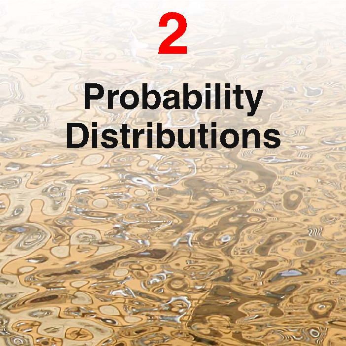
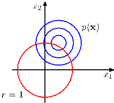
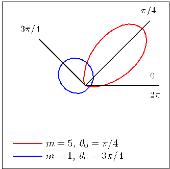
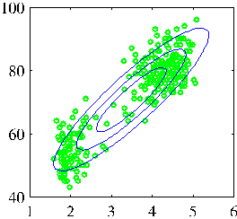
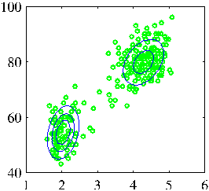
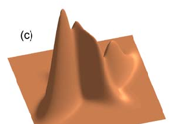

[Page 87]

# 2. Probability Distributions

In Chapter 1, we emphasized the central role played by probability theory in the solution of pattern recognition problems. We turn now to an exploration of some particular examples of probability distributions and their properties. As well as being of great interest in their own right, these distributions can form building blocks for more complex models and will be used extensively throughout the book. The distributions introduced in this chapter will also serve another important purpose, namely to provide us with the opportunity to discuss some key statistical concepts, such as Bayesian inference, in the context of simple models before we encounter them in more complex situations in later chapters.

One role for the distributions discussed in this chapter is to model the probability distribution $p(x)$ of a random variable $x$, given a finite set $x_1, \dots, x_N$ of observations. This problem is known as density estimation. For the purposes of this chapter, we shall assume that the data points are independent and identically distributed. It should be emphasized that the problem of density estimation is fun-
[Page 88]

damentally ill-posed, because there are infinitely many probability distributions that could have given rise to the observed finite data set. Indeed, any distribution $p(\mathbf{x})$ that is nonzero at each of the data points $\mathbf{x}_1, \ldots, \mathbf{x}_N$ is a potential candidate. The issue of choosing an appropriate distribution relates to the problem of model selection that has already been encountered in the context of polynomial curve fitting in Chapter 1 and that is a central issue in pattern recognition.

We begin by considering the binomial and multinomial distributions for discrete random variables and the Gaussian distribution for continuous random variables. These are specific examples of parametric distributions, so-called because they are governed by a small number of adaptive parameters, such as the mean and variance in the case of a Gaussian for example. To apply such models to the problem of density estimation, we need a procedure for determining suitable values for the parameters, given an observed data set. In a frequentist treatment, we choose specific values for the parameters by optimizing some criterion, such as the likelihood function. By contrast, in a Bayesian treatment we introduce prior distributions over the parameters and then use Bayes' theorem to compute the corresponding posterior distribution given the observed data.

We shall see that an important role is played by conjugate priors, that lead to posterior distributions having the same functional form as the prior, and that therefore lead to a greatly simplified Bayesian analysis. For example, the conjugate prior for the parameters of the multinomial distribution is called the Dirichlet distribution, while the conjugate prior for the mean of a Gaussian is another Gaussian. All of these distributions are examples of the exponential family of distributions, which possess a number of important properties, and which will be discussed in some detail.

One limitation of the parametric approach is that it assumes a specific functional form for the distribution, which may turn out to be inappropriate for a particular application. An alternative approach is given by nonparametric density estimation methods in which the form of the distribution typically depends on the size of the data set. Such models still contain parameters, but these control the model complexity rather than the form of the distribution. We end this chapter by considering three nonparametric methods based respectively on histograms, nearest-neighbours, and kernels.

## 2.1. Binary Variables

We begin by considering a single binary random variable $x \in \{0, 1\}$. For example, $x$ might describe the outcome of flipping a coin, with $x = 1$ representing 'heads', and $x = 0$ representing 'tails'. We can imagine that this is a damaged coin so that the probability of landing heads is not necessarily the same as that of landing tails. The probability of $x = 1$ will be denoted by the parameter $\mu$ so that

$$
p(x = 1 \mid \mu) = \mu
\tag{2.1}
$$

[Page 89]

where $0 \le \mu \le 1$, from which it follows that $p(x = 0|\mu) = 1 - \mu$. The probability distribution over $x$ can therefore be written in the form

$$
\text{Bern}(x|\mu) = \mu^x(1 - \mu)^{1-x} \tag{2.2}
$$

which is known as the Bernoulli distribution. It is easily verified that this distribution is normalized and that it has mean and variance given by

$$
\mathbb{E}[x] = \mu \tag{2.3}
$$

$$
\text{var}[x] = \mu(1 - \mu) \tag{2.4}
$$

Now suppose we have a data set $\mathcal{D} = \{x_1, \ldots, x_N\}$ of observed values of $x$. We can construct the likelihood function, which is a function of $\mu$, on the assumption that the observations are drawn independently from $p(x|\mu)$, so that

$$
p(\mathcal{D}|\mu) = \prod_{n=1}^N p(x_n|\mu) = \prod_{n=1}^N \mu^{x_n} (1 - \mu)^{1-x_n} \tag{2.5}
$$

In a frequentist setting, we can estimate a value for $\mu$ by maximizing the likelihood function, or equivalently by maximizing the logarithm of the likelihood. In the case of the Bernoulli distribution, the log likelihood function is given by

$$
\ln p(\mathcal{D}|\mu) = \sum_{n=1}^N \ln p(x_n|\mu) = \sum_{n=1}^N \{x_n \ln \mu + (1 - x_n) \ln(1 - \mu)\} \tag{2.6}
$$

At this point, it is worth noting that the log likelihood function depends on the $N$ observations $x_n$ only through their sum $\sum_n x_n$. This sum provides an example of a sufficient statistic for the data under this distribution, and we shall study the important role of sufficient statistics in some detail. If we set the derivative of $\ln p(\mathcal{D}|\mu)$ with respect to $\mu$ equal to zero, we obtain the maximum likelihood estimator

$$
\mu_{\text{ML}} = \frac{1}{N} \sum_{n=1}^N x_n \tag{2.7}
$$

###### Jacob Bernoulli

###### 1654–1705

Jacob Bernoulli, also known as Jacques or James Bernoulli, was a Swiss mathematician and was the first of many in the Bernoulli family to pursue a career in science and mathematics. Although compelled to study philosophy and theology against his will by his parents, he travelled extensively after graduating in order to meet with many of the leading scientists of his time, including Boyle and Hooke in England. When he returned to Switzerland, he taught mechanics and became Professor of Mathematics at Basel in 1687. Unfortunately, rivalry between Jacob and his younger brother Johann turned an initially productive collaboration into a bitter and public dispute. Jacob’s most significant contributions to mathematics appeared in _The Art of Conjecture_ published in 1713, eight years after his death, which deals with topics in probability theory including what has become known as the Bernoulli distribution.
[Page 90]

Figure 2.1 Histogram plot of the binomial distribution (2.9) as a function of $m$ for $N = 10$ and $\mu = 0.25$.

![The image depicts a bar chart with a categorical scale starting from 0.1 and ending at 10. The x-axis is labeled m and the y-axis is labeled m. The chart is divided into four categories: 0.1, 1, 2, and 3. Each category has a corresponding bar corresponding to it. The bars are color-coded, with the color of the bar corresponding to the category. ### Description of the Chart: - **X-Axis (m):** The x-axis is labeled m and has a categorical scale starting from 0.1 to 10. - **Y-Axis (m):** The y-axis is labeled m and has a categorical scale starting from 0.1 to 10. ### Bar Chart Description: - **Bars:** The chart has four bars. The first bar is labeled 0.1 and is](../Images/imageFile40.png)

which is also known as the sample mean. If we denote the number of observations of $x = 1$ (heads) within this data set by $m$, then we can write (2.7) in the form

$$
\mu_{\text{ML}} = \frac{m}{N}
\tag{2.8}
$$

so that the probability of landing heads is given, in this maximum likelihood framework, by the fraction of observations of heads in the data set.

Now suppose we flip a coin, say, 3 times and happen to observe 3 heads. Then $N = m = 3$ and $\mu_{\text{ML}} = 1$. In this case, the maximum likelihood result would predict that all future observations should give heads. Common sense tells us that this is unreasonable, and in fact this is an extreme example of the over-fitting associated with maximum likelihood. We shall see shortly how to arrive at more sensible conclusions through the introduction of a prior distribution over $\mu$.

We can also work out the distribution of the number $m$ of observations of $x = 1$, given that the data set has size $N$. This is called the binomial distribution, and from (2.5) we see that it is proportional to $\mu^m(1 - \mu)^{N-m}$. In order to obtain the normalization coefficient we note that out of $N$ coin flips, we have to add up all of the possible ways of obtaining $m$ heads, so that the binomial distribution can be written

$$
\text{Bin}(m|N,\mu) = \binom{N}{m} \mu^m (1 - \mu)^{N-m}
\tag{2.9}
$$

where

$$
\binom{N}{m} \equiv \frac{N!}{(N - m)!m!}
\tag{2.10}
$$

is the number of ways of choosing $m$ objects out of a total of $N$ identical objects. Figure 2.1 shows a plot of the binomial distribution for $N = 10$ and $\mu = 0.25$.

The mean and variance of the binomial distribution can be found by using the result of Exercise 1.10, which shows that for independent events the mean of the sum is the sum of the means, and the variance of the sum is the sum of the variances. Because $m = x_1 + \dots + x_N$, and for each observation the mean and variance are
[Page 91]

given by (2.3) and (2.4), respectively, we have

$$
\mathbb{E}[m] \equiv \sum_{m=0}^{N} m \text{Bin}(m|N,\mu) = N\mu \tag{2.11}
$$

$$
\text{var}[m] \equiv \sum_{m=0}^{N} (m - \mathbb{E}[m])^2 \text{Bin}(m|N,\mu) = N\mu(1-\mu). \tag{2.12}
$$

These results can also be proved directly using calculus.

### 2.1.1 The beta distribution

We have seen in (2.8) that the maximum likelihood setting for the parameter $\mu$ in the Bernoulli distribution, and hence in the binomial distribution, is given by the fraction of the observations in the data set having $x = 1$. As we have already noted, this can give severely over-fitted results for small data sets. In order to develop a Bayesian treatment for this problem, we need to introduce a prior distribution $p(\mu)$ over the parameter $\mu$. Here we consider a form of prior distribution that has a simple interpretation as well as some useful analytical properties. To motivate this prior, we note that the likelihood function takes the form of the product of factors of the form $\mu^x(1 - \mu)^{1-x}$. If we choose a prior to be proportional to powers of $\mu$ and $(1 - \mu)$, then the posterior distribution, which is proportional to the product of the prior and the likelihood function, will have the same functional form as the prior. This property is called conjugacy and we will see several examples of it later in this chapter. We therefore choose a prior, called the beta distribution, given by

$$
\text{Beta}(\mu|a,b) = \frac{\Gamma(a+b)}{\Gamma(a)\Gamma(b)} \mu^{a-1}(1-\mu)^{b-1} \tag{2.13}
$$

where $\Gamma(x)$ is the gamma function defined by (1.141), and the coefficient in (2.13) ensures that the beta distribution is normalized, so that

$$
\int_{0}^{1} \text{Beta}(\mu|a,b) \mathrm{d}\mu = 1. \tag{2.14}
$$

The mean and variance of the beta distribution are given by

$$
\mathbb{E}[\mu] = \frac{a}{a+b} \tag{2.15}
$$

$$
\text{var}[\mu] = \frac{ab}{(a+b)^2(a+b+1)}. \tag{2.16}
$$

The parameters $a$ and $b$ are often called hyperparameters because they control the distribution of the parameter $\mu$. Figure 2.2 shows plots of the beta distribution for various values of the hyperparameters.

The posterior distribution of $\mu$ is now obtained by multiplying the beta prior (2.13) by the binomial likelihood function (2.9) and normalizing. Keeping only the factors that depend on $\mu$, we see that this posterior distribution has the form

$$
p(\mu|m,l,a,b) \propto \mu^{m+a-1}(1-\mu)^{l+b-1} \tag{2.17}
$$

[Page 92]

Figure 2.2 Plots of the beta distribution $\text{Beta}(\mu|a, b)$ given by (2.13) as a function of $\mu$ for various values of the hyperparameters $a$ and $b$.

where $l = N - m$, and therefore corresponds to the number of ‘tails’ in the coin example. We see that (2.17) has the same functional dependence on $\mu$ as the prior distribution, reflecting the conjugacy properties of the prior with respect to the likelihood function. Indeed, it is simply another beta distribution, and its normalization coefficient can therefore be obtained by comparison with (2.13) to give

$$
p(\mu|m, l, a, b) = \frac{\Gamma(m + a + l + b)}{\Gamma(m + a)\Gamma(l + b)} \mu^{m+a-1}(1 - \mu)^{l+b-1}. \tag{2.18}
$$

We see that the effect of observing a data set of $m$ observations of $x = 1$ and $l$ observations of $x = 0$ has been to increase the value of $a$ by $m$, and the value of $b$ by $l$, in going from the prior distribution to the posterior distribution. This allows us to provide a simple interpretation of the hyperparameters $a$ and $b$ in the prior as an effective number of observations of $x = 1$ and $x = 0$, respectively. Note that $a$ and $b$ need not be integers. Furthermore, the posterior distribution can act as the prior if we subsequently observe additional data. To see this, we can imagine taking observations one at a time and after each observation updating the current posterior
[Page 93]

![The image consists of a graph with two axes labeled as prior and posterior. The graph is a line graph with a horizontal axis labeled as time and a vertical axis labeled as posterior. The graph shows a downward trend, indicating that the likelihood function is decreasing over time. The line is drawn from the bottom left to the top right of the graph. The graph has two peaks on the horizontal axis, labeled as prior and posterior. The line is drawn from the bottom left to the top right of the graph. The line is a straight line, with a slight curve at the top. The graph also has two peaks on the vertical axis, labeled as posterior and posterior_likelihood. The line is drawn from the bottom left to the top right of the graph. The line is a straight line, with a slight curve at the top. The graph also has two peaks on the horizontal axis,](../Images/imageFile42.png)

Figure 2.3 Illustration of one step of sequential Bayesian inference. The prior is given by a beta distribution with parameters $a = 2$, $b = 2$, and the likelihood function, given by (2.9) with $N = m = 1$, corresponds to a single observation of $x = 1$, so that the posterior is given by a beta distribution with parameters $a = 3$, $b = 2$.

distribution by multiplying by the likelihood function for the new observation and then normalizing to obtain the new, revised posterior distribution. At each stage, the posterior is a beta distribution with some total number of (prior and actual) observed values for $x = 1$ and $x = 0$ given by the parameters $a$ and $b$. Incorporation of an additional observation of $x = 1$ simply corresponds to incrementing the value of $a$ by $1$, whereas for an observation of $x = 0$ we increment $b$ by $1$. Figure 2.3 illustrates one step in this process.

We see that this sequential approach to learning arises naturally when we adopt a Bayesian viewpoint. It is independent of the choice of prior and of the likelihood function and depends only on the assumption of i.i.d. data. Sequential methods make use of observations one at a time, or in small batches, and then discard them before the next observations are used. They can be used, for example, in real-time learning scenarios where a steady stream of data is arriving, and predictions must be made before all of the data is seen. Because they do not require the whole data set to be stored or loaded into memory, sequential methods are also useful for large data sets.

Section 2.3.5 Maximum likelihood methods can also be cast into a sequential framework.

If our goal is to predict, as best we can, the outcome of the next trial, then we must evaluate the predictive distribution of $x$, given the observed data set $\mathcal{D}$. From the sum and product rules of probability, this takes the form

$$
p(x = 1|\mathcal{D}) = \int_{0}^{1} p(x = 1|\mu)p(\mu|\mathcal{D}) \text{d}\mu = \int_{0}^{1} \mu p(\mu|\mathcal{D}) \text{d}\mu = \mathbb{E}[\mu|\mathcal{D}]. \tag{2.19}
$$

Using the result (2.18) for the posterior distribution $p(\mu|\mathcal{D})$, together with the result (2.15) for the mean of the beta distribution, we obtain

$$
p(x = 1|\mathcal{D}) = \frac{m + a}{m + a + l + b} \tag{2.20}
$$

which has a simple interpretation as the total fraction of observations (both real observations and fictitious prior observations) that correspond to $x = 1$. Note that in the limit of an infinitely large data set $m, l \to \infty$ the result (2.20) reduces to the maximum likelihood result (2.8). As we shall see, it is a very general property that the Bayesian and maximum likelihood results will agree in the limit of an infinitely
[Page 94]

large data set. For a finite data set, the posterior mean for $\mu$ always lies between the prior mean and the maximum likelihood estimate for $\mu$ corresponding to the relative frequencies of events given by (2.7). From Figure 2.2, we see that as the number of observations increases, so the posterior distribution becomes more sharply peaked. This can also be seen from the result (2.16) for the variance of the beta distribution, in which we see that the variance goes to zero for $a \to \infty$ or $b \to \infty$. In fact, we might wonder whether it is a general property of Bayesian learning that, as we observe more and more data, the uncertainty represented by the posterior distribution will steadily decrease.

To address this, we can take a frequentist view of Bayesian learning and show that, on average, such a property does indeed hold. Consider a general Bayesian inference problem for a parameter $\theta$ for which we have observed a data set $\mathcal{D}$, described by the joint distribution $p(\theta, \mathcal{D})$. The following result

$$
\mathbb{E}_{\theta}[\theta] = \mathbb{E}_{\mathcal{D}}[\mathbb{E}_{\theta}[\theta|\mathcal{D}]] \tag{2.21}
$$

where

$$
\mathbb{E}_{\theta}[\theta] \equiv \int p(\theta)\theta \, d\theta \tag{2.22}
$$

$$
\mathbb{E}_{\mathcal{D}}[\mathbb{E}_{\theta}[\theta|\mathcal{D}]] \equiv \int \left\{ \int \theta p(\theta|\mathcal{D}) \, d\theta \right\} p(\mathcal{D}) \, d\mathcal{D} \tag{2.23}
$$

says that the posterior mean of $\theta$, averaged over the distribution generating the data, is equal to the prior mean of $\theta$. Similarly, we can show that

$$
\operatorname{var}_{\theta}[\theta] = \mathbb{E}_{\mathcal{D}}[\operatorname{var}_{\theta}[\theta|\mathcal{D}]] + \operatorname{var}_{\mathcal{D}}[\mathbb{E}_{\theta}[\theta|\mathcal{D}]]. \tag{2.24}
$$

The term on the left-hand side of (2.24) is the prior variance of $\theta$. On the righthand side, the first term is the average posterior variance of $\theta$, and the second term measures the variance in the posterior mean of $\theta$. Because this variance is a positive quantity, this result shows that, on average, the posterior variance of $\theta$ is smaller than the prior variance. The reduction in variance is greater if the variance in the posterior mean is greater. Note, however, that this result only holds on average, and that for a particular observed data set it is possible for the posterior variance to be larger than the prior variance.

## 2.2. Multinomial Variables

Binary variables can be used to describe quantities that can take one of two possible values. Often, however, we encounter discrete variables that can take on one of $K$ possible mutually exclusive states. Although there are various alternative ways to express such variables, we shall see shortly that a particularly convenient representation is the 1-of-$K$ scheme in which the variable is represented by a $K$-dimensional vector $\mathbf{x}$ in which one of the elements $x_k$ equals $1$, and all remaining elements equal
[Page 95]

0. So, for instance if we have a variable that can take $K = 6$ states and a particular observation of the variable happens to correspond to the state where $x_3 = 1$, then $\mathbf{x}$ will be represented by

$$
\mathbf{x} = (0,0,1,0,0,0)^T. \tag{2.25}
$$

Note that such vectors satisfy $\sum_{k=1}^K x_k = 1$. If we denote the probability of $x_k = 1$ by the parameter $\mu_k$, then the distribution of $\mathbf{x}$ is given

$$
p(\mathbf{x}|\boldsymbol{\mu}) = \prod_{k=1}^K \mu_k^{x_k} \tag{2.26}
$$

where $\boldsymbol{\mu} = (\mu_1,\ldots,\mu_K)^T$, and the parameters $\mu_k$ are constrained to satisfy $\mu_k \ge 0$ and $\sum_k \mu_k = 1$, because they represent probabilities. The distribution (2.26) can be regarded as a generalization of the Bernoulli distribution to more than two outcomes. It is easily seen that the distribution is normalized

$$
\sum_{\mathbf{x}} p(\mathbf{x}|\boldsymbol{\mu}) = \sum_{k=1}^K \mu_k = 1 \tag{2.27}
$$

and that

$$
\mathbb{E}[\mathbf{x}|\boldsymbol{\mu}] = \sum_{\mathbf{x}} p(\mathbf{x}|\boldsymbol{\mu})\mathbf{x} = (\mu_1,\ldots,\mu_M)^T = \boldsymbol{\mu}. \tag{2.28}
$$

Now consider a data set $\mathcal{D}$ of $N$ independent observations $\mathbf{x}_1,\ldots,\mathbf{x}_N$. The corresponding likelihood function takes the form

$$
p(\mathcal{D}|\boldsymbol{\mu}) = \prod_{n=1}^N \prod_{k=1}^K \mu_k^{x_{nk}} = \prod_{k=1}^K \mu_k^{(\sum_n x_{nk})} = \prod_{k=1}^K \mu_k^{m_k}. \tag{2.29}
$$

We see that the likelihood function depends on the $N$ data points only through the $K$ quantities

$$
m_k = \sum_n x_{nk} \tag{2.30}
$$

which represent the number of observations of $x_k = 1$. These are called the sufficient statistics for this distribution.

In order to find the maximum likelihood solution for $\boldsymbol{\mu}$, we need to maximize $\ln p(\mathcal{D}|\boldsymbol{\mu})$ with respect to $\mu_k$ taking account of the constraint that the $\mu_k$ must sum to one. This can be achieved using a Lagrange multiplier $\lambda$ and maximizing

$$
\sum_{k=1}^K m_k \ln \mu_k + \lambda \left( \sum_{k=1}^K \mu_k - 1 \right). \tag{2.31}
$$

Setting the derivative of (2.31) with respect to $\mu_k$ to zero, we obtain

$$
\mu_k = -m_k/\lambda. \tag{2.32}
$$

[Page 96]

We can solve for the Lagrange multiplier $\lambda$ by substituting (2.32) into the constraint $\sum_k \mu_k = 1$ to give $\lambda = -N$. Thus we obtain the maximum likelihood solution in the form

$$
\mu_k^{\text{ML}} = \frac{m_k}{N} \tag{2.33}
$$

which is the fraction of the $N$ observations for which $x_k = 1$.

We can consider the joint distribution of the quantities $m_1, \ldots, m_K$, conditioned on the parameters $\boldsymbol{\mu}$ and on the total number $N$ of observations. From (2.29) this takes the form

$$
\text{Mult}(m_1, m_2, \ldots, m_K | \boldsymbol{\mu}, N) = \binom{N}{m_1 m_2 \ldots m_K} \prod_{k=1}^{K} \mu_k^{m_k} \tag{2.34}
$$

which is known as the multinomial distribution. The normalization coefficient is the number of ways of partitioning $N$ objects into $K$ groups of size $m_1, \ldots, m_K$ and is given by

$$
\binom{N}{m_1 m_2 \ldots m_K} = \frac{N!}{m_1! m_2! \ldots m_K!} . \tag{2.35}
$$

Note that the variables $m_k$ are subject to the constraint

$$
\sum_{k=1}^{K} m_k = N . \tag{2.36}
$$

### 2.2.1 The Dirichlet distribution

We now introduce a family of prior distributions for the parameters $\{\mu_k\}$ of the multinomial distribution (2.34). By inspection of the form of the multinomial distribution, we see that the conjugate prior is given by

$$
p(\boldsymbol{\mu}|\boldsymbol{\alpha}) \propto \prod_{k=1}^{K} \mu_k^{\alpha_k - 1} \tag{2.37}
$$

where $0 \le \mu_k \le 1$ and $\sum_k \mu_k = 1$. Here $\alpha_1, \ldots, \alpha_K$ are the parameters of the distribution, and $\boldsymbol{\alpha}$ denotes $(\alpha_1, \ldots, \alpha_K)^{\text{T}}$. Note that, because of the summation constraint, the distribution over the space of the $\{\mu_k\}$ is confined to a simplex of dimensionality $K - 1$, as illustrated for $K = 3$ in Figure 2.4.

The normalized form for this distribution is by

$$
\text{Dir}(\boldsymbol{\mu}|\boldsymbol{\alpha}) = \frac{\Gamma(\alpha_0)}{\Gamma(\alpha_1) \cdots \Gamma(\alpha_K)} \prod_{k=1}^{K} \mu_k^{\alpha_k - 1} \tag{2.38}
$$

which is called the Dirichlet distribution. Here $\Gamma(x)$ is the gamma function defined by (1.141) while

$$
\alpha_0 = \sum_{k=1}^{K} \alpha_k . \tag{2.39}
$$

[Page 97]

Figure 2.4 The Dirichlet distribution over three variables $\mu_1, \mu_2, \mu_3$ is confined to a simplex (a bounded linear manifold) of the form shown, as a consequence of the constraints $0 \leqslant \mu_k \leqslant 1$ and $\sum_k \mu_k = 1$.

Plots of the Dirichlet distribution over the simplex, for various settings of the parameters $\alpha_k$, are shown in Figure 2.5.

Multiplying the prior (2.38) by the likelihood function (2.34), we obtain the posterior distribution for the parameters $\{\mu_k\}$ in the form

$$
p(\boldsymbol{\mu}|\mathcal{D}, \boldsymbol{\alpha}) \propto p(\mathcal{D}|\boldsymbol{\mu})p(\boldsymbol{\mu}|\boldsymbol{\alpha}) \propto \prod_{k=1}^{K} \mu_k^{\alpha_k + m_k - 1} \tag{2.40}
$$

We see that the posterior distribution again takes the form of a Dirichlet distribution, confirming that the Dirichlet is indeed a conjugate prior for the multinomial. This allows us to determine the normalization coefficient by comparison with (2.38) so that

$$
\begin{aligned}
p(\boldsymbol{\mu}|\mathcal{D}, \boldsymbol{\alpha}) &= \text{Dir}(\boldsymbol{\mu}|\boldsymbol{\alpha} + \mathbf{m}) \\
&= \frac{\Gamma(\alpha_0 + N)}{\Gamma(\alpha_1 + m_1) \cdots \Gamma(\alpha_K + m_K)} \prod_{k=1}^{K} \mu_k^{\alpha_k + m_k - 1}
\end{aligned} \tag{2.41}
$$

where we have denoted $\mathbf{m} = (m_1, \ldots, m_K)^{\text{T}}$. As for the case of the binomial distribution with its beta prior, we can interpret the parameters $\alpha_k$ of the Dirichlet prior as an effective number of observations of $x_k = 1$.

Note that two-state quantities can either be represented as binary variables and

###### Lejeune Dirichlet

###### 1805–1859

Johann Peter Gustav Lejeune Dirichlet was a modest and reserved mathematician who made contributions in number theory, mechanics, and astronomy, and who gave the first rigorous analysis of Fourier series. His family originated from Richelet in Belgium, and the name Lejeune Dirichlet comes from ‘le jeune de Richelet’ (the young person from Richelet). Dirichlet’s first paper, which was published in 1825, brought him instant fame. It concerned Fermat’s last theorem, which claims that there are no positive integer solutions to $x^n + y^n = z^n$ for $n > 2$. Dirichlet gave a partial proof for the case $n = 5$, which was sent to Legendre for review and who in turn completed the proof. Later, Dirichlet gave a complete proof for $n = 14$, although a full proof of Fermat’s last theorem for arbitrary $n$ had to wait until the work of Andrew Wiles in the closing years of the 20th century.
[Page 98]

78 2. PROBABILITY DISTRIBUTIONS

Figure 2.5 Plots of the Dirichlet distribution over three variables, where the two horizontal axes are coordinates in the plane of the simplex and the vertical axis corresponds to the value of the density. Here $\{\alpha_k\} = 0.1$ on the left plot, $\{\alpha_k\} = 1$ in the centre plot, and $\{\alpha_k\} = 10$ in the right plot.

modelled using the binomial distribution (2.9) or as 1-of-2 variables and modelled using the multinomial distribution (2.34) with $K = 2$.

### 2.3. The Gaussian Distribution

The Gaussian, also known as the normal distribution, is a widely used model for the distribution of continuous variables. In the case of a single variable $x$, the Gaussian distribution can be written in the form

$$
\mathcal{N}(x|\mu, \sigma^2) = \frac{1}{(2\pi\sigma^2)^{1/2}} \exp\left\{ -\frac{1}{2\sigma^2}(x - \mu)^2 \right\} \tag{2.42}
$$

where $\mu$ is the mean and $\sigma^2$ is the variance. For a $D$-dimensional vector $\mathbf{x}$, the multivariate Gaussian distribution takes the form

$$
\mathcal{N}(\mathbf{x}|\boldsymbol{\mu}, \boldsymbol{\Sigma}) = \frac{1}{(2\pi)^{D/2}} \frac{1}{|\boldsymbol{\Sigma}|^{1/2}} \exp\left\{ -\frac{1}{2}(\mathbf{x} - \boldsymbol{\mu})^T \boldsymbol{\Sigma}^{-1} (\mathbf{x} - \boldsymbol{\mu}) \right\} \tag{2.43}
$$

where $\boldsymbol{\mu}$ is a $D$-dimensional mean vector, $\boldsymbol{\Sigma}$ is a $D \times D$ covariance matrix, and $|\boldsymbol{\Sigma}|$ denotes the determinant of $\boldsymbol{\Sigma}$.

The Gaussian distribution arises in many different contexts and can be motivated from a variety of different perspectives. For example, we have already seen that for a single real variable, the distribution that maximizes the entropy is the Gaussian. This property applies also to the multivariate Gaussian.

Another situation in which the Gaussian distribution arises is when we consider the sum of multiple random variables. The central limit theorem (due to Laplace) tells us that, subject to certain mild conditions, the sum of a set of random variables, which is of course itself a random variable, has a distribution that becomes increasingly Gaussian as the number of terms in the sum increases (Walker, 1969). We can
[Page 99]

Figure 2.6 Histogram plots of the mean of $N$ uniformly distributed numbers for various values of $N$. We observe that as $N$ increases, the distribution tends towards a Gaussian.

illustrate this by considering $N$ variables $x_1, \ldots, x_N$ each of which has a uniform distribution over the interval $[0, 1]$ and then considering the distribution of the mean $(x_1 + \cdots + x_N) / N$. For large $N$, this distribution tends to a Gaussian, as illustrated in Figure 2.6. In practice, the convergence to a Gaussian as $N$ increases can be very rapid. One consequence of this result is that the binomial distribution (2.9), which is a distribution over $m$ defined by the sum of $N$ observations of the random binary variable $x$, will tend to a Gaussian as $N \to \infty$ (see Figure 2.1 for the case of $N = 10$).

The Gaussian distribution has many important analytical properties, and we shall consider several of these in detail. As a result, this section will be rather more technically involved than some of the earlier sections, and will require familiarity with various matrix identities. However, we strongly encourage the reader to become proficient in manipulating Gaussian distributions using the techniques presented here as this will prove invaluable in understanding the more complex models presented in later chapters.

We begin by considering the geometrical form of the Gaussian distribution. The

###### Carl Friedrich Gauss 1777–1855

It is said that when Gauss went to elementary school at age 7, his teacher Büttner, trying to keep the class occupied, asked the pupils to sum the integers from 1 to 100. To the teacher's amazement, Gauss arrived at the answer in a matter of moments by noting that the sum can be represented as 50 pairs ($1 + 100$, $2 + 99$, etc.) each of which added to 101, giving the answer 5,050. It is now believed that the problem which was actually set was of the same form but somewhat harder in that the sequence had a larger starting value and a larger increment. Gauss was a German mathematician and scientist with a reputation for being a hard-working perfectionist. One of his many contributions was to show that least squares can be derived under the assumption of normally distributed errors. He also created an early formulation of non-Euclidean geometry (a self-consistent geometrical theory that violates the axioms of Euclid) but was reluctant to discuss it openly for fear that his reputation might suffer if it were seen that he believed in such a geometry. At one point, Gauss was asked to conduct a geodetic survey of the state of Hanover, which led to his formulation of the normal distribution, now also known as the Gaussian. After his death, a study of his diaries revealed that he had discovered several important mathematical results years or even decades before they were published by others.
[Page 100]

functional dependence of the Gaussian on $\mathbf{x}$ is through the quadratic form

$$
\Delta^2 = (\mathbf{x} - \boldsymbol{\mu})^T \boldsymbol{\Sigma}^{-1} (\mathbf{x} - \boldsymbol{\mu}) \tag{2.44}
$$

which appears in the exponent. The quantity $\Delta$ is called the Mahalanobis distance from $\boldsymbol{\mu}$ to $\mathbf{x}$ and reduces to the Euclidean distance when $\boldsymbol{\Sigma}$ is the identity matrix. The Gaussian distribution will be constant on surfaces in $\mathbf{x}$-space for which this quadratic form is constant.

First of all, we note that the matrix $\boldsymbol{\Sigma}$ can be taken to be symmetric, without loss of generality, because any antisymmetric component would disappear from the exponent. Now consider the eigenvector equation for the covariance matrix

$$
\boldsymbol{\Sigma} \mathbf{u}_i = \lambda_i \mathbf{u}_i \tag{2.45}
$$

where $i = 1, \ldots, D$. Because $\boldsymbol{\Sigma}$ is a real, symmetric matrix its eigenvalues will be real, and its eigenvectors can be chosen to form an orthonormal set, so that

$$
\mathbf{u}_i^T \mathbf{u}_j = I_{ij} \tag{2.46}
$$

where $I_{ij}$ is the $i,j$ element of the identity matrix and satisfies

$$
I_{ij} = \begin{cases} 1, & \text{if } i = j \\ 0, & \text{otherwise.} \end{cases} \tag{2.47}
$$

The covariance matrix $\boldsymbol{\Sigma}$ can be expressed as an expansion in terms of its eigenvectors in the form

$$
\boldsymbol{\Sigma} = \sum_{i=1}^D \lambda_i \mathbf{u}_i \mathbf{u}_i^T \tag{2.48}
$$

and similarly the inverse covariance matrix $\boldsymbol{\Sigma}^{-1}$ can be expressed as

$$
\boldsymbol{\Sigma}^{-1} = \sum_{i=1}^D \frac{1}{\lambda_i} \mathbf{u}_i \mathbf{u}_i^T . \tag{2.49}
$$

Substituting (2.49) into (2.44), the quadratic form becomes

$$
\Delta^2 = \sum_{i=1}^D \frac{y_i^2}{\lambda_i} \tag{2.50}
$$

where we have defined

$$
y_i = \mathbf{u}_i^T (\mathbf{x} - \boldsymbol{\mu}) . \tag{2.51}
$$

We can interpret $\{y_i\}$ as a new coordinate system defined by the orthonormal vectors $\mathbf{u}_i$ that are shifted and rotated with respect to the original $x_i$ coordinates. Forming the vector $\mathbf{y} = (y_1, \ldots, y_D)^T$, we have

$$
\mathbf{y} = \mathbf{U}(\mathbf{x} - \boldsymbol{\mu}) \tag{2.52}
$$

[Page 101]

Figure 2.7 The red curve shows the elliptical surface of constant probability density for a Gaussian in a two-dimensional space $\mathbf{x} = (x_1, x_2)$ on which the density is $\exp(-1/2)$ of its value at $\mathbf{x} = \boldsymbol{\mu}$. The major axes of the ellipse are defined by the eigenvectors $\mathbf{u}_i$ of the covariance matrix, with corresponding eigenvalues $\lambda_i$.

![The image depicts a geometric figure with several points and lines. Here is a detailed description of the objects present in the image: 1. **Points and Lines**: - **Points**: There are four points labeled as ( u_1, u_2, u_3, u_4 ). - **Lines**: There are two lines: - **Line ( u_1 )**: This line is drawn from point ( u_1 ) to point ( u_2 ). - **Line ( u_2 )**: This line is drawn from point ( u_2 ) to point ( u_3 ). - **Line ( u_3 )**: This line is drawn from point ( u_3 ) to point ( u_4 ). - **Line ( u_4 )**: This line is drawn from point ( u_4 )](../Images/imageFile48.png)

where $\mathbf{U}$ is a matrix whose rows are given by $\mathbf{u}_i^{\mathrm{T}}$. From (2.46) it follows that $\mathbf{U}$ is an orthogonal matrix, i.e., it satisfies $\mathbf{U}\mathbf{U}^{\mathrm{T}} = \mathbf{I}$, and hence also $\mathbf{U}^{\mathrm{T}}\mathbf{U} = \mathbf{I}$, where $\mathbf{I}$ is the identity matrix.

The quadratic form, and hence the Gaussian density, will be constant on surfaces for which (2.51) is constant. If all of the eigenvalues $\lambda_i$ are positive, then these surfaces represent ellipsoids, with their centres at $\boldsymbol{\mu}$ and their axes oriented along $\mathbf{u}_i$, and with scaling factors in the directions of the axes given by $\lambda_i^{1/2}$, as illustrated in Figure 2.7.

For the Gaussian distribution to be well defined, it is necessary for all of the eigenvalues $\lambda_i$ of the covariance matrix to be strictly positive, otherwise the distribution cannot be properly normalized. A matrix whose eigenvalues are strictly positive is said to be positive definite. In Chapter 12, we will encounter Gaussian distributions for which one or more of the eigenvalues are zero, in which case the distribution is singular and is confined to a subspace of lower dimensionality. If all of the eigenvalues are nonnegative, then the covariance matrix is said to be positive semidefinite.

Now consider the form of the Gaussian distribution in the new coordinate system defined by the $y_i$. In going from the $\mathbf{x}$ to the $\mathbf{y}$ coordinate system, we have a Jacobian matrix $\mathbf{J}$ with elements given by

$$
J_{ij} = \frac{\partial x_i}{\partial y_j} = U_{ji}
\tag{2.53}
$$

where $U_{ji}$ are the elements of the matrix $\mathbf{U}^{\mathrm{T}}$. Using the orthonormality property of the matrix $\mathbf{U}$, we see that the square of the determinant of the Jacobian matrix is

$$
|\mathbf{J}|^2 = |\mathbf{U}^{\mathrm{T}}|^2 = |\mathbf{U}^{\mathrm{T}}||\mathbf{U}| = |\mathbf{U}^{\mathrm{T}}\mathbf{U}| = |\mathbf{I}| = 1
\tag{2.54}
$$

and hence $|\mathbf{J}| = 1$. Also, the determinant $|\boldsymbol{\Sigma}|$ of the covariance matrix can be written
[Page 102]

as the product of its eigenvalues, and hence

$$
|\Sigma|^{1/2} = \prod_{j=1}^{D} \lambda_j^{1/2} \tag{2.55}
$$

Thus in the $y_j$ coordinate system, the Gaussian distribution takes the form

$$
p(\mathbf{y}) = p(\mathbf{x})|J| = \prod_{j=1}^{D} \frac{1}{(2\pi\lambda_j)^{1/2}} \exp\left\{ -\frac{y_j^2}{2\lambda_j} \right\} \tag{2.56}
$$

which is the product of $D$ independent univariate Gaussian distributions. The eigenvectors therefore define a new set of shifted and rotated coordinates with respect to which the joint probability distribution factorizes into a product of independent distributions. The integral of the distribution in the $\mathbf{y}$ coordinate system is then

$$
\int p(\mathbf{y}) \, d\mathbf{y} = \prod_{j=1}^{D} \int_{-\infty}^{\infty} \frac{1}{(2\pi\lambda_j)^{1/2}} \exp\left\{ -\frac{y_j^2}{2\lambda_j} \right\} \, dy_j = 1 \tag{2.57}
$$

where we have used the result (1.48) for the normalization of the univariate Gaussian. This confirms that the multivariate Gaussian (2.43) is indeed normalized.

We now look at the moments of the Gaussian distribution and thereby provide an interpretation of the parameters $\boldsymbol{\mu}$ and $\Sigma$. The expectation of $\mathbf{x}$ under the Gaussian distribution is given by

$$
\begin{aligned}
\mathbb{E}[\mathbf{x}] &= \frac{1}{(2\pi)^{D/2}} \frac{1}{|\Sigma|^{1/2}} \int \exp\left\{ -\frac{1}{2}(\mathbf{x} - \boldsymbol{\mu})^T \Sigma^{-1} (\mathbf{x} - \boldsymbol{\mu}) \right\} \mathbf{x} \, d\mathbf{x} \\
&= \frac{1}{(2\pi)^{D/2}} \frac{1}{|\Sigma|^{1/2}} \int \exp\left\{ -\frac{1}{2}\mathbf{z}^T \Sigma^{-1} \mathbf{z} \right\} (\mathbf{z} + \boldsymbol{\mu}) \, d\mathbf{z}
\end{aligned} \tag{2.58}
$$

where we have changed variables using $\mathbf{z} = \mathbf{x} - \boldsymbol{\mu}$. We now note that the exponent is an even function of the components of $\mathbf{z}$ and, because the integrals over these are taken over the range $(-\infty, \infty)$, the term in $\mathbf{z}$ in the factor $(\mathbf{z} + \boldsymbol{\mu})$ will vanish by symmetry. Thus

$$
\mathbb{E}[\mathbf{x}] = \boldsymbol{\mu} \tag{2.59}
$$

and so we refer to $\boldsymbol{\mu}$ as the mean of the Gaussian distribution.

We now consider second order moments of the Gaussian. In the univariate case, we considered the second order moment given by $\mathbb{E}[x^2]$. For the multivariate Gaussian, there are $D^2$ second order moments given by $\mathbb{E}[x_i x_j]$, which we can group together to form the matrix $\mathbb{E}[\mathbf{x}\mathbf{x}^T]$. This matrix can be written as

$$
\begin{aligned}
\mathbb{E}[\mathbf{x}\mathbf{x}^T] &= \frac{1}{(2\pi)^{D/2}} \frac{1}{|\Sigma|^{1/2}} \int \exp\left\{ -\frac{1}{2}(\mathbf{x} - \boldsymbol{\mu})^T \Sigma^{-1} (\mathbf{x} - \boldsymbol{\mu}) \right\} \mathbf{x}\mathbf{x}^T \, d\mathbf{x} \\
&= \frac{1}{(2\pi)^{D/2}} \frac{1}{|\Sigma|^{1/2}} \int \exp\left\{ -\frac{1}{2}\mathbf{z}^T \Sigma^{-1} \mathbf{z} \right\} (\mathbf{z} + \boldsymbol{\mu})(\mathbf{z} + \boldsymbol{\mu})^T \, d\mathbf{z}
\end{aligned}
$$

[Page 103]

where again we have changed variables using $\mathbf{z} = \mathbf{x} - \boldsymbol{\mu}$. Note that the cross-terms involving $\boldsymbol{\mu}\mathbf{z}^{\mathrm{T}}$ and $\boldsymbol{\mu}^{\mathrm{T}}\mathbf{z}$ will again vanish by symmetry. The term $\boldsymbol{\mu}\boldsymbol{\mu}^{\mathrm{T}}$ is constant and can be taken outside the integral, which itself is unity because the Gaussian distribution is normalized. Consider the term involving $\mathbf{z}\mathbf{z}^{\mathrm{T}}$. Again, we can make use of the eigenvector expansion of the covariance matrix given by (2.45), together with the completeness of the set of eigenvectors, to write

$$
\mathbf{z} = \sum_{j=1}^{D} y_j \mathbf{u}_j \tag{2.60}
$$

where $y_j = \mathbf{u}_j^{\mathrm{T}}\mathbf{z}$, which gives

$$
\begin{aligned}
&\frac{1}{(2\pi)^{D/2}} \frac{1}{|\boldsymbol{\Sigma}|^{1/2}} \int \exp\left\{ -\frac{1}{2}\mathbf{z}^{\mathrm{T}}\boldsymbol{\Sigma}^{-1}\mathbf{z} \right\} \mathbf{z}\mathbf{z}^{\mathrm{T}} \,\mathrm{d}\mathbf{z} \\
&= \frac{1}{(2\pi)^{D/2}} \frac{1}{|\boldsymbol{\Sigma}|^{1/2}} \sum_{i=1}^{D} \sum_{j=1}^{D} \mathbf{u}_i \mathbf{u}_j^{\mathrm{T}} \int \exp\left\{ -\sum_{k=1}^{D} \frac{y_k^2}{2\lambda_k} \right\} y_i y_j \,\mathrm{d}\mathbf{y} \\
&= \sum_{i=1}^{D} \mathbf{u}_i \mathbf{u}_i^{\mathrm{T}} \lambda_i = \boldsymbol{\Sigma} \tag{2.61}
\end{aligned}
$$

where we have made use of the eigenvector equation (2.45), together with the fact that the integral on the right-hand side of the middle line vanishes by symmetry unless $i = j$, and in the final line we have made use of the results (1.50) and (2.55), together with (2.48). Thus we have

$$
\mathbb{E}[\mathbf{x}\mathbf{x}^{\mathrm{T}}] = \boldsymbol{\mu}\boldsymbol{\mu}^{\mathrm{T}} + \boldsymbol{\Sigma}. \tag{2.62}
$$

For single random variables, we subtracted the mean before taking second moments in order to define a variance. Similarly, in the multivariate case it is again convenient to subtract off the mean, giving rise to the covariance of a random vector $\mathbf{x}$ defined by

$$
\mathrm{cov}[\mathbf{x}] = \mathbb{E}[(\mathbf{x} - \mathbb{E}[\mathbf{x}])(\mathbf{x} - \mathbb{E}[\mathbf{x}])^{\mathrm{T}}]. \tag{2.63}
$$

For the specific case of a Gaussian distribution, we can make use of $\mathbb{E}[\mathbf{x}] = \boldsymbol{\mu}$, together with the result (2.62), to give

$$
\mathrm{cov}[\mathbf{x}] = \boldsymbol{\Sigma}. \tag{2.64}
$$

Because the parameter matrix $\boldsymbol{\Sigma}$ governs the covariance of $\mathbf{x}$ under the Gaussian distribution, it is called the covariance matrix.

Although the Gaussian distribution (2.43) is widely used as a density model, it suffers from some significant limitations. Consider the number of free parameters in the distribution. A general symmetric covariance matrix $\boldsymbol{\Sigma}$ will have $D(D + 1)/2$ independent parameters, and there are another $D$ independent parameters in $\boldsymbol{\mu}$, giving $D(D + 3)/2$ parameters in total. For large $D$, the total number of parameters therefore grows quadratically with $D$, and the computational task of manipulating and inverting large matrices can become prohibitive. One way to address this problem is to use restricted forms of the covariance matrix. If we consider covariance matrices that are diagonal, so that $\boldsymbol{\Sigma} = \mathrm{diag}(\sigma_i^2)$, we then have a total of $2D$ independent parameters in the density model. The corresponding contours of constant density are given by axis-aligned ellipsoids. We could further restrict the covariance matrix to be proportional to the identity matrix, $\boldsymbol{\Sigma} = \sigma^2 \mathbf{I}$, known as an isotropic covariance, giving $D + 1$ independent parameters in the model and spherical surfaces of constant density. The three possibilities of general, diagonal, and isotropic covariance matrices are illustrated in Figure 2.8. Unfortunately, whereas such approaches limit the number of degrees of freedom in the distribution and make inversion of the covariance matrix a much faster operation, they also greatly restrict the form of the probability density and limit its ability to capture interesting correlations in the data.
[Page 104]

![The image depicts a geometric figure with a central circle and several smaller circles. The central circle is a semicircle, and the smaller circles are all radii of the semicircle. The semicircle is divided into two equal halves, and each half is divided into two equal halves. The smaller circles are all radii of the semicircle, and they are all located at the same distance from the center of the semicircle. Here is a detailed description of the image: 1. **Central Circle**: - The central circle is a semicircle. - The semicircle is divided into two equal halves, and each half is divided into two equal halves. 2. **Smaller Circles**: - There are three smaller circles. - The first smaller circle is located at the top left of the semicircle. - The second smaller circle is located at the top right of the semicircle. - The third smaller circle is](../Images/imageFile49.png)

Figure 2.8 Contours of constant probability density for a Gaussian distribution in two dimensions in which the covariance matrix is (a) of general form, (b) diagonal, in which the elliptical contours are aligned with the coordinate axes, and (c) proportional to the identity matrix, in which the contours are concentric circles.

therefore grows quadratically with $D$, and the computational task of manipulating and inverting large matrices can become prohibitive. One way to address this problem is to use restricted forms of the covariance matrix. If we consider covariance matrices that are diagonal, so that $\boldsymbol{\Sigma} = \text{diag}(\sigma_i^2)$, we then have a total of $2D$ independent parameters in the density model. The corresponding contours of constant density are given by axis-aligned ellipsoids. We could further restrict the covariance matrix to be proportional to the identity matrix, $\boldsymbol{\Sigma} = \sigma^2\mathbf{I}$, known as an isotropic covariance, giving $D + 1$ independent parameters in the model and spherical surfaces of constant density. The three possibilities of general, diagonal, and isotropic covariance matrices are illustrated in Figure 2.8. Unfortunately, whereas such approaches limit the number of degrees of freedom in the distribution and make inversion of the covariance matrix a much faster operation, they also greatly restrict the form of the probability density and limit its ability to capture interesting correlations in the data.

A further limitation of the Gaussian distribution is that it is intrinsically unimodal (i.e., has a single maximum) and so is unable to provide a good approximation to multimodal distributions. Thus the Gaussian distribution can be both too flexible, in the sense of having too many parameters, while also being too limited in the range of distributions that it can adequately represent. We will see later that the introduction of latent variables, also called hidden variables or unobserved variables, allows both of these problems to be addressed. In particular, a rich family of multimodal distributions is obtained by introducing discrete latent variables leading to mixtures of Gaussians, as discussed in Section 2.3.9. Similarly, the introduction of continuous latent variables, as described in Chapter 12, leads to models in which the number of free parameters can be controlled independently of the dimensionality $D$ of the data space while still allowing the model to capture the dominant correlations in the data set. Indeed, these two approaches can be combined and further extended to derive a very rich set of hierarchical models that can be adapted to a broad range of practical applications. For instance, the Gaussian version of the Markov random field, which is widely used as a probabilistic model of images, is a Gaussian distribution over the joint space of pixel intensities but rendered tractable through the imposition of considerable structure reflecting the spatial organization of the pixels. Similarly, the linear dynamical system, used to model time series data for applications such as tracking, is also a joint Gaussian distribution over a potentially large number of observed and latent variables and again is tractable due to the structure imposed on the distribution. A powerful framework for expressing the form and properties of
[Page 105]

such complex distributions is that of probabilistic graphical models, which will form the subject of Chapter 8.

### 2.3.1 Conditional Gaussian distributions

An important property of the multivariate Gaussian distribution is that if two sets of variables are jointly Gaussian, then the conditional distribution of one set conditioned on the other is again Gaussian. Similarly, the marginal distribution of either set is also Gaussian.

Consider first the case of conditional distributions. Suppose $\mathbf{x}$ is a $D$-dimensional vector with Gaussian distribution $\mathcal{N}(\mathbf{x}|\boldsymbol{\mu},\mathbf{\Sigma})$ and that we partition $\mathbf{x}$ into two disjoint subsets $\mathbf{x}_a$ and $\mathbf{x}_b$. Without loss of generality, we can take $\mathbf{x}_a$ to form the first $M$ components of $\mathbf{x}$, with $\mathbf{x}_b$ comprising the remaining $D - M$ components, so that

$$
\mathbf{x} = \begin{pmatrix} \mathbf{x}_a \\ \mathbf{x}_b \end{pmatrix} . \tag{2.65}
$$

We also define corresponding partitions of the mean vector $\boldsymbol{\mu}$ given by

$$
\boldsymbol{\mu} = \begin{pmatrix} \boldsymbol{\mu}_a \\ \boldsymbol{\mu}_b \end{pmatrix} \tag{2.66}
$$

and of the covariance matrix $\mathbf{\Sigma}$ given by

$$
\mathbf{\Sigma} = \begin{pmatrix} \mathbf{\Sigma}_{aa} & \mathbf{\Sigma}_{ab} \\ \mathbf{\Sigma}_{ba} & \mathbf{\Sigma}_{bb} \end{pmatrix} . \tag{2.67}
$$

Note that the symmetry $\mathbf{\Sigma}^{\mathrm{T}} = \mathbf{\Sigma}$ of the covariance matrix implies that $\mathbf{\Sigma}_{aa}$ and $\mathbf{\Sigma}_{bb}$ are symmetric, while $\mathbf{\Sigma}_{ba} = \mathbf{\Sigma}_{ab}^{\mathrm{T}}$.

In many situations, it will be convenient to work with the inverse of the covariance matrix

$$
\mathbf{\Lambda} \equiv \mathbf{\Sigma}^{-1} \tag{2.68}
$$

which is known as the precision matrix. In fact, we shall see that some properties of Gaussian distributions are most naturally expressed in terms of the covariance, whereas others take a simpler form when viewed in terms of the precision. We therefore also introduce the partitioned form of the precision matrix

$$
\mathbf{\Lambda} = \begin{pmatrix} \mathbf{\Lambda}_{aa} & \mathbf{\Lambda}_{ab} \\ \mathbf{\Lambda}_{ba} & \mathbf{\Lambda}_{bb} \end{pmatrix} \tag{2.69}
$$

corresponding to the partitioning (2.65) of the vector $\mathbf{x}$. Because the inverse of a symmetric matrix is also symmetric, we see that $\mathbf{\Lambda}_{aa}$ and $\mathbf{\Lambda}_{bb}$ are symmetric, while $\mathbf{\Lambda}_{ab}^{\mathrm{T}} = \mathbf{\Lambda}_{ba}$. It should be stressed at this point that, for instance, $\mathbf{\Lambda}_{aa}$ is not simply given by the inverse of $\mathbf{\Sigma}_{aa}$. In fact, we shall shortly examine the relation between the inverse of a partitioned matrix and the inverses of its partitions.

Let us begin by finding an expression for the conditional distribution $p(\mathbf{x}_a|\mathbf{x}_b)$. From the product rule of probability, we see that this conditional distribution can be
[Page 106]

evaluated from the joint distribution $p(\mathbf{x}) = p(\mathbf{x}_a, \mathbf{x}_b)$ simply by fixing $\mathbf{x}_b$ to the observed value and normalizing the resulting expression to obtain a valid probability distribution over $\mathbf{x}_a$. Instead of performing this normalization explicitly, we can obtain the solution more efficiently by considering the quadratic form in the exponent of the Gaussian distribution given by (2.44) and then reinstating the normalization coefficient at the end of the calculation. If we make use of the partitioning (2.65), (2.66), and (2.69), we obtain

$$
\begin{aligned}
-\frac{1}{2}(\mathbf{x}-\boldsymbol{\mu})^{\mathrm{T}} \boldsymbol{\Sigma}^{-1}(\mathbf{x}-\boldsymbol{\mu}) =& -\frac{1}{2}(\mathbf{x}_{a}-\boldsymbol{\mu}_{a})^{\mathrm{T}} \boldsymbol{\Lambda}_{aa}(\mathbf{x}_{a}-\boldsymbol{\mu}_{a})-\frac{1}{2}(\mathbf{x}_{a}-\boldsymbol{\mu}_{a})^{\mathrm{T}} \boldsymbol{\Lambda}_{ab}(\mathbf{x}_{b}-\boldsymbol{\mu}_{b}) \\
& -\frac{1}{2}(\mathbf{x}_{b}-\boldsymbol{\mu}_{b})^{\mathrm{T}} \boldsymbol{\Lambda}_{ba}(\mathbf{x}_{a}-\boldsymbol{\mu}_{a})-\frac{1}{2}(\mathbf{x}_{b}-\boldsymbol{\mu}_{b})^{\mathrm{T}} \boldsymbol{\Lambda}_{bb}(\mathbf{x}_{b}-\boldsymbol{\mu}_{b}).
\end{aligned}
\tag{2.70}
$$

We see that as a function of $\mathbf{x}_a$, this is again a quadratic form, and hence the corresponding conditional distribution $p(\mathbf{x}_a|\mathbf{x}_b)$ will be Gaussian. Because this distribution is completely characterized by its mean and its covariance, our goal will be to identify expressions for the mean and covariance of $p(\mathbf{x}_a|\mathbf{x}_b)$ by inspection of (2.70).

This is an example of a rather common operation associated with Gaussian distributions, sometimes called ‘completing the square’, in which we are given a quadratic form defining the exponent terms in a Gaussian distribution, and we need to determine the corresponding mean and covariance. Such problems can be solved straightforwardly by noting that the exponent in a general Gaussian distribution $\mathcal{N}(\mathbf{x}|\boldsymbol{\mu}, \boldsymbol{\Sigma})$ can be written

$$
-\frac{1}{2}(\mathbf{x}-\boldsymbol{\mu})^{\mathrm{T}} \boldsymbol{\Sigma}^{-1}(\mathbf{x}-\boldsymbol{\mu}) = -\frac{1}{2} \mathbf{x}^{\mathrm{T}} \boldsymbol{\Sigma}^{-1} \mathbf{x} + \mathbf{x}^{\mathrm{T}} \boldsymbol{\Sigma}^{-1} \boldsymbol{\mu} + \text{const}
\tag{2.71}
$$

where ‘const’ denotes terms which are independent of $\mathbf{x}$, and we have made use of the symmetry of $\boldsymbol{\Sigma}$. Thus if we take our general quadratic form and express it in the form given by the right-hand side of (2.71), then we can immediately equate the matrix of coefficients entering the second order term in $\mathbf{x}$ to the inverse covariance matrix $\boldsymbol{\Sigma}^{-1}$ and the coefficient of the linear term in $\mathbf{x}$ to $\boldsymbol{\Sigma}^{-1}\boldsymbol{\mu}$, from which we can obtain $\boldsymbol{\mu}$.

Now let us apply this procedure to the conditional Gaussian distribution $p(\mathbf{x}_a|\mathbf{x}_b)$ for which the quadratic form in the exponent is given by (2.70). We will denote the mean and covariance of this distribution by $\boldsymbol{\mu}_{a|b}$ and $\boldsymbol{\Sigma}_{a|b}$, respectively. Consider the functional dependence of (2.70) on $\mathbf{x}_a$ in which $\mathbf{x}_b$ is regarded as a constant. If we pick out all terms that are second order in $\mathbf{x}_a$, we have

$$
-\frac{1}{2} \mathbf{x}_{a}^{\mathrm{T}} \boldsymbol{\Lambda}_{aa} \mathbf{x}_{a}
\tag{2.72}
$$

from which we can immediately conclude that the covariance (inverse precision) of $p(\mathbf{x}_a|\mathbf{x}_b)$ is given by

$$
\boldsymbol{\Sigma}_{a|b} = \boldsymbol{\Lambda}_{aa}^{-1}.
\tag{2.73}
$$

[Page 107]

Now consider all of the terms in (2.70) that are linear in $\mathbf{x}_a$

$$
\mathbf{x}_a^{\mathrm{T}} \{ \boldsymbol{\Lambda}_{aa}\boldsymbol{\mu}_a - \boldsymbol{\Lambda}_{ab}(\mathbf{x}_b - \boldsymbol{\mu}_b) \} \tag{2.74}
$$

where we have used $\boldsymbol{\Lambda}_{ba}^{\mathrm{T}} = \boldsymbol{\Lambda}_{ab}$. From our discussion of the general form (2.71), the coefficient of $\mathbf{x}_a$ in this expression must equal $\boldsymbol{\Sigma}_{a|b}^{-1}\boldsymbol{\mu}_{a|b}$ and hence

$$
\begin{aligned}
\boldsymbol{\mu}_{a|b} &= \boldsymbol{\Sigma}_{a|b} \{\boldsymbol{\Lambda}_{aa}\boldsymbol{\mu}_a - \boldsymbol{\Lambda}_{ab}(\mathbf{x}_b - \boldsymbol{\mu}_b)\} \\
&= \boldsymbol{\mu}_a - \boldsymbol{\Lambda}_{aa}^{-1} \boldsymbol{\Lambda}_{ab}(\mathbf{x}_b - \boldsymbol{\mu}_b)
\end{aligned} \tag{2.75}
$$

where we have made use of (2.73).

The results (2.73) and (2.75) are expressed in terms of the partitioned precision matrix of the original joint distribution $p(\mathbf{x}_a, \mathbf{x}_b)$. We can also express these results in terms of the corresponding partitioned covariance matrix. To do this, we make use of the following identity for the inverse of a partitioned matrix

$$
\begin{pmatrix} \mathbf{A} & \mathbf{B} \\ \mathbf{C} & \mathbf{D} \end{pmatrix}^{-1} = \begin{pmatrix} \mathbf{M} & -\mathbf{M}\mathbf{B}\mathbf{D}^{-1} \\ -\mathbf{D}^{-1}\mathbf{C}\mathbf{M} & \mathbf{D}^{-1} + \mathbf{D}^{-1}\mathbf{C}\mathbf{M}\mathbf{B}\mathbf{D}^{-1} \end{pmatrix} \tag{2.76}
$$

where we have defined

$$
\mathbf{M} = (\mathbf{A} - \mathbf{B}\mathbf{D}^{-1}\mathbf{C})^{-1}. \tag{2.77}
$$

The quantity $\mathbf{M}^{-1}$ is known as the Schur complement of the matrix on the left-hand side of (2.76) with respect to the submatrix $\mathbf{D}$. Using the definition

$$
\begin{pmatrix} \boldsymbol{\Sigma}_{aa} & \boldsymbol{\Sigma}_{ab} \\ \boldsymbol{\Sigma}_{ba} & \boldsymbol{\Sigma}_{bb} \end{pmatrix}^{-1} = \begin{pmatrix} \boldsymbol{\Lambda}_{aa} & \boldsymbol{\Lambda}_{ab} \\ \boldsymbol{\Lambda}_{ba} & \boldsymbol{\Lambda}_{bb} \end{pmatrix} \tag{2.78}
$$

and making use of (2.76), we have

$$
\boldsymbol{\Lambda}_{aa} = (\boldsymbol{\Sigma}_{aa} - \boldsymbol{\Sigma}_{ab}\boldsymbol{\Sigma}_{bb}^{-1}\boldsymbol{\Sigma}_{ba})^{-1} \tag{2.79}
$$

$$
\boldsymbol{\Lambda}_{ab} = -(\boldsymbol{\Sigma}_{aa} - \boldsymbol{\Sigma}_{ab}\boldsymbol{\Sigma}_{bb}^{-1}\boldsymbol{\Sigma}_{ba})^{-1}\boldsymbol{\Sigma}_{ab}\boldsymbol{\Sigma}_{bb}^{-1}. \tag{2.80}
$$

From these we obtain the following expressions for the mean and covariance of the conditional distribution $p(\mathbf{x}_a|\mathbf{x}_b)$

$$
\boldsymbol{\mu}_{a|b} = \boldsymbol{\mu}_a + \boldsymbol{\Sigma}_{ab}\boldsymbol{\Sigma}_{bb}^{-1} (\mathbf{x}_b - \boldsymbol{\mu}_b) \tag{2.81}
$$

$$
\boldsymbol{\Sigma}_{a|b} = \boldsymbol{\Sigma}_{aa} - \boldsymbol{\Sigma}_{ab}\boldsymbol{\Sigma}_{bb}^{-1} \boldsymbol{\Sigma}_{ba}. \tag{2.82}
$$

Comparing (2.73) and (2.82), we see that the conditional distribution $p(\mathbf{x}_a|\mathbf{x}_b)$ takes a simpler form when expressed in terms of the partitioned precision matrix than when it is expressed in terms of the partitioned covariance matrix. Note that the mean of the conditional distribution $p(\mathbf{x}_a|\mathbf{x}_b)$, given by (2.81), is a linear function of $\mathbf{x}_b$ and that the covariance, given by (2.82), is independent of $\mathbf{x}_a$. This represents an example of a linear-Gaussian model.
[Page 108]

### 2.3.2 Marginal Gaussian distributions

We have seen that if a joint distribution $p(\mathbf{x}_a, \mathbf{x}_b)$ is Gaussian, then the conditional distribution $p(\mathbf{x}_a|\mathbf{x}_b)$ will again be Gaussian. Now we turn to a discussion of the marginal distribution given by

$$
p(\mathbf{x}_a) = \int p(\mathbf{x}_a, \mathbf{x}_b) \, \text{d}\mathbf{x}_b \tag{2.83}
$$

which, as we shall see, is also Gaussian. Once again, our strategy for evaluating this distribution efficiently will be to focus on the quadratic form in the exponent of the joint distribution and thereby to identify the mean and covariance of the marginal distribution $p(\mathbf{x}_a)$.

The quadratic form for the joint distribution can be expressed, using the partitioned precision matrix, in the form (2.70). Because our goal is to integrate out $\mathbf{x}_b$, this is most easily achieved by first considering the terms involving $\mathbf{x}_b$ and then completing the square in order to facilitate integration. Picking out just those terms that involve $\mathbf{x}_b$, we have

$$
-\frac{1}{2} \mathbf{x}_b^T \boldsymbol{\Lambda}_{bb} \mathbf{x}_b + \mathbf{x}_b^T \mathbf{m} = -\frac{1}{2} (\mathbf{x}_b - \boldsymbol{\Lambda}_{bb}^{-1} \mathbf{m})^T \boldsymbol{\Lambda}_{bb} (\mathbf{x}_b - \boldsymbol{\Lambda}_{bb}^{-1} \mathbf{m}) + \frac{1}{2} \mathbf{m}^T \boldsymbol{\Lambda}_{bb}^{-1} \mathbf{m} \tag{2.84}
$$

where we have defined

$$
\mathbf{m} = \boldsymbol{\Lambda}_{bb} \boldsymbol{\mu}_b - \boldsymbol{\Lambda}_{ba} (\mathbf{x}_a - \boldsymbol{\mu}_a). \tag{2.85}
$$

We see that the dependence on $\mathbf{x}_b$ has been cast into the standard quadratic form of a Gaussian distribution corresponding to the first term on the right-hand side of (2.84), plus a term that does not depend on $\mathbf{x}_b$ (but that does depend on $\mathbf{x}_a$). Thus, when we take the exponential of this quadratic form, we see that the integration over $\mathbf{x}_b$ required by (2.83) will take the form

$$
\int \exp \left\{ -\frac{1}{2} (\mathbf{x}_b - \boldsymbol{\Lambda}_{bb}^{-1} \mathbf{m})^T \boldsymbol{\Lambda}_{bb} (\mathbf{x}_b - \boldsymbol{\Lambda}_{bb}^{-1} \mathbf{m}) \right\} \text{d}\mathbf{x}_b . \tag{2.86}
$$

This integration is easily performed by noting that it is the integral over an unnormalized Gaussian, and so the result will be the reciprocal of the normalization coefficient. We know from the form of the normalized Gaussian given by (2.43), that this coefficient is independent of the mean and depends only on the determinant of the covariance matrix. Thus, by completing the square with respect to $\mathbf{x}_b$, we can integrate out $\mathbf{x}_b$ and the only term remaining from the contributions on the left-hand side of (2.84) that depends on $\mathbf{x}_a$ is the last term on the right-hand side of (2.84) in which $\mathbf{m}$ is given by (2.85). Combining this term with the remaining terms from
[Page 109]

(2.70) that depend on $\mathbf{x}_a$, we obtain

$$
\begin{aligned}
&\frac{1}{2} \left[ \boldsymbol{\Lambda}_{bb}\boldsymbol{\mu}_{b} - \boldsymbol{\Lambda}_{ba}(\mathbf{x}_{a} - \boldsymbol{\mu}_{a}) \right]^{\mathrm{T}} \boldsymbol{\Lambda}_{bb}^{-1} \left[ \boldsymbol{\Lambda}_{bb}\boldsymbol{\mu}_{b} - \boldsymbol{\Lambda}_{ba}(\mathbf{x}_{a} - \boldsymbol{\mu}_{a}) \right] \\
& - \frac{1}{2} \mathbf{x}_{a}^{\mathrm{T}} \boldsymbol{\Lambda}_{aa} \mathbf{x}_{a} + \mathbf{x}_{a}^{\mathrm{T}} (\boldsymbol{\Lambda}_{aa} \boldsymbol{\mu}_{a} + \boldsymbol{\Lambda}_{ab} \boldsymbol{\mu}_{b}) + \text{const} \\
&= -\frac{1}{2} \mathbf{x}_{a}^{\mathrm{T}} (\boldsymbol{\Lambda}_{aa} - \boldsymbol{\Lambda}_{ab} \boldsymbol{\Lambda}_{bb}^{-1} \boldsymbol{\Lambda}_{ba}) \mathbf{x}_{a} \\
&\quad + \mathbf{x}_{a}^{\mathrm{T}} (\boldsymbol{\Lambda}_{aa} - \boldsymbol{\Lambda}_{ab} \boldsymbol{\Lambda}_{bb}^{-1} \boldsymbol{\Lambda}_{ba}) \boldsymbol{\mu}_{a} + \text{const} \tag{2.87}
\end{aligned}
$$

where 'const' denotes quantities independent of $\mathbf{x}_a$. Again, by comparison with (2.71), we see that the covariance of the marginal distribution of $p(\mathbf{x}_a)$ is given by

$$
\boldsymbol{\Sigma}_{a} = (\boldsymbol{\Lambda}_{aa} - \boldsymbol{\Lambda}_{ab} \boldsymbol{\Lambda}_{bb}^{-1} \boldsymbol{\Lambda}_{ba})^{-1}. \tag{2.88}
$$

Similarly, the mean is given by

$$
\boldsymbol{\Sigma}_{a} (\boldsymbol{\Lambda}_{aa} - \boldsymbol{\Lambda}_{ab} \boldsymbol{\Lambda}_{bb}^{-1} \boldsymbol{\Lambda}_{ba}) \boldsymbol{\mu}_{a} = \boldsymbol{\mu}_{a} \tag{2.89}
$$

where we have used (2.88). The covariance in (2.88) is expressed in terms of the partitioned precision matrix given by (2.69). We can rewrite this in terms of the corresponding partitioning of the covariance matrix given by (2.67), as we did for the conditional distribution. These partitioned matrices are related by

$$
\begin{pmatrix}
\boldsymbol{\Lambda}_{aa} & \boldsymbol{\Lambda}_{ab} \\
\boldsymbol{\Lambda}_{ba} & \boldsymbol{\Lambda}_{bb}
\end{pmatrix}^{-1}
=
\begin{pmatrix}
\boldsymbol{\Sigma}_{aa} & \boldsymbol{\Sigma}_{ab} \\
\boldsymbol{\Sigma}_{ba} & \boldsymbol{\Sigma}_{bb}
\end{pmatrix}. \tag{2.90}
$$

Making use of (2.76), we then have

$$
(\boldsymbol{\Lambda}_{aa} - \boldsymbol{\Lambda}_{ab} \boldsymbol{\Lambda}_{bb}^{-1} \boldsymbol{\Lambda}_{ba})^{-1} = \boldsymbol{\Sigma}_{aa}. \tag{2.91}
$$

Thus we obtain the intuitively satisfying result that the marginal distribution $p(\mathbf{x}_a)$ has mean and covariance given by

$$
\mathbb{E}[\mathbf{x}_a] = \boldsymbol{\mu}_a \tag{2.92}
$$

$$
\text{cov}[\mathbf{x}_a] = \boldsymbol{\Sigma}_{aa}. \tag{2.93}
$$

We see that for a marginal distribution, the mean and covariance are most simply expressed in terms of the partitioned covariance matrix, in contrast to the conditional distribution for which the partitioned precision matrix gives rise to simpler expressions.

Our results for the marginal and conditional distributions of a partitioned Gaussian are summarized below.

**Partitioned Gaussians**

Given a joint Gaussian distribution $\mathcal{N}(\mathbf{x}|\boldsymbol{\mu}, \boldsymbol{\Sigma})$ with $\boldsymbol{\Lambda} \equiv \boldsymbol{\Sigma}^{-1}$ and

$$
\mathbf{x} = \begin{pmatrix} \mathbf{x}_a \\ \mathbf{x}_b \end{pmatrix}, \quad \boldsymbol{\mu} = \begin{pmatrix} \boldsymbol{\mu}_a \\ \boldsymbol{\mu}_b \end{pmatrix} \tag{2.94}
$$

[Page 110]

Figure 2.9 The plot on the left shows the contours of a Gaussian distribution $p(x_a, x_b)$ over two variables, and the plot on the right shows the marginal distribution $p(x_a)$ (blue curve) and the conditional distribution $p(x_a|x_b)$ for $x_b = 0.7$ (red curve).

$$
\boldsymbol{\Sigma} = \begin{pmatrix} \boldsymbol{\Sigma}_{aa} & \boldsymbol{\Sigma}_{ab} \\ \boldsymbol{\Sigma}_{ba} & \boldsymbol{\Sigma}_{bb} \end{pmatrix} , \quad \boldsymbol{\Lambda} = \begin{pmatrix} \boldsymbol{\Lambda}_{aa} & \boldsymbol{\Lambda}_{ab} \\ \boldsymbol{\Lambda}_{ba} & \boldsymbol{\Lambda}_{bb} \end{pmatrix} . \tag{2.95}
$$

Conditional distribution:

$$
p(\mathbf{x}_a|\mathbf{x}_b) = \mathcal{N}(\mathbf{x}_a|\boldsymbol{\mu}_{a|b}, \boldsymbol{\Lambda}_{aa}^{-1}) \tag{2.96}
$$

$$
\boldsymbol{\mu}_{a|b} = \boldsymbol{\mu}_a - \boldsymbol{\Lambda}_{aa}^{-1} \boldsymbol{\Lambda}_{ab}(\mathbf{x}_b - \boldsymbol{\mu}_b). \tag{2.97}
$$

Marginal distribution:

$$
p(\mathbf{x}_a) = \mathcal{N}(\mathbf{x}_a|\boldsymbol{\mu}_a, \boldsymbol{\Sigma}_{aa}). \tag{2.98}
$$

We illustrate the idea of conditional and marginal distributions associated with a multivariate Gaussian using an example involving two variables in Figure 2.9.

### 2.3.3 Bayes' theorem for Gaussian variables

In Sections 2.3.1 and 2.3.2, we considered a Gaussian $p(\mathbf{x})$ in which we partitioned the vector $\mathbf{x}$ into two subvectors $\mathbf{x} = (\mathbf{x}_a, \mathbf{x}_b)$ and then found expressions for the conditional distribution $p(\mathbf{x}_a|\mathbf{x}_b)$ and the marginal distribution $p(\mathbf{x}_a)$. We noted that the mean of the conditional distribution $p(\mathbf{x}_a|\mathbf{x}_b)$ was a linear function of $\mathbf{x}_b$. Here we shall suppose that we are given a Gaussian marginal distribution $p(\mathbf{x})$ and a Gaussian conditional distribution $p(\mathbf{y}|\mathbf{x})$ in which $p(\mathbf{y}|\mathbf{x})$ has a mean that is a linear function of $\mathbf{x}$, and a covariance which is independent of $\mathbf{x}$. This is an example of
[Page 111]

a linear Gaussian model (Roweis and Ghahramani, 1999), which we shall study in greater generality in Section 8.1.4. We wish to find the marginal distribution $p(\mathbf{y})$ and the conditional distribution $p(\mathbf{x}|\mathbf{y})$. This is a problem that will arise frequently in subsequent chapters, and it will prove convenient to derive the general results here.

We shall take the marginal and conditional distributions to be

$$
\begin{align}
p(\mathbf{x}) &= \mathcal{N}(\mathbf{x}|\boldsymbol{\mu}, \boldsymbol{\Lambda}^{-1}) \tag{2.99} \\
p(\mathbf{y}|\mathbf{x}) &= \mathcal{N}(\mathbf{y}|\mathbf{A}\mathbf{x} + \mathbf{b}, \mathbf{L}^{-1}) \tag{2.100}
\end{align}
$$

where $\boldsymbol{\mu}$, $\mathbf{A}$, and $\mathbf{b}$ are parameters governing the means, and $\boldsymbol{\Lambda}$ and $\mathbf{L}$ are precision matrices. If $\mathbf{x}$ has dimensionality $M$ and $\mathbf{y}$ has dimensionality $D$, then the matrix $\mathbf{A}$ has size $D \times M$.

First we find an expression for the joint distribution over $\mathbf{x}$ and $\mathbf{y}$. To do this, we define

$$
\mathbf{z} = \begin{pmatrix} \mathbf{x} \\ \mathbf{y} \end{pmatrix} \tag{2.101}
$$

and then consider the log of the joint distribution

$$
\begin{aligned}
\ln p(\mathbf{z}) &= \ln p(\mathbf{x}) + \ln p(\mathbf{y}|\mathbf{x}) \\
&= -\frac{1}{2}(\mathbf{x} - \boldsymbol{\mu})^T \boldsymbol{\Lambda} (\mathbf{x} - \boldsymbol{\mu}) - \frac{1}{2}(\mathbf{y} - \mathbf{A}\mathbf{x} - \mathbf{b})^T \mathbf{L} (\mathbf{y} - \mathbf{A}\mathbf{x} - \mathbf{b}) + \text{const}
\end{aligned} \tag{2.102}
$$

where 'const' denotes terms independent of $\mathbf{x}$ and $\mathbf{y}$. As before, we see that this is a quadratic function of the components of $\mathbf{z}$, and hence $p(\mathbf{z})$ is a Gaussian distribution. To find the precision of this Gaussian, we consider the second order terms in (2.102), which can be written as

$$
\begin{aligned}
&-\frac{1}{2} \mathbf{x}^T (\boldsymbol{\Lambda} + \mathbf{A}^T \mathbf{L} \mathbf{A}) \mathbf{x} - \frac{1}{2} \mathbf{y}^T \mathbf{L} \mathbf{y} + \frac{1}{2} \mathbf{y}^T \mathbf{L} \mathbf{A} \mathbf{x} + \frac{1}{2} \mathbf{x}^T \mathbf{A}^T \mathbf{L} \mathbf{y} \\
&= -\frac{1}{2} \begin{pmatrix} \mathbf{x} \\ \mathbf{y} \end{pmatrix}^T \begin{pmatrix} \boldsymbol{\Lambda} + \mathbf{A}^T \mathbf{L} \mathbf{A} & -\mathbf{A}^T \mathbf{L} \\ -\mathbf{L} \mathbf{A} & \mathbf{L} \end{pmatrix} \begin{pmatrix} \mathbf{x} \\ \mathbf{y} \end{pmatrix} = -\frac{1}{2} \mathbf{z}^T \mathbf{R} \mathbf{z}
\end{aligned} \tag{2.103}
$$

and so the Gaussian distribution over $\mathbf{z}$ has precision (inverse covariance) matrix given by

$$
\mathbf{R} = \begin{pmatrix} \boldsymbol{\Lambda} + \mathbf{A}^T \mathbf{L} \mathbf{A} & -\mathbf{A}^T \mathbf{L} \\ -\mathbf{L} \mathbf{A} & \mathbf{L} \end{pmatrix} . \tag{2.104}
$$

The covariance matrix is found by taking the inverse of the precision, which can be done using the matrix inversion formula (2.76) to give

$$
\mathrm{cov}[\mathbf{z}] = \mathbf{R}^{-1} = \begin{pmatrix} \boldsymbol{\Lambda}^{-1} & \boldsymbol{\Lambda}^{-1} \mathbf{A}^T \\ \mathbf{A} \boldsymbol{\Lambda}^{-1} & \mathbf{L}^{-1} + \mathbf{A} \boldsymbol{\Lambda}^{-1} \mathbf{A}^T \end{pmatrix} . \tag{2.105}
$$

[Page 112]

Similarly, we can find the mean of the Gaussian distribution over $\mathbf{z}$ by identifying the linear terms in (2.102), which are given by

$$
\mathbf{x}^{\mathrm{T}} \boldsymbol{\Lambda} \boldsymbol{\mu} - \mathbf{x}^{\mathrm{T}} \mathbf{A}^{\mathrm{T}} \mathbf{L} \mathbf{b} + \mathbf{y}^{\mathrm{T}} \mathbf{L} \mathbf{b} = \begin{pmatrix} \mathbf{x} \\ \mathbf{y} \end{pmatrix}^{\mathrm{T}} \begin{pmatrix} \boldsymbol{\Lambda} \boldsymbol{\mu} - \mathbf{A}^{\mathrm{T}} \mathbf{L} \mathbf{b} \\ \mathbf{L} \mathbf{b} \end{pmatrix} . \tag{2.106}
$$

Using our earlier result (2.71) obtained by completing the square over the quadratic form of a multivariate Gaussian, we find that the mean of $\mathbf{z}$ is given by

$$
\mathbb{E}[\mathbf{z}] = \mathbf{R}^{-1} \begin{pmatrix} \boldsymbol{\Lambda} \boldsymbol{\mu} - \mathbf{A}^{\mathrm{T}} \mathbf{L} \mathbf{b} \\ \mathbf{L} \mathbf{b} \end{pmatrix} . \tag{2.107}
$$

Making use of (2.105), we then obtain

$$
\mathbb{E}[\mathbf{z}] = \begin{pmatrix} \boldsymbol{\mu} \\ \mathbf{A} \boldsymbol{\mu} + \mathbf{b} \end{pmatrix} . \tag{2.108}
$$

Next we find an expression for the marginal distribution $p(\mathbf{y})$ in which we have marginalized over $\mathbf{x}$. Recall that the marginal distribution over a subset of the components of a Gaussian random vector takes a particularly simple form when expressed in terms of the partitioned covariance matrix. Specifically, its mean and covariance are given by (2.92) and (2.93), respectively. Making use of (2.105) and (2.108) we see that the mean and covariance of the marginal distribution $p(\mathbf{y})$ are given by

$$
\begin{align}
\mathbb{E}[\mathbf{y}] &= \mathbf{A} \boldsymbol{\mu} + \mathbf{b} \tag{2.109} \\
\mathrm{cov}[\mathbf{y}] &= \mathbf{L}^{-1} + \mathbf{A} \boldsymbol{\Lambda}^{-1} \mathbf{A}^{\mathrm{T}} . \tag{2.110}
\end{align}
$$

A special case of this result is when $\mathbf{A} = \mathbf{I}$, in which case it reduces to the convolution of two Gaussians, for which we see that the mean of the convolution is the sum of the mean of the two Gaussians, and the covariance of the convolution is the sum of their covariances.

Finally, we seek an expression for the conditional $p(\mathbf{x}|\mathbf{y})$. Recall that the results for the conditional distribution are most easily expressed in terms of the partitioned precision matrix, using (2.73) and (2.75). Applying these results to (2.105) and (2.108) we see that the conditional distribution $p(\mathbf{x}|\mathbf{y})$ has mean and covariance given by

$$
\begin{align}
\mathbb{E}[\mathbf{x}|\mathbf{y}] &= (\boldsymbol{\Lambda} + \mathbf{A}^{\mathrm{T}} \mathbf{L} \mathbf{A})^{-1} \{ \mathbf{A}^{\mathrm{T}} \mathbf{L} (\mathbf{y} - \mathbf{b}) + \boldsymbol{\Lambda} \boldsymbol{\mu} \} \tag{2.111} \\
\mathrm{cov}[\mathbf{x}|\mathbf{y}] &= (\boldsymbol{\Lambda} + \mathbf{A}^{\mathrm{T}} \mathbf{L} \mathbf{A})^{-1} . \tag{2.112}
\end{align}
$$

The evaluation of this conditional can be seen as an example of Bayes’ theorem. We can interpret the distribution $p(\mathbf{x})$ as a prior distribution over $\mathbf{x}$. If the variable $\mathbf{y}$ is observed, then the conditional distribution $p(\mathbf{x}|\mathbf{y})$ represents the corresponding posterior distribution over $\mathbf{x}$. Having found the marginal and conditional distributions, we effectively expressed the joint distribution $p(\mathbf{z}) = p(\mathbf{x})p(\mathbf{y}|\mathbf{x})$ in the form $p(\mathbf{x}|\mathbf{y})p(\mathbf{y})$. These results are summarized below.
[Page 113]

###### Marginal and Conditional Gaussians

Given a marginal Gaussian distribution for $\mathbf{x}$ and a conditional Gaussian distribution for $\mathbf{y}$ given $\mathbf{x}$ in the form

$$
\begin{align}
p(\mathbf{x}) &= \mathcal{N}(\mathbf{x}|\boldsymbol{\mu}, \boldsymbol{\Lambda}^{-1}) \tag{2.113} \\
p(\mathbf{y}|\mathbf{x}) &= \mathcal{N}(\mathbf{y}|\mathbf{A}\mathbf{x} + \mathbf{b}, \mathbf{L}^{-1}) \tag{2.114}
\end{align}
$$

the marginal distribution of $\mathbf{y}$ and the conditional distribution of $\mathbf{x}$ given $\mathbf{y}$ are given by

$$
\begin{align}
p(\mathbf{y}) &= \mathcal{N}(\mathbf{y}|\mathbf{A}\boldsymbol{\mu} + \mathbf{b}, \mathbf{L}^{-1} + \mathbf{A}\boldsymbol{\Lambda}^{-1}\mathbf{A}^{T}) \tag{2.115} \\
p(\mathbf{x}|\mathbf{y}) &= \mathcal{N}(\mathbf{x}|\boldsymbol{\Sigma}\{\mathbf{A}^{T}\mathbf{L}(\mathbf{y} - \mathbf{b}) + \boldsymbol{\Lambda}\boldsymbol{\mu}\}, \boldsymbol{\Sigma}) \tag{2.116}
\end{align}
$$

where

$$
\boldsymbol{\Sigma} = (\boldsymbol{\Lambda} + \mathbf{A}^{T}\mathbf{L}\mathbf{A})^{-1}. \tag{2.117}
$$

###### 2.3.4 Maximum likelihood for the Gaussian

Given a data set $\mathbf{X} = (\mathbf{x}_1, \ldots, \mathbf{x}_N)^{T}$ in which the observations $\{\mathbf{x}_n\}$ are assumed to be drawn independently from a multivariate Gaussian distribution, we can estimate the parameters of the distribution by maximum likelihood. The log likelihood function is given by

$$
\ln p(\mathbf{X}|\boldsymbol{\mu}, \boldsymbol{\Sigma}) = -\frac{ND}{2} \ln(2\pi) - \frac{N}{2} \ln|\boldsymbol{\Sigma}| - \frac{1}{2} \sum_{n=1}^{N} (\mathbf{x}_n - \boldsymbol{\mu})^{T}\boldsymbol{\Sigma}^{-1}(\mathbf{x}_n - \boldsymbol{\mu}). \tag{2.118}
$$

By simple rearrangement, we see that the likelihood function depends on the data set only through the two quantities

$$
\sum_{n=1}^{N} \mathbf{x}_n, \quad \sum_{n=1}^{N} \mathbf{x}_n \mathbf{x}_n^{T}. \tag{2.119}
$$

These are known as the sufficient statistics for the Gaussian distribution. Using (C.19), the derivative of the log likelihood with respect to $\boldsymbol{\mu}$ is given by

$$
\frac{\partial}{\partial\boldsymbol{\mu}} \ln p(\mathbf{X}|\boldsymbol{\mu}, \boldsymbol{\Sigma}) = \sum_{n=1}^{N} \boldsymbol{\Sigma}^{-1}(\mathbf{x}_n - \boldsymbol{\mu}) \tag{2.120}
$$

and setting this derivative to zero, we obtain the solution for the maximum likelihood estimate of the mean given by

$$
\boldsymbol{\mu}_{\text{ML}} = \frac{1}{N} \sum_{n=1}^{N} \mathbf{x}_n. \tag{2.121}
$$

[Page 114]

which is the mean of the observed set of data points. The maximization of (2.118) with respect to $\boldsymbol{\Sigma}$ is rather more involved. The simplest approach is to ignore the symmetry constraint and show that the resulting solution is symmetric as required. Alternative derivations of this result, which impose the symmetry and positive definiteness constraints explicitly, can be found in Magnus and Neudecker (1999). The result is as expected and takes the form

$$
\boldsymbol{\Sigma}_{\text{ML}} = \frac{1}{N} \sum_{n=1}^{N} (\mathbf{x}_n - \boldsymbol{\mu}_{\text{ML}})(\mathbf{x}_n - \boldsymbol{\mu}_{\text{ML}})^{\text{T}} \tag{2.122}
$$

which involves $\boldsymbol{\mu}_{\text{ML}}$ because this is the result of a joint maximization with respect to $\boldsymbol{\mu}$ and $\boldsymbol{\Sigma}$. Note that the solution (2.121) for $\boldsymbol{\mu}_{\text{ML}}$ does not depend on $\boldsymbol{\Sigma}_{\text{ML}}$, and so we can first evaluate $\boldsymbol{\mu}_{\text{ML}}$ and then use this to evaluate $\boldsymbol{\Sigma}_{\text{ML}}$.

If we evaluate the expectations of the maximum likelihood solutions under the true distribution, we obtain the following results

$$
\mathbb{E}[\boldsymbol{\mu}_{\text{ML}}] = \boldsymbol{\mu} \tag{2.123}
$$

$$
\mathbb{E}[\boldsymbol{\Sigma}_{\text{ML}}] = \frac{N - 1}{N} \boldsymbol{\Sigma} \tag{2.124}
$$

We see that the expectation of the maximum likelihood estimate for the mean is equal to the true mean. However, the maximum likelihood estimate for the covariance has an expectation that is less than the true value, and hence it is biased. We can correct this bias by defining a different estimator $\widetilde{\boldsymbol{\Sigma}}$ given by

$$
\widetilde{\boldsymbol{\Sigma}} = \frac{1}{N - 1} \sum_{n=1}^{N} (\mathbf{x}_n - \boldsymbol{\mu}_{\text{ML}})(\mathbf{x}_n - \boldsymbol{\mu}_{\text{ML}})^{\text{T}}. \tag{2.125}
$$

Clearly from (2.122) and (2.124), the expectation of $\widetilde{\boldsymbol{\Sigma}}$ is equal to $\boldsymbol{\Sigma}$.

### 2.3.5 Sequential estimation

Our discussion of the maximum likelihood solution for the parameters of a Gaussian distribution provides a convenient opportunity to give a more general discussion of the topic of sequential estimation for maximum likelihood. Sequential methods allow data points to be processed one at a time and then discarded and are important for on-line applications, and also where large data sets are involved so that batch processing of all data points at once is infeasible.

Consider the result (2.121) for the maximum likelihood estimator of the mean $\boldsymbol{\mu}_{\text{ML}}$, which we will denote by $\boldsymbol{\mu}_{\text{ML}}^{(N)}$ when it is based on $N$ observations. If we

A schematic illustration of two correlated random variables $z$ and $\theta$, together with the regression function $f(\theta)$ given by the conditional expectation $\mathbb{E}[z|\theta]$. The Robbins-Monro algorithm provides a general sequential procedure for finding the root $\theta^\star$ of such functions.
[Page 115]

Figure 2.10 A schematic illustration of two correlated random variables $z$ and $\theta$, together with the regression function $f(\theta)$ given by the conditional expectation $\mathbb{E}[z|\theta]$. The Robbins-Monro algorithm provides a general sequential procedure for finding the root $\theta^\star$ of such functions.

dissect out the contribution from the final data point $\mathbf{x}_N$, we obtain

$$
\begin{align}
\boldsymbol{\mu}_{\text{ML}}^{(N)} &= \frac{1}{N} \sum_{n=1}^{N} \mathbf{x}_n \\
&= \frac{1}{N} \mathbf{x}_N + \frac{1}{N} \sum_{n=1}^{N-1} \mathbf{x}_n \\
&= \frac{1}{N} \mathbf{x}_N + \frac{N-1}{N} \boldsymbol{\mu}_{\text{ML}}^{(N-1)} \\
&= \boldsymbol{\mu}_{\text{ML}}^{(N-1)} + \frac{1}{N} (\mathbf{x}_N - \boldsymbol{\mu}_{\text{ML}}^{(N-1)}). \tag{2.126}
\end{align}
$$

This result has a nice interpretation, as follows. After observing $N - 1$ data points we have estimated $\boldsymbol{\mu}$ by $\boldsymbol{\mu}_{\text{ML}}^{(N-1)}$. We now observe data point $\mathbf{x}_N$, and we obtain our revised estimate $\boldsymbol{\mu}_{\text{ML}}^{(N)}$ by moving the old estimate a small amount, proportional to $1/N$, in the direction of the ‘error signal’ $(\mathbf{x}_N - \boldsymbol{\mu}_{\text{ML}}^{(N-1)})$. Note that, as $N$ increases, so the contribution from successive data points gets smaller.

The result (2.126) will clearly give the same answer as the batch result (2.121) because the two formulae are equivalent. However, we will not always be able to derive a sequential algorithm by this route, and so we seek a more general formulation of sequential learning, which leads us to the Robbins-Monro algorithm. Consider a pair of random variables $\theta$ and $z$ governed by a joint distribution $p(z,\theta)$. The conditional expectation of $z$ given $\theta$ defines a deterministic function $f(\theta)$ that is given by

$$
f(\theta) \equiv \mathbb{E}[z|\theta] = \int z p(z|\theta) \, dz \tag{2.127}
$$

and is illustrated schematically in Figure 2.10. Functions defined in this way are called regression functions.

Our goal is to find the root $\theta^\star$ at which $f(\theta^\star) = 0$. If we had a large data set of observations of $z$ and $\theta$, then we could model the regression function directly and then obtain an estimate of its root. Suppose, however, that we observe values of $z$ one at a time and we wish to find a corresponding sequential estimation scheme for $\theta$. The following general procedure for solving such problems was given by
[Page 116]

Robbins and Monro (1951). We shall assume that the conditional variance of $z$ is finite so that

$$
\mathbb{E} \left[ (z - f)^2 | \theta \right] < \infty
\tag{2.128}
$$

and we shall also, without loss of generality, consider the case where $f(\theta) > 0$ for $\theta > \theta^\star$ and $f(\theta) < 0$ for $\theta < \theta^\star$, as is the case in Figure 2.10. The Robbins-Monro procedure then defines a sequence of successive estimates of the root $\theta^\star$ given by

$$
\theta^{(N)} = \theta^{(N-1)} + a_{N-1} z(\theta^{(N-1)})
\tag{2.129}
$$

where $z(\theta^{(N)})$ is an observed value of $z$ when $\theta$ takes the value $\theta^{(N)}$. The coefficients $\{a_N\}$ represent a sequence of positive numbers that satisfy the conditions

$$
\lim_{N \to \infty} a_N = 0
\tag{2.130}
$$

$$
\sum_{N=1}^{\infty} a_N = \infty
\tag{2.131}
$$

$$
\sum_{N=1}^{\infty} a_N^2 < \infty.
\tag{2.132}
$$

It can then be shown (Robbins and Monro, 1951; Fukunaga, 1990) that the sequence of estimates given by (2.129) does indeed converge to the root with probability one. Note that the first condition (2.130) ensures that the successive corrections decrease in magnitude so that the process can converge to a limiting value. The second condition (2.131) is required to ensure that the algorithm does not converge short of the root, and the third condition (2.132) is needed to ensure that the accumulated noise has finite variance and hence does not spoil convergence.

Now let us consider how a general maximum likelihood problem can be solved sequentially using the Robbins-Monro algorithm. By definition, the maximum likelihood solution $\theta_{\text{ML}}$ is a stationary point of the log likelihood function and hence satisfies

$$
\left. \frac{\partial}{\partial \theta} \left\{ \frac{1}{N} \sum_{n=1}^{N} \ln p(x_n | \theta) \right\} \right|_{\theta_{\text{ML}}} = 0.
\tag{2.133}
$$

Exchanging the derivative and the summation, and taking the limit $N \to \infty$ we have

$$
\lim_{N \to \infty} \frac{1}{N} \sum_{n=1}^{N} \frac{\partial}{\partial \theta} \ln p(x_n | \theta) = \mathbb{E}_x \left[ \frac{\partial}{\partial \theta} \ln p(x | \theta) \right]
\tag{2.134}
$$

and so we see that finding the maximum likelihood solution corresponds to finding the root of a regression function. We can therefore apply the Robbins-Monro procedure, which now takes the form

$$
\theta^{(N)} = \theta^{(N-1)} + a_{N-1} \frac{\partial}{\partial \theta^{(N-1)}} \ln p(x_N | \theta^{(N-1)}).
\tag{2.135}
$$

[Page 117]

![The image depicts a diagram of a right triangle. The diagram consists of two parallel lines, labeled as ( \triangle A ) and ( \triangle B ). The line ( \triangle A ) is drawn with a horizontal line, while the line ( \triangle B ) is drawn with a vertical line. The angle between the two lines is labeled as ( \angle A ). ### Detailed Description: #### **Line Segments and Angles:** - **Line ( \triangle A ):** - The line ( \triangle A ) is a right triangle, meaning it has a right angle at the bottom. - The length of the line ( \triangle A ) is ( 1 ) unit. - **Line ( \triangle B ):** - The line ( \triangle B ) is a right triangle, meaning](../Images/imageFile52.png)

Figure 2.11 In the case of a Gaussian distribution, with $\theta$ corresponding to the mean $\mu$, the regression function illustrated in Figure 2.10 takes the form of a straight line, as shown in red. In this case, the random variable $z$ corresponds to the derivative of the log likelihood function and is given by $(x - \mu_{\text{ML}})/\sigma^2$, and its expectation that defines the regression function is a straight line given by $(\mu - \mu_{\text{ML}})/\sigma^2$. The root of the regression function corresponds to the maximum likelihood estimator $\mu_{\text{ML}}$.

As a specific example, we consider once again the sequential estimation of the mean of a Gaussian distribution, in which case the parameter $\theta^{(N)}$ is the estimate $\mu_{\text{ML}}^{(N)}$ of the mean of the Gaussian, and the random variable $z$ is given by

$$
z = \frac{\partial}{\partial\mu_{\text{ML}}} \ln p(x|\mu_{\text{ML}},\sigma^2) = \frac{1}{\sigma^2}(x - \mu_{\text{ML}}). \tag{2.136}
$$

Thus the distribution of $z$ is Gaussian with mean $\mu - \mu_{\text{ML}}$, as illustrated in Figure 2.11. Substituting (2.136) into (2.135), we obtain the univariate form of (2.126), provided we choose the coefficients $a_N$ to have the form $a_N = \sigma^2/N$. Note that although we have focussed on the case of a single variable, the same technique, together with the same restrictions (2.130)–(2.132) on the coefficients $a_N$, apply equally to the multivariate case (Blum, 1965).

### 2.3.6 Bayesian inference for the Gaussian

The maximum likelihood framework gave point estimates for the parameters $\boldsymbol{\mu}$ and $\boldsymbol{\Sigma}$. Now we develop a Bayesian treatment by introducing prior distributions over these parameters. Let us begin with a simple example in which we consider a single Gaussian random variable $x$. We shall suppose that the variance $\sigma^2$ is known, and we consider the task of inferring the mean $\mu$ given a set of $N$ observations $\mathbf{X} = \{x_1,\ldots,x_N\}$. The likelihood function, that is the probability of the observed data given $\mu$, viewed as a function of $\mu$, is given by

$$
p(\mathbf{X}|\mu) = \prod_{n=1}^{N} p(x_n|\mu) = \frac{1}{(2\pi\sigma^2)^{N/2}} \exp \left\{ - \frac{1}{2\sigma^2} \sum_{n=1}^{N} (x_n - \mu)^2 \right\}. \tag{2.137}
$$

Again we emphasize that the likelihood function $p(\mathbf{X}|\mu)$ is not a probability distribution over $\mu$ and is not normalized.

We see that the likelihood function takes the form of the exponential of a quadratic form in $\mu$. Thus if we choose a prior $p(\mu)$ given by a Gaussian, it will be a
[Page 118]

conjugate distribution for this likelihood function because the corresponding posterior will be a product of two exponentials of quadratic functions of $\mu$ and hence will also be Gaussian. We therefore take our prior distribution to be

$$
p(\mu) = \mathcal{N}(\mu|\mu_{0}, \sigma_{0}^{2})
\tag{2.138}
$$

and the posterior distribution is given by

$$
p(\mu|\mathbf{X}) \propto p(\mathbf{X}|\mu)p(\mu).
\tag{2.139}
$$

Simple manipulation involving completing the square in the exponent shows that the posterior distribution is given by

$$
p(\mu|\mathbf{X}) = \mathcal{N}(\mu|\mu_{N}, \sigma_{N}^{2})
\tag{2.140}
$$

where

$$
\mu_{N} = \frac{\sigma^{2}}{N\sigma_{0}^{2} + \sigma^{2}}\mu_{0} + \frac{N\sigma_{0}^{2}}{N\sigma_{0}^{2} + \sigma^{2}}\mu_{\text{ML}}
\tag{2.141}
$$

$$
\frac{1}{\sigma_{N}^{2}} = \frac{1}{\sigma_{0}^{2}} + \frac{N}{\sigma^{2}}
\tag{2.142}
$$

in which $\mu_{\text{ML}}$ is the maximum likelihood solution for $\mu$ given by the sample mean

$$
\mu_{\text{ML}} = \frac{1}{N} \sum_{n=1}^{N} x_{n}.
\tag{2.143}
$$

It is worth spending a moment studying the form of the posterior mean and variance. First of all, we note that the mean of the posterior distribution given by (2.141) is a compromise between the prior mean $\mu_{0}$ and the maximum likelihood solution $\mu_{\text{ML}}$. If the number of observed data points $N = 0$, then (2.141) reduces to the prior mean as expected. For $N \to \infty$, the posterior mean is given by the maximum likelihood solution. Similarly, consider the result (2.142) for the variance of the posterior distribution. We see that this is most naturally expressed in terms of the inverse variance, which is called the precision. Furthermore, the precisions are additive, so that the precision of the posterior is given by the precision of the prior plus one contribution of the data precision from each of the observed data points. As we increase the number of observed data points, the precision steadily increases, corresponding to a posterior distribution with steadily decreasing variance. With no observed data points, we have the prior variance, whereas if the number of data points $N \to \infty$, the variance $\sigma_{N}^{2}$ goes to zero and the posterior distribution becomes infinitely peaked around the maximum likelihood solution. We therefore see that the maximum likelihood result of a point estimate for $\mu$ given by (2.143) is recovered precisely from the Bayesian formalism in the limit of an infinite number of observations. Note also that for finite $N$, if we take the limit $\sigma_{0}^{2} \to \infty$ in which the prior has infinite variance then the posterior mean (2.141) reduces to the maximum likelihood result, while from (2.142) the posterior variance is given by $\sigma_{N}^{2} = \sigma^{2}/N$.
[Page 119]

Figure 2.12 Illustration of Bayesian inference for the mean $\mu$ of a Gaussian distribution, in which the variance is assumed to be known. The curves show the prior distribution over $\mu$ (the curve labelled $N = 0$), which in this case is itself Gaussian, along with the posterior distribution given by (2.140) for increasing numbers $N$ of data points. The data points are generated from a Gaussian of mean $0.8$ and variance $0.1$, and the prior is chosen to have mean $0$. In both the prior and the likelihood function, the variance is set to the true value.

![The image presents a graph with two lines, labeled as N=0 and N=1. The x-axis is labeled as N=0 and the y-axis is labeled as N=1. The graph shows two peaks and two troughs. The peaks are located at the points 0 and 1, and the troughs are located at the points 0 and 1. ### Graph Description: - **X-axis (N=0):** - The x-axis is labeled as N=0 and has a minimum value of 0. - The y-axis is labeled as N=1 and has a minimum value of 1. - **Y-axis (N=1):** - The y-axis is labeled as N=1 and has a minimum value of 1. - The x-axis is labeled as N=0 and has a minimum value of](../Images/imageFile53.png)

We illustrate our analysis of Bayesian inference for the mean of a Gaussian distribution in Figure 2.12. The generalization of this result to the case of a $D$-dimensional Gaussian random variable $\mathbf{x}$ with known covariance and unknown mean is straightforward. We have already seen how the maximum likelihood expression for the mean of a Gaussian can be re-cast as a sequential update formula in which the mean after observing $N$ data points was expressed in terms of the mean after observing $N - 1$ data points together with the contribution from data point $\mathbf{x}_N$. In fact, the Bayesian paradigm leads very naturally to a sequential view of the inference problem. To see this in the context of the inference of the mean of a Gaussian, we write the posterior distribution with the contribution from the final data point $\mathbf{x}_N$ separated out so that

$$
p(\mu \mid \mathcal{D}) \propto \left[ p(\mu) \prod_{n=1}^{N-1} p(\mathbf{x}_n \mid \mu) \right] p(\mathbf{x}_N \mid \mu). \tag{2.144}
$$

The term in square brackets is (up to a normalization coefficient) just the posterior distribution after observing $N - 1$ data points. We see that this can be viewed as a prior distribution, which is combined using Bayes’ theorem with the likelihood function associated with data point $\mathbf{x}_N$ to arrive at the posterior distribution after observing $N$ data points. This sequential view of Bayesian inference is very general and applies to any problem in which the observed data are assumed to be independent and identically distributed.

So far, we have assumed that the variance of the Gaussian distribution over the data is known and our goal is to infer the mean. Now let us suppose that the mean is known and we wish to infer the variance. Again, our calculations will be greatly simplified if we choose a conjugate form for the prior distribution. It turns out to be most convenient to work with the precision $\lambda \equiv 1/\sigma^2$. The likelihood function for $\lambda$ takes the form

$$
p(X \mid \lambda) = \prod_{n=1}^{N} \mathcal{N}(x_n \mid \mu, \lambda^{-1}) \propto \lambda^{N/2} \exp \left\{ -\frac{\lambda}{2} \sum_{n=1}^{N} (x_n - \mu)^2 \right\}. \tag{2.145}
$$

[Page 120]

![The image consists of three different diagrams, each with a red line. The line in each diagram is a straight line, and the points on the line are labeled as follows: 1. **Diagram 1**: - The line starts at point A and extends to point B. - Point B is located at the bottom of the line. - Point C is located at the top of the line. - Point D is located at the top of the line. 2. **Diagram 2**: - The line starts at point A and extends to point B. - Point B is located at the bottom of the line. - Point C is located at the top of the line. - Point D is located at the top of the line. 3. **Diagram 3**: - The line starts at point A and extends to point B. - Point B is located at the bottom of the line. - Point C is](../Images/imageFile54.png)

Figure 2.13 Plot of the gamma distribution $\text{Gam}(\lambda \mid a, b)$ defined by (2.146) for various values of the parameters $a$ and $b$.

The corresponding conjugate prior should therefore be proportional to the product of a power of $\lambda$ and the exponential of a linear function of $\lambda$. This corresponds to the gamma distribution which is defined by

$$
\text{Gam}(\lambda \mid a, b) = \frac{1}{\Gamma(a)} b^a \lambda^{a-1} \exp(-b\lambda). \tag{2.146}
$$

Here $\Gamma(a)$ is the gamma function that is defined by (1.141) and that ensures that (2.146) is correctly normalized. The gamma distribution has a finite integral if $a > 0$, and the distribution itself is finite if $a \ge 1$. It is plotted, for various values of $a$ and $b$, in Figure 2.13. The mean and variance of the gamma distribution are given by

$$
\mathbb{E}[\lambda] = \frac{a}{b} \tag{2.147}
$$

$$
\text{var}[\lambda] = \frac{a}{b^2}. \tag{2.148}
$$

Consider a prior distribution $\text{Gam}(\lambda \mid a_0, b_0)$. If we multiply by the likelihood function (2.145), then we obtain a posterior distribution

$$
p(\lambda \mid X) \propto \lambda^{a_0-1} \lambda^{N/2} \exp \left\{ -b_0\lambda - \frac{\lambda}{2} \sum_{n=1}^{N} (x_n - \mu)^2 \right\} \tag{2.149}
$$

which we recognize as a gamma distribution of the form $\text{Gam}(\lambda \mid a_N, b_N)$ where

$$
a_N = a_0 + \frac{N}{2} \tag{2.150}
$$

$$
b_N = b_0 + \frac{1}{2} \sum_{n=1}^{N} (x_n - \mu)^2 = b_0 + \frac{N}{2} \sigma_{ML}^2 \tag{2.151}
$$

where $\sigma_{ML}^2$ is the maximum likelihood estimator of the variance. Note that in (2.149) there is no need to keep track of the normalization constants in the prior and the likelihood function because, if required, the correct coefficient can be found at the end using the normalized form (2.146) for the gamma distribution.
[Page 121]

From (2.150), we see that the effect of observing $N$ data points is to increase the value of the coefficient $a$ by $N/2$. Thus we can interpret the parameter $a_0$ in the prior in terms of $2a_0$ ‘effective’ prior observations. Similarly, from (2.151) we see that the $N$ data points contribute $N\sigma_{ML}^2 / 2$ to the parameter $b$, where $\sigma_{ML}^2$ is the variance, and so we can interpret the parameter $b_0$ in the prior as arising from the $2a_0$ ‘effective’ prior observations having variance $2b_0/(2a_0) = b_0/a_0$. Recall that we made an analogous interpretation for the Dirichlet prior. These distributions are examples of the exponential family, and we shall see that the interpretation of a conjugate prior in terms of effective fictitious data points is a general one for the exponential family of distributions.

Instead of working with the precision, we can consider the variance itself. The conjugate prior in this case is called the inverse gamma distribution, although we shall not discuss this further because we will find it more convenient to work with the precision.

Now suppose that both the mean and the precision are unknown. To find a conjugate prior, we consider the dependence of the likelihood function on $\mu$ and $\lambda$

$$
\begin{aligned}
p(X \mid \mu, \lambda) &= \prod_{n=1}^{N} \left( \frac{\lambda}{2\pi} \right)^{1/2} \exp \left\{ -\frac{\lambda}{2} (x_n - \mu)^2 \right\} \\
&\propto \left[ \lambda^{1/2} \exp \left( -\frac{\lambda \mu^2}{2} \right) \right]^N \exp \left\{ \lambda \mu \sum_{n=1}^{N} x_n - \frac{\lambda}{2} \sum_{n=1}^{N} x_n^2 \right\}. \tag{2.152}
\end{aligned}
$$

We now wish to identify a prior distribution $p(\mu, \lambda)$ that has the same functional dependence on $\mu$ and $\lambda$ as the likelihood function and that should therefore take the form

$$
\begin{aligned}
p(\mu, \lambda) &\propto \left[ \lambda^{1/2} \exp \left( -\frac{\lambda \mu^2}{2} \right) \right]^\beta \exp \{ c\lambda \mu - d\lambda \} \\
&= \exp \left\{ -\frac{\beta \lambda}{2} (\mu - c/\beta)^2 \right\} \lambda^{\beta/2} \exp \left\{ -\left( d - \frac{c^2}{2\beta} \right) \lambda \right\} \tag{2.153}
\end{aligned}
$$

where $c$, $d$, and $\beta$ are constants. Since we can always write $p(\mu, \lambda) = p(\mu \mid \lambda)p(\lambda)$, we can find $p(\mu \mid \lambda)$ and $p(\lambda)$ by inspection. In particular, we see that $p(\mu \mid \lambda)$ is a Gaussian whose precision is a linear function of $\lambda$ and that $p(\lambda)$ is a gamma distribution, so that the normalized prior takes the form

$$
p(\mu, \lambda) = \mathcal{N}(\mu \mid \mu_0, (\beta\lambda)^{-1}) \text{Gam}(\lambda \mid a, b) \tag{2.154}
$$

where we have defined new constants given by $\mu_0 = c/\beta$, $a = 1 + \beta/2$, $b = d - c^2/2\beta$. The distribution (2.154) is called the normal-gamma or Gaussian-gamma distribution and is plotted in Figure 2.14. Note that this is not simply the product of an independent Gaussian prior over $\mu$ and a gamma prior over $\lambda$, because the precision of $\mu$ is a linear function of $\lambda$. Even if we chose a prior in which $\mu$ and $\lambda$ were independent, the posterior distribution would exhibit a coupling between the precision of $\mu$ and the value of $\lambda$.
[Page 122]

Figure 2.14 Contour plot of the normal-gamma distribution (2.154) for parameter values $\mu_0 = 0$, $\beta = 2$, $a = 5$ and $b = 6$.

![The image consists of a diagram with a circular and a semi-circle. The diagram is labeled as h and h. The diagram is divided into two parts, labeled as h and h. The diagram is a circle with a diameter labeled as h. The diameter of the circle is marked as h. The diagram is divided into two parts, labeled as h and h. The diagram is a circle with a diameter labeled as h. The diameter of the circle is marked as h. The diagram is divided into two parts, labeled as h and h. The diagram is a circle with a diameter labeled as h. The diameter of the circle is marked as h. The diagram is divided into two parts, labeled as h and h. The diagram is a circle with a diameter labeled as h. The diameter of the circle is marked as h. The diagram is divided into two parts, labeled](../Images/imageFile55.png)

In the case of the multivariate Gaussian distribution $\mathcal{N}(\mathbf{x} \mid \mu, \Lambda^{-1})$ for a $D$-dimensional variable $\mathbf{x}$, the conjugate prior distribution for the mean $\mu$, assuming the precision is known, is again a Gaussian. For known mean and unknown precision matrix $\Lambda$, the conjugate prior is the Wishart distribution given by

$$
\mathcal{W}(\Lambda \mid \mathbf{W}, \nu) = B |\Lambda|^{(\nu - D - 1)/2} \exp \left( -\frac{1}{2} \text{Tr}(\mathbf{W}^{-1} \Lambda) \right) \tag{2.155}
$$

where $\nu$ is called the number of degrees of freedom of the distribution, $\mathbf{W}$ is a $D \times D$ scale matrix, and $\text{Tr}(\cdot)$ denotes the trace. The normalization constant $B$ is given by

$$
B(\mathbf{W}, \nu) = |\mathbf{W}|^{-\nu/2} \left( 2^{\nu D / 2} \pi^{D(D-1)/4} \prod_{i=1}^{D} \Gamma \left( \frac{\nu + 1 - i}{2} \right) \right)^{-1}. \tag{2.156}
$$

Again, it is also possible to define a conjugate prior over the covariance matrix itself, rather than over the precision matrix, which leads to the inverse Wishart distribution, although we shall not discuss this further. If both the mean and the precision are unknown, then, following a similar line of reasoning to the univariate case, the conjugate prior is given by

$$
p(\mu, \Lambda \mid \mu_0, \beta, \mathbf{W}, \nu) = \mathcal{N}(\mu \mid \mu_0, (\beta\Lambda)^{-1}) \mathcal{W}(\Lambda \mid \mathbf{W}, \nu) \tag{2.157}
$$

which is known as the normal-Wishart or Gaussian-Wishart distribution.

### 2.3.7 Student’s t-distribution

We have seen that the conjugate prior for the precision of a Gaussian is given by a gamma distribution. If we have a univariate Gaussian $\mathcal{N}(x \mid \mu, \tau^{-1})$ together with a Gamma prior $\text{Gam}(\tau \mid a, b)$ and we integrate out the precision, we obtain the marginal distribution of $x$ in the form
[Page 123]

Figure 2.15 Plot of Student’s t-distribution (2.159) for $\mu = 0$ and $\lambda = 1$ for various values of $\nu$. The limit $\nu \to \infty$ corresponds to a Gaussian distribution with mean $\mu$ and precision $\lambda$.

![The image is a graph that shows the behavior of a series of waves. The graph is titled Waves and has a title at the top that reads Waves. The graph has a horizontal axis labeled x and a vertical axis labeled y. The x-axis is labeled x and the y-axis is labeled y. The graph shows a series of waves, each represented by a different color. The waves are represented by different colors, with each wave having a different amplitude. The amplitude is the maximum displacement of the wave from its equilibrium position. The amplitude is represented by a value between -5 and 0.5. The graph shows the following waves: 1. A green wave with a height of 0.1. 2. A red wave with a height of 0.2. 3. A blue wave with a height of 0.3. 4. A green wave with a height of 0](../Images/imageFile56.png)

$$
\begin{aligned}
p(x \mid \mu, a, b) &= \int_{0}^{\infty} \mathcal{N}(x \mid \mu, \tau^{-1}) \text{Gam}(\tau \mid a, b) \, d\tau \\
&= \int_{0}^{\infty} \frac{b^a e^{-b\tau} \tau^{a-1}}{\Gamma(a)} \left( \frac{\tau}{2\pi} \right)^{1/2} \exp \left\{ -\frac{\tau}{2} (x - \mu)^2 \right\} \, d\tau \\
&= \frac{b^a}{\Gamma(a)} \left( \frac{1}{2\pi} \right)^{1/2} \left[ b + \frac{(x - \mu)^2}{2} \right]^{-a-1/2} \Gamma(a + 1/2) \tag{2.158}
\end{aligned}
$$

where we have made the change of variable $z = \tau[b + (x - \mu)^2/2]$. By convention we define new parameters given by $\nu = 2a$ and $\lambda = a/b$, in terms of which the distribution $p(x \mid \mu, a, b)$ takes the form

$$
\text{St}(x \mid \mu, \lambda, \nu) = \frac{\Gamma(\nu/2 + 1/2)}{\Gamma(\nu/2)} \left( \frac{\lambda}{\pi\nu} \right)^{1/2} \left[ 1 + \frac{\lambda(x - \mu)^2}{\nu} \right]^{-\nu/2 - 1/2} \tag{2.159}
$$

which is known as Student’s t-distribution. The parameter $\lambda$ is sometimes called the precision of the t-distribution, even though it is not in general equal to the inverse of the variance. The parameter $\nu$ is called the degrees of freedom, and its effect is illustrated in Figure 2.15. For the particular case of $\nu = 1$, the t-distribution reduces to the Cauchy distribution, while in the limit $\nu \to \infty$ the t-distribution $\text{St}(x \mid \mu, \lambda, \nu)$ becomes a Gaussian $\mathcal{N}(x \mid \mu, \lambda^{-1})$ with mean $\mu$ and precision $\lambda$. From (2.158), we see that Student’s t-distribution is obtained by adding up an infinite number of Gaussian distributions having the same mean but different precisions. This can be interpreted as an infinite mixture of Gaussians (Gaussian mixtures will be discussed in detail in Section 2.3.9). The result is a distribution that in general has longer ‘tails’ than a Gaussian, as was seen in Figure 2.15. This gives the t-distribution an important property called robustness, which means that it is much less sensitive than the Gaussian to the presence of a few data points which are outliers. The robustness of the t-distribution is illustrated in Figure 2.16, which compares the maximum likelihood solutions for a Gaussian and a t-distribution. Note that the maximum likelihood solution for the t-distribution can be found using the expectation-maximization (EM) algorithm. Here we see that the effect of a small number of
[Page 124]

![The image is a bar graph with two sets of data represented by two sets of bars. The x-axis is labeled (-5) to 10 and the y-axis is labeled (-5) to 10. The data points are represented by two sets of bars, one for each set of data. The bars are colored blue and red, with the blue bars representing the data points and the red bars representing the values. The data points are as follows: - The blue bar for the first set of data is at -5 and 0.5. - The blue bar for the second set of data is at -5 and 0.5. - The red bar for the first set of data is at -5 and 0.5. - The red bar for the second set of data is at -5 and 0.5. The y-axis is labeled (-5) to 10](../Images/imageFile57.png)

Figure 2.16 Illustration of the robustness of Student’s t-distribution compared to a Gaussian. (a) Histogram distribution of 30 data points drawn from a Gaussian distribution, together with the maximum likelihood fit obtained from a t-distribution (red curve) and a Gaussian (green curve, largely hidden by the red curve). Because the t-distribution contains the Gaussian as a special case it gives almost the same solution as the Gaussian. (b) The same data set but with three additional outlying data points showing how the Gaussian (green curve) is strongly distorted by the outliers, whereas the t-distribution (red curve) is relatively unaffected.

outliers is much less significant for the t-distribution than for the Gaussian. Outliers can arise in practical applications either because the process that generates the data corresponds to a distribution having a heavy tail or simply through mislabelled data. Robustness is also an important property for regression problems. Unsurprisingly, the least squares approach to regression does not exhibit robustness, because it corresponds to maximum likelihood under a (conditional) Gaussian distribution. By basing a regression model on a heavy-tailed distribution such as a t-distribution, we obtain a more robust model.

If we go back to (2.158) and substitute the alternative parameters $\nu = 2a$, $\lambda = a/b$, and $\eta = \tau b/a$, we see that the t-distribution can be written in the form

$$
\text{St}(x|\mu, \lambda, \nu) = \int_{0}^{\infty} \mathcal{N}\left(x|\mu, (\eta\lambda)^{-1}\right) \text{Gam}(\eta|\nu/2, \nu/2) \,\text{d}\eta.
\tag{2.160}
$$

We can then generalize this to a multivariate Gaussian $\mathcal{N}(\mathbf{x}|\boldsymbol{\mu}, \boldsymbol{\Lambda})$ to obtain the corresponding multivariate Student’s t-distribution in the form

$$
\text{St}(\mathbf{x}|\boldsymbol{\mu}, \boldsymbol{\Lambda}, \nu) = \int_{0}^{\infty} \mathcal{N}(\mathbf{x}|\boldsymbol{\mu}, (\eta\boldsymbol{\Lambda})^{-1}) \text{Gam}(\eta|\nu/2, \nu/2) \,\text{d}\eta.
\tag{2.161}
$$

Using the same technique as for the univariate case, we can evaluate this integral to give
[Page 125]

$$
\text{St}(\mathbf{x}|\boldsymbol{\mu}, \boldsymbol{\Lambda}, \nu) = \frac{\Gamma(D/2 + \nu/2)}{\Gamma(\nu/2)} \frac{|\boldsymbol{\Lambda}|^{1/2}}{(\pi\nu)^{D/2}} \left[ 1 + \frac{\Delta^2}{\nu} \right]^{-D/2-\nu/2} \tag{2.162}
$$

where $D$ is the dimensionality of $\mathbf{x}$, and $\Delta^2$ is the squared Mahalanobis distance defined by

$$
\Delta^2 = (\mathbf{x} - \boldsymbol{\mu})^{\text{T}} \boldsymbol{\Lambda} (\mathbf{x} - \boldsymbol{\mu}). \tag{2.163}
$$

This is the multivariate form of Student's t-distribution and satisfies the following properties

$$
\begin{align}
\mathbb{E}[\mathbf{x}] &= \boldsymbol{\mu}, & \text{if } \nu > 1 \tag{2.164} \\
\text{cov}[\mathbf{x}] &= \frac{\nu}{(\nu - 2)} \boldsymbol{\Lambda}^{-1}, & \text{if } \nu > 2 \tag{2.165} \\
\text{mode}[\mathbf{x}] &= \boldsymbol{\mu} \tag{2.166}
\end{align}
$$

with corresponding results for the univariate case.

### 2.3.8 Periodic variables

Although Gaussian distributions are of great practical significance, both in their own right and as building blocks for more complex probabilistic models, there are situations in which they are inappropriate as density models for continuous variables. One important case, which arises in practical applications, is that of periodic variables.

An example of a periodic variable would be the wind direction at a particular geographical location. We might, for instance, measure values of wind direction on a number of days and wish to summarize this using a parametric distribution. Another example is calendar time, where we may be interested in modelling quantities that are believed to be periodic over 24 hours or over an annual cycle. Such quantities can conveniently be represented using an angular (polar) coordinate $0 \le \theta < 2\pi$.

We might be tempted to treat periodic variables by choosing some direction as the origin and then applying a conventional distribution such as the Gaussian. Such an approach, however, would give results that were strongly dependent on the arbitrary choice of origin. Suppose, for instance, that we have two observations at $\theta_1 = 1^{\circ}$ and $\theta_2 = 359^{\circ}$, and we model them using a standard univariate Gaussian distribution. If we choose the origin at $0^{\circ}$, then the sample mean of this data set will be $180^{\circ}$ with standard deviation $179^{\circ}$, whereas if we choose the origin at $180^{\circ}$, then the mean will be $0^{\circ}$ and the standard deviation will be $1^{\circ}$. We clearly need to develop a special approach for the treatment of periodic variables.

Let us consider the problem of evaluating the mean of a set of observations $\mathcal{D} = \{\theta_1, \ldots, \theta_N\}$ of a periodic variable. From now on, we shall assume that $\theta$ is measured in radians. We have already seen that the simple average $(\theta_1 + \cdots + \theta_N)/N$ will be strongly coordinate dependent. To find an invariant measure of the mean, we note that the observations can be viewed as points on the unit circle and can therefore be described instead by two-dimensional unit vectors $\mathbf{x}_1, \ldots, \mathbf{x}_N$ where $\|\mathbf{x}_n\| = 1$ for $n = 1, \ldots, N$, as illustrated in Figure 2.17. We can average the vectors $\{\mathbf{x}_n\}$
[Page 126]

Figure 2.17 Illustration of the representation of values $\theta_n$ of a periodic variable as twodimensional vectors $\mathbf{x}_n$ living on the unit circle. Also shown is the average $\bar{\mathbf{x}}$ of those vectors.

![The image depicts a geometric diagram with several points and lines. Here's a detailed description of the image: ### Description of the Image: - **Center of the Circle**: The center of the circle is marked as point ( \omega ). - **Radius of the Circle**: The radius of the circle is marked as ( r ). - **Diameter of the Circle**: The diameter of the circle is marked as ( d ). - **Angles and Lines**: - **Radius Line**: The radius of the circle is marked as ( r ). - **Diameter Line**: The diameter of the circle is marked as ( d ). - **Angles**: There are two angles labeled: ( \angle A ) and ( \angle B ). - **Lines**: There are two lines: ( \omega ) and ( \lambda ). - **Angles](../Images/imageFile58.png)

instead to give

$$
\bar{\mathbf{x}} = \frac{1}{N} \sum_{n=1}^{N} \mathbf{x}_{n} \tag{2.167}
$$

and then find the corresponding angle $\bar{\theta}$ of this average. Clearly, this definition will ensure that the location of the mean is independent of the origin of the angular coordinate. Note that $\bar{\mathbf{x}}$ will typically lie inside the unit circle. The Cartesian coordinates of the observations are given by $\mathbf{x}_n = (\cos\theta_n,\sin\theta_n)$, and we can write the Cartesian coordinates of the sample mean in the form $\bar{\mathbf{x}} = (\bar{r} \cos\bar{\theta},\bar{r} \sin\bar{\theta})$. Substituting into (2.167) and equating the $x_1$ and $x_2$ components then gives

$$
\bar{r} \cos \bar{\theta} = \frac{1}{N} \sum_{n=1}^{N} \cos \theta_{n}, \quad \bar{r} \sin \bar{\theta} = \frac{1}{N} \sum_{n=1}^{N} \sin \theta_{n}. \tag{2.168}
$$

Taking the ratio, and using the identity $\tan\theta = \sin\theta/\cos\theta$, we can solve for $\bar{\theta}$ to give

$$
\bar{\theta} = \tan^{-1} \left\{ \frac{\sum_{n} \sin \theta_{n}}{\sum_{n} \cos \theta_{n}} \right\} . \tag{2.169}
$$

Shortly, we shall see how this result arises naturally as the maximum likelihood estimator for an appropriately defined distribution over a periodic variable.

We now consider a periodic generalization of the Gaussian called the von Mises distribution. Here we shall limit our attention to univariate distributions, although periodic distributions can also be found over hyperspheres of arbitrary dimension. For an extensive discussion of periodic distributions, see Mardia and Jupp (2000).

By convention, we will consider distributions $p(\theta)$ that have period $2\pi$. Any probability density $p(\theta)$ defined over $\theta$ must not only be nonnegative and integrate
[Page 127]

Figure 2.18 The von Mises distribution can be derived by considering a two-dimensional Gaussian of the form (2.173), whose density contours are shown in blue and conditioning on the unit circle shown in red.

to one, but it must also be periodic. Thus $p(\theta)$ must satisfy the three conditions

$$
p(\theta) \geq 0 \tag{2.170}
$$

$$
\int_{0}^{2\pi} p(\theta) \, d\theta = 1 \tag{2.171}
$$

$$
p(\theta + 2\pi) = p(\theta). \tag{2.172}
$$

From (2.172), it follows that $p(\theta + M2\pi) = p(\theta)$ for any integer $M$.

We can easily obtain a Gaussian-like distribution that satisfies these three properties as follows. Consider a Gaussian distribution over two variables $\mathbf{x} = (x_1, x_2)$ having mean $\boldsymbol{\mu} = (\mu_1, \mu_2)$ and a covariance matrix $\boldsymbol{\Sigma} = \sigma^2\mathbf{I}$ where $\mathbf{I}$ is the $2 \times 2$ identity matrix, so that

$$
p(x_1, x_2) = \frac{1}{2\pi\sigma^2} \exp \left\{ -\frac{(x_1 - \mu_1)^2 + (x_2 - \mu_2)^2}{2\sigma^2} \right\}. \tag{2.173}
$$

The contours of constant $p(\mathbf{x})$ are circles, as illustrated in Figure 2.18. Now suppose we consider the value of this distribution along a circle of fixed radius. Then by construction this distribution will be periodic, although it will not be normalized. We can determine the form of this distribution by transforming from Cartesian coordinates $(x_1, x_2)$ to polar coordinates $(r, \theta)$ so that

$$
x_1 = r \cos \theta, \quad x_2 = r \sin \theta. \tag{2.174}
$$

We also map the mean $\boldsymbol{\mu}$ into polar coordinates by writing

$$
\mu_1 = r_0 \cos \theta_0, \quad \mu_2 = r_0 \sin \theta_0. \tag{2.175}
$$

Next we substitute these transformations into the two-dimensional Gaussian distribution (2.173), and then condition on the unit circle $r = 1$, noting that we are interested only in the dependence on $\theta$. Focussing on the exponent in the Gaussian distribution we have

$$
\begin{aligned}
&-\frac{1}{2\sigma^2} \left\{ (r \cos \theta - r_0 \cos \theta_0)^2 + (r \sin \theta - r_0 \sin \theta_0)^2 \right\} \\
&= -\frac{1}{2\sigma^2} \left\{ 1 + r_0^2 - 2r_0 \cos \theta \cos \theta_0 - 2r_0 \sin \theta \sin \theta_0 \right\} \\
&= \frac{r_0}{\sigma^2} \cos(\theta - \theta_0) + \text{const}
\end{aligned} \tag{2.176}
$$

[Page 128]

![The image is a graph that shows the relationship between two variables, represented by the red and blue lines. The x-axis represents the values of the variables, while the y-axis represents the values of the variables. The graph shows a downward trend, with the blue line decreasing as the red line increases. The red line is a straight line, which means it is a straight line that does not have any bends or curves. The blue line is a curved line, which means it has a more complex and irregular shape. The graph is labeled with the variables m and s, which are likely the values of the variables in the graph. The x-axis is labeled x, and the y-axis is labeled y. The graph is drawn on a white background, which makes the lines and their colors stand out clearly. The graph is not labeled, but it is clear that the variables are related. The red line is a straight line,](../Images/imageFile60.png)

Figure 2.19 The von Mises distribution plotted for two different parameter values, shown as a Cartesian plot on the left and as the corresponding polar plot on the right.

where 'const' denotes terms independent of $\theta$, and we have made use of the following trigonometrical identities

$$
\cos^{2} A + \sin^{2} A = 1 \tag{2.177}
$$

$$
\cos A \cos B + \sin A \sin B = \cos(A - B) . \tag{2.178}
$$

If we now define $m = r_0/\sigma^2$, we obtain our final expression for the distribution of $p(\theta)$ along the unit circle $r = 1$ in the form

$$
p(\theta|\theta_0,m) = \frac{1}{2\pi I_0(m)} \exp\{m\cos(\theta - \theta_0)\} \tag{2.179}
$$

which is called the von Mises distribution, or the circular normal. Here the parameter $\theta_0$ corresponds to the mean of the distribution, while $m$, which is known as the concentration parameter, is analogous to the inverse variance (precision) for the Gaussian. The normalization coefficient in (2.179) is expressed in terms of $I_0(m)$, which is the zeroth-order Bessel function of the first kind (Abramowitz and Stegun, 1965) and is defined by

$$
I_0(m) = \frac{1}{2\pi} \int_{0}^{2\pi} \exp\{m\cos\theta\} \, d\theta. \tag{2.180}
$$

For large $m$, the distribution becomes approximately Gaussian. The von Mises distribution is plotted in Figure 2.19, and the function $I_0(m)$ is plotted in Figure 2.20.

Now consider the maximum likelihood estimators for the parameters $\theta_0$ and $m$ for the von Mises distribution. The log likelihood function is given by

$$
\ln p(\mathcal{D}|\theta_0,m) = -N \ln(2\pi) - N \ln I_0(m) + m \sum_{n=1}^{N} \cos(\theta_n - \theta_0) . \tag{2.181}
$$

[Page 129]

Figure 2.20 Plot of the Bessel function $I_0(m)$ defined by (2.180), together with the function $A(m)$ defined by (2.186).

Setting the derivative with respect to $\theta_0$ equal to zero gives

$$
\sum_{n=1}^{N} \sin(\theta_n - \theta_0) = 0. \tag{2.182}
$$

To solve for $\theta_0$, we make use of the trigonometric identity

$$
\sin(A - B) = \cos B \sin A - \cos A \sin B \tag{2.183}
$$

from which we obtain

$$
\theta_{0}^{\text{ML}} = \tan^{-1} \left\{ \frac{\sum_n \sin \theta_n}{\sum_n \cos \theta_n} \right\} \tag{2.184}
$$

which we recognize as the result (2.169) obtained earlier for the mean of the observations viewed in a two-dimensional Cartesian space.

Similarly, maximizing (2.181) with respect to $m$, and making use of $I_0'(m) = I_1(m)$ (Abramowitz and Stegun, 1965), we have

$$
A(m) = \frac{1}{N} \sum_{n=1}^{N} \cos(\theta_n - \theta_{0}^{\text{ML}}) \tag{2.185}
$$

where we have substituted for the maximum likelihood solution for $\theta_{0}^{\text{ML}}$ (recalling that we are performing a joint optimization over $\theta$ and $m$), and we have defined

$$
A(m) = \frac{I_1(m)}{I_0(m)}. \tag{2.186}
$$

The function $A(m)$ is plotted in Figure 2.20. Making use of the trigonometric identity (2.178), we can write (2.185) in the form

$$
A(m_{\text{ML}}) = \left( \frac{1}{N} \sum_{n=1}^{N} \cos \theta_n \right) \cos \theta_{0}^{\text{ML}} + \left( \frac{1}{N} \sum_{n=1}^{N} \sin \theta_n \right) \sin \theta_{0}^{\text{ML}}. \tag{2.187}
$$

[Page 130]

Figure 2.21 Plots of the ‘old faithful’ data in which the blue curves show contours of constant probability density. On the left is a single Gaussian distribution which has been fitted to the data using maximum likelihood. Note that this distribution fails to capture the two clumps in the data and indeed places much of its probability mass in the central region between the clumps where the data are relatively sparse. On the right the distribution is given by a linear combination of two Gaussians which has been fitted to the data by maximum likelihood using techniques discussed Chapter 9, and which gives a better representation of the data.

The right-hand side of (2.187) is easily evaluated, and the function $A(m)$ can be inverted numerically.

For completeness, we mention briefly some alternative techniques for the construction of periodic distributions. The simplest approach is to use a histogram of observations in which the angular coordinate is divided into fixed bins. This has the virtue of simplicity and flexibility but also suffers from significant limitations, as we shall see when we discuss histogram methods in more detail in Section 2.5. Another approach starts, like the von Mises distribution, from a Gaussian distribution over a Euclidean space but now marginalizes onto the unit circle rather than conditioning (Mardia and Jupp, 2000). However, this leads to more complex forms of distribution and will not be discussed further. Finally, any valid distribution over the real axis (such as a Gaussian) can be turned into a periodic distribution by mapping successive intervals of width $2\pi$ onto the periodic variable $(0,2\pi)$, which corresponds to ‘wrapping’ the real axis around unit circle. Again, the resulting distribution is more complex to handle than the von Mises distribution.

One limitation of the von Mises distribution is that it is unimodal. By forming mixtures of von Mises distributions, we obtain a flexible framework for modelling periodic variables that can handle multimodality. For an example of a machine learning application that makes use of von Mises distributions, see Lawrence et al. (2002), and for extensions to modelling conditional densities for regression problems, see Bishop and Nabney (1996).

### 2.3.9 Mixtures of Gaussians

While the Gaussian distribution has some important analytical properties, it suffers from significant limitations when it comes to modelling real data sets. Consider the example shown in Figure 2.21. This is known as the ‘Old Faithful’ data set, and comprises 272 measurements of the eruption of the Old Faithful geyser at Yellowstone National Park in the USA. Each measurement comprises the duration of
[Page 131]

![The image consists of a graph with two lines. The graph is titled p(x), which is a function of x. The graph is represented by two lines, one blue line and the other red line. The blue line is labeled as p(x), and the red line is labeled as p(x). The graph is titled p(x), which means that the graph is a function of x. The graph is a line, and it is defined by the equation: p(x) = x^2 This means that the graph of the function p(x) is a square function. The graph is symmetric about the x-axis, and it is symmetric about the y-axis. The graph is also symmetric about the y-axis, and it is symmetric about the x-axis. This means that the graph of the function p(x) is the same for each pair of points on the graph.](../Images/imageFile65.png)

Figure 2.22 Example of a Gaussian mixture distribution in one dimension showing three Gaussians (each scaled by a coefficient) in blue and their sum in red.

the eruption in minutes (horizontal axis) and the time in minutes to the next eruption (vertical axis). We see that the data set forms two dominant clumps, and that a simple Gaussian distribution is unable to capture this structure, whereas a linear superposition of two Gaussians gives a better characterization of the data set.

Such superpositions, formed by taking linear combinations of more basic distributions such as Gaussians, can be formulated as probabilistic models known as mixture distributions (McLachlan and Basford, 1988; McLachlan and Peel, 2000). In Figure 2.22 we see that a linear combination of Gaussians can give rise to very complex densities. By using a sufficient number of Gaussians, and by adjusting their means and covariances as well as the coefficients in the linear combination, almost any continuous density can be approximated to arbitrary accuracy.

We therefore consider a superposition of $K$ Gaussian densities of the form

$$
p(\mathbf{x}) = \sum_{k=1}^K \pi_k \mathcal{N}(\mathbf{x}|\boldsymbol{\mu}_k, \boldsymbol{\Sigma}_k) \tag{2.188}
$$

which is called a mixture of Gaussians. Each Gaussian density $\mathcal{N}(\mathbf{x}|\boldsymbol{\mu}_k, \boldsymbol{\Sigma}_k)$ is called a component of the mixture and has its own mean $\boldsymbol{\mu}_k$ and covariance $\boldsymbol{\Sigma}_k$. Contour and surface plots for a Gaussian mixture having 3 components are shown in Figure 2.23.

In this section we shall consider Gaussian components to illustrate the framework of mixture models. More generally, mixture models can comprise linear combinations of other distributions. For instance, in Section 9.3.3 we shall consider mixtures of Bernoulli distributions as an example of a mixture model for discrete variables.

The parameters $\pi_k$ in (2.188) are called mixing coefficients. If we integrate both sides of (2.188) with respect to $\mathbf{x}$, and note that both $p(\mathbf{x})$ and the individual Gaussian components are normalized, we obtain

$$
\sum_{k=1}^K \pi_k = 1. \tag{2.189}
$$

Also, the requirement that $p(\mathbf{x}) \ge 0$, together with $\mathcal{N}(\mathbf{x}|\boldsymbol{\mu}_k, \boldsymbol{\Sigma}_k) \ge 0$, implies $\pi_k \ge 0$ for all $k$. Combining this with the condition (2.189) we obtain

$$
0 \le \pi_k \le 1. \tag{2.190}
$$

[Page 132]

Figure 2.23 Illustration of a mixture of 3 Gaussians in a two-dimensional space. (a) Contours of constant density for each of the mixture components, in which the 3 components are denoted red, blue and green, and the values of the mixing coefficients are shown below each component. (b) Contours of the marginal probability density $p(\mathbf{x})$ of the mixture distribution. (c) A surface plot of the distribution $p(\mathbf{x})$.

We therefore see that the mixing coefficients satisfy the requirements to be probabilities.

From the sum and product rules, the marginal density is given by

$$
p(\mathbf{x}) = \sum_{k=1}^{K} p(k) p(\mathbf{x}|k) \tag{2.191}
$$

which is equivalent to (2.188) in which we can view $\pi_k = p(k)$ as the prior probability of picking the $k^{\text{th}}$ component, and the density $\mathcal{N}(\mathbf{x}|\boldsymbol{\mu}_k, \boldsymbol{\Sigma}_k) = p(\mathbf{x}|k)$ as the probability of $\mathbf{x}$ conditioned on $k$. As we shall see in later chapters, an important role is played by the posterior probabilities $p(k|\mathbf{x})$, which are also known as responsibilities. From Bayes' theorem these are given by

$$
\gamma_k(\mathbf{x}) \equiv p(k|\mathbf{x}) = \frac{p(k)p(\mathbf{x}|k)}{\sum_{l} p(l)p(\mathbf{x}|l)} = \frac{\pi_k \mathcal{N}(\mathbf{x}|\boldsymbol{\mu}_k, \boldsymbol{\Sigma}_k)}{\sum_{l} \pi_l \mathcal{N}(\mathbf{x}|\boldsymbol{\mu}_l, \boldsymbol{\Sigma}_l)} \tag{2.192}
$$

We shall discuss the probabilistic interpretation of the mixture distribution in greater detail in Chapter 9.

The form of the Gaussian mixture distribution is governed by the parameters $\boldsymbol{\pi}$, $\boldsymbol{\mu}$ and $\boldsymbol{\Sigma}$, where we have used the notation $\boldsymbol{\pi} \equiv \{\pi_1, \ldots, \pi_K\}$, $\boldsymbol{\mu} \equiv \{\boldsymbol{\mu}_1, \ldots, \boldsymbol{\mu}_K\}$ and $\boldsymbol{\Sigma} \equiv \{\boldsymbol{\Sigma}_1, \ldots, \boldsymbol{\Sigma}_K\}$. One way to set the values of these parameters is to use maximum likelihood. From (2.188) the log of the likelihood function is given by

$$
\ln p(\mathbf{X}|\boldsymbol{\pi}, \boldsymbol{\mu}, \boldsymbol{\Sigma}) = \sum_{n=1}^{N} \ln \left\{ \sum_{k=1}^{K} \pi_k \mathcal{N}(\mathbf{x}_n|\boldsymbol{\mu}_k, \boldsymbol{\Sigma}_k) \right\} \tag{2.193}
$$

[Page 133]

where $\mathbf{X} = \{\mathbf{x}_1, \ldots, \mathbf{x}_N\}$. We immediately see that the situation is now much more complex than with a single Gaussian, due to the presence of the summation over $k$ inside the logarithm. As a result, the maximum likelihood solution for the parameters no longer has a closed-form analytical solution. One approach to maximizing the likelihood function is to use iterative numerical optimization techniques (Fletcher, 1987; Nocedal and Wright, 1999; Bishop and Nabney, 2008). Alternatively we can employ a powerful framework called expectation maximization, which will be discussed at length in Chapter 9.

## 2.4. The Exponential Family

The probability distributions that we have studied so far in this chapter (with the exception of the Gaussian mixture) are specific examples of a broad class of distributions called the exponential family (Duda and Hart, 1973; Bernardo and Smith, 1994). Members of the exponential family have many important properties in common, and it is illuminating to discuss these properties in some generality.

The exponential family of distributions over $\mathbf{x}$, given parameters $\boldsymbol{\eta}$, is defined to be the set of distributions of the form

$$
p(\mathbf{x}|\boldsymbol{\eta}) = h(\mathbf{x})g(\boldsymbol{\eta}) \exp\{\boldsymbol{\eta}^T \mathbf{u}(\mathbf{x})\} \tag{2.194}
$$

where $\mathbf{x}$ may be scalar or vector, and may be discrete or continuous. Here $\boldsymbol{\eta}$ are called the natural parameters of the distribution, and $\mathbf{u}(\mathbf{x})$ is some function of $\mathbf{x}$. The function $g(\boldsymbol{\eta})$ can be interpreted as the coefficient that ensures that the distribution is normalized and therefore satisfies

$$
g(\boldsymbol{\eta}) \int h(\mathbf{x}) \exp\{\boldsymbol{\eta}^T \mathbf{u}(\mathbf{x})\} \, d\mathbf{x} = 1 \tag{2.195}
$$

where the integration is replaced by summation if $\mathbf{x}$ is a discrete variable.

We begin by taking some examples of the distributions introduced earlier in the chapter and showing that they are indeed members of the exponential family. Consider first the Bernoulli distribution

$$
p(x|\mu) = \text{Bern}(x|\mu) = \mu^x (1 - \mu)^{1-x} . \tag{2.196}
$$

Expressing the right-hand side as the exponential of the logarithm, we have

$$
\begin{align}
p(x|\mu) &= \exp\{x \ln \mu + (1 - x) \ln(1 - \mu)\} \\
&= (1 - \mu) \exp \left\{ \ln \left( \frac{\mu}{1 - \mu} \right) x \right\} . \tag{2.197}
\end{align}
$$

Comparison with (2.194) allows us to identify

$$
\eta = \ln \left( \frac{\mu}{1 - \mu} \right) \tag{2.198}
$$

[Page 134]

which we can solve for $\mu$ to give $\mu = \sigma(\eta)$, where

$$
\sigma(\eta) = \frac{1}{1 + \exp(-\eta)} \tag{2.199}
$$

is called the logistic sigmoid function. Thus we can write the Bernoulli distribution using the standard representation (2.194) in the form

$$
p(x|\eta) = \sigma(-\eta)\exp(\eta x) \tag{2.200}
$$

where we have used $1 - \sigma(\eta) = \sigma(-\eta)$, which is easily proved from (2.199). Comparison with (2.194) shows that

$$
\begin{align}
u(x) &= x \tag{2.201} \\
h(x) &= 1 \tag{2.202} \\
g(\eta) &= \sigma(-\eta). \tag{2.203}
\end{align}
$$

Next consider the multinomial distribution that, for a single observation $\mathbf{x}$, takes the form

$$
p(\mathbf{x}|\boldsymbol{\mu}) = \prod_{k=1}^M \mu_k^{x_k} = \exp \left\{ \sum_{k=1}^M x_k \ln \mu_k \right\} \tag{2.204}
$$

where $\mathbf{x} = (x_1, \ldots, x_M)^{\text{T}}$. Again, we can write this in the standard representation (2.194) so that

$$
p(\mathbf{x}|\boldsymbol{\eta}) = \exp(\boldsymbol{\eta}^{\text{T}}\mathbf{x}) \tag{2.205}
$$

where $\eta_k = \ln \mu_k$, and we have defined $\boldsymbol{\eta} = (\eta_1, \ldots, \eta_M)^{\text{T}}$. Again, comparing with (2.194) we have

$$
\begin{align}
\mathbf{u}(\mathbf{x}) &= \mathbf{x} \tag{2.206} \\
h(\mathbf{x}) &= 1 \tag{2.207} \\
g(\boldsymbol{\eta}) &= 1. \tag{2.208}
\end{align}
$$

Note that the parameters $\eta_k$ are not independent because the parameters $\mu_k$ are subject to the constraint

$$
\sum_{k=1}^M \mu_k = 1 \tag{2.209}
$$

so that, given any $M - 1$ of the parameters $\mu_k$, the value of the remaining parameter is fixed. In some circumstances, it will be convenient to remove this constraint by expressing the distribution in terms of only $M - 1$ parameters. This can be achieved by using the relationship (2.209) to eliminate $\mu_M$ by expressing it in terms of the remaining $\{\mu_k\}$ where $k = 1, \ldots, M - 1$, thereby leaving $M - 1$ parameters. Note that these remaining parameters are still subject to the constraints

$$
0 \leqslant \mu_k \leqslant 1, \quad \sum_{k=1}^{M-1} \mu_k \leqslant 1. \tag{2.210}
$$

[Page 135]

Making use of the constraint (2.209), the multinomial distribution in this representation then becomes

$$
\begin{aligned}
\exp \left\{ \sum_{k=1}^{M} x_k \ln \mu_k \right\} &= \exp \left\{ \sum_{k=1}^{M-1} x_k \ln \mu_k + \left( 1 - \sum_{k=1}^{M-1} x_k \right) \ln \left( 1 - \sum_{k=1}^{M-1} \mu_k \right) \right\} \\
&= \exp \left\{ \sum_{k=1}^{M-1} x_k \ln \left( \frac{\mu_k}{1 - \sum_{j=1}^{M-1} \mu_j} \right) + \ln \left( 1 - \sum_{k=1}^{M-1} \mu_k \right) \right\}.
\end{aligned} \tag{2.211}
$$

We now identify

$$
\ln \left( \frac{\mu_k}{1 - \sum_{j} \mu_j} \right) = \eta_k \tag{2.212}
$$

which we can solve for $\mu_k$ by first summing both sides over $k$ and then rearranging and back-substituting to give

$$
\mu_k = \frac{\exp(\eta_k)}{1 + \sum_j \exp(\eta_j)}. \tag{2.213}
$$

This is called the _softmax_ function, or the _normalized exponential_. In this representation, the multinomial distribution therefore takes the form

$$
p(\mathbf{x}|\boldsymbol{\eta}) = \left( 1 + \sum_{k=1}^{M-1} \exp(\eta_k) \right)^{-1} \exp(\boldsymbol{\eta}^{\text{T}} \mathbf{x}). \tag{2.214}
$$

This is the standard form of the exponential family, with parameter vector $\boldsymbol{\eta} = (\eta_1, \ldots, \eta_{M-1})^{\text{T}}$ in which

$$
\mathbf{u}(\mathbf{x}) = \mathbf{x} \tag{2.215}
$$

$$
h(\mathbf{x}) = 1 \tag{2.216}
$$

$$
g(\boldsymbol{\eta}) = \left( 1 + \sum_{k=1}^{M-1} \exp(\eta_k) \right)^{-1}. \tag{2.217}
$$

Finally, let us consider the Gaussian distribution. For the univariate Gaussian, we have

$$
\begin{aligned}
p(x|\mu, \sigma^2) &= \frac{1}{(2\pi\sigma^2)^{1/2}} \exp \left\{ -\frac{1}{2\sigma^2} (x - \mu)^2 \right\} \quad \quad \quad \quad \quad (2.218) \\
&= \frac{1}{(2\pi\sigma^2)^{1/2}} \exp \left\{ -\frac{1}{2\sigma^2} x^2 + \frac{\mu}{\sigma^2} x - \frac{1}{2\sigma^2} \mu^2 \right\} \\
\end{aligned}
$$

[Page 136]

which, after some simple rearrangement, can be cast in the standard exponential family form (2.194) with

$$
\boldsymbol{\eta} = \begin{pmatrix} \mu / \sigma^2 \\ -1 / 2\sigma^2 \end{pmatrix} \tag{2.220}
$$

$$
\mathbf{u}(x) = \begin{pmatrix} x \\ x^2 \end{pmatrix} \tag{2.221}
$$

$$
h(x) = (2\pi)^{-1/2} \tag{2.222}
$$

$$
g(\boldsymbol{\eta}) = (-2\eta_2)^{1/2} \exp\left( \frac{\eta_1^2}{4\eta_2} \right) . \tag{2.223}
$$

### 2.4.1 Maximum likelihood and sufficient statistics

Let us now consider the problem of estimating the parameter vector $\boldsymbol{\eta}$ in the general exponential family distribution (2.194) using the technique of maximum likelihood. Taking the gradient of both sides of (2.195) with respect to $\boldsymbol{\eta}$, we have

$$
\nabla g(\boldsymbol{\eta}) \int h(\mathbf{x}) \exp\{\boldsymbol{\eta}^{\mathrm{T}}\mathbf{u}(\mathbf{x})\} \, \mathrm{d}\mathbf{x} + g(\boldsymbol{\eta}) \int h(\mathbf{x}) \exp\{\boldsymbol{\eta}^{\mathrm{T}}\mathbf{u}(\mathbf{x})\} \mathbf{u}(\mathbf{x}) \, \mathrm{d}\mathbf{x} = 0. \tag{2.224}
$$

Rearranging, and making use again of (2.195) then gives

$$
-\frac{1}{g(\boldsymbol{\eta})} \nabla g(\boldsymbol{\eta}) = g(\boldsymbol{\eta}) \int h(\mathbf{x}) \exp\{\boldsymbol{\eta}^{\mathrm{T}}\mathbf{u}(\mathbf{x})\} \mathbf{u}(\mathbf{x}) \, \mathrm{d}\mathbf{x} = \mathbb{E}[\mathbf{u}(\mathbf{x})] \tag{2.225}
$$

where we have used (2.194). We therefore obtain the result

$$
-\nabla \ln g(\boldsymbol{\eta}) = \mathbb{E}[\mathbf{u}(\mathbf{x})]. \tag{2.226}
$$

Note that the covariance of $\mathbf{u}(\mathbf{x})$ can be expressed in terms of the second derivatives of $g(\boldsymbol{\eta})$, and similarly for higher order moments. Thus, provided we can normalize a distribution from the exponential family, we can always find its moments by simple differentiation.

Now consider a set of independent identically distributed data denoted by $\mathbf{X} = \{\mathbf{x}_1, \ldots, \mathbf{x}_N\}$, for which the likelihood function is given by

$$
p(\mathbf{X}|\boldsymbol{\eta}) = \left( \prod_{n=1}^N h(\mathbf{x}_n) \right) g(\boldsymbol{\eta})^N \exp\left\{ \boldsymbol{\eta}^{\mathrm{T}} \sum_{n=1}^N \mathbf{u}(\mathbf{x}_n) \right\} . \tag{2.227}
$$

Setting the gradient of $\ln p(\mathbf{X}|\boldsymbol{\eta})$ with respect to $\boldsymbol{\eta}$ to zero, we get the following condition to be satisfied by the maximum likelihood estimator $\boldsymbol{\eta}_{\mathrm{ML}}$

$$
-\nabla \ln g(\boldsymbol{\eta}_{\mathrm{ML}}) = \frac{1}{N} \sum_{n=1}^N \mathbf{u}(\mathbf{x}_n) \tag{2.228}
$$

[Page 137]

which can in principle be solved to obtain $\boldsymbol{\eta}_{\text{ML}}$. We see that the solution for the maximum likelihood estimator depends on the data only through $\sum_n \mathbf{u}(\mathbf{x}_n)$, which is therefore called the sufficient statistic of the distribution (2.194). We do not need to store the entire data set itself but only the value of the sufficient statistic. For the Bernoulli distribution, for example, the function $u(x)$ is given just by $x$ and so we need only keep the sum of the data points $\{x_n\}$, whereas for the Gaussian $\mathbf{u}(x) = (x, x^2)^{\text{T}}$, and so we should keep both the sum of $\{x_n\}$ and the sum of $\{x_n^2\}$.

If we consider the limit $N \to \infty$, then the right-hand side of (2.228) becomes $\mathbb{E}[\mathbf{u}(\mathbf{x})]$, and so by comparing with (2.226) we see that in this limit $\boldsymbol{\eta}_{\text{ML}}$ will equal the true value $\boldsymbol{\eta}$.

In fact, this sufficiency property holds also for Bayesian inference, although we shall defer discussion of this until Chapter 8 when we have equipped ourselves with the tools of graphical models and can thereby gain a deeper insight into these important concepts.

### 2.4.2 Conjugate priors

We have already encountered the concept of a conjugate prior several times, for example in the context of the Bernoulli distribution (for which the conjugate prior is the beta distribution) or the Gaussian (where the conjugate prior for the mean is a Gaussian, and the conjugate prior for the precision is the Wishart distribution). In general, for a given probability distribution $p(\mathbf{x}|\boldsymbol{\eta})$, we can seek a prior $p(\boldsymbol{\eta})$ that is conjugate to the likelihood function, so that the posterior distribution has the same functional form as the prior. For any member of the exponential family (2.194), there exists a conjugate prior that can be written in the form

$$
p(\boldsymbol{\eta}|\boldsymbol{\chi},\nu) = f(\boldsymbol{\chi},\nu)g(\boldsymbol{\eta})^{\nu} \exp \{\nu\boldsymbol{\eta}^{\text{T}}\boldsymbol{\chi}\} \tag{2.229}
$$

where $f(\boldsymbol{\chi},\nu)$ is a normalization coefficient, and $g(\boldsymbol{\eta})$ is the same function as appears in (2.194). To see that this is indeed conjugate, let us multiply the prior (2.229) by the likelihood function (2.227) to obtain the posterior distribution, up to a normalization coefficient, in the form

$$
p(\boldsymbol{\eta}|\mathbf{X},\boldsymbol{\chi},\nu) \propto g(\boldsymbol{\eta})^{\nu+N} \exp \left\{ \boldsymbol{\eta}^{\text{T}} \left( \sum_{n=1}^N \mathbf{u}(\mathbf{x}_n) + \nu\boldsymbol{\chi} \right) \right\} \tag{2.230}
$$

This again takes the same functional form as the prior (2.229), confirming conjugacy. Furthermore, we see that the parameter $\nu$ can be interpreted as a effective number of pseudo-observations in the prior, each of which has a value for the sufficient statistic $\mathbf{u}(\mathbf{x})$ given by $\boldsymbol{\chi}$.

### 2.4.3 Noninformative priors

In some applications of probabilistic inference, we may have prior knowledge that can be conveniently expressed through the prior distribution. For example, if the prior assigns zero probability to some value of variable, then the posterior distribution will necessarily also assign zero probability to that value, irrespective of
[Page 138]

any subsequent observations of data. In many cases, however, we may have little idea of what form the distribution should take. We may then seek a form of prior distribution, called a noninformative prior, which is intended to have as little influence on the posterior distribution as possible (Jeffreys, 1946; Box and Tiao, 1973; Bernardo and Smith, 1994). This is sometimes referred to as ‘letting the data speak for themselves’.

If we have a distribution $p(x|\lambda)$ governed by a parameter $\lambda$, we might be tempted to propose a prior distribution $p(\lambda) = \text{const}$ as a suitable prior. If $\lambda$ is a discrete variable with $K$ states, this simply amounts to setting the prior probability of each state to $1/K$. In the case of continuous parameters, however, there are two potential difficulties with this approach. The first is that, if the domain of $\lambda$ is unbounded, this prior distribution cannot be correctly normalized because the integral over $\lambda$ diverges. Such priors are called improper. In practice, improper priors can often be used provided the corresponding posterior distribution is proper, i.e., that it can be correctly normalized. For instance, if we put a uniform prior distribution over the mean of a Gaussian, then the posterior distribution for the mean, once we have observed at least one data point, will be proper.

A second difficulty arises from the transformation behaviour of a probability density under a nonlinear change of variables, given by (1.27). If a function $h(\lambda)$ is constant, and we change variables to $\lambda = \eta^2$, then $h(\eta) = h(\eta^2)$ will also be constant. However, if we choose the density $p_\lambda(\lambda)$ to be constant, then the density of $\eta$ will be given, from (1.27), by

$$
p_\eta(\eta) = p_\lambda(\lambda) \left| \frac{d\lambda}{d\eta} \right| = p_\lambda(\eta^2) 2\eta \propto \eta \tag{2.231}
$$

and so the density over $\eta$ will not be constant. This issue does not arise when we use maximum likelihood, because the likelihood function $p(x|\lambda)$ is a simple function of $\lambda$ and so we are free to use any convenient parameterization. If, however, we are to choose a prior distribution that is constant, we must take care to use an appropriate representation for the parameters.

Here we consider two simple examples of noninformative priors (Berger, 1985). First of all, if a density takes the form

$$
p(x|\mu) = f(x - \mu) \tag{2.232}
$$

then the parameter $\mu$ is known as a location parameter. This family of densities exhibits translation invariance because if we shift $x$ by a constant to give $\widehat{x} = x + c$, then

$$
p(\widehat{x}|\widehat{\mu}) = f(\widehat{x} - \widehat{\mu}) \tag{2.233}
$$

where we have defined $\widehat{\mu} = \mu + c$. Thus the density takes the same form in the new variable as in the original one, and so the density is independent of the choice of origin. We would like to choose a prior distribution that reflects this translation invariance property, and so we choose a prior that assigns equal probability mass to
[Page 139]

an interval $A \le \mu \le B$ as to the shifted interval $A - c \le \mu \le B - c$. This implies

$$
\int_{A}^{B} p(\mu) \, d\mu = \int_{A-c}^{B-c} p(\mu) \, d\mu = \int_{A}^{B} p(\mu-c) \, d\mu \tag{2.234}
$$

and because this must hold for all choices of $A$ and $B$, we have

$$
p(\mu-c) = p(\mu) \tag{2.235}
$$

which implies that $p(\mu)$ is constant. An example of a location parameter would be the mean $\mu$ of a Gaussian distribution. As we have seen, the conjugate prior distribution for $\mu$ in this case is a Gaussian $p(\mu|\mu_0, \sigma_0^2) = \mathcal{N}(\mu|\mu_0, \sigma_0^2)$, and we obtain a noninformative prior by taking the limit $\sigma_0^2 \to \infty$. Indeed, from (2.141) and (2.142) we see that this gives a posterior distribution over $\mu$ in which the contributions from the prior vanish.

As a second example, consider a density of the form

$$
p(x|\sigma) = \frac{1}{\sigma} f \left( \frac{x}{\sigma} \right) \tag{2.236}
$$

where $\sigma > 0$. Note that this will be a normalized density provided $f(x)$ is correctly normalized. The parameter $\sigma$ is known as a scale parameter, and the density exhibits scale invariance because if we scale $x$ by a constant to give $\widehat{x} = cx$, then

$$
p(\widehat{x}|\widehat{\sigma}) = \frac{1}{\widehat{\sigma}} f \left( \frac{\widehat{x}}{\widehat{\sigma}} \right) \tag{2.237}
$$

where we have defined $\widehat{\sigma} = c\sigma$. This transformation corresponds to a change of scale, for example from meters to kilometers if $x$ is a length, and we would like to choose a prior distribution that reflects this scale invariance. If we consider an interval $A \le \sigma \le B$, and a scaled interval $A/c \le \sigma \le B/c$, then the prior should assign equal probability mass to these two intervals. Thus we have

$$
\int_{A}^{B} p(\sigma) \, d\sigma = \int_{A/c}^{B/c} p(\sigma) \, d\sigma = \int_{A}^{B} p \left( \frac{1}{c}\sigma \right) \frac{1}{c} \, d\sigma \tag{2.238}
$$

and because this must hold for choices of $A$ and $B$, we have

$$
p(\sigma) = p \left( \frac{1}{c}\sigma \right) \frac{1}{c} \tag{2.239}
$$

and hence $p(\sigma) \propto 1/\sigma$. Note that again this is an improper prior because the integral of the distribution over $0 \le \sigma \le \infty$ is divergent. It is sometimes also convenient to think of the prior distribution for a scale parameter in terms of the density of the log of the parameter. Using the transformation rule (1.27) for densities we see that $p(\ln \sigma) = \text{const}$. Thus, for this prior there is the same probability mass in the range $1 \le \sigma \le 10$ as in the range $10 \le \sigma \le 100$ and in $100 \le \sigma \le 1000$.
[Page 140]

An example of a scale parameter would be the standard deviation $\sigma$ of a Gaussian distribution, after we have taken account of the location parameter $\mu$, because

$$
\mathcal{N}(x|\mu, \sigma^2) \propto \sigma^{-1} \exp \left\{ - \left(\frac{\widetilde{x}}{\sigma}\right)^2 \right\}
\tag{2.240}
$$

where $\widetilde{x} = x - \mu$. As discussed earlier, it is often more convenient to work in terms of the precision $\lambda = 1/\sigma^2$ rather than $\sigma$ itself. Using the transformation rule for densities, we see that a distribution $p(\sigma) \propto 1/\sigma$ corresponds to a distribution over $\lambda$ of the form $p(\lambda) \propto 1/\lambda$. We have seen that the conjugate prior for $\lambda$ was the gamma distribution $\text{Gam}(\lambda|a_0, b_0)$ given by (2.146). The noninformative prior is obtained as the special case $a_0 = b_0 = 0$. Again, if we examine the results (2.150) and (2.151) for the posterior distribution of $\lambda$, we see that for $a_0 = b_0 = 0$, the posterior depends only on terms arising from the data and not from the prior.

## 2.5. Nonparametric Methods

Throughout this chapter, we have focussed on the use of probability distributions having specific functional forms governed by a small number of parameters whose values are to be determined from a data set. This is called the parametric approach to density modelling. An important limitation of this approach is that the chosen density might be a poor model of the distribution that generates the data, which can result in poor predictive performance. For instance, if the process that generates the data is multimodal, then this aspect of the distribution can never be captured by a Gaussian, which is necessarily unimodal.

In this final section, we consider some nonparametric approaches to density estimation that make few assumptions about the form of the distribution. Here we shall focus mainly on simple frequentist methods. The reader should be aware, however, that nonparametric Bayesian methods are attracting increasing interest (Walker et al., 1999; Neal, 2000; Müller and Quintana, 2004; Teh et al., 2006).

Let us start with a discussion of histogram methods for density estimation, which we have already encountered in the context of marginal and conditional distributions in Figure 1.11 and in the context of the central limit theorem in Figure 2.6. Here we explore the properties of histogram density models in more detail, focussing on the case of a single continuous variable $x$. Standard histograms simply partition $x$ into distinct bins of width $\Delta_i$ and then count the number $n_i$ of observations of $x$ falling in bin $i$. In order to turn this count into a normalized probability density, we simply divide by the total number $N$ of observations and by the width $\Delta_i$ of the bins to obtain probability values for each bin given by

$$
p_i = \frac{n_i}{N\Delta_i}
\tag{2.241}
$$

for which it is easily seen that $\int p(x) \, \text{d}x = 1$. This gives a model for the density $p(x)$ that is constant over the width of each bin, and often the bins are chosen to have the same width $\Delta_i = \Delta$.
[Page 141]

Figure 2.24 An illustration of the histogram approach to density estimation, in which a data set of 50 data points is generated from the distribution shown by the green curve. Histogram density estimates, based on (2.241), with a common bin width $\Delta$ are shown for various values of $\Delta$.

In Figure 2.24, we show an example of histogram density estimation. Here the data is drawn from the distribution, corresponding to the green curve, which is formed from a mixture of two Gaussians. Also shown are three examples of histogram density estimates corresponding to three different choices for the bin width $\Delta$. We see that when $\Delta$ is very small (top figure), the resulting density model is very spiky, with a lot of structure that is not present in the underlying distribution that generated the data set. Conversely, if $\Delta$ is too large (bottom figure) then the result is a model that is too smooth and that consequently fails to capture the bimodal property of the green curve. The best results are obtained for some intermediate value of $\Delta$ (middle figure). In principle, a histogram density model is also dependent on the choice of edge location for the bins, though this is typically much less significant than the value of $\Delta$.

Note that the histogram method has the property (unlike the methods to be discussed shortly) that, once the histogram has been computed, the data set itself can be discarded, which can be advantageous if the data set is large. Also, the histogram approach is easily applied if the data points are arriving sequentially.

In practice, the histogram technique can be useful for obtaining a quick visualization of data in one or two dimensions but is unsuited to most density estimation applications. One obvious problem is that the estimated density has discontinuities that are due to the bin edges rather than any property of the underlying distribution that generated the data. Another major limitation of the histogram approach is its scaling with dimensionality. If we divide each variable in a $D$-dimensional space into $M$ bins, then the total number of bins will be $M^D$. This exponential scaling with $D$ is an example of the curse of dimensionality. In a space of high dimensionality, the quantity of data needed to provide meaningful estimates of local probability density would be prohibitive.

The histogram approach to density estimation does, however, teach us two important lessons. First, to estimate the probability density at a particular location, we should consider the data points that lie within some local neighbourhood of that point. Note that the concept of locality requires that we assume some form of distance measure, and here we have been assuming Euclidean distance. For histograms,
[Page 142]

this neighbourhood property was defined by the bins, and there is a natural ‘smoothing’ parameter describing the spatial extent of the local region, in this case the bin width. Second, the value of the smoothing parameter should be neither too large nor too small in order to obtain good results. This is reminiscent of the choice of model complexity in polynomial curve fitting discussed in Chapter 1 where the degree $M$ of the polynomial, or alternatively the value $\alpha$ of the regularization parameter, was optimal for some intermediate value, neither too large nor too small. Armed with these insights, we turn now to a discussion of two widely used nonparametric techniques for density estimation, kernel estimators and nearest neighbours, which have better scaling with dimensionality than the simple histogram model.

### 2.5.1 Kernel density estimators

Let us suppose that observations are being drawn from some unknown probability density $p(\mathbf{x})$ in some $D$-dimensional space, which we shall take to be Euclidean, and we wish to estimate the value of $p(\mathbf{x})$. From our earlier discussion of locality, let us consider some small region $\mathcal{R}$ containing $\mathbf{x}$. The probability mass associated with this region is given by

$$
P = \int_{\mathcal{R}} p(\mathbf{x}) \, d\mathbf{x}. \tag{2.242}
$$

Now suppose that we have collected a data set comprising $N$ observations drawn from $p(\mathbf{x})$. Because each data point has a probability $P$ of falling within $\mathcal{R}$, the total number $K$ of points that lie inside $\mathcal{R}$ will be distributed according to the binomial distribution

$$
\text{Bin}(K|N,P) = \frac{N!}{K!(N - K)!} P^K (1 - P)^{1-K}. \tag{2.243}
$$

Using (2.11), we see that the mean fraction of points falling inside the region is $\mathbb{E}[K/N] = P$, and similarly using (2.12) we see that the variance around this mean is $\text{var}[K/N] = P(1 - P)/N$. For large $N$, this distribution will be sharply peaked around the mean and so

$$
K \simeq NP. \tag{2.244}
$$

If, however, we also assume that the region $\mathcal{R}$ is sufficiently small that the probability density $p(\mathbf{x})$ is roughly constant over the region, then we have

$$
P \simeq p(\mathbf{x})V \tag{2.245}
$$

where $V$ is the volume of $\mathcal{R}$. Combining (2.244) and (2.245), we obtain our density estimate in the form

$$
p(\mathbf{x}) = \frac{K}{NV}. \tag{2.246}
$$

Note that the validity of (2.246) depends on two contradictory assumptions, namely that the region $\mathcal{R}$ be sufficiently small that the density is approximately constant over the region and yet sufficiently large (in relation to the value of that density) that the number $K$ of points falling inside the region is sufficient for the binomial distribution to be sharply peaked.
[Page 143]

We can exploit the result (2.246) in two different ways. Either we can fix $K$ and determine the value of $V$ from the data, which gives rise to the $K$-nearest-neighbour technique discussed shortly, or we can fix $V$ and determine $K$ from the data, giving rise to the kernel approach. It can be shown that both the $K$-nearest-neighbour density estimator and the kernel density estimator converge to the true probability density in the limit $N \to \infty$ provided $V$ shrinks suitably with $N$, and $K$ grows with $N$ (Duda and Hart, 1973).

We begin by discussing the kernel method in detail, and to start with we take the region $\mathcal{R}$ to be a small hypercube centred on the point $\mathbf{x}$ at which we wish to determine the probability density. In order to count the number $K$ of points falling within this region, it is convenient to define the following function

$$
k(\mathbf{u}) = \begin{cases}
1, & |u_i| \leqslant 1/2, \quad i = 1, \ldots, D, \\
0, & \text{otherwise}
\end{cases} \tag{2.247}
$$

which represents a unit cube centred on the origin. The function $k(\mathbf{u})$ is an example of a kernel function, and in this context is also called a Parzen window. From (2.247), the quantity $k((\mathbf{x} - \mathbf{x}_n)/h)$ will be one if the data point $\mathbf{x}_n$ lies inside a cube of side $h$ centred on $\mathbf{x}$, and zero otherwise. The total number of data points lying inside this cube will therefore be

$$
K = \sum_{n=1}^{N} k \left( \frac{\mathbf{x} - \mathbf{x}_n}{h} \right) . \tag{2.248}
$$

Substituting this expression into (2.246) then gives the following result for the estimated density at $\mathbf{x}$

$$
p(\mathbf{x}) = \frac{1}{N} \sum_{n=1}^{N} \frac{1}{h^D} k \left( \frac{\mathbf{x} - \mathbf{x}_n}{h} \right) \tag{2.249}
$$

where we have used $V = h^D$ for the volume of a hypercube of side $h$ in $D$ dimensions. Using the symmetry of the function $k(\mathbf{u})$, we can now re-interpret this equation, not as a single cube centred on $\mathbf{x}$ but as the sum over $N$ cubes centred on the $N$ data points $\mathbf{x}_n$.

As it stands, the kernel density estimator (2.249) will suffer from one of the same problems that the histogram method suffered from, namely the presence of artificial discontinuities, in this case at the boundaries of the cubes. We can obtain a smoother density model if we choose a smoother kernel function, and a common choice is the Gaussian, which gives rise to the following kernel density model

$$
p(\mathbf{x}) = \frac{1}{N} \sum_{n=1}^{N} \frac{1}{(2\pi h^2)^{D/2}} \exp \left\{ - \frac{\|\mathbf{x} - \mathbf{x}_n\|^2}{2h^2} \right\} \tag{2.250}
$$

where $h$ represents the standard deviation of the Gaussian components. Thus our density model is obtained by placing a Gaussian over each data point and then adding up the contributions over the whole data set, and then dividing by $N$ so that the density is correctly normalized. In Figure 2.25, we apply the model (2.250) to the data
[Page 144]

**Figure 2.25** Illustration of the kernel density model (2.250) applied to the same data set used to demonstrate the histogram approach in Figure 2.24. We see that $h$ acts as a smoothing parameter and that if it is set too small (top panel), the result is a very noisy density model, whereas if it is set too large (bottom panel), then the bimodal nature of the underlying distribution from which the data is generated (shown by the green curve) is washed out. The best density model is obtained for some intermediate value of $h$ (middle panel).

set used earlier to demonstrate the histogram technique. We see that, as expected, the parameter $h$ plays the role of a smoothing parameter, and there is a trade-off between sensitivity to noise at small $h$ and over-smoothing at large $h$. Again, the optimization of $h$ is a problem in model complexity, analogous to the choice of bin width in histogram density estimation, or the degree of the polynomial used in curve fitting.

We can choose any other kernel function $k(\mathbf{u})$ in (2.249) subject to the conditions

$$
\begin{align}
k(\mathbf{u}) &\ge 0, \tag{2.251} \\
\int k(\mathbf{u}) \, \text{d}\mathbf{u} &= 1 \tag{2.252}
\end{align}
$$

which ensure that the resulting probability distribution is nonnegative everywhere and integrates to one. The class of density model given by (2.249) is called a kernel density estimator, or Parzen estimator. It has a great merit that there is no computation involved in the ‘training’ phase because this simply requires storage of the training set. However, this is also one of its great weaknesses because the computational cost of evaluating the density grows linearly with the size of the data set.

### 2.5.2 Nearest-neighbour methods

One of the difficulties with the kernel approach to density estimation is that the parameter $h$ governing the kernel width is fixed for all kernels. In regions of high data density, a large value of $h$ may lead to over-smoothing and a washing out of structure that might otherwise be extracted from the data. However, reducing $h$ may lead to noisy estimates elsewhere in data space where the density is smaller. Thus the optimal choice for $h$ may be dependent on location within the data space. This issue is addressed by nearest-neighbour methods for density estimation.

We therefore return to our general result (2.246) for local density estimation, and instead of fixing $V$ and determining the value of $K$ from the data, we consider a fixed value of $K$ and use the data to find an appropriate value for $V$. To do this, we consider a small sphere centred on the point $\mathbf{x}$ at which we wish to estimate the
[Page 145]

Figure 2.26 Illustration of $K$-nearest-neighbour density estimation using the same data set as in Figures 2.25 and 2.24. We see that the parameter $K$ governs the degree of smoothing, so that a small value of $K$ leads to a very noisy density model (top panel), whereas a large value (bottom panel) smoothes out the bimodal nature of the true distribution (shown by the green curve) from which the data set was generated.

![The image is a line graph that shows the relationship between two variables, specifically the concentration of a chemical substance and the temperature. The x-axis represents the temperature in Kelvin, while the y-axis represents the concentration of the chemical substance. The graph is labeled as K and K_s and is labeled as K_s and K_s_s respectively. The graph shows a general trend of increasing temperature as the concentration of the chemical substance increases. The concentration of the chemical substance increases from left to right on the graph. The line of the graph is relatively steep, indicating that the concentration of the chemical substance increases at a constant rate. The graph also shows a peak in the concentration of the chemical substance at the point labeled K_s (which is the highest concentration of the chemical substance). This peak is at a temperature of 5 K, which is the highest temperature in the graph. The graph also shows](../Images/imageFile69.png)

density $p(\mathbf{x})$, and we allow the radius of the sphere to grow until it contains precisely $K$ data points. The estimate of the density $p(\mathbf{x})$ is then given by (2.246) with $V$ set to the volume of the resulting sphere. This technique is known as $K$ nearest neighbours and is illustrated in Figure 2.26, for various choices of the parameter $K$, using the same data set as used in Figure 2.24 and Figure 2.25. We see that the value of $K$ now governs the degree of smoothing and that again there is an optimum choice for $K$ that is neither too large nor too small. Note that the model produced by $K$ nearest neighbours is not a true density model because the integral over all space diverges.

We close this chapter by showing how the $K$-nearest-neighbour technique for density estimation can be extended to the problem of classification. To do this, we apply the $K$-nearest-neighbour density estimation technique to each class separately and then make use of Bayes' theorem. Let us suppose that we have a data set comprising $N_k$ points in class $\mathcal{C}_k$ with $N$ points in total, so that $\sum_k N_k = N$. If we wish to classify a new point $\mathbf{x}$, we draw a sphere centred on $\mathbf{x}$ containing precisely $K$ points irrespective of their class. Suppose this sphere has volume $V$ and contains $K_k$ points from class $\mathcal{C}_k$. Then (2.246) provides an estimate of the density associated with each class

$$
p(\mathbf{x}|\mathcal{C}_k) = \frac{K_k}{N_k V}. \tag{2.253}
$$

Similarly, the unconditional density is given by

$$
p(\mathbf{x}) = \frac{K}{N V} \tag{2.254}
$$

while the class priors are given by

$$
p(\mathcal{C}_k) = \frac{N_k}{N}. \tag{2.255}
$$

We can now combine (2.253), (2.254), and (2.255) using Bayes' theorem to obtain the posterior probability of class membership

$$
p(\mathcal{C}_k|\mathbf{x}) = \frac{p(\mathbf{x}|\mathcal{C}_k)p(\mathcal{C}_k)}{p(\mathbf{x})} = \frac{K_k}{K}. \tag{2.256}
$$

If we wish to minimize the probability of misclassification, this is done by assigning the test point $\mathbf{x}$ to the class having the largest posterior probability, corresponding to the largest value of $K_k/K$. Thus to classify a new point, we identify the $K$ nearest points from the training data set and then assign the new point to the class having the largest number of representatives amongst this set. Ties can be broken at random. The particular case of $K = 1$ is called the nearest-neighbour rule, because a test point is simply assigned to the same class as the nearest point from the training set. These concepts are illustrated in Figure 2.27.
[Page 146]

Figure 2.27 (a) In the $K$-nearest-neighbour classifier, a new point, shown by the black diamond, is classified according to the majority class membership of the $K$ closest training data points, in this case $K = 3$. (b) In the nearest-neighbour ($K = 1$) approach to classification, the resulting decision boundary is composed of hyperplanes that form perpendicular bisectors of pairs of points from different classes.

If we wish to minimize the probability of misclassification, this is done by assigning the test point $\mathbf{x}$ to the class having the largest posterior probability, corresponding to the largest value of $K_k/K$. Thus to classify a new point, we identify the $K$ nearest points from the training data set and then assign the new point to the class having the largest number of representatives amongst this set. Ties can be broken at random. The particular case of $K = 1$ is called the nearest-neighbour rule, because a test point is simply assigned to the same class as the nearest point from the training set. These concepts are illustrated in Figure 2.27.

In Figure 2.28, we show the results of applying the $K$-nearest-neighbour algorithm to the oil flow data, introduced in Chapter 1, for various values of $K$. As expected, we see that $K$ controls the degree of smoothing, so that small $K$ produces many small regions of each class, whereas large $K$ leads to fewer larger regions.

![The image is a scatter plot with a legend on the right side. The plot is titled K = 1 and has a legend at the top center. The legend has three colors: blue, red, and green. The colors are arranged in a grid pattern, with each color corresponding to a different value. The x-axis is labeled K and has a scale from 0 to 10. The y-axis is labeled K and has a scale from 0 to 10. The plot is filled with a light green color, which is the background color of the legend. There are several points marked on the plot, each marked with a different color. These points are scattered throughout the plot, indicating that the data points are spread out. The x-axis is labeled K and has a scale from 0 to 10. The y-axis is labeled K and has a scale from 0 to](../Images/imageFile15.png)

Figure 2.28 Plot of 200 data points from the oil data set showing values of $x_6$ plotted against $x_7$, where the red, green, and blue points correspond to the ‘laminar’, ‘annular’, and ‘homogeneous’ classes, respectively. Also shown are the classifications of the input space given by the $K$-nearest-neighbour algorithm for various values of $K$.
[Page 147]

An interesting property of the nearest-neighbour ($K = 1$) classifier is that, in the limit $N \to \infty$, the error rate is never more than twice the minimum achievable error rate of an optimal classifier, i.e., one that uses the true class distributions (Cover and Hart, 1967).

As discussed so far, both the $K$-nearest-neighbour method, and the kernel density estimator, require the entire training data set to be stored, leading to expensive computation if the data set is large. This effect can be offset, at the expense of some additional one-off computation, by constructing tree-based search structures to allow (approximate) near neighbours to be found efficiently without doing an exhaustive search of the data set. Nevertheless, these nonparametric methods are still severely limited. On the other hand, we have seen that simple parametric models are very restricted in terms of the forms of distribution that they can represent. We therefore need to find density models that are very flexible and yet for which the complexity of the models can be controlled independently of the size of the training set, and we shall see in subsequent chapters how to achieve this.
