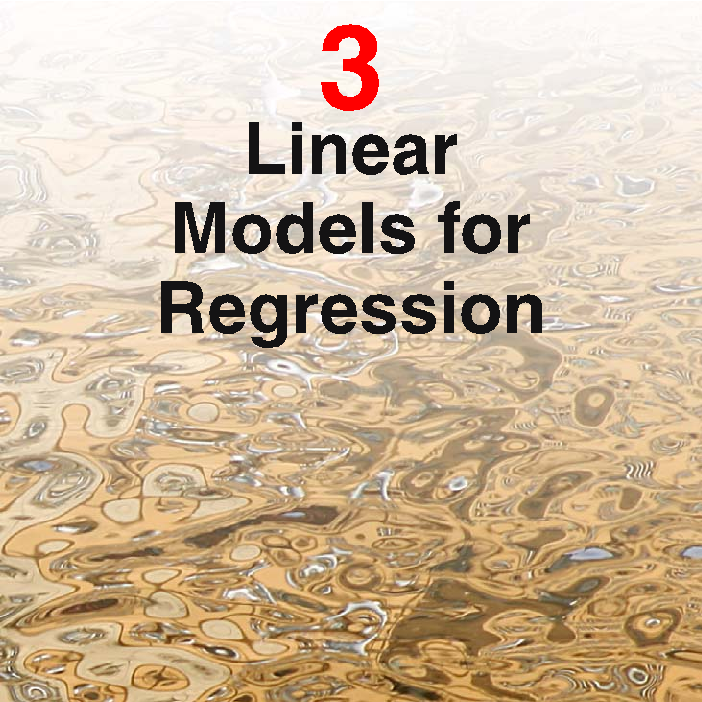
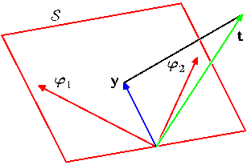
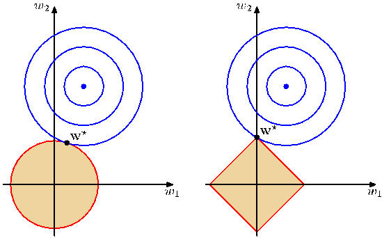
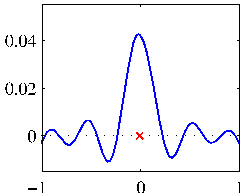
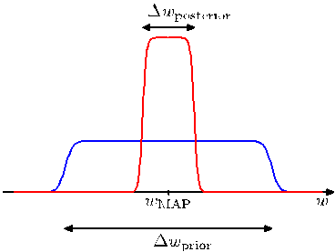
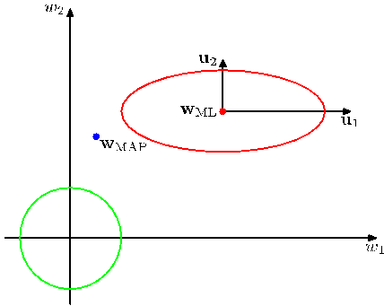

[Page 157]

# 3. Linear Models for Regression

The focus so far in this book has been on unsupervised learning, including topics such as density estimation and data clustering. We turn now to a discussion of supervised learning, starting with regression. The goal of regression is to predict the value of one or more continuous target variables $t$ given the value of a $D$-dimensional vector $\mathbf{x}$ of input variables. We have already encountered an example of a regression problem when we considered polynomial curve fitting in Chapter 1. The polynomial is a specific example of a broad class of functions called linear regression models, which share the property of being linear functions of the adjustable parameters, and which will form the focus of this chapter. The simplest form of linear regression models are also linear functions of the input variables. However, we can obtain a much more useful class of functions by taking linear combinations of a fixed set of nonlinear functions of the input variables, known as basis functions. Such models are linear functions of the parameters, which gives them simple analytical properties, and yet can be nonlinear with respect to the input variables.
[Page 158]

Given a training data set comprising $N$ observations $\{\mathbf{x}_n\}$, where $n = 1,\ldots,N$, together with corresponding target values $\{t_n\}$, the goal is to predict the value of $t$ for a new value of $\mathbf{x}$. In the simplest approach, this can be done by directly constructing an appropriate function $y(\mathbf{x})$ whose values for new inputs $\mathbf{x}$ constitute the predictions for the corresponding values of $t$. More generally, from a probabilistic perspective, we aim to model the predictive distribution $p(t|\mathbf{x})$ because this expresses our uncertainty about the value of $t$ for each value of $\mathbf{x}$. From this conditional distribution we can make predictions of $t$, for any new value of $\mathbf{x}$, in such a way as to minimize the expected value of a suitably chosen loss function. As discussed in Section 1.5.5, a common choice of loss function for real-valued variables is the squared loss, for which the optimal solution is given by the conditional expectation of $t$.

Although linear models have significant limitations as practical techniques for pattern recognition, particularly for problems involving input spaces of high dimensionality, they have nice analytical properties and form the foundation for more sophisticated models to be discussed in later chapters.

## 3.1. Linear Basis Function Models

The simplest linear model for regression is one that involves a linear combination of the input variables

$$
y(\mathbf{x}, \mathbf{w}) = w_0 + w_1 x_1 + \ldots + w_D x_D
\tag{3.1}
$$

where $\mathbf{x} = (x_1,\ldots,x_D)^{\mathrm{T}}$. This is often simply known as linear regression. The key property of this model is that it is a linear function of the parameters $w_0,\ldots,w_D$. It is also, however, a linear function of the input variables $x_i$, and this imposes significant limitations on the model. We therefore extend the class of models by considering linear combinations of fixed nonlinear functions of the input variables, of the form

$$
y(\mathbf{x}, \mathbf{w}) = w_0 + \sum_{j=1}^{M-1} w_j \phi_j(\mathbf{x})
\tag{3.2}
$$

where $\phi_j(\mathbf{x})$ are known as basis functions. By denoting the maximum value of the index $j$ by $M - 1$, the total number of parameters in this model will be $M$.

The parameter $w_0$ allows for any fixed offset in the data and is sometimes called a bias parameter (not to be confused with ‘bias’ in a statistical sense). It is often convenient to define an additional dummy ‘basis function’ $\phi_0(\mathbf{x}) = 1$ so that

$$
y(\mathbf{x}, \mathbf{w}) = \sum_{j=0}^{M-1} w_j \phi_j(\mathbf{x}) = \mathbf{w}^{\mathrm{T}}\boldsymbol{\phi}(\mathbf{x})
\tag{3.3}
$$

where $\mathbf{w} = (w_0, \ldots, w_{M-1})^{\mathrm{T}}$ and $\boldsymbol{\phi} = (\phi_0, \ldots, \phi_{M-1})^{\mathrm{T}}$. In many practical applications of pattern recognition, we will apply some form of fixed pre-processing, or feature extraction, to the original data variables. If the original variables comprise the vector $\mathbf{x}$, then the features can be expressed in terms of the basis functions $\{\phi_j(\mathbf{x})\}$.
[Page 159]

or feature extraction, to the original data variables. If the original variables comprise the vector $\mathbf{x}$, then the features can be expressed in terms of the basis functions $\{\phi_j(\mathbf{x})\}$.

By using nonlinear basis functions, we allow the function $y(\mathbf{x},\mathbf{w})$ to be a nonlinear function of the input vector $\mathbf{x}$. Functions of the form (3.2) are called linear models, however, because this function is linear in $\mathbf{w}$. It is this linearity in the parameters that will greatly simplify the analysis of this class of models. However, it also leads to some significant limitations, as we discuss in Section 3.6.

The example of polynomial regression considered in Chapter 1 is a particular example of this model in which there is a single input variable $x$, and the basis functions take the form of powers of $x$ so that $\phi_j(x) = x^j$. One limitation of polynomial basis functions is that they are global functions of the input variable, so that changes in one region of input space affect all other regions. This can be resolved by dividing the input space up into regions and fit a different polynomial in each region, leading to spline functions (Hastie et al., 2001).

There are many other possible choices for the basis functions, for example

$$
\phi_j(x) = \exp \left\{ - \frac{(x - \mu_j)^2}{2s^2} \right\} \tag{3.4}
$$

where the $\mu_j$ govern the locations of the basis functions in input space, and the parameter $s$ governs their spatial scale. These are usually referred to as ‘Gaussian’ basis functions, although it should be noted that they are not required to have a probabilistic interpretation, and in particular the normalization coefficient is unimportant because these basis functions will be multiplied by adaptive parameters $w_j$.

Another possibility is the sigmoidal basis function of the form

$$
\phi_j(x) = \sigma \left( \frac{x - \mu_j}{s} \right) \tag{3.5}
$$

where $\sigma(a)$ is the logistic sigmoid function defined by

$$
\sigma(a) = \frac{1}{1 + \exp(-a)} . \tag{3.6}
$$

Equivalently, we can use the ‘tanh’ function because this is related to the logistic sigmoid by $\tanh(a) = 2\sigma(a) - 1$, and so a general linear combination of logistic sigmoid functions is equivalent to a general linear combination of ‘tanh’ functions. These various choices of basis function are illustrated in Figure 3.1.

Yet another possible choice of basis function is the Fourier basis, which leads to an expansion in sinusoidal functions. Each basis function represents a specific frequency and has infinite spatial extent. By contrast, basis functions that are localized to finite regions of input space necessarily comprise a spectrum of different spatial frequencies. In many signal processing applications, it is of interest to consider basis functions that are localized in both space and frequency, leading to a class of functions known as wavelets. These are also defined to be mutually orthogonal, to simplify their application. Wavelets are most applicable when the input values live
[Page 160]

![The image consists of a graph with three different lines. The graph has a blue background with a white grid. The lines are depicted as curves, each with different colors. The lines are connected by a series of points, which are represented by the x-axis and the y-axis. The x-axis is labeled with the values 0, 1, and 2, while the y-axis is labeled with the values 0, 1, and 2, respectively. The lines in the graph are: - The first line is blue and has a value of 0.5. - The second line is green and has a value of 0.5. - The third line is red and has a value of 0.5. The graph is labeled as follows: - The first line is labeled as 0.5 - The second line is labeled as 0.5 - The third line is](../Images/imageFile73.png)

Figure 3.1 Examples of basis functions, showing polynomials on the left, Gaussians of the form (3.4) in the centre, and sigmoidal of the form (3.5) on the right.

on a regular lattice, such as the successive time points in a temporal sequence, or the pixels in an image. Useful texts on wavelets include Ogden (1997), Mallat (1999), and Vidakovic (1999).

Most of the discussion in this chapter, however, is independent of the particular choice of basis function set, and so for most of our discussion we shall not specify the particular form of the basis functions, except for the purposes of numerical illustration. Indeed, much of our discussion will be equally applicable to the situation in which the vector $\boldsymbol{\phi}(\mathbf{x})$ of basis functions is simply the identity $\boldsymbol{\phi}(\mathbf{x}) = \mathbf{x}$. Furthermore, in order to keep the notation simple, we shall focus on the case of a single target variable $t$. However, in Section 3.1.5, we consider briefly the modifications needed to deal with multiple target variables.

## 3.1.1 Maximum likelihood and least squares

In Chapter 1, we fitted polynomial functions to data sets by minimizing a sum-of-squares error function. We also showed that this error function could be motivated as the maximum likelihood solution under an assumed Gaussian noise model. Let us return to this discussion and consider the least squares approach, and its relation to maximum likelihood, in more detail.

As before, we assume that the target variable $t$ is given by a deterministic function $y(\mathbf{x}, \mathbf{w})$ with additive Gaussian noise so that

$$
t = y(\mathbf{x}, \mathbf{w}) + \epsilon \tag{3.7}
$$

where $\epsilon$ is a zero mean Gaussian random variable with precision (inverse variance) $\beta$. Thus we can write

$$
p(t|\mathbf{x}, \mathbf{w}, \beta) = \mathcal{N}(t|y(\mathbf{x}, \mathbf{w}), \beta^{-1}). \tag{3.8}
$$

Recall that, if we assume a squared loss function, then the optimal prediction, for a new value of $\mathbf{x}$, will be given by the conditional mean of the target variable. In the case of a Gaussian conditional distribution of the form (3.8), the conditional mean
[Page 161]

will be simply

$$
\mathbb{E}[t|\mathbf{x}] = \int t p(t|\mathbf{x}) \, dt = y(\mathbf{x}, \mathbf{w}). \tag{3.9}
$$

Note that the Gaussian noise assumption implies that the conditional distribution of $t$ given $\mathbf{x}$ is unimodal, which may be inappropriate for some applications. An extension to mixtures of conditional Gaussian distributions, which permit multimodal conditional distributions, will be discussed in Section 14.5.1.

Now consider a data set of inputs $\mathbf{X} = \{\mathbf{x}_1, \ldots, \mathbf{x}_N\}$ with corresponding target values $t_1, \ldots, t_N$. We group the target variables $\{t_n\}$ into a column vector that we denote by $\mathbf{t}$ where the typeface is chosen to distinguish it from a single observation of a multivariate target, which would be denoted $\mathbf{t}$. Making the assumption that these data points are drawn independently from the distribution (3.8), we obtain the following expression for the likelihood function, which is a function of the adjustable parameters $\mathbf{w}$ and $\beta$, in the form

$$
p(\mathbf{t}|\mathbf{X}, \mathbf{w}, \beta) = \prod_{n=1}^{N} \mathcal{N}(t_n|\mathbf{w}^{\mathrm{T}}\boldsymbol{\phi}(\mathbf{x}_n), \beta^{-1}) \tag{3.10}
$$

where we have used (3.3). Note that in supervised learning problems such as regression (and classification), we are not seeking to model the distribution of the input variables. Thus $\mathbf{x}$ will always appear in the set of conditioning variables, and so from now on we will drop the explicit $\mathbf{x}$ from expressions such as $p(\mathbf{t}|\mathbf{x}, \mathbf{w}, \beta)$ in order to keep the notation uncluttered. Taking the logarithm of the likelihood function, and making use of the standard form (1.46) for the univariate Gaussian, we have

$$
\begin{aligned}
\ln p(\mathbf{t}|\mathbf{w}, \beta) &= \sum_{n=1}^{N} \ln \mathcal{N}(t_n|\mathbf{w}^{\mathrm{T}}\boldsymbol{\phi}(\mathbf{x}_n), \beta^{-1}) \\
&= \frac{N}{2} \ln \beta - \frac{N}{2} \ln (2\pi) - \beta E_D(\mathbf{w})
\end{aligned} \tag{3.11}
$$

where the sum-of-squares error function is defined by

$$
E_D(\mathbf{w}) = \frac{1}{2} \sum_{n=1}^{N} \{t_n - \mathbf{w}^{\mathrm{T}}\boldsymbol{\phi}(\mathbf{x}_n)\}^2. \tag{3.12}
$$

Having written down the likelihood function, we can use maximum likelihood to determine $\mathbf{w}$ and $\beta$. Consider first the maximization with respect to $\mathbf{w}$. As observed already in Section 1.2.5, we see that maximization of the likelihood function under a conditional Gaussian noise distribution for a linear model is equivalent to minimizing a sum-of-squares error function given by $E_D(\mathbf{w})$. The gradient of the log likelihood function (3.11) takes the form

$$
\nabla \ln p(\mathbf{t}|\mathbf{w}, \beta) = \sum_{n=1}^{N} \{t_n - \mathbf{w}^{\mathrm{T}}\boldsymbol{\phi}(\mathbf{x}_n)\} \boldsymbol{\phi}(\mathbf{x}_n)^{\mathrm{T}}. \tag{3.13}
$$

[Page 162]

Setting this gradient to zero gives

$$
0 = \sum_{n=1}^{N} t_{n} \boldsymbol{\phi}(\mathbf{x}_{n})^{T} - \mathbf{w}^{T} \left( \sum_{n=1}^{N} \boldsymbol{\phi}(\mathbf{x}_{n})\boldsymbol{\phi}(\mathbf{x}_{n})^{T} \right). \tag{3.14}
$$

Solving for $\mathbf{w}$ we obtain

$$
\mathbf{w}_{\text{ML}} = (\mathbf{\Phi}^{T}\mathbf{\Phi})^{-1}\mathbf{\Phi}^{T}\mathbf{t} \tag{3.15}
$$

which are known as the normal equations for the least squares problem. Here $\mathbf{\Phi}$ is an $N \times M$ matrix, called the design matrix, whose elements are given by $\Phi_{nj} = \phi_j(\mathbf{x}_n)$, so that

$$
\mathbf{\Phi} = \begin{pmatrix}
\phi_{0}(\mathbf{x}_{1}) & \phi_{1}(\mathbf{x}_{1}) & \cdots & \phi_{M-1}(\mathbf{x}_{1}) \\
\phi_{0}(\mathbf{x}_{2}) & \phi_{1}(\mathbf{x}_{2}) & \cdots & \phi_{M-1}(\mathbf{x}_{2}) \\
\vdots & \vdots & \ddots & \vdots \\
\phi_{0}(\mathbf{x}_{N}) & \phi_{1}(\mathbf{x}_{N}) & \cdots & \phi_{M-1}(\mathbf{x}_{N})
\end{pmatrix}. \tag{3.16}
$$

The quantity

$$
\mathbf{\Phi}^{\dagger} \equiv (\mathbf{\Phi}^{T}\mathbf{\Phi})^{-1}\mathbf{\Phi}^{T} \tag{3.17}
$$

is known as the Moore-Penrose pseudo-inverse of the matrix $\mathbf{\Phi}$ (Rao and Mitra, 1971; Golub and Van Loan, 1996). It can be regarded as a generalization of the notion of matrix inverse to nonsquare matrices. Indeed, if $\mathbf{\Phi}$ is square and invertible, then using the property $(\mathbf{A}\mathbf{B})^{-1} = \mathbf{B}^{-1}\mathbf{A}^{-1}$ we see that $\mathbf{\Phi}^{\dagger} \equiv \mathbf{\Phi}^{-1}$.

At this point, we can gain some insight into the role of the bias parameter $w_0$. If we make the bias parameter explicit, then the error function (3.12) becomes

$$
E_{D}(\mathbf{w}) = \frac{1}{2} \sum_{n=1}^{N} \left\{ t_{n} - w_{0} - \sum_{j=1}^{M-1} w_{j}\phi_{j}(\mathbf{x}_{n}) \right\}^{2}. \tag{3.18}
$$

Setting the derivative with respect to $w_0$ equal to zero, and solving for $w_0$, we obtain

$$
w_{0} = \bar{t} - \sum_{j=1}^{M-1} w_{j}\overline{\phi}_{j} \tag{3.19}
$$

where we have defined

$$
\bar{t} = \frac{1}{N} \sum_{n=1}^{N} t_{n}, \quad \overline{\phi}_{j} = \frac{1}{N} \sum_{n=1}^{N} \phi_{j}(\mathbf{x}_{n}). \tag{3.20}
$$

Thus the bias $w_0$ compensates for the difference between the averages (over the training set) of the target values and the weighted sum of the averages of the basis function values.

We can also maximize the log likelihood function (3.11) with respect to the noise precision parameter $\beta$, giving

$$
\frac{1}{\beta_{\text{ML}}} = \frac{1}{N} \sum_{n=1}^{N} \{t_{n} - \mathbf{w}_{\text{ML}}^{T}\boldsymbol{\phi}(\mathbf{x}_{n})\}^{2} \tag{3.21}
$$

[Page 163]

Figure 3.2 Geometrical interpretation of the least-squares solution, in an $N$-dimensional space whose axes are the values of $t_1, \ldots, t_N$. The least-squares regression function is obtained by finding the orthogonal projection of the data vector $\mathbf{t}$ onto the subspace spanned by the basis functions $\phi_j(\mathbf{x})$ in which each basis function is viewed as a vector $\boldsymbol{\phi}_j$ of length $N$ with elements $\phi_j(\mathbf{x}_n)$.

and so we see that the inverse of the noise precision is given by the residual variance of the target values around the regression function.

## 3.1.2 Geometry of least squares

At this point, it is instructive to consider the geometrical interpretation of the least-squares solution. To do this we consider an $N$-dimensional space whose axes are given by the $t_n$, so that $\mathbf{t} = (t_1, \ldots, t_N)^{\mathrm{T}}$ is a vector in this space. Each basis function $\phi_j(\mathbf{x}_n)$, evaluated at the $N$ data points, can also be represented as a vector in the same space, denoted by $\boldsymbol{\phi}_j$, as illustrated in Figure 3.2. Note that $\boldsymbol{\phi}_j$ corresponds to the $j^{\mathrm{th}}$ column of $\mathbf{\Phi}$, whereas $\boldsymbol{\phi}(\mathbf{x}_n)$ corresponds to the $n^{\mathrm{th}}$ row of $\mathbf{\Phi}$. If the number $M$ of basis functions is smaller than the number $N$ of data points, then the $M$ vectors $\boldsymbol{\phi}_j$ will span a linear subspace $\mathcal{S}$ of dimensionality $M$. We define $\mathbf{y}$ to be an $N$-dimensional vector whose $n^{\mathrm{th}}$ element is given by $y(\mathbf{x}_n, \mathbf{w})$, where $n = 1, \ldots, N$. Because $\mathbf{y}$ is an arbitrary linear combination of the vectors $\boldsymbol{\phi}_j$, it can live anywhere in the $M$-dimensional subspace. The sum-of-squares error (3.12) is then equal (up to a factor of $1/2$) to the squared Euclidean distance between $\mathbf{y}$ and $\mathbf{t}$. Thus the least-squares solution for $\mathbf{w}$ corresponds to that choice of $\mathbf{y}$ that lies in subspace $\mathcal{S}$ and that is closest to $\mathbf{t}$. Intuitively, from Figure 3.2, we anticipate that this solution corresponds to the orthogonal projection of $\mathbf{t}$ onto the subspace $\mathcal{S}$. This is indeed the case, as can easily be verified by noting that the solution for $\mathbf{y}$ is given by $\mathbf{\Phi} \mathbf{w}_{\mathrm{ML}}$, and then confirming that this takes the form of an orthogonal projection.

In practice, a direct solution of the normal equations can lead to numerical difficulties when $\mathbf{\Phi}^{\mathrm{T}} \mathbf{\Phi}$ is close to singular. In particular, when two or more of the basis vectors $\boldsymbol{\phi}_j$ are co-linear, or nearly so, the resulting parameter values can have large magnitudes. Such near degeneracies will not be uncommon when dealing with real data sets. The resulting numerical difficulties can be addressed using the technique of singular value decomposition, or SVD (Press et al., 1992; Bishop and Nabney, 2008). Note that the addition of a regularization term ensures that the matrix is nonsingular, even in the presence of degeneracies.

## 3.1.3 Sequential learning

Batch techniques, such as the maximum likelihood solution (3.15), which involve processing the entire training set in one go, can be computationally costly for large data sets. As we have discussed in Chapter 1, if the data set is sufficiently large, it may be worthwhile to use sequential algorithms, also known as on-line algorithms,
[Page 164]

in which the data points are considered one at a time, and the model parameters updated after each such presentation. Sequential learning is also appropriate for realtime applications in which the data observations are arriving in a continuous stream, and predictions must be made before all of the data points are seen.

We can obtain a sequential learning algorithm by applying the technique of stochastic gradient descent, also known as sequential gradient descent, as follows. If the error function comprises a sum over data points $E = \sum_n E_n$, then after presentation of pattern $n$, the stochastic gradient descent algorithm updates the parameter vector $\mathbf{w}$ using

$$
\mathbf{w}^{(\tau+1)} = \mathbf{w}^{(\tau)} - \eta \nabla E_n \tag{3.22}
$$

where $\tau$ denotes the iteration number, and $\eta$ is a learning rate parameter. We shall discuss the choice of value for $\eta$ shortly. The value of $\mathbf{w}$ is initialized to some starting vector $\mathbf{w}^{(0)}$. For the case of the sum-of-squares error function (3.12), this gives

$$
\mathbf{w}^{(\tau+1)} = \mathbf{w}^{(\tau)} + \eta(t_n - \mathbf{w}^{(\tau)\mathrm{T}}\boldsymbol{\phi}_n)\boldsymbol{\phi}_n \tag{3.23}
$$

where $\boldsymbol{\phi}_n = \boldsymbol{\phi}(\mathbf{x}_n)$. This is known as least-mean-squares or the LMS algorithm. The value of $\eta$ needs to be chosen with care to ensure that the algorithm converges (Bishop and Nabney, 2008).

## 3.1.4 Regularized least squares

In Section 1.1, we introduced the idea of adding a regularization term to an error function in order to control over-fitting, so that the total error function to be minimized takes the form

$$
E_D(\mathbf{w}) + \lambda E_W(\mathbf{w}) \tag{3.24}
$$

where $\lambda$ is the regularization coefficient that controls the relative importance of the data-dependent error $E_D(\mathbf{w})$ and the regularization term $E_W(\mathbf{w})$. One of the simplest forms of regularizer is given by the sum-of-squares of the weight vector elements

$$
E_W(\mathbf{w}) = \frac{1}{2}\mathbf{w}^{\mathrm{T}}\mathbf{w}. \tag{3.25}
$$

If we also consider the sum-of-squares error function given by

$$
E(\mathbf{w}) = \frac{1}{2} \sum_{n=1}^{N} \{t_n - \mathbf{w}^{\mathrm{T}}\boldsymbol{\phi}(\mathbf{x}_n)\}^2 \tag{3.26}
$$

then the total error function becomes

$$
\frac{1}{2} \sum_{n=1}^{N} \{t_n - \mathbf{w}^{\mathrm{T}}\boldsymbol{\phi}(\mathbf{x}_n)\}^2 + \frac{\lambda}{2} \mathbf{w}^{\mathrm{T}}\mathbf{w}. \tag{3.27}
$$

This particular choice of regularizer is known in the machine learning literature as weight decay because in sequential learning algorithms, it encourages weight values to decay towards zero, unless supported by the data. In statistics, it provides an example of a parameter shrinkage method because it shrinks parameter values towards
[Page 165]

Figure 3.3 Contours of the regularization term in (3.29) for various values of the parameter $q$.

zero. It has the advantage that the error function remains a quadratic function of $\mathbf{w}$, and so its exact minimizer can be found in closed form. Specifically, setting the gradient of (3.27) with respect to $\mathbf{w}$ to zero, and solving for $\mathbf{w}$ as before, we obtain

$$
\mathbf{w} = (\lambda\mathbf{I} + \mathbf{\Phi}^{\mathrm{T}}\mathbf{\Phi})^{-1}\mathbf{\Phi}^{\mathrm{T}}\mathbf{t}. \tag{3.28}
$$

This represents a simple extension of the least-squares solution (3.15).

A more general regularizer is sometimes used, for which the regularized error takes the form

$$
\frac{1}{2} \sum_{n=1}^{N} \{t_n - \mathbf{w}^{\mathrm{T}}\boldsymbol{\phi}(\mathbf{x}_n)\}^2 + \frac{\lambda}{2} \sum_{j=1}^{M} |w_j|^q \tag{3.29}
$$

where $q = 2$ corresponds to the quadratic regularizer (3.27). Figure 3.3 shows contours of the regularization function for different values of $q$.

The case of $q = 1$ is know as the lasso in the statistics literature (Tibshirani, 1996). It has the property that if $\lambda$ is sufficiently large, some of the coefficients $w_j$ are driven to zero, leading to a sparse model in which the corresponding basis functions play no role. To see this, we first note that minimizing (3.29) is equivalent to minimizing the unregularized sum-of-squares error (3.12) subject to the constraint

$$
\sum_{j=1}^{M} |w_j|^q \le \eta \tag{3.30}
$$

for an appropriate value of the parameter $\eta$, where the two approaches can be related using Lagrange multipliers. The origin of the sparsity can be seen from Figure 3.4, which shows that the minimum of the error function, subject to the constraint (3.30). As $\lambda$ is increased, so an increasing number of parameters are driven to zero.

Regularization allows complex models to be trained on data sets of limited size without severe over-fitting, essentially by limiting the effective model complexity. However, the problem of determining the optimal model complexity is then shifted from one of finding the appropriate number of basis functions to one of determining a suitable value of the regularization coefficient $\lambda$. We shall return to the issue of model complexity later in this chapter.
[Page 166]

Figure 3.4 Plot of the contours of the unregularized error function (blue) along with the constraint region (3.30) for the quadratic regularizer $q = 2$ on the left and the lasso regularizer $q = 1$ on the right, in which the optimum value for the parameter vector $\mathbf{w}$ is denoted by $\mathbf{w}^{\star}$. The lasso gives a sparse solution in which $w_1 = 0$.

For the remainder of this chapter we shall focus on the quadratic regularizer (3.27) both for its practical importance and its analytical tractability.

## 3.1.5 Multiple outputs

So far, we have considered the case of a single target variable $t$. In some applications, we may wish to predict $K > 1$ target variables, which we denote collectively by the target vector $\mathbf{t}$. This could be done by introducing a different set of basis functions for each component of $\mathbf{t}$, leading to multiple, independent regression problems. However, a more interesting, and more common, approach is to use the same set of basis functions to model all of the components of the target vector so that

$$
\mathbf{y}(\mathbf{x}, \mathbf{w}) = \mathbf{W}^{\mathrm{T}} \boldsymbol{\phi}(\mathbf{x})
\tag{3.31}
$$

where $\mathbf{y}$ is a $K$-dimensional column vector, $\mathbf{W}$ is an $M \times K$ matrix of parameters, and $\boldsymbol{\phi}(\mathbf{x})$ is an $M$-dimensional column vector with elements $\phi_j(\mathbf{x})$, with $\phi_0(\mathbf{x}) = 1$ as before. Suppose we take the conditional distribution of the target vector to be an isotropic Gaussian of the form

$$
p(\mathbf{t}|\mathbf{x}, \mathbf{W}, \beta) = \mathcal{N}(\mathbf{t}|\mathbf{W}^{\mathrm{T}}\boldsymbol{\phi}(\mathbf{x}), \beta^{-1}\mathbf{I}).
\tag{3.32}
$$

If we have a set of observations $\mathbf{t}_1, \ldots, \mathbf{t}_N$, we can combine these into a matrix $\mathbf{T}$ of size $N \times K$ such that the $n^{\text{th}}$ row is given by $\mathbf{t}_n^{\mathrm{T}}$. Similarly, we can combine the input vectors $\mathbf{x}_1, \ldots, \mathbf{x}_N$ into a matrix $\mathbf{X}$. The log likelihood function is then given by

$$
\begin{align}
\ln p(\mathbf{T}|\mathbf{X}, \mathbf{W}, \beta) &= \sum_{n=1}^{N} \ln \mathcal{N}(\mathbf{t}_n|\mathbf{W}^{\mathrm{T}}\boldsymbol{\phi}(\mathbf{x}_n), \beta^{-1}\mathbf{I}) \\
&= \frac{NK}{2} \ln \left( \frac{\beta}{2\pi} \right) - \frac{\beta}{2} \sum_{n=1}^{N} \|\mathbf{t}_n - \mathbf{W}^{\mathrm{T}}\boldsymbol{\phi}(\mathbf{x}_n)\|^2 .
\tag{3.33}
\end{align}
$$

[Page 167]

As before, we can maximize this function with respect to $\mathbf{W}$, giving

$$
\mathbf{W}_{\text{ML}} = (\boldsymbol{\Phi}^{\text{T}}\boldsymbol{\Phi})^{-1}\boldsymbol{\Phi}^{\text{T}}\mathbf{T}.
\tag{3.34}
$$

If we examine this result for each target variable $\mathbf{t}_k$, we have

$$
\mathbf{w}_k = (\boldsymbol{\Phi}^{\text{T}}\boldsymbol{\Phi})^{-1}\boldsymbol{\Phi}^{\text{T}}\mathbf{t}_k = \boldsymbol{\Phi}^{\dagger}\mathbf{t}_k
\tag{3.35}
$$

where $\mathbf{t}_k$ is an $N$-dimensional column vector with components $t_{nk}$ for $n = 1,\ldots,N$. Thus the solution to the regression problem decouples between the different target variables, and we need only compute a single pseudo-inverse matrix $\boldsymbol{\Phi}^{\dagger}$, which is shared by all of the vectors $\mathbf{w}_k$.

The extension to general Gaussian noise distributions having arbitrary covariance matrices is straightforward. Again, this leads to a decoupling into $K$ independent regression problems. This result is unsurprising because the parameters $\mathbf{W}$ define only the mean of the Gaussian noise distribution, and we know from Section 2.3.4 that the maximum likelihood solution for the mean of a multivariate Gaussian is independent of the covariance. From now on, we shall therefore consider a single target variable $t$ for simplicity.

## 3.2. The Bias-Variance Decomposition

So far in our discussion of linear models for regression, we have assumed that the form and number of basis functions are both fixed. As we have seen in Chapter 1, the use of maximum likelihood, or equivalently least squares, can lead to severe over-fitting if complex models are trained using data sets of limited size. However, limiting the number of basis functions in order to avoid over-fitting has the side effect of limiting the flexibility of the model to capture interesting and important trends in the data. Although the introduction of regularization terms can control over-fitting for models with many parameters, this raises the question of how to determine a suitable value for the regularization coefficient $\lambda$. Seeking the solution that minimizes the regularized error function with respect to both the weight vector $\mathbf{w}$ and the regularization coefficient $\lambda$ is clearly not the right approach since this leads to the unregularized solution with $\lambda = 0$.

As we have seen in earlier chapters, the phenomenon of over-fitting is really an unfortunate property of maximum likelihood and does not arise when we marginalize over parameters in a Bayesian setting. In this chapter, we shall consider the Bayesian view of model complexity in some depth. Before doing so, however, it is instructive to consider a frequentist viewpoint of the model complexity issue, known as the bias-variance trade-off. Although we shall introduce this concept in the context of linear basis function models, where it is easy to illustrate the ideas using simple examples, the discussion has more general applicability.

In Section 1.5.5, when we discussed decision theory for regression problems, we considered various loss functions each of which leads to a corresponding optimal prediction once we are given the conditional distribution $p(t|\mathbf{x})$. A popular choice is
[Page 168]

the squared loss function, for which the optimal prediction is given by the conditional expectation, which we denote by $h(\mathbf{x})$ and which is given by

$$
h(\mathbf{x}) = \mathbb{E}[t|\mathbf{x}] = \int t p(t|\mathbf{x}) \, dt. \tag{3.36}
$$

At this point, it is worth distinguishing between the squared loss function arising from decision theory and the sum-of-squares error function that arose in the maximum likelihood estimation of model parameters. We might use more sophisticated techniques than least squares, for example regularization or a fully Bayesian approach, to determine the conditional distribution $p(t|\mathbf{x})$. These can all be combined with the squared loss function for the purpose of making predictions.

We showed in Section 1.5.5 that the expected squared loss can be written in the form

$$
\mathbb{E}[L] = \int \{ y(\mathbf{x}) - h(\mathbf{x}) \}^{2} p(\mathbf{x}) \, d\mathbf{x} + \int \{ h(\mathbf{x}) - t \}^{2} p(\mathbf{x}, t) \, d\mathbf{x} \, dt. \tag{3.37}
$$

Recall that the second term, which is independent of $y(\mathbf{x})$, arises from the intrinsic noise on the data and represents the minimum achievable value of the expected loss. The first term depends on our choice for the function $y(\mathbf{x})$, and we will seek a solution for $y(\mathbf{x})$ which makes this term a minimum. Because it is nonnegative, the smallest that we can hope to make this term is zero. If we had an unlimited supply of data (and unlimited computational resources), we could in principle find the regression function $h(\mathbf{x})$ to any desired degree of accuracy, and this would represent the optimal choice for $y(\mathbf{x})$. However, in practice we have a data set $\mathcal{D}$ containing only a finite number $N$ of data points, and consequently we do not know the regression function $h(\mathbf{x})$ exactly.

If we model the $h(\mathbf{x})$ using a parametric function $y(\mathbf{x}, \mathbf{w})$ governed by a parameter vector $\mathbf{w}$, then from a Bayesian perspective the uncertainty in our model is expressed through a posterior distribution over $\mathbf{w}$. A frequentist treatment, however, involves making a point estimate of $\mathbf{w}$ based on the data set $\mathcal{D}$, and tries instead to interpret the uncertainty of this estimate through the following thought experiment. Suppose we had a large number of data sets each of size $N$ and each drawn independently from the distribution $p(t, \mathbf{x})$. For any given data set $\mathcal{D}$, we can run our learning algorithm and obtain a prediction function $y(\mathbf{x}; \mathcal{D})$. Different data sets from the ensemble will give different functions and consequently different values of the squared loss. The performance of a particular learning algorithm is then assessed by taking the average over this ensemble of data sets.

Consider the integrand of the first term in (3.37), which for a particular data set $\mathcal{D}$ takes the form

$$
\{ y(\mathbf{x}; \mathcal{D}) - h(\mathbf{x}) \}^{2}. \tag{3.38}
$$

Because this quantity will be dependent on the particular data set $\mathcal{D}$, we take its average over the ensemble of data sets. If we add and subtract the quantity $\mathbb{E}_{\mathcal{D}}[y(\mathbf{x}; \mathcal{D})]$
[Page 169]

inside the braces, and then expand, we obtain

$$
\begin{aligned}
&\{y(x;\mathcal{D}) - \mathbb{E}_{\mathcal{D}}[y(x;\mathcal{D})] + \mathbb{E}_{\mathcal{D}}[y(x;\mathcal{D})] - h(x)\}^{2} \\
&= \{y(x;\mathcal{D}) - \mathbb{E}_{\mathcal{D}}[y(x;\mathcal{D})]\}^{2} + \{\mathbb{E}_{\mathcal{D}}[y(x;\mathcal{D})] - h(x)\}^{2} \\
&\quad + 2\{y(x;\mathcal{D}) - \mathbb{E}_{\mathcal{D}}[y(x;\mathcal{D})]\}\{\mathbb{E}_{\mathcal{D}}[y(x;\mathcal{D})] - h(x)\}.
\end{aligned} \tag{3.39}
$$

We now take the expectation of this expression with respect to $\mathcal{D}$ and note that the final term will vanish, giving

$$
\begin{aligned}
&\mathbb{E}_{\mathcal{D}} \left[ \{y(x;\mathcal{D}) - h(x)\}^{2} \right] \\
&= \underbrace{\{\mathbb{E}_{\mathcal{D}}[y(x;\mathcal{D})] - h(x)\}^{2}}_{(\text{bias})^{2}} + \underbrace{\mathbb{E}_{\mathcal{D}} \left[ \{y(x;\mathcal{D}) - \mathbb{E}_{\mathcal{D}}[y(x;\mathcal{D})]\}^{2} \right]}_{\text{variance}}.
\end{aligned} \tag{3.40}
$$

We see that the expected squared difference between $y(x;\mathcal{D})$ and the regression function $h(x)$ can be expressed as the sum of two terms. The first term, called the squared bias, represents the extent to which the average prediction over all data sets differs from the desired regression function. The second term, called the variance, measures the extent to which the solutions for individual data sets vary around their average, and hence this measures the extent to which the function $y(x;\mathcal{D})$ is sensitive to the particular choice of data set. We shall provide some intuition to support these definitions shortly when we consider a simple example.

So far, we have considered a single input value $x$. If we substitute this expansion back into (3.37), we obtain the following decomposition of the expected squared loss

$$
\text{expected loss} = (\text{bias})^{2} + \text{variance} + \text{noise} \tag{3.41}
$$

where

$$
(\text{bias})^{2} = \int \{\mathbb{E}_{\mathcal{D}}[y(x;\mathcal{D})] - h(x)\}^{2} p(x) \, \mathrm{d}x \tag{3.42}
$$

$$
\text{variance} = \int \mathbb{E}_{\mathcal{D}} \left[ \{y(x;\mathcal{D}) - \mathbb{E}_{\mathcal{D}}[y(x;\mathcal{D})]\}^{2} \right] p(x) \, \mathrm{d}x \tag{3.43}
$$

$$
\text{noise} = \int \{h(x) - t\}^{2} p(x,t) \, \mathrm{d}x \mathrm{d}t \tag{3.44}
$$

and the bias and variance terms now refer to integrated quantities.

Our goal is to minimize the expected loss, which we have decomposed into the sum of a (squared) bias, a variance, and a constant noise term. As we shall see, there is a trade-off between bias and variance, with very flexible models having low bias and high variance, and relatively rigid models having high bias and low variance. The model with the optimal predictive capability is the one that leads to the best balance between bias and variance. This is illustrated by considering the sinusoidal data set from Chapter 1. Here we generate $100$ data sets, each containing $N = 25$ data points, independently from the sinusoidal curve $h(x) = \sin(2\pi x)$. The data sets are indexed by $l = 1,\ldots,L$, where $L = 100$, and for each data set $\mathcal{D}^{(l)}$ we
[Page 170]

Figure 3.5 Illustration of the dependence of bias and variance on model complexity, governed by a regularization parameter $\lambda$, using the sinusoidal data set from Chapter 1. There are $L = 100$ data sets, each having $N = 25$ data points, and there are 24 Gaussian basis functions in the model so that the total number of parameters is $M = 25$ including the bias parameter. The left column shows the result of fitting the model to the data sets for various values of $\ln \lambda$ (for clarity, only 20 of the 100 fits are shown). The right column shows the corresponding average of the 100 fits (red) along with the sinusoidal function from which the data sets were generated (green).
[Page 171]

Figure 3.6 Plot of squared bias and variance, together with their sum, corresponding to the results shown in Figure 3.5. Also shown is the average test set error for a test data set size of 1000 points. The minimum value of $(\text{bias})^2 + \text{variance}$ occurs around $\ln \lambda = -0.31$, which is close to the value that gives the minimum error on the test data.

![The image is a graph titled Ln A. The graph is a line graph with three lines, each representing different variables. The x-axis is labeled ln(\gamma) and the y-axis is labeled ln(\gamma). The graph is titled Ln A and has a legend at the bottom of the graph that indicates the following: - The blue line represents bias - The red line represents variance - The pink line represents test error The graph has a scale from 0.03 to 0.15 on the y-axis, labeled ln(\gamma) and ln(\gamma). The x-axis is labeled ln(\gamma) and has a scale from -3 to 1. The graph has three lines: 1. The blue line represents bias 2. The red line represents variance](../Images/imageFile78.png)

fit a model with 24 Gaussian basis functions by minimizing the regularized error function (3.27) to give a prediction function $y^{(l)}(x)$ as shown in Figure 3.5. The top row corresponds to a large value of the regularization coefficient $\lambda$ that gives low variance (because the red curves in the left plot look similar) but high bias (because the two curves in the right plot are very different). Conversely on the bottom row, for which $\lambda$ is small, there is large variance (shown by the high variability between the red curves in the left plot) but low bias (shown by the good fit between the average model fit and the original sinusoidal function). Note that the result of averaging many solutions for the complex model with $M = 25$ is a very good fit to the regression function, which suggests that averaging may be a beneficial procedure. Indeed, a weighted averaging of multiple solutions lies at the heart of a Bayesian approach, although the averaging is with respect to the posterior distribution of parameters, not with respect to multiple data sets.

We can also examine the bias-variance trade-off quantitatively for this example. The average prediction is estimated from

$$
\bar{y}(x) = \frac{1}{L} \sum_{l=1}^{L} y^{(l)}(x) \tag{3.45}
$$

and the integrated squared bias and integrated variance are then given by

$$
(\text{bias})^2 = \frac{1}{N} \sum_{n=1}^{N} \{\bar{y}(x_n) - h(x_n)\}^2 \tag{3.46}
$$

$$
\text{variance} = \frac{1}{N} \sum_{n=1}^{N} \frac{1}{L} \sum_{l=1}^{L} \{y^{(l)}(x_n) - \bar{y}(x_n)\}^2 \tag{3.47}
$$

where the integral over $x$ weighted by the distribution $p(x)$ is approximated by a finite sum over data points drawn from that distribution. These quantities, along with their sum, are plotted as a function of $\ln \lambda$ in Figure 3.6. We see that small values of $\lambda$ allow the model to become finely tuned to the noise on each individual
[Page 172]

data set leading to large variance. Conversely, a large value of $\lambda$ pulls the weight parameters towards zero leading to large bias.

Although the bias-variance decomposition may provide some interesting insights into the model complexity issue from a frequentist perspective, it is of limited practical value, because the bias-variance decomposition is based on averages with respect to ensembles of data sets, whereas in practice we have only the single observed data set. If we had a large number of independent training sets of a given size, we would be better off combining them into a single large training set, which of course would reduce the level of over-fitting for a given model complexity.

Given these limitations, we turn in the next section to a Bayesian treatment of linear basis function models, which not only provides powerful insights into the issues of over-fitting but which also leads to practical techniques for addressing the question model complexity.

## 3.3. Bayesian Linear Regression

In our discussion of maximum likelihood for setting the parameters of a linear regression model, we have seen that the effective model complexity, governed by the number of basis functions, needs to be controlled according to the size of the data set. Adding a regularization term to the log likelihood function means the effective model complexity can then be controlled by the value of the regularization coefficient, although the choice of the number and form of the basis functions is of course still important in determining the overall behaviour of the model.

This leaves the issue of deciding the appropriate model complexity for the particular problem, which cannot be decided simply by maximizing the likelihood function, because this always leads to excessively complex models and over-fitting. Independent hold-out data can be used to determine model complexity, as discussed in Section 1.3, but this can be both computationally expensive and wasteful of valuable data. We therefore turn to a Bayesian treatment of linear regression, which will avoid the over-fitting problem of maximum likelihood, and which will also lead to automatic methods of determining model complexity using the training data alone. Again, for simplicity we will focus on the case of a single target variable $t$. Extension to multiple target variables is straightforward and follows the discussion of Section 3.1.5.

### 3.3.1 Parameter distribution

We begin our discussion of the Bayesian treatment of linear regression by introducing a prior probability distribution over the model parameters $\mathbf{w}$. For the moment, we shall treat the noise precision parameter $\beta$ as a known constant. First note that the likelihood function $p(\mathbf{t}|\mathbf{w})$ defined by (3.10) is the exponential of a quadratic function of $\mathbf{w}$. The corresponding conjugate prior is therefore given by a Gaussian distribution of the form

$$
p(\mathbf{w}) = \mathcal{N}(\mathbf{w}|\mathbf{m}_0, \mathbf{S}_0) \tag{3.48}
$$

having mean $\mathbf{m}_0$ and covariance $\mathbf{S}_0$.
[Page 173]

Next we compute the posterior distribution, which is proportional to the product of the likelihood function and the prior. Due to the choice of a conjugate Gaussian prior distribution, the posterior will also be Gaussian. We can evaluate this distribution by the usual procedure of completing the square in the exponential, and then finding the normalization coefficient using the standard result for a normalized Gaussian. However, we have already done the necessary work in deriving the general result (2.116), which allows us to write down the posterior distribution directly in the form

$$
p(\mathbf{w}|\mathbf{t}) = \mathcal{N}(\mathbf{w}|\mathbf{m}_N, \mathbf{S}_N) \tag{3.49}
$$

where

$$
\begin{align}
\mathbf{m}_N &= \mathbf{S}_N(\mathbf{S}_0^{-1}\mathbf{m}_0 + \beta\mathbf{\Phi}^{\text{T}}\mathbf{t}) \tag{3.50} \\
\mathbf{S}_N^{-1} &= \mathbf{S}_0^{-1} + \beta\mathbf{\Phi}^{\text{T}}\mathbf{\Phi}. \tag{3.51}
\end{align}
$$

Note that because the posterior distribution is Gaussian, its mode coincides with its mean. Thus the maximum posterior weight vector is simply given by $\mathbf{w}_{\text{MAP}} = \mathbf{m}_N$. If we consider an infinitely broad prior $\mathbf{S}_0 = \alpha^{-1}\mathbf{I}$ with $\alpha \to 0$, the mean $\mathbf{m}_N$ of the posterior distribution reduces to the maximum likelihood value $\mathbf{w}_{\text{ML}}$ given by (3.15). Similarly, if $N = 0$, then the posterior distribution reverts to the prior. Furthermore, if data points arrive sequentially, then the posterior distribution at any stage acts as the prior distribution for the subsequent data point, such that the new posterior distribution is again given by (3.49).

For the remainder of this chapter, we shall consider a particular form of Gaussian prior in order to simplify the treatment. Specifically, we consider a zero-mean isotropic Gaussian governed by a single precision parameter $\alpha$ so that

$$
p(\mathbf{w}|\alpha) = \mathcal{N}(\mathbf{w}|\mathbf{0}, \alpha^{-1}\mathbf{I}) \tag{3.52}
$$

and the corresponding posterior distribution over $\mathbf{w}$ is then given by (3.49) with

$$
\begin{align}
\mathbf{m}_N &= \beta\mathbf{S}_N\mathbf{\Phi}^{\text{T}}\mathbf{t} \tag{3.53} \\
\mathbf{S}_N^{-1} &= \alpha\mathbf{I} + \beta\mathbf{\Phi}^{\text{T}}\mathbf{\Phi}. \tag{3.54}
\end{align}
$$

The log of the posterior distribution is given by the sum of the log likelihood and the log of the prior and, as a function of $\mathbf{w}$, takes the form

$$
\ln p(\mathbf{w}|\mathbf{t}) = -\frac{\beta}{2} \sum_{n=1}^N \{t_n - \mathbf{w}^{\text{T}}\boldsymbol{\phi}(\mathbf{x}_n)\}^2 - \frac{\alpha}{2} \mathbf{w}^{\text{T}}\mathbf{w} + \text{const}. \tag{3.55}
$$

Maximization of this posterior distribution with respect to $\mathbf{w}$ is therefore equivalent to the minimization of the sum-of-squares error function with the addition of a quadratic regularization term, corresponding to (3.27) with $\lambda = \alpha/\beta$.

We can illustrate Bayesian learning in a linear basis function model, as well as the sequential update of a posterior distribution, using a simple example involving straight-line fitting. Consider a single input variable $x$, a single target variable $t$ and
[Page 174]

a linear model of the form $y(x, \mathbf{w}) = w_0 + w_1 x$. Because this has just two adaptive parameters, we can plot the prior and posterior distributions directly in parameter

space. We generate synthetic data from the function $f(x, \mathbf{a}) = a_0 + a_1 x$ with parameter values $a_0 = -0.3$ and $a_1 = 0.5$ by first choosing values of $x_n$ from the uniform distribution $U(x|-1, 1)$, then evaluating $f(x_n, \mathbf{a})$, and finally adding Gaussian noise with standard deviation of $0.2$ to obtain the target values $t_n$. Our goal is to recover the values of $a_0$ and $a_1$ from such data, and we will explore the dependence on the size of the data set. We assume here that the noise variance is known and hence we set the precision parameter to its true value $\beta = (1/0.2)^2 = 25$. Similarly, we fix the parameter $\alpha$ to $2.0$. We shall shortly discuss strategies for determining $\alpha$ and $\beta$ from the training data. Figure 3.7 shows the results of Bayesian learning in this model as the size of the data set is increased and demonstrates the sequential nature of Bayesian learning in which the current posterior distribution forms the prior when a new data point is observed. It is worth taking time to study this figure in detail as it illustrates several important aspects of Bayesian inference. The first row of this figure corresponds to the situation before any data points are observed and shows a plot of the prior distribution in $\mathbf{w}$ space together with six samples of the function $y(x, \mathbf{w})$ in which the values of $\mathbf{w}$ are drawn from the prior. In the second row, we see the situation after observing a single data point. The location $(x, t)$ of the data point is shown by a blue circle in the right-hand column. In the left-hand column is a plot of the likelihood function $p(t|x, \mathbf{w})$ for this data point as a function of $\mathbf{w}$. Note that the likelihood function provides a soft constraint that the line must pass close to the data point, where close is determined by the noise precision $\beta$. For comparison, the true parameter values $a_0 = -0.3$ and $a_1 = 0.5$ used to generate the data set are shown by a white cross in the plots in the left column of Figure 3.7. When we multiply this likelihood function by the prior from the top row, and normalize, we obtain the posterior distribution shown in the middle plot on the second row. Samples of the regression function $y(x, \mathbf{w})$ obtained by drawing samples of $\mathbf{w}$ from this posterior distribution are shown in the right-hand plot. Note that these sample lines all pass close to the data point. The third row of this figure shows the effect of observing a second data point, again shown by a blue circle in the plot in the right-hand column. The corresponding likelihood function for this second data point alone is shown in the left plot. When we multiply this likelihood function by the posterior distribution from the second row, we obtain the posterior distribution shown in the middle plot of the third row. Note that this is exactly the same posterior distribution as would be obtained by combining the original prior with the likelihood function for the two data points. This posterior has now been influenced by two data points, and because two points are sufficient to define a line this already gives a relatively compact posterior distribution. Samples from this posterior distribution give rise to the functions shown in red in the third column, and we see that these functions pass close to both of the data points. The fourth row shows the effect of observing a total of 20 data points. The left-hand plot shows the likelihood function for the 20th data point alone, and the middle plot shows the resulting posterior distribution that has now absorbed information from all 20 observations. Note how the posterior is much sharper than in the third row. In the limit of an infinite number of data points, the
[Page 175]

![The image is a graphical representation of a data set, which appears to be a scatter plot. The plot is titled previously/posterior and is labeled as such. The x-axis is labeled data space and the y-axis is labeled data. The plot is divided into two main sections: previously/posterior and data space. The previously/posterior section is represented by a blue line that is colored red. This line is located at the top of the plot and extends upwards. The data space section is represented by a blue line that is colored red. This line is located at the bottom of the plot and extends downwards. The plot is divided into two main sections: previously/posterior and data space. The previously/posterior section is represented by a red line that is colored blue. This line is located at the top of the plot and extends upwards](../Images/imageFile17.png)

Figure 3.7 Illustration of sequential Bayesian learning for a simple linear model of the form $y(x, \mathbf{w}) = w_0 + w_1x$. A detailed description of this figure is given in the text.
[Page 176]

posterior distribution would become a delta function centred on the true parameter values, shown by the white cross.

Other forms of prior over the parameters can be considered. For instance, we can generalize the Gaussian prior to give

$$
p(\mathbf{w}|\alpha) = \left[ \frac{q}{2} \left( \frac{\alpha}{2} \right)^{1/q} \frac{1}{\Gamma(1/q)} \right]^M \exp \left( - \frac{\alpha}{2} \sum_{j=1}^M |w_j|^q \right) \tag{3.56}
$$

in which $q = 2$ corresponds to the Gaussian distribution, and only in this case is the prior conjugate to the likelihood function (3.10). Finding the maximum of the posterior distribution over $\mathbf{w}$ corresponds to minimization of the regularized error function (3.29). In the case of the Gaussian prior, the mode of the posterior distribution was equal to the mean, although this will no longer hold if $q \neq 2$.

##### 3.3.2 Predictive distribution

In practice, we are not usually interested in the value of $\mathbf{w}$ itself but rather in making predictions of $t$ for new values of $\mathbf{x}$. This requires that we evaluate the predictive distribution defined by

$$
p(t|\mathbf{t}, \alpha, \beta) = \int p(t|\mathbf{w}, \beta) p(\mathbf{w}|\mathbf{t}, \alpha, \beta) \, d\mathbf{w} \tag{3.57}
$$

in which $\mathbf{t}$ is the vector of target values from the training set, and we have omitted the corresponding input vectors from the right-hand side of the conditioning statements to simplify the notation. The conditional distribution $p(t|\mathbf{x}, \mathbf{w}, \beta)$ of the target variable is given by (3.8), and the posterior weight distribution is given by (3.49). We see that (3.57) involves the convolution of two Gaussian distributions, and so making use of the result (2.115) from Section 8.1.4, we see that the predictive distribution takes the form

$$
p(t|\mathbf{x}, \mathbf{t}, \alpha, \beta) = \mathcal{N}(t|\mathbf{m}_N^{\text{T}}\boldsymbol{\phi}(\mathbf{x}), \sigma_N^2(\mathbf{x})) \tag{3.58}
$$

where the variance $\sigma_N^2(\mathbf{x})$ of the predictive distribution is given by

$$
\sigma_N^2(\mathbf{x}) = \frac{1}{\beta} + \boldsymbol{\phi}(\mathbf{x})^{\text{T}} \mathbf{S}_N \boldsymbol{\phi}(\mathbf{x}). \tag{3.59}
$$

The first term in (3.59) represents the noise on the data whereas the second term reflects the uncertainty associated with the parameters $\mathbf{w}$. Because the noise process and the distribution of $\mathbf{w}$ are independent Gaussians, their variances are additive. Note that, as additional data points are observed, the posterior distribution becomes narrower. As a consequence it can be shown (Qazaz et al., 1997) that $\sigma_{N+1}^2(\mathbf{x}) \leqslant \sigma_N^2(\mathbf{x})$. In the limit $N \to \infty$, the second term in (3.59) goes to zero, and the variance of the predictive distribution arises solely from the additive noise governed by the parameter $\beta$.

As an illustration of the predictive distribution for Bayesian linear regression models, let us return to the synthetic sinusoidal data set of Section 1.1. In Figure 3.8, we fit a model comprising a linear combination of Gaussian basis functions to data sets of various sizes and then look at the corresponding posterior distributions. Here the green curves correspond to the function $\sin(2\pi x)$ from which the data points were generated (with the addition of Gaussian noise). Data sets of size $N = 1$, $N = 2$, $N = 4$, and $N = 25$ are shown in the four plots by the blue circles. For each plot, the red curve shows the mean of the corresponding Gaussian predictive distribution, and the red shaded region spans one standard deviation either side of the mean. Note that the predictive uncertainty depends on $x$ and is smallest in the neighbourhood of the data points. Also note that the level of uncertainty decreases as more data points are observed.
[Page 177]

![The image consists of a graph with four different sections. Each section contains a graph with a specific color and a set of points. The graph is labeled as Graph 1 and is located at the top of the image. The graph is a line graph with a single point at the top of the graph. The points on the graph are labeled as follows: - The first section has a green color. - The second section has a red color. - The third section has a blue color. - The fourth section has a green color. The graph is labeled as Graph 2 and is located at the bottom of the image. The graph is a line graph with a single point at the bottom of the graph. The points on the graph are labeled as follows: - The first section has a blue color. - The second section has a red color. - The third section has a green color. - The fourth section has](../Images/imageFile80.png)

Figure 3.8 Examples of the predictive distribution (3.58) for a model consisting of 9 Gaussian basis functions of the form (3.4) using the synthetic sinusoidal data set of Section 1.1. See the text for a detailed discussion.

we fit a model comprising a linear combination of Gaussian basis functions to data sets of various sizes and then look at the corresponding posterior distributions. Here the green curves correspond to the function $\sin(2\pi x)$ from which the data points were generated (with the addition of Gaussian noise). Data sets of size $N = 1$, $N = 2$, $N = 4$, and $N = 25$ are shown in the four plots by the blue circles. For each plot, the red curve shows the mean of the corresponding Gaussian predictive distribution, and the red shaded region spans one standard deviation either side of the mean. Note that the predictive uncertainty depends on $x$ and is smallest in the neighbourhood of the data points. Also note that the level of uncertainty decreases as more data points are observed.

The plots in Figure 3.8 only show the point-wise predictive variance as a function of $x$. In order to gain insight into the covariance between the predictions at different values of $x$, we can draw samples from the posterior distribution over $\mathbf{w}$, and then plot the corresponding functions $y(x,\mathbf{w})$, as shown in Figure 3.9.
[Page 178]

![The image is a scatter plot with four different sets of data points. Each set of data points is represented by a different color, and the x-axis is labeled t, while the y-axis is labeled t. The data points are represented by red dots, and each data point is represented by a different color. The x-axis is labeled t, and the y-axis is labeled t. The data points are scattered around the x-axis, with some points closer to the x-axis and others farther away. The data points are scattered in a random pattern, with no clear pattern or pattern.](../Images/imageFile81.png)

Figure 3.9 Plots of the function $y(x, \mathbf{w})$ using samples from the posterior distributions over $\mathbf{w}$ corresponding to the plots in Figure 3.8.

If we used localized basis functions such as Gaussians, then in regions away from the basis function centres, the contribution from the second term in the predictive variance (3.59) will go to zero, leaving only the noise contribution $\beta^{-1}$. Thus, the model becomes very confident in its predictions when extrapolating outside the region occupied by the basis functions, which is generally an undesirable behaviour. This problem can be avoided by adopting an alternative Bayesian approach to regression known as a Gaussian process.

Note that, if both $\mathbf{w}$ and $\beta$ are treated as unknown, then we can introduce a conjugate prior distribution $p(\mathbf{w}, \beta)$ that, from the discussion in Section 2.3.6, will be given by a Gaussian-gamma distribution (Denison et al., 2002). In this case, the predictive distribution is a Student's t-distribution.
[Page 179]

Figure 3.10 The equivalent kernel $k(x, x')$ for the Gaussian basis functions in Figure 3.1, shown as a plot of $x$ versus $x'$, together with three slices through this matrix corresponding to three different values of $x$. The data set used to generate this kernel comprised $200$ values of $x$ equally spaced over the interval $(-1, 1)$.

## 3.3.3 Equivalent kernel

The posterior mean solution (3.53) for the linear basis function model has an interesting interpretation that will set the stage for kernel methods, including Gaussian processes. If we substitute (3.53) into the expression (3.3), we see that the predictive mean can be written in the form

$$
y(\mathbf{x}, \mathbf{m}_N) = \mathbf{m}_N^{\text{T}}\boldsymbol{\phi}(\mathbf{x}) = \beta\boldsymbol{\phi}(\mathbf{x})^{\text{T}}\mathbf{S}_N\mathbf{\Phi}^{\text{T}}\mathbf{t} = \sum_{n=1}^N \beta\boldsymbol{\phi}(\mathbf{x})^{\text{T}}\mathbf{S}_N\boldsymbol{\phi}(\mathbf{x}_n)t_n \tag{3.60}
$$

where $\mathbf{S}_N$ is defined by (3.51). Thus the mean of the predictive distribution at a point $\mathbf{x}$ is given by a linear combination of the training set target variables $t_n$, so that we can write

$$
y(\mathbf{x}, \mathbf{m}_N) = \sum_{n=1}^N k(\mathbf{x}, \mathbf{x}_n)t_n \tag{3.61}
$$

where the function

$$
k(\mathbf{x}, \mathbf{x}') = \beta\boldsymbol{\phi}(\mathbf{x})^{\text{T}}\mathbf{S}_N\boldsymbol{\phi}(\mathbf{x}') \tag{3.62}
$$

is known as the smoother matrix or the _equivalent kernel_. Regression functions, such as this, which make predictions by taking linear combinations of the training set target values are known as _linear smoothers_. Note that the equivalent kernel depends on the input values $\mathbf{x}_n$ from the data set because these appear in the definition of $\mathbf{S}_N$. The equivalent kernel is illustrated for the case of Gaussian basis functions in Figure 3.10 in which the kernel functions $k(x, x')$ have been plotted as a function of $x'$ for three different values of $x$. We see that they are localized around $x$, and so the mean of the predictive distribution at $x$, given by $y(x, \mathbf{m}_N)$, is obtained by forming a weighted combination of the target values in which data points close to $x$ are given higher weight than points further removed from $x$. Intuitively, it seems reasonable that we should weight local evidence more strongly than distant evidence. Note that this localization property holds not only for the localized Gaussian basis functions but also for the nonlocal polynomial and sigmoidal basis functions, as illustrated in Figure 3.11.
[Page 180]

Figure 3.11 Examples of equivalent kernels $k(x, x')$ for $x = 0$ plotted as a function of $x'$, corresponding (left) to the polynomial basis functions and (right) to the sigmoidal basis functions shown in Figure 3.1. Note that these are localized functions of $x'$ even though the corresponding basis functions are nonlocal.

Further insight into the role of the equivalent kernel can be obtained by considering the covariance between $y(\mathbf{x})$ and $y(\mathbf{x}')$, which is given by

$$
\begin{aligned}
\text{cov}[y(\mathbf{x}), y(\mathbf{x}')] &= \text{cov}[\boldsymbol{\phi}(\mathbf{x})^{\text{T}}\mathbf{w}, \mathbf{w}^{\text{T}}\boldsymbol{\phi}(\mathbf{x}')] \\
&= \boldsymbol{\phi}(\mathbf{x})^{\text{T}}\mathbf{S}_N\boldsymbol{\phi}(\mathbf{x}') = \beta^{-1}k(\mathbf{x}, \mathbf{x}')
\end{aligned}
\tag{3.63}
$$

where we have made use of (3.49) and (3.62). From the form of the equivalent kernel, we see that the predictive mean at nearby points will be highly correlated, whereas for more distant pairs of points the correlation will be smaller.

The predictive distribution shown in Figure 3.8 allows us to visualize the pointwise uncertainty in the predictions, governed by (3.59). However, by drawing samples from the posterior distribution over $\mathbf{w}$, and plotting the corresponding model functions $y(\mathbf{x}, \mathbf{w})$ as in Figure 3.9, we are visualizing the joint uncertainty in the posterior distribution between the $y$ values at two (or more) $\mathbf{x}$ values, as governed by the equivalent kernel.

The formulation of linear regression in terms of a kernel function suggests an alternative approach to regression as follows. Instead of introducing a set of basis functions, which implicitly determines an equivalent kernel, we can instead define a localized kernel directly and use this to make predictions for new input vectors $\mathbf{x}$, given the observed training set. This leads to a practical framework for regression (and classification) called _Gaussian processes_, which will be discussed in detail in Section 6.4.

We have seen that the effective kernel defines the weights by which the training set target values are combined in order to make a prediction at a new value of $\mathbf{x}$, and it can be shown that these weights sum to one, in other words

$$
\sum_{n=1}^{N} k(\mathbf{x}, \mathbf{x}_n) = 1
\tag{3.64}
$$

for all values of $\mathbf{x}$. This intuitively pleasing result can easily be proven informally by noting that the summation is equivalent to considering the predictive mean $y(\mathbf{x})$ for a set of target data in which $t_n = 1$ for all $n$. Provided the basis functions are linearly independent, that there are more data points than basis functions, and that one of the basis functions is constant (corresponding to the bias parameter), then it is clear that we can fit the training data exactly and hence that the predictive mean will
[Page 181]

be simply $y(\mathbf{x}) = 1$, from which we obtain (3.64). Note that the kernel function can be negative as well as positive, so although it satisfies a summation constraint, the corresponding predictions are not necessarily convex combinations of the training set target variables.

Finally, we note that the equivalent kernel (3.62) satisfies an important property shared by kernel functions in general, namely that it can be expressed in the form an inner product with respect to a vector $\boldsymbol{\psi}(\mathbf{x})$ of nonlinear functions, so that

$$
k(\mathbf{x}, \mathbf{z}) = \boldsymbol{\psi}(\mathbf{x})^{\mathrm{T}} \boldsymbol{\psi}(\mathbf{z}) \tag{3.65}
$$

where $\boldsymbol{\psi}(\mathbf{x}) = \beta^{1/2} \mathbf{S}_N^{1/2} \boldsymbol{\phi}(\mathbf{x})$.

## 3.4. Bayesian Model Comparison

In Chapter 1, we highlighted the problem of over-fitting as well as the use of crossvalidation as a technique for setting the values of regularization parameters or for choosing between alternative models. Here we consider the problem of model selection from a Bayesian perspective. In this section, our discussion will be very general, and then in Section 3.5 we shall see how these ideas can be applied to the determination of regularization parameters in linear regression.

As we shall see, the over-fitting associated with maximum likelihood can be avoided by marginalizing (summing or integrating) over the model parameters instead of making point estimates of their values. Models can then be compared directly on the training data, without the need for a validation set. This allows all available data to be used for training and avoids the multiple training runs for each model associated with cross-validation. It also allows multiple complexity parameters to be determined simultaneously as part of the training process. For example, in Chapter 7 we shall introduce the relevance vector machine, which is a Bayesian model having one complexity parameter for every training data point.

The Bayesian view of model comparison simply involves the use of probabilities to represent uncertainty in the choice of model, along with a consistent application of the sum and product rules of probability. Suppose we wish to compare a set of $L$ models $\{\mathcal{M}_i\}$ where $i = 1,\ldots,L$. Here a model refers to a probability distribution over the observed data $\mathcal{D}$. In the case of the polynomial curve-fitting problem, the distribution is defined over the set of target values $\mathbf{t}$, while the set of input values $\mathbf{X}$ is assumed to be known. Other types of model define a joint distributions over $\mathbf{X}$ and $\mathbf{t}$. We shall suppose that the data is generated from one of these models but we are uncertain which one. Our uncertainty is expressed through a prior probability distribution $p(\mathcal{M}_i)$. Given a training set $\mathcal{D}$, we then wish to evaluate the posterior distribution

$$
p(\mathcal{M}_i|\mathcal{D}) \propto p(\mathcal{M}_i)p(\mathcal{D}|\mathcal{M}_i). \tag{3.66}
$$

The prior allows us to express a preference for different models. Let us simply assume that all models are given equal prior probability. The interesting term is the model evidence $p(\mathcal{D}|\mathcal{M}_i)$ which expresses the preference shown by the data for
[Page 182]

different models, and we shall examine this term in more detail shortly. The model evidence is sometimes also called the marginal likelihood because it can be viewed as a likelihood function over the space of models, in which the parameters have been marginalized out. The ratio of model evidences $p(\mathcal{D}|\mathcal{M}_i)/p(\mathcal{D}|\mathcal{M}_j)$ for two models is known as a Bayes factor (Kass and Raftery, 1995).

Once we know the posterior distribution over models, the predictive distribution is given, from the sum and product rules, by

$$
p(t|\mathbf{x},\mathcal{D}) = \sum_{i=1}^{L} p(t|\mathbf{x},\mathcal{M}_i,\mathcal{D}) p(\mathcal{M}_i|\mathcal{D}). \tag{3.67}
$$

This is an example of a mixture distribution in which the overall predictive distribution is obtained by averaging the predictive distributions $p(t|\mathbf{x},\mathcal{M}_i,\mathcal{D})$ of individual models, weighted by the posterior probabilities $p(\mathcal{M}_i|\mathcal{D})$ of those models. For instance, if we have two models that are a-posteriori equally likely and one predicts a narrow distribution around $t = a$ while the other predicts a narrow distribution around $t = b$, the overall predictive distribution will be a bimodal distribution with modes at $t = a$ and $t = b$, not a single model at $t = (a + b)/2$.

A simple approximation to model averaging is to use the single most probable model alone to make predictions. This is known as model selection.

For a model governed by a set of parameters $\mathbf{w}$, the model evidence is given, from the sum and product rules of probability, by

$$
p(\mathcal{D}|\mathcal{M}_i) = \int p(\mathcal{D}|\mathbf{w},\mathcal{M}_i) p(\mathbf{w}|\mathcal{M}_i) \, d\mathbf{w}. \tag{3.68}
$$

From a sampling perspective, the marginal likelihood can be viewed as the probability of generating the data set $\mathcal{D}$ from a model whose parameters are sampled at random from the prior. It is also interesting to note that the evidence is precisely the normalizing term that appears in the denominator in Bayes' theorem when evaluating the posterior distribution over parameters because

$$
p(\mathbf{w}|\mathcal{D},\mathcal{M}_i) = \frac{p(\mathcal{D}|\mathbf{w},\mathcal{M}_i)p(\mathbf{w}|\mathcal{M}_i)}{p(\mathcal{D}|\mathcal{M}_i)}. \tag{3.69}
$$

We can obtain some insight into the model evidence by making a simple approximation to the integral over parameters. Consider first the case of a model having a single parameter $w$. The posterior distribution over parameters is proportional to $p(\mathcal{D}|w)p(w)$, where we omit the dependence on the model $\mathcal{M}_i$ to keep the notation uncluttered. If we assume that the posterior distribution is sharply peaked around the most probable value $w_{\text{MAP}}$, with width $\Delta w_{\text{posterior}}$, then we can approximate the integral by the value of the integrand at its maximum times the width of the peak. If we further assume that the prior is flat with width $\Delta w_{\text{prior}}$ so that $p(w) = 1/\Delta w_{\text{prior}}$, then we have

$$
p(\mathcal{D}) = \int p(\mathcal{D}|w)p(w) \, dw \simeq p(\mathcal{D}|w_{\text{MAP}}) \frac{\Delta w_{\text{posterior}}}{\Delta w_{\text{prior}}} \tag{3.70}
$$

[Page 183]

Figure 3.12 We can obtain a rough approximation to the model evidence if we assume that the posterior distribution over parameters is sharply peaked around its mode $\mathbf{w}_{\text{MAP}}$.

and so taking logs we obtain

$$
\ln p(\mathcal{D}) \simeq \ln p(\mathcal{D} | \mathbf{w}_{\text{MAP}}) + \ln \left( \frac{\Delta w_{\text{posterior}}}{\Delta w_{\text{prior}}} \right) . \tag{3.71}
$$

This approximation is illustrated in Figure 3.12. The first term represents the fit to the data given by the most probable parameter values, and for a flat prior this would correspond to the log likelihood. The second term penalizes the model according to its complexity. Because $\Delta w_{\text{posterior}} < \Delta w_{\text{prior}}$ this term is negative, and it increases in magnitude as the ratio $\Delta w_{\text{posterior}} / \Delta w_{\text{prior}}$ gets smaller. Thus, if parameters are finely tuned to the data in the posterior distribution, then the penalty term is large.

For a model having a set of $M$ parameters, we can make a similar approximation for each parameter in turn. Assuming that all parameters have the same ratio of $\Delta w_{\text{posterior}} / \Delta w_{\text{prior}}$, we obtain

$$
\ln p(\mathcal{D}) \simeq \ln p(\mathcal{D} | \mathbf{w}_{\text{MAP}}) + M \ln \left( \frac{\Delta w_{\text{posterior}}}{\Delta w_{\text{prior}}} \right) . \tag{3.72}
$$

Thus, in this very simple approximation, the size of the complexity penalty increases linearly with the number $M$ of adaptive parameters in the model. As we increase the complexity of the model, the first term will typically decrease, because a more complex model is better able to fit the data, whereas the second term will increase due to the dependence on $M$. The optimal model complexity, as determined by the maximum evidence, will be given by a trade-off between these two competing terms. We shall later develop a more refined version of this approximation, based on a Gaussian approximation to the posterior distribution.

We can gain further insight into Bayesian model comparison and understand how the marginal likelihood can favour models of intermediate complexity by considering Figure 3.13. Here the horizontal axis is a one-dimensional representation of the space of possible data sets, so that each point on this axis corresponds to a specific data set. We now consider three models $\mathcal{M}_1$, $\mathcal{M}_2$ and $\mathcal{M}_3$ of successively increasing complexity. Imagine running these models generatively to produce example data sets, and then looking at the distribution of data sets that result. Any given
[Page 184]

Figure 3.13 Schematic illustration of the distribution of data sets for three models of different complexity, in which $\mathcal{M}_1$ is the simplest and $\mathcal{M}_3$ is the most complex. Note that the distributions are normalized. In this example, for the particular observed data set $\mathcal{D}_0$, the model $\mathcal{M}_2$ with intermediate complexity has the largest evidence.

![The image depicts a graph with two axes labeled D and M1 and two lines representing the variables D and M1. The graph is divided into two sections, with the x-axis labeled from 0 to 100, and the y-axis labeled from 0 to 100. The graph is divided into two parts, with the x-axis labeled from 0 to 100, and the y-axis labeled from 0 to 100. The graph has two main lines: 1. The first line is labeled D and is represented by a red dashed line. 2. The second line is labeled M1 and is represented by a blue dashed line. The graph has a horizontal axis labeled D and a vertical axis labeled M1. The x-axis is labeled from 0 to 100 and the y-axis is labeled from](../Images/imageFile85.png)

model can generate a variety of different data sets since the parameters are governed by a prior probability distribution, and for any choice of the parameters there may be random noise on the target variables. To generate a particular data set from a specific model, we first choose the values of the parameters from their prior distribution $p(\mathbf{w})$, and then for these parameter values we sample the data from $p(\mathcal{D}|\mathbf{w})$. A simple model (for example, based on a first order polynomial) has little variability and so will generate data sets that are fairly similar to each other. Its distribution $p(\mathcal{D})$ is therefore confined to a relatively small region of the horizontal axis. By contrast, a complex model (such as a ninth order polynomial) can generate a great variety of different data sets, and so its distribution $p(\mathcal{D})$ is spread over a large region of the space of data sets. Because the distributions $p(\mathcal{D}|\mathcal{M}_i)$ are normalized, we see that the particular data set $\mathcal{D}_0$ can have the highest value of the evidence for the model of intermediate complexity. Essentially, the simpler model cannot fit the data well, whereas the more complex model spreads its predictive probability over too broad a range of data sets and so assigns relatively small probability to any one of them.

Implicit in the Bayesian model comparison framework is the assumption that the true distribution from which the data are generated is contained within the set of models under consideration. Provided this is so, we can show that Bayesian model comparison will on average favour the correct model. To see this, consider two models $\mathcal{M}_1$ and $\mathcal{M}_2$ in which the truth corresponds to $\mathcal{M}_1$. For a given finite data set, it is possible for the Bayes factor to be larger for the incorrect model. However, if we average the Bayes factor over the distribution of data sets, we obtain the expected Bayes factor in the form

$$
\int p(\mathcal{D}|\mathcal{M}_1) \ln \frac{p(\mathcal{D}|\mathcal{M}_1)}{p(\mathcal{D}|\mathcal{M}_2)} \, \mathrm{d}\mathcal{D} \tag{3.73}
$$

where the average has been taken with respect to the true distribution of the data. This quantity is an example of the Kullback-Leibler divergence and satisfies the property of always being positive unless the two distributions are equal in which case it is zero. Thus on average the Bayes factor will always favour the correct model.

We have seen that the Bayesian framework avoids the problem of over-fitting and allows models to be compared on the basis of the training data alone. However,
[Page 185]

a Bayesian approach, like any approach to pattern recognition, needs to make assumptions about the form of the model, and if these are invalid then the results can be misleading. In particular, we see from Figure 3.12 that the model evidence can be sensitive to many aspects of the prior, such as the behaviour in the tails. Indeed, the evidence is not defined if the prior is improper, as can be seen by noting that an improper prior has an arbitrary scaling factor (in other words, the normalization coefficient is not defined because the distribution cannot be normalized). If we consider a proper prior and then take a suitable limit in order to obtain an improper prior (for example, a Gaussian prior in which we take the limit of infinite variance) then the evidence will go to zero, as can be seen from (3.70) and Figure 3.12. It may, however, be possible to consider the evidence ratio between two models first and then take a limit to obtain a meaningful answer.

In a practical application, therefore, it will be wise to keep aside an independent test set of data on which to evaluate the overall performance of the final system.

## 3.5. The Evidence Approximation

In a fully Bayesian treatment of the linear basis function model, we would introduce prior distributions over the hyperparameters $\alpha$ and $\beta$ and make predictions by marginalizing with respect to these hyperparameters as well as with respect to the parameters $\mathbf{w}$. However, although we can integrate analytically over either $\mathbf{w}$ or over the hyperparameters, the complete marginalization over all of these variables is analytically intractable. Here we discuss an approximation in which we set the hyperparameters to specific values determined by maximizing the marginal likelihood function obtained by first integrating over the parameters $\mathbf{w}$. This framework is known in the statistics literature as empirical Bayes (Bernardo and Smith, 1994; Gelman et al., 2004), or type 2 maximum likelihood (Berger, 1985), or generalized maximum likelihood (Wahba, 1975), and in the machine learning literature is also called the evidence approximation (Gull, 1989; MacKay, 1992a).

If we introduce hyperpriors over $\alpha$ and $\beta$, the predictive distribution is obtained by marginalizing over $\mathbf{w}$, $\alpha$ and $\beta$ so that

$$
p(t|\mathbf{t}) = \iiint p(t|\mathbf{w},\beta)p(\mathbf{w}|\mathbf{t},\alpha,\beta)p(\alpha,\beta|\mathbf{t}) \,\mathrm{d}\mathbf{w} \,\mathrm{d}\alpha \,\mathrm{d}\beta
\tag{3.74}
$$

where $p(t|\mathbf{w},\beta)$ is given by (3.8) and $p(\mathbf{w}|\mathbf{t},\alpha,\beta)$ is given by (3.49) with $\mathbf{m}_N$ and $\mathbf{S}_N$ defined by (3.53) and (3.54) respectively. Here we have omitted the dependence on the input variable $\mathbf{x}$ to keep the notation uncluttered. If the posterior distribution $p(\alpha,\beta|\mathbf{t})$ is sharply peaked around values $\widehat{\alpha}$ and $\widehat{\beta}$, then the predictive distribution is obtained simply by marginalizing over $\mathbf{w}$ in which $\alpha$ and $\beta$ are fixed to the values $\widehat{\alpha}$ and $\widehat{\beta}$, so that

$$
p(t|\mathbf{t}) \simeq p(t|\mathbf{t}, \widehat{\alpha}, \widehat{\beta}) = \int p(t|\mathbf{w}, \widehat{\beta})p(\mathbf{w}|\mathbf{t}, \widehat{\alpha}, \widehat{\beta}) \,\mathrm{d}\mathbf{w} .
\tag{3.75}
$$

[Page 186]

From Bayes' theorem, the posterior distribution for $\alpha$ and $\beta$ is given by

$$
p(\alpha, \beta | \mathbf{t}) \propto p(\mathbf{t} | \alpha, \beta) p(\alpha, \beta). \tag{3.76}
$$

If the prior is relatively flat, then in the evidence framework the values of $\alpha$ and $\beta$ are obtained by maximizing the marginal likelihood function $p(\mathbf{t} | \alpha, \beta)$. We shall proceed by evaluating the marginal likelihood for the linear basis function model and then finding its maxima. This will allow us to determine values for these hyperparameters from the training data alone, without recourse to cross-validation. Recall that the ratio $\alpha/\beta$ is analogous to a regularization parameter.

As an aside it is worth noting that, if we define conjugate (Gamma) prior distributions over $\alpha$ and $\beta$, then the marginalization over these hyperparameters in (3.74) can be performed analytically to give a Student's t-distribution over $\mathbf{w}$ (see Section 2.3.7). Although the resulting integral over $\mathbf{w}$ is no longer analytically tractable, it might be thought that approximating this integral, for example using the Laplace approximation discussed (Section 4.4) which is based on a local Gaussian approximation centred on the mode of the posterior distribution, might provide a practical alternative to the evidence framework (Buntine and Weigend, 1991). However, the integrand as a function of $\mathbf{w}$ typically has a strongly skewed mode so that the Laplace approximation fails to capture the bulk of the probability mass, leading to poorer results than those obtained by maximizing the evidence (MacKay, 1999).

Returning to the evidence framework, we note that there are two approaches that we can take to the maximization of the log evidence. We can evaluate the evidence function analytically and then set its derivative equal to zero to obtain re-estimation equations for $\alpha$ and $\beta$, which we shall do in Section 3.5.2. Alternatively we use a technique called the expectation maximization (EM) algorithm, which will be discussed in Section 9.3.4 where we shall also show that these two approaches converge to the same solution.

## 3.5.1 Evaluation of the evidence function

The marginal likelihood function $p(\mathbf{t} | \alpha, \beta)$ is obtained by integrating over the weight parameters $\mathbf{w}$, so that

$$
p(\mathbf{t} | \alpha, \beta) = \int p(\mathbf{t} | \mathbf{w}, \beta) p(\mathbf{w} | \alpha) \, d\mathbf{w}. \tag{3.77}
$$

One way to evaluate this integral is to make use once again of the result (2.115) for the conditional distribution in a linear-Gaussian model. Here we shall evaluate the integral instead by completing the square in the exponent and making use of the standard form for the normalization coefficient of a Gaussian.

From (3.11), (3.12), and (3.52), we can write the evidence function in the form

$$
p(\mathbf{t} | \alpha, \beta) = \left( \frac{\beta}{2\pi} \right)^{N/2} \left( \frac{\alpha}{2\pi} \right)^{M/2} \int \exp\{ -E(\mathbf{w}) \} \, d\mathbf{w} \tag{3.78}
$$

[Page 187]

where $M$ is the dimensionality of $\mathbf{w}$, and we have defined

$$
\begin{aligned}
E(\mathbf{w}) &= \beta E_D(\mathbf{w}) + \alpha E_W(\mathbf{w}) \\
&= \frac{\beta}{2} \|\mathbf{t} - \mathbf{\Phi}\mathbf{w}\|^2 + \frac{\alpha}{2} \mathbf{w}^{\text{T}}\mathbf{w}.
\end{aligned}
\tag{3.79}
$$

We recognize (3.79) as being equal, up to a constant of proportionality, to the regularized sum-of-squares error function (3.27). We now complete the square over $\mathbf{w}$ giving

$$
E(\mathbf{w}) = E(\mathbf{m}_N) + \frac{1}{2}(\mathbf{w} - \mathbf{m}_N)^{\text{T}}\mathbf{A}(\mathbf{w} - \mathbf{m}_N)
\tag{3.80}
$$

where we have introduced

$$
\mathbf{A} = \alpha\mathbf{I} + \beta\mathbf{\Phi}^{\text{T}}\mathbf{\Phi}
\tag{3.81}
$$

together with

$$
E(\mathbf{m}_N) = \frac{\beta}{2} \|\mathbf{t} - \mathbf{\Phi}\mathbf{m}_N\|^2 + \frac{\alpha}{2} \mathbf{m}_N^{\text{T}}\mathbf{m}_N.
\tag{3.82}
$$

Note that $\mathbf{A}$ corresponds to the matrix of second derivatives of the error function

$$
\mathbf{A} = \nabla\nabla E(\mathbf{w})
\tag{3.83}
$$

and is known as the Hessian matrix. Here we have also defined $\mathbf{m}_N$ given by

$$
\mathbf{m}_N = \beta\mathbf{A}^{-1}\mathbf{\Phi}^{\text{T}}\mathbf{t}.
\tag{3.84}
$$

Using (3.54), we see that $\mathbf{A} = \mathbf{S}_N^{-1}$, and hence (3.84) is equivalent to the previous definition (3.53), and therefore represents the mean of the posterior distribution.

The integral over $\mathbf{w}$ can now be evaluated simply by appealing to the standard result for the normalization coefficient of a multivariate Gaussian, giving

$$
\begin{aligned}
\int \exp\{-E(\mathbf{w})\} \, \text{d}\mathbf{w} &= \exp\{-E(\mathbf{m}_N)\} \int \exp\left\{ -\frac{1}{2}(\mathbf{w} - \mathbf{m}_N)^{\text{T}}\mathbf{A}(\mathbf{w} - \mathbf{m}_N) \right\} \, \text{d}\mathbf{w} \\
&= \exp\{-E(\mathbf{m}_N)\}(2\pi)^{M/2}|\mathbf{A}|^{-1/2}.
\end{aligned}
\tag{3.85}
$$

Using (3.78) we can then write the log of the marginal likelihood in the form

$$
\ln p(\mathbf{t}|\alpha, \beta) = \frac{M}{2} \ln \alpha + \frac{N}{2} \ln \beta - E(\mathbf{m}_N) - \frac{1}{2} \ln |\mathbf{A}| - \frac{N}{2} \ln(2\pi)
\tag{3.86}
$$

which is the required expression for the evidence function.

Returning to the polynomial regression problem, we can plot the model evidence against the order of the polynomial, as shown in Figure 3.14. Here we have assumed a prior of the form (1.65) with the parameter $\alpha$ fixed at $\alpha = 5 \times 10^{-3}$. The form of this plot is very instructive. Referring back to Figure 1.4, we see that the $M = 0$ polynomial has very poor fit to the data and consequently gives a relatively low value
[Page 188]

Figure 3.14 Plot of the model evidence versus the order $M$, for the polynomial regression model, showing that the evidence favours the model with $M = 3$.

![The image is a line graph that shows the trend of a variable over time. The x-axis represents the time in years, ranging from 0 to 26 years. The y-axis represents the value, ranging from 0 to 26. The graph shows a general upward trend, with a slight dip in the middle of the graph. The graph has a linear scale of range 0 to 26 on the x-axis, starting from 0 and ending at 26. The graph also has a linear scale of range from 0 to 26 on the y-axis, starting from 0 and ending at 26. The graph has a blue line that shows the trend of the variable over time. The line starts at a value of 0 and goes up to 26, then decreases to 0 and then up to 26. The line then goes down to 0 and then up to 2](../Images/imageFile86.png)

for the evidence. Going to the $M = 1$ polynomial greatly improves the data fit, and hence the evidence is significantly higher. However, in going to $M = 2$, the data fit is improved only very marginally, due to the fact that the underlying sinusoidal function from which the data is generated is an odd function and so has no even terms in a polynomial expansion. Indeed, Figure 1.5 shows that the residual data error is reduced only slightly in going from $M = 1$ to $M = 2$. Because this richer model suffers a greater complexity penalty, the evidence actually falls in going from $M = 1$ to $M = 2$. When we go to $M = 3$ we obtain a significant further improvement in data fit, as seen in Figure 1.4, and so the evidence is increased again, giving the highest overall evidence for any of the polynomials. Further increases in the value of $M$ produce only small improvements in the fit to the data but suffer increasing complexity penalty, leading overall to a decrease in the evidence values. Looking again at Figure 1.5, we see that the generalization error is roughly constant between $M = 3$ and $M = 8$, and it would be difficult to choose between these models on the basis of this plot alone. The evidence values, however, show a clear preference for $M = 3$, since this is the simplest model which gives a good explanation for the observed data.

## 3.5.2 Maximizing the evidence function

Let us first consider the maximization of $p(\mathbf{t}|\alpha,\beta)$ with respect to $\alpha$. This can be done by first defining the following eigenvector equation

$$
(\beta \mathbf{\Phi}^{\mathrm{T}}\mathbf{\Phi}) \mathbf{u}_{i} = \lambda_{i}\mathbf{u}_{i}. \tag{3.87}
$$

From (3.81), it then follows that $\mathbf{A}$ has eigenvalues $\alpha+\lambda_{i}$. Now consider the derivative of the term involving $\ln|\mathbf{A}|$ in (3.86) with respect to $\alpha$. We have

$$
\frac{d}{d\alpha} \ln|\mathbf{A}| = \frac{d}{d\alpha} \ln \prod_{i}(\lambda_{i} + \alpha) = \frac{d}{d\alpha} \sum_{i}\ln(\lambda_{i} + \alpha) = \sum_{i}\frac{1}{\lambda_{i} + \alpha}. \tag{3.88}
$$

Thus the stationary points of (3.86) with respect to $\alpha$ satisfy

$$
0 = \frac{M}{2\alpha} - \frac{1}{2}\mathbf{m}_{N}^{\mathrm{T}}\mathbf{m}_{N} - \frac{1}{2}\sum_{i}\frac{1}{\lambda_{i} + \alpha}. \tag{3.89}
$$

[Page 189]

Multiplying through by $2\alpha$ and rearranging, we obtain

$$
\alpha \mathbf{m}_N^T \mathbf{m}_N = M - \alpha \sum_i \frac{1}{\lambda_i + \alpha} = \gamma. \tag{3.90}
$$

Since there are $M$ terms in the sum over $i$, the quantity $\gamma$ can be written

$$
\gamma = \sum_i \frac{\lambda_i}{\alpha + \lambda_i}. \tag{3.91}
$$

The interpretation of the quantity $\gamma$ will be discussed shortly. From (3.90) we see that the value of $\alpha$ that maximizes the marginal likelihood satisfies

$$
\alpha = \frac{\gamma}{\mathbf{m}_N^T \mathbf{m}_N}. \tag{3.92}
$$

Note that this is an implicit solution for $\alpha$ not only because $\gamma$ depends on $\alpha$, but also because the mode $\mathbf{m}_N$ of the posterior distribution itself depends on the choice of $\alpha$. We therefore adopt an iterative procedure in which we make an initial choice for $\alpha$ and use this to find $\mathbf{m}_N$, which is given by (3.53), and also to evaluate $\gamma$, which is given by (3.91). These values are then used to re-estimate $\alpha$ using (3.92), and the process repeated until convergence. Note that because the matrix $\mathbf{\Phi}^T \mathbf{\Phi}$ is fixed, we can compute its eigenvalues once at the start and then simply multiply these by $\beta$ to obtain the $\lambda_i$.

It should be emphasized that the value of $\alpha$ has been determined purely by looking at the training data. In contrast to maximum likelihood methods, no independent data set is required in order to optimize the model complexity.

We can similarly maximize the log marginal likelihood (3.86) with respect to $\beta$. To do this, we note that the eigenvalues $\lambda_i$ defined by (3.87) are proportional to $\beta$, and hence $d\lambda_i/d\beta = \lambda_i/\beta$ giving

$$
\frac{d}{d\beta} \ln |\mathbf{A}| = \frac{d}{d\beta} \sum_i \ln(\lambda_i + \alpha) = \frac{1}{\beta} \sum_i \frac{\lambda_i}{\lambda_i + \alpha} = \frac{\gamma}{\beta}. \tag{3.93}
$$

The stationary point of the marginal likelihood therefore satisfies

$$
0 = \frac{N}{2\beta} - \frac{1}{2} \sum_{n=1}^N \{t_n - \mathbf{m}_N^T \boldsymbol{\phi}(\mathbf{x}_n)\}^2 - \frac{\gamma}{2\beta} \tag{3.94}
$$

and rearranging we obtain

$$
\frac{1}{\beta} = \frac{1}{N - \gamma} \sum_{n=1}^N \{t_n - \mathbf{m}_N^T \boldsymbol{\phi}(\mathbf{x}_n)\}^2. \tag{3.95}
$$

Again, this is an implicit solution for $\beta$ and can be solved by choosing an initial value for $\beta$ and then using this to calculate $\mathbf{m}_N$ and $\gamma$ and then re-estimate $\beta$ using (3.95), repeating until convergence. If both $\alpha$ and $\beta$ are to be determined from the data, then their values can be re-estimated together after each update of $\gamma$.
[Page 190]

Figure 3.15 Contours of the likelihood function (red) and the prior (green) in which the axes in parameter space have been rotated to align with the eigenvectors $\mathbf{u}_i$ of the Hessian. For $\alpha = 0$, the mode of the posterior is given by the maximum likelihood solution $\mathbf{w}_{\mathrm{ML}}$, whereas for nonzero $\alpha$ the mode is at $\mathbf{w}_{\mathrm{MAP}} = \mathbf{m}_N$. In the direction $w_1$ the eigenvalue $\lambda_1$, defined by (3.87), is small compared with $\alpha$ and so the quantity $\lambda_1/(\lambda_1 + \alpha)$ is close to zero, and the corresponding MAP value of $w_1$ is also close to zero. By contrast, in the direction $w_2$ the eigenvalue $\lambda_2$ is large compared with $\alpha$ and so the quantity $\lambda_2/(\lambda_2+\alpha)$ is close to unity, and the MAP value of $w_2$ is close to its maximum likelihood value.

## 3.5.3 Effective number of parameters

The result (3.92) has an elegant interpretation (MacKay, 1992a), which provides insight into the Bayesian solution for $\alpha$. To see this, consider the contours of the likelihood function and the prior as illustrated in Figure 3.15. Here we have implicitly transformed to a rotated set of axes in parameter space aligned with the eigenvectors $\mathbf{u}_i$ defined in (3.87). Contours of the likelihood function are then axis-aligned ellipses. The eigenvalues $\lambda_i$ measure the curvature of the likelihood function, and so in Figure 3.15 the eigenvalue $\lambda_1$ is small compared with $\lambda_2$ (because a smaller curvature corresponds to a greater elongation of the contours of the likelihood function). Because $\beta \boldsymbol{\Phi}^{\mathrm{T}} \boldsymbol{\Phi}$ is a positive definite matrix, it will have positive eigenvalues, and so the ratio $\lambda_i/(\lambda_i + \alpha)$ will lie between $0$ and $1$. Consequently, the quantity $\gamma$ defined by (3.91) will lie in the range $0 \leqslant \gamma \leqslant M$. For directions in which $\lambda_i \gg \alpha$, the corresponding parameter $w_i$ will be close to its maximum likelihood value, and the ratio $\lambda_i/(\lambda_i + \alpha)$ will be close to $1$. Such parameters are called well determined because their values are tightly constrained by the data. Conversely, for directions in which $\lambda_i \ll \alpha$, the corresponding parameters $w_i$ will be close to zero, as will the ratios $\lambda_i/(\lambda_i+\alpha)$. These are directions in which the likelihood function is relatively insensitive to the parameter value and so the parameter has been set to a small value by the prior. The quantity $\gamma$ defined by (3.91) therefore measures the effective total number of well determined parameters.

We can obtain some insight into the result (3.95) for re-estimating $\beta$ by comparing it with the corresponding maximum likelihood result given by (3.21). Both of these formulae express the variance (the inverse precision) as an average of the squared differences between the targets and the model predictions. However, they differ in that the number of data points $N$ in the denominator of the maximum likelihood result is replaced by $N - \gamma$ in the Bayesian result. We recall from (1.56) that the maximum likelihood estimate of the variance for a Gaussian distribution over a
[Page 191]

single variable $x$ is given by

$$
\sigma_{\text{ML}}^{2} = \frac{1}{N} \sum_{n=1}^{N} (x_n - \mu_{\text{ML}})^{2}
\tag{3.96}
$$

and that this estimate is biased because the maximum likelihood solution $\mu_{\text{ML}}$ for the mean has fitted some of the noise on the data. In effect, this has used up one degree of freedom in the model. The corresponding unbiased estimate is given by (1.59) and takes the form

$$
\sigma_{\text{MAP}}^{2} = \frac{1}{N - 1} \sum_{n=1}^{N} (x_n - \mu_{\text{ML}})^{2}.
\tag{3.97}
$$

We shall see in Section 10.1.3 that this result can be obtained from a Bayesian treatment in which we marginalize over the unknown mean. The factor of $N - 1$ in the denominator of the Bayesian result takes account of the fact that one degree of freedom has been used in fitting the mean and removes the bias of maximum likelihood. Now consider the corresponding results for the linear regression model. The mean of the target distribution is now given by the function $\mathbf{w}^{\text{T}}\boldsymbol{\phi}(\mathbf{x})$, which contains $M$ parameters. However, not all of these parameters are tuned to the data. The effective number of parameters that are determined by the data is $\gamma$, with the remaining $M - \gamma$ parameters set to small values by the prior. This is reflected in the Bayesian result for the variance that has a factor $N - \gamma$ in the denominator, thereby correcting for the bias of the maximum likelihood result.

We can illustrate the evidence framework for setting hyperparameters using the sinusoidal synthetic data set from Section 1.1, together with the Gaussian basis function model comprising $9$ basis functions, so that the total number of parameters in the model is given by $M = 10$ including the bias. Here, for simplicity of illustration, we have set $\beta$ to its true value of $11.1$ and then used the evidence framework to determine $\alpha$, as shown in Figure 3.16.

We can also see how the parameter $\alpha$ controls the magnitude of the parameters $\{w_i\}$, by plotting the individual parameters versus the effective number $\gamma$ of parameters, as shown in Figure 3.17.

If we consider the limit $N \gg M$ in which the number of data points is large in relation to the number of parameters, then from (3.87) all of the parameters will be well determined by the data because $\mathbf{\Phi}^{\text{T}}\mathbf{\Phi}$ involves an implicit sum over data points, and so the eigenvalues $\lambda_i$ increase with the size of the data set. In this case, $\gamma = M$, and the re-estimation equations for $\alpha$ and $\beta$ become

$$
\alpha = \frac{M}{2E_W(\mathbf{m}_N)}
\tag{3.98}
$$

$$
\beta = \frac{N}{2E_D(\mathbf{m}_N)}
\tag{3.99}
$$

where $E_W$ and $E_D$ are defined by (3.25) and (3.26), respectively. These results can be used as an easy-to-compute approximation to the full evidence re-estimation
[Page 192]

![The image shows a graph with two lines. The x-axis is labeled l and the y-axis is labeled m. The lines are both horizontal and are drawn in a straight line. The first line starts at the point (0, 0) and extends upwards to the left, while the second line starts at the point (5, 5) and extends downwards to the left. The graph is labeled as l and m and the x-axis is labeled as l and the y-axis is labeled as m. The lines are both drawn in a straight line, with the first line starting at the point (0, 0) and extending upwards to the left, while the second line starts at the point (5, 5) and extends downwards to the left. The graph is labeled as l and m and the x-axis is labeled as l and the y-axis](../Images/imageFile88.png)

Figure 3.16 The left plot shows $\gamma$ (red curve) and $2\alpha E_W(\mathbf{m}_N)$ (blue curve) versus $\ln \alpha$ for the sinusoidal synthetic data set. It is the intersection of these two curves that defines the optimum value for $\alpha$ given by the evidence procedure. The right plot shows the corresponding graph of log evidence $\ln p(\mathbf{t}|\alpha, \beta)$ versus $\ln \alpha$ (red curve) showing that the peak coincides with the crossing point of the curves in the left plot. Also shown is the test set error (blue curve) showing that the evidence maximum occurs close to the point of best generalization.

formulae, because they do not require evaluation of the eigenvalue spectrum of the Hessian.

![The image is a scatter plot with a white background. The plot is titled Spatial Analysis of the 2018 Presidential Election Results. The x-axis represents the years, ranging from 2012 to 2018, while the y-axis represents the percentage of votes each candidate received. The scatter plot is visually represented with five different colors: red, blue, green, yellow, and purple. Each color represents a different percentage of votes for each candidate. The red color represents the highest percentage of votes, followed by the blue color, then the green color, and finally the purple color. The points on the plot are plotted as points, with the x-axis labeled as year, and the y-axis labeled as votes. The scatter plot is visually represented with a linear scale of range 0 to 10 on the x-axis, and a linear scale of range 2012 to 2](../Images/imageFile89.png)

Figure 3.17 Plot of the 10 parameters $w_i$ from the Gaussian basis function model versus the effective number of parameters $\gamma$, in which the hyperparameter $\alpha$ is varied in the range $0 \leqslant \alpha \leqslant \infty$ causing $\gamma$ to vary in the range $0 \leqslant \gamma \leqslant M$.

## 3.6. Limitations of Fixed Basis Functions

Throughout this chapter, we have focussed on models comprising a linear combination of fixed, nonlinear basis functions. We have seen that the assumption of linearity in the parameters led to a range of useful properties including closed-form solutions to the least-squares problem, as well as a tractable Bayesian treatment. Furthermore, for a suitable choice of basis functions, we can model arbitrary nonlinearities in the
[Page 193]

mapping from input variables to targets. In the next chapter, we shall study an analogous class of models for classification.

It might appear, therefore, that such linear models constitute a general purpose framework for solving problems in pattern recognition. Unfortunately, there are some significant shortcomings with linear models, which will cause us to turn in later chapters to more complex models such as support vector machines and neural networks.

The difficulty stems from the assumption that the basis functions $\phi_j(\mathbf{x})$ are fixed before the training data set is observed and is a manifestation of the curse of dimensionality discussed in Section 1.4. As a consequence, the number of basis functions needs to grow rapidly, often exponentially, with the dimensionality $D$ of the input space.

Fortunately, there are two properties of real data sets that we can exploit to help alleviate this problem. First of all, the data vectors $\{\mathbf{x}_n\}$ typically lie close to a nonlinear manifold whose intrinsic dimensionality is smaller than that of the input space as a result of strong correlations between the input variables. We will see an example of this when we consider images of handwritten digits in Chapter 12. If we are using localized basis functions, we can arrange that they are scattered in input space only in regions containing data. This approach is used in radial basis function networks and also in support vector and relevance vector machines. Neural network models, which use adaptive basis functions having sigmoidal nonlinearities, can adapt the parameters so that the regions of input space over which the basis functions vary corresponds to the data manifold. The second property is that target variables may have significant dependence on only a small number of possible directions within the data manifold. Neural networks can exploit this property by choosing the directions in input space to which the basis functions respond.
