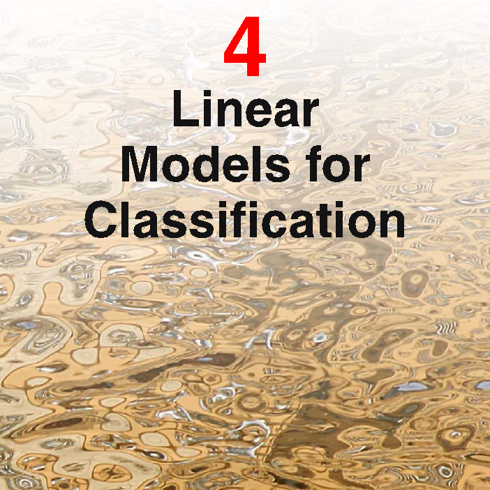

[Page 199]

# 4. Linear Models for Classification

In the previous chapter, we explored a class of regression models having particularly simple analytical and computational properties. We now discuss an analogous class of models for solving classification problems. The goal in classification is to take an input vector $\mathbf{x}$ and to assign it to one of $K$ discrete classes $\mathcal{C}_k$ where $k = 1, \ldots, K$. In the most common scenario, the classes are taken to be disjoint, so that each input is assigned to one and only one class. The input space is thereby divided into decision regions whose boundaries are called decision boundaries or decision surfaces. In this chapter, we consider linear models for classification, by which we mean that the decision surfaces are linear functions of the input vector $\mathbf{x}$ and hence are defined by $(D - 1)$-dimensional hyperplanes within the $D$-dimensional input space. Data sets whose classes can be separated exactly by linear decision surfaces are said to be linearly separable.

For regression problems, the target variable $\mathbf{t}$ was simply the vector of real numbers whose values we wish to predict. In the case of classification, there are various
[Page 200]

ways of using target values to represent class labels. For probabilistic models, the most convenient, in the case of two-class problems, is the binary representation in which there is a single target variable $t \in \{0, 1\}$ such that $t = 1$ represents class $\mathcal{C}_1$ and $t = 0$ represents class $\mathcal{C}_2$. We can interpret the value of $t$ as the probability that the class is $\mathcal{C}_1$, with the values of probability taking only the extreme values of $0$ and $1$. For $K > 2$ classes, it is convenient to use a 1-of-$K$ coding scheme in which $\mathbf{t}$ is a vector of length $K$ such that if the class is $\mathcal{C}_j$, then all elements $t_k$ of $\mathbf{t}$ are zero except element $t_j$, which takes the value $1$. For instance, if we have $K = 5$ classes, then a pattern from class 2 would be given the target vector

$$
\mathbf{t} = (0, 1, 0, 0, 0)^{\mathrm{T}}. \tag{4.1}
$$

Again, we can interpret the value of $t_k$ as the probability that the class is $\mathcal{C}_k$. For nonprobabilistic models, alternative choices of target variable representation will sometimes prove convenient.

In Chapter 1, we identified three distinct approaches to the classification problem. The simplest involves constructing a discriminant function that directly assigns each vector $\mathbf{x}$ to a specific class. A more powerful approach, however, models the conditional probability distribution $p(\mathcal{C}_k|\mathbf{x})$ in an inference stage, and then subsequently uses this distribution to make optimal decisions. By separating inference and decision, we gain numerous benefits, as discussed in Section 1.5.4. There are two different approaches to determining the conditional probabilities $p(\mathcal{C}_k|\mathbf{x})$. One technique is to model them directly, for example by representing them as parametric models and then optimizing the parameters using a training set. Alternatively, we can adopt a generative approach in which we model the class-conditional densities given by $p(\mathbf{x}|\mathcal{C}_k)$, together with the prior probabilities $p(\mathcal{C}_k)$ for the classes, and then we compute the required posterior probabilities using Bayes’ theorem

$$
p(\mathcal{C}_k|\mathbf{x}) = \frac{p(\mathbf{x}|\mathcal{C}_k)p(\mathcal{C}_k)}{p(\mathbf{x})}. \tag{4.2}
$$

We shall discuss examples of all three approaches in this chapter.

In the linear regression models considered in Chapter 3, the model prediction $y(\mathbf{x}, \mathbf{w})$ was given by a linear function of the parameters $\mathbf{w}$. In the simplest case, the model is also linear in the input variables and therefore takes the form $y(\mathbf{x}) = \mathbf{w}^{\mathrm{T}}\mathbf{x} + w_0$, so that $y$ is a real number. For classification problems, however, we wish to predict discrete class labels, or more generally posterior probabilities that lie in the range $(0, 1)$. To achieve this, we consider a generalization of this model in which we transform the linear function of $\mathbf{w}$ using a nonlinear function $f(\cdot)$ so that

$$
y(\mathbf{x}) = f(\mathbf{w}^{\mathrm{T}}\mathbf{x} + w_0). \tag{4.3}
$$

In the machine learning literature $f(\cdot)$ is known as an activation function, whereas its inverse is called a link function in the statistics literature. The decision surfaces correspond to $y(\mathbf{x}) = \text{constant}$, so that $\mathbf{w}^{\mathrm{T}}\mathbf{x} + w_0 = \text{constant}$ and hence the decision surfaces are linear functions of $\mathbf{x}$, even if the function $f(\cdot)$ is nonlinear. For this reason, the class of models described by (4.3) are called generalized linear models
[Page 201]

(McCullagh and Nelder, 1989). Note, however, that in contrast to the models used for regression, they are no longer linear in the parameters due to the presence of the nonlinear function $f(\cdot)$. This will lead to more complex analytical and computational properties than for linear regression models. Nevertheless, these models are still relatively simple compared to the more general nonlinear models that will be studied in subsequent chapters.

The algorithms discussed in this chapter will be equally applicable if we first make a fixed nonlinear transformation of the input variables using a vector of basis functions $\boldsymbol{\phi}(\mathbf{x})$ as we did for regression models in Chapter 3. We begin by considering classification directly in the original input space $\mathbf{x}$, while in Section 4.3 we shall find it convenient to switch to a notation involving basis functions for consistency with later chapters.

## 4.1. Discriminant Functions

A discriminant is a function that takes an input vector $\mathbf{x}$ and assigns it to one of $K$ classes, denoted $\mathcal{C}_k$. In this chapter, we shall restrict attention to linear discriminants, namely those for which the decision surfaces are hyperplanes. To simplify the discussion, we consider first the case of two classes and then investigate the extension to $K > 2$ classes.

### 4.1.1 Two classes

The simplest representation of a linear discriminant function is obtained by taking a linear function of the input vector so that

$$
y(\mathbf{x}) = \mathbf{w}^T \mathbf{x} + w_0
\tag{4.4}
$$

where $\mathbf{w}$ is called a weight vector, and $w_0$ is a bias (not to be confused with bias in the statistical sense). The negative of the bias is sometimes called a threshold. An input vector $\mathbf{x}$ is assigned to class $\mathcal{C}_1$ if $y(\mathbf{x}) \ge 0$ and to class $\mathcal{C}_2$ otherwise. The corresponding decision boundary is therefore defined by the relation $y(\mathbf{x}) = 0$, which corresponds to a $(D - 1)$-dimensional hyperplane within the $D$-dimensional input space. Consider two points $\mathbf{x}_A$ and $\mathbf{x}_B$ both of which lie on the decision surface. Because $y(\mathbf{x}_A) = y(\mathbf{x}_B) = 0$, we have $\mathbf{w}^T(\mathbf{x}_A - \mathbf{x}_B) = 0$ and hence the vector $\mathbf{w}$ is orthogonal to every vector lying within the decision surface, and so $\mathbf{w}$ determines the orientation of the decision surface. Similarly, if $\mathbf{x}$ is a point on the decision surface, then $y(\mathbf{x}) = 0$, and so the normal distance from the origin to the decision surface is given by

$$
\frac{\mathbf{w}^T \mathbf{x}}{\|\mathbf{w}\|} = -\frac{w_0}{\|\mathbf{w}\|}
\tag{4.5}
$$

We therefore see that the bias parameter $w_0$ determines the location of the decision surface. These properties are illustrated for the case of $D = 2$ in Figure 4.1.

Furthermore, we note that the value of $y(\mathbf{x})$ gives a signed measure of the perpendicular distance $r$ of the point $\mathbf{x}$ from the decision surface. To see this, consider
[Page 202]

Figure 4.1 Illustration of the geometry of a linear discriminant function in two dimensions. The decision surface, shown in red, is perpendicular to $\mathbf{w}$, and its displacement from the origin is controlled by the bias parameter $w_0$. Also, the signed orthogonal distance of a general point $\mathbf{x}$ from the decision surface is given by $y(\mathbf{x})/\|\mathbf{w}\|$.

![The image depicts a geometric figure with several lines and points. Here is a detailed description of the image: ## Description: - **Lines and Points**: - There are two lines: - Line A is a straight line with a positive slope. - Line B is a straight line with a negative slope. - There are two points: - Point A is located on line A. - Point B is located on line B. - There are two points: - Point C is located on line A. - Point D is located on line B. - There are two points: - Point E is located on line A. - Point F is located on line B. - There are two points: - Point G is located on line A. - Point H is located on line B. - There are two points: - Point J is located on line A. - Point K is located on line](../Images/imageFile91.png)

an arbitrary point $\mathbf{x}$ and let $\mathbf{x}_\perp$ be its orthogonal projection onto the decision surface, so that

$$
\mathbf{x} = \mathbf{x}_{\perp} + r \frac{\mathbf{w}}{\|\mathbf{w}\|}.
\tag{4.6}
$$

Multiplying both sides of this result by $\mathbf{w}^T$ and adding $w_0$, and making use of $y(\mathbf{x}) = \mathbf{w}^T\mathbf{x} + w_0$ and $y(\mathbf{x}_\perp) = \mathbf{w}^T\mathbf{x}_\perp + w_0 = 0$, we have

$$
r = \frac{y(\mathbf{x})}{\|\mathbf{w}\|}.
\tag{4.7}
$$

This result is illustrated in Figure 4.1.

As with the linear regression models in Chapter 3, it is sometimes convenient to use a more compact notation in which we introduce an additional dummy 'input' value $x_0 = 1$ and then define $\widetilde{\mathbf{w}} = (w_0, \mathbf{w})$ and $\widetilde{\mathbf{x}} = (x_0, \mathbf{x})$ so that

$$
y(\mathbf{x}) = \widetilde{\mathbf{w}}^T \widetilde{\mathbf{x}}.
\tag{4.8}
$$

In this case, the decision surfaces are $D$-dimensional hyperplanes passing through the origin of the $D + 1$-dimensional expanded input space.

## 4.1.2 Multiple classes

Now consider the extension of linear discriminants to $K > 2$ classes. We might be tempted to build a $K$-class discriminant by combining a number of two-class discriminant functions. However, this leads to some serious difficulties (Duda and Hart, 1973) as we now show.

Consider the use of $K-1$ classifiers each of which solves a two-class problem of separating points in a particular class $\mathcal{C}_k$ from points not in that class. This is known as a one-versus-the-rest classifier. The left-hand example in Figure 4.2 shows an
[Page 203]

Figure 4.2 Attempting to construct a $K$ class discriminant from a set of two class discriminants leads to ambiguous regions, shown in green. On the left is an example involving the use of two discriminants designed to distinguish points in class $\mathcal{C}_k$ from points not in class $\mathcal{C}_k$. On the right is an example involving three discriminant functions each of which is used to separate a pair of classes $\mathcal{C}_k$ and $\mathcal{C}_j$.

example involving three classes where this approach leads to regions of input space that are ambiguously classified.

An alternative is to introduce $K(K - 1)/2$ binary discriminant functions, one for every possible pair of classes. This is known as a one-versus-one classifier. Each point is then classified according to a majority vote amongst the discriminant functions. However, this too runs into the problem of ambiguous regions, as illustrated in the right-hand diagram of Figure 4.2.

We can avoid these difficulties by considering a single $K$-class discriminant comprising $K$ linear functions of the form

$$
y_k(\mathbf{x}) = \mathbf{w}_k^T \mathbf{x} + w_{k0} \tag{4.9}
$$

and then assigning a point $\mathbf{x}$ to class $\mathcal{C}_k$ if $y_k(\mathbf{x}) > y_j(\mathbf{x})$ for all $j \neq k$. The decision boundary between class $\mathcal{C}_k$ and class $\mathcal{C}_j$ is therefore given by $y_k(\mathbf{x}) = y_j(\mathbf{x})$ and hence corresponds to a $(D - 1)$-dimensional hyperplane defined by

$$
(\mathbf{w}_k - \mathbf{w}_j)^T \mathbf{x} + (w_{k0} - w_{j0}) = 0. \tag{4.10}
$$

This has the same form as the decision boundary for the two-class case discussed in Section 4.1.1, and so analogous geometrical properties apply.

The decision regions of such a discriminant are always singly connected and convex. To see this, consider two points $\mathbf{x}_A$ and $\mathbf{x}_B$ both of which lie inside decision region $\mathcal{R}_k$, as illustrated in Figure 4.3. Any point $\widehat{\mathbf{x}}$ that lies on the line connecting $\mathbf{x}_A$ and $\mathbf{x}_B$ can be expressed in the form

$$
\widehat{\mathbf{x}} = \lambda \mathbf{x}_A + (1 - \lambda)\mathbf{x}_B \tag{4.11}
$$

[Page 204]

Figure 4.3 Illustration of the decision regions for a multiclass linear discriminant, with the decision boundaries shown in red. If two points $\mathbf{x}_A$ and $\mathbf{x}_B$ both lie inside the same decision region $\mathcal{R}_k$, then any point $\widehat{\mathbf{x}}$ that lies on the line connecting these two points must also lie in $\mathcal{R}_k$, and hence the decision region must be singly connected and convex.

where $0 \leqslant \lambda \leqslant 1$. From the linearity of the discriminant functions, it follows that

$$
y_k(\widehat{\mathbf{x}}) = \lambda y_k(\mathbf{x}_A) + (1 - \lambda)y_k(\mathbf{x}_B). \tag{4.12}
$$

Because both $\mathbf{x}_A$ and $\mathbf{x}_B$ lie inside $\mathcal{R}_k$, it follows that $y_k(\mathbf{x}_A) > y_j(\mathbf{x}_A)$, and $y_k(\mathbf{x}_B) > y_j(\mathbf{x}_B)$, for all $j \neq k$, and hence $y_k(\widehat{\mathbf{x}}) > y_j(\widehat{\mathbf{x}})$, and so $\widehat{\mathbf{x}}$ also lies inside $\mathcal{R}_k$. Thus $\mathcal{R}_k$ is singly connected and convex.

Note that for two classes, we can either employ the formalism discussed here, based on two discriminant functions $y_1(\mathbf{x})$ and $y_2(\mathbf{x})$, or else use the simpler but equivalent formulation described in Section 4.1.1 based on a single discriminant function $y(\mathbf{x})$.

We now explore three approaches to learning the parameters of linear discriminant functions, based on least squares, Fisher’s linear discriminant, and the perceptron algorithm.

## 4.1.3 Least squares for classification

In Chapter 3, we considered models that were linear functions of the parameters, and we saw that the minimization of a sum-of-squares error function led to a simple closed-form solution for the parameter values. It is therefore tempting to see if we can apply the same formalism to classification problems. Consider a general classification problem with $K$ classes, with a 1-of-$K$ binary coding scheme for the target vector $\mathbf{t}$. One justification for using least squares in such a context is that it approximates the conditional expectation $\mathbb{E}[\mathbf{t}|\mathbf{x}]$ of the target values given the input vector. For the binary coding scheme, this conditional expectation is given by the vector of posterior class probabilities. Unfortunately, however, these probabilities are typically approximated rather poorly, indeed the approximations can have values outside the range $(0,1)$, due to the limited flexibility of a linear model as we shall see shortly.

Each class $\mathcal{C}_k$ is described by its own linear model so that

$$
y_k(\mathbf{x}) = \mathbf{w}_k^{\mathrm{T}}\mathbf{x} + w_{k0} \tag{4.13}
$$

where $k = 1,\ldots,K$. We can conveniently group these together using vector notation so that

$$
\mathbf{y}(\mathbf{x}) = \widetilde{\mathbf{W}}^{\mathrm{T}}\widetilde{\mathbf{x}} \tag{4.14}
$$

[Page 205]

where $\widetilde{\mathbf{W}}$ is a matrix whose $k^{\text{th}}$ column comprises the $D+1$-dimensional vector $\widetilde{\mathbf{w}}_k = (w_{k0}, \mathbf{w}_k^{\text{T}})^{\text{T}}$ and $\widetilde{\mathbf{x}}$ is the corresponding augmented input vector $(1, \mathbf{x}^{\text{T}})^{\text{T}}$ with a dummy input $x_0 = 1$. This representation was discussed in detail in Section 3.1. A new input $\mathbf{x}$ is then assigned to the class for which the output $y_k = \widetilde{\mathbf{w}}_k^{\text{T}} \widetilde{\mathbf{x}}$ is largest.

We now determine the parameter matrix $\widetilde{\mathbf{W}}$ by minimizing a sum-of-squares error function, as we did for regression in Chapter 3. Consider a training data set $\{\mathbf{x}_n, \mathbf{t}_n\}$ where $n = 1, \ldots, N$, and define a matrix $\mathbf{T}$ whose $n^{\text{th}}$ row is the vector $\mathbf{t}_n^{\text{T}}$, together with a matrix $\widetilde{\mathbf{X}}$ whose $n^{\text{th}}$ row is $\widetilde{\mathbf{x}}_n^{\text{T}}$. The sum-of-squares error function can then be written as

$$
E_D(\widetilde{\mathbf{W}}) = \frac{1}{2} \text{Tr}\left\{ (\widetilde{\mathbf{X}}\widetilde{\mathbf{W}} - \mathbf{T})^{\text{T}} (\widetilde{\mathbf{X}}\widetilde{\mathbf{W}} - \mathbf{T}) \right\} . \tag{4.15}
$$

Setting the derivative with respect to $\widetilde{\mathbf{W}}$ to zero, and rearranging, we then obtain the solution for $\widetilde{\mathbf{W}}$ in the form

$$
\widetilde{\mathbf{W}} = (\widetilde{\mathbf{X}}^{\text{T}}\widetilde{\mathbf{X}})^{-1}\widetilde{\mathbf{X}}^{\text{T}}\mathbf{T} = \widetilde{\mathbf{X}}^{\dagger}\mathbf{T} \tag{4.16}
$$

where $\widetilde{\mathbf{X}}^{\dagger}$ is the pseudo-inverse of the matrix $\widetilde{\mathbf{X}}$, as discussed in Section 3.1.1. We then obtain the discriminant function in the form

$$
\mathbf{y}(\mathbf{x}) = \widetilde{\mathbf{W}}^{\text{T}} \widetilde{\mathbf{x}} = \mathbf{T}^{\text{T}} (\widetilde{\mathbf{X}}^{\dagger})^{\text{T}} \widetilde{\mathbf{x}}. \tag{4.17}
$$

An interesting property of least-squares solutions with multiple target variables is that if every target vector in the training set satisfies some linear constraint

$$
\mathbf{a}^{\text{T}}\mathbf{t}_n + b = 0 \tag{4.18}
$$

for some constants $\mathbf{a}$ and $b$, then the model prediction for any value of $\mathbf{x}$ will satisfy the same constraint so that

$$
\mathbf{a}^{\text{T}}\mathbf{y}(\mathbf{x}) + b = 0. \tag{4.19}
$$

Thus if we use a 1-of-$K$ coding scheme for $K$ classes, then the predictions made by the model will have the property that the elements of $\mathbf{y}(\mathbf{x})$ will sum to $1$ for any value of $\mathbf{x}$. However, this summation constraint alone is not sufficient to allow the model outputs to be interpreted as probabilities because they are not constrained to lie within the interval $(0, 1)$.

The least-squares approach gives an exact closed-form solution for the discriminant function parameters. However, even as a discriminant function (where we use it to make decisions directly and dispense with any probabilistic interpretation) it suffers from some severe problems. We have already seen that least-squares solutions lack robustness to outliers, and this applies equally to the classification application, as illustrated in Figure 4.4. Here we see that the additional data points in the right-hand figure produce a significant change in the location of the decision boundary, even though these points would be correctly classified by the original decision boundary in the left-hand figure. The sum-of-squares error function penalizes predictions that are ‘too correct’ in that they lie a long way on the correct side of the decision
[Page 206]

![The image is a scatter plot with two axes. The x-axis is labeled x and the y-axis is labeled y. The plot is divided into two sections, each labeled x and y. The x-axis is labeled x and the y-axis is labeled y. There are two sets of data points plotted on the graph. The first set of data points is plotted on the x-axis and the second set of data points is plotted on the y-axis. The data points are scattered around the x-axis and the y-axis. The scatter plot is not perfectly symmetrical, but there are some patterns visible. The first set of data points is plotted on the x-axis and the second set of data points is plotted on the y-axis. The x-axis is labeled x and the y-axis is labeled y. The data points are scattered around the x-axis and the y-axis](../Images/imageFile94.png)

Figure 4.4 The left plot shows data from two classes, denoted by red crosses and blue circles, together with the decision boundary found by least squares (magenta curve) and also by the logistic regression model (green curve), which is discussed later in Section 4.3.2. The right-hand plot shows the corresponding results obtained when extra data points are added at the bottom left of the diagram, showing that least squares is highly sensitive to outliers, unlike logistic regression.

boundary. In Section 7.1.2, we shall consider several alternative error functions for classification and we shall see that they do not suffer from this difficulty.

However, problems with least squares can be more severe than simply lack of robustness, as illustrated in Figure 4.5. This shows a synthetic data set drawn from three classes in a two-dimensional input space $(x_1, x_2)$, having the property that linear decision boundaries can give excellent separation between the classes. Indeed, the technique of logistic regression, described later in this chapter, gives a satisfactory solution as seen in the right-hand plot. However, the least-squares solution gives poor results, with only a small region of the input space assigned to the green class.

The failure of least squares should not surprise us when we recall that it corresponds to maximum likelihood under the assumption of a Gaussian conditional distribution, whereas binary target vectors clearly have a distribution that is far from Gaussian. By adopting more appropriate probabilistic models, we shall obtain classification techniques with much better properties than least squares. For the moment, however, we continue to explore alternative nonprobabilistic methods for setting the parameters in the linear classification models.

## 4.1.4 Fisher’s linear discriminant

One way to view a linear classification model is in terms of dimensionality reduction. Consider first the case of two classes, and suppose we take the $D$-
[Page 207]

![The image is a scatter plot with two sets of data points. The x-axis is labeled as 6 and the y-axis is labeled as 2. The data points are represented by dots, and each data point is colored blue. The points are scattered in a random pattern, with no clear pattern or pattern in the data. The scatter plot is titled Skewed Data and is marked with the letter S. The first set of data points is represented by the blue dots, and the second set of data points is represented by the green dots. The x-axis values are labeled as 6 and the y-axis values are labeled as 2. The data points are scattered in a random pattern, with no clear pattern or pattern in the data. The scatter plot is titled Skewed Data and is marked with the letter S. The plot is titled Skewed Data and is marked with the letter](../Images/imageFile95.png)

Figure 4.5 Example of a synthetic data set comprising three classes, with training data points denoted in red ($\times$), green ($+$), and blue ($\circ$). Lines denote the decision boundaries, and the background colours denote the respective classes of the decision regions. On the left is the result of using a least-squares discriminant. We see that the region of input space assigned to the green class is too small and so most of the points from this class are misclassified. On the right is the result of using logistic regressions as described in Section 4.3.2 showing correct classification of the training data.

dimensional input vector $\mathbf{x}$ and project it down to one dimension using

$$
y = \mathbf{w}^{\mathrm{T}}\mathbf{x}.
\tag{4.20}
$$

If we place a threshold on $y$ and classify $y \ge -w_0$ as class $\mathcal{C}_1$, and otherwise class $\mathcal{C}_2$, then we obtain our standard linear classifier discussed in the previous section. In general, the projection onto one dimension leads to a considerable loss of information, and classes that are well separated in the original $D$-dimensional space may become strongly overlapping in one dimension. However, by adjusting the components of the weight vector $\mathbf{w}$, we can select a projection that maximizes the class separation. To begin with, consider a two-class problem in which there are $N_1$ points of class $\mathcal{C}_1$ and $N_2$ points of class $\mathcal{C}_2$, so that the mean vectors of the two classes are given by

$$
\mathbf{m}_1 = \frac{1}{N_1} \sum_{n \in \mathcal{C}_1} \mathbf{x}_n, \quad \mathbf{m}_2 = \frac{1}{N_2} \sum_{n \in \mathcal{C}_2} \mathbf{x}_n.
\tag{4.21}
$$

The simplest measure of the separation of the classes, when projected onto $\mathbf{w}$, is the separation of the projected class means. This suggests that we might choose $\mathbf{w}$ so as to maximize

$$
m_2 - m_1 = \mathbf{w}^{\mathrm{T}}(\mathbf{m}_2 - \mathbf{m}_1)
\tag{4.22}
$$

where

$$
m_k = \mathbf{w}^{\mathrm{T}}\mathbf{m}_k
\tag{4.23}
$$

[Page 208]

![The image is a scatter plot with two sets of data. The x-axis is labeled days and the y-axis is labeled total. The plot consists of two sets of data, each set is represented by a different color. The first set of data is represented by blue and the second set is represented by red. ## Description of the Data Points: - **Blue Data Set (Days 1-2)**: - The blue data set has a relatively high value of 2. - The blue data set has a small but noticeable increase in the first few days. - The blue data set has a small but noticeable decrease in the second few days. - **Red Data Set (Days 3-5)**: - The red data set has a relatively high value of 2. - The red data set has a small but noticeable increase in the first few days. - The red data set has a small but noticeable decrease](../Images/imageFile96.png)

Figure 4.6 The left plot shows samples from two classes (depicted in red and blue) along with the histograms resulting from projection onto the line joining the class means. Note that there is considerable class overlap in the projected space. The right plot shows the corresponding projection based on the Fisher linear discriminant, showing the greatly improved class separation.

is the mean of the projected data from class $\mathcal{C}_k$. However, this expression can be made arbitrarily large simply by increasing the magnitude of $\mathbf{w}$. To solve this problem, we could constrain $\mathbf{w}$ to have unit length, so that $\sum_i w_i^2 = 1$. Using a Lagrange multiplier to perform the constrained maximization, we then find that $\mathbf{w} \propto (\mathbf{m}_2 - \mathbf{m}_1)$. There is still a problem with this approach, however, as illustrated in Figure 4.6. This shows two classes that are well separated in the original two-dimensional space $(x_1, x_2)$ but that have considerable overlap when projected onto the line joining their means. This difficulty arises from the strongly nondiagonal covariances of the class distributions. The idea proposed by Fisher is to maximize a function that will give a large separation between the projected class means while also giving a small variance within each class, thereby minimizing the class overlap.

The projection formula (4.20) transforms the set of labelled data points in $\mathbf{x}$ into a labelled set in the one-dimensional space $y$. The within-class variance of the transformed data from class $\mathcal{C}_k$ is therefore given by

$$
s_k^2 = \sum_{n \in \mathcal{C}_k} (y_n - m_k)^2 \tag{4.24}
$$

where $y_n = \mathbf{w}^{\mathrm{T}}\mathbf{x}_n$. We can define the total within-class variance for the whole data set to be simply $s_1^2 + s_2^2$. The Fisher criterion is defined to be the ratio of the between-class variance to the within-class variance and is given by

$$
J(\mathbf{w}) = \frac{(m_2 - m_1)^2}{s_1^2 + s_2^2}. \tag{4.25}
$$

We can make the dependence on $\mathbf{w}$ explicit by using (4.20), (4.23), and (4.24) to rewrite the Fisher criterion in the form
[Page 209]

$$
J(\mathbf{w}) = \frac{\mathbf{w}^T \mathbf{S}_B \mathbf{w}}{\mathbf{w}^T \mathbf{S}_W \mathbf{w}} \tag{4.26}
$$

where $\mathbf{S}_B$ is the between-class covariance matrix and is given by

$$
\mathbf{S}_B = (\mathbf{m}_2 - \mathbf{m}_1)(\mathbf{m}_2 - \mathbf{m}_1)^T \tag{4.27}
$$

and $\mathbf{S}_W$ is the total within-class covariance matrix, given by

$$
\mathbf{S}_W = \sum_{n \in \mathcal{C}_1} (\mathbf{x}_n - \mathbf{m}_1)(\mathbf{x}_n - \mathbf{m}_1)^T + \sum_{n \in \mathcal{C}_2} (\mathbf{x}_n - \mathbf{m}_2)(\mathbf{x}_n - \mathbf{m}_2)^T. \tag{4.28}
$$

Differentiating (4.26) with respect to $\mathbf{w}$, we find that $J(\mathbf{w})$ is maximized when

$$
(\mathbf{w}^T \mathbf{S}_B \mathbf{w})\mathbf{S}_W \mathbf{w} = (\mathbf{w}^T \mathbf{S}_W \mathbf{w})\mathbf{S}_B \mathbf{w}. \tag{4.29}
$$

From (4.27), we see that $\mathbf{S}_B \mathbf{w}$ is always in the direction of $(\mathbf{m}_2 - \mathbf{m}_1)$. Furthermore, we do not care about the magnitude of $\mathbf{w}$, only its direction, and so we can drop the scalar factors $(\mathbf{w}^T \mathbf{S}_B \mathbf{w})$ and $(\mathbf{w}^T \mathbf{S}_W \mathbf{w})$. Multiplying both sides of (4.29) by $\mathbf{S}_W^{-1}$ we then obtain

$$
\mathbf{w} \propto \mathbf{S}_W^{-1}(\mathbf{m}_2 - \mathbf{m}_1). \tag{4.30}
$$

Note that if the within-class covariance is isotropic, so that $\mathbf{S}_W$ is proportional to the unit matrix, we find that $\mathbf{w}$ is proportional to the difference of the class means, as discussed above.

The result (4.30) is known as Fisher's linear discriminant, although strictly it is not a discriminant but rather a specific choice of direction for projection of the data down to one dimension. However, the projected data can subsequently be used to construct a discriminant, by choosing a threshold $y_0$ so that we classify a new point as belonging to $\mathcal{C}_1$ if $y(\mathbf{x}) \ge y_0$ and classify it as belonging to $\mathcal{C}_2$ otherwise. For example, we can model the class-conditional densities $p(y|\mathcal{C}_k)$ using Gaussian distributions and then use the techniques of Section 1.2.4 to find the parameters of the Gaussian distributions by maximum likelihood. Having found Gaussian approximations to the projected classes, the formalism of Section 1.5.1 then gives an expression for the optimal threshold. Some justification for the Gaussian assumption comes from the central limit theorem by noting that $y = \mathbf{w}^T\mathbf{x}$ is the sum of a set of random variables.

## 4.1.5 Relation to least squares

The least-squares approach to the determination of a linear discriminant was based on the goal of making the model predictions as close as possible to a set of target values. By contrast, the Fisher criterion was derived by requiring maximum class separation in the output space. It is interesting to see the relationship between these two approaches. In particular, we shall show that, for the two-class problem, the Fisher criterion can be obtained as a special case of least squares.

So far we have considered 1-of-$K$ coding for the target values. If, however, we adopt a slightly different target coding scheme, then the least-squares solution for
[Page 210]

the weights becomes equivalent to the Fisher solution (Duda and Hart, 1973). In particular, we shall take the targets for class $\mathcal{C}_1$ to be $N/N_1$, where $N_1$ is the number of patterns in class $\mathcal{C}_1$, and $N$ is the total number of patterns. This target value approximates the reciprocal of the prior probability for class $\mathcal{C}_1$. For class $\mathcal{C}_2$, we shall take the targets to be $-N/N_2$, where $N_2$ is the number of patterns in class $\mathcal{C}_2$.

The sum-of-squares error function can be written

$$
E = \frac{1}{2} \sum_{n=1}^{N} (\mathbf{w}^T \mathbf{x}_n + w_0 - t_n)^2 . \tag{4.31}
$$

Setting the derivatives of $E$ with respect to $w_0$ and $\mathbf{w}$ to zero, we obtain respectively

$$
\sum_{n=1}^{N} (\mathbf{w}^T \mathbf{x}_n + w_0 - t_n) = 0 \tag{4.32}
$$

$$
\sum_{n=1}^{N} (\mathbf{w}^T \mathbf{x}_n + w_0 - t_n) \mathbf{x}_n = 0 . \tag{4.33}
$$

From (4.32), and making use of our choice of target coding scheme for the $t_n$, we obtain an expression for the bias in the form

$$
w_0 = -\mathbf{w}^T \mathbf{m} \tag{4.34}
$$

where we have used

$$
\sum_{n=1}^{N} t_n = N_1 \frac{N}{N_1} - N_2 \frac{N}{N_2} = 0 \tag{4.35}
$$

and where $\mathbf{m}$ is the mean of the total data set and is given by

$$
\mathbf{m} = \frac{1}{N} \sum_{n=1}^{N} \mathbf{x}_n = \frac{1}{N} (N_1 \mathbf{m}_1 + N_2 \mathbf{m}_2) . \tag{4.36}
$$

After some straightforward algebra, and again making use of the choice of $t_n$, the second equation (4.33) becomes

$$
\left( \mathbf{S}_W + \frac{N_1 N_2}{N} \mathbf{S}_B \right) \mathbf{w} = N(\mathbf{m}_1 - \mathbf{m}_2) \tag{4.37}
$$

where $\mathbf{S}_W$ is defined by (4.28), $\mathbf{S}_B$ is defined by (4.27), and we have substituted for the bias using (4.34). Using (4.27), we note that $\mathbf{S}_B \mathbf{w}$ is always in the direction of $(\mathbf{m}_2 - \mathbf{m}_1)$. Thus we can write

$$
\mathbf{w} \propto \mathbf{S}_W^{-1} (\mathbf{m}_2 - \mathbf{m}_1) \tag{4.38}
$$

where we have ignored irrelevant scale factors. Thus the weight vector coincides with that found from the Fisher criterion. In addition, we have also found an expression for the bias value $w_0$ given by (4.34). This tells us that a new vector $\mathbf{x}$ should be classified as belonging to class $\mathcal{C}_1$ if $y(\mathbf{x}) = \mathbf{w}^T(\mathbf{x} - \mathbf{m}) > 0$ and class $\mathcal{C}_2$ otherwise.
[Page 211]

## 4.1.6 Fisher’s discriminant for multiple classes

We now consider the generalization of the Fisher discriminant to $K > 2$ classes, and we shall assume that the dimensionality $D$ of the input space is greater than the number $K$ of classes. Next, we introduce $D' > 1$ linear ‘features’ $y_k = \mathbf{w}_k^\text{T}\mathbf{x}$, where $k = 1,\ldots,D'$. These feature values can conveniently be grouped together to form a vector $\mathbf{y}$. Similarly, the weight vectors $\{\mathbf{w}_k\}$ can be considered to be the columns of a matrix $\mathbf{W}$, so that

$$
\mathbf{y} = \mathbf{W}^{\text{T}}\mathbf{x}. \tag{4.39}
$$

Note that again we are not including any bias parameters in the definition of $\mathbf{y}$. The generalization of the within-class covariance matrix to the case of $K$ classes follows from (4.28) to give

$$
\mathbf{S}_W = \sum_{k=1}^K \mathbf{S}_k \tag{4.40}
$$

where

$$
\mathbf{S}_k = \sum_{n \in \mathcal{C}_k} (\mathbf{x}_n - \mathbf{m}_k)(\mathbf{x}_n - \mathbf{m}_k)^{\text{T}} \tag{4.41}
$$

$$
\mathbf{m}_k = \frac{1}{N_k} \sum_{n \in \mathcal{C}_k} \mathbf{x}_n \tag{4.42}
$$

and $N_k$ is the number of patterns in class $\mathcal{C}_k$. In order to find a generalization of the between-class covariance matrix, we follow Duda and Hart (1973) and consider first the total covariance matrix

$$
\mathbf{S}_T = \sum_{n=1}^N (\mathbf{x}_n - \mathbf{m})(\mathbf{x}_n - \mathbf{m})^{\text{T}} \tag{4.43}
$$

where $\mathbf{m}$ is the mean of the total data set

$$
\mathbf{m} = \frac{1}{N} \sum_{n=1}^N \mathbf{x}_n = \frac{1}{N} \sum_{k=1}^K N_k \mathbf{m}_k \tag{4.44}
$$

and $N = \sum_{k=1}^K N_k$ is the total number of data points. The total covariance matrix can be decomposed into the sum of the within-class covariance matrix, given by (4.40) and (4.41), plus an additional matrix $\mathbf{S}_B$, which we identify as a measure of the between-class covariance

$$
\mathbf{S}_T = \mathbf{S}_W + \mathbf{S}_B \tag{4.45}
$$

where

$$
\mathbf{S}_B = \sum_{k=1}^K N_k(\mathbf{m}_k - \mathbf{m})(\mathbf{m}_k - \mathbf{m})^{\text{T}}. \tag{4.46}
$$

These covariance matrices have been defined in the original $\mathbf{x}$-space. We can now define similar matrices in the projected $D'$-dimensional $\mathbf{y}$-space
[Page 212]

These covariance matrices have been defined in the original $\mathbf{x}$-space. We can now define similar matrices in the projected $D$-dimensional $\mathbf{y}$-space

$$
\mathbf{s}_W = \sum_{k=1}^K \sum_{n \in \mathcal{C}_k} (\mathbf{y}_n - \boldsymbol{\mu}_k)(\mathbf{y}_n - \boldsymbol{\mu}_k)^{\mathrm{T}} \tag{4.47}
$$

and

$$
\mathbf{s}_B = \sum_{k=1}^K N_k (\boldsymbol{\mu}_k - \boldsymbol{\mu})(\boldsymbol{\mu}_k - \boldsymbol{\mu})^{\mathrm{T}} \tag{4.48}
$$

where

$$
\boldsymbol{\mu}_k = \frac{1}{N_k} \sum_{n \in \mathcal{C}_k} \mathbf{y}_n, \quad \boldsymbol{\mu} = \frac{1}{N} \sum_{k=1}^K N_k \boldsymbol{\mu}_k. \tag{4.49}
$$

Again we wish to construct a scalar that is large when the between-class covariance is large and when the within-class covariance is small. There are now many possible choices of criterion (Fukunaga, 1990). One example is given by

$$
J(\mathbf{W}) = \operatorname{Tr} \{ \mathbf{s}_W^{-1} \mathbf{s}_B \} . \tag{4.50}
$$

This criterion can then be rewritten as an explicit function of the projection matrix $\mathbf{W}$ in the form

$$
J(\mathbf{W}) = \operatorname{Tr} \left\{ (\mathbf{W}\mathbf{S}_W\mathbf{W}^{\mathrm{T}})^{-1} (\mathbf{W}\mathbf{S}_B\mathbf{W}^{\mathrm{T}}) \right\} . \tag{4.51}
$$

Maximization of such criteria is straightforward, though somewhat involved, and is discussed at length in Fukunaga (1990). The weight values are determined by those eigenvectors of $\mathbf{S}_W^{-1} \mathbf{S}_B$ that correspond to the $D$ largest eigenvalues.

There is one important result that is common to all such criteria, which is worth emphasizing. We first note from (4.46) that $\mathbf{S}_B$ is composed of the sum of $K$ matrices, each of which is an outer product of two vectors and therefore of rank $1$. In addition, only $(K - 1)$ of these matrices are independent as a result of the constraint (4.44). Thus, $\mathbf{S}_B$ has rank at most equal to $(K - 1)$ and so there are at most $(K - 1)$ nonzero eigenvalues. This shows that the projection onto the $(K - 1)$-dimensional subspace spanned by the eigenvectors of $\mathbf{S}_B$ does not alter the value of $J(\mathbf{W})$, and so we are therefore unable to find more than $(K - 1)$ linear ‘features’ by this means (Fukunaga, 1990).

## 4.1.7 The perceptron algorithm

Another example of a linear discriminant model is the perceptron of Rosenblatt (1962), which occupies an important place in the history of pattern recognition algorithms. It corresponds to a two-class model in which the input vector $\mathbf{x}$ is first transformed using a fixed nonlinear transformation to give a feature vector $\boldsymbol{\phi}(\mathbf{x})$, and this is then used to construct a generalized linear model of the form

$$
y(\mathbf{x}) = f(\mathbf{w}^{\mathrm{T}}\boldsymbol{\phi}(\mathbf{x})) \tag{4.52}
$$

[Page 213]

where the nonlinear activation function $f(\cdot)$ is given by a step function of the form

$$
f(a) = \begin{cases} +1, & a \geqslant 0 \\ -1, & a < 0. \end{cases} \tag{4.53}
$$

The vector $\boldsymbol{\phi}(\mathbf{x})$ will typically include a bias component $\phi_0(\mathbf{x}) = 1$. In earlier discussions of two-class classification problems, we have focussed on a target coding scheme in which $t \in \{0,1\}$, which is appropriate in the context of probabilistic models. For the perceptron, however, it is more convenient to use target values $t = +1$ for class $\mathcal{C}_1$ and $t = -1$ for class $\mathcal{C}_2$, which matches the choice of activation function.

The algorithm used to determine the parameters $\mathbf{w}$ of the perceptron can most easily be motivated by error function minimization. A natural choice of error function would be the total number of misclassified patterns. However, this does not lead to a simple learning algorithm because the error is a piecewise constant function of $\mathbf{w}$, with discontinuities wherever a change in $\mathbf{w}$ causes the decision boundary to move across one of the data points. Methods based on changing $\mathbf{w}$ using the gradient of the error function cannot then be applied, because the gradient is zero almost everywhere.

We therefore consider an alternative error function known as the _perceptron criterion_. To derive this, we note that we are seeking a weight vector $\mathbf{w}$ such that patterns $\mathbf{x}_n$ in class $\mathcal{C}_1$ will have $\mathbf{w}^{\mathrm{T}}\boldsymbol{\phi}(\mathbf{x}_n) > 0$, whereas patterns $\mathbf{x}_n$ in class $\mathcal{C}_2$ have $\mathbf{w}^{\mathrm{T}}\boldsymbol{\phi}(\mathbf{x}_n) < 0$. Using the $t \in \{-1,+1\}$ target coding scheme it follows that we would like all patterns to satisfy $\mathbf{w}^{\mathrm{T}}\boldsymbol{\phi}(\mathbf{x}_n)t_n > 0$. The perceptron criterion associates zero error with any pattern that is correctly classified, whereas for a misclassified pattern $\mathbf{x}_n$ it tries to minimize the quantity $-\mathbf{w}^{\mathrm{T}}\boldsymbol{\phi}(\mathbf{x}_n)t_n$. The perceptron criterion is therefore given by

$$
E_P(\mathbf{w}) = - \sum_{n \in \mathcal{M}} \mathbf{w}^{\mathrm{T}} \boldsymbol{\phi}_n t_n \tag{4.54}
$$

##### Frank Rosenblatt

1928–1969

Rosenblatt’s perceptron played an important role in the history of machine learning. Initially, Rosenblatt simulated the perceptron on an IBM 704 computer at Cornell in 1957, but by the early 1960s he had built special-purpose hardware that provided a direct, parallel implementation of perceptron learning. Many of his ideas were encapsulated in “Principles of Neurodynamics: Perceptrons and the Theory of Brain Mechanisms” published in 1962. Rosenblatt’s work was criticized by Marvin Minksy, whose objections were published in the book “Perceptrons”, co-authored with Seymour Papert. This book was widely misinterpreted at the time as showing that neural networks were fatally flawed and could only learn solutions for linearly separable problems. In fact, it only proved such limitations in the case of single-layer networks such as the perceptron and merely conjectured (incorrectly) that they applied to more general network models. Unfortunately, however, this book contributed to the substantial decline in research funding for neural computing, a situation that was not reversed until the mid-1980s. Today, there are many hundreds, if not thousands, of applications of neural networks in widespread use, with examples in areas such as handwriting recognition and information retrieval being used routinely by millions of people.
[Page 214]

where $\mathcal{M}$ denotes the set of all misclassified patterns. The contribution to the error associated with a particular misclassified pattern is a linear function of $\mathbf{w}$ in regions of $\mathbf{w}$ space where the pattern is misclassified and zero in regions where it is correctly classified. The total error function is therefore piecewise linear.

We now apply the stochastic gradient descent algorithm to this error function. The change in the weight vector $\mathbf{w}$ is then given by

$$
\mathbf{w}^{(\tau+1)} = \mathbf{w}^{(\tau)} - \eta \nabla E_P(\mathbf{w}) = \mathbf{w}^{(\tau)} + \eta \boldsymbol{\phi}_n t_n \tag{4.55}
$$

where $\eta$ is the learning rate parameter and $\tau$ is an integer that indexes the steps of the algorithm. Because the perceptron function $y(\mathbf{x}, \mathbf{w})$ is unchanged if we multiply $\mathbf{w}$ by a constant, we can set the learning rate parameter $\eta$ equal to $1$ without loss of generality. Note that, as the weight vector evolves during training, the set of patterns that are misclassified will change.

The perceptron learning algorithm has a simple interpretation, as follows. We cycle through the training patterns in turn, and for each pattern $\mathbf{x}_n$ we evaluate the perceptron function (4.52). If the pattern is correctly classified, then the weight vector remains unchanged, whereas if it is incorrectly classified, then for class $\mathcal{C}_1$ we add the vector $\boldsymbol{\phi}(\mathbf{x}_n)$ onto the current estimate of weight vector $\mathbf{w}$ while for class $\mathcal{C}_2$ we subtract the vector $\boldsymbol{\phi}(\mathbf{x}_n)$ from $\mathbf{w}$. The perceptron learning algorithm is illustrated in Figure 4.7.

If we consider the effect of a single update in the perceptron learning algorithm, we see that the contribution to the error from a misclassified pattern will be reduced because from (4.55) we have

$$
-{\mathbf{w}^{(\tau+1)}}^{\mathrm{T}} \boldsymbol{\phi}_n t_n = -{\mathbf{w}^{(\tau)}}^{\mathrm{T}} \boldsymbol{\phi}_n t_n - (\boldsymbol{\phi}_n t_n)^{\mathrm{T}} \boldsymbol{\phi}_n t_n < -{\mathbf{w}^{(\tau)}}^{\mathrm{T}} \boldsymbol{\phi}_n t_n \tag{4.56}
$$

where we have set $\eta = 1$, and made use of $\| \boldsymbol{\phi}_n t_n \|^2 > 0$. Of course, this does not imply that the contribution to the error function from the other misclassified patterns will have been reduced. Furthermore, the change in weight vector may have caused some previously correctly classified patterns to become misclassified. Thus the perceptron learning rule is not guaranteed to reduce the total error function at each stage.

However, the perceptron convergence theorem states that if there exists an exact solution (in other words, if the training data set is linearly separable), then the perceptron learning algorithm is guaranteed to find an exact solution in a finite number of steps. Proofs of this theorem can be found for example in Rosenblatt (1962), Block (1962), Nilsson (1965), Minsky and Papert (1969), Hertz et al. (1991), and Bishop (1995a). Note, however, that the number of steps required to achieve convergence could still be substantial, and in practice, until convergence is achieved, we will not be able to distinguish between a nonseparable problem and one that is simply slow to converge.

Even when the data set is linearly separable, there may be many solutions, and which one is found will depend on the initialization of the parameters and on the order of presentation of the data points. Furthermore, for data sets that are not linearly separable, the perceptron learning algorithm will never converge.
[Page 215]

![The image depicts a geometric diagram with four quadrants labeled A, B, C, and D. Each quadrant is divided into four smaller quadrants, and each quadrant is labeled with a different color. The quadrants are labeled with numbers, with the top left quadrant labeled 0, the top right quadrant labeled 1, the bottom left quadrant labeled 2, and the bottom right quadrant labeled 3. Each quadrant contains a series of points labeled with numbers, and the points are connected by lines. The points are connected by arrows, which indicate the direction of the lines. The arrows are pointing in different directions, and they are colored differently. The diagram is labeled with the following labels: - A: 0, 1, 2, 3, 4 - B: 0, 1, 2, 3, 4 - C: 0, 1, 2, 3, 4 - D](../Images/imageFile98.png)

Figure 4.7 Illustration of the convergence of the perceptron learning algorithm, showing data points from two classes (red and blue) in a two-dimensional feature space $(\phi_1, \phi_2)$. The top left plot shows the initial parameter vector $\mathbf{w}$ shown as a black arrow together with the corresponding decision boundary (black line), in which the arrow points towards the decision region which classified as belonging to the red class. The data point circled in green is misclassified and so its feature vector is added to the current weight vector, giving the new decision boundary shown in the top right plot. The bottom left plot shows the next misclassified point to be considered, indicated by the green circle, and its feature vector is again added to the weight vector giving the decision boundary shown in the bottom right plot for which all data points are correctly classified.
[Page 216]

Figure 4.8 Illustration of the Mark 1 perceptron hardware. The photograph on the left shows how the inputs were obtained using a simple camera system in which an input scene, in this case a printed character, was illuminated by powerful lights, and an image focussed onto a $20 \times 20$ array of cadmium sulphide photocells, giving a primitive 400 pixel image. The perceptron also had a patch board, shown in the middle photograph, which allowed different configurations of input features to be tried. Often these were wired up at random to demonstrate the ability of the perceptron to learn without the need for precise wiring, in contrast to a modern digital computer. The photograph on the right shows one of the racks of adaptive weights. Each weight was implemented using a rotary variable resistor, also called a potentiometer, driven by an electric motor thereby allowing the value of the weight to be adjusted automatically by the learning algorithm.

Aside from difficulties with the learning algorithm, the perceptron does not provide probabilistic outputs, nor does it generalize readily to $K > 2$ classes. The most important limitation, however, arises from the fact that (in common with all of the models discussed in this chapter and the previous one) it is based on linear combinations of fixed basis functions. More detailed discussions of the limitations of perceptrons can be found in Minsky and Papert (1969) and Bishop (1995a).

Analogue hardware implementations of the perceptron were built by Rosenblatt, based on motor-driven variable resistors to implement the adaptive parameters $w_j$. These are illustrated in Figure 4.8. The inputs were obtained from a simple camera system based on an array of photo-sensors, while the basis functions $\phi$ could be chosen in a variety of ways, for example based on simple fixed functions of randomly chosen subsets of pixels from the input image. Typical applications involved learning to discriminate simple shapes or characters.

At the same time that the perceptron was being developed, a closely related system called the adaline, which is short for ‘adaptive linear element’, was being explored by Widrow and co-workers. The functional form of the model was the same as for the perceptron, but a different approach to training was adopted (Widrow and Hoff, 1960; Widrow and Lehr, 1990).

### 4.2. Probabilistic Generative Models

We turn next to a probabilistic view of classification and show how models with linear decision boundaries arise from simple assumptions about the distribution of the data. In Section 1.5.4, we discussed the distinction between the discriminative and the generative approaches to classification. Here we shall adopt a generative
[Page 217]

Figure 4.9 Plot of the logistic sigmoid function $\sigma(a)$ defined by (4.59), shown in red, together with the scaled probit function $\Phi(\lambda a)$, for $\lambda^2 = \pi/8$, shown in dashed blue, where $\Phi(a)$ is defined by (4.114). The scaling factor $\pi/8$ is chosen so that the derivatives of the two curves are equal for $a = 0$.

![The image shows a graph with two lines. The x-axis is labeled as y and the y-axis is labeled as x. The graph has a single line that starts at the point (0, 0) and extends upwards to the right, while the other line starts at the point (1, 0) and extends downwards to the right. The line that starts at the point (0, 0) is a straight line, while the line that starts at the point (1, 0) is a curved line. The graph has a scale of range from 0 to 5 on the y-axis, and a scale of range from 0 to 5 on the x-axis, with a minimum of 0 and a maximum of 5. The graph is drawn with a single line, and the line starts at the point (0, 0) and extends upwards to the right, while the line starts at the point (](../Images/imageFile100.png)

approach in which we model the class-conditional densities $p(\mathbf{x}|\mathcal{C}_k)$, as well as the class priors $p(\mathcal{C}_k)$, and then use these to compute posterior probabilities $p(\mathcal{C}_k|\mathbf{x})$ through Bayes’ theorem.

Consider first of all the case of two classes. The posterior probability for class $\mathcal{C}_1$ can be written as

$$
\begin{align}
p(\mathcal{C}_1|\mathbf{x}) &= \frac{p(\mathbf{x}|\mathcal{C}_1)p(\mathcal{C}_1)}{p(\mathbf{x}|\mathcal{C}_1)p(\mathcal{C}_1) + p(\mathbf{x}|\mathcal{C}_2)p(\mathcal{C}_2)} \\
&= \frac{1}{1 + \exp(-a)} = \sigma(a) \tag{4.57}
\end{align}
$$

where we have defined

$$
a = \ln \frac{p(\mathbf{x}|\mathcal{C}_1)p(\mathcal{C}_1)}{p(\mathbf{x}|\mathcal{C}_2)p(\mathcal{C}_2)} \tag{4.58}
$$

and $\sigma(a)$ is the logistic sigmoid function defined by

$$
\sigma(a) = \frac{1}{1 + \exp(-a)} \tag{4.59}
$$

which is plotted in Figure 4.9. The term ‘sigmoid’ means S-shaped. This type of function is sometimes also called a ‘squashing function’ because it maps the whole real axis into a finite interval. The logistic sigmoid has been encountered already in earlier chapters and plays an important role in many classification algorithms. It satisfies the following symmetry property

$$
\sigma(-a) = 1 - \sigma(a) \tag{4.60}
$$

as is easily verified. The inverse of the logistic sigmoid is given by

$$
a = \ln \left( \frac{\sigma}{1 - \sigma} \right) \tag{4.61}
$$

and is known as the logit function. It represents the log of the ratio of probabilities $\ln[p(\mathcal{C}_1|\mathbf{x})/p(\mathcal{C}_2|\mathbf{x})]$ for the two classes, also known as the log odds.
[Page 218]

Note that in (4.57) we have simply rewritten the posterior probabilities in an equivalent form, and so the appearance of the logistic sigmoid may seem rather vacuous. However, it will have significance provided $a(\mathbf{x})$ takes a simple functional form. We shall shortly consider situations in which $a(\mathbf{x})$ is a linear function of $\mathbf{x}$, in which case the posterior probability is governed by a generalized linear model.

For the case of $K > 2$ classes, we have

$$
\begin{aligned}
p(\mathcal{C}_k|\mathbf{x}) &= \frac{p(\mathbf{x}|\mathcal{C}_k)p(\mathcal{C}_k)}{\sum_j p(\mathbf{x}|\mathcal{C}_j)p(\mathcal{C}_j)} \\
&= \frac{\exp(a_k)}{\sum_j \exp(a_j)}
\end{aligned}
\tag{4.62}
$$

which is known as the normalized exponential and can be regarded as a multiclass generalization of the logistic sigmoid. Here the quantities $a_k$ are defined by

$$
a_k = \ln p(\mathbf{x}|\mathcal{C}_k)p(\mathcal{C}_k).
\tag{4.63}
$$

The normalized exponential is also known as the softmax function, as it represents a smoothed version of the ‘max’ function because, if $a_k \gg a_j$ for all $j \neq k$, then $p(\mathcal{C}_k|\mathbf{x}) \simeq 1$, and $p(\mathcal{C}_j|\mathbf{x}) \simeq 0$.

We now investigate the consequences of choosing specific forms for the class-conditional densities, looking first at continuous input variables $\mathbf{x}$ and then discussing briefly the case of discrete inputs.

## 4.2.1 Continuous inputs

Let us assume that the class-conditional densities are Gaussian and then explore the resulting form for the posterior probabilities. To start with, we shall assume that all classes share the same covariance matrix. Thus the density for class $\mathcal{C}_k$ is given by

$$
p(\mathbf{x}|\mathcal{C}_k) = \frac{1}{(2\pi)^{D/2}} \frac{1}{|\boldsymbol{\Sigma}|^{1/2}} \exp \left\{ -\frac{1}{2} (\mathbf{x} - \boldsymbol{\mu}_k)^{\mathrm{T}} \boldsymbol{\Sigma}^{-1} (\mathbf{x} - \boldsymbol{\mu}_k) \right\}.
\tag{4.64}
$$

Consider first the case of two classes. From (4.57) and (4.58), we have

$$
p(\mathcal{C}_1|\mathbf{x}) = \sigma(\mathbf{w}^{\mathrm{T}}\mathbf{x} + w_0)
\tag{4.65}
$$

where we have defined

$$
\mathbf{w} = \boldsymbol{\Sigma}^{-1} (\boldsymbol{\mu}_1 - \boldsymbol{\mu}_2)
\tag{4.66}
$$

$$
w_0 = -\frac{1}{2} \boldsymbol{\mu}_1^{\mathrm{T}} \boldsymbol{\Sigma}^{-1} \boldsymbol{\mu}_1 + \frac{1}{2} \boldsymbol{\mu}_2^{\mathrm{T}} \boldsymbol{\Sigma}^{-1} \boldsymbol{\mu}_2 + \ln \frac{p(\mathcal{C}_1)}{p(\mathcal{C}_2)}.
\tag{4.67}
$$

We see that the quadratic terms in $\mathbf{x}$ from the exponents of the Gaussian densities have cancelled (due to the assumption of common covariance matrices) leading to a linear function of $\mathbf{x}$ in the argument of the logistic sigmoid. This result is illustrated for the case of a two-dimensional input space $\mathbf{x}$ in Figure 4.10. The resulting decision boundaries correspond to surfaces along which the posterior probabilities $p(\mathcal{C}_k|\mathbf{x})$ are constant and so will be given by linear functions of $\mathbf{x}$, and therefore the decision boundaries are linear in input space. The prior probabilities $p(\mathcal{C}_k)$ enter only through the bias parameter $w_0$ so that changes in the priors have the effect of making parallel shifts of the decision boundary and more generally of the parallel contours of constant posterior probability.
[Page 219]

![The image is a bar chart that shows the values of two variables, labeled x and y. The x-axis is labeled x and the y-axis is labeled y. The chart is divided into two sections, each labeled 1 and 1.1. The x-axis is labeled x and the y-axis is labeled y. The chart has a legend at the bottom right corner that indicates the values of x and y. ## Description of the Chart: - **Title**: The title of the chart is x and y. - **X-Axis**: The x-axis is labeled x and is marked with intervals of 0.0. - **Y-Axis**: The y-axis is labeled y and is marked with intervals of 0.1. - **Legend**: The legend at the bottom right corner of the chart indicates the values of](../Images/imageFile22.png)

Figure 4.10 The left-hand plot shows the class-conditional densities for two classes, denoted red and blue. On the right is the corresponding posterior probability $p(\mathcal{C}_1|\mathbf{x})$, which is given by a logistic sigmoid of a linear function of $\mathbf{x}$. The surface in the right-hand plot is coloured using a proportion of red ink given by $p(\mathcal{C}_1|\mathbf{x})$ and a proportion of blue ink given by $p(\mathcal{C}_2|\mathbf{x}) = 1 - p(\mathcal{C}_1|\mathbf{x})$.

decision boundaries correspond to surfaces along which the posterior probabilities $p(\mathcal{C}_k|\mathbf{x})$ are constant and so will be given by linear functions of $\mathbf{x}$, and therefore the decision boundaries are linear in input space. The prior probabilities $p(\mathcal{C}_k)$ enter only through the bias parameter $w_0$ so that changes in the priors have the effect of making parallel shifts of the decision boundary and more generally of the parallel contours of constant posterior probability.

For the general case of $K$ classes we have, from (4.62) and (4.63),

$$
a_k(\mathbf{x}) = \mathbf{w}_k^{\text{T}}\mathbf{x} + w_{k0} \tag{4.68}
$$

where we have defined

$$
\mathbf{w}_k = \boldsymbol{\Sigma}^{-1}\boldsymbol{\mu}_k \tag{4.69}
$$

$$
w_{k0} = -\frac{1}{2}\boldsymbol{\mu}_k^{\text{T}}\boldsymbol{\Sigma}^{-1}\boldsymbol{\mu}_k + \ln p(\mathcal{C}_k). \tag{4.70}
$$

We see that the $a_k(\mathbf{x})$ are again linear functions of $\mathbf{x}$ as a consequence of the cancellation of the quadratic terms due to the shared covariances. The resulting decision boundaries, corresponding to the minimum misclassification rate, will occur when two of the posterior probabilities (the two largest) are equal, and so will be defined by linear functions of $\mathbf{x}$, and so again we have a generalized linear model.

If we relax the assumption of a shared covariance matrix and allow each class-conditional density $p(\mathbf{x}|\mathcal{C}_k)$ to have its own covariance matrix $\boldsymbol{\Sigma}_k$, then the earlier cancellations will no longer occur, and we will obtain quadratic functions of $\mathbf{x}$, giving rise to a quadratic discriminant. The linear and quadratic decision boundaries are illustrated in Figure 4.11.
[Page 220]

![The image consists of a graph with three circles. The graph is titled 3-D and has a gradient that transitions from blue to purple. The gradient is defined by a scale of 0.5 units on the x-axis and 1 unit on the y-axis. The gradient is colored in a gradient of colors that include blue, green, red, and purple. The gradient is not uniform, but it appears to be a gradient from blue to purple. The graph is labeled 3-D and has a title. The title is written in a sans-serif font, which is white. The graph is also labeled 2.5 and has a title. The title is written in a sans-serif font, which is blue. The graph is divided into three sections, each with a different color. The first section is blue, the second section is green, and the third section is red. The colors of the](../Images/imageFile23.png)

Figure 4.11 The left-hand plot shows the class-conditional densities for three classes each having a Gaussian distribution, coloured red, green, and blue, in which the red and green classes have the same covariance matrix. The right-hand plot shows the corresponding posterior probabilities, in which the RGB colour vector represents the posterior probabilities for the respective three classes. The decision boundaries are also shown. Notice that the boundary between the red and green classes, which have the same covariance matrix, is linear, whereas those between the other pairs of classes are quadratic.

## 4.2.2 Maximum likelihood solution

Once we have specified a parametric functional form for the class-conditional densities $p(\mathbf{x}|\mathcal{C}_k)$, we can then determine the values of the parameters, together with the prior class probabilities $p(\mathcal{C}_k)$, using maximum likelihood. This requires a data set comprising observations of $\mathbf{x}$ along with their corresponding class labels.

Consider first the case of two classes, each having a Gaussian class-conditional density with a shared covariance matrix, and suppose we have a data set $\{\mathbf{x}_n, t_n\}$ where $n = 1,\ldots,N$. Here $t_n = 1$ denotes class $\mathcal{C}_1$ and $t_n = 0$ denotes class $\mathcal{C}_2$. We denote the prior class probability $p(\mathcal{C}_1) = \pi$, so that $p(\mathcal{C}_2) = 1 - \pi$. For a data point $\mathbf{x}_n$ from class $\mathcal{C}_1$, we have $t_n = 1$ and hence

$$
p(\mathbf{x}_n, \mathcal{C}_1) = p(\mathcal{C}_1)p(\mathbf{x}_n|\mathcal{C}_1) = \pi\mathcal{N}(\mathbf{x}_n|\boldsymbol{\mu}_1, \boldsymbol{\Sigma}).
$$

Similarly for class $\mathcal{C}_2$, we have $t_n = 0$ and hence

$$
p(\mathbf{x}_n, \mathcal{C}_2) = p(\mathcal{C}_2)p(\mathbf{x}_n|\mathcal{C}_2) = (1 - \pi)\mathcal{N}(\mathbf{x}_n|\boldsymbol{\mu}_2, \boldsymbol{\Sigma}).
$$

Thus the likelihood function is given by

$$
p(\mathbf{t}|\pi, \boldsymbol{\mu}_1, \boldsymbol{\mu}_2, \boldsymbol{\Sigma}) = \prod_{n=1}^N [\pi\mathcal{N}(\mathbf{x}_n|\boldsymbol{\mu}_1, \boldsymbol{\Sigma})]^{t_n} [(1 - \pi)\mathcal{N}(\mathbf{x}_n|\boldsymbol{\mu}_2, \boldsymbol{\Sigma})]^{1-t_n}
\tag{4.71}
$$

where $\mathbf{t} = (t_1, \ldots, t_N)^{\mathrm{T}}$. As usual, it is convenient to maximize the log of the likelihood function. Consider first the maximization with respect to $\pi$. The terms in
[Page 221]

the log likelihood function that depend on $\pi$ are

$$
\sum_{n=1}^{N} \{ t_n \ln \pi + (1 - t_n) \ln(1 - \pi) \}. \tag{4.72}
$$

Setting the derivative with respect to $\pi$ equal to zero and rearranging, we obtain

$$
\pi = \frac{1}{N} \sum_{n=1}^{N} t_n = \frac{N_1}{N} = \frac{N_1}{N_1 + N_2} \tag{4.73}
$$

where $N_1$ denotes the total number of data points in class $\mathcal{C}_1$, and $N_2$ denotes the total number of data points in class $\mathcal{C}_2$. Thus the maximum likelihood estimate for $\pi$ is simply the fraction of points in class $\mathcal{C}_1$ as expected. This result is easily generalized to the multiclass case where again the maximum likelihood estimate of the prior probability associated with class $\mathcal{C}_k$ is given by the fraction of the training set points assigned to that class.

Now consider the maximization with respect to $\boldsymbol{\mu}_1$. Again we can pick out of the log likelihood function those terms that depend on $\boldsymbol{\mu}_1$ giving

$$
\sum_{n=1}^{N} t_n \ln \mathcal{N}(\mathbf{x}_n|\boldsymbol{\mu}_1, \boldsymbol{\Sigma}) = -\frac{1}{2} \sum_{n=1}^{N} t_n (\mathbf{x}_n - \boldsymbol{\mu}_1)^T \boldsymbol{\Sigma}^{-1} (\mathbf{x}_n - \boldsymbol{\mu}_1) + \text{const}. \tag{4.74}
$$

Setting the derivative with respect to $\boldsymbol{\mu}_1$ to zero and rearranging, we obtain

$$
\boldsymbol{\mu}_1 = \frac{1}{N_1} \sum_{n=1}^{N} t_n \mathbf{x}_n \tag{4.75}
$$

which is simply the mean of all the input vectors $\mathbf{x}_n$ assigned to class $\mathcal{C}_1$. By a similar argument, the corresponding result for $\boldsymbol{\mu}_2$ is given by

$$
\boldsymbol{\mu}_2 = \frac{1}{N_2} \sum_{n=1}^{N} (1 - t_n) \mathbf{x}_n \tag{4.76}
$$

which again is the mean of all the input vectors $\mathbf{x}_n$ assigned to class $\mathcal{C}_2$.

Finally, consider the maximum likelihood solution for the shared covariance matrix $\boldsymbol{\Sigma}$. Picking out the terms in the log likelihood function that depend on $\boldsymbol{\Sigma}$, we have

$$
\begin{aligned}
&-\frac{1}{2} \sum_{n=1}^{N} t_n \ln |\boldsymbol{\Sigma}| - \frac{1}{2} \sum_{n=1}^{N} t_n (\mathbf{x}_n - \boldsymbol{\mu}_1)^T \boldsymbol{\Sigma}^{-1} (\mathbf{x}_n - \boldsymbol{\mu}_1) \\
&-\frac{1}{2} \sum_{n=1}^{N} (1 - t_n) \ln |\boldsymbol{\Sigma}| - \frac{1}{2} \sum_{n=1}^{N} (1 - t_n) (\mathbf{x}_n - \boldsymbol{\mu}_2)^T \boldsymbol{\Sigma}^{-1} (\mathbf{x}_n - \boldsymbol{\mu}_2) \\
&= -\frac{N}{2} \ln |\boldsymbol{\Sigma}| - \frac{N}{2} \text{Tr} \{ \boldsymbol{\Sigma}^{-1} \mathbf{S} \}
\end{aligned} \tag{4.77}
$$

[Page 222]

where we have defined

$$
\mathbf{S} = \frac{N_1}{N} \mathbf{S}_1 + \frac{N_2}{N} \mathbf{S}_2 \tag{4.78}
$$

$$
\mathbf{S}_1 = \frac{1}{N_1} \sum_{n \in \mathcal{C}_1} (\mathbf{x}_n - \boldsymbol{\mu}_1)(\mathbf{x}_n - \boldsymbol{\mu}_1)^{\mathrm{T}} \tag{4.79}
$$

$$
\mathbf{S}_2 = \frac{1}{N_2} \sum_{n \in \mathcal{C}_2} (\mathbf{x}_n - \boldsymbol{\mu}_2)(\mathbf{x}_n - \boldsymbol{\mu}_2)^{\mathrm{T}} \tag{4.80}
$$

Using the standard result for the maximum likelihood solution for a Gaussian distribution, we see that $\boldsymbol{\Sigma} = \mathbf{S}$, which represents a weighted average of the covariance matrices associated with each of the two classes separately.

This result is easily extended to the $K$ class problem to obtain the corresponding maximum likelihood solutions for the parameters in which each class-conditional density is Gaussian with a shared covariance matrix. Note that the approach of fitting Gaussian distributions to the classes is not robust to outliers, because the maximum likelihood estimation of a Gaussian is not robust.

## 4.2.3 Discrete features

Let us now consider the case of discrete feature values $x_i$. For simplicity, we begin by looking at binary feature values $x_i \in \{0, 1\}$ and discuss the extension to more general discrete features shortly. If there are $D$ inputs, then a general distribution would correspond to a table of $2^D$ numbers for each class, containing $2^D - 1$ independent variables (due to the summation constraint). Because this grows exponentially with the number of features, we might seek a more restricted representation. Here we will make the naive Bayes assumption in which the feature values are treated as independent, conditioned on the class $\mathcal{C}_k$. Thus we have class-conditional distributions of the form

$$
p(\mathbf{x}|\mathcal{C}_k) = \prod_{i=1}^D \mu_{ki}^{x_i}(1 - \mu_{ki})^{1-x_i} \tag{4.81}
$$

which contain $D$ independent parameters for each class. Substituting into (4.63) then gives

$$
a_k(\mathbf{x}) = \sum_{i=1}^D \{x_i \ln \mu_{ki} + (1 - x_i)\ln(1 - \mu_{ki})\} + \ln p(\mathcal{C}_k) \tag{4.82}
$$

which again are linear functions of the input values $x_i$. For the case of $K = 2$ classes, we can alternatively consider the logistic sigmoid formulation given by (4.57). Analogous results are obtained for discrete variables each of which can take $M > 2$ states.

## 4.2.4 Exponential family

As we have seen, for both Gaussian distributed and discrete inputs, the posterior class probabilities are given by generalized linear models with logistic sigmoid ($K =
[Page 223]

2 classes) or softmax ($K > 2$ classes) activation functions. These are particular cases of a more general result obtained by assuming that the class-conditional densities $p(\mathbf{x}|\mathcal{C}_k)$ are members of the exponential family of distributions.

Using the form (2.194) for members of the exponential family, we see that the distribution of $\mathbf{x}$ can be written in the form

$$
p(\mathbf{x}|\boldsymbol{\lambda}_k) = h(\mathbf{x})g(\boldsymbol{\lambda}_k)\exp\left\{\boldsymbol{\lambda}_k^T\mathbf{u}(\mathbf{x})\right\}. \tag{4.83}
$$

We now restrict attention to the subclass of such distributions for which $\mathbf{u}(\mathbf{x}) = \mathbf{x}$. Then we make use of (2.236) to introduce a scaling parameter $s$, so that we obtain the restricted set of exponential family class-conditional densities of the form

$$
p(\mathbf{x}|\boldsymbol{\lambda}_k, s) = \frac{1}{s} h\left(\frac{1}{s}\mathbf{x}\right) g(\boldsymbol{\lambda}_k) \exp\left\{\frac{1}{s}\boldsymbol{\lambda}_k^T\mathbf{x}\right\}. \tag{4.84}
$$

Note that we are allowing each class to have its own parameter vector $\boldsymbol{\lambda}_k$ but we are assuming that the classes share the same scale parameter $s$.

For the two-class problem, we substitute this expression for the class-conditional densities into (4.58) and we see that the posterior class probability is again given by a logistic sigmoid acting on a linear function $a(\mathbf{x})$ which is given by

$$
a(\mathbf{x}) = (\boldsymbol{\lambda}_1 - \boldsymbol{\lambda}_2)^T\mathbf{x} + \ln g(\boldsymbol{\lambda}_1) - \ln g(\boldsymbol{\lambda}_2) + \ln p(\mathcal{C}_1) - \ln p(\mathcal{C}_2). \tag{4.85}
$$

Similarly, for the $K$-class problem, we substitute the class-conditional density expression into (4.63) to give

$$
a_k(\mathbf{x}) = \boldsymbol{\lambda}_k^T\mathbf{x} + \ln g(\boldsymbol{\lambda}_k) + \ln p(\mathcal{C}_k) \tag{4.86}
$$

and so again is a linear function of $\mathbf{x}$.

### 4.3. Probabilistic Discriminative Models

For the two-class classification problem, we have seen that the posterior probability of class $\mathcal{C}_1$ can be written as a logistic sigmoid acting on a linear function of $\mathbf{x}$, for a wide choice of class-conditional distributions $p(\mathbf{x}|\mathcal{C}_k)$. Similarly, for the multiclass case, the posterior probability of class $\mathcal{C}_k$ is given by a softmax transformation of a linear function of $\mathbf{x}$. For specific choices of the class-conditional densities $p(\mathbf{x}|\mathcal{C}_k)$, we have used maximum likelihood to determine the parameters of the densities as well as the class priors $p(\mathcal{C}_k)$ and then used Bayes' theorem to find the posterior class probabilities.

However, an alternative approach is to use the functional form of the generalized linear model explicitly and to determine its parameters directly by using maximum likelihood. We shall see that there is an efficient algorithm finding such solutions known as iterative reweighted least squares, or IRLS.

The indirect approach to finding the parameters of a generalized linear model, by fitting class-conditional densities and class priors separately and then applying
[Page 224]

Figure 4.12 Illustration of the role of nonlinear basis functions in linear classification models. The left plot shows the original input space $(x_1, x_2)$ together with data points from two classes labelled red and blue. Two ‘Gaussian’ basis functions $\phi_1(\mathbf{x})$ and $\phi_2(\mathbf{x})$ are defined in this space with centres shown by the green crosses and with contours shown by the green circles. The right-hand plot shows the corresponding feature space $(\phi_1, \phi_2)$ together with the linear decision boundary obtained given by a logistic regression model of the form discussed in Section 4.3.2. This corresponds to a nonlinear decision boundary in the original input space, shown by the black curve in the left-hand plot.

Bayes’ theorem, represents an example of generative modelling, because we could take such a model and generate synthetic data by drawing values of $\mathbf{x}$ from the marginal distribution $p(\mathbf{x})$. In the direct approach, we are maximizing a likelihood function defined through the conditional distribution $p(\mathcal{C}_k|\mathbf{x})$, which represents a form of discriminative training. One advantage of the discriminative approach is that there will typically be fewer adaptive parameters to be determined, as we shall see shortly. It may also lead to improved predictive performance, particularly when the class-conditional density assumptions give a poor approximation to the true distributions.

## 4.3.1 Fixed basis functions

So far in this chapter, we have considered classification models that work directly with the original input vector $\mathbf{x}$. However, all of the algorithms are equally applicable if we first make a fixed nonlinear transformation of the inputs using a vector of basis functions $\boldsymbol{\phi}(\mathbf{x})$. The resulting decision boundaries will be linear in the feature space $\boldsymbol{\phi}$, and these correspond to nonlinear decision boundaries in the original $\mathbf{x}$ space, as illustrated in Figure 4.12. Classes that are linearly separable in the feature space $\boldsymbol{\phi}(\mathbf{x})$ need not be linearly separable in the original observation space $\mathbf{x}$. Note that as in our discussion of linear models for regression, one of the
[Page 225]

basis functions is typically set to a constant, say $\phi_0(\mathbf{x}) = 1$, so that the corresponding parameter $w_0$ plays the role of a bias. For the remainder of this chapter, we shall include a fixed basis function transformation $\boldsymbol{\phi}(\mathbf{x})$, as this will highlight some useful similarities to the regression models discussed in Chapter 3.

For many problems of practical interest, there is significant overlap between the class-conditional densities $p(\mathbf{x}|\mathcal{C}_k)$. This corresponds to posterior probabilities $p(\mathcal{C}_k|\mathbf{x})$, which, for at least some values of $\mathbf{x}$, are not $0$ or $1$. In such cases, the optimal solution is obtained by modelling the posterior probabilities accurately and then applying standard decision theory, as discussed in Chapter 1. Note that nonlinear transformations $\boldsymbol{\phi}(\mathbf{x})$ cannot remove such class overlap. Indeed, they can increase the level of overlap, or create overlap where none existed in the original observation space. However, suitable choices of nonlinearity can make the process of modelling the posterior probabilities easier.

Such fixed basis function models have important limitations, and these will be resolved in later chapters by allowing the basis functions themselves to adapt to the data. Notwithstanding these limitations, models with fixed nonlinear basis functions play an important role in applications, and a discussion of such models will introduce many of the key concepts needed for an understanding of their more complex counterparts.

## 4.3.2 Logistic regression

We begin our treatment of generalized linear models by considering the problem of two-class classification. In our discussion of generative approaches in Section 4.2, we saw that under rather general assumptions, the posterior probability of class $\mathcal{C}_1$ can be written as a logistic sigmoid acting on a linear function of the feature vector $\boldsymbol{\phi}$ so that

$$
p(\mathcal{C}_1|\boldsymbol{\phi}) = y(\boldsymbol{\phi}) = \sigma(\mathbf{w}^T\boldsymbol{\phi})
\tag{4.87}
$$

with $p(\mathcal{C}_2|\boldsymbol{\phi}) = 1 - p(\mathcal{C}_1|\boldsymbol{\phi})$. Here $\sigma(\cdot)$ is the logistic sigmoid function defined by (4.59). In the terminology of statistics, this model is known as logistic regression, although it should be emphasized that this is a model for classification rather than regression.

For an $M$-dimensional feature space $\boldsymbol{\phi}$, this model has $M$ adjustable parameters. By contrast, if we had fitted Gaussian class conditional densities using maximum likelihood, we would have used $2M$ parameters for the means and $M(M + 1)/2$ parameters for the (shared) covariance matrix. Together with the class prior $p(\mathcal{C}_1)$, this gives a total of $M(M + 5)/2 + 1$ parameters, which grows quadratically with $M$, in contrast to the linear dependence on $M$ of the number of parameters in logistic regression. For large values of $M$, there is a clear advantage in working with the logistic regression model directly.

We now use maximum likelihood to determine the parameters of the logistic regression model. To do this, we shall make use of the derivative of the logistic sigmoid function, which can conveniently be expressed in terms of the sigmoid function itself

$$
\frac{d\sigma}{da} = \sigma(1 - \sigma).
\tag{4.88}
$$

[Page 226]

For a data set $\{\boldsymbol{\phi}_n, t_n\}$, where $t_n \in \{0, 1\}$ and $\boldsymbol{\phi}_n = \boldsymbol{\phi}(\mathbf{x}_n)$, with $n = 1, \ldots, N$, the likelihood function can be written

$$
p(\mathbf{t} | \mathbf{w}) = \prod_{n=1}^{N} y_n^{t_n} \{ 1 - y_n \}^{1 - t_n}
\tag{4.89}
$$

where $\mathbf{t} = (t_1, \ldots, t_N)^{\mathrm{T}}$ and $y_n = p(\mathcal{C}_1|\boldsymbol{\phi}_n)$. As usual, we can define an error function by taking the negative logarithm of the likelihood, which gives the cross-entropy error function in the form

$$
E(\mathbf{w}) = - \ln p(\mathbf{t} | \mathbf{w}) = - \sum_{n=1}^{N} \{ t_n \ln y_n + (1 - t_n) \ln (1 - y_n) \}
\tag{4.90}
$$

where $y_n = \sigma(a_n)$ and $a_n = \mathbf{w}^{\mathrm{T}}\boldsymbol{\phi}_n$. Taking the gradient of the error function with respect to $\mathbf{w}$, we obtain

$$
\nabla E(\mathbf{w}) = \sum_{n=1}^{N} (y_n - t_n) \boldsymbol{\phi}_n
\tag{4.91}
$$

where we have made use of (4.88). We see that the factor involving the derivative of the logistic sigmoid has cancelled, leading to a simplified form for the gradient of the log likelihood. In particular, the contribution to the gradient from data point $n$ is given by the ‘error’ $y_n - t_n$ between the target value and the prediction of the model, times the basis function vector $\boldsymbol{\phi}_n$. Furthermore, comparison with (3.13) shows that this takes precisely the same form as the gradient of the sum-of-squares error function for the linear regression model.

If desired, we could make use of the result (4.91) to give a sequential algorithm in which patterns are presented one at a time, in which each of the weight vectors is updated using (3.22) in which $\nabla E_n$ is the $n^{\text{th}}$ term in (4.91).

It is worth noting that maximum likelihood can exhibit severe over-fitting for data sets that are linearly separable. This arises because the maximum likelihood solution occurs when the hyperplane corresponding to $\sigma = 0.5$, equivalent to $\mathbf{w}^{\mathrm{T}}\boldsymbol{\phi} = 0$, separates the two classes and the magnitude of $\mathbf{w}$ goes to infinity. In this case, the logistic sigmoid function becomes infinitely steep in feature space, corresponding to a Heaviside step function, so that every training point from each class $k$ is assigned a posterior probability $p(\mathcal{C}_k|\mathbf{x}) = 1$. Furthermore, there is typically a continuum of such solutions because any separating hyperplane will give rise to the same posterior probabilities at the training data points, as will be seen later in Figure 10.13. Maximum likelihood provides no way to favour one such solution over another, and which solution is found in practice will depend on the choice of optimization algorithm and on the parameter initialization. Note that the problem will arise even if the number of data points is large compared with the number of parameters in the model, so long as the training data set is linearly separable. The singularity can be avoided by inclusion of a prior and finding a MAP solution for $\mathbf{w}$, or equivalently by adding a regularization term to the error function.
[Page 227]

##### 4.3.3 Iterative reweighted least squares

In the case of the linear regression models discussed in Chapter 3, the maximum likelihood solution, on the assumption of a Gaussian noise model, leads to a closed-form solution. This was a consequence of the quadratic dependence of the log likelihood function on the parameter vector $\mathbf{w}$. For logistic regression, there is no longer a closed-form solution, due to the nonlinearity of the logistic sigmoid function. However, the departure from a quadratic form is not substantial. To be precise, the error function is concave, as we shall see shortly, and hence has a unique minimum. Furthermore, the error function can be minimized by an efficient iterative technique based on the Newton-Raphson iterative optimization scheme, which uses a local quadratic approximation to the log likelihood function. The Newton-Raphson update, for minimizing a function $E(\mathbf{w})$, takes the form (Fletcher, 1987; Bishop and Nabney, 2008)

$$
\mathbf{w}^{(\text{new})} = \mathbf{w}^{(\text{old})} - \mathbf{H}^{-1}\nabla E(\mathbf{w}). \tag{4.92}
$$

where $\mathbf{H}$ is the Hessian matrix whose elements comprise the second derivatives of $E(\mathbf{w})$ with respect to the components of $\mathbf{w}$.

Let us first of all apply the Newton-Raphson method to the linear regression model (3.3) with the sum-of-squares error function (3.12). The gradient and Hessian of this error function are given by

$$
\nabla E(\mathbf{w}) = \sum_{n=1}^N (\mathbf{w}^{\mathrm{T}}\boldsymbol{\phi}_n - t_n)\boldsymbol{\phi}_n = \boldsymbol{\Phi}^{\mathrm{T}}\boldsymbol{\Phi}\mathbf{w} - \boldsymbol{\Phi}^{\mathrm{T}}\mathbf{t} \tag{4.93}
$$

$$
\mathbf{H} = \nabla \nabla E(\mathbf{w}) = \sum_{n=1}^N \boldsymbol{\phi}_n \boldsymbol{\phi}_n^{\mathrm{T}} = \boldsymbol{\Phi}^{\mathrm{T}}\boldsymbol{\Phi} \tag{4.94}
$$

where $\boldsymbol{\Phi}$ is the $N \times M$ design matrix, whose $n^{\text{th}}$ row is given by $\boldsymbol{\phi}_n^{\mathrm{T}}$. The Newton-Raphson update then takes the form

$$
\begin{aligned}
\mathbf{w}^{(\text{new})} &= \mathbf{w}^{(\text{old})} - (\boldsymbol{\Phi}^{\mathrm{T}}\boldsymbol{\Phi})^{-1} \left\{ \boldsymbol{\Phi}^{\mathrm{T}}\boldsymbol{\Phi}\mathbf{w}^{(\text{old})} - \boldsymbol{\Phi}^{\mathrm{T}}\mathbf{t} \right\} \\
&= (\boldsymbol{\Phi}^{\mathrm{T}}\boldsymbol{\Phi})^{-1}\boldsymbol{\Phi}^{\mathrm{T}}\mathbf{t} \tag{4.95}
\end{aligned}
$$

which we recognize as the standard least-squares solution. Note that the error function in this case is quadratic and hence the Newton-Raphson formula gives the exact solution in one step.

Now let us apply the Newton-Raphson update to the cross-entropy error function (4.90) for the logistic regression model. From (4.91) we see that the gradient and Hessian of this error function are given by

$$
\nabla E(\mathbf{w}) = \sum_{n=1}^N (y_n - t_n)\boldsymbol{\phi}_n = \boldsymbol{\Phi}^{\mathrm{T}}(\mathbf{y} - \mathbf{t}) \tag{4.96}
$$

$$
\mathbf{H} = \nabla \nabla E(\mathbf{w}) = \sum_{n=1}^N y_n(1 - y_n)\boldsymbol{\phi}_n \boldsymbol{\phi}_n^{\mathrm{T}} = \boldsymbol{\Phi}^{\mathrm{T}}\mathbf{R}\boldsymbol{\Phi} \tag{4.97}
$$

[Page 228]

where we have made use of (4.88). Also, we have introduced the $N \times N$ diagonal matrix $\mathbf{R}$ with elements

$$
R_{nn} = y_n(1 - y_n). \tag{4.98}
$$

We see that the Hessian is no longer constant but depends on $\mathbf{w}$ through the weighting matrix $\mathbf{R}$, corresponding to the fact that the error function is no longer quadratic. Using the property $0 < y_n < 1$, which follows from the form of the logistic sigmoid function, we see that $\mathbf{u}^{\mathrm{T}}\mathbf{H}\mathbf{u} > 0$ for an arbitrary vector $\mathbf{u}$, and so the Hessian matrix $\mathbf{H}$ is positive definite. It follows that the error function is a concave function of $\mathbf{w}$ and hence has a unique minimum.

The Newton-Raphson update formula for the logistic regression model then becomes

$$
\begin{aligned}
\mathbf{w}^{(\text{new})} &= \mathbf{w}^{(\text{old})} - (\mathbf{\Phi}^{\mathrm{T}}\mathbf{R}\mathbf{\Phi})^{-1}\mathbf{\Phi}^{\mathrm{T}}(\mathbf{y} - \mathbf{t}) \\
&= (\mathbf{\Phi}^{\mathrm{T}}\mathbf{R}\mathbf{\Phi})^{-1} \{ \mathbf{\Phi}^{\mathrm{T}}\mathbf{R}\mathbf{\Phi}\mathbf{w}^{(\text{old})} - \mathbf{\Phi}^{\mathrm{T}}(\mathbf{y} - \mathbf{t}) \} \\
&= (\mathbf{\Phi}^{\mathrm{T}}\mathbf{R}\mathbf{\Phi})^{-1}\mathbf{\Phi}^{\mathrm{T}}\mathbf{R}\mathbf{z}
\end{aligned} \tag{4.99}
$$

where $\mathbf{z}$ is an $N$-dimensional vector with elements

$$
\mathbf{z} = \mathbf{\Phi}\mathbf{w}^{(\text{old})} - \mathbf{R}^{-1}(\mathbf{y} - \mathbf{t}). \tag{4.100}
$$

We see that the update formula (4.99) takes the form of a set of normal equations for a weighted least-squares problem. Because the weighting matrix $\mathbf{R}$ is not constant but depends on the parameter vector $\mathbf{w}$, we must apply the normal equations iteratively, each time using the new weight vector $\mathbf{w}$ to compute a revised weighting matrix $\mathbf{R}$. For this reason, the algorithm is known as _iterative reweighted least squares_, or IRLS (Rubin, 1983). As in the weighted least-squares problem, the elements of the diagonal weighting matrix $\mathbf{R}$ can be interpreted as variances because the mean and variance of $t$ in the logistic regression model are given by

$$
\mathbb{E}[t] = \sigma(\mathbf{x}) = y \tag{4.101}
$$

$$
\mathrm{var}[t] = \mathbb{E}[t^2] - \mathbb{E}[t]^2 = \sigma(\mathbf{x}) - \sigma(\mathbf{x})^2 = y(1 - y) \tag{4.102}
$$

where we have used the property $t^2 = t$ for $t \in \{0, 1\}$. In fact, we can interpret IRLS as the solution to a linearized problem in the space of the variable $a = \mathbf{w}^{\mathrm{T}}\boldsymbol{\phi}$. The quantity $z_n$, which corresponds to the $n^{\text{th}}$ element of $\mathbf{z}$, can then be given a simple interpretation as an effective target value in this space obtained by making a local linear approximation to the logistic sigmoid function around the current operating point $\mathbf{w}^{(\text{old})}$

$$
\begin{aligned}
a_n(\mathbf{w}) &\simeq a_n(\mathbf{w}^{(\text{old})}) + \left. \frac{\mathrm{d}a_n}{\mathrm{d}y_n} \right|_{\mathbf{w}^{(\text{old})}} (t_n - y_n) \\
&= \boldsymbol{\phi}_n^{\mathrm{T}}\mathbf{w}^{(\text{old})} - \frac{y_n - t_n}{y_n(1 - y_n)} = z_n.
\end{aligned} \tag{4.103}
$$

[Page 229]

## 4.3.4 Multiclass logistic regression

In our discussion of generative models for multiclass classification, we have seen that for a large class of distributions, the posterior probabilities are given by a softmax transformation of linear functions of the feature variables, so that

$$
p(\mathcal{C}_k|\boldsymbol{\phi}) = y_k(\boldsymbol{\phi}) = \frac{\exp(a_k)}{\sum_j \exp(a_j)} \tag{4.104}
$$

where the 'activations' $a_k$ are given by

$$
a_k = \mathbf{w}_k^T \boldsymbol{\phi}. \tag{4.105}
$$

There we used maximum likelihood to determine separately the class-conditional densities and the class priors and then found the corresponding posterior probabilities using Bayes' theorem, thereby implicitly determining the parameters $\{\mathbf{w}_k\}$. Here we consider the use of maximum likelihood to determine the parameters $\{\mathbf{w}_k\}$ of this model directly. To do this, we will require the derivatives of $y_k$ with respect to all of the activations $a_j$. These are given by

$$
\frac{\partial y_k}{\partial a_j} = y_k(I_{kj} - y_j) \tag{4.106}
$$

where $I_{kj}$ are the elements of the identity matrix. Next we write down the likelihood function. This is most easily done using the 1-of-$K$ coding scheme in which the target vector $\mathbf{t}_n$ for a feature vector $\boldsymbol{\phi}_n$ belonging to class $\mathcal{C}_k$ is a binary vector with all elements zero except for element $k$, which equals one. The likelihood function is then given by

$$
p(\mathbf{T}|\mathbf{w}_1,\ldots,\mathbf{w}_K) = \prod_{n=1}^N \prod_{k=1}^K p(\mathcal{C}_k|\boldsymbol{\phi}_n)^{t_{nk}} = \prod_{n=1}^N \prod_{k=1}^K y_{nk}^{t_{nk}} \tag{4.107}
$$

where $y_{nk} = y_k(\boldsymbol{\phi}_n)$, and $\mathbf{T}$ is an $N \times K$ matrix of target variables with elements $t_{nk}$. Taking the negative logarithm then gives

$$
E(\mathbf{w}_1,\ldots,\mathbf{w}_K) = -\ln p(\mathbf{T}|\mathbf{w}_1,\ldots,\mathbf{w}_K) = -\sum_{n=1}^N \sum_{k=1}^K t_{nk} \ln y_{nk} \tag{4.108}
$$

which is known as the cross-entropy error function for the multiclass classification problem.

We now take the gradient of the error function with respect to one of the parameter vectors $\mathbf{w}_j$. Making use of the result (4.106) for the derivatives of the softmax function, we obtain

$$
\nabla_{\mathbf{w}_j} E(\mathbf{w}_1,\ldots,\mathbf{w}_K) = \sum_{n=1}^N (y_{nj} - t_{nj}) \boldsymbol{\phi}_n \tag{4.109}
$$

[Page 230]

where we have made use of $\sum_k t_{nk} = 1$. Once again, we see the same form arising for the gradient as was found for the sum-of-squares error function with the linear model and the cross-entropy error for the logistic regression model, namely the product of the error $(y_{nj} - t_{nj})$ times the basis function $\boldsymbol{\phi}_n$. Again, we could use this to formulate a sequential algorithm in which patterns are presented one at a time, in which each of the weight vectors is updated using (3.22).

We have seen that the derivative of the log likelihood function for a linear regression model with respect to the parameter vector $\mathbf{w}$ for a data point $n$ took the form of the ‘error’ $y_n - t_n$ times the feature vector $\boldsymbol{\phi}_n$. Similarly, for the combination of logistic sigmoid activation function and cross-entropy error function (4.90), and for the softmax activation function with the multiclass cross-entropy error function (4.108), we again obtain this same simple form. This is an example of a more general result, as we shall see in Section 4.3.6.

To find a batch algorithm, we again appeal to the Newton-Raphson update to obtain the corresponding IRLS algorithm for the multiclass problem. This requires evaluation of the Hessian matrix that comprises blocks of size $M \times M$ in which block $j,k$ is given by

$$
\nabla_{\mathbf{w}_k} \nabla_{\mathbf{w}_j} E(\mathbf{w}_1, \ldots, \mathbf{w}_K) = - \sum_{n=1}^N y_{nk}(I_{kj} - y_{nj})\boldsymbol{\phi}_n \boldsymbol{\phi}_n^{\mathrm{T}} .
\tag{4.110}
$$

As with the two-class problem, the Hessian matrix for the multiclass logistic regression model is positive definite and so the error function again has a unique minimum. Practical details of IRLS for the multiclass case can be found in Bishop and Nabney (2008).

## 4.3.5 Probit regression

We have seen that, for a broad range of class-conditional distributions, described by the exponential family, the resulting posterior class probabilities are given by a logistic (or softmax) transformation acting on a linear function of the feature variables. However, not all choices of class-conditional density give rise to such a simple form for the posterior probabilities (for instance, if the class-conditional densities are modelled using Gaussian mixtures). This suggests that it might be worth exploring other types of discriminative probabilistic model. For the purposes of this chapter, however, we shall return to the two-class case, and again remain within the framework of generalized linear models so that

$$
p(t = 1|a) = f(a)
\tag{4.111}
$$

where $a = \mathbf{w}^{\mathrm{T}}\boldsymbol{\phi}$, and $f(\cdot)$ is the activation function.

One way to motivate an alternative choice for the link function is to consider a noisy threshold model, as follows. For each input $\boldsymbol{\phi}_n$, we evaluate $a_n = \mathbf{w}^{\mathrm{T}}\boldsymbol{\phi}_n$ and then we set the target value according to

$$
\begin{cases}
t_n = 1 & \text{if } a_n \ge \theta \\
t_n = 0 & \text{otherwise.}
\end{cases}
\tag{4.112}
$$

[Page 231]

Figure 4.13 Schematic example of a probability density $p(\theta)$ shown by the blue curve, given in this example by a mixture of two Gaussians, along with its cumulative distribution function $f(a)$, shown by the red curve. Note that the value of the blue curve at any point, such as that indicated by the vertical green line, corresponds to the slope of the red curve at the same point. Conversely, the value of the red curve at this point corresponds to the area under the blue curve indicated by the shaded green region. In the stochastic threshold model, the class label takes the value $t = 1$ if the value of $a = \mathbf{w}^{\mathrm{T}}\boldsymbol{\phi}$ exceeds a threshold, otherwise it takes the value $t = 0$. This is equivalent to an activation function given by the cumulative distribution function $f(a)$.

![The image is a graph titled The Cumulative Frequency Distribution of a Sample. The graph shows the cumulative frequency distribution of a sample, which is a type of probability distribution where the frequency of each value is given. The graph is drawn with a light blue line and a red line. The x-axis represents the values of the sample, ranging from 0 to 4. The y-axis represents the cumulative frequency, ranging from 0 to 4. The cumulative frequency is a function of the values on the x-axis. The graph shows the following: 1. **Red Line**: - The red line starts at 0 and increases to 1. - It then decreases to 0.5. - It then increases to 0.5. - It then decreases to 0.5. - It then increases to 0.5. - It then decreases to 0.5. - It then increases](../Images/imageFile104.png)

If the value of $\theta$ is drawn from a probability density $p(\theta)$, then the corresponding activation function will be given by the cumulative distribution function

$$
f(a) = \int_{-\infty}^{a} p(\theta) \, d\theta \tag{4.113}
$$

as illustrated in Figure 4.13.

As a specific example, suppose that the density $p(\theta)$ is given by a zero mean, unit variance Gaussian. The corresponding cumulative distribution function is given by

$$
\Phi(a) = \int_{-\infty}^{a} \mathcal{N}(\theta|0,1) \, d\theta \tag{4.114}
$$

which is known as the probit function. It has a sigmoidal shape and is compared with the logistic sigmoid function in Figure 4.9. Note that the use of a more general Gaussian distribution does not change the model because this is equivalent to a re-scaling of the linear coefficients $\mathbf{w}$. Many numerical packages provide for the evaluation of a closely related function defined by

$$
\text{erf}(a) = \frac{2}{\sqrt{\pi}} \int_{0}^{a} \exp(-\theta^2/2) \, d\theta \tag{4.115}
$$

and known as the erf function or error function (not to be confused with the error function of a machine learning model). It is related to the probit function by

$$
\Phi(a) = \frac{1}{2} \left\{ 1 + \frac{1}{\sqrt{2}} \text{erf}(a) \right\} . \tag{4.116}
$$

The generalized linear model based on a probit activation function is known as probit regression.

We can determine the parameters of this model using maximum likelihood, by a straightforward extension of the ideas discussed earlier. In practice, the results found using probit regression tend to be similar to those of logistic regression. We shall,
[Page 232]

however, find another use for the probit model when we discuss Bayesian treatments of logistic regression in Section 4.5.

One issue that can occur in practical applications is that of outliers, which can arise for instance through errors in measuring the input vector $\mathbf{x}$ or through mislabelling of the target value $t$. Because such points can lie a long way to the wrong side of the ideal decision boundary, they can seriously distort the classifier. Note that the logistic and probit regression models behave differently in this respect because the tails of the logistic sigmoid decay asymptotically like $\exp(-x)$ for $x \to \infty$, whereas for the probit activation function they decay like $\exp(-x^2)$, and so the probit model can be significantly more sensitive to outliers.

However, both the logistic and the probit models assume the data is correctly labelled. The effect of mislabelling is easily incorporated into a probabilistic model by introducing a probability $\epsilon$ that the target value $t$ has been flipped to the wrong value (Opper and Winther, 2000a), leading to a target value distribution for data point $\mathbf{x}$ of the form

$$
\begin{align}
p(t|\mathbf{x}) &= (1 - \epsilon)\sigma(\mathbf{x}) + \epsilon(1 - \sigma(\mathbf{x})) \nonumber \\
&= \epsilon + (1 - 2\epsilon)\sigma(\mathbf{x}) \tag{4.117}
\end{align}
$$

where $\sigma(\mathbf{x})$ is the activation function with input vector $\mathbf{x}$. Here $\epsilon$ may be set in advance, or it may be treated as a hyperparameter whose value is inferred from the data.

## 4.3.6 Canonical link functions

For the linear regression model with a Gaussian noise distribution, the error function, corresponding to the negative log likelihood, is given by (3.12). If we take the derivative with respect to the parameter vector $\mathbf{w}$ of the contribution to the error function from a data point $n$, this takes the form of the ‘error’ $y_n - t_n$ times the feature vector $\boldsymbol{\phi}_n$, where $y_n = \mathbf{w}^{\mathrm{T}}\boldsymbol{\phi}_n$. Similarly, for the combination of the logistic sigmoid activation function and the cross-entropy error function (4.90), and for the softmax activation function with the multiclass cross-entropy error function (4.108), we again obtain this same simple form. We now show that this is a general result of assuming a conditional distribution for the target variable from the exponential family, along with a corresponding choice for the activation function known as the canonical link function.

We again make use of the restricted form (4.84) of exponential family distributions. Note that here we are applying the assumption of exponential family distribution to the target variable $t$, in contrast to Section 4.2.4 where we applied it to the input vector $\mathbf{x}$. We therefore consider conditional distributions of the target variable of the form

$$
p(t|\eta, s) = \frac{1}{s} h\left( \frac{t}{s} \right) g(\eta) \exp\left\{ \frac{\eta t}{s} \right\} . \tag{4.118}
$$

Using the same line of argument as led to the derivation of the result (2.226), we see that the conditional mean of $t$, which we denote by $y$, is given by

$$
y \equiv \mathbb{E}[t|\eta] = -s \frac{d}{d\eta} \ln g(\eta) . \tag{4.119}
$$

[Page 233]

Thus $y$ and $\eta$ must be related, and we denote this relation through $\eta = \psi(y)$.

Following Nelder and Wedderburn (1972), we define a generalized linear model to be one for which $y$ is a nonlinear function of a linear combination of the input (or feature) variables so that

$$
y = f(\mathbf{w}^T \boldsymbol{\phi}) \tag{4.120}
$$

where $f(\cdot)$ is known as the activation function in the machine learning literature, and $f^{-1}(\cdot)$ is known as the link function in statistics.

Now consider the log likelihood function for this model, which, as a function of $\eta$, is given by

$$
\ln p(\mathbf{t}|\eta, s) = \sum_{n=1}^{N} \ln p(t_n|\eta, s) = \sum_{n=1}^{N} \left\{ \ln g(\eta_n) + \frac{\eta_n t_n}{s} \right\} + \text{const} \tag{4.121}
$$

where we are assuming that all observations share a common scale parameter (which corresponds to the noise variance for a Gaussian distribution for instance) and so $s$ is independent of $n$. The derivative of the log likelihood with respect to the model parameters $\mathbf{w}$ is then given by

$$
\begin{align*}
\nabla_{\mathbf{w}} \ln p(\mathbf{t}|\eta, s) &= \sum_{n=1}^{N} \left\{ \frac{d}{d\eta_n} \ln g(\eta_n) + \frac{t_n}{s} \right\} \frac{d\eta_n}{dy_n} \frac{dy_n}{da_n} \nabla a_n \\
&= \sum_{n=1}^{N} \frac{1}{s} \{t_n - y_n\} \psi'(y_n) f'(a_n) \boldsymbol{\phi}_n \tag{4.122}
\end{align*}
$$

where $a_n = \mathbf{w}^T \boldsymbol{\phi}_n$, and we have used $y_n = f(a_n)$ together with the result (4.119) for $\mathbb{E}[t|\eta]$. We now see that there is a considerable simplification if we choose a particular form for the link function $f^{-1}(y)$ given by

$$
f^{-1}(y) = \psi(y) \tag{4.123}
$$

which gives $f(\psi(y)) = y$ and hence $f'(\psi)\psi'(y) = 1$. Also, because $a = f^{-1}(y)$, we have $a = \psi$ and hence $f'(a)\psi'(y) = 1$. In this case, the gradient of the error function reduces to

$$
\nabla E(\mathbf{w}) = \frac{1}{s} \sum_{n=1}^{N} \{y_n - t_n\} \boldsymbol{\phi}_n \tag{4.124}
$$

For the Gaussian $s = \beta^{-1}$, whereas for the logistic model $s = 1$.

### 4.4. The Laplace Approximation

In Section 4.5 we shall discuss the Bayesian treatment of logistic regression. As we shall see, this is more complex than the Bayesian treatment of linear regression models, discussed in Sections 3.3 and 3.5. In particular, we cannot integrate exactly
[Page 234]

over the parameter vector $\mathbf{w}$ since the posterior distribution is no longer Gaussian. It is therefore necessary to introduce some form of approximation. Later in the book we shall consider a range of techniques based on analytical approximations and numerical sampling. Here we introduce a simple, but widely used, framework called the Laplace approximation, that aims to find a Gaussian approximation to a probability density defined over a set of continuous variables. Consider first the case of a single continuous variable $z$, and suppose the distribution $p(z)$ is defined by

$$
p(z) = \frac{1}{Z} f(z)
\tag{4.125}
$$

where $Z = \int f(z) \, dz$ is the normalization coefficient. We shall suppose that the value of $Z$ is unknown. In the Laplace method the goal is to find a Gaussian approximation $q(z)$ which is centred on a mode of the distribution $p(z)$. The first step is to find a mode of $p(z)$, in other words a point $z_0$ such that $p'(z_0) = 0$, or equivalently

$$
\frac{d f(z)}{d z} \bigg|_{z=z_0} = 0.
\tag{4.126}
$$

A Gaussian distribution has the property that its logarithm is a quadratic function of the variables. We therefore consider a Taylor expansion of $\ln f(z)$ centred on the mode $z_0$ so that

$$
\ln f(z) \simeq \ln f(z_0) - \frac{1}{2} A(z - z_0)^2
\tag{4.127}
$$

where

$$
A = - \frac{d^2}{d z^2} \ln f(z) \bigg|_{z=z_0} .
\tag{4.128}
$$

Note that the first-order term in the Taylor expansion does not appear since $z_0$ is a local maximum of the distribution. Taking the exponential we obtain

$$
f(z) \simeq f(z_0) \exp \left\{ - \frac{A}{2} (z - z_0)^2 \right\} .
\tag{4.129}
$$

We can then obtain a normalized distribution $q(z)$ by making use of the standard result for the normalization of a Gaussian, so that

$$
q(z) = \left( \frac{A}{2\pi} \right)^{1/2} \exp \left\{ - \frac{A}{2} (z - z_0)^2 \right\} .
\tag{4.130}
$$

The Laplace approximation is illustrated in Figure 4.14. Note that the Gaussian approximation will only be well defined if its precision $A > 0$, in other words the stationary point $z_0$ must be a local maximum, so that the second derivative of $f(z)$ at the point $z_0$ is negative.
[Page 235]

![The image is a graph that shows the relationship between two variables, specifically the values of two variables, x and y. The x-axis represents the values of x, and the y-axis represents the values of y. The graph is a line graph, and the line is drawn from the bottom left to the top right. The line is relatively steep, indicating that the values of x and y are increasing at a constant rate. The graph shows two lines, one for x and one for y. The line for x is a straight line with a positive slope, meaning that as x increases, y also increases. The line for y is a straight line with a negative slope, meaning that as x increases, y decreases. The graph also shows a small amount of data at the top of the graph, which is the value of x. This data is represented by a small red dot on the graph. The x-axis is labeled with the values of x, and the](../Images/imageFile105.png)

Figure 4.14 Illustration of the Laplace approximation applied to the distribution $p(z) \propto \exp(-z^2/2)\sigma(20z + 4)$ where $\sigma(z)$ is the logistic sigmoid function defined by $\sigma(z) = (1 + e^{-z})^{-1}$. The left plot shows the normalized distribution $p(z)$ in yellow, together with the Laplace approximation centred on the mode $z_0$ of $p(z)$ in red. The right plot shows the negative logarithms of the corresponding curves.

We can extend the Laplace method to approximate a distribution $p(\mathbf{z}) = f(\mathbf{z})/Z$ defined over an $M$-dimensional space $\mathbf{z}$. At a stationary point $\mathbf{z}_0$ the gradient $\nabla f(\mathbf{z})$ will vanish. Expanding around this stationary point we have

$$
\ln f(\mathbf{z}) \simeq \ln f(\mathbf{z}_0) - \frac{1}{2} (\mathbf{z} - \mathbf{z}_0)^\top \mathbf{A} (\mathbf{z} - \mathbf{z}_0) \tag{4.131}
$$

where the $M \times M$ Hessian matrix $\mathbf{A}$ is defined by

$$
\mathbf{A} = - \nabla \nabla \ln f(\mathbf{z}) \big|_{\mathbf{z}=\mathbf{z}_0} \tag{4.132}
$$

and $\nabla$ is the gradient operator. Taking the exponential of both sides we obtain

$$
f(\mathbf{z}) \simeq f(\mathbf{z}_0) \exp \left\{ - \frac{1}{2} (\mathbf{z} - \mathbf{z}_0)^\top \mathbf{A} (\mathbf{z} - \mathbf{z}_0) \right\} . \tag{4.133}
$$

The distribution $q(\mathbf{z})$ is proportional to $f(\mathbf{z})$ and the appropriate normalization coefficient can be found by inspection, using the standard result (2.43) for a normalized multivariate Gaussian, giving

$$
q(\mathbf{z}) = \frac{|\mathbf{A}|^{1/2}}{(2\pi)^{M/2}} \exp \left\{ -\frac{1}{2} (\mathbf{z} - \mathbf{z}_0)^\top \mathbf{A} (\mathbf{z} - \mathbf{z}_0) \right\} = \mathcal{N}(\mathbf{z}|\mathbf{z}_0, \mathbf{A}^{-1}) \tag{4.134}
$$

where $|\mathbf{A}|$ denotes the determinant of $\mathbf{A}$. This Gaussian distribution will be well defined provided its precision matrix, given by $\mathbf{A}$, is positive definite, which implies that the stationary point $\mathbf{z}_0$ must be a local maximum, not a minimum or a saddle point.

In order to apply the Laplace approximation we first need to find the mode $\mathbf{z}_0$, and then evaluate the Hessian matrix at that mode. In practice a mode will typically be found by running some form of numerical optimization algorithm (Bishop and Nabney, 2008). Many of the distributions encountered in practice will be multimodal and so there will be different Laplace approximations according to which mode is being considered. Note that the normalization constant $Z$ of the true distribution does not need to be known in order to apply the Laplace method. As a result of the central limit theorem, the posterior distribution for a model is expected to become increasingly better approximated by a Gaussian as the number of observed data points is increased, and so we would expect the Laplace approximation to be most useful in situations where the number of data points is relatively large.
[Page 236]

and Nabney, 2008). Many of the distributions encountered in practice will be multimodal and so there will be different Laplace approximations according to which mode is being considered. Note that the normalization constant $Z$ of the true distribution does not need to be known in order to apply the Laplace method. As a result of the central limit theorem, the posterior distribution for a model is expected to become increasingly better approximated by a Gaussian as the number of observed data points is increased, and so we would expect the Laplace approximation to be most useful in situations where the number of data points is relatively large.

One major weakness of the Laplace approximation is that, since it is based on a Gaussian distribution, it is only directly applicable to real variables. In other cases it may be possible to apply the Laplace approximation to a transformation of the variable. For instance if $0 < \tau < \infty$ then we can consider a Laplace approximation of $\ln\tau$. The most serious limitation of the Laplace framework, however, is that it is based purely on the aspects of the true distribution at a specific value of the variable, and so can fail to capture important global properties. In Chapter 10 we shall consider alternative approaches which adopt a more global perspective.

## 4.4.1 Model comparison and BIC

As well as approximating the distribution $p(\mathbf{z})$ we can also obtain an approximation to the normalization constant $Z$. Using the approximation (4.133) we have

$$
\begin{align}
Z &= \int f(\mathbf{z}) \, d\mathbf{z} \\
&\simeq f(\mathbf{z}_0) \int \exp \left\{ -\frac{1}{2} (\mathbf{z} - \mathbf{z}_0)^T \mathbf{A} (\mathbf{z} - \mathbf{z}_0) \right\} d\mathbf{z} \\
&= f(\mathbf{z}_0) \frac{(2\pi)^{M/2}}{|\mathbf{A}|^{1/2}} \tag{4.135}
\end{align}
$$

where we have noted that the integrand is Gaussian and made use of the standard result (2.43) for a normalized Gaussian distribution. We can use the result (4.135) to obtain an approximation to the model evidence which, as discussed in Section 3.4, plays a central role in Bayesian model comparison.

Consider a data set $\mathcal{D}$ and a set of models $\{\mathcal{M}_i\}$ having parameters $\{\boldsymbol{\theta}_i\}$. For each model we define a likelihood function $p(\mathcal{D}|\boldsymbol{\theta}_i,\mathcal{M}_i)$. If we introduce a prior $p(\boldsymbol{\theta}_i|\mathcal{M}_i)$ over the parameters, then we are interested in computing the model evidence $p(\mathcal{D}|\mathcal{M}_i)$ for the various models. From now on we omit the conditioning on $\mathcal{M}_i$ to keep the notation uncluttered. From Bayes' theorem the model evidence is given by

$$
p(\mathcal{D}) = \int p(\mathcal{D}|\boldsymbol{\theta})p(\boldsymbol{\theta}) \, d\boldsymbol{\theta}. \tag{4.136}
$$

Identifying $f(\boldsymbol{\theta}) = p(\mathcal{D}|\boldsymbol{\theta})p(\boldsymbol{\theta})$ and $Z = p(\mathcal{D})$, and applying the result (4.135), we obtain

$$
\ln p(\mathcal{D}) \simeq \ln p(\mathcal{D}|\boldsymbol{\theta}_{\text{MAP}}) + \underbrace{\ln p(\boldsymbol{\theta}_{\text{MAP}}) + \frac{M}{2} \ln(2\pi) - \frac{1}{2} \ln|\mathbf{A}|}_{\text{Occam factor}} \tag{4.137}
$$

[Page 237]

where $\boldsymbol{\theta}_{\text{MAP}}$ is the value of $\boldsymbol{\theta}$ at the mode of the posterior distribution, and $\mathbf{A}$ is the Hessian matrix of second derivatives of the negative log posterior

$$
\mathbf{A} = -\nabla\nabla\ln p(\mathcal{D}|\boldsymbol{\theta}_{\text{MAP}})p(\boldsymbol{\theta}_{\text{MAP}}) = -\nabla\nabla\ln p(\boldsymbol{\theta}_{\text{MAP}}|\mathcal{D}). \tag{4.138}
$$

The first term on the right hand side of (4.137) represents the log likelihood evaluated using the optimized parameters, while the remaining three terms comprise the ‘Occam factor’ which penalizes model complexity.

If we assume that the Gaussian prior distribution over parameters is broad, and that the Hessian has full rank, then we can approximate (4.137) very roughly using

$$
\ln p(\mathcal{D}) \simeq \ln p(\mathcal{D}|\boldsymbol{\theta}_{\text{MAP}}) - \frac{1}{2} M \ln N \tag{4.139}
$$

where $N$ is the number of data points, $M$ is the number of parameters in $\boldsymbol{\theta}$ and we have omitted additive constants. This is known as the Bayesian Information Criterion (BIC) or the Schwarz criterion (Schwarz, 1978). Note that, compared to AIC given by (1.73), this penalizes model complexity more heavily.

Complexity measures such as AIC and BIC have the virtue of being easy to evaluate, but can also give misleading results. In particular, the assumption that the Hessian matrix has full rank is often not valid since many of the parameters are not ‘well-determined’. We can use the result (4.137) to obtain a more accurate estimate of the model evidence starting from the Laplace approximation, as we illustrate in the context of neural networks in Section 5.7.

## 4.5. Bayesian Logistic Regression

We now turn to a Bayesian treatment of logistic regression. Exact Bayesian inference for logistic regression is intractable. In particular, evaluation of the posterior distribution would require normalization of the product of a prior distribution and a likelihood function that itself comprises a product of logistic sigmoid functions, one for every data point. Evaluation of the predictive distribution is similarly intractable. Here we consider the application of the Laplace approximation to the problem of Bayesian logistic regression (Spiegelhalter and Lauritzen, 1990; MacKay, 1992b).

### 4.5.1 Laplace approximation

Recall from Section 4.4 that the Laplace approximation is obtained by finding the mode of the posterior distribution and then fitting a Gaussian centred at that mode. This requires evaluation of the second derivatives of the log posterior, which is equivalent to finding the Hessian matrix.

Because we seek a Gaussian representation for the posterior distribution, it is natural to begin with a Gaussian prior, which we write in the general form

$$
p(\mathbf{w}) = \mathcal{N}(\mathbf{w}|\mathbf{m}_0, \mathbf{S}_0) \tag{4.140}
$$

[Page 238]

where $\mathbf{m}_0$ and $\mathbf{S}_0$ are fixed hyperparameters. The posterior distribution over $\mathbf{w}$ is given by

$$
p(\mathbf{w}|\mathbf{t}) \propto p(\mathbf{w})p(\mathbf{t}|\mathbf{w}) \tag{4.141}
$$

where $\mathbf{t} = (t_1,\ldots,t_N)^T$. Taking the log of both sides, and substituting for the prior distribution using (4.140), and for the likelihood function using (4.89), we obtain

$$
\begin{aligned}
\ln p(\mathbf{w}|\mathbf{t}) &= -\frac{1}{2}(\mathbf{w} - \mathbf{m}_0)^T \mathbf{S}_0^{-1} (\mathbf{w} - \mathbf{m}_0) \\
&\quad + \sum_{n=1}^N \{t_n \ln y_n + (1 - t_n)\ln(1 - y_n)\} + \text{const}
\end{aligned} \tag{4.142}
$$

where $y_n = \sigma(\mathbf{w}^T \boldsymbol{\phi}_n)$. To obtain a Gaussian approximation to the posterior distribution, we first maximize the posterior distribution to give the MAP (maximum posterior) solution $\mathbf{w}_{\text{MAP}}$, which defines the mean of the Gaussian. The covariance is then given by the inverse of the matrix of second derivatives of the negative log likelihood, which takes the form

$$
\mathbf{S}_N = -\nabla \nabla \ln p(\mathbf{w}|\mathbf{t}) = \mathbf{S}_0^{-1} + \sum_{n=1}^N y_n(1 - y_n)\boldsymbol{\phi}_n \boldsymbol{\phi}_n^T. \tag{4.143}
$$

The Gaussian approximation to the posterior distribution therefore takes the form

$$
q(\mathbf{w}) = \mathcal{N}(\mathbf{w}|\mathbf{w}_{\text{MAP}}, \mathbf{S}_N). \tag{4.144}
$$

Having obtained a Gaussian approximation to the posterior distribution, there remains the task of marginalizing with respect to this distribution in order to make predictions.

## 4.5.2 Predictive distribution

The predictive distribution for class $\mathcal{C}_1$, given a new feature vector $\boldsymbol{\phi}(\mathbf{x})$, is obtained by marginalizing with respect to the posterior distribution $p(\mathbf{w}|\mathbf{t})$, which is itself approximated by a Gaussian distribution $q(\mathbf{w})$ so that

$$
p(\mathcal{C}_1|\boldsymbol{\phi}, \mathbf{t}) = \int p(\mathcal{C}_1|\boldsymbol{\phi}, \mathbf{w}) p(\mathbf{w}|\mathbf{t}) \, d\mathbf{w} \simeq \int \sigma(\mathbf{w}^T \boldsymbol{\phi}) q(\mathbf{w}) \, d\mathbf{w} \tag{4.145}
$$

with the corresponding probability for class $\mathcal{C}_2$ given by $p(\mathcal{C}_2|\boldsymbol{\phi}, \mathbf{t}) = 1 - p(\mathcal{C}_1|\boldsymbol{\phi}, \mathbf{t})$. To evaluate the predictive distribution, we first note that the function $\sigma(\mathbf{w}^T \boldsymbol{\phi})$ depends on $\mathbf{w}$ only through its projection onto $\boldsymbol{\phi}$. Denoting $a = \mathbf{w}^T \boldsymbol{\phi}$, we have

$$
\sigma(\mathbf{w}^T \boldsymbol{\phi}) = \int \delta(a - \mathbf{w}^T \boldsymbol{\phi}) \sigma(a) \, da \tag{4.146}
$$

where $\delta(\cdot)$ is the Dirac delta function. From this we obtain

$$
\int \sigma(\mathbf{w}^T \boldsymbol{\phi}) q(\mathbf{w}) \, d\mathbf{w} = \int \sigma(a) p(a) \, da \tag{4.147}
$$

[Page 239]

where

$$
p(a) = \int \delta(a - \mathbf{w}^T \boldsymbol{\phi}) q(\mathbf{w}) \, d\mathbf{w}. \tag{4.148}
$$

We can evaluate $p(a)$ by noting that the delta function imposes a linear constraint on $\mathbf{w}$ and so forms a marginal distribution from the joint distribution $q(\mathbf{w})$ by integrating out all directions orthogonal to $\boldsymbol{\phi}$. Because $q(\mathbf{w})$ is Gaussian, we know from Section 2.3.2 that the marginal distribution will also be Gaussian. We can evaluate the mean and covariance of this distribution by taking moments, and interchanging the order of integration over $a$ and $\mathbf{w}$, so that

$$
\mu_a = \mathbb{E}[a] = \int p(a) a \, da = \int q(\mathbf{w}) \mathbf{w}^T \boldsymbol{\phi} \, d\mathbf{w} = \mathbf{w}_{\text{MAP}}^T \boldsymbol{\phi} \tag{4.149}
$$

where we have used the result (4.144) for the variational posterior distribution $q(\mathbf{w})$. Similarly

$$
\begin{align}
\sigma_a^2 &= \text{var}[a] = \int p(a) \left\{a^2 - \mathbb{E}[a]^2\right\} \, da \\
&= \int q(\mathbf{w}) \left\{(\mathbf{w}^T \boldsymbol{\phi})^2 - (\mathbf{m}_N^T \boldsymbol{\phi})^2\right\} \, d\mathbf{w} = \boldsymbol{\phi}^T \mathbf{S}_N \boldsymbol{\phi}. \tag{4.150}
\end{align}
$$

Note that the distribution of $a$ takes the same form as the predictive distribution (3.58) for the linear regression model, with the noise variance set to zero. Thus our variational approximation to the predictive distribution becomes

$$
p(\mathcal{C}_1|\mathbf{t}) = \int \sigma(a)p(a) \, da = \int \sigma(a)\mathcal{N}(a|\mu_a, \sigma_a^2) \, da. \tag{4.151}
$$

This result can also be derived directly by making use of the results for the marginal of a Gaussian distribution given in Section 2.3.2.

The integral over $a$ represents the convolution of a Gaussian with a logistic sigmoid, and cannot be evaluated analytically. We can, however, obtain a good approximation (Spiegelhalter and Lauritzen, 1990; MacKay, 1992b; Barber and Bishop, 1998a) by making use of the close similarity between the logistic sigmoid function $\sigma(a)$ defined by (4.59) and the probit function $\Phi(a)$ defined by (4.114). In order to obtain the best approximation to the logistic function we need to re-scale the horizontal axis, so that we approximate $\sigma(a)$ by $\Phi(\lambda a)$. We can find a suitable value of $\lambda$ by requiring that the two functions have the same slope at the origin, which gives $\lambda^2 = \pi/8$. The similarity of the logistic sigmoid and the probit function, for this choice of $\lambda$, is illustrated in Figure 4.9.

The advantage of using a probit function is that its convolution with a Gaussian can be expressed analytically in terms of another probit function. Specifically we can show that

$$
\int \Phi(\lambda a)\mathcal{N}(a|\mu, \sigma^2) \, da = \Phi\left( \frac{\mu}{(\lambda^{-2} + \sigma^2)^{1/2}} \right). \tag{4.152}
$$

[Page 240]

We now apply the approximation $\sigma(a) \simeq \Phi(\lambda a)$ to the probit functions appearing on both sides of this equation, leading to the following approximation for the convolution of a logistic sigmoid with a Gaussian

$$
\int \sigma(a)\mathcal{N}(a|\mu,\sigma^2) \, da \simeq \sigma(\kappa(\sigma^2)\mu) \tag{4.153}
$$

where we have defined

$$
\kappa(\sigma^2) = (1 + \pi\sigma^2/8)^{-1/2}. \tag{4.154}
$$

Applying this result to (4.151) we obtain the approximate predictive distribution in the form

$$
p(\mathcal{C}_1|\boldsymbol{\phi},\mathbf{t}) = \sigma(\kappa(\sigma_a^2)\mu_a) \tag{4.155}
$$

where $\mu_a$ and $\sigma_a^2$ are defined by (4.149) and (4.150), respectively, and $\kappa(\sigma_a^2)$ is defined by (4.154).

Note that the decision boundary corresponding to $p(\mathcal{C}_1|\boldsymbol{\phi},\mathbf{t}) = 0.5$ is given by $\mu_a = 0$, which is the same as the decision boundary obtained by using the MAP value for $\mathbf{w}$. Thus if the decision criterion is based on minimizing misclassification rate, with equal prior probabilities, then the marginalization over $\mathbf{w}$ has no effect. However, for more complex decision criteria it will play an important role. Marginalization of the logistic sigmoid model under a Gaussian approximation to the posterior distribution will be illustrated in the context of variational inference in Figure 10.13.
