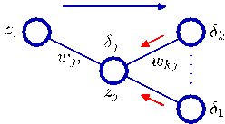

[Page 245]

# 5. Neural Networks

In Chapters 3 and 4 we considered models for regression and classification that comprised linear combinations of fixed basis functions. We saw that such models have useful analytical and computational properties but that their practical applicability was limited by the curse of dimensionality. In order to apply such models to large-scale problems, it is necessary to adapt the basis functions to the data.

Support vector machines (SVMs), discussed in Chapter 7, address this by first defining basis functions that are centred on the training data points and then selecting a subset of these during training. One advantage of SVMs is that, although the training involves nonlinear optimization, the objective function is convex, and so the solution of the optimization problem is relatively straightforward. The number of basis functions in the resulting models is generally much smaller than the number of training points, although it is often still relatively large and typically increases with the size of the training set. The relevance vector machine, discussed in Section 7.2, also chooses a subset from a fixed set of basis functions and typically results in much sparser models. Unlike the SVM it also produces probabilistic outputs, although this is at the expense of a nonconvex optimization during training.

An alternative approach is to fix the number of basis functions in advance but allow them to be adaptive, in other words to use parametric forms for the basis functions in which the parameter values are adapted during training. The most successful model of this type in the context of pattern recognition is the feed-forward neural network, also known as the multilayer perceptron, discussed in this chapter. In fact, ‘multilayer perceptron’ is really a misnomer, because the model comprises multiple layers of logistic regression models (with continuous nonlinearities) rather than multiple perceptrons (with discontinuous nonlinearities). For many applications, the resulting model can be significantly more compact, and hence faster to evaluate, than a support vector machine having the same generalization performance. The price to be paid for this compactness, as with the relevance vector machine, is that the likelihood function, which forms the basis for network training, is no longer a convex function of the model parameters. In practice, however, it is often worth investing substantial computational resources during the training phase in order to obtain a compact model that is fast at processing new data.

The term ‘neural network’ has its origins in attempts to find mathematical representations of information processing in biological systems (McCulloch and Pitts, 1943; Widrow and Hoff, 1960; Rosenblatt, 1962; Rumelhart et al., 1986). Indeed, it has been used very broadly to cover a wide range of different models, many of which have been the subject of exaggerated claims regarding their biological plausibility. From the perspective of practical applications of pattern recognition, however, biological realism would impose entirely unnecessary constraints. Our focus in this chapter is therefore on neural networks as efficient models for statistical pattern recognition. In particular, we shall restrict our attention to the specific class of neural networks that have proven to be of greatest practical value, namely the multilayer perceptron.

We begin by considering the functional form of the network model, including the specific parameterization of the basis functions, and we then discuss the problem of determining the network parameters within a maximum likelihood framework, which involves the solution of a nonlinear optimization problem. This requires the evaluation of derivatives of the log likelihood function with respect to the network parameters, and we shall see how these can be obtained efficiently using the technique of error backpropagation. We shall also show how the backpropagation framework can be extended to allow other derivatives to be evaluated, such as the Jacobian and Hessian matrices. Next we discuss various approaches to regularization of neural network training and the relationships between them. We also consider some extensions to the neural network model, and in particular we describe a general framework for modelling conditional probability distributions known as mixture density networks. Finally, we discuss the use of Bayesian treatments of neural networks. Additional background on neural network models can be found in Bishop (1995a).
[Page 247]

## 5.1. Feed-forward Network Functions

The linear models for regression and classification discussed in Chapters 3 and 4, respectively, are based on linear combinations of fixed nonlinear basis functions $\phi_j(\mathbf{x})$ and take the form

$$
y(\mathbf{x}, \mathbf{w}) = f \left( \sum_{j=1}^{M} w_j \phi_j(\mathbf{x}) \right)
\tag{5.1}
$$

where $f(\cdot)$ is a nonlinear activation function in the case of classification and is the identity in the case of regression. Our goal is to extend this model by making the basis functions $\phi_j(\mathbf{x})$ depend on parameters and then to allow these parameters to be adjusted, along with the coefficients $\{w_j\}$, during training. There are, of course, many ways to construct parametric nonlinear basis functions. Neural networks use basis functions that follow the same form as (5.1), so that each basis function is itself a nonlinear function of a linear combination of the inputs, where the coefficients in the linear combination are adaptive parameters.

This leads to the basic neural network model, which can be described as a series of functional transformations. First we construct $M$ linear combinations of the input variables $x_1, \ldots, x_D$ in the form

$$
a_j = \sum_{i=1}^{D} w_{ji}^{(1)} x_i + w_{j0}^{(1)}
\tag{5.2}
$$

where $j = 1, \ldots, M$, and the superscript $(1)$ indicates that the corresponding parameters are in the first ‘layer’ of the network. We shall refer to the parameters $w_{ji}^{(1)}$ as weights and the parameters $w_{j0}^{(1)}$ as biases, following the nomenclature of Chapter 3. The quantities $a_j$ are known as activations. Each of them is then transformed using a differentiable, nonlinear activation function $h(\cdot)$ to give

$$
z_j = h(a_j).
\tag{5.3}
$$

These quantities correspond to the outputs of the basis functions in (5.1) that, in the context of neural networks, are called hidden units. The nonlinear functions $h(\cdot)$ are generally chosen to be sigmoidal functions such as the logistic sigmoid or the ‘tanh’ function. Following (5.1), these values are again linearly combined to give output unit activations

$$
a_k = \sum_{j=1}^{M} w_{kj}^{(2)} z_j + w_{k0}^{(2)}
\tag{5.4}
$$

where $k = 1, \ldots, K$, and $K$ is the total number of outputs. This transformation corresponds to the second layer of the network, and again the $w_{k0}^{(2)}$ are bias parameters. Finally, the output unit activations are transformed using an appropriate activation function to give a set of network outputs $y_k$. The choice of activation function is determined by the nature of the data and the assumed distribution of target variables
[Page 248]

Figure 5.1 Network diagram for the twolayer neural network corresponding to (5.7). The input, hidden, and output variables are represented by nodes, and the weight parameters are represented by links between the nodes, in which the bias parameters are denoted by links coming from additional input and hidden variables $x_0$ and $z_0$. Arrows denote the direction of information flow through the network during forward propagation.

and follows the same considerations as for linear models discussed in Chapters 3 and 4. Thus for standard regression problems, the activation function is the identity so that $y_k = a_k$. Similarly, for multiple binary classification problems, each output unit activation is transformed using a logistic sigmoid function so that

$$
y_k = \sigma(a_k)
\tag{5.5}
$$

where

$$
\sigma(a) = \frac{1}{1 + \exp(-a)}.
\tag{5.6}
$$

Finally, for multiclass problems, a softmax activation function of the form (4.62) is used. The choice of output unit activation function is discussed in detail in Section 5.2.

We can combine these various stages to give the overall network function that, for sigmoidal output unit activation functions, takes the form

$$
y_k(\mathbf{x}, \mathbf{w}) = \sigma \left( \sum_{j=1}^M w_{kj}^{(2)} h \left( \sum_{i=1}^D w_{ji}^{(1)} x_i + w_{j0}^{(1)} \right) + w_{k0}^{(2)} \right)
\tag{5.7}
$$

where the set of all weight and bias parameters have been grouped together into a vector $\mathbf{w}$. Thus the neural network model is simply a nonlinear function from a set of input variables $\{x_i\}$ to a set of output variables $\{y_k\}$ controlled by a vector $\mathbf{w}$ of adjustable parameters.

This function can be represented in the form of a network diagram as shown in Figure 5.1. The process of evaluating (5.7) can then be interpreted as a forward propagation of information through the network. It should be emphasized that these diagrams do not represent probabilistic graphical models of the kind to be considered in Chapter 8 because the internal nodes represent deterministic variables rather than stochastic ones. For this reason, we have adopted a slightly different graphical
[Page 249]

notation for the two kinds of model. We shall see later how to give a probabilistic interpretation to a neural network.

As discussed in Section 3.1, the bias parameters in (5.2) can be absorbed into the set of weight parameters by defining an additional input variable $x_0$ whose value is clamped at $x_0 = 1$, so that (5.2) takes the form

$$
a_{j} = \sum_{i=0}^{D} w_{ji}^{(1)} x_{i} \tag{5.8}
$$

We can similarly absorb the second-layer biases into the second-layer weights, so that the overall network function becomes

$$
y_{k}(\mathbf{x}, \mathbf{w}) = \sigma \left( \sum_{j=0}^{M} w_{kj}^{(2)} h \left( \sum_{i=0}^{D} w_{ji}^{(1)} x_{i} \right) \right) \tag{5.9}
$$

As can be seen from Figure 5.1, the neural network model comprises two stages of processing, each of which resembles the perceptron model of Section 4.1.7, and for this reason the neural network is also known as the multilayer perceptron, or MLP. A key difference compared to the perceptron, however, is that the neural network uses continuous sigmoidal nonlinearities in the hidden units, whereas the perceptron uses step-function nonlinearities. This means that the neural network function is differentiable with respect to the network parameters, and this property will play a central role in network training.

If the activation functions of all the hidden units in a network are taken to be linear, then for any such network we can always find an equivalent network without hidden units. This follows from the fact that the composition of successive linear transformations is itself a linear transformation. However, if the number of hidden units is smaller than either the number of input or output units, then the transformations that the network can generate are not the most general possible linear transformations from inputs to outputs because information is lost in the dimensionality reduction at the hidden units. In Section 12.4.2, we show that networks of linear units give rise to principal component analysis. In general, however, there is little interest in multilayer networks of linear units.

The network architecture shown in Figure 5.1 is the most commonly used one in practice. However, it is easily generalized, for instance by considering additional layers of processing each consisting of a weighted linear combination of the form (5.4) followed by an element-wise transformation using a nonlinear activation function. Note that there is some confusion in the literature regarding the terminology for counting the number of layers in such networks. Thus the network in Figure 5.1 may be described as a 3-layer network (which counts the number of layers of units, and treats the inputs as units) or sometimes as a single-hidden-layer network (which counts the number of layers of hidden units). We recommend a terminology in which Figure 5.1 is called a two-layer network, because it is the number of layers of adaptive weights that is important for determining the network properties.

Another generalization of the network architecture is to include skip-layer connections, each of which is associated with a corresponding adaptive parameter. For
[Page 250]

Figure 5.2 Example of a neural network having a general feed-forward topology. Note that each hidden and output unit has an associated bias parameter (omitted for clarity).

![The image depicts a diagram with a clockwise orientation. The diagram consists of a network with four interconnected nodes. Each node is connected to four other nodes, forming a network. The nodes are labeled with numbers and are connected by lines. The diagram includes a series of arrows pointing from one node to another. The arrows are colored blue and green, with the blue arrow pointing to the left and the green arrow pointing to the right. The arrows are connected to the nodes, indicating that they are part of a larger network. Here is a detailed description of the components and elements present in the image: - **Node 1**: The first node is labeled with a number 1 and is connected to the second node. - **Node 2**: The second node is labeled with a number 2 and is connected to the third node. - **Node 3**: The third node is labeled with a number 3 and is connected to the fourth node](../Images/imageFile108.png)

instance, in a two-layer network these would go directly from inputs to outputs. In principle, a network with sigmoidal hidden units can always mimic skip layer connections (for bounded input values) by using a sufficiently small first-layer weight that, over its operating range, the hidden unit is effectively linear, and then compensating with a large weight value from the hidden unit to the output. In practice, however, it may be advantageous to include skip-layer connections explicitly.

Furthermore, the network can be sparse, with not all possible connections within a layer being present. We shall see an example of a sparse network architecture when we consider convolutional neural networks in Section 5.5.6.

Because there is a direct correspondence between a network diagram and its mathematical function, we can develop more general network mappings by considering more complex network diagrams. However, these must be restricted to a feed-forward architecture, in other words to one having no closed directed cycles, to ensure that the outputs are deterministic functions of the inputs. This is illustrated with a simple example in Figure 5.2. Each (hidden or output) unit in such a network computes a function given by

$$
z_{k} = h \left( \sum_{j} w_{kj} z_{j} \right) \tag{5.10}
$$

where the sum runs over all units that send connections to unit $k$ (and a bias parameter is included in the summation). For a given set of values applied to the inputs of the network, successive application of (5.10) allows the activations of all units in the network to be evaluated including those of the output units.

The approximation properties of feed-forward networks have been widely studied (Funahashi, 1989; Cybenko, 1989; Hornik et al., 1989; Stinchecombe and White, 1989; Cotter, 1990; Ito, 1991; Hornik, 1991; Kreinovich, 1991; Ripley, 1996) and found to be very general. Neural networks are therefore said to be universal approximators. For example, a two-layer network with linear outputs can uniformly approximate any continuous function on a compact input domain to arbitrary accuracy provided the network has a sufficiently large number of hidden units. This result holds for a wide range of hidden unit activation functions, but excluding polynomials. Although such theorems are reassuring, the key problem is how to find suitable parameter values given a set of training data, and in later sections of this chapter we
[Page 251]

Figure 5.3 Illustration of the capability of a multilayer perceptron to approximate four different functions comprising (a) $f(x) = x^2$, (b) $f(x) = \sin(x)$, (c), $f(x) = |x|$, and (d) $f(x) = H(x)$ where $H(x)$ is the Heaviside step function. In each case, $N = 50$ data points, shown as blue dots, have been sampled uniformly in $x$ over the interval $(-1, 1)$ and the corresponding values of $f(x)$ evaluated. These data points are then used to train a twolayer network having $3$ hidden units with ‘tanh’ activation functions and linear output units. The resulting network functions are shown by the red curves, and the outputs of the three hidden units are shown by the three dashed curves.

(a)

(b)

(c)

(d)

will show that there exist effective solutions to this problem based on both maximum likelihood and Bayesian approaches.

The capability of a two-layer network to model a broad range of functions is illustrated in Figure 5.3. This figure also shows how individual hidden units work collaboratively to approximate the final function. The role of hidden units in a simple classification problem is illustrated in Figure 5.4 using the synthetic classification data set described in Appendix A.

### 5.1.1 Weight-space symmetries

One property of feed-forward networks, which will play a role when we consider Bayesian model comparison, is that multiple distinct choices for the weight vector $\mathbf{w}$ can all give rise to the same mapping function from inputs to outputs (Chen et al., 1993). Consider a two-layer network of the form shown in Figure 5.1 with $M$ hidden units having ‘tanh’ activation functions and full connectivity in both layers. If we change the sign of all of the weights and the bias feeding into a particular hidden unit, then, for a given input pattern, the sign of the activation of the hidden unit will be reversed, because ‘tanh’ is an odd function, so that $\tanh(-a) = -\tanh(a)$. This transformation can be exactly compensated by changing the sign of all of the weights leading out of that hidden unit. Thus, by changing the signs of a particular group of weights (and a bias), the input–output mapping function represented by the network is unchanged, and so we have found two different weight vectors that give rise to the same mapping function. For $M$ hidden units, there will be $M$ such ‘sign-flip’
[Page 252]

![The image is a scatter plot with a white background. The plot consists of a grid of points, each marked with a blue dot. The points are scattered across the grid, with some points closer to the top and some farther away. The points are connected by lines, with each line representing a different direction. The lines are colored in red and blue, with the red line being the most prominent. The x-axis is labeled as x and the y-axis is labeled as y. The plot is titled scatter plot. There are a few notable elements in the image: 1. **Grid Points**: There are a few grid points scattered across the image. These points are scattered in a grid pattern, with some points closer to the top and some farther away. 2. **Lines**: There are several lines in the image, each representing a different direction. These lines are colored in red and blue, with the red line being the most prominent.](../Images/imageFile110.png)

Figure 5.4 Example of the solution of a simple twoclass classification problem involving synthetic data using a neural network having two inputs, two hidden units with ‘tanh’ activation functions, and a single output having a logistic sigmoid activation function. The dashed blue lines show the $z = 0.5$ contours for each of the hidden units, and the red line shows the $y = 0.5$ decision surface for the network. For comparison, the green line denotes the optimal decision boundary computed from the distributions used to generate the data.

symmetries, and thus any given weight vector will be one of a set of $2^M$ equivalent weight vectors.

Similarly, imagine that we interchange the values of all of the weights (and the bias) leading both into and out of a particular hidden unit with the corresponding values of the weights (and bias) associated with a different hidden unit. Again, this clearly leaves the network input–output mapping function unchanged, but it corresponds to a different choice of weight vector. For $M$ hidden units, any given weight vector will belong to a set of $M!$ equivalent weight vectors associated with this interchange symmetry, corresponding to the $M!$ different orderings of the hidden units. The network will therefore have an overall weight-space symmetry factor of $M! 2^M$. For networks with more than two layers of weights, the total level of symmetry will be given by the product of such factors, one for each layer of hidden units.

It turns out that these factors account for all of the symmetries in weight space (except for possible accidental symmetries due to specific choices for the weight values). Furthermore, the existence of these symmetries is not a particular property of the ‘tanh’ function but applies to a wide range of activation functions (Kůrková and Kainen, 1994). In many cases, these symmetries in weight space are of little practical consequence, although in Section 5.7 we shall encounter a situation in which we need to take them into account.

### 5.2. Network Training

So far, we have viewed neural networks as a general class of parametric nonlinear functions from a vector $\mathbf{x}$ of input variables to a vector $\mathbf{y}$ of output variables. A simple approach to the problem of determining the network parameters is to make an analogy with the discussion of polynomial curve fitting in Section 1.1, and therefore to minimize a sum-of-squares error function. Given a training set comprising a set of input vectors $\{\mathbf{x}_n\}$, where $n = 1,\ldots,N$, together with a corresponding set of
[Page 253]

target vectors $\{\mathbf{t}_n\}$, we minimize the error function

$$
E(\mathbf{w}) = \frac{1}{2} \sum_{n=1}^N \|\mathbf{y}(\mathbf{x}_n, \mathbf{w}) - \mathbf{t}_n\|^2 . \tag{5.11}
$$

However, we can provide a much more general view of network training by first giving a probabilistic interpretation to the network outputs. We have already seen many advantages of using probabilistic predictions in Section 1.5.4. Here it will also provide us with a clearer motivation both for the choice of output unit nonlinearity and the choice of error function.

We start by discussing regression problems, and for the moment we consider a single target variable $t$ that can take any real value. Following the discussions in Section 1.2.5 and 3.1, we assume that $t$ has a Gaussian distribution with an $\mathbf{x}$-dependent mean, which is given by the output of the neural network, so that

$$
p(t|\mathbf{x}, \mathbf{w}) = \mathcal{N}(t|y(\mathbf{x}, \mathbf{w}), \beta^{-1}) \tag{5.12}
$$

where $\beta$ is the precision (inverse variance) of the Gaussian noise. Of course this is a somewhat restrictive assumption, and in Section 5.6 we shall see how to extend this approach to allow for more general conditional distributions. For the conditional distribution given by (5.12), it is sufficient to take the output unit activation function to be the identity, because such a network can approximate any continuous function from $\mathbf{x}$ to $y$. Given a data set of $N$ independent, identically distributed observations $\mathbf{X} = \{\mathbf{x}_1,\ldots,\mathbf{x}_N\}$, along with corresponding target values $\mathbf{t} = \{t_1,\ldots,t_N\}$, we can construct the corresponding likelihood function

$$
p(\mathbf{t}|\mathbf{X}, \mathbf{w}, \beta) = \prod_{n=1}^N p(t_n|\mathbf{x}_n, \mathbf{w}, \beta).
$$

Taking the negative logarithm, we obtain the error function

$$
\frac{\beta}{2} \sum_{n=1}^N \{y(\mathbf{x}_n, \mathbf{w}) - t_n\}^2 - \frac{N}{2} \ln \beta + \frac{N}{2} \ln(2\pi) \tag{5.13}
$$

which can be used to learn the parameters $\mathbf{w}$ and $\beta$. In Section 5.7, we shall discuss the Bayesian treatment of neural networks, while here we consider a maximum likelihood approach. Note that in the neural networks literature, it is usual to consider the minimization of an error function rather than the maximization of the (log) likelihood, and so here we shall follow this convention. Consider first the determination of $\mathbf{w}$. Maximizing the likelihood function is equivalent to minimizing the sum-of-squares error function given by

$$
E(\mathbf{w}) = \frac{1}{2} \sum_{n=1}^N \{y(\mathbf{x}_n, \mathbf{w}) - t_n\}^2 \tag{5.14}
$$

[Page 254]

where we have discarded additive and multiplicative constants. The value of $\mathbf{w}$ found by minimizing $E(\mathbf{w})$ will be denoted $\mathbf{w}_{\mathrm{ML}}$ because it corresponds to the maximum likelihood solution. In practice, the nonlinearity of the network function $y(\mathbf{x}_n, \mathbf{w})$ causes the error $E(\mathbf{w})$ to be nonconvex, and so in practice local maxima of the likelihood may be found, corresponding to local minima of the error function, as discussed in Section 5.2.1.

Having found $\mathbf{w}_{\mathrm{ML}}$, the value of $\beta$ can be found by minimizing the negative log likelihood to give

$$
\frac{1}{\beta_{\mathrm{ML}}} = \frac{1}{N} \sum_{n=1}^{N} \{ y(\mathbf{x}_n, \mathbf{w}_{\mathrm{ML}}) - t_n \}^2. \tag{5.15}
$$

Note that this can be evaluated once the iterative optimization required to find $\mathbf{w}_{\mathrm{ML}}$ is completed. If we have multiple target variables, and we assume that they are independent conditional on $\mathbf{x}$ and $\mathbf{w}$ with shared noise precision $\beta$, then the conditional distribution of the target values is given by

$$
p(\mathbf{t}|\mathbf{x}, \mathbf{w}) = \mathcal{N} \left( \mathbf{t}| \mathbf{y}(\mathbf{x}, \mathbf{w}), \beta^{-1}\mathbf{I} \right). \tag{5.16}
$$

Following the same argument as for a single target variable, we see that the maximum likelihood weights are determined by minimizing the sum-of-squares error function (5.11). The noise precision is then given by

$$
\frac{1}{\beta_{\mathrm{ML}}} = \frac{1}{NK} \sum_{n=1}^{N} \| \mathbf{y}(\mathbf{x}_n, \mathbf{w}_{\mathrm{ML}}) - \mathbf{t}_n \|^2 \tag{5.17}
$$

where $K$ is the number of target variables. The assumption of independence can be dropped at the expense of a slightly more complex optimization problem.

Recall from Section 4.3.6 that there is a natural pairing of the error function (given by the negative log likelihood) and the output unit activation function. In the regression case, we can view the network as having an output activation function that is the identity, so that $y_k = a_k$. The corresponding sum-of-squares error function has the property

$$
\frac{\partial E}{\partial a_k} = y_k - t_k \tag{5.18}
$$

which we shall make use of when discussing error backpropagation in Section 5.3.

Now consider the case of binary classification in which we have a single target variable $t$ such that $t = 1$ denotes class $\mathcal{C}_1$ and $t = 0$ denotes class $\mathcal{C}_2$. Following the discussion of canonical link functions in Section 4.3.6, we consider a network having a single output whose activation function is a logistic sigmoid

$$
y = \sigma(a) \equiv \frac{1}{1 + \exp(-a)} \tag{5.19}
$$

so that $0 \leqslant y(\mathbf{x}, \mathbf{w}) \leqslant 1$. We can interpret $y(\mathbf{x}, \mathbf{w})$ as the conditional probability $p(\mathcal{C}_1|\mathbf{x})$, with $p(\mathcal{C}_2|\mathbf{x})$ given by $1 - y(\mathbf{x}, \mathbf{w})$. The conditional distribution of targets given inputs is then a Bernoulli distribution of the form

$$
p(t|\mathbf{x}, \mathbf{w}) = y(\mathbf{x}, \mathbf{w})^t \{1 - y(\mathbf{x}, \mathbf{w})\}^{1-t}. \tag{5.20}
$$

[Page 255]

If we consider a training set of independent observations, then the error function, which is given by the negative log likelihood, is then a cross-entropy error function of the form

$$
E(\mathbf{w}) = - \sum_{n=1}^{N} \{t_n \ln y_n + (1 - t_n) \ln(1 - y_n)\} \tag{5.21}
$$

where $y_n$ denotes $y(\mathbf{x}_n, \mathbf{w})$. Note that there is no analogue of the noise precision $\beta$ because the target values are assumed to be correctly labelled. However, the model is easily extended to allow for labelling errors. Simard et al. (2003) found that using the cross-entropy error function instead of the sum-of-squares for a classification problem leads to faster training as well as improved generalization.

If we have $K$ separate binary classifications to perform, then we can use a network having $K$ outputs each of which has a logistic sigmoid activation function. Associated with each output is a binary class label $t_k \in \{0, 1\}$, where $k = 1, \ldots, K$. If we assume that the class labels are independent, given the input vector, then the conditional distribution of the targets is

$$
p(\mathbf{t}|\mathbf{x}, \mathbf{w}) = \prod_{k=1}^{K} y_k(\mathbf{x}, \mathbf{w})^{t_k} [1 - y_k(\mathbf{x}, \mathbf{w})]^{1 - t_k}. \tag{5.22}
$$

Taking the negative logarithm of the corresponding likelihood function then gives the following error function

$$
E(\mathbf{w}) = - \sum_{n=1}^{N} \sum_{k=1}^{K} \{t_{nk} \ln y_{nk} + (1 - t_{nk}) \ln (1 - y_{nk})\} \tag{5.23}
$$

where $y_{nk}$ denotes $y_k(\mathbf{x}_n, \mathbf{w})$. Again, the derivative of the error function with respect to the activation for a particular output unit takes the form (5.18) just as in the regression case.

It is interesting to contrast the neural network solution to this problem with the corresponding approach based on a linear classification model of the kind discussed in Chapter 4. Suppose that we are using a standard two-layer network of the kind shown in Figure 5.1. We see that the weight parameters in the first layer of the network are shared between the various outputs, whereas in the linear model each classification problem is solved independently. The first layer of the network can be viewed as performing a nonlinear feature extraction, and the sharing of features between the different outputs can save on computation and can also lead to improved generalization.

Finally, we consider the standard multiclass classification problem in which each input is assigned to one of $K$ mutually exclusive classes. The binary target variables $t_k \in \{0, 1\}$ have a 1-of-$K$ coding scheme indicating the class, and the network outputs are interpreted as $y_k(\mathbf{x}, \mathbf{w}) = p(t_k = 1|\mathbf{x})$, leading to the following error function

$$
E(\mathbf{w}) = - \sum_{n=1}^{N} \sum_{k=1}^{K} t_{kn} \ln y_k(\mathbf{x}_n, \mathbf{w}). \tag{5.24}
$$

[Page 256]

![The image depicts a diagram of a cylindrical object with a diameter of 10 cm and a height of 10 cm. The object is labeled as W and has a label E on the top. The object is a cylinder with a circular base and a circular top. The base of the cylinder is a circle with a diameter of 10 cm. The top of the cylinder is a circle with a diameter of 10 cm. The object is labeled as W and has a label E on the top. ### Objects in the Image: 1. **Cylinder**: The object is a cylinder with a circular base and a circular top. 2. **Circular Base**: The base of the cylinder is a circle with a diameter of 10 cm. 3. **Circular Top**: The top of the cylinder is a circle with a diameter of 10 cm. 4. **Label**: The label](../Images/imageFile111.png)

Figure 5.5 Geometrical view of the error function $E(\mathbf{w})$ as a surface sitting over weight space. Point $\mathbf{w}_A$ is a local minimum and $\mathbf{w}_B$ is the global minimum. At any point $\mathbf{w}_C$, the local gradient of the error surface is given by the vector $\nabla E$.

Following the discussion of Section 4.3.4, we see that the output unit activation function, which corresponds to the canonical link, is given by the softmax function

$$
y_k(\mathbf{x}, \mathbf{w}) = \frac{\exp(a_k(\mathbf{x}, \mathbf{w}))}{\sum_j \exp(a_j(\mathbf{x}, \mathbf{w}))} \tag{5.25}
$$

which satisfies $0 \le y_k \le 1$ and $\sum_k y_k = 1$. Note that the $y_k(\mathbf{x}, \mathbf{w})$ are unchanged if a constant is added to all of the $a_k(\mathbf{x}, \mathbf{w})$, causing the error function to be constant for some directions in weight space. This degeneracy is removed if an appropriate regularization term (Section 5.5) is added to the error function.

Once again, the derivative of the error function with respect to the activation for a particular output unit takes the familiar form (5.18).

In summary, there is a natural choice of both output unit activation function and matching error function, according to the type of problem being solved. For regression we use linear outputs and a sum-of-squares error, for (multiple independent) binary classifications we use logistic sigmoid outputs and a cross-entropy error function, and for multiclass classification we use softmax outputs with the corresponding multiclass cross-entropy error function. For classification problems involving two classes, we can use a single logistic sigmoid output, or alternatively we can use a network with two outputs having a softmax output activation function.

### 5.2.1 Parameter optimization

We turn next to the task of finding a weight vector $\mathbf{w}$ which minimizes the chosen function $E(\mathbf{w})$. At this point, it is useful to have a geometrical picture of the error function, which we can view as a surface sitting over weight space as shown in Figure 5.5. First note that if we make a small step in weight space from $\mathbf{w}$ to $\mathbf{w}+\delta\mathbf{w}$ then the change in the error function is $\delta E \simeq \delta\mathbf{w}^{\text{T}} \nabla E(\mathbf{w})$, where the vector $\nabla E(\mathbf{w})$ points in the direction of greatest rate of increase of the error function. Because the error $E(\mathbf{w})$ is a smooth continuous function of $\mathbf{w}$, its smallest value will occur at a
[Page 257]

point in weight space such that the gradient of the error function vanishes, so that

$$
\nabla E(\mathbf{w}) = 0
\tag{5.26}
$$

as otherwise we could make a small step in the direction of $-\nabla E(\mathbf{w})$ and thereby further reduce the error. Points at which the gradient vanishes are called stationary points, and may be further classified into minima, maxima, and saddle points.

Our goal is to find a vector $\mathbf{w}$ such that $E(\mathbf{w})$ takes its smallest value. However, the error function typically has a highly nonlinear dependence on the weights and bias parameters, and so there will be many points in weight space at which the gradient vanishes (or is numerically very small). Indeed, from the discussion in Section 5.1.1 we see that for any point $\mathbf{w}$ that is a local minimum, there will be other points in weight space that are equivalent minima. For instance, in a two-layer network of the kind shown in Figure 5.1, with $M$ hidden units, each point in weight space is a member of a family of $M! 2^M$ equivalent points.

Furthermore, there will typically be multiple inequivalent stationary points and in particular multiple inequivalent minima. A minimum that corresponds to the smallest value of the error function for any weight vector is said to be a global minimum. Any other minima corresponding to higher values of the error function are said to be local minima. For a successful application of neural networks, it may not be necessary to find the global minimum (and in general it will not be known whether the global minimum has been found) but it may be necessary to compare several local minima in order to find a sufficiently good solution.

Because there is clearly no hope of finding an analytical solution to the equation $\nabla E(\mathbf{w}) = 0$ we resort to iterative numerical procedures. The optimization of continuous nonlinear functions is a widely studied problem and there exists an extensive literature on how to solve it efficiently. Most techniques involve choosing some initial value $\mathbf{w}^{(0)}$ for the weight vector and then moving through weight space in a succession of steps of the form

$$
\mathbf{w}^{(\tau+1)} = \mathbf{w}^{(\tau)} + \Delta\mathbf{w}^{(\tau)}
\tag{5.27}
$$

where $\tau$ labels the iteration step. Different algorithms involve different choices for the weight vector update $\Delta\mathbf{w}^{(\tau)}$. Many algorithms make use of gradient information and therefore require that, after each update, the value of $\nabla E(\mathbf{w})$ is evaluated at the new weight vector $\mathbf{w}^{(\tau+1)}$. In order to understand the importance of gradient information, it is useful to consider a local approximation to the error function based on a Taylor expansion.

### 5.2.2 Local quadratic approximation

Insight into the optimization problem, and into the various techniques for solving it, can be obtained by considering a local quadratic approximation to the error function.

Consider the Taylor expansion of $E(\mathbf{w})$ around some point $\widehat{\mathbf{w}}$ in weight space

$$
E(\mathbf{w}) \simeq E(\widehat{\mathbf{w}}) + (\mathbf{w} - \widehat{\mathbf{w}})^{\mathrm{T}}\mathbf{b} + \frac{1}{2}(\mathbf{w} - \widehat{\mathbf{w}})^{\mathrm{T}}\mathbf{H}(\mathbf{w} - \widehat{\mathbf{w}})
\tag{5.28}
$$

[Page 258]

where cubic and higher terms have been omitted. Here $\mathbf{b}$ is defined to be the gradient of $E$ evaluated at $\widehat{\mathbf{w}}$

$$
\mathbf{b} \equiv \nabla E \big|_{\mathbf{w}=\widehat{\mathbf{w}}} \tag{5.29}
$$

and the Hessian matrix $\mathbf{H} = \nabla\nabla E$ has elements

$$
(\mathbf{H})_{ij} \equiv \frac{\partial E}{\partial w_i \partial w_j} \bigg|_{\mathbf{w}=\widehat{\mathbf{w}}}. \tag{5.30}
$$

From (5.28), the corresponding local approximation to the gradient is given by

$$
\nabla E \simeq \mathbf{b} + \mathbf{H}(\mathbf{w} - \widehat{\mathbf{w}}). \tag{5.31}
$$

For points $\mathbf{w}$ that are sufficiently close to $\widehat{\mathbf{w}}$, these expressions will give reasonable approximations for the error and its gradient.

Consider the particular case of a local quadratic approximation around a point $\mathbf{w}^{\star}$ that is a minimum of the error function. In this case there is no linear term, because $\nabla E = 0$ at $\mathbf{w}^{\star}$, and (5.28) becomes

$$
E(\mathbf{w}) = E(\mathbf{w}^{\star}) + \frac{1}{2} (\mathbf{w} - \mathbf{w}^{\star})^T \mathbf{H} (\mathbf{w} - \mathbf{w}^{\star}) \tag{5.32}
$$

where the Hessian $\mathbf{H}$ is evaluated at $\mathbf{w}^{\star}$. In order to interpret this geometrically, consider the eigenvalue equation for the Hessian matrix

$$
\mathbf{H}\mathbf{u}_i = \lambda_i \mathbf{u}_i \tag{5.33}
$$

where the eigenvectors $\mathbf{u}_i$ form a complete orthonormal set (Appendix C) so that

$$
\mathbf{u}_i^T \mathbf{u}_j = \delta_{ij}. \tag{5.34}
$$

We now expand $(\mathbf{w} - \mathbf{w}^{\star})$ as a linear combination of the eigenvectors in the form

$$
\mathbf{w} - \mathbf{w}^{\star} = \sum_{i} \alpha_i \mathbf{u}_i. \tag{5.35}
$$

This can be regarded as a transformation of the coordinate system in which the origin is translated to the point $\mathbf{w}^{\star}$, and the axes are rotated to align with the eigenvectors (through the orthogonal matrix whose columns are the $\mathbf{u}_i$), and is discussed in more detail in Appendix C. Substituting (5.35) into (5.32), and using (5.33) and (5.34), allows the error function to be written in the form

$$
E(\mathbf{w}) = E(\mathbf{w}^{\star}) + \frac{1}{2} \sum_{i} \lambda_i \alpha_i^2. \tag{5.36}
$$

A matrix $\mathbf{H}$ is said to be positive definite if, and only if,

$$
\mathbf{v}^T \mathbf{H} \mathbf{v} > 0 \quad \text{for all } \mathbf{v}. \tag{5.37}
$$

[Page 259]

![The image depicts a circular diagram with a central point labeled as W. This point is positioned at the center of the circle. The diagram is labeled with the following labels: - W: The point where the line segment W intersects the circle. - (\alpha_1): The angle between the line segment W and the radius of the circle. - (\alpha_2): The angle between the line segment W and the radius of the circle. - (\alpha_3): The angle between the line segment W and the radius of the circle. - (\alpha_4): The angle between the line segment W and the radius of the circle. - (\alpha_5): The angle between the line segment W and the radius of the circle. - (\alpha_6): The angle between the line segment W and the radius of the circle. - (\alpha_7): The angle between](../Images/imageFile112.png)

Figure 5.6 In the neighbourhood of a minimum $\mathbf{w}^{\star}$, the error function can be approximated by a quadratic. Contours of constant error are then ellipses whose axes are aligned with the eigenvectors $\mathbf{u}_i$ of the Hessian matrix, with lengths that are inversely proportional to the square roots of the corresponding eigenvalues $\lambda_i$.

Because the eigenvectors $\{\mathbf{u}_i\}$ form a complete set, an arbitrary vector $\mathbf{v}$ can be written in the form

$$
\mathbf{v} = \sum_{i} c_i \mathbf{u}_i. \tag{5.38}
$$

From (5.33) and (5.34), we then have

$$
\mathbf{v}^{\mathrm{T}} \mathbf{H} \mathbf{v} = \sum_{i} c_i^2 \lambda_i \tag{5.39}
$$

and so $\mathbf{H}$ will be positive definite if, and only if, all of its eigenvalues are positive. In the new coordinate system, whose basis vectors are given by the eigenvectors $\{\mathbf{u}_i\}$, the contours of constant $E$ are ellipses centred on the origin, as illustrated in Figure 5.6. For a one-dimensional weight space, a stationary point $w^{\star}$ will be a minimum if

$$
\left. \frac{\partial^2 E}{\partial w^2} \right|_{w^{\star}} > 0. \tag{5.40}
$$

The corresponding result in $D$-dimensions is that the Hessian matrix, evaluated at $\mathbf{w}^{\star}$, should be positive definite.

### 5.2.3 Use of gradient information

As we shall see in Section 5.3, it is possible to evaluate the gradient of an error function efficiently by means of the backpropagation procedure. The use of this gradient information can lead to significant improvements in the speed with which the minima of the error function can be located. We can see why this is so, as follows.

In the quadratic approximation to the error function, given in (5.28), the error surface is specified by the quantities $\mathbf{b}$ and $\mathbf{H}$, which contain a total of $W(W + 3)/2$ independent elements (because the matrix $\mathbf{H}$ is symmetric), where $W$ is the dimensionality of $\mathbf{w}$ (i.e., the total number of adaptive parameters in the network). The location of the minimum of this quadratic approximation therefore depends on $\mathcal{O}(W^2)$ parameters, and we should not expect to be able to locate the minimum until we have gathered $\mathcal{O}(W^2)$ independent pieces of information. If we do not make use of gradient information, we would expect to have to perform $\mathcal{O}(W^2)$ function
[Page 260]

evaluations, each of which would require $O(W)$ steps. Thus, the computational effort needed to find the minimum using such an approach would be $O(W^3)$.

Now compare this with an algorithm that makes use of the gradient information. Because each evaluation of $\nabla E$ brings $W$ items of information, we might hope to find the minimum of the function in $O(W)$ gradient evaluations. As we shall see, by using error backpropagation, each such evaluation takes only $O(W)$ steps and so the minimum can now be found in $O(W^2)$ steps. For this reason, the use of gradient information forms the basis of practical algorithms for training neural networks.

###### 5.2.4 Gradient descent optimization

The simplest approach to using gradient information is to choose the weight update in (5.27) to comprise a small step in the direction of the negative gradient, so that

$$
\mathbf{w}^{(\tau+1)} = \mathbf{w}^{(\tau)} - \eta \nabla E(\mathbf{w}^{(\tau)}) \tag{5.41}
$$

where the parameter $\eta > 0$ is known as the learning rate. After each such update, the gradient is re-evaluated for the new weight vector and the process repeated. Note that the error function is defined with respect to a training set, and so each step requires that the entire training set be processed in order to evaluate $\nabla E$. Techniques that use the whole data set at once are called batch methods. At each step the weight vector is moved in the direction of the greatest rate of decrease of the error function, and so this approach is known as gradient descent or steepest descent. Although such an approach might intuitively seem reasonable, in fact it turns out to be a poor algorithm, for reasons discussed in Bishop and Nabney (2008).

For batch optimization, there are more efficient methods, such as conjugate gradients and quasi-Newton methods, which are much more robust and much faster than simple gradient descent (Gill et al., 1981; Fletcher, 1987; Nocedal and Wright, 1999). Unlike gradient descent, these algorithms have the property that the error function always decreases at each iteration unless the weight vector has arrived at a local or global minimum.

In order to find a sufficiently good minimum, it may be necessary to run a gradient-based algorithm multiple times, each time using a different randomly chosen starting point, and comparing the resulting performance on an independent validation set.

There is, however, an on-line version of gradient descent that has proved useful in practice for training neural networks on large data sets (Le Cun et al., 1989). Error functions based on maximum likelihood for a set of independent observations comprise a sum of terms, one for each data point

$$
E(\mathbf{w}) = \sum_{n=1}^{N} E_n(\mathbf{w}). \tag{5.42}
$$

On-line gradient descent, also known as sequential gradient descent or stochastic gradient descent, makes an update to the weight vector based on one data point at a time, so that

$$
\mathbf{w}^{(\tau+1)} = \mathbf{w}^{(\tau)} - \eta \nabla E_n(\mathbf{w}^{(\tau)}). \tag{5.43}
$$

[Page 261]

This update is repeated by cycling through the data either in sequence or by selecting points at random with replacement. There are of course intermediate scenarios in which the updates are based on batches of data points.

One advantage of on-line methods compared to batch methods is that the former handle redundancy in the data much more efficiently. To see this, consider an extreme example in which we take a data set and double its size by duplicating every data point. Note that this simply multiplies the error function by a factor of $2$ and so is equivalent to using the original error function. Batch methods will require double the computational effort to evaluate the batch error function gradient, whereas online methods will be unaffected. Another property of on-line gradient descent is the possibility of escaping from local minima, since a stationary point with respect to the error function for the whole data set will generally not be a stationary point for each data point individually.

Nonlinear optimization algorithms, and their practical application to neural network training, are discussed in detail in Bishop and Nabney (2008).

### 5.3. Error Backpropagation

Our goal in this section is to find an efficient technique for evaluating the gradient of an error function $E(\mathbf{w})$ for a feed-forward neural network. We shall see that this can be achieved using a local message passing scheme in which information is sent alternately forwards and backwards through the network and is known as error backpropagation, or sometimes simply as backprop.

It should be noted that the term backpropagation is used in the neural computing literature to mean a variety of different things. For instance, the multilayer perceptron architecture is sometimes called a backpropagation network. The term backpropagation is also used to describe the training of a multilayer perceptron using gradient descent applied to a sum-of-squares error function. In order to clarify the terminology, it is useful to consider the nature of the training process more carefully. Most training algorithms involve an iterative procedure for minimization of an error function, with adjustments to the weights being made in a sequence of steps. At each such step, we can distinguish between two distinct stages. In the first stage, the derivatives of the error function with respect to the weights must be evaluated. As we shall see, the important contribution of the backpropagation technique is in providing a computationally efficient method for evaluating such derivatives. Because it is at this stage that errors are propagated backwards through the network, we shall use the term backpropagation specifically to describe the evaluation of derivatives. In the second stage, the derivatives are then used to compute the adjustments to be made to the weights. The simplest such technique, and the one originally considered by Rumelhart et al. (1986), involves gradient descent. It is important to recognize that the two stages are distinct. Thus, the first stage, namely the propagation of errors backwards through the network in order to evaluate derivatives, can be applied to many other kinds of network and not just the multilayer perceptron. It can also be applied to error functions other than just the simple sum-of-squares, and to the eval-
[Page 262]

uation of other derivatives such as the Jacobian and Hessian matrices, as we shall see later in this chapter. Similarly, the second stage of weight adjustment using the calculated derivatives can be tackled using a variety of optimization schemes, many of which are substantially more powerful than simple gradient descent.

### 5.3.1 Evaluation of error-function derivatives

We now derive the backpropagation algorithm for a general network having arbitrary feed-forward topology, arbitrary differentiable nonlinear activation functions, and a broad class of error function. The resulting formulae will then be illustrated using a simple layered network structure having a single layer of sigmoidal hidden units together with a sum-of-squares error.

Many error functions of practical interest, for instance those defined by maximum likelihood for a set of i.i.d. data, comprise a sum of terms, one for each data point in the training set, so that

$$
E(\mathbf{w}) = \sum_{n=1}^{N} E_n(\mathbf{w}). \tag{5.44}
$$

Here we shall consider the problem of evaluating $\nabla E_n(\mathbf{w})$ for one such term in the error function. This may be used directly for sequential optimization, or the results can be accumulated over the training set in the case of batch methods.

Consider first a simple linear model in which the outputs $y_k$ are linear combinations of the input variables $x_i$ so that

$$
y_k = \sum_i w_{ki} x_i \tag{5.45}
$$

together with an error function that, for a particular input pattern $n$, takes the form

$$
E_n = \frac{1}{2} \sum_k (y_{nk} - t_{nk})^2 \tag{5.46}
$$

where $y_{nk} = y_k(\mathbf{x}_n, \mathbf{w})$. The gradient of this error function with respect to a weight $w_{ji}$ is given by

$$
\frac{\partial E_n}{\partial w_{ji}} = (y_{nj} - t_{nj}) x_{ni} \tag{5.47}
$$

which can be interpreted as a ‘local’ computation involving the product of an ‘error signal’ $y_{nj} - t_{nj}$ associated with the output end of the link $w_{ji}$ and the variable $x_{ni}$ associated with the input end of the link. In Section 4.3.2, we saw how a similar formula arises with the logistic sigmoid activation function together with the cross entropy error function, and similarly for the softmax activation function together with its matching cross-entropy error function. We shall now see how this simple result extends to the more complex setting of multilayer feed-forward networks.

In a general feed-forward network, each unit computes a weighted sum of its inputs of the form

$$
a_j = \sum_i w_{ji} z_i \tag{5.48}
$$

[Page 263]

where $z_i$ is the activation of a unit, or input, that sends a connection to unit $j$, and $w_{ji}$ is the weight associated with that connection. In Section 5.1, we saw that biases can be included in this sum by introducing an extra unit, or input, with activation fixed at $+1$. We therefore do not need to deal with biases explicitly. The sum in (5.48) is transformed by a nonlinear activation function $h(\cdot)$ to give the activation $z_j$ of unit $j$ in the form

$$
z_j = h(a_j).
\tag{5.49}
$$

Note that one or more of the variables $z_i$ in the sum in (5.48) could be an input, and similarly, the unit $j$ in (5.49) could be an output.

For each pattern in the training set, we shall suppose that we have supplied the corresponding input vector to the network and calculated the activations of all of the hidden and output units in the network by successive application of (5.48) and (5.49). This process is often called forward propagation because it can be regarded as a forward flow of information through the network.

Now consider the evaluation of the derivative of $E_n$ with respect to a weight $w_{ji}$. The outputs of the various units will depend on the particular input pattern $n$. However, in order to keep the notation uncluttered, we shall omit the subscript $n$ from the network variables. First we note that $E_n$ depends on the weight $w_{ji}$ only via the summed input $a_j$ to unit $j$. We can therefore apply the chain rule for partial derivatives to give

$$
\frac{\partial E_n}{\partial w_{ji}} = \frac{\partial E_n}{\partial a_j} \frac{\partial a_j}{\partial w_{ji}}.
\tag{5.50}
$$

We now introduce a useful notation

$$
\delta_j \equiv \frac{\partial E_n}{\partial a_j}
\tag{5.51}
$$

where the $\delta$’s are often referred to as errors for reasons we shall see shortly. Using (5.48), we can write

$$
\frac{\partial a_j}{\partial w_{ji}} = z_i.
\tag{5.52}
$$

Substituting (5.51) and (5.52) into (5.50), we then obtain

$$
\frac{\partial E_n}{\partial w_{ji}} = \delta_j z_i.
\tag{5.53}
$$

Equation (5.53) tells us that the required derivative is obtained simply by multiplying the value of $\delta$ for the unit at the output end of the weight by the value of $z$ for the unit at the input end of the weight (where $z = 1$ in the case of a bias). Note that this takes the same form as for the simple linear model considered at the start of this section.

Thus, in order to evaluate the derivatives, we need only to calculate the value of $\delta_j$ for each hidden and output unit in the network, and then apply (5.53).

As we have seen already, for the output units, we have

$$
\delta_k = y_k - t_k
\tag{5.54}
$$

[Page 264]

Figure 5.7 Illustration of the calculation of $\delta_j$ for hidden unit $j$ by backpropagation of the $\delta$'s from those units $k$ to which unit $j$ sends connections. The blue arrow denotes the direction of information flow during forward propagation, and the red arrows indicate the backward propagation of error information.

provided we are using the canonical link as the output-unit activation function. To evaluate the $\delta$'s for hidden units, we again make use of the chain rule for partial derivatives,

$$
\delta_j \equiv \frac{\partial E_n}{\partial a_j} = \sum_k \frac{\partial E_n}{\partial a_k} \frac{\partial a_k}{\partial a_j} \tag{5.55}
$$

where the sum runs over all units $k$ to which unit $j$ sends connections. The arrangement of units and weights is illustrated in Figure 5.7. Note that the units labelled $k$ could include other hidden units and/or output units. In writing down (5.55), we are making use of the fact that variations in $a_j$ give rise to variations in the error function only through variations in the variables $a_k$. If we now substitute the definition of $\delta$ given by (5.51) into (5.55), and make use of (5.48) and (5.49), we obtain the following backpropagation formula

$$
\delta_j = h'(a_j) \sum_k w_{kj} \delta_k \tag{5.56}
$$

which tells us that the value of $\delta$ for a particular hidden unit can be obtained by propagating the $\delta$'s backwards from units higher up in the network, as illustrated in Figure 5.7. Note that the summation in (5.56) is taken over the first index on $w_{kj}$ (corresponding to backward propagation of information through the network), whereas in the forward propagation equation (5.10) it is taken over the second index. Because we already know the values of the $\delta$'s for the output units, it follows that by recursively applying (5.56) we can evaluate the $\delta$'s for all of the hidden units in a feed-forward network, regardless of its topology.

The backpropagation procedure can therefore be summarized as follows.

**Error Backpropagation**

- 1. Apply an input vector $\mathbf{x}_n$ to the network and forward propagate through the network using (5.48) and (5.49) to find the activations of all the hidden and output units.
- 2. Evaluate the $\delta_k$ for all the output units using (5.54).
- 3. Backpropagate the $\delta$'s using (5.56) to obtain $\delta_j$ for each hidden unit in the network.
- 4. Use (5.53) to evaluate the required derivatives.
     [Page 265]

For batch methods, the derivative of the total error $E$ can then be obtained by repeating the above steps for each pattern in the training set and then summing over all patterns:

$$
\frac{\partial E}{\partial w_{ji}} = \sum_{n} \frac{\partial E_{n}}{\partial w_{ji}} .
\tag{5.57}
$$

In the above derivation we have implicitly assumed that each hidden or output unit in the network has the same activation function $h(\cdot)$. The derivation is easily generalized, however, to allow different units to have individual activation functions, simply by keeping track of which form of $h(\cdot)$ goes with which unit.

### 5.3.2 A simple example

The above derivation of the backpropagation procedure allowed for general forms for the error function, the activation functions, and the network topology. In order to illustrate the application of this algorithm, we shall consider a particular example. This is chosen both for its simplicity and for its practical importance, because many applications of neural networks reported in the literature make use of this type of network. Specifically, we shall consider a two-layer network of the form illustrated in Figure 5.1, together with a sum-of-squares error, in which the output units have linear activation functions, so that $y_k = a_k$, while the hidden units have logistic sigmoid activation functions given by

$$
h(a) \equiv \tanh(a)
\tag{5.58}
$$

where

$$
\tanh(a) = \frac{e^a - e^{-a}}{e^a + e^{-a}} .
\tag{5.59}
$$

A useful feature of this function is that its derivative can be expressed in a particularly simple form:

$$
h'(a) = 1 - h(a)^2 .
\tag{5.60}
$$

We also consider a standard sum-of-squares error function, so that for pattern $n$ the error is given by

$$
E_n = \frac{1}{2} \sum_{k=1}^K (y_k - t_k)^2
\tag{5.61}
$$

where $y_k$ is the activation of output unit $k$, and $t_k$ is the corresponding target, for a particular input pattern $\mathbf{x}_n$.

For each pattern in the training set in turn, we first perform a forward propagation using

$$
\begin{align}
a_j &= \sum_{i=0}^D w_{ji}^{(1)} x_i \tag{5.62} \\
z_j &= \tanh(a_j) \tag{5.63}
\end{align}
$$

$$
y_k = \sum_{j=0}^M w_{kj}^{(2)} z_j .
\tag{5.64}
$$

[Page 266]

Next we compute the $\delta$’s for each output unit using

$$
\delta_{k} = y_{k} - t_{k}.
\tag{5.65}
$$

Then we backpropagate these to obtain $\delta$s for the hidden units using

$$
\delta_{j} = (1 - z_{j}^{2}) \sum_{k=1}^{K} w_{kj} \delta_{k}.
\tag{5.66}
$$

Finally, the derivatives with respect to the first-layer and second-layer weights are given by

$$
\frac{\partial E_n}{\partial w_{ji}^{(1)}} = \delta_j x_i, \quad \frac{\partial E_n}{\partial w_{kj}^{(2)}} = \delta_k z_j.
\tag{5.67}
$$

### 5.3.3 Efficiency of backpropagation

One of the most important aspects of backpropagation is its computational efficiency. To understand this, let us examine how the number of computer operations required to evaluate the derivatives of the error function scales with the total number $W$ of weights and biases in the network. A single evaluation of the error function (for a given input pattern) would require $O(W)$ operations, for sufficiently large $W$. This follows from the fact that, except for a network with very sparse connections, the number of weights is typically much greater than the number of units, and so the bulk of the computational effort in forward propagation is concerned with evaluating the sums in (5.48), with the evaluation of the activation functions representing a small overhead. Each term in the sum in (5.48) requires one multiplication and one addition, leading to an overall computational cost that is $O(W)$.

An alternative approach to backpropagation for computing the derivatives of the error function is to use finite differences. This can be done by perturbing each weight in turn, and approximating the derivatives by the expression

$$
\frac{\partial E_n}{\partial w_{ji}} = \frac{E_n(w_{ji} + \epsilon) - E_n(w_{ji})}{\epsilon} + O(\epsilon)
\tag{5.68}
$$

where $\epsilon \ll 1$. In a software simulation, the accuracy of the approximation to the derivatives can be improved by making $\epsilon$ smaller, until numerical roundoff problems arise. The accuracy of the finite differences method can be improved significantly by using symmetrical central differences of the form

$$
\frac{\partial E_n}{\partial w_{ji}} = \frac{E_n(w_{ji} + \epsilon) - E_n(w_{ji} - \epsilon)}{2\epsilon} + O(\epsilon^2).
\tag{5.69}
$$

In this case, the $O(\epsilon)$ corrections cancel, as can be verified by Taylor expansion on the right-hand side of (5.69), and so the residual corrections are $O(\epsilon^2)$. The number of computational steps is, however, roughly doubled compared with (5.68).

The main problem with numerical differentiation is that the highly desirable $O(W)$ scaling has been lost. Each forward propagation requires $O(W)$ steps, and
[Page 267]

Figure 5.8 Illustration of a modular pattern recognition system in which the Jacobian matrix can be used to backpropagate error signals from the outputs through to earlier modules in the system.

there are $W$ weights in the network each of which must be perturbed individually, so that the overall scaling is $\mathcal{O}(W^2)$.

However, numerical differentiation plays an important role in practice, because a comparison of the derivatives calculated by backpropagation with those obtained using central differences provides a powerful check on the correctness of any software implementation of the backpropagation algorithm. When training networks in practice, derivatives should be evaluated using backpropagation, because this gives the greatest accuracy and numerical efficiency. However, the results should be compared with numerical differentiation using (5.69) for some test cases in order to check the correctness of the implementation.

### 5.3.4 The Jacobian matrix

We have seen how the derivatives of an error function with respect to the weights can be obtained by the propagation of errors backwards through the network. The technique of backpropagation can also be applied to the calculation of other derivatives. Here we consider the evaluation of the Jacobian matrix, whose elements are given by the derivatives of the network outputs with respect to the inputs

$$
J_{ki} \equiv \frac{\partial y_k}{\partial x_i}
\tag{5.70}
$$

where each such derivative is evaluated with all other inputs held fixed. Jacobian matrices play a useful role in systems built from a number of distinct modules, as illustrated in Figure 5.8. Each module can comprise a fixed or adaptive function, which can be linear or nonlinear, so long as it is differentiable. Suppose we wish to minimize an error function $E$ with respect to the parameter $w$ in Figure 5.8. The derivative of the error function is given by

$$
\frac{\partial E}{\partial w} = \sum_{k,j} \frac{\partial E}{\partial y_k} \frac{\partial y_k}{\partial z_j} \frac{\partial z_j}{\partial w}
\tag{5.71}
$$

in which the Jacobian matrix for the red module in Figure 5.8 appears in the middle term.

Because the Jacobian matrix provides a measure of the local sensitivity of the outputs to changes in each of the input variables, it also allows any known errors $\Delta x_i$ associated with the inputs to be propagated through the trained network in order to estimate their contribution $\Delta y_k$ to the errors at the outputs, through the relation
[Page 268]

associated with the inputs to be propagated through the trained network in order to estimate their contribution $\Delta y_k$ to the errors at the outputs, through the relation

$$
\Delta y_k \simeq \sum_{i} \frac{\partial y_k}{\partial x_i} \Delta x_i
\tag{5.72}
$$

which is valid provided the $|\Delta x_i|$ are small. In general, the network mapping represented by a trained neural network will be nonlinear, and so the elements of the Jacobian matrix will not be constants but will depend on the particular input vector used. Thus (5.72) is valid only for small perturbations of the inputs, and the Jacobian itself must be re-evaluated for each new input vector.

The Jacobian matrix can be evaluated using a backpropagation procedure that is similar to the one derived earlier for evaluating the derivatives of an error function with respect to the weights. We start by writing the element $J_{ki}$ in the form

$$
\begin{aligned}
J_{ki} &= \frac{\partial y_k}{\partial x_i} \\
&= \sum_{j} \frac{\partial y_k}{\partial a_j} \frac{\partial a_j}{\partial x_i} \\
&= \sum_{j} w_{ji} \frac{\partial y_k}{\partial a_j}
\end{aligned}
\tag{5.73}
$$

where we have made use of (5.48). The sum in (5.73) runs over all units $j$ to which the input unit $i$ sends connections (for example, over all units in the first hidden layer in the layered topology considered earlier). We now write down a recursive backpropagation formula to determine the derivatives $\partial y_k / \partial a_j$

$$
\begin{aligned}
\frac{\partial y_k}{\partial a_j} &= \sum_{l} \frac{\partial y_k}{\partial a_l} \frac{\partial a_l}{\partial a_j} \\
&= h'(a_j) \sum_{l} w_{lj} \frac{\partial y_k}{\partial a_l}
\end{aligned}
\tag{5.74}
$$

where the sum runs over all units $l$ to which unit $j$ sends connections (corresponding to the first index of $w_{lj}$). Again, we have made use of (5.48) and (5.49). This backpropagation starts at the output units for which the required derivatives can be found directly from the functional form of the output-unit activation function. For instance, if we have individual sigmoidal activation functions at each output unit, then

$$
\frac{\partial y_k}{\partial a_j} = \delta_{kj} \sigma'(a_j)
\tag{5.75}
$$

whereas for softmax outputs we have

$$
\frac{\partial y_k}{\partial a_j} = \delta_{kj} y_k - y_k y_j.
\tag{5.76}
$$

We can summarize the procedure for evaluating the Jacobian matrix as follows. Apply the input vector corresponding to the point in input space at which the Jacobian matrix is to be found, and forward propagate in the usual way to obtain the
[Page 269]

activations of all of the hidden and output units in the network. Next, for each row $k$ of the Jacobian matrix, corresponding to the output unit $k$, backpropagate using the recursive relation (5.74), starting with (5.75) or (5.76), for all of the hidden units in the network. Finally, use (5.73) to do the backpropagation to the inputs. The Jacobian can also be evaluated using an alternative forward propagation formalism, which can be derived in an analogous way to the backpropagation approach given here. Again, the implementation of such algorithms can be checked by using numerical differentiation in the form

$$
\frac{\partial y_k}{\partial x_i} = \frac{y_k(x_i + \epsilon) - y_k(x_i - \epsilon)}{2 \epsilon} + O(\epsilon^2)
\tag{5.77}
$$

which involves $2D$ forward propagations for a network having $D$ inputs.

### 5.4. The Hessian Matrix

We have shown how the technique of backpropagation can be used to obtain the first derivatives of an error function with respect to the weights in the network. Backpropagation can also be used to evaluate the second derivatives of the error, given by

$$
\frac{\partial^2 E}{\partial w_{ji} \partial w_{lk}}.
\tag{5.78}
$$

Note that it is sometimes convenient to consider all of the weight and bias parameters as elements $w_i$ of a single vector, denoted $\mathbf{w}$, in which case the second derivatives form the elements $H_{ij}$ of the Hessian matrix $\mathbf{H}$, where $i,j \in \{1,\ldots,W\}$ and $W$ is the total number of weights and biases. The Hessian plays an important role in many aspects of neural computing, including the following:

1. Several nonlinear optimization algorithms used for training neural networks are based on considerations of the second-order properties of the error surface, which are controlled by the Hessian matrix (Bishop and Nabney, 2008).
2. The Hessian forms the basis of a fast procedure for re-training a feed-forward network following a small change in the training data (Bishop, 1991).
3. The inverse of the Hessian has been used to identify the least significant weights in a network as part of network ‘pruning’ algorithms (Le Cun et al., 1990).
4. The Hessian plays a central role in the Laplace approximation for a Bayesian neural network (see Section 5.7). Its inverse is used to determine the predictive distribution for a trained network, its eigenvalues determine the values of hyperparameters, and its determinant is used to evaluate the model evidence.

Various approximation schemes have been used to evaluate the Hessian matrix for a neural network. However, the Hessian can also be calculated exactly using an extension of the backpropagation technique.
[Page 270]

An important consideration for many applications of the Hessian is the efficiency with which it can be evaluated. If there are $W$ parameters (weights and biases) in the network, then the Hessian matrix has dimensions $W \times W$ and so the computational effort needed to evaluate the Hessian will scale like $O(W^{2})$ for each pattern in the data set. As we shall see, there are efficient methods for evaluating the Hessian whose scaling is indeed $O(W^{2})$.

### 5.4.1 Diagonal approximation

Some of the applications for the Hessian matrix discussed above require the inverse of the Hessian, rather than the Hessian itself. For this reason, there has been some interest in using a diagonal approximation to the Hessian, in other words one that simply replaces the off-diagonal elements with zeros, because its inverse is trivial to evaluate. Again, we shall consider an error function that consists of a sum of terms, one for each pattern in the data set, so that $E = \sum_{n} E_{n}$. The Hessian can then be obtained by considering one pattern at a time, and then summing the results over all patterns. From (5.48), the diagonal elements of the Hessian, for pattern $n$, can be written

$$
\frac{\partial^{2} E_{n}}{\partial w_{j i}^{2}} = \frac{\partial^{2} E_{n}}{\partial a_{j}^{2}} z_{i}^{2}.
\tag{5.79}
$$

Using (5.48) and (5.49), the second derivatives on the right-hand side of (5.79) can be found recursively using the chain rule of differential calculus to give a backpropagation equation of the form

$$
\frac{\partial^{2} E_{n}}{\partial a_{j}^{2}} = h'(a_{j})^{2} \sum_{k} \sum_{k'} w_{k j} w_{k' j} \frac{\partial^{2} E_{n}}{\partial a_{k} \partial a_{k'}} + h''(a_{j}) \sum_{k} w_{k j} \frac{\partial E_{n}}{\partial a_{k}}.
\tag{5.80}
$$

If we now neglect off-diagonal elements in the second-derivative terms, we obtain (Becker and Le Cun, 1989; Le Cun et al., 1990)

$$
\frac{\partial^{2} E_{n}}{\partial a_{j}^{2}} = h'(a_{j})^{2} \sum_{k} w_{k j}^{2} \frac{\partial^{2} E_{n}}{\partial a_{k}^{2}} + h''(a_{j}) \sum_{k} w_{k j} \frac{\partial E_{n}}{\partial a_{k}}.
\tag{5.81}
$$

Note that the number of computational steps required to evaluate this approximation is $O(W)$, where $W$ is the total number of weight and bias parameters in the network, compared with $O(W^{2})$ for the full Hessian.

Ricotti et al. (1988) also used the diagonal approximation to the Hessian, but they retained all terms in the evaluation of $\partial^{2} E_{n}/\partial a_{j}^{2}$ and so obtained exact expressions for the diagonal terms. Note that this no longer has $O(W)$ scaling. The major problem with diagonal approximations, however, is that in practice the Hessian is typically found to be strongly nondiagonal, and so these approximations, which are driven mainly by computational convenience, must be treated with care.
[Page 271]

###### 5.4.2 Outer product approximation

When neural networks are applied to regression problems, it is common to use a sum-of-squares error function of the form

$$
E = \frac{1}{2} \sum_{n=1}^{N} (y_n - t_n)^2 \tag{5.82}
$$

where we have considered the case of a single output in order to keep the notation simple (the extension to several outputs is straightforward). We can then write the Hessian matrix in the form

$$
H = \nabla \nabla E = \sum_{n=1}^{N} \nabla y_n \nabla y_n + \sum_{n=1}^{N} (y_n - t_n) \nabla \nabla y_n . \tag{5.83}
$$

If the network has been trained on the data set, and its outputs $y_n$ happen to be very close to the target values $t_n$, then the second term in (5.83) will be small and can be neglected. More generally, however, it may be appropriate to neglect this term by the following argument. Recall from Section 1.5.5 that the optimal function that minimizes a sum-of-squares loss is the conditional average of the target data. The quantity $(y_n - t_n)$ is then a random variable with zero mean. If we assume that its value is uncorrelated with the value of the second derivative term on the right-hand side of (5.83), then the whole term will average to zero in the summation over $n$.

By neglecting the second term in (5.83), we arrive at the Levenberg–Marquardt approximation or outer product approximation (because the Hessian matrix is built up from a sum of outer products of vectors), given by

$$
H \simeq \sum_{n=1}^{N} \mathbf{b}_n \mathbf{b}_n^{\text{T}} \tag{5.84}
$$

where $\mathbf{b}_n = \nabla y_n = \nabla a_n$ because the activation function for the output units is simply the identity. Evaluation of the outer product approximation for the Hessian is straightforward as it only involves first derivatives of the error function, which can be evaluated efficiently in $\mathcal{O}(W)$ steps using standard backpropagation. The elements of the matrix can then be found in $\mathcal{O}(W^2)$ steps by simple multiplication. It is important to emphasize that this approximation is only likely to be valid for a network that has been trained appropriately, and that for a general network mapping the second derivative terms on the right-hand side of (5.83) will typically not be negligible.

In the case of the cross-entropy error function for a network with logistic sigmoid output-unit activation functions, the corresponding approximation is given by

$$
H \simeq \sum_{n=1}^{N} y_n (1 - y_n) \mathbf{b}_n \mathbf{b}_n^{\text{T}} . \tag{5.85}
$$

An analogous result can be obtained for multiclass networks having softmax output-unit activation functions.
[Page 272]

###### 5.4.3 Inverse Hessian

We can use the outer-product approximation to develop a computationally efficient procedure for approximating the inverse of the Hessian (Hassibi and Stork, 1993). First we write the outer-product approximation in matrix notation as

$$
\mathbf{H}_{N} = \sum_{n=1}^{N} \mathbf{b}_{n}\mathbf{b}_{n}^{T} \tag{5.86}
$$

where $\mathbf{b}_{n} \equiv \nabla_{\mathbf{w}} a_{n}$ is the contribution to the gradient of the output unit activation arising from data point $n$. We now derive a sequential procedure for building up the Hessian by including data points one at a time. Suppose we have already obtained the inverse Hessian using the first $L$ data points. By separating off the contribution from data point $L + 1$, we obtain

$$
\mathbf{H}_{L+1} = \mathbf{H}_{L} + \mathbf{b}_{L+1}\mathbf{b}_{L+1}^{T}. \tag{5.87}
$$

In order to evaluate the inverse of the Hessian, we now consider the matrix identity

$$
(\mathbf{M} + \mathbf{v}\mathbf{v}^{T})^{-1} = \mathbf{M}^{-1} - \frac{(\mathbf{M}^{-1}\mathbf{v})(\mathbf{v}^{T}\mathbf{M}^{-1})}{1 + \mathbf{v}^{T}\mathbf{M}^{-1}\mathbf{v}} \tag{5.88}
$$

where $\mathbf{I}$ is the unit matrix, which is simply a special case of the Woodbury identity (C.7). If we now identify $\mathbf{H}_{L}$ with $\mathbf{M}$ and $\mathbf{b}_{L+1}$ with $\mathbf{v}$, we obtain

$$
\mathbf{H}_{L+1}^{-1} = \mathbf{H}_{L}^{-1} - \frac{\mathbf{H}_{L}^{-1}\mathbf{b}_{L+1}\mathbf{b}_{L+1}^{T}\mathbf{H}_{L}^{-1}}{1 + \mathbf{b}_{L+1}^{T}\mathbf{H}_{L}^{-1}\mathbf{b}_{L+1}}. \tag{5.89}
$$

In this way, data points are sequentially absorbed until $L+1 = N$ and the whole data set has been processed. This result therefore represents a procedure for evaluating the inverse of the Hessian using a single pass through the data set. The initial matrix $\mathbf{H}_{0}$ is chosen to be $\alpha\mathbf{I}$, where $\alpha$ is a small quantity, so that the algorithm actually finds the inverse of $\mathbf{H} + \alpha\mathbf{I}$. The results are not particularly sensitive to the precise value of $\alpha$. Extension of this algorithm to networks having more than one output is straightforward. We note here that the Hessian matrix can sometimes be calculated indirectly as part of the network training algorithm. In particular, quasi-Newton nonlinear optimization algorithms gradually build up an approximation to the inverse of the Hessian during training. Such algorithms are discussed in detail in Bishop and Nabney (2008).

###### 5.4.4 Finite differences

As in the case of the first derivatives of the error function, we can find the second derivatives by using finite differences, with accuracy limited by numerical precision. If we perturb each possible pair of weights in turn, we obtain

$$
\begin{aligned}
\frac{\partial^{2} E}{\partial w_{ji} \partial w_{lk}} &= \frac{1}{4\epsilon^{2}} \left\{ E(w_{ji} + \epsilon, w_{lk} + \epsilon) - E(w_{ji} + \epsilon, w_{lk} - \epsilon) \right. \\
&\quad \left. - E(w_{ji} - \epsilon, w_{lk} + \epsilon) + E(w_{ji} - \epsilon, w_{lk} - \epsilon) \right\} + O(\epsilon^{2}).
\end{aligned} \tag{5.90}
$$

[Page 273]

Again, by using a symmetrical central differences formulation, we ensure that the residual errors are $O(\epsilon^2)$ rather than $O(\epsilon)$. Because there are $W^2$ elements in the Hessian matrix, and because the evaluation of each element requires four forward propagations each needing $O(W)$ operations (per pattern), we see that this approach will require $O(W^3)$ operations to evaluate the complete Hessian. It therefore has poor scaling properties, although in practice it is very useful as a check on the software implementation of backpropagation methods.

A more efficient version of numerical differentiation can be found by applying central differences to the first derivatives of the error function, which are themselves calculated using backpropagation. This gives

$$
\frac{\partial^2 E}{\partial w_{ji} \partial w_{lk}} = \frac{1}{2\epsilon} \left\{ \frac{\partial E}{\partial w_{ji}} (w_{lk} + \epsilon) - \frac{\partial E}{\partial w_{ji}} (w_{lk} - \epsilon) \right\} + O(\epsilon^2). \tag{5.91}
$$

Because there are now only $W$ weights to be perturbed, and because the gradients can be evaluated in $O(W)$ steps, we see that this method gives the Hessian in $O(W^2)$ operations.

### 5.4.5 Exact evaluation of the Hessian

So far, we have considered various approximation schemes for evaluating the Hessian matrix or its inverse. The Hessian can also be evaluated exactly, for a network of arbitrary feed-forward topology, using extension of the technique of backpropagation used to evaluate first derivatives, which shares many of its desirable features including computational efficiency (Bishop, 1991; Bishop, 1992). It can be applied to any differentiable error function that can be expressed as a function of the network outputs and to networks having arbitrary differentiable activation functions. The number of computational steps needed to evaluate the Hessian scales like $O(W^2)$. Similar algorithms have also been considered by Buntine and Weigend (1993).

Here we consider the specific case of a network having two layers of weights, for which the required equations are easily derived. We shall use indices $i$ and $i^\prime$ to denote inputs, indices $j$ and $j^\prime$ to denote hidden units, and indices $k$ and $k^\prime$ to denote outputs. We first define

$$
\delta_{k} = \frac{\partial E_{n}}{\partial a_{k}}, \quad M_{k k^\prime} \equiv \frac{\partial^2 E_{n}}{\partial a_{k} \partial a_{k^\prime}} \tag{5.92}
$$

where $E_n$ is the contribution to the error from data point $n$. The Hessian matrix for this network can then be considered in three separate blocks as follows.

1. Both weights in the second layer:

$$
\frac{\partial^2 E_n}{\partial w_{kj}^{(2)} \partial w_{k^\prime j^\prime}^{(2)}} = z_j z_{j^\prime} M_{k k^\prime}. \tag{5.93}
$$

[Page 274]

- 2. Both weights in the first layer:

$$
\begin{aligned}
\frac{\partial^{2}E_{n}}{\partial w_{ji}^{(1)} \partial w_{j'i'}^{(1)}} &= x_{i} x_{i'} h''(a_{j'}) I_{jj'} \sum_{k} w_{kj'}^{(2)} \delta_{k} \\
&\quad + x_{i} x_{i'} h'(a_{j'}) h'(a_{j}) \sum_{k} \sum_{k'} w_{k'j'}^{(2)} w_{kj}^{(2)} M_{kk'} .
\end{aligned}
\tag{5.94}
$$

- 3. One weight in each layer:

$$
\frac{\partial^{2}E_{n}}{\partial w_{ji}^{(1)} \partial w_{kj'}^{(2)}} = x_{i} h'(a_{j'}) \left\{ \delta_{k} I_{jj'} + z_{j} \sum_{k'} w_{k'j'}^{(2)} H_{kk'} \right\} .
\tag{5.95}
$$

Here $I_{jj'}$ is the $j,j'$ element of the identity matrix. If one or both of the weights is a bias term, then the corresponding expressions are obtained simply by setting the appropriate activation(s) to 1. Inclusion of skip-layer connections is straightforward.

### 5.4.6 Fast multiplication by the Hessian

For many applications of the Hessian, the quantity of interest is not the Hessian matrix $\mathbf{H}$ itself but the product of $\mathbf{H}$ with some vector $\mathbf{v}$. We have seen that the evaluation of the Hessian takes $\mathcal{O}(W^2)$ operations, and it also requires storage that is $\mathcal{O}(W^2)$. The vector $\mathbf{v}^{\mathrm{T}}\mathbf{H}$ that we wish to calculate, however, has only $W$ elements, so instead of computing the Hessian as an intermediate step, we can instead try to find an efficient approach to evaluating $\mathbf{v}^{\mathrm{T}}\mathbf{H}$ directly in a way that requires only $\mathcal{O}(W)$ operations.

To do this, we first note that

$$
\mathbf{v}^{\mathrm{T}}\mathbf{H} = \mathbf{v}^{\mathrm{T}}\nabla(\nabla E)
\tag{5.96}
$$

where $\nabla$ denotes the gradient operator in weight space. We can then write down the standard forward-propagation and backpropagation equations for the evaluation of $\nabla E$ and apply (5.96) to these equations to give a set of forward-propagation and backpropagation equations for the evaluation of $\mathbf{v}^{\mathrm{T}}\mathbf{H}$ (Møller, 1993; Pearlmutter, 1994). This corresponds to acting on the original forward-propagation and backpropagation equations with a differential operator $\mathbf{v}^{\mathrm{T}}\nabla$. Pearlmutter (1994) used the notation $\mathcal{R}\{\cdot\}$ to denote the operator $\mathbf{v}^{\mathrm{T}}\nabla$, and we shall follow this convention. The analysis is straightforward and makes use of the usual rules of differential calculus, together with the result

$$
\mathcal{R}\{\mathbf{w}\} = \mathbf{v}.
\tag{5.97}
$$

The technique is best illustrated with a simple example, and again we choose a two-layer network of the form shown in Figure 5.1, with linear output units and a sum-of-squares error function. As before, we consider the contribution to the error function from one pattern in the data set. The required vector is then obtained as
[Page 275]

usual by summing over the contributions from each of the patterns separately. For the two-layer network, the forward-propagation equations are given by

$$
\begin{align}
a_j &= \sum_{i} w_{ji} x_i \tag{5.98} \\
z_j &= h(a_j) \tag{5.99} \\
y_k &= \sum_{j} w_{kj} z_j. \tag{5.100}
\end{align}
$$

We now act on these equations using the $\mathcal{R}\{\cdot\}$ operator to obtain a set of forward propagation equations in the form

$$
\begin{align}
\mathcal{R}\{a_j\} &= \sum_{i} v_{ji} x_i \tag{5.101} \\
\mathcal{R}\{z_j\} &= h'(a_j) \mathcal{R}\{a_j\} \tag{5.102} \\
\mathcal{R}\{y_k\} &= \sum_{j} w_{kj} \mathcal{R}\{z_j\} + \sum_{j} v_{kj} z_j \tag{5.103}
\end{align}
$$

where $v_{ji}$ is the element of the vector $\mathbf{v}$ that corresponds to the weight $w_{ji}$. Quantities of the form $\mathcal{R}\{z_j\}$, $\mathcal{R}\{a_j\}$, and $\mathcal{R}\{y_k\}$ are to be regarded as new variables whose values are found using the above equations.

Because we are considering a sum-of-squares error function, we have the following standard backpropagation expressions:

$$
\begin{align}
\delta_k &= y_k - t_k \tag{5.104} \\
\delta_j &= h'(a_j) \sum_{k} w_{kj} \delta_k. \tag{5.105}
\end{align}
$$

Again, we act on these equations with the $\mathcal{R}\{\cdot\}$ operator to obtain a set of backpropagation equations in the form

$$
\begin{align}
\mathcal{R}\{\delta_k\} &= \mathcal{R}\{y_k\} \tag{5.106} \\
\mathcal{R}\{\delta_j\} &= h''(a_j) \mathcal{R}\{a_j\} \sum_{k} w_{kj} \delta_k \nonumber \\
&\quad + h'(a_j) \sum_{k} v_{kj} \delta_k + h'(a_j) \sum_{k} w_{kj} \mathcal{R}\{\delta_k\}. \tag{5.107}
\end{align}
$$

Finally, we have the usual equations for the first derivatives of the error

$$
\begin{align}
\frac{\partial E}{\partial w_{kj}} &= \delta_k z_j \tag{5.108} \\
\frac{\partial E}{\partial w_{ji}} &= \delta_j x_i \tag{5.109}
\end{align}
$$

[Page 276]

and acting on these with the $\mathcal{R}\{\cdot\}$ operator, we obtain expressions for the elements of the vector $\mathbf{v}^T\mathbf{H}$

$$
\mathcal{R} \left\{ \frac{\partial E}{\partial w_{kj}} \right\} = \mathcal{R}\{\delta_k\} z_j + \delta_k \mathcal{R}\{z_j\} \tag{5.110}
$$

$$
\mathcal{R} \left\{ \frac{\partial E}{\partial w_{ji}} \right\} = x_i \mathcal{R}\{\delta_j\}. \tag{5.111}
$$

The implementation of this algorithm involves the introduction of additional variables $\mathcal{R}\{a_j\}$, $\mathcal{R}\{z_j\}$ and $\mathcal{R}\{\delta_j\}$ for the hidden units and $\mathcal{R}\{\delta_k\}$ and $\mathcal{R}\{y_k\}$ for the output units. For each input pattern, the values of these quantities can be found using the above results, and the elements of $\mathbf{v}^T\mathbf{H}$ are then given by (5.110) and (5.111). An elegant aspect of this technique is that the equations for evaluating $\mathbf{v}^T\mathbf{H}$ mirror closely those for standard forward and backward propagation, and so the extension of existing software to compute this product is typically straightforward.

If desired, the technique can be used to evaluate the full Hessian matrix by choosing the vector $\mathbf{v}$ to be given successively by a series of unit vectors of the form $(0,0,\dots,1,\dots,0)$ each of which picks out one column of the Hessian. This leads to a formalism that is analytically equivalent to the backpropagation procedure of Bishop (1992), as described in Section 5.4.5, though with some loss of efficiency due to redundant calculations.

### 5.5. Regularization in Neural Networks

The number of input and outputs units in a neural network is generally determined by the dimensionality of the data set, whereas the number $M$ of hidden units is a free parameter that can be adjusted to give the best predictive performance. Note that $M$ controls the number of parameters (weights and biases) in the network, and so we might expect that in a maximum likelihood setting there will be an optimum value of $M$ that gives the best generalization performance, corresponding to the optimum balance between under-fitting and over-fitting. Figure 5.9 shows an example of the effect of different values of $M$ for the sinusoidal regression problem.

The generalization error, however, is not a simple function of $M$ due to the presence of local minima in the error function, as illustrated in Figure 5.10. Here we see the effect of choosing multiple random initializations for the weight vector for a range of values of $M$. The overall best validation set performance in this case occurred for a particular solution having $M = 8$. In practice, one approach to choosing $M$ is in fact to plot a graph of the kind shown in Figure 5.10 and then to choose the specific solution having the smallest validation set error.

There are, however, other ways to control the complexity of a neural network model in order to avoid over-fitting. From our discussion of polynomial curve fitting in Chapter 1, we see that an alternative approach is to choose a relatively large value for $M$ and then to control complexity by the addition of a regularization term to the error function. The simplest regularizer is the quadratic, giving a regularized error
[Page 277]

Figure 5.9 Examples of two-layer networks trained on 10 data points drawn from the sinusoidal data set. The graphs show the result of fitting networks having $M = 1$, $3$ and $10$ hidden units, respectively, by minimizing a sum-of-squares error function using a scaled conjugate-gradient algorithm.

$$
\widetilde{E}(\mathbf{w}) = E(\mathbf{w}) + \frac{\lambda}{2} \mathbf{w}^T\mathbf{w}. \tag{5.112}
$$

also known as weight decay. The effective model complexity is then determined by the choice of the regularization coefficient $\lambda$. As we saw in Section 5.3.4, this regularizer can be interpreted as the negative logarithm of a zero-mean Gaussian prior distribution over the weight vector $\mathbf{w}$.

### 5.5.1 Consistent Gaussian priors

One of the limitations of simple weight decay in the form (5.112) is that is inconsistent with certain scaling properties of network mappings. To illustrate this, consider a multilayer perceptron network having two layers of weights and linear output units, which performs a mapping from a set of input variables $\{x_i\}$ to a set of output variables $\{y_k\}$. The activations of the hidden units in the first hidden layer

Figure 5.10 Plot of the sum-of-squares test-set error for the polynomial data set versus the number of hidden units in the network, with 30 random starts for each network size, showing the effect of local minima. For each new start, the weight vector was initialized by sampling from an isotropic Gaussian distribution having a mean of zero and a variance of $10$.

![The image is a bar chart titled Bars with a title at the top. The chart is titled Bars and has a legend at the bottom. The chart has a white background with a grid of blue bars. The x-axis is labeled Bars and has a scale from 0 to 160. The y-axis is labeled Bars and has a range from 0 to 100. The bars are color-coded, with blue bars representing the highest bar and red bars representing the lowest bar. The legend at the top of the chart indicates that the y-axis is labeled Bars and the x-axis is labeled Bars. The bars are color-coded to represent the heights of the bars, with blue bars representing the highest bar and red bars representing the lowest bar. The chart is designed to show the relationship between two variables, specifically the height of the bars for each category](../Images/imageFile116.png)
[Page 278]

take the form

$$
z_j = h \left( \sum_i w_{ji} x_i + w_{j0} \right) \tag{5.113}
$$

while the activations of the output units are given by

$$
y_k = \sum_j w_{kj} z_j + w_{k0}. \tag{5.114}
$$

Suppose we perform a linear transformation of the input data of the form

$$
x_i \rightarrow \widetilde{x}_i = a x_i + b. \tag{5.115}
$$

Then we can arrange for the mapping performed by the network to be unchanged by making a corresponding linear transformation of the weights and biases from the inputs to the units in the hidden layer of the form

$$
w_{ji} \rightarrow \widetilde{w}_{ji} = \frac{1}{a} w_{ji} \tag{5.116}
$$

$$
w_{j0} \rightarrow \widetilde{w}_{j0} = w_{j0} - \frac{b}{a} \sum_i w_{ji}. \tag{5.117}
$$

Similarly, a linear transformation of the output variables of the network of the form

$$
y_k \rightarrow \widetilde{y}_k = c y_k + d \tag{5.118}
$$

can be achieved by making a transformation of the second-layer weights and biases using

$$
w_{kj} \rightarrow \widetilde{w}_{kj} = c w_{kj} \tag{5.119}
$$

$$
w_{k0} \rightarrow \widetilde{w}_{k0} = c w_{k0} + d. \tag{5.120}
$$

If we train one network using the original data and one network using data for which the input and/or target variables are transformed by one of the above linear transformations, then consistency requires that we should obtain equivalent networks that differ only by the linear transformation of the weights as given. Any regularizer should be consistent with this property, otherwise it arbitrarily favours one solution over another, equivalent one. Clearly, simple weight decay (5.112), that treats all weights and biases on an equal footing, does not satisfy this property.

We therefore look for a regularizer which is invariant under the linear transformations (5.116), (5.117), (5.119) and (5.120). These require that the regularizer should be invariant to re-scaling of the weights and to shifts of the biases. Such a regularizer is given by

$$
\frac{\lambda_1}{2} \sum_{w \in \mathcal{W}_1} w^2 + \frac{\lambda_2}{2} \sum_{w \in \mathcal{W}_2} w^2 \tag{5.121}
$$

where $\mathcal{W}_1$ denotes the set of weights in the first layer, $\mathcal{W}_2$ denotes the set of weights in the second layer, and biases are excluded from the summations. This regularizer
[Page 279]

will remain unchanged under the weight transformations provided the regularization parameters are re-scaled using $\lambda_1 \rightarrow a^{1/2} \lambda_1$ and $\lambda_2 \rightarrow c^{-1/2} \lambda_2$.

The regularizer (5.121) corresponds to a prior of the form

$$
p(\mathbf{w}|\alpha_1, \alpha_2) \propto \exp \left( -\frac{\alpha_1}{2} \sum_{w \in \mathcal{W}_1} w^2 - \frac{\alpha_2}{2} \sum_{w \in \mathcal{W}_2} w^2 \right). \tag{5.122}
$$

Note that priors of this form are improper (they cannot be normalized) because the bias parameters are unconstrained. The use of improper priors can lead to difficulties in selecting regularization coefficients and in model comparison within the Bayesian framework, because the corresponding evidence is zero. It is therefore common to include separate priors for the biases (which then break shift invariance) having their own hyperparameters. We can illustrate the effect of the resulting four hyperparameters by drawing samples from the prior and plotting the corresponding network functions, as shown in Figure 5.11.

More generally, we can consider priors in which the weights are divided into any number of groups $\mathcal{W}_k$ so that

$$
p(\mathbf{w}) \propto \exp \left( -\frac{1}{2} \sum_k \alpha_k \|\mathbf{w}\|_k^2 \right) \tag{5.123}
$$

where

$$
\|\mathbf{w}\|_k^2 = \sum_{j \in \mathcal{W}_k} w_j^2. \tag{5.124}
$$

As a special case of this prior, if we choose the groups to correspond to the sets of weights associated with each of the input units, and we optimize the marginal likelihood with respect to the corresponding parameters $\alpha_k$, we obtain automatic relevance determination as discussed in Section 7.2.2.

### 5.5.2 Early stopping

An alternative to regularization as a way of controlling the effective complexity of a network is the procedure of early stopping. The training of nonlinear network models corresponds to an iterative reduction of the error function defined with respect to a set of training data. For many of the optimization algorithms used for network training, such as conjugate gradients, the error is a nonincreasing function of the iteration index. However, the error measured with respect to independent data, generally called a validation set, often shows a decrease at first, followed by an increase as the network starts to over-fit. Training can therefore be stopped at the point of smallest error with respect to the validation data set, as indicated in Figure 5.12, in order to obtain a network having good generalization performance.

The behaviour of the network in this case is sometimes explained qualitatively in terms of the effective number of degrees of freedom in the network, in which this number starts out small and then to grows during the training process, corresponding to a steady increase in the effective complexity of the model. Halting training before
[Page 280]

Figure 5.11 Illustration of the effect of the hyperparameters governing the prior distribution over weights and biases in a two-layer network having a single input, a single linear output, and 12 hidden units having 'tanh' activation functions. The priors are governed by four hyperparameters $\alpha_1^b$, $\alpha_1^w$, $\alpha_2^b$, and $\alpha_2^w$, which represent the precisions of the Gaussian distributions of the first-layer biases, first-layer weights, second-layer biases, and second-layer weights, respectively. We see that the parameter $\alpha_2^w$ governs the vertical scale of functions (note the different vertical axis ranges on the top two diagrams), $\alpha_1^w$ governs the horizontal scale of variations in the function values, and $\alpha_1^b$ governs the horizontal range over which variations occur. The parameter $\alpha_2^b$, whose effect is not illustrated here, governs the range of vertical offsets of the functions.

a minimum of the training error has been reached then represents a way of limiting the effective network complexity.

In the case of a quadratic error function, we can verify this insight, and show that early stopping should exhibit similar behaviour to regularization using a simple weight-decay term. This can be understood from Figure 5.13, in which the axes in weight space have been rotated to be parallel to the eigenvectors of the Hessian matrix. If, in the absence of weight decay, the weight vector starts at the origin and proceeds during training along a path that follows the local negative gradient vector, then the weight vector will move initially parallel to the $w_2$ axis through a point corresponding roughly to $\widetilde{\mathbf{w}}$ and then move towards the minimum of the error function $\mathbf{w}_{\text{ML}}$. This follows from the shape of the error surface and the widely differing eigenvalues of the Hessian. Stopping at a point near $\widetilde{\mathbf{w}}$ is therefore similar to weight decay. The relationship between early stopping and weight decay can be made quantitative, thereby showing that the quantity $\tau \eta$ (where $\tau$ is the iteration index, and $\eta$ is the learning rate parameter) plays the role of the reciprocal of the regularization
[Page 281]

![The image is a line graph with two different lines. The x-axis is labeled as 0 and the y-axis is labeled as 0.25. The line on the left side of the graph is a red line, and the line on the right side of the graph is a blue line. Both lines are shown in a linear scale of range 0 to 0.25. The red line is shown to be increasing in the first few minutes, then it decreases in the next few minutes, and then it decreases again. The blue line is shown to be decreasing in the first few minutes, then it decreases again, and then it decreases again. The graph is labeled as The graph shows a line that is increasing in the first few minutes, then it decreases in the next few minutes, then it decreases again. The line is shown to be increasing in the first few minutes, then it decreases in the next few minutes, then it decreases](../Images/imageFile118.png)

Figure 5.12 An illustration of the behaviour of training set error (left) and validation set error (right) during a typical training session, as a function of the iteration step, for the sinusoidal data set. The goal of achieving the best generalization performance suggests that training should be stopped at the point shown by the vertical dashed lines, corresponding to the minimum of the validation set error.

parameter $\lambda$. The effective number of parameters in the network therefore grows during the course of training.

### 5.5.3 Invariances

In many applications of pattern recognition, it is known that predictions should be unchanged, or invariant, under one or more transformations of the input variables. For example, in the classification of objects in two-dimensional images, such as handwritten digits, a particular object should be assigned the same classification irrespective of its position within the image (translation invariance) or of its size (scale invariance). Such transformations produce significant changes in the raw data, expressed in terms of the intensities at each of the pixels in the image, and yet should give rise to the same output from the classification system. Similarly in speech recognition, small levels of nonlinear warping along the time axis, which preserve temporal ordering, should not change the interpretation of the signal.

If sufficiently large numbers of training patterns are available, then an adaptive model such as a neural network can learn the invariance, at least approximately. This involves including within the training set a sufficiently large number of examples of the effects of the various transformations. Thus, for translation invariance in an image, the training set should include examples of objects at many different positions.

This approach may be impractical, however, if the number of training examples is limited, or if there are several invariants (because the number of combinations of transformations grows exponentially with the number of such transformations). We therefore seek alternative approaches for encouraging an adaptive model to exhibit the required invariances. These can broadly be divided into four categories:

1. The training set is augmented using replicas of the training patterns, transformed according to the desired invariances. For instance, in our digit recognition example, we could make multiple copies of each example in which the
   [Page 282]

Figure 5.13 A schematic illustration of why early stopping can give similar results to weight decay in the case of a quadratic error function. The ellipse shows a contour of constant error, and $\mathbf{w}_{\text{ML}}$ denotes the minimum of the error function. If the weight vector starts at the origin and moves according to the local negative gradient direction, then it will follow the path shown by the curve. By stopping training early, a weight vector $\widetilde{\mathbf{w}}$ is found that is qualitatively similar to that obtained with a simple weight-decay regularizer and training to the minimum of the regularized error, as can be seen by comparing with Figure 3.15.

![The image depicts a diagram with two lines labeled WML and W and a point labeled W. The diagram is a line graph with a horizontal axis labeled W and a vertical axis labeled W. The line WML is represented by a red line, and the point W is represented by a blue line. The line WML is connected to the point W on the horizontal axis, and the point W is connected to the line WML on the vertical axis. The diagram is labeled as follows: - The horizontal axis is labeled W - The vertical axis is labeled W - The line WML is represented by a red line - The point W is represented by a blue line The diagram is drawn on a white background. The lines are drawn with a straight line, and the points are represented by dots. The lines are connected to](../Images/imageFile119.png)

digit is shifted to a different position in each image.

2. A regularization term is added to the error function that penalizes changes in the model output when the input is transformed. This leads to the technique of tangent propagation, discussed in Section 5.5.4.
3. Invariance is built into the pre-processing by extracting features that are invariant under the required transformations. Any subsequent regression or classification system that uses such features as inputs will necessarily also respect these invariances.
4. The final option is to build the invariance properties into the structure of a neural network (or into the definition of a kernel function in the case of techniques such as the relevance vector machine). One way to achieve this is through the use of local receptive fields and shared weights, as discussed in the context of convolutional neural networks in Section 5.5.6.

Approach 1 is often relatively easy to implement and can be used to encourage complex invariances such as those illustrated in Figure 5.14. For sequential training algorithms, this can be done by transforming each input pattern before it is presented to the model so that, if the patterns are being recycled, a different transformation (drawn from an appropriate distribution) is added each time. For batch methods, a similar effect can be achieved by replicating each data point a number of times and transforming each copy independently. The use of such augmented data can lead to significant improvements in generalization (Simard et al., 2003), although it can also be computationally costly.

Approach 2 leaves the data set unchanged but modifies the error function through the addition of a regularizer. In Section 5.5.5, we shall show that this approach is closely related to approach 1.
[Page 283]

Figure 5.14 Illustration of the synthetic warping of a handwritten digit. The original image is shown on the left. On the right, the top row shows three examples of warped digits, with the corresponding displacement fields shown on the bottom row. These displacement fields are generated by sampling random displacements $\Delta x, \Delta y \in (0, 1)$ at each pixel and then smoothing by convolution with Gaussians of width $0.01$, $30$ and $60$ respectively.

One advantage of approach 3 is that it can correctly extrapolate well beyond the range of transformations included in the training set. However, it can be difficult to find hand-crafted features with the required invariances that do not also discard information that can be useful for discrimination.

### 5.5.4 Tangent propagation

We can use regularization to encourage models to be invariant to transformations of the input through the technique of tangent propagation (Simard et al., 1992). Consider the effect of a transformation on a particular input vector $\mathbf{x}_n$. Provided the transformation is continuous (such as translation or rotation, but not mirror reflection for instance), then the transformed pattern will sweep out a manifold $\mathcal{M}$ within the $D$-dimensional input space. This is illustrated in Figure 5.15, for the case of $D = 2$ for simplicity. Suppose the transformation is governed by a single parameter $\xi$ (which might be rotation angle for instance). Then the subspace $\mathcal{M}$ swept out by $\mathbf{x}_n$

Figure 5.15 Illustration of a two-dimensional input space showing the effect of a continuous transformation on a particular input vector $\mathbf{x}_n$. A one-dimensional transformation, parameterized by the continuous variable $\xi$, applied to $\mathbf{x}_n$ causes it to sweep out a one-dimensional manifold $\mathcal{M}$. Locally, the effect of the transformation can be approximated by the tangent vector $\boldsymbol{\tau}_n$.
[Page 284]

will be one-dimensional, and will be parameterized by $\xi$. Let the vector that results from acting on $\mathbf{x}_n$ by this transformation be denoted by $\mathbf{s}(\mathbf{x}_n,\xi)$, which is defined so that $\mathbf{s}(\mathbf{x},0) = \mathbf{x}$. Then the tangent to the curve $\mathcal{M}$ is given by the directional derivative $\boldsymbol{\tau} = \partial\mathbf{s}/\partial\xi$, and the tangent vector at the point $\mathbf{x}_n$ is given by

$$
\boldsymbol{\tau}_n = \frac{\partial \mathbf{s}(\mathbf{x}_n, \xi)}{\partial \xi} \Bigg|_{\xi=0}. \tag{5.125}
$$

Under a transformation of the input vector, the network output vector will, in general, change. The derivative of output $k$ with respect to $\xi$ is given by

$$
\frac{\partial y_k}{\partial \xi} \Bigg|_{\xi=0} = \sum_{i=1}^{D} \frac{\partial y_k}{\partial x_i} \frac{\partial x_i}{\partial \xi} \Bigg|_{\xi=0} = \sum_{i=1}^{D} J_{ki} \tau_i \tag{5.126}
$$

where $J_{ki}$ is the $(k,i)$ element of the Jacobian matrix $\mathbf{J}$, as discussed in Section 5.3.4. The result (5.126) can be used to modify the standard error function, so as to encourage local invariance in the neighbourhood of the data points, by the addition to the original error function $E$ of a regularization function $\Omega$ to give a total error function of the form

$$
\widetilde{E} = E + \lambda \Omega \tag{5.127}
$$

where $\lambda$ is a regularization coefficient and

$$
\Omega = \frac{1}{2} \sum_{n} \sum_{k} \left( \frac{\partial y_{nk}}{\partial \xi} \Bigg|_{\xi=0} \right)^2 = \frac{1}{2} \sum_{n} \sum_{k} \left( \sum_{i=1}^{D} J_{nki} \tau_{ni} \right)^2 . \tag{5.128}
$$

The regularization function will be zero when the network mapping function is invariant under the transformation in the neighbourhood of each pattern vector, and the value of the parameter $\lambda$ determines the balance between fitting the training data and learning the invariance property.

In a practical implementation, the tangent vector $\boldsymbol{\tau}_n$ can be approximated using finite differences, by subtracting the original vector $\mathbf{x}_n$ from the corresponding vector after transformation using a small value of $\xi$, and then dividing by $\xi$. This is illustrated in Figure 5.16.

The regularization function depends on the network weights through the Jacobian $\mathbf{J}$. A backpropagation formalism for computing the derivatives of the regularizer with respect to the network weights is easily obtained by extension of the techniques introduced in Section 5.3.

If the transformation is governed by $L$ parameters (e.g., $L = 3$ for the case of translations combined with in-plane rotations in a two-dimensional image), then the manifold $\mathcal{M}$ will have dimensionality $L$, and the corresponding regularizer is given by the sum of terms of the form (5.128), one for each transformation. If several transformations are considered at the same time, and the network mapping is made invariant to each separately, then it will be (locally) invariant to combinations of the transformations (Simard et al., 1992).
[Page 285]

Figure 5.16 Illustration showing (a) the original image $\mathbf{x}$ of a handwritten digit, (b) the tangent vector $\boldsymbol{\tau}$ corresponding to an infinitesimal clockwise rotation, (c) the result of adding a small contribution from the tangent vector to the original image giving $\mathbf{x} + \boldsymbol{\tau}$ with $\theta = 15$ degrees, and (d) the true image rotated for comparison.

A related technique, called tangent distance, can be used to build invariance properties into distance-based methods such as nearest-neighbour classifiers (Simard et al., 1993).

### 5.5.5 Training with transformed data

We have seen that one way to encourage invariance of a model to a set of transformations is to expand the training set using transformed versions of the original input patterns. Here we show that this approach is closely related to the technique of tangent propagation (Bishop, 1995b; Leen, 1995).

As in Section 5.5.4, we shall consider a transformation governed by a single parameter $\xi$ and described by the function $s(\mathbf{x}, \xi)$, with $s(\mathbf{x}, 0) = \mathbf{x}$. We shall also consider a sum-of-squares error function. The error function for untransformed inputs can be written (in the infinite data set limit) in the form

$$
E = \frac{1}{2} \iint \{ y(\mathbf{x}) - t \}^2 p(t|\mathbf{x})p(\mathbf{x}) \, d\mathbf{x} \, dt \tag{5.129}
$$

as discussed in Section 1.5.5. Here we have considered a network having a single output, in order to keep the notation uncluttered. If we now consider an infinite number of copies of each data point, each of which is perturbed by the transformation
[Page 286]

in which the parameter $\xi$ is drawn from a distribution $p(\xi)$, then the error function defined over this expanded data set can be written as

$$
\widetilde{E} = \frac{1}{2} \iint \{y(s(\mathbf{x}, \xi)) - t\}^2 p(t|\mathbf{x}) p(\mathbf{x}) p(\xi) \, \mathrm{d}\mathbf{x} \, \mathrm{d}t \, \mathrm{d}\xi \tag{5.130}
$$

We now assume that the distribution $p(\xi)$ has zero mean with small variance, so that we are only considering small transformations of the original input vectors. We can then expand the transformation function as a Taylor series in powers of $\xi$ to give

$$
\begin{aligned}
s(\mathbf{x}, \xi) &= s(\mathbf{x}, 0) + \xi \left. \frac{\partial}{\partial \xi} s(\mathbf{x}, \xi) \right|_{\xi=0} + \frac{\xi^2}{2} \left. \frac{\partial^2}{\partial \xi^2} s(\mathbf{x}, \xi) \right|_{\xi=0} + O(\xi^3) \\
&= \mathbf{x} + \xi \boldsymbol{\tau} + \frac{1}{2} \xi^2 \boldsymbol{\tau}^\prime + O(\xi^3)
\end{aligned}
$$

where $\boldsymbol{\tau}^\prime$ denotes the second derivative of $s(\mathbf{x}, \xi)$ with respect to $\xi$ evaluated at $\xi = 0$. This allows us to expand the model function to give

$$
y(s(\mathbf{x}, \xi)) = y(\mathbf{x}) + \xi \boldsymbol{\tau}^T \nabla y(\mathbf{x}) + \frac{\xi^2}{2} \left[ (\boldsymbol{\tau}^\prime)^T \nabla y(\mathbf{x}) + \boldsymbol{\tau}^T \nabla \nabla y(\mathbf{x}) \boldsymbol{\tau} \right] + O(\xi^3).
$$

Substituting into the mean error function (5.130) and expanding, we then have

$$
\begin{aligned}
\widetilde{E} &= \frac{1}{2} \iint \{y(\mathbf{x}) - t\}^2 p(t|\mathbf{x}) p(\mathbf{x}) \, \mathrm{d}\mathbf{x} \, \mathrm{d}t \\
&\quad + \mathbb{E}[\xi] \iint \{y(\mathbf{x}) - t\} \boldsymbol{\tau}^T \nabla y(\mathbf{x}) p(t|\mathbf{x}) p(\mathbf{x}) \, \mathrm{d}\mathbf{x} \, \mathrm{d}t \\
&\quad + \frac{\mathbb{E}[\xi^2]}{2} \iint \left[ \{y(\mathbf{x}) - t\} \left\{ (\boldsymbol{\tau}^\prime)^T \nabla y(\mathbf{x}) + \boldsymbol{\tau}^T \nabla \nabla y(\mathbf{x}) \boldsymbol{\tau} \right\} + \left( \boldsymbol{\tau}^T \nabla y(\mathbf{x}) \right)^2 \right] p(t|\mathbf{x}) p(\mathbf{x}) \, \mathrm{d}\mathbf{x} \, \mathrm{d}t + O(\xi^3).
\end{aligned}
$$

Because the distribution of transformations has zero mean we have $\mathbb{E}[\xi] = 0$. Also, we shall denote $\mathbb{E}[\xi^2]$ by $\lambda$. Omitting terms of $O(\xi^3)$, the average error function then becomes

$$
\widetilde{E} = E + \lambda \Omega \tag{5.131}
$$

where $E$ is the original sum-of-squares error, and the regularization term $\Omega$ takes the form

$$
\Omega = \frac{1}{2} \int \left[ \{y(\mathbf{x}) - \mathbb{E}[t|\mathbf{x}]\} \left\{ (\boldsymbol{\tau}^\prime)^T \nabla y(\mathbf{x}) + \boldsymbol{\tau}^T \nabla \nabla y(\mathbf{x}) \boldsymbol{\tau} \right\} + (\boldsymbol{\tau}^T \nabla y(\mathbf{x}))^2 \right] p(\mathbf{x}) \, \mathrm{d}\mathbf{x} \tag{5.132}
$$

in which we have performed the integration over $t$.
[Page 287]

We can further simplify this regularization term as follows. In Section 1.5.5 we saw that the function that minimizes the sum-of-squares error is given by the conditional average $\mathbb{E}[t|\mathbf{x}]$ of the target values $t$. From (5.131) we see that the regularized error will equal the unregularized sum-of-squares plus terms which are $O(\xi)$, and so the network function that minimizes the total error will have the form

$$
y(\mathbf{x}) = \mathbb{E}[t|\mathbf{x}] + O(\xi). \tag{5.133}
$$

Thus, to leading order in $\xi$, the first term in the regularizer vanishes and we are left with

$$
\Omega = \frac{1}{2} \int \left( \boldsymbol{\tau}^T \nabla y(\mathbf{x}) \right)^2 p(\mathbf{x}) \, \mathrm{d}\mathbf{x} \tag{5.134}
$$

which is equivalent to the tangent propagation regularizer (5.128).

If we consider the special case in which the transformation of the inputs simply consists of the addition of random noise, so that $\mathbf{x} \rightarrow \mathbf{x} + \boldsymbol{\xi}$, then the regularizer takes the form

$$
\Omega = \frac{1}{2} \int \| \nabla y(\mathbf{x}) \|^2 p(\mathbf{x}) \, \mathrm{d}\mathbf{x} \tag{5.135}
$$

which is known as Tikhonov regularization (Tikhonov and Arsenin, 1977; Bishop, 1995b). Derivatives of this regularizer with respect to the network weights can be found using an extended backpropagation algorithm (Bishop, 1993). We see that, for small noise amplitudes, Tikhonov regularization is related to the addition of random noise to the inputs, which has been shown to improve generalization in appropriate circumstances (Sietsma and Dow, 1991).

### 5.5.6 Convolutional networks

Another approach to creating models that are invariant to certain transformation of the inputs is to build the invariance properties into the structure of a neural network. This is the basis for the convolutional neural network (Le Cun et al., 1989; LeCun et al., 1998), which has been widely applied to image data.

Consider the specific task of recognizing handwritten digits. Each input image comprises a set of pixel intensity values, and the desired output is a posterior probability distribution over the ten digit classes. We know that the identity of the digit is invariant under translations and scaling as well as (small) rotations. Furthermore, the network must also exhibit invariance to more subtle transformations such as elastic deformations of the kind illustrated in Figure 5.14. One simple approach would be to treat the image as the input to a fully connected network, such as the kind shown in Figure 5.1. Given a sufficiently large training set, such a network could in principle yield a good solution to this problem and would learn the appropriate invariances by example.

However, this approach ignores a key property of images, which is that nearby pixels are more strongly correlated than more distant pixels. Many of the modern approaches to computer vision exploit this property by extracting local features that depend only on small subregions of the image. Information from such features can then be merged in later stages of processing in order to detect higher-order features
[Page 288]

![The image is a diagram consisting of three main components: Input Image, Convolutional Layer, and Sub-sampling Layer. The diagram is labeled as follows: - Input Image: A square with a red square in the top left corner. - Convolutional Layer: A square with a red square in the top left corner. - Sub-sampling Layer: A square with a red square in the top left corner. The diagram is divided into three main sections: 1. **Convolutions**: The first section is labeled as Convolutions and contains a red square in the top left corner. 2. **Sub-sampling Layer**: The second section is labeled as Sub-sampling Layer and contains a red square in the top left corner. 3. **Convolutions**: The third section is labeled as Convolutions and contains a red square in the top left corner. ### Detailed Description: ####](../Images/imageFile123.png)

Figure 5.17 Diagram illustrating part of a convolutional neural network, showing a layer of convolutional units followed by a layer of subsampling units. Several successive pairs of such layers may be used.

and ultimately to yield information about the image as whole. Also, local features that are useful in one region of the image are likely to be useful in other regions of the image, for instance if the object of interest is translated.

These notions are incorporated into convolutional neural networks through three mechanisms: (i) local receptive fields, (ii) weight sharing, and (iii) subsampling. The structure of a convolutional network is illustrated in Figure 5.17. In the convolutional layer the units are organized into planes, each of which is called a feature map. Units in a feature map each take inputs only from a small subregion of the image, and all of the units in a feature map are constrained to share the same weight values. For instance, a feature map might consist of $100$ units arranged in a $10 \times 10$ grid, with each unit taking inputs from a $5 \times 5$ pixel patch of the image. The whole feature map therefore has $25$ adjustable weight parameters plus one adjustable bias parameter. Input values from a patch are linearly combined using the weights and the bias, and the result transformed by a sigmoidal nonlinearity using (5.1). If we think of the units as feature detectors, then all of the units in a feature map detect the same pattern but at different locations in the input image. Due to the weight sharing, the evaluation of the activations of these units is equivalent to a convolution of the image pixel intensities with a ‘kernel’ comprising the weight parameters. If the input image is shifted, the activations of the feature map will be shifted by the same amount but will otherwise be unchanged. This provides the basis for the (approximate) invariance of
[Page 289]

the network outputs to translations and distortions of the input image. Because we will typically need to detect multiple features in order to build an effective model, there will generally be multiple feature maps in the convolutional layer, each having its own set of weight and bias parameters.

The outputs of the convolutional units form the inputs to the subsampling layer of the network. For each feature map in the convolutional layer, there is a plane of units in the subsampling layer and each unit takes inputs from a small receptive field in the corresponding feature map of the convolutional layer. These units perform subsampling. For instance, each subsampling unit might take inputs from a $2 \times 2$ unit region in the corresponding feature map and would compute the average of those inputs, multiplied by an adaptive weight with the addition of an adaptive bias parameter, and then transformed using a sigmoidal nonlinear activation function. The receptive fields are chosen to be contiguous and nonoverlapping so that there are half the number of rows and columns in the subsampling layer compared with the convolutional layer. In this way, the response of a unit in the subsampling layer will be relatively insensitive to small shifts of the image in the corresponding regions of the input space.

In a practical architecture, there may be several pairs of convolutional and subsampling layers. At each stage there is a larger degree of invariance to input transformations compared to the previous layer. There may be several feature maps in a given convolutional layer for each plane of units in the previous subsampling layer, so that the gradual reduction in spatial resolution is then compensated by an increasing number of features. The final layer of the network would typically be a fully connected, fully adaptive layer, with a softmax output nonlinearity in the case of multiclass classification.

The whole network can be trained by error minimization using backpropagation to evaluate the gradient of the error function. This involves a slight modification of the usual backpropagation algorithm to ensure that the shared-weight constraints are satisfied. Due to the use of local receptive fields, the number of weights in the network is smaller than if the network were fully connected. Furthermore, the number of independent parameters to be learned from the data is much smaller still, due to the substantial numbers of constraints on the weights.

### 5.5.7 Soft weight sharing

One way to reduce the effective complexity of a network with a large number of weights is to constrain weights within certain groups to be equal. This is the technique of weight sharing that was discussed in Section 5.5.6 as a way of building translation invariance into networks used for image interpretation. It is only applicable, however, to particular problems in which the form of the constraints can be specified in advance. Here we consider a form of soft weight sharing (Nowlan and Hinton, 1992) in which the hard constraint of equal weights is replaced by a form of regularization in which groups of weights are encouraged to have similar values. Furthermore, the division of weights into groups, the mean weight value for each group, and the spread of values within the groups are all determined as part of the learning process.
[Page 290]

Recall that the simple weight decay regularizer, given in (5.112), can be viewed as the negative log of a Gaussian prior distribution over the weights. We can encourage the weight values to form several groups, rather than just one group, by considering instead a probability distribution that is a mixture of Gaussians. The centres and variances of the Gaussian components, as well as the mixing coefficients, will be considered as adjustable parameters to be determined as part of the learning process. Thus, we have a probability density of the form

$$
p(\mathbf{w}) = \prod_{i} p(w_{i}) \tag{5.136}
$$

where

$$
p(w_{i}) = \sum_{j=1}^{M} \pi_{j} \mathcal{N}(w_{i} | \mu_{j}, \sigma_{j}^{2}) \tag{5.137}
$$

and $\pi_j$ are the mixing coefficients. Taking the negative logarithm then leads to a regularization function of the form

$$
\Omega(\mathbf{w}) = -\sum_{i} \ln \left( \sum_{j=1}^{M} \pi_{j} \mathcal{N}(w_{i} | \mu_{j}, \sigma_{j}^{2}) \right) . \tag{5.138}
$$

The total error function is then given by

$$
\widetilde{E}(\mathbf{w}) = E(\mathbf{w}) + \lambda \Omega(\mathbf{w}) \tag{5.139}
$$

where $\lambda$ is the regularization coefficient. This error is minimized both with respect to the weights $w_i$ and with respect to the parameters $\{\pi_j, \mu_j, \sigma_j\}$ of the mixture model. If the weights were constant, then the parameters of the mixture model could be determined by using the EM algorithm discussed in Chapter 9. However, the distribution of weights is itself evolving during the learning process, and so to avoid numerical instability, a joint optimization is performed simultaneously over the weights and the mixture-model parameters. This can be done using a standard optimization algorithm such as conjugate gradients or quasi-Newton methods.

In order to minimize the total error function, it is necessary to be able to evaluate its derivatives with respect to the various adjustable parameters. To do this it is convenient to regard the $\{\pi_j\}$ as prior probabilities and to introduce the corresponding posterior probabilities which, following (2.192), are given by Bayes' theorem in the form

$$
\gamma_{j}(w) = \frac{\pi_{j} \mathcal{N}(w | \mu_{j}, \sigma_{j}^{2})}{\sum_{k} \pi_{k} \mathcal{N}(w | \mu_{k}, \sigma_{k}^{2})} . \tag{5.140}
$$

The derivatives of the total error function with respect to the weights are then given by

$$
\frac{\partial \widetilde{E}}{\partial w_{i}} = \frac{\partial E}{\partial w_{i}} + \lambda \sum_{j} \gamma_{j}(w_{i}) \frac{(w_{i} - \mu_{j})}{\sigma_{j}^{2}} . \tag{5.141}
$$

[Page 291]

The effect of the regularization term is therefore to pull each weight towards the centre of the $j$th Gaussian, with a force proportional to the posterior probability of that Gaussian for the given weight. This is precisely the kind of effect that we are seeking.

Derivatives of the error with respect to the centres of the Gaussians are also easily computed to give

$$
\frac{\partial \widetilde{E}}{\partial \mu_j} = \lambda \sum_{i} \gamma_j(w_i) \frac{(\mu_j - w_i)}{\sigma_j^2} \tag{5.142}
$$

which has a simple intuitive interpretation, because it pushes $\mu_j$ towards an average of the weight values, weighted by the posterior probabilities that the respective weight parameters were generated by component $j$. Similarly, the derivatives with respect to the variances are given by

$$
\frac{\partial \widetilde{E}}{\partial \sigma_j} = \lambda \sum_{i} \gamma_j(w_i) \left( \frac{1}{\sigma_j} - \frac{(w_i - \mu_j)^2}{\sigma_j^3} \right) \tag{5.143}
$$

which drives $\sigma_j$ towards the weighted average of the squared deviations of the weights around the corresponding centre $\mu_j$, where the weighting coefficients are again given by the posterior probability that each weight is generated by component $j$. Note that in a practical implementation, new variables $\eta_j$ defined by

$$
\sigma_j^2 = \exp(\eta_j) \tag{5.144}
$$

are introduced, and the minimization is performed with respect to the $\eta_j$. This ensures that the parameters $\sigma_j$ remain positive. It also has the effect of discouraging pathological solutions in which one or more of the $\sigma_j$ goes to zero, corresponding to a Gaussian component collapsing onto one of the weight parameter values. Such solutions are discussed in more detail in the context of Gaussian mixture models in Section 9.2.1.

For the derivatives with respect to the mixing coefficients $\pi_j$, we need to take account of the constraints

$$
\sum_{j} \pi_j = 1, \quad 0 \leqslant \pi_j \leqslant 1 \tag{5.145}
$$

which follow from the interpretation of the $\pi_j$ as prior probabilities. This can be done by expressing the mixing coefficients in terms of a set of auxiliary variables $\{\eta_j\}$ using the softmax function given by

$$
\pi_j = \frac{\exp(\eta_j)}{\sum_{k=1}^{M} \exp(\eta_k)}. \tag{5.146}
$$

The derivatives of the regularized error function with respect to the $\{\eta_j\}$ then take the form
[Page 292]

Figure 5.18 The left figure shows a two-link robot arm, in which the Cartesian coordinates $(x_1, x_2)$ of the end effector are determined uniquely by the two joint angles $\theta_1$ and $\theta_2$ and the (fixed) lengths $L_1$ and $L_2$ of the arms. This is known as the forward kinematics of the arm. In practice, we have to find the joint angles that will give rise to a desired end effector position and, as shown in the right figure, this inverse kinematics has two solutions corresponding to ‘elbow up’ and ‘elbow down’.

![In this image, we can see a diagram. There are two lines, which are represented by blue color dots. We can also see a red color line. We can see a white color line. We can see a black color line. We can see a white color line. We can see a red color line. We can see a white color line. We can see a black color line. We can see a white color line. We can see a black color line. We can see a white color line. We can see a black color line. We can see a white color line. We can see a black color line. We can see a white color line. We can see a black color line. We can see a white color line. We can see a black color line. We can see a white color line. We can see a black color line. We can see a white color line. We can see a black color line. We can see a white color line.](../Images/imageFile124.png)

$$
\frac{\partial E}{\partial \eta_j} = \sum_i \left\{ \pi_j - \gamma_j(w_i) \right\}. \tag{5.147}
$$

We see that $\pi_j$ is therefore driven towards the average posterior probability for component $j$.

###### 5.6. Mixture Density Networks

The goal of supervised learning is to model a conditional distribution $p(\mathbf{t}|\mathbf{x})$, which for many simple regression problems is chosen to be Gaussian. However, practical machine learning problems can often have significantly non-Gaussian distributions. These can arise, for example, with inverse problems in which the distribution can be multimodal, in which case the Gaussian assumption can lead to very poor predictions.

As a simple example of an inverse problem, consider the kinematics of a robot arm, as illustrated in Figure 5.18. The forward problem involves finding the end effector position given the joint angles and has a unique solution. However, in practice we wish to move the end effector of the robot to a specific position, and to do this we must set appropriate joint angles. We therefore need to solve the inverse problem, which has two solutions as seen in Figure 5.18.

Forward problems often correspond to causality in a physical system and generally have a unique solution. For instance, a specific pattern of symptoms in the human body may be caused by the presence of a particular disease. In pattern recognition, however, we typically have to solve an inverse problem, such as trying to predict the presence of a disease given a set of symptoms. If the forward problem involves a many-to-one mapping, then the inverse problem will have multiple solutions. For instance, several different diseases may result in the same symptoms.

In the robotics example, the kinematics is defined by geometrical equations, and the multimodality is readily apparent. However, in many machine learning problems the presence of multimodality, particularly in problems involving spaces of high dimensionality, can be less obvious. For tutorial purposes, however, we shall consider a simple toy problem for which we can easily visualize the multimodality. Data for this problem is generated by sampling a variable $x$ uniformly over the interval $(0,1)$, to give a set of values $\{x_n\}$, and the corresponding target values $t_n$ are obtained
[Page 293]

Figure 5.19 On the left is the data set for a simple ‘forward problem’ in which the red curve shows the result of fitting a two-layer neural network by minimizing the sum-of-squares error function. The corresponding inverse problem, shown on the right, is obtained by exchanging the roles of $x$ and $t$. Here the same network trained again by minimizing the sum-of-squares error function gives a very poor fit to the data due to the multimodality of the data set.

by computing the function $x_n + 0.3\sin(2\pi x_n)$ and then adding uniform noise over the interval $(-0.1, 0.1)$. The inverse problem is then obtained by keeping the same data points but exchanging the roles of $x$ and $t$. Figure 5.19 shows the data sets for the forward and inverse problems, along with the results of fitting two-layer neural networks having 6 hidden units and a single linear output unit by minimizing a sum-of-squares error function. Least squares corresponds to maximum likelihood under a Gaussian assumption. We see that this leads to a very poor model for the highly non-Gaussian inverse problem.

We therefore seek a general framework for modelling conditional probability distributions. This can be achieved by using a mixture model for $p(\mathbf{t}|\mathbf{x})$ in which both the mixing coefficients as well as the component densities are flexible functions of the input vector $\mathbf{x}$, giving rise to the mixture density network. For any given value of $\mathbf{x}$, the mixture model provides a general formalism for modelling an arbitrary conditional density function $p(\mathbf{t}|\mathbf{x})$. Provided we consider a sufficiently flexible network, we then have a framework for approximating arbitrary conditional distributions.

Here we shall develop the model explicitly for Gaussian components, so that

$$
p(\mathbf{t}|\mathbf{x}) = \sum_{k=1}^{K} \pi_{k}(\mathbf{x}) \mathcal{N} \left( \mathbf{t} | \boldsymbol{\mu}_{k}(\mathbf{x}), \sigma_{k}^{2}(\mathbf{x}) \right) . \tag{5.148}
$$

This is an example of a heteroscedastic model since the noise variance on the data is a function of the input vector $\mathbf{x}$. Instead of Gaussians, we can use other distributions for the components, such as Bernoulli distributions if the target variables are binary rather than continuous. We have also specialized to the case of isotropic covariances for the components, although the mixture density network can readily be extended to allow for general covariance matrices by representing the covariances using a Cholesky factorization (Williams, 1996). Even with isotropic components, the conditional distribution $p(\mathbf{t}|\mathbf{x})$ does not assume factorization with respect to the components of $\mathbf{t}$ (in contrast to the standard sum-of-squares regression model) as a consequence of the mixture distribution.

We now take the various parameters of the mixture model, namely the mixing coefficients $\pi_k(\mathbf{x})$, the means $\boldsymbol{\mu}_k(\mathbf{x})$, and the variances $\sigma_k^2(\mathbf{x})$, to be governed by the outputs of a conventional neural network that takes $\mathbf{x}$ as its input. The structure of this mixture density network is illustrated in Figure 5.20. The mixture density network is closely related to the mixture of experts discussed in Section 14.5.3. The principle difference is that in the mixture density network the same function is used to predict the parameters of all of the component densities as well as the mixing coefficients, and so the nonlinear hidden units are shared amongst the input-dependent functions.
[Page 294]

![The image depicts a diagram of a network, specifically a graph. The graph consists of a set of interconnected nodes, each connected to the others. The nodes are connected by lines, which are represented by circles. The nodes are connected by arrows, which indicate the direction of the flow of data or information. The graph is labeled as p(t|x), which stands for p(t|x) is the probability of the event occurring. This means that the probability of an event occurring is given by the probability of the event occurring in the event. The diagram is labeled as follows: - The nodes are labeled as follows: - A - B - C - D - E - F - G - H - I - J - K - L - M - N - O - P - Q - R - S - T - U - V](../Images/imageFile126.png)

Figure 5.20 The mixture density network can represent general conditional probability densities $p(\mathbf{t}|\mathbf{x})$ by considering a parametric mixture model for the distribution of $\mathbf{t}$ whose parameters are determined by the outputs of a neural network that takes $\mathbf{x}$ as its input vector.

the outputs of a conventional neural network that takes $\mathbf{x}$ as its input. The structure of this mixture density network is illustrated in Figure 5.20. The mixture density network is closely related to the mixture of experts discussed in Section 14.5.3. The principle difference is that in the mixture density network the same function is used to predict the parameters of all of the component densities as well as the mixing coefficients, and so the nonlinear hidden units are shared amongst the input-dependent functions.

The neural network in Figure 5.20 can, for example, be a two-layer network having sigmoidal ('tanh') hidden units. If there are $L$ components in the mixture model (5.148), and if $\mathbf{t}$ has $K$ components, then the network will have $L$ output unit activations denoted by $a_k^\pi$ that determine the mixing coefficients $\pi_k(\mathbf{x})$, $K$ outputs denoted by $a_k^\sigma$ that determine the kernel widths $\sigma_k(\mathbf{x})$, and $L \times K$ outputs denoted by $a_{kj}^\mu$ that determine the components $\mu_{kj}(\mathbf{x})$ of the kernel centres $\boldsymbol{\mu}_k(\mathbf{x})$. The total number of network outputs is given by $(K + 2)L$, as compared with the usual $K$ outputs for a network, which simply predicts the conditional means of the target variables.

The mixing coefficients must satisfy the constraints

$$
\sum_{k=1}^K \pi_k(\mathbf{x}) = 1, \quad 0 \leqslant \pi_k(\mathbf{x}) \leqslant 1 \tag{5.149}
$$

which can be achieved using a set of softmax outputs

$$
\pi_k(\mathbf{x}) = \frac{\exp(a_k^\pi)}{\sum_{l=1}^K \exp(a_l^\pi)} . \tag{5.150}
$$

Similarly, the variances must satisfy $\sigma_k^2(\mathbf{x}) \geqslant 0$ and so can be represented in terms of the exponentials of the corresponding network activations using

$$
\sigma_k(\mathbf{x}) = \exp(a_k^\sigma) . \tag{5.151}
$$

Finally, because the means $\boldsymbol{\mu}_k(\mathbf{x})$ have real components, they can be represented
[Page 295]

directly by the network output activations

$$
\mu_{kj}(\mathbf{x}) = a_{kj}^{\mu}. \tag{5.152}
$$

The adaptive parameters of the mixture density network comprise the vector $\mathbf{w}$ of weights and biases in the neural network, that can be set by maximum likelihood, or equivalently by minimizing an error function defined to be the negative logarithm of the likelihood. For independent data, this error function takes the form

$$
E(\mathbf{w}) = - \sum_{n=1}^{N} \ln \left\{ \sum_{k=1}^{K} \pi_{k}(\mathbf{x}_{n}, \mathbf{w}) \mathcal{N} \left( \mathbf{t}_{n} | \boldsymbol{\mu}_{k}(\mathbf{x}_{n}, \mathbf{w}), \sigma_{k}^{2}(\mathbf{x}_{n}, \mathbf{w}) \right) \right\} \tag{5.153}
$$

where we have made the dependencies on $\mathbf{w}$ explicit.

In order to minimize the error function, we need to calculate the derivatives of the error $E(\mathbf{w})$ with respect to the components of $\mathbf{w}$. These can be evaluated by using the standard backpropagation procedure, provided we obtain suitable expressions for the derivatives of the error with respect to the output-unit activations. These represent error signals $\delta$ for each pattern and for each output unit, and can be backpropagated to the hidden units and the error function derivatives evaluated in the usual way. Because the error function (5.153) is composed of a sum of terms, one for each training data point, we can consider the derivatives for a particular pattern $n$ and then find the derivatives of $E$ by summing over all patterns.

Because we are dealing with mixture distributions, it is convenient to view the mixing coefficients $\pi_k(\mathbf{x})$ as $\mathbf{x}$-dependent prior probabilities and to introduce the corresponding posterior probabilities given by

$$
\gamma_{k}(\mathbf{t}|\mathbf{x}) = \frac{\pi_{k} \mathcal{N}_{nk}}{\sum_{l=1}^{K} \pi_{l} \mathcal{N}_{nl}} \tag{5.154}
$$

where $\mathcal{N}_{nk}$ denotes $\mathcal{N}(\mathbf{t}_n | \boldsymbol{\mu}_k(\mathbf{x}_n), \sigma_k^2(\mathbf{x}_n))$.

The derivatives with respect to the network output activations governing the mixing coefficients are given by

$$
\frac{\partial E_n}{\partial a_{k}^{\pi}} = \pi_k - \gamma_k. \tag{5.155}
$$

Similarly, the derivatives with respect to the output activations controlling the component means are given by

$$
\frac{\partial E_n}{\partial a_{kl}^{\mu}} = \gamma_k \left\{ \frac{\mu_{kl} - t_{l}}{\sigma_k^2} \right\}. \tag{5.156}
$$

Finally, the derivatives with respect to the output activations controlling the component variances are given by

$$
\frac{\partial E_n}{\partial a_{k}^{\sigma}} = - \gamma_k \left\{ \frac{\|\mathbf{t}_n - \boldsymbol{\mu}_k\|^2}{\sigma_k^3} - \frac{1}{\sigma_k} \right\}. \tag{5.157}
$$

[Page 296]

Figure 5.21 (a) Plot of the mixing coefficients $\pi_k(x)$ as a function of $x$ for the three kernel functions in a mixture density network trained on the data shown in Figure 5.19. The model has three Gaussian components, and uses a two-layer multilayer perceptron with five ‘tanh’ sigmoidal units in the hidden layer, and nine outputs (corresponding to the $3$ means and $3$ variances of the Gaussian components and the $3$ mixing coefficients). At both small and large values of $x$, where the conditional probability density of the target data is unimodal, only one of the kernels has a high value for its prior probability, while at intermediate values of $x$, where the conditional density is trimodal, the three mixing coefficients have comparable values. (b) Plots of the means $\mu_k(x)$ using the same colour coding as for the mixing coefficients. (c) Plot of the contours of the corresponding conditional probability density of the target data for the same mixture density network. (d) Plot of the approximate conditional mode, shown by the red points, of the conditional density.

We illustrate the use of a mixture density network by returning to the toy example of an inverse problem shown in Figure 5.19. Plots of the mixing coefficients $\pi_k(x)$, the means $\mu_k(x)$, and the conditional density contours corresponding to $p(t|x)$, are shown in Figure 5.21. The outputs of the neural network, and hence the parameters in the mixture model, are necessarily continuous single-valued functions of the input variables. However, we see from Figure 5.21(c) that the model is able to produce a conditional density that is unimodal for some values of $x$ and trimodal for other values by modulating the amplitudes of the mixing components $\pi_k(x)$.

Once a mixture density network has been trained, it can predict the conditional density function of the target data for any given value of the input vector. This conditional density represents a complete description of the generator of the data, so far as the problem of predicting the value of the output vector is concerned. From this density function we can calculate more specific quantities that may be of interest in different applications. One of the simplest of these is the mean, corresponding to the conditional average of the target data, and is given by

$$
\mathbb{E}[t|x] = \int t p(t|x) \, dt = \sum_{k=1}^K \pi_k(x) \mu_k(x) \tag{5.158}
$$

[Page 297]

where we have used (5.148). Because a standard network trained by least squares is approximating the conditional mean, we see that a mixture density network can reproduce the conventional least-squares result as a special case. Of course, as we have already noted, for a multimodal distribution the conditional mean is of limited value.

We can similarly evaluate the variance of the density function about the conditional average, to give

$$
\begin{align}
s^2(\mathbf{x}) &= \mathbb{E} \left[ \| \mathbf{t} - \mathbb{E}[\mathbf{t}|\mathbf{x}] \|^2 \mid \mathbf{x} \right] \tag{5.159} \\
&= \sum_{k=1}^K \pi_k(\mathbf{x}) \left\{ \sigma_k^2(\mathbf{x}) + \left\| \boldsymbol{\mu}_k(\mathbf{x}) - \sum_{l=1}^K \pi_l(\mathbf{x}) \boldsymbol{\mu}_l(\mathbf{x}) \right\|^2 \right\} \tag{5.160}
\end{align}
$$

where we have used (5.148) and (5.158). This is more general than the corresponding least-squares result because the variance is a function of $\mathbf{x}$.

We have seen that for multimodal distributions, the conditional mean can give a poor representation of the data. For instance, in controlling the simple robot arm shown in Figure 5.18, we need to pick one of the two possible joint angle settings in order to achieve the desired end-effector location, whereas the average of the two solutions is not itself a solution. In such cases, the conditional mode may be of more value. Because the conditional mode for the mixture density network does not have a simple analytical solution, this would require numerical iteration. A simple alternative is to take the mean of the most probable component (i.e., the one with the largest mixing coefficient) at each value of $\mathbf{x}$. This is shown for the toy data set in Figure 5.21(d).

### 5.7. Bayesian Neural Networks

So far, our discussion of neural networks has focussed on the use of maximum likelihood to determine the network parameters (weights and biases). Regularized maximum likelihood can be interpreted as a MAP (maximum posterior) approach in which the regularizer can be viewed as the logarithm of a prior parameter distribution. However, in a Bayesian treatment we need to marginalize over the distribution of parameters in order to make predictions.

In Section 3.3, we developed a Bayesian solution for a simple linear regression model under the assumption of Gaussian noise. We saw that the posterior distribution, which is Gaussian, could be evaluated exactly and that the predictive distribution could also be found in closed form. In the case of a multilayered network, the highly nonlinear dependence of the network function on the parameter values means that an exact Bayesian treatment can no longer be found. In fact, the log of the posterior distribution will be nonconvex, corresponding to the multiple local minima in the error function.

The technique of variational inference, to be discussed in Chapter 10, has been applied to Bayesian neural networks using a factorized Gaussian approximation to the posterior distribution (Hinton and van Camp, 1993) and also using a full-covariance Gaussian (Barber and Bishop, 1998a; Barber and Bishop, 1998b). The most complete treatment, however, has been based on the Laplace approximation (MacKay, 1992c; MacKay, 1992b) and forms the basis for the discussion given here. We will approximate the posterior distribution by a Gaussian, centred at a mode of the true posterior. Furthermore, we shall assume that the covariance of this Gaussian is small so that the network function is approximately linear with respect to the parameters over the region of parameter space for which the posterior probability is significantly nonzero. With these two approximations, we will obtain models that are analogous to the linear regression and classification models discussed in earlier chapters and so we can exploit the results obtained there. We can then make use of the evidence framework to provide point estimates for the hyperparameters and to compare alternative models (for example, networks having different numbers of hidden units). To start with, we shall discuss the regression case and then later consider the modifications needed for solving classification tasks.
[Page 298]

to the posterior distribution (Hinton and van Camp, 1993) and also using a full-covariance Gaussian (Barber and Bishop, 1998a; Barber and Bishop, 1998b). The most complete treatment, however, has been based on the Laplace approximation (MacKay, 1992c; MacKay, 1992b) and forms the basis for the discussion given here. We will approximate the posterior distribution by a Gaussian, centred at a mode of the true posterior. Furthermore, we shall assume that the covariance of this Gaussian is small so that the network function is approximately linear with respect to the parameters over the region of parameter space for which the posterior probability is significantly nonzero. With these two approximations, we will obtain models that are analogous to the linear regression and classification models discussed in earlier chapters and so we can exploit the results obtained there. We can then make use of the evidence framework to provide point estimates for the hyperparameters and to compare alternative models (for example, networks having different numbers of hidden units). To start with, we shall discuss the regression case and then later consider the modifications needed for solving classification tasks.

### 5.7.1 Posterior parameter distribution

Consider the problem of predicting a single continuous target variable $t$ from a vector $\mathbf{x}$ of inputs (the extension to multiple targets is straightforward). We shall suppose that the conditional distribution $p(t|\mathbf{x})$ is Gaussian, with an $\mathbf{x}$-dependent mean given by the output of a neural network model $y(\mathbf{x},\mathbf{w})$, and with precision (inverse variance) $\beta$

$$
p(t|\mathbf{x},\mathbf{w},\beta) = \mathcal{N}(t|y(\mathbf{x},\mathbf{w}),\beta^{-1}).
\tag{5.161}
$$

Similarly, we shall choose a prior distribution over the weights $\mathbf{w}$ that is Gaussian of the form

$$
p(\mathbf{w}|\alpha) = \mathcal{N}(\mathbf{w}|\mathbf{0},\alpha^{-1}\mathbf{I}).
\tag{5.162}
$$

For an i.i.d. data set of $N$ observations $\mathbf{x}_1,\ldots,\mathbf{x}_N$, with a corresponding set of target values $\mathcal{D} = \{t_1,\ldots,t_N\}$, the likelihood function is given by

$$
p(\mathcal{D}|\mathbf{w},\beta) = \prod_{n=1}^N \mathcal{N}(t_n|y(\mathbf{x}_n,\mathbf{w}), \beta^{-1})
\tag{5.163}
$$

and so the resulting posterior distribution is then

$$
p(\mathbf{w}|\mathcal{D},\alpha,\beta) \propto p(\mathbf{w}|\alpha)p(\mathcal{D}|\mathbf{w},\beta)
\tag{5.164}
$$

which, as a consequence of the nonlinear dependence of $y(\mathbf{x},\mathbf{w})$ on $\mathbf{w}$, will be non-Gaussian.

We can find a Gaussian approximation to the posterior distribution by using the Laplace approximation. To do this, we must first find a (local) maximum of the posterior, and this must be done using iterative numerical optimization. As usual, it is convenient to maximize the logarithm of the posterior, which can be written in the
[Page 299]

$$
\ln p(\mathbf{w}|\mathcal{D}) = -\frac{\alpha}{2} \mathbf{w}^{\mathrm{T}}\mathbf{w} - \frac{\beta}{2} \sum_{n=1}^{N} \{y(\mathbf{x}_n, \mathbf{w}) - t_n\}^2 + \text{const} \tag{5.165}
$$

which corresponds to a regularized sum-of-squares error function. Assuming for the moment that $\alpha$ and $\beta$ are fixed, we can find a maximum of the posterior, which we denote $\mathbf{w}_{\text{MAP}}$, by standard nonlinear optimization algorithms such as conjugate gradients, using error backpropagation to evaluate the required derivatives.

Having found a mode $\mathbf{w}_{\text{MAP}}$, we can then build a local Gaussian approximation by evaluating the matrix of second derivatives of the negative log posterior distribution. From (5.165), this is given by

$$
\mathbf{A} = -\nabla\nabla\ln p(\mathbf{w}|\mathcal{D}, \alpha, \beta) = \alpha\mathbf{I} + \beta\mathbf{H} \tag{5.166}
$$

where $\mathbf{H}$ is the Hessian matrix comprising the second derivatives of the sum-of-squares error function with respect to the components of $\mathbf{w}$. Algorithms for computing and approximating the Hessian were discussed in Section 5.4. The corresponding Gaussian approximation to the posterior is then given from (4.134) by

$$
q(\mathbf{w}|\mathcal{D}) = \mathcal{N}(\mathbf{w}|\mathbf{w}_{\text{MAP}}, \mathbf{A}^{-1}). \tag{5.167}
$$

Similarly, the predictive distribution is obtained by marginalizing with respect to this posterior distribution

$$
p(t|\mathbf{x}, \mathcal{D}) = \int p(t|\mathbf{x}, \mathbf{w})q(\mathbf{w}|\mathcal{D}) \,\mathrm{d}\mathbf{w}. \tag{5.168}
$$

However, even with the Gaussian approximation to the posterior, this integration is still analytically intractable due to the nonlinearity of the network function $y(\mathbf{x}, \mathbf{w})$ as a function of $\mathbf{w}$. To make progress, we now assume that the posterior distribution has small variance compared with the characteristic scales of $\mathbf{w}$ over which $y(\mathbf{x}, \mathbf{w})$ is varying. This allows us to make a Taylor series expansion of the network function around $\mathbf{w}_{\text{MAP}}$ and retain only the linear terms

$$
y(\mathbf{x}, \mathbf{w}) \simeq y(\mathbf{x}, \mathbf{w}_{\text{MAP}}) + \mathbf{g}^{\mathrm{T}}(\mathbf{w} - \mathbf{w}_{\text{MAP}}) \tag{5.169}
$$

where we have defined

$$
\mathbf{g} = \nabla_{\mathbf{w}} y(\mathbf{x}, \mathbf{w}) \big|_{\mathbf{w}=\mathbf{w}_{\text{MAP}}}. \tag{5.170}
$$

With this approximation, we now have a linear-Gaussian model with a Gaussian distribution for $p(\mathbf{w})$ and a Gaussian for $p(t|\mathbf{w})$ whose mean is a linear function of $\mathbf{w}$ of the form

$$
p(t|\mathbf{x}, \mathbf{w}, \beta) \simeq \mathcal{N}\left(t|y(\mathbf{x}, \mathbf{w}_{\text{MAP}}) + \mathbf{g}^{\mathrm{T}}(\mathbf{w} - \mathbf{w}_{\text{MAP}}), \beta^{-1}\right). \tag{5.171}
$$

We can therefore make use of the general result (2.115) for the marginal $p(t)$ to give

$$
p(t|\mathbf{x}, \mathcal{D}, \alpha, \beta) = \mathcal{N}\left(t|y(\mathbf{x}, \mathbf{w}_{\text{MAP}}), \sigma^2(\mathbf{x})\right) \tag{5.172}
$$

[Page 300]

where the input-dependent variance is given by

$$
\sigma^{2}(\mathbf{x}) = \beta^{-1} + \mathbf{g}^{T}\mathbf{A}^{-1}\mathbf{g}. \tag{5.173}
$$

We see that the predictive distribution $p(t|\mathbf{x},\mathcal{D})$ is a Gaussian whose mean is given by the network function $y(\mathbf{x},\mathbf{w}_{\text{MAP}})$ with the parameter set to their MAP value. The variance has two terms, the first of which arises from the intrinsic noise on the target variable, whereas the second is an $\mathbf{x}$-dependent term that expresses the uncertainty in the interpolant due to the uncertainty in the model parameters $\mathbf{w}$. This should be compared with the corresponding predictive distribution for the linear regression model, given by (3.58) and (3.59).

### 5.7.2 Hyperparameter optimization

So far, we have assumed that the hyperparameters $\alpha$ and $\beta$ are fixed and known. We can make use of the evidence framework, discussed in Section 3.5, together with the Gaussian approximation to the posterior obtained using the Laplace approximation, to obtain a practical procedure for choosing the values of such hyperparameters.

The marginal likelihood, or evidence, for the hyperparameters is obtained by integrating over the network weights

$$
p(\mathcal{D}|\alpha,\beta) = \int p(\mathcal{D}|\mathbf{w},\beta)p(\mathbf{w}|\alpha) \, d\mathbf{w}. \tag{5.174}
$$

This is easily evaluated by making use of the Laplace approximation result (4.135). Taking logarithms then gives

$$
\ln p(\mathcal{D}|\alpha,\beta) \simeq -E(\mathbf{w}_{\text{MAP}}) - \frac{1}{2} \ln |\mathbf{A}| + \frac{W}{2} \ln \alpha + \frac{N}{2} \ln \beta - \frac{N}{2} \ln (2\pi) \tag{5.175}
$$

where $W$ is the total number of parameters in $\mathbf{w}$, and the regularized error function is defined by

$$
E(\mathbf{w}_{\text{MAP}}) = \frac{\beta}{2} \sum_{n=1}^{N} \{ y(\mathbf{x}_{n}, \mathbf{w}_{\text{MAP}}) - t_{n} \}^{2} + \frac{\alpha}{2} \mathbf{w}_{\text{MAP}}^{T} \mathbf{w}_{\text{MAP}}. \tag{5.176}
$$

We see that this takes the same form as the corresponding result (3.86) for the linear regression model.

In the evidence framework, we make point estimates for $\alpha$ and $\beta$ by maximizing $\ln p(\mathcal{D}|\alpha,\beta)$. Consider first the maximization with respect to $\alpha$, which can be done by analogy with the linear regression case discussed in Section 3.5.2. We first define the eigenvalue equation

$$
\beta \mathbf{H} \mathbf{u}_{i} = \lambda_{i} \mathbf{u}_{i} \tag{5.177}
$$

where $\mathbf{H}$ is the Hessian matrix comprising the second derivatives of the sum-of-squares error function, evaluated at $\mathbf{w} = \mathbf{w}_{\text{MAP}}$. By analogy with (3.92), we obtain

$$
\alpha = \frac{\gamma}{\mathbf{w}_{\text{MAP}}^{T} \mathbf{w}_{\text{MAP}}} \tag{5.178}
$$

[Page 301]

Section 3.5.3 where $\gamma$ represents the effective number of parameters and is defined by

$$
\gamma = \sum_{i=1}^W \frac{\lambda_i}{\alpha + \lambda_i}. \tag{5.179}
$$

Note that this result was exact for the linear regression case. For the nonlinear neural network, however, it ignores the fact that changes in $\alpha$ will cause changes in the Hessian $\mathbf{H}$, which in turn will change the eigenvalues. We have therefore implicitly ignored terms involving the derivatives of $\lambda_i$ with respect to $\alpha$.

Similarly, from (3.95) we see that maximizing the evidence with respect to $\beta$ gives the re-estimation formula

$$
\frac{1}{\beta} = \frac{1}{N - \gamma} \sum_{n=1}^N \{y(\mathbf{x}_n,\mathbf{w}_{\text{MAP}}) - t_n\}^2. \tag{5.180}
$$

As with the linear model, we need to alternate between re-estimation of the hyperparameters $\alpha$ and $\beta$ and updating of the posterior distribution. The situation with a neural network model is more complex, however, due to the multimodality of the posterior distribution. As a consequence, the solution for $\mathbf{w}_{\text{MAP}}$ found by maximizing the log posterior will depend on the initialization of $\mathbf{w}$. Solutions that differ only

Section 5.1.1 as a consequence of the interchange and sign reversal symmetries in the hidden units are identical so far as predictions are concerned, and it is irrelevant which of the equivalent solutions is found. However, there may be inequivalent solutions as well, and these will generally yield different values for the optimized hyperparameters.

In order to compare different models, for example neural networks having different numbers of hidden units, we need to evaluate the model evidence $p(\mathcal{D})$. This can be approximated by taking (5.175) and substituting the values of $\alpha$ and $\beta$ obtained from the iterative optimization of these hyperparameters. A more careful evaluation is obtained by marginalizing over $\alpha$ and $\beta$, again by making a Gaussian approximation (MacKay, 1992c; Bishop, 1995a). In either case, it is necessary to evaluate the determinant $|\mathbf{A}|$ of the Hessian matrix. This can be problematic in practice because the determinant, unlike the trace, is sensitive to the small eigenvalues that are often difficult to determine accurately.

The Laplace approximation is based on a local quadratic expansion around a mode of the posterior distribution over weights. We have seen in Section 5.1.1 that any given mode in a two-layer network is a member of a set of $M!2^M$ equivalent modes that differ by interchange and sign-change symmetries, where $M$ is the number of hidden units. When comparing networks having different numbers of hidden units, this can be taken into account by multiplying the evidence by a factor of $M!2^M$.

### 5.7.3 Bayesian neural networks for classification

So far, we have used the Laplace approximation to develop a Bayesian treatment of neural network regression models. We now discuss the modifications to
[Page 302]

this framework that arise when it is applied to classification. Here we shall consider a network having a single logistic sigmoid output corresponding to a two-class classification problem. The extension to networks with multiclass softmax outputs

Exercise 5.40 is straightforward. We shall build extensively on the analogous results for linear classification models discussed in Section 4.5, and so we encourage the reader to familiarize themselves with that material before studying this section.

The log likelihood function for this model is given by

$$
\ln p(\mathcal{D}|\mathbf{w}) = \sum_{n=1}^N \{t_n \ln y_n + (1 - t_n)\ln(1 - y_n)\} \tag{5.181}
$$

where $t_n \in \{0,1\}$ are the target values, and $y_n \equiv y(\mathbf{x}_n,\mathbf{w})$. Note that there is no hyperparameter $\beta$, because the data points are assumed to be correctly labelled. As before, the prior is taken to be an isotropic Gaussian of the form (5.162).

The first stage in applying the Laplace framework to this model is to initialize the hyperparameter $\alpha$, and then to determine the parameter vector $\mathbf{w}$ by maximizing the log posterior distribution. This is equivalent to minimizing the regularized error function

$$
E(\mathbf{w}) = -\ln p(\mathcal{D}|\mathbf{w}) + \frac{\alpha}{2} \mathbf{w}^T\mathbf{w} \tag{5.182}
$$

and can be achieved using error backpropagation combined with standard optimization algorithms, as discussed in Section 5.3.

Having found a solution $\mathbf{w}_{\text{MAP}}$ for the weight vector, the next step is to evaluate the Hessian matrix $\mathbf{H}$ comprising the second derivatives of the negative log likelihood function. This can be done, for instance, using the exact method of Section 5.4.5, or using the outer product approximation given by (5.85). The second derivatives of the negative log posterior can again be written in the form (5.166), and the Gaussian approximation to the posterior is then given by (5.167).

To optimize the hyperparameter $\alpha$, we again maximize the marginal likelihood,

Exercise 5.41 which is easily shown to take the form

$$
\ln p(\mathcal{D}|\alpha) \simeq -E(\mathbf{w}_{\text{MAP}}) - \frac{1}{2} \ln |\mathbf{A}| + \frac{W}{2} \ln \alpha + \text{const} \tag{5.183}
$$

where the regularized error function is defined by

$$
E(\mathbf{w}_{\text{MAP}}) = - \sum_{n=1}^N \{t_n \ln y_n + (1 - t_n)\ln(1 - y_n)\} + \frac{\alpha}{2} \mathbf{w}_{\text{MAP}}^T \mathbf{w}_{\text{MAP}} \tag{5.184}
$$

in which $y_n \equiv y(\mathbf{x}_n,\mathbf{w}_{\text{MAP}})$. Maximizing this evidence function with respect to $\alpha$ again leads to the re-estimation equation given by (5.178).

The use of the evidence procedure to determine $\alpha$ is illustrated in Figure 5.22 for the synthetic two-dimensional data discussed in Appendix A.

Finally, we need the predictive distribution, which is defined by (5.168). Again, this integration is intractable due to the nonlinearity of the network function. The
[Page 303]

Figure 5.22 Illustration of the evidence framework applied to a synthetic two-class data set. The green curve shows the optimal decision boundary, the black curve shows the result of fitting a two-layer network with 8 hidden units by maximum likelihood, and the red curve shows the result of including a regularizer in which $\alpha$ is optimized using the evidence procedure, starting from the initial value $\alpha = 0$. Note that the evidence procedure greatly reduces the over-fitting of the network.

![The image is a graphical representation of a map, specifically a choropleth map. The map is divided into different colored regions, each representing a different area. The colors are arranged in a grid pattern, with each color corresponding to a different color in the map. The map is labeled with the names of different regions, such as California, New York, and Texas. The map is labeled with the names of the regions, and the labels are written in a clear, readable font. The map is not shaded, so it does not provide any additional information beyond the labels. The map is not shaded, so it does not provide any additional information beyond the labels. There are several elements present on the map: 1. **Color Coding**: The map uses different colors to represent different regions. The colors are arranged in a grid pattern, with each color corresponding to a different color in the map. 2. **Geographical Information**: The map includes](../Images/imageFile128.png)

simplest approximation is to assume that the posterior distribution is very narrow and hence make the approximation

$$
p(t|\mathbf{x},\mathcal{D}) \simeq p(t|\mathbf{x},\mathbf{w}_{\text{MAP}}). \tag{5.185}
$$

We can improve on this, however, by taking account of the variance of the posterior distribution. In this case, a linear approximation for the network outputs, as was used in the case of regression, would be inappropriate due to the logistic sigmoid outputunit activation function that constrains the output to lie in the range $(0,1)$. Instead, we make a linear approximation for the output unit activation in the form

$$
a(\mathbf{x},\mathbf{w}) \simeq a_{\text{MAP}}(\mathbf{x}) + \mathbf{b}^T(\mathbf{w} - \mathbf{w}_{\text{MAP}}) \tag{5.186}
$$

where $a_{\text{MAP}}(\mathbf{x}) = a(\mathbf{x},\mathbf{w}_{\text{MAP}})$, and the vector $\mathbf{b} \equiv \nabla a(\mathbf{x},\mathbf{w}_{\text{MAP}})$ can be found by backpropagation.

Because we now have a Gaussian approximation for the posterior distribution over $\mathbf{w}$, and a model for $a$ that is a linear function of $\mathbf{w}$, we can now appeal to the results of Section 4.5.2. The distribution of output unit activation values, induced by the distribution over network weights, is given by

$$
p(a|\mathbf{x},\mathcal{D}) = \int \delta \left( a - a_{\text{MAP}}(\mathbf{x}) - \mathbf{b}^T(\mathbf{x})(\mathbf{w} - \mathbf{w}_{\text{MAP}}) \right) q(\mathbf{w}|\mathcal{D}) \, d\mathbf{w} \tag{5.187}
$$

where $q(\mathbf{w}|\mathcal{D})$ is the Gaussian approximation to the posterior distribution given by (5.167). From Section 4.5.2, we see that this distribution is Gaussian with mean $a_{\text{MAP}} \equiv a(\mathbf{x},\mathbf{w}_{\text{MAP}})$, and variance

$$
\sigma_a^2(\mathbf{x}) = \mathbf{b}^T(\mathbf{x})\mathbf{A}^{-1}\mathbf{b}(\mathbf{x}). \tag{5.188}
$$

Finally, to obtain the predictive distribution, we must marginalize over $a$ using

$$
p(t = 1|\mathbf{x},\mathcal{D}) = \int \sigma(a)p(a|\mathbf{x},\mathcal{D}) \, da. \tag{5.189}
$$

[Page 304]

![The image consists of two parallel graphs, each with a blue line and a red line. The x-axis is labeled as days and the y-axis is labeled as total number of people. The graph on the left shows a pattern of the number of people over time, while the graph on the right shows a pattern of the number of people over time. The blue line on the left graph is a straight line with a positive slope, indicating that the number of people increases over time. The red line on the right graph is a straight line with a negative slope, indicating that the number of people decreases over time. The graph on the left has a larger number of people than the graph on the right. This is because the blue line on the left is more curved, which means it is more likely to be a straight line. The red line on the right is more curved, which means it is more likely to be a straight line. The graph](../Images/imageFile129.png)

Figure 5.23 An illustration of the Laplace approximation for a Bayesian neural network having 8 hidden units with ‘tanh’ activation functions and a single logistic-sigmoid output unit. The weight parameters were found using scaled conjugate gradients, and the hyperparameter $\alpha$ was optimized using the evidence framework. On the left is the result of using the simple approximation (5.185) based on a point estimate $\mathbf{w}_{\text{MAP}}$ of the parameters, in which the green curve shows the $y = 0.5$ decision boundary, and the other contours correspond to output probabilities of $y = 0.1$, $0.3$, $0.7$, and $0.9$. On the right is the corresponding result obtained using (5.190). Note that the effect of marginalization is to spread out the contours and to make the predictions less confident, so that at each input point $\mathbf{x}$, the posterior probabilities are shifted towards $0.5$, while the $y = 0.5$ contour itself is unaffected.

The convolution of a Gaussian with a logistic sigmoid is intractable. We therefore apply the approximation (4.153) to (5.189) giving

$$
p(t = 1|\mathbf{x},\mathcal{D}) = \sigma \left( \kappa(\sigma_a^2) \mathbf{b}^T \mathbf{w}_{\text{MAP}} \right) \tag{5.190}
$$

where $\kappa(\cdot)$ is defined by (4.154). Recall that both $\sigma_a^2$ and $\mathbf{b}$ are functions of $\mathbf{x}$. Figure 5.23 shows an example of this framework applied to the synthetic classification data set described in Appendix A.
