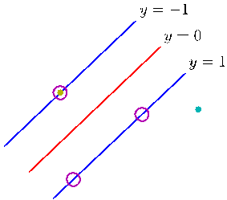

[Page 345]

# 7. Sparse Kernel Machines

In the previous chapter, we explored a variety of learning algorithms based on nonlinear kernels. One of the significant limitations of many such algorithms is that the kernel function $k(\mathbf{x}_n,\mathbf{x}_m)$ must be evaluated for all possible pairs $\mathbf{x}_n$ and $\mathbf{x}_m$ of training points, which can be computationally infeasible during training and can lead to excessive computation times when making predictions for new data points. In this chapter we shall look at kernel-based algorithms that have sparse solutions, so that predictions for new inputs depend only on the kernel function evaluated at a subset of the training data points.

We begin by looking in some detail at the support vector machine (SVM), which became popular in some years ago for solving problems in classification, regression, and novelty detection. An important property of support vector machines is that the determination of the model parameters corresponds to a convex optimization problem, and so any local solution is also a global optimum. Because the discussion of support vector machines makes extensive use of Lagrange multipliers, the reader is encouraged to review the key concepts covered in Appendix E. Additional information on support vector machines can be found in Vapnik (1995), Burges (1998), Cristianini and Shawe-Taylor (2000), M¨uller et al. (2001), Sch¨olkopf and Smola (2002), and Herbrich (2002).

The SVM is a decision machine and so does not provide posterior probabilities. We have already discussed some of the benefits of determining probabilities in Section 1.5.4. An alternative sparse kernel technique, known as the relevance vector machine (RVM), is based on a Bayesian formulation and provides posterior probabilistic outputs, as well as having typically much sparser solutions than the SVM.

## 7.1. Maximum Margin Classifiers

We begin our discussion of support vector machines by returning to the two-class classification problem using linear models of the form

$$
y(\mathbf{x}) = \mathbf{w}^T\boldsymbol{\phi}(\mathbf{x}) + b \tag{7.1}
$$

where $\boldsymbol{\phi}(\mathbf{x})$ denotes a fixed feature-space transformation, and we have made the bias parameter $b$ explicit. Note that we shall shortly introduce a dual representation expressed in terms of kernel functions, which avoids having to work explicitly in feature space. The training data set comprises $N$ input vectors $\mathbf{x}_1,\dots,\mathbf{x}_N$, with corresponding target values $t_1,\dots,t_N$ where $t_n \in \{-1,1\}$, and new data points $\mathbf{x}$ are classified according to the sign of $y(\mathbf{x})$.

We shall assume for the moment that the training data set is linearly separable in feature space, so that by definition there exists at least one choice of the parameters $\mathbf{w}$ and $b$ such that a function of the form (7.1) satisfies $y(\mathbf{x}_n) > 0$ for points having $t_n = +1$ and $y(\mathbf{x}_n) < 0$ for points having $t_n = -1$, so that $t_ny(\mathbf{x}_n) > 0$ for all training data points.

There may of course exist many such solutions that separate the classes exactly. In Section 4.1.7, we described the perceptron algorithm that is guaranteed to find a solution in a finite number of steps. The solution that it finds, however, will be dependent on the (arbitrary) initial values chosen for $\mathbf{w}$ and $b$ as well as on the order in which the data points are presented. If there are multiple solutions all of which classify the training data set exactly, then we should try to find the one that will give the smallest generalization error. The support vector machine approaches this problem through the concept of the margin, which is defined to be the smallest distance between the decision boundary and any of the samples, as illustrated in Figure 7.1.

In support vector machines the decision boundary is chosen to be the one for which the margin is maximized. The maximum margin solution can be motivated using computational learning theory, also known as statistical learning theory. However, a simple insight into the origins of maximum margin has been given by Tong and Koller (2000) who consider a framework for classification based on a hybrid of generative and discriminative approaches. They first model the distribution over input vectors $\mathbf{x}$ for each class using a Parzen density estimator with Gaussian kernels having a common parameter $\sigma^2$. Together with the class priors, this defines an optimal misclassification-rate decision boundary. However, instead of using this optimal boundary, they determine the best hyperplane by minimizing the probability of error relative to the learned density model. In the limit $\sigma^2 \to 0$, the optimal hyperplane is shown to be the one having maximum margin. The intuition behind this result is that as $\sigma^2$ is reduced, the hyperplane is increasingly dominated by nearby data points relative to more distant ones. In the limit, the hyperplane becomes independent of data points that are not support vectors.
[Page 347]

![The image depicts a geometric figure consisting of two parallel lines, labeled as (y) and (z). These lines are intersected by a line segment that is drawn from point (z) to point (y). The intersection of these lines creates a right angle at point (z). ### Description of the Image: 1. **Lines and Segments**: - **Line Segment (y)**: This line segment is drawn from point (z) to point (y). - **Line Segment (z)**: This line segment is drawn from point (z) to point (y). 2. **Intersection Point**: - **Point (z)**: The intersection point of the two lines is marked as (z). 3. **Angles and Angles of Intersection**: - **Angles of Intersection**: The](../Images/imageFile144.png)

Figure 7.1 The margin is defined as the perpendicular distance between the decision boundary and the closest of the data points, as shown on the left figure. Maximizing the margin leads to a particular choice of decision boundary, as shown on the right. The location of this boundary is determined by a subset of the data points, known as support vectors, which are indicated by the circles.

We shall see in Figure 10.13 that marginalization with respect to the prior distribution of the parameters in a Bayesian approach for a simple linearly separable data set leads to a decision boundary that lies in the middle of the region separating the data points. The large margin solution has similar behaviour.

Recall from Figure 4.1 that the perpendicular distance of a point $\mathbf{x}$ from a hyperplane defined by $y(\mathbf{x}) = 0$ where $y(\mathbf{x})$ takes the form (7.1) is given by $|y(\mathbf{x})|/\|\mathbf{w}\|$. Furthermore, we are only interested in solutions for which all data points are correctly classified, so that $t_ny(\mathbf{x}_n) > 0$ for all $n$. Thus the distance of a point $\mathbf{x}_n$ to the decision surface is given by

$$
\frac{t_n y(\mathbf{x}_n)}{\|\mathbf{w}\|} = \frac{t_n(\mathbf{w}^T\boldsymbol{\phi}(\mathbf{x}_n) + b)}{\|\mathbf{w}\|}. \tag{7.2}
$$

The margin is given by the perpendicular distance to the closest point $\mathbf{x}_n$ from the data set, and we wish to optimize the parameters $\mathbf{w}$ and $b$ in order to maximize this distance. Thus the maximum margin solution is found by solving

$$
\arg \max_{\mathbf{w},b} \left\{ \frac{1}{\|\mathbf{w}\|} \min_n [t_n(\mathbf{w}^T\boldsymbol{\phi}(\mathbf{x}_n) + b)] \right\} \tag{7.3}
$$

where we have taken the factor $1/\|\mathbf{w}\|$ outside the optimization over $n$ because $\mathbf{w}$
[Page 348]

does not depend on $n$. Direct solution of this optimization problem would be very complex, and so we shall convert it into an equivalent problem that is much easier to solve. To do this we note that if we make the rescaling $\mathbf{w} \to \kappa\mathbf{w}$ and $b \to \kappa b$, then the distance from any point $\mathbf{x}_n$ to the decision surface, given by $t_n y(\mathbf{x}_n)/\|\mathbf{w}\|$, is unchanged. We can use this freedom to set

$$
t_n(\mathbf{w}^T\boldsymbol{\phi}(\mathbf{x}_n) + b) = 1 \tag{7.4}
$$

for the point that is closest to the surface. In this case, all data points will satisfy the constraints

$$
t_n(\mathbf{w}^T\boldsymbol{\phi}(\mathbf{x}_n) + b) \geqslant 1, \quad n = 1,\dots,N. \tag{7.5}
$$

This is known as the canonical representation of the decision hyperplane. In the case of data points for which the equality holds, the constraints are said to be active, whereas for the remainder they are said to be inactive. By definition, there will always be at least one active constraint, because there will always be a closest point, and once the margin has been maximized there will be at least two active constraints. The optimization problem then simply requires that we maximize $\|\mathbf{w}\|^{-1}$, which is equivalent to minimizing $\|\mathbf{w}\|^2$, and so we have to solve the optimization problem

$$
\arg \min_{\mathbf{w},b} \frac{1}{2} \|\mathbf{w}\|^2 \tag{7.6}
$$

subject to the constraints given by (7.5). The factor of $1/2$ in (7.6) is included for later convenience. This is an example of a quadratic programming problem in which we are trying to minimize a quadratic function subject to a set of linear inequality constraints. It appears that the bias parameter $b$ has disappeared from the optimization. However, it is determined implicitly via the constraints, because these require that changes to $\mathbf{w}$ be compensated by changes to $b$. We shall see how this works shortly.

In order to solve this constrained optimization problem, we introduce Lagrange multipliers $a_n \geqslant 0$, with one multiplier $a_n$ for each of the constraints in (7.5), giving the Lagrangian function

$$
L(\mathbf{w},b,\mathbf{a}) = \frac{1}{2} \|\mathbf{w}\|^2 - \sum_{n=1}^N a_n \{t_n(\mathbf{w}^T\boldsymbol{\phi}(\mathbf{x}_n) + b) - 1\} \tag{7.7}
$$

where $\mathbf{a} = (a_1,\dots,a_N)^T$. Note the minus sign in front of the Lagrange multiplier term, because we are minimizing with respect to $\mathbf{w}$ and $b$, and maximizing with respect to $\mathbf{a}$. Setting the derivatives of $L(\mathbf{w},b,\mathbf{a})$ with respect to $\mathbf{w}$ and $b$ equal to zero, we obtain the following two conditions

$$
\mathbf{w} = \sum_{n=1}^N a_n t_n \boldsymbol{\phi}(\mathbf{x}_n) \tag{7.8}
$$

$$
0 = \sum_{n=1}^N a_n t_n. \tag{7.9}
$$

[Page 349]

Eliminating $\mathbf{w}$ and $b$ from $L(\mathbf{w},b,\mathbf{a})$ using these conditions then gives the dual representation of the maximum margin problem in which we maximize

$$
\widetilde{L}(\mathbf{a}) = \sum_{n=1}^N a_n - \frac{1}{2} \sum_{n=1}^N \sum_{m=1}^N a_n a_m t_n t_m k(\mathbf{x}_n,\mathbf{x}_m) \tag{7.10}
$$

with respect to $\mathbf{a}$ subject to the constraints

$$
a_n \geqslant 0, \quad n = 1,\dots,N, \tag{7.11}
$$

$$
\sum_{n=1}^N a_n t_n = 0. \tag{7.12}
$$

Here the kernel function is defined by $k(\mathbf{x},\mathbf{x}') = \boldsymbol{\phi}(\mathbf{x})^T\boldsymbol{\phi}(\mathbf{x}')$. Again, this takes the form of a quadratic programming problem in which we optimize a quadratic function of $\mathbf{a}$ subject to a set of inequality constraints. We shall discuss techniques for solving such quadratic programming problems in Section 7.1.1.

The solution to a quadratic programming problem in $M$ variables in general has computational complexity that is $O(M^3)$. In going to the dual formulation we have turned the original optimization problem, which involved minimizing (7.6) over $M$ variables, into the dual problem (7.10), which has $N$ variables. For a fixed set of basis functions whose number $M$ is smaller than the number $N$ of data points, the move to the dual problem appears disadvantageous. However, it allows the model to be reformulated using kernels, and so the maximum margin classifier can be applied efficiently to feature spaces whose dimensionality exceeds the number of data points, including infinite feature spaces. The kernel formulation also makes clear the role of the constraint that the kernel function $k(\mathbf{x},\mathbf{x}')$ be positive definite, because this ensures that the Lagrangian function $\widetilde{L}(\mathbf{a})$ is bounded below, giving rise to a welldefined optimization problem.

In order to classify new data points using the trained model, we evaluate the sign of $y(\mathbf{x})$ defined by (7.1). This can be expressed in terms of the parameters $\{a_n\}$ and the kernel function by substituting for $\mathbf{w}$ using (7.8) to give

$$
y(\mathbf{x}) = \sum_{n=1}^N a_n t_n k(\mathbf{x},\mathbf{x}_n) + b. \tag{7.13}
$$

[Page 350]

In Appendix E, we show that a constrained optimization of this form satisfies the Karush-Kuhn-Tucker (KKT) conditions, which in this case require that the following three properties hold

$$
a_n \geqslant 0 \tag{7.14}
$$

$$
t_n y(\mathbf{x}_n) - 1 \geqslant 0 \tag{7.15}
$$

$$
a_n \{t_n y(\mathbf{x}_n) - 1\} = 0. \tag{7.16}
$$

Thus for every data point, either $a_n = 0$ or $t_n y(\mathbf{x}_n) = 1$. Any data point for which $a_n = 0$ will not appear in the sum in (7.13) and hence plays no role in making predictions for new data points. The remaining data points are called support vectors, and because they satisfy $t_n y(\mathbf{x}_n) = 1$, they correspond to points that lie on the maximum margin hyperplanes in feature space, as illustrated in Figure 7.1. This property is central to the practical applicability of support vector machines. Once the model is trained, a significant proportion of the data points can be discarded and only the support vectors retained.

Having solved the quadratic programming problem and found a value for $\mathbf{a}$, we can then determine the value of the threshold parameter $b$ by noting that any support vector $\mathbf{x}_n$ satisfies $t_n y(\mathbf{x}_n) = 1$. Using (7.13) this gives

$$
t_n \left( \sum_{m \in \mathcal{S}} a_m t_m k(\mathbf{x}_n, \mathbf{x}_m) + b \right) = 1 \tag{7.17}
$$

where $\mathcal{S}$ denotes the set of indices of the support vectors. Although we can solve this equation for $b$ using an arbitrarily chosen support vector $\mathbf{x}_n$, a numerically more stable solution is obtained by first multiplying through by $t_n$, making use of $t_n^2 = 1$, and then averaging these equations over all support vectors and solving for $b$ to give

$$
b = \frac{1}{N_{\mathcal{S}}} \sum_{n \in \mathcal{S}} \left( t_n - \sum_{m \in \mathcal{S}} a_m t_m k(\mathbf{x}_n, \mathbf{x}_m) \right) \tag{7.18}
$$

where $N_{\mathcal{S}}$ is the total number of support vectors.

For later comparison with alternative models, we can express the maximummargin classifier in terms of the minimization of an error function, with a simple quadratic regularizer, in the form

$$
\sum_{n=1}^N E_{\infty}(y(\mathbf{x}_n)t_n - 1) + \lambda \|\mathbf{w}\|^2 \tag{7.19}
$$

where $E_{\infty}(z)$ is a function that is zero if $z \geqslant 0$ and $\infty$ otherwise and ensures that the constraints (7.5) are satisfied. Note that as long as the regularization parameter satisfies $\lambda > 0$, its precise value plays no role.

Figure 7.2 shows an example of the classification resulting from training a support vector machine on a simple synthetic data set using a Gaussian kernel of the
[Page 351]

![The image depicts a geometric figure with various interconnected circles. The circles are arranged in a circular pattern, with each circle forming a distinct shape. Here is a detailed description of the image: - **Circles**: There are five distinct circles in the image. Each circle is a circle with a different shape. The circles are arranged in a circular pattern, with each circle forming a distinct shape. The circles are connected by lines, forming a continuous line that connects each circle. - **Shapes**: The circles are of different shapes. The first circle is a circle with a diameter of 2 units. The second circle is a circle with a diameter of 3 units. The third circle is a circle with a diameter of 4 units. The fourth circle is a circle with a diameter of 5 units. The fifth circle is a circle with a diameter of 6 units. - **Lines**: There are lines connecting each circle. The lines are straight and connect the](../Images/imageFile147.png)

Figure 7.2 Example of synthetic data from two classes in two dimensions showing contours of constant $y(\mathbf{x})$ obtained from a support vector machine having a Gaussian kernel function. Also shown are the decision boundary, the margin boundaries, and the support vectors.

form (6.23). Although the data set is not linearly separable in the two-dimensional data space $\mathbf{x}$, it is linearly separable in the nonlinear feature space defined implicitly by the nonlinear kernel function. Thus the training data points are perfectly separated in the original data space.

This example also provides a geometrical insight into the origin of sparsity in the SVM. The maximum margin hyperplane is defined by the location of the support vectors. Other data points can be moved around freely (so long as they remain outside the margin region) without changing the decision boundary, and so the solution will be independent of such data points.

## 7.1.1 Overlapping class distributions

So far, we have assumed that the training data points are linearly separable in the feature space $\boldsymbol{\phi}(\mathbf{x})$. The resulting support vector machine will give exact separation of the training data in the original input space $\mathbf{x}$, although the corresponding decision boundary will be nonlinear. In practice, however, the class-conditional distributions may overlap, in which case exact separation of the training data can lead to poor generalization.

We therefore need a way to modify the support vector machine so as to allow some of the training points to be misclassified. From (7.19) we see that in the case of separable classes, we implicitly used an error function that gave infinite error if a data point was misclassified and zero error if it was classified correctly, and then optimized the model parameters to maximize the margin. We now modify this approach so that data points are allowed to be on the ‘wrong side’ of the margin boundary, but with a penalty that increases with the distance from that boundary. For the subsequent optimization problem, it is convenient to make this penalty a linear function of this distance. To do this, we introduce slack variables, $\xi_n \geqslant 0$ where $n = 1,\dots,N$, with one slack variable for each training data point (Bennett, 1992; Cortes and Vapnik, 1995). These are defined by $\xi_n = 0$ for data points that are on or inside the correct margin boundary and $\xi_n = |t_n - y(\mathbf{x}_n)|$ for other points. Thus a data point that is on the decision boundary $y(\mathbf{x}_n) = 0$ will have $\xi_n = 1$, and points
[Page 352]

Figure 7.3 Illustration of the slack variables $\xi_n \geqslant 0$. Data points with circles around them are support vectors.

![The image depicts a geometric figure consisting of a line segment labeled as (y) and a line segment labeled as (z). The line segment (y) is positioned at the top of the figure, while the line segment (z) is positioned at the bottom of the figure. Both lines are parallel to each other. ### Description of the Figure: - **Line Segment (y)**: - The line segment (y) is a straight line that extends from the top of the figure to the bottom. - The line segment (z) is a line that extends from the bottom of the figure to the top. ### Objects in the Image: - **Line Segment (y)**: - The line segment (y) is a straight line that extends from the top of the figure to the bottom. - The line segment (z) is](../Images/imageFile148.png)

with $\xi_n > 1$ will be misclassified. The exact classification constraints (7.5) are then replaced with

$$
t_ny(\mathbf{x}_n) \geqslant 1 - \xi_n, \quad n = 1,\dots,N \tag{7.20}
$$

in which the slack variables are constrained to satisfy $\xi_n \geqslant 0$. Data points for which $\xi_n = 0$ are correctly classified and are either on the margin or on the correct side of the margin. Points for which $0 < \xi_n \leqslant 1$ lie inside the margin, but on the correct side of the decision boundary, and those data points for which $\xi_n > 1$ lie on the wrong side of the decision boundary and are misclassified, as illustrated in Figure 7.3. This is sometimes described as relaxing the hard margin constraint to give a soft margin and allows some of the training set data points to be misclassified. Note that while slack variables allow for overlapping class distributions, this framework is still sensitive to outliers because the penalty for misclassification increases linearly with $\xi$.

Our goal is now to maximize the margin while softly penalizing points that lie on the wrong side of the margin boundary. We therefore minimize

$$
C \sum_{n=1}^N \xi_n + \frac{1}{2} \|\mathbf{w}\|^2 \tag{7.21}
$$

where the parameter $C > 0$ controls the trade-off between the slack variable penalty and the margin. Because any point that is misclassified has $\xi_n > 1$, it follows that $\sum_n \xi_n$ is an upper bound on the number of misclassified points. The parameter $C$ is therefore analogous to (the inverse of) a regularization coefficient because it controls the trade-off between minimizing training errors and controlling model complexity. In the limit $C \to \infty$, we will recover the earlier support vector machine for separable data.

We now wish to minimize (7.21) subject to the constraints (7.20) together with $\xi_n \geqslant 0$. The corresponding Lagrangian is given by

$$
L(\mathbf{w},b,\mathbf{a}) = \frac{1}{2} \|\mathbf{w}\|^2 + C \sum_{n=1}^N \xi_n - \sum_{n=1}^N a_n \{t_ny(\mathbf{x}_n) - 1 + \xi_n\} - \sum_{n=1}^N \mu_n\xi_n \tag{7.22}
$$

[Page 353]

where $\{a_n \geqslant 0\}$ and $\{\mu_n \geqslant 0\}$ are Lagrange multipliers. The corresponding set of KKT conditions are given by

$$
a_n \geqslant 0 \tag{7.23}
$$

$$
t_ny(\mathbf{x}_n) - 1 + \xi_n \geqslant 0 \tag{7.24}
$$

$$
a_n(t_ny(\mathbf{x}_n) - 1 + \xi_n) = 0 \tag{7.25}
$$

$$
\mu_n \geqslant 0 \tag{7.26}
$$

$$
\xi_n \geqslant 0 \tag{7.27}
$$

$$
\mu_n\xi_n = 0 \tag{7.28}
$$

where $n = 1,\dots,N$.

We now optimize out $\mathbf{w}$, $b$, and $\{\xi_n\}$ making use of the definition (7.1) of $y(\mathbf{x})$ to give

$$
\frac{\partial L}{\partial \mathbf{w}} = 0 \quad \Rightarrow \quad \mathbf{w} = \sum_{n=1}^N a_nt_n\boldsymbol{\phi}(\mathbf{x}_n) \tag{7.29}
$$

$$
\frac{\partial L}{\partial b} = 0 \quad \Rightarrow \quad \sum_{n=1}^N a_nt_n = 0 \tag{7.30}
$$

$$
\frac{\partial L}{\partial \xi_n} = 0 \quad \Rightarrow \quad a_n = C - \mu_n. \tag{7.31}
$$

Using these results to eliminate $\mathbf{w}$, $b$, and $\{\xi_n\}$ from the Lagrangian, we obtain the dual Lagrangian in the form

$$
\widetilde{L}(\mathbf{a}) = \sum_{n=1}^N a_n - \frac{1}{2} \sum_{n=1}^N \sum_{m=1}^N a_n a_m t_n t_m k(\mathbf{x}_n,\mathbf{x}_m) \tag{7.32}
$$

which is identical to the separable case, except that the constraints are somewhat different. To see what these constraints are, we note that $a_n \geqslant 0$ is required because these are Lagrange multipliers. Furthermore, (7.31) together with $\mu_n \geqslant 0$ implies $a_n \leqslant C$. We therefore have to minimize (7.32) with respect to the dual variables $\{a_n\}$ subject to

$$
0 \leqslant a_n \leqslant C \tag{7.33}
$$

$$
\sum_{n=1}^N a_nt_n = 0 \tag{7.34}
$$

for $n = 1,\dots,N$, where (7.33) are known as box constraints. This again represents a quadratic programming problem. If we substitute (7.29) into (7.1), we see that predictions for new data points are again made by using (7.13).

We can now interpret the resulting solution. As before, a subset of the data points may have $a_n = 0$, in which case they do not contribute to the predictive
[Page 354]

model (7.13). The remaining data points constitute the support vectors. These have $a_n > 0$ and hence from (7.25) must satisfy

$$
t_ny(\mathbf{x}_n) = 1 - \xi_n. \tag{7.35}
$$

If $a_n < C$, then (7.31) implies that $\mu_n > 0$, which from (7.28) requires $\xi_n = 0$ and hence such points lie on the margin. Points with $a_n = C$ can lie inside the margin and can either be correctly classified if $\xi_n \leqslant 1$ or misclassified if $\xi_n > 1$.

To determine the parameter $b$ in (7.1), we note that those support vectors for which $0 < a_n < C$ have $\xi_n = 0$ so that $t_ny(\mathbf{x}_n) = 1$ and hence will satisfy

$$
t_n \left( \sum_{m \in \mathcal{S}} a_mt_mk(\mathbf{x}_n,\mathbf{x}_m) + b \right) = 1. \tag{7.36}
$$

Again, a numerically stable solution is obtained by averaging to give

$$
b = \frac{1}{N_{\mathcal{M}}} \sum_{n \in \mathcal{M}} \left( t_n - \sum_{m \in \mathcal{S}} a_mt_mk(\mathbf{x}_n,\mathbf{x}_m) \right) \tag{7.37}
$$

where $\mathcal{M}$ denotes the set of indices of data points having $0 < a_n < C$.

An alternative, equivalent formulation of the support vector machine, known as the $\nu$-SVM, has been proposed by Sch¨olkopf et al. (2000). This involves maximizing

$$
\widetilde{L}(\mathbf{a}) = \sum_{n=1}^N a_n - \frac{1}{2} \sum_{n=1}^N \sum_{m=1}^N a_n a_m t_n t_m k(\mathbf{x}_n,\mathbf{x}_m) \tag{7.38}
$$

subject to the constraints

$$
0 \leqslant a_n \leqslant 1/N \tag{7.39}
$$

$$
\sum_{n=1}^N a_nt_n = 0 \tag{7.40}
$$

$$
\sum_{n=1}^N a_n \geqslant \nu. \tag{7.41}
$$

This approach has the advantage that the parameter $\nu$, which replaces $C$, can be interpreted as both an upper bound on the fraction of margin errors (points for which $\xi_n > 0$ and hence which lie on the wrong side of the margin boundary and which may or may not be misclassified) and a lower bound on the fraction of support vectors. An example of the $\nu$-SVM applied to a synthetic data set is shown in Figure 7.4. Here Gaussian kernels of the form $\exp(-\gamma\|\mathbf{x} - \mathbf{x}'\|^2)$ have been used, with $\gamma = 0.45$.

Although predictions for new inputs are made using only the support vectors, the training phase (i.e., the determination of the parameters $\mathbf{a}$ and $b$) makes use of the whole data set, and so it is important to have efficient algorithms for solving
[Page 355]

Figure 7.4 Illustration of the $\nu$-SVM applied to a nonseparable data set in two dimensions. The support vectors are indicated by circles.

![The image is a scatter plot with a white background. The plot is composed of multiple colors, each representing different data points. The colors are as follows: - Blue: Represented by the number of data points. - Red: Represented by the number of data points. - Green: Represented by the number of data points. - Yellow: Represented by the number of data points. - Cyan: Represented by the number of data points. The x-axis is labeled x and the y-axis is labeled y. The plot is visually segmented into different sections, each representing a different data point. The data points are represented by dots, with the dots being colored differently to represent different data points. The scatter plot is visually segmented into different sections, each representing a different data point. The data points are represented by dots, with the dots being colored differently to represent different data points. The x-axis](../Images/imageFile149.png)

the quadratic programming problem. We first note that the objective function $\widetilde{L}(\mathbf{a})$ given by (7.10) or (7.32) is quadratic and so any local optimum will also be a global optimum provided the constraints define a convex region (which they do as a consequence of being linear). Direct solution of the quadratic programming problem using traditional techniques is often infeasible due to the demanding computation and memory requirements, and so more practical approaches need to be found. The technique of chunking (Vapnik, 1982) exploits the fact that the value of the Lagrangian is unchanged if we remove the rows and columns of the kernel matrix corresponding to Lagrange multipliers that have value zero. This allows the full quadratic programming problem to be broken down into a series of smaller ones, whose goal is eventually to identify all of the nonzero Lagrange multipliers and discard the others. Chunking can be implemented using protected conjugate gradients (Burges, 1998). Although chunking reduces the size of the matrix in the quadratic function from the number of data points squared to approximately the number of nonzero Lagrange multipliers squared, even this may be too big to fit in memory for large-scale applications. Decomposition methods (Osuna et al., 1996) also solve a series of smaller quadratic programming problems but are designed so that each of these is of a fixed size, and so the technique can be applied to arbitrarily large data sets. However, it still involves numerical solution of quadratic programming subproblems and these can be problematic and expensive. One of the most popular approaches to training support vector machines is called sequential minimal optimization, or SMO (Platt, 1999). It takes the concept of chunking to the extreme limit and considers just two Lagrange multipliers at a time. In this case, the subproblem can be solved analytically, thereby avoiding numerical quadratic programming altogether. Heuristics are given for choosing the pair of Lagrange multipliers to be considered at each step. In practice, SMO is found to have a scaling with the number of data points that is somewhere between linear and quadratic depending on the particular application.

We have seen that kernel functions correspond to inner products in feature spaces that can have high, or even infinite, dimensionality. By working directly in terms of the kernel function, without introducing the feature space explicitly, it might therefore seem that support vector machines somehow manage to avoid the curse of dimensionality. This is not the case, however, because there are constraints amongst the feature values that restrict the effective dimensionality of feature space. To see this consider a simple second-order polynomial kernel that we can expand in terms of its components

$$
k(\mathbf{x},\mathbf{z}) = (1 + \mathbf{x}^T\mathbf{z})^2 = (1 + x_1z_1 + x_2z_2)^2 \\
= 1 + 2x_1z_1 + 2x_2z_2 + x_1^2z_1^2 + 2x_1z_1x_2z_2 + x_2^2z_2^2 \\
= (1, \sqrt{2}x_1, \sqrt{2}x_2, x_1^2, \sqrt{2}x_1x_2, x_2^2)(1, \sqrt{2}z_1, \sqrt{2}z_2, z_1^2, \sqrt{2}z_1z_2, z_2^2)^T \\
= \boldsymbol{\phi}(\mathbf{x})^T\boldsymbol{\phi}(\mathbf{z}). \tag{7.42}
$$

This kernel function therefore represents an inner product in a feature space having six dimensions, in which the mapping from input space to feature space is described by the vector function $\boldsymbol{\phi}(\mathbf{x})$. However, the coefficients weighting these different features are constrained to have specific forms. Thus any set of points in the original two-dimensional space $\mathbf{x}$ would be constrained to lie exactly on a two-dimensional nonlinear manifold embedded in the six-dimensional feature space.

We have already highlighted the fact that the support vector machine does not provide probabilistic outputs but instead makes classification decisions for new input vectors. Veropoulos et al. (1999) discuss modifications to the SVM to allow the trade-off between false positive and false negative errors to be controlled. However, if we wish to use the SVM as a module in a larger probabilistic system, then probabilistic predictions of the class label $t$ for new inputs $\mathbf{x}$ are required.

To address this issue, Platt (2000) has proposed fitting a logistic sigmoid to the outputs of a previously trained support vector machine. Specifically, the required conditional probability is assumed to be of the form

$$
p(t = 1|\mathbf{x}) = \sigma \left( Ay(\mathbf{x}) + B \right) \tag{7.43}
$$

where $y(\mathbf{x})$ is defined by (7.1). Values for the parameters $A$ and $B$ are found by minimizing the cross-entropy error function defined by a training set consisting of pairs of values $y(\mathbf{x}_n)$ and $t_n$. The data used to fit the sigmoid needs to be independent of that used to train the original SVM in order to avoid severe over-fitting. This twostage approach is equivalent to assuming that the output $y(\mathbf{x})$ of the support vector machine represents the log-odds of $\mathbf{x}$ belonging to class $t = 1$. Because the SVM training procedure is not specifically intended to encourage this, the SVM can give a poor approximation to the posterior probabilities (Tipping, 2001).

## 7.1.2 Relation to logistic regression

As with the separable case, we can re-cast the SVM for nonseparable distributions in terms of the minimization of a regularized error function. This will also allow us to highlight similarities, and differences, compared to the logistic regression model.

We have seen that for data points that are on the correct side of the margin boundary, and which therefore satisfy $y_nt_n \geqslant 1$, we have $\xi_n = 0$, and for the
[Page 357]

Figure 7.5 Plot of the ‘hinge’ error function used in support vector machines, shown in blue, along with the error function for logistic regression, rescaled by a factor of $1/\ln(2)$ so that it passes through the point $(0, 1)$, shown in red. Also shown are the misclassification error in black and the squared error in green.

![The image consists of a graph with two lines, one blue and one red, both labeled as E(z). The graph has a horizontal axis labeled z and a vertical axis labeled 2, with a scale from -2 to 1 on the x-axis. The graph shows two peaks and two troughs, indicating that the graph is not symmetrical. The blue line is labeled as E(z) and the red line is labeled as E(z). The blue line is shown to be the highest peak, while the red line is shown to be the lowest peak. The graph also includes a point labeled 2, which is located at the bottom of the graph. This point is marked with a dashed line, indicating that it is the lowest point on the graph. The graph also includes a point labeled 1, which is located at the top of the graph. This point is marked with a dashed line, indicating that it is](../Images/imageFile150.png)

remaining points we have $\xi_n = 1 - y_nt_n$. Thus the objective function (7.21) can be written (up to an overall multiplicative constant) in the form

$$
\sum_{n=1}^N E_{SV}(y_nt_n) + \lambda \|\mathbf{w}\|^2 \tag{7.44}
$$

where $\lambda = (2C)^{-1}$, and $E_{SV}(\cdot)$ is the hinge error function defined by

$$
E_{SV}(y_nt_n) = [1 - y_nt_n]_+ \tag{7.45}
$$

where $[\cdot]_+$ denotes the positive part. The hinge error function, so-called because of its shape, is plotted in Figure 7.5. It can be viewed as an approximation to the misclassification error, i.e., the error function that ideally we would like to minimize, which is also shown in Figure 7.5.

When we considered the logistic regression model in Section 4.3.2, we found it convenient to work with target variable $t \in \{0,1\}$. For comparison with the support vector machine, we first reformulate maximum likelihood logistic regression using the target variable $t \in \{-1,1\}$. To do this, we note that $p(t = 1|y) = \sigma(y)$ where $y(\mathbf{x})$ is given by (7.1), and $\sigma(y)$ is the logistic sigmoid function defined by (4.59). It follows that $p(t = -1|y) = 1 - \sigma(y) = \sigma(-y)$, where we have used the properties of the logistic sigmoid function, and so we can write

$$
p(t|y) = \sigma(yt). \tag{7.46}
$$

From this we can construct an error function by taking the negative logarithm of the likelihood function that, with a quadratic regularizer, takes the form

$$
\sum_{n=1}^N E_{LR}(y_nt_n) + \lambda \|\mathbf{w}\|^2. \tag{7.47}
$$

where

$$
E_{LR}(yt) = \ln(1 + \exp(-yt)). \tag{7.48}
$$

[Page 358]

For comparison with other error functions, we can divide by $\ln(2)$ so that the error function passes through the point $(0,1)$. This rescaled error function is also plotted in Figure 7.5 and we see that it has a similar form to the support vector error function. The key difference is that the flat region in $E_{SV}(yt)$ leads to sparse solutions.

Both the logistic error and the hinge loss can be viewed as continuous approximations to the misclassification error. Another continuous error function that has sometimes been used to solve classification problems is the squared error, which is again plotted in Figure 7.5. It has the property, however, of placing increasing emphasis on data points that are correctly classified but that are a long way from the decision boundary on the correct side. Such points will be strongly weighted at the expense of misclassified points, and so if the objective is to minimize the misclassification rate, then a monotonically decreasing error function would be a better choice.

## 7.1.3 Multiclass SVMs

The support vector machine is fundamentally a two-class classifier. In practice, however, we often have to tackle problems involving $K > 2$ classes. Various methods have therefore been proposed for combining multiple two-class SVMs in order to build a multiclass classifier.

One commonly used approach (Vapnik, 1998) is to construct $K$ separate SVMs, in which the $k^{\text{th}}$ model $y_k(\mathbf{x})$ is trained using the data from class $\mathcal{C}_k$ as the positive examples and the data from the remaining $K - 1$ classes as the negative examples. This is known as the one-versus-the-rest approach. However, in Figure 4.2 we saw that using the decisions of the individual classifiers can lead to inconsistent results in which an input is assigned to multiple classes simultaneously. This problem is sometimes addressed by making predictions for new inputs $\mathbf{x}$ using

$$
y(\mathbf{x}) = \max_k y_k(\mathbf{x}). \tag{7.49}
$$

Unfortunately, this heuristic approach suffers from the problem that the different classifiers were trained on different tasks, and there is no guarantee that the realvalued quantities $y_k(\mathbf{x})$ for different classifiers will have appropriate scales.

Another problem with the one-versus-the-rest approach is that the training sets are imbalanced. For instance, if we have ten classes each with equal numbers of training data points, then the individual classifiers are trained on data sets comprising 90% negative examples and only 10% positive examples, and the symmetry of the original problem is lost. A variant of the one-versus-the-rest scheme was proposed by Lee et al. (2001) who modify the target values so that the positive class has target $+1$ and the negative class has target $-1/(K - 1)$.

Weston and Watkins (1999) define a single objective function for training all $K$ SVMs simultaneously, based on maximizing the margin from each to remaining classes. However, this can result in much slower training because, instead of solving $K$ separate optimization problems each over $N$ data points with an overall cost of $O(KN^2)$, a single optimization problem of size $(K - 1)N$ must be solved giving an overall cost of $O(K^2N^2)$.
[Page 359]

Another approach is to train $K(K - 1)/2$ different 2-class SVMs on all possible pairs of classes, and then to classify test points according to which class has the highest number of ‘votes’, an approach that is sometimes called one-versus-one. Again, we saw in Figure 4.2 that this can lead to ambiguities in the resulting classification. Also, for large $K$ this approach requires significantly more training time than the one-versus-the-rest approach. Similarly, to evaluate test points, significantly more computation is required.

The latter problem can be alleviated by organizing the pairwise classifiers into a directed acyclic graph (not to be confused with a probabilistic graphical model) leading to the DAGSVM (Platt et al., 2000). For $K$ classes, the DAGSVM has a total of $K(K - 1)/2$ classifiers, and to classify a new test point only $K - 1$ pairwise classifiers need to be evaluated, with the particular classifiers used depending on which path through the graph is traversed.

A different approach to multiclass classification, based on error-correcting output codes, was developed by Dietterich and Bakiri (1995) and applied to support vector machines by Allwein et al. (2000). This can be viewed as a generalization of the voting scheme of the one-versus-one approach in which more general partitions of the classes are used to train the individual classifiers. The $K$ classes themselves are represented as particular sets of responses from the two-class classifiers chosen, and together with a suitable decoding scheme, this gives robustness to errors and to ambiguity in the outputs of the individual classifiers. Although the application of SVMs to multiclass classification problems remains an open issue, in practice the one-versus-the-rest approach is the most widely used in spite of its ad-hoc formulation and its practical limitations.

There are also single-class support vector machines, which solve an unsupervised learning problem related to probability density estimation. Instead of modelling the density of data, however, these methods aim to find a smooth boundary enclosing a region of high density. The boundary is chosen to represent a quantile of the density, that is, the probability that a data point drawn from the distribution will land inside that region is given by a fixed number between $0$ and $1$ that is specified in advance. This is a more restricted problem than estimating the full density but may be sufficient in specific applications. Two approaches to this problem using support vector machines have been proposed. The algorithm of Sch¨olkopf et al. (2001) tries to find a hyperplane that separates all but a fixed fraction $\nu$ of the training data from the origin while at the same time maximizing the distance (margin) of the hyperplane from the origin, while Tax and Duin (1999) look for the smallest sphere in feature space that contains all but a fraction $\nu$ of the data points. For kernels $k(\mathbf{x},\mathbf{x}')$ that are functions only of $\mathbf{x} - \mathbf{x}'$, the two algorithms are equivalent.

## 7.1.4 SVMs for regression

We now extend support vector machines to regression problems while at the same time preserving the property of sparseness. In simple linear regression, we
[Page 360]

Figure 7.6 Plot of an $\epsilon$-insensitive error function (in red) in which the error increases linearly with distance beyond the insensitive region. Also shown for comparison is the quadratic error function (in green).

![The image consists of a graph with two lines. The graph is a line graph with two lines, one of which is a straight line. The line on the left side of the graph is a straight line with a positive slope. The line on the right side of the graph is a straight line with a negative slope. The line on the left side of the graph is a straight line with a positive slope. The line on the right side of the graph is a straight line with a negative slope. The graph is labeled as E(z) = 0 and the x-axis is labeled as z and the y-axis is labeled as z.](../Images/imageFile151.png)

minimize a regularized error function given by

$$
\frac{1}{2} \sum_{n=1}^N \{y_n - t_n\}^2 + \frac{\lambda}{2} \|\mathbf{w}\|^2. \tag{7.50}
$$

To obtain sparse solutions, the quadratic error function is replaced by an $\epsilon$-insensitive error function (Vapnik, 1995), which gives zero error if the absolute difference between the prediction $y(\mathbf{x})$ and the target $t$ is less than $\epsilon$ where $\epsilon > 0$. A simple example of an $\epsilon$-insensitive error function, having a linear cost associated with errors outside the insensitive region, is given by

$$
E_{\epsilon}(y(\mathbf{x}) - t) = \begin{cases} 0, & \text{if } |y(\mathbf{x}) - t| < \epsilon; \\ |y(\mathbf{x}) - t| - \epsilon, & \text{otherwise} \end{cases} \tag{7.51}
$$

and is illustrated in Figure 7.6.

We therefore minimize a regularized error function given by

$$
C \sum_{n=1}^N E_{\epsilon}(y(\mathbf{x}_n) - t_n) + \frac{1}{2} \|\mathbf{w}\|^2 \tag{7.52}
$$

where $y(\mathbf{x})$ is given by (7.1). By convention the (inverse) regularization parameter, denoted $C$, appears in front of the error term.

As before, we can re-express the optimization problem by introducing slack variables. For each data point $\mathbf{x}_n$, we now need two slack variables $\xi_n \geqslant 0$ and $\widehat{\xi}_n \geqslant 0$, where $\xi_n > 0$ corresponds to a point for which $t_n > y(\mathbf{x}_n) + \epsilon$, and $\widehat{\xi}_n > 0$ corresponds to a point for which $t_n < y(\mathbf{x}_n) - \epsilon$, as illustrated in Figure 7.7.

The condition for a target point to lie inside the $\epsilon$-tube is that $y_n - \epsilon \leqslant t_n \leqslant y_n + \epsilon$, where $y_n = y(\mathbf{x}_n)$. Introducing the slack variables allows points to lie outside the tube provided the slack variables are nonzero, and the corresponding conditions are

$$
t_n \leqslant y(\mathbf{x}_n) + \epsilon + \xi_n \tag{7.53}
$$

$$
t_n \geqslant y(\mathbf{x}_n) - \epsilon - \widehat{\xi}_n. \tag{7.54}
$$

[Page 361]

Figure 7.7 Illustration of SVM regression, showing the regression curve together with the insensitive ‘tube’. Also shown are examples of the slack variables $\xi$ and $\widehat{\xi}$. Points above the $\epsilon$-tube have $\xi > 0$ and $\widehat{\xi} = 0$, points below the $\epsilon$-tube have $\xi = 0$ and $\widehat{\xi} > 0$, and points inside the $\epsilon$-tube have $\xi = \widehat{\xi} = 0$.

![The image depicts a curved line that appears to be a graph or a diagram. The graph is a curved line with a slight curve, indicating that it is not a straight line but a curved one. The graph is marked with a series of points, each marked with a letter. The points are connected by a curved line, which is a type of curve that is commonly used in mathematics and physics to represent data points. The graph has a specific shape: - The x-axis is labeled with the letter y and is labeled as y(x). - The y-axis is labeled with the letter x and is labeled as x. - The graph has a curved line that starts at the point labeled y(x) and extends to the point labeled x. - The line starts at point y(x) and extends to point x with a slight curve. - The line then extends to point y](../Images/imageFile152.png)

The error function for support vector regression can then be written as

$$
C \sum_{n=1}^N (\xi_n + \widehat{\xi}_n) + \frac{1}{2} \|\mathbf{w}\|^2 \tag{7.55}
$$

which must be minimized subject to the constraints $\xi_n \geqslant 0$ and $\widehat{\xi}_n \geqslant 0$ as well as (7.53) and (7.54). This can be achieved by introducing Lagrange multipliers $a_n \geqslant 0$, $\widehat{a}_n \geqslant 0$, $\mu_n \geqslant 0$, and $\widehat{\mu}_n \geqslant 0$ and optimizing the Lagrangian

$$
\begin{aligned} L &= C \sum_{n=1}^N (\xi_n + \widehat{\xi}_n) + \frac{1}{2} \|\mathbf{w}\|^2 - \sum_{n=1}^N (\mu_n\xi_n + \widehat{\mu}_n\widehat{\xi}_n) \\ &- \sum_{n=1}^N a_n(\epsilon + \xi_n + y_n - t_n) - \sum_{n=1}^N \widehat{a}_n(\epsilon + \widehat{\xi}_n - y_n + t_n). \end{aligned} \tag{7.56}
$$

We now substitute for $y(\mathbf{x})$ using (7.1) and then set the derivatives of the Lagrangian with respect to $\mathbf{w}$, $b$, $\xi_n$, and $\widehat{\xi}_n$ to zero, giving

$$
\frac{\partial L}{\partial \mathbf{w}} = 0 \quad \Rightarrow \quad \mathbf{w} = \sum_{n=1}^N (a_n - \widehat{a}_n)\phi(\mathbf{x}_n) \tag{7.57}
$$

$$
\frac{\partial L}{\partial b} = 0 \quad \Rightarrow \quad \sum_{n=1}^N (a_n - \widehat{a}_n) = 0 \tag{7.58}
$$

$$
\frac{\partial L}{\partial \xi_n} = 0 \quad \Rightarrow \quad a_n + \mu_n = C \tag{7.59}
$$

$$
\frac{\partial L}{\partial \widehat{\xi}_n} = 0 \quad \Rightarrow \quad \widehat{a}_n + \widehat{\mu}_n = C. \tag{7.60}
$$

Using these results to eliminate the corresponding variables from the Lagrangian, we see that the dual problem involves maximizing
[Page 362]

$$
\begin{aligned} \widetilde{L}(\mathbf{a}, \widehat{\mathbf{a}}) &= -\frac{1}{2} \sum_{n=1}^N \sum_{m=1}^N (a_n - \widehat{a}_n)(a_m - \widehat{a}_m)k(\mathbf{x}_n, \mathbf{x}_m) \\ &- \epsilon \sum_{n=1}^N (a_n + \widehat{a}_n) + \sum_{n=1}^N (a_n - \widehat{a}_n)t_n \end{aligned} \tag{7.61}
$$

with respect to $\{a_n\}$ and $\{\widehat{a}_n\}$, where we have introduced the kernel $k(\mathbf{x}, \mathbf{x}') = \phi(\mathbf{x})^T\phi(\mathbf{x}')$. Again, this is a constrained maximization, and to find the constraints we note that $a_n \geqslant 0$ and $\widehat{a}_n \geqslant 0$ are both required because these are Lagrange multipliers. Also $\mu_n \geqslant 0$ and $\widehat{\mu}_n \geqslant 0$ together with (7.59) and (7.60), require $a_n \leqslant C$ and $\widehat{a}_n \leqslant C$, and so again we have the box constraints

$$
0 \leqslant a_n \leqslant C \tag{7.62}
$$

$$
0 \leqslant \widehat{a}_n \leqslant C \tag{7.63}
$$

together with the condition (7.58).

Substituting (7.57) into (7.1), we see that predictions for new inputs can be made using

$$
y(\mathbf{x}) = \sum_{n=1}^N (a_n - \widehat{a}_n)k(\mathbf{x}, \mathbf{x}_n) + b \tag{7.64}
$$

which is again expressed in terms of the kernel function.

The corresponding Karush-Kuhn-Tucker (KKT) conditions, which state that at the solution the product of the dual variables and the constraints must vanish, are given by

$$
a_n(\epsilon + \xi_n + y_n - t_n) = 0 \tag{7.65}
$$

$$
\widehat{a}_n(\epsilon + \widehat{\xi}_n - y_n + t_n) = 0 \tag{7.66}
$$

$$
(C - a_n)\xi_n = 0 \tag{7.67}
$$

$$
(C - \widehat{a}_n)\widehat{\xi}_n = 0. \tag{7.68}
$$

From these we can obtain several useful results. First of all, we note that a coefficient $a_n$ can only be nonzero if $\epsilon + \xi_n + y_n - t_n = 0$, which implies that the data point either lies on the upper boundary of the $\epsilon$-tube ($\xi_n = 0$) or lies above the upper boundary ($\xi_n > 0$). Similarly, a nonzero value for $\widehat{a}_n$ implies $\epsilon + \widehat{\xi}_n - y_n + t_n = 0$, and such points must lie either on or below the lower boundary of the $\epsilon$-tube.

Furthermore, the two constraints $\epsilon + \xi_n + y_n - t_n = 0$ and $\epsilon + \widehat{\xi}_n - y_n + t_n = 0$ are incompatible, as is easily seen by adding them together and noting that $\xi_n$ and $\widehat{\xi}_n$ are nonnegative while $\epsilon$ is strictly positive, and so for every data point $\mathbf{x}_n$, either $a_n$ or $\widehat{a}_n$ (or both) must be zero.

The support vectors are those data points that contribute to predictions given by (7.64), in other words those for which either $a_n \neq 0$ or $\widehat{a}_n \neq 0$. These are points that lie on the boundary of the $\epsilon$-tube or outside the tube. All points within the tube have
[Page 363]

$a_n = \widehat{a}_n = 0$. We again have a sparse solution, and the only terms that have to be evaluated in the predictive model (7.64) are those that involve the support vectors.

The parameter $b$ can be found by considering a data point for which $0 < a_n < C$, which from (7.67) must have $\xi_n = 0$, and from (7.65) must therefore satisfy $\epsilon + y_n - t_n = 0$. Using (7.1) and solving for $b$, we obtain

$$
\begin{aligned} b &= t_n - \epsilon - \mathbf{w}^T\phi(\mathbf{x}_n) \\ &= t_n - \epsilon - \sum_{m=1}^N (a_m - \widehat{a}_m)k(\mathbf{x}_n, \mathbf{x}_m) \end{aligned} \tag{7.69}
$$

where we have used (7.57). We can obtain an analogous result by considering a point for which $0 < \widehat{a}_n < C$. In practice, it is better to average over all such estimates of $b$.

As with the classification case, there is an alternative formulation of the SVM for regression in which the parameter governing complexity has a more intuitive interpretation (Sch¨olkopf et al., 2000). In particular, instead of fixing the width of the insensitive region, we fix instead a parameter $\nu$ that bounds the fraction of points lying outside the tube. This involves maximizing

$$
\begin{aligned} \widetilde{L}(\mathbf{a}, \widehat{\mathbf{a}}) &= -\frac{1}{2} \sum_{n=1}^N \sum_{m=1}^N (a_n - \widehat{a}_n)(a_m - \widehat{a}_m)k(\mathbf{x}_n, \mathbf{x}_m) \\ &+ \sum_{n=1}^N (a_n - \widehat{a}_n)t_n \end{aligned} \tag{7.70}
$$

subject to the constraints

$$
0 \leqslant a_n \leqslant C/N \tag{7.71}
$$

$$
0 \leqslant \widehat{a}_n \leqslant C/N \tag{7.72}
$$

$$
\sum_{n=1}^N (a_n - \widehat{a}_n) = 0 \tag{7.73}
$$

$$
\sum_{n=1}^N (a_n + \widehat{a}_n) \leqslant \nu C. \tag{7.74}
$$

It can be shown that there are at most $\nu N$ data points falling outside the insensitive tube, while at least $\nu N$ data points are support vectors and so lie either on the tube or outside it.

The use of a support vector machine to solve a regression problem is illustrated using the sinusoidal data set in Figure 7.8. Here the parameters $\nu$ and $C$ have been chosen by hand. In practice, their values would typically be determined by crossvalidation.
[Page 364]

Figure 7.8 Illustration of the $\nu$-SVM for regression applied to the sinusoidal synthetic data set using Gaussian kernels. The predicted regression curve is shown by the red line, and the $\epsilon$-insensitive tube corresponds to the shaded region. Also, the data points are shown in green, and those with support vectors are indicated by blue circles.

![The image presents a line graph with several points on it. The graph is titled The Ladder, and it is labeled as The Ladder. The graph has a horizontal axis labeled t and a vertical axis labeled t. The x-axis is labeled t, and the y-axis is labeled t. The graph has seven points on the graph, each marked with a green dot. The points are connected by a red line that appears to be a curve. The points are scattered around the graph, with some of them closer to the x-axis and others farther away. The graph is not labeled, but it is clear that it is a line graph. The graph has a title, The Ladder, which is positioned at the top of the graph. The title is written in a sans-serif font, which is easy to read. The title is not very prominent, but it is clear that it is important to the graph.](../Images/imageFile153.png)

## 7.1.5 Computational learning theory

Historically, support vector machines have largely been motivated and analysed using a theoretical framework known as computational learning theory, also sometimes called statistical learning theory (Anthony and Biggs, 1992; Kearns and Vazirani, 1994; Vapnik, 1995; Vapnik, 1998). This has its origins with Valiant (1984) who formulated the probably approximately correct, or PAC, learning framework. The goal of the PAC framework is to understand how large a data set needs to be in order to give good generalization. It also gives bounds for the computational cost of learning, although we do not consider these here.

Suppose that a data set $\mathcal{D}$ of size $N$ is drawn from some joint distribution $p(\mathbf{x}, t)$ where $\mathbf{x}$ is the input variable and $t$ represents the class label, and that we restrict attention to ‘noise free’ situations in which the class labels are determined by some (unknown) deterministic function $t = g(\mathbf{x})$. In PAC learning we say that a function $f(\mathbf{x}; \mathcal{D})$, drawn from a space $\mathcal{F}$ of such functions on the basis of the training set $\mathcal{D}$, has good generalization if its expected error rate is below some pre-specified threshold $\epsilon$, so that

$$
\mathbb{E}_{\mathbf{x},t} [\mathbb{I}(f(\mathbf{x}; \mathcal{D}) \neq t)] < \epsilon \tag{7.75}
$$

where $\mathbb{I}(\cdot)$ is the indicator function, and the expectation is with respect to the distribution $p(\mathbf{x}, t)$. The quantity on the left-hand side is a random variable, because it depends on the training set $\mathcal{D}$, and the PAC framework requires that (7.75) holds, with probability greater than $1 - \delta$, for a data set $\mathcal{D}$ drawn randomly from $p(\mathbf{x}, t)$. Here $\delta$ is another pre-specified parameter, and the terminology ‘probably approximately correct’ comes from the requirement that with high probability (greater than $1 - \delta$), the error rate be small (less than $\epsilon$). For a given choice of model space $\mathcal{F}$, and for given parameters $\epsilon$ and $\delta$, PAC learning aims to provide bounds on the minimum size $N$ of data set needed to meet this criterion. A key quantity in PAC learning is the Vapnik-Chervonenkis dimension, or VC dimension, which provides a measure of the complexity of a space of functions, and which allows the PAC framework to be extended to spaces containing an infinite number of functions.

The bounds derived within the PAC framework are often described as worst-
[Page 365]

case, because they apply to any choice for the distribution $p(\mathbf{x}, t)$, so long as both the training and the test examples are drawn (independently) from the same distribution, and for any choice for the function $f(\mathbf{x})$ so long as it belongs to $\mathcal{F}$. In real-world applications of machine learning, we deal with distributions that have significant regularity, for example in which large regions of input space carry the same class label. As a consequence of the lack of any assumptions about the form of the distribution, the PAC bounds are very conservative, in other words they strongly over-estimate the size of data sets required to achieve a given generalization performance. For this reason, PAC bounds have found few, if any, practical applications.

One attempt to improve the tightness of the PAC bounds is the PAC-Bayesian framework (McAllester, 2003), which considers a distribution over the space $\mathcal{F}$ of functions, somewhat analogous to the prior in a Bayesian treatment. This still considers any possible choice for $p(\mathbf{x}, t)$, and so although the bounds are tighter, they are still very conservative.

## 7.2. Relevance Vector Machines

Support vector machines have been used in a variety of classification and regression applications. Nevertheless, they suffer from a number of limitations, several of which have been highlighted already in this chapter. In particular, the outputs of an SVM represent decisions rather than posterior probabilities. Also, the SVM was originally formulated for two classes, and the extension to $K > 2$ classes is problematic. There is a complexity parameter $C$, or $\nu$ (as well as a parameter $\epsilon$ in the case of regression), that must be found using a hold-out method such as cross-validation. Finally, predictions are expressed as linear combinations of kernel functions that are centred on training data points and that are required to be positive definite.

The relevance vector machine or RVM (Tipping, 2001) is a Bayesian sparse kernel technique for regression and classification that shares many of the characteristics of the SVM whilst avoiding its principal limitations. Additionally, it typically leads to much sparser models resulting in correspondingly faster performance on test data whilst maintaining comparable generalization error.

In contrast to the SVM we shall find it more convenient to introduce the regression form of the RVM first and then consider the extension to classification tasks.

## 7.2.1 RVM for regression

The relevance vector machine for regression is a linear model of the form studied in Chapter 3 but with a modified prior that results in sparse solutions. The model defines a conditional distribution for a real-valued target variable $t$, given an input vector $\mathbf{x}$, which takes the form

$$
p(t|\mathbf{x}, \mathbf{w}, \beta) = \mathcal{N}(t|y(\mathbf{x}), \beta^{-1}) \tag{7.76}
$$

[Page 366]

where $\beta = \sigma^{-2}$ is the noise precision (inverse noise variance), and the mean is given by a linear model of the form

$$
y(\mathbf{x}) = \sum_{i=1}^M w_i\phi_i(\mathbf{x}) = \mathbf{w}^T\boldsymbol{\phi}(\mathbf{x}) \tag{7.77}
$$

with fixed nonlinear basis functions $\phi_i(\mathbf{x})$, which will typically include a constant term so that the corresponding weight parameter represents a ‘bias’.

The relevance vector machine is a specific instance of this model, which is intended to mirror the structure of the support vector machine. In particular, the basis functions are given by kernels, with one kernel associated with each of the data points from the training set. The general expression (7.77) then takes the SVM-like form

$$
y(\mathbf{x}) = \sum_{n=1}^N w_nk(\mathbf{x}, \mathbf{x}_n) + b \tag{7.78}
$$

where $b$ is a bias parameter. The number of parameters in this case is $M = N + 1$, and $y(\mathbf{x})$ has the same form as the predictive model (7.64) for the SVM, except that the coefficients $a_n$ are here denoted $w_n$. It should be emphasized that the subsequent analysis is valid for arbitrary choices of basis function, and for generality we shall work with the form (7.77). In contrast to the SVM, there is no restriction to positivedefinite kernels, nor are the basis functions tied in either number or location to the training data points.

Suppose we are given a set of $N$ observations of the input vector $\mathbf{x}$, which we denote collectively by a data matrix $\mathbf{X}$ whose $n^{\text{th}}$ row is $\mathbf{x}_n^T$ with $n = 1, \ldots, N$. The corresponding target values are given by $\mathbf{t} = (t_1, \ldots, t_N)^T$. Thus, the likelihood function is given by

$$
p(\mathbf{t}|\mathbf{X}, \mathbf{w}, \beta) = \prod_{n=1}^N p(t_n|\mathbf{x}_n, \mathbf{w}, \beta^{-1}). \tag{7.79}
$$

Next we introduce a prior distribution over the parameter vector $\mathbf{w}$ and as in Chapter 3, we shall consider a zero-mean Gaussian prior. However, the key difference in the RVM is that we introduce a separate hyperparameter $\alpha_i$ for each of the weight parameters $w_i$ instead of a single shared hyperparameter. Thus the weight prior takes the form

$$
p(\mathbf{w}|\boldsymbol{\alpha}) = \prod_{i=1}^M \mathcal{N}(w_i|0, \alpha_i^{-1}) \tag{7.80}
$$

where $\alpha_i$ represents the precision of the corresponding parameter $w_i$, and $\boldsymbol{\alpha}$ denotes $(\alpha_1, \ldots, \alpha_M)^T$. We shall see that, when we maximize the evidence with respect to these hyperparameters, a significant proportion of them go to infinity, and the corresponding weight parameters have posterior distributions that are concentrated at zero. The basis functions associated with these parameters therefore play no role
[Page 367]

in the predictions made by the model and so are effectively pruned out, resulting in a sparse model.

Using the result (3.49) for linear regression models, we see that the posterior distribution for the weights is again Gaussian and takes the form

$$
p(\mathbf{w}|\mathbf{t}, \mathbf{X}, \boldsymbol{\alpha}, \beta) = \mathcal{N}(\mathbf{w}|\mathbf{m}, \boldsymbol{\Sigma}) \tag{7.81}
$$

where the mean and covariance are given by

$$
\mathbf{m} = \beta\boldsymbol{\Sigma}\mathbf{\Phi}^T\mathbf{t} \tag{7.82}
$$

$$
\boldsymbol{\Sigma} = (\mathbf{A} + \beta\mathbf{\Phi}^T\mathbf{\Phi})^{-1} \tag{7.83}
$$

where $\mathbf{\Phi}$ is the $N \times M$ design matrix with elements $\Phi_{ni} = \phi_i(\mathbf{x}_n)$, and $\mathbf{A} = \text{diag}(\alpha_i)$. Note that in the specific case of the model (7.78), we have $\mathbf{\Phi} = \mathbf{K}$, where $\mathbf{K}$ is the symmetric $(N + 1) \times (N + 1)$ kernel matrix with elements $k(\mathbf{x}_n, \mathbf{x}_m)$.

The values of $\boldsymbol{\alpha}$ and $\beta$ are determined using type-2 maximum likelihood, also known as the evidence approximation, in which we maximize the marginal likelihood function obtained by integrating out the weight parameters

$$
p(\mathbf{t}|\mathbf{X}, \boldsymbol{\alpha}, \beta) = \int p(\mathbf{t}|\mathbf{X}, \mathbf{w}, \beta)p(\mathbf{w}|\boldsymbol{\alpha}) \text{d}\mathbf{w}. \tag{7.84}
$$

Because this represents the convolution of two Gaussians, it is readily evaluated to give the log marginal likelihood in the form

$$
\begin{aligned} \ln p(\mathbf{t}|\mathbf{X}, \boldsymbol{\alpha}, \beta) &= \ln \mathcal{N}(\mathbf{t}|\mathbf{0}, \mathbf{C}) \\ &= -\frac{1}{2} \{N \ln(2\pi) + \ln|\mathbf{C}| + \mathbf{t}^T\mathbf{C}^{-1}\mathbf{t}\} \end{aligned} \tag{7.85}
$$

where $\mathbf{t} = (t_1, \ldots, t_N)^T$, and we have defined the $N \times N$ matrix $\mathbf{C}$ given by

$$
\mathbf{C} = \beta^{-1}\mathbf{I} + \mathbf{\Phi}\mathbf{A}^{-1}\mathbf{\Phi}^T. \tag{7.86}
$$

Our goal is now to maximize (7.85) with respect to the hyperparameters $\boldsymbol{\alpha}$ and $\beta$. This requires only a small modification to the results obtained in Section 3.5 for the evidence approximation in the linear regression model. Again, we can identify two approaches. In the first, we simply set the required derivatives of the marginal likelihood to zero and obtain the following re-estimation equations

$$
\alpha_i^{\text{new}} = \frac{\gamma_i}{m_i^2} \tag{7.87}
$$

$$
(\beta^{\text{new}})^{-1} = \frac{\|\mathbf{t} - \mathbf{\Phi}\mathbf{m}\|^2}{N - \sum_i \gamma_i} \tag{7.88}
$$

where $m_i$ is the $i^{\text{th}}$ component of the posterior mean $\mathbf{m}$ defined by (7.82). The quantity $\gamma_i$ measures how well the corresponding parameter $w_i$ is determined by the data and is defined by
[Page 368]

$$
\gamma_i = 1 - \alpha_i\Sigma_{ii} \tag{7.89}
$$

in which $\Sigma_{ii}$ is the $i^{\text{th}}$ diagonal component of the posterior covariance $\boldsymbol{\Sigma}$ given by (7.83). Learning therefore proceeds by choosing initial values for $\boldsymbol{\alpha}$ and $\beta$, evaluating the mean and covariance of the posterior using (7.82) and (7.83), respectively, and then alternately re-estimating the hyperparameters, using (7.87) and (7.88), and re-estimating the posterior mean and covariance, using (7.82) and (7.83), until a suitable convergence criterion is satisfied.

The second approach is to use the EM algorithm, and is discussed in Section 9.3.4. These two approaches to finding the values of the hyperparameters that maximize the evidence are formally equivalent. Numerically, however, it is found that the direct optimization approach corresponding to (7.87) and (7.88) gives somewhat faster convergence (Tipping, 2001).

As a result of the optimization, we find that a proportion of the hyperparameters $\{\alpha_i\}$ are driven to large (in principle infinite) values, and so the weight parameters $w_i$ corresponding to these hyperparameters have posterior distributions with mean and variance both zero. Thus those parameters, and the corresponding basis functions $\phi_i(\mathbf{x})$, are removed from the model and play no role in making predictions for new inputs. In the case of models of the form (7.78), the inputs $\mathbf{x}_n$ corresponding to the remaining nonzero weights are called relevance vectors, because they are identified through the mechanism of automatic relevance determination, and are analogous to the support vectors of an SVM. It is worth emphasizing, however, that this mechanism for achieving sparsity in probabilistic models through automatic relevance determination is quite general and can be applied to any model expressed as an adaptive linear combination of basis functions.

Having found values $\boldsymbol{\alpha}^\star$ and $\beta^\star$ for the hyperparameters that maximize the marginal likelihood, we can evaluate the predictive distribution over $t$ for a new input $\mathbf{x}$. Using (7.76) and (7.81), this is given by

$$
\begin{aligned} p(t|\mathbf{x}, \mathbf{X}, \mathbf{t}, \boldsymbol{\alpha}^\star, \beta^\star) &= \int p(t|\mathbf{x}, \mathbf{w}, \beta^\star)p(\mathbf{w}|\mathbf{X}, \mathbf{t}, \boldsymbol{\alpha}^\star, \beta^\star) \text{d}\mathbf{w} \\ &= \mathcal{N}(t|\mathbf{m}^T\boldsymbol{\phi}(\mathbf{x}), \sigma^2(\mathbf{x})). \end{aligned} \tag{7.90}
$$

Thus the predictive mean is given by (7.76) with $\mathbf{w}$ set equal to the posterior mean $\mathbf{m}$, and the variance of the predictive distribution is given by

$$
\sigma^2(\mathbf{x}) = (\beta^\star)^{-1} + \boldsymbol{\phi}(\mathbf{x})^T\boldsymbol{\Sigma}\boldsymbol{\phi}(\mathbf{x}) \tag{7.91}
$$

where $\boldsymbol{\Sigma}$ is given by (7.83) in which $\boldsymbol{\alpha}$ and $\beta$ are set to their optimized values $\boldsymbol{\alpha}^\star$ and $\beta^\star$. This is just the familiar result (3.59) obtained in the context of linear regression. Recall that for localized basis functions, the predictive variance for linear regression models becomes small in regions of input space where there are no basis functions. In the case of an RVM with the basis functions centred on data points, the model will therefore become increasingly certain of its predictions when extrapolating outside the domain of the data (Rasmussen and Qui˜nonero-Candela, 2005), which of course is undesirable. The predictive distribution in Gaussian process regression does not
[Page 369]

Figure 7.9 Illustration of RVM regression using the same data set, and the same Gaussian kernel functions, as used in Figure 7.8 for the $\nu$-SVM regression model. The mean of the predictive distribution for the RVM is shown by the red line, and the one standarddeviation predictive distribution is shown by the shaded region. Also, the data points are shown in green, and the relevance vectors are indicated by blue circles. Note that there are only 3 relevance vectors compared to 7 support vectors for the $\nu$-SVM in Figure 7.8.

![The image presents a line graph with a title 100% and a scale of range -1 to 1. The x-axis is labeled 1 and the y-axis is labeled 100%. The graph consists of a series of points connected by a curved line. The points are distributed in a manner that suggests a continuous curve, with each point connected to the next by a line. The line appears to be a straight line, with a slight curve at the end. Here is a detailed description of the graph: - **Title**: 100% - **X-axis**: 1 - **Y-axis**: 100% - **Line**: A curved line with a slight curve at the end - **Points**: 100 points connected by a line - **Legend**: Green and blue circles ### Analysis and Description: The graph is](../Images/imageFile154.png)

suffer from this problem. However, the computational cost of making predictions with a Gaussian processes is typically much higher than with an RVM.

Figure 7.9 shows an example of the RVM applied to the sinusoidal regression data set. Here the noise precision parameter $\beta$ is also determined through evidence maximization. We see that the number of relevance vectors in the RVM is significantly smaller than the number of support vectors used by the SVM. For a wide range of regression and classification tasks, the RVM is found to give models that are typically an order of magnitude more compact than the corresponding support vector machine, resulting in a significant improvement in the speed of processing on test data. Remarkably, this greater sparsity is achieved with little or no reduction in generalization error compared with the corresponding SVM.

The principal disadvantage of the RVM compared to the SVM is that training involves optimizing a nonconvex function, and training times can be longer than for a comparable SVM. For a model with $M$ basis functions, the RVM requires inversion of a matrix of size $M \times M$, which in general requires $O(M^3)$ computation. In the specific case of the SVM-like model (7.78), we have $M = N +1$. As we have noted, there are techniques for training SVMs whose cost is roughly quadratic in $N$. Of course, in the case of the RVM we always have the option of starting with a smaller number of basis functions than $N + 1$. More significantly, in the relevance vector machine the parameters governing complexity and noise variance are determined automatically from a single training run, whereas in the support vector machine the parameters $C$ and $\epsilon$ (or $\nu$) are generally found using cross-validation, which involves multiple training runs. Furthermore, in the next section we shall derive an alternative procedure for training the relevance vector machine that improves training speed significantly.

## 7.2.2 Analysis of sparsity

We have noted earlier that the mechanism of automatic relevance determination causes a subset of parameters to be driven to zero. We now examine in more detail
[Page 370]

Figure 7.10 Illustration of the mechanism for sparsity in a Bayesian linear regression model, showing a training set vector of target values given by $\mathbf{t} = (t_1, t_2)^T$, indicated by the cross, for a model with one basis vector $\boldsymbol{\phi} = (\phi(\mathbf{x}_1), \phi(\mathbf{x}_2))^T$, which is poorly aligned with the target data vector $\mathbf{t}$. On the left we see a model having only isotropic noise, so that $\mathbf{C} = \beta^{-1}\mathbf{I}$, corresponding to $\alpha = \infty$, with $\beta$ set to its most probable value. On the right we see the same model but with a finite value of $\alpha$. In each case the red ellipse corresponds to unit Mahalanobis distance, with $|\mathbf{C}|$ taking the same value for both plots, while the dashed green circle shows the contrition arising from the noise term $\beta^{-1}$. We see that any finite value of $\alpha$ reduces the probability of the observed data, and so for the most probable solution the basis vector is removed.

![The image depicts a geometric figure with several points and lines. Here is a detailed description of the image: - **Points and Lines:** - The diagram includes a circle with a center labeled as ( C ). - The circle is divided into two parts by two radii ( r_1 ) and ( r_2 ). - The center of the circle is marked as ( \text{center} ) ( \text{center} = \text{center} = \text{center} = \text{center} = \text{center} = \text{center} = \text{center} = \text{center} = \text{center} = \text{center} = \text{center} = \text{center} = \text{center} = \text{center} = \text{center} = \text{center} = \text{center} = \text{center](../Images/imageFile155.png)

![The image presents a geometric diagram involving a circle and a line segment. The circle is positioned at the center of the diagram, and the line segment is positioned at a point on the circumference of the circle. The line segment is labeled as t1 and is positioned at a distance of 2 units from the center of the circle. The diagram includes two points labeled as C and D on the circumference of the circle. Point C is located at the top of the circle, and point D is located at the bottom of the circle. The line segment t1 is drawn from point C to point D on the circumference of the circle. The diagram includes a line segment labeled as t2 that is positioned at a distance of 1 unit from point C to point D. This line segment is perpendicular to the line segment t1 and is positioned at a distance of 1](../Images/imageFile156.png)

the mechanism of sparsity in the context of the relevance vector machine. In the process, we will arrive at a significantly faster procedure for optimizing the hyperparameters compared to the direct techniques given above.

Before proceeding with a mathematical analysis, we first give some informal insight into the origin of sparsity in Bayesian linear models. Consider a data set comprising $N = 2$ observations $t_1$ and $t_2$, together with a model having a single basis function $\phi(\mathbf{x})$, with hyperparameter $\alpha$, along with isotropic noise having precision $\beta$. From (7.85), the marginal likelihood is given by $p(\mathbf{t}|\alpha, \beta) = \mathcal{N}(\mathbf{t}|\mathbf{0}, \mathbf{C})$ in which the covariance matrix takes the form

$$
\mathbf{C} = \frac{1}{\beta} \mathbf{I} + \frac{1}{\alpha} \boldsymbol{\phi}\boldsymbol{\phi}^T \tag{7.92}
$$

where $\boldsymbol{\phi}$ denotes the $N$-dimensional vector $(\phi(\mathbf{x}_1), \phi(\mathbf{x}_2))^T$, and similarly $\mathbf{t} = (t_1, t_2)^T$. Notice that this is just a zero-mean Gaussian process model over $\mathbf{t}$ with covariance $\mathbf{C}$. Given a particular observation for $\mathbf{t}$, our goal is to find $\alpha$ and $\beta$ by maximizing the marginal likelihood. We see from Figure 7.10 that, if there is a poor alignment between the direction of $\boldsymbol{\phi}$ and that of the training data vector $\mathbf{t}$, then the corresponding hyperparameter $\alpha$ will be driven to $\infty$, and the basis vector will be pruned from the model. This arises because any finite value for $\alpha$ will always assign a lower probability to the data, thereby decreasing the value of the density at $\mathbf{t}$, provided that $\beta$ is set to its optimal value. We see that any finite value for $\alpha$ would cause the distribution to be elongated in a direction away from the data, thereby increasing the probability mass in regions away from the observed data and hence reducing the value of the density at the target data vector itself. For the more general case of $M$
[Page 371]

basis vectors $\boldsymbol{\phi}_1, \ldots, \boldsymbol{\phi}_M$ a similar intuition holds, namely that if a particular basis vector is poorly aligned with the data vector $\mathbf{t}$, then it is likely to be pruned from the model.

We now investigate the mechanism for sparsity from a more mathematical perspective, for a general case involving $M$ basis functions. To motivate this analysis we first note that, in the result (7.87) for re-estimating the parameter $\alpha_i$, the terms on the right-hand side are themselves also functions of $\alpha_i$. These results therefore represent implicit solutions, and iteration would be required even to determine a single $\alpha_i$ with all other $\alpha_j$ for $j \neq i$ fixed.

This suggests a different approach to solving the optimization problem for the RVM, in which we make explicit all of the dependence of the marginal likelihood (7.85) on a particular $\alpha_i$ and then determine its stationary points explicitly (Faul and Tipping, 2002; Tipping and Faul, 2003). To do this, we first pull out the contribution from $\alpha_i$ in the matrix $\mathbf{C}$ defined by (7.86) to give

$$
\begin{aligned} \mathbf{C} &= \beta^{-1}\mathbf{I} + \sum_{j \neq i} \alpha_j^{-1}\boldsymbol{\phi}_j\boldsymbol{\phi}_j^T + \alpha_i^{-1}\boldsymbol{\phi}_i\boldsymbol{\phi}_i^T \\ &= \mathbf{C}_{-i} + \alpha_i^{-1}\boldsymbol{\phi}_i\boldsymbol{\phi}_i^T \end{aligned} \tag{7.93}
$$

where $\boldsymbol{\phi}_i$ denotes the $i^{\text{th}}$ column of $\mathbf{\Phi}$, in other words the $N$-dimensional vector with elements $(\phi_i(\mathbf{x}_1), \ldots, \phi_i(\mathbf{x}_N))$, in contrast to $\boldsymbol{\phi}_n$, which denotes the $n^{\text{th}}$ row of $\mathbf{\Phi}$. The matrix $\mathbf{C}_{-i}$ represents the matrix $\mathbf{C}$ with the contribution from basis function $i$ removed. Using the matrix identities (C.7) and (C.15), the determinant and inverse of $\mathbf{C}$ can then be written

$$
|\mathbf{C}| = |\mathbf{C}_{-i}| |1 + \alpha_i^{-1}\boldsymbol{\phi}_i^T\mathbf{C}_{-i}^{-1}\boldsymbol{\phi}_i| \tag{7.94}
$$

$$
\mathbf{C}^{-1} = \mathbf{C}_{-i}^{-1} - \frac{\mathbf{C}_{-i}^{-1}\boldsymbol{\phi}_i\boldsymbol{\phi}_i^T\mathbf{C}_{-i}^{-1}}{\alpha_i + \boldsymbol{\phi}_i^T\mathbf{C}_{-i}^{-1}\boldsymbol{\phi}_i}. \tag{7.95}
$$

Using these results, we can then write the log marginal likelihood function (7.85) in the form

$$
L(\boldsymbol{\alpha}) = L(\boldsymbol{\alpha}_{-i}) + \lambda(\alpha_i) \tag{7.96}
$$

where $L(\boldsymbol{\alpha}_{-i})$ is simply the log marginal likelihood with basis function $\boldsymbol{\phi}_i$ omitted, and the quantity $\lambda(\alpha_i)$ is defined by

$$
\lambda(\alpha_i) = \frac{1}{2} \left[ \ln \alpha_i - \ln(\alpha_i + s_i) + \frac{q_i^2}{\alpha_i + s_i} \right] \tag{7.97}
$$

and contains all of the dependence on $\alpha_i$. Here we have introduced the two quantities

$$
s_i = \boldsymbol{\phi}_i^T\mathbf{C}_{-i}^{-1}\boldsymbol{\phi}_i \tag{7.98}
$$

$$
q_i = \boldsymbol{\phi}_i^T\mathbf{C}_{-i}^{-1}\mathbf{t}. \tag{7.99}
$$

Here $s_i$ is called the sparsity and $q_i$ is known as the quality of $\boldsymbol{\phi}_i$, and as we shall see, a large value of $s_i$ relative to the value of $q_i$ means that the basis function $\boldsymbol{\phi}_i$
[Page 372]

Figure 7.11 Plots of the log marginal likelihood $\lambda(\alpha_i)$ versus $\ln \alpha_i$ showing on the left, the single maximum at a finite $\alpha_i$ for $q_i^2 = 4$ and $s_i = 1$ (so that $q_i^2 > s_i$) and on the right, the maximum at $\alpha_i = \infty$ for $q_i^2 = 1$ and $s_i = 2$ (so that $q_i^2 < s_i$).

![The image consists of two graphs, each with a blue line and a blue dashed line. The graph on the left side is titled (-5, -5), and the graph on the right side is titled (-5, -5). Both graphs have a blue dashed line that is not drawn. The graph on the left side has a positive slope, while the graph on the right side has a negative slope. The slope of the graph on the left side is positive, while the slope of the graph on the right side is negative. The graph on the left side has a horizontal axis labeled (-5, -5), while the graph on the right side has a vertical axis labeled (-5, -5). The horizontal axis is labeled (-5, -5), while the vertical axis is labeled (-5, -5). The graph on the left side has a positive slope, while the graph on the right side has a negative slope.](../Images/imageFile157.png)

is more likely to be pruned from the model. The ‘sparsity’ measures the extent to which basis function $\boldsymbol{\phi}_i$ overlaps with the other basis vectors in the model, and the ‘quality’ represents a measure of the alignment of the basis vector $\boldsymbol{\phi}_n$ with the error between the training set values $\mathbf{t} = (t_1, \ldots, t_N)^T$ and the vector $\mathbf{y}_{-i}$ of predictions that would result from the model with the vector $\boldsymbol{\phi}_i$ excluded (Tipping and Faul, 2003).

The stationary points of the marginal likelihood with respect to $\alpha_i$ occur when the derivative

$$
\frac{d\lambda(\alpha_i)}{d\alpha_i} = \frac{\alpha_i^{-1}s_i^2 - (q_i^2 - s_i)}{2(\alpha_i + s_i)^2} \tag{7.100}
$$

is equal to zero. There are two possible forms for the solution. Recalling that $\alpha_i \geqslant 0$, we see that if $q_i^2 < s_i$, then $\alpha_i \rightarrow \infty$ provides a solution. Conversely, if $q_i^2 > s_i$, we can solve for $\alpha_i$ to obtain

$$
\alpha_i = \frac{s_i^2}{q_i^2 - s_i}. \tag{7.101}
$$

These two solutions are illustrated in Figure 7.11. We see that the relative size of the quality and sparsity terms determines whether a particular basis vector will be pruned from the model or not. A more complete analysis (Faul and Tipping, 2002), based on the second derivatives of the marginal likelihood, confirms these solutions are indeed the unique maxima of $\lambda(\alpha_i)$.

Note that this approach has yielded a closed-form solution for $\alpha_i$, for given values of the other hyperparameters. As well as providing insight into the origin of sparsity in the RVM, this analysis also leads to a practical algorithm for optimizing the hyperparameters that has significant speed advantages. This uses a fixed set of candidate basis vectors, and then cycles through them in turn to decide whether each vector should be included in the model or not. The resulting sequential sparse Bayesian learning algorithm is described below.

## Sequential Sparse Bayesian Learning Algorithm

1. If solving a regression problem, initialize $\beta$.
2. Initialize using one basis function $\boldsymbol{\phi}_1$, with hyperparameter $\alpha_1$ set using (7.101), with the remaining hyperparameters $\alpha_j$ for $j \neq i$ initialized to infinity, so that only $\boldsymbol{\phi}_1$ is included in the model.
   [Page 373]

3. Evaluate $\boldsymbol{\Sigma}$ and $\mathbf{m}$, along with $q_i$ and $s_i$ for all basis functions.
4. Select a candidate basis function $\boldsymbol{\phi}_i$.
5. If $q_i^2 > s_i$, and $\alpha_i < \infty$, so that the basis vector $\boldsymbol{\phi}_i$ is already included in the model, then update $\alpha_i$ using (7.101).
6. If $q_i^2 > s_i$, and $\alpha_i = \infty$, then add $\boldsymbol{\phi}_i$ to the model, and evaluate hyperparameter $\alpha_i$ using (7.101).
7. If $q_i^2 \leqslant s_i$, and $\alpha_i < \infty$ then remove basis function $\boldsymbol{\phi}_i$ from the model, and set $\alpha_i = \infty$.
8. If solving a regression problem, update $\beta$.
9. If converged terminate, otherwise go to 3.

Note that if $q_i^2 \leqslant s_i$ and $\alpha_i = \infty$, then the basis function $\boldsymbol{\phi}_i$ is already excluded from the model and no action is required.

In practice, it is convenient to evaluate the quantities

$$
Q_i = \boldsymbol{\phi}_i^T\mathbf{C}^{-1}\mathbf{t} \tag{7.102}
$$

$$
S_i = \boldsymbol{\phi}_i^T\mathbf{C}^{-1}\boldsymbol{\phi}_i. \tag{7.103}
$$

The quality and sparseness variables can then be expressed in the form

$$
q_i = \frac{\alpha_i Q_i}{\alpha_i - S_i} \tag{7.104}
$$

$$
s_i = \frac{\alpha_i S_i}{\alpha_i - S_i}. \tag{7.105}
$$

Note that when $\alpha_i = \infty$, we have $q_i = Q_i$ and $s_i = S_i$. Using (C.7), we can write

$$
Q_i = \beta\boldsymbol{\phi}_i^T\mathbf{t} - \beta^2\boldsymbol{\phi}_i^T\mathbf{\Phi}\boldsymbol{\Sigma}\mathbf{\Phi}^T\mathbf{t} \tag{7.106}
$$

$$
S_i = \beta\boldsymbol{\phi}_i^T\boldsymbol{\phi}_i - \beta^2\boldsymbol{\phi}_i^T\mathbf{\Phi}\boldsymbol{\Sigma}\mathbf{\Phi}^T\boldsymbol{\phi}_i \tag{7.107}
$$

where $\mathbf{\Phi}$ and $\boldsymbol{\Sigma}$ involve only those basis vectors that correspond to finite hyperparameters $\alpha_i$. At each stage the required computations therefore scale like $O(M^3)$, where $M$ is the number of active basis vectors in the model and is typically much smaller than the number $N$ of training patterns.

## 7.2.3 RVM for classification

We can extend the relevance vector machine framework to classification problems by applying the ARD prior over weights to a probabilistic linear classification model of the kind studied in Chapter 4. To start with, we consider two-class problems with a binary target variable $t \in \{0, 1\}$. The model now takes the form of a linear combination of basis functions transformed by a logistic sigmoid function

$$
y(\mathbf{x}, \mathbf{w}) = \sigma(\mathbf{w}^T\boldsymbol{\phi}(\mathbf{x})) \tag{7.108}
$$

[Page 374]

where $\sigma(\cdot)$ is the logistic sigmoid function defined by (4.59). If we introduce a Gaussian prior over the weight vector $\mathbf{w}$, then we obtain the model that has been considered already in Chapter 4. The difference here is that in the RVM, this model uses the ARD prior (7.80) in which there is a separate precision hyperparameter associated with each weight parameter.

In contrast to the regression model, we can no longer integrate analytically over the parameter vector $\mathbf{w}$. Here we follow Tipping (2001) and use the Laplace approximation, which was applied to the closely related problem of Bayesian logistic regression in Section 4.5.1.

We begin by initializing the hyperparameter vector $\boldsymbol{\alpha}$. For this given value of $\boldsymbol{\alpha}$, we then build a Gaussian approximation to the posterior distribution and thereby obtain an approximation to the marginal likelihood. Maximization of this approximate marginal likelihood then leads to a re-estimated value for $\boldsymbol{\alpha}$, and the process is repeated until convergence.

Let us consider the Laplace approximation for this model in more detail. For a fixed value of $\boldsymbol{\alpha}$, the mode of the posterior distribution over $\mathbf{w}$ is obtained by maximizing

$$
\begin{aligned} \ln p(\mathbf{w}|\mathbf{t}, \boldsymbol{\alpha}) &= \ln\{p(\mathbf{t}|\mathbf{w})p(\mathbf{w}|\boldsymbol{\alpha})\} - \ln p(\mathbf{t}|\boldsymbol{\alpha}) \\ &= \sum_{n=1}^N \{t_n \ln y_n + (1 - t_n) \ln(1 - y_n)\} - \frac{1}{2}\mathbf{w}^T\mathbf{A}\mathbf{w} + \text{const} \end{aligned} \tag{7.109}
$$

where $\mathbf{A} = \text{diag}(\alpha_i)$. This can be done using iterative reweighted least squares (IRLS) as discussed in Section 4.3.3. For this, we need the gradient vector and Hessian matrix of the log posterior distribution, which from (7.109) are given by

$$
\nabla \ln p(\mathbf{w}|\mathbf{t}, \boldsymbol{\alpha}) = \mathbf{\Phi}^T(\mathbf{t} - \mathbf{y}) - \mathbf{A}\mathbf{w} \tag{7.110}
$$

$$
\nabla\nabla \ln p(\mathbf{w}|\mathbf{t}, \boldsymbol{\alpha}) = -(\mathbf{\Phi}^T\mathbf{B}\mathbf{\Phi} + \mathbf{A}) \tag{7.111}
$$

where $\mathbf{B}$ is an $N \times N$ diagonal matrix with elements $b_n = y_n(1 - y_n)$, the vector $\mathbf{y} = (y_1, \ldots, y_N)^T$, and $\mathbf{\Phi}$ is the design matrix with elements $\Phi_{ni} = \phi_i(\mathbf{x}_n)$. Here we have used the property (4.88) for the derivative of the logistic sigmoid function. At convergence of the IRLS algorithm, the negative Hessian represents the inverse covariance matrix for the Gaussian approximation to the posterior distribution.

The mode of the resulting approximation to the posterior distribution, corresponding to the mean of the Gaussian approximation, is obtained setting (7.110) to zero, giving the mean and covariance of the Laplace approximation in the form

$$
\mathbf{w}^\star = \mathbf{A}^{-1}\mathbf{\Phi}^T(\mathbf{t} - \mathbf{y}) \tag{7.112}
$$

$$
\boldsymbol{\Sigma} = (\mathbf{\Phi}^T\mathbf{B}\mathbf{\Phi} + \mathbf{A})^{-1}. \tag{7.113}
$$

We can now use this Laplace approximation to evaluate the marginal likelihood. Using the general result (4.135) for an integral evaluated using the Laplace approxi-
[Page 375]

mation, we have

$$
\begin{aligned} p(\mathbf{t}|\boldsymbol{\alpha}) &= \int p(\mathbf{t}|\mathbf{w})p(\mathbf{w}|\boldsymbol{\alpha}) \text{d}\mathbf{w} \\ &\simeq p(\mathbf{t}|\mathbf{w}^\star)p(\mathbf{w}^\star|\boldsymbol{\alpha})(2\pi)^{M/2}|\boldsymbol{\Sigma}|^{1/2}. \end{aligned} \tag{7.114}
$$

If we substitute for $p(\mathbf{t}|\mathbf{w}^\star)$ and $p(\mathbf{w}^\star|\boldsymbol{\alpha})$ and then set the derivative of the marginal likelihood with respect to $\alpha_i$ equal to zero, we obtain

$$
-\frac{1}{2}(w_i^\star)^2 + \frac{1}{2\alpha_i} - \frac{1}{2}\Sigma_{ii} = 0. \tag{7.115}
$$

Defining $\gamma_i = 1 - \alpha_i\Sigma_{ii}$ and rearranging then gives

$$
\alpha_i^{\text{new}} = \frac{\gamma_i}{(w_i^\star)^2} \tag{7.116}
$$

which is identical to the re-estimation formula (7.87) obtained for the regression RVM.

If we define

$$
\widehat{\mathbf{t}} = \mathbf{\Phi}\mathbf{w}^\star + \mathbf{B}^{-1}(\mathbf{t} - \mathbf{y}) \tag{7.117}
$$

we can write the approximate log marginal likelihood in the form

$$
\ln p(\mathbf{t}|\boldsymbol{\alpha}, \beta) = -\frac{1}{2} \{N \ln(2\pi) + \ln|\mathbf{C}| + (\widehat{\mathbf{t}})^T\mathbf{C}^{-1}\widehat{\mathbf{t}}\} \tag{7.118}
$$

where

$$
\mathbf{C} = \mathbf{B} + \mathbf{\Phi}\mathbf{A}\mathbf{\Phi}^T. \tag{7.119}
$$

This takes the same form as (7.85) in the regression case, and so we can apply the same analysis of sparsity and obtain the same fast learning algorithm in which we fully optimize a single hyperparameter $\alpha_i$ at each step.

Figure 7.12 shows the relevance vector machine applied to a synthetic classification data set. We see that the relevance vectors tend not to lie in the region of the decision boundary, in contrast to the support vector machine. This is consistent with our earlier discussion of sparsity in the RVM, because a basis function $\phi_i(\mathbf{x})$ centred on a data point near the boundary will have a vector $\boldsymbol{\phi}_i$ that is poorly aligned with the training data vector $\mathbf{t}$.

One of the potential advantages of the relevance vector machine compared with the SVM is that it makes probabilistic predictions. For example, this allows the RVM to be used to help construct an emission density in a nonlinear extension of the linear dynamical system for tracking faces in video sequences (Williams et al., 2005).

So far, we have considered the RVM for binary classification problems. For $K > 2$ classes, we again make use of the probabilistic approach in Section 4.3.4 in which there are $K$ linear models of the form

$$
a_k = \mathbf{w}_k^T\mathbf{x} \tag{7.120}
$$

[Page 376]

Figure 7.12 Example of the relevance vector machine applied to a synthetic data set, in which the left-hand plot shows the decision boundary and the data points, with the relevance vectors indicated by circles. Comparison with the results shown in Figure 7.4 for the corresponding support vector machine shows that the RVM gives a much sparser model. The right-hand plot shows the posterior probability given by the RVM output in which the proportion of red (blue) ink indicates the probability of that point belonging to the red (blue) class.

which are combined using a softmax function to give outputs

$$
y_k(\mathbf{x}) = \frac{\exp(a_k)}{\sum_j \exp(a_j)}. \tag{7.121}
$$

The log likelihood function is then given by

$$
\ln p(\mathbf{T}|\mathbf{w}_1, \ldots, \mathbf{w}_K) = \sum_{n=1}^N \sum_{k=1}^K t_{nk} \ln y_{nk} \tag{7.122}
$$

where the target values $t_{nk}$ have a 1-of-K coding for each data point $n$, and $\mathbf{T}$ is a matrix with elements $t_{nk}$. Again, the Laplace approximation can be used to optimize the hyperparameters (Tipping, 2001), in which the model and its Hessian are found using IRLS. This gives a more principled approach to multiclass classification than the pairwise method used in the support vector machine and also provides probabilistic predictions for new data points. The principal disadvantage is that the Hessian matrix has size $MK \times MK$, where $M$ is the number of active basis functions, which gives an additional factor of $K^3$ in the computational cost of training compared with the two-class RVM.

The principal disadvantage of the relevance vector machine is the relatively long training times compared with the SVM. This is offset, however, by the avoidance of cross-validation runs to set the model complexity parameters. Furthermore, because it yields sparser models, the computation time on test points, which is usually the more important consideration in practice, is typically much less.
[Page 377]
