[Page 379]

# 8. Graphical Models

Probabilities play a central role in modern pattern recognition. We have seen in Chapter 1 that probability theory can be expressed in terms of two simple equations corresponding to the sum rule and the product rule. All of the probabilistic inference and learning manipulations discussed in this book, no matter how complex, amount to repeated application of these two equations. We could therefore proceed to formulate and solve complicated probabilistic models purely by algebraic manipulation. However, we shall find it highly advantageous to augment the analysis using diagrammatic representations of probability distributions, called probabilistic graphical models. These offer several useful properties:

1. They provide a simple way to visualize the structure of a probabilistic model and can be used to design and motivate new models.
2. Insights into the properties of the model, including conditional independence properties, can be obtained by inspection of the graph.
3. Complex computations, required to perform inference and learning in sophisticated models, can be expressed in terms of graphical manipulations, in which underlying mathematical expressions are carried along implicitly.

A graph comprises nodes (also called vertices) connected by links (also known as edges or arcs). In a probabilistic graphical model, each node represents a random variable (or group of random variables), and the links express probabilistic relationships between these variables. The graph then captures the way in which the joint distribution over all of the random variables can be decomposed into a product of factors each depending only on a subset of the variables. We shall begin by discussing Bayesian networks, also known as directed graphical models, in which the links of the graphs have a particular directionality indicated by arrows. The other major class of graphical models are Markov random fields, also known as undirected graphical models, in which the links do not carry arrows and have no directional significance. Directed graphs are useful for expressing causal relationships between random variables, whereas undirected graphs are better suited to expressing soft constraints between random variables. For the purposes of solving inference problems, it is often convenient to convert both directed and undirected graphs into a different representation called a factor graph.

In this chapter, we shall focus on the key aspects of graphical models as needed for applications in pattern recognition and machine learning. More general treatments of graphical models can be found in the books by Whittaker (1990), Lauritzen (1996), Jensen (1996), Castillo et al. (1997), Jordan (1999), Cowell et al. (1999), and Jordan (2007).

## 8.1. Bayesian Networks

In order to motivate the use of directed graphs to describe probability distributions, consider first an arbitrary joint distribution $p(a, b, c)$ over three variables $a$, $b$, and $c$. Note that at this stage, we do not need to specify anything further about these variables, such as whether they are discrete or continuous. Indeed, one of the powerful aspects of graphical models is that a specific graph can make probabilistic statements for a broad class of distributions. By application of the product rule of probability (1.11), we can write the joint distribution in the form

$$
p(a, b, c) = p(c|a, b)p(a, b). \tag{8.1}
$$

A second application of the product rule, this time to the second term on the righthand side of (8.1), gives

$$
p(a, b, c) = p(c|a, b)p(b|a)p(a). \tag{8.2}
$$

Note that this decomposition holds for any choice of the joint distribution. We now represent the right-hand side of (8.2) in terms of a simple graphical model as follows. First we introduce a node for each of the random variables $a$, $b$, and $c$ and associate each node with the corresponding conditional distribution on the right-hand side of
[Page 381]

Figure 8.1 A directed graphical model representing the joint probability distribution over three variables $a$, $b$, and $c$, corresponding to the decomposition on the right-hand side of (8.2).

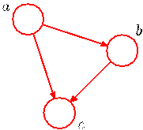

(8.2). Then, for each conditional distribution we add directed links (arrows) to the graph from the nodes corresponding to the variables on which the distribution is conditioned. Thus for the factor $p(c|a, b)$, there will be links from nodes $a$ and $b$ to node $c$, whereas for the factor $p(a)$ there will be no incoming links. The result is the graph shown in Figure 8.1. If there is a link going from a node $a$ to a node $b$, then we say that node $a$ is the parent of node $b$, and we say that node $b$ is the child of node $a$. Note that we shall not make any formal distinction between a node and the variable to which it corresponds but will simply use the same symbol to refer to both.

An interesting point to note about (8.2) is that the left-hand side is symmetrical with respect to the three variables $a$, $b$, and $c$, whereas the right-hand side is not. Indeed, in making the decomposition in (8.2), we have implicitly chosen a particular ordering, namely $a, b, c$, and had we chosen a different ordering we would have obtained a different decomposition and hence a different graphical representation. We shall return to this point later.

For the moment let us extend the example of Figure 8.1 by considering the joint distribution over $K$ variables given by $p(x_1, \ldots, x_K)$. By repeated application of the product rule of probability, this joint distribution can be written as a product of conditional distributions, one for each of the variables

$$
p(x_1, \ldots, x_K) = p(x_K|x_1, \ldots, x_{K-1}) \ldots p(x_2|x_1)p(x_1). \tag{8.3}
$$

For a given choice of $K$, we can again represent this as a directed graph having $K$ nodes, one for each conditional distribution on the right-hand side of (8.3), with each node having incoming links from all lower numbered nodes. We say that this graph is fully connected because there is a link between every pair of nodes.

So far, we have worked with completely general joint distributions, so that the decompositions, and their representations as fully connected graphs, will be applicable to any choice of distribution. As we shall see shortly, it is the absence of links in the graph that conveys interesting information about the properties of the class of distributions that the graph represents. Consider the graph shown in Figure 8.2. This is not a fully connected graph because, for instance, there is no link from $x_1$ to $x_2$ or from $x_3$ to $x_7$.

We shall now go from this graph to the corresponding representation of the joint probability distribution written in terms of the product of a set of conditional distributions, one for each node in the graph. Each such conditional distribution will be conditioned only on the parents of the corresponding node in the graph. For instance, $x_5$ will be conditioned on $x_1$ and $x_3$. The joint distribution of all 7 variables
[Page 382]

Figure 8.2 Example of a directed acyclic graph describing the joint distribution over variables $x_1, \ldots, x_7$. The corresponding decomposition of the joint distribution is given by (8.4).

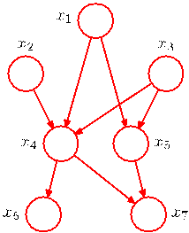

is therefore given by

$$
p(x_1)p(x_2)p(x_3)p(x_4|x_1, x_2, x_3)p(x_5|x_1, x_3)p(x_6|x_4)p(x_7|x_4, x_5). \tag{8.4}
$$

The reader should take a moment to study carefully the correspondence between (8.4) and Figure 8.2.

We can now state in general terms the relationship between a given directed graph and the corresponding distribution over the variables. The joint distribution defined by a graph is given by the product, over all of the nodes of the graph, of a conditional distribution for each node conditioned on the variables corresponding to the parents of that node in the graph. Thus, for a graph with $K$ nodes, the joint distribution is given by

$$
p(\mathbf{x}) = \prod_{k=1}^K p(x_k|\text{pa}_k) \tag{8.5}
$$

where $\text{pa}_k$ denotes the set of parents of $x_k$, and $\mathbf{x} = \{x_1, \ldots, x_K\}$. This key equation expresses the factorization properties of the joint distribution for a directed graphical model. Although we have considered each node to correspond to a single variable, we can equally well associate sets of variables and vector-valued variables with the nodes of a graph. It is easy to show that the representation on the righthand side of (8.5) is always correctly normalized provided the individual conditional distributions are normalized.

The directed graphs that we are considering are subject to an important restriction namely that there must be no directed cycles, in other words there are no closed paths within the graph such that we can move from node to node along links following the direction of the arrows and end up back at the starting node. Such graphs are also called directed acyclic graphs, or DAGs. This is equivalent to the statement that there exists an ordering of the nodes such that there are no links that go from any node to any lower numbered node.

## 8.1.1 Example: Polynomial regression

As an illustration of the use of directed graphs to describe probability distributions, we consider the Bayesian polynomial regression model introduced in Sec-
[Page 383]

Figure 8.3 Directed graphical model representing the joint distribution (8.6) corresponding to the Bayesian polynomial regression model introduced in Section 1.2.6.

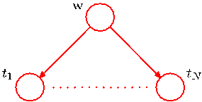

tion 1.2.6. The random variables in this model are the vector of polynomial coefficients $\mathbf{w}$ and the observed data $\mathbf{t} = (t_1, \ldots, t_N)^T$. In addition, this model contains the input data $\mathbf{x} = (x_1, \ldots, x_N)^T$, the noise variance $\sigma^2$, and the hyperparameter $\alpha$ representing the precision of the Gaussian prior over $\mathbf{w}$, all of which are parameters of the model rather than random variables. Focussing just on the random variables for the moment, we see that the joint distribution is given by the product of the prior $p(\mathbf{w})$ and $N$ conditional distributions $p(t_n|\mathbf{w})$ for $n = 1, \ldots, N$ so that

$$
p(\mathbf{t}, \mathbf{w}) = p(\mathbf{w}) \prod_{n=1}^N p(t_n|\mathbf{w}). \tag{8.6}
$$

This joint distribution can be represented by a graphical model shown in Figure 8.3.

When we start to deal with more complex models later in the book, we shall find it inconvenient to have to write out multiple nodes of the form $t_1, \ldots, t_N$ explicitly as in Figure 8.3. We therefore introduce a graphical notation that allows such multiple nodes to be expressed more compactly, in which we draw a single representative node $t_n$ and then surround this with a box, called a plate, labelled with $N$ indicating that there are $N$ nodes of this kind. Re-writing the graph of Figure 8.3 in this way, we obtain the graph shown in Figure 8.4.

We shall sometimes find it helpful to make the parameters of a model, as well as its stochastic variables, explicit. In this case, (8.6) becomes

$$
p(\mathbf{t}, \mathbf{w}|\mathbf{x}, \alpha, \sigma^2) = p(\mathbf{w}|\alpha) \prod_{n=1}^N p(t_n|\mathbf{w}, x_n, \sigma^2).
$$

Correspondingly, we can make $\mathbf{x}$ and $\alpha$ explicit in the graphical representation. To do this, we shall adopt the convention that random variables will be denoted by open circles, and deterministic parameters will be denoted by smaller solid circles. If we take the graph of Figure 8.4 and include the deterministic parameters, we obtain the graph shown in Figure 8.5.

When we apply a graphical model to a problem in machine learning or pattern recognition, we will typically set some of the random variables to specific observed

Figure 8.4 An alternative, more compact, representation of the graph shown in Figure 8.3 in which we have introduced a plate (the box labelled $N$) that represents $N$ nodes of which only a single example $t_n$ is shown explicitly.

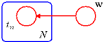
[Page 384]

Figure 8.5 This shows the same model as in Figure 8.4 but with the deterministic parameters shown explicitly by the smaller solid nodes.

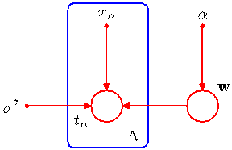

values, for example the variables $\{t_n\}$ from the training set in the case of polynomial curve fitting. In a graphical model, we will denote such observed variables by shading the corresponding nodes. Thus the graph corresponding to Figure 8.5 in which the variables $\{t_n\}$ are observed is shown in Figure 8.6. Note that the value of $\mathbf{w}$ is not observed, and so $\mathbf{w}$ is an example of a latent variable, also known as a hidden variable. Such variables play a crucial role in many probabilistic models and will form the focus of Chapters 9 and 12.

Having observed the values $\{t_n\}$ we can, if desired, evaluate the posterior distribution of the polynomial coefficients $\mathbf{w}$ as discussed in Section 1.2.5. For the moment, we note that this involves a straightforward application of Bayes’ theorem

$$
p(\mathbf{w}|\mathbf{t}) \propto p(\mathbf{w}) \prod_{n=1}^N p(t_n|\mathbf{w}) \tag{8.7}
$$

where again we have omitted the deterministic parameters in order to keep the notation uncluttered.

In general, model parameters such as $\mathbf{w}$ are of little direct interest in themselves, because our ultimate goal is to make predictions for new input values. Suppose we are given a new input value $\widehat{x}$ and we wish to find the corresponding probability distribution for $\widehat{t}$ conditioned on the observed data. The graphical model that describes this problem is shown in Figure 8.7, and the corresponding joint distribution of all of the random variables in this model, conditioned on the deterministic parameters, is then given by

$$
p(\widehat{t}, \mathbf{t}, \mathbf{w}|\widehat{x}, \mathbf{x}, \alpha, \sigma^2) = \left[ \prod_{n=1}^N p(t_n|x_n, \mathbf{w}, \sigma^2) \right] p(\mathbf{w}|\alpha)p(\widehat{t}|\widehat{x}, \mathbf{w}, \sigma^2). \tag{8.8}
$$

Figure 8.6 As in Figure 8.5 but with the nodes $\{t_n\}$ shaded to indicate that the corresponding random variables have been set to their observed (training set) values.

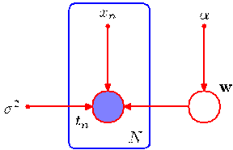
[Page 385]

Figure 8.7 The polynomial regression model, corresponding to Figure 8.6, showing also a new input value $\widehat{x}$ together with the corresponding model prediction $\widehat{t}$.

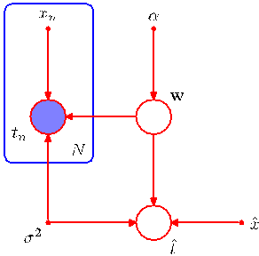

The required predictive distribution for $\widehat{t}$ is then obtained, from the sum rule of probability, by integrating out the model parameters $\mathbf{w}$ so that

$$
p(\widehat{t}|\widehat{x}, \mathbf{x}, \mathbf{t}, \alpha, \sigma^2) \propto \int p(\widehat{t}, \mathbf{t}, \mathbf{w}|\widehat{x}, \mathbf{x}, \alpha, \sigma^2) \text{d}\mathbf{w}
$$

where we are implicitly setting the random variables in $\mathbf{t}$ to the specific values observed in the data set. The details of this calculation were discussed in Chapter 3.

## 8.1.2 Generative models

There are many situations in which we wish to draw samples from a given probability distribution. Although we shall devote the whole of Chapter 11 to a detailed discussion of sampling methods, it is instructive to outline here one technique, called ancestral sampling, which is particularly relevant to graphical models. Consider a joint distribution $p(x_1, \ldots, x_K)$ over $K$ variables that factorizes according to (8.5) corresponding to a directed acyclic graph. We shall suppose that the variables have been ordered such that there are no links from any node to any lower numbered node, in other words each node has a higher number than any of its parents. Our goal is to draw a sample $\widehat{x}_1, \ldots, \widehat{x}_K$ from the joint distribution.

To do this, we start with the lowest-numbered node and draw a sample from the distribution $p(x_1)$, which we call $\widehat{x}_1$. We then work through each of the nodes in order, so that for node $n$ we draw a sample from the conditional distribution $p(x_n|\text{pa}_n)$ in which the parent variables have been set to their sampled values. Note that at each stage, these parent values will always be available because they correspond to lowernumbered nodes that have already been sampled. Techniques for sampling from specific distributions will be discussed in detail in Chapter 11. Once we have sampled from the final variable $x_K$, we will have achieved our objective of obtaining a sample from the joint distribution. To obtain a sample from some marginal distribution corresponding to a subset of the variables, we simply take the sampled values for the required nodes and ignore the sampled values for the remaining nodes. For example, to draw a sample from the distribution $p(x_2, x_4)$, we simply sample from the full joint distribution and then retain the values $\widehat{x}_2, \widehat{x}_4$ and discard the remaining values $\{\widehat{x}_j\}_{j \neq 2, 4}$.
[Page 386]

Figure 8.8 A graphical model representing the process by which images of objects are created, in which the identity of an object (a discrete variable) and the position and orientation of that object (continuous variables) have independent prior probabilities. The image (a vector of pixel intensities) has a probability distribution that is dependent on the identity of the object as well as on its position and orientation.

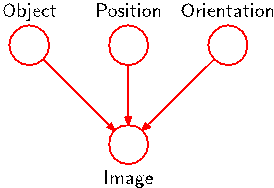

For practical applications of probabilistic models, it will typically be the highernumbered variables corresponding to terminal nodes of the graph that represent the observations, with lower-numbered nodes corresponding to latent variables. The primary role of the latent variables is to allow a complicated distribution over the observed variables to be represented in terms of a model constructed from simpler (typically exponential family) conditional distributions.

We can interpret such models as expressing the processes by which the observed data arose. For instance, consider an object recognition task in which each observed data point corresponds to an image (comprising a vector of pixel intensities) of one of the objects. In this case, the latent variables might have an interpretation as the position and orientation of the object. Given a particular observed image, our goal is to find the posterior distribution over objects, in which we integrate over all possible positions and orientations. We can represent this problem using a graphical model of the form show in Figure 8.8.

The graphical model captures the causal process (Pearl, 1988) by which the observed data was generated. For this reason, such models are often called generative models. By contrast, the polynomial regression model described by Figure 8.5 is not generative because there is no probability distribution associated with the input variable $x$, and so it is not possible to generate synthetic data points from this model. We could make it generative by introducing a suitable prior distribution $p(x)$, at the expense of a more complex model.

The hidden variables in a probabilistic model need not, however, have any explicit physical interpretation but may be introduced simply to allow a more complex joint distribution to be constructed from simpler components. In either case, the technique of ancestral sampling applied to a generative model mimics the creation of the observed data and would therefore give rise to ‘fantasy’ data whose probability distribution (if the model were a perfect representation of reality) would be the same as that of the observed data. In practice, producing synthetic observations from a generative model can prove informative in understanding the form of the probability distribution represented by that model.

## 8.1.3 Discrete variables

We have discussed the importance of probability distributions that are members of the exponential family, and we have seen that this family includes many wellknown distributions as particular cases. Although such distributions are relatively simple, they form useful building blocks for constructing more complex probability
[Page 387]

Figure 8.9 (a) This fully-connected graph describes a general distribution over two $K$-state discrete variables having a total of $K^2 - 1$ parameters. (b) By dropping the link between the nodes, the number of parameters is reduced to $2(K - 1)$.

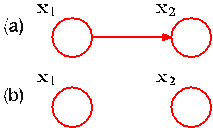

distributions, and the framework of graphical models is very useful in expressing the way in which these building blocks are linked together.

Such models have particularly nice properties if we choose the relationship between each parent-child pair in a directed graph to be conjugate, and we shall explore several examples of this shortly. Two cases are particularly worthy of note, namely when the parent and child node each correspond to discrete variables and when they each correspond to Gaussian variables, because in these two cases the relationship can be extended hierarchically to construct arbitrarily complex directed acyclic graphs. We begin by examining the discrete case.

The probability distribution $p(\mathbf{x}|\boldsymbol{\mu})$ for a single discrete variable $\mathbf{x}$ having $K$ possible states (using the 1-of-$K$ representation) is given by

$$
p(\mathbf{x}|\boldsymbol{\mu}) = \prod_{k=1}^K \mu_k^{x_k} \tag{8.9}
$$

and is governed by the parameters $\boldsymbol{\mu} = (\mu_1, \ldots, \mu_K)^T$. Due to the constraint $\sum_k \mu_k = 1$, only $K - 1$ values for $\mu_k$ need to be specified in order to define the distribution.

Now suppose that we have two discrete variables, $\mathbf{x}_1$ and $\mathbf{x}_2$, each of which has $K$ states, and we wish to model their joint distribution. We denote the probability of observing both $x_{1k} = 1$ and $x_{2l} = 1$ by the parameter $\mu_{kl}$, where $x_{1k}$ denotes the $k^{\text{th}}$ component of $\mathbf{x}_1$, and similarly for $x_{2l}$. The joint distribution can be written

$$
p(\mathbf{x}_1, \mathbf{x}_2|\boldsymbol{\mu}) = \prod_{k=1}^K \prod_{l=1}^K \mu_{kl}^{x_{1k}x_{2l}}.
$$

Because the parameters $\mu_{kl}$ are subject to the constraint $\sum_k \sum_l \mu_{kl} = 1$, this distribution is governed by $K^2 - 1$ parameters. It is easily seen that the total number of parameters that must be specified for an arbitrary joint distribution over $M$ variables is $K^M - 1$ and therefore grows exponentially with the number $M$ of variables.

Using the product rule, we can factor the joint distribution $p(\mathbf{x}_1, \mathbf{x}_2)$ in the form $p(\mathbf{x}_2|\mathbf{x}_1)p(\mathbf{x}_1)$, which corresponds to a two-node graph with a link going from the $\mathbf{x}_1$ node to the $\mathbf{x}_2$ node as shown in Figure 8.9(a). The marginal distribution $p(\mathbf{x}_1)$ is governed by $K - 1$ parameters, as before, Similarly, the conditional distribution $p(\mathbf{x}_2|\mathbf{x}_1)$ requires the specification of $K - 1$ parameters for each of the $K$ possible values of $\mathbf{x}_1$. The total number of parameters that must be specified in the joint distribution is therefore $(K - 1) + K(K - 1) = K^2 - 1$ as before.

Now suppose that the variables $\mathbf{x}_1$ and $\mathbf{x}_2$ were independent, corresponding to the graphical model shown in Figure 8.9(b). Each variable is then described by
[Page 388]

Figure 8.10 This chain of $M$ discrete nodes, each having $K$ states, requires the specification of $K - 1 + (M - 1)K(K - 1)$ parameters, which grows linearly with the length $M$ of the chain. In contrast, a fully connected graph of $M$ nodes would have $K^M - 1$ parameters, which grows exponentially with $M$.

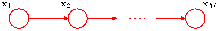

a separate multinomial distribution, and the total number of parameters would be $2(K - 1)$. For a distribution over $M$ independent discrete variables, each having $K$ states, the total number of parameters would be $M(K - 1)$, which therefore grows linearly with the number of variables. From a graphical perspective, we have reduced the number of parameters by dropping links in the graph, at the expense of having a restricted class of distributions.

More generally, if we have $M$ discrete variables $\mathbf{x}_1, \ldots, \mathbf{x}_M$, we can model the joint distribution using a directed graph with one variable corresponding to each node. The conditional distribution at each node is given by a set of nonnegative parameters subject to the usual normalization constraint. If the graph is fully connected then we have a completely general distribution having $K^M - 1$ parameters, whereas if there are no links in the graph the joint distribution factorizes into the product of the marginals, and the total number of parameters is $M(K - 1)$. Graphs having intermediate levels of connectivity allow for more general distributions than the fully factorized one while requiring fewer parameters than the general joint distribution. As an illustration, consider the chain of nodes shown in Figure 8.10. The marginal distribution $p(\mathbf{x}_1)$ requires $K - 1$ parameters, whereas each of the $M - 1$ conditional distributions $p(\mathbf{x}_i|\mathbf{x}_{i-1})$, for $i = 2, \ldots, M$, requires $K(K - 1)$ parameters. This gives a total parameter count of $K - 1 + (M - 1)K(K - 1)$, which is quadratic in $K$ and which grows linearly (rather than exponentially) with the length $M$ of the chain.

An alternative way to reduce the number of independent parameters in a model is by sharing parameters (also known as tying of parameters). For instance, in the chain example of Figure 8.10, we can arrange that all of the conditional distributions $p(\mathbf{x}_i|\mathbf{x}_{i-1})$, for $i = 2, \ldots, M$, are governed by the same set of $K(K - 1)$ parameters. Together with the $K - 1$ parameters governing the distribution of $\mathbf{x}_1$, this gives a total of $K^2 - 1$ parameters that must be specified in order to define the joint distribution.

We can turn a graph over discrete variables into a Bayesian model by introducing Dirichlet priors for the parameters. From a graphical point of view, each node then acquires an additional parent representing the Dirichlet distribution over the parameters associated with the corresponding discrete node. This is illustrated for the chain model in Figure 8.11. The corresponding model in which we tie the parameters governing the conditional distributions $p(\mathbf{x}_i|\mathbf{x}_{i-1})$, for $i = 2, \ldots, M$, is shown in Figure 8.12.

Another way of controlling the exponential growth in the number of parameters in models of discrete variables is to use parameterized models for the conditional distributions instead of complete tables of conditional probability values. To illustrate this idea, consider the graph in Figure 8.13 in which all of the nodes represent binary variables. Each of the parent variables $x_i$ is governed by a single parame-
[Page 389]

Figure 8.11 An extension of the model of Figure 8.10 to include Dirichlet priors over the parameters governing the discrete distributions.

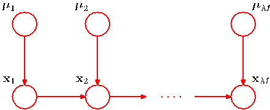

Figure 8.12 As in Figure 8.11 but with a single set of parameters $\boldsymbol{\mu}$ shared amongst all of the conditional distributions $p(\mathbf{x}_i|\mathbf{x}_{i-1})$.

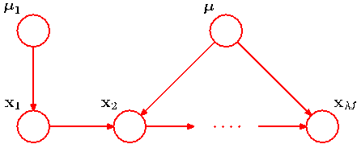

ter $\mu_i$ representing the probability $p(x_i = 1)$, giving $M$ parameters in total for the parent nodes. The conditional distribution $p(y|x_1, \ldots, x_M)$, however, would require $2^M$ parameters representing the probability $p(y = 1)$ for each of the $2^M$ possible settings of the parent variables. Thus in general the number of parameters required to specify this conditional distribution will grow exponentially with $M$. We can obtain a more parsimonious form for the conditional distribution by using a logistic sigmoid function acting on a linear combination of the parent variables, giving

$$
p(y = 1|x_1, \ldots, x_M) = \sigma \left( w_0 + \sum_{i=1}^M w_i x_i \right) = \sigma(\mathbf{w}^T\mathbf{x}) \tag{8.10}
$$

where $\sigma(a) = (1 + \exp(-a))^{-1}$ is the logistic sigmoid, $\mathbf{x} = (x_0, x_1, \ldots, x_M)^T$ is an $(M + 1)$-dimensional vector of parent states augmented with an additional variable $x_0$ whose value is clamped to 1, and $\mathbf{w} = (w_0, w_1, \ldots, w_M)^T$ is a vector of $M + 1$ parameters. This is a more restricted form of conditional distribution than the general case but is now governed by a number of parameters that grows linearly with $M$. In this sense, it is analogous to the choice of a restrictive form of covariance matrix (for example, a diagonal matrix) in a multivariate Gaussian distribution. The motivation for the logistic sigmoid representation was discussed in Section 4.2.

Figure 8.13 A graph comprising $M$ parents $x_1, \ldots, x_M$ and a single child $y$, used to illustrate the idea of parameterized conditional distributions for discrete variables.

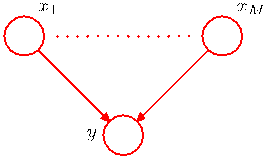
[Page 390]

## 8.1.4 Linear-Gaussian models

In the previous section, we saw how to construct joint probability distributions over a set of discrete variables by expressing the variables as nodes in a directed acyclic graph. Here we show how a multivariate Gaussian can be expressed as a directed graph corresponding to a linear-Gaussian model over the component variables. This allows us to impose interesting structure on the distribution, with the general Gaussian and the diagonal covariance Gaussian representing opposite extremes. Several widely used techniques are examples of linear-Gaussian models, such as probabilistic principal component analysis, factor analysis, and linear dynamical systems (Roweis and Ghahramani, 1999). We shall make extensive use of the results of this section in later chapters when we consider some of these techniques in detail.

Consider an arbitrary directed acyclic graph over $D$ variables in which node $i$ represents a single continuous random variable $x_i$ having a Gaussian distribution. The mean of this distribution is taken to be a linear combination of the states of its parent nodes $\text{pa}_i$ of node $i$

$$
p(x_i|\text{pa}_i) = \mathcal{N} \left( x_i \bigg| \sum_{j \in \text{pa}_i} w_{ij} x_j + b_i, v_i \right) \tag{8.11}
$$

where $w_{ij}$ and $b_i$ are parameters governing the mean, and $v_i$ is the variance of the conditional distribution for $x_i$. The log of the joint distribution is then the log of the product of these conditionals over all nodes in the graph and hence takes the form

$$
\begin{align}
\ln p(\mathbf{x}) &= \sum_{i=1}^D \ln p(x_i|\text{pa}_i) \tag{8.12} \\
&= - \sum_{i=1}^D \frac{1}{2v_i} \left( x_i - \sum_{j \in \text{pa}_i} w_{ij} x_j - b_i \right)^2 + \text{const} \tag{8.13}
\end{align}
$$

where $\mathbf{x} = (x_1, \ldots, x_D)^T$ and ‘const’ denotes terms independent of $\mathbf{x}$. We see that this is a quadratic function of the components of $\mathbf{x}$, and hence the joint distribution $p(\mathbf{x})$ is a multivariate Gaussian.

We can determine the mean and covariance of the joint distribution recursively as follows. Each variable $x_i$ has (conditional on the states of its parents) a Gaussian distribution of the form (8.11) and so

$$
x_i = \sum_{j \in \text{pa}_i} w_{ij} x_j + b_i + \sqrt{v_i} \epsilon_i \tag{8.14}
$$

where $\epsilon_i$ is a zero mean, unit variance Gaussian random variable satisfying $\mathbb{E}[\epsilon_i] = 0$ and $\mathbb{E}[\epsilon_i \epsilon_j] = I_{ij}$, where $I_{ij}$ is the $i, j$ element of the identity matrix. Taking the expectation of (8.14), we have

$$
\mathbb{E}[x_i] = \sum_{j \in \text{pa}_i} w_{ij} \mathbb{E}[x_j] + b_i. \tag{8.15}
$$

[Page 391]

Figure 8.14 A directed graph over three Gaussian variables, with one missing link.

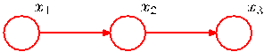

Thus we can find the components of $\mathbb{E}[\mathbf{x}] = (\mathbb{E}[x_1], \ldots, \mathbb{E}[x_D])^T$ by starting at the lowest numbered node and working recursively through the graph (here we again assume that the nodes are numbered such that each node has a higher number than its parents). Similarly, we can use (8.14) and (8.15) to obtain the $i, j$ element of the covariance matrix for $p(\mathbf{x})$ in the form of a recursion relation

$$
\begin{align}
\text{cov}[x_i, x_j] &= \mathbb{E}[(x_i - \mathbb{E}[x_i])(x_j - \mathbb{E}[x_j])] \\
&= \mathbb{E} \left[ (x_i - \mathbb{E}[x_i]) \left\{ \sum_{k \in \text{pa}_j} w_{jk}(x_k - \mathbb{E}[x_k]) + \sqrt{v_j} \epsilon_j \right\} \right] \\
&= \sum_{k \in \text{pa}_j} w_{jk} \text{cov}[x_i, x_k] + I_{ij} v_j \tag{8.16}
\end{align}
$$

and so the covariance can similarly be evaluated recursively starting from the lowest numbered node.

Let us consider two extreme cases. First of all, suppose that there are no links in the graph, which therefore comprises $D$ isolated nodes. In this case, there are no parameters $w_{ij}$ and so there are just $D$ parameters $b_i$ and $D$ parameters $v_i$. From the recursion relations (8.15) and (8.16), we see that the mean of $p(\mathbf{x})$ is given by $(b_1, \ldots, b_D)^T$ and the covariance matrix is diagonal of the form $\text{diag}(v_1, \ldots, v_D)$. The joint distribution has a total of $2D$ parameters and represents a set of $D$ independent univariate Gaussian distributions.

Now consider a fully connected graph in which each node has all lower numbered nodes as parents. The matrix $w_{ij}$ then has $i - 1$ entries on the $i^{\text{th}}$ row and hence is a lower triangular matrix (with no entries on the leading diagonal). Then the total number of parameters $w_{ij}$ is obtained by taking the number $D^2$ of elements in a $D \times D$ matrix, subtracting $D$ to account for the absence of elements on the leading diagonal, and then dividing by 2 because the matrix has elements only below the diagonal, giving a total of $D(D - 1)/2$. The total number of independent parameters $\{w_{ij}\}$ and $\{v_i\}$ in the covariance matrix is therefore $D(D + 1)/2$ corresponding to a general symmetric covariance matrix.

Graphs having some intermediate level of complexity correspond to joint Gaussian distributions with partially constrained covariance matrices. Consider for example the graph shown in Figure 8.14, which has a link missing between variables $x_1$ and $x_3$. Using the recursion relations (8.15) and (8.16), we see that the mean and covariance of the joint distribution are given by

$$
\boldsymbol{\mu} = (b_1, b_2 + w_{21}b_1, b_3 + w_{32}b_2 + w_{32}w_{21}b_1)^T \tag{8.17}
$$

$$
\boldsymbol{\Sigma} = \begin{pmatrix}
v_1 & w_{21}v_1 & w_{32}w_{21}v_1 \\
w_{21}v_1 & v_2 + w_{21}^2v_1 & w_{32}(v_2 + w_{21}^2v_1) \\
w_{32}w_{21}v_1 & w_{32}(v_2 + w_{21}^2v_1) & v_3 + w_{32}^2(v_2 + w_{21}^2v_1)
\end{pmatrix}. \tag{8.18}
$$

[Page 392]

We can readily extend the linear-Gaussian graphical model to the case in which the nodes of the graph represent multivariate Gaussian variables. In this case, we can write the conditional distribution for node $i$ in the form

$$
p(\mathbf{x}_i|\text{pa}_i) = \mathcal{N} \left( \mathbf{x}_i \bigg| \sum_{j \in \text{pa}_i} \mathbf{W}_{ij} \mathbf{x}_j + \mathbf{b}_i, \boldsymbol{\Sigma}_i \right) \tag{8.19}
$$

where now $\mathbf{W}_{ij}$ is a matrix (which is nonsquare if $\mathbf{x}_i$ and $\mathbf{x}_j$ have different dimensionalities). Again it is easy to verify that the joint distribution over all variables is Gaussian.

Note that we have already encountered a specific example of the linear-Gaussian relationship when we saw that the conjugate prior for the mean $\boldsymbol{\mu}$ of a Gaussian variable $\mathbf{x}$ is itself a Gaussian distribution over $\boldsymbol{\mu}$. The joint distribution over $\mathbf{x}$ and $\boldsymbol{\mu}$ is therefore Gaussian. This corresponds to a simple two-node graph in which the node representing $\boldsymbol{\mu}$ is the parent of the node representing $\mathbf{x}$. The mean of the distribution over $\boldsymbol{\mu}$ is a parameter controlling a prior, and so it can be viewed as a hyperparameter. Because the value of this hyperparameter may itself be unknown, we can again treat it from a Bayesian perspective by introducing a prior over the hyperparameter, sometimes called a hyperprior, which is again given by a Gaussian distribution. This type of construction can be extended in principle to any level and is an illustration of a hierarchical Bayesian model, of which we shall encounter further examples in later chapters.

## 8.2. Conditional Independence

An important concept for probability distributions over multiple variables is that of conditional independence (Dawid, 1980). Consider three variables $a$, $b$, and $c$, and suppose that the conditional distribution of $a$, given $b$ and $c$, is such that it does not depend on the value of $b$, so that

$$
p(a|b, c) = p(a|c). \tag{8.20}
$$

We say that $a$ is conditionally independent of $b$ given $c$. This can be expressed in a slightly different way if we consider the joint distribution of $a$ and $b$ conditioned on $c$, which we can write in the form

$$
\begin{align}
p(a, b|c) &= p(a|b, c)p(b|c) \\
&= p(a|c)p(b|c). \tag{8.21}
\end{align}
$$

where we have used the product rule of probability together with (8.20). Thus we see that, conditioned on $c$, the joint distribution of $a$ and $b$ factorizes into the product of the marginal distribution of $a$ and the marginal distribution of $b$ (again both conditioned on $c$). This says that the variables $a$ and $b$ are statistically independent, given $c$. Note that our definition of conditional independence will require that (8.20),
[Page 393]

Figure 8.15 The first of three examples of graphs over three variables $a$, $b$, and $c$ used to discuss conditional independence properties of directed graphical models.

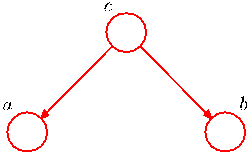

or equivalently (8.21), must hold for every possible value of $c$, and not just for some values. We shall sometimes use a shorthand notation for conditional independence (Dawid, 1979) in which

$$
a \perp b | c \tag{8.22}
$$

denotes that $a$ is conditionally independent of $b$ given $c$ and is equivalent to (8.20).

Conditional independence properties play an important role in using probabilistic models for pattern recognition by simplifying both the structure of a model and the computations needed to perform inference and learning under that model. We shall see examples of this shortly.

If we are given an expression for the joint distribution over a set of variables in terms of a product of conditional distributions (i.e., the mathematical representation underlying a directed graph), then we could in principle test whether any potential conditional independence property holds by repeated application of the sum and product rules of probability. In practice, such an approach would be very time consuming. An important and elegant feature of graphical models is that conditional independence properties of the joint distribution can be read directly from the graph without having to perform any analytical manipulations. The general framework for achieving this is called d-separation, where the ‘d’ stands for ‘directed’ (Pearl, 1988). Here we shall motivate the concept of d-separation and give a general statement of the d-separation criterion. A formal proof can be found in Lauritzen (1996).

## 8.2.1 Three example graphs

We begin our discussion of the conditional independence properties of directed graphs by considering three simple examples each involving graphs having just three nodes. Together, these will motivate and illustrate the key concepts of d-separation. The first of the three examples is shown in Figure 8.15, and the joint distribution corresponding to this graph is easily written down using the general result (8.5) to give

$$
p(a, b, c) = p(a|c)p(b|c)p(c). \tag{8.23}
$$

If none of the variables are observed, then we can investigate whether $a$ and $b$ are independent by marginalizing both sides of (8.23) with respect to $c$ to give

$$
p(a, b) = \sum_c p(a|c)p(b|c)p(c). \tag{8.24}
$$

In general, this does not factorize into the product $p(a)p(b)$, and so

$$
a \not\perp b | \emptyset \tag{8.25}
$$

[Page 394]

Figure 8.16 As in Figure 8.15 but where we have conditioned on the value of variable $c$.

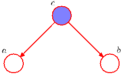

where $\emptyset$ denotes the empty set, and the symbol $\not\perp$ means that the conditional independence property does not hold in general. Of course, it may hold for a particular distribution by virtue of the specific numerical values associated with the various conditional probabilities, but it does not follow in general from the structure of the graph.

Now suppose we condition on the variable $c$, as represented by the graph of Figure 8.16. From (8.23), we can easily write down the conditional distribution of $a$ and $b$, given $c$, in the form

$$
\begin{align}
p(a, b|c) &= \frac{p(a, b, c)}{p(c)} \\
&= p(a|c)p(b|c)
\end{align}
$$

and so we obtain the conditional independence property

$$
a \perp b | c.
$$

We can provide a simple graphical interpretation of this result by considering the path from node $a$ to node $b$ via $c$. The node $c$ is said to be tail-to-tail with respect to this path because the node is connected to the tails of the two arrows, and the presence of such a path connecting nodes $a$ and $b$ causes these nodes to be dependent. However, when we condition on node $c$, as in Figure 8.16, the conditioned node ‘blocks’ the path from $a$ to $b$ and causes $a$ and $b$ to become (conditionally) independent.

We can similarly consider the graph shown in Figure 8.17. The joint distribution corresponding to this graph is again obtained from our general formula (8.5) to give

$$
p(a, b, c) = p(a)p(c|a)p(b|c). \tag{8.26}
$$

First of all, suppose that none of the variables are observed. Again, we can test to see if $a$ and $b$ are independent by marginalizing over $c$ to give

$$
p(a, b) = p(a) \sum_c p(c|a)p(b|c) = p(a)p(b|a).
$$

Figure 8.17 The second of our three examples of 3-node graphs used to motivate the conditional independence framework for directed graphical models.

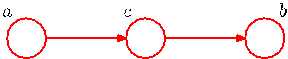
[Page 395]

Figure 8.18 As in Figure 8.17 but now conditioning on node $c$.

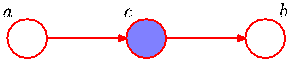

which in general does not factorize into $p(a)p(b)$, and so

$$
a \not\perp b | \emptyset \tag{8.27}
$$

as before.

Now suppose we condition on node $c$, as shown in Figure 8.18. Using Bayes’ theorem, together with (8.26), we obtain

$$
\begin{align}
p(a, b|c) &= \frac{p(a, b, c)}{p(c)} \\
&= \frac{p(a)p(c|a)p(b|c)}{p(c)} \\
&= p(a|c)p(b|c)
\end{align}
$$

and so again we obtain the conditional independence property

$$
a \perp b | c.
$$

As before, we can interpret these results graphically. The node $c$ is said to be head-to-tail with respect to the path from node $a$ to node $b$. Such a path connects nodes $a$ and $b$ and renders them dependent. If we now observe $c$, as in Figure 8.18, then this observation ‘blocks’ the path from $a$ to $b$ and so we obtain the conditional independence property $a \perp b | c$.

Finally, we consider the third of our 3-node examples, shown by the graph in Figure 8.19. As we shall see, this has a more subtle behaviour than the two previous graphs.

The joint distribution can again be written down using our general result (8.5) to give

$$
p(a, b, c) = p(a)p(b)p(c|a, b). \tag{8.28}
$$

Consider first the case where none of the variables are observed. Marginalizing both sides of (8.28) over $c$ we obtain

$$
p(a, b) = p(a)p(b)
$$

Figure 8.19 The last of our three examples of 3-node graphs used to explore conditional independence properties in graphical models. This graph has rather different properties from the two previous examples.

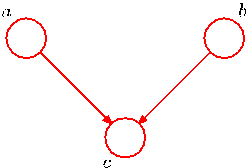
[Page 396]

Figure 8.20 As in Figure 8.19 but conditioning on the value of node $c$. In this graph, the act of conditioning induces a dependence between $a$ and $b$.

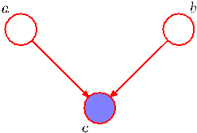

and so $a$ and $b$ are independent with no variables observed, in contrast to the two previous examples. We can write this result as

$$
a \perp\!\!\!\perp b | \emptyset. \tag{8.29}
$$

Now suppose we condition on $c$, as indicated in Figure 8.20. The conditional distribution of $a$ and $b$ is then given by

$$
\begin{align}
p(a, b|c) &= \frac{p(a, b, c)}{p(c)} \\
&= \frac{p(a)p(b)p(c|a, b)}{p(c)}
\end{align}
$$

which in general does not factorize into the product $p(a)p(b)$, and so

$$
a \not\!\perp\!\!\!\perp b | c.
$$

Thus our third example has the opposite behaviour from the first two. Graphically, we say that node $c$ is head-to-head with respect to the path from $a$ to $b$ because it connects to the heads of the two arrows. When node $c$ is unobserved, it ‘blocks’ the path, and the variables $a$ and $b$ are independent. However, conditioning on $c$ ‘unblocks’ the path and renders $a$ and $b$ dependent.

There is one more subtlety associated with this third example that we need to consider. First we introduce some more terminology. We say that node $y$ is a descendant of node $x$ if there is a path from $x$ to $y$ in which each step of the path follows the directions of the arrows. Then it can be shown that a head-to-head path will become unblocked if either the node, or any of its descendants, is observed.

In summary, a tail-to-tail node or a head-to-tail node leaves a path unblocked unless it is observed in which case it blocks the path. By contrast, a head-to-head node blocks a path if it is unobserved, but once the node, and/or at least one of its descendants, is observed the path becomes unblocked.

It is worth spending a moment to understand further the unusual behaviour of the graph of Figure 8.20. Consider a particular instance of such a graph corresponding to a problem with three binary random variables relating to the fuel system on a car, as shown in Figure 8.21. The variables are called $B$, representing the state of a battery that is either charged ($B = 1$) or flat ($B = 0$), $F$ representing the state of the fuel tank that is either full of fuel ($F = 1$) or empty ($F = 0$), and $G$, which is the state of an electric fuel gauge and which indicates either full ($G = 1$) or empty
[Page 397]

Figure 8.21 An example of a 3-node graph used to illustrate the phenomenon of ‘explaining away’. The three nodes represent the state of the battery ($B$), the state of the fuel tank ($F$) and the reading on the electric fuel gauge ($G$). See the text for details.

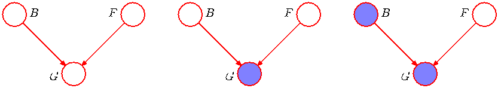

($G = 0$). The battery is either charged or flat, and independently the fuel tank is either full or empty, with prior probabilities

$$
p(B = 1) = 0.9 \\
p(F = 1) = 0.9.
$$

Given the state of the fuel tank and the battery, the fuel gauge reads full with probabilities given by

$$
\begin{align}
p(G = 1|B = 1, F = 1) &= 0.8 \\
p(G = 1|B = 1, F = 0) &= 0.2 \\
p(G = 1|B = 0, F = 1) &= 0.2 \\
p(G = 1|B = 0, F = 0) &= 0.1
\end{align}
$$

so this is a rather unreliable fuel gauge! All remaining probabilities are determined by the requirement that probabilities sum to one, and so we have a complete specification of the probabilistic model.

Before we observe any data, the prior probability of the fuel tank being empty is $p(F = 0) = 0.1$. Now suppose that we observe the fuel gauge and discover that it reads empty, i.e., $G = 0$, corresponding to the middle graph in Figure 8.21. We can use Bayes’ theorem to evaluate the posterior probability of the fuel tank being empty. First we evaluate the denominator for Bayes’ theorem given by

$$
p(G = 0) = \sum_{B \in \{0, 1\}} \sum_{F \in \{0, 1\}} p(G = 0|B, F)p(B)p(F) = 0.315 \tag{8.30}
$$

and similarly we evaluate

$$
p(G = 0|F = 0) = \sum_{B \in \{0, 1\}} p(G = 0|B, F = 0)p(B) = 0.81 \tag{8.31}
$$

and using these results we have

$$
p(F = 0|G = 0) = \frac{p(G = 0|F = 0)p(F = 0)}{p(G = 0)} \simeq 0.257 \tag{8.32}
$$

[Page 398]

and so $p(F = 0|G = 0) > p(F = 0)$. Thus observing that the gauge reads empty makes it more likely that the tank is indeed empty, as we would intuitively expect. Next suppose that we also check the state of the battery and find that it is flat, i.e., $B = 0$. We have now observed the states of both the fuel gauge and the battery, as shown by the right-hand graph in Figure 8.21. The posterior probability that the fuel tank is empty given the observations of both the fuel gauge and the battery state is then given by

$$
p(F = 0|G = 0, B = 0) = \frac{p(G = 0|B = 0, F = 0)p(F = 0)}{\sum_{F \in \{0, 1\}} p(G = 0|B = 0, F)p(F)} \simeq 0.111 \tag{8.33}
$$

where the prior probability $p(B = 0)$ has cancelled between numerator and denominator. Thus the probability that the tank is empty has decreased (from $0.257$ to $0.111$) as a result of the observation of the state of the battery. This accords with our intuition that finding out that the battery is flat explains away the observation that the fuel gauge reads empty. We see that the state of the fuel tank and that of the battery have indeed become dependent on each other as a result of observing the reading on the fuel gauge. In fact, this would also be the case if, instead of observing the fuel gauge directly, we observed the state of some descendant of $G$. Note that the probability $p(F = 0|G = 0, B = 0) \simeq 0.111$ is greater than the prior probability $p(F = 0) = 0.1$ because the observation that the fuel gauge reads zero still provides some evidence in favour of an empty fuel tank.

## 8.2.2 D-separation

We now give a general statement of the d-separation property (Pearl, 1988) for directed graphs. Consider a general directed graph in which $A$, $B$, and $C$ are arbitrary nonintersecting sets of nodes (whose union may be smaller than the complete set of nodes in the graph). We wish to ascertain whether a particular conditional independence statement $A \perp\!\!\!\perp B | C$ is implied by a given directed acyclic graph. To do so, we consider all possible paths from any node in $A$ to any node in $B$. Any such path is said to be blocked if it includes a node such that either

(a) the arrows on the path meet either head-to-tail or tail-to-tail at the node, and the node is in the set $C$, or

(b) the arrows meet head-to-head at the node, and neither the node, nor any of its descendants, is in the set $C$.

If all paths are blocked, then $A$ is said to be d-separated from $B$ by $C$, and the joint distribution over all of the variables in the graph will satisfy $A \perp\!\!\!\perp B | C$.

The concept of d-separation is illustrated in Figure 8.22. In graph (a), the path from $a$ to $b$ is not blocked by node $f$ because it is a tail-to-tail node for this path and is not observed, nor is it blocked by node $e$ because, although the latter is a head-to-head node, it has a descendant $c$ because it is in the conditioning set. Thus the conditional independence statement $a \perp\!\!\!\perp b | c$ does not follow from this graph. In graph (b), the path from $a$ to $b$ is blocked by node $f$ because this is a tail-to-tail node that is observed, and so the conditional independence property $a \perp\!\!\!\perp b | f$ will
[Page 399]

Figure 8.22 Illustration of the concept of d-separation. See the text for details.

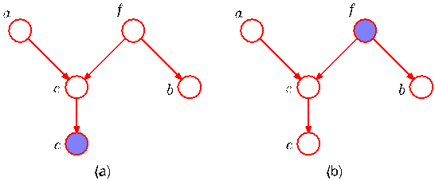

be satisfied by any distribution that factorizes according to this graph. Note that this path is also blocked by node $e$ because $e$ is a head-to-head node and neither it nor its descendant are in the conditioning set.

For the purposes of d-separation, parameters such as $\alpha$ and $\sigma^2$ in Figure 8.5, indicated by small filled circles, behave in the same was as observed nodes. However, there are no marginal distributions associated with such nodes. Consequently parameter nodes never themselves have parents and so all paths through these nodes will always be tail-to-tail and hence blocked. Consequently they play no role in d-separation.

Another example of conditional independence and d-separation is provided by the concept of i.i.d. (independent identically distributed) data introduced in Section 1.2.4. Consider the problem of finding the posterior distribution for the mean of a univariate Gaussian distribution. This can be represented by the directed graph shown in Figure 8.23 in which the joint distribution is defined by a prior $p(\mu)$ together with a set of conditional distributions $p(x_n|\mu)$ for $n = 1, \ldots, N$. In practice, we observe $\mathcal{D} = \{x_1, \ldots, x_N\}$ and our goal is to infer $\mu$. Suppose, for a moment, that we condition on $\mu$ and consider the joint distribution of the observations. Using d-separation, we note that there is a unique path from any $x_i$ to any other $x_j \neq i$ and that this path is tail-to-tail with respect to the observed node $\mu$. Every such path is blocked and so the observations $\mathcal{D} = \{x_1, \ldots, x_N\}$ are independent given $\mu$, so that

$$
p(\mathcal{D}|\mu) = \prod_{n=1}^N p(x_n|\mu). \tag{8.34}
$$

Figure 8.23 (a) Directed graph corresponding to the problem of inferring the mean $\mu$ of a univariate Gaussian distribution from observations $x_1, \ldots, x_N$. (b) The same graph drawn using the plate notation.

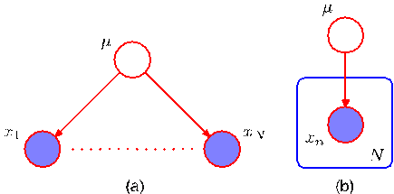
[Page 400]

Figure 8.24 A graphical representation of the ‘naive Bayes’ model for classification. Conditioned on the class label $\mathbf{z}$, the components of the observed vector $\mathbf{x} = (x_1, \ldots, x_D)^T$ are assumed to be independent.

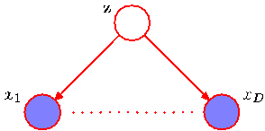

However, if we integrate over $\mu$, the observations are in general no longer independent

$$
p(\mathcal{D}) = \int_0^\infty p(\mathcal{D}|\mu)p(\mu) \text{d}\mu \neq \prod_{n=1}^N p(x_n). \tag{8.35}
$$

Here $\mu$ is a latent variable, because its value is not observed.

Another example of a model representing i.i.d. data is the graph in Figure 8.7 corresponding to Bayesian polynomial regression. Here the stochastic nodes correspond to $\{t_n\}$, $\mathbf{w}$ and $\widehat{t}$. We see that the node for $\mathbf{w}$ is tail-to-tail with respect to the path from $\widehat{t}$ to any one of the nodes $t_n$ and so we have the following conditional independence property

$$
\widehat{t} \perp\!\!\!\perp t_n | \mathbf{w}. \tag{8.36}
$$

Thus, conditioned on the polynomial coefficients $\mathbf{w}$, the predictive distribution for $\widehat{t}$ is independent of the training data $\{t_1, \ldots, t_N\}$. We can therefore first use the training data to determine the posterior distribution over the coefficients $\mathbf{w}$ and then we can discard the training data and use the posterior distribution for $\mathbf{w}$ to make predictions of $\widehat{t}$ for new input observations $\widehat{x}$.

A related graphical structure arises in an approach to classification called the naive Bayes model, in which we use conditional independence assumptions to simplify the model structure. Suppose our observed variable consists of a $D$-dimensional vector $\mathbf{x} = (x_1, \ldots, x_D)^T$, and we wish to assign observed values of $\mathbf{x}$ to one of $K$ classes. Using the 1-of-$K$ encoding scheme, we can represent these classes by a $K$-dimensional binary vector $\mathbf{z}$. We can then define a generative model by introducing a multinomial prior $p(\mathbf{z}|\boldsymbol{\mu})$ over the class labels, where the $k^{\text{th}}$ component $\mu_k$ of $\boldsymbol{\mu}$ is the prior probability of class $\mathcal{C}_k$, together with a conditional distribution $p(\mathbf{x}|\mathbf{z})$ for the observed vector $\mathbf{x}$. The key assumption of the naive Bayes model is that, conditioned on the class $\mathbf{z}$, the distributions of the input variables $x_1, \ldots, x_D$ are independent. The graphical representation of this model is shown in Figure 8.24. We see that observation of $\mathbf{z}$ blocks the path between $x_i$ and $x_j$ for $j \neq i$ (because such paths are tail-to-tail at the node $\mathbf{z}$) and so $x_i$ and $x_j$ are conditionally independent given $\mathbf{z}$. If, however, we marginalize out $\mathbf{z}$ (so that $\mathbf{z}$ is unobserved) the tail-to-tail path from $x_i$ to $x_j$ is no longer blocked. This tells us that in general the marginal density $p(\mathbf{x})$ will not factorize with respect to the components of $\mathbf{x}$. We encountered a simple application of the naive Bayes model in the context of fusing data from different sources for medical diagnosis in Section 1.5.

If we are given a labelled training set, comprising inputs $\{\mathbf{x}_1, \ldots, \mathbf{x}_N\}$ together with their class labels, then we can fit the naive Bayes model to the training data
[Page 401]

using maximum likelihood assuming that the data are drawn independently from the model. The solution is obtained by fitting the model for each class separately using the correspondingly labelled data. As an example, suppose that the probability density within each class is chosen to be Gaussian. In this case, the naive Bayes assumption then implies that the covariance matrix for each Gaussian is diagonal, and the contours of constant density within each class will be axis-aligned ellipsoids. The marginal density, however, is given by a superposition of diagonal Gaussians (with weighting coefficients given by the class priors) and so will no longer factorize with respect to its components.

The naive Bayes assumption is helpful when the dimensionality $D$ of the input space is high, making density estimation in the full $D$-dimensional space more challenging. It is also useful if the input vector contains both discrete and continuous variables, since each can be represented separately using appropriate models (e.g., Bernoulli distributions for binary observations or Gaussians for real-valued variables). The conditional independence assumption of this model is clearly a strong one that may lead to rather poor representations of the class-conditional densities. Nevertheless, even if this assumption is not precisely satisfied, the model may still give good classification performance in practice because the decision boundaries can be insensitive to some of the details in the class-conditional densities, as illustrated in Figure 1.27.

We have seen that a particular directed graph represents a specific decomposition of a joint probability distribution into a product of conditional probabilities. The graph also expresses a set of conditional independence statements obtained through the d-separation criterion, and the d-separation theorem is really an expression of the equivalence of these two properties. In order to make this clear, it is helpful to think of a directed graph as a filter. Suppose we consider a particular joint probability distribution $p(\mathbf{x})$ over the variables $\mathbf{x}$ corresponding to the (nonobserved) nodes of the graph. The filter will allow this distribution to pass through if, and only if, it can be expressed in terms of the factorization (8.5) implied by the graph. If we present to the filter the set of all possible distributions $p(\mathbf{x})$ over the set of variables $\mathbf{x}$, then the subset of distributions that are passed by the filter will be denoted $\mathcal{DF}$, for directed factorization. This is illustrated in Figure 8.25. Alternatively, we can use the graph as a different kind of filter by first listing all of the conditional independence properties obtained by applying the d-separation criterion to the graph, and then allowing a distribution to pass only if it satisfies all of these properties. If we present all possible distributions $p(\mathbf{x})$ to this second kind of filter, then the d-separation theorem tells us that the set of distributions that will be allowed through is precisely the set $\mathcal{DF}$.

It should be emphasized that the conditional independence properties obtained from d-separation apply to any probabilistic model described by that particular directed graph. This will be true, for instance, whether the variables are discrete or continuous or a combination of these. Again, we see that a particular graph is describing a whole family of probability distributions.

At one extreme we have a fully connected graph that exhibits no conditional independence properties at all, and which can represent any possible joint probability distribution over the given variables. The set $\mathcal{DF}$ will contain all possible distribu-
[Page 402]

Figure 8.25 We can view a graphical model (in this case a directed graph) as a filter in which a probability distribution $p(\mathbf{x})$ is allowed through the filter if, and only if, it satisfies the directed factorization property (8.5). The set of all possible probability distributions $p(\mathbf{x})$ that pass through the filter is denoted $\mathcal{DF}$. We can alternatively use the graph to filter distributions according to whether they respect all of the conditional independencies implied by the d-separation properties of the graph. The d-separation theorem says that it is the same set of distributions $\mathcal{DF}$ that will be allowed through this second kind of filter.

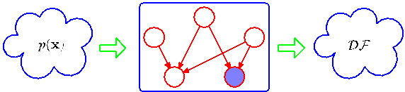

tions $p(\mathbf{x})$. At the other extreme, we have the fully disconnected graph, i.e., one having no links at all. This corresponds to joint distributions which factorize into the product of the marginal distributions over the variables comprising the nodes of the graph.

Note that for any given graph, the set of distributions $\mathcal{DF}$ will include any distributions that have additional independence properties beyond those described by the graph. For instance, a fully factorized distribution will always be passed through the filter implied by any graph over the corresponding set of variables.

We end our discussion of conditional independence properties by exploring the concept of a Markov blanket or Markov boundary. Consider a joint distribution $p(x_1, \ldots, x_D)$ represented by a directed graph having $D$ nodes, and consider the conditional distribution of a particular node with variables $x_i$ conditioned on all of the remaining variables $x_{j \neq i}$. Using the factorization property (8.5), we can express this conditional distribution in the form

$$
\begin{align}
p(x_i|x_{\{j \neq i\}}) &= \frac{p(x_1, \ldots, x_D)}{\int p(x_1, \ldots, x_D) \text{d}x_i} \\
&= \frac{\prod_k p(x_k|\text{pa}_k)}{\int \prod_k p(x_k|\text{pa}_k) \text{d}x_i}
\end{align}
$$

in which the integral is replaced by a summation in the case of discrete variables. We now observe that any factor $p(x_k|\text{pa}_k)$ that does not have any functional dependence on $x_i$ can be taken outside the integral over $x_i$, and will therefore cancel between numerator and denominator. The only factors that remain will be the conditional distribution $p(x_i|\text{pa}_i)$ for node $x_i$ itself, together with the conditional distributions for any nodes $x_k$ such that node $x_i$ is in the conditioning set of $p(x_k|\text{pa}_k)$, in other words for which $x_i$ is a parent of $x_k$. The conditional $p(x_i|\text{pa}_i)$ will depend on the parents of node $x_i$, whereas the conditionals $p(x_k|\text{pa}_k)$ will depend on the children
[Page 403]

Figure 8.26 The Markov blanket of a node $x_i$ comprises the set of parents, children and co-parents of the node. It has the property that the conditional distribution of $x_i$, conditioned on all the remaining variables in the graph, is dependent only on the variables in the Markov blanket.

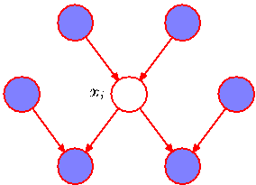

of $x_i$ as well as on the co-parents, in other words variables corresponding to parents of node $x_k$ other than node $x_i$. The set of nodes comprising the parents, the children and the co-parents is called the Markov blanket and is illustrated in Figure 8.26. We can think of the Markov blanket of a node $x_i$ as being the minimal set of nodes that isolates $x_i$ from the rest of the graph. Note that it is not sufficient to include only the parents and children of node $x_i$ because the phenomenon of explaining away means that observations of the child nodes will not block paths to the co-parents. We must therefore observe the co-parent nodes also.

## 8.3. Markov Random Fields

We have seen that directed graphical models specify a factorization of the joint distribution over a set of variables into a product of local conditional distributions. They also define a set of conditional independence properties that must be satisfied by any distribution that factorizes according to the graph. We turn now to the second major class of graphical models that are described by undirected graphs and that again specify both a factorization and a set of conditional independence relations.

A Markov random field, also known as a Markov network or an undirected graphical model (Kindermann and Snell, 1980), has a set of nodes each of which corresponds to a variable or group of variables, as well as a set of links each of which connects a pair of nodes. The links are undirected, that is they do not carry arrows. In the case of undirected graphs, it is convenient to begin with a discussion of conditional independence properties.

## 8.3.1 Conditional independence properties

In the case of directed graphs, we saw that it was possible to test whether a particular conditional independence property holds by applying a graphical test called d-separation. This involved testing whether or not the paths connecting two sets of nodes were ‘blocked’. The definition of blocked, however, was somewhat subtle due to the presence of paths having head-to-head nodes. We might ask whether it is possible to define an alternative graphical semantics for probability distributions such that conditional independence is determined by simple graph separation. This is indeed the case and corresponds to undirected graphical models. By removing the
[Page 404]

Figure 8.27 An example of an undirected graph in which every path from any node in set $A$ to any node in set $B$ passes through at least one node in set $C$. Consequently the conditional independence property $A \perp\!\!\!\perp B | C$ holds for any probability distribution described by this graph.

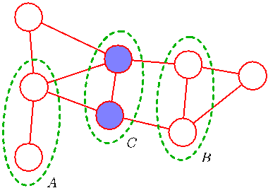

directionality from the links of the graph, the asymmetry between parent and child nodes is removed, and so the subtleties associated with head-to-head nodes no longer arise.

Suppose that in an undirected graph we identify three sets of nodes, denoted $A$, $B$, and $C$, and that we consider the conditional independence property

$$
A \perp\!\!\!\perp B | C. \tag{8.37}
$$

To test whether this property is satisfied by a probability distribution defined by a graph we consider all possible paths that connect nodes in set $A$ to nodes in set $B$. If all such paths pass through one or more nodes in set $C$, then all such paths are ‘blocked’ and so the conditional independence property holds. However, if there is at least one such path that is not blocked, then the property does not necessarily hold, or more precisely there will exist at least some distributions corresponding to the graph that do not satisfy this conditional independence relation. This is illustrated with an example in Figure 8.27. Note that this is exactly the same as the d-separation criterion except that there is no ‘explaining away’ phenomenon. Testing for conditional independence in undirected graphs is therefore simpler than in directed graphs.

An alternative way to view the conditional independence test is to imagine removing all nodes in set $C$ from the graph together with any links that connect to those nodes. We then ask if there exists a path that connects any node in $A$ to any node in $B$. If there are no such paths, then the conditional independence property must hold.

The Markov blanket for an undirected graph takes a particularly simple form, because a node will be conditionally independent of all other nodes conditioned only on the neighbouring nodes, as illustrated in Figure 8.28.

## 8.3.2 Factorization properties

We now seek a factorization rule for undirected graphs that will correspond to the above conditional independence test. Again, this will involve expressing the joint distribution $p(\mathbf{x})$ as a product of functions defined over sets of variables that are local to the graph. We therefore need to decide what is the appropriate notion of locality in this case.
[Page 405]

Figure 8.28 For an undirected graph, the Markov blanket of a node $x_i$ consists of the set of neighbouring nodes. It has the property that the conditional distribution of $x_i$, conditioned on all the remaining variables in the graph, is dependent only on the variables in the Markov blanket.

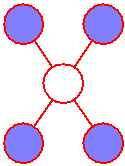

If we consider two nodes $x_i$ and $x_j$ that are not connected by a link, then these variables must be conditionally independent given all other nodes in the graph. This follows from the fact that there is no direct path between the two nodes, and all other paths pass through nodes that are observed, and hence those paths are blocked. This conditional independence property can be expressed as

$$
p(x_i, x_j | \mathbf{x}_{\backslash\{i, j\}}) = p(x_i | \mathbf{x}_{\backslash\{i, j\}})p(x_j | \mathbf{x}_{\backslash\{i, j\}}) \tag{8.38}
$$

where $\mathbf{x}_{\backslash\{i, j\}}$ denotes the set $\mathbf{x}$ of all variables with $x_i$ and $x_j$ removed. The factorization of the joint distribution must therefore be such that $x_i$ and $x_j$ do not appear in the same factor in order for the conditional independence property to hold for all possible distributions belonging to the graph.

This leads us to consider a graphical concept called a clique, which is defined as a subset of the nodes in a graph such that there exists a link between all pairs of nodes in the subset. In other words, the set of nodes in a clique is fully connected. Furthermore, a maximal clique is a clique such that it is not possible to include any other nodes from the graph in the set without it ceasing to be a clique. These concepts are illustrated by the undirected graph over four variables shown in Figure 8.29. This graph has five cliques of two nodes given by $\{x_1, x_2\}$, $\{x_2, x_3\}$, $\{x_3, x_4\}$, $\{x_4, x_2\}$, and $\{x_1, x_3\}$, as well as two maximal cliques given by $\{x_1, x_2, x_3\}$ and $\{x_2, x_3, x_4\}$. The set $\{x_1, x_2, x_3, x_4\}$ is not a clique because of the missing link from $x_1$ to $x_4$.

We can therefore define the factors in the decomposition of the joint distribution to be functions of the variables in the cliques. In fact, we can consider functions of the maximal cliques, without loss of generality, because other cliques must be subsets of maximal cliques. Thus, if $\{x_1, x_2, x_3\}$ is a maximal clique and we define an arbitrary function over this clique, then including another factor defined over a subset of these variables would be redundant.

Let us denote a clique by $C$ and the set of variables in that clique by $\mathbf{x}_C$. Then the joint distribution is written as a product of potential functions $\psi_C(\mathbf{x}_C)$ over the maximal cliques of the graph

Figure 8.29 A four-node undirected graph showing a clique (outlined in green) and a maximal clique (outlined in blue).

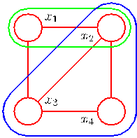
[Page 406]

the joint distribution is written as a product of potential functions $\psi_C(\mathbf{x}_C)$ over the maximal cliques of the graph

$$
p(\mathbf{x}) = \frac{1}{Z} \prod_C \psi_C(\mathbf{x}_C). \tag{8.39}
$$

Here the quantity $Z$, sometimes called the partition function, is a normalization constant and is given by

$$
Z = \sum_{\mathbf{x}} \prod_C \psi_C(\mathbf{x}_C) \tag{8.40}
$$

which ensures that the distribution $p(\mathbf{x})$ given by (8.39) is correctly normalized. By considering only potential functions which satisfy $\psi_C(\mathbf{x}_C) \ge 0$ we ensure that $p(\mathbf{x}) \ge 0$. In (8.40) we have assumed that $\mathbf{x}$ comprises discrete variables, but the framework is equally applicable to continuous variables, or a combination of the two, in which the summation is replaced by the appropriate combination of summation and integration.

Note that we do not restrict the choice of potential functions to those that have a specific probabilistic interpretation as marginal or conditional distributions. This is in contrast to directed graphs in which each factor represents the conditional distribution of the corresponding variable, conditioned on the state of its parents. However, in special cases, for instance where the undirected graph is constructed by starting with a directed graph, the potential functions may indeed have such an interpretation, as we shall see shortly.

One consequence of the generality of the potential functions $\psi_C(\mathbf{x}_C)$ is that their product will in general not be correctly normalized. We therefore have to introduce an explicit normalization factor given by (8.40). Recall that for directed graphs, the joint distribution was automatically normalized as a consequence of the normalization of each of the conditional distributions in the factorization.

The presence of this normalization constant is one of the major limitations of undirected graphs. If we have a model with $M$ discrete nodes each having $K$ states, then the evaluation of the normalization term involves summing over $K^M$ states and so (in the worst case) is exponential in the size of the model. The partition function is needed for parameter learning because it will be a function of any parameters that govern the potential functions $\psi_C(\mathbf{x}_C)$. However, for evaluation of local conditional distributions, the partition function is not needed because a conditional is the ratio of two marginals, and the partition function cancels between numerator and denominator when evaluating this ratio. Similarly, for evaluating local marginal probabilities we can work with the unnormalized joint distribution and then normalize the marginals explicitly at the end. Provided the marginals only involves a small number of variables, the evaluation of their normalization coefficient will be feasible.

So far, we have discussed the notion of conditional independence based on simple graph separation and we have proposed a factorization of the joint distribution that is intended to correspond to this conditional independence structure. However, we have not made any formal connection between conditional independence and factorization for undirected graphs. To do so we need to restrict attention to potential functions $\psi_C(\mathbf{x}_C)$ that are strictly positive (i.e., never zero or negative for any
[Page 407]

choice of $\mathbf{x}_C$). Given this restriction, we can make a precise relationship between factorization and conditional independence.

To do this we again return to the concept of a graphical model as a filter, corresponding to Figure 8.25. Consider the set of all possible distributions defined over a fixed set of variables corresponding to the nodes of a particular undirected graph. We can define $\mathcal{UI}$ to be the set of such distributions that are consistent with the set of conditional independence statements that can be read from the graph using graph separation. Similarly, we can define $\mathcal{UF}$ to be the set of such distributions that can be expressed as a factorization of the form (8.39) with respect to the maximal cliques of the graph. The Hammersley-Clifford theorem (Clifford, 1990) states that the sets $\mathcal{UI}$ and $\mathcal{UF}$ are identical.

Because we are restricted to potential functions which are strictly positive it is convenient to express them as exponentials, so that

$$
\psi_C(\mathbf{x}_C) = \exp \{-E(\mathbf{x}_C)\} \tag{8.41}
$$

where $E(\mathbf{x}_C)$ is called an energy function, and the exponential representation is called the Boltzmann distribution. The joint distribution is defined as the product of potentials, and so the total energy is obtained by adding the energies of each of the maximal cliques.

In contrast to the factors in the joint distribution for a directed graph, the potentials in an undirected graph do not have a specific probabilistic interpretation. Although this gives greater flexibility in choosing the potential functions, because there is no normalization constraint, it does raise the question of how to motivate a choice of potential function for a particular application. This can be done by viewing the potential function as expressing which configurations of the local variables are preferred to others. Global configurations that have a relatively high probability are those that find a good balance in satisfying the (possibly conflicting) influences of the clique potentials. We turn now to a specific example to illustrate the use of undirected graphs.

## 8.3.3 Illustration: Image de-noising

We can illustrate the application of undirected graphs using an example of noise removal from a binary image (Besag, 1974; Geman and Geman, 1984; Besag, 1986). Although a very simple example, this is typical of more sophisticated applications. Let the observed noisy image be described by an array of binary pixel values $y_i \in \{-1, +1\}$, where the index $i = 1, \ldots, D$ runs over all pixels. We shall suppose that the image is obtained by taking an unknown noise-free image, described by binary pixel values $x_i \in \{-1, +1\}$ and randomly flipping the sign of pixels with some small probability. An example binary image, together with a noise corrupted image obtained by flipping the sign of the pixels with probability 10%, is shown in Figure 8.30. Given the noisy image, our goal is to recover the original noise-free image.

Because the noise level is small, we know that there will be a strong correlation between $x_i$ and $y_i$. We also know that neighbouring pixels $x_i$ and $x_j$ in an image are strongly correlated. This prior knowledge can be captured using the Markov random field model whose undirected graph is shown in Figure 8.31. This graph has two types of cliques, each of which contains two variables. The cliques of the form $\{x_i, y_i\}$ have an associated energy function that expresses the correlation between these variables. We choose a very simple energy function for these cliques of the form $-\eta x_i y_i$ where $\eta$ is a positive constant. This has the desired effect of giving a lower energy (thus encouraging a higher probability) when $x_i$ and $y_i$ have the same sign and a higher energy when they have the opposite sign.
[Page 408]

Figure 8.30 Illustration of image de-noising using a Markov random field. The top row shows the original binary image on the left and the corrupted image after randomly changing 10% of the pixels on the right. The bottom row shows the restored images obtained using iterated conditional models (ICM) on the left and using the graph-cut algorithm on the right. ICM produces an image where 96% of the pixels agree with the original image, whereas the corresponding number for graph-cut is 99%.

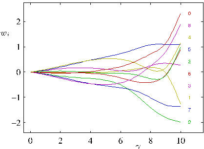

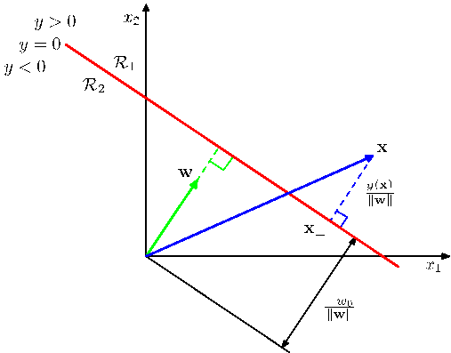
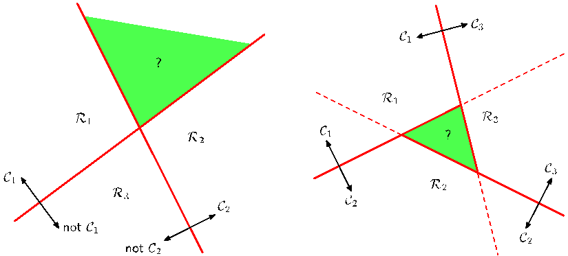

The remaining cliques comprise pairs of variables $\{x_i, x_j\}$ where $i$ and $j$ are indices of neighbouring pixels. Again, we want the energy to be lower when the pixels have the same sign than when they have the opposite sign, and so we choose an energy given by $-\beta x_i x_j$ where $\beta$ is a positive constant.

Because a potential function is an arbitrary, nonnegative function over a maximal clique, we can multiply it by any nonnegative functions of subsets of the clique, or
[Page 409]

Figure 8.31 An undirected graphical model representing a Markov random field for image de-noising, in which $x_i$ is a binary variable denoting the state of pixel $i$ in the unknown noise-free image, and $y_i$ denotes the corresponding value of pixel $i$ in the observed noisy image.

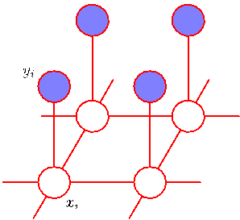

equivalently we can add the corresponding energies. In this example, this allows us to add an extra term $hx_i$ for each pixel $i$ in the noise-free image. Such a term has the effect of biasing the model towards pixel values that have one particular sign in preference to the other.

The complete energy function for the model then takes the form

$$
E(\mathbf{x}, \mathbf{y}) = h \sum_i x_i - \beta \sum_{\{i, j\}} x_i x_j - \eta \sum_i x_i y_i \tag{8.42}
$$

which defines a joint distribution over $\mathbf{x}$ and $\mathbf{y}$ given by

$$
p(\mathbf{x}, \mathbf{y}) = \frac{1}{Z} \exp\{-E(\mathbf{x}, \mathbf{y})\}. \tag{8.43}
$$

We now fix the elements of $\mathbf{y}$ to the observed values given by the pixels of the noisy image, which implicitly defines a conditional distribution $p(\mathbf{x}|\mathbf{y})$ over noisefree images. This is an example of the Ising model, which has been widely studied in statistical physics. For the purposes of image restoration, we wish to find an image $\mathbf{x}$ having a high probability (ideally the maximum probability). To do this we shall use a simple iterative technique called iterated conditional modes, or ICM (Kittler and Föglein, 1984), which is simply an application of coordinate-wise gradient ascent. The idea is first to initialize the variables $\{x_i\}$, which we do by simply setting $x_i = y_i$ for all $i$. Then we take one node $x_j$ at a time and we evaluate the total energy for the two possible states $x_j = +1$ and $x_j = -1$, keeping all other node variables fixed, and set $x_j$ to whichever state has the lower energy. This will either leave the probability unchanged, if $x_j$ is unchanged, or will increase it. Because only one variable is changed, this is a simple local computation that can be performed efficiently. We then repeat the update for another site, and so on, until some suitable stopping criterion is satisfied. The nodes may be updated in a systematic way, for instance by repeatedly raster scanning through the image, or by choosing nodes at random.

If we have a sequence of updates in which every site is visited at least once, and in which no changes to the variables are made, then by definition the algorithm
[Page 410]

Figure 8.32 (a) Example of a directed graph. (b) The equivalent undirected graph.

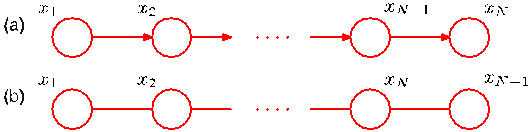

will have converged to a local maximum of the probability. This need not, however, correspond to the global maximum.

For the purposes of this simple illustration, we have fixed the parameters to be $\beta = 1.0$, $\eta = 2.1$ and $h = 0$. Note that leaving $h = 0$ simply means that the prior probabilities of the two states of $x_i$ are equal. Starting with the observed noisy image as the initial configuration, we run ICM until convergence, leading to the de-noised image shown in the lower left panel of Figure 8.30. Note that if we set $\beta = 0$, which effectively removes the links between neighbouring pixels, then the global most probable solution is given by $x_i = y_i$ for all $i$, corresponding to the observed noisy image.

Later we shall discuss a more effective algorithm for finding high probability solutions called the max-product algorithm, which typically leads to better solutions, although this is still not guaranteed to find the global maximum of the posterior distribution. However, for certain classes of model, including the one given by (8.42), there exist efficient algorithms based on graph cuts that are guaranteed to find the global maximum (Greig et al., 1989; Boykov et al., 2001; Kolmogorov and Zabih, 2004). The lower right panel of Figure 8.30 shows the result of applying a graph-cut algorithm to the de-noising problem.

## 8.3.4 Relation to directed graphs

We have introduced two graphical frameworks for representing probability distributions, corresponding to directed and undirected graphs, and it is instructive to discuss the relation between these. Consider first the problem of taking a model that is specified using a directed graph and trying to convert it to an undirected graph. In some cases this is straightforward, as in the simple example in Figure 8.32. Here the joint distribution for the directed graph is given as a product of conditionals in the form

$$
p(\mathbf{x}) = p(x_1)p(x_2|x_1)p(x_3|x_2) \cdots p(x_N|x_{N-1}). \tag{8.44}
$$

Now let us convert this to an undirected graph representation, as shown in Figure 8.32. In the undirected graph, the maximal cliques are simply the pairs of neighbouring nodes, and so from (8.39) we wish to write the joint distribution in the form

$$
p(\mathbf{x}) = \frac{1}{Z} \psi_{1,2}(x_1, x_2)\psi_{2,3}(x_2, x_3) \cdots \psi_{N-1,N}(x_{N-1}, x_N). \tag{8.45}
$$

[Page 411]

Figure 8.33 Example of a simple directed graph (a) and the corresponding moral graph (b).

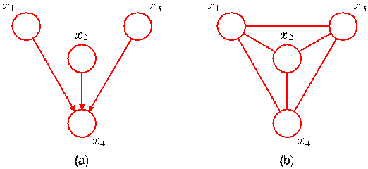

This is easily done by identifying

$$
\begin{aligned}
\psi_{1,2}(x_1, x_2) &= p(x_1)p(x_2|x_1) \\
\psi_{2,3}(x_2, x_3) &= p(x_3|x_2) \\
&\vdots \\
\psi_{N-1,N}(x_{N-1}, x_N) &= p(x_N|x_{N-1})
\end{aligned}
$$

where we have absorbed the marginal $p(x_1)$ for the first node into the first potential function. Note that in this case, the partition function $Z = 1$.

Let us consider how to generalize this construction, so that we can convert any distribution specified by a factorization over a directed graph into one specified by a factorization over an undirected graph. This can be achieved if the clique potentials of the undirected graph are given by the conditional distributions of the directed graph. In order for this to be valid, we must ensure that the set of variables that appears in each of the conditional distributions is a member of at least one clique of the undirected graph. For nodes on the directed graph having just one parent, this is achieved simply by replacing the directed link with an undirected link. However, for nodes in the directed graph having more than one parent, this is not sufficient. These are nodes that have ‘head-to-head’ paths encountered in our discussion of conditional independence. Consider a simple directed graph over 4 nodes shown in Figure 8.33. The joint distribution for the directed graph takes the form

$$
p(\mathbf{x}) = p(x_1)p(x_2)p(x_3)p(x_4|x_1, x_2, x_3). \tag{8.46}
$$

We see that the factor $p(x_4|x_1, x_2, x_3)$ involves the four variables $x_1$, $x_2$, $x_3$, and $x_4$, and so these must all belong to a single clique if this conditional distribution is to be absorbed into a clique potential. To ensure this, we add extra links between all pairs of parents of the node $x_4$. Anachronistically, this process of ‘marrying the parents’ has become known as moralization, and the resulting undirected graph, after dropping the arrows, is called the moral graph. It is important to observe that the moral graph in this example is fully connected and so exhibits no conditional independence properties, in contrast to the original directed graph.

Thus in general to convert a directed graph into an undirected graph, we first add additional undirected links between all pairs of parents for each node in the graph and
[Page 412]

then drop the arrows on the original links to give the moral graph. Then we initialize all of the clique potentials of the moral graph to 1. We then take each conditional distribution factor in the original directed graph and multiply it into one of the clique potentials. There will always exist at least one maximal clique that contains all of the variables in the factor as a result of the moralization step. Note that in all cases the partition function is given by $Z = 1$.

The process of converting a directed graph into an undirected graph plays an important role in exact inference techniques such as the junction tree algorithm. Converting from an undirected to a directed representation is much less common and in general presents problems due to the normalization constraints.

We saw that in going from a directed to an undirected representation we had to discard some conditional independence properties from the graph. Of course, we could always trivially convert any distribution over a directed graph into one over an undirected graph by simply using a fully connected undirected graph. This would, however, discard all conditional independence properties and so would be vacuous. The process of moralization adds the fewest extra links and so retains the maximum number of independence properties.

We have seen that the procedure for determining the conditional independence properties is different between directed and undirected graphs. It turns out that the two types of graph can express different conditional independence properties, and it is worth exploring this issue in more detail. To do so, we return to the view of a specific (directed or undirected) graph as a filter, so that the set of all possible distributions over the given variables could be reduced to a subset that respects the conditional independencies implied by the graph. A graph is said to be a D map (for ‘dependency map’) of a distribution if every conditional independence statement satisfied by the distribution is reflected in the graph. Thus a completely disconnected graph (no links) will be a trivial D map for any distribution.

Alternatively, we can consider a specific distribution and ask which graphs have the appropriate conditional independence properties. If every conditional independence statement implied by a graph is satisfied by a specific distribution, then the graph is said to be an I map (for ‘independence map’) of that distribution. Clearly a fully connected graph will be a trivial I map for any distribution.

If it is the case that every conditional independence property of the distribution is reflected in the graph, and vice versa, then the graph is said to be a perfect map for

Figure 8.34 Venn diagram illustrating the set of all distributions $\mathcal{P}$ over a given set of variables, together with the set of distributions $\mathcal{D}$ that can be represented as a perfect map using a directed graph, and the set $\mathcal{U}$ that can be represented as a perfect map using an undirected graph.

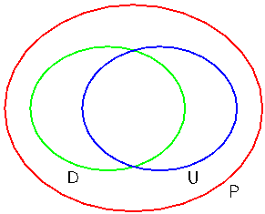
[Page 413]

Figure 8.35 A directed graph whose conditional independence properties cannot be expressed using an undirected graph over the same three variables.

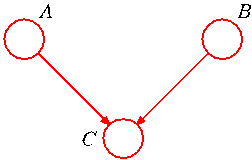

that distribution. A perfect map is therefore both an I map and a D map.

Consider the set of distributions such that for each distribution there exists a directed graph that is a perfect map. This set is distinct from the set of distributions such that for each distribution there exists an undirected graph that is a perfect map. In addition there are distributions for which neither directed nor undirected graphs offer a perfect map. This is illustrated as a Venn diagram in Figure 8.34.

Figure 8.35 shows an example of a directed graph that is a perfect map for a distribution satisfying the conditional independence properties $A \perp\!\!\!\perp B \mid \emptyset$ and $A \not\perp\!\!\!\perp B \mid C$. There is no corresponding undirected graph over the same three variables that is a perfect map.

Conversely, consider the undirected graph over four variables shown in Figure 8.36. This graph exhibits the properties $A \not\perp\!\!\!\perp B \mid \emptyset$, $C \perp\!\!\!\perp D \mid A \cup B$ and $A \perp\!\!\!\perp B \mid C \cup D$. There is no directed graph over four variables that implies the same set of conditional independence properties.

The graphical framework can be extended in a consistent way to graphs that include both directed and undirected links. These are called chain graphs (Lauritzen and Wermuth, 1989; Frydenberg, 1990), and contain the directed and undirected graphs considered so far as special cases. Although such graphs can represent a broader class of distributions than either directed or undirected alone, there remain distributions for which even a chain graph cannot provide a perfect map. Chain graphs are not discussed further in this book.

Figure 8.36 An undirected graph whose conditional independence properties cannot be expressed in terms of a directed graph over the same variables.

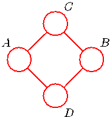

## 8.4. Inference in Graphical Models

We turn now to the problem of inference in graphical models, in which some of the nodes in a graph are clamped to observed values, and we wish to compute the posterior distributions of one or more subsets of other nodes. As we shall see, we can exploit the graphical structure both to find efficient algorithms for inference, and
[Page 414]

Figure 8.37 A graphical representation of Bayes’ theorem. See the text for details.

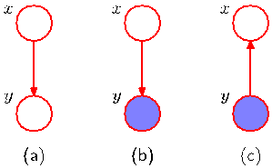

to make the structure of those algorithms transparent. Specifically, we shall see that many algorithms can be expressed in terms of the propagation of local messages around the graph. In this section, we shall focus primarily on techniques for exact inference, and in Chapter 10 we shall consider a number of approximate inference algorithms.

To start with, let us consider the graphical interpretation of Bayes’ theorem. Suppose we decompose the joint distribution $p(x, y)$ over two variables $x$ and $y$ into a product of factors in the form $p(x, y) = p(x)p(y|x)$. This can be represented by the directed graph shown in Figure 8.37(a). Now suppose we observe the value of $y$, as indicated by the shaded node in Figure 8.37(b). We can view the marginal distribution $p(x)$ as a prior over the latent variable $x$, and our goal is to infer the corresponding posterior distribution over $x$. Using the sum and product rules of probability we can evaluate

$$
p(y) = \sum_{x'} p(y|x')p(x') \tag{8.47}
$$

which can then be used in Bayes’ theorem to calculate

$$
p(x|y) = \frac{p(y|x)p(x)}{p(y)}. \tag{8.48}
$$

Thus the joint distribution is now expressed in terms of $p(y)$ and $p(x|y)$. From a graphical perspective, the joint distribution $p(x, y)$ is now represented by the graph shown in Figure 8.37(c), in which the direction of the arrow is reversed. This is the simplest example of an inference problem for a graphical model.

## 8.4.1 Inference on a chain

Now consider a more complex problem involving the chain of nodes of the form shown in Figure 8.32. This example will lay the foundation for a discussion of exact inference in more general graphs later in this section.

Specifically, we shall consider the undirected graph in Figure 8.32(b). We have already seen that the directed chain can be transformed into an equivalent undirected chain. Because the directed graph does not have any nodes with more than one parent, this does not require the addition of any extra links, and the directed and undirected versions of this graph express exactly the same set of conditional independence statements.
[Page 415]

The joint distribution for this graph takes the form

$$
p(\mathbf{x}) = \frac{1}{Z} \psi_{1,2}(x_1, x_2)\psi_{2,3}(x_2, x_3) \cdots \psi_{N-1,N}(x_{N-1}, x_N). \tag{8.49}
$$

We shall consider the specific case in which the $N$ nodes represent discrete variables each having $K$ states, in which case each potential function $\psi_{n-1,n}(x_{n-1}, x_n)$ comprises an $K \times K$ table, and so the joint distribution has $(N - 1)K^2$ parameters.

Let us consider the inference problem of finding the marginal distribution $p(x_n)$ for a specific node $x_n$ that is part way along the chain. Note that, for the moment, there are no observed nodes. By definition, the required marginal is obtained by summing the joint distribution over all variables except $x_n$, so that

$$
p(x_n) = \sum_{x_1} \cdots \sum_{x_{n-1}} \sum_{x_{n+1}} \cdots \sum_{x_N} p(\mathbf{x}). \tag{8.50}
$$

In a naive implementation, we would first evaluate the joint distribution and then perform the summations explicitly. The joint distribution can be represented as a set of numbers, one for each possible value for $\mathbf{x}$. Because there are $N$ variables each with $K$ states, there are $K^N$ values for $\mathbf{x}$ and so evaluation and storage of the joint distribution, as well as marginalization to obtain $p(x_n)$, all involve storage and computation that scale exponentially with the length $N$ of the chain.

We can, however, obtain a much more efficient algorithm by exploiting the conditional independence properties of the graphical model. If we substitute the factorized expression (8.49) for the joint distribution into (8.50), then we can rearrange the order of the summations and the multiplications to allow the required marginal to be evaluated much more efficiently. Consider for instance the summation over $x_N$. The potential $\psi_{N-1,N}(x_{N-1}, x_N)$ is the only one that depends on $x_N$, and so we can perform the summation

$$
\sum_{x_N} \psi_{N-1,N}(x_{N-1}, x_N) \tag{8.51}
$$

first to give a function of $x_{N-1}$. We can then use this to perform the summation over $x_{N-1}$, which will involve only this new function together with the potential $\psi_{N-2,N-1}(x_{N-2}, x_{N-1})$, because this is the only other place that $x_{N-1}$ appears. Similarly, the summation over $x_1$ involves only the potential $\psi_{1,2}(x_1, x_2)$ and so can be performed separately to give a function of $x_2$, and so on. Because each summation effectively removes a variable from the distribution, this can be viewed as the removal of a node from the graph.

If we group the potentials and summations together in this way, we can express
[Page 416]

the desired marginal in the form

$$
p(x_n) = \frac{1}{Z} \underbrace{\left[ \sum_{x_{n-1}} \psi_{n-1,n}(x_{n-1}, x_n) \cdots \left[ \sum_{x_2} \psi_{2,3}(x_2, x_3) \left[ \sum_{x_1} \psi_{1,2}(x_1, x_2) \right] \right] \cdots \right]}_{\mu_\alpha(x_n)} \underbrace{\left[ \sum_{x_{n+1}} \psi_{n,n+1}(x_n, x_{n+1}) \cdots \left[ \sum_{x_N} \psi_{N-1,N}(x_{N-1}, x_N) \right] \cdots \right]}_{\mu_\beta(x_n)}. \tag{8.52}
$$

The reader is encouraged to study this re-ordering carefully as the underlying idea forms the basis for the later discussion of the general sum-product algorithm. Here the key concept that we are exploiting is that multiplication is distributive over addition, so that

$$
ab + ac = a(b + c) \tag{8.53}
$$

in which the left-hand side involves three arithmetic operations whereas the righthand side reduces this to two operations.

Let us work out the computational cost of evaluating the required marginal using this re-ordered expression. We have to perform $N - 1$ summations each of which is over $K$ states and each of which involves a function of two variables. For instance, the summation over $x_1$ involves only the function $\psi_{1,2}(x_1, x_2)$, which is a table of $K \times K$ numbers. We have to sum this table over $x_1$ for each value of $x_2$ and so this has $O(K^2)$ cost. The resulting vector of $K$ numbers is multiplied by the matrix of numbers $\psi_{2,3}(x_2, x_3)$ and so is again $O(K^2)$. Because there are $N - 1$ summations and multiplications of this kind, the total cost of evaluating the marginal $p(x_n)$ is $O(NK^2)$. This is linear in the length of the chain, in contrast to the exponential cost of a naive approach. We have therefore been able to exploit the many conditional independence properties of this simple graph in order to obtain an efficient calculation. If the graph had been fully connected, there would have been no conditional independence properties, and we would have been forced to work directly with the full joint distribution.

We now give a powerful interpretation of this calculation in terms of the passing of local messages around on the graph. From (8.52) we see that the expression for the marginal $p(x_n)$ decomposes into the product of two factors times the normalization constant $1/Z$

$$
p(x_n) = \frac{1}{Z} \mu_\alpha(x_n)\mu_\beta(x_n). \tag{8.54}
$$

We shall interpret $\mu_\alpha(x_n)$ as a message passed forwards along the chain from node $x_{n-1}$ to node $x_n$. Similarly, $\mu_\beta(x_n)$ can be viewed as a message passed backwards
[Page 417]

Figure 8.38 The marginal distribution $p(x_n)$ for a node $x_n$ along the chain is obtained by multiplying the two messages $\mu_\alpha(x_n)$ and $\mu_\beta(x_n)$, and then normalizing. These messages can themselves be evaluated recursively by passing messages from both ends of the chain towards node $x_n$.

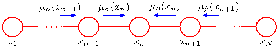

along the chain to node $x_n$ from node $x_{n+1}$. Note that each of the messages comprises a set of $K$ values, one for each choice of $x_n$, and so the product of two messages should be interpreted as the point-wise multiplication of the elements of the two messages to give another set of $K$ values.

The message $\mu_\alpha(x_n)$ can be evaluated recursively because

$$
\mu_\alpha(x_n) = \sum_{x_{n-1}} \psi_{n-1,n}(x_{n-1}, x_n) \left[ \sum_{x_{n-2}} \cdots \right] = \sum_{x_{n-1}} \psi_{n-1,n}(x_{n-1}, x_n)\mu_\alpha(x_{n-1}). \tag{8.55}
$$

We therefore first evaluate

$$
\mu_\alpha(x_2) = \sum_{x_1} \psi_{1,2}(x_1, x_2) \tag{8.56}
$$

and then apply (8.55) repeatedly until we reach the desired node. Note carefully the structure of the message passing equation. The outgoing message $\mu_\alpha(x_n)$ in (8.55) is obtained by multiplying the incoming message $\mu_\alpha(x_{n-1})$ by the local potential involving the node variable and the outgoing variable and then summing over the node variable.

Similarly, the message $\mu_\beta(x_n)$ can be evaluated recursively by starting with node $x_N$ and using

$$
\mu_\beta(x_n) = \sum_{x_{n+1}} \psi_{n+1,n}(x_{n+1}, x_n) \left[ \sum_{x_{n+2}} \cdots \right] = \sum_{x_{n+1}} \psi_{n+1,n}(x_{n+1}, x_n)\mu_\beta(x_{n+1}). \tag{8.57}
$$

This recursive message passing is illustrated in Figure 8.38. The normalization constant $Z$ is easily evaluated by summing the right-hand side of (8.54) over all states of $x_n$, an operation that requires only $O(K)$ computation.

Graphs of the form shown in Figure 8.38 are called Markov chains, and the corresponding message passing equations represent an example of the ChapmanKolmogorov equations for Markov processes (Papoulis, 1984).
[Page 418]

Now suppose we wish to evaluate the marginals $p(x_n)$ for every node $n \in \{1, \ldots, N\}$ in the chain. Simply applying the above procedure separately for each node will have computational cost that is $O(N^2 M^2)$. However, such an approach would be very wasteful of computation. For instance, to find $p(x_1)$ we need to propagate a message $\mu_\beta(\cdot)$ from node $x_N$ back to node $x_2$. Similarly, to evaluate $p(x_2)$ we need to propagate a message $\mu_\beta(\cdot)$ from node $x_N$ back to node $x_3$. This will involve much duplicated computation because most of the messages will be identical in the two cases.

Suppose instead we first launch a message $\mu_\beta(x_{N-1})$ starting from node $x_N$ and propagate corresponding messages all the way back to node $x_1$, and suppose we similarly launch a message $\mu_\alpha(x_2)$ starting from node $x_1$ and propagate the corresponding messages all the way forward to node $x_N$. Provided we store all of the intermediate messages along the way, then any node can evaluate its marginal simply by applying (8.54). The computational cost is only twice that for finding the marginal of a single node, rather than $N$ times as much. Observe that a message has passed once in each direction across each link in the graph. Note also that the normalization constant $Z$ need be evaluated only once, using any convenient node.

If some of the nodes in the graph are observed, then the corresponding variables are simply clamped to their observed values and there is no summation. To see this, note that the effect of clamping a variable $x_n$ to an observed value $\widehat{x}_n$ can be expressed by multiplying the joint distribution by (one or more copies of) an additional function $I(x_n, \widehat{x}_n)$, which takes the value $1$ when $x_n = \widehat{x}_n$ and the value $0$ otherwise. One such function can then be absorbed into each of the potentials that contain $x_n$. Summations over $x_n$ then contain only one term in which $x_n = \widehat{x}_n$.

Now suppose we wish to calculate the joint distribution $p(x_{n-1}, x_n)$ for two neighbouring nodes on the chain. This is similar to the evaluation of the marginal for a single node, except that there are now two variables that are not summed out. A few moments thought will show that the required joint distribution can be written in the form

$$
p(x_{n-1}, x_n) = \frac{1}{Z} \mu_\alpha(x_{n-1})\psi_{n-1,n}(x_{n-1}, x_n)\mu_\beta(x_n). \tag{8.58}
$$

Thus we can obtain the joint distributions over all of the sets of variables in each of the potentials directly once we have completed the message passing required to obtain the marginals.

This is a useful result because in practice we may wish to use parametric forms for the clique potentials, or equivalently for the conditional distributions if we started from a directed graph. In order to learn the parameters of these potentials in situations where not all of the variables are observed, we can employ the EM algorithm, and it turns out that the local joint distributions of the cliques, conditioned on any observed data, is precisely what is needed in the E step. We shall consider some examples of this in detail in Chapter 13.

## 8.4.2 Trees

We have seen that exact inference on a graph comprising a chain of nodes can be performed efficiently in time that is linear in the number of nodes, using an algorithm
[Page 419]

Figure 8.39 Examples of treestructured graphs, showing (a) an undirected tree, (b) a directed tree, and (c) a directed polytree.

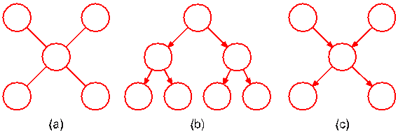

that can be interpreted in terms of messages passed along the chain. More generally, inference can be performed efficiently using local message passing on a broader class of graphs called trees. In particular, we shall shortly generalize the message passing formalism derived above for chains to give the sum-product algorithm, which provides an efficient framework for exact inference in tree-structured graphs.

In the case of an undirected graph, a tree is defined as a graph in which there is one, and only one, path between any pair of nodes. Such graphs therefore do not have loops. In the case of directed graphs, a tree is defined such that there is a single node, called the root, which has no parents, and all other nodes have one parent. If we convert a directed tree into an undirected graph, we see that the moralization step will not add any links as all nodes have at most one parent, and as a consequence the corresponding moralized graph will be an undirected tree. Examples of undirected and directed trees are shown in Figure 8.39(a) and 8.39(b). Note that a distribution represented as a directed tree can easily be converted into one represented by an undirected tree, and vice versa.

If there are nodes in a directed graph that have more than one parent, but there is still only one path (ignoring the direction of the arrows) between any two nodes, then the graph is a called a polytree, as illustrated in Figure 8.39(c). Such a graph will have more than one node with the property of having no parents, and furthermore, the corresponding moralized undirected graph will have loops.

## 8.4.3 Factor graphs

The sum-product algorithm that we derive in the next section is applicable to undirected and directed trees and to polytrees. It can be cast in a particularly simple and general form if we first introduce a new graphical construction called a factor graph (Frey, 1998; Kschischnang et al., 2001).

Both directed and undirected graphs allow a global function of several variables to be expressed as a product of factors over subsets of those variables. Factor graphs make this decomposition explicit by introducing additional nodes for the factors themselves in addition to the nodes representing the variables. They also allow us to be more explicit about the details of the factorization, as we shall see.

Let us write the joint distribution over a set of variables in the form of a product of factors

$$
p(\mathbf{x}) = \prod_s f_s(\mathbf{x}_s) \tag{8.59}
$$

where $\mathbf{x}_s$ denotes a subset of the variables. For convenience, we shall denote the
[Page 420]

Figure 8.40 Example of a factor graph, which corresponds to the factorization (8.60).

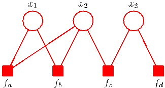

individual variables by $x_i$, however, as in earlier discussions, these can comprise groups of variables (such as vectors or matrices). Each factor $f_s$ is a function of a corresponding set of variables $\mathbf{x}_s$.

Directed graphs, whose factorization is defined by (8.5), represent special cases of (8.59) in which the factors $f_s(\mathbf{x}_s)$ are local conditional distributions. Similarly, undirected graphs, given by (8.39), are a special case in which the factors are potential functions over the maximal cliques (the normalizing coefficient $1/Z$ can be viewed as a factor defined over the empty set of variables).

In a factor graph, there is a node (depicted as usual by a circle) for every variable in the distribution, as was the case for directed and undirected graphs. There are also additional nodes (depicted by small squares) for each factor $f_s(\mathbf{x}_s)$ in the joint distribution. Finally, there are undirected links connecting each factor node to all of the variables nodes on which that factor depends. Consider, for example, a distribution that is expressed in terms of the factorization

$$
p(\mathbf{x}) = f_a(x_1, x_2)f_b(x_1, x_2)f_c(x_2, x_3)f_d(x_3). \tag{8.60}
$$

This can be expressed by the factor graph shown in Figure 8.40. Note that there are two factors $f_a(x_1, x_2)$ and $f_b(x_1, x_2)$ that are defined over the same set of variables. In an undirected graph, the product of two such factors would simply be lumped together into the same clique potential. Similarly, $f_c(x_2, x_3)$ and $f_d(x_3)$ could be combined into a single potential over $x_2$ and $x_3$. The factor graph, however, keeps such factors explicit and so is able to convey more detailed information about the underlying factorization.

Figure 8.41 (a) An undirected graph with a single clique potential $\psi(x_1, x_2, x_3)$. (b) A factor graph with factor $f(x_1, x_2, x_3) = \psi(x_1, x_2, x_3)$ representing the same distribution as the undirected graph. (c) A different factor graph representing the same distribution, whose factors satisfy $f_a(x_1, x_2, x_3)f_b(x_1, x_2) = \psi(x_1, x_2, x_3)$.

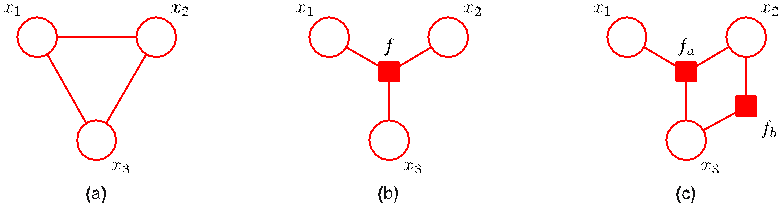
[Page 421]

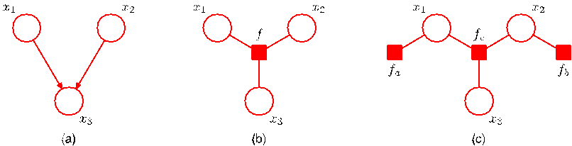

Figure 8.42 (a) A directed graph with the factorization $p(x_1)p(x_2)p(x_3|x_1, x_2)$. (b) A factor graph representing the same distribution as the directed graph, whose factor satisfies $f(x_1, x_2, x_3) = p(x_1)p(x_2)p(x_3|x_1, x_2)$. (c) A different factor graph representing the same distribution with factors $f_a(x_1) = p(x_1)$, $f_b(x_2) = p(x_2)$ and $f_c(x_1, x_2, x_3) = p(x_3|x_1, x_2)$.

Factor graphs are said to be bipartite because they consist of two distinct kinds of nodes, and all links go between nodes of opposite type. In general, factor graphs can therefore always be drawn as two rows of nodes (variable nodes at the top and factor nodes at the bottom) with links between the rows, as shown in the example in Figure 8.40. In some situations, however, other ways of laying out the graph may be more intuitive, for example when the factor graph is derived from a directed or undirected graph, as we shall see.

If we are given a distribution that is expressed in terms of an undirected graph, then we can readily convert it to a factor graph. To do this, we create variable nodes corresponding to the nodes in the original undirected graph, and then create additional factor nodes corresponding to the maximal cliques $\mathbf{x}_s$. The factors $f_s(\mathbf{x}_s)$ are then set equal to the clique potentials. Note that there may be several different factor graphs that correspond to the same undirected graph. These concepts are illustrated in Figure 8.41.

Similarly, to convert a directed graph to a factor graph, we simply create variable nodes in the factor graph corresponding to the nodes of the directed graph, and then create factor nodes corresponding to the conditional distributions, and then finally add the appropriate links. Again, there can be multiple factor graphs all of which correspond to the same directed graph. The conversion of a directed graph to a factor graph is illustrated in Figure 8.42.

We have already noted the importance of tree-structured graphs for performing efficient inference. If we take a directed or undirected tree and convert it into a factor graph, then the result will again be a tree (in other words, the factor graph will have no loops, and there will be one and only one path connecting any two nodes). In the case of a directed polytree, conversion to an undirected graph results in loops due to the moralization step, whereas conversion to a factor graph again results in a tree, as illustrated in Figure 8.43. In fact, local cycles in a directed graph due to links connecting parents of a node can be removed on conversion to a factor graph by defining the appropriate factor function, as shown in Figure 8.44.

We have seen that multiple different factor graphs can represent the same directed or undirected graph. This allows factor graphs to be more specific about the
[Page 422]

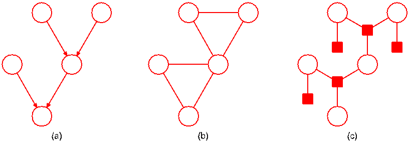

Figure 8.43 (a) A directed polytree. (b) The result of converting the polytree into an undirected graph showing the creation of loops. (c) The result of converting the polytree into a factor graph, which retains the tree structure.

precise form of the factorization. Figure 8.45 shows an example of a fully connected undirected graph along with two different factor graphs. In (b), the joint distribution is given by a general form $p(\mathbf{x}) = f(x_1, x_2, x_3)$, whereas in (c), it is given by the more specific factorization $p(\mathbf{x}) = f_a(x_1, x_2)f_b(x_1, x_3)f_c(x_2, x_3)$. It should be emphasized that the factorization in (c) does not correspond to any conditional independence properties.

## 8.4.4 The sum-product algorithm

We shall now make use of the factor graph framework to derive a powerful class of efficient, exact inference algorithms that are applicable to tree-structured graphs. Here we shall focus on the problem of evaluating local marginals over nodes or subsets of nodes, which will lead us to the sum-product algorithm. Later we shall modify the technique to allow the most probable state to be found, giving rise to the max-sum algorithm.

Also we shall suppose that all of the variables in the model are discrete, and so marginalization corresponds to performing sums. The framework, however, is equally applicable to linear-Gaussian models in which case marginalization involves integration, and we shall consider an example of this in detail when we discuss linear dynamical systems.

Figure 8.44 (a) A fragment of a directed graph having a local cycle. (b) Conversion to a fragment of a factor graph having a tree structure, in which $f(x_1, x_2, x_3) = p(x_1)p(x_2|x_1)p(x_3|x_1, x_2)$.

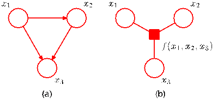
[Page 423]

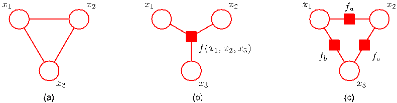

Figure 8.45 (a) A fully connected undirected graph. (b) and (c) Two factor graphs each of which corresponds to the undirected graph in (a).

There is an algorithm for exact inference on directed graphs without loops known as belief propagation (Pearl, 1988; Lauritzen and Spiegelhalter, 1988), and is equivalent to a special case of the sum-product algorithm. Here we shall consider only the sum-product algorithm because it is simpler to derive and to apply, as well as being more general.

We shall assume that the original graph is an undirected tree or a directed tree or polytree, so that the corresponding factor graph has a tree structure. We first convert the original graph into a factor graph so that we can deal with both directed and undirected models using the same framework. Our goal is to exploit the structure of the graph to achieve two things: (i) to obtain an efficient, exact inference algorithm for finding marginals; (ii) in situations where several marginals are required to allow computations to be shared efficiently.

We begin by considering the problem of finding the marginal $p(x)$ for particular variable node $x$. For the moment, we shall suppose that all of the variables are hidden. Later we shall see how to modify the algorithm to incorporate evidence corresponding to observed variables. By definition, the marginal is obtained by summing the joint distribution over all variables except $x$ so that

$$
p(x) = \sum_{\mathbf{x} \setminus x} p(\mathbf{x}) \tag{8.61}
$$

where $\mathbf{x} \setminus x$ denotes the set of variables in $\mathbf{x}$ with variable $x$ omitted. The idea is to substitute for $p(\mathbf{x})$ using the factor graph expression (8.59) and then interchange summations and products in order to obtain an efficient algorithm. Consider the fragment of graph shown in Figure 8.46 in which we see that the tree structure of the graph allows us to partition the factors in the joint distribution into groups, with one group associated with each of the factor nodes that is a neighbour of the variable node $x$. We see that the joint distribution can be written as a product of the form

$$
p(\mathbf{x}) = \prod_{s \in \text{ne}(x)} F_s(x, X_s) \tag{8.62}
$$

where $\text{ne}(x)$ denotes the set of factor nodes that are neighbours of $x$, and $X_s$ denotes the set of all variables in the subtree connected to the variable node $x$ via the factor node
[Page 424]

Figure 8.46 A fragment of a factor graph illustrating the evaluation of the marginal $p(x)$.

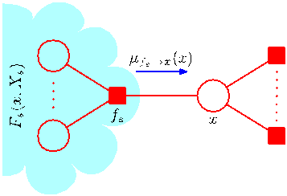

$f_s$, and $F_s(x, X_s)$ represents the product of all the factors in the group associated with factor $f_s$.

Substituting (8.62) into (8.61) and interchanging the sums and products, we obtain

$$
\begin{aligned}
p(x) &= \prod_{s \in \text{ne}(x)} \left[ \sum_{X_s} F_s(x, X_s) \right] \\
&= \prod_{s \in \text{ne}(x)} \mu_{f_s \to x}(x).
\end{aligned} \tag{8.63}
$$

Here we have introduced a set of functions $\mu_{f_s \to x}(x)$, defined by

$$
\mu_{f_s \to x}(x) \equiv \sum_{X_s} F_s(x, X_s) \tag{8.64}
$$

which can be viewed as messages from the factor nodes $f_s$ to the variable node $x$. We see that the required marginal $p(x)$ is given by the product of all the incoming messages arriving at node $x$.

In order to evaluate these messages, we again turn to Figure 8.46 and note that each factor $F_s(x, X_s)$ is described by a factor (sub-)graph and so can itself be factorized. In particular, we can write

$$
F_s(x, X_s) = f_s(x, x_1, \ldots, x_M) G_1(x_1, X_{s1}) \cdots G_M(x_M, X_{sM}) \tag{8.65}
$$

where, for convenience, we have denoted the variables associated with factor $f_s$, in addition to $x$, by $x_1, \ldots, x_M$. This factorization is illustrated in Figure 8.47. Note that the set of variables $\{x, x_1, \ldots, x_M\}$ is the set of variables on which the factor $f_s$ depends, and so it can also be denoted $\mathbf{x}_s$, using the notation of (8.59).

Substituting (8.65) into (8.64) we obtain

$$
\begin{aligned}
\mu_{f_s \to x}(x) &= \sum_{x_1} \cdots \sum_{x_M} f_s(x, x_1, \ldots, x_M) \prod_{m \in \text{ne}(f_s) \setminus x} \left[ \sum_{X_{sm}} G_m(x_m, X_{sm}) \right] \\
&= \sum_{x_1} \cdots \sum_{x_M} f_s(x, x_1, \ldots, x_M) \prod_{m \in \text{ne}(f_s) \setminus x} \mu_{x_m \to f_s}(x_m)
\end{aligned} \tag{8.66}
$$

[Page 425]

Figure 8.47 Illustration of the factorization of the subgraph associated with factor node $f_s$.

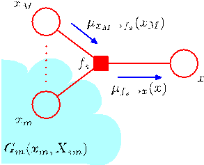

where $\text{ne}(f_s)$ denotes the set of variable nodes that are neighbours of the factor node $f_s$, and $\text{ne}(f_s) \setminus x$ denotes the same set but with node $x$ removed. Here we have defined the following messages from variable nodes to factor nodes

$$
\mu_{x_m \to f_s}(x_m) \equiv \sum_{X_{sm}} G_m(x_m, X_{sm}). \tag{8.67}
$$

We have therefore introduced two distinct kinds of message, those that go from factor nodes to variable nodes denoted $\mu_{f \to x}(x)$, and those that go from variable nodes to factor nodes denoted $\mu_{x \to f}(x)$. In each case, we see that messages passed along a link are always a function of the variable associated with the variable node that link connects to.

The result (8.66) says that to evaluate the message sent by a factor node to a variable node along the link connecting them, take the product of the incoming messages along all other links coming into the factor node, multiply by the factor associated with that node, and then marginalize over all of the variables associated with the incoming messages. This is illustrated in Figure 8.47. It is important to note that a factor node can send a message to a variable node once it has received incoming messages from all other neighbouring variable nodes.

Finally, we derive an expression for evaluating the messages from variable nodes to factor nodes, again by making use of the (sub-)graph factorization. From Figure 8.48, we see that term $G_m(x_m, X_{sm})$ associated with node $x_m$ is given by a product of terms $F_l(x_m, X_{ml})$ each associated with one of the factor nodes $f_l$ that is linked to node $x_m$ (excluding node $f_s$), so that

$$
G_m(x_m, X_{sm}) = \prod_{l \in \text{ne}(x_m) \setminus f_s} F_l(x_m, X_{ml}) \tag{8.68}
$$

where the product is taken over all neighbours of node $x_m$ except for node $f_s$. Note that each of the factors $F_l(x_m, X_{ml})$ represents a subtree of the original graph of precisely the same kind as introduced in (8.62). Substituting (8.68) into (8.67), we
[Page 426]

Figure 8.48 Illustration of the evaluation of the message sent by a variable node to an adjacent factor node.

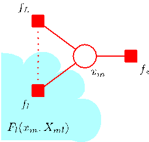

then obtain

$$
\begin{aligned}
\mu_{x_m \to f_s}(x_m) &= \prod_{l \in \text{ne}(x_m) \setminus f_s} \left[ \sum_{X_{ml}} F_l(x_m, X_{ml}) \right] \\
&= \prod_{l \in \text{ne}(x_m) \setminus f_s} \mu_{f_l \to x_m}(x_m)
\end{aligned} \tag{8.69}
$$

where we have used the definition (8.64) of the messages passed from factor nodes to variable nodes. Thus to evaluate the message sent by a variable node to an adjacent factor node along the connecting link, we simply take the product of the incoming messages along all of the other links. Note that any variable node that has only two neighbours performs no computation but simply passes messages through unchanged. Also, we note that a variable node can send a message to a factor node once it has received incoming messages from all other neighbouring factor nodes.

Recall that our goal is to calculate the marginal for variable node $x$, and that this marginal is given by the product of incoming messages along all of the links arriving at that node. Each of these messages can be computed recursively in terms of other messages. In order to start this recursion, we can view the node $x$ as the root of the tree and begin at the leaf nodes. From the definition (8.69), we see that if a leaf node is a variable node, then the message that it sends along its one and only link is given by

$$
\mu_{x \to f}(x) = 1 \tag{8.70}
$$

as illustrated in Figure 8.49(a). Similarly, if the leaf node is a factor node, we see from (8.66) that the message sent should take the form

$$
\mu_{f \to x}(x) = f(x) \tag{8.71}
$$

Figure 8.49 The sum-product algorithm begins with messages sent by the leaf nodes, which depend on whether the leaf node is (a) a variable node, or (b) a factor node.

[Page 427]

as illustrated in Figure 8.49(b). At this point, it is worth pausing to summarize the particular version of the sum-product algorithm obtained so far for evaluating the marginal $p(x)$. We start by viewing the variable node $x$ as the root of the factor graph and initiating messages at the leaves of the graph using (8.70) and (8.71). The message passing steps (8.66) and (8.69) are then applied recursively until messages have been propagated along every link, and the root node has received messages from all of its neighbours. Each node can send a message towards the root once it has received messages from all of its other neighbours. Once the root node has received messages from all of its neighbours, the required marginal can be evaluated using (8.63). We shall illustrate this process shortly.

To see that each node will always receive enough messages to be able to send out a message, we can use a simple inductive argument as follows. Clearly, for a graph comprising a variable root node connected directly to several factor leaf nodes, the algorithm trivially involves sending messages of the form (8.71) directly from the leaves to the root. Now imagine building up a general graph by adding nodes one at a time, and suppose that for some particular graph we have a valid algorithm. When one more (variable or factor) node is added, it can be connected only by a single link because the overall graph must remain a tree, and so the new node will be a leaf node. It therefore sends a message to the node to which it is linked, which in turn will therefore receive all the messages it requires in order to send its own message towards the root, and so again we have a valid algorithm, thereby completing the proof.

Now suppose we wish to find the marginals for every variable node in the graph. This could be done by simply running the above algorithm afresh for each such node. However, this would be very wasteful as many of the required computations would be repeated. We can obtain a much more efficient procedure by ‘overlaying’ these multiple message passing algorithms to obtain the general sum-product algorithm as follows. Arbitrarily pick any (variable or factor) node and designate it as the root. Propagate messages from the leaves to the root as before. At this point, the root node will have received messages from all of its neighbours. It can therefore send out messages to all of its neighbours. These in turn will then have received messages from all of their neighbours and so can send out messages along the links going away from the root, and so on. In this way, messages are passed outwards from the root all the way to the leaves. By now, a message will have passed in both directions across every link in the graph, and every node will have received a message from all of its neighbours. Again a simple inductive argument can be used to verify the validity of this message passing protocol. Because every variable node will have received messages from all of its neighbours, we can readily calculate the marginal distribution for every variable in the graph. The number of messages that have to be computed is given by twice the number of links in the graph and so involves only twice the computation involved in finding a single marginal. By comparison, if we had run the sum-product algorithm separately for each node, the amount of computation would grow quadratically with the size of the graph. Note that this algorithm is in fact independent of which node was designated as the root,
[Page 428]

Figure 8.50 The sum-product algorithm can be viewed purely in terms of messages sent out by factor nodes to other factor nodes. In this example, the outgoing message shown by the blue arrow is obtained by taking the product of all the incoming messages shown by green arrows, multiplying by the factor $f_s$, and marginalizing over the variables $x_1$ and $x_2$.

and indeed the notion of one node having a special status was introduced only as a convenient way to explain the message passing protocol.

Next suppose we wish to find the marginal distributions $p(\mathbf{x}_s)$ associated with the sets of variables belonging to each of the factors. By a similar argument to that used above, it is easy to see that the marginal associated with a factor is given by the product of messages arriving at the factor node and the local factor at that node

$$
p(\mathbf{x}_s) = f_s(\mathbf{x}_s) \prod_{i \in \text{ne}(f_s)} \mu_{x_i \to f_s}(x_i) \tag{8.72}
$$

in complete analogy with the marginals at the variable nodes. If the factors are parameterized functions and we wish to learn the values of the parameters using the EM algorithm, then these marginals are precisely the quantities we will need to calculate in the E step, as we shall see in detail when we discuss the hidden Markov model in Chapter 13.

The message sent by a variable node to a factor node, as we have seen, is simply the product of the incoming messages on other links. We can if we wish view the sum-product algorithm in a slightly different form by eliminating messages from variable nodes to factor nodes and simply considering messages that are sent out by factor nodes. This is most easily seen by considering the example in Figure 8.50.

So far, we have rather neglected the issue of normalization. If the factor graph was derived from a directed graph, then the joint distribution is already correctly normalized, and so the marginals obtained by the sum-product algorithm will similarly be normalized correctly. However, if we started from an undirected graph, then in general there will be an unknown normalization coefficient $1/Z$. As with the simple chain example of Figure 8.38, this is easily handled by working with an unnormalized version $\widetilde{p}(\mathbf{x})$ of the joint distribution, where $p(\mathbf{x}) = \widetilde{p}(\mathbf{x})/Z$. We first run the sum-product algorithm to find the corresponding unnormalized marginals $\widetilde{p}(x_i)$. The coefficient $1/Z$ is then easily obtained by normalizing any one of these marginals, and this is computationally efficient because the normalization is done over a single variable rather than over the entire set of variables as would be required to normalize $\widetilde{p}(\mathbf{x})$ directly.

At this point, it may be helpful to consider a simple example to illustrate the operation of the sum-product algorithm. Figure 8.51 shows a simple 4-node factor
[Page 429]

Figure 8.51 A simple factor graph used to illustrate the sum-product algorithm.

graph whose unnormalized joint distribution is given by

$$
\widetilde{p}(\mathbf{x}) = f_a(x_1, x_2)f_b(x_2, x_3)f_c(x_2, x_4). \tag{8.73}
$$

In order to apply the sum-product algorithm to this graph, let us designate node $x_3$ as the root, in which case there are two leaf nodes $x_1$ and $x_4$. Starting with the leaf nodes, we then have the following sequence of six messages

$$
\mu_{x_1 \to f_a}(x_1) = 1 \tag{8.74}
$$

$$
\mu_{f_a \to x_2}(x_2) = \sum_{x_1} f_a(x_1, x_2) \tag{8.75}
$$

$$
\mu_{x_4 \to f_c}(x_4) = 1 \tag{8.76}
$$

$$
\mu_{f_c \to x_2}(x_2) = \sum_{x_4} f_c(x_2, x_4) \tag{8.77}
$$

$$
\mu_{x_2 \to f_b}(x_2) = \mu_{f_a \to x_2}(x_2) \mu_{f_c \to x_2}(x_2) \tag{8.78}
$$

$$
\mu_{f_b \to x_3}(x_3) = \sum_{x_2} f_b(x_2, x_3) \mu_{x_2 \to f_b}(x_2). \tag{8.79}
$$

The direction of flow of these messages is illustrated in Figure 8.52. Once this message propagation is complete, we can then propagate messages from the root node out to the leaf nodes, and these are given by

$$
\mu_{x_3 \to f_b}(x_3) = 1 \tag{8.80}
$$

$$
\mu_{f_b \to x_2}(x_2) = \sum_{x_3} f_b(x_2, x_3) \tag{8.81}
$$

$$
\mu_{x_2 \to f_a}(x_2) = \mu_{f_b \to x_2}(x_2) \mu_{f_c \to x_2}(x_2) \tag{8.82}
$$

$$
\mu_{f_a \to x_1}(x_1) = \sum_{x_2} f_a(x_1, x_2) \mu_{x_2 \to f_a}(x_2) \tag{8.83}
$$

$$
\mu_{x_2 \to f_c}(x_2) = \mu_{f_a \to x_2}(x_2) \mu_{f_b \to x_2}(x_2) \tag{8.84}
$$

$$
\mu_{f_c \to x_4}(x_4) = \sum_{x_2} f_c(x_2, x_4) \mu_{x_2 \to f_c}(x_2). \tag{8.85}
$$

[Page 430]

Figure 8.52 Flow of messages for the sum-product algorithm applied to the example graph in Figure 8.51. (a) From the leaf nodes $x_1$ and $x_4$ towards the root node $x_3$. (b) From the root node towards the leaf nodes.

One message has now passed in each direction across each link, and we can now evaluate the marginals. As a simple check, let us verify that the marginal $p(x_2)$ is given by the correct expression. Using (8.63) and substituting for the messages using the above results, we have

$$
\begin{aligned}
\widetilde{p}(x_2) &= \mu_{f_a \to x_2}(x_2) \mu_{f_b \to x_2}(x_2) \mu_{f_c \to x_2}(x_2) \\
&= \left[ \sum_{x_1} f_a(x_1, x_2) \right] \left[ \sum_{x_3} f_b(x_2, x_3) \right] \left[ \sum_{x_4} f_c(x_2, x_4) \right] \\
&= \sum_{x_1} \sum_{x_3} \sum_{x_4} f_a(x_1, x_2) f_b(x_2, x_3) f_c(x_2, x_4) \\
&= \sum_{x_1} \sum_{x_3} \sum_{x_4} \widetilde{p}(\mathbf{x})
\end{aligned} \tag{8.86}
$$

as required.

So far, we have assumed that all of the variables in the graph are hidden. In most practical applications, a subset of the variables will be observed, and we wish to calculate posterior distributions conditioned on these observations. Observed nodes are easily handled within the sum-product algorithm as follows. Suppose we partition $\mathbf{x}$ into hidden variables $\mathbf{h}$ and observed variables $\mathbf{v}$, and that the observed value of $\mathbf{v}$ is denoted $\widehat{\mathbf{v}}$. Then we simply multiply the joint distribution $p(\mathbf{x})$ by $\prod_i I(v_i, \widehat{v}_i)$, where $I(v, \widehat{v}) = 1$ if $v = \widehat{v}$ and $I(v, \widehat{v}) = 0$ otherwise. This product corresponds to $p(\mathbf{h}, \mathbf{v} = \widehat{\mathbf{v}})$ and hence is an unnormalized version of $p(\mathbf{h}|\mathbf{v} = \widehat{\mathbf{v}})$. By running the sum-product algorithm, we can efficiently calculate the posterior marginals $p(h_i|\mathbf{v} = \widehat{\mathbf{v}})$ up to a normalization coefficient whose value can be found efficiently using a local computation. Any summations over variables in $\mathbf{v}$ then collapse into a single term.

We have assumed throughout this section that we are dealing with discrete variables. However, there is nothing specific to discrete variables either in the graphical framework or in the probabilistic construction of the sum-product algorithm. For
[Page 431]

Table 8.1 Example of a joint distribution over two binary variables for which the maximum of the joint distribution occurs for different variable values compared to the maxima of the two marginals.

|         | $x = 0$ | $x = 1$ |
| ------- | ------- | ------- |
| $y = 0$ | $0.3$   | $0.4$   |
| $y = 1$ | $0.3$   | $0.0$   |

continuous variables the summations are simply replaced by integrations. We shall give an example of the sum-product algorithm applied to a graph of linear-Gaussian variables when we consider linear dynamical systems.

## 8.4.5 The max-sum algorithm

The sum-product algorithm allows us to take a joint distribution $p(\mathbf{x})$ expressed as a factor graph and efficiently find marginals over the component variables. Two other common tasks are to find a setting of the variables that has the largest probability and to find the value of that probability. These can be addressed through a closely related algorithm called max-sum, which can be viewed as an application of dynamic programming in the context of graphical models (Cormen et al., 2001).

A simple approach to finding latent variable values having high probability would be to run the sum-product algorithm to obtain the marginals $p(x_i)$ for every variable, and then, for each marginal in turn, to find the value $x_i$ that maximizes that marginal. However, this would give the set of values that are individually the most probable. In practice, we typically wish to find the set of values that jointly have the largest probability, in other words the vector $\mathbf{x}^{\max}$ that maximizes the joint distribution, so that

$$
\mathbf{x}^{\max} = \underset{\mathbf{x}}{\arg \max} \ p(\mathbf{x}) \tag{8.87}
$$

for which the corresponding value of the joint probability will be given by

$$
p(\mathbf{x}^{\max}) = \max_{\mathbf{x}} p(\mathbf{x}). \tag{8.88}
$$

In general, $\mathbf{x}^{\max}$ is not the same as the set of $x_i$ values, as we can easily show using a simple example. Consider the joint distribution $p(x,y)$ over two binary variables $x,y \in \{0,1\}$ given in Table 8.1. The joint distribution is maximized by setting $x = 1$ and $y = 0$, corresponding the value $0.4$. However, the marginal for $p(x)$, obtained by summing over both values of $y$, is given by $p(x = 0) = 0.6$ and $p(x = 1) = 0.4$, and similarly the marginal for $y$ is given by $p(y = 0) = 0.7$ and $p(y = 1) = 0.3$, and so the marginals are maximized by $x = 0$ and $y = 0$, which corresponds to a value of $0.3$ for the joint distribution. In fact, it is not difficult to construct examples for which the set of individually most probable values has probability zero under the joint distribution.

We therefore seek an efficient algorithm for finding the value of $\mathbf{x}$ that maximizes the joint distribution $p(\mathbf{x})$ and that will allow us to obtain the value of the joint distribution at its maximum. To address the second of these problems, we shall simply write out the max operator in terms of its components

$$
\max_{\mathbf{x}} p(\mathbf{x}) = \max_{x_1} \cdots \max_{x_M} p(\mathbf{x}) \tag{8.89}
$$

[Page 432]

where $M$ is the total number of variables, and then substitute for $p(\mathbf{x})$ using its expansion in terms of a product of factors. In deriving the sum-product algorithm, we made use of the distributive law (8.53) for multiplication. Here we make use of the analogous law for the max operator

$$
\max(ab, ac) = a \max(b, c) \tag{8.90}
$$

which holds if $a \ge 0$ (as will always be the case for the factors in a graphical model). This allows us to exchange products with maximizations.

Consider first the simple example of a chain of nodes described by (8.49). The evaluation of the probability maximum can be written as

$$
\begin{aligned}
\max_{\mathbf{x}} p(\mathbf{x}) &= \frac{1}{Z} \max_{x_1} \cdots \max_{x_N} \left[ \psi_{1,2}(x_1, x_2) \cdots \psi_{N-1,N}(x_{N-1}, x_N) \right] \\
&= \frac{1}{Z} \max_{x_1} \left[ \psi_{1,2}(x_1, x_2) \left[ \cdots \max_{x_N} \psi_{N-1,N}(x_{N-1}, x_N) \right] \right].
\end{aligned}
$$

As with the calculation of marginals, we see that exchanging the max and product operators results in a much more efficient computation, and one that is easily interpreted in terms of messages passed from node $x_N$ backwards along the chain to node $x_1$.

We can readily generalize this result to arbitrary tree-structured factor graphs by substituting the expression (8.59) for the factor graph expansion into (8.89) and again exchanging maximizations with products. The structure of this calculation is identical to that of the sum-product algorithm, and so we can simply translate those results into the present context. In particular, suppose that we designate a particular variable node as the ‘root’ of the graph. Then we start a set of messages propagating inwards from the leaves of the tree towards the root, with each node sending its message towards the root once it has received all incoming messages from its other neighbours. The final maximization is performed over the product of all messages arriving at the root node, and gives the maximum value for $p(\mathbf{x})$. This could be called the max-product algorithm and is identical to the sum-product algorithm except that summations are replaced by maximizations. Note that at this stage, messages have been sent from leaves to the root, but not in the other direction.

In practice, products of many small probabilities can lead to numerical underflow problems, and so it is convenient to work with the logarithm of the joint distribution. The logarithm is a monotonic function, so that if $a > b$ then $\ln a > \ln b$, and hence the max operator and the logarithm function can be interchanged, so that

$$
\ln \left( \max_{\mathbf{x}} p(\mathbf{x}) \right) = \max_{\mathbf{x}} \ln p(\mathbf{x}). \tag{8.91}
$$

The distributive property is preserved because

$$
\max(a + b, a + c) = a + \max(b, c). \tag{8.92}
$$

Thus taking the logarithm simply has the effect of replacing the products in the max-product algorithm with sums, and so we obtain the max-sum algorithm. From the results (8.66) and (8.69) derived earlier for the sum-product algorithm, we can readily write down the max-sum algorithm in terms of message passing simply by replacing 'sum' with 'max' and replacing products with sums of logarithms to give
[Page 433]

the results (8.66) and (8.69) derived earlier for the sum-product algorithm, we can readily write down the max-sum algorithm in terms of message passing simply by replacing 'sum' with 'max' and replacing products with sums of logarithms to give

$$
\mu_{f \to x}(x) = \max_{x_1, \dots, x_M} \left[ \ln f(x, x_1, \dots, x_M) + \sum_{m \in \text{ne}(f) \setminus x} \mu_{x_m \to f}(x_m) \right] \tag{8.93}
$$

$$
\mu_{x \to f}(x) = \sum_{l \in \text{ne}(x) \setminus f} \mu_{f_l \to x}(x). \tag{8.94}
$$

The initial messages sent by the leaf nodes are obtained by analogy with (8.70) and (8.71) and are given by

$$
\mu_{x \to f}(x) = 0 \tag{8.95}
$$

$$
\mu_{f \to x}(x) = \ln f(x) \tag{8.96}
$$

while at the root node the maximum probability can then be computed, by analogy with (8.63), using

$$
p^{\max} = \max_x \left[ \sum_{s \in \text{ne}(x)} \mu_{f_s \to x}(x) \right]. \tag{8.97}
$$

So far, we have seen how to find the maximum of the joint distribution by propagating messages from the leaves to an arbitrarily chosen root node. The result will be the same irrespective of which node is chosen as the root. Now we turn to the second problem of finding the configuration of the variables for which the joint distribution attains this maximum value. So far, we have sent messages from the leaves to the root. The process of evaluating (8.97) will also give the value $x^{\max}$ for the most probable value of the root node variable, defined by

$$
x^{\max} = \underset{x}{\arg \max} \left[ \sum_{s \in \text{ne}(x)} \mu_{f_s \to x}(x) \right]. \tag{8.98}
$$

At this point, we might be tempted simply to continue with the message passing algorithm and send messages from the root back out to the leaves, using (8.93) and (8.94), then apply (8.98) to all of the remaining variable nodes. However, because we are now maximizing rather than summing, it is possible that there may be multiple configurations of $\mathbf{x}$ all of which give rise to the maximum value for $p(\mathbf{x})$. In such cases, this strategy can fail because it is possible for the individual variable values obtained by maximizing the product of messages at each node to belong to different maximizing configurations, giving an overall configuration that no longer corresponds to a maximum.

The problem can be resolved by adopting a rather different kind of message passing from the root node to the leaves. To see how this works, let us return once again to the simple chain example of $N$ variables $x_1, \dots, x_N$ each having $K$ states,
[Page 434]

Figure 8.53 A lattice, or trellis, diagram showing explicitly the $K$ possible states (one per row of the diagram) for each of the variables $x_n$ in the chain model. In this illustration $K = 3$. The arrow shows the direction of message passing in the max-product algorithm. For every state $k$ of each variable $x_n$ (corresponding to column $n$ of the diagram) the function $\phi(x_n)$ defines a unique state at the previous variable, indicated by the black lines. The two paths through the lattice correspond to configurations that give the global maximum of the joint probability distribution, and either of these can be found by tracing back along the black lines in the opposite direction to the arrow.

corresponding to the graph shown in Figure 8.38. Suppose we take node $x_N$ to be the root node. Then in the first phase, we propagate messages from the leaf node $x_1$ to the root node using

$$
\begin{aligned}
\mu_{x_n \to f_{n,n+1}}(x_n) &= \mu_{f_{n-1,n} \to x_n}(x_n) \\
\mu_{f_{n-1,n} \to x_n}(x_n) &= \max_{x_{n-1}} \left[ \ln f_{n-1,n}(x_{n-1}, x_n) + \mu_{x_{n-1} \to f_{n-1,n}}(x_{n-1}) \right]
\end{aligned}
$$

which follow from applying (8.94) and (8.93) to this particular graph. The initial message sent from the leaf node is simply

$$
\mu_{x_1 \to f_{1,2}}(x_1) = 0. \tag{8.99}
$$

The most probable value for $x_N$ is then given by

$$
x_N^{\max} = \underset{x_N}{\arg \max} \left[ \mu_{f_{N-1,N} \to x_N}(x_N) \right]. \tag{8.100}
$$

Now we need to determine the states of the previous variables that correspond to the same maximizing configuration. This can be done by keeping track of which values of the variables gave rise to the maximum state of each variable, in other words by storing quantities given by

$$
\phi(x_n) = \underset{x_{n-1}}{\arg \max} \left[ \ln f_{n-1,n}(x_{n-1}, x_n) + \mu_{x_{n-1} \to f_{n-1,n}}(x_{n-1}) \right]. \tag{8.101}
$$

To understand better what is happening, it is helpful to represent the chain of variables in terms of a lattice or trellis diagram as shown in Figure 8.53. Note that this is not a probabilistic graphical model because the nodes represent individual states of variables, while each variable corresponds to a column of such states in the diagram. For each state of a given variable, there is a unique state of the previous variable that maximizes the probability (ties are broken either systematically or at random), corresponding to the function $\phi(x_n)$ given by (8.101), and this is indicated
[Page 435]

by the lines connecting the nodes. Once we know the most probable value of the final node $x_N$, we can then simply follow the link back to find the most probable state of node $x_{N-1}$ and so on back to the initial node $x_1$. This corresponds to propagating a message back down the chain using

$$
x_{n-1}^{\max} = \phi(x_n^{\max}) \tag{8.102}
$$

and is known as back-tracking. Note that there could be several values of $x_{n-1}$ all of which give the maximum value in (8.101). Provided we chose one of these values when we do the back-tracking, we are assured of a globally consistent maximizing configuration.

In Figure 8.53, we have indicated two paths, each of which we shall suppose corresponds to a global maximum of the joint probability distribution. If $k = 2$ and $k = 3$ each represent possible values of $x_N^{\max}$, then starting from either state and tracing back along the black lines, which corresponds to iterating (8.102), we obtain a valid global maximum configuration. Note that if we had run a forward pass of max-sum message passing followed by a backward pass and then applied (8.98) at each node separately, we could end up selecting some states from one path and some from the other path, giving an overall configuration that is not a global maximizer. We see that it is necessary instead to keep track of the maximizing states during the forward pass using the functions $\phi(x_n)$ and then use back-tracking to find a consistent solution.

The extension to a general tree-structured factor graph should now be clear. If a message is sent from a factor node $f$ to a variable node $x$, a maximization is performed over all other variable nodes $x_1, \dots, x_M$ that are neighbours of that factor node, using (8.93). When we perform this maximization, we keep a record of which values of the variables $x_1, \dots, x_M$ gave rise to the maximum. Then in the back-tracking step, having found $x^{\max}$, we can then use these stored values to assign consistent maximizing states $x_1^{\max}, \dots, x_M^{\max}$. The max-sum algorithm, with back-tracking, gives an exact maximizing configuration for the variables provided the factor graph is a tree. An important application of this technique is for finding the most probable sequence of hidden states in a hidden Markov model, in which case it is known as the Viterbi algorithm.

As with the sum-product algorithm, the inclusion of evidence in the form of observed variables is straightforward. The observed variables are clamped to their observed values, and the maximization is performed over the remaining hidden variables. This can be shown formally by including identity functions for the observed variables into the factor functions, as we did for the sum-product algorithm.

It is interesting to compare max-sum with the iterated conditional modes (ICM) algorithm described on page 389. Each step in ICM is computationally simpler because the ‘messages’ that are passed from one node to the next comprise a single value consisting of the new state of the node for which the conditional distribution is maximized. The max-sum algorithm is more complex because the messages are functions of node variables $x$ and hence comprise a set of $K$ values for each possible state of $x$. Unlike max-sum, however, ICM is not guaranteed to find a global maximum even for tree-structured graphs.
[Page 436]

### 8.4.6 Exact inference in general graphs

The sum-product and max-sum algorithms provide efficient and exact solutions to inference problems in tree-structured graphs. For many practical applications, however, we have to deal with graphs having loops.

The message passing framework can be generalized to arbitrary graph topologies, giving an exact inference procedure known as the junction tree algorithm (Lauritzen and Spiegelhalter, 1988; Jordan, 2007). Here we give a brief outline of the key steps involved. This is not intended to convey a detailed understanding of the algorithm, but rather to give a flavour of the various stages involved. If the starting point is a directed graph, it is first converted to an undirected graph by moralization, whereas if starting from an undirected graph this step is not required. Next the graph is triangulated, which involves finding chord-less cycles containing four or more nodes and adding extra links to eliminate such chord-less cycles. For instance, in the graph in Figure 8.36, the cycle A–C–B–D–A is chord-less; a link could be added between A and B or alternatively between C and D. Note that the joint distribution for the resulting triangulated graph is still defined by a product of the same potential functions, but these are now considered to be functions over expanded sets of variables. Next the triangulated graph is used to construct a new tree-structured undirected graph called a join tree, whose nodes correspond to the maximal cliques of the triangulated graph, and whose links connect pairs of cliques that have variables in common. The selection of which pairs of cliques to connect in this way is important and is done so as to give a maximal spanning tree defined as follows. Of all possible trees that link up the cliques, the one that is chosen is one for which the weight of the tree is largest, where the weight for a link is the number of nodes shared by the two cliques it connects, and the weight for the tree is the sum of the weights for the links. If the tree is condensed, so that any clique that is a subset of another clique is absorbed into the larger clique, this gives a junction tree. As a consequence of the triangulation step, the resulting tree satisfies the running intersection property, which means that if a variable is contained in two cliques, then it must also be contained in every clique on the path that connects them. This ensures that inference about variables will be consistent across the graph. Finally, a two-stage message passing algorithm, essentially equivalent to the sum-product algorithm, can now be applied to this junction tree in order to find marginals and conditionals. Although the junction tree algorithm sounds complicated, at its heart is the simple idea that we have used already of exploiting the factorization properties of the distribution to allow sums and products to be interchanged so that partial summations can be performed, thereby avoiding having to work directly with the joint distribution. The role of the junction tree is to provide a precise and efficient way to organize these computations. It is worth emphasizing that this is achieved using purely graphical operations!

The junction tree is exact for arbitrary graphs and is efficient in the sense that for a given graph there does not in general exist a computationally cheaper approach. Unfortunately, the algorithm must work with the joint distributions within each node (each of which corresponds to a clique of the triangulated graph) and so the computational cost of the algorithm is determined by the number of variables in the largest
[Page 437]

clique and will grow exponentially with this number in the case of discrete variables. An important concept is the treewidth of a graph (Bodlaender, 1993), which is defined in terms of the number of variables in the largest clique. In fact, it is defined to be as one less than the size of the largest clique, to ensure that a tree has a treewidth of 1. Because there in general there can be multiple different junction trees that can be constructed from a given starting graph, the treewidth is defined by the junction tree for which the largest clique has the fewest variables. If the treewidth of the original graph is high, the junction tree algorithm becomes impractical.

### 8.4.7 Loopy belief propagation

For many problems of practical interest, it will not be feasible to use exact inference, and so we need to exploit effective approximation methods. An important class of such approximations, that can broadly be called variational methods, will be discussed in detail in Chapter 10. Complementing these deterministic approaches is a wide range of sampling methods, also called Monte Carlo methods, that are based on stochastic numerical sampling from distributions and that will be discussed at length in Chapter 11.

Here we consider one simple approach to approximate inference in graphs with loops, which builds directly on the previous discussion of exact inference in trees. The idea is simply to apply the sum-product algorithm even though there is no guarantee that it will yield good results. This approach is known as loopy belief propagation (Frey and MacKay, 1998) and is possible because the message passing rules (8.66) and (8.69) for the sum-product algorithm are purely local. However, because the graph now has cycles, information can flow many times around the graph. For some models, the algorithm will converge, whereas for others it will not.

In order to apply this approach, we need to define a message passing schedule. Let us assume that one message is passed at a time on any given link and in any given direction. Each message sent from a node replaces any previous message sent in the same direction across the same link and will itself be a function only of the most recent messages received by that node at previous steps of the algorithm.

We have seen that a message can only be sent across a link from a node when all other messages have been received by that node across its other links. Because there are loops in the graph, this raises the problem of how to initiate the message passing algorithm. To resolve this, we suppose that an initial message given by the unit function has been passed across every link in each direction. Every node is then in a position to send a message.

There are now many possible ways to organize the message passing schedule. For example, the flooding schedule simultaneously passes a message across every link in both directions at each time step, whereas schedules that pass one message at a time are called serial schedules.

Following Kschischnang et al. (2001), we will say that a (variable or factor) node $a$ has a message pending on its link to a node $b$ if node $a$ has received any message on any of its other links since the last time it sent a message to $b$. Thus, when a node receives a message on one of its links, this creates pending messages on all of its other links. Only pending messages need to be transmitted because
[Page 438]

other messages would simply duplicate the previous message on the same link. For graphs that have a tree structure, any schedule that sends only pending messages will eventually terminate once a message has passed in each direction across every link. At this point, there are no pending messages, and the product of the received messages at every variable give the exact marginal. In graphs having loops, however, the algorithm may never terminate because there might always be pending messages, although in practice it is generally found to converge within a reasonable time for most applications. Once the algorithm has converged, or once it has been stopped if convergence is not observed, the (approximate) local marginals can be computed using the product of the most recently received incoming messages to each variable node or factor node on every link.

In some applications, the loopy belief propagation algorithm can give poor results, whereas in other applications it has proven to be very effective. In particular, state-of-the-art algorithms for decoding certain kinds of error-correcting codes are equivalent to loopy belief propagation (Gallager, 1963; Berrou et al., 1993; McEliece et al., 1998; MacKay and Neal, 1999; Frey, 1998).

### 8.4.8 Learning the graph structure

In our discussion of inference in graphical models, we have assumed that the structure of the graph is known and fixed. However, there is also interest in going beyond the inference problem and learning the graph structure itself from data (Friedman and Koller, 2003). This requires that we define a space of possible structures as well as a measure that can be used to score each structure.

From a Bayesian viewpoint, we would ideally like to compute a posterior distribution over graph structures and to make predictions by averaging with respect to this distribution. If we have a prior $p(m)$ over graphs indexed by $m$, then the posterior distribution is given by

$$
p(m|\mathcal{D}) \propto p(m)p(\mathcal{D}|m) \tag{8.103}
$$

where $\mathcal{D}$ is the observed data set. The model evidence $p(\mathcal{D}|m)$ then provides the score for each model. However, evaluation of the evidence involves marginalization over the latent variables and presents a challenging computational problem for many models.

Exploring the space of structures can also be problematic. Because the number of different graph structures grows exponentially with the number of nodes, it is often necessary to resort to heuristics to find good candidates.
