[Page 443]

# 9. Mixture Models and EM

If we define a joint distribution over observed and latent variables, the corresponding distribution of the observed variables alone is obtained by marginalization. This allows relatively complex marginal distributions over observed variables to be expressed in terms of more tractable joint distributions over the expanded space of observed and latent variables. The introduction of latent variables thereby allows complicated distributions to be formed from simpler components. In this chapter, we shall see that mixture distributions, such as the Gaussian mixture discussed in Section 2.3.9, can be interpreted in terms of discrete latent variables. Continuous latent variables will form the subject of Chapter 12.

As well as providing a framework for building more complex probability distributions, mixture models can also be used to cluster data. We therefore begin our discussion of mixture distributions by considering the problem of finding clusters in a set of data points, which we approach first using a nonprobabilistic technique called the $K$-means algorithm (Lloyd, 1982). Then we introduce the latent variable view of mixture distributions in which the discrete latent variables can be interpreted as defining assignments of data points to specific components of the mixture. A general technique for finding maximum likelihood estimators in latent variable models is the expectation-maximization (EM) algorithm. We first of all use the Gaussian mixture distribution to motivate the EM algorithm in a fairly informal way, and then we give a more careful treatment based on the latent variable viewpoint. We shall see that the $K$-means algorithm corresponds to a particular nonprobabilistic limit of EM applied to mixtures of Gaussians. Finally, we discuss EM in some generality.

Gaussian mixture models are widely used in data mining, pattern recognition, machine learning, and statistical analysis. In many applications, their parameters are determined by maximum likelihood, typically using the EM algorithm. However, as we shall see there are some significant limitations to the maximum likelihood approach, and in Chapter 10 we shall show that an elegant Bayesian treatment can be given using the framework of variational inference. This requires little additional computation compared with EM, and it resolves the principal difficulties of maximum likelihood while also allowing the number of components in the mixture to be inferred automatically from the data.

## 9.1. $K$-means Clustering

We begin by considering the problem of identifying groups, or clusters, of data points in a multidimensional space. Suppose we have a data set $\{\mathbf{x}_1,\dots,\mathbf{x}_N\}$ consisting of $N$ observations of a random $D$-dimensional Euclidean variable $\mathbf{x}$. Our goal is to partition the data set into some number $K$ of clusters, where we shall suppose for the moment that the value of $K$ is given. Intuitively, we might think of a cluster as comprising a group of data points whose inter-point distances are small compared with the distances to points outside of the cluster. We can formalize this notion by first introducing a set of $D$-dimensional vectors $\boldsymbol{\mu}_k$, where $k = 1,\dots,K$, in which $\boldsymbol{\mu}_k$ is a prototype associated with the $k^{\text{th}}$ cluster. As we shall see shortly, we can think of the $\boldsymbol{\mu}_k$ as representing the centres of the clusters. Our goal is then to find an assignment of data points to clusters, as well as a set of vectors $\{\boldsymbol{\mu}_k\}$, such that the sum of the squares of the distances of each data point to its closest vector $\boldsymbol{\mu}_k$, is a minimum.

It is convenient at this point to define some notation to describe the assignment of data points to clusters. For each data point $\mathbf{x}_n$, we introduce a corresponding set of binary indicator variables $r_{nk} \in \{0,1\}$, where $k = 1,\dots,K$ describing which of the $K$ clusters the data point $\mathbf{x}_n$ is assigned to, so that if data point $\mathbf{x}_n$ is assigned to cluster $k$ then $r_{nk} = 1$, and $r_{nj} = 0$ for $j \neq k$. This is known as the 1-of-$K$ coding scheme. We can then define an objective function, sometimes called a distortion measure, given by

$$
J = \sum_{n=1}^N \sum_{k=1}^K r_{nk} \| \mathbf{x}_n - \boldsymbol{\mu}_k \|^2 \tag{9.1}
$$

which represents the sum of the squares of the distances of each data point to its
[Page 445]

assigned vector $\boldsymbol{\mu}_k$. Our goal is to find values for the $\{r_{nk}\}$ and the $\{\boldsymbol{\mu}_k\}$ so as to minimize $J$. We can do this through an iterative procedure in which each iteration involves two successive steps corresponding to successive optimizations with respect to the $r_{nk}$ and the $\boldsymbol{\mu}_k$. First we choose some initial values for the $\boldsymbol{\mu}_k$. Then in the first phase we minimize $J$ with respect to the $r_{nk}$, keeping the $\boldsymbol{\mu}_k$ fixed. In the second phase we minimize $J$ with respect to the $\boldsymbol{\mu}_k$, keeping $r_{nk}$ fixed. This two-stage optimization is then repeated until convergence. We shall see that these two stages of updating $r_{nk}$ and updating $\boldsymbol{\mu}_k$ correspond respectively to the E (expectation) and M (maximization) steps of the EM algorithm, and to emphasize this we shall use the terms E step and M step in the context of the $K$-means algorithm.

Consider first the determination of the $r_{nk}$. Because $J$ in (9.1) is a linear function of $r_{nk}$, this optimization can be performed easily to give a closed form solution. The terms involving different $n$ are independent and so we can optimize for each $n$ separately by choosing $r_{nk}$ to be $1$ for whichever value of $k$ gives the minimum value of $\| \mathbf{x}_n - \boldsymbol{\mu}_k \|^2$. In other words, we simply assign the $n^{\text{th}}$ data point to the closest cluster centre. More formally, this can be expressed as

$$
r_{nk} =
\begin{cases}
1 & \text{if } k = \arg \min_j \| \mathbf{x}_n - \boldsymbol{\mu}_j \|^2 \\
0 & \text{otherwise.}
\end{cases} \tag{9.2}
$$

Now consider the optimization of the $\boldsymbol{\mu}_k$ with the $r_{nk}$ held fixed. The objective function $J$ is a quadratic function of $\boldsymbol{\mu}_k$, and it can be minimized by setting its derivative with respect to $\boldsymbol{\mu}_k$ to zero giving

$$
2 \sum_{n=1}^N r_{nk}(\mathbf{x}_n - \boldsymbol{\mu}_k) = 0 \tag{9.3}
$$

which we can easily solve for $\boldsymbol{\mu}_k$ to give

$$
\boldsymbol{\mu}_k = \frac{\sum_n r_{nk} \mathbf{x}_n}{\sum_n r_{nk}}. \tag{9.4}
$$

The denominator in this expression is equal to the number of points assigned to cluster $k$, and so this result has a simple interpretation, namely set $\boldsymbol{\mu}_k$ equal to the mean of all of the data points $\mathbf{x}_n$ assigned to cluster $k$. For this reason, the procedure is known as the $K$-means algorithm.

The two phases of re-assigning data points to clusters and re-computing the cluster means are repeated in turn until there is no further change in the assignments (or until some maximum number of iterations is exceeded). Because each phase reduces the value of the objective function $J$, convergence of the algorithm is assured. However, it may converge to a local rather than global minimum of $J$. The convergence properties of the $K$-means algorithm were studied by MacQueen (1967).

The $K$-means algorithm is illustrated using the Old Faithful data set in Figure 9.1. For the purposes of this example, we have made a linear re-scaling of the data, known as standardizing, such that each of the variables has zero mean and unit standard deviation. For this example, we have chosen $K = 2$, and so in this
[Page 446]

Figure 9.1 Illustration of the $K$-means algorithm using the re-scaled Old Faithful data set. (a) Green points denote the data set in a two-dimensional Euclidean space. The initial choices for centres $\boldsymbol{\mu}_1$ and $\boldsymbol{\mu}_2$ are shown by the red and blue crosses, respectively. (b) In the initial E step, each data point is assigned either to the red cluster or to the blue cluster, according to which cluster centre is nearer. This is equivalent to classifying the points according to which side of the perpendicular bisector of the two cluster centres, shown by the magenta line, they lie on. (c) In the subsequent M step, each cluster centre is re-computed to be the mean of the points assigned to the corresponding cluster. (d)–(i) show successive E and M steps through to final convergence of the algorithm.

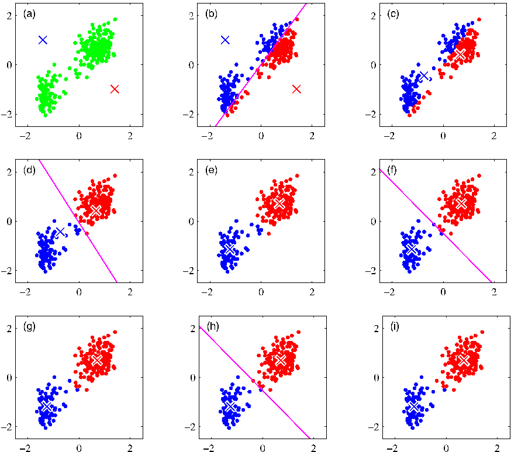
[Page 447]

Figure 9.2 Plot of the cost function $J$ given by (9.1) after each E step (blue points) and M step (red points) of the $K$-means algorithm for the example shown in Figure 9.1. The algorithm has converged after the third M step, and the final EM cycle produces no changes in either the assignments or the prototype vectors.

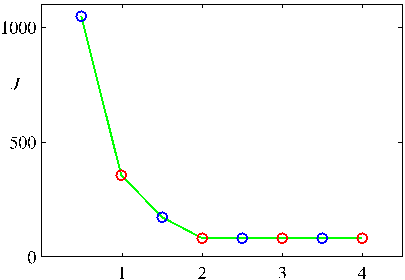

case, the assignment of each data point to the nearest cluster centre is equivalent to a classification of the data points according to which side they lie of the perpendicular bisector of the two cluster centres. A plot of the cost function $J$ given by (9.1) for the Old Faithful example is shown in Figure 9.2.

Note that we have deliberately chosen poor initial values for the cluster centres so that the algorithm takes several steps before convergence. In practice, a better initialization procedure would be to choose the cluster centres $\boldsymbol{\mu}_k$ to be equal to a random subset of $K$ data points. It is also worth noting that the $K$-means algorithm itself is often used to initialize the parameters in a Gaussian mixture model before applying the EM algorithm.

A direct implementation of the $K$-means algorithm as discussed here can be relatively slow, because in each E step it is necessary to compute the Euclidean distance between every prototype vector and every data point. Various schemes have been proposed for speeding up the $K$-means algorithm, some of which are based on precomputing a data structure such as a tree such that nearby points are in the same subtree (Ramasubramanian and Paliwal, 1990; Moore, 2000). Other approaches make use of the triangle inequality for distances, thereby avoiding unnecessary distance calculations (Hodgson, 1998; Elkan, 2003).

So far, we have considered a batch version of $K$-means in which the whole data set is used together to update the prototype vectors. We can also derive an on-line stochastic algorithm (MacQueen, 1967) by applying the Robbins-Monro procedure to the problem of finding the roots of the regression function given by the derivatives of $J$ in (9.1) with respect to $\boldsymbol{\mu}_k$. This leads to a sequential update in which, for each data point $\mathbf{x}_n$ in turn, we update the nearest prototype $\boldsymbol{\mu}_k$ using

$$
\boldsymbol{\mu}_k^{\text{new}} = \boldsymbol{\mu}_k^{\text{old}} + \eta_n(\mathbf{x}_n - \boldsymbol{\mu}_k^{\text{old}}) \tag{9.5}
$$

where $\eta_n$ is the learning rate parameter, which is typically made to decrease monotonically as more data points are considered.

The $K$-means algorithm is based on the use of squared Euclidean distance as the measure of dissimilarity between a data point and a prototype vector. Not only does this limit the type of data variables that can be considered (it would be inappropriate for cases where some or all of the variables represent categorical labels for instance),
[Page 448]

but it can also make the determination of the cluster means nonrobust to outliers. We can generalize the $K$-means algorithm by introducing a more general dissimilarity measure $\mathcal{V}(\mathbf{x}, \mathbf{x}')$ between two vectors $\mathbf{x}$ and $\mathbf{x}'$ and then minimizing the following distortion measure

$$
\widetilde{J} = \sum_{n=1}^N \sum_{k=1}^K r_{nk} \mathcal{V}(\mathbf{x}_n, \boldsymbol{\mu}_k) \tag{9.6}
$$

which gives the $K$-medoids algorithm. The E step again involves, for given cluster prototypes $\boldsymbol{\mu}_k$, assigning each data point to the cluster for which the dissimilarity to the corresponding prototype is smallest. The computational cost of this is $O(KN)$, as is the case for the standard $K$-means algorithm. For a general choice of dissimilarity measure, the M step is potentially more complex than for $K$-means, and so it is common to restrict each cluster prototype to be equal to one of the data vectors assigned to that cluster, as this allows the algorithm to be implemented for any choice of dissimilarity measure $\mathcal{V}(\cdot, \cdot)$ so long as it can be readily evaluated. Thus the M step involves, for each cluster $k$, a discrete search over the $N_k$ points assigned to that cluster, which requires $O(N_k^2)$ evaluations of $\mathcal{V}(\cdot, \cdot)$.

One notable feature of the $K$-means algorithm is that at each iteration, every data point is assigned uniquely to one, and only one, of the clusters. Whereas some data points will be much closer to a particular centre $\boldsymbol{\mu}_k$ than to any other centre, there may be other data points that lie roughly midway between cluster centres. In the latter case, it is not clear that the hard assignment to the nearest cluster is the most appropriate. We shall see in the next section that by adopting a probabilistic approach, we obtain ‘soft’ assignments of data points to clusters in a way that reflects the level of uncertainty over the most appropriate assignment. This probabilistic formulation brings with it numerous benefits.

## 9.1.1 Image segmentation and compression

As an illustration of the application of the $K$-means algorithm, we consider the related problems of image segmentation and image compression. The goal of segmentation is to partition an image into regions each of which has a reasonably homogeneous visual appearance or which corresponds to objects or parts of objects (Forsyth and Ponce, 2003). Each pixel in an image is a point in a 3-dimensional space comprising the intensities of the red, blue, and green channels, and our segmentation algorithm simply treats each pixel in the image as a separate data point. Note that strictly this space is not Euclidean because the channel intensities are bounded by the interval $[0, 1]$. Nevertheless, we can apply the $K$-means algorithm without difficulty. We illustrate the result of running $K$-means to convergence, for any particular value of $K$, by re-drawing the image replacing each pixel vector with the $\{R, G, B\}$ intensity triplet given by the centre $\boldsymbol{\mu}_k$ to which that pixel has been assigned. Results for various values of $K$ are shown in Figure 9.3. We see that for a given value of $K$, the algorithm is representing the image using a palette of only $K$ colours. It should be emphasized that this use of $K$-means is not a particularly sophisticated approach to image segmentation, not least because it takes no account of the spatial proximity of different pixels. The image segmentation problem is in general extremely difficult
[Page 449]

Figure 9.3 Two examples of the application of the $K$-means clustering algorithm to image segmentation showing the initial images together with their $K$-means segmentations obtained using various values of $K$. This also illustrates of the use of vector quantization for data compression, in which smaller values of $K$ give higher compression at the expense of poorer image quality.

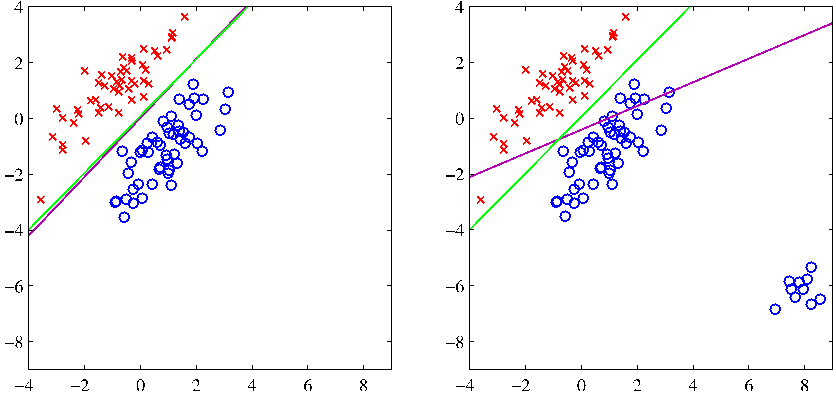
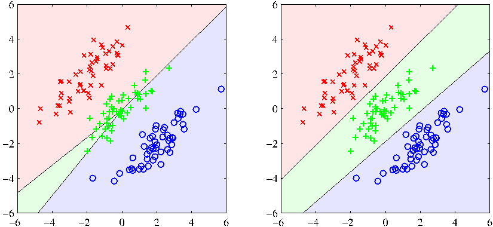
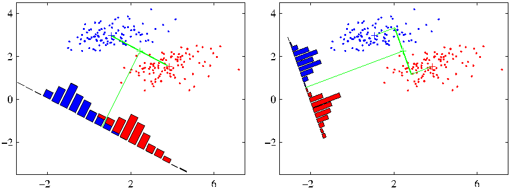

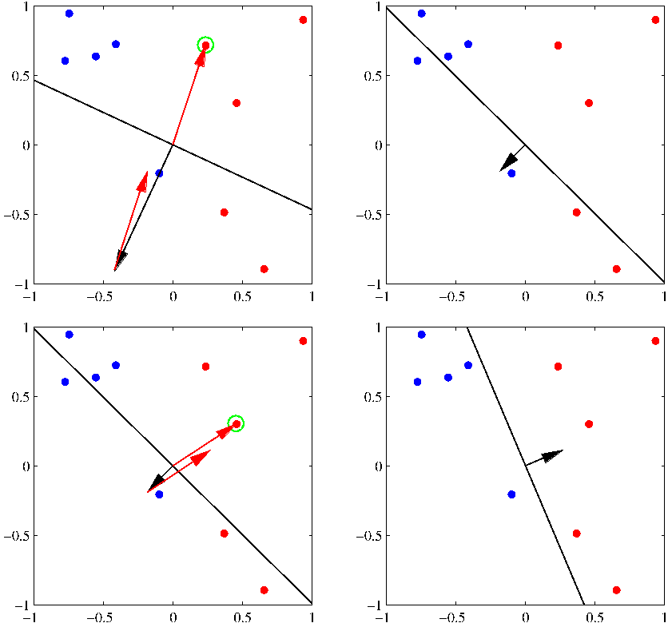

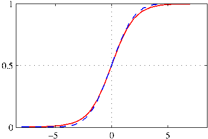

and remains the subject of active research and is introduced here simply to illustrate the behaviour of the $K$-means algorithm.

We can also use the result of a clustering algorithm to perform data compression. It is important to distinguish between lossless data compression, in which the goal is to be able to reconstruct the original data exactly from the compressed representation, and lossy data compression, in which we accept some errors in the reconstruction in return for higher levels of compression than can be achieved in the lossless case. We can apply the $K$-means algorithm to the problem of lossy data compression as follows. For each of the $N$ data points, we store only the identity $k$ of the cluster to which it is assigned. We also store the values of the $K$ cluster centres $\boldsymbol{\mu}_k$, which typically requires significantly less data, provided we choose $K \ll N$. Each data point is then approximated by its nearest centre $\boldsymbol{\mu}_k$. New data points can similarly be compressed by first finding the nearest $\boldsymbol{\mu}_k$ and then storing the label $k$ instead of the original data vector. This framework is often called vector quantization, and the vectors $\boldsymbol{\mu}_k$ are called code-book vectors.
[Page 450]

The image segmentation problem discussed above also provides an illustration of the use of clustering for data compression. Suppose the original image has $N$ pixels comprising $\{R, G, B\}$ values each of which is stored with 8 bits of precision. Then to transmit the whole image directly would cost $24N$ bits. Now suppose we first run $K$-means on the image data, and then instead of transmitting the original pixel intensity vectors we transmit the identity of the nearest vector $\boldsymbol{\mu}_k$. Because there are $K$ such vectors, this requires $\log_2 K$ bits per pixel. We must also transmit the $K$ code book vectors $\boldsymbol{\mu}_k$, which requires $24K$ bits, and so the total number of bits required to transmit the image is $24K + N \log_2 K$ (rounding up to the nearest integer). The original image shown in Figure 9.3 has $240 \times 180 = 43,200$ pixels and so requires $24 \times 43,200 = 1,036,800$ bits to transmit directly. By comparison, the compressed images require $43,248$ bits ($K = 2$), $86,472$ bits ($K = 3$), and $173,040$ bits ($K = 10$), respectively, to transmit. These represent compression ratios compared to the original image of $4.2\%$, $8.3\%$, and $16.7\%$, respectively. We see that there is a trade-off between degree of compression and image quality. Note that our aim in this example is to illustrate the $K$-means algorithm. If we had been aiming to produce a good image compressor, then it would be more fruitful to consider small blocks of adjacent pixels, for instance $5 \times 5$, and thereby exploit the correlations that exist in natural images between nearby pixels.

## 9.2. Mixtures of Gaussians

In Section 2.3.9 we motivated the Gaussian mixture model as a simple linear superposition of Gaussian components, aimed at providing a richer class of density models than the single Gaussian. We now turn to a formulation of Gaussian mixtures in terms of discrete latent variables. This will provide us with a deeper insight into this important distribution, and will also serve to motivate the expectation-maximization algorithm.

Recall from (2.188) that the Gaussian mixture distribution can be written as a linear superposition of Gaussians in the form

$$
p(\mathbf{x}) = \sum_{k=1}^K \pi_k \mathcal{N}(\mathbf{x}|\boldsymbol{\mu}_k, \boldsymbol{\Sigma}_k). \tag{9.7}
$$

Let us introduce a $K$-dimensional binary random variable $\mathbf{z}$ having a 1-of-$K$ representation in which a particular element $z_k$ is equal to 1 and all other elements are equal to 0. The values of $z_k$ therefore satisfy $z_k \in \{0, 1\}$ and $\sum_k z_k = 1$, and we see that there are $K$ possible states for the vector $\mathbf{z}$ according to which element is nonzero. We shall define the joint distribution $p(\mathbf{x}, \mathbf{z})$ in terms of a marginal distribution $p(\mathbf{z})$ and a conditional distribution $p(\mathbf{x}|\mathbf{z})$, corresponding to the graphical model in Figure 9.4. The marginal distribution over $\mathbf{z}$ is specified in terms of the mixing coefficients $\pi_k$, such that

$$
p(z_k = 1) = \pi_k
$$

[Page 451]

Figure 9.4 Graphical representation of a mixture model, in which the joint distribution is expressed in the form $p(\mathbf{x}, \mathbf{z}) = p(\mathbf{z})p(\mathbf{x}|\mathbf{z})$.

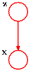

where the parameters $\{\pi_k\}$ must satisfy

$$
0 \le \pi_k \le 1 \tag{9.8}
$$

together with

$$
\sum_{k=1}^K \pi_k = 1 \tag{9.9}
$$

in order to be valid probabilities. Because $\mathbf{z}$ uses a 1-of-$K$ representation, we can also write this distribution in the form

$$
p(\mathbf{z}) = \prod_{k=1}^K \pi_k^{z_k}. \tag{9.10}
$$

Similarly, the conditional distribution of $\mathbf{x}$ given a particular value for $\mathbf{z}$ is a Gaussian

$$
p(\mathbf{x}|z_k = 1) = \mathcal{N}(\mathbf{x}|\boldsymbol{\mu}_k, \boldsymbol{\Sigma}_k)
$$

which can also be written in the form

$$
p(\mathbf{x}|\mathbf{z}) = \prod_{k=1}^K \mathcal{N}(\mathbf{x}|\boldsymbol{\mu}_k, \boldsymbol{\Sigma}_k)^{z_k}. \tag{9.11}
$$

The joint distribution is given by $p(\mathbf{z})p(\mathbf{x}|\mathbf{z})$, and the marginal distribution of $\mathbf{x}$ is then obtained by summing the joint distribution over all possible states of $\mathbf{z}$ to give

$$
p(\mathbf{x}) = \sum_{\mathbf{z}} p(\mathbf{z})p(\mathbf{x}|\mathbf{z}) = \sum_{k=1}^K \pi_k \mathcal{N}(\mathbf{x}|\boldsymbol{\mu}_k, \boldsymbol{\Sigma}_k) \tag{9.12}
$$

where we have made use of (9.10) and (9.11). Thus the marginal distribution of $\mathbf{x}$ is a Gaussian mixture of the form (9.7). If we have several observations $\mathbf{x}_1,\dots,\mathbf{x}_N$, then, because we have represented the marginal distribution in the form $p(\mathbf{x}) = \sum_{\mathbf{z}} p(\mathbf{x}, \mathbf{z})$, it follows that for every observed data point $\mathbf{x}_n$ there is a corresponding latent variable $\mathbf{z}_n$.

We have therefore found an equivalent formulation of the Gaussian mixture involving an explicit latent variable. It might seem that we have not gained much by doing so. However, we are now able to work with the joint distribution $p(\mathbf{x}, \mathbf{z})$
[Page 452]

instead of the marginal distribution $p(\mathbf{x})$, and this will lead to significant simplifications, most notably through the introduction of the expectation-maximization (EM) algorithm.

Another quantity that will play an important role is the conditional probability of $\mathbf{z}$ given $\mathbf{x}$. We shall use $\gamma(z_k)$ to denote $p(z_k = 1|\mathbf{x})$, whose value can be found using Bayes’ theorem

$$
\gamma(z_k) \equiv p(z_k = 1|\mathbf{x}) = \frac{p(z_k = 1)p(\mathbf{x}|z_k = 1)}{\sum_{j=1}^K p(z_j = 1)p(\mathbf{x}|z_j = 1)} = \frac{\pi_k \mathcal{N}(\mathbf{x}|\boldsymbol{\mu}_k, \boldsymbol{\Sigma}_k)}{\sum_{j=1}^K \pi_j \mathcal{N}(\mathbf{x}|\boldsymbol{\mu}_j, \boldsymbol{\Sigma}_j)}. \tag{9.13}
$$

We shall view $\pi_k$ as the prior probability of $z_k = 1$, and the quantity $\gamma(z_k)$ as the corresponding posterior probability once we have observed $\mathbf{x}$. As we shall see later, $\gamma(z_k)$ can also be viewed as the responsibility that component $k$ takes for ‘explaining’ the observation $\mathbf{x}$.

We can use the technique of ancestral sampling to generate random samples distributed according to the Gaussian mixture model. To do this, we first generate a value for $\mathbf{z}$, which we denote $\widehat{\mathbf{z}}$, from the marginal distribution $p(\mathbf{z})$ and then generate a value for $\mathbf{x}$ from the conditional distribution $p(\mathbf{x}|\widehat{\mathbf{z}})$. Techniques for sampling from standard distributions are discussed in Chapter 11. We can depict samples from the joint distribution $p(\mathbf{x}, \mathbf{z})$ by plotting points at the corresponding values of $\mathbf{x}$ and then colouring them according to the value of $\mathbf{z}$, in other words according to which Gaussian component was responsible for generating them, as shown in Figure 9.5(a). Similarly samples from the marginal distribution $p(\mathbf{x})$ are obtained by taking the samples from the joint distribution and ignoring the values of $\mathbf{z}$. These are illustrated in Figure 9.5(b) by plotting the $\mathbf{x}$ values without any coloured labels.

We can also use this synthetic data set to illustrate the ‘responsibilities’ by evaluating, for every data point, the posterior probability for each component in the mixture distribution from which this data set was generated. In particular, we can represent the value of the responsibilities $\gamma(z_{nk})$ associated with data point $\mathbf{x}_n$ by plotting the corresponding point using proportions of red, blue, and green ink given by $\gamma(z_{nk})$ for $k = 1, 2, 3$, respectively, as shown in Figure 9.5(c). So, for instance, a data point for which $\gamma(z_{n1}) = 1$ will be coloured red, whereas one for which $\gamma(z_{n2}) = \gamma(z_{n3}) = 0.5$ will be coloured with equal proportions of blue and green ink and so will appear cyan. This should be compared with Figure 9.5(a) in which the data points were labelled using the true identity of the component from which they were generated.

## 9.2.1 Maximum likelihood

Suppose we have a data set of observations $\{\mathbf{x}_1,\dots,\mathbf{x}_N\}$, and we wish to model this data using a mixture of Gaussians. We can represent this data set as an $N \times D$
[Page 453]

Figure 9.5 Example of 500 points drawn from the mixture of 3 Gaussians shown in Figure 2.23. (a) Samples from the joint distribution $p(\mathbf{z})p(\mathbf{x}|\mathbf{z})$ in which the three states of $\mathbf{z}$, corresponding to the three components of the mixture, are depicted in red, green, and blue, and (b) the corresponding samples from the marginal distribution $p(\mathbf{x})$, which is obtained by simply ignoring the values of $\mathbf{z}$ and just plotting the $\mathbf{x}$ values. The data set in (a) is said to be complete, whereas that in (b) is incomplete. (c) The same samples in which the colours represent the value of the responsibilities $\gamma(z_{nk})$ associated with data point $\mathbf{x}_n$, obtained by plotting the corresponding point using proportions of red, blue, and green ink given by $\gamma(z_{nk})$ for $k = 1, 2, 3$, respectively.

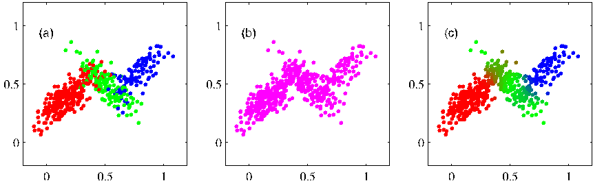

matrix $\mathbf{X}$ in which the $n^{\text{th}}$ row is given by $\mathbf{x}_n^{\text{T}}$. Similarly, the corresponding latent variables will be denoted by an $N \times K$ matrix $\mathbf{Z}$ with rows $\mathbf{z}_n^{\text{T}}$. If we assume that the data points are drawn independently from the distribution, then we can express the Gaussian mixture model for this i.i.d. data set using the graphical representation shown in Figure 9.6. From (9.7) the log of the likelihood function is given by

$$
\ln p(\mathbf{X}|\boldsymbol{\pi}, \boldsymbol{\mu}, \boldsymbol{\Sigma}) = \sum_{n=1}^N \ln \left\{ \sum_{k=1}^K \pi_k \mathcal{N}(\mathbf{x}_n|\boldsymbol{\mu}_k, \boldsymbol{\Sigma}_k) \right\}. \tag{9.14}
$$

Before discussing how to maximize this function, it is worth emphasizing that there is a significant problem associated with the maximum likelihood framework applied to Gaussian mixture models, due to the presence of singularities. For simplicity, consider a Gaussian mixture whose components have covariance matrices given by $\boldsymbol{\Sigma}_k = \sigma_k^2 \mathbf{I}$, where $\mathbf{I}$ is the unit matrix, although the conclusions will hold for general covariance matrices. Suppose that one of the components of the mixture model, let us say the $j^{\text{th}}$ component, has its mean $\boldsymbol{\mu}_j$ exactly equal to one of the data

Figure 9.6 Graphical representation of a Gaussian mixture model for a set of $N$ i.i.d. data points $\{\mathbf{x}_n\}$, with corresponding latent points $\{\mathbf{z}_n\}$, where $n = 1, \dots, N$.

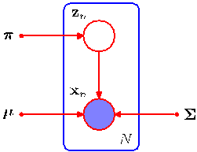
[Page 454]

Figure 9.7 Illustration of how singularities in the likelihood function arise with mixtures of Gaussians. This should be compared with the case of a single Gaussian shown in Figure 1.14 for which no singularities arise.

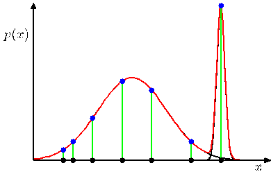

points so that $\boldsymbol{\mu}_j = \mathbf{x}_n$ for some value of $n$. This data point will then contribute a term in the likelihood function of the form

$$
\mathcal{N}(\mathbf{x}_n|\mathbf{x}_n, \sigma_j^2 \mathbf{I}) = \frac{1}{(2\pi)^{1/2}} \frac{1}{\sigma_j}. \tag{9.15}
$$

If we consider the limit $\sigma_j \to 0$, then we see that this term goes to infinity and so the log likelihood function will also go to infinity. Thus the maximization of the log likelihood function is not a well posed problem because such singularities will always be present and will occur whenever one of the Gaussian components ‘collapses’ onto a specific data point. Recall that this problem did not arise in the case of a single Gaussian distribution. To understand the difference, note that if a single Gaussian collapses onto a data point it will contribute multiplicative factors to the likelihood function arising from the other data points and these factors will go to zero exponentially fast, giving an overall likelihood that goes to zero rather than infinity. However, once we have (at least) two components in the mixture, one of the components can have a finite variance and therefore assign finite probability to all of the data points while the other component can shrink onto one specific data point and thereby contribute an ever increasing additive value to the log likelihood. This is illustrated in Figure 9.7. These singularities provide another example of the severe over-fitting that can occur in a maximum likelihood approach. We shall see that this difficulty does not occur if we adopt a Bayesian approach. For the moment, however, we simply note that in applying maximum likelihood to Gaussian mixture models we must take steps to avoid finding such pathological solutions and instead seek local maxima of the likelihood function that are well behaved. We can hope to avoid the singularities by using suitable heuristics, for instance by detecting when a Gaussian component is collapsing and resetting its mean to a randomly chosen value while also resetting its covariance to some large value, and then continuing with the optimization.

A further issue in finding maximum likelihood solutions arises from the fact that for any given maximum likelihood solution, a $K$-component mixture will have a total of $K!$ equivalent solutions corresponding to the $K!$ ways of assigning $K$ sets of parameters to $K$ components. In other words, for any given (nondegenerate) point in the space of parameter values there will be a further $K! - 1$ additional points all of which give rise to exactly the same distribution. This problem is known as
[Page 455]

identifiability (Casella and Berger, 2002) and is an important issue when we wish to interpret the parameter values discovered by a model. Identifiability will also arise when we discuss models having continuous latent variables in Chapter 12. However, for the purposes of finding a good density model, it is irrelevant because any of the equivalent solutions is as good as any other.

Maximizing the log likelihood function (9.14) for a Gaussian mixture model turns out to be a more complex problem than for the case of a single Gaussian. The difficulty arises from the presence of the summation over $k$ that appears inside the logarithm in (9.14), so that the logarithm function no longer acts directly on the Gaussian. If we set the derivatives of the log likelihood to zero, we will no longer obtain a closed form solution, as we shall see shortly.

One approach is to apply gradient-based optimization techniques (Fletcher, 1987; Nocedal and Wright, 1999; Bishop and Nabney, 2008). Although gradient-based techniques are feasible, and indeed will play an important role when we discuss mixture density networks in Chapter 5, we now consider an alternative approach known as the EM algorithm which has broad applicability and which will lay the foundations for a discussion of variational inference techniques in Chapter 10.

## 9.2.2 EM for Gaussian mixtures

An elegant and powerful method for finding maximum likelihood solutions for models with latent variables is called the expectation-maximization algorithm, or EM algorithm (Dempster et al., 1977; McLachlan and Krishnan, 1997). Later we shall give a general treatment of EM, and we shall also show how EM can be generalized to obtain the variational inference framework. Initially, we shall motivate the EM algorithm by giving a relatively informal treatment in the context of the Gaussian mixture model. We emphasize, however, that EM has broad applicability, and indeed it will be encountered in the context of a variety of different models in this book.

Let us begin by writing down the conditions that must be satisfied at a maximum of the likelihood function. Setting the derivatives of $\ln p(\mathbf{X}|\boldsymbol{\pi}, \boldsymbol{\mu}, \boldsymbol{\Sigma})$ in (9.14) with respect to the means $\boldsymbol{\mu}_k$ of the Gaussian components to zero, we obtain

$$
0 = - \sum_{n=1}^N \underbrace{\frac{\pi_k \mathcal{N}(\mathbf{x}_n|\boldsymbol{\mu}_k, \boldsymbol{\Sigma}_k)}{\sum_j \pi_j \mathcal{N}(\mathbf{x}_n|\boldsymbol{\mu}_j, \boldsymbol{\Sigma}_j)}}_{\gamma(z_{nk})} \boldsymbol{\Sigma}_k^{-1} (\mathbf{x}_n - \boldsymbol{\mu}_k) \tag{9.16}
$$

where we have made use of the form (2.43) for the Gaussian distribution. Note that the posterior probabilities, or responsibilities, given by (9.13) appear naturally on the right-hand side. Multiplying by $\boldsymbol{\Sigma}_k$ (which we assume to be nonsingular) and rearranging we obtain

$$
\boldsymbol{\mu}_k = \frac{1}{N_k} \sum_{n=1}^N \gamma(z_{nk})\mathbf{x}_n \tag{9.17}
$$

where we have defined

$$
N_k = \sum_{n=1}^N \gamma(z_{nk}). \tag{9.18}
$$

[Page 456]

We can interpret $N_k$ as the effective number of points assigned to cluster $k$. Note carefully the form of this solution. We see that the mean $\boldsymbol{\mu}_k$ for the $k^{\text{th}}$ Gaussian component is obtained by taking a weighted mean of all of the points in the data set, in which the weighting factor for data point $\mathbf{x}_n$ is given by the posterior probability $\gamma(z_{nk})$ that component $k$ was responsible for generating $\mathbf{x}_n$.

If we set the derivative of $\ln p(\mathbf{X}|\boldsymbol{\pi}, \boldsymbol{\mu}, \boldsymbol{\Sigma})$ with respect to $\boldsymbol{\Sigma}_k$ to zero, and follow a similar line of reasoning, making use of the result for the maximum likelihood solution for the covariance matrix of a single Gaussian, we obtain

$$
\boldsymbol{\Sigma}_k = \frac{1}{N_k} \sum_{n=1}^N \gamma(z_{nk})(\mathbf{x}_n - \boldsymbol{\mu}_k)(\mathbf{x}_n - \boldsymbol{\mu}_k)^{\text{T}} \tag{9.19}
$$

which has the same form as the corresponding result for a single Gaussian fitted to the data set, but again with each data point weighted by the corresponding posterior probability and with the denominator given by the effective number of points associated with the corresponding component.

Finally, we maximize $\ln p(\mathbf{X}|\boldsymbol{\pi}, \boldsymbol{\mu}, \boldsymbol{\Sigma})$ with respect to the mixing coefficients $\pi_k$. Here we must take account of the constraint (9.9), which requires the mixing coefficients to sum to one. This can be achieved using a Lagrange multiplier and maximizing the following quantity

$$
\ln p(\mathbf{X}|\boldsymbol{\pi}, \boldsymbol{\mu}, \boldsymbol{\Sigma}) + \lambda \left( \sum_{k=1}^K \pi_k - 1 \right) \tag{9.20}
$$

which gives

$$
0 = \sum_{n=1}^N \frac{\mathcal{N}(\mathbf{x}_n|\boldsymbol{\mu}_k, \boldsymbol{\Sigma}_k)}{\sum_j \pi_j \mathcal{N}(\mathbf{x}_n|\boldsymbol{\mu}_j, \boldsymbol{\Sigma}_j)} + \lambda \tag{9.21}
$$

where again we see the appearance of the responsibilities. If we now multiply both sides by $\pi_k$ and sum over $k$ making use of the constraint (9.9), we find $\lambda = -N$. Using this to eliminate $\lambda$ and rearranging we obtain

$$
\pi_k = \frac{N_k}{N} \tag{9.22}
$$

so that the mixing coefficient for the $k^{\text{th}}$ component is given by the average responsibility which that component takes for explaining the data points.

It is worth emphasizing that the results (9.17), (9.19), and (9.22) do not constitute a closed-form solution for the parameters of the mixture model because the responsibilities $\gamma(z_{nk})$ depend on those parameters in a complex way through (9.13). However, these results do suggest a simple iterative scheme for finding a solution to the maximum likelihood problem, which as we shall see turns out to be an instance of the EM algorithm for the particular case of the Gaussian mixture model. We first choose some initial values for the means, covariances, and mixing coefficients. Then we alternate between the following two updates that we shall call the E step
[Page 457]

Figure 9.8 Illustration of the EM algorithm using the Old Faithful set as used for the illustration of the $K$-means algorithm in Figure 9.1. See the text for details.

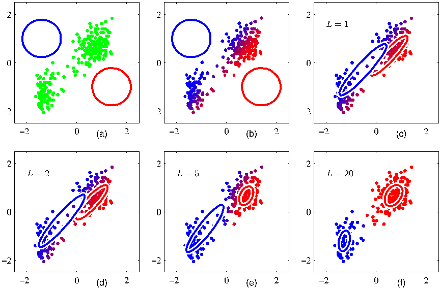

and the M step, for reasons that will become apparent shortly. In the expectation step, or E step, we use the current values for the parameters to evaluate the posterior probabilities, or responsibilities, given by (9.13). We then use these probabilities in the maximization step, or M step, to re-estimate the means, covariances, and mixing coefficients using the results (9.17), (9.19), and (9.22). Note that in so doing we first evaluate the new means using (9.17) and then use these new values to find the covariances using (9.19), in keeping with the corresponding result for a single Gaussian distribution. We shall show that each update to the parameters resulting from an E step followed by an M step is guaranteed to increase the log likelihood function. In practice, the algorithm is deemed to have converged when the change in the log likelihood function, or alternatively in the parameters, falls below some threshold. We illustrate the EM algorithm for a mixture of two Gaussians applied to the rescaled Old Faithful data set in Figure 9.8. Here a mixture of two Gaussians is used, with centres initialized using the same values as for the $K$-means algorithm in Figure 9.1, and with precision matrices initialized to be proportional to the unit matrix. Plot (a) shows the data points in green, together with the initial configuration of the mixture model in which the one standard-deviation contours for the two
[Page 458]

Gaussian components are shown as blue and red circles. Plot (b) shows the result of the initial E step, in which each data point is depicted using a proportion of blue ink equal to the posterior probability of having been generated from the blue component, and a corresponding proportion of red ink given by the posterior probability of having been generated by the red component. Thus, points that have a significant probability for belonging to either cluster appear purple. The situation after the first M step is shown in plot (c), in which the mean of the blue Gaussian has moved to the mean of the data set, weighted by the probabilities of each data point belonging to the blue cluster, in other words it has moved to the centre of mass of the blue ink. Similarly, the covariance of the blue Gaussian is set equal to the covariance of the blue ink. Analogous results hold for the red component. Plots (d), (e), and (f) show the results after 2, 5, and 20 complete cycles of EM, respectively. In plot (f) the algorithm is close to convergence.

Note that the EM algorithm takes many more iterations to reach (approximate) convergence compared with the $K$-means algorithm, and that each cycle requires significantly more computation. It is therefore common to run the $K$-means algorithm in order to find a suitable initialization for a Gaussian mixture model that is subsequently adapted using EM. The covariance matrices can conveniently be initialized to the sample covariances of the clusters found by the $K$-means algorithm, and the mixing coefficients can be set to the fractions of data points assigned to the respective clusters. As with gradient-based approaches for maximizing the log likelihood, techniques must be employed to avoid singularities of the likelihood function in which a Gaussian component collapses onto a particular data point. It should be emphasized that there will generally be multiple local maxima of the log likelihood function, and that EM is not guaranteed to find the largest of these maxima. Because the EM algorithm for Gaussian mixtures plays such an important role, we summarize it below.

## EM for Gaussian Mixtures

Given a Gaussian mixture model, the goal is to maximize the likelihood function with respect to the parameters (comprising the means and covariances of the components and the mixing coefficients).

1. Initialize the means $\boldsymbol{\mu}_k$, covariances $\boldsymbol{\Sigma}_k$ and mixing coefficients $\pi_k$, and evaluate the initial value of the log likelihood.
2. **E step**. Evaluate the responsibilities using the current parameter values

$$
\gamma(z_{nk}) = \frac{\pi_k \mathcal{N}(\mathbf{x}_n|\boldsymbol{\mu}_k, \boldsymbol{\Sigma}_k)}{\sum_{j=1}^K \pi_j \mathcal{N}(\mathbf{x}_n|\boldsymbol{\mu}_j, \boldsymbol{\Sigma}_j)}. \tag{9.23}
$$

[Page 459]

3. **M step**. Re-estimate the parameters using the current responsibilities

$$
\boldsymbol{\mu}_k^{\text{new}} = \frac{1}{N_k} \sum_{n=1}^N \gamma(z_{nk}) \mathbf{x}_n \tag{9.24}
$$

$$
\boldsymbol{\Sigma}_k^{\text{new}} = \frac{1}{N_k} \sum_{n=1}^N \gamma(z_{nk}) (\mathbf{x}_n - \boldsymbol{\mu}_k^{\text{new}})(\mathbf{x}_n - \boldsymbol{\mu}_k^{\text{new}})^{\text{T}} \tag{9.25}
$$

$$
\pi_k^{\text{new}} = \frac{N_k}{N} \tag{9.26}
$$

where

$$
N_k = \sum_{n=1}^N \gamma(z_{nk}). \tag{9.27}
$$

4. Evaluate the log likelihood

$$
\ln p(\mathbf{X}|\boldsymbol{\mu}, \boldsymbol{\Sigma}, \boldsymbol{\pi}) = \sum_{n=1}^N \ln \left\{ \sum_{k=1}^K \pi_k \mathcal{N}(\mathbf{x}_n|\boldsymbol{\mu}_k, \boldsymbol{\Sigma}_k) \right\} \tag{9.28}
$$

and check for convergence of either the parameters or the log likelihood. If the convergence criterion is not satisfied return to step 2.

## 9.3. An Alternative View of EM

In this section, we present a complementary view of the EM algorithm that recognizes the key role played by latent variables. We discuss this approach first of all in an abstract setting, and then for illustration we consider once again the case of Gaussian mixtures.

The goal of the EM algorithm is to find maximum likelihood solutions for models having latent variables. We denote the set of all observed data by $\mathbf{X}$, in which the $n^{\text{th}}$ row represents $\mathbf{x}_n^{\text{T}}$, and similarly we denote the set of all latent variables by $\mathbf{Z}$, with a corresponding row $\mathbf{z}_n^{\text{T}}$. The set of all model parameters is denoted by $\boldsymbol{\theta}$, and so the log likelihood function is given by

$$
\ln p(\mathbf{X}|\boldsymbol{\theta}) = \ln \left\{ \sum_{\mathbf{Z}} p(\mathbf{X}, \mathbf{Z}|\boldsymbol{\theta}) \right\}. \tag{9.29}
$$

Note that our discussion will apply equally well to continuous latent variables simply by replacing the sum over $\mathbf{Z}$ with an integral.

A key observation is that the summation over the latent variables appears inside the logarithm. Even if the joint distribution $p(\mathbf{X}, \mathbf{Z}|\boldsymbol{\theta})$ belongs to the exponential
[Page 460]

family, the marginal distribution $p(\mathbf{X}|\boldsymbol{\theta})$ typically does not as a result of this summation. The presence of the sum prevents the logarithm from acting directly on the joint distribution, resulting in complicated expressions for the maximum likelihood solution.

Now suppose that, for each observation in $\mathbf{X}$, we were told the corresponding value of the latent variable $\mathbf{Z}$. We shall call $\{\mathbf{X}, \mathbf{Z}\}$ the complete data set, and we shall refer to the actual observed data $\mathbf{X}$ as incomplete, as illustrated in Figure 9.5. The likelihood function for the complete data set simply takes the form $\ln p(\mathbf{X}, \mathbf{Z}|\boldsymbol{\theta})$, and we shall suppose that maximization of this complete-data log likelihood function is straightforward.

In practice, however, we are not given the complete data set $\{\mathbf{X}, \mathbf{Z}\}$, but only the incomplete data $\mathbf{X}$. Our state of knowledge of the values of the latent variables in $\mathbf{Z}$ is given only by the posterior distribution $p(\mathbf{Z}|\mathbf{X}, \boldsymbol{\theta})$. Because we cannot use the complete-data log likelihood, we consider instead its expected value under the posterior distribution of the latent variable, which corresponds (as we shall see) to the E step of the EM algorithm. In the subsequent M step, we maximize this expectation. If the current estimate for the parameters is denoted $\boldsymbol{\theta}^{\text{old}}$, then a pair of successive E and M steps gives rise to a revised estimate $\boldsymbol{\theta}^{\text{new}}$. The algorithm is initialized by choosing some starting value for the parameters $\boldsymbol{\theta}_0$. The use of the expectation may seem somewhat arbitrary. However, we shall see the motivation for this choice when we give a deeper treatment of EM in Section 9.4.

In the E step, we use the current parameter values $\boldsymbol{\theta}^{\text{old}}$ to find the posterior distribution of the latent variables given by $p(\mathbf{Z}|\mathbf{X}, \boldsymbol{\theta}^{\text{old}})$. We then use this posterior distribution to find the expectation of the complete-data log likelihood evaluated for some general parameter value $\boldsymbol{\theta}$. This expectation, denoted $\mathcal{Q}(\boldsymbol{\theta}, \boldsymbol{\theta}^{\text{old}})$, is given by

$$
\mathcal{Q}(\boldsymbol{\theta}, \boldsymbol{\theta}^{\text{old}}) = \sum_{\mathbf{Z}} p(\mathbf{Z}|\mathbf{X}, \boldsymbol{\theta}^{\text{old}}) \ln p(\mathbf{X}, \mathbf{Z}|\boldsymbol{\theta}). \tag{9.30}
$$

In the M step, we determine the revised parameter estimate $\boldsymbol{\theta}^{\text{new}}$ by maximizing this function

$$
\boldsymbol{\theta}^{\text{new}} = \arg \max_{\boldsymbol{\theta}} \mathcal{Q}(\boldsymbol{\theta}, \boldsymbol{\theta}^{\text{old}}). \tag{9.31}
$$

Note that in the definition of $\mathcal{Q}(\boldsymbol{\theta}, \boldsymbol{\theta}^{\text{old}})$, the logarithm acts directly on the joint distribution $p(\mathbf{X}, \mathbf{Z}|\boldsymbol{\theta})$, and so the corresponding M-step maximization will, by supposition, be tractable.

The general EM algorithm is summarized below. It has the property, as we shall show later, that each cycle of EM will increase the incomplete-data log likelihood (unless it is already at a local maximum).

## The General EM Algorithm

Given a joint distribution $p(\mathbf{X}, \mathbf{Z}|\boldsymbol{\theta})$ over observed variables $\mathbf{X}$ and latent variables $\mathbf{Z}$, governed by parameters $\boldsymbol{\theta}$, the goal is to maximize the likelihood function $p(\mathbf{X}|\boldsymbol{\theta})$ with respect to $\boldsymbol{\theta}$.

1. Choose an initial setting for the parameters $\boldsymbol{\theta}^{\text{old}}$.
   [Page 461]

2. **E step** Evaluate $p(\mathbf{Z}|\mathbf{X}, \boldsymbol{\theta}^{\text{old}})$.
3. **M step** Evaluate $\boldsymbol{\theta}^{\text{new}}$ given by

$$
\boldsymbol{\theta}^{\text{new}} = \arg \max_{\boldsymbol{\theta}} \mathcal{Q}(\boldsymbol{\theta}, \boldsymbol{\theta}^{\text{old}}) \tag{9.32}
$$

where

$$
\mathcal{Q}(\boldsymbol{\theta}, \boldsymbol{\theta}^{\text{old}}) = \sum_{\mathbf{Z}} p(\mathbf{Z}|\mathbf{X}, \boldsymbol{\theta}^{\text{old}}) \ln p(\mathbf{X}, \mathbf{Z}|\boldsymbol{\theta}). \tag{9.33}
$$

4. Check for convergence of either the log likelihood or the parameter values. If the convergence criterion is not satisfied, then let

$$
\boldsymbol{\theta}^{\text{old}} \leftarrow \boldsymbol{\theta}^{\text{new}} \tag{9.34}
$$

and return to step 2.

The EM algorithm can also be used to find MAP (maximum posterior) solutions for models in which a prior $p(\boldsymbol{\theta})$ is defined over the parameters. In this case the E step remains the same as in the maximum likelihood case, whereas in the M step the quantity to be maximized is given by $\mathcal{Q}(\boldsymbol{\theta}, \boldsymbol{\theta}^{\text{old}}) + \ln p(\boldsymbol{\theta})$. Suitable choices for the prior will remove the singularities of the kind illustrated in Figure 9.7.

Here we have considered the use of the EM algorithm to maximize a likelihood function when there are discrete latent variables. However, it can also be applied when the unobserved variables correspond to missing values in the data set. The distribution of the observed values is obtained by taking the joint distribution of all the variables and then marginalizing over the missing ones. EM can then be used to maximize the corresponding likelihood function. We shall show an example of the application of this technique in the context of principal component analysis in Figure 12.11. This will be a valid procedure if the data values are missing at random, meaning that the mechanism causing values to be missing does not depend on the unobserved values. In many situations this will not be the case, for instance if a sensor fails to return a value whenever the quantity it is measuring exceeds some threshold.

## 9.3.1 Gaussian mixtures revisited

We now consider the application of this latent variable view of EM to the specific case of a Gaussian mixture model. Recall that our goal is to maximize the log likelihood function (9.14), which is computed using the observed data set $\mathbf{X}$, and we saw that this was more difficult than for the case of a single Gaussian distribution due to the presence of the summation over $k$ that occurs inside the logarithm. Suppose then that in addition to the observed data set $\mathbf{X}$, we were also given the values of the corresponding discrete variables $\mathbf{Z}$. Recall that Figure 9.5(a) shows a ‘complete’ data set (i.e., one that includes labels showing which component generated each data point) while Figure 9.5(b) shows the corresponding ‘incomplete’ data set. The graphical model for the complete data is shown in Figure 9.9.
[Page 462]

Figure 9.9 This shows the same graph as in Figure 9.6 except that we now suppose that the discrete variables $\mathbf{z}_n$ are observed, as well as the data variables $\mathbf{x}_n$.

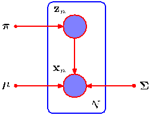

Now consider the problem of maximizing the likelihood for the complete data set $\{\mathbf{X}, \mathbf{Z}\}$. From (9.10) and (9.11), this likelihood function takes the form

$$
p(\mathbf{X}, \mathbf{Z}|\boldsymbol{\mu}, \boldsymbol{\Sigma}, \boldsymbol{\pi}) = \prod_{n=1}^N \prod_{k=1}^K \pi_k^{z_{nk}} \mathcal{N}(\mathbf{x}_n|\boldsymbol{\mu}_k, \boldsymbol{\Sigma}_k)^{z_{nk}} \tag{9.35}
$$

where $z_{nk}$ denotes the $k^{\text{th}}$ component of $\mathbf{z}_n$. Taking the logarithm, we obtain

$$
\ln p(\mathbf{X}, \mathbf{Z}|\boldsymbol{\mu}, \boldsymbol{\Sigma}, \boldsymbol{\pi}) = \sum_{n=1}^N \sum_{k=1}^K z_{nk} \{\ln \pi_k + \ln \mathcal{N}(\mathbf{x}_n|\boldsymbol{\mu}_k, \boldsymbol{\Sigma}_k)\}. \tag{9.36}
$$

Comparison with the log likelihood function (9.14) for the incomplete data shows that the summation over $k$ and the logarithm have been interchanged. The logarithm now acts directly on the Gaussian distribution, which itself is a member of the exponential family. Not surprisingly, this leads to a much simpler solution to the maximum likelihood problem, as we now show. Consider first the maximization with respect to the means and covariances. Because $\mathbf{z}_n$ is a $K$-dimensional vector with all elements equal to 0 except for a single element having the value 1, the complete-data log likelihood function is simply a sum of $K$ independent contributions, one for each mixture component. Thus the maximization with respect to a mean or a covariance is exactly as for a single Gaussian, except that it involves only the subset of data points that are ‘assigned’ to that component. For the maximization with respect to the mixing coefficients, we note that these are coupled for different values of $k$ by virtue of the summation constraint (9.9). Again, this can be enforced using a Lagrange multiplier as before, and leads to the result

$$
\pi_k = \frac{1}{N} \sum_{n=1}^N z_{nk} \tag{9.37}
$$

so that the mixing coefficients are equal to the fractions of data points assigned to the corresponding components.

Thus we see that the complete-data log likelihood function can be maximized trivially in closed form. In practice, however, we do not have values for the latent variables so, as discussed earlier, we consider the expectation, with respect to the posterior distribution of the latent variables, of the complete-data log likelihood.
[Page 463]

Using (9.10) and (9.11) together with Bayes’ theorem, we see that this posterior distribution takes the form

$$
p(\mathbf{Z}|\mathbf{X}, \boldsymbol{\mu}, \boldsymbol{\Sigma}, \boldsymbol{\pi}) \propto \prod_{n=1}^N \prod_{k=1}^K [\pi_k \mathcal{N}(\mathbf{x}_n|\boldsymbol{\mu}_k, \boldsymbol{\Sigma}_k)]^{z_{nk}}. \tag{9.38}
$$

and hence factorizes over $n$ so that under the posterior distribution the $\{\mathbf{z}_n\}$ are independent. This is easily verified by inspection of the directed graph in Figure 9.6 and making use of the d-separation criterion. The expected value of the indicator variable $z_{nk}$ under this posterior distribution is then given by

$$
\mathbb{E}[z_{nk}] = \frac{\sum_{z_{nk}} z_{nk} [\pi_k \mathcal{N}(\mathbf{x}_n|\boldsymbol{\mu}_k, \boldsymbol{\Sigma}_k)]^{z_{nk}}}{\sum_{z_{nj}} [\pi_j \mathcal{N}(\mathbf{x}_n|\boldsymbol{\mu}_j, \boldsymbol{\Sigma}_j)]^{z_{nj}}} = \frac{\pi_k \mathcal{N}(\mathbf{x}_n|\boldsymbol{\mu}_k, \boldsymbol{\Sigma}_k)}{\sum_{j=1}^K \pi_j \mathcal{N}(\mathbf{x}_n|\boldsymbol{\mu}_j, \boldsymbol{\Sigma}_j)} = \gamma(z_{nk}) \tag{9.39}
$$

which is just the responsibility of component $k$ for data point $\mathbf{x}_n$. The expected value of the complete-data log likelihood function is therefore given by

$$
\mathbb{E}_{\mathbf{Z}}[\ln p(\mathbf{X}, \mathbf{Z}|\boldsymbol{\mu}, \boldsymbol{\Sigma}, \boldsymbol{\pi})] = \sum_{n=1}^N \sum_{k=1}^K \gamma(z_{nk}) \{\ln \pi_k + \ln \mathcal{N}(\mathbf{x}_n|\boldsymbol{\mu}_k, \boldsymbol{\Sigma}_k)\}. \tag{9.40}
$$

We can now proceed as follows. First we choose some initial values for the parameters $\boldsymbol{\mu}^{\text{old}}$, $\boldsymbol{\Sigma}^{\text{old}}$ and $\boldsymbol{\pi}^{\text{old}}$, and use these to evaluate the responsibilities (the E step). We then keep the responsibilities fixed and maximize (9.40) with respect to $\boldsymbol{\mu}_k$, $\boldsymbol{\Sigma}_k$ and $\pi_k$ (the M step). This leads to closed form solutions for $\boldsymbol{\mu}^{\text{new}}$, $\boldsymbol{\Sigma}^{\text{new}}$ and $\boldsymbol{\pi}^{\text{new}}$ given by (9.17), (9.19), and (9.22) as before. This is precisely the EM algorithm for Gaussian mixtures as derived earlier. We shall gain more insight into the role of the expected complete-data log likelihood function when we give a proof of convergence of the EM algorithm in Section 9.4.

## 9.3.2 Relation to K-means

Comparison of the $K$-means algorithm with the EM algorithm for Gaussian mixtures shows that there is a close similarity. Whereas the $K$-means algorithm performs a hard assignment of data points to clusters, in which each data point is associated uniquely with one cluster, the EM algorithm makes a soft assignment based on the posterior probabilities. In fact, we can derive the $K$-means algorithm as a particular limit of EM for Gaussian mixtures as follows.

Consider a Gaussian mixture model in which the covariance matrices of the mixture components are given by $\epsilon\mathbf{I}$, where $\epsilon$ is a variance parameter that is shared
[Page 464]

by all of the components, and $\mathbf{I}$ is the identity matrix, so that

$$
p(\mathbf{x}|\boldsymbol{\mu}_k, \boldsymbol{\Sigma}_k) = \frac{1}{(2\pi \epsilon)^{1/2}} \exp \left\{ -\frac{1}{2\epsilon} \|\mathbf{x} - \boldsymbol{\mu}_k\|^2 \right\}. \tag{9.41}
$$

We now consider the EM algorithm for a mixture of $K$ Gaussians of this form in which we treat $\epsilon$ as a fixed constant, instead of a parameter to be re-estimated. From (9.13) the posterior probabilities, or responsibilities, for a particular data point $\mathbf{x}_n$, are given by

$$
\gamma(z_{nk}) = \frac{\pi_k \exp\{-\|\mathbf{x}_n - \boldsymbol{\mu}_k\|^2 / 2\epsilon\}}{\sum_j \pi_j \exp\{-\|\mathbf{x}_n - \boldsymbol{\mu}_j\|^2 / 2\epsilon\}}. \tag{9.42}
$$

If we consider the limit $\epsilon \to 0$, we see that in the denominator the term for which $\|\mathbf{x}_n - \boldsymbol{\mu}_j\|^2$ is smallest will go to zero most slowly, and hence the responsibilities $\gamma(z_{nk})$ for the data point $\mathbf{x}_n$ all go to zero except for term $j$, for which the responsibility $\gamma(z_{nj})$ will go to unity. Note that this holds independently of the values of the $\pi_k$ so long as none of the $\pi_k$ is zero. Thus, in this limit, we obtain a hard assignment of data points to clusters, just as in the $K$-means algorithm, so that $\gamma(z_{nk}) \to r_{nk}$ where $r_{nk}$ is defined by (9.2). Each data point is thereby assigned to the cluster having the closest mean.

The EM re-estimation equation for the $\boldsymbol{\mu}_k$, given by (9.17), then reduces to the $K$-means result (9.4). Note that the re-estimation formula for the mixing coefficients (9.22) simply re-sets the value of $\pi_k$ to be equal to the fraction of data points assigned to cluster $k$, although these parameters no longer play an active role in the algorithm.

Finally, in the limit $\epsilon \to 0$ the expected complete-data log likelihood, given by (9.40), becomes

$$
\mathbb{E}_{\mathbf{Z}}[\ln p(\mathbf{X}, \mathbf{Z}|\boldsymbol{\mu}, \boldsymbol{\Sigma}, \boldsymbol{\pi})] \to -\frac{1}{2} \sum_{n=1}^N \sum_{k=1}^K r_{nk} \|\mathbf{x}_n - \boldsymbol{\mu}_k\|^2 + \text{const}. \tag{9.43}
$$

Thus we see that in this limit, maximizing the expected complete-data log likelihood is equivalent to minimizing the distortion measure $J$ for the $K$-means algorithm given by (9.1).

Note that the $K$-means algorithm does not estimate the covariances of the clusters but only the cluster means. A hard-assignment version of the Gaussian mixture model with general covariance matrices, known as the elliptical $K$-means algorithm, has been considered by Sung and Poggio (1994).

## 9.3.3 Mixtures of Bernoulli distributions

So far in this chapter, we have focussed on distributions over continuous variables described by mixtures of Gaussians. As a further example of mixture modelling, and to illustrate the EM algorithm in a different context, we now discuss mixtures of discrete binary variables described by Bernoulli distributions. This model is also known as latent class analysis (Lazarsfeld and Henry, 1968; McLachlan and Peel, 2000). As well as being of practical importance in its own right, our discussion of Bernoulli mixtures will also lay the foundation for a consideration of hidden Markov models over discrete variables.
[Page 465]

Consider a set of $D$ binary variables $x_i$, where $i = 1,\dots,D$, each of which is governed by a Bernoulli distribution with parameter $\mu_i$, so that

$$
p(\mathbf{x}|\boldsymbol{\mu}) = \prod_{i=1}^D \mu_i^{x_i} (1 - \mu_i)^{(1 - x_i)} \tag{9.44}
$$

where $\mathbf{x} = (x_1,\dots,x_D)^{\text{T}}$ and $\boldsymbol{\mu} = (\mu_1,\dots,\mu_D)^{\text{T}}$. We see that the individual variables $x_i$ are independent, given $\boldsymbol{\mu}$. The mean and covariance of this distribution are easily seen to be

$$
\mathbb{E}[\mathbf{x}] = \boldsymbol{\mu} \tag{9.45}
$$

$$
\text{cov}[\mathbf{x}] = \text{diag}\{\mu_i(1 - \mu_i)\}. \tag{9.46}
$$

Now let us consider a finite mixture of these distributions given by

$$
p(\mathbf{x}|\boldsymbol{\mu}, \boldsymbol{\pi}) = \sum_{k=1}^K \pi_k p(\mathbf{x}|\boldsymbol{\mu}_k) \tag{9.47}
$$

where $\boldsymbol{\mu} = \{\boldsymbol{\mu}_1,\dots,\boldsymbol{\mu}_K\}$, $\boldsymbol{\pi} = \{\pi_1,\dots,\pi_K\}$, and

$$
p(\mathbf{x}|\boldsymbol{\mu}_k) = \prod_{i=1}^D \mu_{ki}^{x_i} (1 - \mu_{ki})^{(1 - x_i)}. \tag{9.48}
$$

The mean and covariance of this mixture distribution are given by

$$
\mathbb{E}[\mathbf{x}] = \sum_{k=1}^K \pi_k \boldsymbol{\mu}_k \tag{9.49}
$$

$$
\text{cov}[\mathbf{x}] = \sum_{k=1}^K \pi_k \{ \boldsymbol{\Sigma}_k + \boldsymbol{\mu}_k \boldsymbol{\mu}_k^{\text{T}} \} - \mathbb{E}[\mathbf{x}]\mathbb{E}[\mathbf{x}]^{\text{T}} \tag{9.50}
$$

where $\boldsymbol{\Sigma}_k = \text{diag} \{\mu_{ki}(1 - \mu_{ki})\}$. Because the covariance matrix $\text{cov}[\mathbf{x}]$ is no longer diagonal, the mixture distribution can capture correlations between the variables, unlike a single Bernoulli distribution.

If we are given a data set $\mathbf{X} = \{\mathbf{x}_1,\dots,\mathbf{x}_N\}$ then the log likelihood function for this model is given by

$$
\ln p(\mathbf{X}|\boldsymbol{\mu}, \boldsymbol{\pi}) = \sum_{n=1}^N \ln \left\{ \sum_{k=1}^K \pi_k p(\mathbf{x}_n|\boldsymbol{\mu}_k) \right\}. \tag{9.51}
$$

Again we see the appearance of the summation inside the logarithm, so that the maximum likelihood solution no longer has closed form.

We now derive the EM algorithm for maximizing the likelihood function for the mixture of Bernoulli distributions. To do this, we first introduce an explicit latent
[Page 466]

variable $\mathbf{z}$ associated with each instance of $\mathbf{x}$. As in the case of the Gaussian mixture, $\mathbf{z} = (z_1,\dots,z_K)^{\text{T}}$ is a binary $K$-dimensional variable having a single component equal to 1, with all other components equal to 0. We can then write the conditional distribution of $\mathbf{x}$, given the latent variable, as

$$
p(\mathbf{x}|\mathbf{z}, \boldsymbol{\mu}) = \prod_{k=1}^K p(\mathbf{x}|\boldsymbol{\mu}_k)^{z_k} \tag{9.52}
$$

while the prior distribution for the latent variables is the same as for the mixture of Gaussians model, so that

$$
p(\mathbf{z}|\boldsymbol{\pi}) = \prod_{k=1}^K \pi_k^{z_k}. \tag{9.53}
$$

If we form the product of $p(\mathbf{x}|\mathbf{z}, \boldsymbol{\mu})$ and $p(\mathbf{z}|\boldsymbol{\pi})$ and then marginalize over $\mathbf{z}$, then we recover (9.47). In order to derive the EM algorithm, we first write down the complete-data log likelihood function, which is given by

$$
\ln p(\mathbf{X}, \mathbf{Z}|\boldsymbol{\mu}, \boldsymbol{\pi}) = \sum_{n=1}^N \sum_{k=1}^K z_{nk} \left\{ \ln \pi_k + \sum_{i=1}^D [x_{ni} \ln \mu_{ki} + (1 - x_{ni})\ln(1 - \mu_{ki})] \right\} \tag{9.54}
$$

where $\mathbf{X} = \{\mathbf{x}_n\}$ and $\mathbf{Z} = \{\mathbf{z}_n\}$. Next we take the expectation of the complete-data log likelihood with respect to the posterior distribution of the latent variables to give

$$
\mathbb{E}_{\mathbf{Z}}[\ln p(\mathbf{X}, \mathbf{Z}|\boldsymbol{\mu}, \boldsymbol{\pi})] = \sum_{n=1}^N \sum_{k=1}^K \gamma(z_{nk}) \left\{ \ln \pi_k + \sum_{i=1}^D [x_{ni} \ln \mu_{ki} + (1 - x_{ni})\ln(1 - \mu_{ki})] \right\} \tag{9.55}
$$

where $\gamma(z_{nk}) = \mathbb{E}[z_{nk}]$ is the posterior probability, or responsibility, of component $k$ given data point $\mathbf{x}_n$. In the E step, these responsibilities are evaluated using Bayes’ theorem, which takes the form

$$
\gamma(z_{nk}) = \mathbb{E}[z_{nk}] = \frac{\sum_{z_{nk}} z_{nk} [\pi_k p(\mathbf{x}_n|\boldsymbol{\mu}_k)]^{z_{nk}}}{\sum_{z_{nj}} [\pi_j p(\mathbf{x}_n|\boldsymbol{\mu}_j)]^{z_{nj}}} = \frac{\pi_k p(\mathbf{x}_n|\boldsymbol{\mu}_k)}{\sum_{j=1}^K \pi_j p(\mathbf{x}_n|\boldsymbol{\mu}_j)}. \tag{9.56}
$$

[Page 467]

If we consider the sum over $n$ in (9.55), we see that the responsibilities enter only through two terms, which can be written as

$$
N_k = \sum_{n=1}^N \gamma(z_{nk}) \tag{9.57}
$$

$$
\overline{\mathbf{x}}_k = \frac{1}{N_k} \sum_{n=1}^N \gamma(z_{nk}) \mathbf{x}_n \tag{9.58}
$$

where $N_k$ is the effective number of data points associated with component $k$. In the M step, we maximize the expected complete-data log likelihood with respect to the parameters $\boldsymbol{\mu}_k$ and $\boldsymbol{\pi}$. If we set the derivative of (9.55) with respect to $\boldsymbol{\mu}_k$ equal to zero and rearrange the terms, we obtain

$$
\boldsymbol{\mu}_k = \overline{\mathbf{x}}_k. \tag{9.59}
$$

We see that this sets the mean of component $k$ equal to a weighted mean of the data, with weighting coefficients given by the responsibilities that component $k$ takes for data points. For the maximization with respect to $\pi_k$, we need to introduce a Lagrange multiplier to enforce the constraint $\sum_k \pi_k = 1$. Following analogous steps to those used for the mixture of Gaussians, we then obtain

$$
\pi_k = \frac{N_k}{N} \tag{9.60}
$$

which represents the intuitively reasonable result that the mixing coefficient for component $k$ is given by the effective fraction of points in the data set explained by that component.

Note that in contrast to the mixture of Gaussians, there are no singularities in which the likelihood function goes to infinity. This can be seen by noting that the likelihood function is bounded above because $0 \le p(\mathbf{x}_n|\boldsymbol{\mu}_k) \le 1$. There exist singularities at which the likelihood function goes to zero, but these will not be found by EM provided it is not initialized to a pathological starting point, because the EM algorithm always increases the value of the likelihood function, until a local maximum is found. We illustrate the Bernoulli mixture model in Figure 9.10 by using it to model handwritten digits. Here the digit images have been turned into binary vectors by setting all elements whose values exceed 0.5 to 1 and setting the remaining elements to 0. We now fit a data set of $N = 600$ such digits, comprising the digits ‘2’, ‘3’, and ‘4’, with a mixture of $K = 3$ Bernoulli distributions by running 10 iterations of the EM algorithm. The mixing coefficients were initialized to $\pi_k = 1/K$, and the parameters $\mu_{kj}$ were set to random values chosen uniformly in the range $(0.25, 0.75)$ and then normalized to satisfy the constraint that $\sum_j \mu_{kj} = 1$. We see that a mixture of 3 Bernoulli distributions is able to find the three clusters in the data set corresponding to the different digits.

The conjugate prior for the parameters of a Bernoulli distribution is given by the beta distribution, and we have seen that a beta prior is equivalent to introducing
[Page 468]

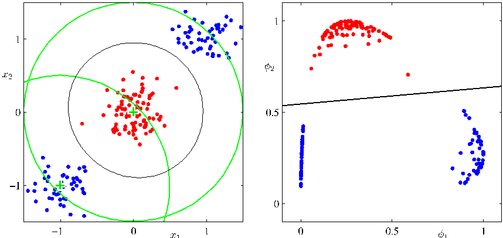
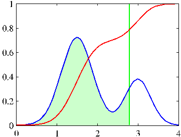
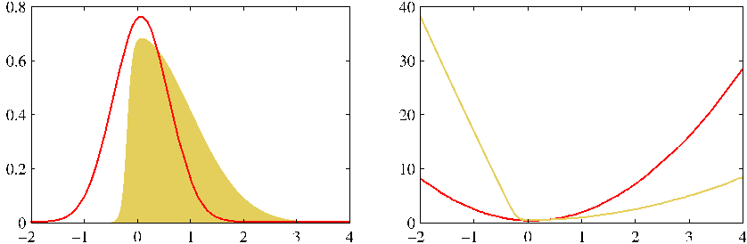

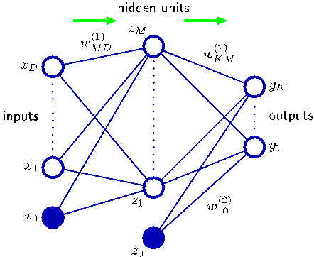
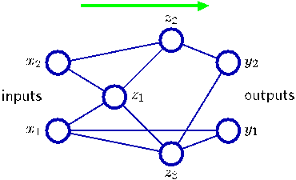
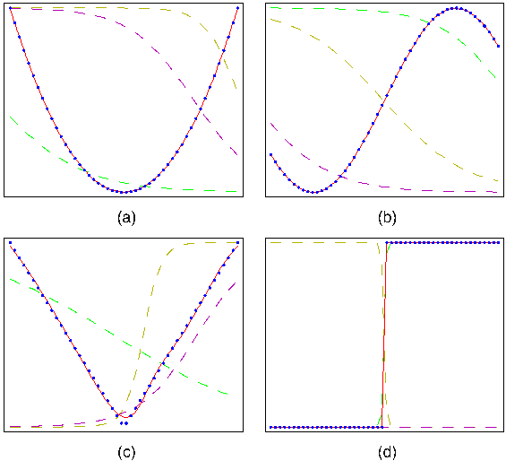
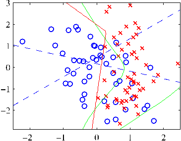

Figure 9.10 Illustration of the Bernoulli mixture model in which the top row shows examples from the digits data set after converting the pixel values from grey scale to binary using a threshold of 0.5. On the bottom row the first three images show the parameters $\mu_{ki}$ for each of the three components in the mixture model. As a comparison, we also fit the same data set using a single multivariate Bernoulli distribution, again using maximum likelihood. This amounts to simply averaging the counts in each pixel and is shown by the right-most image on the bottom row.

additional effective observations of $\mathbf{x}$. We can similarly introduce priors into the Bernoulli mixture model, and use EM to maximize the posterior probability distributions.

It is straightforward to extend the analysis of Bernoulli mixtures to the case of multinomial binary variables having $M > 2$ states by making use of the discrete distribution (2.26). Again, we can introduce Dirichlet priors over the model parameters if desired.

## 9.3.4 EM for Bayesian linear regression

As a third example of the application of EM, we return to the evidence approximation for Bayesian linear regression. In Section 3.5.2, we obtained the reestimation equations for the hyperparameters $\alpha$ and $\beta$ by evaluation of the evidence and then setting the derivatives of the resulting expression to zero. We now turn to an alternative approach for finding $\alpha$ and $\beta$ based on the EM algorithm. Recall that our goal is to maximize the evidence function $p(\mathbf{t}|\alpha,\beta)$ given by (3.77) with respect to $\alpha$ and $\beta$. Because the parameter vector $\mathbf{w}$ is marginalized out, we can regard it as a latent variable, and hence we can optimize this marginal likelihood function using EM. In the E step, we compute the posterior distribution of $\mathbf{w}$ given the current setting of the parameters $\alpha$ and $\beta$ and then use this to find the expected complete-data log likelihood. In the M step, we maximize this quantity with respect to $\alpha$ and $\beta$. We have already derived the posterior distribution of $\mathbf{w}$ because this is given by (3.49). The complete-data log likelihood function is then given by

$$
\ln p(\mathbf{t}, \mathbf{w}|\alpha, \beta) = \ln p(\mathbf{t}|\mathbf{w}, \beta) + \ln p(\mathbf{w}|\alpha) \tag{9.61}
$$

[Page 469]

where the likelihood $p(\mathbf{t}|\mathbf{w},\beta)$ and the prior $p(\mathbf{w}|\alpha)$ are given by (3.10) and (3.52), respectively, and $y(\mathbf{x},\mathbf{w})$ is given by (3.3). Taking the expectation with respect to the posterior distribution of $\mathbf{w}$ then gives

$$
\mathbb{E}[\ln p(\mathbf{t}, \mathbf{w}|\alpha, \beta)] = \frac{M}{2} \ln \left( \frac{\alpha}{2\pi} \right) - \frac{\alpha}{2} \mathbb{E}[\mathbf{w}^{\text{T}}\mathbf{w}] + \frac{N}{2} \ln \left( \frac{\beta}{2\pi} \right) - \frac{\beta}{2} \sum_{n=1}^N \mathbb{E}[(t_n - \mathbf{w}^{\text{T}}\boldsymbol{\phi}_n)^2]. \tag{9.62}
$$

Setting the derivatives with respect to $\alpha$ to zero, we obtain the M step re-estimation equation

$$
\alpha = \frac{M}{\mathbb{E}[\mathbf{w}^{\text{T}}\mathbf{w}]} = \frac{M}{\mathbf{m}_N^{\text{T}}\mathbf{m}_N + \text{Tr}(\mathbf{S}_N)}. \tag{9.63}
$$

An analogous result holds for $\beta$. Note that this re-estimation equation takes a slightly different form from the corresponding result (3.92) derived by direct evaluation of the evidence function. However, they each involve computation and inversion (or eigen decomposition) of an $M \times M$ matrix and hence will have comparable computational cost per iteration.

These two approaches to determining $\alpha$ should of course converge to the same result (assuming they find the same local maximum of the evidence function). This can be verified by first noting that the quantity $\gamma$ is defined by

$$
\gamma = M - \alpha \sum_{i=1}^M \frac{1}{\lambda_i + \alpha} = M - \alpha \text{Tr}(\mathbf{S}_N). \tag{9.64}
$$

At a stationary point of the evidence function, the re-estimation equation (3.92) will be self-consistently satisfied, and hence we can substitute for $\gamma$ to give

$$
\alpha \mathbf{m}_N^{\text{T}}\mathbf{m}_N = \gamma = M - \alpha \text{Tr}(\mathbf{S}_N) \tag{9.65}
$$

and solving for $\alpha$ we obtain (9.63), which is precisely the EM re-estimation equation.

As a final example, we consider a closely related model, namely the relevance vector machine for regression discussed in Section 7.2.1. There we used direct maximization of the marginal likelihood to derive re-estimation equations for the hyperparameters $\boldsymbol{\alpha}$ and $\beta$. Here we consider an alternative approach in which we view the weight vector $\mathbf{w}$ as a latent variable and apply the EM algorithm. The E step involves finding the posterior distribution over the weights, and this is given by (7.81). In the M step we maximize the expected complete-data log likelihood, which is defined by

$$
\mathbb{E}_{\mathbf{w}} [\ln p(\mathbf{t}|\mathbf{X}, \mathbf{w}, \beta) p(\mathbf{w}|\boldsymbol{\alpha})] \tag{9.66}
$$

where the expectation is taken with respect to the posterior distribution computed using the ‘old’ parameter values. To compute the new parameter values we maximize with respect to $\boldsymbol{\alpha}$ and $\beta$ to give
[Page 470]

$$
\alpha_i^{\text{new}} = \frac{1}{m_i^2 + \Sigma_{ii}} \tag{9.67}
$$

$$
(\beta^{\text{new}})^{-1} = \frac{\|\mathbf{t} - \boldsymbol{\Phi}\mathbf{m}_N\|^2 + \beta^{-1} \sum_i \gamma_i}{N} \tag{9.68}
$$

These re-estimation equations are formally equivalent to those obtained by direct maxmization.

## 9.4. The EM Algorithm in General

The expectation maximization algorithm, or EM algorithm, is a general technique for finding maximum likelihood solutions for probabilistic models having latent variables (Dempster et al., 1977; McLachlan and Krishnan, 1997). Here we give a very general treatment of the EM algorithm and in the process provide a proof that the EM algorithm derived heuristically in Sections 9.2 and 9.3 for Gaussian mixtures does indeed maximize the likelihood function (Csisz´ar and Tusn´ady, 1984; Hathaway, 1986; Neal and Hinton, 1999). Our discussion will also form the basis for the derivation of the variational inference framework.

Consider a probabilistic model in which we collectively denote all of the observed variables by $\mathbf{X}$ and all of the hidden variables by $\mathbf{Z}$. The joint distribution $p(\mathbf{X}, \mathbf{Z}|\boldsymbol{\theta})$ is governed by a set of parameters denoted $\boldsymbol{\theta}$. Our goal is to maximize the likelihood function that is given by

$$
p(\mathbf{X}|\boldsymbol{\theta}) = \sum_{\mathbf{Z}} p(\mathbf{X}, \mathbf{Z}|\boldsymbol{\theta}). \tag{9.69}
$$

Here we are assuming $\mathbf{Z}$ is discrete, although the discussion is identical if $\mathbf{Z}$ comprises continuous variables or a combination of discrete and continuous variables, with summation replaced by integration as appropriate.

We shall suppose that direct optimization of $p(\mathbf{X}|\boldsymbol{\theta})$ is difficult, but that optimization of the complete-data likelihood function $p(\mathbf{X}, \mathbf{Z}|\boldsymbol{\theta})$ is significantly easier. Next we introduce a distribution $q(\mathbf{Z})$ defined over the latent variables, and we observe that, for any choice of $q(\mathbf{Z})$, the following decomposition holds

$$
\ln p(\mathbf{X}|\boldsymbol{\theta}) = \mathcal{L}(q, \boldsymbol{\theta}) + \text{KL}(q \| p) \tag{9.70}
$$

where we have defined

$$
\mathcal{L}(q, \boldsymbol{\theta}) = \sum_{\mathbf{Z}} q(\mathbf{Z}) \ln \left\{ \frac{p(\mathbf{X}, \mathbf{Z}|\boldsymbol{\theta})}{q(\mathbf{Z})} \right\} \tag{9.71}
$$

$$
\text{KL}(q \| p) = -\sum_{\mathbf{Z}} q(\mathbf{Z}) \ln \left\{ \frac{p(\mathbf{Z}|\mathbf{X}, \boldsymbol{\theta})}{q(\mathbf{Z})} \right\}. \tag{9.72}
$$

Note that $\mathcal{L}(q, \boldsymbol{\theta})$ is a functional (see Appendix D for a discussion of functionals) of the distribution $q(\mathbf{Z})$, and a function of the parameters $\boldsymbol{\theta}$. It is worth studying
[Page 471]

Figure 9.11 Illustration of the decomposition given by (9.70), which holds for any choice of distribution $q(\mathbf{Z})$. Because the Kullback-Leibler divergence satisfies $\text{KL}(q \| p) \ge 0$, we see that the quantity $\mathcal{L}(q, \boldsymbol{\theta})$ is a lower bound on the log likelihood function $\ln p(\mathbf{X}|\boldsymbol{\theta})$.

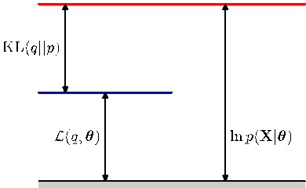

carefully the forms of the expressions (9.71) and (9.72), and in particular noting that they differ in sign and also that $\mathcal{L}(q, \boldsymbol{\theta})$ contains the joint distribution of $\mathbf{X}$ and $\mathbf{Z}$ while $\text{KL}(q \| p)$ contains the conditional distribution of $\mathbf{Z}$ given $\mathbf{X}$. To verify the decomposition (9.70), we first make use of the product rule of probability to give

$$
\ln p(\mathbf{X}, \mathbf{Z}|\boldsymbol{\theta}) = \ln p(\mathbf{Z}|\mathbf{X}, \boldsymbol{\theta}) + \ln p(\mathbf{X}|\boldsymbol{\theta}) \tag{9.73}
$$

which we then substitute into the expression for $\mathcal{L}(q, \boldsymbol{\theta})$. This gives rise to two terms, one of which cancels $\text{KL}(q \| p)$ while the other gives the required log likelihood $\ln p(\mathbf{X}|\boldsymbol{\theta})$ after noting that $q(\mathbf{Z})$ is a normalized distribution that sums to 1.

From (9.72), we see that $\text{KL}(q \| p)$ is the Kullback-Leibler divergence between $q(\mathbf{Z})$ and the posterior distribution $p(\mathbf{Z}|\mathbf{X}, \boldsymbol{\theta})$. Recall that the Kullback-Leibler divergence satisfies $\text{KL}(q \| p) \ge 0$, with equality if, and only if, $q(\mathbf{Z}) = p(\mathbf{Z}|\mathbf{X}, \boldsymbol{\theta})$. It therefore follows from (9.70) that $\mathcal{L}(q, \boldsymbol{\theta}) \le \ln p(\mathbf{X}|\boldsymbol{\theta})$, in other words that $\mathcal{L}(q, \boldsymbol{\theta})$ is a lower bound on $\ln p(\mathbf{X}|\boldsymbol{\theta})$. The decomposition (9.70) is illustrated in Figure 9.11.

The EM algorithm is a two-stage iterative optimization technique for finding maximum likelihood solutions. We can use the decomposition (9.70) to define the EM algorithm and to demonstrate that it does indeed maximize the log likelihood. Suppose that the current value of the parameter vector is $\boldsymbol{\theta}^{\text{old}}$. In the E step, the lower bound $\mathcal{L}(q, \boldsymbol{\theta}^{\text{old}})$ is maximized with respect to $q(\mathbf{Z})$ while holding $\boldsymbol{\theta}^{\text{old}}$ fixed. The solution to this maximization problem is easily seen by noting that the value of $\ln p(\mathbf{X}|\boldsymbol{\theta}^{\text{old}})$ does not depend on $q(\mathbf{Z})$ and so the largest value of $\mathcal{L}(q, \boldsymbol{\theta}^{\text{old}})$ will occur when the Kullback-Leibler divergence vanishes, in other words when $q(\mathbf{Z})$ is equal to the posterior distribution $p(\mathbf{Z}|\mathbf{X}, \boldsymbol{\theta}^{\text{old}})$. In this case, the lower bound will equal the log likelihood, as illustrated in Figure 9.12.

In the subsequent M step, the distribution $q(\mathbf{Z})$ is held fixed and the lower bound $\mathcal{L}(q, \boldsymbol{\theta})$ is maximized with respect to $\boldsymbol{\theta}$ to give some new value $\boldsymbol{\theta}^{\text{new}}$. This will cause the lower bound $\mathcal{L}$ to increase (unless it is already at a maximum), which will necessarily cause the corresponding log likelihood function to increase. Because the distribution $q$ is determined using the old parameter values rather than the new values and is held fixed during the M step, it will not equal the new posterior distribution $p(\mathbf{Z}|\mathbf{X}, \boldsymbol{\theta}^{\text{new}})$, and hence there will be a nonzero KL divergence. The increase in the log likelihood function is therefore greater than the increase in the lower bound, as
[Page 472]

Figure 9.12 Illustration of the E step of the EM algorithm. The $q$ distribution is set equal to the posterior distribution for the current parameter values $\boldsymbol{\theta}^{\text{old}}$, causing the lower bound to move up to the same value as the log likelihood function, with the KL divergence vanishing.

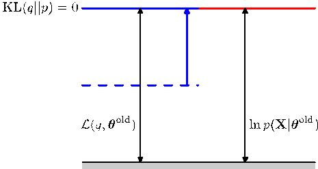

shown in Figure 9.13. If we substitute $q(\mathbf{Z}) = p(\mathbf{Z}|\mathbf{X}, \boldsymbol{\theta}^{\text{old}})$ into (9.71), we see that, after the E step, the lower bound takes the form

$$
\begin{aligned}
\mathcal{L}(q, \boldsymbol{\theta}) &= \sum_{\mathbf{Z}} p(\mathbf{Z}|\mathbf{X}, \boldsymbol{\theta}^{\text{old}}) \ln p(\mathbf{X}, \mathbf{Z}|\boldsymbol{\theta}) - \sum_{\mathbf{Z}} p(\mathbf{Z}|\mathbf{X}, \boldsymbol{\theta}^{\text{old}}) \ln p(\mathbf{Z}|\mathbf{X}, \boldsymbol{\theta}^{\text{old}}) \\
&= \mathcal{Q}(\boldsymbol{\theta}, \boldsymbol{\theta}^{\text{old}}) + \text{const}
\end{aligned}
\tag{9.74}
$$

where the constant is simply the negative entropy of the $q$ distribution and is therefore independent of $\boldsymbol{\theta}$. Thus in the M step, the quantity that is being maximized is the expectation of the complete-data log likelihood, as we saw earlier in the case of mixtures of Gaussians. Note that the variable $\boldsymbol{\theta}$ over which we are optimizing appears only inside the logarithm. If the joint distribution $p(\mathbf{Z}, \mathbf{X}|\boldsymbol{\theta})$ comprises a member of the exponential family, or a product of such members, then we see that the logarithm will cancel the exponential and lead to an M step that will be typically much simpler than the maximization of the corresponding incomplete-data log likelihood function $p(\mathbf{X}|\boldsymbol{\theta})$.

The operation of the EM algorithm can also be viewed in the space of parameters, as illustrated schematically in Figure 9.14. Here the red curve depicts the (in-

Figure 9.13 Illustration of the M step of the EM algorithm. The distribution $q(\mathbf{Z})$ is held fixed and the lower bound $\mathcal{L}(q, \boldsymbol{\theta})$ is maximized with respect to the parameter vector $\boldsymbol{\theta}$ to give a revised value $\boldsymbol{\theta}^{\text{new}}$. Because the KL divergence is nonnegative, this causes the log likelihood $\ln p(\mathbf{X}|\boldsymbol{\theta})$ to increase by at least as much as the lower bound does.

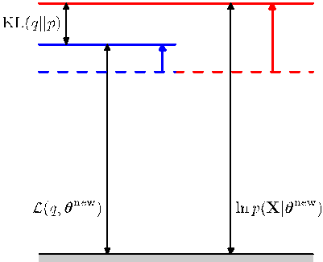
[Page 473]

Figure 9.14 The EM algorithm involves alternately computing a lower bound on the log likelihood for the current parameter values and then maximizing this bound to obtain the new parameter values. See the text for a full discussion.

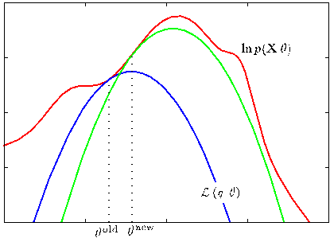

complete data) log likelihood function whose value we wish to maximize. We start with some initial parameter value $\boldsymbol{\theta}^{\text{old}}$, and in the first E step we evaluate the posterior distribution over latent variables, which gives rise to a lower bound $\mathcal{L}(\boldsymbol{\theta}, \boldsymbol{\theta}^{(\text{old})})$ whose value equals the log likelihood at $\boldsymbol{\theta}^{(\text{old})}$, as shown by the blue curve. Note that the bound makes a tangential contact with the log likelihood at $\boldsymbol{\theta}^{(\text{old})}$, so that both curves have the same gradient. This bound is a convex function having a unique maximum (for mixture components from the exponential family). In the M step, the bound is maximized giving the value $\boldsymbol{\theta}^{(\text{new})}$, which gives a larger value of log likelihood than $\boldsymbol{\theta}^{(\text{old})}$. The subsequent E step then constructs a bound that is tangential at $\boldsymbol{\theta}^{(\text{new})}$ as shown by the green curve.

For the particular case of an independent, identically distributed data set, $\mathbf{X}$ will comprise $N$ data points $\{\mathbf{x}_n\}$ while $\mathbf{Z}$ will comprise $N$ corresponding latent variables $\{\mathbf{z}_n\}$, where $n = 1,\dots,N$. From the independence assumption, we have $p(\mathbf{X}, \mathbf{Z}) = \prod_n p(\mathbf{x}_n, \mathbf{z}_n)$ and, by marginalizing over the $\{\mathbf{z}_n\}$ we have $p(\mathbf{X}) = \prod_n p(\mathbf{x}_n)$. Using the sum and product rules, we see that the posterior probability that is evaluated in the E step takes the form

$$
p(\mathbf{Z}|\mathbf{X}, \boldsymbol{\theta}) = \frac{p(\mathbf{X}, \mathbf{Z}|\boldsymbol{\theta})}{\sum_{\mathbf{Z}} p(\mathbf{X}, \mathbf{Z}|\boldsymbol{\theta})} = \frac{\prod_{n=1}^N p(\mathbf{x}_n, \mathbf{z}_n|\boldsymbol{\theta})}{\sum_{\mathbf{Z}} \prod_{n=1}^N p(\mathbf{x}_n, \mathbf{z}_n|\boldsymbol{\theta})} = \prod_{n=1}^N p(\mathbf{z}_n|\mathbf{x}_n, \boldsymbol{\theta}) \tag{9.75}
$$

and so the posterior distribution also factorizes with respect to $n$. In the case of the Gaussian mixture model this simply says that the responsibility that each of the mixture components takes for a particular data point $\mathbf{x}_n$ depends only on the value of $\mathbf{x}_n$ and on the parameters $\boldsymbol{\theta}$ of the mixture components, not on the values of the other data points.

We have seen that both the E and the M steps of the EM algorithm are increasing the value of a well-defined bound on the log likelihood function and that the
[Page 474]

complete EM cycle will change the model parameters in such a way as to cause the log likelihood to increase (unless it is already at a maximum, in which case the parameters remain unchanged).

We can also use the EM algorithm to maximize the posterior distribution $p(\boldsymbol{\theta}|\mathbf{X})$ for models in which we have introduced a prior $p(\boldsymbol{\theta})$ over the parameters. To see this, we note that as a function of $\boldsymbol{\theta}$, we have $p(\boldsymbol{\theta}|\mathbf{X}) = p(\boldsymbol{\theta},\mathbf{X})/p(\mathbf{X})$ and so

$$
\ln p(\boldsymbol{\theta}|\mathbf{X}) = \ln p(\boldsymbol{\theta}, \mathbf{X}) - \ln p(\mathbf{X}). \tag{9.76}
$$

Making use of the decomposition (9.70), we have

$$
\begin{aligned}
\ln p(\boldsymbol{\theta}|\mathbf{X}) &= \mathcal{L}(q, \boldsymbol{\theta}) + \text{KL}(q \| p) + \ln p(\boldsymbol{\theta}) - \ln p(\mathbf{X}) \\
&\ge \mathcal{L}(q, \boldsymbol{\theta}) + \ln p(\boldsymbol{\theta}) - \ln p(\mathbf{X}).
\end{aligned}
\tag{9.77}
$$

where $\ln p(\mathbf{X})$ is a constant. We can again optimize the right-hand side alternately with respect to $q$ and $\boldsymbol{\theta}$. The optimization with respect to $q$ gives rise to the same E-step equations as for the standard EM algorithm, because $q$ only appears in $\mathcal{L}(q,\boldsymbol{\theta})$. The M-step equations are modified through the introduction of the prior term $\ln p(\boldsymbol{\theta})$, which typically requires only a small modification to the standard maximum likelihood M-step equations.

The EM algorithm breaks down the potentially difficult problem of maximizing the likelihood function into two stages, the E step and the M step, each of which will often prove simpler to implement. Nevertheless, for complex models it may be the case that either the E step or the M step, or indeed both, remain intractable. This leads to two possible extensions of the EM algorithm, as follows.

The generalized EM, or GEM, algorithm addresses the problem of an intractable M step. Instead of aiming to maximize $\mathcal{L}(q,\boldsymbol{\theta})$ with respect to $\boldsymbol{\theta}$, it seeks instead to change the parameters in such a way as to increase its value. Again, because $\mathcal{L}(q,\boldsymbol{\theta})$ is a lower bound on the log likelihood function, each complete EM cycle of the GEM algorithm is guaranteed to increase the value of the log likelihood (unless the parameters already correspond to a local maximum). One way to exploit the GEM approach would be to use one of the nonlinear optimization strategies, such as the conjugate gradients algorithm, during the M step. Another form of GEM algorithm, known as the expectation conditional maximization, or ECM, algorithm, involves making several constrained optimizations within each M step (Meng and Rubin, 1993). For instance, the parameters might be partitioned into groups, and the M step is broken down into multiple steps each of which involves optimizing one of the subset with the remainder held fixed.

We can similarly generalize the E step of the EM algorithm by performing a partial, rather than complete, optimization of $\mathcal{L}(q,\boldsymbol{\theta})$ with respect to $q(\mathbf{Z})$ (Neal and Hinton, 1999). As we have seen, for any given value of $\boldsymbol{\theta}$ there is a unique maximum of $\mathcal{L}(q,\boldsymbol{\theta})$ with respect to $q(\mathbf{Z})$ that corresponds to the posterior distribution $q_{\boldsymbol{\theta}}(\mathbf{Z}) = p(\mathbf{Z}|\mathbf{X},\boldsymbol{\theta})$ and that for this choice of $q(\mathbf{Z})$ the bound $\mathcal{L}(q,\boldsymbol{\theta})$ is equal to the log likelihood function $\ln p(\mathbf{X}|\boldsymbol{\theta})$. It follows that any algorithm that converges to the global maximum of $\mathcal{L}(q,\boldsymbol{\theta})$ will find a value of $\boldsymbol{\theta}$ that is also a global maximum of the log likelihood $\ln p(\mathbf{X}|\boldsymbol{\theta})$. Provided $p(\mathbf{X},\mathbf{Z}|\boldsymbol{\theta})$ is a continuous function of $\boldsymbol{\theta}$
[Page 475]

then, by continuity, any local maximum of $\mathcal{L}(q,\boldsymbol{\theta})$ will also be a local maximum of $\ln p(\mathbf{X}|\boldsymbol{\theta})$.

Consider the case of $N$ independent data points $\mathbf{x}_1,\dots,\mathbf{x}_N$ with corresponding latent variables $\mathbf{z}_1,\dots,\mathbf{z}_N$. The joint distribution $p(\mathbf{X},\mathbf{Z}|\boldsymbol{\theta})$ factorizes over the data points, and this structure can be exploited in an incremental form of EM in which at each EM cycle only one data point is processed at a time. In the E step, instead of recomputing the responsibilities for all of the data points, we just re-evaluate the responsibilities for one data point. It might appear that the subsequent M step would require computation involving the responsibilities for all of the data points. However, if the mixture components are members of the exponential family, then the responsibilities enter only through simple sufficient statistics, and these can be updated efficiently. Consider, for instance, the case of a Gaussian mixture, and suppose we perform an update for data point $m$ in which the corresponding old and new values of the responsibilities are denoted $\gamma^{\text{old}}(z_{mk})$ and $\gamma^{\text{new}}(z_{mk})$. In the M step, the required sufficient statistics can be updated incrementally. For instance, for the means the sufficient statistics are defined by (9.17) and (9.18) from which we obtain

$$
\boldsymbol{\mu}_k^{\text{new}} = \boldsymbol{\mu}_k^{\text{old}} + \left( \frac{\gamma^{\text{new}}(z_{mk}) - \gamma^{\text{old}}(z_{mk})}{N_k^{\text{new}}} \right) (\mathbf{x}_m - \boldsymbol{\mu}_k^{\text{old}}) \tag{9.78}
$$

together with

$$
N_k^{\text{new}} = N_k^{\text{old}} + \gamma^{\text{new}}(z_{mk}) - \gamma^{\text{old}}(z_{mk}). \tag{9.79}
$$

The corresponding results for the covariances and the mixing coefficients are analogous.

Thus both the E step and the M step take fixed time that is independent of the total number of data points. Because the parameters are revised after each data point, rather than waiting until after the whole data set is processed, this incremental version can converge faster than the batch version. Each E or M step in this incremental algorithm is increasing the value of $\mathcal{L}(q,\boldsymbol{\theta})$ and, as we have shown above, if the algorithm converges to a local (or global) maximum of $\mathcal{L}(q,\boldsymbol{\theta})$, this will correspond to a local (or global) maximum of the log likelihood function $\ln p(\mathbf{X}|\boldsymbol{\theta})$.
