[Page 481]

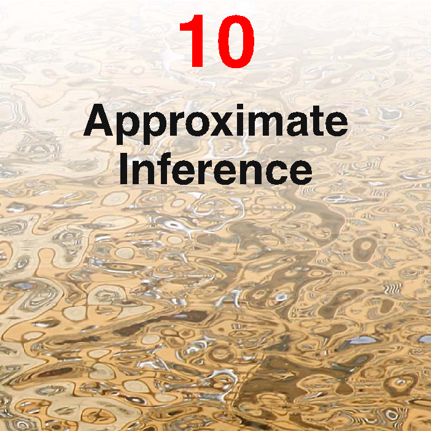

# 10. Approximate Inference

A central task in the application of probabilistic models is the evaluation of the posterior distribution $p(\mathbf{Z}|\mathbf{X})$ of the latent variables $\mathbf{Z}$ given the observed (visible) data variables $\mathbf{X}$, and the evaluation of expectations computed with respect to this distribution. The model might also contain some deterministic parameters, which we will leave implicit for the moment, or it may be a fully Bayesian model in which any unknown parameters are given prior distributions and are absorbed into the set of latent variables denoted by the vector $\mathbf{Z}$. For instance, in the EM algorithm we need to evaluate the expectation of the complete-data log likelihood with respect to the posterior distribution of the latent variables. For many models of practical interest, it will be infeasible to evaluate the posterior distribution or indeed to compute expectations with respect to this distribution. This could be because the dimensionality of the latent space is too high to work with directly or because the posterior distribution has a highly complex form for which expectations are not analytically tractable. In the case of continuous variables, the required integrations may not have closed-form
[Page 482]

analytical solutions, while the dimensionality of the space and the complexity of the integrand may prohibit numerical integration. For discrete variables, the marginalizations involve summing over all possible configurations of the hidden variables, and though this is always possible in principle, we often find in practice that there may be exponentially many hidden states so that exact calculation is prohibitively expensive.

In such situations, we need to resort to approximation schemes, and these fall broadly into two classes, according to whether they rely on stochastic or deterministic approximations. Stochastic techniques such as Markov chain Monte Carlo, described in Chapter 11, have enabled the widespread use of Bayesian methods across many domains. They generally have the property that given infinite computational resource, they can generate exact results, and the approximation arises from the use of a finite amount of processor time. In practice, sampling methods can be computationally demanding, often limiting their use to small-scale problems. Also, it can be difficult to know whether a sampling scheme is generating independent samples from the required distribution.

In this chapter, we introduce a range of deterministic approximation schemes, some of which scale well to large applications. These are based on analytical approximations to the posterior distribution, for example by assuming that it factorizes in a particular way or that it has a specific parametric form such as a Gaussian. As such, they can never generate exact results, and so their strengths and weaknesses are complementary to those of sampling methods.

In Section 4.4, we discussed the Laplace approximation, which is based on a local Gaussian approximation to a mode (i.e., a maximum) of the distribution. Here we turn to a family of approximation techniques called variational inference or variational Bayes, which use more global criteria and which have been widely applied. We conclude with a brief introduction to an alternative variational framework known as expectation propagation.

## 10.1. Variational Inference

Variational methods have their origins in the 18th century with the work of Euler, Lagrange, and others on the calculus of variations. Standard calculus is concerned with finding derivatives of functions. We can think of a function as a mapping that takes the value of a variable as the input and returns the value of the function as the output. The derivative of the function then describes how the output value varies as we make infinitesimal changes to the input value. Similarly, we can define a functional as a mapping that takes a function as the input and that returns the value of the functional as the output. An example would be the entropy $\text{H}[p]$, which takes a probability distribution $p(\mathbf{x})$ as the input and returns the quantity

$$
\text{H}[p] = - \int p(\mathbf{x}) \ln p(\mathbf{x}) \text{d}\mathbf{x} \tag{10.1}
$$

[Page 483]

as the output. We can then introduce the concept of a functional derivative, which expresses how the value of the functional changes in response to infinitesimal changes to the input function (Feynman et al., 1964). The rules for the calculus of variations mirror those of standard calculus and are discussed in Appendix D. Many problems can be expressed in terms of an optimization problem in which the quantity being optimized is a functional. The solution is obtained by exploring all possible input functions to find the one that maximizes, or minimizes, the functional. Variational methods have broad applicability and include such areas as finite element methods (Kapur, 1989) and maximum entropy (Schwarz, 1988).

Although there is nothing intrinsically approximate about variational methods, they do naturally lend themselves to finding approximate solutions. This is done by restricting the range of functions over which the optimization is performed, for instance by considering only quadratic functions or by considering functions composed of a linear combination of fixed basis functions in which only the coefficients of the linear combination can vary. In the case of applications to probabilistic inference, the restriction may for example take the form of factorization assumptions (Jordan et al., 1999; Jaakkola, 2001).

Now let us consider in more detail how the concept of variational optimization can be applied to the inference problem. Suppose we have a fully Bayesian model in which all parameters are given prior distributions. The model may also have latent variables as well as parameters, and we shall denote the set of all latent variables and parameters by $\mathbf{Z}$. Similarly, we denote the set of all observed variables by $\mathbf{X}$. For example, we might have a set of $N$ independent, identically distributed data, for which $\mathbf{X} = \{\mathbf{x}_1,\dots,\mathbf{x}_N\}$ and $\mathbf{Z} = \{\mathbf{z}_1,\dots,\mathbf{z}_N\}$. Our probabilistic model specifies the joint distribution $p(\mathbf{X}, \mathbf{Z})$, and our goal is to find an approximation for the posterior distribution $p(\mathbf{Z}|\mathbf{X})$ as well as for the model evidence $p(\mathbf{X})$. As in our discussion of EM, we can decompose the log marginal probability using

$$
\ln p(\mathbf{X}) = \mathcal{L}(q) + \text{KL}(q \| p) \tag{10.2}
$$

where we have defined

$$
\mathcal{L}(q) = \int q(\mathbf{Z}) \ln \left\{ \frac{p(\mathbf{X}, \mathbf{Z})}{q(\mathbf{Z})} \right\} \text{d}\mathbf{Z} \tag{10.3}
$$

$$
\text{KL}(q \| p) = - \int q(\mathbf{Z}) \ln \left\{ \frac{p(\mathbf{Z}|\mathbf{X})}{q(\mathbf{Z})} \right\} \text{d}\mathbf{Z}. \tag{10.4}
$$

This differs from our discussion of EM only in that the parameter vector $\boldsymbol{\theta}$ no longer appears, because the parameters are now stochastic variables and are absorbed into $\mathbf{Z}$. Since in this chapter we will mainly be interested in continuous variables we have used integrations rather than summations in formulating this decomposition. However, the analysis goes through unchanged if some or all of the variables are discrete simply by replacing the integrations with summations as required. As before, we can maximize the lower bound $\mathcal{L}(q)$ by optimization with respect to the distribution $q(\mathbf{Z})$, which is equivalent to minimizing the KL divergence. If we allow any possible choice for $q(\mathbf{Z})$, then the maximum of the lower bound occurs when the KL divergence vanishes, which occurs when $q(\mathbf{Z})$ equals the posterior distribution $p(\mathbf{Z}|\mathbf{X})$.
[Page 484]

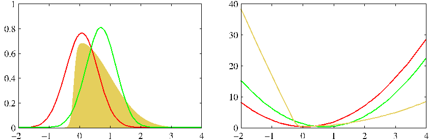

Figure 10.1 Illustration of the variational approximation for the example considered earlier in Figure 4.14. The left-hand plot shows the original distribution (yellow) along with the Laplace (red) and variational (green) approximations, and the right-hand plot shows the negative logarithms of the corresponding curves.

However, we shall suppose the model is such that working with the true posterior distribution is intractable.

We therefore consider instead a restricted family of distributions $q(\mathbf{Z})$ and then seek the member of this family for which the KL divergence is minimized. Our goal is to restrict the family sufficiently that they comprise only tractable distributions, while at the same time allowing the family to be sufficiently rich and flexible that it can provide a good approximation to the true posterior distribution. It is important to emphasize that the restriction is imposed purely to achieve tractability, and that subject to this requirement we should use as rich a family of approximating distributions as possible. In particular, there is no ‘over-fitting’ associated with highly flexible distributions. Using more flexible approximations simply allows us to approach the true posterior distribution more closely.

One way to restrict the family of approximating distributions is to use a parametric distribution $q(\mathbf{Z}|\boldsymbol{\omega})$ governed by a set of parameters $\boldsymbol{\omega}$. The lower bound $\mathcal{L}(q)$ then becomes a function of $\boldsymbol{\omega}$, and we can exploit standard nonlinear optimization techniques to determine the optimal values for the parameters. An example of this approach, in which the variational distribution is a Gaussian and we have optimized with respect to its mean and variance, is shown in Figure 10.1.

## 10.1.1 Factorized distributions

Here we consider an alternative way in which to restrict the family of distributions $q(\mathbf{Z})$. Suppose we partition the elements of $\mathbf{Z}$ into disjoint groups that we denote by $\mathbf{Z}_i$ where $i = 1,\dots,M$. We then assume that the $q$ distribution factorizes with respect to these groups, so that

$$
q(\mathbf{Z}) = \prod_{i=1}^M q_i(\mathbf{Z}_i). \tag{10.5}
$$

[Page 485]

It should be emphasized that we are making no further assumptions about the distribution. In particular, we place no restriction on the functional forms of the individual factors $q_i(\mathbf{Z}_i)$. This factorized form of variational inference corresponds to an approximation framework developed in physics called mean field theory (Parisi, 1988).

Amongst all distributions $q(\mathbf{Z})$ having the form (10.5), we now seek that distribution for which the lower bound $\mathcal{L}(q)$ is largest. We therefore wish to make a free form (variational) optimization of $\mathcal{L}(q)$ with respect to all of the distributions $q_i(\mathbf{Z}_i)$, which we do by optimizing with respect to each of the factors in turn. To achieve this, we first substitute (10.5) into (10.3) and then dissect out the dependence on one of the factors $q_j(\mathbf{Z}_j)$. Denoting $q_j(\mathbf{Z}_j)$ by simply $q_j$ to keep the notation uncluttered, we then obtain

$$
\begin{aligned}
\mathcal{L}(q) &= \int \prod_i q_i \left\{ \ln p(\mathbf{X}, \mathbf{Z}) - \sum_i \ln q_i \right\} \text{d}\mathbf{Z} \\
&= \int q_j \left\{ \int \ln p(\mathbf{X}, \mathbf{Z}) \prod_{i \neq j} q_i \text{d}\mathbf{Z}_i \right\} \text{d}\mathbf{Z}_j - \int q_j \ln q_j \text{d}\mathbf{Z}_j + \text{const} \\
&= \int q_j \ln \widetilde{p}(\mathbf{X}, \mathbf{Z}_j) \text{d}\mathbf{Z}_j - \int q_j \ln q_j \text{d}\mathbf{Z}_j + \text{const}
\end{aligned} \tag{10.6}
$$

where we have defined a new distribution $\widetilde{p}(\mathbf{X}, \mathbf{Z}_j)$ by the relation

$$
\ln \widetilde{p}(\mathbf{X}, \mathbf{Z}_j) = \mathbb{E}_{i \neq j}[\ln p(\mathbf{X}, \mathbf{Z})] + \text{const}. \tag{10.7}
$$

Here the notation $\mathbb{E}_{i \neq j}[\cdots]$ denotes an expectation with respect to the $q$ distributions over all variables $\mathbf{z}_i$ for $i \neq j$, so that

$$
\mathbb{E}_{i \neq j}[\ln p(\mathbf{X}, \mathbf{Z})] = \int \ln p(\mathbf{X}, \mathbf{Z}) \prod_{i \neq j} q_i \text{d}\mathbf{Z}_i. \tag{10.8}
$$

Now suppose we keep the $\{q_{i \neq j}\}$ fixed and maximize $\mathcal{L}(q)$ in (10.6) with respect to all possible forms for the distribution $q_j(\mathbf{Z}_j)$. This is easily done by recognizing that (10.6) is a negative Kullback-Leibler divergence between $q_j(\mathbf{Z}_j)$ and $\widetilde{p}(\mathbf{X}, \mathbf{Z}_j)$. Thus maximizing (10.6) is equivalent to minimizing the Kullback-Leibler

**Leonhard Euler**
1707–1783
Euler was a Swiss mathematician and physicist who worked in St. Petersburg and Berlin and who is widely considered to be one of the greatest mathematicians of all time. He is certainly the most prolific, and his collected works fill 75 volumes. Amongst his many contributions, he formulated the modern theory of the function, he developed (together with Lagrange) the calculus of variations, and he discovered the formula $e^{i\pi} = -1$, which relates four of the most important numbers in mathematics. During the last 17 years of his life, he was almost totally blind, and yet he produced nearly half of his results during this period.
[Page 486]

divergence, and the minimum occurs when $q_j(\mathbf{Z}_j) = \widetilde{p}(\mathbf{X}, \mathbf{Z}_j)$. Thus we obtain a general expression for the optimal solution $q_j^\star(\mathbf{Z}_j)$ given by

$$
\ln q^\star_j(\mathbf{Z}_j) = \mathbb{E}_{i \neq j}[\ln p(\mathbf{X}, \mathbf{Z})] + \text{const}. \tag{10.9}
$$

It is worth taking a few moments to study the form of this solution as it provides the basis for applications of variational methods. It says that the log of the optimal solution for factor $q_j$ is obtained simply by considering the log of the joint distribution over all hidden and visible variables and then taking the expectation with respect to all of the other factors $\{q_i\}$ for $i \neq j$.

The additive constant in (10.9) is set by normalizing the distribution $q^\star_j(\mathbf{Z}_j)$. Thus if we take the exponential of both sides and normalize, we have

$$
q^\star_j(\mathbf{Z}_j) = \frac{\exp\left(\mathbb{E}_{i \neq j}[\ln p(\mathbf{X}, \mathbf{Z})]\right)}{\int \exp\left(\mathbb{E}_{i \neq j}[\ln p(\mathbf{X}, \mathbf{Z})]\right) \text{d}\mathbf{Z}_j}.
$$

In practice, we shall find it more convenient to work with the form (10.9) and then reinstate the normalization constant (where required) by inspection. This will become clear from subsequent examples.

The set of equations given by (10.9) for $j = 1,\dots,M$ represent a set of consistency conditions for the maximum of the lower bound subject to the factorization constraint. However, they do not represent an explicit solution because the expression on the right-hand side of (10.9) for the optimum $q_j^\star(\mathbf{Z}_j)$ depends on expectations computed with respect to the other factors $q_i(\mathbf{Z}_i)$ for $i \neq j$. We will therefore seek a consistent solution by first initializing all of the factors $q_i(\mathbf{Z}_i)$ appropriately and then cycling through the factors and replacing each in turn with a revised estimate given by the right-hand side of (10.9) evaluated using the current estimates for all of the other factors. Convergence is guaranteed because bound is convex with respect to each of the factors $q_i(\mathbf{Z}_i)$ (Boyd and Vandenberghe, 2004).

## 10.1.2 Properties of factorized approximations

Our approach to variational inference is based on a factorized approximation to the true posterior distribution. Let us consider for a moment the problem of approximating a general distribution by a factorized distribution. To begin with, we discuss the problem of approximating a Gaussian distribution using a factorized Gaussian, which will provide useful insight into the types of inaccuracy introduced in using factorized approximations. Consider a Gaussian distribution $p(\mathbf{z}) = \mathcal{N}(\mathbf{z}|\boldsymbol{\mu}, \boldsymbol{\Lambda}^{-1})$ over two correlated variables $\mathbf{z} = (z_1, z_2)$ in which the mean and precision have elements

$$
\boldsymbol{\mu} = \begin{pmatrix} \mu_1 \\ \mu_2 \end{pmatrix}, \quad \boldsymbol{\Lambda} = \begin{pmatrix} \Lambda_{11} & \Lambda_{12} \\ \Lambda_{21} & \Lambda_{22} \end{pmatrix} \tag{10.10}
$$

and $\Lambda_{21} = \Lambda_{12}$ due to the symmetry of the precision matrix. Now suppose we wish to approximate this distribution using a factorized Gaussian of the form $q(\mathbf{z}) = q_1(z_1)q_2(z_2)$. We first apply the general result (10.9) to find an expression for the
[Page 487]

optimal factor $q^\star_1(z_1)$. In doing so it is useful to note that on the right-hand side we only need to retain those terms that have some functional dependence on $z_1$ because all other terms can be absorbed into the normalization constant. Thus we have

$$
\begin{aligned}
\ln q^\star_1(z_1) &= \mathbb{E}_{z_2}[\ln p(\mathbf{z})] + \text{const} \\
&= \mathbb{E}_{z_2} \left[ - \frac{1}{2} (z_1 - \mu_1)^2 \Lambda_{11} - (z_1 - \mu_1)\Lambda_{12}(z_2 - \mu_2) \right] + \text{const} \\
&= - \frac{1}{2} z_1^2 \Lambda_{11} + z_1 \mu_1 \Lambda_{11} - z_1 \Lambda_{12} (\mathbb{E}[z_2] - \mu_2) + \text{const}.
\end{aligned} \tag{10.11}
$$

Next we observe that the right-hand side of this expression is a quadratic function of $z_1$, and so we can identify $q^\star(z_1)$ as a Gaussian distribution. It is worth emphasizing that we did not assume that $q(z_i)$ is Gaussian, but rather we derived this result by variational optimization of the KL divergence over all possible distributions $q(z_i)$. Note also that we do not need to consider the additive constant in (10.9) explicitly because it represents the normalization constant that can be found at the end by inspection if required. Using the technique of completing the square, we can identify the mean and precision of this Gaussian, giving

$$
q^\star_1(z_1) = \mathcal{N}(z_1 | m_1, \Lambda_{11}^{-1}) \tag{10.12}
$$

where

$$
m_1 = \mu_1 - \Lambda_{11}^{-1} \Lambda_{12} (\mathbb{E}[z_2] - \mu_2). \tag{10.13}
$$

By symmetry, $q^\star_2(z_2)$ is also Gaussian and can be written as

$$
q^\star_2(z_2) = \mathcal{N}(z_2 | m_2, \Lambda_{22}^{-1}) \tag{10.14}
$$

in which

$$
m_2 = \mu_2 - \Lambda_{22}^{-1} \Lambda_{21} (\mathbb{E}[z_1] - \mu_1). \tag{10.15}
$$

Note that these solutions are coupled, so that $q^\star_1(z_1)$ depends on expectations computed with respect to $q^\star_2(z_2)$ and vice versa. In general, we address this by treating the variational solutions as re-estimation equations and cycling through the variables in turn updating them until some convergence criterion is satisfied. We shall see an example of this shortly. Here, however, we note that the problem is sufficiently simple that a closed form solution can be found. In particular, because $\mathbb{E}[z_1] = m_1$ and $\mathbb{E}[z_2] = m_2$, we see that the two equations are satisfied if we take $\mathbb{E}[z_1] = \mu_1$ and $\mathbb{E}[z_2] = \mu_2$, and it is easily shown that this is the only solution provided the distribution is nonsingular. This result is illustrated in Figure 10.2(a). We see that the mean is correctly captured but that the variance of $q(\mathbf{z})$ is controlled by the direction of smallest variance of $p(\mathbf{z})$, and that the variance along the orthogonal direction is significantly under-estimated. It is a general result that a factorized variational approximation tends to give approximations to the posterior distribution that are too compact.

By way of comparison, suppose instead that we had been minimizing the reverse Kullback-Leibler divergence $\text{KL}(p \| q)$. As we shall see, this form of KL divergence
[Page 488]

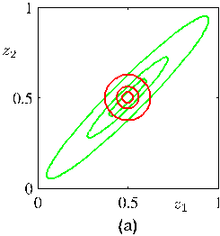
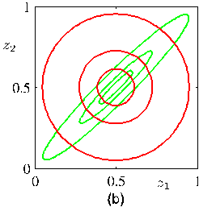

Figure 10.2 Comparison of the two alternative forms for the Kullback-Leibler divergence. The green contours corresponding to 1, 2, and 3 standard deviations for a correlated Gaussian distribution $p(\mathbf{z})$ over two variables $z_1$ and $z_2$, and the red contours represent the corresponding levels for an approximating distribution $q(\mathbf{z})$ over the same variables given by the product of two independent univariate Gaussian distributions whose parameters are obtained by minimization of (a) the Kullback-Leibler divergence $\text{KL}(q \| p)$, and (b) the reverse Kullback-Leibler divergence $\text{KL}(p \| q)$.

is used in an alternative approximate inference framework called expectation propagation. We therefore consider the general problem of minimizing $\text{KL}(p \| q)$ when $q(\mathbf{Z})$ is a factorized approximation of the form (10.5). The KL divergence can then be written in the form

$$
\text{KL}(p \| q) = - \int p(\mathbf{Z}) \left[ \sum_{i=1}^M \ln q_i(\mathbf{Z}_i) \right] \text{d}\mathbf{Z} + \text{const} \tag{10.16}
$$

where the constant term is simply the entropy of $p(\mathbf{Z})$ and so does not depend on $q(\mathbf{Z})$. We can now optimize with respect to each of the factors $q_j(\mathbf{Z}_j)$, which is easily done using a Lagrange multiplier to give

$$
q^\star_j(\mathbf{Z}_j) = \int p(\mathbf{Z}) \prod_{i \neq j} \text{d}\mathbf{Z}_i = p(\mathbf{Z}_j). \tag{10.17}
$$

In this case, we find that the optimal solution for $q_j(\mathbf{Z}_j)$ is just given by the corresponding marginal distribution of $p(\mathbf{Z})$. Note that this is a closed-form solution and so does not require iteration.

To apply this result to the illustrative example of a Gaussian distribution $p(\mathbf{z})$ over a vector $\mathbf{z}$ we can use (2.98), which gives the result shown in Figure 10.2(b). We see that once again the mean of the approximation is correct, but that it places significant probability mass in regions of variable space that have very low probability.

The difference between these two results can be understood by noting that there is a large positive contribution to the Kullback-Leibler divergence

$$
\text{KL}(q \| p) = - \int q(\mathbf{Z}) \ln \left\{ \frac{p(\mathbf{Z})}{q(\mathbf{Z})} \right\} \text{d}\mathbf{Z} \tag{10.18}
$$

[Page 489]

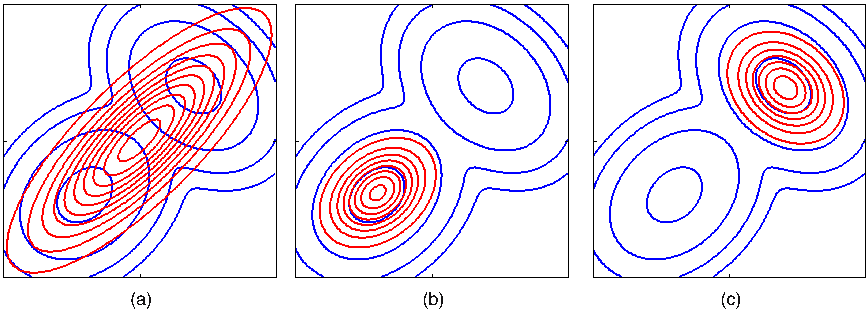

Figure 10.3 Another comparison of the two alternative forms for the Kullback-Leibler divergence. (a) The blue contours show a bimodal distribution $p(\mathbf{Z})$ given by a mixture of two Gaussians, and the red contours correspond to the single Gaussian distribution $q(\mathbf{Z})$ that best approximates $p(\mathbf{Z})$ in the sense of minimizing the Kullback-Leibler divergence $\text{KL}(p \| q)$. (b) As in (a) but now the red contours correspond to a Gaussian distribution $q(\mathbf{Z})$ found by numerical minimization of the Kullback-Leibler divergence $\text{KL}(q \| p)$. (c) As in (b) but showing a different local minimum of the Kullback-Leibler divergence.

from regions of $\mathbf{Z}$ space in which $p(\mathbf{Z})$ is near zero unless $q(\mathbf{Z})$ is also close to zero. Thus minimizing this form of KL divergence leads to distributions $q(\mathbf{Z})$ that avoid regions in which $p(\mathbf{Z})$ is small. Conversely, the Kullback-Leibler divergence $\text{KL}(p \| q)$ is minimized by distributions $q(\mathbf{Z})$ that are nonzero in regions where $p(\mathbf{Z})$ is nonzero.

We can gain further insight into the different behaviour of the two KL divergences if we consider approximating a multimodal distribution by a unimodal one, as illustrated in Figure 10.3. In practical applications, the true posterior distribution will often be multimodal, with most of the posterior mass concentrated in some number of relatively small regions of parameter space. These multiple modes may arise through nonidentifiability in the latent space or through complex nonlinear dependence on the parameters. Both types of multimodality were encountered in Chapter 9 in the context of Gaussian mixtures, where they manifested themselves as multiple maxima in the likelihood function, and a variational treatment based on the minimization of $\text{KL}(q \| p)$ will tend to find one of these modes. By contrast, if we were to minimize $\text{KL}(p \| q)$, the resulting approximations would average across all of the modes and, in the context of the mixture model, would lead to poor predictive distributions (because the average of two good parameter values is typically itself not a good parameter value). It is possible to make use of $\text{KL}(p \| q)$ to define a useful inference procedure, but this requires a rather different approach to the one discussed here, and will be considered in detail when we discuss expectation propagation.

The two forms of Kullback-Leibler divergence are members of the alpha family
[Page 490]

of divergences (Ali and Silvey, 1966; Amari, 1985; Minka, 2005) defined by

$$
D_\alpha(p \| q) = \frac{4}{1-\alpha^2} \left( 1 - \int p(x)^{(1+\alpha)/2} q(x)^{(1-\alpha)/2} \text{d}x \right) \tag{10.19}
$$

where $-\infty < \alpha < \infty$ is a continuous parameter. The Kullback-Leibler divergence $\text{KL}(p \| q)$ corresponds to the limit $\alpha \to 1$, whereas $\text{KL}(q \| p)$ corresponds to the limit $\alpha \to -1$. For all values of $\alpha$ we have $D_\alpha(p \| q) \ge 0$, with equality if, and only if, $p(x) = q(x)$. Suppose $p(x)$ is a fixed distribution, and we minimize $D_\alpha(p \| q)$ with respect to some set of distributions $q(x)$. Then for $\alpha \le -1$ the divergence is zero forcing, so that any values of $x$ for which $p(x) = 0$ will have $q(x) = 0$, and typically $q(x)$ will under-estimate the support of $p(x)$ and will tend to seek the mode with the largest mass. Conversely for $\alpha \ge 1$ the divergence is zero-avoiding, so that values of $x$ for which $p(x) > 0$ will have $q(x) > 0$, and typically $q(x)$ will stretch to cover all of $p(x)$, and will over-estimate the support of $p(x)$. When $\alpha = 0$ we obtain a symmetric divergence that is linearly related to the Hellinger distance given by

$$
D_H(p \| q) = \int \left( p(x)^{1/2} - q(x)^{1/2} \right)^2 \text{d}x. \tag{10.20}
$$

The square root of the Hellinger distance is a valid distance metric.

## 10.1.3 Example: The univariate Gaussian

We now illustrate the factorized variational approximation using a Gaussian distribution over a single variable $x$ (MacKay, 2003). Our goal is to infer the posterior distribution for the mean $\mu$ and precision $\tau$, given a data set $\mathcal{D} = \{x_1,\dots,x_N\}$ of observed values of $x$ which are assumed to be drawn independently from the Gaussian. The likelihood function is given by

$$
p(\mathcal{D}|\mu, \tau) = \left( \frac{\tau}{2\pi} \right)^{N/2} \exp \left\{ - \frac{\tau}{2} \sum_{n=1}^N (x_n - \mu)^2 \right\}. \tag{10.21}
$$

We now introduce conjugate prior distributions for $\mu$ and $\tau$ given by

$$
p(\mu|\tau) = \mathcal{N}\left(\mu|\mu_0, (\lambda_0 \tau)^{-1}\right) \tag{10.22}
$$

$$
p(\tau) = \text{Gam}(\tau|a_0, b_0) \tag{10.23}
$$

where $\text{Gam}(\tau|a_0, b_0)$ is the gamma distribution defined by (2.146). Together these distributions constitute a Gaussian-Gamma conjugate prior distribution. For this simple problem the posterior distribution can be found exactly, and again takes the form of a Gaussian-gamma distribution. However, for tutorial purposes we will consider a factorized variational approximation to the posterior distribution given by

$$
q(\mu, \tau) = q_\mu(\mu) q_\tau(\tau). \tag{10.24}
$$

[Page 491]

Note that the true posterior distribution does not factorize in this way. The optimum factors $q_\mu(\mu)$ and $q_\tau(\tau)$ can be obtained from the general result (10.9) as follows. For $q_\mu(\mu)$ we have

$$
\begin{aligned}
\ln q^\star_\mu(\mu) &= \mathbb{E}_\tau [\ln p(\mathcal{D}|\mu, \tau) + \ln p(\mu|\tau)] + \text{const} \\
&= - \frac{\mathbb{E}[\tau]}{2} \left\{ \lambda_0(\mu - \mu_0)^2 + \sum_{n=1}^N (x_n - \mu)^2 \right\} + \text{const}.
\end{aligned} \tag{10.25}
$$

Completing the square over $\mu$ we see that $q_\mu(\mu)$ is a Gaussian $\mathcal{N}(\mu|\mu_N, \lambda_N^{-1})$ with mean and precision given by

$$
\mu_N = \frac{\lambda_0 \mu_0 + N \overline{x}}{\lambda_0 + N} \tag{10.26}
$$

$$
\lambda_N = (\lambda_0 + N)\mathbb{E}[\tau]. \tag{10.27}
$$

Note that for $N \to \infty$ this gives the maximum likelihood result in which $\mu_N = \overline{x}$ and the precision is infinite.

Similarly, the optimal solution for the factor $q_\tau(\tau)$ is given by

$$
\begin{aligned}
\ln q^\star_\tau(\tau) &= \mathbb{E}_\mu [\ln p(\mathcal{D}|\mu, \tau) + \ln p(\mu|\tau)] + \ln p(\tau) + \text{const} \\
&= (a_0 - 1)\ln \tau - b_0 \tau + \frac{N}{2} \ln \tau \\
&\quad - \frac{\tau}{2} \mathbb{E}_\mu \left[ \sum_{n=1}^N (x_n - \mu)^2 + \lambda_0(\mu - \mu_0)^2 \right] + \text{const}
\end{aligned} \tag{10.28}
$$

and hence $q_\tau(\tau)$ is a gamma distribution $\text{Gam}(\tau|a_N, b_N)$ with parameters

$$
a_N = a_0 + \frac{N}{2} \tag{10.29}
$$

$$
b_N = b_0 + \frac{1}{2} \mathbb{E}_\mu \left[ \sum_{n=1}^N (x_n - \mu)^2 + \lambda_0(\mu - \mu_0)^2 \right]. \tag{10.30}
$$

Again this exhibits the expected behaviour when $N \to \infty$. It should be emphasized that we did not assume these specific functional forms for the optimal distributions $q_\mu(\mu)$ and $q_\tau(\tau)$. They arose naturally from the structure of the likelihood function and the corresponding conjugate priors.

Thus we have expressions for the optimal distributions $q_\mu(\mu)$ and $q_\tau(\tau)$ each of which depends on moments evaluated with respect to the other distribution. One approach to finding a solution is therefore to make an initial guess for, say, the moment $\mathbb{E}[\tau]$ and use this to re-compute the distribution $q_\mu(\mu)$. Given this revised distribution we can then extract the required moments $\mathbb{E}[\mu]$ and $\mathbb{E}[\mu^2]$, and use these to recompute the distribution $q_\tau(\tau)$, and so on. Since the space of hidden variables for this example is only two dimensional, we can illustrate the variational approximation to the posterior distribution by plotting contours of both the true posterior and the factorized approximation, as illustrated in Figure 10.4.
[Page 492]

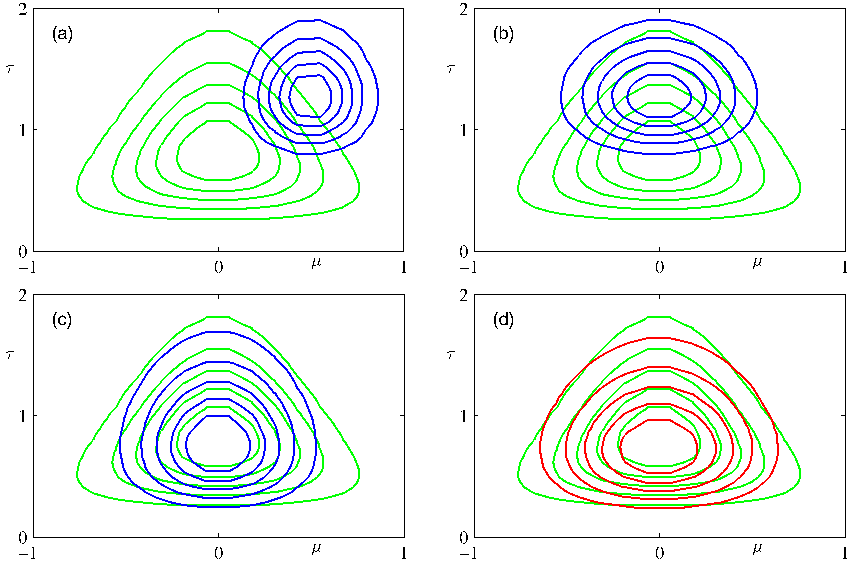

Figure 10.4 Illustration of variational inference for the mean $\mu$ and precision $\tau$ of a univariate Gaussian distribution. Contours of the true posterior distribution $p(\mu, \tau|\mathcal{D})$ are shown in green. (a) Contours of the initial factorized approximation $q_\mu(\mu)q_\tau(\tau)$ are shown in blue. (b) After re-estimating the factor $q_\mu(\mu)$. (c) After re-estimating the factor $q_\tau(\tau)$. (d) Contours of the optimal factorized approximation, to which the iterative scheme converges, are shown in red.

In general, we will need to use an iterative approach such as this in order to solve for the optimal factorized posterior distribution. For the very simple example we are considering here, however, we can find an explicit solution by solving the simultaneous equations for the optimal factors $q_\mu(\mu)$ and $q_\tau(\tau)$. Before doing this, we can simplify these expressions by considering broad, noninformative priors in which $\mu_0 = a_0 = b_0 = \lambda_0 = 0$. Although these parameter settings correspond to improper priors, we see that the posterior distribution is still well defined. Using the standard result $\mathbb{E}[\tau] = a_N/b_N$ for the mean of a gamma distribution, together with (10.29) and (10.30), we have

$$
\frac{1}{\mathbb{E}[\tau]} = \mathbb{E} \left[ \frac{1}{N} \sum_{n=1}^N (x_n - \mu)^2 \right] = \overline{x^2} - 2\overline{x}\mathbb{E}[\mu] + \mathbb{E}[\mu^2]. \tag{10.31}
$$

Then, using (10.26) and (10.27), we obtain the first and second order moments of
[Page 493]

$q_\mu(\mu)$ in the form

$$
\mathbb{E}[\mu] = \overline{x}, \quad \mathbb{E}[\mu^2] = \overline{x}^2 + \frac{1}{N\mathbb{E}[\tau]}. \tag{10.32}
$$

We can now substitute these moments into (10.31) and then solve for $\mathbb{E}[\tau]$ to give

$$
\frac{1}{\mathbb{E}[\tau]} = \frac{1}{N-1} (\overline{x^2} - \overline{x}^2) = \frac{1}{N-1} \sum_{n=1}^N (x_n - \overline{x})^2. \tag{10.33}
$$

We recognize the right-hand side as the familiar unbiased estimator for the variance of a univariate Gaussian distribution, and so we see that the use of a Bayesian approach has avoided the bias of the maximum likelihood solution.

## 10.1.4 Model comparison

As well as performing inference over the hidden variables $\mathbf{Z}$, we may also wish to compare a set of candidate models, labelled by the index $m$, and having prior probabilities $p(m)$. Our goal is then to approximate the posterior probabilities $p(m|\mathbf{X})$, where $\mathbf{X}$ is the observed data. This is a slightly more complex situation than that considered so far because different models may have different structure and indeed different dimensionality for the hidden variables $\mathbf{Z}$. We cannot therefore simply consider a factorized approximation $q(\mathbf{Z})q(m)$, but must instead recognize that the posterior over $\mathbf{Z}$ must be conditioned on $m$, and so we must consider $q(\mathbf{Z}, m) = q(\mathbf{Z}|m)q(m)$. We can readily verify the following decomposition based on this variational distribution

$$
\ln p(\mathbf{X}) = \mathcal{L} - \sum_m \sum_{\mathbf{Z}} q(\mathbf{Z}|m)q(m) \ln \left\{ \frac{p(\mathbf{Z}, m|\mathbf{X})}{q(\mathbf{Z}|m)q(m)} \right\} \tag{10.34}
$$

where $\mathcal{L}$ is a lower bound on $\ln p(\mathbf{X})$ and is given by

$$
\mathcal{L} = \sum_m \sum_{\mathbf{Z}} q(\mathbf{Z}|m)q(m) \ln \left\{ \frac{p(\mathbf{Z}, \mathbf{X}, m)}{q(\mathbf{Z}|m)q(m)} \right\}. \tag{10.35}
$$

Here we are assuming discrete $\mathbf{Z}$, but the same analysis applies to continuous latent variables provided the summations are replaced with integrations. We can maximize $\mathcal{L}$ with respect to the distribution $q(m)$ using a Lagrange multiplier, with the result

$$
q(m) \propto p(m)\exp\{\mathcal{L}_m\}. \tag{10.36}
$$

However, if we maximize $\mathcal{L}$ with respect to the $q(\mathbf{Z}|m)$, we find that the solutions for different $m$ are coupled, as we expect because they are conditioned on $m$. We proceed instead by first optimizing each of the $q(\mathbf{Z}|m)$ individually by optimization
[Page 494]

of (10.35), and then subsequently determining the $q(m)$ using (10.36). After normalization the resulting values for $q(m)$ can be used for model selection or model averaging in the usual way.

## 10.2 Illustration: Variational Mixture of Gaussians

We now return to our discussion of the Gaussian mixture model and apply the variational inference machinery developed in the previous section. This will provide a good illustration of the application of variational methods and will also demonstrate how a Bayesian treatment elegantly resolves many of the difficulties associated with the maximum likelihood approach (Attias, 1999b). The reader is encouraged to work through this example in detail as it provides many insights into the practical application of variational methods. Many Bayesian models, corresponding to much more sophisticated distributions, can be solved by straightforward extensions and generalizations of this analysis.

Our starting point is the likelihood function for the Gaussian mixture model, illustrated by the graphical model in Figure 9.6. For each observation $\mathbf{x}_n$ we have a corresponding latent variable $\mathbf{z}_n$ comprising a 1-of-K binary vector with elements $z_{nk}$ for $k = 1,\dots,K$. As before we denote the observed data set by $\mathbf{X} = \{\mathbf{x}_1,\dots,\mathbf{x}_N\}$, and similarly we denote the latent variables by $\mathbf{Z} = \{\mathbf{z}_1,\dots,\mathbf{z}_N\}$. From (9.10) we can write down the conditional distribution of $\mathbf{Z}$, given the mixing coefficients $\boldsymbol{\pi}$, in the form

$$
p(\mathbf{Z}|\boldsymbol{\pi}) = \prod_{n=1}^N \prod_{k=1}^K \pi_k^{z_{nk}}. \tag{10.37}
$$

Similarly, from (9.11), we can write down the conditional distribution of the observed data vectors, given the latent variables and the component parameters

$$
p(\mathbf{X}|\mathbf{Z}, \boldsymbol{\mu}, \boldsymbol{\Lambda}) = \prod_{n=1}^N \prod_{k=1}^K \mathcal{N}\left(\mathbf{x}_n|\boldsymbol{\mu}_k, \boldsymbol{\Lambda}_k^{-1}\right)^{z_{nk}} \tag{10.38}
$$

where $\boldsymbol{\mu} = \{\boldsymbol{\mu}_k\}$ and $\boldsymbol{\Lambda} = \{\boldsymbol{\Lambda}_k\}$. Note that we are working in terms of precision matrices rather than covariance matrices as this somewhat simplifies the mathematics.

Next we introduce priors over the parameters $\boldsymbol{\mu}$, $\boldsymbol{\Lambda}$ and $\boldsymbol{\pi}$. The analysis is considerably simplified if we use conjugate prior distributions. We therefore choose a Dirichlet distribution over the mixing coefficients $\boldsymbol{\pi}$

$$
p(\boldsymbol{\pi}) = \text{Dir}(\boldsymbol{\pi}|\boldsymbol{\alpha}_0) = C(\boldsymbol{\alpha}_0) \prod_{k=1}^K \pi_k^{\alpha_0 - 1} \tag{10.39}
$$

where by symmetry we have chosen the same parameter $\alpha_0$ for each of the components, and $C(\boldsymbol{\alpha}_0)$ is the normalization constant for the Dirichlet distribution defined
[Page 495]

Figure 10.5 Directed acyclic graph representing the Bayesian mixture of Gaussians model, in which the box (plate) denotes a set of $N$ i.i.d. observations. Here $\boldsymbol{\mu}$ denotes $\{\boldsymbol{\mu}_k\}$ and $\boldsymbol{\Lambda}$ denotes $\{\boldsymbol{\Lambda}_k\}$.

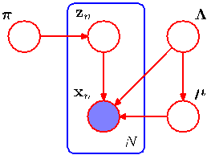

by (B.23). As we have seen, the parameter $\alpha_0$ can be interpreted as the effective prior number of observations associated with each component of the mixture. If the value of $\alpha_0$ is small, then the posterior distribution will be influenced primarily by the data rather than by the prior.

Similarly, we introduce an independent Gaussian-Wishart prior governing the mean and precision of each Gaussian component, given by

$$
\begin{aligned}
p(\boldsymbol{\mu}, \boldsymbol{\Lambda}) &= p(\boldsymbol{\mu}|\boldsymbol{\Lambda})p(\boldsymbol{\Lambda}) \\
&= \prod_{k=1}^K \mathcal{N}\left(\boldsymbol{\mu}_k|\mathbf{m}_0, (\beta_0 \boldsymbol{\Lambda}_k)^{-1}\right) \mathcal{W}(\boldsymbol{\Lambda}_k|\mathbf{W}_0, \nu_0)
\end{aligned} \tag{10.40}
$$

because this represents the conjugate prior distribution when both the mean and precision are unknown. Typically we would choose $\mathbf{m}_0 = \mathbf{0}$ by symmetry.

The resulting model can be represented as a directed graph as shown in Figure 10.5. Note that there is a link from $\boldsymbol{\Lambda}$ to $\boldsymbol{\mu}$ since the variance of the distribution over $\boldsymbol{\mu}$ in (10.40) is a function of $\boldsymbol{\Lambda}$.

This example provides a nice illustration of the distinction between latent variables and parameters. Variables such as $\mathbf{z}_n$ that appear inside the plate are regarded as latent variables because the number of such variables grows with the size of the data set. By contrast, variables such as $\boldsymbol{\mu}$ that are outside the plate are fixed in number independently of the size of the data set, and so are regarded as parameters. From the perspective of graphical models, however, there is really no fundamental difference between them.

## 10.2.1 Variational distribution

In order to formulate a variational treatment of this model, we next write down the joint distribution of all of the random variables, which is given by

$$
p(\mathbf{X}, \mathbf{Z}, \boldsymbol{\pi}, \boldsymbol{\mu}, \boldsymbol{\Lambda}) = p(\mathbf{X}|\mathbf{Z}, \boldsymbol{\mu}, \boldsymbol{\Lambda})p(\mathbf{Z}|\boldsymbol{\pi})p(\boldsymbol{\pi})p(\boldsymbol{\mu}|\boldsymbol{\Lambda})p(\boldsymbol{\Lambda}) \tag{10.41}
$$

in which the various factors are defined above. The reader should take a moment to verify that this decomposition does indeed correspond to the probabilistic graphical model shown in Figure 10.5. Note that only the variables $\mathbf{X} = \{\mathbf{x}_1,\dots,\mathbf{x}_N\}$ are observed.
[Page 496]

We now consider a variational distribution which factorizes between the latent variables and the parameters so that

$$
q(\mathbf{Z}, \boldsymbol{\pi}, \boldsymbol{\mu}, \boldsymbol{\Lambda}) = q(\mathbf{Z})q(\boldsymbol{\pi}, \boldsymbol{\mu}, \boldsymbol{\Lambda}). \tag{10.42}
$$

It is remarkable that this is the only assumption that we need to make in order to obtain a tractable practical solution to our Bayesian mixture model. In particular, the functional form of the factors $q(\mathbf{Z})$ and $q(\boldsymbol{\pi}, \boldsymbol{\mu}, \boldsymbol{\Lambda})$ will be determined automatically by optimization of the variational distribution. Note that we are omitting the subscripts on the $q$ distributions, much as we do with the $p$ distributions in (10.41), and are relying on the arguments to distinguish the different distributions.

The corresponding sequential update equations for these factors can be easily derived by making use of the general result (10.9). Let us consider the derivation of the update equation for the factor $q(\mathbf{Z})$. The log of the optimized factor is given by

$$
\ln q^\star(\mathbf{Z}) = \mathbb{E}_{\boldsymbol{\pi}, \boldsymbol{\mu}, \boldsymbol{\Lambda}}[\ln p(\mathbf{X}, \mathbf{Z}, \boldsymbol{\pi}, \boldsymbol{\mu}, \boldsymbol{\Lambda})] + \text{const}. \tag{10.43}
$$

We now make use of the decomposition (10.41). Note that we are only interested in the functional dependence of the right-hand side on the variable $\mathbf{Z}$. Thus any terms that do not depend on $\mathbf{Z}$ can be absorbed into the additive normalization constant, giving

$$
\ln q^\star(\mathbf{Z}) = \mathbb{E}_{\boldsymbol{\pi}}[\ln p(\mathbf{Z}|\boldsymbol{\pi})] + \mathbb{E}_{\boldsymbol{\mu}, \boldsymbol{\Lambda}}[\ln p(\mathbf{X}|\mathbf{Z}, \boldsymbol{\mu}, \boldsymbol{\Lambda})] + \text{const}. \tag{10.44}
$$

Substituting for the two conditional distributions on the right-hand side, and again absorbing any terms that are independent of $\mathbf{Z}$ into the additive constant, we have

$$
\ln q^\star(\mathbf{Z}) = \sum_{n=1}^N \sum_{k=1}^K z_{nk} \ln \rho_{nk} + \text{const} \tag{10.45}
$$

where we have defined

$$
\begin{aligned}
\ln \rho_{nk} &= \mathbb{E}[\ln \pi_k] + \frac{1}{2} \mathbb{E}[\ln |\boldsymbol{\Lambda}_k|] - \frac{D}{2} \ln(2\pi) \\
&\quad - \frac{1}{2} \mathbb{E}_{\boldsymbol{\mu}_k, \boldsymbol{\Lambda}_k} \left[ (\mathbf{x}_n - \boldsymbol{\mu}_k)^{\text{T}}\boldsymbol{\Lambda}_k(\mathbf{x}_n - \boldsymbol{\mu}_k) \right]
\end{aligned} \tag{10.46}
$$

where $D$ is the dimensionality of the data variable $\mathbf{x}$. Taking the exponential of both sides of (10.45) we obtain

$$
q^\star(\mathbf{Z}) \propto \prod_{n=1}^N \prod_{k=1}^K \rho_{nk}^{z_{nk}}. \tag{10.47}
$$

Requiring that this distribution be normalized, and noting that for each value of $n$ the quantities $z_{nk}$ are binary and sum to $1$ over all values of $k$, we obtain

$$
q^\star(\mathbf{Z}) = \prod_{n=1}^N \prod_{k=1}^K r_{nk}^{z_{nk}} \tag{10.48}
$$

[Page 497]

where

$$
r_{nk} = \frac{\rho_{nk}}{\sum_{j=1}^K \rho_{nj}}. \tag{10.49}
$$

We see that the optimal solution for the factor $q(\mathbf{Z})$ takes the same functional form as the prior $p(\mathbf{Z}|\boldsymbol{\pi})$. Note that because $\rho_{nk}$ is given by the exponential of a real quantity, the quantities $r_{nk}$ will be nonnegative and will sum to one, as required.

For the discrete distribution $q^\star(\mathbf{Z})$ we have the standard result

$$
\mathbb{E}[z_{nk}] = r_{nk} \tag{10.50}
$$

from which we see that the quantities $r_{nk}$ are playing the role of responsibilities. Note that the optimal solution for $q(\mathbf{Z})$ depends on moments evaluated with respect to the distributions of other variables, and so again the variational update equations are coupled and must be solved iteratively.

At this point, we shall find it convenient to define three statistics of the observed data set evaluated with respect to the responsibilities, given by

$$
N_k = \sum_{n=1}^N r_{nk} \tag{10.51}
$$

$$
\overline{\mathbf{x}}_k = \frac{1}{N_k} \sum_{n=1}^N r_{nk}\mathbf{x}_n \tag{10.52}
$$

$$
\mathbf{S}_k = \frac{1}{N_k} \sum_{n=1}^N r_{nk}(\mathbf{x}_n - \overline{\mathbf{x}}_k)(\mathbf{x}_n - \overline{\mathbf{x}}_k)^{\text{T}}. \tag{10.53}
$$

Note that these are analogous to quantities evaluated in the maximum likelihood EM algorithm for the Gaussian mixture model.

Now let us consider the factor $q(\boldsymbol{\pi}, \boldsymbol{\mu}, \boldsymbol{\Lambda})$ in the variational posterior distribution. Again using the general result (10.9) we have

$$
\begin{aligned}
\ln q^\star(\boldsymbol{\pi}, \boldsymbol{\mu}, \boldsymbol{\Lambda}) &= \ln p(\boldsymbol{\pi}) + \sum_{k=1}^K \ln p(\boldsymbol{\mu}_k, \boldsymbol{\Lambda}_k) + \mathbb{E}_{\mathbf{Z}}[\ln p(\mathbf{Z}|\boldsymbol{\pi})] \\
&\quad + \sum_{k=1}^K \sum_{n=1}^N \mathbb{E}[z_{nk}] \ln \mathcal{N}(\mathbf{x}_n|\boldsymbol{\mu}_k, \boldsymbol{\Lambda}_k^{-1}) + \text{const}.
\end{aligned} \tag{10.54}
$$

We observe that the right-hand side of this expression decomposes into a sum of terms involving only $\boldsymbol{\pi}$ together with terms only involving $\boldsymbol{\mu}$ and $\boldsymbol{\Lambda}$, which implies that the variational posterior $q(\boldsymbol{\pi}, \boldsymbol{\mu}, \boldsymbol{\Lambda})$ factorizes to give $q(\boldsymbol{\pi})q(\boldsymbol{\mu}, \boldsymbol{\Lambda})$. Furthermore, the terms involving $\boldsymbol{\mu}$ and $\boldsymbol{\Lambda}$ themselves comprise a sum over $k$ of terms involving $\boldsymbol{\mu}_k$ and $\boldsymbol{\Lambda}_k$ leading to the further factorization

$$
q(\boldsymbol{\pi}, \boldsymbol{\mu}, \boldsymbol{\Lambda}) = q(\boldsymbol{\pi}) \prod_{k=1}^K q(\boldsymbol{\mu}_k, \boldsymbol{\Lambda}_k). \tag{10.55}
$$

[Page 498]

Identifying the terms on the right-hand side of (10.54) that depend on $\boldsymbol{\pi}$, we have

$$
\ln q^\star(\boldsymbol{\pi}) = (\alpha_0 - 1) \sum_{k=1}^K \ln \pi_k + \sum_{k=1}^K \sum_{n=1}^N r_{nk} \ln \pi_k + \text{const} \tag{10.56}
$$

where we have used (10.50). Taking the exponential of both sides, we recognize $q^\star(\boldsymbol{\pi})$ as a Dirichlet distribution

$$
q^\star(\boldsymbol{\pi}) = \text{Dir}(\boldsymbol{\pi}|\boldsymbol{\alpha}) \tag{10.57}
$$

where $\boldsymbol{\alpha}$ has components $\alpha_k$ given by

$$
\alpha_k = \alpha_0 + N_k. \tag{10.58}
$$

Finally, the variational posterior distribution $q^\star(\boldsymbol{\mu}_k, \boldsymbol{\Lambda}_k)$ does not factorize into the product of the marginals, but we can always use the product rule to write it in the form $q(\boldsymbol{\mu}_k, \boldsymbol{\Lambda}_k) = q(\boldsymbol{\mu}_k|\boldsymbol{\Lambda}_k)q(\boldsymbol{\Lambda}_k)$. The two factors can be found by inspecting (10.54) and reading off those terms that involve $\boldsymbol{\mu}_k$ and $\boldsymbol{\Lambda}_k$. The result, as expected, is a Gaussian-Wishart distribution and is given by

$$
q^\star(\boldsymbol{\mu}_k, \boldsymbol{\Lambda}_k) = \mathcal{N}\left(\boldsymbol{\mu}_k|\mathbf{m}_k, (\beta_k \boldsymbol{\Lambda}_k)^{-1}\right) \mathcal{W}(\boldsymbol{\Lambda}_k|\mathbf{W}_k, \nu_k) \tag{10.59}
$$

where we have defined

$$
\beta_k = \beta_0 + N_k \tag{10.60}
$$

$$
\mathbf{m}_k = \frac{1}{\beta_k} (\beta_0 \mathbf{m}_0 + N_k \overline{\mathbf{x}}_k) \tag{10.61}
$$

$$
\mathbf{W}_k^{-1} = \mathbf{W}_0^{-1} + N_k \mathbf{S}_k + \frac{\beta_0 N_k}{\beta_0 + N_k} (\overline{\mathbf{x}}_k - \mathbf{m}_0)(\overline{\mathbf{x}}_k - \mathbf{m}_0)^{\text{T}} \tag{10.62}
$$

$$
\nu_k = \nu_0 + N_k. \tag{10.63}
$$

These update equations are analogous to the M-step equations of the EM algorithm for the maximum likelihood solution of the mixture of Gaussians. We see that the computations that must be performed in order to update the variational posterior distribution over the model parameters involve evaluation of the same sums over the data set, as arose in the maximum likelihood treatment.

In order to perform this variational M step, we need the expectations $\mathbb{E}[z_{nk}] = r_{nk}$ representing the responsibilities. These are obtained by normalizing the $\rho_{nk}$ that are given by (10.46). We see that this expression involves expectations with respect to the variational distributions of the parameters, and these are easily evaluated to give

$$
\begin{aligned}
&\mathbb{E}_{\boldsymbol{\mu}_k, \boldsymbol{\Lambda}_k} \left[ (\mathbf{x}_n - \boldsymbol{\mu}_k)^{\text{T}} \boldsymbol{\Lambda}_k (\mathbf{x}_n - \boldsymbol{\mu}_k) \right] \\
&\quad = D \beta_k^{-1} + \nu_k (\mathbf{x}_n - \mathbf{m}_k)^{\text{T}} \mathbf{W}_k (\mathbf{x}_n - \mathbf{m}_k)
\end{aligned} \tag{10.64}
$$

$$
\ln \widetilde{\Lambda}_k \equiv \mathbb{E}[\ln |\boldsymbol{\Lambda}_k|] = \sum_{i=1}^D \psi \left( \frac{\nu_k + 1 - i}{2} \right) + D \ln 2 + \ln |\mathbf{W}_k| \tag{10.65}
$$

$$
\ln \widetilde{\pi}_k \equiv \mathbb{E}[\ln \pi_k] = \psi(\alpha_k) - \psi(\widehat{\alpha}) \tag{10.66}
$$

[Page 499]

where we have introduced definitions of $\widetilde{\Lambda}_k$ and $\widetilde{\pi}_k$, and $\psi(\cdot)$ is the digamma function defined by (B.25), with $\widehat{\alpha} = \sum_k \alpha_k$. The results (10.65) and (10.66) follow from the standard properties of the Wishart and Dirichlet distributions.

If we substitute (10.64), (10.65), and (10.66) into (10.46) and make use of (10.49), we obtain the following result for the responsibilities

$$
r_{nk} \propto \widetilde{\pi}_k \widetilde{\Lambda}_k^{1/2} \exp \left\{ - \frac{D}{2\beta_k} - \frac{\nu_k}{2} (\mathbf{x}_n - \mathbf{m}_k)^{\text{T}} \mathbf{W}_k (\mathbf{x}_n - \mathbf{m}_k) \right\}. \tag{10.67}
$$

Notice the similarity to the corresponding result for the responsibilities in maximum likelihood EM, which from (9.13) can be written in the form

$$
r_{nk} \propto \pi_k |\boldsymbol{\Lambda}_k|^{1/2} \exp \left\{ - \frac{1}{2} (\mathbf{x}_n - \boldsymbol{\mu}_k)^{\text{T}} \boldsymbol{\Lambda}_k (\mathbf{x}_n - \boldsymbol{\mu}_k) \right\} \tag{10.68}
$$

where we have used the precision in place of the covariance to highlight the similarity to (10.67).

Thus the optimization of the variational posterior distribution involves cycling between two stages analogous to the E and M steps of the maximum likelihood EM algorithm. In the variational equivalent of the E step, we use the current distributions over the model parameters to evaluate the moments in (10.64), (10.65), and (10.66) and hence evaluate $\mathbb{E}[z_{nk}] = r_{nk}$. Then in the subsequent variational equivalent of the M step, we keep these responsibilities fixed and use them to re-compute the variational distribution over the parameters using (10.57) and (10.59). In each case, we see that the variational posterior distribution has the same functional form as the corresponding factor in the joint distribution (10.41). This is a general result and is a consequence of the choice of conjugate distributions.

Figure 10.6 shows the results of applying this approach to the rescaled Old Faithful data set for a Gaussian mixture model having $K = 6$ components. We see that after convergence, there are only two components for which the expected values of the mixing coefficients are numerically distinguishable from their prior values. This effect can be understood qualitatively in terms of the automatic trade-off in a Bayesian model between fitting the data and the complexity of the model, in which the complexity penalty arises from components whose parameters are pushed away from their prior values. Components that take essentially no responsibility for explaining the data points have $r_{nk} \simeq 0$ and hence $N_k \simeq 0$. From (10.58), we see that $\alpha_k \simeq \alpha_0$ and from (10.60)–(10.63) we see that the other parameters revert to their prior values. In principle such components are fitted slightly to the data points, but for broad priors this effect is too small to be seen numerically. For the variational Gaussian mixture model the expected values of the mixing coefficients in the posterior distribution are given by

$$
\mathbb{E}[\pi_k] = \frac{\alpha_0 + N_k}{K\alpha_0 + N}. \tag{10.69}
$$

Consider a component for which $N_k \simeq 0$ and $\alpha_k \simeq \alpha_0$. If the prior is broad so that $\alpha_0 \to 0$, then $\mathbb{E}[\pi_k] \to 0$ and the component plays no role in the model, whereas if
[Page 500]

Figure 10.6 Variational Bayesian mixture of $K = 6$ Gaussians applied to the Old Faithful data set, in which the ellipses denote the one standard-deviation density contours for each of the components, and the density of red ink inside each ellipse corresponds to the mean value of the mixing coefficient for each component. The number in the top left of each diagram shows the number of iterations of variational inference. Components whose expected mixing coefficient are numerically indistinguishable from zero are not plotted.

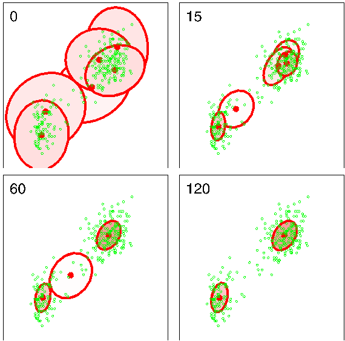

the prior tightly constrains the mixing coefficients so that $\alpha_0 \to \infty$, then $\mathbb{E}[\pi_k] \to 1/K$.

In Figure 10.6, the prior over the mixing coefficients is a Dirichlet of the form (10.39). Recall from Figure 2.5 that for $\alpha_0 < 1$ the prior favours solutions in which some of the mixing coefficients are zero. Figure 10.6 was obtained using $\alpha_0 = 10^{-3}$, and resulted in two components having nonzero mixing coefficients. If instead we choose $\alpha_0 = 1$ we obtain three components with nonzero mixing coefficients, and for $\alpha = 10$ all six components have nonzero mixing coefficients.

As we have seen there is a close similarity between the variational solution for the Bayesian mixture of Gaussians and the EM algorithm for maximum likelihood. In fact if we consider the limit $N \to \infty$ then the Bayesian treatment converges to the maximum likelihood EM algorithm. For anything other than very small data sets, the dominant computational cost of the variational algorithm for Gaussian mixtures arises from the evaluation of the responsibilities, together with the evaluation and inversion of the weighted data covariance matrices. These computations mirror precisely those that arise in the maximum likelihood EM algorithm, and so there is little computational overhead in using this Bayesian approach as compared to the traditional maximum likelihood one. There are, however, some substantial advantages. First of all, the singularities that arise in maximum likelihood when a Gaussian component ‘collapses’ onto a specific data point are absent in the Bayesian treatment.
[Page 501]

Indeed, these singularities are removed if we simply introduce a prior and then use a MAP estimate instead of maximum likelihood. Furthermore, there is no over-fitting if we choose a large number $K$ of components in the mixture, as we saw in Figure 10.6. Finally, the variational treatment opens up the possibility of determining the optimal number of components in the mixture without resorting to techniques such as cross validation.

## 10.2.2 Variational lower bound

We can also straightforwardly evaluate the lower bound (10.3) for this model. In practice, it is useful to be able to monitor the bound during the re-estimation in order to test for convergence. It can also provide a valuable check on both the mathematical expressions for the solutions and their software implementation, because at each step of the iterative re-estimation procedure the value of this bound should not decrease. We can take this a stage further to provide a deeper test of the correctness of both the mathematical derivation of the update equations and of their software implementation by using finite differences to check that each update does indeed give a (constrained) maximum of the bound (Svensén and Bishop, 2004).

For the variational mixture of Gaussians, the lower bound (10.3) is given by

$$
\begin{aligned}
\mathcal{L} &= \sum_{\mathbf{Z}} \iiint q(\mathbf{Z}, \boldsymbol{\pi}, \boldsymbol{\mu}, \boldsymbol{\Lambda}) \ln \left\{ \frac{p(\mathbf{X}, \mathbf{Z}, \boldsymbol{\pi}, \boldsymbol{\mu}, \boldsymbol{\Lambda})}{q(\mathbf{Z}, \boldsymbol{\pi}, \boldsymbol{\mu}, \boldsymbol{\Lambda})} \right\} \text{d}\boldsymbol{\pi} \text{d}\boldsymbol{\mu} \text{d}\boldsymbol{\Lambda} \\
&= \mathbb{E}[\ln p(\mathbf{X}, \mathbf{Z}, \boldsymbol{\pi}, \boldsymbol{\mu}, \boldsymbol{\Lambda})] - \mathbb{E}[\ln q(\mathbf{Z}, \boldsymbol{\pi}, \boldsymbol{\mu}, \boldsymbol{\Lambda})] \\
&= \mathbb{E}[\ln p(\mathbf{X}|\mathbf{Z}, \boldsymbol{\mu}, \boldsymbol{\Lambda})] + \mathbb{E}[\ln p(\mathbf{Z}|\boldsymbol{\pi})] + \mathbb{E}[\ln p(\boldsymbol{\pi})] + \mathbb{E}[\ln p(\boldsymbol{\mu}, \boldsymbol{\Lambda})] \\
&\quad - \mathbb{E}[\ln q(\mathbf{Z})] - \mathbb{E}[\ln q(\boldsymbol{\pi})] - \mathbb{E}[\ln q(\boldsymbol{\mu}, \boldsymbol{\Lambda})]
\end{aligned} \tag{10.70}
$$

where, to keep the notation uncluttered, we have omitted the superscript on the $q$ distributions, along with the subscripts on the expectation operators because each expectation is taken with respect to all of the random variables in its argument. The various terms in the bound are easily evaluated to give the following results

$$
\begin{aligned}
\mathbb{E}[\ln p(\mathbf{X}|\mathbf{Z}, \boldsymbol{\mu}, \boldsymbol{\Lambda})] &= \frac{1}{2} \sum_{k=1}^K N_k \Big\{ \ln \widetilde{\Lambda}_k - D\beta_k^{-1} - \nu_k \text{Tr}(\mathbf{S}_k \mathbf{W}_k) \\
&\quad - \nu_k(\overline{\mathbf{x}}_k - \mathbf{m}_k)^{\text{T}}\mathbf{W}_k(\overline{\mathbf{x}}_k - \mathbf{m}_k) - D \ln(2\pi) \Big\}
\end{aligned} \tag{10.71}
$$

$$
\mathbb{E}[\ln p(\mathbf{Z}|\boldsymbol{\pi})] = \sum_{n=1}^N \sum_{k=1}^K r_{nk} \ln \widetilde{\pi}_k \tag{10.72}
$$

$$
\mathbb{E}[\ln p(\boldsymbol{\pi})] = \ln C(\boldsymbol{\alpha}_0) + (\alpha_0 - 1) \sum_{k=1}^K \ln \widetilde{\pi}_k \tag{10.73}
$$

[Page 502]

$$
\begin{aligned}
\mathbb{E}[\ln p(\boldsymbol{\mu}, \boldsymbol{\Lambda})] &= \frac{1}{2} \sum_{k=1}^K \Big\{ D \ln(\beta_0/2\pi) + \ln \widetilde{\Lambda}_k - \frac{D\beta_0}{\beta_k} \\
&\quad - \beta_0 \nu_k (\mathbf{m}_k - \mathbf{m}_0)^{\text{T}}\mathbf{W}_k(\mathbf{m}_k - \mathbf{m}_0) \Big\} + K \ln B(\mathbf{W}_0, \nu_0) \\
&\quad + \frac{(\nu_0 - D - 1)}{2} \sum_{k=1}^K \ln \widetilde{\Lambda}_k - \frac{1}{2} \sum_{k=1}^K \nu_k \text{Tr}(\mathbf{W}_0^{-1} \mathbf{W}_k)
\end{aligned} \tag{10.74}
$$

$$
\mathbb{E}[\ln q(\mathbf{Z})] = \sum_{n=1}^N \sum_{k=1}^K r_{nk} \ln r_{nk} \tag{10.75}
$$

$$
\mathbb{E}[\ln q(\boldsymbol{\pi})] = \sum_{k=1}^K (\alpha_k - 1)\ln \widetilde{\pi}_k + \ln C(\boldsymbol{\alpha}) \tag{10.76}
$$

$$
\mathbb{E}[\ln q(\boldsymbol{\mu}, \boldsymbol{\Lambda})] = \sum_{k=1}^K \left\{ \frac{1}{2} \ln \widetilde{\Lambda}_k + \frac{D}{2} \ln \left( \frac{\beta_k}{2\pi} \right) - \frac{D}{2} - H[q(\boldsymbol{\Lambda}_k)] \right\} \tag{10.77}
$$

where $D$ is the dimensionality of $\mathbf{x}$, $H[q(\boldsymbol{\Lambda}_k)]$ is the entropy of the Wishart distribution given by (B.82), and the coefficients $C(\boldsymbol{\alpha})$ and $B(\mathbf{W}, \nu)$ are defined by (B.23) and (B.79), respectively. Note that the terms involving expectations of the logs of the $q$ distributions simply represent the negative entropies of those distributions. Some simplifications and combination of terms can be performed when these expressions are summed to give the lower bound. However, we have kept the expressions separate for ease of understanding.

Finally, it is worth noting that the lower bound provides an alternative approach for deriving the variational re-estimation equations obtained in Section 10.2.1. To do this we use the fact that, since the model has conjugate priors, the functional form of the factors in the variational posterior distribution is known, namely discrete for $\mathbf{Z}$, Dirichlet for $\boldsymbol{\pi}$, and Gaussian-Wishart for $(\boldsymbol{\mu}_k, \boldsymbol{\Lambda}_k)$. By taking general parametric forms for these distributions we can derive the form of the lower bound as a function of the parameters of the distributions. Maximizing the bound with respect to these parameters then gives the required re-estimation equations.

## 10.2.3 Predictive density

In applications of the Bayesian mixture of Gaussians model we will often be interested in the predictive density for a new value $\widehat{\mathbf{x}}$ of the observed variable. Associated with this observation will be a corresponding latent variable $\widehat{\mathbf{z}}$, and the predictive density is then given by

$$
p(\widehat{\mathbf{x}}|\mathbf{X}) = \sum_{\widehat{\mathbf{z}}} \iiint p(\widehat{\mathbf{x}}|\widehat{\mathbf{z}}, \boldsymbol{\mu}, \boldsymbol{\Lambda})p(\widehat{\mathbf{z}}|\boldsymbol{\pi})p(\boldsymbol{\pi}, \boldsymbol{\mu}, \boldsymbol{\Lambda}|\mathbf{X}) \text{d}\boldsymbol{\pi} \text{d}\boldsymbol{\mu} \text{d}\boldsymbol{\Lambda} \tag{10.78}
$$

[Page 503]

where $p(\boldsymbol{\pi}, \boldsymbol{\mu}, \boldsymbol{\Lambda}|\mathbf{X})$ is the (unknown) true posterior distribution of the parameters. Using (10.37) and (10.38) we can first perform the summation over $\widehat{\mathbf{z}}$ to give

$$
p(\widehat{\mathbf{x}}|\mathbf{X}) = \sum_{k=1}^K \iiint \pi_k \mathcal{N}\left(\widehat{\mathbf{x}}|\boldsymbol{\mu}_k, \boldsymbol{\Lambda}_k^{-1}\right) p(\boldsymbol{\pi}, \boldsymbol{\mu}, \boldsymbol{\Lambda}|\mathbf{X}) \text{d}\boldsymbol{\pi} \text{d}\boldsymbol{\mu} \text{d}\boldsymbol{\Lambda}. \tag{10.79}
$$

Because the remaining integrations are intractable, we approximate the predictive density by replacing the true posterior distribution $p(\boldsymbol{\pi}, \boldsymbol{\mu}, \boldsymbol{\Lambda}|\mathbf{X})$ with its variational approximation $q(\boldsymbol{\pi})q(\boldsymbol{\mu}, \boldsymbol{\Lambda})$ to give

$$
p(\widehat{\mathbf{x}}|\mathbf{X}) = \sum_{k=1}^K \iiint \pi_k \mathcal{N}\left(\widehat{\mathbf{x}}|\boldsymbol{\mu}_k, \boldsymbol{\Lambda}_k^{-1}\right) q(\boldsymbol{\pi})q(\boldsymbol{\mu}_k, \boldsymbol{\Lambda}_k) \text{d}\boldsymbol{\pi} \text{d}\boldsymbol{\mu}_k \text{d}\boldsymbol{\Lambda}_k \tag{10.80}
$$

where we have made use of the factorization (10.55) and in each term we have implicitly integrated out all variables $\{\boldsymbol{\mu}_j, \boldsymbol{\Lambda}_j\}$ for $j \neq k$ The remaining integrations can now be evaluated analytically giving a mixture of Student’s t-distributions

$$
p(\widehat{\mathbf{x}}|\mathbf{X}) = \frac{1}{\widehat{\alpha}} \sum_{k=1}^K \alpha_k \text{St}(\widehat{\mathbf{x}}|\mathbf{m}_k, \mathbf{L}_k, \nu_k + 1 - D) \tag{10.81}
$$

in which the $k^{\text{th}}$ component has mean $\mathbf{m}_k$, and the precision is given by

$$
\mathbf{L}_k = \frac{(\nu_k + 1 - D)\beta_k}{(1 + \beta_k)} \mathbf{W}_k \tag{10.82}
$$

in which $\nu_k$ is given by (10.63). When the size $N$ of the data set is large the predictive distribution (10.81) reduces to a mixture of Gaussians.

## 10.2.4 Determining the number of components

We have seen that the variational lower bound can be used to determine a posterior distribution over the number $K$ of components in the mixture model. There is, however, one subtlety that needs to be addressed. For any given setting of the parameters in a Gaussian mixture model (except for specific degenerate settings), there will exist other parameter settings for which the density over the observed variables will be identical. These parameter values differ only through a re-labelling of the components. For instance, consider a mixture of two Gaussians and a single observed variable $x$, in which the parameters have the values $\pi_1 = a, \pi_2 = b, \mu_1 = c, \mu_2 = d, \sigma_1 = e, \sigma_2 = f$. Then the parameter values $\pi_1 = b, \pi_2 = a, \mu_1 = d, \mu_2 = c, \sigma_1 = f, \sigma_2 = e$, in which the two components have been exchanged, will by symmetry give rise to the same value of $p(x)$. If we have a mixture model comprising $K$ components, then each parameter setting will be a member of a family of $K!$ equivalent settings.

In the context of maximum likelihood, this redundancy is irrelevant because the parameter optimization algorithm (for example EM) will, depending on the initialization of the parameters, find one specific solution, and the other equivalent solutions play no role. In a Bayesian setting, however, we marginalize over all possible
[Page 504]

Figure 10.7 Plot of the variational lower bound $\mathcal{L}$ versus the number $K$ of components in the Gaussian mixture model, for the Old Faithful data, showing a distinct peak at $K = 2$ components. For each value of $K$, the model is trained from 100 different random starts, and the results shown as ‘+’ symbols plotted with small random horizontal perturbations so that they can be distinguished. Note that some solutions find suboptimal local maxima, but that this happens infrequently.

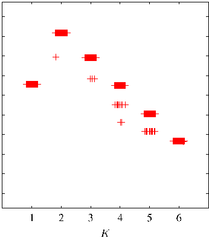

parameter values. We have seen in Figure 10.2 that if the true posterior distribution is multimodal, variational inference based on the minimization of $\text{KL}(q\|p)$ will tend to approximate the distribution in the neighbourhood of one of the modes and ignore the others. Again, because equivalent modes have equivalent predictive densities, this is of no concern provided we are considering a model having a specific number $K$ of components. If, however, we wish to compare different values of $K$, then we need to take account of this multimodality. A simple approximate solution is to add a term $\ln K!$ onto the lower bound when used for model comparison and averaging.

Figure 10.7 shows a plot of the lower bound, including the multimodality factor, versus the number $K$ of components for the Old Faithful data set. It is worth emphasizing once again that maximum likelihood would lead to values of the likelihood function that increase monotonically with $K$ (assuming the singular solutions have been avoided, and discounting the effects of local maxima) and so cannot be used to determine an appropriate model complexity. By contrast, Bayesian inference automatically makes the trade-off between model complexity and fitting the data.

This approach to the determination of $K$ requires that a range of models having different $K$ values be trained and compared. An alternative approach to determining a suitable value for $K$ is to treat the mixing coefficients $\boldsymbol{\pi}$ as parameters and make point estimates of their values by maximizing the lower bound (Corduneanu and Bishop, 2001) with respect to $\boldsymbol{\pi}$ instead of maintaining a probability distribution over them as in the fully Bayesian approach. This leads to the re-estimation equation

$$
\pi_k = \frac{1}{N} \sum_{n=1}^N r_{nk} \tag{10.83}
$$

and this maximization is interleaved with the variational updates for the $q$ distribution over the remaining parameters. Components that provide insufficient contribution
[Page 505]

to explaining the data will have their mixing coefficients driven to zero during the optimization, and so they are effectively removed from the model through automatic relevance determination. This allows us to make a single training run in which we start with a relatively large initial value of $K$, and allow surplus components to be pruned out of the model. The origins of the sparsity when optimizing with respect to hyperparameters is discussed in detail in the context of the relevance vector machine.

## 10.2.5 Induced factorizations

In deriving these variational update equations for the Gaussian mixture model, we assumed a particular factorization of the variational posterior distribution given by (10.42). However, the optimal solutions for the various factors exhibit additional factorizations. In particular, the solution for $q(\boldsymbol{\mu}, \boldsymbol{\Lambda})$ is given by the product of an independent distribution $q(\boldsymbol{\mu}_k, \boldsymbol{\Lambda}_k)$ over each of the components $k$ of the mixture, whereas the variational posterior distribution $q(\mathbf{Z})$ over the latent variables, given by (10.48), factorizes into an independent distribution $q(\mathbf{z}_n)$ for each observation $n$ (note that it does not further factorize with respect to $k$ because, for each value of $n$, the $z_{nk}$ are constrained to sum to one over $k$). These additional factorizations are a consequence of the interaction between the assumed factorization and the conditional independence properties of the true distribution, as characterized by the directed graph in Figure 10.5.

We shall refer to these additional factorizations as induced factorizations because they arise from an interaction between the factorization assumed in the variational posterior distribution and the conditional independence properties of the true joint distribution. In a numerical implementation of the variational approach it is important to take account of such additional factorizations. For instance, it would be very inefficient to maintain a full precision matrix for the Gaussian distribution over a set of variables if the optimal form for that distribution always had a diagonal precision matrix (corresponding to a factorization with respect to the individual variables described by that Gaussian).

Such induced factorizations can easily be detected using a simple graphical test based on d-separation as follows. We partition the latent variables into three disjoint groups $\mathbf{A}, \mathbf{B}, \mathbf{C}$ and then let us suppose that we are assuming a factorization between $\mathbf{C}$ and the remaining latent variables, so that

$$
q(\mathbf{A}, \mathbf{B}, \mathbf{C}) = q(\mathbf{A}, \mathbf{B})q(\mathbf{C}). \tag{10.84}
$$

Using the general result (10.9), together with the product rule for probabilities, we see that the optimal solution for $q(\mathbf{A}, \mathbf{B})$ is given by

$$
\begin{aligned}
\ln q^\star(\mathbf{A}, \mathbf{B}) &= \mathbb{E}_{\mathbf{C}}[\ln p(\mathbf{X}, \mathbf{A}, \mathbf{B}, \mathbf{C})] + \text{const} \\
&= \mathbb{E}_{\mathbf{C}}[\ln p(\mathbf{A}, \mathbf{B}|\mathbf{X}, \mathbf{C})] + \text{const}.
\end{aligned} \tag{10.85}
$$

We now ask whether this resulting solution will factorize between $\mathbf{A}$ and $\mathbf{B}$, in other words whether $q^\star(\mathbf{A}, \mathbf{B}) = q^\star(\mathbf{A})q^\star(\mathbf{B})$. This will happen if, and only if, $\ln p(\mathbf{A}, \mathbf{B}|\mathbf{X}, \mathbf{C}) = \ln p(\mathbf{A}|\mathbf{X}, \mathbf{C}) + \ln p(\mathbf{B}|\mathbf{X}, \mathbf{C})$, that is, if the conditional independence relation

$$
\mathbf{A} \perp\!\!\!\perp \mathbf{B} | \mathbf{X}, \mathbf{C} \tag{10.86}
$$

[Page 506]

is satisfied. We can test to see if this relation does hold, for any choice of $\mathbf{A}$ and $\mathbf{B}$ by making use of the d-separation criterion.

To illustrate this, consider again the Bayesian mixture of Gaussians represented by the directed graph in Figure 10.5, in which we are assuming a variational factorization given by (10.42). We can see immediately that the variational posterior distribution over the parameters must factorize between $\boldsymbol{\pi}$ and the remaining parameters $\boldsymbol{\mu}$ and $\boldsymbol{\Lambda}$ because all paths connecting $\boldsymbol{\pi}$ to either $\boldsymbol{\mu}$ or $\boldsymbol{\Lambda}$ must pass through one of the nodes $\mathbf{z}_n$ all of which are in the conditioning set for our conditional independence test and all of which are head-to-tail with respect to such paths.

## 10.3. Variational Linear Regression

As a second illustration of variational inference, we return to the Bayesian linear regression model of Section 3.3. In the evidence framework, we approximated the integration over $\alpha$ and $\beta$ by making point estimates obtained by maximizing the log marginal likelihood. A fully Bayesian approach would integrate over the hyperparameters as well as over the parameters. Although exact integration is intractable, we can use variational methods to find a tractable approximation. In order to simplify the discussion, we shall suppose that the noise precision parameter $\beta$ is known, and is fixed to its true value, although the framework is easily extended to include the distribution over $\beta$. For the linear regression model, the variational treatment will turn out to be equivalent to the evidence framework. Nevertheless, it provides a good exercise in the use of variational methods and will also lay the foundation for variational treatment of Bayesian logistic regression in Section 10.6.

Recall that the likelihood function for $\mathbf{w}$, and the prior over $\mathbf{w}$, are given by

$$
p(\mathbf{t}|\mathbf{w}) = \prod_{n=1}^N \mathcal{N}(t_n|\mathbf{w}^{\text{T}}\boldsymbol{\phi}_n, \beta^{-1}) \tag{10.87}
$$

$$
p(\mathbf{w}|\alpha) = \mathcal{N}(\mathbf{w}|\mathbf{0}, \alpha^{-1}\mathbf{I}) \tag{10.88}
$$

where $\boldsymbol{\phi}_n = \boldsymbol{\phi}(\mathbf{x}_n)$. We now introduce a prior distribution over $\alpha$. From our discussion in Section 2.3.6, we know that the conjugate prior for the precision of a Gaussian is given by a gamma distribution, and so we choose

$$
p(\alpha) = \text{Gam}(\alpha|a_0, b_0) \tag{10.89}
$$

where $\text{Gam}(\cdot|\cdot, \cdot)$ is defined by (B.26). Thus the joint distribution of all the variables is given by

$$
p(\mathbf{t}, \mathbf{w}, \alpha) = p(\mathbf{t}|\mathbf{w})p(\mathbf{w}|\alpha)p(\alpha). \tag{10.90}
$$

This can be represented as a directed graphical model as shown in Figure 10.8.

## 10.3.1 Variational distribution

Our first goal is to find an approximation to the posterior distribution $p(\mathbf{w}, \alpha|\mathbf{t})$. To do this, we employ the variational framework of Section 10.1, with a variational
[Page 507]

Figure 10.8 Probabilistic graphical model representing the joint distribution (10.90) for the Bayesian linear regression model.

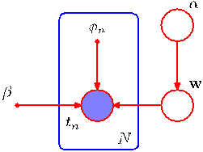

posterior distribution given by the factorized expression

$$
q(\mathbf{w}, \alpha) = q(\mathbf{w})q(\alpha). \tag{10.91}
$$

We can find re-estimation equations for the factors in this distribution by making use of the general result (10.9). Recall that for each factor, we take the log of the joint distribution over all variables and then average with respect to those variables not in that factor. Consider first the distribution over $\alpha$. Keeping only terms that have a functional dependence on $\alpha$, we have

$$
\begin{aligned}
\ln q^\star(\alpha) &= \ln p(\alpha) + \mathbb{E}_{\mathbf{w}}[\ln p(\mathbf{w}|\alpha)] + \text{const} \\
&= (a_0 - 1)\ln \alpha - b_0 \alpha + \frac{M}{2} \ln \alpha - \frac{\alpha}{2} \mathbb{E}[\mathbf{w}^{\text{T}}\mathbf{w}] + \text{const}.
\end{aligned} \tag{10.92}
$$

We recognize this as the log of a gamma distribution, and so identifying the coefficients of $\alpha$ and $\ln \alpha$ we obtain

$$
q^\star(\alpha) = \text{Gam}(\alpha|a_N, b_N) \tag{10.93}
$$

where

$$
a_N = a_0 + \frac{M}{2} \tag{10.94}
$$

$$
b_N = b_0 + \frac{1}{2} \mathbb{E}[\mathbf{w}^{\text{T}}\mathbf{w}]. \tag{10.95}
$$

Similarly, we can find the variational re-estimation equation for the posterior distribution over $\mathbf{w}$. Again, using the general result (10.9), and keeping only those terms that have a functional dependence on $\mathbf{w}$, we have

$$
\ln q^\star(\mathbf{w}) = \ln p(\mathbf{t}|\mathbf{w}) + \mathbb{E}_{\alpha}[\ln p(\mathbf{w}|\alpha)] + \text{const} \tag{10.96}
$$

$$
= -\frac{\beta}{2} \sum_{n=1}^N \{ \mathbf{w}^{\text{T}}\boldsymbol{\phi}_n - t_n \}^2 - \frac{1}{2} \mathbb{E}[\alpha]\mathbf{w}^{\text{T}}\mathbf{w} + \text{const} \tag{10.97}
$$

$$
= -\frac{1}{2} \mathbf{w}^{\text{T}} (\mathbb{E}[\alpha]\mathbf{I} + \beta \boldsymbol{\Phi}^{\text{T}}\boldsymbol{\Phi})\mathbf{w} + \beta \mathbf{w}^{\text{T}} \boldsymbol{\Phi}^{\text{T}} \mathbf{t} + \text{const}. \tag{10.98}
$$

Because this is a quadratic form, the distribution $q^\star(\mathbf{w})$ is Gaussian, and so we can complete the square in the usual way to identify the mean and covariance, giving

$$
q^\star(\mathbf{w}) = \mathcal{N}(\mathbf{w}|\mathbf{m}_N, \mathbf{S}_N) \tag{10.99}
$$

[Page 508]

where

$$
\mathbf{m}_N = \beta \mathbf{S}_N \boldsymbol{\Phi}^{\text{T}} \mathbf{t} \tag{10.100}
$$

$$
\mathbf{S}_N = (\mathbb{E}[\alpha]\mathbf{I} + \beta \boldsymbol{\Phi}^{\text{T}}\boldsymbol{\Phi})^{-1}. \tag{10.101}
$$

Note the close similarity to the posterior distribution (3.52) obtained when $\alpha$ was treated as a fixed parameter. The difference is that here $\alpha$ is replaced by its expectation $\mathbb{E}[\alpha]$ under the variational distribution. Indeed, we have chosen to use the same notation for the covariance matrix $\mathbf{S}_N$ in both cases.

Using the standard results (B.27), (B.38), and (B.39), we can obtain the required moments as follows

$$
\mathbb{E}[\alpha] = a_N / b_N \tag{10.102}
$$

$$
\mathbb{E}[\mathbf{w}\mathbf{w}^{\text{T}}] = \mathbf{m}_N \mathbf{m}_N^{\text{T}} + \mathbf{S}_N. \tag{10.103}
$$

The evaluation of the variational posterior distribution begins by initializing the parameters of one of the distributions $q(\mathbf{w})$ or $q(\alpha)$, and then alternately re-estimates these factors in turn until a suitable convergence criterion is satisfied (usually specified in terms of the lower bound to be discussed shortly).

It is instructive to relate the variational solution to that found using the evidence framework in Section 3.5. To do this consider the case $a_0 = b_0 = 0$, corresponding to the limit of an infinitely broad prior over $\alpha$. The mean of the variational posterior distribution $q(\alpha)$ is then given by

$$
\mathbb{E}[\alpha] = \frac{a_N}{b_N} = \frac{M/2}{\mathbb{E}[\mathbf{w}^{\text{T}}\mathbf{w}]/2} = \frac{M}{\mathbf{m}_N^{\text{T}}\mathbf{m}_N + \text{Tr}(\mathbf{S}_N)}. \tag{10.104}
$$

Comparison with (9.63) shows that in the case of this particularly simple model, the variational approach gives precisely the same expression as that obtained by maximizing the evidence function using EM except that the point estimate for $\alpha$ is replaced by its expected value. Because the distribution $q(\mathbf{w})$ depends on $q(\alpha)$ only through the expectation $\mathbb{E}[\alpha]$, we see that the two approaches will give identical results for the case of an infinitely broad prior.

## 10.3.2 Predictive distribution

The predictive distribution over $t$, given a new input $\mathbf{x}$, is easily evaluated for this model using the Gaussian variational posterior for the parameters

$$
\begin{aligned}
p(t|\mathbf{x}, \mathbf{t}) &= \int p(t|\mathbf{x}, \mathbf{w})p(\mathbf{w}|\mathbf{t}) \text{d}\mathbf{w} \\
&\simeq \int p(t|\mathbf{x}, \mathbf{w})q(\mathbf{w}) \text{d}\mathbf{w} \\
&= \int \mathcal{N}(t|\mathbf{w}^{\text{T}}\boldsymbol{\phi}(\mathbf{x}), \beta^{-1}) \mathcal{N}(\mathbf{w}|\mathbf{m}_N, \mathbf{S}_N) \text{d}\mathbf{w} \\
&= \mathcal{N}(t|\mathbf{m}_N^{\text{T}}\boldsymbol{\phi}(\mathbf{x}), \sigma^2(\mathbf{x}))
\end{aligned} \tag{10.105}
$$

[Page 509]

where we have evaluated the integral by making use of the result (2.115) for the linear-Gaussian model. Here the input-dependent variance is given by

$$
\sigma^2(\mathbf{x}) = \frac{1}{\beta} + \boldsymbol{\phi}(\mathbf{x})^{\text{T}}\mathbf{S}_N\boldsymbol{\phi}(\mathbf{x}). \tag{10.106}
$$

Note that this takes the same form as the result (3.59) obtained with fixed $\alpha$ except that now the expected value $\mathbb{E}[\alpha]$ appears in the definition of $\mathbf{S}_N$.

## 10.3.3 Lower bound

Another quantity of importance is the lower bound $\mathcal{L}$ defined by

$$
\begin{aligned}
\mathcal{L}(q) &= \mathbb{E}[\ln p(\mathbf{w}, \alpha, \mathbf{t})] - \mathbb{E}[\ln q(\mathbf{w}, \alpha)] \\
&= \mathbb{E}_{\mathbf{w}}[\ln p(\mathbf{t}|\mathbf{w})] + \mathbb{E}_{\mathbf{w}, \alpha}[\ln p(\mathbf{w}|\alpha)] + \mathbb{E}_{\alpha}[\ln p(\alpha)] \\
&\quad - \mathbb{E}_{\mathbf{w}}[\ln q(\mathbf{w})] - \mathbb{E}_{\alpha}[\ln q(\alpha)].
\end{aligned} \tag{10.107}
$$

Evaluation of the various terms is straightforward, making use of results obtained in previous chapters, and gives

$$
\begin{aligned}
\mathbb{E}_{\mathbf{w}}[\ln p(\mathbf{t}|\mathbf{w})] &= \frac{N}{2} \ln \left( \frac{\beta}{2\pi} \right) - \frac{\beta}{2} \mathbf{t}^{\text{T}}\mathbf{t} + \beta \mathbf{m}_N^{\text{T}} \boldsymbol{\Phi}^{\text{T}}\mathbf{t} \\
&\quad - \frac{\beta}{2} \text{Tr} \left[ \boldsymbol{\Phi}^{\text{T}}\boldsymbol{\Phi} (\mathbf{m}_N \mathbf{m}_N^{\text{T}} + \mathbf{S}_N) \right]
\end{aligned} \tag{10.108}
$$

$$
\begin{aligned}
\mathbb{E}_{\mathbf{w}, \alpha}[\ln p(\mathbf{w}|\alpha)] &= -\frac{M}{2} \ln(2\pi) + \frac{M}{2} (\psi(a_N) - \ln b_N) \\
&\quad - \frac{a_N}{2b_N} [\mathbf{m}_N^{\text{T}}\mathbf{m}_N + \text{Tr}(\mathbf{S}_N)]
\end{aligned} \tag{10.109}
$$

$$
\begin{aligned}
\mathbb{E}_{\alpha}[\ln p(\alpha)] &= a_0 \ln b_0 + (a_0 - 1)[\psi(a_N) - \ln b_N] \\
&\quad - b_0 \frac{a_N}{b_N} - \ln \Gamma(a_N)
\end{aligned} \tag{10.110}
$$

$$
-\mathbb{E}_{\mathbf{w}}[\ln q(\mathbf{w})] = \frac{1}{2} \ln |\mathbf{S}_N| + \frac{M}{2} [1 + \ln(2\pi)] \tag{10.111}
$$

$$
-\mathbb{E}_{\alpha}[\ln q(\alpha)] = \ln \Gamma(a_N) - (a_N - 1)\psi(a_N) - \ln b_N + a_N. \tag{10.112}
$$

Figure 10.9 shows a plot of the lower bound $\mathcal{L}(q)$ versus the degree of a polynomial model for a synthetic data set generated from a degree three polynomial. Here the prior parameters have been set to $a_0 = b_0 = 0$, corresponding to the noninformative prior $p(\alpha) \propto 1/\alpha$, which is uniform over $\ln \alpha$ as discussed in Section 2.3.6. As we saw in Section 10.1, the quantity $\mathcal{L}$ represents lower bound on the log marginal likelihood $p(\mathbf{t}|\mathcal{M})$ for the model. If we assign equal prior probabilities $p(\mathcal{M})$ to the different values of $M$, then we can interpret $\mathcal{L}$ as an approximation to the posterior model probability $p(\mathcal{M}|\mathbf{t})$. Thus the variational framework assigns the highest probability to the model with $M = 3$. This should be contrasted with the maximum likelihood result, which assigns ever smaller residual error to models of increasing complexity until the residual error is driven to zero, causing maximum likelihood to favour severely over-fitted models.
[Page 510]

Figure 10.9 Plot of the lower bound $\mathcal{L}$ versus the order $M$ of the polynomial, for a polynomial model, in which a set of 10 data points is generated from a polynomial with $M = 3$ sampled over the interval $(-5, 5)$ with additive Gaussian noise of variance 0.09. The value of the bound gives the log probability of the model, and we see that the value of the bound peaks at $M = 3$, corresponding to the true model from which the data set was generated.

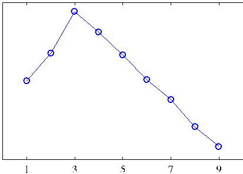

## 10.4. Exponential Family Distributions

In Chapter 2, we discussed the important role played by the exponential family of distributions and their conjugate priors. For many of the models discussed in this book, the complete-data likelihood is drawn from the exponential family. However, in general this will not be the case for the marginal likelihood function for the observed data. For example, in a mixture of Gaussians, the joint distribution of observations $\mathbf{x}_n$ and corresponding hidden variables $\mathbf{z}_n$ is a member of the exponential family, whereas the marginal distribution of $\mathbf{x}_n$ is a mixture of Gaussians and hence is not.

Up to now we have grouped the variables in the model into observed variables and hidden variables. We now make a further distinction between latent variables, denoted $\mathbf{Z}$, and parameters, denoted $\boldsymbol{\theta}$, where parameters are intensive (fixed in number independent of the size of the data set), whereas latent variables are extensive (scale in number with the size of the data set). For example, in a Gaussian mixture model, the indicator variables $z_{kn}$ (which specify which component $k$ is responsible for generating data point $\mathbf{x}_n$) represent the latent variables, whereas the means $\boldsymbol{\mu}_k$, precisions $\boldsymbol{\Lambda}_k$ and mixing proportions $\pi_k$ represent the parameters.

Consider the case of independent identically distributed data. We denote the data values by $\mathbf{X} = \{\mathbf{x}_n\}$, where $n = 1,\ldots,N$, with corresponding latent variables $\mathbf{Z} = \{\mathbf{z}_n\}$. Now suppose that the joint distribution of observed and latent variables is a member of the exponential family, parameterized by natural parameters $\boldsymbol{\eta}$ so that

$$
p(\mathbf{X}, \mathbf{Z}|\boldsymbol{\eta}) = \prod_{n=1}^N h(\mathbf{x}_n, \mathbf{z}_n)g(\boldsymbol{\eta}) \exp \left\{ \boldsymbol{\eta}^{\text{T}}\mathbf{u}(\mathbf{x}_n, \mathbf{z}_n) \right\}. \tag{10.113}
$$

We shall also use a conjugate prior for $\boldsymbol{\eta}$, which can be written as

$$
p(\boldsymbol{\eta}|\nu_0, \boldsymbol{\chi}_0) = f(\nu_0, \boldsymbol{\chi}_0)g(\boldsymbol{\eta})^{\nu_0} \exp \left\{ \nu_0 \boldsymbol{\eta}^{\text{T}}\boldsymbol{\chi}_0 \right\}. \tag{10.114}
$$

Recall that the conjugate prior distribution can be interpreted as a prior number $\nu_0$ of observations all having the value $\boldsymbol{\chi}_0$ for the $\mathbf{u}$ vector. Now consider a variational
[Page 511]

distribution that factorizes between the latent variables and the parameters, so that $q(\mathbf{Z}, \boldsymbol{\eta}) = q(\mathbf{Z})q(\boldsymbol{\eta})$. Using the general result (10.9), we can solve for the two factors as follows

$$
\begin{aligned}
\ln q^\star(\mathbf{Z}) &= \mathbb{E}_{\boldsymbol{\eta}}[\ln p(\mathbf{X}, \mathbf{Z}|\boldsymbol{\eta})] + \text{const} \\
&= \sum_{n=1}^N \left\{ \ln h(\mathbf{x}_n, \mathbf{z}_n) + \mathbb{E}[\boldsymbol{\eta}^{\text{T}}]\mathbf{u}(\mathbf{x}_n, \mathbf{z}_n) \right\} + \text{const}.
\end{aligned} \tag{10.115}
$$

Thus we see that this decomposes into a sum of independent terms, one for each value of $n$, and hence the solution for $q^\star(\mathbf{Z})$ will factorize over $n$ so that $q(\mathbf{Z}) = \prod_n q(\mathbf{z}_n)$. This is an example of an induced factorization. Taking the exponential of both sides, we have

$$
q^\star(\mathbf{z}_n) = h(\mathbf{x}_n, \mathbf{z}_n)g(\mathbb{E}[\boldsymbol{\eta}]) \exp \left\{ \mathbb{E}[\boldsymbol{\eta}^{\text{T}}]\mathbf{u}(\mathbf{x}_n, \mathbf{z}_n) \right\} \tag{10.116}
$$

where the normalization coefficient has been re-instated by comparison with the standard form for the exponential family.

Similarly, for the variational distribution over the parameters, we have

$$
\ln q^\star(\boldsymbol{\eta}) = \ln p(\boldsymbol{\eta}|\nu_0, \boldsymbol{\chi}_0) + \mathbb{E}_{\mathbf{Z}}[\ln p(\mathbf{X}, \mathbf{Z}|\boldsymbol{\eta})] + \text{const} \tag{10.117}
$$

$$
\begin{aligned}
\ln q^\star(\boldsymbol{\eta}) &= \nu_0 \ln g(\boldsymbol{\eta}) + \boldsymbol{\eta}^{\text{T}}\boldsymbol{\chi}_0 \\
&\quad + \sum_{n=1}^N \left\{ \ln g(\boldsymbol{\eta}) + \boldsymbol{\eta}^{\text{T}}\mathbb{E}_{\mathbf{z}_n}[\mathbf{u}(\mathbf{x}_n, \mathbf{z}_n)] \right\} + \text{const}.
\end{aligned} \tag{10.118}
$$

Again, taking the exponential of both sides, and re-instating the normalization coefficient by inspection, we have

$$
q^\star(\boldsymbol{\eta}) = f(\nu_N, \boldsymbol{\chi}_N)g(\boldsymbol{\eta})^{\nu_N} \exp \left\{ \boldsymbol{\eta}^{\text{T}}\boldsymbol{\chi}_N \right\} \tag{10.119}
$$

where we have defined

$$
\nu_N = \nu_0 + N \tag{10.120}
$$

$$
\boldsymbol{\chi}_N = \boldsymbol{\chi}_0 + \sum_{n=1}^N \mathbb{E}_{\mathbf{z}_n}[\mathbf{u}(\mathbf{x}_n, \mathbf{z}_n)]. \tag{10.121}
$$

Note that the solutions for $q(\mathbf{z}_n)$ and $q(\boldsymbol{\eta})$ are coupled, and so we solve them iteratively in a two-stage procedure. In the variational E step, we evaluate the expected sufficient statistics $\mathbb{E}[\mathbf{u}(\mathbf{x}_n, \mathbf{z}_n)]$ using the current posterior distribution $q(\mathbf{z}_n)$ over the latent variables and use this to compute a revised posterior distribution $q(\boldsymbol{\eta})$ over the parameters. Then in the subsequent variational M step, we use this revised parameter posterior distribution to find the expected natural parameters $\mathbb{E}[\boldsymbol{\eta}^{\text{T}}]$, which gives rise to a revised variational distribution over the latent variables.

## 10.4.1 Variational message passing

We have illustrated the application of variational methods by considering a specific model, the Bayesian mixture of Gaussians, in some detail. This model can be
[Page 512]

described by the directed graph shown in Figure 10.5. Here we consider more generally the use of variational methods for models described by directed graphs and derive a number of widely applicable results.

The joint distribution corresponding to a directed graph can be written using the decomposition

$$
p(\mathbf{x}) = \prod_i p(\mathbf{x}_i|\text{pa}_i) \tag{10.122}
$$

where $\mathbf{x}_i$ denotes the variable(s) associated with node $i$, and $\text{pa}_i$ denotes the parent set corresponding to node $i$. Note that $\mathbf{x}_i$ may be a latent variable or it may belong to the set of observed variables. Now consider a variational approximation in which the distribution $q(\mathbf{x})$ is assumed to factorize with respect to the $\mathbf{x}_i$ so that

$$
q(\mathbf{x}) = \prod_i q_i(\mathbf{x}_i). \tag{10.123}
$$

Note that for observed nodes, there is no factor $q_i(\mathbf{x}_i)$ in the variational distribution. We now substitute (10.122) into our general result (10.9) to give

$$
\ln q_j^\star(\mathbf{x}_j) = \mathbb{E}_{i \neq j} \left[ \sum_i \ln p(\mathbf{x}_i|\text{pa}_i) \right] + \text{const}. \tag{10.124}
$$

Any terms on the right-hand side that do not depend on $\mathbf{x}_j$ can be absorbed into the additive constant. In fact, the only terms that do depend on $\mathbf{x}_j$ are the conditional distribution for $\mathbf{x}_j$ given by $p(\mathbf{x}_j|\text{pa}_j)$ together with any other conditional distributions that have $\mathbf{x}_j$ in the conditioning set. By definition, these conditional distributions correspond to the children of node $j$, and they therefore also depend on the co-parents of the child nodes, i.e., the other parents of the child nodes besides node $\mathbf{x}_j$ itself. We see that the set of all nodes on which $q^\star(\mathbf{x}_j)$ depends corresponds to the Markov blanket of node $\mathbf{x}_j$, as illustrated in Figure 8.26. Thus the update of the factors in the variational posterior distribution represents a local calculation on the graph. This makes possible the construction of general purpose software for variational inference in which the form of the model does not need to be specified in advance (Bishop et al., 2003).

If we now specialize to the case of a model in which all of the conditional distributions have a conjugate-exponential structure, then the variational update procedure can be cast in terms of a local message passing algorithm (Winn and Bishop, 2005). In particular, the distribution associated with a particular node can be updated once that node has received messages from all of its parents and all of its children. This in turn requires that the children have already received messages from their coparents. The evaluation of the lower bound can also be simplified because many of the required quantities are already evaluated as part of the message passing scheme. This distributed message passing formulation has good scaling properties and is well suited to large networks.
[Page 513]

## 10.5. Local Variational Methods

The variational framework discussed in Sections 10.1 and 10.2 can be considered a ‘global’ method in the sense that it directly seeks an approximation to the full posterior distribution over all random variables. An alternative ‘local’ approach involves finding bounds on functions over individual variables or groups of variables within a model. For instance, we might seek a bound on a conditional distribution $p(y|\mathbf{x})$, which is itself just one factor in a much larger probabilistic model specified by a directed graph. The purpose of introducing the bound of course is to simplify the resulting distribution. This local approximation can be applied to multiple variables in turn until a tractable approximation is obtained, and in Section 10.6.1 we shall give a practical example of this approach in the context of logistic regression. Here we focus on developing the bounds themselves.

We have already seen in our discussion of the Kullback-Leibler divergence that the convexity of the logarithm function played a key role in developing the lower bound in the global variational approach. We have defined a (strictly) convex function as one for which every chord lies above the function. Convexity also plays a central role in the local variational framework. Note that our discussion will apply equally to concave functions with ‘min’ and ‘max’ interchanged and with lower bounds replaced by upper bounds.

Let us begin by considering a simple example, namely the function $f(x) = \exp(-x)$, which is a convex function of $x$, and which is shown in the left-hand plot of Figure 10.10. Our goal is to approximate $f(x)$ by a simpler function, in particular a linear function of $x$. From Figure 10.10, we see that this linear function will be a lower bound on $f(x)$ if it corresponds to a tangent. We can obtain the tangent line $y(x)$ at a specific value of $x$, say $x = \xi$, by making a first order Taylor expansion

$$
y(x) = f(\xi) + f'(\xi)(x - \xi) \tag{10.125}
$$

so that $y(x) \leqslant f(x)$ with equality when $x = \xi$. For our example function $f(x) = \exp(-x)$,

Figure 10.10 In the left-hand figure the red curve shows the function $\exp(-x)$, and the blue line shows the tangent at $x = \xi$ defined by (10.125) with $\xi = 1$. This line has slope $\lambda = f'(\xi) = -\exp(-\xi)$. Note that any other tangent line, for example the ones shown in green, will have a smaller value of $y$ at $x = \xi$. The right-hand figure shows the corresponding plot of the function $\lambda \xi - g(\lambda)$, where $g(\lambda)$ is given by (10.131), versus $\lambda$ for $\xi = 1$, in which the maximum corresponds to $\lambda = -\exp(-\xi) = -1/e$.

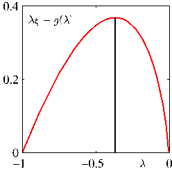
[Page 514]

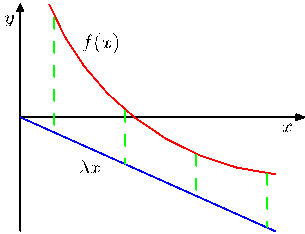
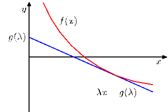

Figure 10.11 In the left-hand plot the red curve shows a convex function $f(x)$, and the blue line represents the linear function $\lambda x$, which is a lower bound on $f(x)$ because $f(x) \geqslant \lambda x$ for all $x$. For the given value of slope $\lambda$ the contact point of the tangent line having the same slope is found by minimizing with respect to $x$ the discrepancy (shown by the green dashed lines) given by $f(x) - \lambda x$. This defines the dual function $g(\lambda)$, which corresponds to the (negative of the) intercept of the tangent line having slope $\lambda$.

we therefore obtain the tangent line in the form

$$
y(x) = \exp(-\xi) - \exp(-\xi)(x - \xi) \tag{10.126}
$$

which is a linear function parameterized by $\xi$. For consistency with subsequent discussion, let us define $\lambda = -\exp(-\xi)$ so that

$$
y(x, \lambda) = \lambda x - \lambda + \lambda \ln(-\lambda). \tag{10.127}
$$

Different values of $\lambda$ correspond to different tangent lines, and because all such lines are lower bounds on the function, we have $f(x) \geqslant y(x, \lambda)$. Thus we can write the function in the form

$$
f(x) = \max_\lambda \{ \lambda x - \lambda + \lambda \ln(-\lambda) \}. \tag{10.128}
$$

We have succeeded in approximating the convex function $f(x)$ by a simpler, linear function $y(x, \lambda)$. The price we have paid is that we have introduced a variational parameter $\lambda$, and to obtain the tightest bound we must optimize with respect to $\lambda$.

We can formulate this approach more generally using the framework of convex duality (Rockafellar, 1972; Jordan et al., 1999). Consider the illustration of a convex function $f(x)$ shown in the left-hand plot in Figure 10.11. In this example, the function $\lambda x$ is a lower bound on $f(x)$ but it is not the best lower bound that can be achieved by a linear function having slope $\lambda$, because the tightest bound is given by the tangent line. Let us write the equation of the tangent line, having slope $\lambda$ as $\lambda x - g(\lambda)$ where the (negative) intercept $g(\lambda)$ clearly depends on the slope $\lambda$ of the tangent. To determine the intercept, we note that the line must be moved vertically by an amount equal to the smallest vertical distance between the line and the function, as shown in Figure 10.11. Thus

$$
\begin{aligned}
g(\lambda) &= -\min_x \{ f(x) - \lambda x \} \\
&= \max_x \{ \lambda x - f(x) \}.
\end{aligned} \tag{10.129}
$$

[Page 515]

Now, instead of fixing $\lambda$ and varying $x$, we can consider a particular $x$ and then adjust $\lambda$ until the tangent plane is tangent at that particular $x$. Because the $y$ value of the tangent line at a particular $x$ is maximized when that value coincides with its contact point, we have

$$
f(x) = \max_\lambda \{ \lambda x - g(\lambda) \}. \tag{10.130}
$$

We see that the functions $f(x)$ and $g(\lambda)$ play a dual role, and are related through (10.129) and (10.130).

Let us apply these duality relations to our simple example $f(x) = \exp(-x)$. From (10.129) we see that the maximizing value of $x$ is given by $\xi = -\ln(-\lambda)$, and back-substituting we obtain the conjugate function $g(\lambda)$ in the form

$$
g(\lambda) = \lambda - \lambda \ln(-\lambda) \tag{10.131}
$$

as obtained previously. The function $\lambda \xi - g(\lambda)$ is shown, for $\xi = 1$ in the right-hand plot in Figure 10.10. As a check, we can substitute (10.131) into (10.130), which gives the maximizing value of $\lambda = -\exp(-x)$, and back-substituting then recovers the original function $f(x) = \exp(-x)$.

For concave functions, we can follow a similar argument to obtain upper bounds, in which ‘$\max$’ is replaced with ‘$\min$’, so that

$$
f(x) = \min_\lambda \{ \lambda x - g(\lambda) \} \tag{10.132}
$$

$$
g(\lambda) = \min_x \{ \lambda x - f(x) \}. \tag{10.133}
$$

If the function of interest is not convex (or concave), then we cannot directly apply the method above to obtain a bound. However, we can first seek invertible transformations either of the function or of its argument which change it into a convex form. We then calculate the conjugate function and then transform back to the original variables.

An important example, which arises frequently in pattern recognition, is the logistic sigmoid function defined by

$$
\sigma(x) = \frac{1}{1 + e^{-x}}. \tag{10.134}
$$

As it stands this function is neither convex nor concave. However, if we take the logarithm we obtain a function which is concave, as is easily verified by finding the second derivative. From (10.133) the corresponding conjugate function then takes the form

$$
g(\lambda) = \min_x \{ \lambda x - f(x) \} = -\lambda \ln \lambda - (1 - \lambda) \ln(1 - \lambda) \tag{10.135}
$$

which we recognize as the binary entropy function for a variable whose probability of having the value 1 is $\lambda$. Using (10.132), we then obtain an upper bound on the log sigmoid

$$
\ln \sigma(x) \leqslant \lambda x - g(\lambda) \tag{10.136}
$$

[Page 516]

Figure 10.12 The left-hand plot shows the logistic sigmoid function $\sigma(x)$ defined by (10.134) in red, together with two examples of the exponential upper bound (10.137) shown in blue. The right-hand plot shows the logistic sigmoid again in red together with the Gaussian lower bound (10.144) shown in blue. Here the parameter $\xi = 2.5$, and the bound is exact at $x = \xi$ and $x = -\xi$, denoted by the dashed green lines.

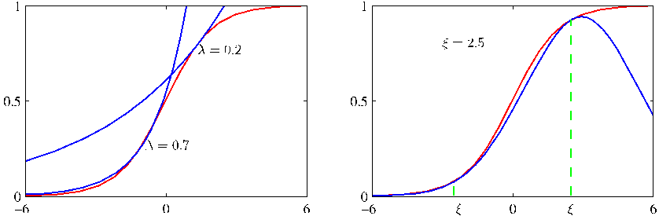

and taking the exponential, we obtain an upper bound on the logistic sigmoid itself of the form

$$
\sigma(x) \leqslant \exp( \lambda x - g(\lambda) ) \tag{10.137}
$$

which is plotted for two values of $\lambda$ on the left-hand plot in Figure 10.12.

We can also obtain a lower bound on the sigmoid having the functional form of a Gaussian. To do this, we follow Jaakkola and Jordan (2000) and make transformations both of the input variable and of the function itself. First we take the log of the logistic function and then decompose it so that

$$
\begin{aligned}
\ln \sigma(x) &= -\ln(1 + e^{-x}) = -\ln \{ e^{-x/2}(e^{x/2} + e^{-x/2}) \} \\
&= x/2 - \ln(e^{x/2} + e^{-x/2}).
\end{aligned} \tag{10.138}
$$

We now note that the function $f(x) = -\ln(e^{x/2} + e^{-x/2})$ is a convex function of the variable $x^2$, as can again be verified by finding the second derivative. This leads to a lower bound on $f(x)$, which is a linear function of $x^2$ whose conjugate function is given by

$$
g(\lambda) = \max_{x^2} \{ \lambda x^2 - f( \sqrt{x^2} ) \}. \tag{10.139}
$$

The stationarity condition leads to

$$
0 = \lambda - \frac{d}{d(x^2)} f(x) = \lambda - \frac{dx}{d(x^2)} \frac{d}{dx} f(x) = \lambda + \frac{1}{4x} \tanh\left( \frac{x}{2} \right). \tag{10.140}
$$

If we denote this value of $x$, corresponding to the contact point of the tangent line for this particular value of $\lambda$, by $\xi$, then we have

$$
\lambda(\xi) = -\frac{1}{4\xi} \tanh\left( \frac{\xi}{2} \right) = -\frac{1}{2\xi} \left[ \sigma(\xi) - \frac{1}{2} \right]. \tag{10.141}
$$

[Page 517]

Instead of thinking of $\lambda$ as the variational parameter, we can let $\xi$ play this role as this leads to simpler expressions for the conjugate function, which is then given by

$$
g(\lambda) = \lambda(\xi)\xi^2 - f(\xi) = \lambda(\xi)\xi^2 + \ln(e^{\xi/2} + e^{-\xi/2}). \tag{10.142}
$$

Hence the bound on $f(x)$ can be written as

$$
f(x) \geqslant \lambda x^2 - g(\lambda) = \lambda x^2 - \lambda \xi^2 - \ln(e^{\xi/2} + e^{-\xi/2}). \tag{10.143}
$$

The bound on the sigmoid then becomes

$$
\sigma(x) \geqslant \sigma(\xi) \exp \left\{ (x - \xi)/2 - \lambda(\xi)(x^2 - \xi^2) \right\} \tag{10.144}
$$

where $\lambda(\xi)$ is defined by (10.141). This bound is illustrated in the right-hand plot of Figure 10.12. We see that the bound has the form of the exponential of a quadratic function of $x$, which will prove useful when we seek Gaussian representations of posterior distributions defined through logistic sigmoid functions.

The logistic sigmoid arises frequently in probabilistic models over binary variables because it is the function that transforms a log odds ratio into a posterior probability. The corresponding transformation for a multiclass distribution is given by the softmax function. Unfortunately, the lower bound derived here for the logistic sigmoid does not directly extend to the softmax. Gibbs (1997) proposes a method for constructing a Gaussian distribution that is conjectured to be a bound (although no rigorous proof is given), which may be used to apply local variational methods to multiclass problems.

We shall see an example of the use of local variational bounds in Sections 10.6.1. For the moment, however, it is instructive to consider in general terms how these bounds can be used. Suppose we wish to evaluate an integral of the form

$$
I = \int \sigma(a) p(a) \text{d}a \tag{10.145}
$$

where $\sigma(a)$ is the logistic sigmoid, and $p(a)$ is a Gaussian probability density. Such integrals arise in Bayesian models when, for instance, we wish to evaluate the predictive distribution, in which case $p(a)$ represents a posterior parameter distribution. Because the integral is intractable, we employ the variational bound (10.144), which we write in the form $\sigma(a) \geqslant f(a, \xi)$ where $\xi$ is a variational parameter. The integral now becomes the product of two exponential-quadratic functions and so can be integrated analytically to give a bound on $I$

$$
I \geqslant \int f(a, \xi) p(a) \text{d}a = F(\xi). \tag{10.146}
$$

We now have the freedom to choose the variational parameter $\xi$, which we do by finding the value $\xi$ that maximizes the function $F(\xi)$. The resulting value $F(\xi)$ represents the tightest bound within this family of bounds and can be used as an approximation to $I$. This optimized bound, however, will in general not be exact.
[Page 518]

Although the bound $\sigma(a) \geqslant f(a, \xi)$ on the logistic sigmoid can be optimized exactly, the required choice for $\xi$ depends on the value of $a$, so that the bound is exact for one value of $a$ only. Because the quantity $F(\xi)$ is obtained by integrating over all values of $a$, the value of $\xi$ represents a compromise, weighted by the distribution $p(a)$.

## 10.6. Variational Logistic Regression

We now illustrate the use of local variational methods by returning to the Bayesian logistic regression model studied in Section 4.5. There we focussed on the use of the Laplace approximation, while here we consider a variational treatment based on the approach of Jaakkola and Jordan (2000). Like the Laplace method, this also leads to a Gaussian approximation to the posterior distribution. However, the greater flexibility of the variational approximation leads to improved accuracy compared to the Laplace method. Furthermore (unlike the Laplace method), the variational approach is optimizing a well defined objective function given by a rigourous bound on the model evidence. Logistic regression has also been treated by Dybowski and Roberts (2005) from a Bayesian perspective using Monte Carlo sampling techniques.

### 10.6.1 Variational posterior distribution

Here we shall make use of a variational approximation based on the local bounds introduced in Section 10.5. This allows the likelihood function for logistic regression, which is governed by the logistic sigmoid, to be approximated by the exponential of a quadratic form. It is therefore again convenient to choose a conjugate Gaussian prior of the form (4.140). For the moment, we shall treat the hyperparameters $\mathbf{m}_0$ and $\mathbf{S}_0$ as fixed constants. In Section 10.6.3, we shall demonstrate how the variational formalism can be extended to the case where there are unknown hyperparameters whose values are to be inferred from the data.

In the variational framework, we seek to maximize a lower bound on the marginal likelihood. For the Bayesian logistic regression model, the marginal likelihood takes the form

$$
p(\mathbf{t}) = \int p(\mathbf{t}|\mathbf{w})p(\mathbf{w}) \text{d}\mathbf{w} = \int \left[ \prod_{n=1}^N p(t_n|\mathbf{w}) \right] p(\mathbf{w}) \text{d}\mathbf{w}. \tag{10.147}
$$

We first note that the conditional distribution for $t$ can be written as

$$
\begin{aligned}
p(t|\mathbf{w}) &= \sigma(a)^t \{1 - \sigma(a)\}^{1-t} \\
&= \left( \frac{1}{1 + e^{-a}} \right)^t \left( 1 - \frac{1}{1 + e^{-a}} \right)^{1-t} \\
&= e^{at} \frac{e^{-a}}{1 + e^{-a}} = e^{at}\sigma(-a)
\end{aligned} \tag{10.148}
$$

where $a = \mathbf{w}^{\text{T}}\boldsymbol{\phi}$. In order to obtain a lower bound on $p(\mathbf{t})$, we make use of the variational lower bound on the logistic sigmoid function given by (10.144), which
[Page 519]

we reproduce here for convenience

$$
\sigma(z) \geqslant \sigma(\xi) \exp \left\{ (z - \xi)/2 - \lambda(\xi)(z^2 - \xi^2) \right\} \tag{10.149}
$$

where

$$
\lambda(\xi) = \frac{1}{2\xi} \left[ \sigma(\xi) - \frac{1}{2} \right]. \tag{10.150}
$$

We can therefore write

$$
p(t|\mathbf{w}) = e^{at}\sigma(-a) \geqslant e^{at}\sigma(\xi) \exp \left\{ -(a + \xi)/2 - \lambda(\xi)(a^2 - \xi^2) \right\}. \tag{10.151}
$$

Note that because this bound is applied to each of the terms in the likelihood function separately, there is a variational parameter $\xi_n$ corresponding to each training set observation $(\boldsymbol{\phi}_n, t_n)$. Using $a = \mathbf{w}^{\text{T}}\boldsymbol{\phi}$, and multiplying by the prior distribution, we obtain the following bound on the joint distribution of $\mathbf{t}$ and $\mathbf{w}$

$$
p(\mathbf{t}, \mathbf{w}) = p(\mathbf{t}|\mathbf{w})p(\mathbf{w}) \geqslant h(\mathbf{w}, \boldsymbol{\xi})p(\mathbf{w}) \tag{10.152}
$$

where $\boldsymbol{\xi}$ denotes the set $\{\xi_n\}$ of variational parameters, and

$$
\begin{aligned}
h(\mathbf{w}, \boldsymbol{\xi}) &= \prod_{n=1}^N \sigma(\xi_n) \exp \left\{ \mathbf{w}^{\text{T}}\boldsymbol{\phi}_n t_n - (\mathbf{w}^{\text{T}}\boldsymbol{\phi}_n + \xi_n)/2 \right. \\
&\quad \left. - \lambda(\xi_n)([\mathbf{w}^{\text{T}}\boldsymbol{\phi}_n]^2 - \xi_n^2) \right\}.
\end{aligned} \tag{10.153}
$$

Evaluation of the exact posterior distribution would require normalization of the lefthand side of this inequality. Because this is intractable, we work instead with the right-hand side. Note that the function on the right-hand side cannot be interpreted as a probability density because it is not normalized. Once it is normalized to give a variational posterior distribution $q(\mathbf{w})$, however, it no longer represents a bound.

Because the logarithm function is monotonically increasing, the inequality $A \geqslant B$ implies $\ln A \geqslant \ln B$. This gives a lower bound on the log of the joint distribution of $\mathbf{t}$ and $\mathbf{w}$ of the form

$$
\begin{aligned}
\ln \{p(\mathbf{t}|\mathbf{w})p(\mathbf{w})\} &\geqslant \ln p(\mathbf{w}) + \sum_{n=1}^N \left\{ \ln \sigma(\xi_n) + \mathbf{w}^{\text{T}}\boldsymbol{\phi}_n t_n \right. \\
&\quad \left. - (\mathbf{w}^{\text{T}}\boldsymbol{\phi}_n + \xi_n)/2 - \lambda(\xi_n)([\mathbf{w}^{\text{T}}\boldsymbol{\phi}_n]^2 - \xi_n^2) \right\}.
\end{aligned} \tag{10.154}
$$

Substituting for the prior $p(\mathbf{w})$, the right-hand side of this inequality becomes, as a function of $\mathbf{w}$

$$
-\frac{1}{2} (\mathbf{w} - \mathbf{m}_0)^{\text{T}}\mathbf{S}_0^{-1}(\mathbf{w} - \mathbf{m}_0) + \sum_{n=1}^N \left\{ \mathbf{w}^{\text{T}}\boldsymbol{\phi}_n(t_n - 1/2) - \lambda(\xi_n)\mathbf{w}^{\text{T}}(\boldsymbol{\phi}_n\boldsymbol{\phi}_n^{\text{T}})\mathbf{w} \right\} + \text{const}. \tag{10.155}
$$

[Page 520]

This is a quadratic function of $\mathbf{w}$, and so we can obtain the corresponding variational approximation to the posterior distribution by identifying the linear and quadratic terms in $\mathbf{w}$, giving a Gaussian variational posterior of the form

$$
q(\mathbf{w}) = \mathcal{N}(\mathbf{w}|\mathbf{m}_N, \mathbf{S}_N) \tag{10.156}
$$

where

$$
\mathbf{m}_N = \mathbf{S}_N \left( \mathbf{S}_0^{-1}\mathbf{m}_0 + \sum_{n=1}^N (t_n - 1/2)\boldsymbol{\phi}_n \right) \tag{10.157}
$$

$$
\mathbf{S}_N^{-1} = \mathbf{S}_0^{-1} + 2 \sum_{n=1}^N \lambda(\xi_n)\boldsymbol{\phi}_n\boldsymbol{\phi}_n^{\text{T}}. \tag{10.158}
$$

As with the Laplace framework, we have again obtained a Gaussian approximation to the posterior distribution. However, the additional flexibility provided by the variational parameters $\{\xi_n\}$ leads to improved accuracy in the approximation (Jaakkola and Jordan, 2000).

Here we have considered a batch learning context in which all of the training data is available at once. However, Bayesian methods are intrinsically well suited to sequential learning in which the data points are processed one at a time and then discarded. The formulation of this variational approach for the sequential case is straightforward.

Note that the bound given by (10.149) applies only to the two-class problem and so this approach does not directly generalize to classification problems with $K > 2$ classes. An alternative bound for the multiclass case has been explored by Gibbs (1997).

### 10.6.2 Optimizing the variational parameters

We now have a normalized Gaussian approximation to the posterior distribution, which we shall use shortly to evaluate the predictive distribution for new data points. First, however, we need to determine the variational parameters $\{\xi_n\}$ by maximizing the lower bound on the marginal likelihood.

To do this, we substitute the inequality (10.152) back into the marginal likelihood to give

$$
\ln p(\mathbf{t}) = \ln \int p(\mathbf{t}|\mathbf{w})p(\mathbf{w}) \text{d}\mathbf{w} \geqslant \ln \int h(\mathbf{w}, \boldsymbol{\xi})p(\mathbf{w}) \text{d}\mathbf{w} = \mathcal{L}(\boldsymbol{\xi}). \tag{10.159}
$$

As with the optimization of the hyperparameter $\alpha$ in the linear regression model of Section 3.5, there are two approaches to determining the $\xi_n$. In the first approach, we recognize that the function $\mathcal{L}(\boldsymbol{\xi})$ is defined by an integration over $\mathbf{w}$ and so we can view $\mathbf{w}$ as a latent variable and invoke the EM algorithm. In the second approach, we integrate over $\mathbf{w}$ analytically and then perform a direct maximization over $\boldsymbol{\xi}$. Let us begin by considering the EM approach.

The EM algorithm starts by choosing some initial values for the parameters $\{\xi_n\}$, which we denote collectively by $\boldsymbol{\xi}^{\text{old}}$. In the E step of the EM algorithm,
[Page 521]

we then use these parameter values to find the posterior distribution over $\mathbf{w}$, which is given by (10.156). In the M step, we then maximize the expected complete-data log likelihood which is given by

$$
Q(\boldsymbol{\xi}, \boldsymbol{\xi}^{\text{old}}) = \mathbb{E} \left[ \ln h(\mathbf{w}, \boldsymbol{\xi})p(\mathbf{w}) \right] \tag{10.160}
$$

where the expectation is taken with respect to the posterior distribution $q(\mathbf{w})$ evaluated using $\boldsymbol{\xi}^{\text{old}}$. Noting that $p(\mathbf{w})$ does not depend on $\boldsymbol{\xi}$, and substituting for $h(\mathbf{w}, \boldsymbol{\xi})$ we obtain

$$
Q(\boldsymbol{\xi}, \boldsymbol{\xi}^{\text{old}}) = \sum_{n=1}^N \left\{ \ln \sigma(\xi_n) - \xi_n/2 - \lambda(\xi_n)(\boldsymbol{\phi}_n^{\text{T}}\mathbb{E}[\mathbf{w}\mathbf{w}^{\text{T}}]\boldsymbol{\phi}_n - \xi_n^2) \right\} + \text{const} \tag{10.161}
$$

where ‘const’ denotes terms that are independent of $\boldsymbol{\xi}$. We now set the derivative with respect to $\xi_n$ equal to zero. A few lines of algebra, making use of the definitions of $\sigma(\xi)$ and $\lambda(\xi)$, then gives

$$
0 = \lambda'(\xi_n)(\boldsymbol{\phi}_n^{\text{T}}\mathbb{E}[\mathbf{w}\mathbf{w}^{\text{T}}]\boldsymbol{\phi}_n - \xi_n^2). \tag{10.162}
$$

We now note that $\lambda'(\xi)$ is a monotonic function of $\xi$ for $\xi \geqslant 0$, and that we can restrict attention to nonnegative values of $\xi$ without loss of generality due to the symmetry of the bound around $\xi = 0$. Thus $\lambda'(\xi) \neq 0$, and hence we obtain the following re-estimation equations

$$
(\xi_n^{\text{new}})^2 = \boldsymbol{\phi}_n^{\text{T}}\mathbb{E}[\mathbf{w}\mathbf{w}^{\text{T}}]\boldsymbol{\phi}_n = \boldsymbol{\phi}_n^{\text{T}} \left( \mathbf{S}_N + \mathbf{m}_N\mathbf{m}_N^{\text{T}} \right) \boldsymbol{\phi}_n \tag{10.163}
$$

where we have used (10.156).

Let us summarize the EM algorithm for finding the variational posterior distribution. We first initialize the variational parameters $\boldsymbol{\xi}^{\text{old}}$. In the E step, we evaluate the posterior distribution over $\mathbf{w}$ given by (10.156), in which the mean and covariance are defined by (10.157) and (10.158). In the M step, we then use this variational posterior to compute a new value for $\boldsymbol{\xi}$ given by (10.163). The E and M steps are repeated until a suitable convergence criterion is satisfied, which in practice typically requires only a few iterations.

An alternative approach to obtaining re-estimation equations for $\boldsymbol{\xi}$ is to note that in the integral over $\mathbf{w}$ in the definition (10.159) of the lower bound $\mathcal{L}(\boldsymbol{\xi})$, the integrand has a Gaussian-like form and so the integral can be evaluated analytically. Having evaluated the integral, we can then differentiate with respect to $\xi_n$. It turns out that this gives rise to exactly the same re-estimation equations as does the EM approach given by (10.163).

As we have emphasized already, in the application of variational methods it is useful to be able to evaluate the lower bound $\mathcal{L}(\boldsymbol{\xi})$ given by (10.159). The integration over $\mathbf{w}$ can be performed analytically by noting that $p(\mathbf{w})$ is Gaussian and $h(\mathbf{w}, \boldsymbol{\xi})$ is the exponential of a quadratic function of $\mathbf{w}$. Thus, by completing the square and making use of the standard result for the normalization coefficient of a Gaussian distribution, we can obtain a closed form solution which takes the form
[Page 522]

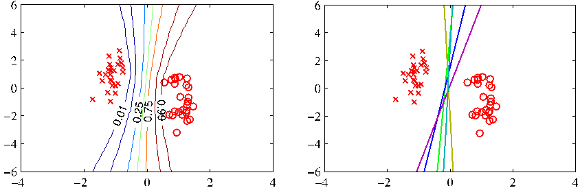

Figure 10.13 Illustration of the Bayesian approach to logistic regression for a simple linearly separable data set. The plot on the left shows the predictive distribution obtained using variational inference. We see that the decision boundary lies roughly mid way between the clusters of data points, and that the contours of the predictive distribution splay out away from the data reflecting the greater uncertainty in the classification of such regions. The plot on the right shows the decision boundaries corresponding to five samples of the parameter vector $\mathbf{w}$ drawn from the posterior distribution $p(\mathbf{w}|\mathbf{t})$.

$$
\begin{aligned}
\mathcal{L}(\boldsymbol{\xi}) &= \frac{1}{2} \ln |\mathbf{S}_N| - \frac{1}{2} \ln |\mathbf{S}_0| - \frac{1}{2} \mathbf{m}_N^{\text{T}}\mathbf{S}_N^{-1}\mathbf{m}_N + \frac{1}{2} \mathbf{m}_0^{\text{T}}\mathbf{S}_0^{-1}\mathbf{m}_0 \\
&\quad + \sum_{n=1}^N \left\{ \ln \sigma(\xi_n) - \frac{1}{2} \xi_n - \lambda(\xi_n)\xi_n^2 \right\}.
\end{aligned} \tag{10.164}
$$

This variational framework can also be applied to situations in which the data is arriving sequentially (Jaakkola and Jordan, 2000). In this case we maintain a Gaussian posterior distribution over $\mathbf{w}$, which is initialized using the prior $p(\mathbf{w})$. As each data point arrives, the posterior is updated by making use of the bound (10.151) and then normalized to give an updated posterior distribution.

The predictive distribution is obtained by marginalizing over the posterior distribution, and takes the same form as for the Laplace approximation discussed in Section 4.5.2. Figure 10.13 shows the variational predictive distributions for a synthetic data set. This example provides interesting insights into the concept of ‘large margin’, which was discussed in Section 7.1 and which has qualitatively similar behaviour to the Bayesian solution.

### 10.6.3 Inference of hyperparameters

So far, we have treated the hyperparameter $\alpha$ in the prior distribution as a known constant. We now extend the Bayesian logistic regression model to allow the value of this parameter to be inferred from the data set. This can be achieved by combining the global and local variational approximations into a single framework, so as to maintain a lower bound on the marginal likelihood at each stage. Such a combined approach was adopted by Bishop and Svensén (2003) in the context of a Bayesian treatment of the hierarchical mixture of experts model.
[Page 523]

Specifically, we consider once again a simple isotropic Gaussian prior distribution of the form

$$
p(\mathbf{w}|\alpha) = \mathcal{N}(\mathbf{w}|\mathbf{0}, \alpha^{-1}\mathbf{I}). \tag{10.165}
$$

Our analysis is readily extended to more general Gaussian priors, for instance if we wish to associate a different hyperparameter with different subsets of the parameters $w_j$. As usual, we consider a conjugate hyperprior over $\alpha$ given by a gamma distribution

$$
p(\alpha) = \text{Gam}(\alpha|a_0, b_0) \tag{10.166}
$$

governed by the constants $a_0$ and $b_0$.

The marginal likelihood for this model now takes the form

$$
p(\mathbf{t}) = \iint p(\mathbf{w}, \alpha, \mathbf{t}) \text{d}\mathbf{w} \text{d}\alpha \tag{10.167}
$$

where the joint distribution is given by

$$
p(\mathbf{w}, \alpha, \mathbf{t}) = p(\mathbf{t}|\mathbf{w})p(\mathbf{w}|\alpha)p(\alpha). \tag{10.168}
$$

We are now faced with an analytically intractable integration over $\mathbf{w}$ and $\alpha$, which we shall tackle by using both the local and global variational approaches in the same model

To begin with, we introduce a variational distribution $q(\mathbf{w}, \alpha)$, and then apply the decomposition (10.2), which in this instance takes the form

$$
\ln p(\mathbf{t}) = \mathcal{L}(q) + \text{KL}(q || p) \tag{10.169}
$$

where the lower bound $\mathcal{L}(q)$ and the Kullback-Leibler divergence $\text{KL}(q || p)$ are defined by

$$
\mathcal{L}(q) = \iint q(\mathbf{w}, \alpha) \ln \left\{ \frac{p(\mathbf{w}, \alpha, \mathbf{t})}{q(\mathbf{w}, \alpha)} \right\} \text{d}\mathbf{w} \text{d}\alpha \tag{10.170}
$$

$$
\text{KL}(q || p) = -\iint q(\mathbf{w}, \alpha) \ln \left\{ \frac{p(\mathbf{w}, \alpha|\mathbf{t})}{q(\mathbf{w}, \alpha)} \right\} \text{d}\mathbf{w} \text{d}\alpha. \tag{10.171}
$$

At this point, the lower bound $\mathcal{L}(q)$ is still intractable due to the form of the likelihood factor $p(\mathbf{t}|\mathbf{w})$. We therefore apply the local variational bound to each of the logistic sigmoid factors as before. This allows us to use the inequality (10.152) and place a lower bound on $\mathcal{L}(q)$, which will therefore also be a lower bound on the log marginal likelihood

$$
\begin{aligned}
\ln p(\mathbf{t}) \geqslant \mathcal{L}(q) &\geqslant \widetilde{\mathcal{L}}(q, \boldsymbol{\xi}) \\
&= \iint q(\mathbf{w}, \alpha) \ln \left\{ \frac{h(\mathbf{w}, \boldsymbol{\xi})p(\mathbf{w}|\alpha)p(\alpha)}{q(\mathbf{w}, \alpha)} \right\} \text{d}\mathbf{w} \text{d}\alpha.
\end{aligned} \tag{10.172}
$$

Next we assume that the variational distribution factorizes between parameters and hyperparameters so that

$$
q(\mathbf{w}, \alpha) = q(\mathbf{w})q(\alpha). \tag{10.173}
$$

[Page 524]

With this factorization we can appeal to the general result (10.9) to find expressions for the optimal factors. Consider first the distribution $q(\mathbf{w})$. Discarding terms that are independent of $\mathbf{w}$, we have

$$
\begin{aligned}
\ln q(\mathbf{w}) &= \mathbb{E}_\alpha \left[ \ln \{ h(\mathbf{w}, \boldsymbol{\xi})p(\mathbf{w}|\alpha)p(\alpha) \} \right] + \text{const} \\
&= \ln h(\mathbf{w}, \boldsymbol{\xi}) + \mathbb{E}_\alpha [\ln p(\mathbf{w}|\alpha)] + \text{const}.
\end{aligned}
$$

We now substitute for $\ln h(\mathbf{w}, \boldsymbol{\xi})$ using (10.153), and for $\ln p(\mathbf{w}|\alpha)$ using (10.165), giving

$$
\ln q(\mathbf{w}) = -\frac{\mathbb{E}[\alpha]}{2} \mathbf{w}^{\text{T}}\mathbf{w} + \sum_{n=1}^N \left\{ (t_n - 1/2)\mathbf{w}^{\text{T}}\boldsymbol{\phi}_n - \lambda(\xi_n)\mathbf{w}^{\text{T}}\boldsymbol{\phi}_n\boldsymbol{\phi}_n^{\text{T}}\mathbf{w} \right\} + \text{const}.
$$

We see that this is a quadratic function of $\mathbf{w}$ and so the solution for $q(\mathbf{w})$ will be Gaussian. Completing the square in the usual way, we obtain

$$
q(\mathbf{w}) = \mathcal{N}(\mathbf{w}|\boldsymbol{\mu}_N, \boldsymbol{\Sigma}_N) \tag{10.174}
$$

where we have defined

$$
\boldsymbol{\mu}_N = \boldsymbol{\Sigma}_N \sum_{n=1}^N (t_n - 1/2)\boldsymbol{\phi}_n \tag{10.175}
$$

$$
\boldsymbol{\Sigma}_N^{-1} = \mathbb{E}[\alpha]\mathbf{I} + 2 \sum_{n=1}^N \lambda(\xi_n)\boldsymbol{\phi}_n\boldsymbol{\phi}_n^{\text{T}}. \tag{10.176}
$$

Similarly, the optimal solution for the factor $q(\alpha)$ is obtained from

$$
\ln q(\alpha) = \mathbb{E}_{\mathbf{w}} [\ln p(\mathbf{w}|\alpha)] + \ln p(\alpha) + \text{const}.
$$

Substituting for $\ln p(\mathbf{w}|\alpha)$ using (10.165), and for $\ln p(\alpha)$ using (10.166), we obtain

$$
\ln q(\alpha) = \frac{M}{2} \ln \alpha - \frac{\alpha}{2} \mathbb{E} [\mathbf{w}^{\text{T}}\mathbf{w}] + (a_0 - 1)\ln \alpha - b_0\alpha + \text{const}.
$$

We recognize this as the log of a gamma distribution, and so we obtain

$$
q(\alpha) = \text{Gam}(\alpha|a_N, b_N) = \frac{1}{\Gamma(a_N)} b_N^{a_N} \alpha^{a_N - 1} e^{-b_N \alpha} \tag{10.177}
$$

where

$$
a_N = a_0 + \frac{M}{2} \tag{10.178}
$$

$$
b_N = b_0 + \frac{1}{2} \mathbb{E}_{\mathbf{w}} \left[ \mathbf{w}^{\text{T}}\mathbf{w} \right]. \tag{10.179}
$$

[Page 525]

We also need to optimize the variational parameters $\xi_n$, and this is also done by maximizing the lower bound $\widetilde{\mathcal{L}}(q, \boldsymbol{\xi})$. Omitting terms that are independent of $\boldsymbol{\xi}$, and integrating over $\alpha$, we have

$$
\widetilde{\mathcal{L}}(q, \boldsymbol{\xi}) = \int q(\mathbf{w}) \ln h(\mathbf{w}, \boldsymbol{\xi}) \text{d}\mathbf{w} + \text{const}. \tag{10.180}
$$

Note that this has precisely the same form as (10.159), and so we can again appeal to our earlier result (10.163), which can be obtained by direct optimization of the marginal likelihood function, leading to re-estimation equations of the form

$$
(\xi_n^{\text{new}})^2 = \boldsymbol{\phi}_n^{\text{T}} (\boldsymbol{\Sigma}_N + \boldsymbol{\mu}_N\boldsymbol{\mu}_N^{\text{T}}) \boldsymbol{\phi}_n. \tag{10.181}
$$

We have obtained re-estimation equations for the three quantities $q(\mathbf{w})$, $q(\alpha)$, and $\boldsymbol{\xi}$, and so after making suitable initializations, we can cycle through these quantities, updating each in turn. The required moments are given by

$$
\mathbb{E}[\alpha] = \frac{a_N}{b_N} \tag{10.182}
$$

$$
\mathbb{E}[\mathbf{w}^{\text{T}}\mathbf{w}] = \text{Tr}(\boldsymbol{\Sigma}_N) + \boldsymbol{\mu}_N^{\text{T}}\boldsymbol{\mu}_N. \tag{10.183}
$$

## 10.7. Expectation Propagation

We conclude this chapter by discussing an alternative form of deterministic approximate inference, known as expectation propagation or EP (Minka, 2001a; Minka, 2001b). As with the variational Bayes methods discussed so far, this too is based on the minimization of a Kullback-Leibler divergence but now of the reverse form, which gives the approximation rather different properties.

Consider for a moment the problem of minimizing $\text{KL}(p || q)$ with respect to $q(\mathbf{z})$ when $p(\mathbf{z})$ is a fixed distribution and $q(\mathbf{z})$ is a member of the exponential family and so, from (2.194), can be written in the form

$$
q(\mathbf{z}) = h(\mathbf{z})g(\boldsymbol{\eta}) \exp \left\{ \boldsymbol{\eta}^{\text{T}}\mathbf{u}(\mathbf{z}) \right\}. \tag{10.184}
$$

As a function of $\boldsymbol{\eta}$, the Kullback-Leibler divergence then becomes

$$
\text{KL}(p || q) = -\ln g(\boldsymbol{\eta}) - \boldsymbol{\eta}^{\text{T}} \mathbb{E}_{p(\mathbf{z})}[\mathbf{u}(\mathbf{z})] + \text{const} \tag{10.185}
$$

where the constant terms are independent of the natural parameters $\boldsymbol{\eta}$. We can minimize $\text{KL}(p || q)$ within this family of distributions by setting the gradient with respect to $\boldsymbol{\eta}$ to zero, giving

$$
-\nabla \ln g(\boldsymbol{\eta}) = \mathbb{E}_{p(\mathbf{z})}[\mathbf{u}(\mathbf{z})]. \tag{10.186}
$$

However, we have already seen in (2.226) that the negative gradient of $\ln g(\boldsymbol{\eta})$ is given by the expectation of $\mathbf{u}(\mathbf{z})$ under the distribution $q(\mathbf{z})$. Equating these two results, we obtain

$$
\mathbb{E}_{q(\mathbf{z})}[\mathbf{u}(\mathbf{z})] = \mathbb{E}_{p(\mathbf{z})}[\mathbf{u}(\mathbf{z})]. \tag{10.187}
$$

[Page 526]

We see that the optimum solution simply corresponds to matching the expected sufficient statistics. So, for instance, if $q(\mathbf{z})$ is a Gaussian $\mathcal{N}(\mathbf{z}|\boldsymbol{\mu}, \boldsymbol{\Sigma})$ then we minimize the Kullback-Leibler divergence by setting the mean $\boldsymbol{\mu}$ of $q(\mathbf{z})$ equal to the mean of the distribution $p(\mathbf{z})$ and the covariance $\boldsymbol{\Sigma}$ equal to the covariance of $p(\mathbf{z})$. This is sometimes called moment matching. An example of this was seen in Figure 10.3(a).

Now let us exploit this result to obtain a practical algorithm for approximate inference. For many probabilistic models, the joint distribution of data $\mathcal{D}$ and hidden variables (including parameters) $\boldsymbol{\theta}$ comprises a product of factors in the form

$$
p(\mathcal{D}, \boldsymbol{\theta}) = \prod_i f_i(\boldsymbol{\theta}). \tag{10.188}
$$

This would arise, for example, in a model for independent, identically distributed data in which there is one factor $f_n(\boldsymbol{\theta}) = p(\mathbf{x}_n|\boldsymbol{\theta})$ for each data point $\mathbf{x}_n$, along with a factor $f_0(\boldsymbol{\theta}) = p(\boldsymbol{\theta})$ corresponding to the prior. More generally, it would also apply to any model defined by a directed probabilistic graph in which each factor is a conditional distribution corresponding to one of the nodes, or an undirected graph in which each factor is a clique potential. We are interested in evaluating the posterior distribution $p(\boldsymbol{\theta}|\mathcal{D})$ for the purpose of making predictions, as well as the model evidence $p(\mathcal{D})$ for the purpose of model comparison. From (10.188) the posterior is given by

$$
p(\boldsymbol{\theta}|\mathcal{D}) = \frac{1}{p(\mathcal{D})} \prod_i f_i(\boldsymbol{\theta}) \tag{10.189}
$$

and the model evidence is given by

$$
p(\mathcal{D}) = \int \prod_i f_i(\boldsymbol{\theta}) \text{d}\boldsymbol{\theta}. \tag{10.190}
$$

Here we are considering continuous variables, but the following discussion applies equally to discrete variables with integrals replaced by summations. We shall suppose that the marginalization over $\boldsymbol{\theta}$, along with the marginalizations with respect to the posterior distribution required to make predictions, are intractable so that some form of approximation is required.

Expectation propagation is based on an approximation to the posterior distribution which is also given by a product of factors

$$
q(\boldsymbol{\theta}) = \frac{1}{Z} \prod_i \widetilde{f}_i(\boldsymbol{\theta}) \tag{10.191}
$$

in which each factor $\widetilde{f}_i(\boldsymbol{\theta})$ in the approximation corresponds to one of the factors $f_i(\boldsymbol{\theta})$ in the true posterior (10.189), and the factor $1/Z$ is the normalizing constant needed to ensure that the left-hand side of (10.191) integrates to unity. In order to obtain a practical algorithm, we need to constrain the factors $\widetilde{f}_i(\boldsymbol{\theta})$ in some way, and in particular we shall assume that they come from the exponential family. The product of the factors will therefore also be from the exponential family and so can
[Page 527]

be described by a finite set of sufficient statistics. For example, if each of the $\widetilde{f}_i(\boldsymbol{\theta})$ is a Gaussian, then the overall approximation $q(\boldsymbol{\theta})$ will also be Gaussian.

Ideally we would like to determine the $\widetilde{f}_i(\boldsymbol{\theta})$ by minimizing the Kullback-Leibler divergence between the true posterior and the approximation given by

$$
\text{KL}(p || q) = \text{KL} \left( \frac{1}{p(\mathcal{D})} \prod_i f_i(\boldsymbol{\theta}) \Big\| \frac{1}{Z} \prod_i \widetilde{f}_i(\boldsymbol{\theta}) \right). \tag{10.192}
$$

Note that this is the reverse form of KL divergence compared with that used in variational inference. In general, this minimization will be intractable because the KL divergence involves averaging with respect to the true distribution. As a rough approximation, we could instead minimize the KL divergences between the corresponding pairs $f_i(\boldsymbol{\theta})$ and $\widetilde{f}_i(\boldsymbol{\theta})$ of factors. This represents a much simpler problem to solve, and has the advantage that the algorithm is noniterative. However, because each factor is individually approximated, the product of the factors could well give a poor approximation.

Expectation propagation makes a much better approximation by optimizing each factor in turn in the context of all of the remaining factors. It starts by initializing the factors $\widetilde{f}_i(\boldsymbol{\theta})$, and then cycles through the factors refining them one at a time. This is similar in spirit to the update of factors in the variational Bayes framework considered earlier. Suppose we wish to refine factor $\widetilde{f}_j(\boldsymbol{\theta})$. We first remove this factor from the product to give $\prod_{i \neq j} \widetilde{f}_i(\boldsymbol{\theta})$. Conceptually, we will now determine a revised form of the factor $\widetilde{f}_j(\boldsymbol{\theta})$ by ensuring that the product

$$
q^{\text{new}}(\boldsymbol{\theta}) \propto \widetilde{f}_j(\boldsymbol{\theta}) \prod_{i \neq j} \widetilde{f}_i(\boldsymbol{\theta}) \tag{10.193}
$$

is as close as possible to

$$
f_j(\boldsymbol{\theta}) \prod_{i \neq j} \widetilde{f}_i(\boldsymbol{\theta}) \tag{10.194}
$$

in which we keep fixed all of the factors $\widetilde{f}_i(\boldsymbol{\theta})$ for $i \neq j$. This ensures that the approximation is most accurate in the regions of high posterior probability as defined by the remaining factors. We shall see an example of this effect when we apply EP to the ‘clutter problem’. To achieve this, we first remove the factor $\widetilde{f}_j(\boldsymbol{\theta})$ from the current approximation to the posterior by defining the unnormalized distribution

$$
q^{\setminus j}(\boldsymbol{\theta}) = \frac{q(\boldsymbol{\theta})}{\widetilde{f}_j(\boldsymbol{\theta})}. \tag{10.195}
$$

Note that we could instead find $q^{\setminus j}(\boldsymbol{\theta})$ from the product of factors $i \neq j$, although in practice division is usually easier. This is now combined with the factor $f_j(\boldsymbol{\theta})$ to give a distribution

$$
\frac{1}{Z_j} f_j(\boldsymbol{\theta}) q^{\setminus j}(\boldsymbol{\theta}) \tag{10.196}
$$

[Page 528]

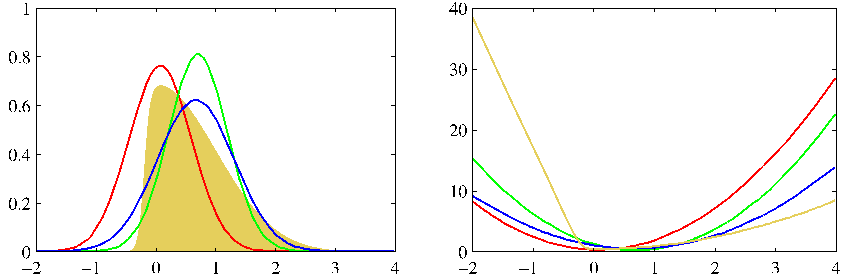

Figure 10.14 Illustration of the expectation propagation approximation using a Gaussian distribution for the example considered earlier in Figures 4.14 and 10.1. The left-hand plot shows the original distribution (yellow) along with the Laplace (red), global variational (green), and EP (blue) approximations, and the right-hand plot shows the corresponding negative logarithms of the distributions. Note that the EP distribution is broader than that variational inference, as a consequence of the different form of KL divergence.

where $Z_j$ is the normalization constant given by

$$
Z_j = \int f_j(\boldsymbol{\theta})q^{\setminus j}(\boldsymbol{\theta}) \text{d}\boldsymbol{\theta}. \tag{10.197}
$$

We now determine a revised factor $\widetilde{f}_j(\boldsymbol{\theta})$ by minimizing the Kullback-Leibler divergence

$$
\text{KL} \left( \frac{f_j(\boldsymbol{\theta}) q^{\setminus j}(\boldsymbol{\theta})}{Z_j} \Big\| q^{\text{new}}(\boldsymbol{\theta}) \right). \tag{10.198}
$$

This is easily solved because the approximating distribution $q^{\text{new}}(\boldsymbol{\theta})$ is from the exponential family, and so we can appeal to the result (10.187), which tells us that the parameters of $q^{\text{new}}(\boldsymbol{\theta})$ are obtained by matching its expected sufficient statistics to the corresponding moments of (10.196). We shall assume that this is a tractable operation. For example, if we choose $q(\boldsymbol{\theta})$ to be a Gaussian distribution $\mathcal{N}(\boldsymbol{\theta}|\boldsymbol{\mu}, \boldsymbol{\Sigma})$, then $\boldsymbol{\mu}$ is set equal to the mean of the (unnormalized) distribution $f_j(\boldsymbol{\theta})q^{\setminus j}(\boldsymbol{\theta})$, and $\boldsymbol{\Sigma}$ is set to its covariance. More generally, it is straightforward to obtain the required expectations for any member of the exponential family, provided it can be normalized, because the expected statistics can be related to the derivatives of the normalization coefficient, as given by (2.226). The EP approximation is illustrated in Figure 10.14.

From (10.193), we see that the revised factor $\widetilde{f}_j(\boldsymbol{\theta})$ can be found by taking $q^{\text{new}}(\boldsymbol{\theta})$ and dividing out the remaining factors so that

$$
\widetilde{f}_j(\boldsymbol{\theta}) = K \frac{q^{\text{new}}(\boldsymbol{\theta})}{q^{\setminus j}(\boldsymbol{\theta})} \tag{10.199}
$$

where we have used (10.195). The coefficient $K$ is determined by multiplying both
[Page 529]

sides of (10.199) by $q^{\setminus j}(\boldsymbol{\theta})$ and integrating to give

$$
K = \int \widetilde{f}_j(\boldsymbol{\theta})q^{\setminus j}(\boldsymbol{\theta}) \text{d}\boldsymbol{\theta} \tag{10.200}
$$

where we have used the fact that $q^{\text{new}}(\boldsymbol{\theta})$ is normalized. The value of $K$ can therefore be found by matching zeroth-order moments

$$
\int \widetilde{f}_j(\boldsymbol{\theta}) q^{\setminus j}(\boldsymbol{\theta}) \text{d}\boldsymbol{\theta} = \int f_j(\boldsymbol{\theta}) q^{\setminus j}(\boldsymbol{\theta}) \text{d}\boldsymbol{\theta}. \tag{10.201}
$$

Combining this with (10.197), we then see that $K = Z_j$ and so can be found by evaluating the integral in (10.197).

In practice, several passes are made through the set of factors, revising each factor in turn. The posterior distribution $p(\boldsymbol{\theta}|\mathcal{D})$ is then approximated using (10.191), and the model evidence $p(\mathcal{D})$ can be approximated by using (10.190) with the factors $f_i(\boldsymbol{\theta})$ replaced by their approximations $\widetilde{f}_i(\boldsymbol{\theta})$.

**Expectation Propagation**

We are given a joint distribution over observed data $\mathcal{D}$ and stochastic variables $\boldsymbol{\theta}$ in the form of a product of factors

$$
p(\mathcal{D}, \boldsymbol{\theta}) = \prod_i f_i(\boldsymbol{\theta}) \tag{10.202}
$$

and we wish to approximate the posterior distribution $p(\boldsymbol{\theta}|\mathcal{D})$ by a distribution of the form

$$
q(\boldsymbol{\theta}) = \frac{1}{Z} \prod_i \widetilde{f}_i(\boldsymbol{\theta}). \tag{10.203}
$$

We also wish to approximate the model evidence $p(\mathcal{D})$.

1. Initialize all of the approximating factors $\widetilde{f}_i(\boldsymbol{\theta})$.
2. Initialize the posterior approximation by setting

$$
q(\boldsymbol{\theta}) \propto \prod_i \widetilde{f}_i(\boldsymbol{\theta}). \tag{10.204}
$$

3. Until convergence:

- (a) Choose a factor $\widetilde{f}_j(\boldsymbol{\theta})$ to refine.
- (b) Remove $\widetilde{f}_j(\boldsymbol{\theta})$ from the posterior by division

$$
q^{\setminus j}(\boldsymbol{\theta}) = \frac{q(\boldsymbol{\theta})}{\widetilde{f}_j(\boldsymbol{\theta})}. \tag{10.205}
$$

[Page 530]

- (c) Evaluate the new posterior by setting the sufficient statistics (moments) of $q^{\text{new}}(\boldsymbol{\theta})$ equal to those of $q^{\setminus j}(\boldsymbol{\theta})f_j(\boldsymbol{\theta})$, including evaluation of the normalization constant

$$
Z_j = \int q^{\setminus j}(\boldsymbol{\theta}) f_j(\boldsymbol{\theta}) \text{d}\boldsymbol{\theta}. \tag{10.206}
$$

- (d) Evaluate and store the new factor

$$
\widetilde{f}_j(\boldsymbol{\theta}) = Z_j \frac{q^{\text{new}}(\boldsymbol{\theta})}{q^{\setminus j}(\boldsymbol{\theta})}. \tag{10.207}
$$

4. Evaluate the approximation to the model evidence

$$
p(\mathcal{D}) \simeq \int \prod_i \widetilde{f}_i(\boldsymbol{\theta}) \text{d}\boldsymbol{\theta}. \tag{10.208}
$$

A special case of EP, known as assumed density filtering (ADF) or moment matching (Maybeck, 1982; Lauritzen, 1992; Boyen and Koller, 1998; Opper and Winther, 1999), is obtained by initializing all of the approximating factors except the first to unity and then making one pass through the factors updating each of them once. Assumed density filtering can be appropriate for on-line learning in which data points are arriving in a sequence and we need to learn from each data point and then discard it before considering the next point. However, in a batch setting we have the opportunity to re-use the data points many times in order to achieve improved accuracy, and it is this idea that is exploited in expectation propagation. Furthermore, if we apply ADF to batch data, the results will have an undesirable dependence on the (arbitrary) order in which the data points are considered, which again EP can overcome.

One disadvantage of expectation propagation is that there is no guarantee that the iterations will converge. However, for approximations $q(\boldsymbol{\theta})$ in the exponential family, if the iterations do converge, the resulting solution will be a stationary point of a particular energy function (Minka, 2001a), although each iteration of EP does not necessarily decrease the value of this energy function. This is in contrast to variational Bayes, which iteratively maximizes a lower bound on the log marginal likelihood, in which each iteration is guaranteed not to decrease the bound. It is possible to optimize the EP cost function directly, in which case it is guaranteed to converge, although the resulting algorithms can be slower and more complex to implement.

Another difference between variational Bayes and EP arises from the form of KL divergence that is minimized by the two algorithms, because the former minimizes $\text{KL}(q || p)$ whereas the latter minimizes $\text{KL}(p || q)$. As we saw in Figure 10.3, for distributions $p(\boldsymbol{\theta})$ which are multimodal, minimizing $\text{KL}(p || q)$ can lead to poor approximations. In particular, if EP is applied to mixtures the results are not sensible because the approximation tries to capture all of the modes of the posterior distribution. Conversely, in logistic-type models, EP often out-performs both local variational methods and the Laplace approximation (Kuss and Rasmussen, 2006).
[Page 531]

Figure 10.15 Illustration of the clutter problem for a data space dimensionality of $D = 1$. Training data points, denoted by the crosses, are drawn from a mixture of two Gaussians with components shown in red and green. The goal is to infer the mean of the green Gaussian from the observed data.

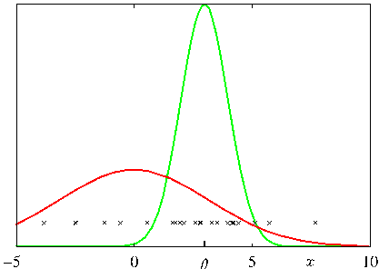

## 10.7.1 Example: The clutter problem

Following Minka (2001b), we illustrate the EP algorithm using a simple example in which the goal is to infer the mean $\boldsymbol{\theta}$ of a multivariate Gaussian distribution over a variable $\mathbf{x}$ given a set of observations drawn from that distribution. To make the problem more interesting, the observations are embedded in background clutter, which itself is also Gaussian distributed, as illustrated in Figure 10.15. The distribution of observed values $\mathbf{x}$ is therefore a mixture of Gaussians, which we take to be of the form

$$
p(\mathbf{x}|\boldsymbol{\theta}) = (1 - w)\mathcal{N}(\mathbf{x}|\boldsymbol{\theta}, \mathbf{I}) + w\mathcal{N}(\mathbf{x}|\mathbf{0}, a\mathbf{I}) \tag{10.209}
$$

where $w$ is the proportion of background clutter and is assumed to be known. The prior over $\boldsymbol{\theta}$ is taken to be Gaussian

$$
p(\boldsymbol{\theta}) = \mathcal{N}(\boldsymbol{\theta}|\mathbf{0}, b\mathbf{I}) \tag{10.210}
$$

and Minka (2001a) chooses the parameter values $a = 10$, $b = 100$ and $w = 0.5$. The joint distribution of $N$ observations $\mathcal{D} = \{\mathbf{x}_1, \ldots, \mathbf{x}_N\}$ and $\boldsymbol{\theta}$ is given by

$$
p(\mathcal{D}, \boldsymbol{\theta}) = p(\boldsymbol{\theta}) \prod_{n=1}^N p(\mathbf{x}_n|\boldsymbol{\theta}) \tag{10.211}
$$

and so the posterior distribution comprises a mixture of $2^N$ Gaussians. Thus the computational cost of solving this problem exactly would grow exponentially with the size of the data set, and so an exact solution is intractable for moderately large $N$.

To apply EP to the clutter problem, we first identify the factors $f_0(\boldsymbol{\theta}) = p(\boldsymbol{\theta})$ and $f_n(\boldsymbol{\theta}) = p(\mathbf{x}_n|\boldsymbol{\theta})$. Next we select an approximating distribution from the exponential family, and for this example it is convenient to choose a spherical Gaussian

$$
q(\boldsymbol{\theta}) = \mathcal{N}(\boldsymbol{\theta}|\mathbf{m}, v\mathbf{I}). \tag{10.212}
$$

[Page 532]

The factor approximations will therefore take the form of exponential-quadratic functions of the form

$$
\widetilde{f}_n(\boldsymbol{\theta}) = s_n \mathcal{N}(\boldsymbol{\theta}|\mathbf{m}_n, v_n\mathbf{I}) \tag{10.213}
$$

where $n = 1, \ldots, N$, and we set $\widetilde{f}_0(\boldsymbol{\theta})$ equal to the prior $p(\boldsymbol{\theta})$. Note that the use of $\mathcal{N}(\boldsymbol{\theta}|\cdot, \cdot)$ does not imply that the right-hand side is a well-defined Gaussian density (in fact, as we shall see, the variance parameter $v_n$ can be negative) but is simply a convenient shorthand notation. The approximations $\widetilde{f}_n(\boldsymbol{\theta})$, for $n = 1, \ldots, N$, can be initialized to unity, corresponding to $s_n = (2\pi v_n)^{D/2}$, $v_n \to \infty$ and $\mathbf{m}_n = \mathbf{0}$, where $D$ is the dimensionality of $\mathbf{x}$ and hence of $\boldsymbol{\theta}$. The initial $q(\boldsymbol{\theta})$, defined by (10.191), is therefore equal to the prior.

We then iteratively refine the factors by taking one factor $f_n(\boldsymbol{\theta})$ at a time and applying (10.205), (10.206), and (10.207). Note that we do not need to revise the term $f_0(\boldsymbol{\theta})$ because an EP update will leave this term unchanged. Here we state the results and leave the reader to fill in the details.

First we remove the current estimate $\widetilde{f}_n(\boldsymbol{\theta})$ from $q(\boldsymbol{\theta})$ by division using (10.205) to give $q^{\setminus n}(\boldsymbol{\theta})$, which has mean and inverse variance given by

$$
\mathbf{m}^{\setminus n} = \mathbf{m} + v^{\setminus n}v_n^{-1}(\mathbf{m} - \mathbf{m}_n) \tag{10.214}
$$

$$
(v^{\setminus n})^{-1} = v^{-1} - v_n^{-1}. \tag{10.215}
$$

Next we evaluate the normalization constant $Z_n$ using (10.206) to give

$$
Z_n = (1 - w)\mathcal{N}(\mathbf{x}_n|\mathbf{m}^{\setminus n}, (v^{\setminus n} + 1)\mathbf{I}) + w\mathcal{N}(\mathbf{x}_n|\mathbf{0}, a\mathbf{I}). \tag{10.216}
$$

Similarly, we compute the mean and variance of $q^{\text{new}}(\boldsymbol{\theta})$ by finding the mean and variance of $q^{\setminus n}(\boldsymbol{\theta})f_n(\boldsymbol{\theta})$ to give

$$
\mathbf{m} = \mathbf{m}^{\setminus n} + \rho_n \frac{v^{\setminus n}}{v^{\setminus n} + 1}(\mathbf{x}_n - \mathbf{m}^{\setminus n}) \tag{10.217}
$$

$$
v = v^{\setminus n} - \rho_n \frac{(v^{\setminus n})^2}{v^{\setminus n} + 1} + \rho_n(1 - \rho_n) \frac{(v^{\setminus n})^2 \Vert \mathbf{x}_n - \mathbf{m}^{\setminus n} \Vert^2}{D(v^{\setminus n} + 1)^2} \tag{10.218}
$$

where the quantity

$$
\rho_n = 1 - \frac{w}{Z_n} \mathcal{N}(\mathbf{x}_n|\mathbf{0}, a\mathbf{I}) \tag{10.219}
$$

has a simple interpretation as the probability of the point $\mathbf{x}_n$ not being clutter. Then we use (10.207) to compute the refined factor $\widetilde{f}_n(\boldsymbol{\theta})$ whose parameters are given by

$$
v_n^{-1} = (v^{\text{new}})^{-1} - (v^{\setminus n})^{-1} \tag{10.220}
$$

$$
\mathbf{m}_n = \mathbf{m}^{\setminus n} + (v_n + v^{\setminus n})(v^{\setminus n})^{-1}(\mathbf{m}^{\text{new}} - \mathbf{m}^{\setminus n}) \tag{10.221}
$$

$$
s_n = \frac{Z_n}{(2\pi v_n)^{D/2} \mathcal{N}(\mathbf{m}_n|\mathbf{m}^{\setminus n}, (v_n + v^{\setminus n})\mathbf{I})}. \tag{10.222}
$$

This refinement process is repeated until a suitable termination criterion is satisfied, for instance that the maximum change in parameter values resulting from a complete
[Page 533]

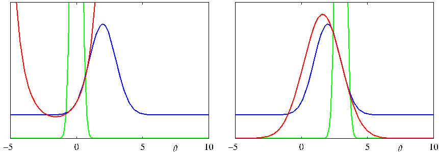

Figure 10.16 Examples of the approximation of specific factors for a one-dimensional version of the clutter problem, showing $f_n(\theta)$ in blue, $\widetilde{f}_n(\theta)$ in red, and $q^{\setminus n}(\theta)$ in green. Notice that the current form for $q^{\setminus n}(\theta)$ controls the range of $\theta$ over which $\widetilde{f}_n(\theta)$ will be a good approximation to $f_n(\theta)$.

pass through all factors is less than some threshold. Finally, we use (10.208) to evaluate the approximation to the model evidence, given by

$$
p(\mathcal{D}) \simeq (2\pi v^{\text{new}})^{D/2} \exp(B/2) \prod_{n=1}^N \left\{ s_n(2\pi v_n)^{-D/2} \right\} \tag{10.223}
$$

where

$$
B = \frac{(\mathbf{m}^{\text{new}})^{\text{T}}\mathbf{m}^{\text{new}}}{v^{\text{new}}} - \sum_{n=1}^N \frac{\mathbf{m}_n^{\text{T}}\mathbf{m}_n}{v_n}. \tag{10.224}
$$

Examples factor approximations for the clutter problem with a one-dimensional parameter space $\theta$ are shown in Figure 10.16. Note that the factor approximations can have infinite or even negative values for the ‘variance’ parameter $v_n$. This simply corresponds to approximations that curve upwards instead of downwards and are not necessarily problematic provided the overall approximate posterior $q(\boldsymbol{\theta})$ has positive variance. Figure 10.17 compares the performance of EP with variational Bayes (mean field theory) and the Laplace approximation on the clutter problem.

## 10.7.2 Expectation propagation on graphs

So far in our general discussion of EP, we have allowed the factors $f_i(\boldsymbol{\theta})$ in the distribution $p(\boldsymbol{\theta})$ to be functions of all of the components of $\boldsymbol{\theta}$, and similarly for the approximating factors $\widetilde{f}_i(\boldsymbol{\theta})$ in the approximating distribution $q(\boldsymbol{\theta})$. We now consider situations in which the factors depend only on subsets of the variables. Such restrictions can be conveniently expressed using the framework of probabilistic graphical models, as discussed in Chapter 8. Here we use a factor graph representation because this encompasses both directed and undirected graphs.
[Page 534]

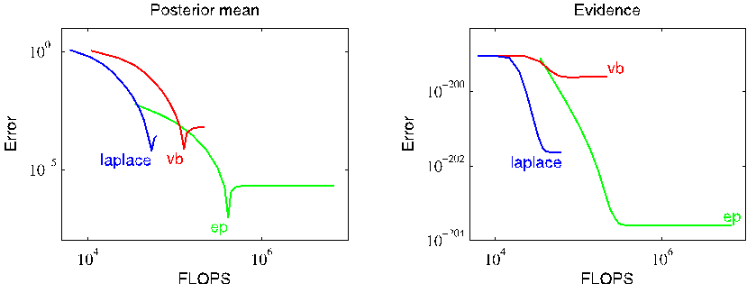

Figure 10.17 Comparison of expectation propagation, variational inference, and the Laplace approximation on the clutter problem. The left-hand plot shows the error in the predicted posterior mean versus the number of floating point operations, and the right-hand plot shows the corresponding results for the model evidence.

We shall focus on the case in which the approximating distribution is fully factorized, and we shall show that in this case expectation propagation reduces to loopy belief propagation (Minka, 2001a). To start with, we show this in the context of a simple example, and then we shall explore the general case.

First of all, recall from (10.17) that if we minimize the Kullback-Leibler divergence $\text{KL}(p || q)$ with respect to a factorized distribution $q$, then the optimal solution for each factor is simply the corresponding marginal of $p$.

Now consider the factor graph shown on the left in Figure 10.18, which was introduced earlier in the context of the sum-product algorithm. The joint distribution is given by

$$
p(\mathbf{x}) = f_a(x_1, x_2)f_b(x_2, x_3)f_c(x_2, x_4). \tag{10.225}
$$

We seek an approximation $q(\mathbf{x})$ that has the same factorization, so that

$$
q(\mathbf{x}) \propto f_a(x_1, x_2) f_b(x_2, x_3) f_c(x_2, x_4). \tag{10.226}
$$

Note that normalization constants have been omitted, and these can be re-instated at the end by local normalization, as is generally done in belief propagation. Now suppose we restrict attention to approximations in which the factors themselves factorize with respect to the individual variables so that

$$
q(\mathbf{x}) \propto \widetilde{f}_{a1}(x_1) \widetilde{f}_{a2}(x_2) \widetilde{f}_{b2}(x_2) \widetilde{f}_{b3}(x_3) \widetilde{f}_{c2}(x_2) \widetilde{f}_{c4}(x_4) \tag{10.227}
$$

which corresponds to the factor graph shown on the right in Figure 10.18. Because the individual factors are factorized, the overall distribution $q(\mathbf{x})$ is itself fully factorized.

Now we apply the EP algorithm using the fully factorized approximation. Suppose that we have initialized all of the factors and that we choose to refine factor
[Page 535]

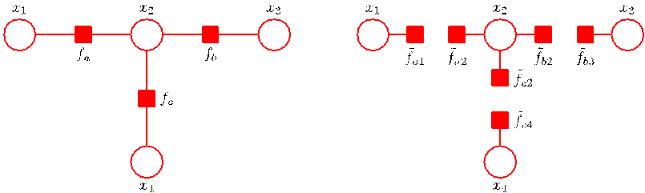

Figure 10.18 On the left is a simple factor graph from Figure 8.51 and reproduced here for convenience. On the right is the corresponding factorized approximation.

$\widetilde{f}_b(x_2, x_3) = \widetilde{f}_{b2}(x_2)\widetilde{f}_{b3}(x_3)$. We first remove this factor from the approximating distribution to give

$$
q^{\setminus b}(\mathbf{x}) = \widetilde{f}_{a1}(x_1) \widetilde{f}_{a2}(x_2) \widetilde{f}_{c2}(x_2) \widetilde{f}_{c4}(x_4) \tag{10.228}
$$

and we then multiply this by the exact factor $f_b(x_2, x_3)$ to give

$$
\widehat{p}(\mathbf{x}) = q^{\setminus b}(\mathbf{x})f_b(x_2, x_3) = \widetilde{f}_{a1}(x_1) \widetilde{f}_{a2}(x_2) \widetilde{f}_{c2}(x_2) \widetilde{f}_{c4}(x_4)f_b(x_2, x_3). \tag{10.229}
$$

We now find $q^{\text{new}}(\mathbf{x})$ by minimizing the Kullback-Leibler divergence $\text{KL}(\widehat{p} || q^{\text{new}})$. The result, as noted above, is that $q^{\text{new}}(\mathbf{z})$ comprises the product of factors, one for each variable $x_i$, in which each factor is given by the corresponding marginal of $\widehat{p}(\mathbf{x})$. These four marginals are given by

$$
\widehat{p}(x_1) \propto \widetilde{f}_{a1}(x_1) \tag{10.230}
$$

$$
\widehat{p}(x_2) \propto \widetilde{f}_{a2}(x_2) \widetilde{f}_{c2}(x_2) \sum_{x_3} f_b(x_2, x_3) \tag{10.231}
$$

$$
\widehat{p}(x_3) \propto \sum_{x_2} \left\{ f_b(x_2, x_3) \widetilde{f}_{a2}(x_2) \widetilde{f}_{c2}(x_2) \right\} \tag{10.232}
$$

$$
\widehat{p}(x_4) \propto \widetilde{f}_{c4}(x_4) \tag{10.233}
$$

and $q^{\text{new}}(\mathbf{x})$ is obtained by multiplying these marginals together. We see that the only factors in $q(\mathbf{x})$ that change when we update $\widetilde{f}_b(x_2, x_3)$ are those that involve the variables in $f_b$ namely $x_2$ and $x_3$. To obtain the refined factor $\widetilde{f}_b(x_2, x_3) = \widetilde{f}_{b2}(x_2) \widetilde{f}_{b3}(x_3)$ we simply divide $q^{\text{new}}(\mathbf{x})$ by $q^{\setminus b}(\mathbf{x})$, which gives

$$
\widetilde{f}_{b2}(x_2) \propto \sum_{x_3} f_b(x_2, x_3) \tag{10.234}
$$

$$
\widetilde{f}_{b3}(x_3) \propto \sum_{x_2} \left\{ f_b(x_2, x_3) \widetilde{f}_{a2}(x_2) \widetilde{f}_{c2}(x_2) \right\}. \tag{10.235}
$$

[Page 536]

These are precisely the messages obtained using belief propagation in which messages from variable nodes to factor nodes have been folded into the messages from factor nodes to variable nodes. In particular, $\widetilde{f}_{b2}(x_2)$ corresponds to the message $\mu_{f_b \to x_2}(x_2)$ sent by factor node $f_b$ to variable node $x_2$ and is given by (8.81). Similarly, if we substitute (8.78) into (8.79), we obtain (10.235) in which $\widetilde{f}_{a2}(x_2)$ corresponds to $\mu_{f_a \to x_2}(x_2)$ and $\widetilde{f}_{c2}(x_2)$ corresponds to $\mu_{f_c \to x_2}(x_2)$, giving the message $\widetilde{f}_{b3}(x_3)$ which corresponds to $\mu_{f_b \to x_3}(x_3)$.

This result differs slightly from standard belief propagation in that messages are passed in both directions at the same time. We can easily modify the EP procedure to give the standard form of the sum-product algorithm by updating just one of the factors at a time, for instance if we refine only $\widetilde{f}_{b3}(x_3)$, then $\widetilde{f}_{b2}(x_2)$ is unchanged by definition, while the refined version of $\widetilde{f}_{b3}(x_3)$ is again given by (10.235). If we are refining only one term at a time, then we can choose the order in which the refinements are done as we wish. In particular, for a tree-structured graph we can follow a two-pass update scheme, corresponding to the standard belief propagation schedule, which will result in exact inference of the variable and factor marginals. The initialization of the approximation factors in this case is unimportant.

Now let us consider a general factor graph corresponding to the distribution

$$
p(\boldsymbol{\theta}) = \prod_i f_i(\boldsymbol{\theta}_i) \tag{10.236}
$$

where $\boldsymbol{\theta}_i$ represents the subset of variables associated with factor $f_i$. We approximate this using a fully factorized distribution of the form

$$
q(\boldsymbol{\theta}) \propto \prod_i \prod_k \widetilde{f}_{ik}(\theta_k) \tag{10.237}
$$

where $\theta_k$ corresponds to an individual variable node. Suppose that we wish to refine the particular term $\widetilde{f}_{jl}(\theta_l)$ keeping all other terms fixed. We first remove the term $\widetilde{f}_j(\boldsymbol{\theta}_j)$ from $q(\boldsymbol{\theta})$ to give

$$
q^{\setminus j}(\boldsymbol{\theta}) \propto \prod_{i \neq j} \prod_k \widetilde{f}_{ik}(\theta_k) \tag{10.238}
$$

and then multiply by the exact factor $f_j(\boldsymbol{\theta}_j)$. To determine the refined term $\widetilde{f}_{jl}(\theta_l)$, we need only consider the functional dependence on $\theta_l$, and so we simply find the corresponding marginal of

$$
q^{\setminus j}(\boldsymbol{\theta}) f_j(\boldsymbol{\theta}_j). \tag{10.239}
$$

Up to a multiplicative constant, this involves taking the marginal of $f_j(\boldsymbol{\theta}_j)$ multiplied by any terms from $q^{\setminus j}(\boldsymbol{\theta})$ that are functions of any of the variables in $\boldsymbol{\theta}_j$. Terms that correspond to other factors $f_i(\boldsymbol{\theta}_i)$ for $i \neq j$ will cancel between numerator and denominator when we subsequently divide by $q^{\setminus j}(\boldsymbol{\theta})$. We therefore obtain

$$
\widetilde{f}_{jl}(\theta_l) \propto \sum_{\boldsymbol{\theta}_j \setminus \theta_l} f_j(\boldsymbol{\theta}_j) \prod_{m \neq l} \prod_{k \neq j} \widetilde{f}_{km}(\theta_m). \tag{10.240}
$$

[Page 537]

We recognize this as the sum-product rule in the form in which messages from variable nodes to factor nodes have been eliminated, as illustrated by the example shown in Figure 8.50. The quantity $\widetilde{f}_{jm}(\theta_m)$ corresponds to the message $\mu_{f_j \to \theta_m}(\theta_m)$, which factor node $j$ sends to variable node $m$, and the product over $k$ in (10.240) is over all factors that depend on the variables $\theta_m$ that have variables (other than variable $\theta_l$) in common with factor $f_j(\boldsymbol{\theta}_j)$. In other words, to compute the outgoing message from a factor node, we take the product of all the incoming messages from other factor nodes, multiply by the local factor, and then marginalize.

Thus, the sum-product algorithm arises as a special case of expectation propagation if we use an approximating distribution that is fully factorized. This suggests that more flexible approximating distributions, corresponding to partially disconnected graphs, could be used to achieve higher accuracy. Another generalization is to group factors $f_i(\boldsymbol{\theta}_i)$ together into sets and to refine all the factors in a set together at each iteration. Both of these approaches can lead to improvements in accuracy (Minka, 2001b). In general, the problem of choosing the best combination of grouping and disconnection is an open research issue.

We have seen that variational message passing and expectation propagation optimize two different forms of the Kullback-Leibler divergence. Minka (2005) has shown that a broad range of message passing algorithms can be derived from a common framework involving minimization of members of the alpha family of divergences, given by (10.19). These include variational message passing, loopy belief propagation, and expectation propagation, as well as a range of other algorithms, which we do not have space to discuss here, such as tree-reweighted message passing (Wainwright et al., 2005), fractional belief propagation (Wiegerinck and Heskes, 2003), and power EP (Minka, 2004).
