[Page 543]

# 11. Sampling Methods

For most probabilistic models of practical interest, exact inference is intractable, and so we have to resort to some form of approximation. In Chapter 10, we discussed inference algorithms based on deterministic approximations, which include methods such as variational Bayes and expectation propagation. Here we consider approximate inference methods based on numerical sampling, also known as Monte Carlo techniques.

Although for some applications the posterior distribution over unobserved variables will be of direct interest in itself, for most situations the posterior distribution is required primarily for the purpose of evaluating expectations, for example in order to make predictions. The fundamental problem that we therefore wish to address in this chapter involves finding the expectation of some function $f(\mathbf{z})$ with respect to a probability distribution $p(\mathbf{z})$. Here, the components of $\mathbf{z}$ might comprise discrete or continuous variables or some combination of the two. Thus in the case of continuous
[Page 544]

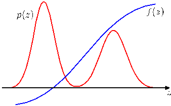

Figure 11.1 Schematic illustration of a function $f(z)$ whose expectation is to be evaluated with respect to a distribution $p(z)$.

variables, we wish to evaluate the expectation

$$
\mathbb{E}[f] = \int f(\mathbf{z})p(\mathbf{z}) d\mathbf{z} \tag{11.1}
$$

where the integral is replaced by summation in the case of discrete variables. This is illustrated schematically for a single continuous variable in Figure 11.1. We shall suppose that such expectations are too complex to be evaluated exactly using analytical techniques.

The general idea behind sampling methods is to obtain a set of samples $\mathbf{z}^{(l)}$ (where $l = 1,\dots,L$) drawn independently from the distribution $p(\mathbf{z})$. This allows the expectation (11.1) to be approximated by a finite sum

$$
\widehat{f} = \frac{1}{L} \sum_{l=1}^L f(\mathbf{z}^{(l)}). \tag{11.2}
$$

As long as the samples $\mathbf{z}^{(l)}$ are drawn from the distribution $p(\mathbf{z})$, then $\mathbb{E}[\widehat{f}] = \mathbb{E}[f]$ and so the estimator $\widehat{f}$ has the correct mean. The variance of the estimator is given by

$$
\text{var}[\widehat{f}] = \frac{1}{L} \mathbb{E}\left[(f - \mathbb{E}[f])^2\right] \tag{11.3}
$$

is the variance of the function $f(\mathbf{z})$ under the distribution $p(\mathbf{z})$. It is worth emphasizing that the accuracy of the estimator therefore does not depend on the dimensionality of $\mathbf{z}$, and that, in principle, high accuracy may be achievable with a relatively small number of samples $\mathbf{z}^{(l)}$. In practice, ten or twenty independent samples may suffice to estimate an expectation to sufficient accuracy.

The problem, however, is that the samples $\{\mathbf{z}^{(l)}\}$ might not be independent, and so the effective sample size might be much smaller than the apparent sample size. Also, referring back to Figure 11.1, we note that if $f(\mathbf{z})$ is small in regions where $p(\mathbf{z})$ is large, and vice versa, then the expectation may be dominated by regions of small probability, implying that relatively large sample sizes will be required to achieve sufficient accuracy.

For many models, the joint distribution $p(\mathbf{z})$ is conveniently specified in terms of a graphical model. In the case of a directed graph with no observed variables, it is
[Page 545]

straightforward to sample from the joint distribution (assuming that it is possible to sample from the conditional distributions at each node) using the following ancestral sampling approach, discussed briefly in Section 8.1.2. The joint distribution is specified by

$$
p(\mathbf{z}) = \prod_{i=1}^M p(\mathbf{z}_i|\text{pa}_i) \tag{11.4}
$$

where $\mathbf{z}_i$ are the set of variables associated with node $i$, and $\text{pa}_i$ denotes the set of variables associated with the parents of node $i$. To obtain a sample from the joint distribution, we make one pass through the set of variables in the order $\mathbf{z}_1,\dots,\mathbf{z}_M$ sampling from the conditional distributions $p(\mathbf{z}_i|\text{pa}_i)$. This is always possible because at each step all of the parent values will have been instantiated. After one pass through the graph, we will have obtained a sample from the joint distribution.

Now consider the case of a directed graph in which some of the nodes are instantiated with observed values. We can in principle extend the above procedure, at least in the case of nodes representing discrete variables, to give the following logic sampling approach (Henrion, 1988), which can be seen as a special case of importance sampling discussed in Section 11.1.4. At each step, when a sampled value is obtained for a variable $\mathbf{z}_i$ whose value is observed, the sampled value is compared to the observed value, and if they agree then the sample value is retained and the algorithm proceeds to the next variable in turn. However, if the sampled value and the observed value disagree, then the whole sample so far is discarded and the algorithm starts again with the first node in the graph. This algorithm samples correctly from the posterior distribution because it corresponds simply to drawing samples from the joint distribution of hidden variables and data variables and then discarding those samples that disagree with the observed data (with the slight saving of not continuing with the sampling from the joint distribution as soon as one contradictory value is observed). However, the overall probability of accepting a sample from the posterior decreases rapidly as the number of observed variables increases and as the number of states that those variables can take increases, and so this approach is rarely used in practice.

In the case of probability distributions defined by an undirected graph, there is no one-pass sampling strategy that will sample even from the prior distribution with no observed variables. Instead, computationally more expensive techniques must be employed, such as Gibbs sampling, which is discussed in Section 11.3.

As well as sampling from conditional distributions, we may also require samples from a marginal distribution. If we already have a strategy for sampling from a joint distribution $p(\mathbf{u}, \mathbf{v})$, then it is straightforward to obtain samples from the marginal distribution $p(\mathbf{u})$ simply by ignoring the values for $\mathbf{v}$ in each sample.

There are numerous texts dealing with Monte Carlo methods. Those of particular interest from the statistical inference perspective include Chen et al. (2001), Gamerman (1997), Gilks et al. (1996), Liu (2001), Neal (1996), and Robert and Casella (1999). Also there are review articles by Besag et al. (1995), Brooks (1998), Diaconis and Saloff-Coste (1998), Jerrum and Sinclair (1996), Neal (1993), Tierney (1994), and Andrieu et al. (2003) that provide additional information on sampling
[Page 546]

methods for statistical inference.

Diagnostic tests for convergence of Markov chain Monte Carlo algorithms are summarized in Robert and Casella (1999), and some practical guidance on the use of sampling methods in the context of machine learning is given in Bishop and Nabney (2008).

## 11.1 Basic Sampling Algorithms

In this section, we consider some simple strategies for generating random samples from a given distribution. Because the samples will be generated by a computer algorithm they will in fact be pseudo-random numbers, that is, they will be deterministically calculated, but must nevertheless pass appropriate tests for randomness. Generating such numbers raises several subtleties (Press et al., 1992) that lie outside the scope of this book. Here we shall assume that an algorithm has been provided that generates pseudo-random numbers distributed uniformly over $(0,1)$, and indeed most software environments have such a facility built in.

### 11.1.1 Standard distributions

We first consider how to generate random numbers from simple nonuniform distributions, assuming that we already have available a source of uniformly distributed random numbers. Suppose that $z$ is uniformly distributed over the interval $(0,1)$, and that we transform the values of $z$ using some function $f(\cdot)$ so that $y = f(z)$. The distribution of $y$ will be governed by

$$
p(y) = p(z) \left| \frac{dz}{dy} \right| \tag{11.5}
$$

where, in this case, $p(z) = 1$. Our goal is to choose the function $f(z)$ such that the resulting values of $y$ have some specific desired distribution $p(y)$. Integrating (11.5) we obtain

$$
z = h(y) \equiv \int_{-\infty}^y p(\widehat{y}) d\widehat{y} \tag{11.6}
$$

which is the indefinite integral of $p(y)$. Thus, $y = h^{-1}(z)$, and so we have to transform the uniformly distributed random numbers using a function which is the inverse of the indefinite integral of the desired distribution. This is illustrated in Figure 11.2.

Consider for example the exponential distribution

$$
p(y) = \lambda \exp(-\lambda y) \tag{11.7}
$$

where $0 \leqslant y < \infty$. In this case the lower limit of the integral in (11.6) is $0$, and so $h(y) = 1 - \exp(-\lambda y)$. Thus, if we transform our uniformly distributed variable $z$ using $y = -\lambda^{-1} \ln(1 - z)$, then $y$ will have an exponential distribution.
[Page 547]

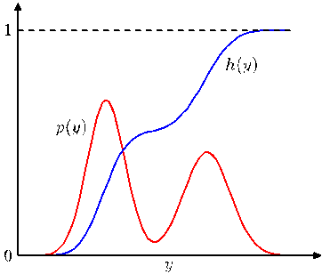

Figure 11.2 Geometrical interpretation of the transformation method for generating nonuniformly distributed random numbers. $h(y)$ is the indefinite integral of the desired distribution $p(y)$. If a uniformly distributed random variable $z$ is transformed using $y = h^{-1}(z)$, then $y$ will be distributed according to $p(y)$.

Another example of a distribution to which the transformation method can be applied is given by the Cauchy distribution

$$
p(y) = \frac{1}{\pi} \frac{1}{1 + y^2}. \tag{11.8}
$$

In this case, the inverse of the indefinite integral can be expressed in terms of the 'tan' function.

The generalization to multiple variables is straightforward and involves the Jacobian of the change of variables, so that

$$
p(y_1, \dots, y_M) = p(z_1, \dots, z_M) \left| \frac{\partial(z_1, \dots, z_M)}{\partial(y_1, \dots, y_M)} \right|. \tag{11.9}
$$

As a final example of the transformation method we consider the Box-Muller method for generating samples from a Gaussian distribution. First, suppose we generate pairs of uniformly distributed random numbers $z_1, z_2 \in (-1, 1)$, which we can do by transforming a variable distributed uniformly over $(0,1)$ using $z \to 2z - 1$. Next we discard each pair unless it satisfies $z_1^2 + z_2^2 \leqslant 1$. This leads to a uniform distribution of points inside the unit circle with $p(z_1, z_2) = 1/\pi$, as illustrated in Figure 11.3. Then, for each pair $z_1, z_2$ we evaluate the quantities

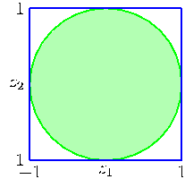

Figure 11.3 The Box-Muller method for generating Gaussian distributed random numbers starts by generating samples from a uniform distribution inside the unit circle.
[Page 548]

$$
y_1 = z_1 \left( \frac{-2 \ln z_1}{r^2} \right)^{1/2} \tag{11.10}
$$

$$
y_2 = z_2 \left( \frac{-2 \ln z_2}{r^2} \right)^{1/2} \tag{11.11}
$$

where $r^2 = z_1^2 + z_2^2$. Then the joint distribution of $y_1$ and $y_2$ is given by

$$
p(y_1, y_2) = p(z_1, z_2) \left| \frac{\partial(z_1, z_2)}{\partial(y_1, y_2)} \right| = \left[ \frac{1}{\sqrt{2\pi}} \exp(-y_1^2/2) \right] \left[ \frac{1}{\sqrt{2\pi}} \exp(-y_2^2/2) \right] \tag{11.12}
$$

and so $y_1$ and $y_2$ are independent and each has a Gaussian distribution with zero mean and unit variance.

If $y$ has a Gaussian distribution with zero mean and unit variance, then $\sigma y + \mu$ will have a Gaussian distribution with mean $\mu$ and variance $\sigma^2$. To generate vector-valued variables having a multivariate Gaussian distribution with mean $\boldsymbol{\mu}$ and covariance $\boldsymbol{\Sigma}$, we can make use of the Cholesky decomposition, which takes the form $\boldsymbol{\Sigma} = \mathbf{L}\mathbf{L}^{\text{T}}$ (Press et al., 1992). Then, if $\mathbf{z}$ is a vector valued random variable whose components are independent and Gaussian distributed with zero mean and unit variance, then $\mathbf{y} = \boldsymbol{\mu} + \mathbf{L}\mathbf{z}$ will have mean $\boldsymbol{\mu}$ and covariance $\boldsymbol{\Sigma}$.

Obviously, the transformation technique depends for its success on the ability to calculate and then invert the indefinite integral of the required distribution. Such operations will only be feasible for a limited number of simple distributions, and so we must turn to alternative approaches in search of a more general strategy. Here we consider two techniques called rejection sampling and importance sampling. Although mainly limited to univariate distributions and thus not directly applicable to complex problems in many dimensions, they do form important components in more general strategies.

## 11.1.2 Rejection sampling

The rejection sampling framework allows us to sample from relatively complex distributions, subject to certain constraints. We begin by considering univariate distributions and discuss the extension to multiple dimensions subsequently.

Suppose we wish to sample from a distribution $p(z)$ that is not one of the simple, standard distributions considered so far, and that sampling directly from $p(z)$ is difficult. Furthermore suppose, as is often the case, that we are easily able to evaluate $p(z)$ for any given value of $z$, up to some normalizing constant $Z_p$, so that

$$
p(z) = \frac{1}{Z_p} \widetilde{p}(z) \tag{11.13}
$$

where $\widetilde{p}(z)$ can readily be evaluated, but $Z_p$ is unknown.

In order to apply rejection sampling, we need some simpler distribution $q(z)$, sometimes called a proposal distribution, from which we can readily draw samples.
[Page 549]

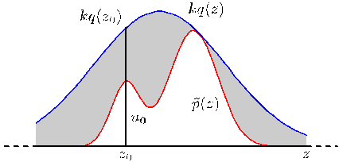

Figure 11.4 In the rejection sampling method, samples are drawn from a simple distribution $q(z)$ and rejected if they fall in the grey area between the unnormalized distribution $\widetilde{p}(z)$ and the scaled distribution $kq(z)$. The resulting samples are distributed according to $p(z)$, which is the normalized version of $\widetilde{p}(z)$.

We next introduce a constant $k$ whose value is chosen such that $kq(z) \geqslant \widetilde{p}(z)$ for all values of $z$. The function $kq(z)$ is called the comparison function and is illustrated for a univariate distribution in Figure 11.4. Each step of the rejection sampler involves generating two random numbers. First, we generate a number $z_0$ from the distribution $q(z)$. Next, we generate a number $u_0$ from the uniform distribution over $[0, kq(z_0)]$. This pair of random numbers has uniform distribution under the curve of the function $kq(z)$. Finally, if $u_0 > \widetilde{p}(z_0)$ then the sample is rejected, otherwise $u_0$ is retained. Thus the pair is rejected if it lies in the grey shaded region in Figure 11.4. The remaining pairs then have uniform distribution under the curve of $\widetilde{p}(z)$, and hence the corresponding $z$ values are distributed according to $p(z)$, as desired.

The original values of $z$ are generated from the distribution $q(z)$, and these samples are then accepted with probability $\widetilde{p}(z)/kq(z)$, and so the probability that a sample will be accepted is given by

$$
p(\text{accept}) = \int \left\{ \frac{\widetilde{p}(z)}{kq(z)} \right\} q(z) dz = \frac{1}{k} \int \widetilde{p}(z) dz. \tag{11.14}
$$

Thus the fraction of points that are rejected by this method depends on the ratio of the area under the unnormalized distribution $\widetilde{p}(z)$ to the area under the curve $kq(z)$. We therefore see that the constant $k$ should be as small as possible subject to the limitation that $kq(z)$ must be nowhere less than $\widetilde{p}(z)$.

As an illustration of the use of rejection sampling, consider the task of sampling from the gamma distribution

$$
\text{Gam}(z|a, b) = \frac{b^a z^{a-1} \exp(-bz)}{\Gamma(a)} \tag{11.15}
$$

which, for $a > 1$, has a bell-shaped form, as shown in Figure 11.5. A suitable proposal distribution is therefore the Cauchy (11.8) because this too is bell-shaped and because we can use the transformation method, discussed earlier, to sample from it. We need to generalize the Cauchy slightly to ensure that it nowhere has a smaller value than the gamma distribution. This can be achieved by transforming a uniform random variable $y$ using $z = b \tan y + c$, which gives random numbers distributed according to
[Page 550]

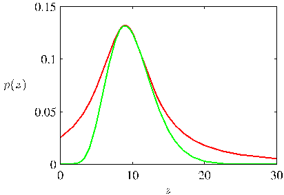

Figure 11.5 Plot showing the gamma distribution given by (11.15) as the green curve, with a scaled Cauchy proposal distribution shown by the red curve. Samples from the gamma distribution can be obtained by sampling from the Cauchy and then applying the rejection sampling criterion.

$$
q(z) = \frac{k}{1 + (z - c)^2/b^2}. \tag{11.16}
$$

The minimum reject rate is obtained by setting $c = a - 1$, $b^2 = 2a - 1$ and choosing the constant $k$ to be as small as possible while still satisfying the requirement $kq(z) \geqslant \widetilde{p}(z)$. The resulting comparison function is also illustrated in Figure 11.5.

## 11.1.3 Adaptive rejection sampling

In many instances where we might wish to apply rejection sampling, it proves difficult to determine a suitable analytic form for the envelope distribution $q(z)$. An alternative approach is to construct the envelope function on the fly based on measured values of the distribution $p(z)$ (Gilks and Wild, 1992). Construction of an envelope function is particularly straightforward for cases in which $p(z)$ is log concave, in other words when $\ln p(z)$ has derivatives that are nonincreasing functions of $z$. The construction of a suitable envelope function is illustrated graphically in Figure 11.6.

The function $\ln p(z)$ and its gradient are evaluated at some initial set of grid points, and the intersections of the resulting tangent lines are used to construct the envelope function. Next a sample value is drawn from the envelope distribution. This is straightforward because the log of the envelope distribution is a succession

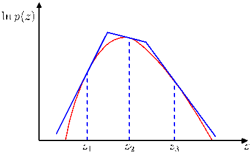

Figure 11.6 In the case of distributions that are log concave, an envelope function for use in rejection sampling can be constructed using the tangent lines computed at a set of grid points. If a sample point is rejected, it is added to the set of grid points and used to refine the envelope distribution.
[Page 551]

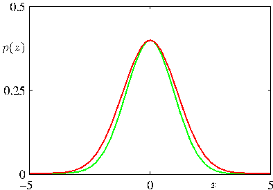

Figure 11.7 Illustrative example of rejection sampling involving sampling from a Gaussian distribution $p(z)$ shown by the green curve, by using rejection sampling from a proposal distribution $q(z)$ that is also Gaussian and whose scaled version $kq(z)$ is shown by the red curve.

of linear functions, and hence the envelope distribution itself comprises a piecewise exponential distribution of the form

$$
q(z) = k_i \lambda_i \exp\{-\lambda_i(z - z_{i-1})\} \qquad z_{i-1} < z \leqslant z_i. \tag{11.17}
$$

Once a sample has been drawn, the usual rejection criterion can be applied. If the sample is accepted, then it will be a draw from the desired distribution. If, however, the sample is rejected, then it is incorporated into the set of grid points, a new tangent line is computed, and the envelope function is thereby refined. As the number of grid points increases, so the envelope function becomes a better approximation of the desired distribution $p(z)$ and the probability of rejection decreases.

A variant of the algorithm exists that avoids the evaluation of derivatives (Gilks, 1992). The adaptive rejection sampling framework can also be extended to distributions that are not log concave, simply by following each rejection sampling step with a Metropolis-Hastings step (to be discussed in Section 11.2.2), giving rise to adaptive rejection Metropolis sampling (Gilks et al., 1995).

Clearly for rejection sampling to be of practical value, we require that the comparison function be close to the required distribution so that the rate of rejection is kept to a minimum. Now let us examine what happens when we try to use rejection sampling in spaces of high dimensionality. Consider, for the sake of illustration, a somewhat artificial problem in which we wish to sample from a zero-mean multivariate Gaussian distribution with covariance $\sigma_p^2\mathbf{I}$, where $\mathbf{I}$ is the unit matrix, by rejection sampling from a proposal distribution that is itself a zero-mean Gaussian distribution having covariance $\sigma_q^2\mathbf{I}$. Obviously, we must have $\sigma_q^2 \geqslant \sigma_p^2$ in order that there exists a $k$ such that $kq(\mathbf{z}) \geqslant p(\mathbf{z})$. In $D$-dimensions the optimum value of $k$ is given by $k = (\sigma_q/\sigma_p)^D$, as illustrated for $D = 1$ in Figure 11.7. The acceptance rate will be the ratio of volumes under $p(\mathbf{z})$ and $kq(\mathbf{z})$, which, because both distributions are normalized, is just $1/k$. Thus the acceptance rate diminishes exponentially with dimensionality. Even if $\sigma_q$ exceeds $\sigma_p$ by just one percent, for $D = 1,000$ the acceptance ratio will be approximately $1/20,000$. In this illustrative example the comparison function is close to the required distribution. For more practical examples, where the desired distribution may be multimodal and sharply peaked, it will be extremely difficult to find a good proposal distribution and comparison function.
[Page 552]

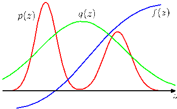

Figure 11.8 Importance sampling addresses the problem of evaluating the expectation of a function $f(\mathbf{z})$ with respect to a distribution $p(\mathbf{z})$ from which it is difficult to draw samples directly. Instead, samples $\{\mathbf{z}^{(l)}\}$ are drawn from a simpler distribution $q(\mathbf{z})$, and the corresponding terms in the summation are weighted by the ratios $p(\mathbf{z}^{(l)})/q(\mathbf{z}^{(l)})$.

Furthermore, the exponential decrease of acceptance rate with dimensionality is a generic feature of rejection sampling. Although rejection can be a useful technique in one or two dimensions it is unsuited to problems of high dimensionality. It can, however, play a role as a subroutine in more sophisticated algorithms for sampling in high dimensional spaces.

## 11.1.4 Importance sampling

One of the principal reasons for wishing to sample from complicated probability distributions is to be able to evaluate expectations of the form (11.1). The technique of importance sampling provides a framework for approximating expectations directly but does not itself provide a mechanism for drawing samples from distribution $p(\mathbf{z})$.

The finite sum approximation to the expectation, given by (11.2), depends on being able to draw samples from the distribution $p(\mathbf{z})$. Suppose, however, that it is impractical to sample directly from $p(\mathbf{z})$ but that we can evaluate $p(\mathbf{z})$ easily for any given value of $\mathbf{z}$. One simplistic strategy for evaluating expectations would be to discretize $\mathbf{z}$-space into a uniform grid and to evaluate the integrand as a sum of the form

$$
\mathbb{E}[f] \simeq \sum_{l=1}^L p(\mathbf{z}^{(l)}) f(\mathbf{z}^{(l)}). \tag{11.18}
$$

An obvious problem with this approach is that the number of terms in the summation grows exponentially with the dimensionality of $\mathbf{z}$. Furthermore, as we have already noted, the kinds of probability distributions of interest will often have much of their mass confined to relatively small regions of $\mathbf{z}$ space and so uniform sampling will be very inefficient because in high-dimensional problems, only a very small proportion of the samples will make a significant contribution to the sum. We would really like to choose the sample points to fall in regions where $p(\mathbf{z})$ is large, or ideally where the product $p(\mathbf{z})f(\mathbf{z})$ is large.

As in the case of rejection sampling, importance sampling is based on the use of a proposal distribution $q(\mathbf{z})$ from which it is easy to draw samples, as illustrated in Figure 11.8. We can then express the expectation in the form of a finite sum over
[Page 553]

$$
\mathbb{E}[f] = \int f(\mathbf{z})p(\mathbf{z}) d\mathbf{z} = \int f(\mathbf{z}) \frac{p(\mathbf{z})}{q(\mathbf{z})} q(\mathbf{z}) d\mathbf{z} \simeq \frac{1}{L} \sum_{l=1}^L \frac{p(\mathbf{z}^{(l)})}{q(\mathbf{z}^{(l)})} f(\mathbf{z}^{(l)}). \tag{11.19}
$$

The quantities $r_l = p(\mathbf{z}^{(l)})/q(\mathbf{z}^{(l)})$ are known as importance weights, and they correct the bias introduced by sampling from the wrong distribution. Note that, unlike rejection sampling, all of the samples generated are retained.

It will often be the case that the distribution $p(\mathbf{z})$ can only be evaluated up to a normalization constant, so that $p(\mathbf{z}) = \widetilde{p}(\mathbf{z})/Z_p$ where $\widetilde{p}(\mathbf{z})$ can be evaluated easily, whereas $Z_p$ is unknown. Similarly, we may wish to use an importance sampling distribution $q(\mathbf{z}) = \widetilde{q}(\mathbf{z})/Z_q$, which has the same property. We then have

$$
\mathbb{E}[f] = \int f(\mathbf{z})p(\mathbf{z}) d\mathbf{z} = \frac{Z_q}{Z_p} \int f(\mathbf{z}) \frac{\widetilde{p}(\mathbf{z})}{\widetilde{q}(\mathbf{z})} q(\mathbf{z}) d\mathbf{z} \simeq \frac{Z_q}{Z_p} \frac{1}{L} \sum_{l=1}^L \widetilde{r}_l f(\mathbf{z}^{(l)}). \tag{11.20}
$$

where $\widetilde{r}_l = \widetilde{p}(\mathbf{z}^{(l)}) / \widetilde{q}(\mathbf{z}^{(l)})$. We can use the same sample set to evaluate the ratio $Z_p/Z_q$ with the result

$$
\frac{Z_p}{Z_q} = \frac{1}{Z_q} \int \widetilde{p}(\mathbf{z}) d\mathbf{z} = \int \frac{\widetilde{p}(\mathbf{z})}{\widetilde{q}(\mathbf{z})} q(\mathbf{z}) d\mathbf{z} \simeq \frac{1}{L} \sum_{l=1}^L \widetilde{r}_l \tag{11.21}
$$

and hence

$$
\mathbb{E}[f] \simeq \sum_{l=1}^L w_l f(\mathbf{z}^{(l)}) \tag{11.22}
$$

where we have defined

$$
w_l = \frac{\widetilde{r}_l}{\sum_m \widetilde{r}_m} = \frac{\widetilde{p}(\mathbf{z}^{(l)})/q(\mathbf{z}^{(l)})}{\sum_m \widetilde{p}(\mathbf{z}^{(m)})/q(\mathbf{z}^{(m)})}. \tag{11.23}
$$

As with rejection sampling, the success of the importance sampling approach depends crucially on how well the sampling distribution $q(\mathbf{z})$ matches the desired distribution $p(\mathbf{z})$. If, as is often the case, $p(\mathbf{z})f(\mathbf{z})$ is strongly varying and has a significant proportion of its mass concentrated over relatively small regions of $\mathbf{z}$ space, then the set of importance weights $\{r_l\}$ may be dominated by a few weights having large values, with the remaining weights being relatively insignificant. Thus the effective sample size can be much smaller than the apparent sample size $L$. The problem is even more severe if none of the samples falls in the regions where $p(\mathbf{z})f(\mathbf{z})$ is large. In that case, the apparent variances of $r_l$ and $r_l f(\mathbf{z}^{(l)})$ may be small even though the estimate of the expectation may be severely wrong. Hence a major drawback of the importance sampling method is the potential to produce results that are arbitrarily in error and with no diagnostic indication. This also highlights a key requirement for the sampling distribution $q(\mathbf{z})$, namely that it should not be small or zero in regions where $p(\mathbf{z})$ may be significant.
[Page 554]

For distributions defined in terms of a graphical model, we can apply the importance sampling technique in various ways. For discrete variables, a simple approach is called uniform sampling. The joint distribution for a directed graph is defined by (11.4). Each sample from the joint distribution is obtained by first setting those variables $\mathbf{z}_i$ that are in the evidence set equal to their observed values. Each of the remaining variables is then sampled independently from a uniform distribution over the space of possible instantiations. To determine the corresponding weight associated with a sample $\mathbf{z}^{(l)}$, we note that the sampling distribution $q(\mathbf{z})$ is uniform over the possible choices for $\mathbf{z}$, and that $p(\mathbf{z}|\mathbf{x}) = p(\mathbf{z})$, where $\mathbf{x}$ denotes the subset of variables that are observed, and the equality follows from the fact that every sample $\mathbf{z}$ that is generated is necessarily consistent with the evidence. Thus the weights $r_l$ are simply proportional to $p(\mathbf{z})$. Note that the variables can be sampled in any order. This approach can yield poor results if the posterior distribution is far from uniform, as is often the case in practice.

An improvement on this approach is called likelihood weighted sampling (Fung and Chang, 1990; Shachter and Peot, 1990) and is based on ancestral sampling of the variables. For each variable in turn, if that variable is in the evidence set, then it is just set to its instantiated value. If it is not in the evidence set, then it is sampled from the conditional distribution $p(\mathbf{z}_i|\text{pa}_i)$ in which the conditioning variables are set to their currently sampled values. The weighting associated with the resulting sample $\mathbf{z}$ is then given by

$$
r(\mathbf{z}) = \prod_{z_i \notin e} \frac{p(z_i|\text{pa}_i)}{p(z_i|\text{pa}_i)} \prod_{z_i \in e} \frac{p(z_i|\text{pa}_i)}{1} = \prod_{z_i \in e} p(z_i|\text{pa}_i). \tag{11.24}
$$

This method can be further extended using self-importance sampling (Shachter and Peot, 1990) in which the importance sampling distribution is continually updated to reflect the current estimated posterior distribution.

## 11.1.5 Sampling-importance-resampling

The rejection sampling method discussed in Section 11.1.2 depends in part for its success on the determination of a suitable value for the constant $k$. For many pairs of distributions $p(\mathbf{z})$ and $q(\mathbf{z})$, it will be impractical to determine a suitable value for $k$ in that any value that is sufficiently large to guarantee a bound on the desired distribution will lead to impractically small acceptance rates.

As in the case of rejection sampling, the sampling-importance-resampling (SIR) approach also makes use of a sampling distribution $q(\mathbf{z})$ but avoids having to determine the constant $k$. There are two stages to the scheme. In the first stage, $L$ samples $\mathbf{z}^{(1)}, \dots, \mathbf{z}^{(L)}$ are drawn from $q(\mathbf{z})$. Then in the second stage, weights $w_1, \dots, w_L$ are constructed using (11.23). Finally, a second set of $L$ samples is drawn from the discrete distribution $(\mathbf{z}^{(1)}, \dots, \mathbf{z}^{(L)})$ with probabilities given by the weights $(w_1, \dots, w_L)$.
[Page 555]

The resulting $L$ samples are only approximately distributed according to $p(\mathbf{z})$, but the distribution becomes correct in the limit $L \to \infty$. To see this, consider the univariate case, and note that the cumulative distribution of the resampled values is given by

$$
p(z \leqslant a) = \sum_{l:z^{(l)} \leqslant a} w_l = \frac{\sum_l I(z^{(l)} \leqslant a) \widetilde{p}(z^{(l)})/q(z^{(l)})}{\sum_l \widetilde{p}(z^{(l)})/q(z^{(l)})} \tag{11.25}
$$

where $I(\cdot)$ is the indicator function (which equals 1 if its argument is true and 0 otherwise). Taking the limit $L \to \infty$, and assuming suitable regularity of the distributions, we can replace the sums by integrals weighted according to the original sampling distribution $q(z)$

$$
p(z \leqslant a) = \frac{\int I(z \leqslant a) \{\widetilde{p}(z)/q(z)\} q(z) dz}{\int \{\widetilde{p}(z)/q(z)\} q(z) dz} = \frac{\int I(z \leqslant a) \widetilde{p}(z) dz}{\int \widetilde{p}(z) dz} = \int I(z \leqslant a) p(z) dz \tag{11.26}
$$

which is the cumulative distribution function of $p(z)$. Again, we see that the normalization of $p(z)$ is not required.

For a finite value of $L$, and a given initial sample set, the resampled values will only approximately be drawn from the desired distribution. As with rejection sampling, the approximation improves as the sampling distribution $q(\mathbf{z})$ gets closer to the desired distribution $p(\mathbf{z})$. When $q(\mathbf{z}) = p(\mathbf{z})$, the initial samples $(\mathbf{z}^{(1)}, \dots, \mathbf{z}^{(L)})$ have the desired distribution, and the weights $w_n = 1/L$ so that the resampled values also have the desired distribution.

If moments with respect to the distribution $p(\mathbf{z})$ are required, then they can be evaluated directly using the original samples together with the weights, because

$$
\mathbb{E}[f(\mathbf{z})] = \int f(\mathbf{z})p(\mathbf{z}) d\mathbf{z} = \frac{\int f(\mathbf{z}) [\widetilde{p}(\mathbf{z})/q(\mathbf{z})] q(\mathbf{z}) d\mathbf{z}}{\int [\widetilde{p}(\mathbf{z})/q(\mathbf{z})] q(\mathbf{z}) d\mathbf{z}} \simeq \sum_{l=1}^L w_l f(\mathbf{z}^{(l)}). \tag{11.27}
$$

[Page 556]

## 11.1.6 Sampling and the EM algorithm

In addition to providing a mechanism for direct implementation of the Bayesian framework, Monte Carlo methods can also play a role in the frequentist paradigm, for example to find maximum likelihood solutions. In particular, sampling methods can be used to approximate the E step of the EM algorithm for models in which the E step cannot be performed analytically. Consider a model with hidden variables $\mathbf{Z}$, visible (observed) variables $\mathbf{X}$, and parameters $\boldsymbol{\theta}$. The function that is optimized with respect to $\boldsymbol{\theta}$ in the M step is the expected complete-data log likelihood, given by

$$
Q(\boldsymbol{\theta}, \boldsymbol{\theta}^{\text{old}}) = \int p(\mathbf{Z}|\mathbf{X}, \boldsymbol{\theta}^{\text{old}}) \ln p(\mathbf{Z}, \mathbf{X}|\boldsymbol{\theta}) d\mathbf{Z}. \tag{11.28}
$$

We can use sampling methods to approximate this integral by a finite sum over samples $\{\mathbf{Z}^{(l)}\}$, which are drawn from the current estimate for the posterior distribution $p(\mathbf{Z}|\mathbf{X}, \boldsymbol{\theta}^{\text{old}})$, so that

$$
Q(\boldsymbol{\theta}, \boldsymbol{\theta}^{\text{old}}) \simeq \frac{1}{L} \sum_{l=1}^L \ln p(\mathbf{Z}^{(l)}, \mathbf{X}|\boldsymbol{\theta}). \tag{11.29}
$$

The $Q$ function is then optimized in the usual way in the M step. This procedure is called the Monte Carlo EM algorithm.

It is straightforward to extend this to the problem of finding the mode of the posterior distribution over $\boldsymbol{\theta}$ (the MAP estimate) when a prior distribution $p(\boldsymbol{\theta})$ has been defined, simply by adding $\ln p(\boldsymbol{\theta})$ to the function $Q(\boldsymbol{\theta}, \boldsymbol{\theta}^{\text{old}})$ before performing the M step.

A particular instance of the Monte Carlo EM algorithm, called stochastic EM, arises if we consider a finite mixture model, and draw just one sample at each E step. Here the latent variable $\mathbf{Z}$ characterizes which of the $K$ components of the mixture is responsible for generating each data point. In the E step, a sample of $\mathbf{Z}$ is taken from the posterior distribution $p(\mathbf{Z}|\mathbf{X}, \boldsymbol{\theta}^{\text{old}})$ where $\mathbf{X}$ is the data set. This effectively makes a hard assignment of each data point to one of the components in the mixture. In the M step, this sampled approximation to the posterior distribution is used to update the model parameters in the usual way.

Now suppose we move from a maximum likelihood approach to a full Bayesian treatment in which we wish to sample from the posterior distribution over the parameter vector $\boldsymbol{\theta}$. In principle, we would like to draw samples from the joint posterior $p(\boldsymbol{\theta}, \mathbf{Z}|\mathbf{X})$, but we shall suppose that this is computationally difficult. Suppose further that it is relatively straightforward to sample from the complete-data parameter posterior $p(\boldsymbol{\theta}|\mathbf{Z}, \mathbf{X})$. This inspires the data augmentation algorithm, which alternates between two steps known as the I-step (imputation step, analogous to an E step) and the P-step (posterior step, analogous to an M step).
[Page 557]

**IP Algorithm**

**I-step.** We wish to sample from $p(\mathbf{Z}|\mathbf{X})$ but we cannot do this directly. We therefore note the relation

$$
p(\mathbf{Z}|\mathbf{X}) = \int p(\mathbf{Z}|\boldsymbol{\theta}, \mathbf{X}) p(\boldsymbol{\theta}|\mathbf{X}) d\boldsymbol{\theta} \tag{11.30}
$$

and hence for $l = 1,\dots,L$ we first draw a sample $\boldsymbol{\theta}^{(l)}$ from the current estimate for $p(\boldsymbol{\theta}|\mathbf{X})$, and then use this to draw a sample $\mathbf{Z}^{(l)}$ from $p(\mathbf{Z}|\boldsymbol{\theta}^{(l)}, \mathbf{X})$.

**P-step.** Given the relation

$$
p(\boldsymbol{\theta}|\mathbf{X}) = \int p(\boldsymbol{\theta}|\mathbf{Z}, \mathbf{X}) p(\mathbf{Z}|\mathbf{X}) d\mathbf{Z} \tag{11.31}
$$

we use the samples $\{\mathbf{Z}^{(l)}\}$ obtained from the I-step to compute a revised estimate of the posterior distribution over $\boldsymbol{\theta}$ given by

$$
p(\boldsymbol{\theta}|\mathbf{X}) \simeq \frac{1}{L} \sum_{l=1}^L p(\boldsymbol{\theta}|\mathbf{Z}^{(l)}, \mathbf{X}). \tag{11.32}
$$

By assumption, it will be feasible to sample from this approximation in the I-step.

Note that we are making a (somewhat artificial) distinction between parameters $\boldsymbol{\theta}$ and hidden variables $\mathbf{Z}$. From now on, we blur this distinction and focus simply on the problem of drawing samples from a given posterior distribution.

## 11.2. Markov Chain Monte Carlo

In the previous section, we discussed the rejection sampling and importance sampling strategies for evaluating expectations of functions, and we saw that they suffer from severe limitations particularly in spaces of high dimensionality. We therefore turn in this section to a very general and powerful framework called Markov chain Monte Carlo (MCMC), which allows sampling from a large class of distributions,
[Page 558]

and which scales well with the dimensionality of the sample space. Markov chain Monte Carlo methods have their origins in physics (Metropolis and Ulam, 1949), and it was only towards the end of the 1980s that they started to have a significant impact in the field of statistics.

As with rejection and importance sampling, we again sample from a proposal distribution. This time, however, we maintain a record of the current state $\mathbf{z}^{(\tau)}$, and the proposal distribution $q(\mathbf{z}|\mathbf{z}^{(\tau)})$ depends on this current state, and so the sequence of samples $\mathbf{z}^{(1)}, \mathbf{z}^{(2)}, \dots$ forms a Markov chain. Again, if we write $p(\mathbf{z}) = \widetilde{p}(\mathbf{z})/Z_p$, we will assume that $\widetilde{p}(\mathbf{z})$ can readily be evaluated for any given value of $\mathbf{z}$, although the value of $Z_p$ may be unknown. The proposal distribution itself is chosen to be sufficiently simple that it is straightforward to draw samples from it directly. At each cycle of the algorithm, we generate a candidate sample $\mathbf{z}^\star$ from the proposal distribution and then accept the sample according to an appropriate criterion.

In the basic Metropolis algorithm (Metropolis et al., 1953), we assume that the proposal distribution is symmetric, that is $q(\mathbf{z}_A|\mathbf{z}_B) = q(\mathbf{z}_B|\mathbf{z}_A)$ for all values of $\mathbf{z}_A$ and $\mathbf{z}_B$. The candidate sample is then accepted with probability

$$
A(\mathbf{z}^\star, \mathbf{z}^{(\tau)}) = \min\left(1, \frac{\widetilde{p}(\mathbf{z}^\star)}{\widetilde{p}(\mathbf{z}^{(\tau)})}\right). \tag{11.33}
$$

This can be achieved by choosing a random number $u$ with uniform distribution over the unit interval $(0, 1)$ and then accepting the sample if $A(\mathbf{z}^\star, \mathbf{z}^{(\tau)}) > u$. Note that if the step from $\mathbf{z}^{(\tau)}$ to $\mathbf{z}^\star$ causes an increase in the value of $p(\mathbf{z})$, then the candidate point is certain to be kept.

If the candidate sample is accepted, then $\mathbf{z}^{(\tau+1)} = \mathbf{z}^\star$, otherwise the candidate point $\mathbf{z}^\star$ is discarded, $\mathbf{z}^{(\tau+1)}$ is set to $\mathbf{z}^{(\tau)}$ and another candidate sample is drawn from the distribution $q(\mathbf{z}|\mathbf{z}^{(\tau+1)})$. This is in contrast to rejection sampling, where rejected samples are simply discarded. In the Metropolis algorithm when a candidate point is rejected, the previous sample is included instead in the final list of samples, leading to multiple copies of samples. Of course, in a practical implementation, only a single copy of each retained sample would be kept, along with an integer weighting factor recording how many times that state appears. As we shall see, as long as $q(\mathbf{z}_A|\mathbf{z}_B)$ is positive for any values of $\mathbf{z}_A$ and $\mathbf{z}_B$ (this is a sufficient but not necessary condition), the distribution of $\mathbf{z}^{(\tau)}$ tends to $p(\mathbf{z})$ as $\tau \to \infty$. It should be emphasized, however, that the sequence $\mathbf{z}^{(1)}, \mathbf{z}^{(2)}, \dots$ is not a set of independent samples from $p(\mathbf{z})$ because successive samples are highly correlated. If we wish to obtain independent samples, then we can discard most of the sequence and just retain every $M^{\text{th}}$ sample. For $M$ sufficiently large, the retained samples will for all practical purposes be independent. Figure 11.9 shows a simple illustrative example of sampling from a two-dimensional Gaussian distribution using the Metropolis algorithm in which the proposal distribution is an isotropic Gaussian.

Further insight into the nature of Markov chain Monte Carlo algorithms can be gleaned by looking at the properties of a specific example, namely a simple random
[Page 559]

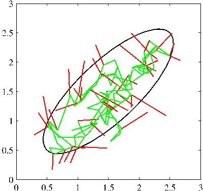

Figure 11.9 A simple illustration using Metropolis algorithm to sample from a Gaussian distribution whose one standard-deviation contour is shown by the ellipse. The proposal distribution is an isotropic Gaussian distribution whose standard deviation is 0.2. Steps that are accepted are shown as green lines, and rejected steps are shown in red. A total of 150 candidate samples are generated, of which 43 are rejected.

walk. Consider a state space $z$ consisting of the integers, with probabilities

$$
p(z^{(\tau+1)} = z^{(\tau)}) = 0.5 \tag{11.34}
$$

$$
p(z^{(\tau+1)} = z^{(\tau)} + 1) = 0.25 \tag{11.35}
$$

$$
p(z^{(\tau+1)} = z^{(\tau)} - 1) = 0.25 \tag{11.36}
$$

where $z^{(\tau)}$ denotes the state at step $\tau$. If the initial state is $z^{(1)} = 0$, then by symmetry the expected state at time $\tau$ will also be zero $\mathbb{E}[z^{(\tau)}] = 0$, and similarly it is easily seen that $\mathbb{E}[(z^{(\tau)})^2] = \tau/2$. Thus after $\tau$ steps, the random walk has only travelled a distance that on average is proportional to the square root of $\tau$. This square root dependence is typical of random walk behaviour and shows that random walks are very inefficient in exploring the state space. As we shall see, a central goal in designing Markov chain Monte Carlo methods is to avoid random walk behaviour.

## 11.2.1 Markov chains

Before discussing Markov chain Monte Carlo methods in more detail, it is useful to study some general properties of Markov chains in more detail. In particular, we ask under what circumstances will a Markov chain converge to the desired distribution. A first-order Markov chain is defined to be a series of random variables $\mathbf{z}^{(1)}, \dots, \mathbf{z}^{(M)}$ such that the following conditional independence property holds for $m \in \{1, \dots, M-1\}$

$$
p(\mathbf{z}^{(m+1)}|\mathbf{z}^{(1)}, \dots, \mathbf{z}^{(m)}) = p(\mathbf{z}^{(m+1)}|\mathbf{z}^{(m)}). \tag{11.37}
$$

This of course can be represented as a directed graph in the form of a chain, an example of which is shown in Figure 8.38. We can then specify the Markov chain by giving the probability distribution for the initial variable $p(\mathbf{z}^{(0)})$ together with the
[Page 560]

conditional probabilities for subsequent variables in the form of transition probabilities $T_m(\mathbf{z}^{(m)}, \mathbf{z}^{(m+1)}) \equiv p(\mathbf{z}^{(m+1)}|\mathbf{z}^{(m)})$. A Markov chain is called homogeneous if the transition probabilities are the same for all $m$.

The marginal probability for a particular variable can be expressed in terms of the marginal probability for the previous variable in the chain in the form

$$
p(\mathbf{z}^{(m+1)}) = \sum_{\mathbf{z}^{(m)}} p(\mathbf{z}^{(m+1)}|\mathbf{z}^{(m)}) p(\mathbf{z}^{(m)}). \tag{11.38}
$$

A distribution is said to be invariant, or stationary, with respect to a Markov chain if each step in the chain leaves that distribution invariant. Thus, for a homogeneous Markov chain with transition probabilities $T(\mathbf{z}', \mathbf{z})$, the distribution $p^\star(\mathbf{z})$ is invariant if

$$
p^\star(\mathbf{z}) = \sum_{\mathbf{z}'} T(\mathbf{z}', \mathbf{z}) p^\star(\mathbf{z}'). \tag{11.39}
$$

Note that a given Markov chain may have more than one invariant distribution. For instance, if the transition probabilities are given by the identity transformation, then any distribution will be invariant.

A sufficient (but not necessary) condition for ensuring that the required distribution $p(\mathbf{z})$ is invariant is to choose the transition probabilities to satisfy the property of detailed balance, defined by

$$
p^\star(\mathbf{z}) T(\mathbf{z}, \mathbf{z}') = p^\star(\mathbf{z}') T(\mathbf{z}', \mathbf{z}) \tag{11.40}
$$

for the particular distribution $p^\star(\mathbf{z})$. It is easily seen that a transition probability that satisfies detailed balance with respect to a particular distribution will leave that distribution invariant, because

$$
\sum_{\mathbf{z}'} p^\star(\mathbf{z}') T(\mathbf{z}', \mathbf{z}) = \sum_{\mathbf{z}'} p^\star(\mathbf{z}) T(\mathbf{z}, \mathbf{z}') = p^\star(\mathbf{z}) \sum_{\mathbf{z}'} p(\mathbf{z}'|\mathbf{z}) = p^\star(\mathbf{z}). \tag{11.41}
$$

A Markov chain that respects detailed balance is said to be reversible.

Our goal is to use Markov chains to sample from a given distribution. We can achieve this if we set up a Markov chain such that the desired distribution is invariant. However, we must also require that for $m \to \infty$, the distribution $p(\mathbf{z}^{(m)})$ converges to the required invariant distribution $p^\star(\mathbf{z})$, irrespective of the choice of initial distribution $p(\mathbf{z}^{(0)})$. This property is called ergodicity, and the invariant distribution is then called the equilibrium distribution. Clearly, an ergodic Markov chain can have only one equilibrium distribution. It can be shown that a homogeneous Markov chain will be ergodic, subject only to weak restrictions on the invariant distribution and the transition probabilities (Neal, 1993).

In practice we often construct the transition probabilities from a set of 'base' transitions $B_1, \dots, B_K$. This can be achieved through a mixture distribution of the form

$$
T(\mathbf{z}', \mathbf{z}) = \sum_{k=1}^K \alpha_k B_k(\mathbf{z}', \mathbf{z}) \tag{11.42}
$$

[Page 561]

for some set of mixing coefficients $\alpha_1, \dots, \alpha_K$ satisfying $\alpha_k \geqslant 0$ and $\sum_k \alpha_k = 1$. Alternatively, the base transitions may be combined through successive application, so that

$$
T(\mathbf{z}', \mathbf{z}) = \sum_{\mathbf{z}_1} \dots \sum_{\mathbf{z}_{n-1}} B_1(\mathbf{z}', \mathbf{z}_1) \dots B_{K-1}(\mathbf{z}_{K-2}, \mathbf{z}_{K-1}) B_K(\mathbf{z}_{K-1}, \mathbf{z}). \tag{11.43}
$$

If a distribution is invariant with respect to each of the base transitions, then obviously it will also be invariant with respect to either of the $T(\mathbf{z}', \mathbf{z})$ given by (11.42) or (11.43). For the case of the mixture (11.42), if each of the base transitions satisfies detailed balance, then the mixture transition $T$ will also satisfy detailed balance. This does not hold for the transition probability constructed using (11.43), although by symmetrizing the order of application of the base transitions, in the form $B_1, B_2, \dots, B_K, B_K, \dots, B_2, B_1$, detailed balance can be restored. A common example of the use of composite transition probabilities is where each base transition changes only a subset of the variables.

## 11.2.2 The Metropolis-Hastings algorithm

Earlier we introduced the basic Metropolis algorithm, without actually demonstrating that it samples from the required distribution. Before giving a proof, we first discuss a generalization, known as the Metropolis-Hastings algorithm (Hastings, 1970), to the case where the proposal distribution is no longer a symmetric function of its arguments. In particular at step $\tau$ of the algorithm, in which the current state is $\mathbf{z}^{(\tau)}$, we draw a sample $\mathbf{z}^\star$ from the distribution $q_k(\mathbf{z}|\mathbf{z}^{(\tau)})$ and then accept it with probability $A_k(\mathbf{z}^\star, \mathbf{z}^{(\tau)})$ where

$$
A_k(\mathbf{z}^\star, \mathbf{z}^{(\tau)}) = \min\left(1, \frac{\widetilde{p}(\mathbf{z}^\star) q_k(\mathbf{z}^{(\tau)}|\mathbf{z}^\star)}{\widetilde{p}(\mathbf{z}^{(\tau)}) q_k(\mathbf{z}^\star|\mathbf{z}^{(\tau)})}\right). \tag{11.44}
$$

Here $k$ labels the members of the set of possible transitions being considered. Again, the evaluation of the acceptance criterion does not require knowledge of the normalizing constant $Z_p$ in the probability distribution $p(\mathbf{z}) = \widetilde{p}(\mathbf{z})/Z_p$. For a symmetric proposal distribution the Metropolis-Hastings criterion (11.44) reduces to the standard Metropolis criterion given by (11.33).

We can show that $p(\mathbf{z})$ is an invariant distribution of the Markov chain defined by the Metropolis-Hastings algorithm by showing that detailed balance, defined by (11.40), is satisfied. Using (11.44) we have

$$
\begin{aligned}
p(\mathbf{z}) q_k(\mathbf{z}|\mathbf{z}') A_k(\mathbf{z}', \mathbf{z}) &= \min(p(\mathbf{z}) q_k(\mathbf{z}|\mathbf{z}'), p(\mathbf{z}') q_k(\mathbf{z}'|\mathbf{z})) \\
&= \min(p(\mathbf{z}') q_k(\mathbf{z}'|\mathbf{z}), p(\mathbf{z}) q_k(\mathbf{z}|\mathbf{z}')) \\
&= p(\mathbf{z}') q_k(\mathbf{z}'|\mathbf{z}) A_k(\mathbf{z}, \mathbf{z}') \tag{11.45}
\end{aligned}
$$

as required.

The specific choice of proposal distribution can have a marked effect on the performance of the algorithm. For continuous state spaces, a common choice is a Gaussian centred on the current state, leading to an important trade-off in determining the variance parameter of this distribution. If the variance is small, then the
[Page 562]

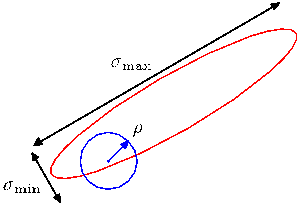

Figure 11.10 Schematic illustration of the use of an isotropic Gaussian proposal distribution (blue circle) to sample from a correlated multivariate Gaussian distribution (red ellipse) having very different standard deviations in different directions, using the Metropolis-Hastings algorithm. In order to keep the rejection rate low, the scale $\rho$ of the proposal distribution should be on the order of the smallest standard deviation $\sigma_{\text{min}}$, which leads to random walk behaviour in which the number of steps separating states that are approximately independent is of order $(\sigma_{\text{max}}/\sigma_{\text{min}})^2$ where $\sigma_{\text{max}}$ is the largest standard deviation.

proportion of accepted transitions will be high, but progress through the state space takes the form of a slow random walk leading to long correlation times. However, if the variance parameter is large, then the rejection rate will be high because, in the kind of complex problems we are considering, many of the proposed steps will be to states for which the probability $p(\mathbf{z})$ is low. Consider a multivariate distribution $p(\mathbf{z})$ having strong correlations between the components of $\mathbf{z}$, as illustrated in Figure 11.10. The scale $\rho$ of the proposal distribution should be as large as possible without incurring high rejection rates. This suggests that $\rho$ should be of the same order as the smallest length scale $\sigma_{\text{min}}$. The system then explores the distribution along the more extended direction by means of a random walk, and so the number of steps to arrive at a state that is more or less independent of the original state is of order $(\sigma_{\text{max}}/\sigma_{\text{min}})^2$. In fact in two dimensions, the increase in rejection rate as $\rho$ increases is offset by the larger steps sizes of those transitions that are accepted, and more generally for a multivariate Gaussian the number of steps required to obtain independent samples scales like $(\sigma_{\text{max}}/\sigma_2)^2$ where $\sigma_2$ is the second-smallest standard deviation (Neal, 1993). These details aside, it remains the case that if the length scales over which the distributions vary are very different in different directions, then the Metropolis Hastings algorithm can have very slow convergence.

## 11.3. Gibbs Sampling

Gibbs sampling (Geman and Geman, 1984) is a simple and widely applicable Markov chain Monte Carlo algorithm and can be seen as a special case of the Metropolis-Hastings algorithm.

Consider the distribution $p(\mathbf{z}) = p(z_1, \dots, z_M)$ from which we wish to sample, and suppose that we have chosen some initial state for the Markov chain. Each step of the Gibbs sampling procedure involves replacing the value of one of the variables by a value drawn from the distribution of that variable conditioned on the values of the remaining variables. Thus we replace $z_i$ by a value drawn from the distribution $p(z_i|\mathbf{z}_{\backslash i})$, where $z_i$ denotes the $i^{\text{th}}$ component of $\mathbf{z}$, and $\mathbf{z}_{\backslash i}$ denotes $z_1, \dots, z_M$ but with $z_i$ omitted. This procedure is repeated either by cycling through the variables
[Page 563]

in some particular order or by choosing the variable to be updated at each step at random from some distribution.

For example, suppose we have a distribution $p(z_1, z_2, z_3)$ over three variables, and at step $\tau$ of the algorithm we have selected values $z_1^{(\tau)}, z_2^{(\tau)}$ and $z_3^{(\tau)}$. We first replace $z_1^{(\tau)}$ by a new value $z_1^{(\tau+1)}$ obtained by sampling from the conditional distribution

$$
p(z_1|z_2^{(\tau)}, z_3^{(\tau)}). \tag{11.46}
$$

Next we replace $z_2^{(\tau)}$ by a value $z_2^{(\tau+1)}$ obtained by sampling from the conditional distribution

$$
p(z_2|z_1^{(\tau+1)}, z_3^{(\tau)}) \tag{11.47}
$$

so that the new value for $z_1$ is used straight away in subsequent sampling steps. Then we update $z_3$ with a sample $z_3^{(\tau+1)}$ drawn from

$$
p(z_3|z_1^{(\tau+1)}, z_2^{(\tau+1)}) \tag{11.48}
$$

and so on, cycling through the three variables in turn.

**Gibbs Sampling**

1. Initialize $\{z_i : i = 1, \dots, M\}$
2. For $\tau = 1, \dots, T$:
   - Sample $z_1^{(\tau+1)} \sim p(z_1|z_2^{(\tau)}, z_3^{(\tau)}, \dots, z_M^{(\tau)})$.
   - Sample $z_2^{(\tau+1)} \sim p(z_2|z_1^{(\tau+1)}, z_3^{(\tau)}, \dots, z_M^{(\tau)})$.
     $\quad \vdots$
   - Sample $z_j^{(\tau+1)} \sim p(z_j|z_1^{(\tau+1)}, \dots, z_{j-1}^{(\tau+1)}, z_{j+1}^{(\tau)}, \dots, z_M^{(\tau)})$.
     $\quad \vdots$
   - Sample $z_M^{(\tau+1)} \sim p(z_M|z_1^{(\tau+1)}, z_2^{(\tau+1)}, \dots, z_{M-1}^{(\tau+1)})$.

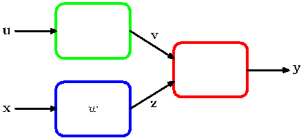

**Josiah Willard Gibbs**
1839–1903
Gibbs spent almost his entire life living in a house built by his father in New Haven, Connecticut. In 1863, Gibbs was granted the first PhD in engineering in the United States, and in 1871 he was appointed to the first chair of mathematical physics in the United States at Yale, a post for which he received no salary because at the time he had no publications. He developed the field of vector analysis and made contributions to crystallography and planetary orbits. His most famous work, entitled _On the Equilibrium of Heterogeneous Substances_, laid the foundations for the science of physical chemistry.
[Page 564]

To show that this procedure samples from the required distribution, we first of all note that the distribution $p(\mathbf{z})$ is an invariant of each of the Gibbs sampling steps individually and hence of the whole Markov chain. This follows from the fact that when we sample from $p(z_i|\mathbf{z}_{\backslash i})$, the marginal distribution $p(\mathbf{z}_{\backslash i})$ is clearly invariant because the value of $\mathbf{z}_{\backslash i}$ is unchanged. Also, each step by definition samples from the correct conditional distribution $p(z_i|\mathbf{z}_{\backslash i})$. Because these conditional and marginal distributions together specify the joint distribution, we see that the joint distribution is itself invariant.

The second requirement to be satisfied in order that the Gibbs sampling procedure samples from the correct distribution is that it be ergodic. A sufficient condition for ergodicity is that none of the conditional distributions be anywhere zero. If this is the case, then any point in $\mathbf{z}$ space can be reached from any other point in a finite number of steps involving one update of each of the component variables. If this requirement is not satisfied, so that some of the conditional distributions have zeros, then ergodicity, if it applies, must be proven explicitly.

The distribution of initial states must also be specified in order to complete the algorithm, although samples drawn after many iterations will effectively become independent of this distribution. Of course, successive samples from the Markov chain will be highly correlated, and so to obtain samples that are nearly independent it will be necessary to subsample the sequence.

We can obtain the Gibbs sampling procedure as a particular instance of the Metropolis-Hastings algorithm as follows. Consider a Metropolis-Hastings sampling step involving the variable $z_k$ in which the remaining variables $\mathbf{z}_{\backslash k}$ remain fixed, and for which the transition probability from $\mathbf{z}$ to $\mathbf{z}^\star$ is given by $q_k(\mathbf{z}^\star|\mathbf{z}) = p(z_k^\star|\mathbf{z}_{\backslash k})$. We note that $\mathbf{z}_{\backslash k}^\star = \mathbf{z}_{\backslash k}$ because these components are unchanged by the sampling step. Also, $p(\mathbf{z}) = p(z_k|\mathbf{z}_{\backslash k})p(\mathbf{z}_{\backslash k})$. Thus the factor that determines the acceptance probability in the Metropolis-Hastings (11.44) is given by

$$
A(\mathbf{z}^\star, \mathbf{z}) = \frac{p(\mathbf{z}^\star)q_k(\mathbf{z}|\mathbf{z}^\star)}{p(\mathbf{z})q_k(\mathbf{z}^\star|\mathbf{z})} = \frac{p(z_k^\star|\mathbf{z}_{\backslash k}^\star)p(\mathbf{z}_{\backslash k}^\star)p(z_k|\mathbf{z}_{\backslash k}^\star)}{p(z_k|\mathbf{z}_{\backslash k})p(\mathbf{z}_{\backslash k})p(z_k^\star|\mathbf{z}_{\backslash k})} = 1 \tag{11.49}
$$

where we have used $\mathbf{z}_{\backslash k}^\star = \mathbf{z}_{\backslash k}$. Thus the Metropolis-Hastings steps are always accepted.

As with the Metropolis algorithm, we can gain some insight into the behaviour of Gibbs sampling by investigating its application to a Gaussian distribution. Consider a correlated Gaussian in two variables, as illustrated in Figure 11.11, having conditional distributions of width $l$ and marginal distributions of width $L$. The typical step size is governed by the conditional distributions and will be of order $l$. Because the state evolves according to a random walk, the number of steps needed to obtain independent samples from the distribution will be of order $(L/l)^2$. Of course if the Gaussian distribution were uncorrelated, then the Gibbs sampling procedure would be optimally efficient. For this simple problem, we could rotate the coordinate system in order to decorrelate the variables. However, in practical applications it will generally be infeasible to find such transformations.

One approach to reducing random walk behaviour in Gibbs sampling is called over-relaxation (Adler, 1981). In its original form, this applies to problems for which
[Page 565]

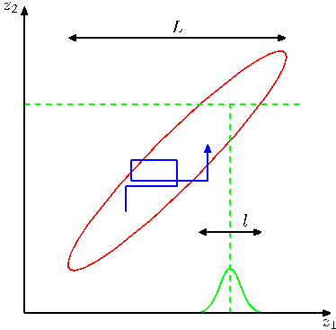

Figure 11.11 Illustration of Gibbs sampling by alternate updates of two variables whose distribution is a correlated Gaussian. The step size is governed by the standard deviation of the conditional distribution (green curve), and is $\mathcal{O}(l)$, leading to slow progress in the direction of elongation of the joint distribution (red ellipse). The number of steps needed to obtain an independent sample from the distribution is $\mathcal{O}((L/l)^2)$.

the conditional distributions are Gaussian, which represents a more general class of distributions than the multivariate Gaussian because, for example, the non-Gaussian distribution $p(z,y) \propto \exp(-z^2y^2)$ has Gaussian conditional distributions. At each step of the Gibbs sampling algorithm, the conditional distribution for a particular component $z_i$ has some mean $\mu_i$ and some variance $\sigma_i^2$. In the over-relaxation framework, the value of $z_i$ is replaced with

$$
z_i' = \mu_i + \alpha(z_i - \mu_i) + \sigma_i(1 - \alpha^2)^{1/2}\nu \tag{11.50}
$$

where $\nu$ is a Gaussian random variable with zero mean and unit variance, and $\alpha$ is a parameter such that $-1 < \alpha < 1$. For $\alpha = 0$, the method is equivalent to standard Gibbs sampling, and for $\alpha < 0$ the step is biased to the opposite side of the mean. This step leaves the desired distribution invariant because if $z_i$ has mean $\mu_i$ and variance $\sigma_i^2$, then so too does $z_i'$. The effect of over-relaxation is to encourage directed motion through state space when the variables are highly correlated. The framework of ordered over-relaxation (Neal, 1999) generalizes this approach to non-Gaussian distributions.

The practical applicability of Gibbs sampling depends on the ease with which samples can be drawn from the conditional distributions $p(z_k|\mathbf{z}_{\backslash k})$. In the case of probability distributions specified using graphical models, the conditional distributions for individual nodes depend only on the variables in the corresponding Markov blankets, as illustrated in Figure 11.12. For directed graphs, a wide choice of conditional distributions for the individual nodes conditioned on their parents will lead to conditional distributions for Gibbs sampling that are log concave. The adaptive rejection sampling methods discussed in Section 11.1.3 therefore provide a framework for Monte Carlo sampling from directed graphs with broad applicability.

If the graph is constructed using distributions from the exponential family, and if the parent-child relationships preserve conjugacy, then the full conditional distributions arising in Gibbs sampling will have the same functional form as the orig-
[Page 566]

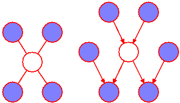

Figure 11.12 The Gibbs sampling method requires samples to be drawn from the conditional distribution of a variable conditioned on the remaining variables. For graphical models, this conditional distribution is a function only of the states of the nodes in the Markov blanket. For an undirected graph this comprises the set of neighbours, as shown on the left, while for a directed graph the Markov blanket comprises the parents, the children, and the co-parents, as shown on the right.

inal conditional distributions (conditioned on the parents) defining each node, and so standard sampling techniques can be employed. In general, the full conditional distributions will be of a complex form that does not permit the use of standard sampling algorithms. However, if these conditionals are log concave, then sampling can be done efficiently using adaptive rejection sampling (assuming the corresponding variable is a scalar).

If, at each stage of the Gibbs sampling algorithm, instead of drawing a sample from the corresponding conditional distribution, we make a point estimate of the variable given by the maximum of the conditional distribution, then we obtain the iterated conditional modes (ICM) algorithm discussed in Section 8.3.3. Thus ICM can be seen as a greedy approximation to Gibbs sampling.

Because the basic Gibbs sampling technique considers one variable at a time, there are strong dependencies between successive samples. At the opposite extreme, if we could draw samples directly from the joint distribution (an operation that we are supposing is intractable), then successive samples would be independent. We can hope to improve on the simple Gibbs sampler by adopting an intermediate strategy in which we sample successively from groups of variables rather than individual variables. This is achieved in the blocking Gibbs sampling algorithm by choosing blocks of variables, not necessarily disjoint, and then sampling jointly from the variables in each block in turn, conditioned on the remaining variables (Jensen et al., 1995).

## 11.4. Slice Sampling

We have seen that one of the difficulties with the Metropolis algorithm is the sensitivity to step size. If this is too small, the result is slow decorrelation due to random walk behaviour, whereas if it is too large the result is inefficiency due to a high rejection rate. The technique of slice sampling (Neal, 2003) provides an adaptive step size that is automatically adjusted to match the characteristics of the distribution. Again it requires that we are able to evaluate the unnormalized distribution $\widetilde{p}(z)$.

Consider first the univariate case. Slice sampling involves augmenting $z$ with an additional variable $u$ and then drawing samples from the joint $(z, u)$ space. We shall see another example of this approach when we discuss hybrid Monte Carlo in Section 11.5. The goal is to sample uniformly from the area under the distribution
[Page 567]

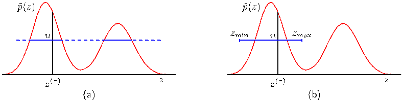

Figure 11.13 Illustration of slice sampling. (a) For a given value $z^{(\tau)}$, a value of $u$ is chosen uniformly in the region $0 \leqslant u \leqslant \widetilde{p}(z^{(\tau)})$, which then defines a ‘slice’ through the distribution, shown by the solid horizontal lines. (b) Because it is infeasible to sample directly from a slice, a new sample of $z$ is drawn from a region $z_{\text{min}} \leqslant z \leqslant z_{\text{max}}$, which contains the previous value $z^{(\tau)}$.

given by

$$
\widehat{p}(z, u) = \begin{cases} 1/Z_p & \text{if } 0 \leqslant u \leqslant \widetilde{p}(z) \\ 0 & \text{otherwise} \end{cases} \tag{11.51}
$$

where $Z_p = \int \widetilde{p}(z) dz$. The marginal distribution over $z$ is given by

$$
\int \widehat{p}(z, u) du = \int_0^{\widetilde{p}(z)} \frac{1}{Z_p} du = \frac{\widetilde{p}(z)}{Z_p} = p(z) \tag{11.52}
$$

and so we can sample from $p(z)$ by sampling from $\widehat{p}(z, u)$ and then ignoring the $u$ values. This can be achieved by alternately sampling $z$ and $u$. Given the value of $z$ we evaluate $\widetilde{p}(z)$ and then sample $u$ uniformly in the range $0 \leqslant u \leqslant \widetilde{p}(z)$, which is straightforward. Then we fix $u$ and sample $z$ uniformly from the ‘slice’ through the distribution defined by $\{z : \widetilde{p}(z) > u\}$. This is illustrated in Figure 11.13(a).

In practice, it can be difficult to sample directly from a slice through the distribution and so instead we define a sampling scheme that leaves the uniform distribution under $\widehat{p}(z, u)$ invariant, which can be achieved by ensuring that detailed balance is satisfied. Suppose the current value of $z$ is denoted $z^{(\tau)}$ and that we have obtained a corresponding sample $u$. The next value of $z$ is obtained by considering a region $z_{\text{min}} \leqslant z \leqslant z_{\text{max}}$ that contains $z^{(\tau)}$. It is in the choice of this region that the adaptation to the characteristic length scales of the distribution takes place. We want the region to encompass as much of the slice as possible so as to allow large moves in $z$ space while having as little as possible of this region lying outside the slice, because this makes the sampling less efficient.

One approach to the choice of region involves starting with a region containing $z^{(\tau)}$ having some width $w$ and then testing each of the end points to see if they lie within the slice. If either end point does not, then the region is extended in that direction by increments of value $w$ until the end point lies outside the region. A candidate value $z'$ is then chosen uniformly from this region, and if it lies within the slice, then it forms $z^{(\tau+1)}$. If it lies outside the slice, then the region is shrunk such that $z'$ forms an end point and such that the region still contains $z^{(\tau)}$. Then another
[Page 568]

candidate point is drawn uniformly from this reduced region and so on, until a value of $z$ is found that lies within the slice.

Slice sampling can be applied to multivariate distributions by repeatedly sampling each variable in turn, in the manner of Gibbs sampling. This requires that we are able to compute, for each component $z_i$, a function that is proportional to $p(z_i|\mathbf{z}_{\backslash i})$.

## 11.5. The Hybrid Monte Carlo Algorithm

As we have already noted, one of the major limitations of the Metropolis algorithm is that it can exhibit random walk behaviour whereby the distance traversed through the state space grows only as the square root of the number of steps. The problem cannot be resolved simply by taking bigger steps as this leads to a high rejection rate.

In this section, we introduce a more sophisticated class of transitions based on an analogy with physical systems and that has the property of being able to make large changes to the system state while keeping the rejection probability small. It is applicable to distributions over continuous variables for which we can readily evaluate the gradient of the log probability with respect to the state variables. We will discuss the dynamical systems framework in Section 11.5.1, and then in Section 11.5.2 we explain how this may be combined with the Metropolis algorithm to yield the powerful hybrid Monte Carlo algorithm. A background in physics is not required as this section is self-contained and the key results are all derived from first principles.

### 11.5.1 Dynamical systems

The dynamical approach to stochastic sampling has its origins in algorithms for simulating the behaviour of physical systems evolving under Hamiltonian dynamics. In a Markov chain Monte Carlo simulation, the goal is to sample from a given probability distribution $p(\mathbf{z})$. The framework of Hamiltonian dynamics is exploited by casting the probabilistic simulation in the form of a Hamiltonian system. In order to remain in keeping with the literature in this area, we make use of the relevant dynamical systems terminology where appropriate, which will be defined as we go along.

The dynamics that we consider corresponds to the evolution of the state variable $\mathbf{z} = \{z_i\}$ under continuous time, which we denote by $\tau$. Classical dynamics is described by Newton’s second law of motion in which the acceleration of an object is proportional to the applied force, corresponding to a second-order differential equation over time. We can decompose a second-order equation into two coupled first-order equations by introducing intermediate momentum variables $\mathbf{r}$, corresponding to the rate of change of the state variables $\mathbf{z}$, having components

$$
r_i = \frac{dz_i}{d\tau} \tag{11.53}
$$

where the $z_i$ can be regarded as position variables in this dynamics perspective. Thus
[Page 569]

for each position variable there is a corresponding momentum variable, and the joint space of position and momentum variables is called phase space.

Without loss of generality, we can write the probability distribution $p(\mathbf{z})$ in the form

$$
p(\mathbf{z}) = \frac{1}{Z_p} \exp(-E(\mathbf{z})) \tag{11.54}
$$

where $E(\mathbf{z})$ is interpreted as the potential energy of the system when in state $\mathbf{z}$. The system acceleration is the rate of change of momentum and is given by the applied force, which itself is the negative gradient of the potential energy

$$
\frac{dr_i}{d\tau} = -\frac{\partial E(\mathbf{z})}{\partial z_i}. \tag{11.55}
$$

It is convenient to reformulate this dynamical system using the Hamiltonian framework. To do this, we first define the kinetic energy by

$$
K(\mathbf{r}) = \frac{1}{2}\|\mathbf{r}\|^2 = \frac{1}{2} \sum_i r_i^2. \tag{11.56}
$$

The total energy of the system is then the sum of its potential and kinetic energies

$$
H(\mathbf{z}, \mathbf{r}) = E(\mathbf{z}) + K(\mathbf{r}) \tag{11.57}
$$

where $H$ is the Hamiltonian function. Using (11.53), (11.55), (11.56), and (11.57), we can now express the dynamics of the system in terms of the Hamiltonian equations given by

$$
\frac{dz_i}{d\tau} = \frac{\partial H}{\partial r_i} \tag{11.58}
$$

$$
\frac{dr_i}{d\tau} = -\frac{\partial H}{\partial z_i}. \tag{11.59}
$$

**William Hamilton**
1805–1865
William Rowan Hamilton was an Irish mathematician and physicist, and child prodigy, who was appointed Professor of Astronomy at Trinity College, Dublin, in 1827, before he had even graduated. One of Hamilton’s most important contributions was a new formulation of dynamics, which played a significant role in the later development of quantum mechanics. His other great achievement was the development of quaternions, which generalize the concept of complex numbers by introducing three distinct square roots of minus one, which satisfy $i^2 = j^2 = k^2 = ijk = -1$. It is said that these equations occurred to him while walking along the Royal Canal in Dublin with his wife, on 16 October 1843, and he promptly carved the equations into the side of Broome bridge. Although there is no longer any evidence of the carving, there is now a stone plaque on the bridge commemorating the discovery and displaying the quaternion equations.
[Page 570]

During the evolution of this dynamical system, the value of the Hamiltonian $H$ is constant, as is easily seen by differentiation

$$
\frac{dH}{d\tau} = \sum_i \left\{ \frac{\partial H}{\partial z_i} \frac{dz_i}{d\tau} + \frac{\partial H}{\partial r_i} \frac{dr_i}{d\tau} \right\} = \sum_i \left\{ \frac{\partial H}{\partial z_i} \frac{\partial H}{\partial r_i} - \frac{\partial H}{\partial r_i} \frac{\partial H}{\partial z_i} \right\} = 0. \tag{11.60}
$$

A second important property of Hamiltonian dynamical systems, known as Liouville’s Theorem, is that they preserve volume in phase space. In other words, if we consider a region within the space of variables $(\mathbf{z}, \mathbf{r})$, then as this region evolves under the equations of Hamiltonian dynamics, its shape may change but its volume will not. This can be seen by noting that the flow field (rate of change of location in phase space) is given by

$$
\mathbf{V} = \left(\frac{d\mathbf{z}}{d\tau}, \frac{d\mathbf{r}}{d\tau}\right) \tag{11.61}
$$

and that the divergence of this field vanishes

$$
\text{div } \mathbf{V} = \sum_i \left\{ \frac{\partial}{\partial z_i} \frac{dz_i}{d\tau} + \frac{\partial}{\partial r_i} \frac{dr_i}{d\tau} \right\} = \sum_i \left\{ \frac{\partial}{\partial z_i} \frac{\partial H}{\partial r_i} - \frac{\partial}{\partial r_i} \frac{\partial H}{\partial z_i} \right\} = 0. \tag{11.62}
$$

Now consider the joint distribution over phase space whose total energy is the Hamiltonian, i.e., the distribution given by

$$
p(\mathbf{z}, \mathbf{r}) = \frac{1}{Z_H} \exp(-H(\mathbf{z}, \mathbf{r})). \tag{11.63}
$$

Using the two results of conservation of volume and conservation of $H$, it follows that the Hamiltonian dynamics will leave $p(\mathbf{z}, \mathbf{r})$ invariant. This can be seen by considering a small region of phase space over which $H$ is approximately constant. If we follow the evolution of the Hamiltonian equations for a finite time, then the volume of this region will remain unchanged as will the value of $H$ in this region, and hence the probability density, which is a function only of $H$, will also be unchanged.

Although $H$ is invariant, the values of $\mathbf{z}$ and $\mathbf{r}$ will vary, and so by integrating the Hamiltonian dynamics over a finite time duration it becomes possible to make large changes to $\mathbf{z}$ in a systematic way that avoids random walk behaviour.

Evolution under the Hamiltonian dynamics will not, however, sample ergodically from $p(\mathbf{z}, \mathbf{r})$ because the value of $H$ is constant. In order to arrive at an ergodic sampling scheme, we can introduce additional moves in phase space that change the value of $H$ while also leaving the distribution $p(\mathbf{z}, \mathbf{r})$ invariant. The simplest way to achieve this is to replace the value of $\mathbf{r}$ with one drawn from its distribution conditioned on $\mathbf{z}$. This can be regarded as a Gibbs sampling step, and hence from
[Page 571]

Section 11.3 we see that this also leaves the desired distribution invariant. Noting that $\mathbf{z}$ and $\mathbf{r}$ are independent in the distribution $p(\mathbf{z}, \mathbf{r})$, we see that the conditional distribution $p(\mathbf{r}|\mathbf{z})$ is a Gaussian from which it is straightforward to sample. In a practical application of this approach, we have to address the problem of

performing a numerical integration of the Hamiltonian equations. This will necessarily introduce numerical errors and so we should devise a scheme that minimizes the impact of such errors. In fact, it turns out that integration schemes can be devised for which Liouville’s theorem still holds exactly. This property will be important in the hybrid Monte Carlo algorithm, which is discussed in Section 11.5.2. One scheme for achieving this is called the leapfrog discretization and involves alternately updating discrete-time approximations $\widehat{\mathbf{z}}$ and $\widehat{\mathbf{r}}$ to the position and momentum variables using

$$
\begin{aligned}
\widehat{r}_i(\tau + \epsilon/2) &= \widehat{r}_i(\tau) - \frac{\epsilon}{2} \frac{\partial E}{\partial z_i}(\widehat{\mathbf{z}}(\tau)) \tag{11.64} \\
\widehat{z}_i(\tau + \epsilon) &= \widehat{z}_i(\tau) + \epsilon \widehat{r}_i(\tau + \epsilon/2) \tag{11.65} \\
\widehat{r}_i(\tau + \epsilon) &= \widehat{r}_i(\tau + \epsilon/2) - \frac{\epsilon}{2} \frac{\partial E}{\partial z_i}(\widehat{\mathbf{z}}(\tau + \epsilon)). \tag{11.66}
\end{aligned}
$$

We see that this takes the form of a half-step update of the momentum variables with step size $\epsilon/2$, followed by a full-step update of the position variables with step size $\epsilon$, followed by a second half-step update of the momentum variables. If several leapfrog steps are applied in succession, it can be seen that half-step updates to the momentum variables can be combined into full-step updates with step size $\epsilon$. The successive updates to position and momentum variables then leapfrog over each other. In order to advance the dynamics by a time interval $\tau$, we need to take $\tau/\epsilon$ steps. The error involved in the discretized approximation to the continuous time dynamics will go to zero, assuming a smooth function $E(\mathbf{z})$, in the limit $\epsilon \to 0$. However, for a nonzero $\epsilon$ as used in practice, some residual error will remain. We shall see in Section 11.5.2 how the effects of such errors can be eliminated in the hybrid Monte Carlo algorithm.

In summary then, the Hamiltonian dynamical approach involves alternating between a series of leapfrog updates and a resampling of the momentum variables from their marginal distribution.

Note that the Hamiltonian dynamics method, unlike the basic Metropolis algorithm, is able to make use of information about the gradient of the log probability distribution as well as about the distribution itself. An analogous situation is familiar from the domain of function optimization. In most cases where gradient information is available, it is highly advantageous to make use of it. Informally, this follows from the fact that in a space of dimension $D$, the additional computational cost of evaluating a gradient compared with evaluating the function itself will typically be a fixed factor independent of $D$, whereas the $D$-dimensional gradient vector conveys $D$ pieces of information compared with the one piece of information given by the function itself.
[Page 572]

### 11.5.2 Hybrid Monte Carlo

As we discussed in the previous section, for a nonzero step size $\epsilon$, the discretization of the leapfrog algorithm will introduce errors into the integration of the Hamiltonian dynamical equations. Hybrid Monte Carlo (Duane et al., 1987; Neal, 1996) combines Hamiltonian dynamics with the Metropolis algorithm and thereby removes any bias associated with the discretization.

Specifically, the algorithm uses a Markov chain consisting of alternate stochastic updates of the momentum variable $\mathbf{r}$ and Hamiltonian dynamical updates using the leapfrog algorithm. After each application of the leapfrog algorithm, the resulting candidate state is accepted or rejected according to the Metropolis criterion based on the value of the Hamiltonian $H$. Thus if $(\mathbf{z}, \mathbf{r})$ is the initial state and $(\mathbf{z}^\star, \mathbf{r}^\star)$ is the state after the leapfrog integration, then this candidate state is accepted with probability

$$
\min(1, \exp\{H(\mathbf{z}, \mathbf{r}) - H(\mathbf{z}^\star, \mathbf{r}^\star)\}). \tag{11.67}
$$

If the leapfrog integration were to simulate the Hamiltonian dynamics perfectly, then every such candidate step would automatically be accepted because the value of $H$ would be unchanged. Due to numerical errors, the value of $H$ may sometimes decrease, and we would like the Metropolis criterion to remove any bias due to this effect and ensure that the resulting samples are indeed drawn from the required distribution. In order for this to be the case, we need to ensure that the update equations corresponding to the leapfrog integration satisfy detailed balance (11.40). This is easily achieved by modifying the leapfrog scheme as follows.

Before the start of each leapfrog integration sequence, we choose at random, with equal probability, whether to integrate forwards in time (using step size $\epsilon$) or backwards in time (using step size $-\epsilon$). We first note that the leapfrog integration scheme (11.64), (11.65), and (11.66) is time-reversible, so that integration for $L$ steps using step size $-\epsilon$ will exactly undo the effect of integration for $L$ steps using step size $\epsilon$. Next we show that the leapfrog integration preserves phase-space volume exactly. This follows from the fact that each step in the leapfrog scheme updates either a $z_i$ variable or an $r_i$ variable by an amount that is a function only of the other variable. As shown in Figure 11.14, this has the effect of shearing a region of phase space while not altering its volume.

Finally, we use these results to show that detailed balance holds. Consider a small region $\mathcal{R}$ of phase space that, under a sequence of $L$ leapfrog iterations of step size $\epsilon$, maps to a region $\mathcal{R}'$. Using conservation of volume under the leapfrog iteration, we see that if $\mathcal{R}$ has volume $\delta V$ then so too will $\mathcal{R}'$. If we choose an initial point from the distribution (11.63) and then update it using $L$ leapfrog interactions, the probability of the transition going from $\mathcal{R}$ to $\mathcal{R}'$ is given by

$$
\frac{1}{Z_H} \exp(-H(\mathcal{R})) \delta V \frac{1}{2} \min\left(1, \exp\{-H(\mathcal{R}) + H(\mathcal{R}')\}\right) \tag{11.68}
$$

where the factor of $1/2$ arises from the probability of choosing to integrate with a positive step size rather than a negative one. Similarly, the probability of starting in
[Page 573]

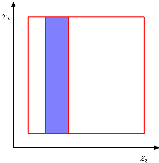

Figure 11.14 Each step of the leapfrog algorithm (11.64)–(11.66) modifies either a position variable $z_i$ or a momentum variable $r_i$. Because the change to one variable is a function only of the other, any region in phase space will be sheared without change of volume.

region $\mathcal{R}'$ and integrating backwards in time to end up in region $\mathcal{R}$ is given by

$$
\frac{1}{Z_H} \exp(-H(\mathcal{R}')) \delta V \frac{1}{2} \min\left(1, \exp\{-H(\mathcal{R}') + H(\mathcal{R})\}\right). \tag{11.69}
$$

It is easily seen that the two probabilities (11.68) and (11.69) are equal, and hence detailed balance holds. Note that this proof ignores any overlap between the regions $\mathcal{R}$ and $\mathcal{R}'$ but is easily generalized to allow for such overlap.

It is not difficult to construct examples for which the leapfrog algorithm returns to its starting position after a finite number of iterations. In such cases, the random replacement of the momentum values before each leapfrog integration will not be sufficient to ensure ergodicity because the position variables will never be updated. Such phenomena are easily avoided by choosing the magnitude of the step size $\epsilon$ at random from some small interval, before each leapfrog integration.

We can gain some insight into the behaviour of the hybrid Monte Carlo algorithm by considering its application to a multivariate Gaussian. For convenience, consider a Gaussian distribution $p(\mathbf{z})$ with independent components, for which the Hamiltonian is given by

$$
H(\mathbf{z}, \mathbf{r}) = \frac{1}{2} \sum_i \frac{1}{\sigma_i^2} z_i^2 + \frac{1}{2} \sum_i r_i^2. \tag{11.70}
$$

Our conclusions will be equally valid for a Gaussian distribution having correlated components because the hybrid Monte Carlo algorithm exhibits rotational isotropy. During the leapfrog integration, each pair of phase-space variables $z_i, r_i$ evolves independently. However, the acceptance or rejection of the candidate point is based on the value of $H$, which depends on the values of all of the variables. Thus, a significant integration error in any one of the variables could lead to a high probability of rejection. In order that the discrete leapfrog integration be a reasonably
[Page 574]

good approximation to the true continuous-time dynamics, it is necessary for the leapfrog integration scale to be smaller than the shortest length-scale over which the potential is varying significantly. This is governed by the smallest value of $\sigma_i$, which we denote by $\sigma_{\text{min}}$. Recall that the goal of the leapfrog integration in hybrid Monte Carlo is to move a substantial distance through phase space to a new state that is relatively independent of the initial state and still achieve a high probability of acceptance. In order to achieve this, the leapfrog integration must be continued for a number of iterations of order $\sigma_{\text{max}}/\sigma_{\text{min}}$.

By contrast, consider the behaviour of a simple Metropolis algorithm with an isotropic Gaussian proposal distribution of variance $s^2$, considered earlier. In order to avoid high rejection rates, the value of $s$ must be of order $\sigma_{\text{min}}$. The exploration of state space then proceeds by a random walk and takes of order $(\sigma_{\text{max}}/\sigma_{\text{min}})^2$ steps to arrive at a roughly independent state.

## 11.6. Estimating the Partition Function

As we have seen, most of the sampling algorithms considered in this chapter require only the functional form of the probability distribution up to a multiplicative constant. Thus if we write

$$
p_E(\mathbf{z}) = \frac{1}{Z_E} \exp(-E(\mathbf{z})) \tag{11.71}
$$

then the value of the normalization constant $Z_E$, also known as the partition function, is not needed in order to draw samples from $p(\mathbf{z})$. However, knowledge of the value of $Z_E$ can be useful for Bayesian model comparison since it represents the model evidence (i.e., the probability of the observed data given the model), and so it is of interest to consider how its value might be obtained. We assume that direct evaluation by summing, or integrating, the function $\exp(-E(\mathbf{z}))$ over the state space of $\mathbf{z}$ is intractable.

For model comparison, it is actually the ratio of the partition functions for two models that is required. Multiplication of this ratio by the ratio of prior probabilities gives the ratio of posterior probabilities, which can then be used for model selection or model averaging.

One way to estimate a ratio of partition functions is to use importance sampling from a distribution with energy function $G(\mathbf{z})$

$$
\begin{aligned}
\frac{Z_E}{Z_G} &= \frac{\sum_{\mathbf{z}} \exp(-E(\mathbf{z}))}{\sum_{\mathbf{z}} \exp(-G(\mathbf{z}))} \\
&= \frac{\sum_{\mathbf{z}} \exp(-E(\mathbf{z}) + G(\mathbf{z}))\exp(-G(\mathbf{z}))}{\sum_{\mathbf{z}} \exp(-G(\mathbf{z}))} \\
&= \mathbb{E}_{G(\mathbf{z})}[\exp(-E + G)] \\
&\simeq \frac{1}{L} \sum_{l=1}^L \exp(-E(\mathbf{z}^{(l)}) + G(\mathbf{z}^{(l)})) \tag{11.72}
\end{aligned}
$$

[Page 575]

where $\{\mathbf{z}^{(l)}\}$ are samples drawn from the distribution defined by $p_G(\mathbf{z})$. If the distribution $p_G$ is one for which the partition function can be evaluated analytically, for example a Gaussian, then the absolute value of $Z_E$ can be obtained.

This approach will only yield accurate results if the importance sampling distribution $p_G$ is closely matched to the distribution $p_E$, so that the ratio $p_E/p_G$ does not have wide variations. In practice, suitable analytically specified importance sampling distributions cannot readily be found for the kinds of complex models considered in this book.

An alternative approach is therefore to use the samples obtained from a Markov chain to define the importance-sampling distribution. If the transition probability for the Markov chain is given by $T(\mathbf{z}, \mathbf{z}')$, and the sample set is given by $\mathbf{z}^{(1)}, \dots, \mathbf{z}^{(L)}$, then the sampling distribution can be written as

$$
\frac{1}{Z_G} \exp(-G(\mathbf{z})) = \frac{1}{L} \sum_{l=1}^L T(\mathbf{z}^{(l)}, \mathbf{z}) \tag{11.73}
$$

which can be used directly in (11.72).

Methods for estimating the ratio of two partition functions require for their success that the two corresponding distributions be reasonably closely matched. This is especially problematic if we wish to find the absolute value of the partition function for a complex distribution because it is only for relatively simple distributions that the partition function can be evaluated directly, and so attempting to estimate the ratio of partition functions directly is unlikely to be successful. This problem can be tackled using a technique known as chaining (Neal, 1993; Barber and Bishop, 1997), which involves introducing a succession of intermediate distributions $p_2, \dots, p_{M-1}$ that interpolate between a simple distribution $p_1(\mathbf{z})$ for which we can evaluate the normalization coefficient $Z_1$ and the desired complex distribution $p_M(\mathbf{z})$. We then have

$$
\frac{Z_M}{Z_1} = \frac{Z_2}{Z_1} \frac{Z_3}{Z_2} \cdots \frac{Z_M}{Z_{M-1}} \tag{11.74}
$$

in which the intermediate ratios can be determined using Monte Carlo methods as discussed above. One way to construct such a sequence of intermediate systems is to use an energy function containing a continuous parameter $0 \leqslant \alpha \leqslant 1$ that interpolates between the two distributions

$$
E_\alpha(\mathbf{z}) = (1 - \alpha)E_1(\mathbf{z}) + \alpha E_M(\mathbf{z}). \tag{11.75}
$$

If the intermediate ratios in (11.74) are to be found using Monte Carlo, it may be more efficient to use a single Markov chain run than to restart the Markov chain for each ratio. In this case, the Markov chain is run initially for the system $p_1$ and then after some suitable number of steps moves on to the next distribution in the sequence. Note, however, that the system must remain close to the equilibrium distribution at each stage.
[Page 576]
