[Page 579]

# 12. Continuous Latent Variables

In Chapter 9, we discussed probabilistic models having discrete latent variables, such as the mixture of Gaussians. We now explore models in which some, or all, of the latent variables are continuous. An important motivation for such models is that many data sets have the property that the data points all lie close to a manifold of much lower dimensionality than that of the original data space. To see why this might arise, consider an artificial data set constructed by taking one of the off-line digits, represented by a $64 \times 64$ pixel grey-level image, and embedding it in a larger image of size $100 \times 100$ by padding with pixels having the value zero (corresponding to white pixels) in which the location and orientation of the digit is varied at random, as illustrated in Figure 12.1. Each of the resulting images is represented by a point in the $100 \times 100 = 10,000$-dimensional data space. However, across a data set of such images, there are only three degrees of freedom of variability, corresponding to the vertical and horizontal translations and the rotations. The data points will therefore live on a subspace of the data space whose intrinsic dimensionality is three. Note
[Page 580]

Figure 12.1 A synthetic data set obtained by taking one of the off-line digit images and creating multiple copies in each of which the digit has undergone a random displacement and rotation within some larger image field. The resulting images each have $100 \times 100 = 10,000$ pixels.

that the manifold will be nonlinear because, for instance, if we translate the digit past a particular pixel, that pixel value will go from zero (white) to one (black) and back to zero again, which is clearly a nonlinear function of the digit position. In this example, the translation and rotation parameters are latent variables because we observe only the image vectors and are not told which values of the translation or rotation variables were used to create them.

For real digit image data, there will be a further degree of freedom arising from scaling. Moreover there will be multiple additional degrees of freedom associated with more complex deformations due to the variability in an individual’s writing as well as the differences in writing styles between individuals. Nevertheless, the number of such degrees of freedom will be small compared to the dimensionality of the data set.

Another example is provided by the oil flow data set, in which (for a given geometrical configuration of the gas, water, and oil phases) there are only two degrees of freedom of variability corresponding to the fraction of oil in the pipe and the fraction of water (the fraction of gas then being determined). Although the data space comprises 12 measurements, a data set of points will lie close to a two-dimensional manifold embedded within this space. In this case, the manifold comprises several distinct segments corresponding to different flow regimes, each such segment being a (noisy) continuous two-dimensional manifold. If our goal is data compression, or density modelling, then there can be benefits in exploiting this manifold structure.

In practice, the data points will not be confined precisely to a smooth lowdimensional manifold, and we can interpret the departures of data points from the manifold as ‘noise’. This leads naturally to a generative view of such models in which we first select a point within the manifold according to some latent variable distribution and then generate an observed data point by adding noise, drawn from some conditional distribution of the data variables given the latent variables.

The simplest continuous latent variable model assumes Gaussian distributions for both the latent and observed variables and makes use of a linear-Gaussian dependence of the observed variables on the state of the latent variables. This leads to a probabilistic formulation of the well-known technique of principal component analysis (PCA), as well as to a related model called factor analysis.

In this chapter we will begin with a standard, nonprobabilistic treatment of PCA, and then we show how PCA arises naturally as the maximum likelihood solution to
[Page 581]

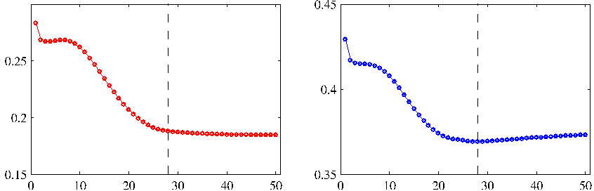

Figure 12.2 Principal component analysis seeks a space of lower dimensionality, known as the principal subspace and denoted by the magenta line, such that the orthogonal projection of the data points (red dots) onto this subspace maximizes the variance of the projected points (green dots). An alternative definition of PCA is based on minimizing the sum-of-squares of the projection errors, indicated by the blue lines.

a particular form of linear-Gaussian latent variable model. This probabilistic reformulation brings many advantages, such as the use of EM for parameter estimation, principled extensions to mixtures of PCA models, and Bayesian formulations that allow the number of principal components to be determined automatically from the data. Finally, we discuss briefly several generalizations of the latent variable concept that go beyond the linear-Gaussian assumption including non-Gaussian latent variables, which leads to the framework of independent component analysis, as well as models having a nonlinear relationship between latent and observed variables.

## 12.1. Principal Component Analysis

Principal component analysis, or PCA, is a technique that is widely used for applications such as dimensionality reduction, lossy data compression, feature extraction, and data visualization (Jolliffe, 2002). It is also known as the Karhunen-Loève transform.

There are two commonly used definitions of PCA that give rise to the same algorithm. PCA can be defined as the orthogonal projection of the data onto a lower dimensional linear space, known as the principal subspace, such that the variance of the projected data is maximized (Hotelling, 1933). Equivalently, it can be defined as the linear projection that minimizes the average projection cost, defined as the mean squared distance between the data points and their projections (Pearson, 1901). The process of orthogonal projection is illustrated in Figure 12.2. We consider each of these definitions in turn.

### 12.1.1 Maximum variance formulation

Consider a data set of observations $\{\mathbf{x}_n\}$ where $n = 1, \dots, N$, and $\mathbf{x}_n$ is a Euclidean variable with dimensionality $D$. Our goal is to project the data onto a space having dimensionality $M < D$ while maximizing the variance of the projected data. For the moment, we shall assume that the value of $M$ is given. Later in this
[Page 582]

chapter, we shall consider techniques to determine an appropriate value of $M$ from the data.

To begin with, consider the projection onto a one-dimensional space ($M = 1$). We can define the direction of this space using a $D$-dimensional vector $\mathbf{u}_1$, which for convenience (and without loss of generality) we shall choose to be a unit vector so that $\mathbf{u}_1^{\text{T}}\mathbf{u}_1 = 1$ (note that we are only interested in the direction defined by $\mathbf{u}_1$, not in the magnitude of $\mathbf{u}_1$ itself). Each data point $\mathbf{x}_n$ is then projected onto a scalar value $\mathbf{u}_1^{\text{T}}\mathbf{x}_n$. The mean of the projected data is $\mathbf{u}_1^{\text{T}}\bar{\mathbf{x}}$ where $\bar{\mathbf{x}}$ is the sample set mean given by

$$
\bar{\mathbf{x}} = \frac{1}{N} \sum_{n=1}^N \mathbf{x}_n \tag{12.1}
$$

and the variance of the projected data is given by

$$
\frac{1}{N} \sum_{n=1}^N \{\mathbf{u}_1^{\text{T}}\mathbf{x}_n - \mathbf{u}_1^{\text{T}}\bar{\mathbf{x}}\}^2 = \mathbf{u}_1^{\text{T}}\mathbf{S}\mathbf{u}_1 \tag{12.2}
$$

where $\mathbf{S}$ is the data covariance matrix defined by

$$
\mathbf{S} = \frac{1}{N} \sum_{n=1}^N (\mathbf{x}_n - \bar{\mathbf{x}})(\mathbf{x}_n - \bar{\mathbf{x}})^{\text{T}}. \tag{12.3}
$$

We now maximize the projected variance $\mathbf{u}_1^{\text{T}}\mathbf{S}\mathbf{u}_1$ with respect to $\mathbf{u}_1$. Clearly, this has to be a constrained maximization to prevent $\|\mathbf{u}_1\| \to \infty$. The appropriate constraint comes from the normalization condition $\mathbf{u}_1^{\text{T}}\mathbf{u}_1 = 1$. To enforce this constraint, we introduce a Lagrange multiplier that we shall denote by $\lambda_1$, and then make an unconstrained maximization of

$$
\mathbf{u}_1^{\text{T}}\mathbf{S}\mathbf{u}_1 + \lambda_1(1 - \mathbf{u}_1^{\text{T}}\mathbf{u}_1). \tag{12.4}
$$

By setting the derivative with respect to $\mathbf{u}_1$ equal to zero, we see that this quantity will have a stationary point when

$$
\mathbf{S}\mathbf{u}_1 = \lambda_1 \mathbf{u}_1 \tag{12.5}
$$

which says that $\mathbf{u}_1$ must be an eigenvector of $\mathbf{S}$. If we left-multiply by $\mathbf{u}_1^{\text{T}}$ and make use of $\mathbf{u}_1^{\text{T}}\mathbf{u}_1 = 1$, we see that the variance is given by

$$
\mathbf{u}_1^{\text{T}}\mathbf{S}\mathbf{u}_1 = \lambda_1 \tag{12.6}
$$

and so the variance will be a maximum when we set $\mathbf{u}_1$ equal to the eigenvector having the largest eigenvalue $\lambda_1$. This eigenvector is known as the first principal component.

We can define additional principal components in an incremental fashion by choosing each new direction to be that which maximizes the projected variance
[Page 583]

amongst all possible directions orthogonal to those already considered. If we consider the general case of an $M$-dimensional projection space, the optimal linear projection for which the variance of the projected data is maximized is now defined by the $M$ eigenvectors $\mathbf{u}_1, \dots, \mathbf{u}_M$ of the data covariance matrix $\mathbf{S}$ corresponding to the $M$ largest eigenvalues $\lambda_1, \dots, \lambda_M$. This is easily shown using proof by induction.

To summarize, principal component analysis involves evaluating the mean $\bar{\mathbf{x}}$ and the covariance matrix $\mathbf{S}$ of the data set and then finding the $M$ eigenvectors of $\mathbf{S}$ corresponding to the $M$ largest eigenvalues. Algorithms for finding eigenvectors and eigenvalues, as well as additional theorems related to eigenvector decomposition, can be found in Golub and Van Loan (1996). Note that the computational cost of computing the full eigenvector decomposition for a matrix of size $D \times D$ is $O(D^3)$. If we plan to project our data onto the first $M$ principal components, then we only need to find the first $M$ eigenvalues and eigenvectors. This can be done with more efficient techniques, such as the power method (Golub and Van Loan, 1996), that scale like $O(MD^2)$, or alternatively we can make use of the EM algorithm.

### 12.1.2 Minimum-error formulation

We now discuss an alternative formulation of PCA based on projection error minimization. To do this, we introduce a complete orthonormal set of $D$-dimensional basis vectors $\{\mathbf{u}_i\}$ where $i = 1, \dots, D$ that satisfy

$$
\mathbf{u}_i^{\text{T}} \mathbf{u}_j = \delta_{ij}. \tag{12.7}
$$

Because this basis is complete, each data point can be represented exactly by a linear combination of the basis vectors

$$
\mathbf{x}_n = \sum_{i=1}^D \alpha_{ni} \mathbf{u}_i \tag{12.8}
$$

where the coefficients $\alpha_{ni}$ will be different for different data points. This simply corresponds to a rotation of the coordinate system to a new system defined by the $\{\mathbf{u}_i\}$, and the original $D$ components $\{x_{n1}, \dots, x_{nD}\}$ are replaced by an equivalent set $\{\alpha_{n1}, \dots, \alpha_{nD}\}$. Taking the inner product with $\mathbf{u}_j$, and making use of the orthonormality property, we obtain $\alpha_{nj} = \mathbf{x}_n^{\text{T}} \mathbf{u}_j$, and so without loss of generality we can write

$$
\mathbf{x}_n = \sum_{i=1}^D (\mathbf{x}_n^{\text{T}} \mathbf{u}_i) \mathbf{u}_i. \tag{12.9}
$$

Our goal, however, is to approximate this data point using a representation involving a restricted number $M < D$ of variables corresponding to a projection onto a lower-dimensional subspace. The $M$-dimensional linear subspace can be represented, without loss of generality, by the first $M$ of the basis vectors, and so we approximate each data point $\mathbf{x}_n$ by

$$
\tilde{\mathbf{x}}_n = \sum_{i=1}^M z_{ni} \mathbf{u}_i + \sum_{i=M+1}^D b_i \mathbf{u}_i \tag{12.10}
$$

[Page 584]

where the $\{z_{ni}\}$ depend on the particular data point, whereas the $\{b_i\}$ are constants that are the same for all data points. We are free to choose the $\{\mathbf{u}_i\}$, the $\{z_{ni}\}$, and the $\{b_i\}$ so as to minimize the distortion introduced by the reduction in dimensionality. As our distortion measure, we shall use the squared distance between the original data point $\mathbf{x}_n$ and its approximation $\tilde{\mathbf{x}}_n$, averaged over the data set, so that our goal is to minimize

$$
J = \frac{1}{N} \sum_{n=1}^N \|\mathbf{x}_n - \tilde{\mathbf{x}}_n\|^2. \tag{12.11}
$$

Consider first of all the minimization with respect to the quantities $\{z_{ni}\}$. Substituting for $\tilde{\mathbf{x}}_n$, setting the derivative with respect to $z_{nj}$ to zero, and making use of the orthonormality conditions, we obtain

$$
z_{nj} = \mathbf{x}_n^{\text{T}} \mathbf{u}_j \tag{12.12}
$$

where $j = 1, \dots, M$. Similarly, setting the derivative of $J$ with respect to $b_i$ to zero, and again making use of the orthonormality relations, gives

$$
b_j = \bar{\mathbf{x}}^{\text{T}} \mathbf{u}_j \tag{12.13}
$$

where $j = M + 1, \dots, D$. If we substitute for $z_{ni}$ and $b_i$, and make use of the general expansion (12.9), we obtain

$$
\mathbf{x}_n - \tilde{\mathbf{x}}_n = \sum_{i=M+1}^D \{(\mathbf{x}_n - \bar{\mathbf{x}})^{\text{T}} \mathbf{u}_i\} \mathbf{u}_i \tag{12.14}
$$

from which we see that the displacement vector from $\mathbf{x}_n$ to $\tilde{\mathbf{x}}_n$ lies in the space orthogonal to the principal subspace, because it is a linear combination of $\{\mathbf{u}_i\}$ for $i = M + 1, \dots, D$, as illustrated in Figure 12.2. This is to be expected because the projected points $\tilde{\mathbf{x}}_n$ must lie within the principal subspace, but we can move them freely within that subspace, and so the minimum error is given by the orthogonal projection.

We therefore obtain an expression for the distortion measure $J$ as a function purely of the $\{\mathbf{u}_i\}$ in the form

$$
J = \frac{1}{N} \sum_{n=1}^N \sum_{i=M+1}^D (\mathbf{x}_n^{\text{T}} \mathbf{u}_i - \bar{\mathbf{x}}^{\text{T}} \mathbf{u}_i)^2 = \sum_{i=M+1}^D \mathbf{u}_i^{\text{T}} \mathbf{S} \mathbf{u}_i. \tag{12.15}
$$

There remains the task of minimizing $J$ with respect to the $\{\mathbf{u}_i\}$, which must be a constrained minimization otherwise we will obtain the vacuous result $\mathbf{u}_i = \mathbf{0}$. The constraints arise from the orthonormality conditions and, as we shall see, the solution will be expressed in terms of the eigenvector expansion of the covariance matrix. Before considering a formal solution, let us try to obtain some intuition about the result by considering the case of a two-dimensional data space $D = 2$ and a onedimensional principal subspace $M = 1$. We have to choose a direction $\mathbf{u}_2$ so as to
[Page 585]

minimize $J = \mathbf{u}_2^{\text{T}}\mathbf{S}\mathbf{u}_2$, subject to the normalization constraint $\mathbf{u}_2^{\text{T}}\mathbf{u}_2 = 1$. Using a Lagrange multiplier $\lambda_2$ to enforce the constraint, we consider the minimization of

$$
\tilde{J} = \mathbf{u}_2^{\text{T}} \mathbf{S} \mathbf{u}_2 + \lambda_2(1 - \mathbf{u}_2^{\text{T}} \mathbf{u}_2). \tag{12.16}
$$

Setting the derivative with respect to $\mathbf{u}_2$ to zero, we obtain $\mathbf{S}\mathbf{u}_2 = \lambda_2\mathbf{u}_2$ so that $\mathbf{u}_2$ is an eigenvector of $\mathbf{S}$ with eigenvalue $\lambda_2$. Thus any eigenvector will define a stationary point of the distortion measure. To find the value of $J$ at the minimum, we back-substitute the solution for $\mathbf{u}_2$ into the distortion measure to give $J = \lambda_2$. We therefore obtain the minimum value of $J$ by choosing $\mathbf{u}_2$ to be the eigenvector corresponding to the smaller of the two eigenvalues. Thus we should choose the principal subspace to be aligned with the eigenvector having the larger eigenvalue. This result accords with our intuition that, in order to minimize the average squared projection distance, we should choose the principal component subspace to pass through the mean of the data points and to be aligned with the directions of maximum variance. For the case when the eigenvalues are equal, any choice of principal direction will give rise to the same value of $J$.

The general solution to the minimization of $J$ for arbitrary $D$ and arbitrary $M < D$ is obtained by choosing the $\{\mathbf{u}_i\}$ to be eigenvectors of the covariance matrix given by

$$
\mathbf{S}\mathbf{u}_i = \lambda_i \mathbf{u}_i \tag{12.17}
$$

where $i = 1, \dots, D$, and as usual the eigenvectors $\{\mathbf{u}_i\}$ are chosen to be orthonormal. The corresponding value of the distortion measure is then given by

$$
J = \sum_{i=M+1}^D \lambda_i \tag{12.18}
$$

which is simply the sum of the eigenvalues of those eigenvectors that are orthogonal to the principal subspace. We therefore obtain the minimum value of $J$ by selecting these eigenvectors to be those having the $D - M$ smallest eigenvalues, and hence the eigenvectors defining the principal subspace are those corresponding to the $M$ largest eigenvalues.

Although we have considered $M < D$, the PCA analysis still holds if $M = D$, in which case there is no dimensionality reduction but simply a rotation of the coordinate axes to align with principal components.

Finally, it is worth noting that there exists a closely related linear dimensionality reduction technique called canonical correlation analysis, or CCA (Hotelling, 1936; Bach and Jordan, 2002). Whereas PCA works with a single random variable, CCA considers two (or more) variables and tries to find a corresponding pair of linear subspaces that have high cross-correlation, so that each component within one of the subspaces is correlated with a single component from the other subspace. Its solution can be expressed in terms of a generalized eigenvector problem.

## 12.1.3 Applications of PCA

We can illustrate the use of PCA for data compression by considering the offline digits data set. Because each eigenvector of the covariance matrix is a vector
[Page 586]

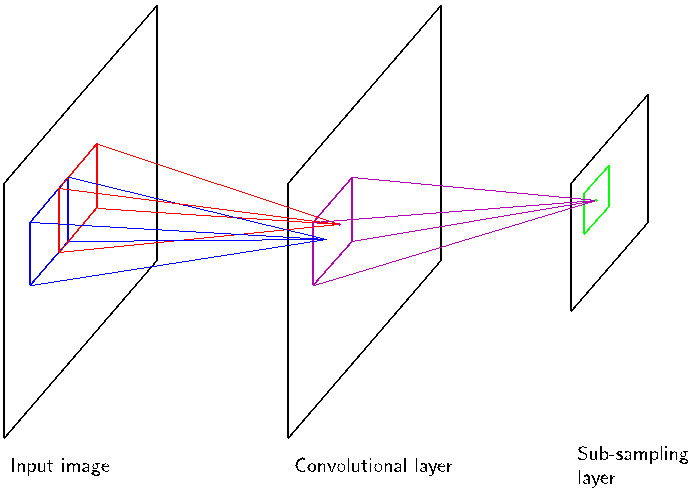

Figure 12.3 The mean vector $\bar{\mathbf{x}}$ along with the first four PCA eigenvectors $\mathbf{u}_1, \dots, \mathbf{u}_4$ for the off-line digits data set, together with the corresponding eigenvalues.

in the original $D$-dimensional space, we can represent the eigenvectors as images of the same size as the data points. The first five eigenvectors, along with the corresponding eigenvalues, are shown in Figure 12.3. A plot of the complete spectrum of eigenvalues, sorted into decreasing order, is shown in Figure 12.4(a). The distortion measure $J$ associated with choosing a particular value of $M$ is given by the sum of the eigenvalues from $M + 1$ up to $D$ and is plotted for different values of $M$ in Figure 12.4(b).

If we substitute (12.12) and (12.13) into (12.10), we can write the PCA approximation to a data vector $\mathbf{x}_n$ in the form

$$
\begin{aligned}
\tilde{\mathbf{x}}_n &= \sum_{i=1}^M (\mathbf{x}_n^{\text{T}} \mathbf{u}_i) \mathbf{u}_i + \sum_{i=M+1}^D (\bar{\mathbf{x}}^{\text{T}} \mathbf{u}_i) \mathbf{u}_i \tag{12.19} \\
&= \bar{\mathbf{x}} + \sum_{i=1}^M (\mathbf{x}_n^{\text{T}} \mathbf{u}_i - \bar{\mathbf{x}}^{\text{T}} \mathbf{u}_i) \mathbf{u}_i \tag{12.20}
\end{aligned}
$$

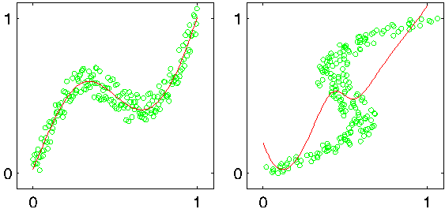

Figure 12.4 (a) Plot of the eigenvalue spectrum for the off-line digits data set. (b) Plot of the sum of the discarded eigenvalues, which represents the sum-of-squares distortion $J$ introduced by projecting the data onto a principal component subspace of dimensionality $M$.
[Page 587]

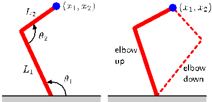

Figure 12.5 An original example from the off-line digits data set together with its PCA reconstructions obtained by retaining $M$ principal components for various values of $M$. As $M$ increases the reconstruction becomes more accurate and would be perfect when $M = D = 28 \times 28 = 784$.

where we have made use of the relation

$$
\bar{\mathbf{x}} = \sum_{i=1}^D (\bar{\mathbf{x}}^{\text{T}} \mathbf{u}_i) \mathbf{u}_i \tag{12.21}
$$

which follows from the completeness of the $\{\mathbf{u}_i\}$. This represents a compression of the data set, because for each data point we have replaced the $D$-dimensional vector $\mathbf{x}_n$ with an $M$-dimensional vector having components $(\mathbf{x}_n^{\text{T}} \mathbf{u}_i - \bar{\mathbf{x}}^{\text{T}} \mathbf{u}_i)$. The smaller the value of $M$, the greater the degree of compression. Examples of PCA reconstructions of data points for the digits data set are shown in Figure 12.5.

Another application of principal component analysis is to data pre-processing. In this case, the goal is not dimensionality reduction but rather the transformation of a data set in order to standardize certain of its properties. This can be important in allowing subsequent pattern recognition algorithms to be applied successfully to the data set. Typically, it is done when the original variables are measured in various different units or have significantly different variability. For instance in the Old Faithful data set, the time between eruptions is typically an order of magnitude greater than the duration of an eruption. When we applied the $K$-means algorithm to this data set, we first made a separate linear re-scaling of the individual variables such that each variable had zero mean and unit variance. This is known as standardizing the data, and the covariance matrix for the standardized data has components

$$
\rho_{ij} = \frac{1}{N} \sum_{n=1}^N \frac{(x_{ni} - \bar{x}_i)}{\sigma_i} \frac{(x_{nj} - \bar{x}_j)}{\sigma_j} \tag{12.22}
$$

where $\sigma_i^2$ is the variance of $x_i$. This is known as the correlation matrix of the original data and has the property that if two components $x_i$ and $x_j$ of the data are perfectly correlated, then $\rho_{ij} = 1$, and if they are uncorrelated, then $\rho_{ij} = 0$.

However, using PCA we can make a more substantial normalization of the data to give it zero mean and unit covariance, so that different variables become decorrelated. To do this, we first write the eigenvector equation (12.17) in the form

$$
\mathbf{S}\mathbf{U} = \mathbf{U}\mathbf{L} \tag{12.23}
$$

[Page 588]

Figure 12.6 Illustration of the effects of linear pre-processing applied to the Old Faithful data set. The plot on the left shows the original data. The centre plot shows the result of standardizing the individual variables to zero mean and unit variance. Also shown are the principal axes of this normalized data set, plotted over the range $\pm \lambda_i^{1/2}$. The plot on the right shows the result of whitening of the data to give it zero mean and unit covariance.

where $\mathbf{L}$ is a $D \times D$ diagonal matrix with elements $\lambda_i$, and $\mathbf{U}$ is a $D \times D$ orthogonal matrix with columns given by $\mathbf{u}_i$. Then we define, for each data point $\mathbf{x}_n$, a transformed value given by

$$
\mathbf{y}_n = \mathbf{L}^{-1/2} \mathbf{U}^{\text{T}} (\mathbf{x}_n - \bar{\mathbf{x}}) \tag{12.24}
$$

where $\bar{\mathbf{x}}$ is the sample mean defined by (12.1). Clearly, the set $\{\mathbf{y}_n\}$ has zero mean, and its covariance is given by the identity matrix because

$$
\begin{aligned}
\frac{1}{N} \sum_{n=1}^N \mathbf{y}_n \mathbf{y}_n^{\text{T}} &= \frac{1}{N} \sum_{n=1}^N \mathbf{L}^{-1/2} \mathbf{U}^{\text{T}} (\mathbf{x}_n - \bar{\mathbf{x}})(\mathbf{x}_n - \bar{\mathbf{x}})^{\text{T}} \mathbf{U} \mathbf{L}^{-1/2} \\
&= \mathbf{L}^{-1/2} \mathbf{U}^{\text{T}} \mathbf{S} \mathbf{U} \mathbf{L}^{-1/2} = \mathbf{L}^{-1/2} \mathbf{L} \mathbf{L}^{-1/2} = \mathbf{I}. \tag{12.25}
\end{aligned}
$$

This operation is known as whitening or sphereing the data and is illustrated for the Old Faithful data set in Figure 12.6.

It is interesting to compare PCA with the Fisher linear discriminant which was discussed in Section 4.1.4. Both methods can be viewed as techniques for linear dimensionality reduction. However, PCA is unsupervised and depends only on the values $\mathbf{x}_n$ whereas Fisher linear discriminant also uses class-label information. This difference is highlighted by the example in Figure 12.7.

Another common application of principal component analysis is to data visualization. Here each data point is projected onto a two-dimensional ($M = 2$) principal subspace, so that a data point $\mathbf{x}_n$ is plotted at Cartesian coordinates given by $\mathbf{x}_n^{\text{T}} \mathbf{u}_1$ and $\mathbf{x}_n^{\text{T}} \mathbf{u}_2$, where $\mathbf{u}_1$ and $\mathbf{u}_2$ are the eigenvectors corresponding to the largest and second largest eigenvalues. An example of such a plot, for the oil flow data set, is shown in Figure 12.8.
[Page 589]

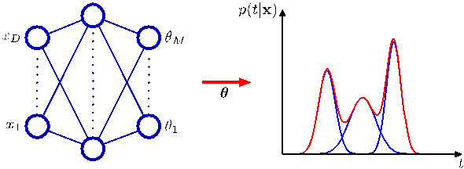

Figure 12.7 A comparison of principal component analysis with Fisher’s linear discriminant for linear dimensionality reduction. Here two data in two dimensions, belonging to two classes shown in red and blue, is to be projected onto a single dimension. PCA chooses the direction of maximum variance, shown by the magenta curve, which leads to strong class overlap, whereas the Fisher linear discriminant takes account of the class labels and leads to a projection onto the green curve giving much better class separation.

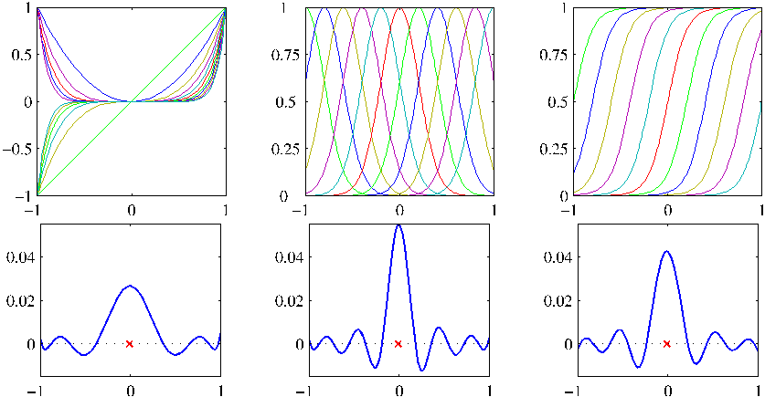

Figure 12.8 Visualization of the oil flow data set obtained by projecting the data onto the first two principal components. The red, blue, and green points correspond to the ‘laminar’, ‘homogeneous’, and ‘annular’ flow configurations respectively.

## 12.1.4 PCA for high-dimensional data

In some applications of principal component analysis, the number of data points is smaller than the dimensionality of the data space. For example, we might want to apply PCA to a data set of a few hundred images, each of which corresponds to a vector in a space of potentially several million dimensions (corresponding to three colour values for each of the pixels in the image). Note that in a $D$-dimensional space a set of $N$ points, where $N < D$, defines a linear subspace whose dimensionality is at most $N - 1$, and so there is little point in applying PCA for values of $M$ that are greater than $N - 1$. Indeed, if we perform PCA we will find that at least $D - N + 1$ of the eigenvalues are zero, corresponding to eigenvectors along whose directions the data set has zero variance. Furthermore, typical algorithms for finding the eigenvectors of a $D \times D$ matrix have a computational cost that scales like $O(D^3)$, and so for applications such as the image example, a direct application of PCA will be computationally infeasible.

We can resolve this problem as follows. First, let us define $\mathbf{X}$ to be the $N \times D$
[Page 590]

dimensional centred data matrix, whose $n^{\text{th}}$ row is given by $(\mathbf{x}_n - \bar{\mathbf{x}})^{\text{T}}$. The covariance matrix (12.3) can then be written as $\mathbf{S} = N^{-1}\mathbf{X}^{\text{T}}\mathbf{X}$, and the corresponding eigenvector equation becomes

$$
\frac{1}{N} \mathbf{X}^{\text{T}} \mathbf{X} \mathbf{u}_i = \lambda_i \mathbf{u}_i. \tag{12.26}
$$

Now pre-multiply both sides by $\mathbf{X}$ to give

$$
\frac{1}{N} \mathbf{X} \mathbf{X}^{\text{T}} (\mathbf{X}\mathbf{u}_i) = \lambda_i (\mathbf{X}\mathbf{u}_i). \tag{12.27}
$$

If we now define $\mathbf{v}_i = \mathbf{X}\mathbf{u}_i$, we obtain

$$
\frac{1}{N} \mathbf{X} \mathbf{X}^{\text{T}} \mathbf{v}_i = \lambda_i \mathbf{v}_i \tag{12.28}
$$

which is an eigenvector equation for the $N \times N$ matrix $N^{-1}\mathbf{X}\mathbf{X}^{\text{T}}$. We see that this has the same $N - 1$ eigenvalues as the original covariance matrix (which itself has an additional $D - N + 1$ eigenvalues of value zero). Thus we can solve the eigenvector problem in spaces of lower dimensionality with computational cost $O(N^3)$ instead of $O(D^3)$. In order to determine the eigenvectors, we multiply both sides of (12.28) by $\mathbf{X}^{\text{T}}$ to give

$$
\left(\frac{1}{N} \mathbf{X}^{\text{T}} \mathbf{X}\right)(\mathbf{X}^{\text{T}}\mathbf{v}_i) = \lambda_i(\mathbf{X}^{\text{T}}\mathbf{v}_i) \tag{12.29}
$$

from which we see that $(\mathbf{X}^{\text{T}}\mathbf{v}_i)$ is an eigenvector of $\mathbf{S}$ with eigenvalue $\lambda_i$. Note, however, that these eigenvectors need not be normalized. To determine the appropriate normalization, we re-scale $\mathbf{u}_i \propto \mathbf{X}^{\text{T}}\mathbf{v}_i$ by a constant such that $\|\mathbf{u}_i\| = 1$, which, assuming $\mathbf{v}_i$ has been normalized to unit length, gives

$$
\mathbf{u}_i = \frac{1}{(N\lambda_i)^{1/2}} \mathbf{X}^{\text{T}} \mathbf{v}_i. \tag{12.30}
$$

In summary, to apply this approach we first evaluate $\mathbf{X}\mathbf{X}^{\text{T}}$ and then find its eigenvectors and eigenvalues and then compute the eigenvectors in the original data space using (12.30).

## 12.2. Probabilistic PCA

The formulation of PCA discussed in the previous section was based on a linear projection of the data onto a subspace of lower dimensionality than the original data space. We now show that PCA can also be expressed as the maximum likelihood solution of a probabilistic latent variable model. This reformulation of PCA, known as probabilistic PCA, brings several advantages compared with conventional PCA:

- Probabilistic PCA represents a constrained form of the Gaussian distribution in which the number of free parameters can be restricted while still allowing the model to capture the dominant correlations in a data set.
  [Page 591]

- We can derive an EM algorithm for PCA that is computationally efficient in situations where only a few leading eigenvectors are required and that avoids having to evaluate the data covariance matrix as an intermediate step.
- The combination of a probabilistic model and EM allows us to deal with missing values in the data set.
- Mixtures of probabilistic PCA models can be formulated in a principled way and trained using the EM algorithm.
- Probabilistic PCA forms the basis for a Bayesian treatment of PCA in which the dimensionality of the principal subspace can be found automatically from the data.
- The existence of a likelihood function allows direct comparison with other probabilistic density models. By contrast, conventional PCA will assign a low reconstruction cost to data points that are close to the principal subspace even if they lie arbitrarily far from the training data.
- Probabilistic PCA can be used to model class-conditional densities and hence be applied to classification problems.
- The probabilistic PCA model can be run generatively to provide samples from the distribution.

This formulation of PCA as a probabilistic model was proposed independently by Tipping and Bishop (1997, 1999b) and by Roweis (1998). As we shall see later, it is closely related to factor analysis (Basilevsky, 1994).

Probabilistic PCA is a simple example of the linear-Gaussian framework, in which all of the marginal and conditional distributions are Gaussian. We can formulate probabilistic PCA by first introducing an explicit latent variable $\mathbf{z}$ corresponding to the principal-component subspace. Next we define a Gaussian prior distribution $p(\mathbf{z})$ over the latent variable, together with a Gaussian conditional distribution $p(\mathbf{x}|\mathbf{z})$ for the observed variable $\mathbf{x}$ conditioned on the value of the latent variable. Specifically, the prior distribution over $\mathbf{z}$ is given by a zero-mean unit-covariance Gaussian

$$
p(\mathbf{z}) = \mathcal{N}(\mathbf{z}|\mathbf{0}, \mathbf{I}). \tag{12.31}
$$

Similarly, the conditional distribution of the observed variable $\mathbf{x}$, conditioned on the value of the latent variable $\mathbf{z}$, is again Gaussian, of the form

$$
p(\mathbf{x}|\mathbf{z}) = \mathcal{N}(\mathbf{x}|\mathbf{W}\mathbf{z} + \boldsymbol{\mu}, \sigma^2\mathbf{I}) \tag{12.32}
$$

in which the mean of $\mathbf{x}$ is a general linear function of $\mathbf{z}$ governed by the $D \times M$ matrix $\mathbf{W}$ and the $D$-dimensional vector $\boldsymbol{\mu}$. Note that this factorizes with respect to the elements of $\mathbf{x}$, in other words this is an example of the naive Bayes model. As we shall see shortly, the columns of $\mathbf{W}$ span a linear subspace within the data space that corresponds to the principal subspace. The other parameter in this model is the scalar $\sigma^2$ governing the variance of the conditional distribution. Note that there is no
[Page 592]

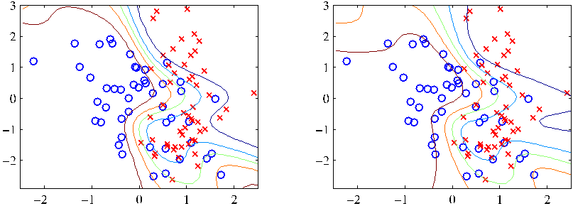

Figure 12.9 An illustration of the generative view of the probabilistic PCA model for a two-dimensional data space and a one-dimensional latent space. An observed data point $\mathbf{x}$ is generated by first drawing a value $\hat{\mathbf{z}}$ for the latent variable from its prior distribution $p(\mathbf{z})$ and then drawing a value for $\mathbf{x}$ from an isotropic Gaussian distribution (illustrated by the red circles) having mean $\mathbf{W}\hat{\mathbf{z}} + \boldsymbol{\mu}$ and covariance $\sigma^2\mathbf{I}$. The green ellipses show the density contours for the marginal distribution $p(\mathbf{x})$.

loss of generality in assuming a zero mean, unit covariance Gaussian for the latent distribution $p(\mathbf{z})$ because a more general Gaussian distribution would give rise to an equivalent probabilistic model.

We can view the probabilistic PCA model from a generative viewpoint in which a sampled value of the observed variable is obtained by first choosing a value for the latent variable and then sampling the observed variable conditioned on this latent value. Specifically, the $D$-dimensional observed variable $\mathbf{x}$ is defined by a linear transformation of the $M$-dimensional latent variable $\mathbf{z}$ plus additive Gaussian ‘noise’ $\boldsymbol{\epsilon}$, so that

$$
\mathbf{x} = \mathbf{W}\mathbf{z} + \boldsymbol{\mu} + \boldsymbol{\epsilon} \tag{12.33}
$$

where $\mathbf{z}$ is an $M$-dimensional Gaussian latent variable, and $\boldsymbol{\epsilon}$ is a $D$-dimensional zero-mean Gaussian-distributed noise variable with covariance $\sigma^2\mathbf{I}$. This generative process is illustrated in Figure 12.9. Note that this framework is based on a mapping from latent space to data space, in contrast to the more conventional view of PCA discussed above. The reverse mapping, from data space to the latent space, will be obtained shortly using Bayes’ theorem.

Suppose we wish to determine the values of the parameters $\mathbf{W}$, $\boldsymbol{\mu}$ and $\sigma^2$ using maximum likelihood. To write down the likelihood function, we need an expression for the marginal distribution $p(\mathbf{x})$ of the observed variable. This is expressed, from the sum and product rules of probability, in the form

$$
p(\mathbf{x}) = \int p(\mathbf{x}|\mathbf{z})p(\mathbf{z}) \, \text{d}\mathbf{z}. \tag{12.34}
$$

Because this corresponds to a linear-Gaussian model, this marginal distribution is again Gaussian, and is given by

$$
p(\mathbf{x}) = \mathcal{N}(\mathbf{x}|\boldsymbol{\mu}, \mathbf{C}) \tag{12.35}
$$

[Page 593]

where the $D \times D$ covariance matrix $\mathbf{C}$ is defined by

$$
\mathbf{C} = \mathbf{W}\mathbf{W}^{\text{T}} + \sigma^2\mathbf{I}. \tag{12.36}
$$

This result can also be derived more directly by noting that the predictive distribution will be Gaussian and then evaluating its mean and covariance using (12.33). This gives

$$
\begin{aligned}
\mathbb{E}[\mathbf{x}] &= \mathbb{E}[\mathbf{W}\mathbf{z} + \boldsymbol{\mu} + \boldsymbol{\epsilon}] = \boldsymbol{\mu} \tag{12.37} \\
\text{cov}[\mathbf{x}] &= \mathbb{E}[(\mathbf{W}\mathbf{z} + \boldsymbol{\epsilon})(\mathbf{W}\mathbf{z} + \boldsymbol{\epsilon})^{\text{T}}] \\
&= \mathbb{E}[\mathbf{W}\mathbf{z}\mathbf{z}^{\text{T}}\mathbf{W}^{\text{T}}] + \mathbb{E}[\boldsymbol{\epsilon}\boldsymbol{\epsilon}^{\text{T}}] = \mathbf{W}\mathbf{W}^{\text{T}} + \sigma^2\mathbf{I} \tag{12.38}
\end{aligned}
$$

where we have used the fact that $\mathbf{z}$ and $\boldsymbol{\epsilon}$ are independent random variables and hence are uncorrelated.

Intuitively, we can think of the distribution $p(\mathbf{x})$ as being defined by taking an isotropic Gaussian ‘spray can’ and moving it across the principal subspace spraying Gaussian ink with density determined by $\sigma^2$ and weighted by the prior distribution. The accumulated ink density gives rise to a ‘pancake’ shaped distribution representing the marginal density $p(\mathbf{x})$.

The predictive distribution $p(\mathbf{x})$ is governed by the parameters $\boldsymbol{\mu}$, $\mathbf{W}$, and $\sigma^2$. However, there is redundancy in this parameterization corresponding to rotations of the latent space coordinates. To see this, consider a matrix $\tilde{\mathbf{W}} = \mathbf{W}\mathbf{R}$ where $\mathbf{R}$ is an orthogonal matrix. Using the orthogonality property $\mathbf{R}\mathbf{R}^{\text{T}} = \mathbf{I}$, we see that the quantity $\tilde{\mathbf{W}}\tilde{\mathbf{W}}^{\text{T}}$ that appears in the covariance matrix $\mathbf{C}$ takes the form

$$
\tilde{\mathbf{W}}\tilde{\mathbf{W}}^{\text{T}} = \mathbf{W}\mathbf{R}\mathbf{R}^{\text{T}}\mathbf{W}^{\text{T}} = \mathbf{W}\mathbf{W}^{\text{T}} \tag{12.39}
$$

and hence is independent of $\mathbf{R}$. Thus there is a whole family of matrices $\tilde{\mathbf{W}}$ all of which give rise to the same predictive distribution. This invariance can be understood in terms of rotations within the latent space. We shall return to a discussion of the number of independent parameters in this model later.

When we evaluate the predictive distribution, we require $\mathbf{C}^{-1}$, which involves the inversion of a $D \times D$ matrix. The computation required to do this can be reduced by making use of the matrix inversion identity (C.7) to give

$$
\mathbf{C}^{-1} = \sigma^{-2}\mathbf{I} - \sigma^{-2}\mathbf{W}\mathbf{M}^{-1}\mathbf{W}^{\text{T}} \tag{12.40}
$$

where the $M \times M$ matrix $\mathbf{M}$ is defined by

$$
\mathbf{M} = \mathbf{W}^{\text{T}}\mathbf{W} + \sigma^2\mathbf{I}. \tag{12.41}
$$

Because we invert $\mathbf{M}$ rather than inverting $\mathbf{C}$ directly, the cost of evaluating $\mathbf{C}^{-1}$ is reduced from $O(D^3)$ to $O(M^3)$.

As well as the predictive distribution $p(\mathbf{x})$, we will also require the posterior distribution $p(\mathbf{z}|\mathbf{x})$, which can again be written down directly using the result (2.116) for linear-Gaussian models to give

$$
p(\mathbf{z}|\mathbf{x}) = \mathcal{N}(\mathbf{z}|\mathbf{M}^{-1}\mathbf{W}^{\text{T}}(\mathbf{x} - \boldsymbol{\mu}), \sigma^2\mathbf{M}^{-1}). \tag{12.42}
$$

Note that the posterior mean depends on $\mathbf{x}$, whereas the posterior covariance is independent of $\mathbf{x}$.
[Page 594]

Figure 12.10 The probabilistic PCA model for a data set of $N$ observations of $\mathbf{x}$ can be expressed as a directed graph in which each observation $\mathbf{x}_n$ is associated with a value $\mathbf{z}_n$ of the latent variable.

## 12.2.1 Maximum likelihood PCA

We next consider the determination of the model parameters using maximum likelihood. Given a data set $\mathbf{X} = \{\mathbf{x}_n\}$ of observed data points, the probabilistic PCA model can be expressed as a directed graph, as shown in Figure 12.10. The corresponding log likelihood function is given, from (12.35), by

$$
\begin{aligned}
\ln p(\mathbf{X}|\boldsymbol{\mu}, \mathbf{W}, \sigma^2) &= \sum_{n=1}^N \ln p(\mathbf{x}_n|\mathbf{W}, \boldsymbol{\mu}, \sigma^2) \\
&= -\frac{ND}{2} \ln(2\pi) - \frac{N}{2} \ln|\mathbf{C}| - \frac{1}{2} \sum_{n=1}^N (\mathbf{x}_n - \boldsymbol{\mu})^{\text{T}} \mathbf{C}^{-1} (\mathbf{x}_n - \boldsymbol{\mu}). \tag{12.43}
\end{aligned}
$$

Setting the derivative of the log likelihood with respect to $\boldsymbol{\mu}$ equal to zero gives the expected result $\boldsymbol{\mu} = \bar{\mathbf{x}}$ where $\bar{\mathbf{x}}$ is the data mean defined by (12.1). Back-substituting we can then write the log likelihood function in the form

$$
\ln p(\mathbf{X}|\mathbf{W}, \boldsymbol{\mu}, \sigma^2) = -\frac{N}{2} \{D \ln(2\pi) + \ln|\mathbf{C}| + \text{Tr}(\mathbf{C}^{-1}\mathbf{S})\} \tag{12.44}
$$

where $\mathbf{S}$ is the data covariance matrix defined by (12.3). Because the log likelihood is a quadratic function of $\boldsymbol{\mu}$, this solution represents the unique maximum, as can be confirmed by computing second derivatives.

Maximization with respect to $\mathbf{W}$ and $\sigma^2$ is more complex but nonetheless has an exact closed-form solution. It was shown by Tipping and Bishop (1999b) that all of the stationary points of the log likelihood function can be written as

$$
\mathbf{W}_{\text{ML}} = \mathbf{U}_M(\mathbf{L}_M - \sigma^2\mathbf{I})^{1/2}\mathbf{R} \tag{12.45}
$$

where $\mathbf{U}_M$ is a $D \times M$ matrix whose columns are given by any subset (of size $M$) of the eigenvectors of the data covariance matrix $\mathbf{S}$, the $M \times M$ diagonal matrix $\mathbf{L}_M$ has elements given by the corresponding eigenvalues $\lambda_i$, and $\mathbf{R}$ is an arbitrary $M \times M$ orthogonal matrix.

Furthermore, Tipping and Bishop (1999b) showed that the maximum of the likelihood function is obtained when the $M$ eigenvectors are chosen to be those whose eigenvalues are the $M$ largest (all other solutions being saddle points). A similar result was conjectured independently by Roweis (1998), although no proof was given.
[Page 595]

Again, we shall assume that the eigenvectors have been arranged in order of decreasing values of the corresponding eigenvalues, so that the $M$ principal eigenvectors are $\mathbf{u}_1, \dots, \mathbf{u}_M$. In this case, the columns of $\mathbf{W}$ define the principal subspace of standard PCA. The corresponding maximum likelihood solution for $\sigma^2$ is then given by

$$
\sigma^2_{\text{ML}} = \frac{1}{D - M} \sum_{i=M+1}^D \lambda_i \tag{12.46}
$$

so that $\sigma^2_{\text{ML}}$ is the average variance associated with the discarded dimensions.

Because $\mathbf{R}$ is orthogonal, it can be interpreted as a rotation matrix in the $M \times M$ latent space. If we substitute the solution for $\mathbf{W}$ into the expression for $\mathbf{C}$, and make use of the orthogonality property $\mathbf{R}\mathbf{R}^{\text{T}} = \mathbf{I}$, we see that $\mathbf{C}$ is independent of $\mathbf{R}$. This simply says that the predictive density is unchanged by rotations in the latent space as discussed earlier. For the particular case of $\mathbf{R} = \mathbf{I}$, we see that the columns of $\mathbf{W}$ are the principal component eigenvectors scaled by the variance parameters $\lambda_i - \sigma^2$. The interpretation of these scaling factors is clear once we recognize that for a convolution of independent Gaussian distributions (in this case the latent space distribution and the noise model) the variances are additive. Thus the variance $\lambda_i$ in the direction of an eigenvector $\mathbf{u}_i$ is composed of the sum of a contribution $\lambda_i - \sigma^2$ from the projection of the unit-variance latent space distribution into data space through the corresponding column of $\mathbf{W}$, plus an isotropic contribution of variance $\sigma^2$ which is added in all directions by the noise model.

It is worth taking a moment to study the form of the covariance matrix given by (12.36). Consider the variance of the predictive distribution along some direction specified by the unit vector $\mathbf{v}$, where $\mathbf{v}^{\text{T}}\mathbf{v} = 1$, which is given by $\mathbf{v}^{\text{T}}\mathbf{C}\mathbf{v}$. First suppose that $\mathbf{v}$ is orthogonal to the principal subspace, in other words it is given by some linear combination of the discarded eigenvectors. Then $\mathbf{v}^{\text{T}}\mathbf{W} = \mathbf{0}$ and hence $\mathbf{v}^{\text{T}}\mathbf{C}\mathbf{v} = \sigma^2$. Thus the model predicts a noise variance orthogonal to the principal subspace, which, from (12.46), is just the average of the discarded eigenvalues. Now suppose that $\mathbf{v} = \mathbf{u}_i$ where $\mathbf{u}_i$ is one of the retained eigenvectors defining the principal subspace. Then $\mathbf{v}^{\text{T}}\mathbf{C}\mathbf{v} = (\lambda_i - \sigma^2) + \sigma^2 = \lambda_i$. In other words, this model correctly captures the variance of the data along the principal axes, and approximates the variance in all remaining directions with a single average value $\sigma^2$.

One way to construct the maximum likelihood density model would simply be to find the eigenvectors and eigenvalues of the data covariance matrix and then to evaluate $\mathbf{W}$ and $\sigma^2$ using the results given above. In this case, we would choose $\mathbf{R} = \mathbf{I}$ for convenience. However, if the maximum likelihood solution is found by numerical optimization of the likelihood function, for instance using an algorithm such as conjugate gradients (Fletcher, 1987; Nocedal and Wright, 1999; Bishop and Nabney, 2008) or through the EM algorithm, then the resulting value of $\mathbf{R}$ is essentially arbitrary. This implies that the columns of $\mathbf{W}$ need not be orthogonal. If an orthogonal basis is required, the matrix $\mathbf{W}$ can be post-processed appropriately (Golub and Van Loan, 1996). Alternatively, the EM algorithm can be modified in such a way as to yield orthonormal principal directions, sorted in descending order of the corresponding eigenvalues, directly (Ahn and Oh, 2003).
[Page 596]

The rotational invariance in latent space represents a form of statistical nonidentifiability, analogous to that encountered for mixture models in the case of discrete latent variables. Here there is a continuum of parameters all of which lead to the same predictive density, in contrast to the discrete nonidentifiability associated with component re-labelling in the mixture setting.

If we consider the case of $M = D$, so that there is no reduction of dimensionality, then $\mathbf{U}_M = \mathbf{U}$ and $\mathbf{L}_M = \mathbf{L}$. Making use of the orthogonality properties $\mathbf{U}\mathbf{U}^{\text{T}} = \mathbf{I}$ and $\mathbf{R}\mathbf{R}^{\text{T}} = \mathbf{I}$, we see that the covariance $\mathbf{C}$ of the marginal distribution for $\mathbf{x}$ becomes

$$
\mathbf{C} = \mathbf{U}(\mathbf{L} - \sigma^2\mathbf{I})^{1/2}\mathbf{R}\mathbf{R}^{\text{T}}(\mathbf{L} - \sigma^2\mathbf{I})^{1/2}\mathbf{U}^{\text{T}} + \sigma^2\mathbf{I} = \mathbf{U}\mathbf{L}\mathbf{U}^{\text{T}} = \mathbf{S} \tag{12.47}
$$

and so we obtain the standard maximum likelihood solution for an unconstrained Gaussian distribution in which the covariance matrix is given by the sample covariance.

Conventional PCA is generally formulated as a projection of points from the $D$dimensional data space onto an $M$-dimensional linear subspace. Probabilistic PCA, however, is most naturally expressed as a mapping from the latent space into the data space via (12.33). For applications such as visualization and data compression, we can reverse this mapping using Bayes’ theorem. Any point $\mathbf{x}$ in data space can then be summarized by its posterior mean and covariance in latent space. From (12.42) the mean is given by

$$
\mathbb{E}[\mathbf{z}|\mathbf{x}] = \mathbf{M}^{-1}\mathbf{W}_{\text{ML}}^{\text{T}}(\mathbf{x} - \bar{\mathbf{x}}) \tag{12.48}
$$

where $\mathbf{M}$ is given by (12.41). This projects to a point in data space given by

$$
\mathbf{W}\mathbb{E}[\mathbf{z}|\mathbf{x}] + \boldsymbol{\mu}. \tag{12.49}
$$

Note that this takes the same form as the equations for regularized linear regression and is a consequence of maximizing the likelihood function for a linear Gaussian model. Similarly, the posterior covariance is given from (12.42) by $\sigma^2\mathbf{M}^{-1}$ and is independent of $\mathbf{x}$.

If we take the limit $\sigma^2 \to 0$, then the posterior mean reduces to

$$
(\mathbf{W}_{\text{ML}}^{\text{T}}\mathbf{W}_{\text{ML}})^{-1}\mathbf{W}_{\text{ML}}^{\text{T}}(\mathbf{x} - \bar{\mathbf{x}}) \tag{12.50}
$$

which represents an orthogonal projection of the data point onto the latent space, and so we recover the standard PCA model. The posterior covariance in this limit is zero, however, and the density becomes singular. For $\sigma^2 > 0$, the latent projection is shifted towards the origin, relative to the orthogonal projection.

Finally, we note that an important role for the probabilistic PCA model is in defining a multivariate Gaussian distribution in which the number of degrees of freedom, in other words the number of independent parameters, can be controlled whilst still allowing the model to capture the dominant correlations in the data. Recall that a general Gaussian distribution has $D(D + 1)/2$ independent parameters in its covariance matrix (plus another $D$ parameters in its mean). Thus the number of parameters scales quadratically with $D$ and can become excessive in spaces of high
[Page 597]

dimensionality. If we restrict the covariance matrix to be diagonal, then it has only $D$ independent parameters, and so the number of parameters now grows linearly with dimensionality. However, it now treats the variables as if they were independent and hence can no longer express any correlations between them. Probabilistic PCA provides an elegant compromise in which the $M$ most significant correlations can be captured while still ensuring that the total number of parameters grows only linearly with $D$. We can see this by evaluating the number of degrees of freedom in the PPCA model as follows. The covariance matrix $\mathbf{C}$ depends on the parameters $\mathbf{W}$, which has size $D \times M$, and $\sigma^2$, giving a total parameter count of $DM + 1$. However, we have seen that there is some redundancy in this parameterization associated with rotations of the coordinate system in the latent space. The orthogonal matrix $\mathbf{R}$ that expresses these rotations has size $M \times M$. In the first column of this matrix there are $M - 1$ independent parameters, because the column vector must be normalized to unit length. In the second column there are $M - 2$ independent parameters, because the column must be normalized and also must be orthogonal to the previous column, and so on. Summing this arithmetic series, we see that $\mathbf{R}$ has a total of $M(M - 1)/2$ independent parameters. Thus the number of degrees of freedom in the covariance matrix $\mathbf{C}$ is given by

$$
DM + 1 - M(M - 1)/2. \tag{12.51}
$$

The number of independent parameters in this model therefore only grows linearly with $D$, for fixed $M$. If we take $M = D - 1$, then we recover the standard result for a full covariance Gaussian. In this case, the variance along $D - 1$ linearly independent directions is controlled by the columns of $\mathbf{W}$, and the variance along the remaining direction is given by $\sigma^2$. If $M = 0$, the model is equivalent to the isotropic covariance case.

## 12.2.2 EM algorithm for PCA

As we have seen, the probabilistic PCA model can be expressed in terms of a marginalization over a continuous latent space $\mathbf{z}$ in which for each data point $\mathbf{x}_n$, there is a corresponding latent variable $\mathbf{z}_n$. We can therefore make use of the EM algorithm to find maximum likelihood estimates of the model parameters. This may seem rather pointless because we have already obtained an exact closed-form solution for the maximum likelihood parameter values. However, in spaces of high dimensionality, there may be computational advantages in using an iterative EM procedure rather than working directly with the sample covariance matrix. This EM procedure can also be extended to the factor analysis model, for which there is no closed-form solution. Finally, it allows missing data to be handled in a principled way.

We can derive the EM algorithm for probabilistic PCA by following the general framework for EM. Thus we write down the complete-data log likelihood and take its expectation with respect to the posterior distribution of the latent distribution evaluated using ‘old’ parameter values. Maximization of this expected completedata log likelihood then yields the ‘new’ parameter values. Because the data points
[Page 598]

are assumed independent, the complete-data log likelihood function takes the form

$$
\ln p(\mathbf{X}, \mathbf{Z}|\boldsymbol{\mu}, \mathbf{W}, \sigma^2) = \sum_{n=1}^N \{\ln p(\mathbf{x}_n|\mathbf{z}_n) + \ln p(\mathbf{z}_n)\} \tag{12.52}
$$

where the $n^{\text{th}}$ row of the matrix $\mathbf{Z}$ is given by $\mathbf{z}_n$. We already know that the exact maximum likelihood solution for $\boldsymbol{\mu}$ is given by the sample mean $\bar{\mathbf{x}}$ defined by (12.1), and it is convenient to substitute for $\boldsymbol{\mu}$ at this stage. Making use of the expressions (12.31) and (12.32) for the latent and conditional distributions, respectively, and taking the expectation with respect to the posterior distribution over the latent variables, we obtain

$$
\begin{aligned}
\mathbb{E}[\ln p(\mathbf{X}, \mathbf{Z}|\boldsymbol{\mu}, \mathbf{W}, \sigma^2)] &= -\sum_{n=1}^N \left\{ \frac{D}{2} \ln(2\pi\sigma^2) + \frac{1}{2} \text{Tr}(\mathbb{E}[\mathbf{z}_n\mathbf{z}_n^{\text{T}}]) \right. \\
&\quad + \frac{1}{2\sigma^2} \|\mathbf{x}_n - \boldsymbol{\mu}\|^2 - \frac{1}{\sigma^2} \mathbb{E}[\mathbf{z}_n]^{\text{T}}\mathbf{W}^{\text{T}}(\mathbf{x}_n - \boldsymbol{\mu}) \\
&\quad \left. + \frac{1}{2\sigma^2} \text{Tr}(\mathbb{E}[\mathbf{z}_n\mathbf{z}_n^{\text{T}}]\mathbf{W}^{\text{T}}\mathbf{W}) \right\}. \tag{12.53}
\end{aligned}
$$

Note that this depends on the posterior distribution only through the sufficient statistics of the Gaussian. Thus in the E step, we use the old parameter values to evaluate

$$
\mathbb{E}[\mathbf{z}_n] = \mathbf{M}^{-1}\mathbf{W}^{\text{T}}(\mathbf{x}_n - \bar{\mathbf{x}}) \tag{12.54}
$$

$$
\mathbb{E}[\mathbf{z}_n\mathbf{z}_n^{\text{T}}] = \sigma^2\mathbf{M}^{-1} + \mathbb{E}[\mathbf{z}_n]\mathbb{E}[\mathbf{z}_n]^{\text{T}} \tag{12.55}
$$

which follow directly from the posterior distribution (12.42) together with the standard result $\mathbb{E}[\mathbf{z}_n\mathbf{z}_n^{\text{T}}] = \text{cov}[\mathbf{z}_n] + \mathbb{E}[\mathbf{z}_n]\mathbb{E}[\mathbf{z}_n]^{\text{T}}$. Here $\mathbf{M}$ is defined by (12.41).

In the M step, we maximize with respect to $\mathbf{W}$ and $\sigma^2$, keeping the posterior statistics fixed. Maximization with respect to $\sigma^2$ is straightforward. For the maximization with respect to $\mathbf{W}$ we make use of (C.24), and obtain the M-step equations

$$
\mathbf{W}_{\text{new}} = \left[ \sum_{n=1}^N (\mathbf{x}_n - \bar{\mathbf{x}})\mathbb{E}[\mathbf{z}_n]^{\text{T}} \right] \left[ \sum_{n=1}^N \mathbb{E}[\mathbf{z}_n\mathbf{z}_n^{\text{T}}] \right]^{-1} \tag{12.56}
$$

$$
\sigma^2_{\text{new}} = \frac{1}{ND} \sum_{n=1}^N \left\{ \|\mathbf{x}_n - \bar{\mathbf{x}}\|^2 - 2\mathbb{E}[\mathbf{z}_n]^{\text{T}}\mathbf{W}_{\text{new}}^{\text{T}}(\mathbf{x}_n - \bar{\mathbf{x}}) + \text{Tr}(\mathbb{E}[\mathbf{z}_n\mathbf{z}_n^{\text{T}}]\mathbf{W}_{\text{new}}^{\text{T}}\mathbf{W}_{\text{new}}) \right\}. \tag{12.57}
$$

The EM algorithm for probabilistic PCA proceeds by initializing the parameters and then alternately computing the sufficient statistics of the latent space posterior distribution using (12.54) and (12.55) in the E step and revising the parameter values using (12.56) and (12.57) in the M step.

One of the benefits of the EM algorithm for PCA is computational efficiency for large-scale applications (Roweis, 1998). Unlike conventional PCA based on an
[Page 599]

eigenvector decomposition of the sample covariance matrix, the EM approach is iterative and so might appear to be less attractive. However, each cycle of the EM algorithm can be computationally much more efficient than conventional PCA in spaces of high dimensionality. To see this, we note that the eigendecomposition of the covariance matrix requires $O(D^3)$ computation. Often we are interested only in the first $M$ eigenvectors and their corresponding eigenvalues, in which case we can use algorithms that are $O(MD^2)$. However, the evaluation of the covariance matrix itself takes $O(ND^2)$ computations, where $N$ is the number of data points. Algorithms such as the snapshot method (Sirovich, 1987), which assume that the eigenvectors are linear combinations of the data vectors, avoid direct evaluation of the covariance matrix but are $O(N^3)$ and hence unsuited to large data sets. The EM algorithm described here also does not construct the covariance matrix explicitly. Instead, the most computationally demanding steps are those involving sums over the data set that are $O(NDM)$. For large $D$, and $M \ll D$, this can be a significant saving compared to $O(ND^2)$ and can offset the iterative nature of the EM algorithm.

Note that this EM algorithm can be implemented in an on-line form in which each $D$-dimensional data point is read in and processed and then discarded before the next data point is considered. To see this, note that the quantities evaluated in the E step (an $M$-dimensional vector and an $M \times M$ matrix) can be computed for each data point separately, and in the M step we need to accumulate sums over data points, which we can do incrementally. This approach can be advantageous if both $N$ and $D$ are large.

Because we now have a fully probabilistic model for PCA, we can deal with missing data, provided that it is missing at random, by marginalizing over the distribution of the unobserved variables. Again these missing values can be treated using the EM algorithm. We give an example of the use of this approach for data visualization in Figure 12.11.

Another elegant feature of the EM approach is that we can take the limit $\sigma^2 \to 0$, corresponding to standard PCA, and still obtain a valid EM-like algorithm (Roweis, 1998). From (12.55), we see that the only quantity we need to compute in the E step is $\mathbb{E}[\mathbf{z}_n]$. Furthermore, the M step is simplified because $\mathbf{M} = \mathbf{W}^{\text{T}}\mathbf{W}$. To emphasize the simplicity of the algorithm, let us define $\widetilde{\mathbf{X}}$ to be a matrix of size $N \times D$ whose $n^{\text{th}}$ row is given by the vector $(\mathbf{x}_n - \bar{\mathbf{x}})^{\text{T}}$ and similarly define $\mathbf{\Omega}$ to be a matrix of size $M \times N$ whose $n^{\text{th}}$ column is given by the vector $\mathbb{E}[\mathbf{z}_n]$. The E step (12.54) of the EM algorithm for PCA then becomes

$$
\mathbf{\Omega} = (\mathbf{W}_{\text{old}}^{\text{T}}\mathbf{W}_{\text{old}})^{-1}\mathbf{W}_{\text{old}}^{\text{T}}\widetilde{\mathbf{X}}^{\text{T}} \tag{12.58}
$$

and the M step (12.56) takes the form

$$
\mathbf{W}_{\text{new}} = \widetilde{\mathbf{X}}^{\text{T}}\mathbf{\Omega}^{\text{T}}(\mathbf{\Omega}\mathbf{\Omega}^{\text{T}})^{-1}. \tag{12.59}
$$

Again these can be implemented in an on-line form. These equations have a simple interpretation as follows. From our earlier discussion, we see that the E step involves an orthogonal projection of the data points onto the current estimate for the principal subspace. Correspondingly, the M step represents a re-estimation of the principal
[Page 600]

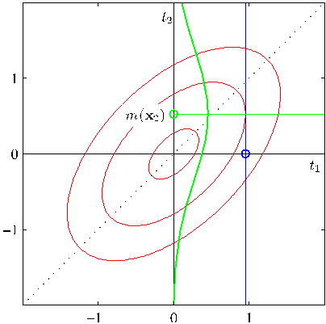

Figure 12.11 Probabilistic PCA visualization of a portion of the oil flow data set for the first 100 data points. The left-hand plot shows the posterior mean projections of the data points on the principal subspace. The right-hand plot is obtained by first randomly omitting 30% of the variable values and then using EM to handle the missing values. Note that each data point then has at least one missing measurement but that the plot is very similar to the one obtained without missing values.

subspace to minimize the squared reconstruction error in which the projections are given.

We can give a simple physical analogy for this EM algorithm, which is easily visualized for $D = 2$ and $M = 1$. Consider a collection of data points in two dimensions, and let the one-dimensional principal subspace be represented by a solid rod. Now attach each data point to the rod via a spring obeying Hooke’s law (so that the energy is proportional to the square of the spring’s length). In the E step, we keep the rod fixed and allow the attachment points to slide up and down the rod so as to minimize the energy. This causes each attachment point (independently) to position itself at the orthogonal projection of the corresponding data point onto the rod. In the M step, we keep the attachment points fixed and then release the rod and allow it to move to the minimum energy position. The E and M steps are then repeated until a suitable convergence criterion is satisfied, as is illustrated in Figure 12.12.

## 12.2.3 Bayesian PCA

So far in our discussion of PCA, we have assumed that the value $M$ for the dimensionality of the principal subspace is given. In practice, we must choose a suitable value according to the application. For visualization, we generally choose $M = 2$, whereas for other applications the appropriate choice for $M$ may be less clear. One approach is to plot the eigenvalue spectrum for the data set, analogous to the example in Figure 12.4 for the off-line digits data set, and look to see if the eigenvalues naturally form two groups comprising a set of small values separated by a significant gap from a set of relatively large values, indicating a natural choice for $M$. In practice, such a gap is often not seen.
[Page 601]

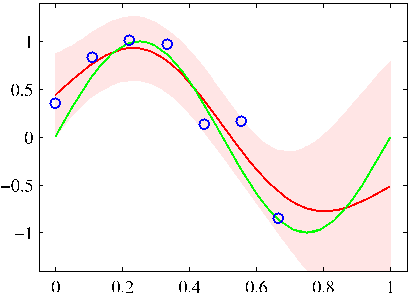

Figure 12.12 Synthetic data illustrating the EM algorithm for PCA defined by (12.58) and (12.59). (a) A data set $\mathbf{X}$ with the data points shown in green, together with the true principal components (shown as eigenvectors scaled by the square roots of the eigenvalues). (b) Initial configuration of the principal subspace defined by $\mathbf{W}$, shown in red, together with the projections of the latent points $\mathbf{Z}$ into the data space, given by $\mathbf{Z}\mathbf{W}^{\text{T}}$, shown in cyan. (c) After one M step, the latent space has been updated with $\mathbf{Z}$ held fixed. (d) After the successive E step, the values of $\mathbf{Z}$ have been updated, given by orthogonal projections, with $\mathbf{W}$ held fixed. (e) After the second M step. (f) After the second E step.

Because the probabilistic PCA model has a well-defined likelihood function, we could employ cross-validation to determine the value of dimensionality by selecting the largest log likelihood on a validation data set. Such an approach, however, can become computationally costly, particularly if we consider a probabilistic mixture of PCA models (Tipping and Bishop, 1999a) in which we seek to determine the appropriate dimensionality separately for each component in the mixture.

Given that we have a probabilistic formulation of PCA, it seems natural to seek a Bayesian approach to model selection. To do this, we need to marginalize out the model parameters $\boldsymbol{\mu}$, $\mathbf{W}$, and $\sigma^2$ with respect to appropriate prior distributions. This can be done by using a variational framework to approximate the analytically intractable marginalizations (Bishop, 1999b). The marginal likelihood values, given by the variational lower bound, can then be computed for a range of different values of $M$, and the value giving the largest marginal likelihood selected.

Here we consider a simpler approach introduced by Bishop (1999a) based on the evidence approximation, which is appropriate when the number of data points is relatively
[Page 602]

Figure 12.13 Probabilistic graphical model for Bayesian PCA in which the distribution over the parameter matrix $\mathbf{W}$ is governed by a vector $\boldsymbol{\alpha}$ of hyperparameters.

large and the corresponding posterior distribution is tightly peaked. It involves a specific choice of prior over $\mathbf{W}$ that allows surplus dimensions in the principal subspace to be pruned out of the model. This corresponds to an example of automatic relevance determination, or ARD, discussed in Section 7.2.2. Specifically, we define an independent Gaussian prior over each column of $\mathbf{W}$, which represent the vectors defining the principal subspace. Each such Gaussian has an independent variance governed by a precision hyperparameter $\alpha_i$ so that

$$
p(\mathbf{W}|\boldsymbol{\alpha}) = \prod_{i=1}^M \left(\frac{\alpha_i}{2\pi}\right)^{D/2} \exp\left\{ -\frac{1}{2} \alpha_i \mathbf{w}_i^{\text{T}} \mathbf{w}_i \right\} \tag{12.60}
$$

where $\mathbf{w}_i$ is the $i^{\text{th}}$ column of $\mathbf{W}$. The resulting model can be represented using the directed graph shown in Figure 12.13.

The values for $\alpha_i$ will be found iteratively by maximizing the marginal likelihood function in which $\mathbf{W}$ has been integrated out. As a result of this optimization, some of the $\alpha_i$ may be driven to infinity, with the corresponding parameters vector $\mathbf{w}_i$ being driven to zero (the posterior distribution becomes a delta function at the origin) giving a sparse solution. The effective dimensionality of the principal subspace is then determined by the number of finite $\alpha_i$ values, and the corresponding vectors $\mathbf{w}_i$ can be thought of as ‘relevant’ for modelling the data distribution. In this way, the Bayesian approach is automatically making the trade-off between improving the fit to the data, by using a larger number of vectors $\mathbf{w}_i$ with their corresponding eigenvalues $\lambda_i$ each tuned to the data, and reducing the complexity of the model by suppressing some of the $\mathbf{w}_i$ vectors. The origins of this sparsity were discussed earlier in the context of relevance vector machines.

The values of $\alpha_i$ are re-estimated during training by maximizing the log marginal likelihood given by

$$
p(\mathbf{X}|\boldsymbol{\alpha}, \boldsymbol{\mu}, \sigma^2) = \int p(\mathbf{X}|\mathbf{W}, \boldsymbol{\mu}, \sigma^2) p(\mathbf{W}|\boldsymbol{\alpha}) \, \text{d}\mathbf{W} \tag{12.61}
$$

where the log of $p(\mathbf{X}|\mathbf{W}, \boldsymbol{\mu}, \sigma^2)$ is given by (12.43). Note that for simplicity we also treat $\boldsymbol{\mu}$ and $\sigma^2$ as parameters to be estimated, rather than defining priors over these parameters.
[Page 603]

Because this integration is intractable, we make use of the Laplace approximation. If we assume that the posterior distribution is sharply peaked, as will occur for sufficiently large data sets, then the re-estimation equations obtained by maximizing the marginal likelihood with respect to $\alpha_i$ take the simple form

$$
\alpha_i^{\text{new}} = \frac{D}{\mathbf{w}_i^{\text{T}}\mathbf{w}_i} \tag{12.62}
$$

which follows from (3.98), noting that the dimensionality of $\mathbf{w}_i$ is $D$. These reestimations are interleaved with the EM algorithm updates for determining $\mathbf{W}$ and $\sigma^2$. The E-step equations are again given by (12.54) and (12.55). Similarly, the Mstep equation for $\sigma^2$ is again given by (12.57). The only change is to the M-step equation for $\mathbf{W}$, which is modified to give

$$
\mathbf{W}_{\text{new}} = \left[ \sum_{n=1}^N (\mathbf{x}_n - \bar{\mathbf{x}})\mathbb{E}[\mathbf{z}_n]^{\text{T}} \right] \left[ \sum_{n=1}^N \mathbb{E}[\mathbf{z}_n\mathbf{z}_n^{\text{T}}] + \sigma^2 \mathbf{A} \right]^{-1} \tag{12.63}
$$

where $\mathbf{A} = \text{diag}(\alpha_i)$. The value of $\boldsymbol{\mu}$ is given by the sample mean, as before.

If we choose $M = D - 1$ then, if all $\alpha_i$ values are finite, the model represents a full-covariance Gaussian, while if all the $\alpha_i$ go to infinity the model is equivalent to an isotropic Gaussian, and so the model can encompass all permissible values for the effective dimensionality of the principal subspace. It is also possible to consider smaller values of $M$, which will save on computational cost but which will limit the maximum dimensionality of the subspace. A comparison of the results of this algorithm with standard probabilistic PCA is shown in Figure 12.14.

Bayesian PCA provides an opportunity to illustrate the Gibbs sampling algorithm discussed in Section 11.3. Figure 12.15 shows an example of the samples from the hyperparameters $\ln \alpha_i$ for a data set in $D = 4$ dimensions in which the dimensionality of the latent space is $M = 3$ but in which the data set is generated from a probabilistic PCA model having one direction of high variance, with the remaining directions comprising low variance noise. This result shows clearly the presence of three distinct modes in the posterior distribution. At each step of the iteration, one of the hyperparameters has a small value and the remaining two have large values, so that two of the three latent variables are suppressed. During the course of the Gibbs sampling, the solution makes sharp transitions between the three modes.

The model described here involves a prior only over the matrix $\mathbf{W}$. A fully Bayesian treatment of PCA, including priors over $\boldsymbol{\mu}$, $\sigma^2$, and $\boldsymbol{\alpha}$, and solved using variational methods, is described in Bishop (1999b). For a discussion of various Bayesian approaches to determining the appropriate dimensionality for a PCA model, see Minka (2001c).

## 12.2.4 Factor analysis

Factor analysis is a linear-Gaussian latent variable model that is closely related to probabilistic PCA. Its definition differs from that of probabilistic PCA only in that the conditional distribution of the observed variable $\mathbf{x}$ given the latent variable $\mathbf{z}$ is
[Page 604]

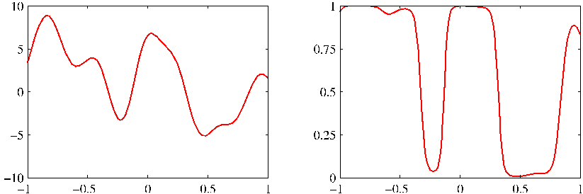

Figure 12.14 ‘Hinton’ diagrams of the matrix $\mathbf{W}$ in which each element of the matrix is depicted as a square (white for positive and black for negative values) whose area is proportional to the magnitude of that element. The synthetic data set comprises 300 data points in $D = 10$ dimensions sampled from a Gaussian distribution having standard deviation 1.0 in 3 directions and standard deviation 0.5 in the remaining 7 directions for a data set in $D = 10$ dimensions having $M = 3$ directions with larger variance than the remaining 7 directions. The left-hand plot shows the result from maximum likelihood probabilistic PCA, and the right-hand plot shows the corresponding result from Bayesian PCA. We see how the Bayesian model is able to discover the appropriate dimensionality by suppressing the 7 surplus degrees of freedom.

taken to have a diagonal rather than an isotropic covariance so that

$$
p(\mathbf{x}|\mathbf{z}) = \mathcal{N}(\mathbf{x}|\mathbf{W}\mathbf{z} + \boldsymbol{\mu}, \mathbf{\Psi}) \tag{12.64}
$$

where $\mathbf{\Psi}$ is a $D \times D$ diagonal matrix. Note that the factor analysis model, in common with probabilistic PCA, assumes that the observed variables $x_1, \dots, x_D$ are independent, given the latent variable $\mathbf{z}$. In essence, the factor analysis model is explaining the observed covariance structure of the data by representing the independent variance associated with each coordinate in the matrix $\mathbf{\Psi}$, and capturing the covariance between variables in the matrix $\mathbf{W}$. In the factor analysis literature, the columns of $\mathbf{W}$, which capture the correlations between observed variables, are called factor loadings, and the diagonal elements of $\mathbf{\Psi}$, which represent the independent noise variances for each of the variables, are called uniquenesses.

The origins of factor analysis are as old as those of PCA, and discussions of factor analysis can be found in the books by Everitt (1984), Bartholomew (1987), and Basilevsky (1994). Links between factor analysis and PCA were investigated by Lawley (1953) and Anderson (1963) who showed that at stationary points of the likelihood function, for a factor analysis model with $\mathbf{\Psi} = \sigma^2\mathbf{I}$, the columns of $\mathbf{W}$ are scaled eigenvectors of the sample covariance matrix, and $\sigma^2$ is the average of the discarded eigenvalues. Later, Tipping and Bishop (1999b) showed that the maximum of the log likelihood function occurs when the eigenvectors comprising $\mathbf{W}$ are chosen to be the principal eigenvectors.

Making use of (2.115), we see that the marginal distribution for the observed
[Page 605]

Figure 12.15 Gibbs sampling for Bayesian PCA showing plots of $\ln \alpha_i$ versus iteration number for three $\alpha$ values, showing transitions between the three modes of the posterior distribution.

variable is given by $p(\mathbf{x}) = \mathcal{N}(\mathbf{x}|\boldsymbol{\mu}, \mathbf{C})$ where now

$$
\mathbf{C} = \mathbf{W}\mathbf{W}^{\text{T}} + \mathbf{\Psi}. \tag{12.65}
$$

As with probabilistic PCA, this model is invariant to rotations in the latent space.

Historically, factor analysis has been the subject of controversy when attempts have been made to place an interpretation on the individual factors (the coordinates in $\mathbf{z}$-space), which has proven problematic due to the nonidentifiability of factor analysis associated with rotations in this space. From our perspective, however, we shall view factor analysis as a form of latent variable density model, in which the form of the latent space is of interest but not the particular choice of coordinates used to describe it. If we wish to remove the degeneracy associated with latent space rotations, we must consider non-Gaussian latent variable distributions, giving rise to independent component analysis (ICA) models.

We can determine the parameters $\boldsymbol{\mu}$, $\mathbf{W}$, and $\mathbf{\Psi}$ in the factor analysis model by maximum likelihood. The solution for $\boldsymbol{\mu}$ is again given by the sample mean. However, unlike probabilistic PCA, there is no longer a closed-form maximum likelihood solution for $\mathbf{W}$, which must therefore be found iteratively. Because factor analysis is a latent variable model, this can be done using an EM algorithm (Rubin and Thayer, 1982) that is analogous to the one used for probabilistic PCA. Specifically, the E-step equations are given by

$$
\mathbb{E}[\mathbf{z}_n] = \mathbf{G}\mathbf{W}^{\text{T}}\mathbf{\Psi}^{-1}(\mathbf{x}_n - \bar{\mathbf{x}}) \tag{12.66}
$$

$$
\mathbb{E}[\mathbf{z}_n\mathbf{z}_n^{\text{T}}] = \mathbf{G} + \mathbb{E}[\mathbf{z}_n]\mathbb{E}[\mathbf{z}_n]^{\text{T}} \tag{12.67}
$$

where we have defined

$$
\mathbf{G} = (\mathbf{I} + \mathbf{W}^{\text{T}}\mathbf{\Psi}^{-1}\mathbf{W})^{-1}. \tag{12.68}
$$

Note that this is expressed in a form that involves inversion of matrices of size $M \times M$ rather than $D \times D$ (except for the $D \times D$ diagonal matrix $\mathbf{\Psi}$ whose inverse is trivial
[Page 606]

to compute in $O(D)$ steps), which is convenient because often $M \ll D$. Similarly, the M-step equations take the form

$$
\mathbf{W}_{\text{new}} = \left[ \sum_{n=1}^N (\mathbf{x}_n - \bar{\mathbf{x}})\mathbb{E}[\mathbf{z}_n]^{\text{T}} \right] \left[ \sum_{n=1}^N \mathbb{E}[\mathbf{z}_n\mathbf{z}_n^{\text{T}}] \right]^{-1} \tag{12.69}
$$

$$
\mathbf{\Psi}_{\text{new}} = \text{diag}\left\{ \mathbf{S} - \mathbf{W}_{\text{new}} \frac{1}{N} \sum_{n=1}^N \mathbb{E}[\mathbf{z}_n](\mathbf{x}_n - \bar{\mathbf{x}})^{\text{T}} \right\} \tag{12.70}
$$

where the ‘diag’ operator sets all of the nondiagonal elements of a matrix to zero. A Bayesian treatment of the factor analysis model can be obtained by a straightforward application of the techniques discussed in this book.

Another difference between probabilistic PCA and factor analysis concerns their different behaviour under transformations of the data set. For PCA and probabilistic PCA, if we rotate the coordinate system in data space, then we obtain exactly the same fit to the data but with the $\mathbf{W}$ matrix transformed by the corresponding rotation matrix. However, for factor analysis, the analogous property is that if we make a component-wise re-scaling of the data vectors, then this is absorbed into a corresponding re-scaling of the elements of $\mathbf{\Psi}$.

## 12.3. Kernel PCA

In Chapter 6, we saw how the technique of kernel substitution allows us to take an algorithm expressed in terms of scalar products of the form $\mathbf{x}^{\text{T}}\mathbf{x}'$ and generalize that algorithm by replacing the scalar products with a nonlinear kernel. Here we apply this technique of kernel substitution to principal component analysis, thereby obtaining a nonlinear generalization called kernel PCA (Schölkopf et al., 1998).

Consider a data set $\{\mathbf{x}_n\}$ of observations, where $n = 1, \dots, N$, in a space of dimensionality $D$. In order to keep the notation uncluttered, we shall assume that we have already subtracted the sample mean from each of the vectors $\mathbf{x}_n$, so that $\sum_n \mathbf{x}_n = \mathbf{0}$. The first step is to express conventional PCA in such a form that the data vectors $\{\mathbf{x}_n\}$ appear only in the form of the scalar products $\mathbf{x}_n^{\text{T}}\mathbf{x}_m$. Recall that the principal components are defined by the eigenvectors $\mathbf{u}_i$ of the covariance matrix

$$
\mathbf{S}\mathbf{u}_i = \lambda_i\mathbf{u}_i \tag{12.71}
$$

where $i = 1, \dots, D$. Here the $D \times D$ sample covariance matrix $\mathbf{S}$ is defined by

$$
\mathbf{S} = \frac{1}{N} \sum_{n=1}^N \mathbf{x}_n\mathbf{x}_n^{\text{T}}, \tag{12.72}
$$

and the eigenvectors are normalized such that $\mathbf{u}_i^{\text{T}}\mathbf{u}_i = 1$.

Now consider a nonlinear transformation $\phi(\mathbf{x})$ into an $M$-dimensional feature space, so that each data point $\mathbf{x}_n$ is thereby projected onto a point $\phi(\mathbf{x}_n)$. We can
[Page 607]

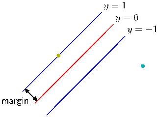

Figure 12.16 Schematic illustration of kernel PCA. A data set in the original data space (left-hand plot) is projected by a nonlinear transformation $\phi(\mathbf{x})$ into a feature space (right-hand plot). By performing PCA in the feature space, we obtain the principal components, of which the first is shown by the blue line. The green lines in feature space indicate the linear projections onto the first principal component, which correspond to nonlinear projections in the original data space. Note that in general it is not possible to represent the linear principal component in feature space by a corresponding line in data space.

now perform standard PCA in the feature space, which implicitly defines a nonlinear principal component model in the original data space, as is illustrated in Figure 12.16.

For the moment, let us assume that the projected data set also has zero mean, so that $\sum_n \phi(\mathbf{x}_n) = \mathbf{0}$. We shall return to this point shortly. The $M \times M$ sample covariance matrix in feature space is given by

$$
\mathbf{C} = \frac{1}{N} \sum_{n=1}^N \phi(\mathbf{x}_n)\phi(\mathbf{x}_n)^{\text{T}} \tag{12.73}
$$

and its eigenvector expansion is defined by

$$
\mathbf{C}\mathbf{v}_i = \lambda_i\mathbf{v}_i \tag{12.74}
$$

$i = 1, \dots, M$. Our goal is to solve this eigenvalue problem without having to work explicitly in the feature space. From the definition of $\mathbf{C}$, the eigenvector equations tell us that $\mathbf{v}_i$ satisfies

$$
\frac{1}{N} \sum_{n=1}^N \phi(\mathbf{x}_n)\{\phi(\mathbf{x}_n)^{\text{T}}\mathbf{v}_i\} = \lambda_i\mathbf{v}_i \tag{12.75}
$$

and so we see that (provided $\lambda_i > 0$) the vector $\mathbf{v}_i$ is given by a linear combination of the $\phi(\mathbf{x}_n)$ and so can be written in the form

$$
\mathbf{v}_i = \sum_{n=1}^N a_{in}\phi(\mathbf{x}_n). \tag{12.76}
$$

[Page 608]

Substituting this expansion back into the eigenvector equation, we obtain

$$
\frac{1}{N} \sum_{n=1}^N \phi(\mathbf{x}_n)\phi(\mathbf{x}_n)^{\text{T}} \sum_{m=1}^N a_{im}\phi(\mathbf{x}_m) = \lambda_i \sum_{n=1}^N a_{in}\phi(\mathbf{x}_n). \tag{12.77}
$$

The key step is now to express this in terms of the kernel function $k(\mathbf{x}_n, \mathbf{x}_m) = \phi(\mathbf{x}_n)^{\text{T}}\phi(\mathbf{x}_m)$, which we do by multiplying both sides by $\phi(\mathbf{x}_l)^{\text{T}}$ to give

$$
\frac{1}{N} \sum_{n=1}^N k(\mathbf{x}_l, \mathbf{x}_n) \sum_{m=1}^N a_{im}k(\mathbf{x}_n, \mathbf{x}_m) = \lambda_i \sum_{n=1}^N a_{in}k(\mathbf{x}_l, \mathbf{x}_n). \tag{12.78}
$$

This can be written in matrix notation as

$$
\mathbf{K}^2\mathbf{a}_i = \lambda_i N \mathbf{K} \mathbf{a}_i \tag{12.79}
$$

where $\mathbf{a}_i$ is an $N$-dimensional column vector with elements $a_{in}$ for $n = 1, \dots, N$. We can find solutions for $\mathbf{a}_i$ by solving the following eigenvalue problem

$$
\mathbf{K}\mathbf{a}_i = \lambda_i N \mathbf{a}_i \tag{12.80}
$$

in which we have removed a factor of $\mathbf{K}$ from both sides of (12.79). Note that the solutions of (12.79) and (12.80) differ only by eigenvectors of $\mathbf{K}$ having zero eigenvalues that do not affect the principal components projection.

The normalization condition for the coefficients $a_{in}$ is obtained by requiring that the eigenvectors in feature space be normalized. Using (12.76) and (12.80), we have

$$
1 = \mathbf{v}_i^{\text{T}}\mathbf{v}_i = \sum_{n=1}^N \sum_{m=1}^N a_{in}a_{im}\phi(\mathbf{x}_n)^{\text{T}}\phi(\mathbf{x}_m) = \mathbf{a}_i^{\text{T}}\mathbf{K}\mathbf{a}_i = \lambda_i N \mathbf{a}_i^{\text{T}}\mathbf{a}_i. \tag{12.81}
$$

Having solved the eigenvector problem, the resulting principal component projections can then also be cast in terms of the kernel function so that, using (12.76), the projection of a point $\mathbf{x}$ onto eigenvector $i$ is given by

$$
y_i(\mathbf{x}) = \phi(\mathbf{x})^{\text{T}}\mathbf{v}_i = \sum_{n=1}^N a_{in}\phi(\mathbf{x})^{\text{T}}\phi(\mathbf{x}_n) = \sum_{n=1}^N a_{in}k(\mathbf{x}, \mathbf{x}_n) \tag{12.82}
$$

and so again is expressed in terms of the kernel function.

In the original $D$-dimensional $\mathbf{x}$ space there are $D$ orthogonal eigenvectors and hence we can find at most $D$ linear principal components. The dimensionality $M$ of the feature space, however, can be much larger than $D$ (even infinite), and thus we can find a number of nonlinear principal components that can exceed $D$. Note, however, that the number of nonzero eigenvalues cannot exceed the number $N$ of data points, because (even if $M > N$) the covariance matrix in feature space has rank at most equal to $N$. This is reflected in the fact that kernel PCA involves the eigenvector expansion of the $N \times N$ matrix $\mathbf{K}$.
[Page 609]

So far we have assumed that the projected data set given by $\phi(\mathbf{x}_n)$ has zero mean, which in general will not be the case. We cannot simply compute and then subtract off the mean, since we wish to avoid working directly in feature space, and so again, we formulate the algorithm purely in terms of the kernel function. The projected data points after centralizing, denoted $\widetilde{\phi}(\mathbf{x}_n)$, are given by

$$
\widetilde{\phi}(\mathbf{x}_n) = \phi(\mathbf{x}_n) - \frac{1}{N} \sum_{l=1}^N \phi(\mathbf{x}_l) \tag{12.83}
$$

and the corresponding elements of the Gram matrix are given by

$$
\begin{aligned}
\widetilde{\mathbf{K}}_{nm} &= \widetilde{\phi}(\mathbf{x}_n)^{\text{T}}\widetilde{\phi}(\mathbf{x}_m) \\
&= \phi(\mathbf{x}_n)^{\text{T}}\phi(\mathbf{x}_m) - \frac{1}{N} \sum_{l=1}^N \phi(\mathbf{x}_n)^{\text{T}}\phi(\mathbf{x}_l) \\
&\quad - \frac{1}{N} \sum_{l=1}^N \phi(\mathbf{x}_l)^{\text{T}}\phi(\mathbf{x}_m) + \frac{1}{N^2} \sum_{j=1}^N \sum_{l=1}^N \phi(\mathbf{x}_j)^{\text{T}}\phi(\mathbf{x}_l) \\
&= k(\mathbf{x}_n, \mathbf{x}_m) - \frac{1}{N} \sum_{l=1}^N k(\mathbf{x}_l, \mathbf{x}_m) \\
&\quad - \frac{1}{N} \sum_{l=1}^N k(\mathbf{x}_n, \mathbf{x}_l) + \frac{1}{N^2} \sum_{j=1}^N \sum_{l=1}^N k(\mathbf{x}_j, \mathbf{x}_l). \tag{12.84}
\end{aligned}
$$

This can be expressed in matrix notation as

$$
\widetilde{\mathbf{K}} = \mathbf{K} - \mathbf{1}_N\mathbf{K} - \mathbf{K}\mathbf{1}_N + \mathbf{1}_N\mathbf{K}\mathbf{1}_N \tag{12.85}
$$

where $\mathbf{1}_N$ denotes the $N \times N$ matrix in which every element takes the value $1/N$.

Thus we can evaluate $\widetilde{\mathbf{K}}$ using only the kernel function and then use $\widetilde{\mathbf{K}}$ to determine the eigenvalues and eigenvectors. Note that the standard PCA algorithm is recovered as a special case if we use a linear kernel $k(\mathbf{x}, \mathbf{x}') = \mathbf{x}^{\text{T}}\mathbf{x}'$. Figure 12.17 shows an example of kernel PCA applied to a synthetic data set (Schölkopf et al., 1998). Here a ‘Gaussian’ kernel of the form

$$
k(\mathbf{x}, \mathbf{x}') = \exp(-\|\mathbf{x} - \mathbf{x}'\|^2/0.1) \tag{12.86}
$$

is applied to a synthetic data set. The lines correspond to contours along which the projection onto the corresponding principal component, defined by

$$
\phi(\mathbf{x})^{\text{T}}\mathbf{v}_i = \sum_{n=1}^N a_{in}k(\mathbf{x}, \mathbf{x}_n) \tag{12.87}
$$

is constant.
[Page 610]

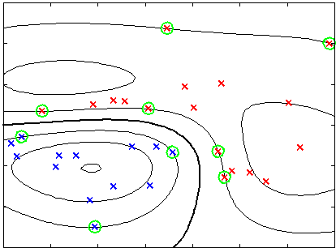

Figure 12.17 Example of kernel PCA, with a Gaussian kernel applied to a synthetic data set in two dimensions, showing the first eight eigenfunctions along with their eigenvalues. The contours are lines along which the projection onto the corresponding principal component is constant. Note how the first two eigenfunctions separate the three clusters, the next three eigenfunctions split each of the clusters into halves, and the following three eigenfunctions again split the clusters into halves along directions orthogonal to the previous splits.

One obvious disadvantage of kernel PCA is that it involves finding the eigenvectors of the $N \times N$ matrix $\widetilde{\mathbf{K}}$ rather than the $D \times D$ matrix $\mathbf{S}$ of conventional linear PCA, and so in practice for large data sets approximations are often used.

Finally, we note that in standard linear PCA, we often retain some reduced number $L < D$ of eigenvectors and then approximate a data vector $\mathbf{x}_n$ by its projection $\widehat{\mathbf{x}}_n$ onto the $L$-dimensional principal subspace, defined by

$$
\widehat{\mathbf{x}}_n = \sum_{i=1}^L (\mathbf{x}_n^{\text{T}}\mathbf{u}_i)\mathbf{u}_i. \tag{12.88}
$$

In kernel PCA, this will in general not be possible. To see this, note that the mapping $\phi(\mathbf{x})$ maps the $D$-dimensional $\mathbf{x}$ space into a $D$-dimensional manifold in the $M$-dimensional feature space. The vector $\mathbf{x}$ is known as the pre-image of the corresponding point $\phi(\mathbf{x})$. However, the projection of points in feature space onto the linear PCA subspace in that space will typically not lie on the nonlinear $D$dimensional manifold and so will not have a corresponding pre-image in data space. Techniques have therefore been proposed for finding approximate pre-images (Bakir et al., 2004).
[Page 611]

## 12.4. Nonlinear Latent Variable Models

In this chapter, we have focussed on the simplest class of models having continuous latent variables, namely those based on linear-Gaussian distributions. As well as having great practical importance, these models are relatively easy to analyse and to fit to data and can also be used as components in more complex models. Here we consider briefly some generalizations of this framework to models that are either nonlinear or non-Gaussian, or both.

In fact, the issues of nonlinearity and non-Gaussianity are related because a general probability density can be obtained from a simple fixed reference density, such as a Gaussian, by making a nonlinear change of variables. This idea forms the basis of several practical latent variable models as we shall see shortly.

## 12.4.1 Independent component analysis

We begin by considering models in which the observed variables are related linearly to the latent variables, but for which the latent distribution is non-Gaussian. An important class of such models, known as independent component analysis, or ICA, arises when we consider a distribution over the latent variables that factorizes, so that

$$
p(\mathbf{z}) = \prod_{j=1}^M p(z_j). \tag{12.89}
$$

To understand the role of such models, consider a situation in which two people are talking at the same time, and we record their voices using two microphones. If we ignore effects such as time delay and echoes, then the signals received by the microphones at any point in time will be given by linear combinations of the amplitudes of the two voices. The coefficients of this linear combination will be constant, and if we can infer their values from sample data, then we can invert the mixing process (assuming it is nonsingular) and thereby obtain two clean signals each of which contains the voice of just one person. This is an example of a problem called blind source separation in which ‘blind’ refers to the fact that we are given only the mixed data, and neither the original sources nor the mixing coefficients are observed (Cardoso, 1998).

This type of problem is sometimes addressed using the following approach (MacKay, 2003) in which we ignore the temporal nature of the signals and treat the successive samples as i.i.d. We consider a generative model in which there are two latent variables corresponding to the unobserved speech signal amplitudes, and there are two observed variables given by the signal values at the microphones. The latent variables have a joint distribution that factorizes as above, and the observed variables are given by a linear combination of the latent variables. There is no need to include a noise distribution because the number of latent variables equals the number of observed variables, and therefore the marginal distribution of the observed variables will not in general be singular, so the observed variables are simply deterministic linear combinations of the latent variables. Given a data set of observations, the
[Page 612]

likelihood function for this model is a function of the coefficients in the linear combination. The log likelihood can be maximized using gradient-based optimization giving rise to a particular version of independent component analysis.

The success of this approach requires that the latent variables have non-Gaussian distributions. To see this, recall that in probabilistic PCA (and in factor analysis) the latent-space distribution is given by a zero-mean isotropic Gaussian. The model therefore cannot distinguish between two different choices for the latent variables where these differ simply by a rotation in latent space. This can be verified directly by noting that the marginal density (12.35), and hence the likelihood function, is unchanged if we make the transformation $\mathbf{W} \to \mathbf{W}\mathbf{R}$ where $\mathbf{R}$ is an orthogonal matrix satisfying $\mathbf{R}\mathbf{R}^{\text{T}} = \mathbf{I}$, because the matrix $\mathbf{C}$ given by (12.36) is itself invariant. Extending the model to allow more general Gaussian latent distributions does not change this conclusion because, as we have seen, such a model is equivalent to the zero-mean isotropic Gaussian latent variable model.

Another way to see why a Gaussian latent variable distribution in a linear model is insufficient to find independent components is to note that the principal components represent a rotation of the coordinate system in data space such as to diagonalize the covariance matrix, so that the data distribution in the new coordinates is then uncorrelated. Although zero correlation is a necessary condition for independence it is not, however, sufficient. In practice, a common choice for the latent-variable distribution is given by

$$
p(z_j) = \frac{1}{\pi \cosh(z_j)} \tag{12.90}
$$

which has heavy tails compared to a Gaussian, reflecting the observation that many real-world distributions also exhibit this property.

The original ICA model (Bell and Sejnowski, 1995) was based on the optimization of an objective function defined by information maximization. One advantage of a probabilistic latent variable formulation is that it helps to motivate and formulate generalizations of basic ICA. For instance, independent factor analysis (Attias, 1999a) considers a model in which the number of latent and observed variables can differ, the observed variables are noisy, and the individual latent variables have flexible distributions modelled by mixtures of Gaussians. The log likelihood for this model is maximized using EM, and the reconstruction of the latent variables is approximated using a variational approach. Many other types of model have been considered, and there is now a huge literature on ICA and its applications (Jutten and Herault, 1991; Comon et al., 1991; Amari et al., 1996; Pearlmutter and Parra, 1997; Hyvärinen and Oja, 1997; Hinton et al., 2001; Miskin and MacKay, 2001; Højen-Sørensen et al., 2002; Choudrey and Roberts, 2003; Chan et al., 2003; Stone, 2004).

## 12.4.2 Autoassociative neural networks

In Chapter 5 we considered neural networks in the context of supervised learning, where the role of the network is to predict the output variables given values
[Page 613]

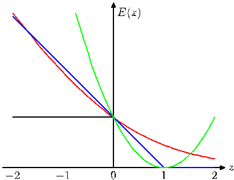

Figure 12.18 An autoassociative multilayer perceptron having two layers of weights. Such a network is trained to map input vectors onto themselves by minimization of a sum-of-squares error. Even with nonlinear units in the hidden layer, such a network is equivalent to linear principal component analysis. Links representing bias parameters have been omitted for clarity.

for the input variables. However, neural networks have also been applied to unsupervised learning where they have been used for dimensionality reduction. This is achieved by using a network having the same number of outputs as inputs, and optimizing the weights so as to minimize some measure of the reconstruction error between inputs and outputs with respect to a set of training data.

Consider first a multilayer perceptron of the form shown in Figure 12.18, having $D$ inputs, $D$ output units and $M$ hidden units, with $M < D$. The targets used to train the network are simply the input vectors themselves, so that the network is attempting to map each input vector onto itself. Such a network is said to form an autoassociative mapping. Since the number of hidden units is smaller than the number of inputs, a perfect reconstruction of all input vectors is not in general possible. We therefore determine the network parameters $\mathbf{w}$ by minimizing an error function which captures the degree of mismatch between the input vectors and their reconstructions. In particular, we shall choose a sum-of-squares error of the form

$$
E(\mathbf{w}) = \frac{1}{2}\sum_{n=1}^N \|\mathbf{y}(\mathbf{x}_n, \mathbf{w}) - \mathbf{x}_n\|^2. \tag{12.91}
$$

If the hidden units have linear activations functions, then it can be shown that the error function has a unique global minimum, and that at this minimum the network performs a projection onto the $M$-dimensional subspace which is spanned by the first $M$ principal components of the data (Bourlard and Kamp, 1988; Baldi and Hornik, 1989). Thus, the vectors of weights which lead into the hidden units in Figure 12.18 form a basis set which spans the principal subspace. Note, however, that these vectors need not be orthogonal or normalized. This result is unsurprising, since both principal component analysis and the neural network are using linear dimensionality reduction and are minimizing the same sum-of-squares error function.

It might be thought that the limitations of a linear dimensionality reduction could be overcome by using nonlinear (sigmoidal) activation functions for the hidden units in the network in Figure 12.18. However, even with nonlinear hidden units, the minimum error solution is again given by the projection onto the principal component subspace (Bourlard and Kamp, 1988). There is therefore no advantage in using twolayer neural networks to perform dimensionality reduction. Standard techniques for principal component analysis (based on singular value decomposition) are guaranteed to give the correct solution in finite time, and they also generate an ordered set of eigenvalues with corresponding orthonormal eigenvectors.
[Page 614]

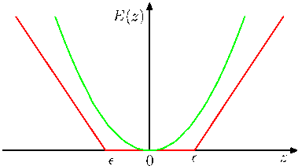

Figure 12.19 Addition of extra hidden layers of nonlinear units gives an autoassociative network which can perform a nonlinear dimensionality reduction.

The situation is different, however, if additional hidden layers are permitted in the network. Consider the four-layer autoassociative network shown in Figure 12.19. Again the output units are linear, and the $M$ units in the second hidden layer can also be linear, however, the first and third hidden layers have sigmoidal nonlinear activation functions. The network is again trained by minimization of the error function (12.91). We can view this network as two successive functional mappings $F_1$ and $F_2$, as indicated in Figure 12.19. The first mapping $F_1$ projects the original $D$-dimensional data onto an $M$-dimensional subspace $S$ defined by the activations of the units in the second hidden layer. Because of the presence of the first hidden layer of nonlinear units, this mapping is very general, and in particular is not restricted to being linear. Similarly, the second half of the network defines an arbitrary functional mapping from the $M$-dimensional space back into the original $D$-dimensional input space. This has a simple geometrical interpretation, as indicated for the case $D = 3$ and $M = 2$ in Figure 12.20.

Such a network effectively performs a nonlinear principal component analysis.

Figure 12.20 Geometrical interpretation of the mappings performed by the network in Figure 12.19 for the case of $D = 3$ inputs and $M = 2$ units in the middle hidden layer. The function $F_1$ maps from an $M$-dimensional space $S$ into a $D$-dimensional space and therefore defines the way in which the space $S$ is embedded within the original $\mathbf{x}$-space. Since the mapping $F_1$ can be nonlinear, the embedding of $S$ can be nonplanar, as indicated in the figure. The mapping $F_2$ then defines a projection of points in the original $D$-dimensional space into the $M$-dimensional subspace $S$.
[Page 615]

It has the advantage of not being limited to linear transformations, although it contains standard principal component analysis as a special case. However, training the network now involves a nonlinear optimization problem, since the error function (12.91) is no longer a quadratic function of the network parameters. Computationally intensive nonlinear optimization techniques must be used, and there is the risk of finding a suboptimal local minimum of the error function. Also, the dimensionality of the subspace must be specified before training the network.

## 12.4.3 Modelling nonlinear manifolds

As we have already noted, many natural sources of data correspond to lowdimensional, possibly noisy, nonlinear manifolds embedded within the higher dimensional observed data space. Capturing this property explicitly can lead to improved density modelling compared with more general methods. Here we consider briefly a range of techniques that attempt to do this.

One way to model the nonlinear structure is through a combination of linear models, so that we make a piece-wise linear approximation to the manifold. This can be obtained, for instance, by using a clustering technique such as $K$-means based on Euclidean distance to partition the data set into local groups with standard PCA applied to each group. A better approach is to use the reconstruction error for cluster assignment (Kambhatla and Leen, 1997; Hinton et al., 1997) as then a common cost function is being optimized in each stage. However, these approaches still suffer from limitations due to the absence of an overall density model. By using probabilistic PCA it is straightforward to define a fully probabilistic model simply by considering a mixture distribution in which the components are probabilistic PCA models (Tipping and Bishop, 1999a). Such a model has both discrete latent variables, corresponding to the discrete mixture, as well as continuous latent variables, and the likelihood function can be maximized using the EM algorithm. A fully Bayesian treatment, based on variational inference (Bishop and Winn, 2000), allows the number of components in the mixture, as well as the effective dimensionalities of the individual models, to be inferred from the data. There are many variants of this model in which parameters such as the $\mathbf{W}$ matrix or the noise variances are tied across components in the mixture, or in which the isotropic noise distributions are replaced by diagonal ones, giving rise to a mixture of factor analysers (Ghahramani and Hinton, 1996a; Ghahramani and Beal, 2000). The mixture of probabilistic PCA models can also be extended hierarchically to produce an interactive data visualization algorithm (Bishop and Tipping, 1998).

An alternative to considering a mixture of linear models is to consider a single nonlinear model. Recall that conventional PCA finds a linear subspace that passes close to the data in a least-squares sense. This concept can be extended to onedimensional nonlinear surfaces in the form of principal curves (Hastie and Stuetzle, 1989). We can describe a curve in a $D$-dimensional data space using a vector-valued function $\mathbf{f}(\lambda)$, which is a vector each of whose elements is a function of the scalar $\lambda$. There are many possible ways to parameterize the curve, of which a natural choice is the arc length along the curve. For any given point $\mathbf{x}$ in data space, we can find the point on the curve that is closest in Euclidean distance. We denote this point by
[Page 616]

$\lambda = g_f(\mathbf{x})$ because it depends on the particular curve $\mathbf{f}(\lambda)$. For a continuous data density $p(\mathbf{x})$, a principal curve is defined as one for which every point on the curve is the mean of all those points in data space that project to it, so that

$$
\mathbb{E}[\mathbf{x}|g_f(\mathbf{x}) = \lambda] = \mathbf{f}(\lambda). \tag{12.92}
$$

For a given continuous density, there can be many principal curves. In practice, we are interested in finite data sets, and we also wish to restrict attention to smooth curves. Hastie and Stuetzle (1989) propose a two-stage iterative procedure for finding such principal curves, somewhat reminiscent of the EM algorithm for PCA. The curve is initialized using the first principal component, and then the algorithm alternates between a data projection step and curve re-estimation step. In the projection step, each data point is assigned to a value of $\lambda$ corresponding to the closest point on the curve. Then in the re-estimation step, each point on the curve is given by a weighted average of those points that project to nearby points on the curve, with points closest on the curve given the greatest weight. In the case where the subspace is constrained to be linear, the procedure converges to the first principal component and is equivalent to the power method for finding the largest eigenvector of the covariance matrix. Principal curves can be generalized to multidimensional manifolds called principal surfaces although these have found limited use due to the difficulty of data smoothing in higher dimensions even for two-dimensional manifolds.

PCA is often used to project a data set onto a lower-dimensional space, for example two dimensional, for the purposes of visualization. Another linear technique with a similar aim is multidimensional scaling, or MDS (Cox and Cox, 2000). It finds a low-dimensional projection of the data such as to preserve, as closely as possible, the pairwise distances between data points, and involves finding the eigenvectors of the distance matrix. In the case where the distances are Euclidean, it gives equivalent results to PCA. The MDS concept can be extended to a wide variety of data types specified in terms of a similarity matrix, giving nonmetric MDS.

Two other nonprobabilistic methods for dimensionality reduction and data visualization are worthy of mention. Locally linear embedding, or LLE (Roweis and Saul, 2000) first computes the set of coefficients that best reconstructs each data point from its neighbours. These coefficients are arranged to be invariant to rotations, translations, and scalings of that data point and its neighbours, and hence they characterize the local geometrical properties of the neighbourhood. LLE then maps the high-dimensional data points down to a lower dimensional space while preserving these neighbourhood coefficients. If the local neighbourhood for a particular data point can be considered linear, then the transformation can be achieved using a combination of translation, rotation, and scaling, such as to preserve the angles formed between the data points and their neighbours. Because the weights are invariant to these transformations, we expect the same weight values to reconstruct the data points in the low-dimensional space as in the high-dimensional data space. In spite of the nonlinearity, the optimization for LLE does not exhibit local minima.

In isometric feature mapping, or isomap (Tenenbaum et al., 2000), the goal is to project the data to a lower-dimensional space using MDS, but where the dissimilarities are defined in terms of the geodesic distances measured along the mani-
[Page 617]

fold. For instance, if two points lie on a circle, then the geodesic is the arc-length distance measured around the circumference of the circle not the straight line distance measured along the chord connecting them. The algorithm first defines the neighbourhood for each data point, either by finding the $K$ nearest neighbours or by finding all points within a sphere of radius $\epsilon$. A graph is then constructed by linking all neighbouring points and labelling them with their Euclidean distance. The geodesic distance between any pair of points is then approximated by the sum of the arc lengths along the shortest path connecting them (which itself is found using standard algorithms). Finally, metric MDS is applied to the geodesic distance matrix to find the low-dimensional projection.

Our focus in this chapter has been on models for which the observed variables are continuous. We can also consider models having continuous latent variables together with discrete observed variables, giving rise to latent trait models (Bartholomew, 1987). In this case, the marginalization over the continuous latent variables, even for a linear relationship between latent and observed variables, cannot be performed analytically, and so more sophisticated techniques are required. Tipping (1999) uses variational inference in a model with a two-dimensional latent space, allowing a binary data set to be visualized analogously to the use of PCA to visualize continuous data. Note that this model is the dual of the Bayesian logistic regression problem discussed in Section 4.5. In the case of logistic regression we have $N$ observations of the feature vector $\boldsymbol{\phi}_n$ which are parameterized by a single parameter vector $\mathbf{w}$, whereas in the latent space visualization model there is a single latent space variable $\mathbf{x}$ (analogous to $\boldsymbol{\phi}$) and $N$ copies of the latent variable $\mathbf{w}_n$. A generalization of probabilistic latent variable models to general exponential family distributions is described in Collins et al. (2002).

We have already noted that an arbitrary distribution can be formed by taking a Gaussian random variable and transforming it through a suitable nonlinearity. This is exploited in a general latent variable model called a density network (MacKay, 1995; MacKay and Gibbs, 1999) in which the nonlinear function is governed by a multilayered neural network. If the network has enough hidden units, it can approximate a given nonlinear function to any desired accuracy. The downside of having such a flexible model is that the marginalization over the latent variables, required in order to obtain the likelihood function, is no longer analytically tractable. Instead, the likelihood is approximated using Monte Carlo techniques by drawing samples from the Gaussian prior. The marginalization over the latent variables then becomes a simple sum with one term for each sample. However, because a large number of sample points may be required in order to give an accurate representation of the marginal, this procedure can be computationally costly.

If we consider more restricted forms for the nonlinear function, and make an appropriate choice of the latent variable distribution, then we can construct a latent variable model that is both nonlinear and efficient to train. The generative topographic mapping, or GTM (Bishop et al., 1996; Bishop et al., 1997a; Bishop et al., 1998b) uses a latent distribution that is defined by a finite regular grid of delta functions over the (typically two-dimensional) latent space. Marginalization over the latent space then simply involves summing over the contributions from each of the grid locations.
[Page 618]

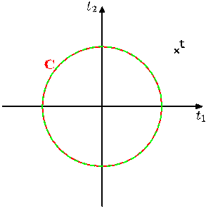

Figure 12.21 Plot of the oil flow data set visualized using PCA on the left and GTM on the right. For the GTM model, each data point is plotted at the mean of its posterior distribution in latent space. The nonlinearity in the GTM model allows the separation between the groups of data points to be seen more clearly.

The nonlinear mapping is given by a linear regression model that allows for general nonlinearity while being a linear function of the adaptive parameters. Note that the usual limitation of linear regression models arising from the curse of dimensionality does not arise in the context of the GTM since the manifold generally has two dimensions irrespective of the dimensionality of the data space. A consequence of these two choices is that the likelihood function can be expressed analytically in closed form and can be optimized efficiently using the EM algorithm. The resulting GTM model fits a two-dimensional nonlinear manifold to the data set, and by evaluating the posterior distribution over latent space for the data points, they can be projected back to the latent space for visualization purposes. Figure 12.21 shows a comparison of the oil data set visualized with linear PCA and with the nonlinear GTM.

The GTM can be seen as a probabilistic version of an earlier model called the self organizing map, or SOM (Kohonen, 1982; Kohonen, 1995), which also represents a two-dimensional nonlinear manifold as a regular array of discrete points. The SOM is somewhat reminiscent of the $K$-means algorithm in that data points are assigned to nearby prototype vectors that are then subsequently updated. Initially, the prototypes are distributed at random, and during the training process they ‘self organize’ so as to approximate a smooth manifold. Unlike $K$-means, however, the SOM is not optimizing any well-defined cost function (Erwin et al., 1992) making it difficult to set the parameters of the model and to assess convergence. There is also no guarantee that the ‘self-organization’ will take place as this is dependent on the choice of appropriate parameter values for any particular data set.

By contrast, GTM optimizes the log likelihood function, and the resulting model defines a probability density in data space. In fact, it corresponds to a constrained mixture of Gaussians in which the components share a common variance, and the means are constrained to lie on a smooth two-dimensional manifold. This proba-
[Page 619]

bilistic foundation also makes it very straightforward to define generalizations of GTM (Bishop et al., 1998a) such as a Bayesian treatment, dealing with missing values, a principled extension to discrete variables, the use of Gaussian processes to define the manifold, or a hierarchical GTM model (Tiňo and Nabney, 2002).

Because the manifold in GTM is defined as a continuous surface, not just at the prototype vectors as in the SOM, it is possible to compute the magnification factors corresponding to the local expansions and compressions of the manifold needed to fit the data set (Bishop et al., 1997b) as well as the directional curvatures of the manifold (Tiňo et al., 2001). These can be visualized along with the projected data and provide additional insight into the model.
