[Page 625]

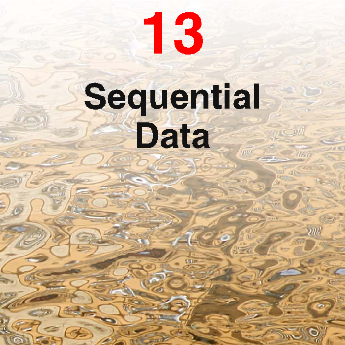

# 13. Sequential Data

So far in this book, we have focussed primarily on sets of data points that were assumed to be independent and identically distributed (i.i.d.). This assumption allowed us to express the likelihood function as the product over all data points of the probability distribution evaluated at each data point. For many applications, however, the i.i.d. assumption will be a poor one. Here we consider a particularly important class of such data sets, namely those that describe sequential data. These often arise through measurement of time series, for example the rainfall measurements on successive days at a particular location, or the daily values of a currency exchange rate, or the acoustic features at successive time frames used for speech recognition. An example involving speech data is shown in Figure 13.1. Sequential data can also arise in contexts other than time series, for example the sequence of nucleotide base pairs along a strand of DNA or the sequence of characters in an English sentence. For convenience, we shall sometimes refer to ‘past’ and ‘future’ observations in a sequence. However, the models explored in this chapter are equally applicable to all
[Page 626]

Figure 13.1 Example of a spectrogram of the spoken words “Bayes’ theorem” showing a plot of the intensity of the spectral coefficients versus time index.

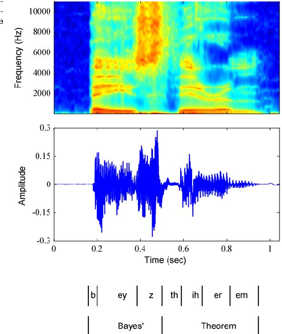

forms of sequential data, not just temporal sequences.

It is useful to distinguish between stationary and nonstationary sequential distributions. In the stationary case, the data evolves in time, but the distribution from which it is generated remains the same. For the more complex nonstationary situation, the generative distribution itself is evolving with time. Here we shall focus on the stationary case.

For many applications, such as financial forecasting, we wish to be able to predict the next value in a time series given observations of the previous values. Intuitively, we expect that recent observations are likely to be more informative than more historical observations in predicting future values. The example in Figure 13.1 shows that successive observations of the speech spectrum are indeed highly correlated. Furthermore, it would be impractical to consider a general dependence of future observations on all previous observations because the complexity of such a model would grow without limit as the number of observations increases. This leads us to consider Markov models in which we assume that future predictions are inde-
[Page 627]

Figure 13.2 The simplest approach to modelling a sequence of observations is to treat them as independent, corresponding to a graph without links.

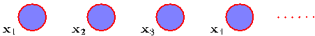

pendent of all but the most recent observations.

Although such models are tractable, they are also severely limited. We can obtain a more general framework, while still retaining tractability, by the introduction of latent variables, leading to state space models. As in Chapters 9 and 12, we shall see that complex models can thereby be constructed from simpler components (in particular, from distributions belonging to the exponential family) and can be readily characterized using the framework of probabilistic graphical models. Here we focus on the two most important examples of state space models, namely the hidden Markov model, in which the latent variables are discrete, and linear dynamical systems, in which the latent variables are Gaussian. Both models are described by directed graphs having a tree structure (no loops) for which inference can be performed efficiently using the sum-product algorithm.

## 13.1. Markov Models

The easiest way to treat sequential data would be simply to ignore the sequential aspects and treat the observations as i.i.d., corresponding to the graph in Figure 13.2. Such an approach, however, would fail to exploit the sequential patterns in the data, such as correlations between observations that are close in the sequence. Suppose, for instance, that we observe a binary variable denoting whether on a particular day it rained or not. Given a time series of recent observations of this variable, we wish to predict whether it will rain on the next day. If we treat the data as i.i.d., then the only information we can glean from the data is the relative frequency of rainy days. However, we know in practice that the weather often exhibits trends that may last for several days. Observing whether or not it rains today is therefore of significant help in predicting if it will rain tomorrow.

To express such effects in a probabilistic model, we need to relax the i.i.d. assumption, and one of the simplest ways to do this is to consider a Markov model. First of all we note that, without loss of generality, we can use the product rule to express the joint distribution for a sequence of observations in the form

$$
p(\mathbf{x}_1, \dots, \mathbf{x}_N) = \prod_{n=1}^N p(\mathbf{x}_n|\mathbf{x}_1, \dots, \mathbf{x}_{n-1}). \tag{13.1}
$$

If we now assume that each of the conditional distributions on the right-hand side is independent of all previous observations except the most recent, we obtain the first-order Markov chain, which is depicted as a graphical model in Figure 13.3. The
[Page 628]

Figure 13.3 A first-order Markov chain of observations $\{\mathbf{x}_n\}$ in which the distribution $p(\mathbf{x}_n|\mathbf{x}_{n-1})$ of a particular observation $\mathbf{x}_n$ is conditioned on the value of the previous observation $\mathbf{x}_{n-1}$.

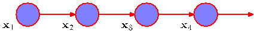

joint distribution for a sequence of $N$ observations under this model is given by

$$
p(\mathbf{x}_1, \dots, \mathbf{x}_N) = p(\mathbf{x}_1) \prod_{n=2}^N p(\mathbf{x}_n|\mathbf{x}_{n-1}). \tag{13.2}
$$

From the d-separation property, we see that the conditional distribution for observation $\mathbf{x}_n$, given all of the observations up to time $n$, is given by

$$
p(\mathbf{x}_n|\mathbf{x}_1, \dots, \mathbf{x}_{n-1}) = p(\mathbf{x}_n|\mathbf{x}_{n-1}) \tag{13.3}
$$

which is easily verified by direct evaluation starting from (13.2) and using the product rule of probability. Thus if we use such a model to predict the next observation in a sequence, the distribution of predictions will depend only on the value of the immediately preceding observation and will be independent of all earlier observations.

In most applications of such models, the conditional distributions $p(\mathbf{x}_n|\mathbf{x}_{n-1})$ that define the model will be constrained to be equal, corresponding to the assumption of a stationary time series. The model is then known as a homogeneous Markov chain. For instance, if the conditional distributions depend on adjustable parameters (whose values might be inferred from a set of training data), then all of the conditional distributions in the chain will share the same values of those parameters.

Although this is more general than the independence model, it is still very restrictive. For many sequential observations, we anticipate that the trends in the data over several successive observations will provide important information in predicting the next value. One way to allow earlier observations to have an influence is to move to higher-order Markov chains. If we allow the predictions to depend also on the previous-but-one value, we obtain a second-order Markov chain, represented by the graph in Figure 13.4. The joint distribution is now given by

$$
p(\mathbf{x}_1, \dots, \mathbf{x}_N) = p(\mathbf{x}_1)p(\mathbf{x}_2|\mathbf{x}_1) \prod_{n=3}^N p(\mathbf{x}_n|\mathbf{x}_{n-1}, \mathbf{x}_{n-2}). \tag{13.4}
$$

Again, using d-separation or by direct evaluation, we see that the conditional distribution of $\mathbf{x}_n$ given $\mathbf{x}_{n-1}$ and $\mathbf{x}_{n-2}$ is independent of all observations $\mathbf{x}_1, \dots, \mathbf{x}_{n-3}$.

Figure 13.4 A second-order Markov chain, in which the conditional distribution of a particular observation $\mathbf{x}_n$ depends on the values of the two previous observations $\mathbf{x}_{n-1}$ and $\mathbf{x}_{n-2}$.

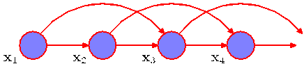
[Page 629]

Figure 13.5 We can represent sequential data using a Markov chain of latent variables, with each observation conditioned on the state of the corresponding latent variable. This important graphical structure forms the foundation both for the hidden Markov model and for linear dynamical systems.

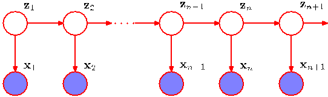

Each observation is now influenced by two previous observations. We can similarly consider extensions to an $M$th order Markov chain in which the conditional distribution for a particular variable depends on the previous $M$ variables. However, we have paid a price for this increased flexibility because the number of parameters in the model is now much larger. Suppose the observations are discrete variables having $K$ states. Then the conditional distribution $p(\mathbf{x}_n|\mathbf{x}_{n-1})$ in a first-order Markov chain will be specified by a set of $K - 1$ parameters for each of the $K$ states of $\mathbf{x}_{n-1}$ giving a total of $K(K - 1)$ parameters. Now suppose we extend the model to an $M$th order Markov chain, so that the joint distribution is built up from conditionals $p(\mathbf{x}_n|\mathbf{x}_{n-M}, \dots, \mathbf{x}_{n-1})$. If the variables are discrete, and if the conditional distributions are represented by general conditional probability tables, then the number of parameters in such a model will have $K^{M-1}(K - 1)$ parameters. Because this grows exponentially with $M$, it will often render this approach impractical for larger values of $M$.

For continuous variables, we can use linear-Gaussian conditional distributions in which each node has a Gaussian distribution whose mean is a linear function of its parents. This is known as an autoregressive or AR model (Box et al., 1994; Thiesson et al., 2004). An alternative approach is to use a parametric model for $p(\mathbf{x}_n|\mathbf{x}_{n-M}, \dots, \mathbf{x}_{n-1})$ such as a neural network. This technique is sometimes called a tapped delay line because it corresponds to storing (delaying) the previous $M$ values of the observed variable in order to predict the next value. The number of parameters can then be much smaller than in a completely general model (for example it may grow linearly with $M$), although this is achieved at the expense of a restricted family of conditional distributions.

Suppose we wish to build a model for sequences that is not limited by the Markov assumption to any order and yet that can be specified using a limited number of free parameters. We can achieve this by introducing additional latent variables to permit a rich class of models to be constructed out of simple components, as we did with mixture distributions in Chapter 9 and with continuous latent variable models in Chapter 12. For each observation $\mathbf{x}_n$, we introduce a corresponding latent variable $\mathbf{z}_n$ (which may be of different type or dimensionality to the observed variable). We now assume that it is the latent variables that form a Markov chain, giving rise to the graphical structure known as a state space model, which is shown in Figure 13.5. It satisfies the key conditional independence property that $\mathbf{z}_{n-1}$ and $\mathbf{z}_{n+1}$ are independent given $\mathbf{z}_n$, so that

$$
\mathbf{z}_{n+1} \perp\!\!\!\perp \mathbf{z}_{n-1} | \mathbf{z}_n. \tag{13.5}
$$

[Page 630]

The joint distribution for this model is given by

$$
p(\mathbf{x}_1, \dots, \mathbf{x}_N, \mathbf{z}_1, \dots, \mathbf{z}_N) = p(\mathbf{z}_1) \left[ \prod_{n=2}^N p(\mathbf{z}_n|\mathbf{z}_{n-1}) \right] \prod_{n=1}^N p(\mathbf{x}_n|\mathbf{z}_n). \tag{13.6}
$$

Using the d-separation criterion, we see that there is always a path connecting any two observed variables $\mathbf{x}_n$ and $\mathbf{x}_m$ via the latent variables, and that this path is never blocked. Thus the predictive distribution $p(\mathbf{x}_{n+1}|\mathbf{x}_1, \dots, \mathbf{x}_n)$ for observation $\mathbf{x}_{n+1}$ given all previous observations does not exhibit any conditional independence properties, and so our predictions for $\mathbf{x}_{n+1}$ depends on all previous observations. The observed variables, however, do not satisfy the Markov property at any order. We shall discuss how to evaluate the predictive distribution in later sections of this chapter.

There are two important models for sequential data that are described by this graph. If the latent variables are discrete, then we obtain the hidden Markov model, or HMM (Elliott et al., 1995). Note that the observed variables in an HMM may be discrete or continuous, and a variety of different conditional distributions can be used to model them. If both the latent and the observed variables are Gaussian (with a linear-Gaussian dependence of the conditional distributions on their parents), then we obtain the linear dynamical system.

## 13.2. Hidden Markov Models

The hidden Markov model can be viewed as a specific instance of the state space model of Figure 13.5 in which the latent variables are discrete. However, if we examine a single time slice of the model, we see that it corresponds to a mixture distribution, with component densities given by $p(\mathbf{x}|\mathbf{z})$. It can therefore also be interpreted as an extension of a mixture model in which the choice of mixture component for each observation is not selected independently but depends on the choice of component for the previous observation. The HMM is widely used in speech recognition (Jelinek, 1997; Rabiner and Juang, 1993), natural language modelling (Manning and Schütze, 1999), on-line handwriting recognition (Nag et al., 1986), and for the analysis of biological sequences such as proteins and DNA (Krogh et al., 1994; Durbin et al., 1998; Baldi and Brunak, 2001).

As in the case of a standard mixture model, the latent variables are the discrete multinomial variables $\mathbf{z}_n$ describing which component of the mixture is responsible for generating the corresponding observation $\mathbf{x}_n$. Again, it is convenient to use a 1-of-$K$ coding scheme, as used for mixture models in Chapter 9. We now allow the probability distribution of $\mathbf{z}_n$ to depend on the state of the previous latent variable $\mathbf{z}_{n-1}$ through a conditional distribution $p(\mathbf{z}_n|\mathbf{z}_{n-1})$. Because the latent variables are $K$-dimensional binary variables, this conditional distribution corresponds to a table of numbers that we denote by $\mathbf{A}$, the elements of which are known as transition probabilities. They are given by $A_{jk} \equiv p(z_{nk} = 1|z_{n-1,j} = 1)$, and because they are probabilities, they satisfy $0 \le A_{jk} \le 1$ with $\sum_k A_{jk} = 1$, so that the matrix $\mathbf{A}$
[Page 631]

Figure 13.6 Transition diagram showing a model whose latent variables have three possible states corresponding to the three boxes. The black lines denote the elements of the transition matrix $A_{jk}$.

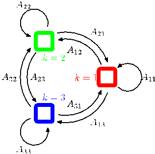

has $K(K - 1)$ independent parameters. We can then write the conditional distribution explicitly in the form

$$
p(\mathbf{z}_n|\mathbf{z}_{n-1}, \mathbf{A}) = \prod_{k=1}^K \prod_{j=1}^K A_{jk}^{z_{n-1,j} z_{nk}}. \tag{13.7}
$$

The initial latent node $\mathbf{z}_1$ is special in that it does not have a parent node, and so it has a marginal distribution $p(\mathbf{z}_1)$ represented by a vector of probabilities $\boldsymbol{\pi}$ with elements $\pi_k \equiv p(z_{1k} = 1)$, so that

$$
p(\mathbf{z}_1|\boldsymbol{\pi}) = \prod_{k=1}^K \pi_k^{z_{1k}} \tag{13.8}
$$

where $\sum_k \pi_k = 1$.

The transition matrix is sometimes illustrated diagrammatically by drawing the states as nodes in a state transition diagram as shown in Figure 13.6 for the case of $K = 3$. Note that this does not represent a probabilistic graphical model, because the nodes are not separate variables but rather states of a single variable, and so we have shown the states as boxes rather than circles.

It is sometimes useful to take a state transition diagram, of the kind shown in Figure 13.6, and unfold it over time. This gives an alternative representation of the transitions between latent states, known as a lattice or trellis diagram, and which is shown for the case of the hidden Markov model in Figure 13.7.

The specification of the probabilistic model is completed by defining the conditional distributions of the observed variables $p(\mathbf{x}_n|\mathbf{z}_n, \boldsymbol{\phi})$, where $\boldsymbol{\phi}$ is a set of parameters governing the distribution. These are known as emission probabilities, and might for example be given by Gaussians of the form (9.11) if the elements of $\mathbf{x}$ are continuous variables, or by conditional probability tables if $\mathbf{x}$ is discrete. Because $\mathbf{x}_n$ is observed, the distribution $p(\mathbf{x}_n|\mathbf{z}_n, \boldsymbol{\phi})$ consists, for a given value of $\boldsymbol{\phi}$, of a vector of $K$ numbers corresponding to the $K$ possible states of the binary vector $\mathbf{z}_n$.
[Page 632]

Figure 13.7 If we unfold the state transition diagram of Figure 13.6 over time, we obtain a lattice, or trellis, representation of the latent states. Each column of this diagram corresponds to one of the latent variables $\mathbf{z}_n$.

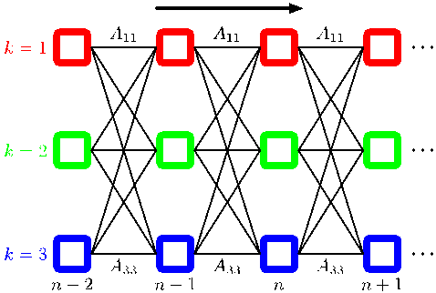

We can represent the emission probabilities in the form

$$
p(\mathbf{x}_n|\mathbf{z}_n, \boldsymbol{\phi}) = \prod_{k=1}^K p(\mathbf{x}_n|\boldsymbol{\phi}_k)^{z_{nk}}. \tag{13.9}
$$

We shall focuss attention on homogeneous models for which all of the conditional distributions governing the latent variables share the same parameters $\mathbf{A}$, and similarly all of the emission distributions share the same parameters $\boldsymbol{\phi}$ (the extension to more general cases is straightforward). Note that a mixture model for an i.i.d. data set corresponds to the special case in which the parameters $A_{jk}$ are the same for all values of $j$, so that the conditional distribution $p(\mathbf{z}_n|\mathbf{z}_{n-1})$ is independent of $\mathbf{z}_{n-1}$. This corresponds to deleting the horizontal links in the graphical model shown in Figure 13.5.

The joint probability distribution over both latent and observed variables is then given by

$$
p(\mathbf{X}, \mathbf{Z}|\boldsymbol{\theta}) = p(\mathbf{z}_1|\boldsymbol{\pi}) \left[ \prod_{n=2}^N p(\mathbf{z}_n|\mathbf{z}_{n-1}, \mathbf{A}) \right] \prod_{m=1}^N p(\mathbf{x}_m|\mathbf{z}_m, \boldsymbol{\phi}) \tag{13.10}
$$

where $\mathbf{X} = \{\mathbf{x}_1, \dots, \mathbf{x}_N\}$, $\mathbf{Z} = \{\mathbf{z}_1, \dots, \mathbf{z}_N\}$, and $\boldsymbol{\theta} = \{\boldsymbol{\pi}, \mathbf{A}, \boldsymbol{\phi}\}$ denotes the set of parameters governing the model. Most of our discussion of the hidden Markov model will be independent of the particular choice of the emission probabilities. Indeed, the model is tractable for a wide range of emission distributions including discrete tables, Gaussians, and mixtures of Gaussians. It is also possible to exploit discriminative models such as neural networks. These can be used to model the emission density $p(\mathbf{x}|\mathbf{z})$ directly, or to provide a representation for $p(\mathbf{z}|\mathbf{x})$ that can be converted into the required emission density $p(\mathbf{x}|\mathbf{z})$ using Bayes’ theorem (Bishop et al., 2004).

We can gain a better understanding of the hidden Markov model by considering it from a generative point of view. Recall that to generate samples from a mixture of
[Page 633]

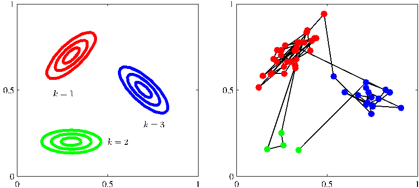

Figure 13.8 Illustration of sampling from a hidden Markov model having a 3-state latent variable $\mathbf{z}$ and a Gaussian emission model $p(\mathbf{x}|\mathbf{z})$ where $\mathbf{x}$ is 2-dimensional. (a) Contours of constant probability density for the emission distributions corresponding to each of the three states of the latent variable. (b) A sample of 50 points drawn from the hidden Markov model, colour coded according to the component that generated them and with lines connecting the successive observations. Here the transition matrix was fixed so that in any state there is a 5% probability of making a transition to each of the other states, and consequently a 90% probability of remaining in the same state.

Gaussians, we first chose one of the components at random with probability given by the mixing coefficients $\pi_k$ and then generate a sample vector $\mathbf{x}$ from the corresponding Gaussian component. This process is repeated $N$ times to generate a data set of $N$ independent samples. In the case of the hidden Markov model, this procedure is modified as follows. We first choose the initial latent variable $\mathbf{z}_1$ with probabilities governed by the parameters $\pi_k$ and then sample the corresponding observation $\mathbf{x}_1$. Now we choose the state of the variable $\mathbf{z}_2$ according to the transition probabilities $p(\mathbf{z}_2|\mathbf{z}_1)$ using the already instantiated value of $\mathbf{z}_1$. Thus suppose that the sample for $\mathbf{z}_1$ corresponds to state $j$. Then we choose the state $k$ of $\mathbf{z}_2$ with probabilities $A_{jk}$ for $k = 1, \dots, K$. Once we know $\mathbf{z}_2$ we can draw a sample for $\mathbf{x}_2$ and also sample the next latent variable $\mathbf{z}_3$ and so on. This is an example of ancestral sampling for a directed graphical model. If, for instance, we have a model in which the diagonal transition elements $A_{kk}$ are much larger than the off-diagonal elements, then a typical data sequence will have long runs of points generated from a single component, with infrequent transitions from one component to another. The generation of samples from a hidden Markov model is illustrated in Figure 13.8.

There are many variants of the standard HMM model, obtained for instance by imposing constraints on the form of the transition matrix $\mathbf{A}$ (Rabiner, 1989). Here we mention one of particular practical importance called the left-to-right HMM, which is obtained by setting the elements $A_{jk}$ of $\mathbf{A}$ to zero if $k < j$, as illustrated in the
[Page 634]

Figure 13.9 Example of the state transition diagram for a 3-state left-to-right hidden Markov model. Note that once a state has been vacated, it cannot later be re-entered.

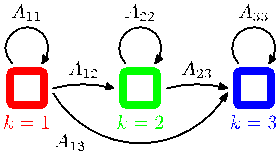

state transition diagram for a 3-state HMM in Figure 13.9. Typically for such models the initial state probabilities for $p(\mathbf{z}_1)$ are modified so that $p(z_{11} = 1) = 1$ and $p(z_{1j} = 1) = 0$ for $j \neq 1$, in other words every sequence is constrained to start in state $j = 1$. The transition matrix may be further constrained to ensure that large changes in the state index do not occur, so that $A_{jk} = 0$ if $k > j + \Delta$. This type of model is illustrated using a lattice diagram in Figure 13.10.

Many applications of hidden Markov models, for example speech recognition, or on-line character recognition, make use of left-to-right architectures. As an illustration of the left-to-right hidden Markov model, we consider an example involving handwritten digits. This uses on-line data, meaning that each digit is represented by the trajectory of the pen as a function of time in the form of a sequence of pen coordinates, in contrast to the off-line digits data, discussed in Appendix A, which comprises static two-dimensional pixellated images of the ink. Examples of the online digits are shown in Figure 13.11. Here we train a hidden Markov model on a subset of data comprising 45 examples of the digit ‘2’. There are $K = 16$ states, each of which can generate a line segment of fixed length having one of 16 possible angles, and so the emission distribution is simply a $16 \times 16$ table of probabilities associated with the allowed angle values for each state index value. Transition probabilities are all set to zero except for those that keep the state index $k$ the same or that increment it by 1, and the model parameters are optimized using 25 iterations of EM. We can gain some insight into the resulting model by running it generatively, as shown in Figure 13.11.

Figure 13.10 Lattice diagram for a 3-state leftto-right HMM in which the state index $k$ is allowed to increase by at most 1 at each transition.

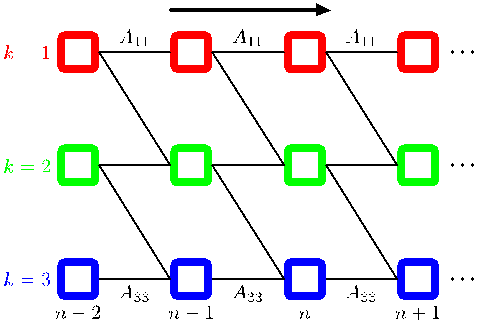
[Page 635]

Figure 13.11 Top row: examples of on-line handwritten digits. Bottom row: synthetic digits sampled generatively from a left-to-right hidden Markov model that has been trained on a data set of 45 handwritten digits.

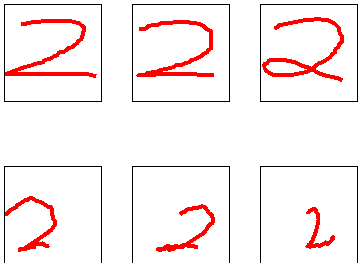

One of the most powerful properties of hidden Markov models is their ability to exhibit some degree of invariance to local warping (compression and stretching) of the time axis. To understand this, consider the way in which the digit ‘2’ is written in the on-line handwritten digits example. A typical digit comprises two distinct sections joined at a cusp. The first part of the digit, which starts at the top left, has a sweeping arc down to the cusp or loop at the bottom left, followed by a second moreor-less straight sweep ending at the bottom right. Natural variations in writing style will cause the relative sizes of the two sections to vary, and hence the location of the cusp or loop within the temporal sequence will vary. From a generative perspective such variations can be accommodated by the hidden Markov model through changes in the number of transitions to the same state versus the number of transitions to the successive state. Note, however, that if a digit ‘2’ is written in the reverse order, that is, starting at the bottom right and ending at the top left, then even though the pen tip coordinates may be identical to an example from the training set, the probability of the observations under the model will be extremely small. In the speech recognition context, warping of the time axis is associated with natural variations in the speed of speech, and again the hidden Markov model can accommodate such a distortion and not penalize it too heavily.

## 13.2.1 Maximum likelihood for the HMM

If we have observed a data set $\mathbf{X} = \{\mathbf{x}_1, \dots, \mathbf{x}_N\}$, we can determine the parameters of an HMM using maximum likelihood. The likelihood function is obtained from the joint distribution (13.10) by marginalizing over the latent variables

$$
p(\mathbf{X}|\boldsymbol{\theta}) = \sum_{\mathbf{Z}} p(\mathbf{X}, \mathbf{Z}|\boldsymbol{\theta}). \tag{13.11}
$$

Because the joint distribution $p(\mathbf{X}, \mathbf{Z}|\boldsymbol{\theta})$ does not factorize over $n$ (in contrast to the mixture distribution considered in Chapter 9), we cannot simply treat each of the summations over $\mathbf{z}_n$ independently. Nor can we perform the summations explicitly because there are $N$ variables to be summed over, each of which has $K$ states, resulting in a total of $K^N$ terms. Thus the number of terms in the summation grows
[Page 636]

exponentially with the length of the chain. In fact, the summation in (13.11) corresponds to summing over exponentially many paths through the lattice diagram in Figure 13.7.

We have already encountered a similar difficulty when we considered the inference problem for the simple chain of variables in Figure 8.32. There we were able to make use of the conditional independence properties of the graph to re-order the summations in order to obtain an algorithm whose cost scales linearly, instead of exponentially, with the length of the chain. We shall apply a similar technique to the hidden Markov model.

A further difficulty with the expression (13.11) for the likelihood function is that, because it corresponds to a generalization of a mixture distribution, it represents a summation over the emission models for different settings of the latent variables. Direct maximization of the likelihood function will therefore lead to complex expressions with no closed-form solutions, as was the case for simple mixture models (recall that a mixture model for i.i.d. data is a special case of the HMM).

We therefore turn to the expectation maximization algorithm to find an efficient framework for maximizing the likelihood function in hidden Markov models. The EM algorithm starts with some initial selection for the model parameters, which we denote by $\boldsymbol{\theta}^{\text{old}}$. In the E step, we take these parameter values and find the posterior distribution of the latent variables $p(\mathbf{Z}|\mathbf{X}, \boldsymbol{\theta}^{\text{old}})$. We then use this posterior distribution to evaluate the expectation of the logarithm of the complete-data likelihood function, as a function of the parameters $\boldsymbol{\theta}$, to give the function $Q(\boldsymbol{\theta}, \boldsymbol{\theta}^{\text{old}})$ defined by

$$
Q(\boldsymbol{\theta}, \boldsymbol{\theta}^{\text{old}}) = \sum_{\mathbf{Z}} p(\mathbf{Z}|\mathbf{X}, \boldsymbol{\theta}^{\text{old}}) \ln p(\mathbf{X}, \mathbf{Z}|\boldsymbol{\theta}). \tag{13.12}
$$

At this point, it is convenient to introduce some notation. We shall use $\gamma(\mathbf{z}_n)$ to denote the marginal posterior distribution of a latent variable $\mathbf{z}_n$, and $\xi(\mathbf{z}_{n-1}, \mathbf{z}_n)$ to denote the joint posterior distribution of two successive latent variables, so that

$$
\gamma(\mathbf{z}_n) = p(\mathbf{z}_n|\mathbf{X}, \boldsymbol{\theta}^{\text{old}}) \tag{13.13}
$$

$$
\xi(\mathbf{z}_{n-1}, \mathbf{z}_n) = p(\mathbf{z}_{n-1}, \mathbf{z}_n|\mathbf{X}, \boldsymbol{\theta}^{\text{old}}). \tag{13.14}
$$

For each value of $n$, we can store $\gamma(\mathbf{z}_n)$ using a set of $K$ nonnegative numbers that sum to unity, and similarly we can store $\xi(\mathbf{z}_{n-1}, \mathbf{z}_n)$ using a $K \times K$ matrix of nonnegative numbers that again sum to unity. We shall also use $\gamma(z_{nk})$ to denote the conditional probability of $z_{nk} = 1$, with a similar use of notation for $\xi(z_{n-1,j}, z_{nk})$ and for other probabilistic variables introduced later. Because the expectation of a binary random variable is just the probability that it takes the value 1, we have

$$
\gamma(z_{nk}) = \mathbb{E}[z_{nk}] = \sum_{\mathbf{z}} \gamma(\mathbf{z}) z_{nk} \tag{13.15}
$$

$$
\xi(z_{n-1,j}, z_{nk}) = \mathbb{E}[z_{n-1,j}z_{nk}] = \sum_{\mathbf{z}} \gamma(\mathbf{z}) z_{n-1,j} z_{nk}. \tag{13.16}
$$

If we substitute the joint distribution $p(\mathbf{X}, \mathbf{Z}|\boldsymbol{\theta})$ given by (13.10) into (13.12),
[Page 637]

and make use of the definitions of $\gamma$ and $\xi$, we obtain

$$
Q(\boldsymbol{\theta}, \boldsymbol{\theta}^{\text{old}}) = \sum_{k=1}^K \gamma(z_{1k}) \ln \pi_k + \sum_{n=2}^N \sum_{j=1}^K \sum_{k=1}^K \xi(z_{n-1,j}, z_{nk}) \ln A_{jk} + \sum_{n=1}^N \sum_{k=1}^K \gamma(z_{nk}) \ln p(\mathbf{x}_n|\boldsymbol{\phi}_k). \tag{13.17}
$$

The goal of the E step will be to evaluate the quantities $\gamma(\mathbf{z}_n)$ and $\xi(\mathbf{z}_{n-1}, \mathbf{z}_n)$ efficiently, and we shall discuss this in detail shortly.

In the M step, we maximize $Q(\boldsymbol{\theta}, \boldsymbol{\theta}^{\text{old}})$ with respect to the parameters $\boldsymbol{\theta} = \{\boldsymbol{\pi}, \mathbf{A}, \boldsymbol{\phi}\}$ in which we treat $\gamma(\mathbf{z}_n)$ and $\xi(\mathbf{z}_{n-1}, \mathbf{z}_n)$ as constant. Maximization with respect to $\boldsymbol{\pi}$ and $\mathbf{A}$ is easily achieved using appropriate Lagrange multipliers with the results

$$
\pi_k = \frac{\gamma(z_{1k})}{\sum_{j=1}^K \gamma(z_{1j})} \tag{13.18}
$$

$$
A_{jk} = \frac{\sum_{n=2}^N \xi(z_{n-1,j}, z_{nk})}{\sum_{l=1}^K \sum_{n=2}^N \xi(z_{n-1,j}, z_{nl})}. \tag{13.19}
$$

The EM algorithm must be initialized by choosing starting values for $\boldsymbol{\pi}$ and $\mathbf{A}$, which should of course respect the summation constraints associated with their probabilistic interpretation. Note that any elements of $\boldsymbol{\pi}$ or $\mathbf{A}$ that are set to zero initially will remain zero in subsequent EM updates. A typical initialization procedure would involve selecting random starting values for these parameters subject to the summation and non-negativity constraints. Note that no particular modification to the EM results are required for the case of left-to-right models beyond choosing initial values for the elements $A_{jk}$ in which the appropriate elements are set to zero, because these will remain zero throughout.

To maximize $Q(\boldsymbol{\theta}, \boldsymbol{\theta}^{\text{old}})$ with respect to $\boldsymbol{\phi}_k$, we notice that only the final term in (13.17) depends on $\boldsymbol{\phi}_k$, and furthermore this term has exactly the same form as the data-dependent term in the corresponding function for a standard mixture distribution for i.i.d. data, as can be seen by comparison with (9.40) for the case of a Gaussian mixture. Here the quantities $\gamma(z_{nk})$ are playing the role of the responsibilities. If the parameters $\boldsymbol{\phi}_k$ are independent for the different components, then this term decouples into a sum of terms one for each value of $k$, each of which can be maximized independently. We are then simply maximizing the weighted log likelihood function for the emission density $p(\mathbf{x}|\boldsymbol{\phi}_k)$ with weights $\gamma(z_{nk})$. Here we shall suppose that this maximization can be done efficiently. For instance, in the case of
[Page 638]

Gaussian emission densities we have $p(\mathbf{x}|\boldsymbol{\phi}_k) = \mathcal{N}(\mathbf{x}|\boldsymbol{\mu}_k, \boldsymbol{\Sigma}_k)$, and maximization of the function $Q(\boldsymbol{\theta}, \boldsymbol{\theta}^{\text{old}})$ then gives

$$
\boldsymbol{\mu}_k = \frac{\sum_{n=1}^N \gamma(z_{nk})\mathbf{x}_n}{\sum_{n=1}^N \gamma(z_{nk})} \tag{13.20}
$$

$$
\boldsymbol{\Sigma}_k = \frac{\sum_{n=1}^N \gamma(z_{nk})(\mathbf{x}_n - \boldsymbol{\mu}_k)(\mathbf{x}_n - \boldsymbol{\mu}_k)^{\text{T}}}{\sum_{n=1}^N \gamma(z_{nk})}. \tag{13.21}
$$

For the case of discrete multinomial observed variables, the conditional distribution of the observations takes the form

$$
p(\mathbf{x}|\mathbf{z}) = \prod_{i=1}^D \prod_{k=1}^K \mu_{ik}^{x_i z_k} \tag{13.22}
$$

and the corresponding M-step equations are given by

$$
\mu_{ik} = \frac{\sum_{n=1}^N \gamma(z_{nk})x_{ni}}{\sum_{n=1}^N \gamma(z_{nk})}. \tag{13.23}
$$

An analogous result holds for Bernoulli observed variables.

The EM algorithm requires initial values for the parameters of the emission distribution. One way to set these is first to treat the data initially as i.i.d. and fit the emission density by maximum likelihood, and then use the resulting values to initialize the parameters for EM.

## 13.2.2 The forward-backward algorithm

Next we seek an efficient procedure for evaluating the quantities $\gamma(z_{nk})$ and $\xi(z_{n-1,j}, z_{nk})$, corresponding to the E step of the EM algorithm. The graph for the hidden Markov model, shown in Figure 13.5, is a tree, and so we know that the posterior distribution of the latent variables can be obtained efficiently using a twostage message passing algorithm. In the particular context of the hidden Markov model, this is known as the forward-backward algorithm (Rabiner, 1989), or the Baum-Welch algorithm (Baum, 1972). There are in fact several variants of the basic algorithm, all of which lead to the exact marginals, according to the precise form of
[Page 639]

the messages that are propagated along the chain (Jordan, 2007). We shall focus on the most widely used of these, known as the alpha-beta algorithm.

As well as being of great practical importance in its own right, the forwardbackward algorithm provides us with a nice illustration of many of the concepts introduced in earlier chapters. We shall therefore begin in this section with a ‘conventional’ derivation of the forward-backward equations, making use of the sum and product rules of probability, and exploiting conditional independence properties which we shall obtain from the corresponding graphical model using d-separation. Then in Section 13.2.3, we shall see how the forward-backward algorithm can be obtained very simply as a specific example of the sum-product algorithm introduced in Section 8.4.4.

It is worth emphasizing that evaluation of the posterior distributions of the latent variables is independent of the form of the emission density $p(\mathbf{x}|\mathbf{z})$ or indeed of whether the observed variables are continuous or discrete. All we require is the values of the quantities $p(\mathbf{x}_n|\mathbf{z}_n)$ for each value of $\mathbf{z}_n$ for every $n$. Also, in this section and the next we shall omit the explicit dependence on the model parameters $\boldsymbol{\theta}^{\text{old}}$ because these fixed throughout.

We therefore begin by writing down the following conditional independence properties (Jordan, 2007)

$$
p(\mathbf{X}|\mathbf{z}_n) = p(\mathbf{x}_1, \dots, \mathbf{x}_n|\mathbf{z}_n)p(\mathbf{x}_{n+1}, \dots, \mathbf{x}_N|\mathbf{z}_n) \tag{13.24}
$$

$$
p(\mathbf{x}_1, \dots, \mathbf{x}_{n-1}|\mathbf{x}_n, \mathbf{z}_n) = p(\mathbf{x}_1, \dots, \mathbf{x}_{n-1}|\mathbf{z}_n) \tag{13.25}
$$

$$
p(\mathbf{x}_1, \dots, \mathbf{x}_{n-1}|\mathbf{z}_{n-1}, \mathbf{z}_n) = p(\mathbf{x}_1, \dots, \mathbf{x}_{n-1}|\mathbf{z}_{n-1}) \tag{13.26}
$$

$$
p(\mathbf{x}_{n+1}, \dots, \mathbf{x}_N|\mathbf{z}_n, \mathbf{z}_{n+1}) = p(\mathbf{x}_{n+1}, \dots, \mathbf{x}_N|\mathbf{z}_{n+1}) \tag{13.27}
$$

$$
p(\mathbf{x}_{n+2}, \dots, \mathbf{x}_N|\mathbf{z}_{n+1}, \mathbf{x}_{n+1}) = p(\mathbf{x}_{n+2}, \dots, \mathbf{x}_N|\mathbf{z}_{n+1}) \tag{13.28}
$$

$$
p(\mathbf{X}|\mathbf{z}_{n-1}, \mathbf{z}_n) = p(\mathbf{x}_1, \dots, \mathbf{x}_{n-1}|\mathbf{z}_{n-1})p(\mathbf{x}_n|\mathbf{z}_n)p(\mathbf{x}_{n+1}, \dots, \mathbf{x}_N|\mathbf{z}_n) \tag{13.29}
$$

$$
p(\mathbf{x}_{N+1}|\mathbf{X}, \mathbf{z}_{N+1}) = p(\mathbf{x}_{N+1}|\mathbf{z}_{N+1}) \tag{13.30}
$$

$$
p(\mathbf{z}_{N+1}|\mathbf{z}_N, \mathbf{X}) = p(\mathbf{z}_{N+1}|\mathbf{z}_N) \tag{13.31}
$$

where $\mathbf{X} = \{\mathbf{x}_1, \dots, \mathbf{x}_N\}$. These relations are most easily proved using d-separation. For instance in the first of these results, we note that every path from any one of the nodes $\mathbf{x}_1, \dots, \mathbf{x}_{n-1}$ to the node $\mathbf{x}_n$ passes through the node $\mathbf{z}_n$, which is observed. Because all such paths are head-to-tail, it follows that the conditional independence property must hold. The reader should take a few moments to verify each of these properties in turn, as an exercise in the application of d-separation. These relations can also be proved directly, though with significantly greater effort, from the joint distribution for the hidden Markov model using the sum and product rules of probability.

Let us begin by evaluating $\gamma(z_{nk})$. Recall that for a discrete multinomial random variable the expected value of one of its components is just the probability of that component having the value 1. Thus we are interested in finding the posterior distribution $p(\mathbf{z}_n|\mathbf{x}_1, \dots, \mathbf{x}_N)$ of $\mathbf{z}_n$ given the observed data set $\mathbf{x}_1, \dots, \mathbf{x}_N$. This
[Page 640]

represents a vector of length $K$ whose entries correspond to the expected values of $z_{nk}$. Using Bayes’ theorem, we have

$$
\gamma(\mathbf{z}_n) = p(\mathbf{z}_n|\mathbf{X}) = \frac{p(\mathbf{X}|\mathbf{z}_n)p(\mathbf{z}_n)}{p(\mathbf{X})}. \tag{13.32}
$$

Note that the denominator $p(\mathbf{X})$ is implicitly conditioned on the parameters $\boldsymbol{\theta}^{\text{old}}$ of the HMM and hence represents the likelihood function. Using the conditional independence property (13.24), together with the product rule of probability, we obtain

$$
\gamma(\mathbf{z}_n) = \frac{p(\mathbf{x}_1, \dots, \mathbf{x}_n, \mathbf{z}_n)p(\mathbf{x}_{n+1}, \dots, \mathbf{x}_N|\mathbf{z}_n)}{p(\mathbf{X})} = \frac{\alpha(\mathbf{z}_n)\beta(\mathbf{z}_n)}{p(\mathbf{X})} \tag{13.33}
$$

where we have defined

$$
\alpha(\mathbf{z}_n) \equiv p(\mathbf{x}_1, \dots, \mathbf{x}_n, \mathbf{z}_n) \tag{13.34}
$$

$$
\beta(\mathbf{z}_n) \equiv p(\mathbf{x}_{n+1}, \dots, \mathbf{x}_N|\mathbf{z}_n). \tag{13.35}
$$

The quantity $\alpha(\mathbf{z}_n)$ represents the joint probability of observing all of the given data up to time $n$ and the value of $\mathbf{z}_n$, whereas $\beta(\mathbf{z}_n)$ represents the conditional probability of all future data from time $n + 1$ up to $N$ given the value of $\mathbf{z}_n$. Again, $\alpha(\mathbf{z}_n)$ and $\beta(\mathbf{z}_n)$ each represent set of $K$ numbers, one for each of the possible settings of the 1-of-$K$ coded binary vector $\mathbf{z}_n$. We shall use the notation $\alpha(z_{nk})$ to denote the value of $\alpha(\mathbf{z}_n)$ when $z_{nk} = 1$, with an analogous interpretation of $\beta(z_{nk})$.

We now derive recursion relations that allow $\alpha(\mathbf{z}_n)$ and $\beta(\mathbf{z}_n)$ to be evaluated efficiently. Again, we shall make use of conditional independence properties, in particular (13.25) and (13.26), together with the sum and product rules, allowing us to express $\alpha(\mathbf{z}_n)$ in terms of $\alpha(\mathbf{z}_{n-1})$ as follows

$$
\begin{aligned}
\alpha(\mathbf{z}_n) &= p(\mathbf{x}_1, \dots, \mathbf{x}_n, \mathbf{z}_n) \\
&= p(\mathbf{x}_1, \dots, \mathbf{x}_n|\mathbf{z}_n)p(\mathbf{z}_n) \\
&= p(\mathbf{x}_n|\mathbf{z}_n)p(\mathbf{x}_1, \dots, \mathbf{x}_{n-1}|\mathbf{z}_n)p(\mathbf{z}_n) \\
&= p(\mathbf{x}_n|\mathbf{z}_n) \sum_{\mathbf{z}_{n-1}} p(\mathbf{x}_1, \dots, \mathbf{x}_{n-1}, \mathbf{z}_{n-1}, \mathbf{z}_n) \\
&= p(\mathbf{x}_n|\mathbf{z}_n) \sum_{\mathbf{z}_{n-1}} p(\mathbf{x}_1, \dots, \mathbf{x}_{n-1}, \mathbf{z}_n|\mathbf{z}_{n-1})p(\mathbf{z}_{n-1}) \\
&= p(\mathbf{x}_n|\mathbf{z}_n) \sum_{\mathbf{z}_{n-1}} p(\mathbf{x}_1, \dots, \mathbf{x}_{n-1}|\mathbf{z}_{n-1})p(\mathbf{z}_n|\mathbf{z}_{n-1})p(\mathbf{z}_{n-1}) \\
&= p(\mathbf{x}_n|\mathbf{z}_n) \sum_{\mathbf{z}_{n-1}} p(\mathbf{x}_1, \dots, \mathbf{x}_{n-1}, \mathbf{z}_{n-1})p(\mathbf{z}_n|\mathbf{z}_{n-1})
\end{aligned}
$$

Making use of the definition (13.34) for $\alpha(\mathbf{z}_n)$, we then obtain

$$
\alpha(\mathbf{z}_n) = p(\mathbf{x}_n|\mathbf{z}_n) \sum_{\mathbf{z}_{n-1}} \alpha(\mathbf{z}_{n-1}) p(\mathbf{z}_n|\mathbf{z}_{n-1}). \tag{13.36}
$$

[Page 641]

Figure 13.12 Illustration of the forward recursion (13.36) for evaluation of the $\alpha$ variables. In this fragment of the lattice, we see that the quantity $\alpha(z_{n1})$ is obtained by taking the elements $\alpha(z_{n-1,j})$ of $\alpha(\mathbf{z}_{n-1})$ at step $n-1$ and summing them up with weights given by $A_{j1}$, corresponding to the values of $p(\mathbf{z}_n|\mathbf{z}_{n-1})$, and then multiplying by the data contribution $p(\mathbf{x}_n|z_{n1})$.

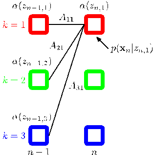

It is worth taking a moment to study this recursion relation in some detail. Note that there are $K$ terms in the summation, and the right-hand side has to be evaluated for each of the $K$ values of $\mathbf{z}_n$ so each step of the $\alpha$ recursion has computational cost that scaled like $O(K^2)$. The forward recursion equation for $\alpha(\mathbf{z}_n)$ is illustrated using a lattice diagram in Figure 13.12.

In order to start this recursion, we need an initial condition that is given by

$$
\alpha(\mathbf{z}_1) = p(\mathbf{x}_1, \mathbf{z}_1) = p(\mathbf{z}_1)p(\mathbf{x}_1|\mathbf{z}_1) = \prod_{k=1}^K \{\pi_k p(\mathbf{x}_1|\boldsymbol{\phi}_k)\}^{z_{1k}} \tag{13.37}
$$

which tells us that $\alpha(z_{1k})$, for $k = 1, \dots, K$, takes the value $\pi_k p(\mathbf{x}_1|\boldsymbol{\phi}_k)$. Starting at the first node of the chain, we can then work along the chain and evaluate $\alpha(\mathbf{z}_n)$ for every latent node. Because each step of the recursion involves multiplying by a $K \times K$ matrix, the overall cost of evaluating these quantities for the whole chain is of $O(K^2 N)$.

We can similarly find a recursion relation for the quantities $\beta(\mathbf{z}_n)$ by making use of the conditional independence properties (13.27) and (13.28) giving

$$
\begin{aligned}
\beta(\mathbf{z}_n) &= p(\mathbf{x}_{n+1}, \dots, \mathbf{x}_N|\mathbf{z}_n) \\
&= \sum_{\mathbf{z}_{n+1}} p(\mathbf{x}_{n+1}, \dots, \mathbf{x}_N, \mathbf{z}_{n+1}|\mathbf{z}_n) \\
&= \sum_{\mathbf{z}_{n+1}} p(\mathbf{x}_{n+1}, \dots, \mathbf{x}_N|\mathbf{z}_n, \mathbf{z}_{n+1})p(\mathbf{z}_{n+1}|\mathbf{z}_n) \\
&= \sum_{\mathbf{z}_{n+1}} p(\mathbf{x}_{n+1}, \dots, \mathbf{x}_N|\mathbf{z}_{n+1})p(\mathbf{z}_{n+1}|\mathbf{z}_n) \\
&= \sum_{\mathbf{z}_{n+1}} p(\mathbf{x}_{n+2}, \dots, \mathbf{x}_N|\mathbf{z}_{n+1})p(\mathbf{x}_{n+1}|\mathbf{z}_{n+1})p(\mathbf{z}_{n+1}|\mathbf{z}_n).
\end{aligned}
$$

[Page 642]

Figure 13.13 Illustration of the backward recursion (13.38) for evaluation of the $\beta$ variables. In this fragment of the lattice, we see that the quantity $\beta(z_{n1})$ is obtained by taking the components $\beta(z_{n+1,k})$ of $\beta(\mathbf{z}_{n+1})$ at step $n + 1$ and summing them up with weights given by the products of $A_{1k}$, corresponding to the values of $p(\mathbf{z}_{n+1}|\mathbf{z}_n)$ and the corresponding values of the emission density $p(\mathbf{x}_n|z_{n+1,k})$.

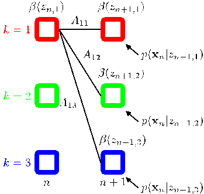

Making use of the definition (13.35) for $\beta(\mathbf{z}_n)$, we then obtain

$$
\beta(\mathbf{z}_n) = \sum_{\mathbf{z}_{n+1}} \beta(\mathbf{z}_{n+1})p(\mathbf{x}_{n+1}|\mathbf{z}_{n+1})p(\mathbf{z}_{n+1}|\mathbf{z}_n). \tag{13.38}
$$

Note that in this case we have a backward message passing algorithm that evaluates $\beta(\mathbf{z}_n)$ in terms of $\beta(\mathbf{z}_{n+1})$. At each step, we absorb the effect of observation $\mathbf{x}_{n+1}$ through the emission probability $p(\mathbf{x}_{n+1}|\mathbf{z}_{n+1})$, multiply by the transition matrix $p(\mathbf{z}_{n+1}|\mathbf{z}_n)$, and then marginalize out $\mathbf{z}_{n+1}$. This is illustrated in Figure 13.13.

Again we need a starting condition for the recursion, namely a value for $\beta(\mathbf{z}_N)$. This can be obtained by setting $n = N$ in (13.33) and replacing $\alpha(\mathbf{z}_N)$ with its definition (13.34) to give

$$
p(\mathbf{z}_N|\mathbf{X}) = \frac{p(\mathbf{X}, \mathbf{z}_N)\beta(\mathbf{z}_N)}{p(\mathbf{X})} \tag{13.39}
$$

which we see will be correct provided we take $\beta(\mathbf{z}_N) = 1$ for all settings of $\mathbf{z}_N$.

In the M step equations, the quantity $p(\mathbf{X})$ will cancel out, as can be seen, for instance, in the M-step equation for $\boldsymbol{\mu}_k$ given by (13.20), which takes the form

$$
\boldsymbol{\mu}_k = \frac{\sum_{n=1}^N \gamma(z_{nk})\mathbf{x}_n}{\sum_{n=1}^N \gamma(z_{nk})} = \frac{\sum_{n=1}^N \alpha(z_{nk})\beta(z_{nk})\mathbf{x}_n}{\sum_{n=1}^N \alpha(z_{nk})\beta(z_{nk})}. \tag{13.40}
$$

However, the quantity $p(\mathbf{X})$ represents the likelihood function whose value we typically wish to monitor during the EM optimization, and so it is useful to be able to evaluate it. If we sum both sides of (13.33) over $\mathbf{z}_n$, and use the fact that the left-hand side is a normalized distribution, we obtain

$$
p(\mathbf{X}) = \sum_{\mathbf{z}_n} \alpha(\mathbf{z}_n)\beta(\mathbf{z}_n). \tag{13.41}
$$

Thus we can evaluate the likelihood function by computing this sum, for any convenient choice of $n$. For instance, if we only want to evaluate the likelihood function, then we can do this by running the $\alpha$ recursion from the start to the end of the chain, and then use this result for $n = N$, making use of the fact that $\beta(\mathbf{z}_N)$ is a vector of 1s. In this case no $\beta$ recursion is required, and we simply have
[Page 643]

Thus we can evaluate the likelihood function by computing this sum, for any convenient choice of $n$. For instance, if we only want to evaluate the likelihood function, then we can do this by running the $\alpha$ recursion from the start to the end of the chain, and then use this result for $n = N$, making use of the fact that $\beta(\mathbf{z}_N)$ is a vector of 1s. In this case no $\beta$ recursion is required, and we simply have

$$
p(\mathbf{X}) = \sum_{\mathbf{z}_N} \alpha(\mathbf{z}_N). \tag{13.42}
$$

Let us take a moment to interpret this result for $p(\mathbf{X})$. Recall that to compute the likelihood we should take the joint distribution $p(\mathbf{X}, \mathbf{Z})$ and sum over all possible values of $\mathbf{Z}$. Each such value represents a particular choice of hidden state for every time step, in other words every term in the summation is a path through the lattice diagram, and recall that there are exponentially many such paths. By expressing the likelihood function in the form (13.42), we have reduced the computational cost from being exponential in the length of the chain to being linear by swapping the order of the summation and multiplications, so that at each time step $n$ we sum the contributions from all paths passing through each of the states $z_{nk}$ to give the intermediate quantities $\alpha(\mathbf{z}_n)$.

Next we consider the evaluation of the quantities $\xi(\mathbf{z}_{n-1}, \mathbf{z}_n)$, which correspond to the values of the conditional probabilities $p(\mathbf{z}_{n-1}, \mathbf{z}_n|\mathbf{X})$ for each of the $K \times K$ settings for $(\mathbf{z}_{n-1}, \mathbf{z}_n)$. Using the definition of $\xi(\mathbf{z}_{n-1}, \mathbf{z}_n)$, and applying Bayes’ theorem, we have

$$
\begin{aligned}
\xi(\mathbf{z}_{n-1}, \mathbf{z}_n) &= p(\mathbf{z}_{n-1}, \mathbf{z}_n|\mathbf{X}) \\
&= \frac{p(\mathbf{X}|\mathbf{z}_{n-1}, \mathbf{z}_n)p(\mathbf{z}_{n-1}, \mathbf{z}_n)}{p(\mathbf{X})} \\
&= \frac{p(\mathbf{x}_1, \dots, \mathbf{x}_{n-1}|\mathbf{z}_{n-1})p(\mathbf{x}_n|\mathbf{z}_n)p(\mathbf{x}_{n+1}, \dots, \mathbf{x}_N|\mathbf{z}_n)p(\mathbf{z}_n|\mathbf{z}_{n-1})p(\mathbf{z}_{n-1})}{p(\mathbf{X})} \\
&= \frac{\alpha(\mathbf{z}_{n-1})p(\mathbf{x}_n|\mathbf{z}_n)p(\mathbf{z}_n|\mathbf{z}_{n-1})\beta(\mathbf{z}_n)}{p(\mathbf{X})}
\end{aligned} \tag{13.43}
$$

where we have made use of the conditional independence property (13.29) together with the definitions of $\alpha(\mathbf{z}_n)$ and $\beta(\mathbf{z}_n)$ given by (13.34) and (13.35). Thus we can calculate the $\xi(\mathbf{z}_{n-1}, \mathbf{z}_n)$ directly by using the results of the $\alpha$ and $\beta$ recursions.

Let us summarize the steps required to train a hidden Markov model using the EM algorithm. We first make an initial selection of the parameters $\boldsymbol{\theta}^{\text{old}}$ where $\boldsymbol{\theta} \equiv (\boldsymbol{\pi}, \mathbf{A}, \boldsymbol{\phi})$. The $\mathbf{A}$ and $\boldsymbol{\pi}$ parameters are often initialized either uniformly or randomly from a uniform distribution (respecting their non-negativity and summation constraints). Initialization of the parameters $\boldsymbol{\phi}$ will depend on the form of the distribution. For instance in the case of Gaussians, the parameters $\boldsymbol{\mu}_k$ might be initialized by applying the $K$-means algorithm to the data, and $\boldsymbol{\Sigma}_k$ might be initialized to the covariance matrix of the corresponding $K$ means cluster. Then we run both the forward $\alpha$ recursion and the backward $\beta$ recursion and use the results to evaluate $\gamma(\mathbf{z}_n)$ and $\xi(\mathbf{z}_{n-1}, \mathbf{z}_n)$. At this stage, we can also evaluate the likelihood function.
[Page 644]

This completes the E step, and we use the results to find a revised set of parameters $\boldsymbol{\theta}^{\text{new}}$ using the M-step equations from Section 13.2.1. We then continue to alternate between E and M steps until some convergence criterion is satisfied, for instance when the change in the likelihood function is below some threshold.

Note that in these recursion relations the observations enter through conditional distributions of the form $p(\mathbf{x}_n|\mathbf{z}_n)$. The recursions are therefore independent of the type or dimensionality of the observed variables or the form of this conditional distribution, so long as its value can be computed for each of the $K$ possible states of $\mathbf{z}_n$. Since the observed variables $\{\mathbf{x}_n\}$ are fixed, the quantities $p(\mathbf{x}_n|\mathbf{z}_n)$ can be pre-computed as functions of $\mathbf{z}_n$ at the start of the EM algorithm, and remain fixed throughout.

We have seen in earlier chapters that the maximum likelihood approach is most effective when the number of data points is large in relation to the number of parameters. Here we note that a hidden Markov model can be trained effectively, using maximum likelihood, provided the training sequence is sufficiently long. Alternatively, we can make use of multiple shorter sequences, which requires a straightforward modification of the hidden Markov model EM algorithm. In the case of left-to-right models, this is particularly important because, in a given observation sequence, a given state transition corresponding to a nondiagonal element of $\mathbf{A}$ will seen at most once.

Another quantity of interest is the predictive distribution, in which the observed data is $\mathbf{X} = \{\mathbf{x}_1, \dots, \mathbf{x}_N\}$ and we wish to predict $\mathbf{x}_{N+1}$, which would be important for real-time applications such as financial forecasting. Again we make use of the sum and product rules together with the conditional independence properties (13.29) and (13.31) giving

$$
\begin{aligned}
p(\mathbf{x}_{N+1}|\mathbf{X}) &= \sum_{\mathbf{z}_{N+1}} p(\mathbf{x}_{N+1}, \mathbf{z}_{N+1}|\mathbf{X}) \\
&= \sum_{\mathbf{z}_{N+1}} p(\mathbf{x}_{N+1}|\mathbf{z}_{N+1})p(\mathbf{z}_{N+1}|\mathbf{X}) \\
&= \sum_{\mathbf{z}_{N+1}} p(\mathbf{x}_{N+1}|\mathbf{z}_{N+1}) \sum_{\mathbf{z}_N} p(\mathbf{z}_{N+1}, \mathbf{z}_N|\mathbf{X}) \\
&= \sum_{\mathbf{z}_{N+1}} p(\mathbf{x}_{N+1}|\mathbf{z}_{N+1}) \sum_{\mathbf{z}_N} p(\mathbf{z}_{N+1}|\mathbf{z}_N)p(\mathbf{z}_N|\mathbf{X}) \\
&= \sum_{\mathbf{z}_{N+1}} p(\mathbf{x}_{N+1}|\mathbf{z}_{N+1}) \sum_{\mathbf{z}_N} p(\mathbf{z}_{N+1}|\mathbf{z}_N) \frac{p(\mathbf{z}_N, \mathbf{X})}{p(\mathbf{X})} \\
&= \frac{1}{p(\mathbf{X})} \sum_{\mathbf{z}_{N+1}} p(\mathbf{x}_{N+1}|\mathbf{z}_{N+1}) \sum_{\mathbf{z}_N} p(\mathbf{z}_{N+1}|\mathbf{z}_N)\alpha(\mathbf{z}_N)
\end{aligned} \tag{13.44}
$$

which can be evaluated by first running a forward $\alpha$ recursion and then computing the final summations over $\mathbf{z}_N$ and $\mathbf{z}_{N+1}$. The result of the first summation over $\mathbf{z}_N$ can be stored and used once the value of $\mathbf{x}_{N+1}$ is observed in order to run the $\alpha$ recursion forward to the next step in order to predict the subsequent value $\mathbf{x}_{N+2}$.
[Page 645]

Figure 13.14 A fragment of the factor graph representation for the hidden Markov model.

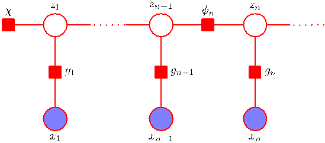

Note that in (13.44), the influence of all data from $\mathbf{x}_1$ to $\mathbf{x}_N$ is summarized in the $K$ values of $\alpha(\mathbf{z}_N)$. Thus the predictive distribution can be carried forward indefinitely using a fixed amount of storage, as may be required for real-time applications.

Here we have discussed the estimation of the parameters of an HMM using maximum likelihood. This framework is easily extended to regularized maximum likelihood by introducing priors over the model parameters $\boldsymbol{\pi}$, $\mathbf{A}$ and $\boldsymbol{\phi}$ whose values are then estimated by maximizing their posterior probability. This can again be done using the EM algorithm in which the E step is the same as discussed above, and the M step involves adding the log of the prior distribution $p(\boldsymbol{\theta})$ to the function $Q(\boldsymbol{\theta}, \boldsymbol{\theta}^{\text{old}})$ before maximization and represents a straightforward application of the techniques developed at various points in this book. Furthermore, we can use variational methods to give a fully Bayesian treatment of the HMM in which we marginalize over the parameter distributions (MacKay, 1997). As with maximum likelihood, this leads to a two-pass forward-backward recursion to compute posterior probabilities.

## 13.2.3 The sum-product algorithm for the HMM

The directed graph that represents the hidden Markov model, shown in Figure 13.5, is a tree and so we can solve the problem of finding local marginals for the hidden variables using the sum-product algorithm. Not surprisingly, this turns out to be equivalent to the forward-backward algorithm considered in the previous section, and so the sum-product algorithm therefore provides us with a simple way to derive the alpha-beta recursion formulae.

We begin by transforming the directed graph of Figure 13.5 into a factor graph, of which a representative fragment is shown in Figure 13.14. This form of the factor graph shows all variables, both latent and observed, explicitly. However, for the purpose of solving the inference problem, we shall always be conditioning on the variables $\mathbf{x}_1, \dots, \mathbf{x}_N$, and so we can simplify the factor graph by absorbing the emission probabilities into the transition probability factors. This leads to the simplified factor graph representation in Figure 13.15, in which the factors are given by

$$
h(\mathbf{z}_1) = p(\mathbf{z}_1)p(\mathbf{x}_1|\mathbf{z}_1) \tag{13.45}
$$

$$
f_n(\mathbf{z}_{n-1}, \mathbf{z}_n) = p(\mathbf{z}_n|\mathbf{z}_{n-1})p(\mathbf{x}_n|\mathbf{z}_n). \tag{13.46}
$$

[Page 646]

Figure 13.15 A simplified form of factor graph to describe the hidden Markov model.

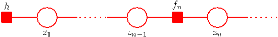

To derive the alpha-beta algorithm, we denote the final hidden variable $\mathbf{z}_N$ as the root node, and first pass messages from the leaf node $h$ to the root. From the general results (8.66) and (8.69) for message propagation, we see that the messages which are propagated in the hidden Markov model take the form

$$
\mu_{z_{n-1} \to f_n}(\mathbf{z}_{n-1}) = \mu_{f_{n-1} \to z_{n-1}}(\mathbf{z}_{n-1}) \tag{13.47}
$$

$$
\mu_{f_n \to z_n}(\mathbf{z}_n) = \sum_{\mathbf{z}_{n-1}} f_n(\mathbf{z}_{n-1}, \mathbf{z}_n)\mu_{z_{n-1} \to f_n}(\mathbf{z}_{n-1}) \tag{13.48}
$$

These equations represent the propagation of messages forward along the chain and are equivalent to the alpha recursions derived in the previous section, as we shall now show. Note that because the variable nodes $\mathbf{z}_n$ have only two neighbours, they perform no computation.

We can eliminate $\mu_{z_{n-1} \to f_n}(\mathbf{z}_{n-1})$ from (13.48) using (13.47) to give a recursion for the $f \to z$ messages of the form

$$
\mu_{f_n \to z_n}(\mathbf{z}_n) = \sum_{\mathbf{z}_{n-1}} f_n(\mathbf{z}_{n-1}, \mathbf{z}_n)\mu_{f_{n-1} \to z_{n-1}}(\mathbf{z}_{n-1}). \tag{13.49}
$$

If we now recall the definition (13.46), and if we define

$$
\alpha(\mathbf{z}_n) = \mu_{f_n \to z_n}(\mathbf{z}_n) \tag{13.50}
$$

then we obtain the alpha recursion given by (13.36). We also need to verify that the quantities $\alpha(\mathbf{z}_n)$ are themselves equivalent to those defined previously. This is easily done by using the initial condition (8.71) and noting that $\alpha(\mathbf{z}_1)$ is given by $h(\mathbf{z}_1) = p(\mathbf{z}_1)p(\mathbf{x}_1|\mathbf{z}_1)$ which is identical to (13.37). Because the initial $\alpha$ is the same, and because they are iteratively computed using the same equation, all subsequent $\alpha$ quantities must be the same.

Next we consider the messages that are propagated from the root node back to the leaf node. These take the form

$$
\mu_{f_{n+1} \to z_n}(\mathbf{z}_n) = \sum_{\mathbf{z}_{n+1}} f_{n+1}(\mathbf{z}_n, \mathbf{z}_{n+1})\mu_{f_{n+2} \to z_{n+1}}(\mathbf{z}_{n+1}) \tag{13.51}
$$

where, as before, we have eliminated the messages of the type $z \to f$ since the variable nodes perform no computation. Using the definition (13.46) to substitute for $f_{n+1}(\mathbf{z}_n, \mathbf{z}_{n+1})$, and defining

$$
\beta(\mathbf{z}_n) = \mu_{f_{n+1} \to z_n}(\mathbf{z}_n) \tag{13.52}
$$

[Page 647]

we obtain the beta recursion given by (13.38). Again, we can verify that the beta variables themselves are equivalent by noting that (8.70) implies that the initial message send by the root variable node is $\mu_{z_N \to f_N}(\mathbf{z}_N) = 1$, which is identical to the initialization of $\beta(\mathbf{z}_N)$ given in Section 13.2.2.

The sum-product algorithm also specifies how to evaluate the marginals once all the messages have been evaluated. In particular, the result (8.63) shows that the local marginal at the node $\mathbf{z}_n$ is given by the product of the incoming messages. Because we have conditioned on the variables $\mathbf{X} = \{\mathbf{x}_1, \dots, \mathbf{x}_N\}$, we are computing the joint distribution

$$
p(\mathbf{z}_n, \mathbf{X}) = \mu_{f_n \to z_n}(\mathbf{z}_n)\mu_{f_{n+1} \to z_n}(\mathbf{z}_n) = \alpha(\mathbf{z}_n)\beta(\mathbf{z}_n). \tag{13.53}
$$

Dividing both sides by $p(\mathbf{X})$, we then obtain

$$
\gamma(\mathbf{z}_n) = \frac{p(\mathbf{z}_n, \mathbf{X})}{p(\mathbf{X})} = \frac{\alpha(\mathbf{z}_n)\beta(\mathbf{z}_n)}{p(\mathbf{X})} \tag{13.54}
$$

in agreement with (13.33). The result (13.43) can similarly be derived from (8.72).

## 13.2.4 Scaling factors

There is an important issue that must be addressed before we can make use of the forward backward algorithm in practice. From the recursion relation (13.36), we note that at each step the new value $\alpha(\mathbf{z}_n)$ is obtained from the previous value $\alpha(\mathbf{z}_{n-1})$ by multiplying by quantities $p(\mathbf{z}_n|\mathbf{z}_{n-1})$ and $p(\mathbf{x}_n|\mathbf{z}_n)$. Because these probabilities are often significantly less than unity, as we work our way forward along the chain, the values of $\alpha(\mathbf{z}_n)$ can go to zero exponentially quickly. For moderate lengths of chain (say 100 or so), the calculation of the $\alpha(\mathbf{z}_n)$ will soon exceed the dynamic range of the computer, even if double precision floating point is used.

In the case of i.i.d. data, we implicitly circumvented this problem with the evaluation of likelihood functions by taking logarithms. Unfortunately, this will not help here because we are forming sums of products of small numbers (we are in fact implicitly summing over all possible paths through the lattice diagram of Figure 13.7). We therefore work with re-scaled versions of $\alpha(\mathbf{z}_n)$ and $\beta(\mathbf{z}_n)$ whose values remain of order unity. As we shall see, the corresponding scaling factors cancel out when we use these re-scaled quantities in the EM algorithm.

In (13.34), we defined $\alpha(\mathbf{z}_n) = p(\mathbf{x}_1, \dots, \mathbf{x}_n, \mathbf{z}_n)$ representing the joint distribution of all the observations up to $\mathbf{x}_n$ and the latent variable $\mathbf{z}_n$. Now we define a normalized version of $\alpha$ given by

$$
\widehat{\alpha}(\mathbf{z}_n) = p(\mathbf{z}_n|\mathbf{x}_1, \dots, \mathbf{x}_n) = \frac{\alpha(\mathbf{z}_n)}{p(\mathbf{x}_1, \dots, \mathbf{x}_n)} \tag{13.55}
$$

which we expect to be well behaved numerically because it is a probability distribution over $K$ variables for any value of $n$. In order to relate the scaled and original alpha variables, we introduce scaling factors defined by conditional distributions over the observed variables

$$
c_n = p(\mathbf{x}_n|\mathbf{x}_1, \dots, \mathbf{x}_{n-1}). \tag{13.56}
$$

[Page 648]

From the product rule, we then have

$$
p(\mathbf{x}_1, \dots, \mathbf{x}_n) = \prod_{m=1}^n c_m \tag{13.57}
$$

and so

$$
\alpha(\mathbf{z}_n) = p(\mathbf{z}_n|\mathbf{x}_1, \dots, \mathbf{x}_n)p(\mathbf{x}_1, \dots, \mathbf{x}_n) = \left( \prod_{m=1}^n c_m \right) \widehat{\alpha}(\mathbf{z}_n). \tag{13.58}
$$

We can then turn the recursion equation (13.36) for $\alpha$ into one for $\widehat{\alpha}$ given by

$$
c_n \widehat{\alpha}(\mathbf{z}_n) = p(\mathbf{x}_n|\mathbf{z}_n) \sum_{\mathbf{z}_{n-1}} \widehat{\alpha}(\mathbf{z}_{n-1})p(\mathbf{z}_n|\mathbf{z}_{n-1}). \tag{13.59}
$$

Note that at each stage of the forward message passing phase, used to evaluate $\widehat{\alpha}(\mathbf{z}_n)$, we have to evaluate and store $c_n$, which is easily done because it is the coefficient that normalizes the right-hand side of (13.59) to give $\widehat{\alpha}(\mathbf{z}_n)$.

We can similarly define re-scaled variables $\widehat{\beta}(\mathbf{z}_n)$ using

$$
\beta(\mathbf{z}_n) = \left( \prod_{m=n+1}^N c_m \right) \widehat{\beta}(\mathbf{z}_n) \tag{13.60}
$$

which will again remain within machine precision because, from (13.35), the quantities $\widehat{\beta}(\mathbf{z}_n)$ are simply the ratio of two conditional probabilities

$$
\widehat{\beta}(\mathbf{z}_n) = \frac{p(\mathbf{x}_{n+1}, \dots, \mathbf{x}_N|\mathbf{z}_n)}{p(\mathbf{x}_{n+1}, \dots, \mathbf{x}_N|\mathbf{x}_1, \dots, \mathbf{x}_n)}. \tag{13.61}
$$

The recursion result (13.38) for $\beta$ then gives the following recursion for the re-scaled variables

$$
c_{n+1} \widehat{\beta}(\mathbf{z}_n) = \sum_{\mathbf{z}_{n+1}} \widehat{\beta}(\mathbf{z}_{n+1})p(\mathbf{x}_{n+1}|\mathbf{z}_{n+1})p(\mathbf{z}_{n+1}|\mathbf{z}_n). \tag{13.62}
$$

In applying this recursion relation, we make use of the scaling factors $c_n$ that were previously computed in the $\alpha$ phase.

From (13.57), we see that the likelihood function can be found using

$$
p(\mathbf{X}) = \prod_{n=1}^N c_n. \tag{13.63}
$$

Similarly, using (13.33) and (13.43), together with (13.63), we see that the required marginals are given by

$$
\gamma(\mathbf{z}_n) = \widehat{\alpha}(\mathbf{z}_n)\widehat{\beta}(\mathbf{z}_n) \tag{13.64}
$$

$$
\xi(\mathbf{z}_{n-1}, \mathbf{z}_n) = c_n \widehat{\alpha}(\mathbf{z}_{n-1})p(\mathbf{x}_n|\mathbf{z}_n)p(\mathbf{z}_n|\mathbf{z}_{n-1})\widehat{\beta}(\mathbf{z}_n). \tag{13.65}
$$

[Page 649]

Finally, we note that there is an alternative formulation of the forward-backward algorithm (Jordan, 2007) in which the backward pass is defined by a recursion based the quantities $\gamma(\mathbf{z}_n) = \widehat{\alpha}(\mathbf{z}_n)\widehat{\beta}(\mathbf{z}_n)$ instead of using $\widehat{\beta}(\mathbf{z}_n)$. This $\alpha$–$\gamma$ recursion requires that the forward pass be completed first so that all the quantities $\widehat{\alpha}(\mathbf{z}_n)$ are available for the backward pass, whereas the forward and backward passes of the $\alpha$–$\beta$ algorithm can be done independently. Although these two algorithms have comparable computational cost, the $\alpha$–$\beta$ version is the most commonly encountered one in the case of hidden Markov models, whereas for linear dynamical systems a recursion analogous to the $\alpha$–$\gamma$ form is more usual.

## 13.2.5 The Viterbi algorithm

In many applications of hidden Markov models, the latent variables have some meaningful interpretation, and so it is often of interest to find the most probable sequence of hidden states for a given observation sequence. For instance in speech recognition, we might wish to find the most probable phoneme sequence for a given series of acoustic observations. Because the graph for the hidden Markov model is a directed tree, this problem can be solved exactly using the max-sum algorithm. We recall from our discussion in Section 8.4.5 that the problem of finding the most probable sequence of latent states is not the same as that of finding the set of states that are individually the most probable. The latter problem can be solved by first running the forward-backward (sum-product) algorithm to find the latent variable marginals $\gamma(\mathbf{z}_n)$ and then maximizing each of these individually (Duda et al., 2001). However, the set of such states will not, in general, correspond to the most probable sequence of states. In fact, this set of states might even represent a sequence having zero probability, if it so happens that two successive states, which in isolation are individually the most probable, are such that the transition matrix element connecting them is zero.

In practice, we are usually interested in finding the most probable sequence of states, and this can be solved efficiently using the max-sum algorithm, which in the context of hidden Markov models is known as the Viterbi algorithm (Viterbi, 1967). Note that the max-sum algorithm works with log probabilities and so there is no need to use re-scaled variables as was done with the forward-backward algorithm. Figure 13.16 shows a fragment of the hidden Markov model expanded as lattice diagram. As we have already noted, the number of possible paths through the lattice grows exponentially with the length of the chain. The Viterbi algorithm searches this space of paths efficiently to find the most probable path with a computational cost that grows only linearly with the length of the chain.

As with the sum-product algorithm, we first represent the hidden Markov model as a factor graph, as shown in Figure 13.15. Again, we treat the variable node $\mathbf{z}_N$ as the root, and pass messages to the root starting with the leaf nodes. Using the results (8.93) and (8.94), we see that the messages passed in the max-sum algorithm are given by

$$
\mu_{z_n \to f_{n+1}}(\mathbf{z}_n) = \mu_{f_n \to z_n}(\mathbf{z}_n) \tag{13.66}
$$

$$
\mu_{f_{n+1} \to z_{n+1}}(\mathbf{z}_{n+1}) = \max_{\mathbf{z}_n} \{ \ln f_{n+1}(\mathbf{z}_n, \mathbf{z}_{n+1}) + \mu_{z_n \to f_{n+1}}(\mathbf{z}_n) \}. \tag{13.67}
$$

[Page 650]

Figure 13.16 A fragment of the HMM lattice showing two possible paths. The Viterbi algorithm efficiently determines the most probable path from amongst the exponentially many possibilities. For any given path, the corresponding probability is given by the product of the elements of the transition matrix $A_{jk}$, corresponding to the probabilities $p(\mathbf{z}_{n+1}|\mathbf{z}_n)$ for each segment of the path, along with the emission densities $p(\mathbf{x}_n|k)$ associated with each node on the path.

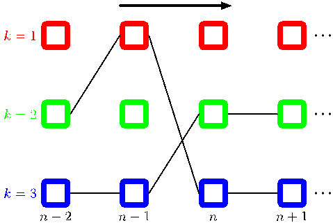

If we eliminate $\mu_{z_n \to f_{n+1}}(\mathbf{z}_n)$ between these two equations, and make use of (13.46), we obtain a recursion for the $f \to z$ messages of the form

$$
\omega(\mathbf{z}_{n+1}) = \ln p(\mathbf{x}_{n+1}|\mathbf{z}_{n+1}) + \max_{\mathbf{z}_n} \{ \ln p(\mathbf{z}_{n+1}|\mathbf{z}_n) + \omega(\mathbf{z}_n) \} \tag{13.68}
$$

where we have introduced the notation $\omega(\mathbf{z}_n) \equiv \mu_{f_n \to z_n}(\mathbf{z}_n)$. From (8.95) and (8.96), these messages are initialized using

$$
\omega(\mathbf{z}_1) = \ln p(\mathbf{z}_1) + \ln p(\mathbf{x}_1|\mathbf{z}_1). \tag{13.69}
$$

where we have used (13.45). Note that to keep the notation uncluttered, we omit the dependence on the model parameters $\boldsymbol{\theta}$ that are held fixed when finding the most probable sequence.

The Viterbi algorithm can also be derived directly from the definition (13.6) of the joint distribution by taking the logarithm and then exchanging maximizations and summations. It is easily seen that the quantities $\omega(\mathbf{z}_n)$ have the probabilistic interpretation

$$
\omega(\mathbf{z}_n) = \max_{\mathbf{z}_1, \dots, \mathbf{z}_{n-1}} p(\mathbf{x}_1, \dots, \mathbf{x}_n, \mathbf{z}_1, \dots, \mathbf{z}_n). \tag{13.70}
$$

Once we have completed the final maximization over $\mathbf{z}_N$, we will obtain the value of the joint distribution $p(\mathbf{X}, \mathbf{Z})$ corresponding to the most probable path. We also wish to find the sequence of latent variable values that corresponds to this path. To do this, we simply make use of the back-tracking procedure discussed in Section 8.4.5. Specifically, we note that the maximization over $\mathbf{z}_n$ must be performed for each of the $K$ possible values of $\mathbf{z}_{n+1}$. Suppose we keep a record of the values of $\mathbf{z}_n$ that correspond to the maxima for each value of the $K$ values of $\mathbf{z}_{n+1}$. Let us denote this function by $\psi(k_n)$ where $k \in \{1, \dots, K\}$. Once we have passed messages to the end of the chain and found the most probable state of $\mathbf{z}_N$, we can then use this function to backtrack along the chain by applying it recursively

$$
k_n^{\max} = \psi(k_{n+1}^{\max}). \tag{13.71}
$$

[Page 651]

Intuitively, we can understand the Viterbi algorithm as follows. Naively, we could consider explicitly all of the exponentially many paths through the lattice, evaluate the probability for each, and then select the path having the highest probability. However, we notice that we can make a dramatic saving in computational cost as follows. Suppose that for each path we evaluate its probability by summing up products of transition and emission probabilities as we work our way forward along each path through the lattice. Consider a particular time step $n$ and a particular state $k$ at that time step. There will be many possible paths converging on the corresponding node in the lattice diagram. However, we need only retain that particular path that so far has the highest probability. Because there are $K$ states at time step $n$, we need to keep track of $K$ such paths. At time step $n + 1$, there will be $K^2$ possible paths to consider, comprising $K$ possible paths leading out of each of the $K$ current states, but again we need only retain $K$ of these corresponding to the best path for each state at time $n+1$. When we reach the final time step $N$ we will discover which state corresponds to the overall most probable path. Because there is a unique path coming into that state we can trace the path back to step $N - 1$ to see what state it occupied at that time, and so on back through the lattice to the state $n = 1$.

## 13.2.6 Extensions of the hidden Markov model

The basic hidden Markov model, along with the standard training algorithm based on maximum likelihood, has been extended in numerous ways to meet the requirements of particular applications. Here we discuss a few of the more important examples.

We see from the digits example in Figure 13.11 that hidden Markov models can be quite poor generative models for the data, because many of the synthetic digits look quite unrepresentative of the training data. If the goal is sequence classification, there can be significant benefit in determining the parameters of hidden Markov models using discriminative rather than maximum likelihood techniques. Suppose we have a training set of $R$ observation sequences $\mathbf{X}_r$, where $r = 1, \dots, R$, each of which is labelled according to its class $m$, where $m = 1, \dots, M$. For each class, we have a separate hidden Markov model with its own parameters $\boldsymbol{\theta}_m$, and we treat the problem of determining the parameter values as a standard classification problem in which we optimize the cross-entropy

$$
\sum_{r=1}^R \ln p(m_r|\mathbf{X}_r). \tag{13.72}
$$

Using Bayes’ theorem this can be expressed in terms of the sequence probabilities associated with the hidden Markov models

$$
\sum_{r=1}^R \ln \left\{ \frac{p(\mathbf{X}_r|\boldsymbol{\theta}_{m_r})p(m_r)}{\sum_{l=1}^M p(\mathbf{X}_r|\boldsymbol{\theta}_l)p(l)} \right\} \tag{13.73}
$$

where $p(m)$ is the prior probability of class $m$. Optimization of this cost function is more complex than for maximum likelihood (Kapadia, 1998), and in particular
[Page 652]

Figure 13.17 Section of an autoregressive hidden Markov model, in which the distribution of the observation $\mathbf{x}_n$ depends on a subset of the previous observations as well as on the hidden state $\mathbf{z}_n$. In this example, the distribution of $\mathbf{x}_n$ depends on the two previous observations $\mathbf{x}_{n-1}$ and $\mathbf{x}_{n-2}$.

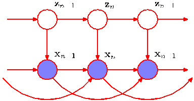

requires that every training sequence be evaluated under each of the models in order to compute the denominator in (13.73). Hidden Markov models, coupled with discriminative training methods, are widely used in speech recognition (Kapadia, 1998).

A significant weakness of the hidden Markov model is the way in which it represents the distribution of times for which the system remains in a given state. To see the problem, note that the probability that a sequence sampled from a given hidden Markov model will spend precisely $T$ steps in state $k$ and then make a transition to a different state is given by

$$
p(T) = (A_{kk})^T(1 - A_{kk}) \propto \exp(-T \ln A_{kk}) \tag{13.74}
$$

and so is an exponentially decaying function of $T$. For many applications, this will be a very unrealistic model of state duration. The problem can be resolved by modelling state duration directly in which the diagonal coefficients $A_{kk}$ are all set to zero, and each state $k$ is explicitly associated with a probability distribution $p(T|k)$ of possible duration times. From a generative point of view, when a state $k$ is entered, a value $T$ representing the number of time steps that the system will remain in state $k$ is then drawn from $p(T|k)$. The model then emits $T$ values of the observed variable $\mathbf{x}_t$, which are generally assumed to be independent so that the corresponding emission density is simply $\prod_{t=1}^T p(\mathbf{x}_t|k)$. This approach requires some straightforward modifications to the EM optimization procedure (Rabiner, 1989).

Another limitation of the standard HMM is that it is poor at capturing longrange correlations between the observed variables (i.e., between variables that are separated by many time steps) because these must be mediated via the first-order Markov chain of hidden states. Longer-range effects could in principle be included by adding extra links to the graphical model of Figure 13.5. One way to address this is to generalize the HMM to give the autoregressive hidden Markov model (Ephraim et al., 1989), an example of which is shown in Figure 13.17. For discrete observations, this corresponds to expanded tables of conditional probabilities for the emission distributions. In the case of a Gaussian emission density, we can use the linearGaussian framework in which the conditional distribution for $\mathbf{x}_n$ given the values of the previous observations, and the value of $\mathbf{z}_n$, is a Gaussian whose mean is a linear combination of the values of the conditioning variables. Clearly the number of additional links in the graph must be limited to avoid an excessive the number of free parameters. In the example shown in Figure 13.17, each observation depends on the two preceding observed variables as well as on the hidden state. Although this graph looks messy, we can again appeal to d-separation to see that in fact it still has a simple probabilistic structure. In particular, if we imagine conditioning on $\mathbf{z}_n$ we see that, as with the standard HMM, the values of $\mathbf{z}_{n-1}$ and $\mathbf{z}_{n+1}$ are independent, corresponding to the conditional independence property (13.5). This is easily verified by noting that every path from node $\mathbf{z}_{n-1}$ to node $\mathbf{z}_{n+1}$ passes through at least one observed node that is head-to-tail with respect to that path. As a consequence, we can again use a forward-backward recursion in the E step of the EM algorithm to determine the posterior distributions of the latent variables in a computational time that is linear in the length of the chain. Similarly, the M step involves only a minor modification of the standard M-step equations. In the case of Gaussian emission densities this involves estimating the parameters using the standard linear regression equations, discussed in Chapter 3.
[Page 653]

Figure 13.18 Example of an input-output hidden Markov model. In this case, both the emission probabilities and the transition probabilities depend on the values of a sequence of observations $\mathbf{u}_1, \dots, \mathbf{u}_N$.

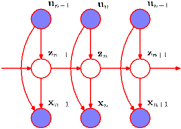

the two preceding observed variables as well as on the hidden state. Although this graph looks messy, we can again appeal to d-separation to see that in fact it still has a simple probabilistic structure. In particular, if we imagine conditioning on $\mathbf{z}_n$ we see that, as with the standard HMM, the values of $\mathbf{z}_{n-1}$ and $\mathbf{z}_{n+1}$ are independent, corresponding to the conditional independence property (13.5). This is easily verified by noting that every path from node $\mathbf{z}_{n-1}$ to node $\mathbf{z}_{n+1}$ passes through at least one observed node that is head-to-tail with respect to that path. As a consequence, we can again use a forward-backward recursion in the E step of the EM algorithm to determine the posterior distributions of the latent variables in a computational time that is linear in the length of the chain. Similarly, the M step involves only a minor modification of the standard M-step equations. In the case of Gaussian emission densities this involves estimating the parameters using the standard linear regression equations, discussed in Chapter 3.

We have seen that the autoregressive HMM appears as a natural extension of the standard HMM when viewed as a graphical model. In fact the probabilistic graphical modelling viewpoint motivates a plethora of different graphical structures based on the HMM. Another example is the input-output hidden Markov model (Bengio and Frasconi, 1995), in which we have a sequence of observed variables $\mathbf{u}_1, \dots, \mathbf{u}_N$, in addition to the output variables $\mathbf{x}_1, \dots, \mathbf{x}_N$, whose values influence either the distribution of latent variables or output variables, or both. An example is shown in Figure 13.18. This extends the HMM framework to the domain of supervised learning for sequential data. It is again easy to show, through the use of the d-separation criterion, that the Markov property (13.5) for the chain of latent variables still holds. To verify this, simply note that there is only one path from node $\mathbf{z}_{n-1}$ to node $\mathbf{z}_{n+1}$ and this is head-to-tail with respect to the observed node $\mathbf{z}_n$. This conditional independence property again allows the formulation of a computationally efficient learning algorithm. In particular, we can determine the parameters $\boldsymbol{\theta}$ of the model by maximizing the likelihood function $L(\boldsymbol{\theta}) = p(\mathbf{X}|\mathbf{U}, \boldsymbol{\theta})$ where $\mathbf{U}$ is a matrix whose rows are given by $\mathbf{u}_n^{\text{T}}$. As a consequence of the conditional independence property (13.5) this likelihood function can be maximized efficiently using an EM algorithm in which the E step involves forward and backward recursions.

Another variant of the HMM worthy of mention is the factorial hidden Markov model (Ghahramani and Jordan, 1997), in which there are multiple independent
[Page 654]

Figure 13.19 A factorial hidden Markov model comprising two Markov chains of latent variables. For continuous observed variables $\mathbf{x}$, one possible choice of emission model is a linear-Gaussian density in which the mean of the Gaussian is a linear combination of the states of the corresponding latent variables.

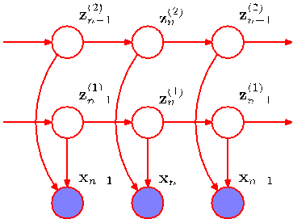

Markov chains of latent variables, and the distribution of the observed variable at a given time step is conditional on the states of all of the corresponding latent variables at that same time step. Figure 13.19 shows the corresponding graphical model. The motivation for considering factorial HMM can be seen by noting that in order to represent, say, 10 bits of information at a given time step, a standard HMM would need $K = 2^{10} = 1024$ latent states, whereas a factorial HMM could make use of 10 binary latent chains. The primary disadvantage of factorial HMMs, however, lies in the additional complexity of training them. The M step for the factorial HMM model is straightforward. However, observation of the $\mathbf{x}$ variables introduces dependencies between the latent chains, leading to difficulties with the E step. This can be seen by noting that in Figure 13.19, the variables $\mathbf{z}_n^{(1)}$ and $\mathbf{z}_n^{(2)}$ are connected by a path which is head-to-head at node $\mathbf{x}_n$ and hence they are not d-separated. The exact E step for this model does not correspond to running forward and backward recursions along the $M$ Markov chains independently. This is confirmed by noting that the key conditional independence property (13.5) is not satisfied for the individual Markov chains in the factorial HMM model, as is shown using d-separation in Figure 13.20. Now suppose that there are $M$ chains of hidden nodes and for simplicity suppose that all latent variables have the same number $K$ of states. Then one approach would be to note that there are $K^M$ combinations of latent variables at a given time step

Figure 13.20 Example of a path, highlighted in green, which is head-to-head at the observed nodes $\mathbf{x}_{n-1}$ and $\mathbf{x}_{n+1}$, and head-to-tail at the unobserved nodes $\mathbf{z}_{n-1}^{(2)}$, $\mathbf{z}_n^{(2)}$ and $\mathbf{z}_{n+1}^{(2)}$. Thus the path is not blocked and so the conditional independence property (13.5) does not hold for the individual latent chains of the factorial HMM model. As a consequence, there is no efficient exact E step for this model.

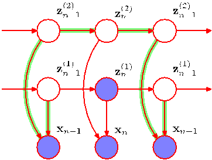
[Page 655]

and so we can transform the model into an equivalent standard HMM having a single chain of latent variables each of which has $K^M$ latent states. We can then run the standard forward-backward recursions in the E step. This has computational complexity $O(NK^{2M})$ that is exponential in the number $M$ of latent chains and so will be intractable for anything other than small values of $M$. One solution would be to use sampling methods (discussed in Chapter 11). As an elegant deterministic alternative, Ghahramani and Jordan (1997) exploited variational inference techniques to obtain a tractable algorithm for approximate inference. This can be done using a simple variational posterior distribution that is fully factorized with respect to the latent variables, or alternatively by using a more powerful approach in which the variational distribution is described by independent Markov chains corresponding to the chains of latent variables in the original model. In the latter case, the variational inference algorithms involves running independent forward and backward recursions along each chain, which is computationally efficient and yet is also able to capture correlations between variables within the same chain.

Clearly, there are many possible probabilistic structures that can be constructed according to the needs of particular applications. Graphical models provide a general technique for motivating, describing, and analysing such structures, and variational methods provide a powerful framework for performing inference in those models for which exact solution is intractable.

## 13.3. Linear Dynamical Systems

In order to motivate the concept of linear dynamical systems, let us consider the following simple problem, which often arises in practical settings. Suppose we wish to measure the value of an unknown quantity $z$ using a noisy sensor that returns a observation $x$ representing the value of $z$ plus zero-mean Gaussian noise. Given a single measurement, our best guess for $z$ is to assume that $z = x$. However, we can improve our estimate for $z$ by taking lots of measurements and averaging them, because the random noise terms will tend to cancel each other. Now let’s make the situation more complicated by assuming that we wish to measure a quantity $z$ that is changing over time. We can take regular measurements of $x$ so that at some point in time we have obtained $x_1, \dots, x_N$ and we wish to find the corresponding values $z_1, \dots, z_N$. If we simply average the measurements, the error due to random noise will be reduced, but unfortunately we will just obtain a single averaged estimate, in which we have averaged over the changing value of $z$, thereby introducing a new source of error.

Intuitively, we could imagine doing a bit better as follows. To estimate the value of $z_N$, we take only the most recent few measurements, say $x_{N-L}, \dots, x_N$ and just average these. If $z$ is changing slowly, and the random noise level in the sensor is high, it would make sense to choose a relatively long window of observations to average. Conversely, if the signal is changing quickly, and the noise levels are small, we might be better just to use $x_N$ directly as our estimate of $z_N$. Perhaps we could do even better if we take a weighted average, in which more recent measurements
[Page 656]

make a greater contribution than less recent ones.

Although this sort of intuitive argument seems plausible, it does not tell us how to form a weighted average, and any sort of hand-crafted weighing is hardly likely to be optimal. Fortunately, we can address problems such as this much more systematically by defining a probabilistic model that captures the time evolution and measurement processes and then applying the inference and learning methods developed in earlier chapters. Here we shall focus on a widely used model known as a linear dynamical system.

As we have seen, the HMM corresponds to the state space model shown in Figure 13.5 in which the latent variables are discrete but with arbitrary emission probability distributions. This graph of course describes a much broader class of probability distributions, all of which factorize according to (13.6). We now consider extensions to other distributions for the latent variables. In particular, we consider continuous latent variables in which the summations of the sum-product algorithm become integrals. The general form of the inference algorithms will, however, be the same as for the hidden Markov model. It is interesting to note that, historically, hidden Markov models and linear dynamical systems were developed independently. Once they are both expressed as graphical models, however, the deep relationship between them immediately becomes apparent.

One key requirement is that we retain an efficient algorithm for inference which is linear in the length of the chain. This requires that, for instance, when we take a quantity $\alpha(\mathbf{z}_{n-1})$, representing the posterior probability of $\mathbf{z}_n$ given observations $\mathbf{x}_1, \dots, \mathbf{x}_n$, and multiply by the transition probability $p(\mathbf{z}_n|\mathbf{z}_{n-1})$ and the emission probability $p(\mathbf{x}_n|\mathbf{z}_n)$ and then marginalize over $\mathbf{z}_{n-1}$, we obtain a distribution over $\mathbf{z}_n$ that is of the same functional form as that over $\alpha(\mathbf{z}_{n-1})$. That is to say, the distribution must not become more complex at each stage, but must only change in its parameter values. Not surprisingly, the only distributions that have this property of being closed under multiplication are those belonging to the exponential family.

Here we consider the most important example from a practical perspective, which is the Gaussian. In particular, we consider a linear-Gaussian state space model so that the latent variables $\{\mathbf{z}_n\}$, as well as the observed variables $\{\mathbf{x}_n\}$, are multivariate Gaussian distributions whose means are linear functions of the states of their parents in the graph. We have seen that a directed graph of linear-Gaussian units is equivalent to a joint Gaussian distribution over all of the variables. Furthermore, marginals such as $\alpha(\mathbf{z}_n)$ are also Gaussian, so that the functional form of the messages is preserved and we will obtain an efficient inference algorithm. By contrast, suppose that the emission densities $p(\mathbf{x}_n|\mathbf{z}_n)$ comprise a mixture of $K$ Gaussians each of which has a mean that is linear in $\mathbf{z}_n$. Then even if $\alpha(\mathbf{z}_1)$ is Gaussian, the quantity $\alpha(\mathbf{z}_2)$ will be a mixture of $K$ Gaussians, $\alpha(\mathbf{z}_3)$ will be a mixture of $K^2$ Gaussians, and so on, and exact inference will not be of practical value.

We have seen that the hidden Markov model can be viewed as an extension of the mixture models of Chapter 9 to allow for sequential correlations in the data. In a similar way, we can view the linear dynamical system as a generalization of the continuous latent variable models of Chapter 12 such as probabilistic PCA and factor analysis. Each pair of nodes $\{\mathbf{z}_n, \mathbf{x}_n\}$ represents a linear-Gaussian latent variable
[Page 657]

model for that particular observation. However, the latent variables $\{\mathbf{z}_n\}$ are no longer treated as independent but now form a Markov chain.

Because the model is represented by a tree-structured directed graph, inference problems can be solved efficiently using the sum-product algorithm. The forward recursions, analogous to the $\alpha$ messages of the hidden Markov model, are known as the Kalman filter equations (Kalman, 1960; Zarchan and Musoff, 2005), and the backward recursions, analogous to the $\beta$ messages, are known as the Kalman smoother equations, or the Rauch-Tung-Striebel (RTS) equations (Rauch et al., 1965). The Kalman filter is widely used in many real-time tracking applications.

Because the linear dynamical system is a linear-Gaussian model, the joint distribution over all variables, as well as all marginals and conditionals, will be Gaussian. It follows that the sequence of individually most probable latent variable values is the same as the most probable latent sequence. There is thus no need to consider the analogue of the Viterbi algorithm for the linear dynamical system.

Because the model has linear-Gaussian conditional distributions, we can write the transition and emission distributions in the general form

$$
p(\mathbf{z}_n|\mathbf{z}_{n-1}) = \mathcal{N}(\mathbf{z}_n|\mathbf{A}\mathbf{z}_{n-1}, \mathbf{\Gamma}) \tag{13.75}
$$

$$
p(\mathbf{x}_n|\mathbf{z}_n) = \mathcal{N}(\mathbf{x}_n|\mathbf{C}\mathbf{z}_n, \mathbf{\Sigma}). \tag{13.76}
$$

The initial latent variable also has a Gaussian distribution which we write as

$$
p(\mathbf{z}_1) = \mathcal{N}(\mathbf{z}_1|\boldsymbol{\mu}_0, \mathbf{V}_0). \tag{13.77}
$$

Note that in order to simplify the notation, we have omitted additive constant terms from the means of the Gaussians. In fact, it is straightforward to include them if desired. Traditionally, these distributions are more commonly expressed in an equivalent form in terms of noisy linear equations given by

$$
\mathbf{z}_n = \mathbf{A}\mathbf{z}_{n-1} + \mathbf{w}_n \tag{13.78}
$$

$$
\mathbf{x}_n = \mathbf{C}\mathbf{z}_n + \mathbf{v}_n \tag{13.79}
$$

$$
\mathbf{z}_1 = \boldsymbol{\mu}_0 + \mathbf{u} \tag{13.80}
$$

where the noise terms have the distributions

$$
\mathbf{w} \sim \mathcal{N}(\mathbf{w}|\mathbf{0}, \mathbf{\Gamma}) \tag{13.81}
$$

$$
\mathbf{v} \sim \mathcal{N}(\mathbf{v}|\mathbf{0}, \mathbf{\Sigma}) \tag{13.82}
$$

$$
\mathbf{u} \sim \mathcal{N}(\mathbf{u}|\mathbf{0}, \mathbf{V}_0). \tag{13.83}
$$

The parameters of the model, denoted by $\boldsymbol{\theta} = \{\mathbf{A}, \mathbf{\Gamma}, \mathbf{C}, \mathbf{\Sigma}, \boldsymbol{\mu}_0, \mathbf{V}_0\}$, can be determined using maximum likelihood through the EM algorithm. In the E step, we need to solve the inference problem of determining the local posterior marginals for the latent variables, which can be solved efficiently using the sum-product algorithm, as we discuss in the next section.
[Page 658]

## 13.3.1 Inference in LDS

We now turn to the problem of finding the marginal distributions for the latent variables conditional on the observation sequence. For given parameter settings, we also wish to make predictions of the next latent state $\mathbf{z}_n$ and of the next observation $\mathbf{x}_n$ conditioned on the observed data $\mathbf{x}_1, \dots, \mathbf{x}_{n-1}$ for use in real-time applications. These inference problems can be solved efficiently using the sum-product algorithm, which in the context of the linear dynamical system gives rise to the Kalman filter and Kalman smoother equations.

It is worth emphasizing that because the linear dynamical system is a linearGaussian model, the joint distribution over all latent and observed variables is simply a Gaussian, and so in principle we could solve inference problems by using the standard results derived in previous chapters for the marginals and conditionals of a multivariate Gaussian. The role of the sum-product algorithm is to provide a more efficient way to perform such computations.

Linear dynamical systems have the identical factorization, given by (13.6), to hidden Markov models, and are again described by the factor graphs in Figures 13.14 and 13.15. Inference algorithms therefore take precisely the same form except that summations over latent variables are replaced by integrations. We begin by considering the forward equations in which we treat $\mathbf{z}_N$ as the root node, and propagate messages from the leaf node $h(\mathbf{z}_1)$ to the root. From (13.77), the initial message will be Gaussian, and because each of the factors is Gaussian, all subsequent messages will also be Gaussian. By convention, we shall propagate messages that are normalized marginal distributions corresponding to $p(\mathbf{z}_n|\mathbf{x}_1, \dots, \mathbf{x}_n)$, which we denote by

$$
\widehat{\alpha}(\mathbf{z}_n) = \mathcal{N}(\mathbf{z}_n|\boldsymbol{\mu}_n, \mathbf{V}_n). \tag{13.84}
$$

This is precisely analogous to the propagation of scaled variables $\widehat{\alpha}(\mathbf{z}_n)$ given by (13.59) in the discrete case of the hidden Markov model, and so the recursion equation now takes the form

$$
c_n \widehat{\alpha}(\mathbf{z}_n) = p(\mathbf{x}_n|\mathbf{z}_n) \int \widehat{\alpha}(\mathbf{z}_{n-1})p(\mathbf{z}_n|\mathbf{z}_{n-1}) \mathrm{d}\mathbf{z}_{n-1}. \tag{13.85}
$$

Substituting for the conditionals $p(\mathbf{z}_n|\mathbf{z}_{n-1})$ and $p(\mathbf{x}_n|\mathbf{z}_n)$, using (13.75) and (13.76), respectively, and making use of (13.84), we see that (13.85) becomes

$$
c_n \mathcal{N}(\mathbf{z}_n|\boldsymbol{\mu}_n, \mathbf{V}_n) = \mathcal{N}(\mathbf{x}_n|\mathbf{C}\mathbf{z}_n, \mathbf{\Sigma}) \int \mathcal{N}(\mathbf{z}_n|\mathbf{A}\mathbf{z}_{n-1}, \mathbf{\Gamma})\mathcal{N}(\mathbf{z}_{n-1}|\boldsymbol{\mu}_{n-1}, \mathbf{V}_{n-1}) \mathrm{d}\mathbf{z}_{n-1}. \tag{13.86}
$$

Here we are supposing that $\boldsymbol{\mu}_{n-1}$ and $\mathbf{V}_{n-1}$ are known, and by evaluating the integral in (13.86), we wish to determine values for $\boldsymbol{\mu}_n$ and $\mathbf{V}_n$. The integral is easily evaluated by making use of the result (2.115), from which it follows that

$$
\int \mathcal{N}(\mathbf{z}_n|\mathbf{A}\mathbf{z}_{n-1}, \mathbf{\Gamma})\mathcal{N}(\mathbf{z}_{n-1}|\boldsymbol{\mu}_{n-1}, \mathbf{V}_{n-1}) \mathrm{d}\mathbf{z}_{n-1} = \mathcal{N}(\mathbf{z}_n|\mathbf{A}\boldsymbol{\mu}_{n-1}, \mathbf{P}_{n-1}) \tag{13.87}
$$

[Page 659]

where we have defined

$$
\mathbf{P}_{n-1} = \mathbf{A}\mathbf{V}_{n-1}\mathbf{A}^{\text{T}} + \mathbf{\Gamma}. \tag{13.88}
$$

We can now combine this result with the first factor on the right-hand side of (13.86) by making use of (2.115) and (2.116) to give

$$
\boldsymbol{\mu}_n = \mathbf{A}\boldsymbol{\mu}_{n-1} + \mathbf{K}_n(\mathbf{x}_n - \mathbf{C}\mathbf{A}\boldsymbol{\mu}_{n-1}) \tag{13.89}
$$

$$
\mathbf{V}_n = (\mathbf{I} - \mathbf{K}_n\mathbf{C})\mathbf{P}_{n-1} \tag{13.90}
$$

$$
c_n = \mathcal{N}(\mathbf{x}_n|\mathbf{C}\mathbf{A}\boldsymbol{\mu}_{n-1}, \mathbf{C}\mathbf{P}_{n-1}\mathbf{C}^{\text{T}} + \mathbf{\Sigma}). \tag{13.91}
$$

Here we have made use of the matrix inverse identities (C.5) and (C.7) and also defined the Kalman gain matrix

$$
\mathbf{K}_n = \mathbf{P}_{n-1}\mathbf{C}^{\text{T}}(\mathbf{C}\mathbf{P}_{n-1}\mathbf{C}^{\text{T}} + \mathbf{\Sigma})^{-1}. \tag{13.92}
$$

Thus, given the values of $\boldsymbol{\mu}_{n-1}$ and $\mathbf{V}_{n-1}$, together with the new observation $\mathbf{x}_n$, we can evaluate the Gaussian marginal for $\mathbf{z}_n$ having mean $\boldsymbol{\mu}_n$ and covariance $\mathbf{V}_n$, as well as the normalization coefficient $c_n$.

The initial conditions for these recursion equations are obtained from

$$
c_1 \widehat{\alpha}(\mathbf{z}_1) = p(\mathbf{z}_1)p(\mathbf{x}_1|\mathbf{z}_1). \tag{13.93}
$$

Because $p(\mathbf{z}_1)$ is given by (13.77), and $p(\mathbf{x}_1|\mathbf{z}_1)$ is given by (13.76), we can again make use of (2.115) to calculate $c_1$ and (2.116) to calculate $\boldsymbol{\mu}_1$ and $\mathbf{V}_1$ giving

$$
\boldsymbol{\mu}_1 = \boldsymbol{\mu}_0 + \mathbf{K}_1(\mathbf{x}_1 - \mathbf{C}\boldsymbol{\mu}_0) \tag{13.94}
$$

$$
\mathbf{V}_1 = (\mathbf{I} - \mathbf{K}_1\mathbf{C})\mathbf{V}_0 \tag{13.95}
$$

$$
c_1 = \mathcal{N}(\mathbf{x}_1|\mathbf{C}\boldsymbol{\mu}_0, \mathbf{C}\mathbf{V}_0\mathbf{C}^{\text{T}} + \mathbf{\Sigma}) \tag{13.96}
$$

where

$$
\mathbf{K}_1 = \mathbf{V}_0\mathbf{C}^{\text{T}}(\mathbf{C}\mathbf{V}_0\mathbf{C}^{\text{T}} + \mathbf{\Sigma})^{-1}. \tag{13.97}
$$

Similarly, the likelihood function for the linear dynamical system is given by (13.63) in which the factors $c_n$ are found using the Kalman filtering equations.

We can interpret the steps involved in going from the posterior marginal over $\mathbf{z}_{n-1}$ to the posterior marginal over $\mathbf{z}_n$ as follows. In (13.89), we can view the quantity $\mathbf{A}\boldsymbol{\mu}_{n-1}$ as the prediction of the mean over $\mathbf{z}_n$ obtained by simply taking the mean over $\mathbf{z}_{n-1}$ and projecting it forward one step using the transition probability matrix $\mathbf{A}$. This predicted mean would give a predicted observation for $\mathbf{x}_n$ given by $\mathbf{C}\mathbf{A}\boldsymbol{\mu}_{n-1}$ obtained by applying the emission probability matrix $\mathbf{C}$ to the predicted hidden state mean. We can view the update equation (13.89) for the mean of the hidden variable distribution as taking the predicted mean $\mathbf{A}\boldsymbol{\mu}_{n-1}$ and then adding a correction that is proportional to the error $\mathbf{x}_n - \mathbf{C}\mathbf{A}\boldsymbol{\mu}_{n-1}$ between the predicted observation and the actual observation. The coefficient of this correction is given by the Kalman gain matrix. Thus we can view the Kalman filter as a process of making successive predictions and then correcting these predictions in the light of the new observations. This is illustrated graphically in Figure 13.21.
[Page 660]

Figure 13.21 The linear dynamical system can be viewed as a sequence of steps in which increasing uncertainty in the state variable due to diffusion is compensated by the arrival of new data. In the left-hand plot, the blue curve shows the distribution $p(\mathbf{z}_{n-1}|\mathbf{x}_1, \dots, \mathbf{x}_{n-1})$, which incorporates all the data up to step $n - 1$. The diffusion arising from the nonzero variance of the transition probability $p(\mathbf{z}_n|\mathbf{z}_{n-1})$ gives the distribution $p(\mathbf{z}_n|\mathbf{x}_1, \dots, \mathbf{x}_{n-1})$, shown in red in the centre plot. Note that this is broader and shifted relative to the blue curve (which is shown dashed in the centre plot for comparison). The next data observation $\mathbf{x}_n$ contributes through the emission density $p(\mathbf{x}_n|\mathbf{z}_n)$, which is shown as a function of $\mathbf{z}_n$ in green on the right-hand plot. Note that this is not a density with respect to $\mathbf{z}_n$ and so is not normalized to one. Inclusion of this new data point leads to a revised distribution $p(\mathbf{z}_n|\mathbf{x}_1, \dots, \mathbf{x}_n)$ for the state density shown in blue. We see that observation of the data has shifted and narrowed the distribution compared to $p(\mathbf{z}_n|\mathbf{x}_1, \dots, \mathbf{x}_{n-1})$ (which is shown in dashed in the right-hand plot for comparison).

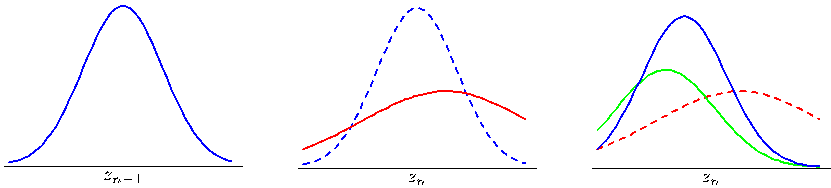

If we consider a situation in which the measurement noise is small compared to the rate at which the latent variable is evolving, then we find that the posterior distribution for $\mathbf{z}_n$ depends only on the current measurement $\mathbf{x}_n$, in accordance with the intuition from our simple example at the start of the section. Similarly, if the latent variable is evolving slowly relative to the observation noise level, we find that the posterior mean for $\mathbf{z}_n$ is obtained by averaging all of the measurements obtained up to that time.

One of the most important applications of the Kalman filter is to tracking, and this is illustrated using a simple example of an object moving in two dimensions in Figure 13.22.

So far, we have solved the inference problem of finding the posterior marginal for a node $\mathbf{z}_n$ given observations from $\mathbf{x}_1$ up to $\mathbf{x}_n$. Next we turn to the problem of finding the marginal for a node $\mathbf{z}_n$ given all observations $\mathbf{x}_1$ to $\mathbf{x}_N$. For temporal data, this corresponds to the inclusion of future as well as past observations. Although this cannot be used for real-time prediction, it plays a key role in learning the parameters of the model. By analogy with the hidden Markov model, this problem can be solved by propagating messages from node $\mathbf{x}_N$ back to node $\mathbf{x}_1$ and combining this information with that obtained during the forward message passing stage used to compute the $\widehat{\alpha}(\mathbf{z}_n)$.

In the LDS literature, it is usual to formulate this backward recursion in terms of $\gamma(\mathbf{z}_n) = \widehat{\alpha}(\mathbf{z}_n)\widehat{\beta}(\mathbf{z}_n)$ rather than in terms of $\widehat{\beta}(\mathbf{z}_n)$. Because $\gamma(\mathbf{z}_n)$ must also be Gaussian, we write it in the form

$$
\gamma(\mathbf{z}_n) = \widehat{\alpha}(\mathbf{z}_n)\widehat{\beta}(\mathbf{z}_n) = \mathcal{N}(\mathbf{z}_n|\widehat{\boldsymbol{\mu}}_n, \widehat{\mathbf{V}}_n). \tag{13.98}
$$

To derive the required recursion, we start from the backward recursion (13.62) for
[Page 661]

Figure 13.22 An illustration of a linear dynamical system being used to track a moving object. The blue points indicate the true positions of the object in a two-dimensional space at successive time steps, the green points denote noisy measurements of the positions, and the red crosses indicate the means of the inferred posterior distributions of the positions obtained by running the Kalman filtering equations. The covariances of the inferred positions are indicated by the red ellipses, which correspond to contours having one standard deviation.

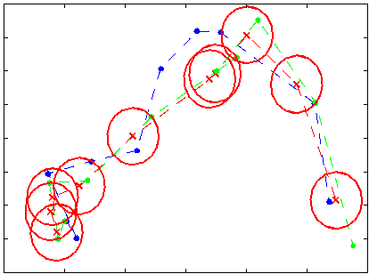

$\widehat{\beta}(\mathbf{z}_n)$, which, for continuous latent variables, can be written in the form

$$
c_{n+1} \widehat{\beta}(\mathbf{z}_n) = \int \widehat{\beta}(\mathbf{z}_{n+1})p(\mathbf{x}_{n+1}|\mathbf{z}_{n+1})p(\mathbf{z}_{n+1}|\mathbf{z}_n) \mathrm{d}\mathbf{z}_{n+1}. \tag{13.99}
$$

We now multiply both sides of (13.99) by $\widehat{\alpha}(\mathbf{z}_n)$ and substitute for $p(\mathbf{x}_{n+1}|\mathbf{z}_{n+1})$ and $p(\mathbf{z}_{n+1}|\mathbf{z}_n)$ using (13.75) and (13.76). Then we make use of (13.89), (13.90) and (13.91), together with (13.98), and after some manipulation we obtain

$$
\widehat{\boldsymbol{\mu}}_n = \boldsymbol{\mu}_n + \mathbf{J}_n(\widehat{\boldsymbol{\mu}}_{n+1} - \mathbf{A}\boldsymbol{\mu}_n) \tag{13.100}
$$

$$
\widehat{\mathbf{V}}_n = \mathbf{V}_n + \mathbf{J}_n(\widehat{\mathbf{V}}_{n+1} - \mathbf{P}_n)\mathbf{J}_n^{\text{T}} \tag{13.101}
$$

where we have defined

$$
\mathbf{J}_n = \mathbf{V}_n\mathbf{A}^{\text{T}}(\mathbf{P}_n)^{-1} \tag{13.102}
$$

and we have made use of $\mathbf{A}\mathbf{V}_n = \mathbf{P}_n\mathbf{J}_n^{\text{T}}$. Note that these recursions require that the forward pass be completed first so that the quantities $\boldsymbol{\mu}_n$ and $\mathbf{V}_n$ will be available for the backward pass.

For the EM algorithm, we also require the pairwise posterior marginals, which can be obtained from (13.65) in the form

$$
\begin{aligned}
\xi(\mathbf{z}_{n-1}, \mathbf{z}_n) &= (c_n)^{-1} \widehat{\alpha}(\mathbf{z}_{n-1})p(\mathbf{x}_n|\mathbf{z}_n)p(\mathbf{z}_n|\mathbf{z}_{n-1})\widehat{\beta}(\mathbf{z}_n) \\
&= \frac{\mathcal{N}(\mathbf{z}_{n-1}|\boldsymbol{\mu}_{n-1}, \mathbf{V}_{n-1})\mathcal{N}(\mathbf{z}_n|\mathbf{A}\mathbf{z}_{n-1}, \mathbf{\Gamma})\mathcal{N}(\mathbf{x}_n|\mathbf{C}\mathbf{z}_n, \mathbf{\Sigma})\mathcal{N}(\mathbf{z}_n|\widehat{\boldsymbol{\mu}}_n, \widehat{\mathbf{V}}_n)}{c_n \widehat{\alpha}(\mathbf{z}_n)}.
\end{aligned} \tag{13.103}
$$

Substituting for $\widehat{\alpha}(\mathbf{z}_n)$ using (13.84) and rearranging, we see that $\xi(\mathbf{z}_{n-1}, \mathbf{z}_n)$ is a Gaussian with mean given with components $\gamma(\mathbf{z}_{n-1})$ and $\gamma(\mathbf{z}_n)$, and a covariance between $\mathbf{z}_n$ and $\mathbf{z}_{n-1}$ given by

$$
\operatorname{cov}[\mathbf{z}_n, \mathbf{z}_{n-1}] = \mathbf{J}_{n-1} \widehat{\mathbf{V}}_n. \tag{13.104}
$$

[Page 662]

## 13.3.2 Learning in LDS

So far, we have considered the inference problem for linear dynamical systems, assuming that the model parameters $\boldsymbol{\theta} = \{\mathbf{A}, \mathbf{\Gamma}, \mathbf{C}, \mathbf{\Sigma}, \boldsymbol{\mu}_0, \mathbf{V}_0\}$ are known. Next, we consider the determination of these parameters using maximum likelihood (Ghahramani and Hinton, 1996b). Because the model has latent variables, this can be addressed using the EM algorithm, which was discussed in general terms in Chapter 9.

We can derive the EM algorithm for the linear dynamical system as follows. Let us denote the estimated parameter values at some particular cycle of the algorithm by $\boldsymbol{\theta}^{\text{old}}$. For these parameter values, we can run the inference algorithm to determine the posterior distribution of the latent variables $p(\mathbf{Z}|\mathbf{X}, \boldsymbol{\theta}^{\text{old}})$, or more precisely those local posterior marginals that are required in the M step. In particular, we shall require the following expectations

$$
\mathbb{E}[\mathbf{z}_n] = \widehat{\boldsymbol{\mu}}_n \tag{13.105}
$$

$$
\mathbb{E}[\mathbf{z}_n\mathbf{z}_{n-1}^{\text{T}}] = \mathbf{J}_{n-1}\widehat{\mathbf{V}}_n + \widehat{\boldsymbol{\mu}}_n\widehat{\boldsymbol{\mu}}_{n-1}^{\text{T}} \tag{13.106}
$$

$$
\mathbb{E}[\mathbf{z}_n\mathbf{z}_n^{\text{T}}] = \widehat{\mathbf{V}}_n + \widehat{\boldsymbol{\mu}}_n\widehat{\boldsymbol{\mu}}_n^{\text{T}} \tag{13.107}
$$

where we have used (13.104).

Now we consider the complete-data log likelihood function, which is obtained by taking the logarithm of (13.6) and is therefore given by

$$
\ln p(\mathbf{X}, \mathbf{Z}|\boldsymbol{\theta}) = \ln p(\mathbf{z}_1|\boldsymbol{\mu}_0, \mathbf{V}_0) + \sum_{n=2}^N \ln p(\mathbf{z}_n|\mathbf{z}_{n-1}, \mathbf{A}, \mathbf{\Gamma}) + \sum_{n=1}^N \ln p(\mathbf{x}_n|\mathbf{z}_n, \mathbf{C}, \mathbf{\Sigma}) \tag{13.108}
$$

in which we have made the dependence on the parameters explicit. We now take the expectation of the complete-data log likelihood with respect to the posterior distribution $p(\mathbf{Z}|\mathbf{X}, \boldsymbol{\theta}^{\text{old}})$ which defines the function

$$
Q(\boldsymbol{\theta}, \boldsymbol{\theta}^{\text{old}}) = \mathbb{E}_{\mathbf{Z}|\boldsymbol{\theta}^{\text{old}}}[\ln p(\mathbf{X}, \mathbf{Z}|\boldsymbol{\theta})]. \tag{13.109}
$$

In the M step, this function is maximized with respect to the components of $\boldsymbol{\theta}$.

Consider first the parameters $\boldsymbol{\mu}_0$ and $\mathbf{V}_0$. If we substitute for $p(\mathbf{z}_1|\boldsymbol{\mu}_0, \mathbf{V}_0)$ in (13.108) using (13.77), and then take the expectation with respect to $\mathbf{Z}$, we obtain

$$
Q(\boldsymbol{\theta}, \boldsymbol{\theta}^{\text{old}}) = -\frac{1}{2} \ln |\mathbf{V}_0| - \mathbb{E}_{\mathbf{Z}|\boldsymbol{\theta}^{\text{old}}}\left[ \frac{1}{2} (\mathbf{z}_1 - \boldsymbol{\mu}_0)^{\text{T}} \mathbf{V}_0^{-1} (\mathbf{z}_1 - \boldsymbol{\mu}_0) \right] + \text{const}
$$

where all terms not dependent on $\boldsymbol{\mu}_0$ or $\mathbf{V}_0$ have been absorbed into the additive constant. Maximization with respect to $\boldsymbol{\mu}_0$ and $\mathbf{V}_0$ is easily performed by making use of the maximum likelihood solution for a Gaussian distribution discussed in Section 2.3.4, giving
[Page 663]

$$
\boldsymbol{\mu}_0^{\text{new}} = \mathbb{E}[\mathbf{z}_1] \tag{13.110}
$$

$$
\mathbf{V}_0^{\text{new}} = \mathbb{E}[\mathbf{z}_1\mathbf{z}_1^{\text{T}}] - \mathbb{E}[\mathbf{z}_1]\mathbb{E}[\mathbf{z}_1^{\text{T}}]. \tag{13.111}
$$

Similarly, to optimize $\mathbf{A}$ and $\mathbf{\Gamma}$, we substitute for $p(\mathbf{z}_n|\mathbf{z}_{n-1}, \mathbf{A}, \mathbf{\Gamma})$ in (13.108) using (13.75) giving

$$
Q(\boldsymbol{\theta}, \boldsymbol{\theta}^{\text{old}}) = -\frac{N-1}{2} \ln |\mathbf{\Gamma}| - \mathbb{E}_{\mathbf{Z}|\boldsymbol{\theta}^{\text{old}}}\left[ \frac{1}{2} \sum_{n=2}^N (\mathbf{z}_n - \mathbf{A}\mathbf{z}_{n-1})^{\text{T}} \mathbf{\Gamma}^{-1} (\mathbf{z}_n - \mathbf{A}\mathbf{z}_{n-1}) \right] + \text{const} \tag{13.112}
$$

in which the constant comprises terms that are independent of $\mathbf{A}$ and $\mathbf{\Gamma}$. Maximizing with respect to these parameters then gives

$$
\mathbf{A}^{\text{new}} = \left( \sum_{n=2}^N \mathbb{E}[\mathbf{z}_n\mathbf{z}_{n-1}^{\text{T}}] \right) \left( \sum_{n=2}^N \mathbb{E}[\mathbf{z}_{n-1}\mathbf{z}_{n-1}^{\text{T}}] \right)^{-1} \tag{13.113}
$$

$$
\begin{aligned}
\mathbf{\Gamma}^{\text{new}} = \frac{1}{N-1} \sum_{n=2}^N &\{ \mathbb{E}[\mathbf{z}_n\mathbf{z}_n^{\text{T}}] - \mathbf{A}^{\text{new}}\mathbb{E}[\mathbf{z}_{n-1}\mathbf{z}_n^{\text{T}}] \\
&- \mathbb{E}[\mathbf{z}_n\mathbf{z}_{n-1}^{\text{T}}](\mathbf{A}^{\text{new}})^{\text{T}} + \mathbf{A}^{\text{new}}\mathbb{E}[\mathbf{z}_{n-1}\mathbf{z}_{n-1}^{\text{T}}](\mathbf{A}^{\text{new}})^{\text{T}} \}.
\end{aligned} \tag{13.114}
$$

Note that $\mathbf{A}^{\text{new}}$ must be evaluated first, and the result can then be used to determine $\mathbf{\Gamma}^{\text{new}}$.

Finally, in order to determine the new values of $\mathbf{C}$ and $\mathbf{\Sigma}$, we substitute for $p(\mathbf{x}_n|\mathbf{z}_n, \mathbf{C}, \mathbf{\Sigma})$ in (13.108) using (13.76) giving

$$
Q(\boldsymbol{\theta}, \boldsymbol{\theta}^{\text{old}}) = -\frac{N}{2} \ln |\mathbf{\Sigma}| - \mathbb{E}_{\mathbf{Z}|\boldsymbol{\theta}^{\text{old}}}\left[ \frac{1}{2} \sum_{n=1}^N (\mathbf{x}_n - \mathbf{C}\mathbf{z}_n)^{\text{T}} \mathbf{\Sigma}^{-1} (\mathbf{x}_n - \mathbf{C}\mathbf{z}_n) \right] + \text{const}.
$$

Maximizing with respect to $\mathbf{C}$ and $\mathbf{\Sigma}$ then gives

$$
\mathbf{C}^{\text{new}} = \left( \sum_{n=1}^N \mathbf{x}_n\mathbb{E}[\mathbf{z}_n^{\text{T}}] \right) \left( \sum_{n=1}^N \mathbb{E}[\mathbf{z}_n\mathbf{z}_n^{\text{T}}] \right)^{-1} \tag{13.115}
$$

$$
\begin{aligned}
\mathbf{\Sigma}^{\text{new}} = \frac{1}{N} \sum_{n=1}^N &\{ \mathbf{x}_n\mathbf{x}_n^{\text{T}} - \mathbf{C}^{\text{new}}\mathbb{E}[\mathbf{z}_n]\mathbf{x}_n^{\text{T}} \\
&- \mathbf{x}_n\mathbb{E}[\mathbf{z}_n^{\text{T}}](\mathbf{C}^{\text{new}})^{\text{T}} + \mathbf{C}^{\text{new}}\mathbb{E}[\mathbf{z}_n\mathbf{z}_n^{\text{T}}](\mathbf{C}^{\text{new}})^{\text{T}} \}.
\end{aligned} \tag{13.116}
$$

[Page 664]

We have approached parameter learning in the linear dynamical system using maximum likelihood. Inclusion of priors to give a MAP estimate is straightforward, and a fully Bayesian treatment can be found by applying the analytical approximation techniques discussed in Chapter 10, though a detailed treatment is precluded here due to lack of space.

## 13.3.3 Extensions of LDS

As with the hidden Markov model, there is considerable interest in extending the basic linear dynamical system in order to increase its capabilities. Although the assumption of a linear-Gaussian model leads to efficient algorithms for inference and learning, it also implies that the marginal distribution of the observed variables is simply a Gaussian, which represents a significant limitation. One simple extension of the linear dynamical system is to use a Gaussian mixture as the initial distribution for $\mathbf{z}_1$. If this mixture has $K$ components, then the forward recursion equations (13.85) will lead to a mixture of $K$ Gaussians over each hidden variable $\mathbf{z}_n$, and so the model is again tractable.

For many applications, the Gaussian emission density is a poor approximation. If instead we try to use a mixture of $K$ Gaussians as the emission density, then the posterior $\widehat{\alpha}(\mathbf{z}_1)$ will also be a mixture of $K$ Gaussians. However, from (13.85) the posterior $\widehat{\alpha}(\mathbf{z}_2)$ will comprise a mixture of $K^2$ Gaussians, and so on, with $\widehat{\alpha}(\mathbf{z}_n)$ being given by a mixture of $K^n$ Gaussians. Thus the number of components grows exponentially with the length of the chain, and so this model is impractical.

More generally, introducing transition or emission models that depart from the linear-Gaussian (or other exponential family) model leads to an intractable inference problem. We can make deterministic approximations such as assumed density filtering or expectation propagation, or we can make use of sampling methods, as discussed in Section 13.3.4. One widely used approach is to make a Gaussian approximation by linearizing around the mean of the predicted distribution, which gives rise to the extended Kalman filter (Zarchan and Musoff, 2005).

As with hidden Markov models, we can develop interesting extensions of the basic linear dynamical system by expanding its graphical representation. For example, the switching state space model (Ghahramani and Hinton, 1998) can be viewed as a combination of the hidden Markov model with a set of linear dynamical systems. The model has multiple Markov chains of continuous linear-Gaussian latent variables, each of which is analogous to the latent chain of the linear dynamical system discussed earlier, together with a Markov chain of discrete variables of the form used in a hidden Markov model. The output at each time step is determined by stochastically choosing one of the continuous latent chains, using the state of the discrete latent variable as a switch, and then emitting an observation from the corresponding conditional output distribution. Exact inference in this model is intractable, but variational methods lead to an efficient inference scheme involving forward-backward recursions along each of the continuous and discrete Markov chains independently. Note that, if we consider multiple chains of discrete latent variables, and use one as the switch to select from the remainder, we obtain an analogous model having only discrete latent variables known as the switching hidden Markov model.
[Page 665]

## 13.3.4 Particle filters

For dynamical systems which do not have a linear-Gaussian, for example, if they use a non-Gaussian emission density, we can turn to sampling methods in order to find a tractable inference algorithm. In particular, we can apply the samplingimportance-resampling formalism of Section 11.1.5 to obtain a sequential Monte Carlo algorithm known as the particle filter.

Consider the class of distributions represented by the graphical model in Figure 13.5, and suppose we are given the observed values $\mathbf{X}_n = (\mathbf{x}_1, \dots, \mathbf{x}_n)$ and we wish to draw $L$ samples from the posterior distribution $p(\mathbf{z}_n|\mathbf{X}_n)$. Using Bayes' theorem, we have

$$
\begin{aligned}
\mathbb{E}[f(\mathbf{z}_n)] &= \int f(\mathbf{z}_n)p(\mathbf{z}_n|\mathbf{X}_n) \mathrm{d}\mathbf{z}_n \\
&= \int f(\mathbf{z}_n)p(\mathbf{z}_n|\mathbf{x}_n, \mathbf{X}_{n-1}) \mathrm{d}\mathbf{z}_n \\
&= \frac{\int f(\mathbf{z}_n)p(\mathbf{x}_n|\mathbf{z}_n)p(\mathbf{z}_n|\mathbf{X}_{n-1}) \mathrm{d}\mathbf{z}_n}{\int p(\mathbf{x}_n|\mathbf{z}_n)p(\mathbf{z}_n|\mathbf{X}_{n-1}) \mathrm{d}\mathbf{z}_n} \\
&\simeq \sum_{l=1}^L w_n^{(l)} f(\mathbf{z}_n^{(l)})
\end{aligned} \tag{13.117}
$$

where $\{\mathbf{z}_n^{(l)}\}$ is a set of samples drawn from $p(\mathbf{z}_n|\mathbf{X}_{n-1})$ and we have made use of the conditional independence property $p(\mathbf{x}_n|\mathbf{z}_n, \mathbf{X}_{n-1}) = p(\mathbf{x}_n|\mathbf{z}_n)$, which follows from the graph in Figure 13.5. The sampling weights $\{w_n^{(l)}\}$ are defined by

$$
w_n^{(l)} = \frac{p(\mathbf{x}_n|\mathbf{z}_n^{(l)})}{\sum_{m=1}^L p(\mathbf{x}_n|\mathbf{z}_n^{(m)})} \tag{13.118}
$$

where the same samples are used in the numerator as in the denominator. Thus the posterior distribution $p(\mathbf{z}_n|\mathbf{x}_n)$ is represented by the set of samples $\{\mathbf{z}_n^{(l)}\}$ together with the corresponding weights $\{w_n^{(l)}\}$. Note that these weights satisfy $0 \le w_n^{(l)} \le 1$ and $\sum_l w_n^{(l)} = 1$.

Because we wish to find a sequential sampling scheme, we shall suppose that a set of samples and weights have been obtained at time step $n$, and that we have subsequently observed the value of $\mathbf{x}_{n+1}$, and we wish to find the weights and samples at time step $n + 1$. We first sample from the distribution $p(\mathbf{z}_{n+1}|\mathbf{X}_n)$. This is
[Page 666]

straightforward since, again using Bayes' theorem

$$
\begin{aligned}
p(\mathbf{z}_{n+1}|\mathbf{X}_n) &= \int p(\mathbf{z}_{n+1}|\mathbf{z}_n, \mathbf{X}_n)p(\mathbf{z}_n|\mathbf{X}_n) \mathrm{d}\mathbf{z}_n \\
&= \int p(\mathbf{z}_{n+1}|\mathbf{z}_n)p(\mathbf{z}_n|\mathbf{X}_n) \mathrm{d}\mathbf{z}_n \\
&= \int p(\mathbf{z}_{n+1}|\mathbf{z}_n)p(\mathbf{z}_n|\mathbf{x}_n, \mathbf{X}_{n-1}) \mathrm{d}\mathbf{z}_n \\
&= \frac{\int p(\mathbf{z}_{n+1}|\mathbf{z}_n)p(\mathbf{x}_n|\mathbf{z}_n)p(\mathbf{z}_n|\mathbf{X}_{n-1}) \mathrm{d}\mathbf{z}_n}{\int p(\mathbf{x}_n|\mathbf{z}_n)p(\mathbf{z}_n|\mathbf{X}_{n-1}) \mathrm{d}\mathbf{z}_n} \\
&= \sum_l w_n^{(l)} p(\mathbf{z}_{n+1}|\mathbf{z}_n^{(l)})
\end{aligned} \tag{13.119}
$$

where we have made use of the conditional independence properties

$$
p(\mathbf{z}_{n+1}|\mathbf{z}_n, \mathbf{X}_n) = p(\mathbf{z}_{n+1}|\mathbf{z}_n) \tag{13.120}
$$

$$
p(\mathbf{x}_n|\mathbf{z}_n, \mathbf{X}_{n-1}) = p(\mathbf{x}_n|\mathbf{z}_n) \tag{13.121}
$$

which follow from the application of the d-separation criterion to the graph in Figure 13.5. The distribution given by (13.119) is a mixture distribution, and samples can be drawn by choosing a component $l$ with probability given by the mixing coefficients $w^{(l)}$ and then drawing a sample from the corresponding component.

In summary, we can view each step of the particle filter algorithm as comprising two stages. At time step $n$, we have a sample representation of the posterior distribution $p(\mathbf{z}_n|\mathbf{X}_n)$ expressed as samples $\{\mathbf{z}_n^{(l)}\}$ with corresponding weights $\{w_n^{(l)}\}$. This can be viewed as a mixture representation of the form (13.119). To obtain the corresponding representation for the next time step, we first draw $L$ samples from the mixture distribution (13.119), and then for each sample we use the new observation $\mathbf{x}_{n+1}$ to evaluate the corresponding weights $w_{n+1}^{(l)} \propto p(\mathbf{x}_{n+1}|\mathbf{z}_{n+1}^{(l)})$. This is illustrated, for the case of a single variable $z$, in Figure 13.23.

The particle filtering, or sequential Monte Carlo, approach has appeared in the literature under various names including the bootstrap filter (Gordon et al., 1993), survival of the fittest (Kanazawa et al., 1995), and the condensation algorithm (Isard and Blake, 1998).
