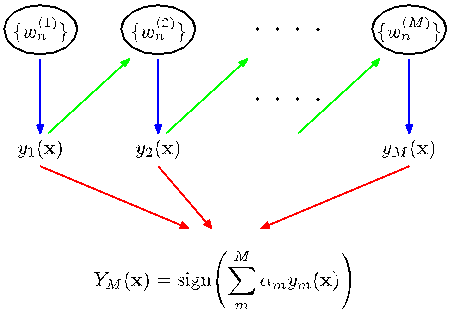
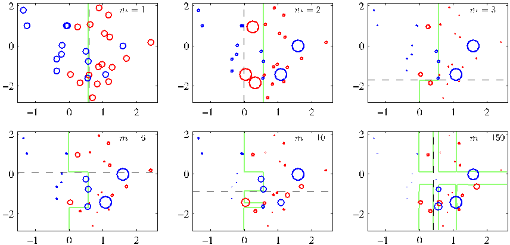
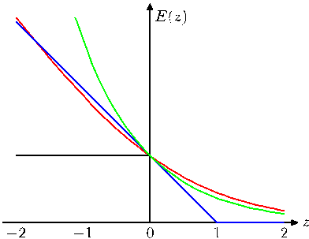
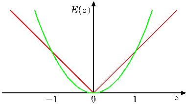
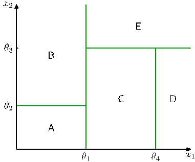
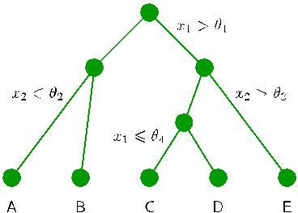
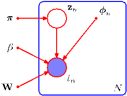
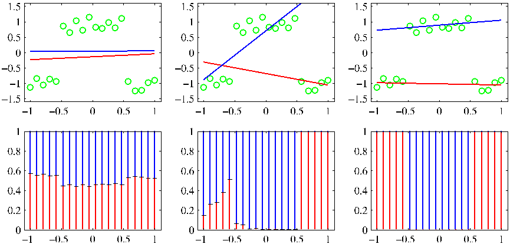
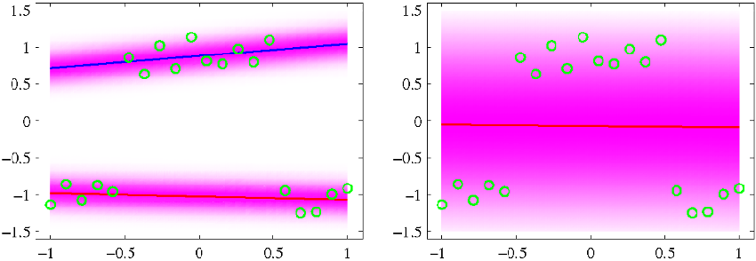

[Page 673]

# 14. Combining Models

In earlier chapters, we have explored a range of different models for solving classification and regression problems. It is often found that improved performance can be obtained by combining multiple models together in some way, instead of just using a single model in isolation. For instance, we might train $L$ different models and then make predictions using the average of the predictions made by each model. Such combinations of models are sometimes called committees. In Section 14.2, we discuss ways to apply the committee concept in practice, and we also give some insight into why it can sometimes be an effective procedure.

One important variant of the committee method, known as boosting, involves training multiple models in sequence in which the error function used to train a particular model depends on the performance of the previous models. This can produce substantial improvements in performance compared to the use of a single model and is discussed in Section 14.3.

Instead of averaging the predictions of a set of models, an alternative form of
[Page 674]

model combination is to select one of the models to make the prediction, in which the choice of model is a function of the input variables. Thus different models become responsible for making predictions in different regions of input space. One widely used framework of this kind is known as a decision tree in which the selection process can be described as a sequence of binary selections corresponding to the traversal of a tree structure and is discussed in Section 14.4. In this case, the individual models are generally chosen to be very simple, and the overall flexibility of the model arises from the input-dependent selection process. Decision trees can be applied to both classification and regression problems.

One limitation of decision trees is that the division of input space is based on hard splits in which only one model is responsible for making predictions for any given value of the input variables. The decision process can be softened by moving to a probabilistic framework for combining models, as discussed in Section 14.5. For example, if we have a set of $K$ models for a conditional distribution $p(t|\mathbf{x}, k)$ where $\mathbf{x}$ is the input variable, $t$ is the target variable, and $k = 1, \dots, K$ indexes the model, then we can form a probabilistic mixture of the form

$$
p(t|\mathbf{x}) = \sum_{k=1}^K \pi_k(\mathbf{x})p(t|\mathbf{x}, k) \tag{14.1}
$$

in which $\pi_k(\mathbf{x}) = p(k|\mathbf{x})$ represent the input-dependent mixing coefficients. Such models can be viewed as mixture distributions in which the component densities, as well as the mixing coefficients, are conditioned on the input variables and are known as mixtures of experts. They are closely related to the mixture density network model discussed in Section 5.6.

## 14.1. Bayesian Model Averaging

It is important to distinguish between model combination methods and Bayesian model averaging, as the two are often confused. To understand the difference, consider the example of density estimation using a mixture of Gaussians in which several Gaussian components are combined probabilistically. The model contains a binary latent variable $\mathbf{z}$ that indicates which component of the mixture is responsible for generating the corresponding data point. Thus the model is specified in terms of a joint distribution

$$
p(\mathbf{x}, \mathbf{z}) \tag{14.2}
$$

and the corresponding density over the observed variable $\mathbf{x}$ is obtained by marginalizing over the latent variable

$$
p(\mathbf{x}) = \sum_{\mathbf{z}} p(\mathbf{x}, \mathbf{z}). \tag{14.3}
$$

[Page 675]

In the case of our Gaussian mixture example, this leads to a distribution of the form

$$
p(\mathbf{x}) = \sum_{k=1}^K \pi_k \mathcal{N}(\mathbf{x}|\boldsymbol{\mu}_k, \mathbf{\Sigma}_k) \tag{14.4}
$$

with the usual interpretation of the symbols. This is an example of model combination. For independent, identically distributed data, we can use (14.3) to write the marginal probability of a data set $\mathbf{X} = \{\mathbf{x}_1, \dots, \mathbf{x}_N\}$ in the form

$$
p(\mathbf{X}) = \prod_{n=1}^N p(\mathbf{x}_n) = \prod_{n=1}^N \left[ \sum_{\mathbf{z}_n} p(\mathbf{x}_n, \mathbf{z}_n) \right]. \tag{14.5}
$$

Thus we see that each observed data point $\mathbf{x}_n$ has a corresponding latent variable $\mathbf{z}_n$.

Now suppose we have several different models indexed by $h = 1, \dots, H$ with prior probabilities $p(h)$. For instance one model might be a mixture of Gaussians and another model might be a mixture of Cauchy distributions. The marginal distribution over the data set is given by

$$
p(\mathbf{X}) = \sum_{h=1}^H p(\mathbf{X}|h)p(h). \tag{14.6}
$$

This is an example of Bayesian model averaging. The interpretation of this summation over $h$ is that just one model is responsible for generating the whole data set, and the probability distribution over $h$ simply reflects our uncertainty as to which model that is. As the size of the data set increases, this uncertainty reduces, and the posterior probabilities $p(h|\mathbf{X})$ become increasingly focussed on just one of the models.

This highlights the key difference between Bayesian model averaging and model combination, because in Bayesian model averaging the whole data set is generated by a single model. By contrast, when we combine multiple models, as in (14.5), we see that different data points within the data set can potentially be generated from different values of the latent variable $\mathbf{z}$ and hence by different components.

Although we have considered the marginal probability $p(\mathbf{X})$, the same considerations apply for the predictive density $p(\mathbf{x}|\mathbf{X})$ or for conditional distributions such as $p(t|\mathbf{x}, \mathbf{X}, \mathbf{T})$.

## 14.2. Committees

The simplest way to construct a committee is to average the predictions of a set of individual models. Such a procedure can be motivated from a frequentist perspective by considering the trade-off between bias and variance, which decomposes the error due to a model into the bias component that arises from differences between the model and the true function to be predicted, and the variance component that represents the sensitivity of the model to the individual data points. Recall from Figure 3.5
[Page 676]

that when we trained multiple polynomials using the sinusoidal data, and then averaged the resulting functions, the contribution arising from the variance term tended to cancel, leading to improved predictions. When we averaged a set of low-bias models (corresponding to higher order polynomials), we obtained accurate predictions for the underlying sinusoidal function from which the data were generated.

In practice, of course, we have only a single data set, and so we have to find a way to introduce variability between the different models within the committee. One approach is to use bootstrap data sets, discussed in Section 1.2.3. Consider a regression problem in which we are trying to predict the value of a single continuous variable, and suppose we generate $M$ bootstrap data sets and then use each to train a separate copy $y_m(\mathbf{x})$ of a predictive model where $m = 1, \dots, M$. The committee prediction is given by

$$
y_{\text{COM}}(\mathbf{x}) = \frac{1}{M} \sum_{m=1}^M y_m(\mathbf{x}). \tag{14.7}
$$

This procedure is known as bootstrap aggregation or bagging (Breiman, 1996).

Suppose the true regression function that we are trying to predict is given by $h(\mathbf{x})$, so that the output of each of the models can be written as the true value plus an error in the form

$$
y_m(\mathbf{x}) = h(\mathbf{x}) + \epsilon_m(\mathbf{x}). \tag{14.8}
$$

The average sum-of-squares error then takes the form

$$
\mathbb{E}_{\mathbf{x}}\left[ \{y_m(\mathbf{x}) - h(\mathbf{x})\}^2 \right] = \mathbb{E}_{\mathbf{x}}\left[ \epsilon_m(\mathbf{x})^2 \right] \tag{14.9}
$$

where $\mathbb{E}_{\mathbf{x}}[\cdot]$ denotes a frequentist expectation with respect to the distribution of the input vector $\mathbf{x}$. The average error made by the models acting individually is therefore

$$
E_{\text{AV}} = \frac{1}{M} \sum_{m=1}^M \mathbb{E}_{\mathbf{x}}\left[ \epsilon_m(\mathbf{x})^2 \right]. \tag{14.10}
$$

Similarly, the expected error from the committee (14.7) is given by

$$
\begin{aligned}
E_{\text{COM}} &= \mathbb{E}_{\mathbf{x}}\left[ \left\{ \frac{1}{M} \sum_{m=1}^M y_m(\mathbf{x}) - h(\mathbf{x}) \right\}^2 \right] \\
&= \mathbb{E}_{\mathbf{x}}\left[ \left\{ \frac{1}{M} \sum_{m=1}^M \epsilon_m(\mathbf{x}) \right\}^2 \right].
\end{aligned} \tag{14.11}
$$

If we assume that the errors have zero mean and are uncorrelated, so that

$$
\mathbb{E}_{\mathbf{x}}[\epsilon_m(\mathbf{x})] = 0 \tag{14.12}
$$

$$
\mathbb{E}_{\mathbf{x}}[\epsilon_m(\mathbf{x})\epsilon_l(\mathbf{x})] = 0, \quad m \ne l \tag{14.13}
$$

[Page 677]

then we obtain

$$
E_{\text{COM}} = \frac{1}{M} E_{\text{AV}}. \tag{14.14}
$$

This apparently dramatic result suggests that the average error of a model can be reduced by a factor of $M$ simply by averaging $M$ versions of the model. Unfortunately, it depends on the key assumption that the errors due to the individual models are uncorrelated. In practice, the errors are typically highly correlated, and the reduction in overall error is generally small. It can, however, be shown that the expected committee error will not exceed the expected error of the constituent models, so that $E_{\text{COM}} \le E_{\text{AV}}$. In order to achieve more significant improvements, we turn to a more sophisticated technique for building committees, known as boosting.

## 14.3. Boosting

Boosting is a powerful technique for combining multiple 'base' classifiers to produce a form of committee whose performance can be significantly better than that of any of the base classifiers. Here we describe the most widely used form of boosting algorithm called AdaBoost, short for 'adaptive boosting', developed by Freund and Schapire (1996). Boosting can give good results even if the base classifiers have a performance that is only slightly better than random, and hence sometimes the base classifiers are known as weak learners. Originally designed for solving classification problems, boosting can also be extended to regression (Friedman, 2001).

The principal difference between boosting and the committee methods such as bagging discussed above, is that the base classifiers are trained in sequence, and each base classifier is trained using a weighted form of the data set in which the weighting coefficient associated with each data point depends on the performance of the previous classifiers. In particular, points that are misclassified by one of the base classifiers are given greater weight when used to train the next classifier in the sequence. Once all the classifiers have been trained, their predictions are then combined through a weighted majority voting scheme, as illustrated schematically in Figure 14.1.

Consider a two-class classification problem, in which the training data comprises input vectors $\mathbf{x}_1, \dots, \mathbf{x}_N$ along with corresponding binary target variables $t_1, \dots, t_N$ where $t_n \in \{-1, 1\}$. Each data point is given an associated weighting parameter $w_n$, which is initially set $1/N$ for all data points. We shall suppose that we have a procedure available for training a base classifier using weighted data to give a function $y(\mathbf{x}) \in \{-1, 1\}$. At each stage of the algorithm, AdaBoost trains a new classifier using a data set in which the weighting coefficients are adjusted according to the performance of the previously trained classifier so as to give greater weight to the misclassified data points. Finally, when the desired number of base classifiers have been trained, they are combined to form a committee using coefficients that give different weight to different base classifiers. The precise form of the AdaBoost algorithm is given below.
[Page 678]

**Figure 14.1** Schematic illustration of the boosting framework. Each base classifier $y_m(\mathbf{x})$ is trained on a weighted form of the training set (blue arrows) in which the weights $w_n^{(m)}$ depend on the performance of the previous base classifier $y_{m-1}(\mathbf{x})$ (green arrows). Once all base classifiers have been trained, they are combined to give the final classifier $Y_M(\mathbf{x})$ (red arrows).

$$
Y_M(\mathbf{x}) = \text{sign}\left( \sum_{m=1}^M \alpha_m y_m(\mathbf{x}) \right)
$$

### AdaBoost

1. Initialize the data weighting coefficients $\{w_n\}$ by setting $w_n^{(1)} = 1/N$ for $n = 1, \dots, N$.
2. For $m = 1, \dots, M$:
   (a) Fit a classifier $y_m(\mathbf{x})$ to the training data by minimizing the weighted error function

   $$
    J_m = \sum_{n=1}^N w_n^{(m)} I(y_m(\mathbf{x}_n) \ne t_n) \tag{14.15}
   $$

   where $I(y_m(\mathbf{x}_n) \ne t_n)$ is the indicator function and equals $1$ when $y_m(\mathbf{x}_n) \ne t_n$ and $0$ otherwise.
   (b) Evaluate the quantities

   $$
    \epsilon_m = \frac{\sum_{n=1}^N w_n^{(m)} I(y_m(\mathbf{x}_n) \ne t_n)}{\sum_{n=1}^N w_n^{(m)}} \tag{14.16}
   $$

   and then use these to evaluate

   $$
    \alpha_m = \ln\left\{ \frac{1 - \epsilon_m}{\epsilon_m} \right\}. \tag{14.17}
   $$

   (c) Update the data weighting coefficients

   $$
    w_n^{(m+1)} = w_n^{(m)} \exp\left\{ \alpha_m I(y_m(\mathbf{x}_n) \ne t_n) \right\} \tag{14.18}
   $$

   [Page 679]

3. Make predictions using the final model, which is given by
   $$
   Y_M(\mathbf{x}) = \text{sign} \left( \sum_{m=1}^M \alpha_m y_m(\mathbf{x}) \right). \tag{14.19}
   $$

We see that the first base classifier $y_1(\mathbf{x})$ is trained using weighting coefficients $w_n^{(1)}$ that are all equal, which therefore corresponds to the usual procedure for training a single classifier. From (14.18), we see that in subsequent iterations the weighting coefficients $w_n^{(m)}$ are increased for data points that are misclassified and decreased for data points that are correctly classified. Successive classifiers are therefore forced to place greater emphasis on points that have been misclassified by previous classifiers, and data points that continue to be misclassified by successive classifiers receive ever greater weight. The quantities $\epsilon_m$ represent weighted measures of the error rates of each of the base classifiers on the data set. We therefore see that the weighting coefficients $\alpha_m$ defined by (14.17) give greater weight to the more accurate classifiers when computing the overall output given by (14.19).

The AdaBoost algorithm is illustrated in Figure 14.2, using a subset of 30 data points taken from the toy classification data set shown in Figure A.7. Here each base learners consists of a threshold on one of the input variables. This simple classifier corresponds to a form of decision tree known as a 'decision stumps', i.e., a decision tree with a single node. Thus each base learner classifies an input according to whether one of the input features exceeds some threshold and therefore simply partitions the space into two regions separated by a linear decision surface that is parallel to one of the axes.

### 14.3.1 Minimizing exponential error

Boosting was originally motivated using statistical learning theory, leading to upper bounds on the generalization error. However, these bounds turn out to be too loose to have practical value, and the actual performance of boosting is much better than the bounds alone would suggest. Friedman et al. (2000) gave a different and very simple interpretation of boosting in terms of the sequential minimization of an exponential error function.

Consider the exponential error function defined by

$$
E = \sum_{n=1}^N \exp\left\{ -t_n f_m(\mathbf{x}_n) \right\} \tag{14.20}
$$

where $f_m(\mathbf{x})$ is a classifier defined in terms of a linear combination of base classifiers $y_l(\mathbf{x})$ of the form

$$
f_m(\mathbf{x}) = \frac{1}{2} \sum_{l=1}^m \alpha_l y_l(\mathbf{x}) \tag{14.21}
$$

and $t_n \in \{-1, 1\}$ are the training set target values. Our goal is to minimize $E$ with respect to both the weighting coefficients $\alpha_l$ and the parameters of the base classifiers $y_l(\mathbf{x})$.
[Page 680]

**Figure 14.2** Illustration of boosting in which the base learners consist of simple thresholds applied to one or other of the axes. Each figure shows the number $m$ of base learners trained so far, along with the decision boundary of the most recent base learner (dashed black line) and the combined decision boundary of the ensemble (solid green line). Each data point is depicted by a circle whose radius indicates the weight assigned to that data point when training the most recently added base learner. Thus, for instance, we see that points that are misclassified by the $m = 1$ base learner are given greater weight when training the $m = 2$ base learner.

Instead of doing a global error function minimization, however, we shall suppose that the base classifiers $y_1(\mathbf{x}), \dots, y_{m-1}(\mathbf{x})$ are fixed, as are their coefficients $\alpha_1, \dots, \alpha_{m-1}$, and so we are minimizing only with respect to $\alpha_m$ and $y_m(\mathbf{x})$. Separating off the contribution from base classifier $y_m(\mathbf{x})$, we can then write the error function in the form

$$
\begin{aligned}
E &= \sum_{n=1}^N \exp\left\{ -t_n f_{m-1}(\mathbf{x}_n) - \frac{1}{2} t_n \alpha_m y_m(\mathbf{x}_n) \right\} \\
&= \sum_{n=1}^N w_n^{(m)} \exp\left\{ -\frac{1}{2} t_n \alpha_m y_m(\mathbf{x}_n) \right\}
\end{aligned} \tag{14.22}
$$

where the coefficients $w_n^{(m)} = \exp\{-t_n f_{m-1}(\mathbf{x}_n)\}$ can be viewed as constants because we are optimizing only $\alpha_m$ and $y_m(\mathbf{x})$. If we denote by $\mathcal{T}_m$ the set of data points that are correctly classified by $y_m(\mathbf{x})$, and if we denote the remaining misclassified points by $\mathcal{M}_m$, then we can in turn rewrite the error function in the
[Page 681]

form

$$
\begin{aligned}
E &= e^{-\alpha_m/2} \sum_{n \in \mathcal{T}_m} w_n^{(m)} + e^{\alpha_m/2} \sum_{n \in \mathcal{M}_m} w_n^{(m)} \\
&= (e^{\alpha_m/2} - e^{-\alpha_m/2}) \sum_{n=1}^N w_n^{(m)} I(y_m(\mathbf{x}_n) \ne t_n) + e^{-\alpha_m/2} \sum_{n=1}^N w_n^{(m)}.
\end{aligned} \tag{14.23}
$$

When we minimize this with respect to $y_m(\mathbf{x})$, we see that the second term is constant, and so this is equivalent to minimizing (14.15) because the overall multiplicative factor in front of the summation does not affect the location of the minimum. Similarly, minimizing with respect to $\alpha_m$, we obtain (14.17) in which $\epsilon_m$ is defined by (14.16).

From (14.22) we see that, having found $\alpha_m$ and $y_m(\mathbf{x})$, the weights on the data points are updated using

$$
w_n^{(m+1)} = w_n^{(m)} \exp\left\{ -\frac{1}{2} t_n \alpha_m y_m(\mathbf{x}_n) \right\}. \tag{14.24}
$$

Making use of the fact that

$$
t_n y_m(\mathbf{x}_n) = 1 - 2I(y_m(\mathbf{x}_n) \ne t_n) \tag{14.25}
$$

we see that the weights $w_n^{(m)}$ are updated at the next iteration using

$$
w_n^{(m+1)} = w_n^{(m)} \exp(-\alpha_m/2)\exp\{\alpha_m I(y_m(\mathbf{x}_n) \ne t_n)\}. \tag{14.26}
$$

Because the term $\exp(-\alpha_m/2)$ is independent of $n$, we see that it weights all data points by the same factor and so can be discarded. Thus we obtain (14.18).

Finally, once all the base classifiers are trained, new data points are classified by evaluating the sign of the combined function defined according to (14.21). Because the factor of $1/2$ does not affect the sign it can be omitted, giving (14.19).

### 14.3.2 Error functions for boosting

The exponential error function that is minimized by the AdaBoost algorithm differs from those considered in previous chapters. To gain some insight into the nature of the exponential error function, we first consider the expected error given by

$$
\mathbb{E}_{\mathbf{x}, t}[\exp\{-ty(\mathbf{x})\}] = \sum_t \int \exp\{-ty(\mathbf{x})\} p(t|\mathbf{x})p(\mathbf{x})\, d\mathbf{x}. \tag{14.27}
$$

If we perform a variational minimization with respect to all possible functions $y(\mathbf{x})$, we obtain

$$
y(\mathbf{x}) = \frac{1}{2} \ln \left\{ \frac{p(t=1|\mathbf{x})}{p(t=-1|\mathbf{x})} \right\} \tag{14.28}
$$

[Page 682]

**Figure 14.3** Plot of the exponential (green) and rescaled cross-entropy (red) error functions along with the hinge error (blue) used in support vector machines, and the misclassification error (black). Note that for large negative values of $z = ty(\mathbf{x})$, the cross-entropy gives a linearly increasing penalty, whereas the exponential loss gives an exponentially increasing penalty.

which is half the log-odds. Thus the AdaBoost algorithm is seeking the best approximation to the log odds ratio, within the space of functions represented by the linear combination of base classifiers, subject to the constrained minimization resulting from the sequential optimization strategy. This result motivates the use of the sign function in (14.19) to arrive at the final classification decision.

We have already seen that the minimizer $y(\mathbf{x})$ of the cross-entropy error (4.90) for two-class classification is given by the posterior class probability. In the case of a target variable $t \in \{-1, 1\}$, we have seen that the error function is given by $\ln(1 + \exp(-yt))$. This is compared with the exponential error function in Figure 14.3, where we have divided the cross-entropy error by a constant factor $\ln(2)$ so that it passes through the point $(0, 1)$ for ease of comparison. We see that both can be seen as continuous approximations to the ideal misclassification error function. An advantage of the exponential error is that its sequential minimization leads to the simple AdaBoost scheme. One drawback, however, is that it penalizes large negative values of $ty(\mathbf{x})$ much more strongly than cross-entropy. In particular, we see that for large negative values of $ty$, the cross-entropy grows linearly with $|ty|$, whereas the exponential error function grows exponentially with $|ty|$. Thus the exponential error function will be much less robust to outliers or misclassified data points. Another important difference between cross-entropy and the exponential error function is that the latter cannot be interpreted as the log likelihood function of any well-defined probabilistic model. Furthermore, the exponential error does not generalize to classification problems having $K > 2$ classes, again in contrast to the cross-entropy for a probabilistic model, which is easily generalized to give (4.108).

The interpretation of boosting as the sequential optimization of an additive model under an exponential error (Friedman et al., 2000) opens the door to a wide range of boosting-like algorithms, including multiclass extensions, by altering the choice of error function. It also motivates the extension to regression problems (Friedman, 2001). If we consider a sum-of-squares error function for regression, then sequential minimization of an additive model of the form (14.21) simply involves fitting each new base classifier to the residual errors $t_n - f_{m-1}(\mathbf{x}_n)$ from the previous model. As we have noted, however, the sum-of-squares error is not robust to outliers, and this
[Page 683]

**Figure 14.4** Comparison of the squared error (green) with the absolute error (red) showing how the latter places much less emphasis on large errors and hence is more robust to outliers and mislabelled data points.

can be addressed by basing the boosting algorithm on the absolute deviation $|y - t|$ instead. These two error functions are compared in Figure 14.4.

## 14.4. Tree-based Models

There are various simple, but widely used, models that work by partitioning the input space into cuboid regions, whose edges are aligned with the axes, and then assigning a simple model (for example, a constant) to each region. They can be viewed as a model combination method in which only one model is responsible for making predictions at any given point in input space. The process of selecting a specific model, given a new input $\mathbf{x}$, can be described by a sequential decision making process corresponding to the traversal of a binary tree (one that splits into two branches at each node). Here we focus on a particular tree-based framework called classification and regression trees, or CART (Breiman et al., 1984), although there are many other variants going by such names as ID3 and C4.5 (Quinlan, 1986; Quinlan, 1993).

Figure 14.5 shows an illustration of a recursive binary partitioning of the input space, along with the corresponding tree structure. In this example, the first step divides the whole of the input space into two regions according to whether $x_1 \le \theta_1$ or $x_1 > \theta_1$ where $\theta_1$ is a parameter of the model. This creates two subregions, each of which can then be subdivided independently. For instance, the region $x_1 \le \theta_1$ is further subdivided according to whether $x_2 \le \theta_2$ or $x_2 > \theta_2$, giving rise to the regions denoted A and B. The recursive subdivision can be described by the traversal of the binary tree shown in Figure 14.6. For any new input $\mathbf{x}$, we determine which region it falls into by starting at the top of the tree at the root node and following a path down to a specific leaf node according to the decision criteria at each node. Note that such decision trees are not probabilistic graphical models.

**Figure 14.5** Illustration of a two-dimensional input space that has been partitioned into five regions using axis-aligned boundaries.
[Page 684]

**Figure 14.6** Binary tree corresponding to the partitioning of input space shown in Figure 14.5.

Within each region, there is a separate model to predict the target variable. For instance, in regression we might simply predict a constant over each region, or in classification we might assign each region to a specific class. A key property of treebased models, which makes them popular in fields such as medical diagnosis, for example, is that they are readily interpretable by humans because they correspond to a sequence of binary decisions applied to the individual input variables. For instance, to predict a patient's disease, we might first ask "is their temperature greater than some threshold?". If the answer is yes, then we might next ask "is their blood pressure less than some threshold?". Each leaf of the tree is then associated with a specific diagnosis.

In order to learn such a model from a training set, we have to determine the structure of the tree, including which input variable is chosen at each node to form the split criterion as well as the value of the threshold parameter $\theta_i$ for the split. We also have to determine the values of the predictive variable within each region.

Consider first a regression problem in which the goal is to predict a single target variable $t$ from a $D$-dimensional vector $\mathbf{x} = (x_1, \dots, x_D)^{\text{T}}$ of input variables. The training data consists of input vectors $\{\mathbf{x}_1, \dots, \mathbf{x}_N\}$ along with the corresponding continuous labels $\{t_1, \dots, t_N\}$. If the partitioning of the input space is given, and we minimize the sum-of-squares error function, then the optimal value of the predictive variable within any given region is just given by the average of the values of $t_n$ for those data points that fall in that region.

Now consider how to determine the structure of the decision tree. Even for a fixed number of nodes in the tree, the problem of determining the optimal structure (including choice of input variable for each split as well as the corresponding thresh-
[Page 685]

olds) to minimize the sum-of-squares error is usually computationally infeasible due to the combinatorially large number of possible solutions. Instead, a greedy optimization is generally done by starting with a single root node, corresponding to the whole input space, and then growing the tree by adding nodes one at a time. At each step there will be some number of candidate regions in input space that can be split, corresponding to the addition of a pair of leaf nodes to the existing tree. For each of these, there is a choice of which of the $D$ input variables to split, as well as the value of the threshold. The joint optimization of the choice of region to split, and the choice of input variable and threshold, can be done efficiently by exhaustive search noting that, for a given choice of split variable and threshold, the optimal choice of predictive variable is given by the local average of the data, as noted earlier. This is repeated for all possible choices of variable to be split, and the one that gives the smallest residual sum-of-squares error is retained.

Given a greedy strategy for growing the tree, there remains the issue of when to stop adding nodes. A simple approach would be to stop when the reduction in residual error falls below some threshold. However, it is found empirically that often none of the available splits produces a significant reduction in error, and yet after several more splits a substantial error reduction is found. For this reason, it is common practice to grow a large tree, using a stopping criterion based on the number of data points associated with the leaf nodes, and then prune back the resulting tree. The pruning is based on a criterion that balances residual error against a measure of model complexity. If we denote the starting tree for pruning by $T_0$, then we define $T \subset T_0$ to be a subtree of $T_0$ if it can be obtained by pruning nodes from $T_0$ (in other words, by collapsing internal nodes by combining the corresponding regions). Suppose the leaf nodes are indexed by $\tau = 1, \dots, |T|$, with leaf node $\tau$ representing a region $\mathcal{R}_\tau$ of input space having $N_\tau$ data points, and $|T|$ denoting the total number of leaf nodes. The optimal prediction for region $\mathcal{R}_\tau$ is then given by

$$
y_\tau = \frac{1}{N_\tau} \sum_{\mathbf{x}_n \in \mathcal{R}_\tau} t_n \tag{14.29}
$$

and the corresponding contribution to the residual sum-of-squares is then

$$
Q_\tau(T) = \sum_{\mathbf{x}_n \in \mathcal{R}_\tau} \{t_n - y_\tau\}^2. \tag{14.30}
$$

The pruning criterion is then given by

$$
C(T) = \sum_{\tau=1}^{|T|} Q_\tau(T) + \lambda|T| \tag{14.31}
$$

The regularization parameter $\lambda$ determines the trade-off between the overall residual sum-of-squares error and the complexity of the model as measured by the number $|T|$ of leaf nodes, and its value is chosen by cross-validation.

For classification problems, the process of growing and pruning the tree is similar, except that the sum-of-squares error is replaced by a more appropriate measure
[Page 686]

of performance. If we define $p_{\tau k}$ to be the proportion of data points in region $\mathcal{R}_\tau$ assigned to class $k$, where $k = 1, \dots, K$, then two commonly used choices are the cross-entropy

$$
Q_\tau(T) = \sum_{k=1}^K p_{\tau k} \ln p_{\tau k} \tag{14.32}
$$

and the Gini index

$$
Q_\tau(T) = \sum_{k=1}^K p_{\tau k} (1 - p_{\tau k}). \tag{14.33}
$$

These both vanish for $p_{\tau k} = 0$ and $p_{\tau k} = 1$ and have a maximum at $p_{\tau k} = 0.5$. They encourage the formation of regions in which a high proportion of the data points are assigned to one class. The cross entropy and the Gini index are better measures than the misclassification rate for growing the tree because they are more sensitive to the node probabilities. Also, unlike misclassification rate, they are differentiable and hence better suited to gradient based optimization methods. For subsequent pruning of the tree, the misclassification rate is generally used.

The human interpretability of a tree model such as CART is often seen as its major strength. However, in practice it is found that the particular tree structure that is learned is very sensitive to the details of the data set, so that a small change to the training data can result in a very different set of splits (Hastie et al., 2001).

There are other problems with tree-based methods of the kind considered in this section. One is that the splits are aligned with the axes of the feature space, which may be very suboptimal. For instance, to separate two classes whose optimal decision boundary runs at 45 degrees to the axes would need a large number of axis-parallel splits of the input space as compared to a single non-axis-aligned split. Furthermore, the splits in a decision tree are hard, so that each region of input space is associated with one, and only one, leaf node model. The last issue is particularly problematic in regression where we are typically aiming to model smooth functions, and yet the tree model produces piecewise-constant predictions with discontinuities at the split boundaries.

## 14.5. Conditional Mixture Models

We have seen that standard decision trees are restricted by hard, axis-aligned splits of the input space. These constraints can be relaxed, at the expense of interpretability, by allowing soft, probabilistic splits that can be functions of all of the input variables, not just one of them at a time. If we also give the leaf models a probabilistic interpretation, we arrive at a fully probabilistic tree-based model called the hierarchical mixture of experts, which we consider in Section 14.5.3.

An alternative way to motivate the hierarchical mixture of experts model is to start with a standard probabilistic mixtures of unconditional density models such as Gaussians and replace the component densities with conditional distributions. Here we consider mixtures of linear regression models (Section 14.5.1) and mixtures of
[Page 687]

logistic regression models (Section 14.5.2). In the simplest case, the mixing coefficients are independent of the input variables. If we make a further generalization to allow the mixing coefficients also to depend on the inputs then we obtain a mixture of experts model. Finally, if we allow each component in the mixture model to be itself a mixture of experts model, then we obtain a hierarchical mixture of experts.

### 14.5.1 Mixtures of linear regression models

One of the many advantages of giving a probabilistic interpretation to the linear regression model is that it can then be used as a component in more complex probabilistic models. This can be done, for instance, by viewing the conditional distribution representing the linear regression model as a node in a directed probabilistic graph. Here we consider a simple example corresponding to a mixture of linear regression models, which represents a straightforward extension of the Gaussian mixture model discussed in Section 9.2 to the case of conditional Gaussian distributions.

We therefore consider $K$ linear regression models, each governed by its own weight parameter $\mathbf{w}_k$. In many applications, it will be appropriate to use a common noise variance, governed by a precision parameter $\beta$, for all $K$ components, and this is the case we consider here. We will once again restrict attention to a single target variable $t$, though the extension to multiple outputs is straightforward. If we denote the mixing coefficients by $\pi_k$, then the mixture distribution can be written

$$
p(t|\boldsymbol{\theta}) = \sum_{k=1}^K \pi_k \mathcal{N}(t|\mathbf{w}_k^{\text{T}}\boldsymbol{\phi}, \beta^{-1}) \tag{14.34}
$$

where $\boldsymbol{\theta}$ denotes the set of all adaptive parameters in the model, namely $\mathbf{W} = \{\mathbf{w}_k\}$, $\boldsymbol{\pi} = \{\pi_k\}$, and $\beta$. The log likelihood function for this model, given a data set of observations $\{\boldsymbol{\phi}_n, t_n\}$, then takes the form

$$
\ln p(\mathbf{t}|\boldsymbol{\theta}) = \sum_{n=1}^N \ln \left( \sum_{k=1}^K \pi_k \mathcal{N}(t_n|\mathbf{w}_k^{\text{T}}\boldsymbol{\phi}_n, \beta^{-1}) \right) \tag{14.35}
$$

where $\mathbf{t} = (t_1, \dots, t_N)^{\text{T}}$ denotes the vector of target variables.

In order to maximize this likelihood function, we can once again appeal to the EM algorithm, which will turn out to be a simple extension of the EM algorithm for unconditional Gaussian mixtures of Section 9.2. We can therefore build on our experience with the unconditional mixture and introduce a set $\mathbf{Z} = \{\mathbf{z}_n\}$ of binary latent variables where $z_{nk} \in \{0, 1\}$ in which, for each data point $n$, all of the elements $k = 1, \dots, K$ are zero except for a single value of $1$ indicating which component of the mixture was responsible for generating that data point. The joint distribution over latent and observed variables can be represented by the graphical model shown in Figure 14.7.

The complete-data log likelihood function then takes the form

$$
\ln p(\mathbf{t}, \mathbf{Z}|\boldsymbol{\theta}) = \sum_{n=1}^N \sum_{k=1}^K z_{nk} \ln \left\{ \pi_k \mathcal{N}(t_n|\mathbf{w}_k^{\text{T}}\boldsymbol{\phi}_n, \beta^{-1}) \right\}. \tag{14.36}
$$

[Page 688]

**Figure 14.7** Probabilistic directed graph representing a mixture of linear regression models, defined by (14.35).

The EM algorithm begins by first choosing an initial value $\boldsymbol{\theta}^{\text{old}}$ for the model parameters. In the E step, these parameter values are then used to evaluate the posterior probabilities, or responsibilities, of each component $k$ for every data point $n$ given by

$$
\gamma_{nk} = \mathbb{E}[z_{nk}] = p(k|\boldsymbol{\phi}_n, \boldsymbol{\theta}^{\text{old}}) = \frac{\pi_k \mathcal{N}(t_n|\mathbf{w}_k^{\text{T}}\boldsymbol{\phi}_n, \beta^{-1})}{\sum_j \pi_j \mathcal{N}(t_n|\mathbf{w}_j^{\text{T}}\boldsymbol{\phi}_n, \beta^{-1})}. \tag{14.37}
$$

The responsibilities are then used to determine the expectation, with respect to the posterior distribution $p(\mathbf{Z}|\mathbf{t}, \boldsymbol{\theta}^{\text{old}})$, of the complete-data log likelihood, which takes the form

$$
Q(\boldsymbol{\theta}, \boldsymbol{\theta}^{\text{old}}) = \mathbb{E}_{\mathbf{Z}}[\ln p(\mathbf{t}, \mathbf{Z}|\boldsymbol{\theta})] = \sum_{n=1}^N \sum_{k=1}^K \gamma_{nk} \{\ln \pi_k + \ln \mathcal{N}(t_n|\mathbf{w}_k^{\text{T}}\boldsymbol{\phi}_n, \beta^{-1})\}.
$$

In the M step, we maximize the function $Q(\boldsymbol{\theta}, \boldsymbol{\theta}^{\text{old}})$ with respect to $\boldsymbol{\theta}$, keeping the $\gamma_{nk}$ fixed. For the optimization with respect to the mixing coefficients $\pi_k$ we need to take account of the constraint $\sum_k \pi_k = 1$, which can be done with the aid of a Lagrange multiplier, leading to an M-step re-estimation equation for $\pi_k$ in the form

$$
\pi_k = \frac{1}{N} \sum_{n=1}^N \gamma_{nk}. \tag{14.38}
$$

Note that this has exactly the same form as the corresponding result for a simple mixture of unconditional Gaussians given by (9.22).

Next consider the maximization with respect to the parameter vector $\mathbf{w}_k$ of the $k^{\text{th}}$ linear regression model. Substituting for the Gaussian distribution, we see that the function $Q(\boldsymbol{\theta}, \boldsymbol{\theta}^{\text{old}})$, as a function of the parameter vector $\mathbf{w}_k$, takes the form

$$
Q(\boldsymbol{\theta}, \boldsymbol{\theta}^{\text{old}}) = \sum_{n=1}^N \gamma_{nk} \left\{ -\frac{\beta}{2} (t_n - \mathbf{w}_k^{\text{T}}\boldsymbol{\phi}_n)^2 \right\} + \text{const} \tag{14.39}
$$

where the constant term includes the contributions from other weight vectors $\mathbf{w}_j$ for $j \ne k$. Note that the quantity we are maximizing is similar to the (negative of the) standard sum-of-squares error (3.12) for a single linear regression model, but with the inclusion of the responsibilities $\gamma_{nk}$. This represents a weighted least squares
[Page 689]

problem, in which the term corresponding to the $n^{\text{th}}$ data point carries a weighting coefficient given by $\beta \gamma_{nk}$, which could be interpreted as an effective precision for each data point. We see that each component linear regression model in the mixture, governed by its own parameter vector $\mathbf{w}_k$, is fitted separately to the whole data set in the M step, but with each data point $n$ weighted by the responsibility $\gamma_{nk}$ that model $k$ takes for that data point. Setting the derivative of (14.39) with respect to $\mathbf{w}_k$ equal to zero gives

$$
0 = \sum_{n=1}^N \gamma_{nk} (t_n - \mathbf{w}_k^{\text{T}}\boldsymbol{\phi}_n)\boldsymbol{\phi}_n \tag{14.40}
$$

which we can write in matrix notation as

$$
0 = \boldsymbol{\Phi}^{\text{T}} \mathbf{R}_k (\mathbf{t} - \boldsymbol{\Phi}\mathbf{w}_k) \tag{14.41}
$$

where $\mathbf{R}_k = \text{diag}(\gamma_{nk})$ is a diagonal matrix of size $N \times N$. Solving for $\mathbf{w}_k$, we obtain

$$
\mathbf{w}_k = (\boldsymbol{\Phi}^{\text{T}} \mathbf{R}_k \boldsymbol{\Phi})^{-1} \boldsymbol{\Phi}^{\text{T}} \mathbf{R}_k \mathbf{t}. \tag{14.42}
$$

This represents a set of modified normal equations corresponding to the weighted least squares problem, of the same form as (4.99) found in the context of logistic regression. Note that after each E step, the matrix $\mathbf{R}_k$ will change and so we will have to solve the normal equations afresh in the subsequent M step.

Finally, we maximize $Q(\boldsymbol{\theta}, \boldsymbol{\theta}^{\text{old}})$ with respect to $\beta$. Keeping only terms that depend on $\beta$, the function $Q(\boldsymbol{\theta}, \boldsymbol{\theta}^{\text{old}})$ can be written

$$
Q(\boldsymbol{\theta}, \boldsymbol{\theta}^{\text{old}}) = \sum_{n=1}^N \sum_{k=1}^K \gamma_{nk} \left\{ \frac{1}{2} \ln \beta - \frac{\beta}{2} (t_n - \mathbf{w}_k^{\text{T}}\boldsymbol{\phi}_n)^2 \right\}. \tag{14.43}
$$

Setting the derivative with respect to $\beta$ equal to zero, and rearranging, we obtain the M-step equation for $\beta$ in the form

$$
\frac{1}{\beta} = \frac{1}{N} \sum_{n=1}^N \sum_{k=1}^K \gamma_{nk} (t_n - \mathbf{w}_k^{\text{T}}\boldsymbol{\phi}_n)^2. \tag{14.44}
$$

In Figure 14.8, we illustrate this EM algorithm using the simple example of fitting a mixture of two straight lines to a data set having one input variable $x$ and one target variable $t$. The predictive density (14.34) is plotted in Figure 14.9 using the converged parameter values obtained from the EM algorithm, corresponding to the right-hand plot in Figure 14.8. Also shown in this figure is the result of fitting a single linear regression model, which gives a unimodal predictive density. We see that the mixture model gives a much better representation of the data distribution, and this is reflected in the higher likelihood value. However, the mixture model also assigns significant probability mass to regions where there is no data because its predictive distribution is bimodal for all values of $x$. This problem can be resolved by extending the model to allow the mixture coefficients themselves to be functions of $x$, leading to models such as the mixture density networks discussed in Section 5.6, and hierarchical mixture of experts discussed in Section 14.5.3.
[Page 690]

**Figure 14.8** Example of a synthetic data set, shown by the green points, having one input variable $x$ and one target variable $t$, together with a mixture of two linear regression models whose mean functions $y(x, \mathbf{w}_k)$, where $k \in \{1, 2\}$, are shown by the blue and red lines. The upper three plots show the initial configuration (left), the result of running 30 iterations of EM (centre), and the result after 50 iterations of EM (right). Here $\beta$ was initialized to the reciprocal of the true variance of the set of target values. The lower three plots show the corresponding responsibilities plotted as a vertical line for each data point in which the length of the blue segment gives the posterior probability of the blue line for that data point (and similarly for the red segment).

### 14.5.2 Mixtures of logistic models

Because the logistic regression model defines a conditional distribution for the target variable, given the input vector, it is straightforward to use it as the component distribution in a mixture model, thereby giving rise to a richer family of conditional distributions compared to a single logistic regression model. This example involves a straightforward combination of ideas encountered in earlier sections of the book and will help consolidate these for the reader.

The conditional distribution of the target variable, for a probabilistic mixture of $K$ logistic regression models, is given by

$$
p(t|\boldsymbol{\phi}, \boldsymbol{\theta}) = \sum_{k=1}^K \pi_k y_k^t [1 - y_k]^{1-t} \tag{14.45}
$$

where $\boldsymbol{\phi}$ is the feature vector, $y_k = \sigma(\mathbf{w}_k^{\text{T}}\boldsymbol{\phi})$ is the output of component $k$, and $\boldsymbol{\theta}$ denotes the adjustable parameters namely $\{\pi_k\}$ and $\{\mathbf{w}_k\}$.

Now suppose we are given a data set $\{\boldsymbol{\phi}_n, t_n\}$. The corresponding likelihood
[Page 691]

**Figure 14.9** The left plot shows the predictive conditional density corresponding to the converged solution in Figure 14.8. This gives a log likelihood value of $-3.0$. A vertical slice through one of these plots at a particular value of $x$ represents the corresponding conditional distribution $p(t|x)$, which we see is bimodal. The plot on the right shows the predictive density for a single linear regression model fitted to the same data set using maximum likelihood. This model has a smaller log likelihood of $-27.6$.

function is then given by

$$
p(\mathbf{t}|\boldsymbol{\theta}) = \prod_{n=1}^N \left( \sum_{k=1}^K \pi_k y_{nk}^{t_n} [1 - y_{nk}]^{1-t_n} \right) \tag{14.46}
$$

where $y_{nk} = \sigma(\mathbf{w}_k^{\text{T}}\boldsymbol{\phi}_n)$ and $\mathbf{t} = (t_1, \dots, t_N)^{\text{T}}$. We can maximize this likelihood function iteratively by making use of the EM algorithm. This involves introducing latent variables $z_{nk}$ that correspond to a 1-of-K coded binary indicator variable for each data point $n$. The complete-data likelihood function is then given by

$$
p(\mathbf{t}, \mathbf{Z}|\boldsymbol{\theta}) = \prod_{n=1}^N \prod_{k=1}^K \left\{ \pi_k y_{nk}^{t_n} [1 - y_{nk}]^{1-t_n} \right\}^{z_{nk}} \tag{14.47}
$$

where $\mathbf{Z}$ is the matrix of latent variables with elements $z_{nk}$. We initialize the EM algorithm by choosing an initial value $\boldsymbol{\theta}^{\text{old}}$ for the model parameters. In the E step, we then use these parameter values to evaluate the posterior probabilities of the components $k$ for each data point $n$, which are given by

$$
\gamma_{nk} = \mathbb{E}[z_{nk}] = p(k|\boldsymbol{\phi}_n, \boldsymbol{\theta}^{\text{old}}) = \frac{\pi_k y_{nk}^{t_n} [1 - y_{nk}]^{1-t_n}}{\sum_j \pi_j y_{nj}^{t_n} [1 - y_{nj}]^{1-t_n}}. \tag{14.48}
$$

These responsibilities are then used to find the expected complete-data log likelihood as a function of $\boldsymbol{\theta}$, given by

$$
\begin{aligned}
Q(\boldsymbol{\theta}, \boldsymbol{\theta}^{\text{old}}) &= \mathbb{E}_{\mathbf{Z}}[\ln p(\mathbf{t}, \mathbf{Z}|\boldsymbol{\theta})] \\
&= \sum_{n=1}^N \sum_{k=1}^K \gamma_{nk} \{\ln \pi_k + t_n \ln y_{nk} + (1 - t_n) \ln(1 - y_{nk})\}.
\end{aligned} \tag{14.49}
$$

[Page 692]

The M step involves maximization of this function with respect to $\boldsymbol{\theta}$, keeping $\boldsymbol{\theta}^{\text{old}}$, and hence $\gamma_{nk}$, fixed. Maximization with respect to $\pi_k$ can be done in the usual way, with a Lagrange multiplier to enforce the summation constraint $\sum_k \pi_k = 1$, giving the familiar result

$$
\pi_k = \frac{1}{N} \sum_{n=1}^N \gamma_{nk}. \tag{14.50}
$$

To determine the $\{\mathbf{w}_k\}$, we note that the $Q(\boldsymbol{\theta}, \boldsymbol{\theta}^{\text{old}})$ function comprises a sum over terms indexed by $k$ each of which depends only on one of the vectors $\mathbf{w}_k$, so that the different vectors are decoupled in the M step of the EM algorithm. In other words, the different components interact only via the responsibilities, which are fixed during the M step. Note that the M step does not have a closed-form solution and must be solved iteratively using, for instance, the iterative reweighted least squares (IRLS) algorithm. The gradient and the Hessian for the vector $\mathbf{w}_k$ are given by

$$
\nabla_k Q = \sum_{n=1}^N \gamma_{nk} (t_n - y_{nk}) \boldsymbol{\phi}_n \tag{14.51}
$$

$$
\mathbf{H}_k = -\nabla_k \nabla_k Q = \sum_{n=1}^N \gamma_{nk} y_{nk} (1 - y_{nk}) \boldsymbol{\phi}_n \boldsymbol{\phi}_n^{\text{T}} \tag{14.52}
$$

where $\nabla_k$ denotes the gradient with respect to $\mathbf{w}_k$. For fixed $\gamma_{nk}$, these are independent of $\{\mathbf{w}_j\}$ for $j \ne k$ and so we can solve for each $\mathbf{w}_k$ separately using the IRLS algorithm. Thus the M-step equations for component $k$ correspond simply to fitting a single logistic regression model to a weighted data set in which data point $n$ carries a weight $\gamma_{nk}$. Figure 14.10 shows an example of the mixture of logistic regression models applied to a simple classification problem. The extension of this model to a mixture of softmax models for more than two classes is straightforward.

### 14.5.3 Mixtures of experts

In Section 14.5.1, we considered a mixture of linear regression models, and in Section 14.5.2 we discussed the analogous mixture of linear classifiers. Although these simple mixtures extend the flexibility of linear models to include more complex (e.g., multimodal) predictive distributions, they are still very limited. We can further increase the capability of such models by allowing the mixing coefficients themselves to be functions of the input variable, so that

$$
p(t|\mathbf{x}) = \sum_{k=1}^K \pi_k(\mathbf{x}) p_k(t|\mathbf{x}). \tag{14.53}
$$

This is known as a mixture of experts model (Jacobs et al., 1991) in which the mixing coefficients $\pi_k(\mathbf{x})$ are known as gating functions and the individual component densities $p_k(t|\mathbf{x})$ are called experts. The notion behind the terminology is that different components can model the distribution in different regions of input space (they
[Page 693]

**Figure 14.10** Illustration of a mixture of logistic regression models. The left plot shows data points drawn from two classes denoted red and blue, in which the background colour (which varies from pure red to pure blue) denotes the true probability of the class label. The centre plot shows the result of fitting a single logistic regression model using maximum likelihood, in which the background colour denotes the corresponding probability of the class label. Because the colour is a near-uniform purple, we see that the model assigns a probability of around $0.5$ to each of the classes over most of input space. The right plot shows the result of fitting a mixture of two logistic regression models, which now gives much higher probability to the correct labels for many of the points in the blue class.

are 'experts' at making predictions in their own regions), and the gating functions determine which components are dominant in which region.

The gating functions $\pi_k(\mathbf{x})$ must satisfy the usual constraints for mixing coefficients, namely $0 \le \pi_k(\mathbf{x}) \le 1$ and $\sum_k \pi_k(\mathbf{x}) = 1$. They can therefore be represented, for example, by linear softmax models of the form (4.104) and (4.105).

If the experts are also linear (regression or classification) models, then the whole model can be fitted efficiently using the EM algorithm, with iterative reweighted least squares being employed in the M step (Jordan and Jacobs, 1994).

Such a model still has significant limitations due to the use of linear models for the gating and expert functions. A much more flexible model is obtained by using a multilevel gating function to give the hierarchical mixture of experts, or HME model (Jordan and Jacobs, 1994). To understand the structure of this model, imagine a mixture distribution in which each component in the mixture is itself a mixture distribution. For simple unconditional mixtures, this hierarchical mixture is trivially equivalent to a single flat mixture distribution. However, when the mixing coefficients are input dependent, this hierarchical model becomes nontrivial. The HME model can also be viewed as a probabilistic version of decision trees discussed in Section 14.4 and can again be trained efficiently by maximum likelihood using an EM algorithm with IRLS in the M step. A Bayesian treatment of the HME has been given by Bishop and Svensén (2003) based on variational inference.

We shall not discuss the HME in detail here. However, it is worth pointing out the close connection with the mixture density network discussed in Section 5.6. The principal advantage of the mixtures of experts model is that it can be optimized by EM in which the M step for each mixture component and gating model involves a convex optimization (although the overall optimization is nonconvex). By contrast, the advantage of the mixture density network approach is that the component
[Page 694]

densities and the mixing coefficients share the hidden units of the neural network. Furthermore, in the mixture density network, the splits of the input space are further relaxed compared to the hierarchical mixture of experts in that they are not only soft, and not constrained to be axis aligned, but they can also be nonlinear.
