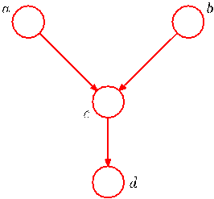

# Chapter 8 Exercises

[Page 438]

## 8.1 Directed Graph Normalization Verification ($\star$)

By marginalizing out the variables in order, show that the representation (8.5) for the joint distribution of a directed graph is correctly normalized, provided each of the conditional distributions is normalized.

## 8.2 Directed Graph Ordered Numbering ($\star$)

Show that the property of there being no directed cycles in a directed graph follows from the statement that there exists an ordered numbering of the nodes such that for each node there are no links going to a lower-numbered node.
[Page 439]

Table 8.2 The joint distribution over three binary variables.

| $a$ | $b$ | $c$ | $p(a,b,c)$ |
|---|---|---|---|
| $0$ | $0$ | $0$ | $0.192$ |
| $0$ | $0$ | $1$ | $0.144$ |
| $0$ | $1$ | $0$ | $0.048$ |
| $0$ | $1$ | $1$ | $0.216$ |
| $1$ | $0$ | $0$ | $0.192$ |
| $1$ | $0$ | $1$ | $0.064$ |
| $1$ | $1$ | $0$ | $0.048$ |
| $1$ | $1$ | $1$ | $0.096$ |

## 8.3 Marginal Dependence Conditional Independence ($\star$)

Consider three binary variables $a,b,c \in \{0,1\}$ having the joint distribution given in Table 8.2. Show by direct evaluation that this distribution has the property that $a$ and $b$ are marginally dependent, so that $p(a,b) \neq p(a)p(b)$, but that they become independent when conditioned on $c$, so that $p(a,b|c) = p(a|c)p(b|c)$ for both $c = 0$ and $c = 1$.

## 8.4 Joint Distribution Directed Graph ($\star$)

Evaluate the distributions $p(a)$, $p(b|c)$, and $p(c|a)$ corresponding to the joint distribution given in Table 8.2. Hence show by direct evaluation that $p(a,b,c) = p(a)p(c|a)p(b|c)$. Draw the corresponding directed graph.

## 8.5 RVM Probabilistic Graphical Model ($\star$)

Draw a directed probabilistic graphical model corresponding to the relevance vector machine described by (7.79) and (7.80).

## 8.6 Noisy-OR Conditional Distribution Interpretation ($\star$)

For the model shown in Figure 8.13, we have seen that the number of parameters required to specify the conditional distribution $p(y|x_1,\dots,x_M)$, where $x_i \in \{0,1\}$, could be reduced from $2^M$ to $M + 1$ by making use of the logistic sigmoid representation (8.10). An alternative representation (Pearl, 1988) is given by

$$
p(y = 1|x_1, \dots, x_M) = 1 - (1 - \mu_0) \prod_{i=1}^M (1 - \mu_i)^{x_i} \tag{8.104}
$$

where the parameters $\mu_i$ represent the probabilities $p(x_i = 1)$, and $\mu_0$ is an additional parameter satisfying $0 \le \mu_0 \le 1$. The conditional distribution (8.104) is known as the noisy-OR. Show that this can be interpreted as a 'soft' (probabilistic) form of the logical OR function (i.e., the function that gives $y = 1$ whenever at least one of the $x_i = 1$). Discuss the interpretation of $\mu_0$.

## 8.7 Graph Joint Distribution Moments ($\star$)

Using the recursion relations (8.15) and (8.16), show that the mean and covariance of the joint distribution for the graph shown in Figure 8.14 are given by (8.17) and (8.18), respectively.

## 8.8 Conditional Independence Property Proof ($\star$)

Show that $a \perp\!\!\!\perp b,c | d$ implies $a \perp\!\!\!\perp b | d$.

## 8.9 Markov Blanket Conditional Independence ($\star$)

Using the d-separation criterion, show that the conditional distribution for a node $x$ in a directed graph, conditioned on all of the nodes in the Markov blanket, is independent of the remaining variables in the graph.
[Page 440]

Figure 8.54 Example of a graphical model used to explore the conditional independence properties of the head-to-head path $a$–$c$–$b$ when a descendant of $c$, namely the node $d$, is observed.

## 8.10 Head-to-Head Path Independence ($\star$)

Consider the directed graph shown in Figure 8.54 in which none of the variables is observed. Show that $a \perp\!\!\!\perp b | \emptyset$. Suppose we now observe the variable $d$. Show that in general $a \not\perp\!\!\!\perp b | d$.

## 8.11 Unreliable Observation Conditional Probability ($\star$)

Consider the example of the car fuel system shown in Figure 8.21, and suppose that instead of observing the state of the fuel gauge $G$ directly, the gauge is seen by the driver $D$ who reports to us the reading on the gauge. This report is either that the gauge shows full $D = 1$ or that it shows empty $D = 0$. Our driver is a bit unreliable, as expressed through the following probabilities

$$
p(D = 1|G = 1) = 0.9 \tag{8.105}
$$
$$
p(D = 0|G = 0) = 0.9. \tag{8.106}
$$

Suppose that the driver tells us that the fuel gauge shows empty, in other words that we observe $D = 0$. Evaluate the probability that the tank is empty given only this observation. Similarly, evaluate the corresponding probability given also the observation that the battery is flat, and note that this second probability is lower. Discuss the intuition behind this result, and relate the result to Figure 8.54.

## 8.12 Number of Undirected Graphs ($\star$)

Show that there are $2^{M(M-1)/2}$ distinct undirected graphs over a set of $M$ distinct random variables. Draw the 8 possibilities for the case of $M = 3$.

## 8.13 ICM Energy Function Difference ($\star$)

Consider the use of iterated conditional modes (ICM) to minimize the energy function given by (8.42). Write down an expression for the difference in the values of the energy associated with the two states of a particular variable $x_j$, with all other variables held fixed, and show that it depends only on quantities that are local to $x_j$ in the graph.

## 8.14 Most Probable Latent Configuration ($\star$)

Consider a particular case of the energy function given by (8.42) in which the coefficients $\beta = h = 0$. Show that the most probable configuration of the latent variables is given by $x_i = y_i$ for all $i$.

## 8.15 Neighboring Nodes Joint Distribution ($\star$)

Show that the joint distribution $p(x_{n-1}, x_n)$ for two neighbouring nodes in the graph shown in Figure 8.38 is given by an expression of the form (8.58).
[Page 441]

## 8.16 Message Passing Algorithm Efficiency ($\star$)

Consider the inference problem of evaluating $p(x_n|x_N)$ for the graph shown in Figure 8.38, for all nodes $n \in \{1, \dots, N - 1\}$. Show that the message passing algorithm discussed in Section 8.4.1 can be used to solve this efficiently, and discuss which messages are modified and in what way.

## 8.17 D-Separation Message Passing Independence ($\star$)

Consider a graph of the form shown in Figure 8.38 having $N = 5$ nodes, in which nodes $x_3$ and $x_5$ are observed. Use d-separation to show that $x_2 \perp\!\!\!\perp x_5 | x_3$. Show that if the message passing algorithm of Section 8.4.1 is applied to the evaluation of $p(x_2|x_3, x_5)$, the result will be independent of the value of $x_5$.

## 8.18 Directed and Undirected Trees ($\star$)

Show that a distribution represented by a directed tree can trivially be written as an equivalent distribution over the corresponding undirected tree. Also show that a distribution expressed as an undirected tree can, by suitable normalization of the clique potentials, be written as a directed tree. Calculate the number of distinct directed trees that can be constructed from a given undirected tree.

## 8.19 Sum-Product Algorithm Chain Recovery ($\star$)

Apply the sum-product algorithm derived in Section 8.4.4 to the chain-of-nodes model discussed in Section 8.4.1 and show that the results (8.54), (8.55), and (8.57) are recovered as a special case.

## 8.20 Sum-Product Protocol Valid Ordering ($\star$)

Consider the message passing protocol for the sum-product algorithm on a tree-structured factor graph in which messages are first propagated from the leaves to an arbitrarily chosen root node and then from the root node out to the leaves. Use proof by induction to show that the messages can be passed in such an order that at every step, each node that must send a message has received all of the incoming messages necessary to construct its outgoing messages.

## 8.21 Factor Graph Marginal Distributions ($\star$)

Show that the marginal distributions $p(\mathbf{x}_s)$ over the sets of variables $\mathbf{x}_s$ associated with each of the factors $f_s(\mathbf{x}_s)$ in a factor graph can be found by first running the sum-product message passing algorithm and then evaluating the required marginals using (8.72).

## 8.22 Connected Subgraph Marginal Distribution ($\star$)

Consider a tree-structured factor graph, in which a given subset of the variable nodes form a connected subgraph (i.e., any variable node of the subset is connected to at least one of the other variable nodes via a single factor node). Show how the sum-product algorithm can be used to compute the marginal distribution over that subset.

## 8.23 Factor Graph Marginal Product ($\star$)

In Section 8.4.4, we showed that the marginal distribution $p(x_i)$ for a variable node $x_i$ in a factor graph is given by the product of the messages arriving at this node from neighbouring factor nodes in the form (8.63). Show that the marginal $p(x_i)$ can also be written as the product of the incoming message along any one of the links with the outgoing message along the same link.

## 8.24 Factor Marginal Arriving Messages ($\star$)

Show that the marginal distribution for the variables $\mathbf{x}_s$ in a factor $f_s(\mathbf{x}_s)$ in a tree-structured factor graph, after running the sum-product message passing algorithm, can be written as the product of the message arriving at the factor node along all its links, times the local factor $f_s(\mathbf{x}_s)$, in the form (8.72).
[Page 442]

## 8.25 Sum-Product Correct Marginals Verification ($\star$)

In (8.86), we verified that the sum-product algorithm run on the graph in Figure 8.51 with node $x_3$ designated as the root node gives the correct marginal for $x_2$. Show that the correct marginals are obtained also for $x_1$ and $x_3$. Similarly, show that the use of the result (8.72) after running the sum-product algorithm on this graph gives the correct joint distribution for $x_1, x_2$.

## 8.26 Joint Distribution Successive Clamping ($\star$)

Consider a tree-structured factor graph over discrete variables, and suppose we wish to evaluate the joint distribution $p(x_a, x_b)$ associated with two variables $x_a$ and $x_b$ that do not belong to a common factor. Define a procedure for using the sum-product algorithm to evaluate this joint distribution in which one of the variables is successively clamped to each of its allowed values.

## 8.27 Maximal Marginals Zero Joint ($\star$)

Consider two discrete variables $x$ and $y$ each having three possible states, for example $x,y \in \{0,1,2\}$. Construct a joint distribution $p(x,y)$ over these variables having the property that the value $x$ that maximizes the marginal $p(x)$, along with the value $y$ that maximizes the marginal $p(y)$, together have probability zero under the joint distribution, so that $p(x, y) = 0$.

## 8.28 Pending Messages in Cycles ($\star$)

The concept of a pending message in the sum-product algorithm for a factor graph was defined in Section 8.4.7. Show that if the graph has one or more cycles, there will always be at least one pending message irrespective of how long the algorithm runs.

## 8.29 Tree Structure No Pending Messages ($\star$)

Show that if the sum-product algorithm is run on a factor graph with a tree structure (no loops), then after a finite number of messages have been sent, there will be no pending messages.
