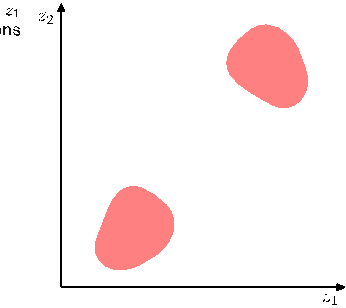
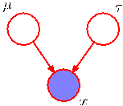

# Chapter 11 Exercises

[Page 576]

## 11.1 Finite Sample Estimator Variance ($\star$)

Show that the finite sample estimator $\widehat{f}$ defined by (11.2) has mean equal to $\mathbb{E}[f]$ and variance given by (11.3).

## 11.2 Inverse Transform Sampling ($\star$)

Suppose that $z$ is a random variable with uniform distribution over $(0, 1)$ and that we transform $z$ using $y = h^{-1}(z)$ where $h(y)$ is given by (11.6). Show that $y$ has the distribution $p(y)$.

## 11.3 Generating Cauchy Distributed Samples ($\star$)

Given a random variable $z$ that is uniformly distributed over $(0, 1)$, find a transformation $y = f(z)$ such that $y$ has a Cauchy distribution given by (11.8).

## 11.4 Box-Muller Transformation Derivation ($\star$)

Suppose that $z_1$ and $z_2$ are uniformly distributed over the unit circle, as shown in Figure 11.3, and that we make the change of variables given by (11.10) and (11.11). Show that $(y_1, y_2)$ will be distributed according to (11.12).

## 11.5 Multivariate Gaussian using Cholesky ($\star\star$)

Let $\mathbf{z}$ be a $D$-dimensional random variable having a Gaussian distribution with zero mean and unit covariance matrix, and suppose that the positive definite symmetric matrix $\mathbf{\Sigma}$ has the Cholesky decomposition $\mathbf{\Sigma} = \mathbf{L}\mathbf{L}^{\text{T}}$ where $\mathbf{L}$ is a lower triangular matrix (i.e., one with zeros above the leading diagonal). Show that the variable $\mathbf{y} = \boldsymbol{\mu} + \mathbf{L}\mathbf{z}$ has a Gaussian distribution with mean $\boldsymbol{\mu}$ and covariance $\mathbf{\Sigma}$. This provides a technique for generating samples from a general multivariate Gaussian using samples from a univariate Gaussian having zero mean and unit variance.

## 11.6 Validity of Rejection Sampling ($\star\star$)

In this exercise, we show more carefully that rejection sampling does indeed draw samples from the desired distribution $p(\mathbf{z})$. Suppose the proposal distribution is $q(\mathbf{z})$ and show that the probability of a sample value $\mathbf{z}$ being accepted is given by $\widetilde{p}(\mathbf{z}) / k q(\mathbf{z})$ where $\widetilde{p}$ is any unnormalized distribution that is proportional to $p(\mathbf{z})$, and the constant $k$ is set to the smallest value that ensures $k q(\mathbf{z}) \geqslant \widetilde{p}(\mathbf{z})$ for all values of $\mathbf{z}$. Note that the probability of drawing a value $\mathbf{z}$ is given by the probability of drawing that value from $q(\mathbf{z})$ times the probability of accepting that value given that it has been drawn. Make use of this, along with the sum and product rules of probability, to write down the normalized form for the distribution over $\mathbf{z}$, and show that it equals $p(\mathbf{z})$.

## 11.7 Uniform to Cauchy Transformation ($\star$)

Suppose that $z$ has a uniform distribution over the interval $[0, 1]$. Show that the variable $y = b \tan z + c$ has a Cauchy distribution given by (11.16).

## 11.8 Envelope Distribution Coefficients ($\star\star$)

Determine expressions for the coefficients $k_i$ in the envelope distribution (11.17) for adaptive rejection sampling using the requirements of continuity and normalization.

## 11.9 Sampling Piecewise Exponential Distribution ($\star\star$)

By making use of the technique discussed in Section 11.1.1 for sampling from a single exponential distribution, devise an algorithm for sampling from the piecewise exponential distribution defined by (11.17).

## 11.10 Random Walk Variance Growth ($\star$)

Show that the simple random walk over the integers defined by (11.34), (11.35), and (11.36) has the property that $\mathbb{E}[(z^{(\tau)})^2] = \mathbb{E}[(z^{(\tau-1)})^2] + 1/2$ and hence by induction that $\mathbb{E}[(z^{(\tau)})^2] = \tau/2$.
[Page 577]

Figure 11.15 A probability distribution over two variables $z_1$ and $z_2$ that is uniform over the shaded regions and that is zero everywhere else.

## 11.11 Detailed Balance in Gibbs Sampling ($\star\star$)

Show that the Gibbs sampling algorithm, discussed in Section 11.3, satisfies detailed balance as defined by (11.40).

## 11.12 Ergodicity in Gibbs Sampling ($\star$)

Consider the distribution shown in Figure 11.15. Discuss whether the standard Gibbs sampling procedure for this distribution is ergodic, and therefore whether it would sample correctly from this distribution.

## 11.13 Conditional Distributions for Gibbs ($\star$)

Consider the simple 3-node graph shown in Figure 11.16 in which the observed node $x$ is given by a Gaussian distribution $\mathcal{N}(x|\mu, \tau^{-1})$ with mean $\mu$ and precision $\tau$. Suppose that the marginal distributions over the mean and precision are given by $\mathcal{N}(\mu|\mu_0, s_0)$ and $\text{Gam}(\tau|a, b)$, where $\text{Gam}(\cdot|\cdot, \cdot)$ denotes a gamma distribution. Write down expressions for the conditional distributions $p(\mu|x, \tau)$ and $p(\tau|x, \mu)$ that would be required in order to apply Gibbs sampling to the posterior distribution $p(\mu, \tau|x)$.

## 11.14 Over-relaxation Update Properties ($\star$)

Verify that the over-relaxation update (11.50), in which $z_i$ has mean $\mu_i$ and variance $\sigma_i^2$, and where $\nu$ has zero mean and unit variance, gives a value $z_i'$ with mean $\mu_i$ and variance $\sigma_i^2$.

## 11.15 Equivalence of Hamiltonian Equations ($\star$)

Using (11.56) and (11.57), show that the Hamiltonian equation (11.58) is equivalent to (11.53). Similarly, using (11.57) show that (11.59) is equivalent to (11.55).

## 11.16 Gaussian Conditional in Hamiltonian ($\star$)

By making use of (11.56), (11.57), and (11.63), show that the conditional distribution $p(\mathbf{r}|\mathbf{z})$ is a Gaussian.

Figure 11.16 A graph involving an observed Gaussian variable $x$ with prior distributions over its mean $\mu$ and precision $\tau$.
[Page 578]

## 11.17 Detailed Balance in Hybrid Monte Carlo ($\star$)

Verify that the two probabilities (11.68) and (11.69) are equal, and hence that detailed balance holds for the hybrid Monte Carlo algorithm.
