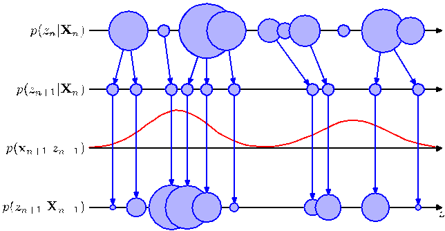

# Chapter 13 Exercises

[Page 666]

## 13.1 Conditional independence in Markov models ($\star$)

Use the technique of d-separation, discussed in Section 8.2, to verify that the Markov model shown in Figure 13.3 having $N$ nodes in total satisfies the conditional independence properties (13.3) for $n = 2, \dots, N$. Similarly, show that a model described by the graph in Figure 13.4 in which there are $N$ nodes in total
[Page 667]

Figure 13.23 Schematic illustration of the operation of the particle filter for a one-dimensional latent space. At time step $n$, the posterior $p(z_n|x_n)$ is represented as a mixture distribution, shown schematically as circles whose sizes are proportional to the weights $w_n^{(l)}$. A set of $L$ samples is then drawn from this distribution and the new weights $w_{n+1}^{(l)}$ evaluated using $p(x_{n+1}|z_{n+1}^{(l)})$.

satisfies the conditional independence properties

$$
p(\mathbf{x}_n|\mathbf{x}_1, \dots, \mathbf{x}_{n-1}) = p(\mathbf{x}_n|\mathbf{x}_{n-1}, \mathbf{x}_{n-2}) \tag{13.122}
$$

for $n = 3, \dots, N$.

## 13.2 Joint distribution conditional independence ($\star$)

Consider the joint probability distribution (13.2) corresponding to the directed graph of Figure 13.3. Using the sum and product rules of probability, verify that this joint distribution satisfies the conditional independence property (13.3) for $n = 2, \dots, N$. Similarly, show that the second-order Markov model described by the joint distribution (13.4) satisfies the conditional independence property

$$
p(\mathbf{x}_n|\mathbf{x}_1, \dots, \mathbf{x}_{n-1}) = p(\mathbf{x}_n|\mathbf{x}_{n-1}, \mathbf{x}_{n-2}) \tag{13.123}
$$

for $n = 3, \dots, N$.

## 13.3 State space model independence properties ($\star$)

By using d-separation, show that the distribution $p(\mathbf{x}_1, \dots, \mathbf{x}_N)$ of the observed data for the state space model represented by the directed graph in Figure 13.5 does not satisfy any conditional independence properties and hence does not exhibit the Markov property at any finite order.

## 13.4 Learning emission density parameters ($\star$)

Consider a hidden Markov model in which the emission densities are represented by a parametric model $p(\mathbf{x}|\mathbf{z}, \mathbf{w})$, such as a linear regression model or a neural network, in which $\mathbf{w}$ is a vector of adaptive parameters. Describe how the parameters $\mathbf{w}$ can be learned from data using maximum likelihood.
[Page 668]

## 13.5 M-step for HMM probabilities ($\star$)

Verify the M-step equations (13.18) and (13.19) for the initial state probabilities and transition probability parameters of the hidden Markov model by maximization of the expected complete-data log likelihood function (13.17), using appropriate Lagrange multipliers to enforce the summation constraints on the components of $\boldsymbol{\pi}$ and $\mathbf{A}$.

## 13.6 Zero parameters in HMM EM ($\star$)

Show that if any elements of the parameters $\boldsymbol{\pi}$ or $\mathbf{A}$ for a hidden Markov model are initially set to zero, then those elements will remain zero in all subsequent updates of the EM algorithm.

## 13.7 M-step for Gaussian emission HMM ($\star$)

Consider a hidden Markov model with Gaussian emission densities. Show that maximization of the function $Q(\boldsymbol{\theta}, \boldsymbol{\theta}^{\text{old}})$ with respect to the mean and covariance parameters of the Gaussians gives rise to the M-step equations (13.20) and (13.21).

## 13.8 Multinomial emission models in HMM ($\star$)

For a hidden Markov model having discrete observations governed by a multinomial distribution, show that the conditional distribution of the observations given the hidden variables is given by (13.22) and the corresponding M step equations are given by (13.23). Write down the analogous equations for the conditional distribution and the M step equations for the case of a hidden Markov with multiple binary output variables each of which is governed by a Bernoulli conditional distribution. Hint: refer to Sections 2.1 and 2.2 for a discussion of the corresponding maximum likelihood solutions for i.i.d. data if required.

## 13.9 d-separation in hidden Markov models ($\star$)

Use the d-separation criterion to verify that the conditional independence properties (13.24)-(13.31) are satisfied by the joint distribution for the hidden Markov model defined by (13.6).

## 13.10 Sum-product rules for HMM independence ($\star$)

By applying the sum and product rules of probability, verify that the conditional independence properties (13.24)-(13.31) are satisfied by the joint distribution for the hidden Markov model defined by (13.6).

## 13.11 Joint posterior over successive latents ($\star$)

Starting from the expression (8.72) for the marginal distribution over the variables of a factor in a factor graph, together with the results for the messages in the sum-product algorithm obtained in Section 13.2.3, derive the result (13.43) for the joint posterior distribution over two successive latent variables in a hidden Markov model.

## 13.12 EM for multiple independent sequences ($\star$)

Suppose we wish to train a hidden Markov model by maximum likelihood using data that comprises $R$ independent sequences of observations, which we denote by $\mathbf{X}^{(r)}$ where $r = 1, \dots, R$. Show that in the E step of the EM algorithm, we simply evaluate posterior probabilities for the latent variables by running the $\alpha$ and $\beta$ recursions independently for each of the sequences. Also show that in the M step, the initial probability and transition probability parameters are re-estimated
[Page 669]

using modified forms of (13.18) and (13.19) given by

$$
\pi_k = \frac{\sum_{r=1}^R \gamma(z_{1k}^{(r)})}{\sum_{r=1}^R \sum_{j=1}^K \gamma(z_{1j}^{(r)})} \tag{13.124}
$$

$$
A_{jk} = \frac{\sum_{r=1}^R \sum_{n=2}^N \xi(z_{n-1,j}^{(r)}, z_{nk}^{(r)})}{\sum_{r=1}^R \sum_{l=1}^K \sum_{n=2}^N \xi(z_{n-1,j}^{(r)}, z_{nl}^{(r)})} \tag{13.125}
$$

where, for notational convenience, we have assumed that the sequences are of the same length (the generalization to sequences of different lengths is straightforward). Similarly, show that the M-step equation for re-estimation of the means of Gaussian emission models is given by

$$
\boldsymbol{\mu}_k = \frac{\sum_{r=1}^R \sum_{n=1}^N \gamma(z_{nk}^{(r)})\mathbf{x}_n^{(r)}}{\sum_{r=1}^R \sum_{n=1}^N \gamma(z_{nk}^{(r)})}. \tag{13.126}
$$

Note that the M-step equations for other emission model parameters and distributions take an analogous form.

## 13.13 Alpha message in factor graph ($\star$)

Use the definition (8.64) of the messages passed from a factor node to a variable node in a factor graph, together with the expression (13.6) for the joint distribution in a hidden Markov model, to show that the definition (13.50) of the alpha message is the same as the definition (13.34).

## 13.14 Beta message in factor graph ($\star$)

Use the definition (8.67) of the messages passed from a factor node to a variable node in a factor graph, together with the expression (13.6) for the joint distribution in a hidden Markov model, to show that the definition (13.52) of the beta message is the same as the definition (13.35).

## 13.15 Marginals for re-scaled variables ($\star$)

Use the expressions (13.33) and (13.43) for the marginals in a hidden Markov model to derive the corresponding results (13.64) and (13.65) expressed in terms of re-scaled variables.

## 13.16 Viterbi algorithm forward recursion ($\star\star$)

In this exercise, we derive the forward message passing equation for the Viterbi algorithm directly from the expression (13.6) for the joint distribution. This involves maximizing over all of the hidden variables $\mathbf{z}_1, \dots, \mathbf{z}_N$. By taking the logarithm and then exchanging maximizations and summations, derive the recursion
[Page 670]

(13.68) where the quantities $\omega(\mathbf{z}_n)$ are defined by (13.70). Show that the initial condition for this recursion is given by (13.69).

## 13.17 Input-output HMM factor graph ($\star$)

Show that the directed graph for the input-output hidden Markov model, given in Figure 13.18, can be expressed as a tree-structured factor graph of the form shown in Figure 13.15 and write down expressions for the initial factor $h(\mathbf{z}_1)$ and for the general factor $f_n(\mathbf{z}_{n-1}, \mathbf{z}_n)$ where $2 \le n \le N$.

## 13.18 Forward-backward for input-output HMM ($\star$)

Using the result of Exercise 13.17, derive the recursion equations, including the initial conditions, for the forward-backward algorithm for the input-output hidden Markov model shown in Figure 13.18.

## 13.19 Most probable sequence in LDS ($\star$)

The Kalman filter and smoother equations allow the posterior distributions over individual latent variables, conditioned on all of the observed variables, to be found efficiently for linear dynamical systems. Show that the sequence of latent variable values obtained by maximizing each of these posterior distributions individually is the same as the most probable sequence of latent values. To do this, simply note that the joint distribution of all latent and observed variables in a linear dynamical system is Gaussian, and hence all conditionals and marginals will also be Gaussian, and then make use of the result (2.98).

## 13.20 Proving conditional Gaussian result ($\star$)

Use the result (2.115) to prove (13.87).

## 13.21 Deriving Kalman filter equations ($\star\star$)

Use the results (2.115) and (2.116), together with the matrix identities (C.5) and (C.7), to derive the results (13.89), (13.90), and (13.91), where the Kalman gain matrix $\mathbf{K}_n$ is defined by (13.92).

## 13.22 Deriving Kalman gain properties ($\star$)

Using (13.93), together with the definitions (13.76) and (13.77) and the result (2.115), derive (13.96).

## 13.23 Predictive and updated state covariances ($\star\star$)

Using (13.93), together with the definitions (13.76) and (13.77) and the result (2.116), derive (13.94), (13.95) and (13.97).

## 13.24 Adding constant terms in LDS ($\star$)

Consider a generalization of (13.75) and (13.76) in which we include constant terms $\mathbf{a}$ and $\mathbf{c}$ in the Gaussian means, so that

$$
p(\mathbf{z}_n|\mathbf{z}_{n-1}) = \mathcal{N}(\mathbf{z}_n|\mathbf{A}\mathbf{z}_{n-1} + \mathbf{a}, \mathbf{\Gamma}) \tag{13.127}
$$
$$
p(\mathbf{x}_n|\mathbf{z}_n) = \mathcal{N}(\mathbf{x}_n|\mathbf{C}\mathbf{z}_n + \mathbf{c}, \mathbf{\Sigma}). \tag{13.128}
$$

Show that this extension can be re-case in the framework discussed in this chapter by defining a state vector $\mathbf{z}$ with an additional component fixed at unity, and then augmenting the matrices $\mathbf{A}$ and $\mathbf{C}$ using extra columns corresponding to the parameters $\mathbf{a}$ and $\mathbf{c}$.

## 13.25 Kalman filter for independent observations ($\star\star$)

In this exercise, we show that when the Kalman filter equations are applied to independent observations, they reduce to the results given in Section 2.3 for the maximum likelihood solution for a single Gaussian distribution. Consider the problem of finding the mean $\boldsymbol{\mu}$ of a single Gaussian random variable $\mathbf{x}$, in which we are given a set of independent observations $\{\mathbf{x}_1, \dots, \mathbf{x}_N\}$. To model this we can use
[Page 671]

a linear dynamical system governed by (13.75) and (13.76), with latent variables $\{\mathbf{z}_1, \dots, \mathbf{z}_N\}$ in which $\mathbf{C}$ becomes the identity matrix and where the transition probability $\mathbf{A} = \mathbf{0}$ because the observations are independent. Let the parameters $\boldsymbol{\mu}_0$ and $\mathbf{V}_0$ of the initial state be denoted by $\boldsymbol{\mu}_0$ and $\sigma_0^2\mathbf{I}$, respectively, and suppose that $\mathbf{\Sigma}$ becomes $\sigma^2\mathbf{I}$. Write down the corresponding Kalman filter equations starting from the general results (13.89) and (13.90), together with (13.94) and (13.95). Show that these are equivalent to the results (2.141) and (2.142) obtained directly by considering independent data.

## 13.26 LDS equivalence to probabilistic PCA ($\star\star$)

Consider a special case of the linear dynamical system of Section 13.3 that is equivalent to probabilistic PCA, so that the transition matrix $\mathbf{A} = \mathbf{0}$, the covariance $\mathbf{\Gamma} = \mathbf{I}$, and the noise covariance $\mathbf{\Sigma} = \sigma^2\mathbf{I}$. By making use of the matrix inversion identity (C.7) show that, if the emission density matrix $\mathbf{C}$ is denoted $\mathbf{W}$, then the posterior distribution over the hidden states defined by (13.89) and (13.90) reduces to the result (12.42) for probabilistic PCA.

## 13.27 Zero observation noise limit LDS ($\star$)

Consider a linear dynamical system of the form discussed in Section 13.3 in which the amplitude of the observation noise goes to zero, so that $\mathbf{\Sigma} = \mathbf{0}$. Show that the posterior distribution for $\mathbf{z}_n$ has mean $\mathbf{x}_n$ and zero variance. This accords with our intuition that if there is no noise, we should just use the current observation $\mathbf{x}_n$ to estimate the state variable $\mathbf{z}_n$ and ignore all previous observations.

## 13.28 Constant state variable in LDS ($\star$)

Consider a special case of the linear dynamical system of Section 13.3 in which the state variable $\mathbf{z}_n$ is constrained to be equal to the previous state variable, which corresponds to $\mathbf{A} = \mathbf{I}$ and $\mathbf{\Gamma} = \mathbf{0}$. For simplicity, assume also that $\mathbf{V}_0 \to \infty\mathbf{I}$ so that the initial conditions for $\mathbf{z}$ are unimportant, and the predictions are determined purely by the data. Use proof by induction to show that the posterior mean for state $\mathbf{z}_n$ is determined by the average of $\mathbf{x}_1, \dots, \mathbf{x}_n$. This corresponds to the intuitive result that if the state variable is constant, our best estimate is obtained by averaging the observations.

## 13.29 Deriving RTS smoothing equations ($\star\star$)

Starting from the backwards recursion equation (13.99), derive the RTS smoothing equations (13.100) and (13.101) for the Gaussian linear dynamical system.

## 13.30 Pairwise posterior marginal in LDS ($\star\star$)

Starting from the result (13.65) for the pairwise posterior marginal in a state space model, derive the specific form (13.103) for the case of the Gaussian linear dynamical system.

## 13.31 Cross-covariance in linear dynamical systems ($\star\star$)

Starting from the result (13.103) and by substituting for $\widehat{\alpha}(\mathbf{z}_n)$ using (13.84), verify the result (13.104) for the covariance between $\mathbf{z}_n$ and $\mathbf{z}_{n-1}$.

## 13.32 M-step for initial LDS parameters ($\star\star$)

Verify the results (13.110) and (13.111) for the M-step equations for $\boldsymbol{\mu}_0$ and $\mathbf{V}_0$ in the linear dynamical system.

## 13.33 M-step for LDS transition parameters ($\star\star$)

Verify the results (13.113) and (13.114) for the M-step equations for $\mathbf{A}$ and $\mathbf{\Gamma}$ in the linear dynamical system.
[Page 672]

## 13.34 M-step for LDS emission parameters ($\star\star$)

Verify the results (13.115) and (13.116) for the M-step equations for $\mathbf{C}$ and $\mathbf{\Sigma}$ in the linear dynamical system.
