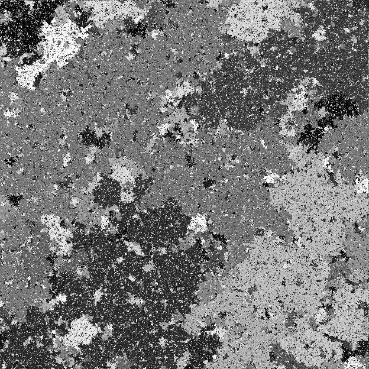
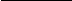

# 1. Random-Cluster Measures

## Table of Contents

- [Random-cluster model](#sec-1-1-2)
- [Ising and Potts models](#sec-1-1-3)
- [Random-cluster and Ising/Potts models coupled](#sec-1-1-4)
- [The limit as q ↓ 0](#sec-1-1-5)
- [Basic notation](#sec-1-1-6)

- [1.1 Introduction](#sec-1-1) — 1 (lines 137-511)
- [1.2 Random-cluster model](#sec-1-2) — 4 (lines 137-511)
- [1.3 Ising and Potts models](#sec-1-3) — 6 (lines 137-511)
- [1.4 Random-cluster and Ising/Potts models coupled](#sec-1-4) — 8 (lines 137-511)
- [1.5 The limit as q ↓ 0](#sec-1-5) — 13 (lines 137-511)
- [1.6 Basic notation](#sec-1-6) — 15 (lines 137-511)

Summary. The random-cluster model is introduced, and its relationship to Ising and Potts models is presented via a coupling of probability measures. In the limit as the cluster-weighting factor tends to 0, one arrives at electrical networks and uniform spanning trees and forests.

## 1 Introduction

In 1925 came the Ising model for a ferromagnet,and in 1957 the percolation model for a disordered medium. Each has since been the subject of intense study,and their theories have become elaborate. Each possesses a phase transition marking the onset of long-range order, defined in terms of correlation functions for the Ising model and in terms of the unboundedness of paths for percolation. These two phase transitions have been the scenes of notable exact (and rigorous) calculations which have since inspired many physicists and mathematicians.

It has been known since at least 1847 that electrical networks satisfy so-called ‘series/parallel laws’. Piet Kasteleyn noted during the 1960s that the percolation and Ising models also have such properties. This simple observation led in joint work with Cees Fortuin to the formulation of the random-cluster model. This new model has two parameters, an ‘edge-weight’ p and a ‘cluster-weight’ q. The (bond) percolation model is retrieved by setting $q$ = 1; when $q$ = 2, we obtain a representation of the Ising model, and similarly of the Potts model when $q$ = 2,3,... . The discovery of the model is described in Kasteleyn’s words in the Appendix of the current work.

The mathematics begins with a finite graph G = (V, E), and the associated Ising model1 thereon. A random variable $\sigma_x$ taking values −1 and +1 is assigned to each vertex x of G, and the probability of the configuration σ = ($\sigma_x$ : x ∈ V) is taken to be proportional to e−βH(σ), where β > 0 and the ‘energy’ H(σ) is the

The so-called Ising model [190] was in fact proposed (to Ising) by Lenz. The Potts model [105, 278] originated in a proposal (to Potts) by Domb.

### 2 Random-Cluster Measures [1.1]

negativeof the sum of σxσy overall edges $e = \langle x, y \rangle$ of G. As β increases, greater probability is assigned to configurations having a large number of neighbouring pairs of vertices with equal signs. The Ising model has proved extraordinarily successful in generating beautiful mathematics of relevance to the physics, and it has been useful and provocative in the mathematical theory of phase transitions and cooperative phenomena (see, for example, [118]). The proof of the existence of a phase transition in two dimensions was completed by Peierls, [266], by way of his famous “argument”.

Thereare manypossiblegeneralizationsofthe Ising modelin whichthe $\sigma_x$ may take a generalnumber q of values, ratherthan $q$ = 2 only. One such extension, the so-called ‘Potts model’, [278], has attracted especial interest amongst physicists, and has displayed a complex and varied structure. For example, when $q$ is large, it possesses a discontinuousphase transition, in contrast to the continuoustransition believedto take place forsmall q. Ising/Pottsmodelsare the first of three principal ingredients in the story of random-cluster models. Note that they are ‘vertexmodels’ in the sense that they involve random variables $\sigma_x$ indexed by the vertices x of the underlying graph. (There is a related extension of the Ising model due to Ashkin and Teller, [21], see Section 11.3.)

The (bond) percolation model was inspired by problems of physical type, and emerged from the mathematics literature2 of the 1950s, [70]. In this model for a porous medium, each edge of the graph G is declared ‘open’ (to the passage of fluid) with probability $p$, and ‘closed’ otherwise, different edges having independent states. The problem is to determine the typical large-scale properties of connected components of open edges as the parameter $p$ varies. Percolation theory is now a mature part of probability lying at the core of the study of random media and interacting systems, and it is the second ingredient in the story of random-clustermodels. Note that bond percolation is an ‘edge-model’, in that the randomvariablesare indexedby the set ofedgesof the underlyinggraph. (Thereis a variant termed ‘site percolation’ in which the vertices are open/closed at random rather than the edges, see [154, Section 1.6].)

The theory of electrical networks on the graph G is of course more ancient than that of Ising and percolation models, dating back at least to the 1847 paper, [215], in which Kirchhoff set down a method for calculating macroscopic properties of an electrical network in terms of its local structure. Kirchhoff’s work explains in particular the relevance of counts of certain types of spanning trees of the graph. To import current language, an electrical network on a graph G may be studied via the properties of a ‘uniformly random spanning tree’ (UST) on G (see [31]).

The three ingredients above seemed fairly distinct until Fortuin and Kasteleyn discovered around 1970, [120, 121, 122, 123, 203], that each features within a certain parametric family of models which they termed ‘random-cluster models’. They developed the basic theory of such models — correlation inequalities and the like — in this series of papers. The true power of random-cluster models as a mechanism for studying Ising/Potts models has emerged progressively over the intervening three decades.

[1.1] Introduction 

The configuration space of the random-cluster model is the set of all subsets of the edge-set E, which we represent as the set \Omega = \{0,1\}^E of 0/1-vectors indexed by E. An edge e is termed open in the configuration ω ∈ if ω(e) = 1, and it is termed closed if ω(e) = 0. The random-cluster model is thus an edge-model, in contrast to the Ising and Potts models which assign spins to the vertices of G. The subject of current study is the subgraph of G induced by the set of open edges of a configuration chosen at random from according to a certain probability measure. Of particular importance is the existence (or not) of paths of open edges joining given vertices x and y, and thus the random-cluster model is a model in stochastic geometry.

The model may be viewed as a parametric family of probability measures φp,q on , the two parameters being denoted by p ∈ [0,1] and $q$ ∈ (0,∞). The parameter $p$ amounts to a measure of the density of open edges, and the parameter $q$ is a ‘cluster-weighting’ factor. When $q$ = 1, φp,$q$ is a product measure, and the ensuing probabilityspace is usually termed a percolationmodelor a randomgraph dependingon the context. The integervalues $q$ = 2,3,. . . correspondin a certain way to the Potts model on G with q local states, and thus $q$ = 2 correspondsto the Ising model. The nature of these ‘correspondences’,as described in Section 1.4, is that ‘correlation functions’ of the Potts model may be expressed as ‘connectivity functions’ of the random-clustermodel. When extendedto infinite graphs, it turns out that long-range order in a Potts model corresponds to the existence of infinite clusters in the corresponding random-cluster model. In this sense the Potts and percolation phase transitions are counterparts of one another.

Therein lies a major strength of the random-cluster model. Geometrical methods of some complexity have been derived in the study of percolation, and some of these may be adapted and extended to more general random-cluster models, therebyobtainingresults of significance forIsing and Potts models. Such has been the value of the random-cluster model in studying Ising and Potts models that it is sometimes called simply the ‘FK representation’ of the latter systems, named after Fortuin and Kasteleyn. We shall see in Chapter 11 that several other spin models of statistical mechanics possess FK-type representations.

The random-cluster and Ising/Potts models on the graph G = (V, E) are defined formally in the next two sections. Their relationship is best studied via a certain coupling on the product {0,1}E × {1,2,. . .,q}V, and this coupling is described in Section 1.4. The ‘uniform spanning-tree’ (UST) measure on G is a limiting case of the random-cluster measure, and this and related limits are the topic of Section 1.5. This chapter ends with a section devoted to basic notation.

4 Random-Cluster Measures [1.2]

## 1.2 Random-cluster model

Let G = (V, E) be a finite graph. The graphsconsideredhere will usually possess neither loops nor multiple edges, but we make no such general assumption. An edge e having endvertices x and y is written as $e = \langle x, y \rangle$ . A random-cluster measure on G is a member of a certain class of probability measures on the set $\Omega$ of subsets of the edge set E. We take as state space the set \Omega = \{0,1\}^E, members of which are 0/1-vectors ω = (ω(e) : e ∈ E). We speak of the edge e as being open (in ω) if ω(e) = 1, and as being closed if ω(e) = 0. For ω ∈ , let η(ω) = {e ∈ E : ω(e) = 1} denote the set of open edges. There is a one–one correspondence between vectors ω ∈ and subsets F ⊆ E, given by F = η(ω). Let k(ω) be the numberof connected components(or ‘open clusters’) of the graph (V,η(ω)), and note that k(ω) includes a count of isolated vertices, that is, of vertices incident to no open edge. We associate with the σ-field F of all its subsets.

Thismeasurediffersfromproductmeasurethroughthe inclusionofthe term qk(ω). Note the difference between the cases q ≤ 1 and $q$ ≥ 1: the former favours fewer clusters, whereas the latter favours a larger number of clusters. When $q$ = 1, edges are open/closed independently of one another. This very special case has been studied in detail under the titles ‘percolation’ and ‘random graphs’, see [61, 154, 194]. Perhaps the most important values of $q$ are the integers, since the random-cluster model with q ∈ {2,3,. . .} corresponds, in a way described in the next two sections, to the Potts model with q local states. The bulk of the work presented in this book is devoted to the theory of random-cluster measures when q ≥ 1. The case $q$ < 1 seems to be harder mathematically and less important physically. There is some interest in the limit as q ↓ 0; see Section 1.5.

We shall sometimes write φG,p,q for φp,q when the choice of graph G is to be stressed. Computer-generated samples from random-cluster measures on Z2 are presented in Figures 1.1–1.2. When $q$ = 1, the measure φp,$q$ is a product measure with density p, and we write φG,p or φp for this special case.

Figure 1.1. Samples from the random-cluster measure with $q$ = 1 on a 40 × 40 box of the square lattice. We have set $q$ = 1 for ease of programming, the measure being of product form in this case. The critical value is p c ( 1 ) = 1 2 . Samples with more general values of $q$ may be obtained by the method of ‘coupling from the past’, as described in Section 8.4.

6 Random-Cluster Measures [1.3]

Figure 1.2. A picture of the random-cluster model with free boundary conditions on a 2048× 2048 box of L2, with $p$ = 0.585816 and $q$ = 2. The critical value of the model with $q$ = 2 is pc = √2/(1 + √2) = 0.585786 ..., and therefore the simulation is of a mildly supercritical system. It was obtained by simulating the Ising model using Glauber dynamics (see Section 8.2), and then applying the coupling illustrated in Figure 1.3. Each individual cluster is highlighted with a different tint of gray, and the smaller clusters are not visible in the picture. This and later simulations in Section 5.7 are reproduced by kind permission of Raphaël Cerf.

## 1.3 Ising and Potts models

In a famous experiment, a piece of iron is exposed to a magnetic field. The field is increased from zero to amaximum,and then diminished tozero. If the temperature is sufficiently low, the iron retains some residual magnetization, otherwise it does not. There is a critical temperature for this phenomenon, often called the Curie point after Pierre Curie, who reported this discovery in his 1895 thesis, [98]3. The

In an example of Stigler’s Law, [309], the existence of such a temperature was discovered before 1832 by Pouillet, see [198].

[1.3] Ising and Potts models

famous (Lenz–)Ising model for such ferromagnetism, [190], may be summarized as follows. One supposes that particles are positioned at the points of some lattice embedded in Euclidean space. Each particle may be in either of two states, representing the physical states of ‘spin-up’ and ‘spin-down’. Spin-values are chosen at random according to a certain probability measure, known as a ‘Gibbs state’, which is governed by interactions between neighbouring particles. The relevant probability measure is given as follows.

Let G = (V, E) be a finite graph representing part of the lattice. We think of each vertex x ∈ V as being occupied by a particle having a random spin. Since spins are assumed to come in two basic types, we take as sample space the set

= {−1,+1}V. The appropriateprobabilitymass function λβ,J,h on has three parameters satisfying β, J ∈ [0,∞) and h ∈ R, and is given by (1.3) λβ,J,h(σ) =

1 ZI

e−βH(σ), σ ∈ , where the partition function ZI and the ‘Hamiltonian’ H : → R are given by (1.4) ZI =

The physical interpretation of β is as the reciprocal 1/T of temperature, of J as the strength of interaction between neighbours, and of h as the external magnetic field. For reasons of simplicity, we shall consider here only the case of zero external-field, and we assume henceforth that h = 0.

Each edge has equal interaction strength J in the above formulation. Since β and J occur only as a product β J, the measure λβ,J,0 has effectively only a single parameter β J. In a more complicated measure not studied here, different edges e are permitted to have different interaction strengths Je, see Chapter 9. In the meantime we shall wrap β and J together by setting J = 1, and we write λβ = λβ,1,0

As pointed out by Baxter, [26], the Ising model permits an infinity of generalizations. Of these, the extension to so-called ‘Potts models’ has proved especially fruitful. Whereas the Ising model permits only two possible spin-values at each vertex, the Potts model [278] permits a general number q ∈ {2,3,. . .}, and is governed by a probability measure given as follows.

Let q be an integer satisfying q ≥ 2, and take as sample space the set of vectors = {1,2,. . .,q}V. Thus each vertex of G may be in any of q states. For an edge

$e = \langle x, y \rangle$ and a configuration $\sigma = (\sigma_x : x \in V) \in \{1,2,\dots,q\}^V$, we write $\delta_e(\sigma) = \delta_{\sigma_x,\sigma_y}$ where $\delta_{i,j}$ is the Kronecker delta. The relevant probability measure is given by (1.5)

$$\pi_{\beta,q}(\sigma) = \frac{1}{Z_{p}}\, e^{-\beta H'(\sigma)}, \qquad \sigma \in \{1,2,\dots,q\}^V.$$

In the special case $q$ = 2, the multiplicative formula (1.7) δσx,$\sigma_y$ = 21(1 + σxσy), $\sigma_x$,$\sigma_y$ ∈ {−1,+1}, is valid. It is now easy to see in this case that the ensuing Potts model is simply the Ising model with an adjusted value of β, in that πβ,2 is the measure obtained from λβ/2 by re-labelling the local states.

where sx · sy denotes the dot product. When n = 1, this is the Ising model. It is called the X/Y model when n = 2, and the Heisenberg model when n = 3.

## 1.4 Random-cluster and Ising/Potts models coupled

Fortuin and Kasteleyn discovered that Potts models may be re-cast as randomcluster models, and furthermore that the relationship between the two systems facilitates an extended study of phase transitions in Potts models, see [121, 122, 123, 203]. Their methods were elementary in nature. In a more modern approach, we construct the two systems on a common probability space. There may in principle be many ways to do this, but the standard coupling of Edwards and Sokal, [108], is of special value.

Let q ∈ {2,3,. . .}, p ∈ [0,1], and let G = (V, E) be a finite graph. We consider the product sample space × where = {1,2,. . .,q}V and \Omega = \{0,1\}^E as above. We define a probability mass function µ on × by

(1 − p)δω(e),0 + pδω(e),1δe(σ) , (σ,ω) ∈ × ,

(1.8) µ(σ,ω) ∝

e∈E

where, as before, δe(σ) = δσx,$\sigma_y$ for $e = \langle x, y \rangle$ ∈ E. The constant of proportionality is exactly that which ensures the normalization

µ(σ,ω) = 1.

(σ,ω)∈ ×

By an expansion of (1.8), µ(σ,ω) ∝ ψ(σ)φp(ω)1F(σ,ω), (σ,ω) ∈ × ,

where ψ is the uniform probability measure on , φp is product measure on with density p, and 1F is the indicator function of the event

(1.9) F = (σ,ω) : δe(σ) = 1 for any e satisfying ω(e) = 1 ⊆ × . Therefore, µ may be viewed as the product measure ψ × φp conditioned on F.

Elementary calculations reveal the following facts.

(1.10)Theorem(Marginalmeasuresofµ)[108]. Letq ∈ {2,3,. . .}, p ∈ [0,1), and suppose that $p$ = 1 − e−β.

The conditional measures of µ are given in the following theorem4, and illustrated in Figure 1.3. (1.13) Theorem (Conditional measures of µ) [108]. Let q ∈ {2,3,. . .}, p ∈ [0,1), and suppose that $p$ = 1 − e−β.

- (a) For ω ∈ , the conditional measure µ(· | ω) on is obtained by putting random spins on entire clusters of ω (of which there are k(ω)). These spins are constant on given clusters, are independent between clusters, and each is uniformly distributed on the set {1,2,. . .,q}.
- (b) For σ ∈ , the conditional measure µ(· | σ) on is obtained as follows. If $e = \langle x, y \rangle$ is such that $\sigma_x$ = $\sigma_y$, we set ω(e) = 0. If $\sigma_x$ = $\sigma_y$, we set

ω(e) =

1 with probability $p$, 0 otherwise,

the values of different ω(e) being (conditionally) independent random variables.

4The corresponding facts for the infinite lattice are given in Theorem 4.91.

Figure 1.3. The upper diagram is an illustration of the conditional measure of µ on given ω , with $q$ = 4. To each open cluster of ω is allocated a spin-value chosen uniformly from { 1 , 2 , 3 , 4 } . Differentclustersareallocatedindependentvalues. Inthelowerdiagram, webegin withaconfiguration σ . Anedgeisplacedbetweenvertices x , y withprobability p (respectively, 0) if σ x = σ y (respectively, σ x = σ y ), and the outcome has as law the conditional measure of µ on given σ .

In conclusion, the measure µ is a coupling of a Potts measure π β, q on V , together with the random-cluster measure φ p , q on . The parameters of these measures are related by the equation $p$ = 1 − e − β . Since 0 ≤ $p$ < 1, we have that 0 ≤ β < ∞ . This special coupling may be used in a particularly simple way to show that

correlations in Potts models correspond to open connections in random-cluster models. When extended to infinite graphs, this will imply that the phase transition of a Potts model corresponds to the creation of an infinite open cluster in the random-cluster model. Thus, arguments of stochastic geometry, and particularly those developed for the percolation model, may be harnessed directly in order to understand the correlation structure of the Potts system. The basic step is as follows.

Let { x ↔ y } denote the set of all ω ∈ for which there exists an open path joining vertex x to vertex y . The complement of the event { x ↔ y } is denoted by { x / ↔ y } .

The ‘two-point connectivity function’ of the random-cluster measure φp,$q$ is defined as the function φp,q(x ↔ y) for x, y ∈ V, that is, the probability that x and y are joined by a path of open edges. It turns out that these ‘two-point functions’ are (except for a constant factor) the same.

(1.16)Theorem(Correlation/connection)[203]. Let q ∈ {2,3,. . .}, p ∈ [0,1), and suppose that $p$ = 1 − e−β. Then

τβ,q(x, y) = (1 − q−1)φp,q(x ↔ y), x, y ∈ V.

1 Z e∈E

peω(e)(1 − pe)1−ω(e) qk(ω), ω ∈ ,

where Z is the appropriate normalizing factor. The measure φp,$q$ is retrieved by setting pe = p for all e ∈ E.

## 1.5 The limit as q ↓ 0

Let G = (V, E) be a finite connected graph, and let φp,q be the random-cluster measure on G with parameters p ∈ (0,1), q ∈ (0,∞). We considerin thissection the set of weak limits which may arise as q ↓ 0. In preparation, we introduce three graph-theoretic terms.

- • a forest of G if the graph (V, F) contains no circuit,
- • a spanning tree of G if (V, F) is connected and contains no circuit,
- • a connected subgraph of G if (V, F) is connected. In each case we consider the graph (V, F) containing every vertex of V; in this regard, sets F of edges satisfying one of the above conditions are sometimes termed spanning. Note that F is a spanning tree if and only if it is both a forest and a connected subgraph. For \Omega = \{0,1\}^E and ω ∈ , we call ω a forest (respectively, spanning tree, connected subgraph) if η(ω) is a forest (respectively, spanning tree, connected subgraph). Write for, st, cs for the subsets of containing all forests, spanning trees, and connected subgraphs, respectively, and write USF, UST, UCS for the uniform probability measures6 on the respective sets for, st, cs.

and Zcs = Zcs(r) is the appropriate normalizing constant. In the special case $p$ = 21, we have that φp,q ⇒ UCS as q ↓ 0.

ω∈

Note that p/(1 − p) → 0 and $q$(1 − p)/p → 0 as q ↓ 0. Now, k(ω) ≥ 1 and |η(ω)|+k(ω) ≥ |V| forω ∈ ; these two inequalitiesare satisfied simultaneously with equality if and only if ω ∈ st. Therefore, in the limit as q ↓ 0, the ‘mass’ is concentratedonspanningtrees, anditis easily seenthatthelimitmassisuniformly distributed. That is, φp,q ⇒ UST.

and Zfor = Zfor(α) is the appropriate normalizing constant. In the special case α = 1, we find that φp,q ⇒ USF.

Finally, if $p$ approaches 0 faster than does q, in that p/q → 0 as p,q → 0, it is easily seen that the limit measure is concentrated on the empty set of edges. We summarize the three special cases above in a theorem.

(1.23) Theorem. We have in the limit as $q \downarrow 0$ that:

$$
\phi_{p,q} \Rightarrow \begin{cases}
\text{UCS} & \text{if } p = 1/2, \\
\text{UST} & \text{if } p \to 0 \text{ and } q/p \to 0, \\
\text{USF} & \text{if } p \to 0 \text{ and } q/p \to \alpha.
\end{cases}
$$

It has been known since Kirchhoff's theorem, [215], that the electrical currents which flow in a network may be expressed in terms of counts of spanning trees. We return to this discussion of UST in Section 3.9.

The theory of the uniform-spanning-tree measure UST is beautiful in its own right(see[31]),andislinkedinanimportantwaytotheemergingfieldofstochastic growth processes of ‘stochastic Lowner¨ evolution’ (SLE) type (see [231, 284]), to which we return in Section 6.7. Further discussions of USF and UCS may be found in [165, 268].

## 1.6 Basic notation

We present some of the basic notation necessary for a study of random-cluster measures. Let G = (V, E) be a graph, with finite or countably infinite vertex-set V and edge-set E. If two vertices x and y are joined by an edge e, we write x ∼ y, and $e = \langle x, y \rangle$ , and we say that x is adjacent to y. The (graph-theoretic) distance δ(x, y) from x to y is defined to be the number of edges in a shortest path of G from x to y.

The configuration space of the random-cluster model on G is the set \Omega = \{0,1\}^E, points of which are represented as vectors ω = (ω(e) : e ∈ E) and called configurations. For ω ∈ , we call an edge e open (or ω-open, when the role of ω is to be emphasized) if ω(e) = 1, and closed (or ω-closed) if ω(e) = 0. We speak of a set F of edges as being ‘open’ (respectively, ‘closed’) in the configuration ω if ω( f ) = 1 (respectively, ω( f ) = 0) for all f ∈ F.

The indicatorfunction of a subset A of is the function 1A : → {0,1} given by

0 if ω ∈/ A, 1 if ω ∈ A.

1A(ω) =

For e ∈ E, we write Je = {ω ∈ : ω(e) = 1}, the event that the edge e is open. We use Je to denote also the indicatorfunctionof this event, so that Je(ω) = ω(e). A function X : → R is called a cylinder function if there exists a finite subset F of E such that X(ω) = X(ω′) whenever ω(e) = ω′(e) for e ∈ F. A subset A of is called a cylinder event if its indicator function is a cylinder function. We

7This choice of $p$ is convenient, but actually one requires only that q/p → 0, see [166].

take F to be the σ-field of subsets of generated by the cylinder events, and we shall consider certain probability measures on the measurable pair ( ,F ). If G is finite, then F is the set of all subsets of ; all events are cylinder events, and all functions are cylinder functions. The complement of an event A is written Ac or A.

For W ⊆ V, let EW denote the set of edges of G having both endvertices in W. We write FW (respectively, TW) for the smallest σ-field of F with respect to which each of the random variables ω(e), e ∈ EW (respectively, e ∈/ EW), is measurable. The notation FF, TF is to be interpreted similarly for F ⊆ E. The intersection of the TF over all finite sets F is called the tail σ-field and is denoted by T . Sets in T are called tail events.

Thereis a naturalpartialorderon the set of configurationsgivenby: ω1 ≤ ω2 if and only if ω1(e) ≤ ω2(e) for all e ∈ E. Rather than working always with the vector ω ∈ , we shall sometimes work with its set of open edges, given by

(1.24) η(ω) = {e ∈ E : ω(e) = 1}. Clearly,

ω1 ≤ ω2 if and only if η(ω1) ⊆ η(ω2). The smallest (respectively, largest) configuration is that with ω(e) = 0 (respectively, ω(e) = 1) for all e, and this is denoted by 0 (respectively, 1). A function X : → R is called increasing if X(ω1) ≤ X(ω2) whenever ω1 ≤ ω2. Similarly, X is decreasing if −X is increasing. Note that every increasing function X : → R is necessarily bounded since X(0) ≤ X(ω) ≤ X(1) for all ω ∈ . A subset A of is called increasing (respectively, decreasing) if it has increasing (respectively, decreasing) indicator function.

For ω ∈ and e ∈ E, let $\omega_e$ and $\omega_e$ be the configurations obtained from ω by ‘switching on’ and ‘switching off’ the edge e, respectively. That is,

ω( f ) if f = e, 1 if f = e,

$\omega_e$( f ) =

for f ∈ E,

(1.25)

ω( f ) if f = e, 0 if f = e,

for f ∈ E.

$\omega_e$( f ) =

More generally, for J ⊆ E and K ⊆ E \ J, we denote by ωKJ the configuration that equals 1 on J, equals 0 on K, and agrees with ω on E \ (J ∪ K). When J

and/or K contain only one or two edges, we may omit the necessary parentheses. The Hamming distance between two configurations is given by

(1.26) H(ω1,ω2) =

|ω1(e) − ω2(e)|, ω1,ω2 ∈ .

e∈E

A path of G is defined as an alternating sequence x0,e0, x1,e1,. . . ,en−1, xn of distinct vertices xi and edges ei = xi, xi+1 . Such a path has length n and

is said to connect x0 to xn. A circuit or cycle of G is an alternating sequence x0,e0, x1,. . .,en−1, xn,en, x0 of vertices and edges such that x0,e0,. . . ,en−1, xn is a path and en = xn, x0 ; such a circuit has length n + 1. For ω ∈ , we call a path or circuit open if all its edges are open, and closed if all its edges are closed. Two subgraphs of G are called edge-disjoint if they have no edges in common, and disjoint if they have neither edges nor vertices in common.

Let ω ∈ . Consider the random subgraph of G containing the vertex set V and the open edges only, that is, the edges in η(ω). The connected components of this graph are called open clusters. We write Cx = Cx(ω) for the open cluster containing the vertex x, and we call Cx the open cluster at x. The vertex-set of Cx is the set of all verticesof G that are connectedto x by openpaths, and the edgesof Cx are those edges of η(ω) that join pairs of such vertices. We shall occasionally use the term Cx to represent the set of vertices joined to x by open paths, rather than the graph of this open cluster. We shall be interested in the size of Cx, and we denote by |Cx| the number of vertices in Cx. Note that Cx = {x} whenever x is an isolated vertex, which is to say that x is incident to no open edge. We denote by k(ω) the number of open clusters in the configuration ω, that is, k(ω) is the number of components of the graph (V,η(ω)). The random variable k plays an important role in the definition of a random-cluster measure, and the reader is warned of the importance of including in k a count of the number of isolated vertices of the graph.

Let ω ∈ . If A and B are sets of vertices of G, we write ‘A ↔ B’ if there exists an open path joining some vertex in A to some vertex in B; if A ∩ B = ∅ then A ↔ B trivially. Thus, for example, Cx = {y ∈ V : x ↔ y}. We write ‘A ↔/ B’ if there exists no open path from any vertex of A to any vertex of B, and ‘A ↔ B off D’ if there exists an open path joining some vertex in A to some vertex in B that uses no vertex in the set D.

If W is a set of vertices of the graph, we write ∂W for the boundary of A, being the set of vertices in A that are adjacent to some vertex not in A,

∂W = {x ∈ W : there exists y ∈/ W such that x ∼ y}.

We write eW for the set of edges of G having exactly one endvertex in W, and we call eW the edge-boundary of W.

We shall be mostly interested in the case when G is a subgraph of a d-dimensional lattice with d ≥ 2. Rather than embarking on a debate of just what constitutes a ‘lattice-graph’, we shall, almost without exception, consider only the case of the (hyper)cubic lattice. This restriction enables a clear exposition of the theory and open problems without suffering the complications which arise through allowing greater generality.

Let d be a positive integer. We write Z = {. . .,−1,0,1,. . .} for the set of all integers, and Zd for the set of all d-vectors x = (x1, x2,. . ., xd) with integral coordinates. For x ∈ Zd, we generally write xi for the ith coordinate of x, and we

define

d

|xi − yi|.

δ(x, y) =

i=1

The origin of Zd is denoted by 0. The set {1,2,. . .} of natural numbers is denoted by N, and Z+ = N ∪ {0}. The real line is denoted by R.

We turn Zd intoa graph, calledthe d-dimensionalcubiclattice, byaddingedges between all pairs x, y of points of Zd with δ(x, y) = 1. We denote this lattice by Ld, and we write Zd for the set of vertices of Ld, and Ed for the set of its edges. Thus, Ld = (Zd,Ed). We shall often think of Ld as a graph embedded in Rd, the edges being straight line-segments between their endvertices. The edge-set EV of V ⊆ Zd is the set of all edges of Ld both of whose endvertices lie in V.

Let x, y be vertices of Ld. The (graph-theoretic)distance from x to y is simply δ(x, y), and we write |x| for the distance δ(0, x) from the origin to x. We shall make occasional use of another distance function on Zd, namely

x = max |xi| : i = 1,2,. . . ,d , x ∈ Zd, and we note that

x ≤ |x| ≤ d x , x ∈ Zd. For ω ∈ \Omega = \{0,1\}^Ed, we abbreviate to C the open cluster C0 at the origin. A box of Ld is a subset of Zd of the form

a,b = x ∈ Zd : ai ≤ xi ≤ bi for i = 1,2,. . .,d , a,b ∈ Zd, and we sometimes write

d

[ai,bi]

a,b =

i=1

as a convenient shorthand. The expression a,b is used also to denote the graph with vertex-set a,b together with those edges of Ld joining two vertices in a,b. For x ∈ Zd, we write x + a,b for the translate by x of the box a,b. The expression n denotes the box with side-length 2n and centre at the origin,

(1.27) n = [−n,n]d = {x ∈ Zd : x ≤ n}. Note that ∂ n = n \ n−1.

In taking whatiscalled a ‘thermodynamiclimit’,one worksoften ona finite box

of Zd, and then takes the limit as ↑ Zd. Such a limit is to be interpreted along a sequence = ( n : n = 1,2,. . .) of boxes such that: n is non-decreasing in n and, for all m, n ⊇ [−m,m]d for all large n.

For any random variable X and appropriate probability measure µ, we write µ(X) for the expectation of X,

µ(X) = X dµ.

Let⌊a⌋and⌈a⌉denotetheintegerpartoftherealnumber a,andtheleastinteger not less than a, respectively. Finally, a ∧ b = min{a,b} and a ∨ b = max{a,b}.

