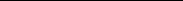

# 3. Fundamental Properties

## Table of Contents

- [Conditional probabilities](#sec-3-3-1)
- [Positive association](#sec-3-3-2)
- [Differential formulae and sharp thresholds](#sec-3-3-3)
- [Comparison inequalities](#sec-3-3-4)
- [Domination by the Ising model](#sec-3-3-7)

Summary. The basic properties of random-cluster measures are presented in a manner suitable for future applications. Accounts of conditional randomclustermeasures andpositive associationare followed by differential formulae, a sharp-threshold theorem, and exponential steepness. There are several useful inequalities involving partition functions. Theseries/parallel laws are formulated, and the chapter ends with a discussion of negative correlation.

## 3.1 Conditional probabilities

Throughout this chapter, G = ( V , E ) will be assumed to be a finite graph. Let φ G , p , q be the random-cluster measure on G . Whether or not a given edge e is open depends on the configuration on the remainder of the graph. The relevant conditional probabilities may be described in the following useful manner.

For $e = \langle x, y \rangle$ ∈ E , the expression G \ e (respectively, G . e ) denotes the graph obtained from G by deleting (respectively, contracting) the edge e . We write e = { 0 , 1 } E \{ e } and, for ω ∈ , we define ω e ∈ e by

$$
\omega _ { \langle e \rangle } ( f ) = \omega ( f ) , \quad f \in E , \, f \neq e .
$$

Let K e denote the event that x and y are joined by an open path not using e .

(3.1) Theorem (Conditional probabilities) [122]. Let p ∈ ( 0 , 1 ) , q ∈ ( 0 , ∞ ) . (a) We have for e E that

(a) We have for e ∈ E that

$$
\ p { G _ { \ } p , q } \left ( \omega \left | \, \omega ( e ) = j \right ) = \left \{ \begin{array} { l l } { \phi _ { G , p , q } ( \omega \left | \, \omega ( e ) = j \right ) = \left \{ \begin{array} { l l } { \phi _ { G \left | \, e , p , q } ( \omega _ { \left ( e \right ) } ) } & { i f j = 0 , } \\ { \phi _ { G . e , p , q } ( \omega _ { \left ( e \right ) } ) } & { i f j = 1 , } \end{array} } \end{array}
$$

and

$$
d a n \\ \phi _ { G , p , q } ( \omega ( e ) = 1 \, | \, \omega _ { ( e ) } ) = \left \{ \begin{array} { l l } { p } & { i f \omega _ { ( e ) } \in K _ { e } , } \\ { \frac { p } { p + q ( 1 - p ) } } & { i f \omega _ { ( e ) } \notin K _ { e } . } \end{array}
$$

c Springer-Verlag 2006

38 Fundamental Properties [3.1]

(b) Conversely, if φ is a probability measure on ($\Omega, \mathcal{F}$) satisfying (3.3) for all ω ∈ and e ∈ E, then φ = φG,p,q.

The effect of conditioning on the absence or presence of an edge e is to replace the measure φG,p,q by the random-clustermeasure on the respectivegraph G\e or G.e. In addition, the conditionalprobabilitythat e is open, given the configuration elsewhere, depends only on whether or not Ke occurs, and is then given by the stated formula. By (3.3),

(3.4) 0 < φG,p,q(ω(e) = 1 | ω e ) < 1, e ∈ E, p ∈ (0,1), q ∈ (0,∞).

Thus, given ω e , each of the two possible states of e occurs with a strictly positive probability. This usefulfact is known as the ‘finite-energy property’,and is related to the property of so-called ‘insertion tolerance’ (see Section 10.12).

We shall sometimes need to condition on the states of more than one edge. Towards this end, we state next a more general propertythan (3.2), beginningwith a brief discussion of boundary conditions; more on the latter topic may be found

in Section 4.2. Let ξ ∈ , F ⊆ E, and let ξF be the subset of containing all configurations ψ satisfying ψ(e) = ξ(e) for all e ∈/ F. We define the random-

cluster measure $\phi_{F,p,q}^{\xi}$ on $(\Omega, \mathcal{F})$ by

$$
(3.5) \quad \phi_{F,p,q}^{\xi}(\omega_F) = \begin{cases}
\phi_{p,q}(\omega_F \mid \Omega_F^{\xi}) & \text{if } \phi_{p,q}(\Omega_F^{\xi}) > 0, \\
0 & \text{otherwise.}
\end{cases}
$$

Here is a final note. Let p ∈ (0,1) and $q$ = 1. It is easily seen that the states of two distinct edges e, f are independent if and only if the pair e, f lies in no circuit of G. This may be proved either directly or via the simulation methods of Sections 3.4 and 8.2.

[3.2] Positive association 39

Proof of Theorem 3.1. (a) This is easily seen by an expansion of the conditional probability,

φG,p,q($\omega_e$)/φG,p,q(Je) if j = 0, φG,p,q($\omega_e$)/φG,p,q(Je) if j = 1,

where η(ω) is, as usual, the set of open edges in . (b) The claim is immediate by the fact, easily proved,that a strictly positive probability measure φ is specified uniquely by the conditional probabilities φ(ω(e) = 1 | ω e ), ω ∈ , e ∈ E.

Proof of Theorem 3.7. This holds by repeated application of (3.2), with one application for each edge not belonging in F.

## 3.2 Positive association

Let φp,q denote the random-cluster measure on G with parameters p and q. We shall see that φp,q satisfies the FKG lattice condition (2.18) whenever q ≥ 1, and we arrive thus at the following conclusion.

### (3.8) Theorem (Positive association) [122]. Let p ∈ (0,1) and $q$ ∈ [1,∞).

- (a) The random-cluster measure φp,$q$ is strictly positive and satisfies the FKG lattice condition.
- (b) The random-cluster measure φp,$q$ is strongly positively-associated, and in particular

φp,q(XY) ≥ φp,q(X)φp,q(Y) for increasing X,Y : → R, φp,q(A ∩ B) ≥ φp,q(A)φp,q(B) for increasing A, B ∈ F .

It is not difficult to see that φp,$q$ is not (in general) positively associated when q ∈ (0,1), as illustrated in the example following. Let G be the graph containing

just two vertices and having exactly two parallel edges e and f joining these vertices. It is an easy computation that

p2q2(q − 1)(1 − p)2 Z(p,q)2

(3.9) φp,q(Je ∩ Jf ) − φp,q(Je)φp,q(Jf ) =

,

where Jg is the event that g is open. This is strictly negative if 0 < p,$q$ < 1.

Proof of Theorem 3.8. Let p ∈ (0,1) and $q$ ∈ [1,∞). Part (b) follows from (a) and Theorem 2.27. It is elementary that φp,$q$ is strictly positive. We now check as required that φp,q satisfies the FKG lattice condition (2.18). Since the set η(ω) of open edges in a configuration ω satisfies

(3.10) |η(ω1 ∨ ω2)| + |η(ω1 ∧ ω2)| = |η(ω1)| + |η(ω2)|, ω1,ω2 ∈ , it suffices, on taking logarithms, to prove that (3.11) k(ω1 ∨ ω2) + k(ω1 ∧ ω2) ≥ k(ω1) + k(ω2), ω1,ω2 ∈ .

By Theorem 2.22, we may restrict our attention to incomparable pairs ω1, ω2 that differ on exactly two edges. There must then exist distinct edges e, f ∈ E

and a configuration ω ∈ such that ω1 = ωef , ω2 = ωef . As in the proof of Theorem 2.27, we omit reference to the states of edges other than e and f , and

we write ω1 = 10 and ω2 = 01. Let Df be the indicator function of the event that the endvertices of f are connected by no open path of E \ { f }. Since Df is a decreasing random variable, we have that Df (10) ≤ Df (00). Therefore,

k(10) − k(11) = Df (10) ≤ Df (00) = k(00) − k(01), which implies (3.11).

Theorem 3.8 applies only to finite graphs G, whereas many potential applications concern infinite graphs. We shall see in Sections 4.3 and 4.4 how to derive the required extension.

## 3.3 Differential formulae and sharp thresholds

One way of estimating the probability of an event A is via an estimate of its derivative dφp,q(A)/dp. When $q$ = 1, there is a formula for this derivative which has proved very useful in reliability theory, percolation, and elsewhere, see [22, 126, 154, 287]. This formula has been extended to random-cluster measures. For ω ∈ , let |η| = |η(ω)| = e∈E ω(e) be the number of open edges of ω as usual, and k = k(ω) the number of open clusters.

[3.3] Differential formulae and sharp thresholds 41

1 q

covp,q(k,h(k)) ≥ 0.

This time we take h = −1(−∞,1], so that −h is the indicator function of the event that the open graph (V,η(ω)) is connected. We deduce that the probability of connectedness is a decreasing function of q on the interval (0,∞). These examples are curiosities, given the failure of stochastic monotonicity when $q$ < 1.

Let q ∈ [1,∞). Since φp,q satisfies the FKG lattice condition (2.18), it is monotonic. Let A be a subgroup of the automorphism group1 Aut(G) of the graph G = (V, E). We call E A-transitive if A acts transitively on E.

1The automorphism group Aut(G) is discussed further in Sections 4.3 and 10.12.

- (3.16) Theorem (Sharp threshold) [141]. There exists an absolute constant c ∈ (0,∞) such that the following holds. Let A ∈ F be an increasing event, and suppose there exists a subgroup A of Aut(G) such that E is A-transitive and A is A-invariant. Then, for $p$ ∈ (0,1) and $q$ ∈ [1,∞),
- (3.17)

d dp

φp,q(A) ≥ C min φp,q(A),1 − φp,q(A) log|E|,

an inequality that may be integrated directly. Let p1 = p1(A,q) ∈ (0,1) be chosen such that φp1,q(A) ≥ 12. Then

and hence, by integration, (3.19) φp,q(A) ≥ 1 − 12|E|−c(p−p1)/q, p ∈ (p1,1), q ∈ [1,∞), whenever the conditions of Theorem 3.16 are satisfied. If in addition p1 ≥ √q/(1 +

√q), then C = c, and hence

(3.20) φp,q(A) ≥ 1 − 12|E|−c(p−p1), p ∈ (p1,1). An application to box crossings in two dimensions may be found in [141]. Proof of Theorem 3.12. The first formula was proved for Theorem 2.46, and the second is obtained in a similar fashion.

Proof of Theorem 3.16. With A as in the theorem, φp,$q$ is A-invariant since A ⊆ Aut(G). The claim is a consequence of Theorem 2.51 on noting from (3.3) that

, e ∈ E.

## 3.4 Comparison inequalities

The comparison inequalities of this section are an important tool in the study of random-clustermeasures. As usual, we write φp,q for the random-clustermeasure on the finite graph G = (V, E).

(3.21) Theorem (Comparison inequalities) [122]. It is the case that: (3.22) φp1,q1 ≤st φp2,q2 if q1 ≥ q2, q1 ≥ 1, and p1 ≤ p2,

p2 q2(1 − p2)

p1 q1(1 − p1) ≥

(3.23) .

φp1,q1 ≥st φp2,q2 if q1 ≥ q2, q1 ≥ 1, and

The first of these inequalities may be strengthened as in the next theorem. A subset W of the vertex set V is called spanning if every edge of E is incident to at least one vertex of W. The degree deg(W) of a spanning set W is defined to be the maximum degree of its members, that is, the maximum number of edges of G incident to any one vertex in W.

- (3.24) Theorem [151]. For ∈ {1,2,. . .}, there exists a continuous function γ(p,q) = γ (p,q), which is strictly increasing in p on (0,1), and strictly decreasing in q on [1,∞), such that the following holds. Let G be a finite graph, and suppose there exists a spanning set W such that deg(W) ≤ . Then
- (3.25) φp1,q1 ≤st φp2,q2 if 1 ≤ q2 ≤ q1 and γ(p1,q1) ≤ γ(p2,q2).

An application is to be found in Section 5.1, where it is proved that the critical point pc(q) of an infinite-volume random-cluster model on a lattice is strictly increasing in q.

Assume now that the conditions of (3.22) hold. Since k(ω) is a decreasing function and |η(ω)| is increasing, we have that Y is increasing. Since q1 ≥ 1, φp1,q1 is positively associated, whence

(3.27) φp1,q1(XY) ≥ φp1,q1(X)φp1,q1(Y), and (3.26) yields φp2,q2(X) ≥ φp1,q1(X). Claim (3.22) follows.

Assume now that the conditions of (3.23) hold. We write Y(ω) in the form

Note that k(ω) + |η(ω)| is an increasing function of ω, since the addition of an extra open edge to ω causes |η(ω)| to increase by 1 and k(ω) to decrease by at most 1. In addition, |η(ω)| is increasing. Since q2 ≤ q1 and p2/[q2(1 − p2)] ≤ p1/[q1(1 − p1)] by assumption, we have that Y is decreasing. By the positive association of φp1,q1 as above,

φp1,q1(XY) ≤ φp1,q1(X)φp1,q1(Y), and (3.26) now implies φp2,q2(X) ≤ φp1,q1(X). Claim (3.23) follows.

The proof of Theorem 3.24 begins with a subsidiary result. This contains two inequalities, only the first of which will be used in that which follows.

- (3.28) Proposition [151]. Let p ∈ (0,1), q ∈ [1,∞) and ∈ {1,2,. . .}. There exists a strictly positive and continuous function α(p,q) = α (p,q) such that the following holds. Let G be a finite graph, and suppose there exists a spanning set W such that deg(W) ≤ . Then
- (3.29) α(p,q)

for all increasing events A.

Proof. Let A be an increasing event, and write θ(p,q) = φp,q(A). As in the proof of Theorem 2.1 we shall construct a Markov chain Zt = (Xt,Yt) taking values in the product space 2.

qDe(π) − qDe(ω)1A($\omega_e$) ≥ 0,

by (3.31) and (3.32). We have used the facts that q ≥ 1, and De(ω) ≤ De(π) for π ≤ ω. The ensuing Markov chain has no possible transition that can exit the set S. That is, if the chain starts in S, then we may assume it remains in S for all time.

It is easily seen as in Section 2.1 and [39] that there exists a Markov chain Zt = (Xt,Yt) on the state space S such that:

(i) Zt has generator J, that is, for (π,ω) = (π′,ω′),

P Zt+h = (π′,ω′) Zt = (π,ω) = J(π,ω; π′,ω′)h + o(h),

(ii) Xt ⇒ φp,q(·) as t → ∞, (iii) Yt ⇒ φp,q(· | A) as t → ∞, (iv) Xt ≤ Yt for all t.

See [164, Chapter 6] for an account of the theory of Markov chains.

where e:e∼x denotes summation over all edges e incident to the vertex x.

Finally we prove (3.39). Let Ex be the set of edges of E that are incident to x. Suppose that the event Ft = {Xt(ex) = 0, Yt(ex) = 1} occurs. Let:

- (a) T be the event that, during the time-interval (t,t + 1), every edge e of Ex \ {ex} with Xt(e) = 1 changes its X-state from 1 to 0; the removal of such edges from X may or may not entail their removal from Y,
- (b) U be the event that no edge e of Ex \ {ex} with Xt(e) = 0 changes its state (Xu(e),Yu(e)) in the time-interval (t,t + 1), (c) V be the event that the state (Xu(ex),Yu(ex)) of the edge ex remains unchanged during the time-interval (t,t + 1).

By elementary computations using the generator of the chain Zt = (Xt,Yt), there exists a strictly positive and continuousfunction νW = νW(p,q) on (0,1)× [1,∞), whichisallowedtodependon G and W onlythroughthequantitydeg(W), such that

P(T ∩ U ∩ V | Ft) ≥ νW, t ≥ 0,

uniformly in x, ex, and G. This inequality remains true if we replace νW by the strictly positive and continuous function ν = ν (p,q) defined by

ν (p,q) = min νW(p,q) : W a spanning set such that 0 ≤ deg(W) ≤ .

If Ft ∩ T ∩ U ∩ V occurs, then x is isolated in Xt+1 but not in Yt+1 (since Yt+1(ex) = 1). Therefore, (3.39) is valid, and the proof of the proposition is complete. A function ν of the required form may be written down explicitly.

Proof of Theorem 3.24. Let α be as in Proposition 3.28, and let A be an increasing event. Inequality (3.29) may be stated in the form

φp,q(A) ≤ 0,

whence φp,q(A) is decreasing as (p,q) moves along the contour of γ in the direction of increasing q. Therefore,

Before proceeding to the proofs, we note that Theorem 3.45 is closely related to the ‘sprinkling lemma’ of [6], a version of which is valid for random-cluster models; see also [154]. The argument used to prove Theorem 3.45 may be used also to prove the following, the proof of which is omitted.

- (3.48) Theorem. Let q ∈ [1,∞) and 0 < r < s < 1. For any non-empty, decreasing event A ∈ F ,
- (3.49) φr,q(A) ≥

Proof of Theorem 3.45. Let q ∈ [1,∞) and 0 < r < s < 1. We shall employ a suitable coupling of the measures φr,q and φs,q. Let E = {e1,e2,. . . ,em} be the edges of the graph G, and let U1,U2,. . .,Um be independent random variables having the uniform distribution on [0,1]. We write P for the probability measure associated with the Uj. We shall examine the edges in turn, to determine whether they are open or closed for the respective parameters r and s. The outcome will be a pair (π,ω) of configurations each lying in \Omega = \{0,1\}^E and such that π ≤ ω. The configurations π, ω are random in the sense that they are functions of the Uj. A similar coupling was used in the proof of Theorem 2.31.

First, we declare

π(e1) = 1 if and only if U1 < φr,q(J1), ω(e1) = 1 if and only if U1 < φs,q(J1),

[3.5] Exponential steepness 51

where Ji is the event that ei is open. By the comparison inequality (3.22), φr,q(J1) ≤ φs,q(J1), and therefore π(e1) ≤ ω(e1).

Let M be an integer satisfying 1 ≤ M < m. Having defined π(ei), ω(ei) for 1 ≤ i ≤ M such that π(ei) ≤ ω(ei), we define π(eM+1) and ω(eM+1) as follows. We declare

π(eM+1) = 1 if and only if UM+1 < φr,q(JM+1 | M,π), ω(eM+1) = 1 if and only if UM+1 < φs,q(JM+1 | M,ω),

where M,γ is the set of configurations ν ∈ satisfying ν(ei) = γ(ei) for 1 ≤ i ≤ M. By the comparison inequalities (Theorem 3.21) and strong positive association (Theorem 3.8),

φr,q(JM+1 | M,π) ≤ φs,q(JM+1 | M,ω)

since r < s and π(ei) ≤ ω(ei) for 1 ≤ i ≤ M. Therefore, π(eM+1) ≤ ω(eM+1). Continuing likewise, we obtain a pair (π,ω) of configurations satisfying π ≤ ω, and such that π has law φr,q, and ω has law φs,q.

where Ki istheeventthatthereexistsanopenpathof E\{ei}joiningtheendvertices of ei. Using conditional expectations and the assumption q ≥ 1,

p p + q(1 − p) ≤ φp,q(Ji | D) ≤ p

(3.50)

We integrate over the interval [r,s] to obtain that (3.52) φs,q(Ji) − φr,q(Ji) ≥

s − r q

. Finally,

φs,q(JM+1 | M,ω) − φr,q(JM+1 | M,π) ≥ φs,q(JM+1 | M,ω) − φr,q(JM+1 | M,ω),

and (3.51) follows by applying (3.52) with i = M + 1 to the graph obtained from G by contracting (respectively, deleting) any edge ei (for 1 ≤ i ≤ M) with ω(ei) = 1 (respectively, ω(ei) = 0). See [152, Theorem 2.3].

This follows by the recursive construction of π and ω in terms of the family U1,U2,. . . ,Um, in the light of the bound (3.53).

Inequality (3.54) implies the claim of the theorem, as follows. Let A be an increasing event and let ξ be a configuration satisfying HA(ξ) ≤ k. There exists a set B = Bξ of edges such that:

(a) |B| ≤ k, (b) ξ(e) = 0 for e ∈ B, (c) ξB ∈ A, where ξB is obtained from ξ by allocating state 1 to all edges in B.

If more than one such set B exists, we pick the earliest in some deterministic ordering of all subsets of E. By (3.54),

In the usual approach of classical statistical mechanics, one studies phase transitions via the partitionfunctionandits derivatives. We preferin this work to follow a more probabilistic approach, but shall nevertheless have recourse to various arguments based on the behaviour of the partition function, of which we note some basic properties.

- (3.57) TG(u,v) = (u − 1)|V|−k(G)WG (u − 1)−1,v − 1 is known as the dichromatic (or Tutte) polynomial, [313]. The partition function ZG of the graph G is easily seen to satisfy
- (3.58) ZG(p,q) = q|V|(1 − p)|E|WG

a relationship which provides a link with other classical quantities associated with a graph. See [40, 41, 121, 157, 308, 315] and Chapter 9.

Anotherwayofviewing ZG isasthemomentgeneratingfunctionofthenumber of clusters in a random graph, that is,

(3.59) ZG(p,q) = φp(qk(ω)),

where φp denotes product measure. This indicates a link to percolation on G, and to the large-deviation theory of the number of clusters in the percolation model. See [62, 298] and Section 10.8.

The partition function ZG does not change a great deal if an edge is removed from G. Let F ⊆ E, and write G\F forthe graph G with the edgesin F removed. If F is the singleton {e}, we write G \ e for G \ {e}.

- (3.60) Theorem. Let p ∈ [0,1] and $q$ ∈ (0,∞). Then
- (3.61) (1 ∧ q)|F| ≤

ZG\F(p,q) ZG(p,q) ≤ (1 ∨ q)|F|, F ⊆ E.

We give next an application of these inequalities to be used later. Let Gi = (Vi, Ei), i = 1,2, be finite graphson disjointvertexsets V1, V2, andwrite G1∪G2 for the graph (V1 ∪ V2, E1 ∪ E2). It is immediate from (3.55) that

(3.62) ZG1∪G2 = ZG1ZG2,

where for clarity we have removed explicit mention of p, q. Taken in conjunction with (3.61), this leads easily to a pair of inequalities which we state as a theorem.

(3.63) Theorem. Let G = (V, E) be a finite graph, and let F be a set of edges whose removal breaks G into two disjoint graphs G1 = (V1, E1), G2 = (V2, E2). Thus, V = V1 ∪ V2 and E = E1 ∪ E2 ∪ F. For p ∈ [0,1] and $q$ ∈ (0,∞),

ZG1ZG2(1 ∨ q)−|F| ≤ ZG ≤ ZG1ZG2(1 ∧ q)−|F|.

Proof of Theorem 3.60. It suffices to prove (3.61) with F a singleton set, that is, F = {e}. The claim for general F will follow by iteration. For ω ∈ , we write ω e for the configuration in e \Omega = \{0,1\}^E\{e} that agrees with ω off e. Clearly,

k(ω) ≤ k(ω e ) ≤ k(ω) + 1, whence

(3.64) (1 ∧ q)qk(ω) ≤ qk(ω e ) ≤ (1 ∨ q)qk(ω).

Now, since p + (1 − p) = 1,

(3.65) p|η(ω e )|(1 − p)|E\η(ω e )|−1qk(ω e )

ZG\e(p,q) =

ω e ∈ e

p|η(ω)|(1 − p)|E\η(ω)|qk(ω e ).

=

ω∈

Equations (3.64) and (3.65) imply (3.61) with F = {e}.

We develop next an inequality related to (3.61) concerning the addition of a vertex, and which will be useful later. Let G = (V, E) be a finite graph as usual, and let v ∈/ V and W ⊆ V. We augment G by adding the vertex v together with edges v,w for w ∈ W. Let us write G + v for the resulting graph.

(3.66) Theorem. Let p ∈ [0,1] and $q$ ∈ [1,∞). In the above notation,

ZG+v(p,q) ZG(p,q) ≥ q(1 − p + pq−1)|W|.

α + (1 − α)yn ≥ [α + (1 − α)y]n, α, y ∈ [0,1], n ∈ {1,2,. . .}. We substitute (3.68) into (3.67) to obtain the claim.

So far in this section we have considered the effect on the partition function of removing edges or adding vertices. There is a related result in which, instead, we identify certain vertices. Let G = (V, E) be a finite graph, and let C be a subset of V separating the vertex-sets A1 and A2. That is, V is partitioned as V = A1 ∪ A2 ∪ C and, for all a1 ∈ A1, a2 ∈ A2, every path from a1 to a2 passes through at least one vertex in C. We write c for a composite vertex formed by identifying all vertices in C, and G1 = (A1 ∪ {c}, E1) (respectively, G2 = (A2 ∪ {c}, E2)) for the graph on the vertex set A1 ∪ {c} (respectively, A2 ∪ {c}) and with the edges derived from G. For example, if x, y ∈ A1, then

x, y is an edge of G1 if and only if it is an edge of G; for a ∈ A1, the number of edges of G1 between a and c is exactly the number of edges in G between a and members of C.

(3.69) Lemma. For p ∈ [0,1] and $q$ ∈ [1,∞), ZG ≥ q−1ZG1ZG2.

Since ZG ≥ q for all G when q ≥ 1,

(3.70) ZG ≥ ZG1.

and then

ZG(p,q) = (1 − p)|E|YG(π(p),κ(q)). We write ∇X for the gradient vector of a function X : R2 → R. (3.73) Theorem. Let the vectors (π,κ) and (p,q) be related by (3.72).

α=0

where varp,q denotes variance with respect to φp,q. In particular, logYG is a convex function on R2.

By (3.71),

YG (π,κ) + αi = YG(π,κ)φp,q(eαL(i)),

where L(i) = i1|η| +i2k. Therefore, the jth derivative as in (3.75) equals the jth cumulant (or semi-invariant3) of L(i).

and (3.75) follows as in part (a). The convexity is a consequence of the fact that variances are non-negative.

## 3.7 Domination by the Ising model

Stochastic domination is an invaluable tool in the study of random-cluster measures. Since the random-cluster model is an ‘edge-model’, it is usual to make comparisons with other edge-models. The relationship when q ∈ {2,3,. . .} to Potts models suggest the possibility of comparison with a ‘vertex-model’, and a hint of how to achieve this is provided by the case of integral q.

Consider the random-clustermodel with parameters p and $q$ on the finite graph G = (V, E). If q ∈ {2,3,. . .}, we may generate a Potts model by assigning a uniformly chosen spin-value to each open cluster. The spin configuration thus obtained is governed by the Potts measure with inverse-temperature β satisfying $p$ = 1−e−β. Evidently,this can workonly if $q$ is an integer. Aweakerconclusion may be obtained if $q$ is not an integer, namely the following. Suppose p ∈ [0,1] and $q$ ∈ [1,∞). We examine each open cluster of the random-cluster model in turn, and we declareitto be red with probability1/q and white otherwise, different clusters receiving independent colours4. Let R be the set of vertices lying in red clusters. If q ∈ {2,3,. . .}, then R has the same distribution as the set of vertices of the corresponding Potts model that have a pre-determined spin-value. Write Pp,q for an appropriate probability measure. One has for general q ∈ (1,∞) that,

ω′∈ A

k(ω′)

where A = V \ A, A \Omega = \{0,1\}^EA with EA the subset of E containing all edges with both endvertices in A, the ZG, ZA are the appropriate partition functions, and eA is the set of edges of G with exactly one endvertex in A. When $q$ is an integer, (3.76) reduces to the usual Potts law for the set of vertices with a given spin-value.

where ZI = ZI(β,h)istherequirednormalizingconstant5. Weshallbeconcerned here with the random set S = S(σ) = {u ∈ V : σu = 1}, containing all vertices with spin +1.

Let deg(u) denote the degree of the vertex u in the graph G, and let

= max deg(u) : u ∈ V .

5The fraction 21 in the exponent is that appearing in (1.7).

- (3.79) Theorem [15]. Let β ∈ (0,∞), $p$ = 1 − e−β, q ∈ [2,∞), and let R be the random ‘red’ set of the random-cluster model, governed by the law given in (3.76). Let β′ ∈ (0,∞) and h′ ∈ (−∞,∞) be given by
- (3.80) e2β′ = eβ

and let S be the set of vertices with spin +1 under the Ising measure πβ′,h′. Then (3.81) R ≤st S. Inequality (3.81) is to be interpreted as

Pp,q( f (R)) ≤ πβ′,h′( f (S))

for all increasing functions f : {0,1}V → R. Its importance lies in the deduction that R is small whenever S is small. The Ising model allows a deeper analysis than do general Potts and random-cluster models (see, for example, the results of Chapter 9). Particularly relevant facts are known for the set of + spins in the Ising model when the external field h′ is negative, and thus it becomes important to obtain conditions under which h′ < 0.

Letq > 2and assume that G issuch that ≥ 3. Setting h′ = 0 and eliminating β′ in (3.80), we find that β = β where $q$ − 2 (q − 1)1−(2/ ) − 1

(3.82) eβ =

. By (3.80) and an elementary argument using monotonicity, (3.83) h′ < 0 if and only if β < β .

We make one further note in advance of proving the theorem. By (3.82), β → 0 as → ∞; ifthemaximumvertexdegreeislarge,thefieldofapplication of the theorem is small. In an important application of the theorem, we shall take G to be a box of the lattice Ld with so-called ‘wired boundary conditions’ (see Section 4.2). This amounts to identifying all vertices in the boundary ∂ , and thus to the introductionof a single vertex, w say, having large degree. The method of proof of Theorem 3.79 is valid in this slightly more general setting with

= max deg(u) : u ∈ V \ {w} ,

under the assumption that the open cluster containing w is automatically designated red. That is, we let R be the union of the cluster at w together with all other clusters declared red under the above randomization, and we let S be the set of + spins in the Ising modelwith parameters β′, h′ and with σw = +1. The conclusion

(3.81) is then valid in this setting, with given as above. An application to the exponential decay of connectivity in two dimensions will be found in Section 6.3.

Further work on stochastic domination inequalities for the set S of + spins of the Ising model may be found in [236]. Proof. We present a direct proof based on the Holley inequality, Theorem 2.1. For A ⊆ V and u,v ∈ V with u = v, we write

Au = A ∪ {u}, Av = A \ {v}, Auv = (Au)v, and so on. Let µ1 (respectively, µ2) denote the law of R (respectively, S), so that

µ1(A) = Pp,q(R = A), µ2(A) = πβ′,h′(S = A), A ⊆ V.

We shall apply Theorem 2.6, noting first that the µi are strictly positive. It suffices to check (2.7), and that one of µ1, µ2 satisfies (2.8).

First, we check (2.7). Let C ⊆ V and u ∈ V \ C. We claim that (3.84) µ2(Cu)µ1(C) ≥ µ1(Cu)µ2(C). Let r = |{c ∈ C : c ∼ u}|, the number of neighbours of u in C. By (3.77)–(3.78),

µ2(Cu)

(3.86)

≥ (1 − p)2r−δ(q − 1) 1 − p + p(q − 1)−1 δ−r.

Substituting $p$ = 1 − e−β and setting x = eβ, we obtain by multiplying (3.85) and (3.86) that

µ2(Cu)µ1(C) µ1(Cu)µ2(C) ≥ exp β′(2r − δ) + β′h′ − β(2r − δ)

62 Fundamental Properties [3.8]

parameter-value ph, see (1.20). We shall see that φp,$q$ is invariant (in a manner to made specific soon) when two edges e, f in parallel (respectively, series) are replaced as above by a single edge g having the ‘correct’ associated parametervalue pg given by

(3.88) pg =

π(pe, pf ) if e, f are in parallel, σ(pe, pf ,q) if e, f are in series.

Let ′ \Omega = \{0,1\}^E′ be the configurationspace associated with the graph G′ given above. We define a mapping τ : → ′ by τω(h) = ω(h) for h = g, and

1 − (1 − ω(e))(1 − ω( f )) if e, f are in parallel, ω(e)ω( f ) if e, f are in series.

τω(g) =

When e, f are in parallel (respectively, series), g is open in τω if and only if either e or f is open (respectively, both e and f are open) in ω. The mapping τ maps open connections to open connections; in particular, for x, y ∈ V′, x ↔ y in τω if and only if x ↔ y in ω.

The measure φp,q on induces a measure φp′,q on ′ defined by

φp′,q(ω′) = φp,q(τ−1ω′), ω′ ∈ ′,

and it turns out that this new measure is simply a random-cluster measure with an adapted parameter-value for the new edge g, as in (3.88).

(3.89) Theorem. Let e, f be distinct edges of the finite graph G.

- (a) Parallel law. Let e, f be in parallel. The measure φp′,$q$ is the random-cluster measure on G′ with parameters ph for h = g, pg = π(pe, pf ).
- (b) Series law. Let e, f be in series. The measure φp′,$q$ is the random-cluster measure on G′ with parameters ph for h = g, pg = σ(pe, pf ,q).

There is a third transformation of value when calculating effective resistances of electrical networks, namely the ‘star–triangle’ (or ‘star–delta’) transformation. Thisplaysapartforrandom-clustermodelsalso,seeSection6.6andthediscussion leading to Lemma 6.64.

Proof. (a) The edge g is open in τω if and only if either or both of e, f is open in ω. Therefore, the numbers of open clusters in ω and τω satisfy k(ω) = k(τω). It is a straightforward calculation to check that, for ω′ ∈ ′,

phω′(h)(1 − ph)1−ω′(h) πω′(g)(1 − π)1−ω′(h) qk(ω′),

φp′,q(ω′) ∝

ω: τω=ω′ h: h =g

where π = pe pf + pe(1 − pf ) + pf (1 − pe) = π(pe, pf ).

(b) Write e = u,v , f = v,w , so that g = u,w . Recall that ω and τω agree off the edges e, f , g, and hence the partial configurations (ω(h) : h = e, f ) and (τω(h) : h = g) have the same law. Let K be the set of all ω ∈ such that there exists an open path from u to w not using e, f ; let K′ be the corresponding event in ′ with e, f replaced by g. Note that K′ = τ K.

where σ = σ(pe, pf ,q). The edge g is open in τω if and only if both e and f are open in ω. Therefore,

φp′,q(ω′(g) = 1 | K′) = φp,q ω(e) = ω( f ) = 1 K , which is easily seen to equal

pepf pe pf + pe(1 − pe) + pf (1 − pf ) + q(1 − pe)(1 − pf )

,

in agreement with (3.90). Similarly,

φp′,q(ω′(g) = 1 | K′) = φp,q ω(e) = ω( f ) = 1 K , which in turn equals

pepf pe pf + qpe(1 − pf ) + qpf (1 − pe) + q2(1 − pe)(1 − pf )

,

\Omega = \{0,1\}^E. There are four relevant concepts of negative association, of which we start at the ‘lowest’. The measure µ is said to be edge-negatively-associated if (3.92) µ(Je ∩ Jf ) ≤ µ(Je)µ(Jf ), e, f ∈ E, e = f. Recall that Je = {ω ∈ : ω(e) = 1}.

There is a more general notion of negative association, as follows. For ω ∈ and F ⊆ E we define the cylinder event F,ω generated by ω on F by

F,ω = {ω′ ∈ : ω′(e) = ω(e) for e ∈ F}.

For E′ ⊆ E and an event A ⊆ , we say that A is defined on E′ if, for all ω ∈ , we have that ω ∈ A if and only if E′,ω ⊆ A. We call µ negatively associated if

µ(A ∩ B) ≤ µ(A)µ(B)

for all pairs (A, B) of increasing events with the property that there exists E′ ⊆ E such that A is defined on E′ and B is defined on its complement E \ E′. An account of negative association and its inherent problems may be found in [268].

Ourthird andfourthconceptsof negativeassociationinvolveso-called ‘disjoint occurrence’ (see [37, 154]). Let A and B be events in . We define A B to be the set of all vectors ω ∈ forwhich there exists a set F ⊆ E such that F,ω ⊆ A and F,ω ⊆ B, where F = E \ F. Note that the choice of F is allowed to depend on the vector ω. We say that µ has the disjoint-occurrence property if

(3.93) µ(A B) ≤ µ(A)µ(B), A, B ⊆ , and hasthe disjoint-occurrenceproperty onincreasingevents if (3.93)holdsunder the additional assumption that A and B are increasing events.

It is evident that: µ has the disjoint-occurrence property

⇒ µ has the disjoint-occurrence property on increasing events

⇒ µ is negatively associated

⇒ µ is edge-negatively-associated.

It was proved by van den Berg and Kesten [37] that the product measures φp on have the disjoint-occurrence property on increasing events, and further by Reimer[283] that φp hasthe more generaldisjoint-occurrenceproperty. Itiseasily seen7 that the random-cluster measure φp,q cannot in general be edge-negativelyassociated when $q$ > 1. It may however be conjectured that φp,q satisfies some form of negative association when $q$ < 1. Such a property would be useful in studying random-cluster measures, particularly in the thermodynamic limit (see Chapter 4), but no such property has yet been proved.

In the absence of a satisfactory approach to the general case of random-cluster measures with $q$ < 1, we turn next to the issue of negative association of weak limits of φp,q as q ↓ 0; see Section 1.5 and especially Theorem 1.23. Here is a mild conjecture, as yet unproven.

(3.94) Conjecture [156, 165, 199, 268]. For any finite graph G = (V, E), the uniform-spanning-forest measure USF and the uniform-connected-subgraph measure UCS are edge-negatively-associated.

A stronger version of this conjecture is that USF and UCS are negatively associated in one or more of the senses described above.

7Consider the two events Je, Jf in the graph G comprising exactly two edges e, f in parallel.

Since USF and UCS are uniform measures, Conjecture 3.94 may be rewritten in the form of two questions concerning subgraph counts. For simplicity we shall consideronlygraphswithneitherloopsnormultipleedges. Let V = {1,2,. . .,n}, and let K be the set of N = n2 edges of the complete graph on the vertex set V. We think of subsets of K as being graphs on V. Let E ⊆ K. For X ⊆ E, let MX = MX(E) be the number of subsets E′ of E with E′ ⊇ X such that the graph (V, E′) is connected. Edge-negative-association for connected subgraphs amounts to the inequality

(3.95) M{e, f}M∅ ≤ MeM f , e, f ∈ E, e = f. Here and later in this context, singleton sets are denoted without their braces, and any empty set is suppressed.

In the second such question, we ask if the same inequality is valid with MX re-defined as the number of subsets E′ ⊆ E containing X such that (V, E′) is a forest. See [199, 268].

With E fixed as above, and with X,Y ⊆ E, let MYX = MYX(E) denote the number of subsets E′ ⊆ E of the required type such that E′ ⊇ X and E′∩Y = ∅. Inequality (3.95) is easily seen to be equivalent to the inequality

(3.96) M{e, f}M{e, f} ≤ Mef Mef , e, f ∈ E, e = f. The corresponding statement for the uniform spanning tree is known. (3.97) Theorem. The uniform-spanning-tree measure UST is edge-negativelyassociated.

The stronger property of negative association has been proved for UST, see [116], but we do not discuss this here. See also the discussions in [31, 241]. The strongest such conclusion known currently for USF appears to be the following, the proof is computer-aided and is omitted.

(3.98) Theorem [165]. If G = (V, E) has eight or fewer vertices, or has nine vertices and eighteen or fewer edges, then the associated uniform-spanning-forest measure USF has the edge-negative-association property.

Since forests are dual to connected subgraphs for planar graphs, this implies a property of edge-negative-association for the UCS measure on certain planar graphs having fewer than ten faces.

The conjectures of this section have been expressed in terms of inequalities involving counts of connected subgraphs and forests, see the discussion around (3.95). Such inequalities may be formulated in the following more general way. Let $p$ = (pe : e ∈ E) be a collection of non-negative numbers indexed by E. For E′ ⊆ E, let

fp(E′) =

pe.

e∈E′

We now ask whether (3.95) holds with MX = MX(p) defined by

(3.99) MX(p) =

E′: X⊆E′⊆E (V,E′) has property

fp(E′),

where is either the property of being connected or the property of containing no circuits. Note that (3.95) becomes a polynomial inequality in |E| real variables. Such a formulation is natural when the problem is cast in the context of the Tutte polynomial, see Section 3.6 and [308].

Proof8 of Theorem 3.97. Consider an electrical network on the connected graph G in which each edge corresponds to a unit resistor. The relevant fact from the theory of electrical networks is that, if a unit current flows from a source vertex s to a sink vertex t ( = s), then the current flowing along the edge $e = \langle x, y \rangle$ in the direction xy equals N(s, x, y,t)/N, where N is the number of spanning trees of G and N(s, x, y,t) is the number of spanning trees whose unique path from s to t passes along the edge x, y in the direction xy.

- Let $e = \langle x, y \rangle$ , and let µ be the UST measureon G. By the above,µ(Je)equals the current flowing along e when a unit current flows through G from source x to sink y. By Ohm’s Law, this equals the potential difference between x and y, which in turn equals the effective resistance RG(x, y) of the network between x and y.
- Let f ∈ E, f = e,anddenoteby G. f thegraphobtainedfrom G bycontracting the edge f . There is a one–one correspondence between spanning trees of G. f and spanning trees of G containing f . Therefore, µ(Je | Jf ) equals the effective resistance RG.f (x, y) of the network G. f between x and y.

Theso-called Rayleighprinciplestates thatthe effectiveresistance ofa network is a non-decreasing function of the individual edge-resistances. It follows that RG.f (x, y) ≤ RG(x, y), and hence µ(Je | Jf ) ≤ µ(Je).

The usual proof of the Rayleigh principle makes use of the Thomson/Dirichlet variational principle, which in turn asserts that, amongst all unit flows from source to sink, the true flow of unit size is that which minimizes the dissipated energy. A good account of the Kirchhoff theorem on electrical networks and spanning trees may be found in [59]. Further accounts of the mathematics of electrical networks include [106] and [241, 329], the latter containing also much material about the uniform spanning tree.

8When re-stated in terms of counts of spanning trees with certain properties, this is a consequence of the 1847 work of Kirchhoff [215] on electrical networks, as elaborated by Brooks, Smith, Stone, and Tutte in their famous paper [71] on the dissection of rectangles. Indeed, the difference µ(Je ∩ Jf ) − µ(Je)µ(Jf ) may be expressed in terms of a certain ‘transfer current matrix’. See [74] for an extension to more than two edges, and [31, 241] for related discussion.

