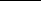

# 4. Infinite-Volume Measures

## Table of Contents

- [Infinite graphs](#sec-4-4-1)
- [Boundary conditions](#sec-4-4-2)
- [Infinite-volume weak limits](#sec-4-4-3)
- [Infinite-volume random-cluster measures](#sec-4-4-4)
- [Uniqueness via convexity of pressure](#sec-4-4-5)
- [Potts and random-cluster models on infinite graphs](#sec-4-4-6)

Summary. Random-cluster measures on infinite graphs may be defined either by passing to infinite-volume limits or by using the approach of Dobrushin, Lanford, and Ruelle. The problem of the uniqueness of infinitevolume measures is answered in part by way of an argument using the convexity of ‘pressure’. The random-cluster and Potts measures in infinite volume may be coupled, thereby permitting a study of the Potts model on the lattice Ld.

## 4.1 Infinite graphs

Although there is interesting theory associated with random-cluster measures on finite graphs, the real action, seen from the point of view of statistical mechanics, takes place in the context of infinite graphs. On a finite graph, all probabilities are polynomials in p and $q$, and are therefore smooth functions, whereas singularities and‘phasetransitions’occurwhenthegraphisinfinite. Thesesingularitiesprovide most of the mathematical and physical motivation for the study of the randomcluster model.

While one may define random-cluster measures on a broad class of infinite graphs using the methods of this chapter, we shall concentrate here on finite-dimensional lattice-graphs. We shall, almost without exception, consider the (hyper)cubic lattice Ld = (Zd,Ed) in some number d of dimensions satisfying d ≥ 2. This restriction enables a clear exposition of the theory and open problems without suffering the complications that arise through allowing greater generality. We note however that many of the basic properties of random-clustermeasures on lattices are valid on a much larger class of graphs. Interesting further questions arise in the non-finite-dimensional setting of non-amenable graphs, to which we return in Section 10.12.

There are two ways of defining random-cluster measures on an infinite graph G = (V, E). The first is to consider weak limits of measures on finite subgraphs , in the limit as ↑ V. This will be discussed in Section 4.3, following the

68 Infinite-Volume Measures [4.1]

introduction in Section 4.2 of the notion of boundary conditions. The second way is to restrict oneself to infinite-volume measures whose conditional marginal on any given finite sub-domain is the finite-volume random-cluster measure on

with the correct boundary condition. This latter route is inspired by work of Dobrushin [102] and Lanford–Ruelle[226] for Gibbs states, and will be discussed in Section 4.4. In preparation for the required arguments, we summarize next the stochastic ordering and positive association of probability measures on Ld.

Let \Omega = \{0,1\}^Ed, and let F be the σ-field generated by the cylinder subsets of . Since is a partially ordered set, we may speak of ‘increasing’ events and random variables. Given two probability measures µ1, µ2 on ($\Omega, \mathcal{F}$), we write µ1 ≤st µ2 if

(4.1) µ1(X) ≤ µ2(X) for all increasing continuous X : → R. See Section 2.1. Note thatanyincreasingrandomvariable X with rangeR satisfies X(0) ≤ X(ω) ≤ X(1) for all ω ∈ , and is therefore bounded.

One sometimes wishes to apply (4.1) to increasing random variables X that are semicontinuous rather than continuous1. This may be done as follows. For ω,ξ ∈ and a box , we write ωξ for the configuration given by

(4.2) ωξ (e) =

ω(e) if e ∈ E , ξ(e) otherwise.

For X : → R, we define X0 and X1 by

(4.3) Xb (ω) = X(ωb ), ω ∈ , b = 0,1.

Assume that X is increasing. It is easily checked that, as ↑ Zd,

X0 ↑ X if and only if X is lower-semicontinuous, X1 ↓ X if and only if X is upper-semicontinuous,

(4.4)

where the convergence is pointwise on . The functions X0 , X1 are continuous. Therefore, by the monotone convergence theorem, µ1 ≤st µ2 if and only if

(4.5) µ1(X) ≤ µ2(X) for all increasing semicontinuous X.

It is a usefulfact that, when µ1 ≤st µ2, then µ1 = µ2 whenevertheir marginals are equal. We state this as a theorem for future use, see also [235, Section II.2]. Recall that Je is the event that e is open.

1An important example of an upper-semicontinuous function is the indicator function X = 1A of an increasing closed event A.

[4.1] Infinite graphs 69

- (4.6) Proposition. Let E be a countable set, let \Omega = \{0,1\}^E, and let F be the σ-field generatedby the cylindersubsets of . Let µ1, µ2 be probabilitymeasures on ($\Omega, \mathcal{F}$) such that µ1 ≤st µ2. Then µ1 = µ2 if and only if
- (4.7) µ1(Je) = µ2(Je) for all e ∈ E.

We say that a probability measure µ on ($\Omega, \mathcal{F}$) is positively associated if (4.8) µ(XY) ≥ µ(X)µ(Y) for all increasing continuous X, Y. Note from the arguments above that µ is positively associated if and only if (4.9) µ(XY) ≥ µ(X)µ(Y) for all increasing semicontinuous X, Y.

Stochastic inequalities and positive association are conserved by weak convergence, in the following sense. (4.10) Proposition. Let E be a countable set, let \Omega = \{0,1\}^E, and let F be the σ-field generated by the cylinder subsets of .

- (a) Let (µn,i : n = 1,2,. . .), i = 1,2, be two sequences of probability measures on ($\Omega, \mathcal{F}$) satisfying: µn,i ⇒ µi as n → ∞, for i = 1,2, and µn,1 ≤st µn,2 for all n. Then µ1 ≤st µ2.
- (b) Let (µn : n = 1,2,. . .) be a sequence of probability measures on ($\Omega, \mathcal{F}$) satisfying µn ⇒ µ as n → ∞. If each µn is positively associated, then so is µ.

Proof of Proposition 4.6. If µ1 = µ2 then (4.7) holds. Suppose conversely that (4.7) holds. By [235, Thm 2.4] or [237, Thm II.2.4], there exists a ‘coupled’ measure µ on ($\Omega, \mathcal{F}$) × ( ,F ) with marginals µ1 and µ2, and such that

µ {(π,ω) ∈ 2 : π ≤ ω} = 1. For any increasing cylinder event A,

µ2(A) − µ1(A) = µ {(π,ω) : π ∈/ A, ω ∈ A} ≤

µ π(e) = 0, ω(e) = 1

e∈E

µ(ω(e) = 1) − µ(π(e) = 1)

=

e∈E

µ2(Je) − µ1(Je) = 0.

=

e∈E

Since F is generated by the increasing cylinders A, the claim is proved.

ProofofProposition4.10. (a)We havethatµn,1(X) ≤ µn,2(X)foranyincreasing continuousrandomvariable X, andtheconclusionfollowsbylettingn → ∞. Part (b) is proved similarly.

70 Infinite-Volume Measures [4.2]

## 4.2 Boundary conditions

An important part of statistical mechanics is directed at understanding the way in which assumptions on the boundary of a region affect what happens in its interior. Inordertomakeprecisesuchadiscussionforrandom-clustermodels,weintroduce next the concept of a ‘boundary condition’.

Let be a finite subset of Zd. We shall later take to be a box, but we retain the extra generality at this point. For ξ ∈ , let ξ denote the (finite) subset of

containing all configurations ω satisfying ω(e) = ξ(e) for e ∈ Ed \ E ; these are the configurationsthat‘agree with ξ off ’. For ξ ∈ and $p$ ∈ [0,1], q ∈ (0,∞),

we shall write φ ,ξ p,q for the random-cluster measure on the finite graph ( ,E ) ‘with boundary condition ξ’; this is the equivalent of a ‘specification’ for Gibbs

The boundary condition ξ influences the measure φ ,ξ p,q through the way in which the term k(ω, ) in (4.11) counts the number of ω-open clusters of intersecting the boundary ∂ . Let x, y ∈ ∂ , and suppose there exists a path of ξ-open edges of Ed \ E from x to y. Then any two ω-open clusters of containing x and y, respectively, will contribute only 1 to the count k(ω, ).

Random-cluster measures have an important ‘nesting’ property which is best expressed in terms of conditional probabilities. For any finite subset of Zd, we write as usual F (respectively, T ) for the σ-field generated by the states of edges in E (respectively, Ed \ E ).

(4.13) Lemma. Let p ∈ [0,1] and $q$ ∈ (0,∞). If , are finite sets of vertices with ⊆ , then for every ξ ∈ and every event A ∈ F ,

φ ,ξ p,q(A | T )(ω) = φ ,ω p,q(A), ω ∈ ξ .

Two extremal boundary conditions of special importance are the configurations 0 and 1, comprising ‘all edges closed’ and ‘all edges open’ respectively.

[4.2] Boundary conditions 71

One speaks of configurations in 0 as having ‘free’ boundary conditions, and configurations in 1 as having ‘wired’ boundary conditions. The word ‘wired’ refers to the fact that, with boundary condition 1, the set of open clusters of ω ∈ 1 that intersect ∂ are ‘wired together’ and contribute only 1 in all to the count k(ω, ) of clusters2. This terminology originated in the study of electrical networks. ‘Free’ is understood as the converse: such clusters are counted in their actual number when the boundary condition is 0.

The free and wired boundary conditions provide random-cluster measures which are extremal (for $q$ ≥ 1) in the sense of stochastic ordering. (4.14) Lemma. Let p ∈ [0,1] and $q$ ∈ [1,∞), and let ⊆ Zd be a finite set.

(a) For every ξ ∈ , the probability measure φ ,ξ p,$q$ is positively associated. (b) For ψ,ξ ∈ , we have that φ ,ψ p,q ≤st φ ,ξ p,q whenever ψ ≤ ξ. In

particular,

φ ,0 p,q ≤st φ ,ξ p,q ≤st φ ,1 p,q, ξ ∈ .

- Proof of Lemma 4.13. We apply Theorem 3.1(a) repeatedly, once for each edge in E \ E .
- Proof of Lemma 4.14. The key to the proof is positive association, which is valid by Theorem 3.8 when q ∈ [1,∞). The proof is straightforward,if slightly tedious when written out in detail. Since p and $q$ will be held constant, we omit them from future subscripts. Let q ∈ [1,∞) and let be a finite subset of Zd. For ξ ∈ and for any increasing continuous function X : → R, we define the increasing random variable Xξ : → R by

Xξ (ω) = X(ωξ )

where ωξ isgiven in (4.2). We may view Xξ asan increasing function on {0,1}E .

We augment the graph ( ,E ) by adding some extra edges as follows around the boundary∂ . Foreverydistinctunorderedpair x, y ∈ ∂ , we adda newedge, denoted [x, y], between x and y. If the edge x, y exists already in , we simply add another in parallel. We write F for the set of new edges, \Omega = \{0,1\}^E ∪F for the augmented configuration space, and let φ be the random-cluster measure on the augmentedgraph ( ,E ∪F). The key pointis thatφ satisfies the statements in Theorem 2.27.

For ξ ∈ , let ∼ξ be the equivalence relation on ∂ given by: x ∼ξ y if and only if there exists a ξ-open path of Ed \ E joining x to y. Let Fξ be the set of all edges [x, y] ∈ F such that x ∼ξ y.

2Alternatively, one may omit from the cluster-count all clusters that intersect ∂ . This under-

cuts k(ω, ) by 1 for the wired measure φ ,1 p,q, and the difference, being constant, has no effect on the measure. See also Section 10.9.

(a) Let X, Y be increasing and continuous on . Then

φξ (XY) = φξ (Xξ Yξ )

= φ (Xξ Yξ | Fξ open, F \ Fξ closed) ≥ φ (Xξ | Fξ open, F \ Fξ closed)φ (Yξ | Fξ open, F \ Fξ closed)

= φ (Xψ | Fψ open, F \ Fψ closed) ≤ φ (Xψ | Fξ open, F \ Fξ closed) by monotonicity ≤ φ (Xξ | Fξ open, F \ Fξ closed) since Xψ ≤ Xξ

= φξ (Xξ ) = φξ (X), and the claim follows.

## 4.3 Infinite-volume weak limits

We begin with a definition of a ‘weak-limit’ random-cluster measure on Ld. The use of the letter is restricted throughout this section to boxes of Zd.

(4.15) definition. Let p ∈ [0,1] and $q$ ∈ (0,∞). A probability measure φ on ($\Omega, \mathcal{F}$) is called a limit-random-cluster measure with parameters p and $q$ if, for

some ξ ∈ , φ is an accumulation point of the family {φ ,ξ p,q : ⊆ Zd}, that is, there exists a sequence = ( n : n = 1,2,. . .) of boxes satisfying n ↑ Zd as n → ∞ such that

φξ n,p,q ⇒ φ as n → ∞. The set of all such measures φ is denoted by Wp,q, and the closed convex hull of Wp,$q$ is denoted by coWp,q.

One might at first sight consider instead the class of all weak limits of the form

φξn n,p,q

(4.16) φ = lim

n→∞

for sequences = ( n) of boxes and (ξn) of configurations. This provides no extra generality over definition 4.15, as we explain next in two paragraphs which the reader may choose to omit, [152].

The measure φ ,ξ p,$q$ is influenced by ξ through the connections it provides between vertices in the boundary ∂ . By arrangingfor the same connections(and no others) to be provided in a manner which is ‘more economical in the use of space’ one discovers the following. Let be a box and ξ ∈ . There exists a box

′ ⊇ and a configuration ζ such that: φ ,ζ p,q(A) = φ ,ψ p,q(A) for any event A ∈ F and any configuration ψ that agrees with ζ on E ′ \ E .

Assume now that (4.16) holds for some , ξ. Let A be a cylinder event, and assume that 1 is such that A ∈ F 1. Define the increasing subsequence ( n : n = 1,2,. . .) of and the configuration ξ as follows. We set 1 = 1 and ξ(e) = ξ1(e) for e ∈ E 1. Having constructed r = nr and the partial configuration (ξ(e) : e ∈ E r) for r < R, we construct R and the additional configuration (ξ(e) : e ∈ E R \ E R−1) by the following rule. By the remark above, there exists a box ′ ⊇ R−1 and a configuration ζ such that

φξn RR−−11,p,q(A) = φψ R−1,p,q(A)

for any ψ that agrees with ζ on E ′ \E R−1. We find m = nR such that m > nR−1 and m ⊇ ′, and we set R = m and ξ(e) = ζ(e) for e ∈ E R \ E R−1. By

(4.16), φξ r,p,q(A) → φ(A) as r → ∞, whence φξ r,p,q ⇒ φ.

The following claim is standard of its type. Part (b) is related to the so-called ‘finite-energy property’ to be discussed in the next section. (4.17) Theorem. Let p ∈ [0,1] and $q$ ∈ (0,∞).

(a) Existence. The set Wp,q of limit-random-cluster measures is non-empty. (b) Finite-energy property. Let φ ∈ coWp,q and e ∈ Ed. We have that

φ-almost-surely, where Je is the event that e is open. (c) Positive association. If q ∈ [1,∞), any member of Wp,$q$ is positively associated.

Proof. (a) The metric space is the product of discrete spaces, and is therefore compact. Any infinite family of probability measures on is therefore tight, and hence relatively compact (by Prohorov’s theorem, see [42]), which is to say that anyinfinite subsequencecontainsa weakly convergentsubsubsequence. We apply

this to the family {φξ n,p,q : n = 1,2,. . .} for any given ξ ∈ and any given sequence = ( n : n = 1,2,. . .) with n ↑ Zd as n → ∞. (b) Let φ ∈ Wp,q, so that

φ ,ξ p,q

(4.18) φ = lim

↑Zd

for some ξ ∈ and some sequence of boxes . For ⊆ Zd and e ∈ Ed, let F \e denote the σ-field generated by {ω( f ) : f ∈ E , f = e}. By the martingale convergence theorem [164, eqn (12.3.10)] and weak convergence,

φ(Je | F \e) φ-a.s.

φ(Je | Te) = lim

↑Zd

φ ,ξ p,q(Je | F \e) φ-a.s.

lim

= lim

↑Zd

↑Zd

The claim follows by Theorem 3.1(a). It is evident that any convex combination of measures in Wp,q satisfies the same inequalities. A similar argument yields the claim for weak limits of such combinations. (c) Let q ∈ [1,∞), and let φ be expressed as in (4.18). By Lemma 4.14(a), each φ ,ξ p,$q$ is positively associated, and the claim follows by Proposition 4.10(b).

Let = ( n : n = 1,2,. . .) be an increasing sequence of boxes such that

n ↑ Zd as n → ∞. When does the limit limn→∞ φξ n,p,q exist, and is it independent of the choice of the sequence ? Only a limited amount is known when $q$ < 1, and the readerisreferredtoSection5.8forthiscase. When q ≥ 1, we mayusepositiveassociationtoprovetheexistenceofthelimitintheextremalcases with ξ = 0,1. The next theorem comprises the basic existence result, together with some properties of the limit measures. It is preceded by some important definitions.

Let G = (V, E) be a countable, locally finite3 graph, and write E \Omega = \{0,1\}^E, and FE for the σ-field generated by the cylindersubsets of E. An automorphism of G is a bijection τ : V → V such that, for all u,v ∈ V, u,v ∈ E if and only if

τ(u),τ(v) ∈ E. We write Aut(G) forthe groupof all such automorphisms. The domain of an automorphism τ may be extended to the edge-set E by τ( u,v ) =

τ(u),τ(v) . An automorphism τ generates an operator on E, denoted also by τ : E → E and given by τω(e) = ω(τ−1e) for e ∈ E. A random variable X : E → R is called τ-invariant if X(ω) = X(τω) for all ω ∈ E. A probability measure µ on ( E,FE) is called τ-invariant if µ(A) = µ(τ A) for all A ∈ FE.

Let Ŵ be a subgroup of Aut(G). A random variable X : → R is called Ŵ-invariant if it is τ-invariant for all τ ∈ Ŵ, and a similar definition holds for a probability measure µ on ( E,FE). The measure µ is called automorphisminvariant if it is Aut(G)-invariant. A probability measure µ on ( E,FE) is called Ŵ-ergodic if every Ŵ-invariant random variable is µ-almost-surely constant, see [241, Chapter 6]. It is clear that, if Ŵ′ ⊆ Ŵ, then µ is Ŵ-ergodic whenever it is Ŵ′-ergodic. In the case when Ŵ is the group generated by a single automorphism τ, we use the term τ-ergodic rather than Ŵ-ergodic.

We turn now to the graph G = Ld, and to a class of automorphisms termed translations. Let x ∈ Zd, and define the function τx : Zd → Zd by τx(y) = x + y.

3A graph is called locally finite if every vertex has finite degree.

The automorphism τx is referred to as a translation. We denote the group of translations by Zd, noting that τ0 is the identity map. A random variable X : → R(respectively,a probability measure µon( ,F)) iscalled translation-invariant if it is Zd-invariant.

The probability measure µ on ($\Omega, \mathcal{F}$) is said to be tail-trivial if, for any tail event A ∈ T , µ(A) equals either 0 or 1. The propertyof tail-triviality is important and useful for two reasons. First, tail-triviality implies mixing, see (4.22) and Corollary 4.23. Secondly, in statistical mechanics, for a given specification, tailtriviality is equivalent to extremality within the convex set of Gibbs states, see [134, Thm 7.7].

(4.19) Theorem (Thermodynamic limit) [8, 63, 122, 149, 150, 152]. Let p ∈ [0,1] and $q$ ∈ [1,∞).

(a) Existence. Let = ( n : n = 1,2,. . .) be an increasing sequence of boxes satisfying n ↑ Zd as n → ∞. The weak limits

φb n,p,q, b = 0,1, (4.20) exist and are independent of the choice of .

φpb,$q$ = lim

n→∞

- (b) Automorphism-invariance. The probability measure φpb,$q$ is automorphisminvariant, for b = 0,1.
- (c) Extremality. The φpb,q, b = 0,1, are extremal in that

φp0,q ≤st φ ≤st φp1,q, φ ∈ Wp,q. (4.21)

(d) Tail-triviality. The measures φp0,q and φp1,q are tail-trivial.

A probability measure µ on ($\Omega, \mathcal{F}$) is said to be mixing if, for all A, B ∈ F , (4.22) lim

µ(A ∩ τx B) = µ(A)µ(B),

|x|→∞

which is to say that, for ǫ > 0, there exists N = N(ǫ) such that µ(A ∩ τx B) − µ(A)µ(B) < ǫ if |x| ≥ N.

(4.23) Corollary. Let p ∈ [0,1], q ∈ [1,∞), and b ∈ {0,1}. The probability measure φpb,$q$ is mixing, and is τ-ergodic for every translation τ of Ld other than the identity.

Proof of Theorem 4.19. (a) Suppose first that b = 0. Let and be boxes satisfying ⊆ , and let A be the event that all edges in E \E have state 0. By Theorem 3.1(a), φ ,0 p,q may be viewed as the marginal measure on E of φ ,0 p,q conditioned on the event A. Since A is a decreasing event, by positive association,

(4.24) φ ,0 p,q(B) = φ ,0 p,q(B | A) ≤ φ ,0 p,q(B)

for any increasing B ∈ F . Therefore, the increasing limit φp0,q(B) = lim

φ ,0 p,q(B)

↑Zd

exists for all increasing cylinder events B, and the value of the limit does not dependonthewaythat ↑ Zd. Thecollectionofallsuchevents B isconvergencedetermining, [42, pp. 14–19], whence the limit probability measure φp0,q exists. For the case b = 1, we let A be the event that all edges in E \ E are open, and we reverse the inequality in (4.24).

(b) The translation-invariance of φp0,$q$ is obtained as follows. Let F be a finite subset of Ed, and let B ∈ FF be increasing. Let τ be a translation of Ld. For any box containing all endverticesof all edges in F, we have by positive association as in (4.24) that

φp0,q(B) ≥ φ ,0 p,q(B) = φτ ,0 p,q(τ−1B) → φp0,q(τ−1B) as ↑ Zd.

Applying the same argument with B and τ replaced by τ−1B and τ−1, we obtain that φp0,q(B) = φp0,q(τ B). Similar arguments are valid for φp1,q.

Let C be the set of automorphisms that fix the origin. Each automorphism of Ld is a combination of a translation τ and an element σ ∈ C. Every element of C preserves boxes of the form n = [−n,n]d, and it follows by (4.20) that the φpb,q are automorphism-invariant. (c) By Lemma 4.14,

φ ,0 p,q ≤st φ ,ξ p,q ≤st φ ,1 p,q, ξ ∈ ,

and (4.21) follows by Proposition 4.10(a). (d) We develop the proof of [31, 240] rather than the earlier approach of [152]. Let b = 0, an exactly analogous proof is valid for b = 1. Let , be boxes with ⊆ , and let A ∈ F be increasing, and let B ∈ F \ . By strong positive-association4, Theorem 3.8(b),

φ ,0 p,q(A ∩ B) = φ ,0 p,q(A | B)φ ,0 p,q(B)

≥ φ ,0 p,q(A)φ ,0 p,q(B). Let ↑ Zd to obtain that

φp0,q(A ∩ B) ≥ φ ,0 p,q(A)φp0,q(B). Since this holds for B ∈ F \ , it holds for B ∈ T , and hence for B ∈ T . Let

↑ Zd to deduce that (4.25) φp0,q(A ∩ B) ≥ φp0,q(A)φp0,q(B), B ∈ T .

4The case φ ,0 p,q(B) = 0 should be handled separately.

Applying (4.25) to the complement B, we have that (4.26) φp0,q(A ∩ B) ≥ φp0,q(A)φp0,q(B), B ∈ T . Since the sum of (4.25) and (4.26) holds with equality, (4.27) φp0,q(A ∩ B) = φp0,q(A)φp0,q(B), B ∈ T .

Since this holds for all increasing A ∈ F , it holds (as in the proof of part (a)) for all A ∈ F . Setting A = B yields that φp0,q(B) equals 0 or 1, which is to say that T is trivial. The same proof with several inequalities reversed is valid for φp1,q.

Proof of Corollary 4.23. It is a general fact that tail-triviality implies mixing, see [134, Prop. 7.9] and the related discussion at [134, Remark 7.13, Prop. 14.9]. The τ-ergodicity of the φpb,$q$ is a standard application of mixing, as follows. Let y = 0 and τ = τy. Let B be a τ-invariant event, and apply (4.22) with x = ny and A = B to obtain, on letting n → ∞, that φpb,q(B) = φpb,q(B)2. Alternatively, note that the σ-field of τ-invariant events is contained in the completion of the tail σ-field T , see the proof for d = 1 in [222, Prop. 4.5].

We close this section with the infinite-volume comparison inequalities and certain semicontinuity properties of the mean φpb,q(X) of a random variable X. (4.28) Proposition. Let p ∈ [0,1] and $q$ ∈ [1,∞).

(a) Comparison inequalities. For b = 0,1, the measures φpb,q satisfy the comparison inequalities:

(b) Upper-semicontinuity. Let X be an increasing upper-semicontinuous ran-

dom variable. Then φp1,q(X) is an upper-semicontinuous function of the vector (p,q), and is therefore a right-continuous function of p and a leftcontinuous function of q.

(c) Lower-semicontinuity. Let X be an increasing lower-semicontinuous ran-

dom variable. Then φp0,q(X) is a lower-semicontinuous function of the vector (p,q), and is therefore a left-continuous function of p and a rightcontinuous function of q.

Conditions for the semicontinuity of an increasing random varable are given at (4.4). An important class of increasing upper-semicontinuous functions is provided by the indicator functions X = 1A of increasing closed events A. It is easily seen by (4.4) thatsuch anindicatorfunctionisindeedupper-semicontinuous,and it follows by part (b) above that φp1,q(A) is right-continuousin p and left-continuous

78 Infinite-Volume Measures [4.4]

in q. As an important example of such an event A, consider the event {0 ↔ ∞}, that there exists an infinite open path in Ld with endvertex 0.

Similarly, the indicatorfunctionof any increasing open event A is an increasing lower-semicontinuousrandomvariable, and thus part (c) may be applied. We note that (b) and (c) apply to all increasing continuous random variables, and therefore to the indicator function X = 1B of any increasing cylinder B.

ProofofProposition4.28. (a)ThisisaconsequenceofTheorems3.21and4.10(a). (b) Let n = [−n,n]d. Suppose X satisfies the given condition, and define Xnb by Xnb(ω) = X(ωb n) for b = 0,1, where ωb is given in (4.2). Using stochastic orderings of measures and (4.5), we have for m ≤ n that

φp1,q(X) ≤ φ1 n,p,q(X) ≤ φ1 n,p,q(Xm1 ) since X ≤ Xm1

→ φp1,q(Xm1 ) as n → ∞

→ φp1,q(X) as m → ∞, where we have used (4.4) and the monotone convergence theorem. Also,

φ1 n,p,q(Xn1) ≥ φ1 n+1,p,q(Xn1) since n ⊆ n+1 ≥ φ1 n+1,p,q(Xn1+1) since Xn1 ≥ Xn1+1.

By the two inequalities above, the sequence φ1 n,p,q(Xn1), n = 1,2,. . ., is nonincreasing with limit φp1,q(X). Each φ1 n,p,q(Xn1) is a continuous function of p and $q$, whence φp1,q(X) is upper-semicontinuous.

(c) The argument of part (b) is valid with Xn1 replaced by Xn0, the boundary condition 1 replaced by 0, and with the inequalities reversed.

## 4.4 Infinite-volume random-cluster measures

There is a second way to construct infinite-volume measures, this avoids weak limits and works directly on the infinite lattice. The following definition is based upon the well known Dobrushin–Lanford–Ruelle (DLR) definition of a Gibbs state, [102, 134, 226]. It was introduced in [111, 149, 150, 272] and discussed further in [63, 152].

(4.29) definition. Let p ∈ [0,1] and $q$ ∈ (0,∞). A probability measure φ on ($\Omega, \mathcal{F}$) is called a DLR-random-cluster measure with parameters p and $q$ if: (4.30)

for all A ∈ F and boxes , φ(A | T )(ξ) = φ ,ξ p,q(A) for φ-a.e. ξ. The set of such measures is denoted by Rp,q.

Theconditionofthisdefinitionamountstothe following. Supposewe aregiven that the configuration off the finite box is that of ξ ∈ . Then, for almost every ξ, the (conditional) measure on is the finite-volume random-cluster measure

φ ,ξ p,q. It is not difficult to see, by a calculation of conditional probabilities, that no further generality may be gained by replacing the finite box by a general finite subset of Zd. Indeed, we shall see in Proposition 4.37(b) that it suffices to have (4.30) for all pairs = {x, y} with x ∼ y.

The structure of Rp,q relative to the set Wp,q remains somewhat obscure. It is not known, for example, whether or not Wp,q ⊆ Rp,q, and indeed one needs some work even to demonstrate that Rp,$q$ is non-empty. The best result in this direction to date is restricted to probability measures having a certain additional property. For ω ∈ , let I(ω) be the number of infinite open clusters of ω. We say that a probability measure φ on ($\Omega, \mathcal{F}$) has the 0/1-infinite-cluster property5 if φ(I ∈ {0,1}) = 1.

(4.31) Theorem [152, 153, 156, 272]. Let p ∈ [0,1] and $q$ ∈ (0,∞). If φ ∈ co Wp,q and φ has the 0/1-infinite-cluster property, then φ ∈ Rp,q.

A sufficient condition for the 0/1-infinite-cluster property is provided by the uniqueness theorem of Burton–Keane, [72], namely translation-invariance6 and so-called ‘finite energy’. A probability measure φ on ($\Omega, \mathcal{F}$) is said to have the finite-energy property if

(4.32) 0 < φ(Je | Te) < 1 φ-a.s., for all e ∈ Ed, where, as before, Je is the event that e is open. (4.33) Theorem [152, 153, 156]. Let p ∈ [0,1] and $q$ ∈ (0,∞).

(a) The closed convex hull coWp,q contains some translation-invariant proba-

bility measure φ. (b) Let p ∈ (0,1). Every φ ∈ coWp,q has the finite-energy property. (c) If φ ∈ coWp,$q$ is translation-invariant, then φ has the 0/1-infinite-cluster

property.

Theorems 4.31 and 4.33 imply jointly that |Rp,q| = ∅ when p ∈ (0,1) and $q$ ∈ (0,∞). [The cases $p$ = 0,1 are trivial.] We now present some of the basic properties of the set Rp,q.

- 5The 0/1-infinite-cluster property is linked to the property of so-called ‘almost-sure quasilocality’, see Lemma 4.39 and [272].
- 6Ratherlessthanfulltranslation-invarianceisinfactrequired. Theproofin[72]usesergodicity of the probability measure, rather than simply translation-invariance. Further comments about the extension to translation-invariant measures may be found in [73] and [136, p. 42]. See [158] for a general account of Burton–Keane uniqueness.

(4.39) Lemma [152]. Let φ be a probability measure on ($\Omega, \mathcal{F}$) with the finiteenergy property (4.32) and the 0/1-infinite-cluster property. For any box and any cylinder event A ∈ F , the random variable g(ω) = φ ,ω p,q(A) is φ-almostsurely continuous.

Proof. Let be a finite box and A ∈ F . The set Dg of discontinuities of the random variable g(ω) = φ ,ω p,q(A) is a subset of the set

ω : sup

|g(ζ) − g(ω)| > 0

(4.40) Dg( ) =

ζ: ζ=ω on

: ⊇

where the intersection is over all boxes containing , and we write ‘ζ = ω on

’ if ζ(e) = ω(e) for e ∈ E . Let D , be the set of all ω ∈ with the property: there exist two points u,v ∈ ∂ such that both u and v are joined to ∂ by paths using ω-open edges of E \ E , but u is not joined to v by such a path. If D , does not occur, then k(ζ, ) = k(ω, ) for all ζ ∈ such that ζ = ω on , implying that g(ζ) = g(ω). It follows that

D , .

Dg( ) ⊆

: ⊇

It easily seen that D , = {I ≥ 2}, where I is the number of infinite open clusters of Ed \ E intersecting ∂ . Therefore,

(4.41) φ(Dg) ≤ φ(Dg( )) ≤ φ(I ≥ 2).

By the finite-energy property (4.32), (4.42) φ(I ≥ 2) > 0 if φ(I ≥ 2) > 0. By the 0/1-infinite-cluster property, φ(I ≥ 2) = 0, and therefore φ(Dg) = 0 as required.

m

where m = [−m,m]d, and τx ◦ φ is the probability measure on ($\Omega, \mathcal{F}$) given by τx ◦ φ(A) = φ(τx A) for the translation τx(y) = x + y of the lattice. Clearly, τx ◦ φ ∈ Wp,q for all x, whence ψm belongs to the convex hull of Wp,q. Let ψ be an accumulation point of the family (ψm : m = 1,2,. . .) of measures.

→ 0 as m → ∞,

whence ψ is τe-invariant. Certainly ψ ∈ coWp,q, and the proof of (a) is complete. (b) This follows by Theorem 4.17(b).

(c) If $p$ = 0 (respectively, $p$ = 1), then φ is concentrated on the configuration 0 (respectively, 1), and the claim holds trivially. If p ∈ (0,1), it follows from (b) and the main theorem of [72]. See also the footnote on page 79.

Proof of Theorem 4.31. The claim is trivial when $p$ = 0,1, and we assume that p ∈ (0,1). The proof is straightforward under the stronger hypothesis that φ ∈ Wp,q, andwe beginwith thisspecialcase. Supposethat = ( n : n = 1,2,. . .), ξ ∈ , and φ ∈ Wp,q are such that

φξ n,p,q,

φ = lim

n→∞

and assume that φ has the 0/1-infinite-cluster property. Let be a box and let A ∈ F . By Lemma 4.13,

(4.45) if ⊆ n, φ ,ω p,q(A) = φξ n,p,q(A | T )(ω) for φξ n,p,q-a.e. ω.

Let B be a cylinder event in T . By Theorem 4.33(b) and Lemma 4.39 applied to the measure φ, the function 1B(ω)φ ,ω p,q(A) is φ-almost-surely continuous, whence

φξ n,p,q 1B(·)φ ,· p,q(A)

φ 1B(·)φ ,· p,q(A) = lim

n→∞

φξ n,p,q 1B(·)φξ n,p,q(A | T ) by (4.45)

= lim

n→∞

φξ n,p,q(A ∩ B)

= lim

n→∞

= φ(A ∩ B). Since T is generated by its cylinder events, we deduce that (4.46) φ(A | T ) = φ ,· p,q(A) φ-a.s., whence φ ∈ Rp,q.

We require a further lemma for the general case. Let X : → R be a bounded random variable, set

v(X) = sup

ω,ω′∈

|X(ω) − X(ω′)|,

and let DX be the discontinuity set of X, that is, (4.47) DX = ω ∈ : X is discontinuous at ω .

(4.48) Lemma. Let µn, µ be probability measures on ($\Omega, \mathcal{F}$) such that µn ⇒ µ as n → ∞. For any bounded random variable X : → R,

lim sup

|µn(X) − µ(X)| ≤ v(X)µ(DX).

n→∞

Proof. By [107, Thm 11.7.2], there exists a probability space ( ,G,P) and random variables ρn,ρ : → such that: ρn has law µn, ρ has law µ, and ρn → ρ almost surely. Therefore,

X(ρn)1C(ρ) → X(ρ)1C(ρ) P-a.s., where C = \ DX. By the bounded convergence theorem,

|µn(X) − µ(X)| = |P(X(ρn) − X(ρ))| ≤ P|X(ρn) − X(ρ)|

= P |X(ρn) − X(ρ)|1C(ρ) + P |X(ρn) − X(ρ)|1C(ρ) ≤ P |X(ρn) − X(ρ)|1C(ρ) + v(X)P(1C(ρ))

→ 0 + v(X)µ(C) = v(X)µ(DX) as n → ∞.

Let φ ∈ co Wp,q have the 0/1-infinite-cluster property, and write φ as φ = limn→∞ φn where

(4.50) φ 1B(·)φ ,· p,q(A) = φ(A ∩ B).

Let D , be the event given after (4.40), noting as before that (4.51) D , ↓ {I ≥ 2} as ↑ Zd, where I is the number of infinite open clusters of Ed \ E that intersect ∂ .

By (4.49) and Lemma 4.48, (4.52) lim sup

φn,i(1Bφ ,· p,q(A)) − φ ,ξn,ip,q(1Bφ ,· p,q(A)) ≤ φn,i(I ≥ 2),

↑Zd

→ φ(I ≥ 2) as → Zd. The final probability equals 0 as in (4.42), and therefore (4.50) holds.

Proof of Theorem 4.34. (a) By Theorem 4.33, there exists φ ∈ coWp,q with the 0/1-infinite-cluster property. By Theorem 4.31, φ ∈ Rp,q. Convexity follows immediately from definition 4.29: for φ,ψ ∈ Rp,q and α ∈ [0,1], the measure αφ + (1 − α)ψ satisfies the condition of the definition.

(b) Assume q ∈ [1,∞). By Theorem 4.19(b) the φpb,q are translation-invariant, whence by Theorem 4.33(c) they have the 0/1-infinite-cluster property. By The-

orem 4.31, each belongs to Rp,q. Inequality (4.35) follows from Lemma 4.14(b) and definition 4.29, on taking the limit as → Zd.

(c) The φpb,q are tail-trivial by Theorem 4.19(d), and tail-triviality is equivalent to extremality, see [134, Thm 7.7]. There is a more direct proof using the stochastic

ordering of part (b). If φp0,$q$ is not extremal, it may be written in the form φp0,$q$ = αφ1 + (1 − α)φ2 for some α ∈ (0,1) and φ1,φ2 ∈ Rp,q. For any increasing cylinder event A, φp0,q(A) ≤ min{φ1(A),φ2(A)} by (4.35), in contradictionof the above. A similar argument holds for φp1,q.

Proof of Proposition 4.37. (a) This is a consequence of definition 4.29 in conjunction with (3.3).

(b) Let φ satisfy (4.38) for all e ∈ E, and let be a finite box. For φ-almost-every ξ ∈ , the conditional measure µξ(·) = φ(· | T )(ξ) may be thought of as a probability measure on the finite set \Omega = \{0,1\}^E with an appropriate boundary

condition. By (4.38) and Theorem 3.1(b), µξ = φ ,ξ p,q for φ-almost-every ξ, whence (4.30) holds and the claim follows.

(c) Let q ∈ [1,∞), and let X,Y : → R be increasing, continuous random variables. For φ ∈ Rp,q,

φ(XY) = φ φ(XY | T )

= φ φ ,· p,q(XY) ≥ φ φ ,· p,q(X)φ ,· p,q(Y) by positive association

= φ φ(X | T )φ(Y | T )

→ φ φ(X | T )φ(Y | T ) as ↑ Zd,

by the bounded convergence theorem and the backward martingale convergence theorem [107, Thm 10.6.1]. If φ is tail-trivial,

φ(X | T ) = φ(X), φ(Y | T ) = φ(Y), φ-a.s., and the required positive-association inequality follows.

## 4.5 Uniqueness via convexity of pressure

We address next the question of the uniqueness of limit- and DLR-random-cluster measures on Ld for given p and q. The main result of this section is the following. There exists a (possibly empty) countable subset Dq of the interval [0,1] such that φp0,$q$ = φp1,q, and hence there exists a unique random-cluster measure in that |Wp,q| = |Rp,q| = 1, if and only if $p$ ∈/ Dq. Further results concerning the uniqueness of measures may be found at Theorems 5.33, 6.17, and 7.33.

The‘almosteverywhere’uniquenessofrandom-clustermeasureswillbeproved by showing that the asymptotic behaviour of the logarithm of the partition function does not depend on the choice of boundary condition, and then by relating

the differentiability of the limit function to the uniqueness of measures. A certain convexity property of the limit function will play a role in studying its differentiability. Rather than working with the usual partition function Zξ (p,q) of (4.12), we shall use the function Yξ : R2 → R given by

(4.54) Yξ (π,κ) =

exp π|E ∩ η(ω)| + κk(ω, ) ,

ω∈ ξ

and satisfying (4.55) Zξ (p,q) = (1 − p)|E |Yξ (π,κ), where π = π(p) and κ = κ(q) are given by (4.56) π(p) = log

p 1 − p

, κ(q) = logq.

Note that (4.57) Zξ (p,1) = 1, Y (π,0) = (1 − p)−|E |.

We introduce next a function G(π,κ) which describes the exponential asymptoticsof Yξ (π,κ)as ↑ Zd. In line with the terminology of statisticalmechanics, we call this function the pressure. All logarithms will for convenience be natural logarithms.

(4.58) Theorem [145, 150, 152]. Let be a box of Ld. The finite limits (4.59) G(π,κ) = lim

↑Zd

exist and are independent of ξ ∈ and of the way in which ↑ Zd. The ‘pressure’ function G is a convex function on its domain R2.

In the proof, we shall see that G may be approximatedfrom below and above to any required degree of accuracy by smooth functions of (π,κ), see (4.68)–(4.70).

WeshallidentifythesetDq mentionedatthestartofthissectionasDq = Dκ(′ q), a set given in the next theorem with κ(q) = logq. This set corresponds to the points of non-differentiabilityof the convex function G. Recall that, by convexity, G is differentiable at (π,κ) if and only if G has both its partial derivatives at this point.

Let D′ be the set of all (π,κ) at which G is not differentiable when viewed as a functionfrom R2 to R. Since G is convex,D′ hasLebesguemeasure0, andindeed D′ may be covered by a countable collection of rectifiable curves (see [115, Thm 8.18], [291, Thm 2.2.4]). For any line l of R2, the restriction of G to l is convex, whence G restricted to l is differentiable along l except at countably many points. Each such point of non-differentiability on l lies in D′, but the converse may not generally be true.

The two partial derivatives of G have special physical significance for the random-cluster model, and one may show when $q$ > 1 (that is, κ > 0) that G has one partial derivative at any given point (π,κ) if and only if it has both.

### (4.60) Theorem.

(a) For each κ ∈ R, there exists a (possibly empty) countable subset Dκ′ of reals such that G(π,κ) is a differentiable function of π if and only if π ∈/ Dκ′ . (b) Foreachπ ∈ R, there exists a (possibly empty)countablesubsetDπ′′ of reals

such that G(π,κ) is a differentiable function of κ if and only if κ ∈/ Dπ′′. (c) For (π,κ) ∈ R × (0,∞), exactly one of the following holds:

(i) (π,κ) ∈ D′, and G has neither partial derivative at (π,κ), (ii) (π,κ) ∈/ D′, and G has both partial derivatives at (π,κ).

Parts (a) and (b) follow from the remarks prior to the theorem. The proof of part (c) is deferred until later in this section. With Dκ′ given in (a), we write Dq = Dκ(′ q).

For given q ∈ (0,∞), one thinks of Dq = Dκ(′ q) as the set of ‘bad’ values of p. The situation when q ∈ (0,1) is obscure. When q ∈ (1,∞), the set Dq is exactly the set of singularities of the random-cluster model in the sense of the next theorem. Here is some further notation. Let q ∈ [1,∞), and

(4.61) hb(p,q) = φpb,q(Je), b = 0,1,

where Je is the event that e is open. Since the φpb,q are automorphism-invariant7, hb(p,q) does not depend on the choice of e, and therefore equals the edge-density under φpb,q. We write

(4.62) F(p,q) = G(π,κ)

where (p,q) and (π,κ) are related by (4.56), and G is given in (4.59). We shall use the word ‘pressure’ for both F and G.

(4.63) Theorem. Let p ∈ (0,1) and $q$ ∈ (1,∞). The following five statements are equivalent.

(a) p ∈/ Dq. (b) (i) h0(x,q) is a continuous function of x at the point x = p.

(ii) h1(x,q) is a continuous function of x at the point x = p. (c) It is the case that h0(p,q) = h1(p,q). (d) There is a unique random-cluster measure with parameters p and $q$, that is,

|Wp,q| = |Rp,q| = 1.

What is the set Dq? We shall return to this question in Section 5.3, but in the meantime we summarize the anticipated situation. Let d ≥ 2 be given, and assume q ∈ [1,∞). It is thought to be the case that Dq is empty when q − 1 is

7There is an error in [152, Thm 4.5] in the case q ∈ (0, 1). The correct condition there is that the measure φ be automorphism-invariant rather than translation-invariant.

small, and is a singleton point (that is, the critical value pc(q), see Section 5.1) when $q$ is large. It is conjectured that there exists Q = Q(d) > 1 such that

(4.64) Dq =

∅ if $q$ ≤ Q, {pc(q)} if $q$ > Q.

This would imply in particular that |Rp,q| = 1 unless $q$ > Q and $p$ = pc(q). A further issue concerns the structure of Rp,q in situations where |Rp,q| > 1. For furtherinformationaboutthe non-uniquenessof random-clustermeasures, the reader is directed to Sections 6.4 and 7.5.

Proof of Theorem 4.58. Let p ∈ (0,1) and $q$ ∈ (0,∞), and let (π,κ) be given by (4.56). We shall use a standard argument of statistical mechanics, namely the near-multiplicativity of Yξ (π,κ) viewed as a function of . The irrelevance to the limit of the boundary condition ξ hinges on the fact that |∂ |/| | → ∞ as

↑ Zd.

We show first that the limit (4.59) exists with ξ = 0, and shall for the moment suppress explicitreferenceto the boundarycondition. Let n = (n1,n2,. . .,nd) ∈ Nd, write |n| = n1n2 ···nd, andlet n bethe box di=1[1,ni]. By thetranslationinvariance of Z (p,q), we may restrict ourselves to boxes of this type.

and with the inequalities reversed if κ ∈ (−∞,0). Since |∂ |/|E | → 0 as ↑ Zd, the limit of Gξ exists by (4.70), and is independent of the choice of ξ.

It is clear from its form that Gξ (π,κ) is a convex function on its domain R2. Indeed, Theorem 3.73(b) includes a representation of its second derivative in an arbitrary given direction as the variance of a random variable. We note from Theorem 3.73(a) for later use that

1 |E |

φ ,ξ p,q(|η(ω) ∩ E |),φ ,ξ p,q(k(ω, )) .

(4.72) ∇Gξ (π,κ) =

Since, for any ξ ∈ , the Gξ (π,κ) are convex functions of (π,κ) which converge to the finite limit function G(π,κ) as ↑ Zd, G is convex on R2. Proof of Theorem 4.63.

(c) ⇐⇒ (d). By (4.36), |Wp,q| = |Rp,q| = 1 if and only if φp0,$q$ = φp1,q. By Proposition 4.6 and the fact that φp0,q ≤st φp1,q, φp0,$q$ = φp1,q if and only if h0(p,q) = h1(p,q). Therefore, (c) and (d) are equivalent.

(a) ⇐⇒ (b) ⇐⇒ (c). This is inspired by a related computation for the Ising model, [233]. Let p ∈ (0,1), q ∈ (1,∞), and let (π,κ) satisfy (4.56). Recall the functions Gξ given in (4.71), and note from (4.72) that

1 |E |

φ ,1 p,q(|η(ω) ∩ E |),

where we have used the automorphism-invarianceof φp0,q and φp1,q, together with the stochastic ordering of measures. We deduce on passing to the limit as ↑ Zd that

dG dπ = φp0,q(Je) = φp1,q(Je), e ∈ Ed, p ∈/ Dq.

(4.76)

- 1. p ∈/ Dq,
- 2. h0(x,q) is right-continuous at x = p,
- 3. h1(x,q) is left-continuous at x = p.

It remains to prove (4.77) and (4.78). We concentrate first on the first equation of (4.78). By Proposition 4.28(b), h1(·,q) is right-continuous, whence

x↑π x∈/Dκ′

and (4.77) follows.

Proof of Theorem 4.60. Parts (a) and (b) follow by the remarks prior to the statement of the theorem, and we turn to part (c). Recall first that G is differentiable at (π,κ), that is (π,κ) ∈/ D′, if and only if G possesses both partial derivatives at (π,κ). It remains to show therefore that, for κ ∈ (0,∞), π ∈ Dκ′ if and only if κ ∈ Dπ′′. Let κ ∈ (0,∞). Since, by Theorem 4.63, Dκ′ is exactly the set of π = π(p) such that φp0,$q$ = φp1,q, it suffices to show the following.

(4.79) Lemma. Let p ∈ (0,1), q ∈ (1,∞), and let (π,κ) satisfy (4.56). Then κ ∈ Dπ′′ if and only if φp0,$q$ = φp1,q.

By (4.86), the µ-probability of (i) is zero. By considering the two sub-cases of (ii) depending on whether Cx(ω0) is finite or infinite, we find that the µ-probabiltiy of (ii) is no larger than

µ(E) + µ(I(ω0) ≥ 2),

where I(ω) is the number of infinite open clusters of ω. By Theorem 4.33(c), µ(I(ω0) ≥ 2) = φp0,q(I ≥ 2) = 0. We conclude as required that the vertex-sets of C0(ω0) and C0(ω1) are equal, µ-almost-surely. Therefore, by the translationinvariance of the φpb,q,

φpb,q(Ke) =

.

Hence, by (4.88),

φp0,q(Je) = φp1,q(Je), e ∈ Ed, whence, by Proposition 4.6, φp0,$q$ = φp1,q.

We return now to the proof of Lemma 4.79. Suppose conversely that φp0,$q$ = φp1,q, and let q′ < $q$ < q′′. By Proposition 4.28(a) applied to the decreasing function |C|−1,

Therefore, G has the appropriate partial derivative at the point (π,κ), which is to say that κ ∈/ Dπ′′ as required.

## 4.6 Potts and random-cluster models on infinite graphs

Therandom-clustermodelprovidesawaytostudythePottsmodelonfinitegraphs, as explained in Section 1.4. The method is valid for infinite graphs also, as summarized in this section in the context of the lattice Ld = (Zd,Ed).

Let p ∈ [0,1), q ∈ {2,3,. . .}, and $p$ = 1 − e−β as usual, and consider the free and wired random-cluster measures, φp0,q and φp1,q, respectively. The corresponding Potts measures on Ld are the free and ‘1’ measures,

(4.89) π ,β,q,

πβ,$q$ = lim

↑Zd

(4.90) π ,β,1 q.

πβ,1 $q$ = lim

↑Zd

The measure π ,β,$q$ is the Potts measure on given in (1.5). The measure π ,β,1 $q$ is the corresponding measure with ‘1’ boundary conditions, given as in (1.5) but

subject to the constraint that $\sigma_x$ = 1 for all x ∈ ∂ . It is standard that the limits in (4.89)–(4.90) exist. Probably the easiest proof of this is to couple the Potts model with a random-cluster model on the same graph, and to use the stochastic monotonicity of the latter to prove the existence of the infinite-volume limit.

We explain this in the wired case, and a similar argumentholds in the free case. Part (a) of the next theorem may be taken as the definition of the infinite-volume Potts measure πβ,1 q. (4.91) Theorem [8].

(a) Let ω be sampled from with law φp1,q. Conditional on ω, each vertex x ∈ Zd is assigned a random spin $\sigma_x$ ∈ {1,2,. . .,q} in such a way that: (i) $\sigma_x$ = 1 if x ↔ ∞,

(ii) $\sigma_x$ is uniformly distributed on {1,2,. . .,q} if x ↔/ ∞, (iii) $\sigma_x$ = $\sigma_y$ if x ↔ y, (iv) σx1,σx2,. . .,σxn are independent whenever x1, x2,. . ., xn are in diff-

erent finite open clusters of ω.

The lawofthe spin vectorσ = ($\sigma_x$ : x ∈ Zd)is denotedby πβ,1 q andsatisfies (4.90).

(b) Let σ be sampled from = {1,2,. . .,q}Zd with law πβ,1 q. Conditional on σ, each edge $e = \langle x, y \rangle$ ∈ Ed is assigned a random state ω(e) ∈ {0,1} in such a way that:

(i) the states of different edges are independent, (ii) ω(e) = 0 if $\sigma_x$ = $\sigma_y$,

(iii) if $\sigma_x$ = $\sigma_y$, then ω(e) = 1 with probability $p$, The edge-configuration ω = (ω(e) : e ∈ Ed) has law φp1,q.

Asimilartheorem isvalid forthepair φp0,q, πβ,q, with the difference thatinfinite open clusters are treated in the same way as finite clusters in part (a).

96 Infinite-Volume Measures [4.6]

The Potts modelhas a usefulpropertycalled ‘reflection-positivity’. It is natural to ask whether a similar property is satisfied by general random-cluster measures. It was shown in [43] that the answer is negative for non-integer values of the parameter q.

Proof of Theorem 4.91. (a) Of the possible proofs we select one using coupling, anotherapproachmay be foundin [142]. Let n = [−n,n]d and write n = 1 n and φn1 = φ1 n,p,q. Let be the set of all vectors ω = (ω1,ω2,. . . ) such that: ωn ∈ n and ωn ≥ ωn+1 for n ≥ 1. Recall fromthe proofof Theorem4.19(a)that φn ≥st φn+1 for n ≥ 1, and that φn ⇒ φp1,q as n → ∞. By [237, Thm 6.1], there exists a measure µ on such that, for each n ≥ 1, the law of the nth component ωn is φn. For ω ∈ , the limit ω∞ = limn→∞ ωn exists by monotonicity and, by the weak convergence of the sequence (φn1 : n = 1,2,. . .), ω∞ has law φp1,q. Note that

(4.92) for e ∈ Ed, ωn(e) = ω∞(e) for all large n.

Let S = (Sx : x ∈ Zd) be independent random variables with the uniform distribution on the spin set {1,2,. . .,q}. The Sx are chosen independently of the ω, and we abuse notation by writing µ for the required product measure on the product space × .

Let ω ∈ , and let the vector τ(ω) = (τw(ω) : w ∈ Zd) be given by

1 if w ↔ ∞ in the configuration ω, Szw otherwise,

τw(ω) =

where zw = zw(ω) is the earliest vertex in the lexicographic ordering of Zd that belongs to the (finite) ω-open cluster at w.

Let us check that:

(4.93) for w ∈ Zd, τw(ωn) = τw(ω∞) for all large n.

If w ↔ ∞ in ω∞, then w ↔ ∞ in ωn for all large n, whence τw(ωn) = 1 = τw(ω∞) for all n. If, on the other hand, w ↔/ ∞ in ω∞ then, by (4.92), Cw(ωn) = Cw(ω∞) for all large n. Therefore, τw(ωn) = τw(ω∞) for all large n, and (4.93) is proved.

Let W be a finite subset of Zd and, for ω ∈ , define the vector τW(ω) = (τw(ω) : w ∈ W). By Theorem 1.13(a), for n sufficiently large that W ⊆ n, (4.94)

µ(τW(ωn) = α) = π1 n,β,q(σw = αw for w ∈ W), α ∈ {1,2,. . .,q}W. By (4.93), the vector τW(ωn) is constant for all large (random) n. Therefore,

τW(ωn) → τW(ω∞) as n → ∞,

and so, for α ∈ {1,2,. . .,q}W,

µ(τW(ωn) = α) → µ(τW(ω∞) = α) as n → ∞,

by the bounded convergence theorem. By (4.94), the vector τW(ω∞) has as law the infinite-volume limit of the finite-volume measure π ,β,1 q, and the claim is proved. (b) We continueto employthe notationof the proofof part(a), where it wasproved that the vector τ(ω∞) = (τx(ω∞) : x ∈ Zd) has law πβ,1 q. Since ω∞ has law φp1,q, it suffices to show that the conditional law of ω∞ given τ(ω∞) is that of the given recipe.

By the definition of τ(ω∞), the edge $e = \langle x, y \rangle$ satisfies ω∞(e) = 0 whenever τx(ω∞) = τy(ω∞). Let ei = xi, yi , i = 1,2,. . .,n, be a finite collection of distinct edges, and let D be the subset of × given by

D = (ω, S) : τxi(ω) = τyi(ω) for i = 1,2,. . .,n .

For any event A defined in terms of the states of the edges ei, we have by (4.92)– (4.93) that

µ ω∞ ∈ A (ω∞, S) ∈ D = lim

µ ωn ∈ A (ωn, S) ∈ D .

n→∞

The law of ωn is φn and, by Theorem 1.13(a), the vector (τx(ωn) : x ∈ n) has law π1 n,β,q. By Theorem 1.13(b), the last probability equals ψp(A) where ψp is product measure on {0,1}n with density p. The claim follows.

