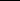
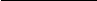
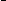
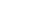

# 6. In Two Dimensions

## Table of Contents

- [Planar duality](#sec-6-6-1)
- [First-order phase transition](#sec-6-6-4)
- [Square, triangular, and hexagonal lattices](#sec-6-6-6)
- [Stochastic L¨owner evolutions](#sec-6-6-7)

Summary. The dual of the random-cluster model on a planar graph is a random-cluster model also. The self-duality of the square lattice gives rise to the conjecture that pc(q) = psd(q) for $q$ ∈ [1,∞), where psd(q) denotes the self-dual point √q/(1+

√q). Using duality, one obtains the uniqueness of random-cluster measures for $p$ = psd(q) and $q$ ∈ [1, ∞). The phase transition is discontinuous if $q$ is sufficiently large. Results similar to those for the square lattice may be obtained for the triangular and hexagonal lattices, using the star–triangle transformation. It is expected when q ∈ [1,4) that the critical process may be described by a stochastic Lowner evolution.¨

## 6.1 Planar duality

The duality theory of planar graphs provides a technique for studying randomcluster models in two dimensions. We shall see that, for a dual pair (G, Gd) of finite planar graphs, the measures φG,p,q and φGd,pd,q are dual measures in a certain sense to be explained soon, where $p$ and pd are related by pd/(1 − pd) = q(1 − p)/p. Such a duality survives the passage to a thermodynamic limit, and may therefore be applied also to infinite planar graphs including the square lattice L2. The square lattice has the further property of being isomorphic to its (infinite) dual, and this observation leads to many results of significance for the associated model. We begin with an account of planar duality in the random-cluster context.

A graph is called planar if it may be embedded in R2 in such a way that two edges intersect only at a common endvertex. Let G = (V, E) be a planar (finite or infinite) graph embedded in R2. We obtain its dual graph Gd = (Vd, Ed) as follows1. We place a dual vertex within each face of G, including any infinite face of G if such exist. For each e ∈ E we place a dual edge ed = xd, yd joining the two dual vertices lying in the two faces of G abutting e; if these two faces are the same, then xd = yd and ed is a loop. Thus, Vd is in one–one correspondence with

1The roman letter ‘d’ denotes ‘dual’ rather than ‘dimension’.

138 In Two Dimensions [6.2]

, q ∈ [1,∞).

√q

Thishasbeen provedwhenq = 1, $q$ = 2, and when q ≥ 25.72. The $q$ = 1 case was answered by Kesten, [207], in his famous proof that the critical probability of bond percolation on L2 is 21. For $q$ = 2, the value of pc(2) given above agrees with the Kramers–Wannier [221] and Onsager [264] calculations of the critical temperature of the Ising model on Z2, and is implied by probabilistic results in the modern vernacular, see [5] and Section 9.3. The formula (6.16) for pc(q) has been established rigorously in [224, 225] for sufficiently large (real) values of $q$, specifically q ≥ 25.72 (see also [153]). This is explored further in Section 6.4, see Theorem 6.35.

Several other remarkable conjectures about the phase transition on L2 may be found in the physics literature as consequences of ‘exact’ but non-rigorous arguments involving ice-type models, see [26]. These include exact formulae for the asymptotic behaviour of the partition function lim ↑Z2{Z (p,q)}1/| |, and also for the edge-densities at the self-dual point psd(q), that is, the quantities hb(q) = φbp

sd(q),q(e is open) for b = 0,1. These formulae are summarized in Section 6.6.

Conjecture 6.15 asserts that pc(q) = psd(q) for $q$ ∈ [1,∞). One part of this equality is known. Recall that θ0(p,q) = φp0,q(0 ↔ ∞). (6.17) Theorem [152, 314]. Consider the square lattice L2, and let q ∈ [1,∞).

(a) We have that θ0(psd(q),q) = 0, whence pc(q) ≥ psd(q). (b) There exists a unique random-cluster measure if $p$ = psd(q), that is,

√q 1 +

The complementary inequality pc(q) ≤ psd(q) has eluded mathematicians despiteprogressbyphysicists,[183]. Hereisanintuitiveargumenttojustifythelatter inequality. Supposeonthe contrarythat pc(q) > psd(q), so that pc(q)d < psd(q). For p ∈ (pc(q)d, pc(q)) we have also that pd ∈ (pc(q)d, pc(q)). Therefore, for $p$ ∈ (pc(q)d, pc(q)), both primal and dual processes comprise (almost surely) the union of finite open clusters. This contradicts the intuitive picture, supported for $p$ = pc(q) by our knowledge of percolation, of finite open clusters of one process floating in an infinite open ocean of the other process.

Conjecture 6.15 would be proven if one could show the sufficiently fast decay

of φp0,q(0 ↔ ∂ (n)) as n → ∞. An example of such a statement may be found at Lemma 6.28, and another follows. Recall from Section 5.5 the quantity pc(q).

- (6.18) Theorem [163]. Let q ∈ [1,∞) and suppose that, for all $p$ < pc(q), there exists A = A(p,q) < ∞ with
- (6.19) φp0,q(0 ↔ ∂ (n)) ≤

For example, when $q$ = 10, we have that 0.760 ≤ pc(10) ≤ 0.769, to be compared with the conjecture that pc(10) =

√10) ≃ 0.760. The upper bound in (6.21) is the dual value of psd(q − 1). See also Theorem 6.30.

√10/(1 +

Exact values for the critical points of the triangular and hexagonal lattices may be conjectured similarly, using graphical duality together with the star–triangle transformation; see Section 6.6.

Proof of Theorem6.17. (a) There are at least two ways of provingthis. One way is to use the circuit-constructionargumentpioneeredby Harris, [181], anddeveloped further in [47, 130], see Theorem 6.47. We shall instead adapt an argument of Zhang using the 0/1-infinite-cluster property, see [154, p. 289]. Let $p$ = psd(q), so that φp0,q and φp1,q are dual measures in the sense of Theorem 6.13.

For n ≥ 1, let Al(n) (respectively Ar(n), At(n), Ab(n)) be the event that some vertex on the left (respectively right, top, bottom) side of the square T(n) = [0,n]2 lies in an infinite open path of L2 using no other vertex of T(n). Clearly Al(n), Ar(n), At(n), and Ab(n) are increasingeventswhose unionequalsthe event {T(n) ↔ ∞}. Furthermore, by rotation-invariance,

(6.22) for b = 0,1 and n ≥ 1, φpb,q(Au(n)) is constant for u = l,r,t,b.

Supposethatθ0(p,q) > 0, whencebystochasticordering θ1(p,q) > 0. Since the φpb,q have the 0/1-infinite-cluster property,

φpb,q Al(n) ∪ Ar(n) ∪ At(n) ∪ Ab(n) → 1 as n → ∞. By positive association,

φpb,q(T(n) ↔/ ∞) ≥ φpb,q Al(n) φpb,q Ar(n) φpb,q At(n) φpb,q Ab(n) ,

giving that φpb,q(A) ≥ 21 for b = 0,1.

Wenowusethefactthateveryrandom-clustermeasure φpb,q hasthe0/1-infinitecluster property, see Theorem 4.33(c). If A occurs, then L2 \ T(N) contains two disjoint infinite open clusters, since the clusters in questions are separated by infinite open paths of the dual; any open path of L2 \ T(N) joining these two clusters would contain an edge which crosses an open edge of the dual, and no such edge can exist. Similarly, on A, the graph L2d \ T(N)d contains two disjoint infinite open clusters, separated physically by infinite open paths of L2 \ T(N). The whole lattice L2 contains (almost surely) a unique infinite open cluster, and it follows that there exists (almost surely on A) an open connection π of L2 between the fore-mentioned infinite open clusters. By the geometry of the situation (see Figure 6.5), this connection forms a barrier to possible open connections of the dual joining the two infinite open dual clusters. Therefore, almost surely on A, the dual lattice contains two or more infinite open clusters. Since the latter event has probability 0, it follows that φpb,q(A) = 0 in contradiction of the inequality φpb,q(A) ≥ 21. The initial hypothesis that θ0(p,q) > 0 is therefore incorrect, and the proof is complete. (b) By part (a), θ1(p,q) = 0 for $p$ < psd(q), whence, by Theorem 5.33(a), |Rp,q| = |Wp,q| = 1 for $p$ < psd(q).

Suppose now that $p$ > psd(q) so that, by (6.5), pd < psd(q). By part (a) and Theorem 4.63,

φ0pd,q(ed is closed) = φ1pd,q(ed is closed), e ∈ E2, and by Theorem 6.13,

φpb,q(e is open) = φ1p−d,bq(ed is closed), b = 0,1.

Therefore, φp0,q(e is open) = φp1,q(e is open), and the claim follows by Theorem 4.63.

in contradiction of Theorem 6.14. Therefore psd(q) = pc(q). More generally, by Theorem 5.60, φ0p

sd(q),q(0 ↔ ∂ (n)) decays exponentially as n → ∞. Exponential decay holds for φ1p

sd(q),q also, as above, and (6.27) follows for large n. Therefore, psd(q) = pc(q) as claimed.

142 In Two Dimensions [6.2]

We precede the proof of Theorem 6.20 with a lemma.

(6.28) Lemma. Let q ∈ [1,∞), and let p and pd satisfy (6.5). With C the open cluster at the origin and b ∈ {0,1},

4An alternative proof appears in [141]. See also [314].

(6.30) Theorem (Exponential decay) [15]. Let q ∈ [2,∞), and consider the random-cluster model on the box (n) = [−n,n]2. There exists α = α(p,q) satisfying α(p,q) > 0 when $p$ < psd(q − 1) such that

φ (1 n),p,q(0 ↔ ∂ (n)) ≤ e−αn, n ≥ 1. By stochastic ordering,

φ (1 n),p,q(0 ↔ ∂ (m)) ≤ φ (1 m),p,q(0 ↔ ∂ (m)), m ≤ n, and therefore, on taking the limit as n → ∞,

φp1,q(0 ↔ ∂ (m)) ≤ e−αm, $p$ < psd(q − 1), q ≥ 2, m ≥ 1, by the above theorem. In summary,

psd(q − 1) ≤ pc(q) ≤ psd(q), q ≥ 2,

where pc(q) is the threshold for exponential decay, see (5.65) and (5.67). We recall the conjecture that pc(q) = pc(q).

√q − 1 1 +

1 − e−β4 =

√q − 1 = psd(q − 1). Let $p$ = 1 − e−β < psd(q − 1). By (3.83), h′ < 0. By stochastic domination, (6.31) φ ,1 p,q(0 ↔ ∂ ) ≤ π ,β+ ′,h′(0 ↔+ ∂ ),

where {0 ↔+ ∂ } is the event that there exists a path of joining 0 to some vertex of ∂ all of whose vertices have spin +1. By results of [88, 182] (see the discussion in [15, p. 438]), the right side of (6.31) decays exponentially in the shortest side-length of .

## 6.4 First-order phase transition

The $q$ = 1 case of the random-cluster measure is the percolation model, with associated product measure φp = φp,1. One of the outstanding problems for percolation isto prove the continuityforall d of the percolation probability θ(p) = φp(0 ↔ ∞) at the critical point pc = pc(1), see [154, Section 8.3]. By a standard argument of semi-continuity, this amounts to proving that θ(pc) = 0, which is to say that there exists (almost surely) no infinite open cluster at the critical point. The situation for general $q$ is quite different. It turns out that θ1(pc(q),q) > 0 for all large q.

(6.32) Conjecture. Consider the d-dimensional lattice Ld where d ≥ 2. (a) θ0(pc(q),q) = 0 for $q$ ∈ [1,∞). (b) There exists Q = Q(d) ∈ (1,∞) such that

θ1(pc(q),q) = 0 if $q$ < Q, > 0 if $q$ > Q.

In the vernacular of statistical physics, we speak of the phase transition as being of second order if θ1(pc(q),q) = 0, and of first order otherwise. Thus the random-cluster transition is expected to be of first order if and only if $q$ is sufficientlylarge. Therearetwoissues: toprovetheexistenceofa‘sharptransition in q’, and to calculate the ‘critical value’ Q(d) of q. The first problem is strangely difficult. It is natural to seek some monotonicity, perhaps of the function f (q) = θ1(pc(q),q), but this has proved elusive even in two dimensions. As for the value of Q(d), it is believed5 that Q(d) is non-increasing in d and satisfies

(6.33) Q(d) =

4 if d = 2, 2 if d ≥ 6.

Afirst-ordertransitionischaracterizedbyadiscontinuityintheorder-parameter θ1(p,q). Two further indicators of first-order transition are: discontinuity of the edge-densities hb(p,q) = φpb,q(e is open), b = 0,1, and the existence of a socalled ‘non-vanishing mass gap’. The edge-densities are sometimes termed the ‘energy’ functions, since they arise thus in the Potts model.

The term ‘mass gap’ arises in the study of the exponential decay of correlations in the subcritical phase, in the limit as p ↑ pc(q). Of the various ways of expressing this, we choose to work with the probability φp0,q(0 ↔ ∂ (n)), where (n) = [−n,n]d. Recall from Theorem 5.45 that there exists a function ψ = ψ(p,q) such that

φp0,q(0 ↔ ∂ (n)) ≈ e−nψ as n → ∞,

5See [26, 324] and the footnote on page 183.

[6.4] First-order phase transition 145

where ‘≈’ denotes logarithmic asymptotics. Clearly, ψ(p,q) is a non-increasing function of p, and ψ(p,q) = 0 if θ0(p,q) > 0. It is believed that ψ(p,q) > 0 if $p$ < pc(q). We speak of the limit

µ(q) = lim

ψ(p,q)

p↑pc(q)

as the mass gap. It is believed that the transition is of first order if and only if there is a non-vanishing mass gap, that is, if µ(q) > 0.

(6.34) Conjecture. Consider the d-dimensional lattice Ld where d ≥ 2. Then

µ(q) = 0 if $q$ < Q(d),

> 0 if $q$ > Q(d), where Q(d) is given in Conjecture 6.32.

The first proof of first-order phase transition for the Potts model with large q was discovered by Kotecky and Shlosman, [220].´ Amongst the later proofs is that of [225], and this is best formulated in the language of the random-cluster model, [224]. It takes a very simple form in the special case d = 2, as shown in this section. The general case of d ≥ 2 is treated in Chapter 7.

There follows a reminder concerning the number an of self-avoiding walks on

L2 beginning at the origin. It is standard, [244], that an1/n → κ as n → ∞, for some constant κ termed the connective constant of the lattice. Let

4

Q = 2 1 κ + κ2 − 4

. We have that 2.620 < κ < 2.696, see [302], whence 21.61 < Q < 25.72. Let ψ(q) =

noting that ψ(q) > 0 if and only if $q$ > Q. (6.35) Theorem (Discontinuous phase transition when d = 2) [153, 225]. Consider the square lattice L2, and let $q$ > Q.

√q/(1 +

√q).

(a) Critical point. The critical point is given by pc(q) =

(b) Discontinuous transition. We have that θ1(pc(q),q) > 0. (c) Non-vanishing mass gap. For any ψ < ψ(q) and all large n,

φ0pc(q),q(0 ↔ ∂ (n)) ≤ e−nψ. (d) Discontinuous edge-densities. The functions hb(p,q) = φpb,q(e is open), b = 0,1, are discontinuous functions of p at $p$ = pc(q).

Similar conclusions may be obtained for general d ≥ 2 when $q$ is sufficiently large ($q$ > Q(d) for suitable Q(d)). Whereas, in the case d = 2, planar duality provides an especially simple proof, the proof for general d utilizes nested

sequences of surfaces of Rd and requires a control of the effective boundary conditions within the surfaces. See Section 7.5.

By Theorem 6.17(b), whenever $q$ is such that the phase transition is of first order, then necessarily pc(q) = psd(q).

The idea of the proof of the theorem is as follows. There is a partial order on circuits Ŵ of L2 given by: Ŵ ≤ Ŵ′ if the bounded component of R2 \ Ŵ is a subset of that of R2 \ Ŵ′. We work at the self-dual point $p$ = psd(q), and with the box (n) with wired boundary conditions. Roughly speaking, an ‘outer contour’ is defined to be a circuit Ŵ of the dual graph (n)d all of whose edges are open in the dual (that is, they traverse closed edges in the primal graph (n)), and that is maximal with this property. Using self-duality, one may show that

|Ŵ|/4

1 q

q (1 +

φ (1 n),psd(q),q(Ŵ is an outer circuit) ≤

√q)4

,

for any given circuit Ŵ of (n)d. Combined with a circuit-counting argument of Peierls-type involving the connective constant, this estimate implies after a little work the claims of Theorem 6.35. The idea of the proof appeared in [225] in the context of Potts models, and the random-cluster formulation may be found in [153]; see also Section 7.5 of the current work.

Proof of Theorem 6.35. This proof carries a health warning. The use of twodimensionaldualityraisescertainissueswhicharetedioustoresolvewithcomplete rigour, and we choose not to do so here. Such issues may be resolved either by the methods of [210, p. 386] when d = 2, or by those expounded in Section 7.2 for general d ≥ 2. Let n ≥ 1, let = (n) = [−n,n]2, and let d = [−n,n−1]2+(21, 21) be those verticesof the dualof that lie inside (thatis, we omitthedualvertexintheinfinitefaceof ). Weshallworkwith‘wired’boundary conditions on , and we let ω ∈ \Omega = \{0,1\}^E . The exterior (respectively, interior) of a given circuit Ŵ of either L2 or its dual L2d is defined to be the unbounded (respectively, bounded) component of R2 \ Ŵ. A circuit Ŵ of d is called an outer circuit of a configuration ω ∈ if the following hold:

(a) all edges of Ŵ are open in the dual configuration ωd, which is to say that

they traverse closed edges of , (b) the origin of L2 is in the interior of Ŵ, (c) every vertex of lying in the exterior of Ŵ, but within distance of 1/

√2 of some vertex of Ŵ, belongs to the same component of ω.

See Figure 6.6 for an illustration of the meaning of ‘outer circuit’. Each circuit Ŵ of d partitions the set E of edges of into three sets, namely

E = {e ∈ E : e lies in the exterior of Ŵ},

= (1 − p)|Ŵ|qm−1−21|I| Z1E Z1Id

Z1 ≤ (1 − p)|Ŵ|qm−1−21|I|.

Since each vertex of (inside Ŵ) has degree 4,

4m = 2|I| + |Ŵ|, whence

1 q

(6.42) φ ,1 p,q(OC(Ŵ)) ≤ (1 − p)|Ŵ|q 41|Ŵ|−1 =

q (1 +

√q)4

On letting n → ∞, we obtain by Proposition 5.11 that θ1(p,q) > 0 when $p$ =

√q/(1 +

√q). By Theorem 6.17(a), this implies parts (a) and (b) of the theorem when $q$ is sufficiently large.

For general $q$ > Q, we have only that A(q) < ∞. In this case, we find N < n such that

φ ,1 p,q(OC(Ŵ)) < 21,

√q) for the random-cluster model on L2. Such predictions are often beautiful and usually provocative to mathematicians.

√q/(1 +

Weshallnotexploredualityingeneralhere,notingonlyinpassingtheexistence of many open problems of significance in extending known results for, say, the square lattice to general primal/dual pairs. We discuss instead two specific issues relating, in turn, to the critical points of a general primal/dual pair, and in the next section to exact calculations for the triangular and hexagonal lattices.

Here is ourdefinition of a lattice, [154, Section 12.1]. A lattice in d dimensions is a connected loopless graph L, with bounded vertex degrees, that is embedded in Rd in such a way that:

(a) the translations x → x + e are automorphisms of L for each unit vector e

parallel to a coordinate axis, (b) all edges are of non-zero length, and (c) every compact subset of Rd intersects only finitely many edges.

Let L = (V,E) be a planar two-dimensional lattice, and let Ld be its dual lattice, defined as in Section 6.1. We shall require some further symmetries of L, namely that:

(d) the reflection mappings ρh,ρv : R2 → R2 given by

ρh(x, y) = (−x, y), ρv(x, y) = (x,−y), (x, y) ∈ R2, are automorphisms of L.

Let p ∈ [0,1] and $q$ ∈ [1,∞). Underthe aboveconditions, the random-cluster measures φLb ,p,q exist for b = 0,1, and are invariant under horizontal and vertical translations, andunderhorizontaland verticalaxis-reflection. Theyare in addition ergodic with respect to horizontal and vertical translation (separately), and they are positively associated. Such facts may be proved in exactly the same manner as were the corresponding statements for the hypercubic lattice Ld in Chapter 4.

Let pc(q,L) denote the critical value of the random-cluster model on L.

[6.5] General lattices in two dimensions 153

(6.47) Theorem. The critical points pc(q,L), pc(q,Ld) satisfy the inequality (6.48) pc(q,L) ≥ pc(q,Ld) d.

Proof. Let $p$ > pc(q,L), so that φL1 ,p,q(0 ↔ ∞) > 0. The argumentsleading to the mainresult of[130]may be adaptedto the currentsetting6 to showthatall open clusters in the duallattice Ld are almost-surelyfinite. Therefore, pd ≤ pc(q,Ld), whence p ≥ pc(q,Ld) d as required.

Equality may be conjectured in (6.48). Suppose that L and Ld are isomorphic or, weaker, that pc(q,L) = pc(q,Ld). Inequality (6.48) implies then that pc(q,L) ≥ psd(q) (see Theorem 6.17(a) for the case of the square lattice). If (6.48) were to hold with equality, we would obtain that pc(q,L) = psd(q).

If L is edge-transitive, it is easily seen that hbL(p,q) is simply the probability under φL1 ,p,q that a given edge is open.

(6.51) Theorem. Let L, Ld be a primal/dual pair of planar lattices in two dimensions and suppose L satisfies (a)–(d) above. Let p ∈ [0,1] and $q$ ∈ [1,∞), and assume that $p$ = pc(q,L).

- (i) The edge-density hbL(x,q) is a continuous function of x at the point x = p, for b = 0,1.
- (ii) It is the case that h0L(p,q) = h1L(p,q). (iii) There is a unique random-cluster measure on L with parameters p and $q$, that is, |Wp,q(L)| = |Rp,q(L)| = 1, in the natural notation.

In the notationof Theorem4.63, we have that Dq ⊆ {pc(q,L)}. In particular8, if there exists a first-order phase transition at some value p, then necessarily

- 6Paper [130] treats vertex-models on Z2 governed by measures with certain properties of translation/rotation-invariance, ergodicity, and positive association. The arguments are however more general and apply also to edge-models on planar graphs with corresponding properties.
- 7A graph G = (V, E) is called edge-transitive if: for every pair e, f ∈ E, there exists an automorphism of G mapping e to f . See Sections 3.3 and 10.12 for a related notion of transitivity.
- 8Related matters for Potts models are discussed in [47].

154 In Two Dimensions [6.6]

$p$ = pc(q,L). As in Theorem 5.16, the percolation probabilities θLb (·,q) = φLb ,p,q(0 ↔ ∞), b = 0,1, are continuous9 except possibly at the value $p$ = pc(q,L).

Proof. (i) For $p$ < pc(q,L), this follows as in Theorems 4.63 and 5.33(a). When $p$ > pc(q,L), we have from (6.48) that pd < pc(q,Ld). As in Theorem 6.13,

hbL(p,q) + h1L−db(pd,q) = 1.

By part (i) applied to the dual lattice Ld, each hbL(x,q) is continuous at the point x = pd. Parts (ii) and (iii) follow as in Theorem 4.63, see also the proof of Theorem 6.17(b).

## 6.6 Square, triangular, and hexagonal lattices

There is a host of exact but non-rigorous ‘results’ for two-dimensional models which, while widely accepted by physicists, continue to be subjected to mathematical investigations. Some of these claims have been made rigorous and, in so doing, mathematicians have discovered new structures of beauty and complexity. The outstanding contemporary example of new structure provoked by physics is the theory of stochastic Löwner evolutions (SLE). This has had considerable impact on percolation, Brownian motion, and on other systems with a property of conformal invariance; see Section 6.7 for a short account of SLE in the randomcluster context.

Amongst ‘exact’ but non-rigorous results for the random-cluster model is the claim that, for the square lattice, pc(q) = √q/(1 + √q). Baxter’s 1982 book [26] remains a good source for this and related statements, usually in the context of Potts models but extendable to random-cluster models with q ∈ [1,∞). Such statements are achieved typically by following a sequence of transformations between models, arriving thus at a ‘soluble ice-type model’ on a new graph termed the ‘medial graph’. It has proved difficult to ascertain whether such methods are entirely rigorous, since they involve chains of argument which may seem individually innocuous but which omit significant analytical details. We attempt no more here than brief accounts of some of the conclusions together with a partial mathematical commentary.

√q/(1 +

Considerthesquarelattice L2. Insteadofworkingwith a singleedge-parameter $p$, we allow greater generality by associating with each horizontal (respectively, vertical) edge the parameter ph (respectively, pv), and we write $p$ = (ph, pv). It will be convenient as in (6.7)–(6.8) to work instead with the parameters x = (xh, xv) given by

q−21 ph 1 − ph

q−21 pv 1 − pv

9This may also be proved directly for a primal/dual pair, using the arguments of Theorems 5.33 and 6.47.

and their dual values xh,d, xv,d satisfying xhxh,d = 1, xvxv,d = 1.

Write φGb ,x,q for a corresponding random-cluster measure on a graph G, and moreover

φ ,b x,q, θb(x,q) = φxb,q(0 ↔ ∞).

φxb,$q$ = lim

↑L2

ThedualitymapofSection6.1mapsa random-clustermodelon L2 withparam-

eterx = (xh, xv)toarandom-clustermodelon L2dwithparameter xd = (xv,d, xh,d). The primal and dual models have the same parameters whenever xh = xv,d and xv = xh,d, which is to say that

(6.52) xhxv = 1, and we refer to the model as ‘self-dual’ if (6.52) holds. The following conjecture generalizes Conjecture 6.15. (6.53) Conjecture. Let xh, xv ∈ (0,∞) and $q$ ∈ [1,∞). For b = 0,1,

θb(x,q) = 0 if xhxv < 1, > 0 if xhxv > 1.

The proof in the case of percolation (when $q$ = 1) may be found at [154, Thm 11.115]. Partial progress in the direction of the general conjecture is provided by the next theorem.

(6.54) Theorem. Let xh, xv ∈ (0,∞) and $q$ ∈ [1,∞). Then

θ0(x,q) = 0 if xhxv ≤ 1.

Proof. Let n ≥ 1, and let

D(n) = y ∈ Z2 : |y1| + |y2 − 12| ≤ n + 21

be the ‘offset diamond’ illustrated in Figure 6.10. The proof follows that of Theorem 6.17(a), but working with D(n) in place of T(n). We omit the details, noting only that the proof uses the 0/1-infinite-cluster property of the measures φxb,q, and the symmetry of the model under reflection in both the vertical axis of R2 and the line {(y1, 21) : y1 ∈ R}.

,

By the translation-invariance of the infinite-volume measures, the mean numbers of open horizontal and vertical edges satisfy

2 |E |

φ ,b p,q(|ηh|) → hbh(p,q) = φpb,q(eh is open), 2 |E |

(6.56)

φ ,b p,q(|ηv|) → hbv(p,q) = φpb,q(ev is open),

as ↑ Z2, where eh (respectively, ev) is a representative horizontal (respectively, vertical) edge of L2. Therefore,

hb(p,q) = 21 hbh(p,q) + hbv(p,q) .

1 Y

(y1y2y3 + y1y2 + y2y3 + y3y1)q,

(6.66) Y = (y1y2y3 + y1y2 + y2y3 + y3y1 + y2 + y3)q + (1 + y1)q2.

Note that the eventsin question concern the existence (ornot) of open paths within T only. The remaining term PωT (A ↔/ B ↔/ C in T) is given by the fact that the sum of the probabilities of all such configurations on T equals 1.

It is left to the reader to check that, under (6.60)–(6.61), the probabilities in (6.65) and (6.67) are equal. Similar computations are valid in cases (a) and (c) also, and it follows that, in loose terms, the replacement of T by S is ‘invisible’ to connections elsewhere in the graph G.

Lemma 6.64 allows us to replace one grey triangle of G by a star. This process may be iterated until every grey triangle of G has been thus replaced. If G is itself a union of grey triangles, then the resulting graph is a subgraph of the hexagonal lattice H. By working on a square region of T and passing to the

162 In Two Dimensions [6.6]

limit as ↑ T, we find in particular that connections on T have the same probabilities as connectionson H so long as the edge-parameterson T satisfy (6.60) and the corresponding parameters on H satisfy (6.61). In particular the percolation probabilities are the same. We now make the last statement more specific.

Write ET (respectively, EH) for the edge-set of T (respectively, H). Let $p$ = (pe : e ∈ ET) ∈ (0,1)E

T, and let ye = pe/(1 − pe). We speak of p as being of type γ if, for every grey triangle T, the three parameters y1, y2, y3 of the edges of T satisfy ψT(y1, y2, y3) = γ. Suppose that $p$ is of type 0, as in (6.60). Applying the star–triangle transformation to every grey triangle of T, we obtain a copy H of the hexagonal lattice, and we choose the parameters p′ = (pe′ : e ∈ EH) of edges of this lattice in such a way that (6.61) holds. By the above discussion, the percolation probabilities θTb and θHb satisfy

(6.69) θTb(p,q) = θHb(p′,q), b = 0,1, whenever q ∈ [1,∞).

Alabelledlattice isa latticeLtogetherwith arealvector pindexedbytheedgeset of L. An automorphism of a labelled lattice (L,p) is a graph automorphism τ of L such that pτ(e) = pe for every edge e.

Equation (6.69) leads to a proposal for the so-called ‘critical surfaces’ of the triangular and hexagonal lattices. The crude argument is as follows. Suppose that p, p′ are as above. If θT0(p,q) > 0 then, by (6.69), θH0(p′,q) > 0 also. If we accept a picture of an infinite primal ocean of H encompassing bounded islands of its dual, then it follows that θH1d((p′)d,q) = 0. If the initial labelled lattice (T,p) has a sufficiently large automorphism group then it may, by (6.61), be the case that (Hd,(p′)d) is isomorphic to (T,p), in which case

0 = θH1d((p′)d,q) = θT1(p,q). This is a contradiction, and we deduce that θT0(p,q) = 0 whenever $p$ is of type 0.

On the other hand, some readers may be able to convince themselves that there should exist no non-empty interval (α,β) ⊆ R such that: neither T nor its dual lattice possesses an infinite cluster whenever the type of p lies in (α,β). One arrives via these non-rigorous arguments at the (unproven) statement that

(6.70) θT0(p,q) = 0 if $p$ is of non-positive type,

> 0 if $p$ is of strictly positive type, with a similar conjecture for the hexagonal lattice.

Let p1, p2, p3 ∈ (0,1)and let yi = pi/(1− pi). We restrictthe discussion now to the situation in which every grey triangle of T has three edges with parameters p1, p2, p3, in some order. The corresponding process on H has parameters pi′ where the y′

i = p′

i/(1 − p′

i) satisfy (6.61). The assertions above motivate the proposals that:

(6.71)

T has critical surface y1y2y3 + y1y2 + y2y3 + y3y1 − $q$ = 0, H has critical surface y′

3. − q2 = 0,

1y′

2y′

3 − q(y′

1 + y′

2 + y′

in the sense that

θT0(p,q) = 0 if ψT(y) ≤ 0, > 0 if ψT(y) > 0,

with a similar statement for H. It is not known how to make (6.71) rigorous, neither is it even accepted that the above statements are true in generality, since no explicit assumption has been made about the automorphismgroups of the labelled lattices in question.

We move now to the special case of the homogeneous random-cluster model on T, with constant edge-parameter pe = p for every edge e. One part of the above discussion may be made rigorous, as follows.

### (6.72) Theorem. Let q ∈ [1,∞).

(a) Consider the random-cluster model on the triangular lattice T, and let p be

such that y = p/(1 − p) satisfies y3 + 3y2 − $q$ = 0. Then θT0(p,q) = 0, and therefore pc(q,T) ≥ p.

(b) Considerthe random-clustermodelon the hexagonallattice H, and let p′ be

such that y = p′/(1− p′) satisfies y3−3qy −q2 = 0. Then θH0(p′,q) = 0, and therefore pc(q,H) ≥ p′.

Proof. This may be proved either by adapting the argument used to prove Theorems 6.17(a) and 6.54, or by following the proof of Theorem 6.47. The former approach utilizes the 0/1-infinite-cluster property, and the latter approach makes use of the circuit-generation procedure pioneered in [181] and extended in [130]. Under either method, it is important that the labelled lattices be invariant under translations and possess axes of mirror-symmetry.

It is generally believed that the critical values of T and H are the values given in Theorem 6.72. To prove this, it would suffice to have a reasonable upper bound for φT0,p,q(0 ↔ ∂ (n)), where (n) = [−n,n]2. See the related Theorem 6.18 and Lemma 6.28.

We close this section with an open problem. Arguably the simplest system on the triangular lattice which possesses insufficient symmetry for the above proof is thatin which everyhorizontal(respectively,vertical, diagonal)edgeofT hasedgeparameter ph (respectively, pv, pd). The ensuing labelled lattice has properties of translation-invariancebuthas no axisof mirror-symmetry. Instead, it is symmetric under reflections in the origin. We conjecture11 that the equivalent of Theorem 6.72 holds for this process, namely that

(6.73) θT0(p,q) = 0 if ψT(ph, pv, pd) = 0.

Indeed, one expects that the critical surface is given by ψT(ph, pv, pd) = 0. The proof of the corresponding statement for the percolation model may be found at [154, Thm 11.116].

11Note added at reprinting: this conjecture has been verified in [327].

## 6.7 Stochastic L¨owner evolutions

Many exact calculations are ‘known’ for critical processes in two dimensions, but the required physical arguments have sometimes appeared in varying degrees magical or revelationary to mathematicians. The recently developed technology of stochastic Löwner evolutions (SLE), discovered by Schramm [294], promises a rigorous underpinning of many such arguments in a manner consonant with modern probability theory. Roughly speaking, the theory of SLE informs us of the correctweak limit of a critical process in the limit of large spatial scales, and in addition provides a mechanism for performing calculations for the limit process.

Let U = (−∞,∞) × (0,∞) denote the upper half-plane of R2, with closure U. We view U and U as subsets of the complex plane. Consider the ordinary differential equation

subject to the boundary condition g0(z) = z, where t ∈ [0,∞), κ is a positive constant, and (Bt : t ≥ 0) is a standard Brownian motion. The solution exists when gt(z) is bounded away from Bκt. More specifically, for z ∈ U, let τz be the infimum of all times τ such that 0 is a limit point of gs(z) − Bκs in the limit as s ↑ τ. We let

Ht = {z ∈ U : τz > t}, Kt = {z ∈ U : τz ≤ t},

so that Ht is open, and Kt is compact. It may now be seen that gt is a conformal homeomorphism from Ht to U.

We call (gt : t ≥ 0) a stochastic Lo¨wner evolution (SLE) with parameter κ, written SLEκ, and we call the Kt the hulls of the process. There is good reason to believe that the family K = (Kt : t ≥ 0) provides the correct scaling limit of a variety of random spatial processes, the value of κ being chosen according to the process in question. General properties of SLEκ, viewed as a function of κ, have been studied in [284, 316], and a beautiful theory has emerged. For example, the hulls K form (almost surely) a simple path if and only if κ ≤ 4. If κ > 8, then SLEκ generates (almost surely) a space-filling curve.

Schramm [294, 295] has identified the relevant value of κ for several different processes, and has indicated that percolation has scaling limit SLE6. Full rigorous proofsare not yet known even for generalpercolationmodels. For the special case of site percolation on the triangular lattice T, Smirnov [304, 305] has proved the very remarkable result that the crossing probabilities of re-scaled regions of R2 satisfy Cardy’s formula, and he has outlined a connection to a ‘full scaling limit’ and to the process SLE6. (This last statement is illustrated and partly explained in Figure 6.14.) The full scaling limit for critical percolation on T as an SLE6-based loop process was announced by Camia and Newman in [75] and the proofs may be found in [76].

explorer and the interface of the discrete Gaussian free field have common limit SLE4, see [296, 297].

We turn now to the random-cluster model on L2 with parameters p and q. For q ∈ [1,4), it is believed as in Conjectures 6.15 and 6.32 that the percolation probability θ(p,q), viewed as a function of p, is continuous at the critical point pc(q), and furthermore that pc(q) = √q/(1 + √q). It seems likely that, when re-scaled in the manner similar to that of percolation, the cluster-boundaries of the model converge to a limit process of SLE type. It will remain only to specify the parameter κ of the limit in terms of q. It has been conjectured in [284] that κ = κ(q) satisfies

√q/(1 +

√q, κ ∈ (4,8).

cos(4π/κ) = −12

This value is consistent with the above observation that κ(1) = 6, and also with the finding of [231]that the scaling limit of the uniformspanning-treePeano curve is SLE8. We recall from Theorem 1.23 that the uniform spanning-tree measure is obtained as a limit of the random-cluster measure as p,q ↓ 0.

There are uncertainties over how this programme will develop. For a start, the theory of random-clustermodelsisnotso complete asthatof percolationandofthe uniformspanningtree. Secondly, the existenceof spatial limits is currentlyknown only in certain specialcases. The programme ishoweverambitiousandpromising, and may ultimately yield a full picture of the critical behaviour, including the numerical values of critical exponents, of random-cluster models with q ∈ [1,4), and hence of Ising/Pottsmodelsalso. There isgood reason to expectearlyprogress for the case $q$ = 2, for which the random-cluster interface should converge to SLE16/3, and the Ising (spin) interface to SLE3, [306]. The reader is referred to [295] for a survey of open problems and conjectures concerning SLE.

