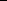

# 7. Duality in Higher Dimensions

## Table of Contents

- [Surfaces and plaquettes](#sec-7-7-1)
- [Basic properties of surfaces](#sec-7-7-2)
- [A contour representation](#sec-7-7-3)
- [Polymer models](#sec-7-7-4)
- [Discontinuous phase transition for large q](#sec-7-7-5)
- [Dobrushin interfaces](#sec-7-7-6)
- [Probabilistic and geometric preliminaries](#sec-7-7-7)
- [The law of the interface](#sec-7-7-8)
- [Geometry of interfaces](#sec-7-7-9)
- [Exponential bounds for group probabilities](#sec-7-7-10)

Summary. The boundaries of clusters in d dimensions are (topologically) (d − 1)-dimensional and, in their study, one encounters new geometrical difficulties when d ≥ 3. By representing the random-cluster model as a sequence of nested contours with alternately wired and free boundary conditions, one arrives at the proof that the phase transition is discontinuous for sufficiently large q. There is a random-cluster analysis of non-translationinvariant states of Dobrushin-type when d ≥ 3, q ∈ [1, ∞), and $p$ is sufficiently large.

## 7.1 Surfaces and plaquettes

Dualityisafundamentaltechniqueinthestudyofanumberofstochasticmodelson a planar graph G = (V, E). Domains of G which are ‘switched-on’ in the model are surrounded by contours of the dual graph Gd which are ‘switched-off’. We make this more concrete as follows. We take as sample space the set \Omega = \{0,1\}^E where, as usual, an edge e is called open in ω ∈ if ω(e) = 1. There exists no open path between two vertices x, y of G if and only if there exists a contourin the dual graph that separates x and y and that traverses closed edges only. Such facts have been especially fruitful in the case of percolation, because the dual process of closed edges is itself a percolationprocess. We saw similarly in Section 6.1 that the dual of a random-clustermodel on a planar graph G is a random-clustermodel on the dual graph Gd, and this observation led to a largely complete theory of the random-cluster model on the square lattice. When d = 2, one may summarize this with the facile remark that 2 = 1 + 1, viewed as an expression of the fact that the co-dimension of a line in R2 is 1. The situation in three and more dimensions is much more complicated since the co-dimension of a line in Rd is d − 1, and one is led therefore to a consideration of surfaces and their geometry.

We begin with a general description of duality in three dimensions (see, for example, [6, 139]) and we consider for the moment the three-dimensional cubic lattice L3. The dual lattice L3d is obtained by translating L3 by the vector

iciently large, [224]. The second component is the proof in Sections 7.6–7.11 of the existence of ‘Dobrushin interfaces’ for all random-cluster models with d ≥ 3, q ∈ [1,∞), and sufficiently large p. This generalizes Dobrushin’s work on nontranslation-invariant Gibbs states for the Ising model, [103], and extends even to the percolation model. A considerable amount of geometry is required for this, and the account given here draws heavily on the original paper, [139].

## 7.2 Basic properties of surfaces

The principal target of this section is to study the geometry of the dual surface corresponding to the external boundary of a finite connected subgraph of Ld. The results are presented for d ≥ 3, but the reader is advised to concentrate on the case d = 3. We write Ldd for the dual lattice of Ld, being the translate of Ld by the vector 12 = (21, 21,. . ., 21).

Let d ≥ 3 and let B0 = [0,1]d, viewed as a subset of Rd. The elementary cubes of Ldd are translates by integer vectors of the cube B0 − 21 = [−21, 21]d. The boundary of B0 − 21 is the union of the 2d sets Pi,u given by

(7.1) Pi,u = [−21, 21]i−1 × {u − 21} × [−21, 21]d−i,

for i = 1,2,. . .,d and u = 0,1. A plaquette (in Rd) is defined to be a translate by an integer vector of some Pi,u. We point out that plaquettes are (topologically) closed(d−1)-dimensionalsubsetsofRd, andthatplaquettesarelineswhen d = 2, and are unit squares when d = 3 (see Figure 7.1). Let H denote the set of all plaquettes in Rd. The straight line-segmentjoining the vertices of an edge $e = \langle x, y \rangle$ passes through the middle of a plaquette denoted by h(e), which we call the dual plaquette of e. More precisely, if y = x +ei where ei = (0,. . .,0,1,0,. . . ,0) is the unit vector in the direction of increasing ith coordinate, then h(e) = Pi,1 + x.

Let s ∈ {1,2,. . .,d − 2}. Two distinct plaquettes h1 and h2 are said to be s-connected, written h1 ∼s h2, if h1 ∩ h2 contains a homeomorphic image of the s-dimensional unit cube [0,1]s. We say that h1 and h2 are 0-connected, written

h1 ∼0 h2, ifh1∩h2 = ∅. Notethath1 d∼−2 h2 ifandonlyifh1∩h2 ishomeomorphic to [0,1]d−2. A set of plaquettes is said to be s-connected if they are connected

when viewed as the vertex-set of a graph with adjacency relation ∼s . Of particular importance is the case s = d − 2. The distance h1,h2 between two plaquettes h1, h2 is defined to be the L∞ distance between their centres. For any set H of plaquettes, we write E(H) for the set of edges of Ld to which they are dual.

We consider next some geometricalmatters. The words ‘connected’and ‘component’ should be interpreted for the moment in their topological sense. Let T ⊆ Rd, and write T for the closure of T in Rd. We define the inside ins(T) to be the union of all bounded connected components of Rd \ T; the outside out(T) is the union of all unbounded connected components of Rd \ T. The set T is said to

separate Rd if Rd \ T has more than one connected component. For a set H ⊆ H of plaquettes, we define the set [H] ⊆ Rd by

(7.2) [H] = {x ∈ Rd : x ∈ h for some h ∈ H}. We call a finite set H of plaquettes a splitting set if it is (d − 2)-connected and Rd \ [H] contains at least one bounded connected component.

The two theorems that follow are in a sense dual to one another. The first is an analogue1 in a general number of dimensions of Proposition 2.1 of [210, Appendix], where two-dimensional mosaics were considered.

(7.3) Theorem [139]. Let d ≥ 3, and let G = (V, E) be a finite connected subgraph of Ld. There exists a splitting set Q of plaquettes such that:

(i) V ⊆ ins([Q]), (ii) every plaquette in Q is dual to some edge of Ed with exactly one endvertex in V,

(iii) if W is a connected set of vertices of Ld such that V ∩ W = ∅, and there exists an infinite path on Ld starting in W that uses no vertex in V, then W ⊆ out([Q]).

For any set δ of plaquettes, we define its closure δ to be the set (7.4) δ = δ ∪ h ∈ H : h is (d − 2)-connected to some member of δ .

Let δ = {h(e) : e ∈ D} be a (d − 2)-connected set of plaquettes. Consider the subgraph (Zd,Ed \ D) of Ld, and let C be a component of this graph. Let

v,δC denote the set of all vertices v in C for which there exists w ∈ Zd with h( v,w ) ∈ δ, and let e,δC denotethe set of edges f of C forwhich h( f ) ∈ δ\δ. Note that edges in e,δC have both endvertices belonging to v,δC.

(7.5) Theorem [139]. Let d ≥ 3. Let δ = {h(e) : e ∈ D} be a (d − 2)-connected set of plaquettes, and let C = (VC, EC) be a finite connected component of the graph (Zd,Ed \ D). There exists a splitting set Q = QC of plaquettes such that:

(i) VC ⊆ ins([Q]), (ii) Q ⊆ δ,

(iii) every plaquette in Q is dual to some edge of Ed with exactly one endvertex in C. Furthermore, the graph ( v,δC, e,δC) is connected.

This theorem will be used later to show that, for a suitable (random) set δ of plaquettes, the random-cluster measure within a bounded connected component of Rd \ [δ] is that with wired boundary condition. The argument is roughly as follows. Let ω ∈ , and let δ = {h(e) : e ∈ D} be a maximal (d − 2)-connected

1This answers a question which arose in 1980 during a conversation with H. Kesten.

set of plaquettes that are open (in the sense that they are dual to ω-closed edges of Ld, see (7.9)). Let h = h( f ) ∈ δ \ δ. It must be the case that f is open, since if f were closed then h( f ) would be open, which would in turn imply that h( f ) ∈ δ, a contradiction. That is to say, for any finite connected component C of (Zd,Ed \ D), every edge in e,δC is open. By Theorem 7.5, the boundary v,δC, when augmented by the set e,δC of edges, is a connected graph. The randomcluster measure on C, conditional on the set δ, is therefore a wired measure.

We shall require one further theorem of similar type.

(7.6)Theorem. Letd ≥ 3andlet δ = {h(e) : e ∈ D}beafinite(d−2)-connected set of plaquettes. Let C = (V, E) be the subgraph of (Zd,Ed \ D) comprising all vertices and edges lying in out([δ]). There exists a subset Q of δ such that:

(i) Q is (d − 2)-connected, (ii) every plaquette in Q is dual to some edge of Ed with at least one endvertex in C. Furthermore, the graph ( v,δC, e,δC) is connected.

ProofofTheorem7.3. Relatedresultsmaybefoundin[82, 101, 159]. Thetheorem may be proved by extending the proof of [159, Lemma 7.2], but instead we adapt the proof given for three dimensions in [139]. Consider the set of edges of Ld with exactly one endvertex in V, and let P be the corresponding set of plaquettes.

Let x ∈ V. We show first that x ∈ ins([P]). Let U be the set of all closed unit cubes of Rd having centresin V. Since all relevantsets in this proofare simplicial, the notions of path-connectednessand arc-connectednesscoincide. Recall that an unbounded path of Rd from x is a continuous mapping γ : [0,∞) → Rd with γ(0) = x and unbounded image. For any such path γ satisfying |γ(t)| → ∞ as t → ∞, γ has a final point z(γ) belonging to the (closed) union of all cubes in U. Now z(γ) ∈ [P] for all such γ, and therefore x ∈ ins([P]).

Let λs denote s-dimensional Lebesgue measure, so that, in particular, λ0(S) = |S|. A subset S of Rd is called:

thin if λd−3(S) < ∞, fat if λd−2(S) > 0.

Let P1, P2,. . ., Pn be the (d − 2)-connected components of P. Note that [Pi] ∩ [Pj] is thin, for i = j. We show next that there exists i such that x ∈ ins([Pi]). Suppose for the sake of contradiction that this is false, which is to say that x ∈/ ins([Pi]) for all i. Then x ∈/ Pi = [Pi] ∪ ins([Pi]) for i = 1,2,. . .,n. Note that each Pi is a closed set which does not separate Rd.

Let i = j. We claim that: (7.7) either Pi ∩ Pj is thin, or one of the sets Pi, Pj is a subset of the other. To see this, suppose that Pi ∩ Pj is fat; we shall deduce as required that either Pi ⊆ Pj or Pi ⊇ Pj.

Suppose further that Pi ∩[Pj] is fat. Since [Pj] is a union of plaquettes and Pi is a union of plaquettes and cubes, all with cornersin Zd + 21, there exists a pair h1, h2 of plaquettesofLdd such thath1 d∼−2 h2, and g = h1∩h2 satisfies g ⊆ Pi ∩[Pj]. We cannot have g ⊆ [Pi] since [Pi] ∩ [Pj] is thin, whence int(g) ⊆ ins([Pi]), where int(g) denotes the interior of g viewed as a subset of Rd−2. Now, [Pj] is (d − 2)-connected and [Pi] ∩ [Pj] is thin, so that [Pj] is contained in the closure of ins([Pi]), implying that [Pj] ⊆ Pi and therefore Pj ⊆ Pi.

Suppose next that Pi ∩ [Pj] is thin but Pi ∩ ins([Pj]) is fat. Since [Pi] is (d − 2)-connected, it has by definition no thin cutset. Since [Pi] ∩ [Pj] is thin, either [Pi] ⊆ Pj or [Pi] is contained in the closure of the unbounded component of Rd \[Pj]. The latter cannot hold since Pi ∩ ins([Pj]) is fat, whence [Pi] ⊆ Pj and therefore Pi ⊆ Pj. Statement (7.7) has been proved.

By (7.7), we may write R = ni=1 Pi as the union of distinct closed bounded sets Pi, i = 1,2,. . .,k, where k ≤ n, that do not separate Rd and such that Pi ∩ Pj is thin for i = j. By Theorem 11 of [223, §59, Section II]2, R does not separate Rd. By assumption, x ∈/ R, whence x lies in the unique component of the complement Rd \ R, in contradiction of the assumption that x ∈ ins([P]). We deduce that there exists k such that x ∈ ins([Pk]), and we define Q = Pk.

Consider now a vertex y ∈ V. Since G = (V, E) is connected, there exists a path in Ld that connects x with y using only edges in E. Whenever u and v are two consecutive vertices on this path, h( u,v ) does not belong to P. Therefore, y lies in the inside of [Q]. Claims (i) and (ii) are now proved with Q as given, and it remains to prove (iii).

Let W be as in (iii), and let w ∈ W be such that: there exists an infinite path on Ld with endvertex w and using no vertex of V. Whenever u and v are two consecutive vertices on such a path, the plaquette h( u,v ) does not lie in P. It follows that w ∈ out([P]), and therefore w ∈ out([Q]).

Proof of Theorem 7.5. Let H = ( v,δC, e,δC). Let x ∈ v,δC, and write Hx for the connected component of H containing x. We claim that there exists a plaquette hx = h( y, z ) ∈ δ such that y ∈ Hx.

The claim holds with y = x and hx = h( x, z ) if x has a neighbour z with h( x, z ) ∈ δ. Assume thereforethat x hasnosuch neighbourz. Since x ∈ v,δC, x has some neighbour u in Ld with h( x,u ) ∈ δ \ δ. Following a consideration

of the various possibilities, there exists h ∈ δ such that h d∼−2 h( x,u ), and

either (a) h = h( u, z ) for some z, or (b) h = h( v, z ) for some v, z satisfying v ∼ x, z ∼ u.

2This theorem states, subject to a mild change of notation, that: “If none of the closed sets F0 and F1 cuts Sd between the points p and $q$ and if dim(F0 ∩ F1) ≤ d − 3, their union F0 ∪ F1 does it neither”. Here, Sd denotes the d-sphere.

If (a) holds, we take y = u (∈ Hx) and hx = h. If (a) does not hold but (b) holds for some v, z, we take y = v (∈ Hx) and hx = h.

We apply Theorem 7.3 with G = Hx to obtain a splitting set Qx, and we claim

that (7.8) Qx ∩ δ = ∅.

This we prove as follows. If hx ∈ Qx, the claim is immediate. Suppose that hx ∈/ Qx, so that [hx] ∩ ins([Qx]) = ∅, implying that δ intersects both ins([Qx]) and out([Qx]). Since both δ and Qx are (d − 2)-connected sets of plaquettes, it follows that δ ∪ Qx is (d − 2)-connected. Therefore, there exist h′ ∈ δ, h′′ ∈ Qx such that h′ d∼−2 h′′. If h′′ ∈ δ, then (7.8) holds, so we may assume that h′′ ∈/ δ, and hence h′′ ∈ δ \ δ. Then h′′ = h( v,w ) for some v ∈ Hx, and therefore w ∈ Hx, a contradiction. We conclude that (7.8) holds.

Now, (7.8) implies that Qx ⊆ δ. Suppose on the contrary that Qx ⊆ δ, so that

there exist h′ ∈ δ, h′′ ∈ Qx \ δ such that h′ d∼−2 h′′. This leads to a contradiction by the argument just given, whence Qx ⊆ δ.

Suppose now that x and y are vertices of H such that Hx and Hy are distinct connected components. Either Hx lies in out([Qy]), or Hy lies in out([Qx]). Since Qx, Qy ⊆ δ, either possibility contradicts the assumption that x and y are connected in C. Therefore, Hx = Hy as claimed. Part (i) of the theorem holds with Q = Qx.

Proof of Theorem 7.6. This makes use the methods of the last two proofs, and is only sketched. Let Q ⊆ H be the set of plaquettes that are dual to edges of Ed \ E with at least one endvertex in V. By the definition of the graph C = (V, E), Q ⊆ δ. Let Q1, Q2,. . . , Qm be the (d − 2)-connected components of Q. If m ≥ 2, there exists a non-empty subset H ⊆ δ \ Q such that Q ∪ H is (d − 2)-connected but no strict subset of Q ∪ H is (d − 2)-connected. Each h = h(e) ∈ H must be such that at least one vertex of e lies in out(Q), in contradiction of the definition of Q. It follows that Q is (d − 2)-connected.

The connectivity of ( v,δC, e,δC) may be provedin very much the same way as in the proof of Theorem 7.5.

## 7.3 A contour representation

The dual of a two-dimensional random-cluster model is itself a random-cluster model, as explained in Chapter 6. The corresponding statement is plainly false in three or more dimensions, since the geometry of plaquettes differs from that of edges. Consider an edge-configuration ω ∈ \Omega = \{0,1\}^Ed, and the corresponding plaquette-configuration π = (π(h) : h ∈ H) given by

(7.9) π(h(e)) = 1 − ω(e), e ∈ Ed.

174 Duality in Higher Dimensions [7.3]

Thus, h(e) is open if and only if e is closed. The open plaquettes form surfaces, or ‘contours’, and one seeks to understand the geometry of the original process througha study of the probable structure of such contours. Contoursare objectsof some geometrical complexity, and they demand a proper study in their own right, of which the results of Section 7.2 form part.

The study of contours for the random-cluster model has as principal triumph a fairly complete analysis of the model for large q. The central feature of this analysis is the proof that, at the critical point $p$ = pc(q) for sufficiently large q, the contour measures of both free and wired models have convergent cluster expansions. This implies a discontinuousphase transition, the existence of a mass gap, and a number of other facts presented in Section 7.5.

Cluster (or ‘polymer’) expansions form a classical topic of statistical mechanics, and their theory is extensive and well understood by experts. Rather than developingthe theory from scratch here, we shall in the next section abstract those ingredients that are relevant for the current application. Meanwhile, we concentrate on formulating the random-clustermodel in a manner resonant with polymer expansions. The account given here is an expansion and elaboration of that found in [224]. A further treatment may be found in [65, 66].

Henceforthin this chapterwe shall assume, unless otherwise stated, that d = 3. Similar results are valid whenever d ≥ 3, and stronger results hold when d = 2. A plaquette is taken to be a closed unit square of the dual lattice L3d, and each plaquette h = h(e) is pierced by a unique edge e of L3.

Since the random-cluster model involves probability measures on the set of edge-configurations, we shall consider functions on the power set of the edgeset E3 rather than of the vertex-set Z3. Let E be a finite subset of E3, and let LE = (VE, E) denote the induced subgraph of L3. We shall consider the partition functions of the wired and free random-cluster measures on this graph, and to this end we introduce various notions of ‘boundary’. Let D be a (finite or infinite) subset of E3, and write D = E3 \ D for its complement.

(i) The vertex-boundary ∂D is the set of all x ∈ VD such that there exists an edge e = x, z with e ∈/ D. Note that ∂D = ∂D.

We shall require three (related) types of ‘edge-boundaries’ of D. (ii) The 1-edge-boundary ∂eD is defined3 to be the set of all edges e ∈ D such that there exists f ∈/ D with the property that h(e) ∼1 h( f ). (iii) The external edge-boundary extD is the set of all edges e ∈/ D that are incident to some vertex in ∂D.

(iv) The internal edge-boundary intD is the external edge-boundary of the complement D, that is, intD = extD. In other words, intD includes every edge e ∈ D that is incident to some x ∈ ∂D.

3When working with Ld for general d, ∂eD would be taken to be the (d − 2)-edge-boundary, given similarly but with 1 replaced by d − 2.

Let p ∈ (0,1), q ∈ (0,∞), and r = p/(1 − p). As is usual in classical statistical mechanics, it is the partition functions which play leading roles. Henceforth, we take E to be a finite subset of E3. We consider first the wired measure on LE, which we define via its partition function4

r|D|qk1(D,E),

(7.10) Z1(E) =

D: D⊆E D⊇∂eE

where k1(D, E) denotes the number of connected components (including the infinite cluster and any isolated vertices) of L3 after the removalof edges in E \ D. This definition (7.10) differs slightly from that of (4.12) with ξ = 1, but it may be seen via Theorem 7.5 that the corresponding probability measure amounts to the wired measure on the edge-set E \ ∂eE. It is presented in the above manner in order to facilitate certain relations to be derived soon.

We define similarly the free partition function on LE by (7.11) Z0(E) =

r|D|qk0(VE\∂E,D),

D: D⊆E D∩ intE=∅

where k0(G) denotesthe numberof connectedcomponentsof a graph G including isolated vertices5. Since intE includes every edge e ∈ E that is incident to some vertex x ∈ ∂E, every x ∈ ∂E is isolated for all sets D contributing to the summation in (7.11), and these vertices are not included in the cluster-count k(VE \ ∂E, D). The measure defined by (7.11) differs slightly from that given at (4.11)–(4.12) with ξ = 0, but it may be seen that the corresponding probability measure amounts to the free measure on the graph (VE, E \ intE).

E↑E3

E↑E3

where the limit is taken in a suitable ‘van Hove’ sense.

We introduce next the classes of ‘wired’ and ‘free’ contours of the lattice L3. For s ∈ {0,1} and e, f ∈ E3, we write e ∼s f if h(e) ∼s h( f ). A subset D of E3 is said to be s-connected if it is connected when viewed as a graph with adjacency relation ∼s . Thus, D is s-connected if and only if the set {h( f ) : f ∈ D} of plaquettes is s-connected. Let D ⊆ E3, and consider its external edge-boundary γ = extD. We call the set γ a wired contour (respectively, free contour) if it is

- 4It is convenient in the present setting to think of a configuration as a subset of edges rather than as a 0/1-vector. We adopt the convention that Z1(∅) = 1.
- 5We set Z0(E) = 1 if E \ intE = ∅. In particular, Z0(∅) = 1.

It may be seen by Theorem 7.5 that (7.18) intγ = γ, γ ∈ Cw.

Two contours γ1, γ2 of the same class are said to be compatible if γ1 ∪γ2 is not 1-connected. We call the pair γ1, γ2 externally compatible if they are compatible and in additionγ1 ⊆ ext(γ2) and γ2 ⊆ ext(γ1). IfŴ = {γ1,γ2,. . .,γn} is a family of pairwise externally-compatiblecontoursof the same class, we write Ŵ = i γi, ext(Ŵ) = E3 \ Ŵ, and int(Ŵ) = Ŵ \ Ŵ. Here, we have used Ŵ to denote the set of edges in the union of the γi.

LetŴw = {γ1,γ2,. . .,γm} bea familyof pairwiseexternally-compatiblewired contours. It may be seen that

- 1. D contains no edge in any γi,
- 2. D contains every edge of E not belonging to Ŵw. This leads via (7.18) and (7.19) to the formula

(7.21) Z1(E) =

r|E\Ŵw|qZ0(Ŵw)

Ŵw⊂E\∂eE

where the summation is over all families Ŵw of pairwise externally-compatible wired contours contained in E \ ∂eE. By Theorems 7.3 and 7.5, each such Ŵw is co-connected.

We turn now to the free partition function Z0(E). Let D ⊆ E \ intE. Let D∞c be the set of edges in the unique infinite 1-connected component of Dc = E3 \ D, and let Ŵ(D) = intD∞c . The set Ŵ(D) may be expressed as a union of maximal 1-connected sets γi, i = 1,2,. . .,n, which are pairwise externally-compatible free contours, and we write Ŵf(D) = {γ1,γ2,. . .,γn}. We note that every edge in Ŵ(D) belongs to E. Thus, to each set D there corresponds a collection Ŵf(D), and the summation in (7.11) may be partitioned according to the value of Ŵf(D). For a given family Ŵf = {γ1,γ2,. . .,γn} of pairwise externally-compatible free contours in E, one sums over sets D with Ŵf(D) = Ŵf, and the constraints on such D are as follows:

- 1. D ⊆ intŴf,
- 2. for i = 1,2,. . .,n, D contains every edge in intγi that is 1-connected to some edge in γi. This leads by (7.11), (7.20), and Theorem 7.5 to the formula

(7.22) Z0(E) =

q|VE\∂E|−|VintŴf|qn−1Z1(intŴf),

Ŵf⊂E

where the summation is over all families Ŵf of pairwise externally-compatible free contours γ contained in E. By Theorems 7.3 and 7.5, each such intŴf is co-connected.

The nextstep is to transformthe random-clustermodelinto a so-called polymer model of statistical mechanics. To the latter model we shall apply certain standard results summarized in the next section, and we shall return to the random-cluster application in Section 7.5.

## 7.4 Polymer models

The partition function of a lattice model in a finite volume of Rd may generally be written in the form

(7.23) Z( ) =

⊂ γ∈

(γ),

where the summation7 is overall compatible families in (includingthe empty family, which contributes 1) comprising certain types of geometrical objects γ called ‘polymers’. The nature of these polymers, of the weight function (which weshallassumetobenon-negative),andofthemeaningof‘compatibility’,depend on the particular model in question. We summarize some basic properties of such polymer models in this section, and shall apply these results to random-cluster models in the next section. The current target is to communicate the theory in the broad. The details of this theory have the potential to complicate the message, and they will therefore be omitted in almost their entirety. In the interests of brevity, certain liberties will be taken with the level of rigour. The theory of polymer models is well developed in the literature of statistical mechanics, and the reader may consult the papers [85, 216, 219, 274, 275, 326], the book [301], and the references therein.

The discontinuityof the Potts phase transition was provedfirst in [220]via a socalled chessboard estimate. This striking result, combined with the work of [218], inspired the proof via polymer models of the discontinuity of the random-cluster phase transition, [224]. The last paper is the basis for the present account.

The study of polymer models is wider than is required for our specific applications, and a general approachmay be found in [219]. For the sake of concreteness, we note the following. Our applications will involve co-connected subsets of E3. Our polymers will be either wired or free contours in the sense of the last section, and ‘compatible’ shall be interpreted in the sense of that section. Our weight functions will be assumed henceforth to be strictly positive and automorphisminvariant, in that (γ) = (τγ) for any automorphism τ of L3.

Theprincipalconclusionsthatfollowarenotstatedunambiguouslyasatheorem since their exact hypotheses will not be specified. Throughout this and the next section, the terms c and ci are positive finite constants which depend only on the particular type of model and not on the function . These constants may depend on the underlying lattice (which we shall take to be L3), and may therefore vary with the number d of dimensions.

(7.27) ‘Theorem’. There exist c,c1,c2 ∈ (0,∞) such that the following holds. Let be a τ-functional with τ > c.

(a) The limit f ( ) exists in (7.24), and satisfies 0 ≤ f ( ) ≤ e−c1τ. (b) The deviation in (7.25) satisfies |σ( , )| ≤ |∂ |e−c2τ for all finite .

The polymer model is said to be convergent when the condition of the above ‘Theorem’ is satisfied. Sketch proof. Here are some commentson the proof. The existence of the pressure

f ( ) in part(a) may be shown using subadditivityin a mannersimilar to the proof ofTheorem4.58. Thispartoftheconclusionisvalidirrespectiveoftheassumption that be a τ-functional, although it may in general be the case that f ( ) = ∞. One obtains a formula for the limit function f ( ) in the following manner. Let

(7.28) ψ(E) =

(−1)|E\ | logZ( ), E ⊆ E3, |E| < ∞.

⊆E

By the inclusion–exclusion principle8,

(7.29) logZ( ) =

E⊆

ψ(E).

By (7.23), Z( 1 ∪ 2) = Z( 1)Z( 2) if 1 and 2 have no common vertex. By (7.28), ψ is automorphism-invariant and satisfies

(7.30) ψ(E) = 0 if E is not connected. Under the assumption of ‘Theorem’ 7.27, one may obtain after a calculation that (7.31) |ψ(E)| ≤ e−c3τ E for a suitable definition of the size E and for some c3 ∈ (0,∞).

( )[1 + (γ)]

: ⊥γ

## 7.5 Discontinuous phase transition for large q

It is a principal theorem for Potts and random-cluster models that the phase transition is discontinuous when $q$ is sufficiently large, see [68, 220, 251] for Potts models and [224] for random-cluster models. This is proved for random-cluster models by showing that the maximal contours of both wired and free models at $p$ = pc(q) have the same laws as those of certain convergent polymer models. Such use of contour expansions is normally termed a ‘Pirogov–Sinai’ approach9, after the authors of [274, 275].

Here are the main results, expressed for a general number d of dimensions.

(7.33) Theorem (Discontinuous phase transition) [224]. Let d ≥ 2. There exists Q = Q(d) such that following hold when $q$ > Q.

(a) The edge-densities hb(p,q) = φpb,q(e is open), b = 0,1,

are discontinuous functions of p at the critical point pc(q). (b) The percolation probabilities satisfy

θ0(pc(q),q) = 0, θ1(pc(q),q) > 0. (c) There is a unique random-cluster measure when $p$ = pc(q), and at least two random-cluster measures when $p$ = pc(q), in that φ0pc(q),$q$ = φ1pc(q),q. (d) If $p$ < pc(q), there is exponential decay and a non-vanishing mass gap, in that the unique random-cluster measure satisfies

φp,q(0 ↔ x) ≤ e−α|x|, x ∈ Zd, for some α = α(p,q) satisfying α ∈ (0,∞) and

lim

α(p,q) > 0.

p↑pc(q)

The large-q behaviour of pc(q) is given as follows. One may obtain an expansion of pc(q) in powers of q−1/d by pursuing the proof further. (7.34) Theorem [224]. For d ≥ 3,

pc(q) = 1 − q−1/d + O(q−2/d) as q → ∞. This may be compared to the exact value pc(q) =

√q) when d = 2 andq islarge, seeTheorem6.35. For d ≥ 3andlargeq, thereexistnon-translationinvariant random-cluster measures at the critical point pc(q).

√q/(1 +

9An overview of contour methods may be found in [217].

(7.35) Theorem (Non-translation-invariant measure at pc(q)) [85, 254]. Let d ≥ 3. There exists Q = Q(d) such that there exists a non-translationinvariant DLR-random-cluster measure when $p$ = pc(q) and $q$ > Q.

It is not especially fruitful to seek numerical estimates on the Q(d) above. Such estimates may be computed, but they turn out to be fairly distant from those anticipated, namely10

(7.36) Q(2) = 4, Q(d) = 2 for d ≥ 6. No proof of Theorem 7.35 is included here, and the reader is referred for more details to the given references.

Numerous facts for Potts models with large q follow from the above. Let d ≥ 2 and $p$ = 1 − e−β, and consider the q-state Potts model on Ld with inversetemperature β. Let q be large. When β < βc(q) (respectively, β > βc(q)), the number of distinct translation-invariant Gibbs states is 1 (respectively, q). When β = βc(q), there are q + 1 distinct extremal translation-invariant Gibbs states, correspondingto the free measure and the ‘b-boundary-condition’measure for b ∈ {1,2,. . .,q}, and every translation-invariant Gibbs state is a convex combination of these q + 1 states. When d ≥ 3, there exist in addition an infinityofnon-translation-invariantGibbsstatesatthecriticalpointβc(q). Further discussion may be found in [65, 66, 68, 136, 224, 251, 254].

10Some progress has been made towards bounds on the value of Q(d). It is proved in [45] that the 3-state Potts model has a discontinuous transition for large d, and in [46] that discontinuity occurs when d = 3 for a long-range Potts model with exponentially decaying interactions. See [140] for related work when d = 2.

The letter (respectively, Ŵ) will always denote a family of pairwise compatible contours (respectively, pairwise externally-compatible contours).

Let β ∈ R. In either of the cases above, we define

=

Ŵ⊂E γ∈Ŵ

and we say that this new model has parameters (β, ).

We shall consider a pair of such models. The first has parameters (βw, w), and its polymerfamilies comprise pairwise compatiblewired contours; the second has parameters (βf, f) and it involvesfree contours. They are defined as follows. Let p ∈ (0,1), q ∈ [1,∞), r = p/(1 − p), and βw,βf ∈ [0,∞). The weight functions w(γ) = βww(γ), f(γ) = βf f(γ) are defined inductively on the size of γ by: (7.41)

βw w (γ)Z(intγ; βww) = w βw(γ) = (reβw)−|γ|Z0(γ), γ ∈ Cw,

βf f (γ)Z(intγ; βf f) = f βf(γ) = e−βf|γ|q−|Vintγ|Z1(intγ), γ ∈ Cf.

These functionsgiverise to polymermodelswhichare relatedto thefreeand wired random-cluster models, as described in the first part of the next theorem. They

have related pressure functions f ( βww), f ( βf f) given as in (7.24). The theorem is stated for general d ≥ 2, but the reader is advised to concentrate on the case

d = 3. (7.42) Theorem [224]. Let d ≥ 2, p ∈ (0,1), q ∈ [1,∞), and r = p/(1 − p). For βw,βf ∈ [0,∞) and a co-connected set E,

There exists Q = Q(d) such that the following hold when $q$ > Q.

(a) There exist reals bw,bf ∈ [0,∞) such that bww and bff are τ-functionals with τ > c, with c as in the hypothesis of ‘Theorem’ 7.27, and that the pressure F(p,q) of (7.12) satisfies

F(p,q) = f ( bww) + bw + logr = f ( bff) + bf +

1 d

logq. (7.45)

(b) There exists a unique value $p$ = p(q) such that the values bw, bf in part (a) satisfy:

if $p$ < p, then bw > 0, bf = 0, if $p$ = p, then bw = 0, bf = 0, if $p$ > p, then bw = 0, bf > 0.

(7.46)

Proof of Theorem 7.42. We follow the scheme of [224] which in turn makes use of [218, 326]. For any given βw,βf ∈ [0,∞), equations (7.41) may be combined with (7.19)–(7.22) to obtain (7.43).

For βw,βf ∈ [0,∞), let w = βww, f = βf f be given by (7.41). Let τ = τ(q) be as in (7.44), and choose Q′ such that τ(Q′) > c where c is the constant in the hypothesis of ‘Theorem’ 7.27. We assume henceforth that (7.47) $q$ > Q′. We define the τ-functionals

βw

(7.48) w (γ) = min{ βww(γ),e−τ γ }, γ ∈ Cw,

βf (7.49) f (γ) = min{ βf f(γ),e−τ γ }, γ ∈ Cf, and let (7.50)

bw = sup Bw where Bw = βw ≥ 0 : f ( βww) + βw + logr ≤ F(p,q) ,

bf = sup Bf where Bf = βf ≥ 0 : f ( βf f) + βf + d−1 logq ≤ F(p,q) . We make three observations concerning the definition of bw; similar reasoning applies to bf. Firstly, since 0w ≤ 0w,

Z1(E) ≥ r|E|Z(E; 0w,0) = r|E|Z(E; 0w), by (7.43). Applying ‘Theorem’ 7.27 to the τ-functional 0w,

F(p,q) ≥ logr + f ( 0w),

whence 0 ∈ Bw. Secondly, by ‘Theorem’ 7.27 again, f ( 0w) ≤ e−c1τ, whence β ∈/ Bw for large β. The third observation is contained in the next lemma which is based on the corresponding step of [218]. The lemma will be used later also, and its proof is deferred until that of Theorem 7.42 is otherwise complete.

(7.51) Lemma. Let α ∈ (0,∞). There exists Q′′ = Q′′(α) ≥ Q′ such that the following holds. If $q$ > Q′′, the functions h(β,r) = f ( βw), f ( βf ) have the Lipschitz property: for β,β′ ∈ [0,∞) and r,r′ ∈ (0,∞),

Assume henceforth that

(7.52) $q$ > Q′′ = Q′′(21).

By Lemma 7.51, the pressure f ( βww) (respectively, f ( βf f)) is continuous in βw (respectively, βf), and it follows by the prior observations that the suprema in (7.50) are attained, and hence

1 d

(7.53) F(p,q) = f ( bww) + bw + logr = f ( bff) + bf +

logq.

By Lemma 7.51 and the continuity in p of F(p,q), Theorem 4.58, (7.54) bw = bw(p) and bf = bf(p) are continuous functions of p ∈ (0,1).

Havingchosenthevaluesbwandbf, weshallhenceforthsuppresstheirreference in the notation for the weight functions w, f, w, f, and we prove next that

(γ) ≤ e−τ γ , γ ∈ Cw, f(γ) ≤ e−τ γ , γ ∈ Cf.

(7.55) w

This implies in particular that w = w and f = f, and then (7.45) follows from (7.53). We shall prove (7.55) by induction on |γ|.

It is not difficult to see that (7.55) holds for γw ∈ Cw with |γw| ≤ 1, and for γf ∈ Cf with |γf| ≤ 2. This is trivial in the latter case since the free contour γf with smallest γf has γf = 2(2d −1), and it is proved in the former case as follows. Let γw ∈ Cw be such that |γw| = 1, which is to say that γw comprises a single edge. By (7.41), w(γw) = (rebw)−1. By (7.12), F(p,q) ≥ d−1 logq, and the claim follows by (7.53) and the fact that f ( w) ≤ 1, see ‘Theorem’ 7.27(a).

Let k ≥ 1 and assume that (7.55) holds for all γw ∈ Cw satisfying |γw| ≤ k and all γf ∈ Cf satisfying |γf| ≤ k + 1. Let γw be a wired contour with |γw| = k + 1.

Any contour γw′ ∈ Cw contributing to Z(intγw; w) satisfies |γw′ | ≤ k. By the induction hypothesis, (7.56) Z(intγw; w) = Z(intγw; w)

= exp |intγw| f ( w) − σ(intγw, w) , where

σ(E, ) = |E| f ( ) − logZ(E; )

as in (7.25). Any contour γf ∈ Cf contributing to Z(γw; f) is a subset of γw, and therefore satisfies |γf| ≤ k + 1. By the induction hypothesis as above,

(7.57) Z(γw; f) = Z(γw; f)

= exp |γw| f ( f) − σ(γw, f) .

w(γw) = (rebw)−|γw|

= (rebw)−|γw|q|V(γw)\∂γw| Z(γw; f,bf) Z(intγw; w)

by (7.43)

≤ (rebw)−|γw|q|V(γw)\∂γw|ebf|γw| Z(γw; f) Z(intγw; w)

= exp −|γw| logr + bw − bf − f ( f)

- |V(γw) \ ∂γw| logq − |intγw| f ( w)

× exp σ(intγw, w) − σ(γw, f) by (7.56)–(7.57). We use (7.13)–(7.14) and (7.53) to obtain that

(7.58) w(γw) ≤ q− γw /(2d) exp |γw| f ( w) + σ(intγw, w) − σ(γw, f) .

By ‘Theorem’ 7.27, f ( w) ≤ e−c1τ ≤ 1, and

|σ(E, w)| ≤ |∂E|e−c2τ, |σ(E, f)| ≤ |∂E|e−c2τ for co-connected sets E. By (7.58), (7.16), and (7.44), (7.59) w(γw) ≤ q− γw /(2d)e5 γw ≤ e−τ γw , as required in the induction step.

We consider now a free contour γf with |γf| = k + 2. By an elementary geometric argument, (7.60) γf ≥ 2(2d − 1). Arguing as in the wired case above, we obtain subject to the induction hypothesis that (7.61) f(γf) ≤ q · q− γf /(2d) exp σ(intγf, f) − σ(intγf, w) , by (7.15). By (7.17),

f(γf) ≤ q · q− γf /(2d)e5 γf . By (7.60) and the fact that d ≥ 2,

γf − 2d ≥ 41 γf ,

whence

1 d

logq.

We use this in place of (7.53) in the argument above, to obtain that βww = βww and βwf = βf f. Equation (7.63) implies that

1 d

However, by (7.43),

Z1(E) = r|E|qZ(E; βww,βw) ≤ (reβw)|E|qZ(E; βww), whence

F(p,q) ≤ logr + βw + f ( βww) in contradiction of (7.64). Therefore, (7.62) holds.

Next we show that there exists a unique p such that bw(p) = bf(p) = 0. The proof is deferred until later in the section.

- (7.65) Lemma. There exists Q′′′ ≥ Q′′ such that the following holds. For $q$ > Q′′′, there is a unique p′ ∈ (0,1) such that bw(p′) = bf(p′) = 0. The ratio r′ = p′/(1 − p′) satisfies
- (7.66) r′ = q1/d exp f ( 0f ) − f ( 0w) . Let $q$ > Q = Q′′′ and $p$ = p′, where Q′′′ and $p$′ are as given in this lemma.

By (7.45) and the fact that F(p,q) → d−1 logq as p ↓ 0, f ( bff) → 0 and bf(p) → 0 as p ↓ 0. Similarly, bw(p) → ∞ as p ↓ 0. By a similar argument for $p$ close to 1, bw(p) → 0 and bf(p) → ∞ as p ↑ 1. Statement (7.46) follows by Lemma 7.65 and the continuity of bw(p) and bf(p), (7.54). This completes the proof of Theorem 7.42.

Proof of Lemma 7.51. We give the proof in the wired case, the other case being similar. Write = βw and let E be co-connected. For any contour γ ⊆ E and

any family of compatible contours in E, we write ⊥ γ if γ ∈/ and ∪{γ} is a compatible family of contours. Since (γ) is a smooth function of β, is piecewise-differentiable in β (see (7.48)).

( ) (γ) · ′(γ),

| ′(γ)|

zwE =

| ′(γ)| |γ|

⊂E: ⊥γ

Let γ ∈ Cw. We claim that (7.69) | ′(γ)| ≤ 2|γ| (γ)

whenever the derivative exists. By (7.48), either the left side equals 0, or it equals | ′(γ)|, and we may assume that the latter holds. Write Y(γ) = Z(intγ; ). The function = w β satisfies (γ) = (γ)Y by (7.41), and also

(7.70) ′(γ) = −|γ| (γ) = −|γ| (γ)Y(γ). Hence, (7.71) ′(γ) =

#### (Ŵ)

e−τ γ ,

(γ) ≤

γ: e∈γ

since is a τ-functional. The Lipschitz inequality (7.67) follows by integration for τ = τ(q) sufficiently large.

(γ) ≤

γ: e∈γ

γ: e∈γ

The right side may be made small by choosing q large, and (7.74) follows by integration.

The claim of the lemma is a consequence of (7.67) and (7.74), on using the triangle inequality and passing to the limit as E ↑ Ed.

Proof of Lemma 7.65. Let p ∈ (0,1) be such that bw = bf = 0, and let r = p/(1 − p). By (7.45), r is a root of the equation h1(r) = h2(r) where

1 d

h1(r) = f ( 0w) + logr, h2(r) = f ( 0f ) +

logq,

This contradicts (7.77), whence such distinct r1, r2 do not exist.

Proof of Theorem 7.33. Let p ∈ (0,1) and $q$ > Q where Q, τ = τ(q), bw = bw(p,q), bf = bf(p,q), and $p$ = p(q) are given as in Theorem 7.42. Let be a box of Ld, and let φ1 (respectively, φ0 ) be the wired random-cluster measure on E generated by the partition function Z1(E ) of (7.10) (respectively, the free measure generated by the partition function Z0(E ) of (7.11)).

Consider first the wired measure φ1 . As in (7.21), there exists a family of maximal closed wired contours Ŵ of E (maximal in the sense of the partial order γ1 ≤ γ2 if γ1 ⊆ γ2) and, by (7.40)–(7.41), Ŵ has law

w (Ŵ).

Let p ≥ p, so that bw = 0. Then κ ,bww = κ ,0 w is the law of the family of maximal contours in the wired contour model on with weight function 0w.

Let x, y ∈ , and consider the event F (x, y) = {x ↔ y, x ↔/ ∂ }.

If F (x, y) occurs, then x, y ∈ Vintγ for some maximal closed wired contour γ. This event has the same probability as the event that x, y ∈ Vintν for some contour ν of the wired contour model with weight function 0w. Therefore,

(7.78) φ1 (F (x, y)) ≤ κ ,0 w(x, y ∈ Vintν for some contour ν) ≤

0 w(ν)

ν: x,y∈Vintν

e−τ ν ,

≤

ν: x,y∈Vintν

by Theorem 7.32 and the fact that 0w is a τ-functional. The numberof such wired contours ν with ν = n grows at most exponentially in n. The leading term in the aboveseries arises from the contour ν having smallest ν , and such ν satisfies

[7.5] Discontinuous phase transition for large q 193

ν ≥ b(1 + |x − y|) for some absolute constant b > 0. We may therefore find absolute constants Q′ ≥ Q and a > 0 such that, for $q$ ≥ Q′, (7.79) φ1 (F (x, y)) ≤ e−aτ(1+|x−y|).

Take x = y in (7.79), and let ↑ Zd to obtain by Proposition 5.11 that

φp1,q(x ↔/ ∞) < 1 whence p ≥ pc(q). It follows that (7.80) p ≥ pc(q).

Considernextthefreemeasure φ0 . Let p ≤ p, sothatbf = 0. Byanadaptation of the argument above, there exists Q′′ ≥ Q′ and k > 0 such that, for $q$ ≥ Q′′, x, y ∈ Zd, and all large ,

(7.81) φ0 (x ↔ y) ≤ e−kτ|x−y|.

By Proposition 5.12 applied to φp0,q,

(7.82) φ0 (x ↔ y) ≤ e−kτ|x−y|, x, y ∈ Zd.

φp0,q(x ↔ y) = lim

↑Zd

Hence p ≤ pc(q), and so (7.83) p ≤ pc(q). By (7.80) and (7.83), $p$ = pc(q). By (7.82), there is exponential decay of connectivity11 for $p$ ≤ pc(q), and a non-vanishing mass gap.

Parts (b) and (d) of the theorem have been proved for $q$ ≥ Q′′. Part (b) implies

that φ0pc(q),$q$ = φ1pc(q),q, and hence (a) via Theorem 4.63. The uniqueness of random-cluster measures holds generally when $p$ < pc(q), Theorem 5.33. The proof of uniqueness when $p$ > pc(q) has much in common with the proofs of Proposition 5.30 and Theorem 11.40, and so we present a sketch only.

Letq ≥ Q′′ and $p$ ∈ (pc(q),1). Weshallshowthath1(p,q) = φp1,q(e is open) satisfies (7.84) h1(p − ǫ,q) ↑ h1(p,q) as ǫ ↓ 0, and the claim will follow by Proposition 4.28(b) and Theorem 4.63.

11The related issue of ‘restricted complete analyticity’ is considered in [110] for the case of two dimensions.

Letǫ be such that pc(q) < p−ǫ < p, and letη ∈ (0,1). Write φn1,$p$ = φ1 n,p,q

where n = [−n,n]d. For n > 23m ≥ 2, let Em,n be the event that, for every x ∈ ∂ m, if ν = νx is a maximal closed wired contour of n with x ∈ Vintν, then

ν ⊆ x + E m/4. As in (7.78)–(7.79), there exists γ = γ(q) > 0 such that

φn1,p−ǫ(Em,n) ≥ 1 − |∂ m|e−γm, and we choose m = m(q) ≥ 8 such that

(7.85) φn1,p−ǫ(Em,n) > 1 − η, n > 32m.

Let z denote the vertex (1,0,0,. . . ,0). A cutset σ of m is defined to be a subsetof m\{0, z} such that: everypath fromeither0 or z to ∂ m passesthrough at least one vertex in σ, and σ is minimal with this property. For any cutset σ, we write int(σ) for the set of vertices reachable from either 0 and z along paths not

intersecting σ, and out(σ) = Zd \ int(σ). For n > 23m and a cutset σ, we write ‘σ ⇒ ∂ n in ω’ if every vertex in σ is connected to ∂ n by an ω-open path of out(σ). We shall see below that, for ω ∈ Em,n, there exists a (random) cutset

= (ω) ⊆ m \ m/2 such that ⇒ ∂ n in ω.

Let e = 0, z and n > 23m. We couple the measures φn1,p−ǫ and φn1,p in such a way that the first lies beneath the second, and we do this by a sequential examination of the (paired) states of edges in n. We will follow the recipe of the proof of Theorem 3.45 (see also Proposition 5.30), but subject to a special ordering of the edges. The outcome will be a pair ω0,ω1 ∈ 1 n such that: ω0 has law φn1,p−ǫ, ω1 has law φn1,p, and ω0 ≤ ω1. First, we determine the states ω0(e), ω1(e) of edges e with both endvertices in n \ m−1, using some arbitrary ordering of these edges. If ∂ m ⇒ ∂ n in ω0, we set = ∂ m and we complete the construction of ω0 and ω1 according to an arbitrary ordering of the remaining edges in m.

Suppose that ∂ m ⇒/ ∂ n in ω0. Let A be the set of edges in ∂ m that are closed in ω0. If A = ∅, we sample the states of the remaining edges of m in an arbitrary order as above. Suppose A = ∅. Pick f ∈ A, and sample the states of edges in the (d − 2)-connected closed cluster Ff = Ff (ω0) of f in the lower configuration ω0. When this has been done for every f ∈ A, we complete the construction of ω0 and ω1 according to an arbitrary ordering of the remaining edges in m.

In examining the statesofedgesin Ff we willdiscovera set (Ff )of edges,not belonging to Ff but (d −2)-connected to Ff , such that ω0(g) = 1 for g ∈ (Ff ). Let v, f be the set of all vertices v ∈ n lying in the infinite component of (Zd,Ed \ Ff ) and such that there exists w ∈ n with v,w ∈ (Ff ) ∪ Ff . Let

e, f be the set of edges of Ff joining pairs of vertices in v, f . By Theorem 7.6, the graph ( v, f , e,f ) is connected.

Suppose ω0 ∈ Em,n. By the above, ∂ m ∪ f∈A v, f contains a (random) cutset = (ω0) such that: ⇒ ∂ n in ω0 and, conditional on and the

states of edges of out( ), the coupled conditional measures of φn1,p−ǫ and φn1,p on the remaining edges of ∪ int( ) are the appropriate wired measures.

Therefore, hn(p) = φn1,p(Je) satisfies

φσ,1 p(Je) − φσ,1 p−ǫ(Je) φn1,p−ǫ( = σ) ≤ η + max

hn(p) − hn(p − ǫ) ≤ η +

σ∈C

φσ,1 p(Je) − φσ,1 p−ǫ(Je) ,

σ∈C

where C is the set of all cutsets of m and φσ,1 p denotes the wired random-cluster measure on σ ∪ int(σ). Since m is fixed, C is bounded, and (7.84) follows on letting n → ∞, ǫ ↓ 0, and η ↓ 0 in that order.

Proof of Theorem7.34. Let q be large. Then pc(q) = r′/(1+r′) wherer′ is given in Lemma 7.65 and satisfies (7.66). Let $p$ = pc(q). By (7.44) and ‘Theorem’ 7.27, f ( 0f ), f ( 0w) → 0 as q → ∞, and therefore r′ ∼ q1/d. We sketch a derivation of the errortermO(q−2/d). The rate atwhich f ( 0f ) → 0 (respectively,

f ( 0w) → 0) is determined by the value 0f (γf) (respectively, 0w(γw)) on the smallest free contour γf (respectively, smallest wired contour γw). The smallest free contour is the external edge-boundary γf of a single edge, and it is easily seen from (7.41) that 0f (γf) = r′q−1 ∼ q−1+(1/d). The shortest wired contour γw is a single edge, and 0w(γw) = 1/r′ ∼ q−1/d. By (7.24), as q → ∞,

f ( 0w) = O(q−1/d), f ( 0f ) = O(q−1+(1/d)), and the claim follows by (7.66).

## 7.6 Dobrushin interfaces

Until now in this chapter we have studied the critical random-cluster model for large q. We turn now to the model with q ∈ [1,∞) and with large p, and we prove the existence of so-called Dobrushin interfaces.

Consider for illustration the Ising model on Z3 with ‘inverse-temperature’ β and zero external-field. There is a critical value βc marking the point at which long-range correlations cease to decay to zero. As β increases to ∞, pairs of vertices have an increasing propensity to acquire the same state, either both + or both −. Suppose we are working on a large cube L = [−L, L]3, to the boundary of which we give a so-called ‘Dobrushin boundary condition’; that is, the upper boundary ∂+ L = {x ∈ ∂ L : x3 > 0} is allocated the spin +, and the lower boundary ∂− L = {x ∈ ∂ L : x3 ≤ 0} receives spin −. There is a competition between the + spins and the − spins. There is an ‘upper’ domain of + spins containing ∂+ L, and a ‘lower’ domain of − spins containing ∂− L, and these domains are separated by a (random) interface = L. It is a famous

196 Duality in Higher Dimensions [7.6]

result of Dobrushin, [103], that, for large β in the limit as L → ∞, L deviates only locally from the horizontal plane through the centre of L. This implies in particular that there exist non-translation-invariant Gibbs measures for the threedimensional Ising model with large β. The argument is valid in all dimensions of three or more, but not in two dimensions, for which case the interface may be thought of as a line subject to Gaussian fluctuations (see [127, 137, 187]).

Dobrushin’s proof was the starting point for the study of interfaces in spin systems. His conclusions may be reformulated and generalized in the context of the random-cluster model in three or more dimensions with q ∈ [1,∞). This generalization of Dobrushin’s theorem is achieved by defining a family of conditioned random-cluster measures, and by showing the stiffness of the ensuing interface. It is a striking fact that the conclusions hold even for the percolation model.

When cast in the more general setting of the random-clustermodel on a box , the correct interpretation of the boundary condition is as follows. The vertices on the upper (respectively, lower) hemisphere of are wired together into a single composite vertex labelled ∂+ (respectively, ∂− ). Let D be the event that no open path of exists joining ∂− to ∂+ , and let φ ,p,q be the random-cluster measure on with the above boundary condition and conditioned on the event D. It is a geometrical fact that, under φ ,p,q, there exists an interface separating an upper region of containing ∂+ and a lower region containing ∂− , and each of these regions is in the wired phase. Dobrushin’s theorem amounts to the statement that, when $q$ = 2 and $p$ is sufficiently large, this interface deviates only locally from the horizontal plane through the equator of . It was proved in [139] that the same conclusion is valid for all q ∈ [1,∞) and all sufficiently large p, and this result is presented in the remainder of this chapter. The geometry of the interfaces for the random-cluster model is notably different from that of a spin model since the configurations are indexed by edges rather than by vertices, and this leads to difficulties not encountered in the Ising model.

Although such arguments are valid whenever d ≥ 3, we shall assume for simplicity that d = 3. It is striking that the results are valid for high-density percolation on Zd with d ≥ 3, being the random-cluster model with $q$ = 1. A corresponding question for supercritical percolation in two dimensions has been studied in depth in [77], where it is shown effectively that the (one-dimensional) interface converges when re-scaled to a Brownian bridge.

We have spoken above of interfaces which ‘deviate only locally’ from a plane, an expression made more rigorous in Section 7.11 where the principal Theorem 7.142 is presented. We include at Theorem 7.87 a weaker version of the main result which does not make use of the notation developed in later sections.

Theresultsareprovedundertheassumptionthat q ∈ [1,∞)and pissufficiently large. It is a majoropen questionto determine whetheror not such results are valid underthe weakerassumption that pexceedsthe criticalvalue pc(q)of the randomcluster model. The answer may be expected to depend on the value of $q$ and the number d of dimensions. Since the percolation measure φ ,p,1 is a conditioned product measure, it may be possible to gain insight into the existence or not of

such a ‘rougheningtransition’ by concentrating on the special case of percolation. The two core problems here are the following. Let p(q) be the infimum of all values of $p$ at which the above interface is localized (a rigorous interpretation of this definition is evident after reading Theorems 7.87 and 7.142).

I. Is it the case that the interface is localized for all $p$ > p(q)? II. For what q and d does strict inequality of critical points hold in the sense that pc(q) < p(q)?

In the case of the Ising model ($q$ = 2), it is generally believed that pc(2) < p(2) if and only if d = 3.

A certain amount of notation and preliminary work is required before the main theoremsmay be stated (in Section 7.11). In orderto whet appetites, a preliminary result is included towards the end of the current section. Sections 7.7–7.8 contain some preliminary facts about random-cluster measures and interfaces. A detailed geometrical analysis of interfaces is included in Section 7.9 along the lines of Dobrushin’s classification of ‘walls’ and ‘ceilings’. This is followed in Section 7.10 by an exponential bound for the probability of finding local perturbations of a flat interface.

The upper and lower boundaries of a set of vertices are defined as

∂+ = {x ∈ : x3 > 0, x ∼ z for some z ∈ }, ∂− = {x ∈ : x3 ≤ 0, x ∼ z for some z ∈ },

where = Zd \ . For positive integers L, M, let L,M denote the box [−L, L]2 × [−M, M], and write EL,M for the set of edges having at least one endvertex in L,M. We write L = L,L, the cube of side-length 2L, and

L = [−L, L]2 ×Z, an infinite cylinder. The equator of the box M,N is defined

to be the circuit of L,M \ L−1,M comprising all vertices x with x3 = 21, with a similar definition for the cylinder L.

We shall be particularly concerned with a boundary condition D corresponding to the mixed ‘Dobrushin boundary’ of [103]. Let D ∈ be given by (7.86)

0 if $e = \langle x, y \rangle$ for some x = (x1, x2,0) and y = (x1, x2,1), 1 otherwise.

D(e) =

See Figure 7.4. Let DL,M be the set of configurations ω ∈ such that ω( f ) = D( f ) if f ∈/ EL,M, and let IL,M be the event that there exists no open path connecting a vertex of ∂+ L,M to a vertex of ∂− L,M. The probability measure of current interest is the random-cluster measure φD M,N,p,q conditioned on the event IL,M, which we denote by φD L,M,p,q.

Many of the calculations concern the box L,M and the measure φD L,M,p,q. We choose however to express our conclusions in terms of the infinite cylinder

L = L,∞ and the weak limit φL,p,$q$ = limM→∞ φD L,M,p,q.

consequence of Theorems 7.87 and 7.142 that, for sufficiently large p, any such weak limit is non-translation-invariant.

(7.89) Theorem [139]. Let q ∈ [1,∞) and $p$ > p(21), where $p$(21) is given in Theorem 7.87. The family {φL,p,q : L = 1,2,. . .} possesses at least one non-translation-invariant weak limit.

It is shown in addition at Theorem 7.144 that there exists a geometric bound, uniformly in L, on the tail of the displacement of the interface from the flat plane.

By making use of the relationship between random-cluster models and Potts models (see Sections 1.4 and 4.6), one obtains a generalization of the theorem of Dobrushin [103] to include percolation and Potts models.

The measure φL,p,$q$ is not a random-cluster measure in the sense of Chapter 3, even though it corresponds to a Gibbs measure when q ∈ {2,3,. . .}. It may instead be termed a ‘conditioned’ random-cluster measure, and such measures will be encountered again in Chapter 11.

The strategy of the proofs is to follow the milestones of the paper of Dobrushin [103]. Although Dobrushin’s work is a helpful indicator of the overall route to the results, a considerable amount of extra work is necessary in the context of the random-cluster model, much of which arises from the fact that the geometry of interfaces is different for the random-cluster model from that for spin systems. Heavy use is made in the remainder of this chapter of the material in [139].

## 7.7 Probabilistic and geometric preliminaries

p

Let n ≥ 1. We pursue the method of proof of Theorem 5.33(b), and shall use the notation therein. Let V be the set of vertices that are incident in L3 to edges of both n(e) and its complement. We define B to be the union of V together with all vertices x0 ∈ Z3 for which there exists a path x0, x1,. . ., xm of L such that x0, x1,. . ., xm−1 ∈/ V, xm ∈ V, and x0, x1,. . ., xm−1 are black. Let Wn be the event that there exists no x ∈ B such that x − z ≤ 10, say, where z is the centre of e. By (5.36)–(5.37) together with estimates at the beginning of the proof of [211, Lemma (2.24)],

(7.95) φ0 n(e),r,q(Wn) ≥ 1 − cn(1 − ρ)en,

where c and e are absolute positive constants, and ρ = r/[r + q(1 − r)]. Since Wn is an increasing event,

(7.96) φG1 1,r,q(Wn) ≥ 1 − cn(1 − ρ)en. Let H = E1 ∩ n(e). As in the proof of Theorem 5.33, and by coupling,

0 ≤ φ1H,r,q(Ke) − φG1 1,r,q(Ke) ≤ 1 − φG1 1,r,q(Wn). The claim follows by (7.94), (7.96), and the triangle inequality.

As explained in Sections 7.1–7.2, the dual of the random-cluster model on L3 is a certain probability measure associated with the plaquettes of the dual lattice L3d. The straight line-segment joining the vertices of an edge $e = \langle x, y \rangle$ passes through the middle of exactly one plaquette, denoted by h(e), which we call the dual plaquette of e. We declare this plaquette open (respectively, closed) if e is closed (respectively, open), see (7.9). The plaquette h(e) is called horizontal if y = x + (0,0,±1), and vertical otherwise.

The regular interface of L3 is the set δ0 of plaquettes given by δ0 = h ∈ H : h = h( x, y ) for some x = (x1, x2,0) and y = (x1, x2,1) .

The interface (ω) of a configuration ω ∈ IL,M ∩ DL,M is defined to be the maximal 1-connected set of open plaquettes containing the plaquettes in the set

δ0 \ {h(e) : e ∈ EL,M}. The set of all interfaces is

(7.97) DL,M = (ω) : ω ∈ IL,M ∩ DL,M .

It is tempting to think of an interface as part of a deformed plane. Interfaces may however have more complex geometry involving cavities and attachments, see Figure 7.4. The following proposition confirms that the interfaces in DL,M separate the top of L,M from its bottom.

(7.98) Lemma. The event IL,M ∩ DL,M comprises those configurations ω ∈ D L,M for which there exists δ ∈ DL,M satisfying: ω(e) = 0 whenever h(e) ∈ δ.

For δ ∈ DL,M, we define its extended interface (or closure) δ to be the set (7.99) δ = δ ∪ h ∈ H : h is 1-connected to some member of δ . See (7.4). It will be useful to introduce the ‘maximal’ (denoted by ωδ) and ‘minimal’ (denoted by ωδ) configurations in DL,M that are compatible with δ:

(7.100) ωδ(e) =

D(e) if e ∈/ EL,M, 1 if e ∈ EL,M ∩ (δ \ δ), 0 otherwise.

Proof of Lemma 7.98. If ω ∈ IL,M ∩ DL,M, then ω(e) = 0 whenever h(e) ∈ (ω). Suppose conversely that δ ∈ DL,M, and let ω ∈ DL,M satisfy ω(e) = 0 whenever h(e) ∈ δ. Since ω ≤ ωδ, it suffices to show that ωδ ∈ IL,M. Since δ ∈ DL,M, there exists ξ ∈ IL,M ∩ DL,M such that δ = (ξ). Note that ξ ≤ ωδ. Suppose for the sake of obtaining a contradiction that ωδ ∈/ IL,M, and think of ωδ as being obtained from ξ by declaring, in turn, a certain sequence e1,e2,. . . ,er with ξ(ei) = 0, i = 1,2,. . .,r, to be open. Let ξk be obtainedfrom ξ by η(ξk) = η(ξ) ∪ {e1,e2,. . . ,ek}. By assumption, there exists K such that ξK ∈ IL,M but ξK+1 ∈/ IL,M. For ψ ∈ DL,M, let J(ψ) denote the set of edges e having endvertices in L,M, with ψ(e) = 1, and both of whose endvertices are attainable from ∂+ L,M by open paths of ψ. We apply Theorem 7.3 to the finite connected graph induced by J(ξK) to find that there exists a splitting set Q of plaquettes such that: ∂+ L,M ⊆ ins([Q]), ∂− L,M ⊆ out([Q]), and ξK(e) = 0 whenever e ∈ EL,M and h(e) ∈ Q. It must be the case that h(eK+1) ∈ Q, since ξK+1 ∈/ IL,M. By the 1-connectedness of Q, there exists a sequence

f1 = eK+1, f2, f3,. . . , ft of edges such that: (i) h( fi) ∈ Q for all i, (ii) fi ∈ EL,M for i = 1,2,. . .,t − 1, ft = h( x, x − (0,0,1) ) for some x = (x1, x2,1) ∈ ∂+ L,M, and

(iii) h( fi) ∼1 h( fi+1) for i = 1,2,. . .,t − 1. It follows that h( fi) ∈ δ for i = 1,2,. . . ,t. In particular, h(eK+1) ∈ δ and so ωδ(eK+1) = 0, a contradiction. Therefore ωδ ∈ IL,M as claimed.

## 7.8 The law of the interface

For conciseness of notation, we abbreviate φD L,M,p,q to φL,M, and φD L,M,p,q to φL,M. Let δ ∈ DL,M. The better to study φL,M(δ) = φL,M( = δ), we develop next an expression for this probability. Consider the connected components of the graph (Z3,η(ωδ)), and denote these components by (Sδi,Uδi), i = 1,2,. . .,kδ, where kδ = k(ωδ). Note that Uδi is empty whenever Sδi is a singleton. Let W(δ) be the edge-set EL,M \ {e ∈ E3 : h(e) ∈ δ}.

Let ω ∈ IL,M ∩ DL,M be such that (ω) = δ, so that

(7.101) ω(e) =

0 if h(e) ∈ δ, 1 if h(e) ∈ δ \ δ.

Let D be the set of edges with both endvertices in L+2,M+2 that either are dual to plaquettes in δ or join a vertex of L+1,M+1 to a vertex of ∂ L+2,M+2. We apply Theorem 7.5 to the set D, and deduce that there are exactly kδ components of the graph (Z3,η(ω)) having a vertex in V(δ).

=

where Z(EL,M) = ZD L,M(p,q) and Z1(δ) = ZW1 (δ)(p,q). In this expression and later, for H ⊆ H, |H| is the cardinality of the set H ∩ {h(e) : e ∈ EL,M}. The term qkδ−1 arises since the application of ‘1’ boundary conditions to δ has the effect of uniting the boundaries of the cavities of δ, whereby the number of clusters diminishes by kδ − 1.

For x ∈ Z3, we denote by τx : Z3 → Z3 the translate given by τx(y) = x + y. The translate τx acts on edges and subgraphs of L3 in the natural way, see Section 4.3. For sets A, B of edges or vertices of L3, we write A ≃ B if B = τx A for some x ∈ Z3. Note that two edges e, f satisfy {e} ≃ { f } if and only if they are parallel, in which case we write e ≃ f .

We shall exploit properties of the partition functions Z(·) in order to rewrite (7.102). For i = 1,2, let Li, Mi > 0, δi ∈ DLi,Mi, and ei ∈ E(δi) ∩ ELi,Mi, and (7.103) G(e1,δ1, EL1,M1; e2,δ2, EL2,M2)

= sup L : L(e1) ∩ EL1,M1 ≃ L(e2) ∩ EL2,M2 and L(e1) ∩ E(δ1) ≃ L(e2) ∩ E(δ2)

e∈E(δ)∩EL,M

for functions fp(e,δ, L, M) with the following properties. For q ∈ [1,∞), there exist p∗ < 1 and constants C1, C2, γ > 0 such that, if $p$ > p∗,

- (7.106) | fp(e,δ, L, M)| < C1, fp(e1,δ1, L1, M1) − fp(e2,δ2, L2, M2) ≤ C2e−γG, e1 ∈ δ1, e2 ∈ δ2, e1 ≃ e2,
- (7.107)

where G = G(e1,δ1, EL1,M1; e2,δ2, EL2,M2). Inequalities (7.106) and (7.107) are valid for all relevant values of their arguments.

This implies (7.105) via (7.102).

It remains to show (7.106)–(7.107). Let e = ν( f,δ) and set r = e, f . Then r−2( f ) does not intersect δ, implying by Lemma 7.93 that

(7.111) g( f, W(δ)) − g( f, EL,M) ≤ e−α e, f +2α, $p$ > p∗,

where $p$∗ and α are given as in that lemma. Secondly, there exists an absolute constant K such that, for all e and δ, the number of edges f ∈ E(δ) with e = ν( f,δ) is no greater than K. Therefore, by (7.92),

- g( f, EL1,M1) − g(τ f, EL2,M2)

By (7.112)–(7.113)and Lemma 7.93, the first summation in (7.115)is bounded

above by 2G3e−31αG. By the definition of the ν( f,δi), the second and third summations are bounded above, respectively, by

e−α f,ei +2α ≤ C′e−31αG+2α,

f ∈E(δ1): ν( f,δ1)=e1

and (7.107) follows for an appropriate choice of γ.

In the second part of this section, we consider measures and interfaces for the infinite cylinder L = L,∞ = [−L, L]2 × Z. Note first by stochastic ordering that, if $q$ ∈ [1,∞), then φL,M+1 ≤st φL,M, whence the (decreasing) weak limit

(7.116) φL = lim

φL,M

M→∞

exists. Let DL be the set of all configurations ω such that ω(e) = D(e) for e ∈/ EL = limM→∞ EL,M, and let IL be the event that no vertex of ∂ +L is joined by an open path to a vertex of ∂ −L . The set of interfaces on which we concentrate isDL = M DL,M = limM→∞ DL,M. Thus,DL isthesetofinterfacesthatspan

L, and every member of DL is bounded in the direction of the third coordinate. It is easy to see that IL ⊇ limM→∞ IL,M, and it is a consequence of the next lemma that the difference between these two events has φL-probability zero.

(7.117) Lemma. Let q ∈ [1,∞). The weak limit φL,M(· | IL,M) ⇒ φL(· | IL) holds as M → ∞, and

IL,M = 0.

φL IL lim

M→∞

For Li > 0, δi ∈ DLi, and ei ∈ E(δi) ∩ ELi, let G(e1,δ1, EL1; e2,δ2, EL2) = G(e1,δ1, EL1,∞; e2,δ2, EL2,∞).

On the event IL, is defined as before to be the maximal 1-connected set of open plaquettes that intersects δ0 \ EL.

### (7.118) Lemma.

e∈E(δ)∩EL

where ZL is the appropriate normalizing constant. Proof of Lemma 7.117. It suffices for the claim of weak convergence that (7.122) φL,M(F ∩ IL,M) → φL(F ∩ IL) for all cylinder events F.

Let AL,M = [−L, L]2 × {−M} and BL,M = [−L, L]2 × {M}, and let TL,M be the event that no open path exists between a vertex of ∂ +L,M \ BL,M and a vertex of ∂ −L,M \ AL,M. Note that TL,M → IL as M → ∞. Let F be a cylinder event. Then

≥ φL,M(F ∩ IL) − βM−1

→ φL(F ∩ IL) as M → ∞.

Equation (7.122) holds by (7.123)–(7.124). The second claim of the lemma follows by taking F = , the entire sample space.

Proof of Lemma 7.118. (a) The existence of the limit follows by the monotonicity of g( f, Di) for an increasing sequence {Di}, and the proof of (7.106). The inequalities are implied by (7.106)–(7.107).

(b) Let δ ∈ DL, so that δ ∈ IL,M for all large M. By Lemma 7.117, φL(δ | IL) = lim

φL,M(δ | IL,M).

M→∞

Let M → ∞ in (7.105), and use part (a) to obtain the claim.

## 7.9 Geometry of interfaces

A taxonomy of interfaces is required, and this is the topic of this section. Let δ ∈ DL. While it was natural in Section 7.7 to introduce the extended interface δ, it turns out to be useful when studying the geometry of δ to work with its semi-extended interface

δ∗ = δ ∪ h ∈ H : h is a horizontal plaquette that is 1-connected to δ .

Let x = (x1, x2, x3) ∈ Z3. The projection π(h) of a horizontal plaquette h = h( x, x + (0,0,1) ) onto the regular interface δ0 is defined to be the plaquette

π(h) = h (x1, x2,0),(x1, x2,1) . The projection of the vertical plaquette h = h( x, x + (1,0,0) ) is the interval

π(h) = (x1 + 21, x2 − 12, 21),(x1 + 12, x2 + 21, 21) , and, similarly, h = h( x, x + (0,1,0) ) has projection

π(h) = (x1 − 21, x2 + 21, 21),(x1 + 21, x2 + 12, 21) .

Ahorizontalplaquetteh ofthesemi-extendedinterfaceδ∗iscalledac-plaquette if h is the uniquememberof δ∗ with projection π(h). All otherplaquettesof δ∗ are called w-plaquettes. A ceiling of δ is a maximal 0-connected set of c-plaquettes. The projection of a ceiling C is the set π(C) = {π(h) : h ∈ C}. Similarly, we define a wall W of δ as a maximal 0-connected set of w-plaquettes, and its projection as

π(W) = π(h) : h is a horizontal plaquette of W .

### (7.125) Lemma. Let δ ∈ DL.

- (i) The set δ∗ \ δ contains no c-plaquette.
- (ii) All plaquettes of δ∗ that are 1-connectedto some c-plaquette are horizontal plaquettes of δ. All horizontal plaquettes that are 0-connected to some c-plaquette belong to δ∗.
- (iii) Let C be a ceiling. There is a unique plane parallel to the regular interface that contains all the c-plaquettes of C.
- (iv) Let C be a ceiling. Then C = {h ∈ δ∗ : π(h) ⊆ [π(C)]}. (v) Let W be a wall. Then W = {h ∈ δ∗ : π(h) ⊆ [π(W)]}.

- (vi) For each wall W, δ0 \ π(W) has exactly one maximal infinite 0-connected component (respectively, 1-connected component).
- (vii) Let W be a wall, and suppose that δ0 \ π(W) comprises n maximal 0-connected sets H1, H2,. . ., Hn. The set of all plaquettes h ∈ δ∗ \ W

that are 0-connected to W comprises only c-plaquettes, which belong to the union of exactly n distinct ceilings C1,C2,. . .,Cn such that

π(h) : h is a c-plaquette of Ci ⊆ Hi.

(viii) The projections π(W1) and π(W2) of two different walls W1 and W2 of δ∗ are not 0-connected.

(ix) The projection π(W) of any wall W contains at least one plaquette of δ0.

Thedisplacementoftheplanein(iii)fromtheregularinterface,countedpositive or negative, is called the height of the ceiling C.

Proof. (i) Let h be a c-plaquette of δ∗ with π(h) = h0. Since δ ∈ DL, δ contains at least one plaquette with projection h0. Yet, according to the definition of a c-plaquette, there is no such a plaquette besides h. Therefore h ∈ δ.

(ii) Suppose h is a c-plaquette. Then h belongs to δ, and any horizontal plaquette that is 1-connected to h belongs to δ∗. It may be seen in addition that any vertical plaquette that is 1-connected to h lies in δ \ δ. Suppose, on the contrary, that some such vertical plaquette h′ lies in δ. Then the horizontal plaquettes that are 1-connected to h′ lie in δ∗. One of these latter plaquettes has projection π(h), in contradiction of the assumption that h is a c-plaquette.

We may now see as follows that any horizontalplaquette h′′ that is 1-connected to h must lie in δ. Suppose, on the contrary, that some such plaquette h′′ lies in δ\δ. We may construct a path of open edges on (Z3,η(ωδ)) connecting the vertex x just above h to the vertex x − (0,0,1) just below h, using the open edges of ωδ corresponding to the three relevant plaquettes of δ \ δ. This contradicts the assumption that h is a c-plaquette of the interface δ.

The second claim of (ii) follows immediately, by the definition of δ∗.

- (iii) The first part follows by the definition of ceiling, since the only horizontal plaquettesthatare0-connectedwithagivenc-plaquetteh lieintheplanecontaining h.
- (iv) Assume that h ∈ δ∗ and π(h) ⊆ [π(C)]. If h is horizontal, the conclusion holds by the definition of c-plaquette. If h is vertical, then h ∈ δ, and all 1-connectedhorizontalplaquetteslie in δ∗. At least two such horizontalplaquettes project onto the same plaquette in π(C), in contradiction of the assumption that C is a ceiling.
- (v) Let C be a ceiling and let γ1,γ2,. . .,γn be the maximal 0-connected sets of plaquettes of δ0 \ π(C). Let δi∗ = {h ∈ δ∗ : π(h) ⊆ [γi]}, and let

βi∗ = h ∈ δi∗ : h horizontal,h ∼0 h′ for some h′ ∈ C .

We note that13 βi∗ is a 0-connected subset of δi∗.

13This is a consequence of [311, eqn (5.3)], see also [286, p. 40, footnote 2].

By part (iv), δ∗ = C ∪ ni=1 δi∗ . We claim that each δi∗ is 0-connected, and we prove this as follows. Let h1,h2 ∈ δi∗. Since δ∗ is 0-connected, it contains a sequence h1 = f0, f1,. . ., fm = h2 of plaquettes such that fi−1 ∼0 fi for i = 1,2,. . .,m. We need to show that such a sequence exists containing no plaquettes in C. Suppose on the contrary that the sequence ( fi) has a non-empty intersection with C. Let k = min{i : fi ∈ C} and l = max{i : fi ∈ C}, and note that 0 < k ≤ l < n.

If fk−1 and fl+1 are horizontal, then fk−1, fl+1 ∈ βi∗, whence they are 0-connected by a path of horizontal plaquettes of βi∗, and the claim follows. A similarargumentisvalidif eitherorbothof fk−1 and fl+1 is vertical. Forexample, if fk−1 is vertical, by (ii) it cannot be 1-connected to a plaquette of C. Hence, it is 1-connected to some horizontal plaquette in δ∗ \ C that is itself 1-connected to a plaquette of C. The same conclusion is valid for fl+1 if vertical. In any such case, as above there exists a 0-connected sequence of w-plaquettes connecting

fk−1 with fl+1, and the claim follows. To prove (v), we note by the above that the wall W is a subset of one of the

sets δi∗, say δ1∗. Next, we let C1 be a ceiling contained in δ1∗, if this exists, and we repeat the above procedure. Consider the 0-connected components of γ1 \π(C1),

and use the fact that δ1∗ is 0-connected, to deduce that the set of plaquettes that project onto one of these components is itself 0-connected. This procedure is

repeated until all ceilings have been removed, the result being a 0-connected set of w-plaquettes of which, by definition of a wall, all members belong to W.

Claim(vi)isasimpleobservationsincewallsarefinite. Claim(vii)isimmediate from claim (ii) and the definitions of wall and ceiling. Claim (viii) follows from (v) and (vii), and (ix) is a consequence of the definition of the semi-extended interface δ∗.

The properties described in Lemma 7.125 allow us to describe a wall W in more detail. By (vi) and (vii), there exists a unique ceiling that is 0-connected to W and with projection in the infinite 0-connected component of δ0 \ π(W). We call this ceiling the base of W. The altitude of W is the height of the base of W, see (iii). The height D(W) of W is the maximum absolute value of the displacement in the third coordinate direction of [W] from the horizontal plane {(x1, x2,s + 21) : x1, x2 ∈ Z}, where s is the altitude of W. The interior int(W) (of the projection π(W)) of W is the complement in δ0 of the unique maximal infinite 0-connected component of δ0 \ π(W), see (vi).

Let S = (A, B) where A, B are sets of plaquettes. We call S a standard wall if there exists δ ∈ DL such that A ⊆ δ, B ⊆ δ∗ \ δ, and A ∪ B is the unique wall of δ. If S = (A, B) is a standard wall, we refer to plaquettes of either A or B as plaquettes of S, and we write π(S) = π(A ∪ B).

(7.126) Lemma. Let S = (A, B) be a standard wall. There exists a unique δ ∈ DL such that: A ⊆ δ, B ⊆ δ∗ \ δ, and A ∪ B is the unique wall of δ.

This will be provedsoon. Let δS denote the unique such δ ∈ DL corresponding

tothestandardwall S. Weshallseethatstandardwallsarethebasicbuildingblocks for a general interface. Notice that the base of a standard wall is a subset of the regular interface. Suppose we are provided with an ordering of the plaquettes of δ0, and let the origin of the standard wall S be the earliest plaquette in π(S) that is 1-connected to some plaquette of δ0 \ π(S). Such an origin exists by Lemma 7.125(ix), and the origin belongs to S by (ii). For h ∈ δ0, let Sh be the set of all standard walls with origin h. To Sh is attached the empty wall Eh, interpreted as a wall with origin h but containing no plaquettes.

A family {Si = (Ai, Bi) : i = 1,2,. . .,m} of standard walls is called admissible if:

(i) fori = j, there exists no pair h1 ∈ π(Si) and h2 ∈ π(Sj) such that h1 ∼0 h2, (ii) if, for some i, h(e) ∈ Si where e ∈/ EL, then h(e) ∈ Ai if and only if

D(e) = 0.

The membersof anysuch familyhave distinctorigins. Forour futureconvenience, each Si is labelled according to its origin h(i), and we write {Sh : h ∈ δ0} for the family, where Sh is to be interpreted as Eh when h is the origin of none of the Si. We adopt the convention that, when a standard wall is denoted as Sh for some h ∈ δ0, then Sh ∈ Sh.

We introduce next the concept of a group of walls. Let h ∈ δ0, δ ∈ DL, and denote by ρ(h,δ) the number of (vertical or horizontal) plaquettes in δ whose projection is a subset of h. Two standard walls S1, S2 are called close if there exist h1 ∈ π(S1) and h2 ∈ π(S2) such that

h1,h2 < ρ(h1,δS1) + ρ(h2,δS2).

A family G of non-empty standard walls is called a group of (standard) walls if it is admissible and if, for any pair S1, S2 ∈ G, there exists a sequence T0 = S1, T1, T2,. . ., Tn = S2 of members of G such that Ti and Ti+1 are close for i = 0,1,. . .,n − 1.

The origin of a group of walls is defined to be the earliest of the origins of the standard walls therein. Let Gh denote the set of all possible groups of walls with origin h ∈ δ0. As before, we attach to Gh the empty group Eh with origin h but containing no standard wall. A family {Gi : i = 1,2,. . .,m} of groups of walls is called admissible if, for i = j, there exists no pair S1 ∈ Gi, S2 ∈ Gj such that S1 and S2 are close.

We adopt the conventionthat, when a group of walls is denoted as Gh for some h ∈ δ0, then Gh ∈ Gh. Thus, a family of groups of walls may be written as a collection G = {Gh : h ∈ δ0} where Gh ∈ Gh.

(7.127) Lemma. The set DL is in one–one correspondence with both the collection of admissible families of standard walls, and with the collection of admissible families of groups of walls.

Just as important as the existence of these one–one correspondences is their nature, as described in the proof of the lemma. Let δG (respectively, δG) denote

the interface corresponding thus to an admissible family G of standard walls (respectively, an admissible family G of groups of walls).

Proof of Lemma 7.126. Let δ ∈ DL have unique wall S = (A, B). By definition, every plaquette of δ∗ other than those in A ∪ B is a c-plaquette, so that = δ∗ \ (A ∪ B) is a union of ceilings C1,C2,. . .,Cn. Each Ci contains some plaquette hi that is 1-connected to some h′

i ∈ A, whence, by Lemma 7.125(iii), the height of Ci is determined uniquely by knowledge of S. Hence δ is unique.

Proof of Lemma 7.127. Let δ ∈ DL. Let W1, W2,. . ., Wn be the non-emptywalls of δ∗, and write Wi = (Ai, Bi) where Ai = Wi ∩ δ, Bi = Wi ∩ (δ∗ \ δ). Let si be the altitude of Wi. We claim that τ(0,0,−si)Wi is a standard wall, and we prove this asfollows. LetCij , j = 1,2,. . .,k, be the ceilingsthatare 0-connected to Wi, and let Hij be the maximal 0-connected set of plaquettes in δ0 \π(Wi) onto which Cij projects. See Lemma 7.125(vii). It suffices to construct an interface δ(Wi) having τ(0,0,−si)Wi as its unique wall. To this end, we add to τ(0,0,−si)Ai the plaquettes in τ(0,0,−si)Cij , j = 1,2,. . .,k, together with, for each j, the horizontal plaquettes in the maximal 0-connected set of horizontal plaquettes that contains τ(0,0,−si)Cij and elements of which project onto Hij .

We now define the family {Sh : h ∈ δ0} of standard walls by

τ(0,0,−si)Wi if h is the origin of τ(0,0,−si)Wi, Eh if h is the origin of no τ(0,0,−si)Wi.

Sh =

More precisely, in the first case, Sh = (Ah, Bh) where Ah = τ(0,0,−si)Ai and Bh = τ(0,0,−si)Bi. Thatthisis anadmissible familyof standardwalls followsfrom Lemma 7.125(viii) and from the observation that si = 0 when E(Wi) ∩ EL = ∅.

Conversely, let {Sh = (Ah, Bh) : h ∈ δ0} be an admissible family of standard walls. We shall show that there is a unique interface δ corresponding in a certain way to this family. Let S1, S2 . . ., Sn be the non-empty walls of the family, and let δi be the unique interface in DL having Si as its only wall.

Consider the partial ordering on the walls given by Si < Sj if int(Si) ⊆ int(Sj), and re-order the non-emptywalls in such a way that Si < Sj implies i < j. When it exists, we take the first index k > 1 such that S1 < Sk and we modify δk as follows. First, we remove the c-plaquettes that project onto int(S1), and then we add translates of the plaquettes of A1. This is done by translating these plaquettes so that the base of S1 is raised (or lowered) to the plane containing the ceiling that is 0-connected to Sk and that projects on the maximal 0-connected set of plaquettes in δ0 \ π(Sk) containing π(S1). See Lemma 7.125(viii). Let δk′ denote the ensuing interface. We now repeat this procedure starting from the set of standard walls S2, S3,. . ., Sn and interfaces δ2,δ3,. . . ,δk−1,δk′ ,δk+1,. . .,δn. If nosuchk exists, wecontinuetheprocedurewiththereducedsequence ofinterfaces δ2,δ3,. . .,δk−1,δk,δk+1,. . .,δn.

We continue this process until we are left with interfaces δi′′l, l = 1,2,. . . ,r, having indices that refer to standard walls that are smaller than no other wall. The

final interface δ is constructed as follows. For each l, we remove from the regular interface δ0 all horizontal plaquettes contained in int(Sil ), and we replace them by the plaquettes of δi′′l that project onto int(Sil ).

Thefinalassertionconcerningadmissiblefamiliesofgroupsofwallsisstraightforward.

We derive next certain combinatorial properties of walls. For S = (A, B) a standard wall, let N(S) = |A| and (S) = N(S) − |π(S)|. For an admissible set F = {S1, S2,. . ., Sm} of standard walls, let

m

m

m

π(Si).

N(Si), π(F) =

(Si), N(F) =

(F) =

i=1

i=1

i=1

(7.128) Lemma. Let S = (A, B) be a standard wall, and D(S) its height.

(i) N(S) ≥ 1314|π(S)|. Consequently, (S) ≥ 131 |π(S)| and (S) ≥ 141 N(S). (ii) N(S) ≥ 15|S|. (iii) (S) ≥ D(S).

Proof. (i) For each h0 ∈ δ0, let U(h0) = {h ∈ δ0 : h = h0 or h ∼1 h0}. We call two plaquettes h1,h2 ∈ δ0 separated if U(h1) ∩ U(h2) = ∅. Denote by Hsep = Hsep(S) ⊆ π(S) a set of pairwise-separated plaquettes in π(S) having maximum cardinality, and let H = h1∈Hsep[U(h1) ∩ π(S)]. Note that

(7.129) |Hsep| ≥ 131 |π(S)|.

For every h0 ∈ π(S), there exists a horizontal plaquette h1 ∈ δS such that π(h1) = h0. Since A ∪ B contains no c-plaquette of δS, h1 is a w-plaquette, whence h1 ∈ A. In particular, N(S) ≥ |π(S)|.

For h0 = π(h1) ∈ Hsep where h1 ∈ A, we claim that (7.130) h ∈ A : either π(h) ⊆ [h0] or π(h) ∈ U(h0) ≥ |U(h0)∩π(S)|+1. By (7.129)–(7.130),

|U(h0) ∩ π(S)| + 1 + |π(S) \ H|

N(S) ≥

h0∈Hsep

= |H| + |Hsep| + |π(S)| − |H| ≥ 1314|π(S)|.

In order to prove (7.130), we argue first that U(h0)∩π(S) contains at least one (horizontal) plaquette besides h0. Suppose that this is not true. Then U(h0) \ h0 contains the projections of c-plaquettes of δ∗S only. By Lemma 7.125(ii, iii), these c-plaquettes belong to the same ceiling C and therefore lie in the same plane. Since h1 is by assumption a w-plaquette, there must be at least one other

horizontal plaquette of δ∗S projecting onto h0. Only one such plaquette, however, is 1-connectedwith the c-plaquettes. Since δ∗S is 1-connected, the other plaquettes projecting onto h0 must be 1-connected with at least one other plaquette of δ∗S. Each of these further plaquettes projects into π(C), in contradiction of Lemma 7.125(iv).

We now prove (7.130) as follows. Since h1 is a w-plaquette, there exists h2 ∈ A ∪ B, h2 = h1, such that π(h2) = h0. If there exists such h2 belonging to A, then (7.130) holds. Suppose the contrary, and let h2 be such a plaquette with h2 ∈ B. Since h1 ∈ A, for every η ∈ U(h0) ∩ π(S), η = h0, there exists

η′ ∈ A such that π(η′) ⊆ [η] and η′ ∼1 h1. [If this were false for some η then, as in the proof of Lemma 7.125(ii), in any configuration with interface δS, there would exist a path of open edges joining the vertex just above h1 to the vertex just beneath h1. Since, by assumption, all plaquettes of A ∪ B other than h1, having projection h0, lie in B, this would contradict the fact that δS is an interface.] If any such η′ is vertical, then (7.130) follows. Assume that all such η′ are horizontal.

Since h2 ∈ B, there exists h3 ∈ A such that h3 ∼1 h2, and (7.130) holds in this case also.

- (ii) The second part of the lemma follows from the observation that each of the plaquettes in A is 1-connected to no more than four horizontal plaquettes of B.
- (iii) Recall from the remark after (7.129) that A contains at least |π(S)| horizontal plaquettes. Furthermore, A must contain at least D(S) vertical plaquettes, and the claim follows.

Finally inthissection, we derivean exponentialboundforthenumberof groups of walls satisfying certain constraints. (7.131) Lemma. Let h ∈ δ0. There exists a constant K such that: for k ≥ 1, the number of groups of walls G ∈ Gh satisfying (G) = k is no greater than Kk. Proof. Let G = {S1, S2,. . . , Sn} ∈ Gh where the Si = (Ai, Bi) are non-empty standard walls and S1 ∈ Sh. For j ∈ δ0, let

Rj = h′ ∈ δ0 : j,h′ ≤ ρ(j,δG) \ π(G),

for which there exists no other plaquette h′′ ∈ G with π(h′′) = π(h′), are the standard walls of G. Hence, the number of such groups of walls with (G) = k is no greaterthan the numberof 0-connectedsets of plaquettescontainingno more than 70C′′k elements including h. It is proved in [103, Lemma 2] that there exists ν < ∞ such that the number of 0-connected sets of size n containing h is no larger than νn. Given any such set, there are at most 2n ways of partitioning the plaquettes between the Ai and the Bi. The claim of the lemma follows.

## 7.10 Exponential bounds for group probabilities

The probabilistic expressions of Section 7.8 may be combined with the classification of Section 7.9 to obtain an estimate concerning the geometry of the interface. Let G = {Gh : h ∈ δ0} be a family of groups of walls. If G is admissible, there exists by Lemma 7.127 a unique corresponding interface δG. We may pick a random family ζ = {ζh : h ∈ δ0} of groups of walls according to the probability measure PL induced by φL thus:

PL(ζ = G) =

φL( = δG) if G is admissible, 0 otherwise.

(7.132) Lemma. Let q ∈ [1,∞), and let p∗ be as in Lemma 7.104. There exist constants C3, C4 such that

PL ζh′ = Gh′ ζh = Gh for h ∈ δ0, h = h′ ≤ C3[C4(1 − p)] (Gh′),

for $p$ > p∗, and for all h′ ∈ δ0, Gh′ ∈ Gh′, L > 0, and for any admissible family {Gh : h ∈ δ0, h = h′} of groups of walls.

Proof. The claim is trivial if G = {Gh : h ∈ δ0} is not admissible, and therefore we may assume it to be admissible. Let h′ ∈ δ0, and let G′ agree with G except at h′, where Gh′ is replaced by the empty group Eh′. Then

φL(δ) φL(δ′)

(7.133) PL ζh′ = Gh′ ζh = Gh for h ∈ δ0, h = h′ ≤

,

where δ = δG and δ′ = δG′.

In using (7.121) to bound the right side of this expression, we shall require bounds for |δ| − |δ′|, |δ \ δ| − |δ′ \ δ′|, kδ − kδ′, and (7.134)

(7.136) |δ \ δ| − |δ′ \ δ′| ≥ 0,

and the reader may be prepared to omit the explanation that follows. We claim that (7.136) follows from the inequality

(7.137) |P(δ)| − |P(δ′)| ≥ 0,

where P(δ) (respectively, P(δ′)) is the set of plaquettes in δ \ δ (respectively, δ′ \ δ′) that project into [π(Gh′)]. In order to see that (7.137) implies (7.136), we argue as follows. The extended interface δ may be constructed from δ′ in the following manner. First, we remove all the plaquettes from δ′ that project into [π(Gh′)], and we fill the gaps by introducing the walls of Gh′ one by one along the lines of the proof of Lemma 7.127. Then we add the plaquettes of δ \ δ that project into [π(Gh′)]. During this operation on interfaces, we remove P(δ′) and add P(δ), and the claim follows.

By Lemma 7.125(viii), there exists no vertical plaquette of δ′ \ δ′ that projects into [π(Gh′)] and is in addition 1-connected to some wall not belonging to Gh′. Moreover, since all the horizontal plaquettes of δ′ belong to the semi-extended interface δ′∗, those that project onto [π(Gh′)] are c-plaquettes of δ′∗; hence, such plaquettes lie in δ′. It follows that P(δ′) comprises the vertical plaquettes that are 1-connected with π(Gh′).

It is therefore sufficient to construct an injective map T that maps each vertical plaquette, 1-connected with π(Gh′), to a different vertical plaquette in P(δ). We noted in the proof of Lemma 7.128(i) that, for every h0 ∈ π(G′

h), there exists a horizontal plaquette h1 ∈ δ with π(h1) = h0. For every vertical plaquette hv ∼1 h0, there exists a translate hv1 ∼1 h1. Suppose hv lies above δ0. If hv1 ∈ δ \ δ, we set T(hv) = hv1. If hv1 ∈ δ, we consider the (unique) vertical plaquette ‘above’ it, which we denote by hv2. We repeat this procedure up to the first n for which we meet a plaquette hvn ∈ δ \ δ, and we set T(hv) = hvn. When hv lies below δ0, we act similarly to find a plaquette T(hv) of δ \ δ beneath hv. The resulting T is as required.

We turn now to the quantity kδ − kδ′, and we shall use the notation around (7.101). Note that exactly two of the components (Sδi,Uδi) are infinite, and these may be taken as those with indices 1 and 2. For i = 3,4,. . .,kδ, let H(Sδi) be the set of plaquettes that are dual to edges having exactly one endvertex in Sδi. The finite component (Sδi,Uδi) is in a natural way surrounded by a particular

wall, namely that to which all the plaquettes of H(Sδi) belong. This follows from Lemma 7.125(v, viii) and the facts that

Pi = π h( x, x + (0,0,1) ) : x ∈ Sδi

is a 1-connected subset of δ0, and that [π(H(Sδi))] = [Pi].

Therefore, (7.138) kδ − kδ′ = kδ′′ − 2, where δ′′ = δGh′. It is elementary by Lemma 7.128(i) that (7.139) kδ′′ ≤ 2N(Gh′) ≤ 28 (Gh′).

Finally, we estimate (7.134). Let H1, H2,. . ., Hr be the maximal 0-connected

sets of plaquettesin δ0\π(Gh′), and let δi (respectively, δi′) be the set of plaquettes of δ (respectively, δ′) that project into [Hi]. Recalling the construction of an interface from its standard walls in the proof of Lemma 7.127, there is a natural

one–one correspondence between the plaquettes of δi and those of δi′, and hence between the plaquettes in U = ri=1 δi and those in U′ = ri=1 δi′. We denote by T the correspondingbijection mapping an edge e with h(e) ∈ ri=1 δi to the edge T(e) with corresponding dual plaquette in ri=1 δi′. Note that T(e) is a vertical translate of e.

If e is such that h(e) ∈ U,

The principal theorem states in rough terms the following. Let q ∈ [1,∞) and let p be sufficiently large. With φL-probability close to 1, the interface (ω) deviates from the flat plane δ0 only through local perturbations. An ant living on (ω) is able, with large probability, to visit a positive density of the interface via horizontal meanderings only.

Let h ∈ δ0. For ω ∈ DL, we write h ↔ ∞ if there exists a sequence

h = h0,h1,. . .,hr of plaquettes in δ0 such that: (a) hi ∼1 hi+1 for i = 0,1,. . .,r − 1, (b) each hi is a c-plaquette of (ω), and (c) hr = h(e) for some e ∈/ EL.

- (7.142) Theorem [139]. Let q ∈ [1,∞). For ǫ > 0, there exists $p$ = p(ǫ) < 1 such that, if $p$ > p,
- (7.143) φL(h ↔ ∞) > 1 − ǫ, h ∈ δ0, L ≥ 1.

Since, following Theorem 7.142, h ∈ δ0 is a c-plaquette with high probability, the vertexof Z3 immediatelybeneath(respectively,above)the centre of h is joined

to ∂− L (respectively, ∂+ L) with high probability. Theorem 7.87 follows. Furthermore, since h ↔ ∞ with high probability, such connectionsmay be found within the plane of Z3 comprising vertices x with x3 = 0 (respectively, x3 = 1).

The existence of non-translation-invariant (conditioned) random-cluster measures follows from Theorem 7.142, as in the following sketch argument. For e ∈ E3, let e± = e ± (0,0,1), and let ω ∈ . If h = h(e) ∈ δ0 is a c-plaquette of = (ω), then e is closed, and h(e±) ∈/ . The configurations in the two regions above and below are governed by wired random-cluster measures14. Therefore, under (7.143),

(1 − ǫ)p p + q(1 − p)

φL(e is open) ≤ ǫ, φL(e± is open) ≥

,

by stochastic ordering. Note that these inequalities concern the probabilities of cylinder events. This implies Theorem 7.89.

Our second main result concerns the vertical displacement of the interface, and asserts the existence of a geometric bound on the tail of the displacement, uniformly in L. Let δ ∈ DL, (x1, x2) ∈ Z2, and x = (x1, x2, 21). We define the displacement of δ at x by

D(x,δ) = sup |z − 21| : (x1, x2, z) ∈ [δ] .

(7.144) Theorem [139]. Let q ∈ [1,∞). There exists $p$ < 1 and α(p) satisfying α(p) > 0 when $p$ > p such that

φL(D(x, ) ≥ z) ≤ e−zα(p), z ≥ 1, (x1, x2) ∈ Z2, L ≥ 1.

Proof of Theorem 7.142. Let h ∈ δ0. We have not so far specified the ordering of plaquettes in δ0 used to identify the origin of a standard wall or of a groupof walls. We assume henceforth that this ordering is such that: for h1,h2 ∈ δ0, h1 > h2 implies h,h1 ≥ h,h2 .

For any standard wall S there exists, by Lemma 7.125(vi), a unique maximal

infinite 1-connected component I(S) of δ0 \ π(S). Let ω ∈ DL. The interface (ω) gives rise to a family of standard walls, and h ↔ ∞ if and only if15, for

each such wall S, h belongs to I(S). Suppose on the contrary that h ∈/ I(Sj) for some such standard wall Sj, for some j ∈ δ0, belonging in turn to some maximal admissible group Gh′ ∈ Gh′ of walls of , for some h′ ∈ δ0. By Lemma 7.128 and the above ordering of δ0,

13 (Gh′) ≥ |π(Gh′)| ≥ |π(Sj)| ≥ h, j + 1 ≥ h,h′ + 1.

14We have used Lemma 7.117 here. 15This is a consequence of a standard property of Z2, see [210, Appendix].

Let K be as in Lemma 7.131, and $p$∗, C4 as in Lemma 7.132. Let p be sufficiently large that $p$ > p∗ and that

λ = λ(p) = −131 log[KC4(1 − p)] satisfies λ( p) > 0. By the last lemma, when $p$ > p,

PL (ζh′) ≥ 131 [ h,h′ + 1]

1 − φL(h ↔ ∞) ≤

for appropriate constants Ci. The claim follows on choosing p sufficiently close to 1.

Proof of Theorem 7.144. If D(x, ) ≥ z, there exists r satisfying 1 ≤ r ≤ z such thatthefollowingstatementholds. Thereexistdistinctplaquettesh1,h2,. . .,hr ∈ δ0, and maximal admissible groups Ghi, i = 1,2,. . .,r, of walls of such that: x = (x1, x2, 21) lies in the interior of one or more standard wall of each Ghi, and

φL(D(x, ) ≥ z) ≤

