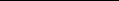

# 9.1 Flows in Poisson Graphs

## Table of Contents

- [Potts models and flows](#sec-9-9-1)
- [Exponential decay for the Ising model](#sec-9-9-3)
- [The Ising model in four and more dimensions](#sec-9-9-4)

Summary. The random-cluster partition function with integer q on a graph G may be transformed into the mean flow-polynomial of a ‘Poissonian’ random graph obtained from G by randomizing the numbers of edges between neighbouring pairs. This leads to a flow representation for the two-point Potts correlation function, and extends to general q the so-called ‘randomcurrent expansion’ of the Ising model. In the last case, one may derive the Simon–Lieb inequality together with largely complete solutions to the problems of exponential decay and the continuity of the phase transition. It is an open problem to adapt such methods to general Potts and random-cluster models.

## 9.1 Potts models and flows

The Tutte polynomialis a function of two variables (see Section 3.6). For suitable values of these variables, one obtains counts of colourings, forests, and flows, together with other combinatorial quantities, in addition to the random-cluster and Potts partition functions. The algebra of the Tutte polynomial may be used to obtain representations of the Potts correlation functions, which have in turn the potential to explain the decay of correlations in the two phases of an infinitevolume Potts measure. It is thus that many beautiful results have been derived for the Ising model (when $q$ = 2), see [3, 5, 9]. The cases q ∈ {3,4,. . .}, and more generally q ∈ (1,∞), remain largely unexplained. We summarize this methodology in this chapter, beginning with the definition of a flow on a directed graph.

Let H = (W, F) be a finite graph with vertex-set W and edge-set F, and let q ∈ {2,3,. . .}. We permit H to have multiple edges and loops. To each edge e ∈ F we allocate a direction, turning H thus into a directed graph denoted by H = (W, F). When the edge e = u,v ∈ F is directed from u to v, we write

e = [u,v for the corresponding directed edge1, and we speak of u as the tail and v as the head of e. It will turn out that the choices of directions are immaterial to the principal conclusions that follow. A function f : F → {0,1,2,. . .,q − 1} is called a mod-q flow on H if

(9.1)

f ( e) = 0 mod q, for all w ∈ W,

f ( e) −

e∈ F: e has head w

e∈ F: e has tail w

which is to say that flow is conserved (modulo q) at every vertex. A mod-q flow

f is called non-zero if f ( e) = 0 for all e ∈ F. We write CH(q) for the number of non-zero mod-q flows on H. It is standard (and an easy exercise) that CH(q) does not depend on the directions allocated to the edges of H, [313]. The function CH(q), viewed as a function of q, is called the flow polynomial of H.

The flow polynomialof H is an evaluation of its Tutte polynomial. Recall from Section 3.6 the (Whitney) rank-generating function and the Tutte polynomial,

- (9.2) ur(H′)vc(H′), u,v ∈ R,
- (9.3) TH(u,v) = (u − 1)|W|−k(H)WH (u − 1)−1,v − 1 ,

WH(u,v) =

F′⊆F

where r(H′) = |W| − k(H′) is the rank of the subgraph H′ = (W, F′), c(H′) = |F′| − |W| + k(H′) is its co-rank, and k(H′) is the number of its connected components (including isolated vertices). Note that

v|F′|(v/u)k(H′), u,v = 0.

(9.4) WH(u,v) = (u/v)|W|

F′⊆F

The flow polynomial of H satisfies (9.5) CH(q) = (−1)|F|WH(−1,−q)

= (−1)c(H)TH(0,1 − q), q ∈ {2,3,. . .}.

See[40, 313]. Whentheneedforadifferentnotationarises, weshallwriteC(H;q) for CH(q), and similarly for other polynomials.

e∈E

This differs slightly from (1.5)–(1.6) in that different edges e may have different interactions Je, and these interactions have been ‘re-parametrized’ by the factor q. The reason for defining πβJ,q thus will emerge in the calculations that follow.

We shall work often with the quantity qτβJ,q(x, y) = πβJ,q(qδσx,$\sigma_y$ − 1) and, for ease of notation in the following, we write

(9.9) σ(x, y) = qτβJ,q(x, y), x, y ∈ V,

thereby suppressing reference to the parameters βJ and q. Note that, for the Ising case with $q$ = 2, σ(x, y) is simply the mean of the product σxσy of the Ising spins at x and at y, see (1.7).

From the graph G = (V, E) we constructnext a certain random graph. For any vector m = (m(e) : e ∈ E) of non-negative integers, let Gm = (V, Em) be the graph with vertex set V and, for each e ∈ E, with exactly m(e) edges in parallel joining the endvertices of the edge e [the original edge e is itself removed]. Note that

(9.10) |Em| =

m(e).

e∈E

Let λ = (λe : e ∈ E) be a family of non-negative reals, and let P = (P(e) : e ∈ E) be a family of independent random variables such that P(e) has the Poisson distribution with parameter λe. We now consider the random graph GP = (V, EP), which we call a Poisson graph with intensity λ. Write Pλ and Eλ for the corresponding probability measure and expectation operator.

For x, y ∈ V, x = y, we denote by GxP,y the graph obtained from GP by adding an edge with endvertices x, y. If x and y are already adjacent in GP, we add exactly one further edge between them. Potts-correlations and flows are related by the following theorem2.

2The relationship between flows and correlation functions has been explored also in [112, 246, 247].

- (9.11) Theorem [146, 157]. Let q ∈ {2,3,. . .} and λe = β Je. Then
- (9.12) σ(x, y) =

Eλ(C(GxP,y; q)) Eλ(C(GP; q))

, x, y ∈ V.

This formula takes an especially simple form when $q$ = 2, since non-zero mod-2 flows necessarily take the value 1 only. A finite graph H = (W, F) is called even if the degree of every vertex w ∈ W is even. It is elementary that CH(2) = 1 (respectively, CH(2) = 0) if H is even (respectively, not even), and therefore

- (9.13) Eλ(CH(2)) = Pλ(H is even). By (9.12), for any graph G,
- (9.14) σ(x, y) =

Pλ(GxP,y is even) Pλ(GP is even)

,

when $q$ = 2. Observations of this sort have led to the so-called ‘randomcurrent’ expansion for Ising models, thereby after some work [3, 5, 9] yielding proofs amongst other things of the exponential decay of correlations in the hightemperature regime. We return to the case $q$ = 2 in Sections 9.2–9.4.

Whereas Theorem 9.11 concerns Potts models only, there is a random-cluster generalization. We restrict ourselves here to the situation in which every edge has the same parameter $p$, but we note that the result is easily generalized to allowing different parameters for each edge. Recall that φG,p denotes product measure on

\Omega = \{0,1\}^E with density p.

(9.15) Theorem [146, 157]. Let p ∈ [0,1) and $q$ ∈ (0,∞). Let λe = λ for all e ∈ E, where $p$ = 1 − e−λq.

(b) For q ∈ {2,3,. . .},

φG,p(qk(ω)) = (1 − p)|E|(q−2)/qq|V|Eλ(C(GP; q)). (9.18) When $q$ = 2, equation (9.18) reduces by (9.13) to

(9.19) φG,p(2k(ω)) = 2|V|Pλ(GP is even).

This may be simplified further. Let ζ(e) = P(e) modulo 2. It is easily seen that GP is even if and only if Gζ is even, and that the ζ(e), e ∈ E, are independent Bernoulli variables with

Pλ(ζ(e) = 1) = 21(1 − e−2λ) = 12 p. Equation (9.18) may therefore be written as (9.20) φG,p(2k(ω)) = 2|V|φG,p/2(the open subgraph of G is even). Proof ofTheorem 9.11. Since the parameter β appearsalways with the multiplicative factor Je, we may without loss of generality take β = 1.

= q|V|Eλ(C(GxP,y; q)), and (9.12) follows by (9.24) and (9.25). Proof of Theorem 9.15. This theorem may be proved directly, but we shall derive it from Theorem 9.11.

- (a) Equation (9.17) holds by Theorems 1.16 and 9.11. By (9.5), equation (9.16) holds for $q$ ∈ {2,3,. . .}. Since both sides are the ratios of polynomials in q and e−λq of finite order, (9.16) is an identity in q ∈ (0,∞).
- (b) This was noted after (9.24) above.

Ne = {i ∈ Me : Bi = 1}, e ∈ E. Let PM denote the appropriate probability measure.

The following technical lemma is pivotal for the computations that follow.

(9.31) Theorem. Let M and m be as above. If x, y ∈ V are such that x = y and x ↔ y in m then, for A ⊆ V,

PM ∂N = {x, y}, ∂(M \ N) = A = PM ∂N = ∅, ∂(M \ N) = A △ {x, y} .

Proof. Take Me to be the set of edges of Gm parallel to e, and assume that x ↔ y in m. Let A ⊆ V. Let M be the set of all vectors n = (ne : e ∈ E) with ne ⊆ Me for e ∈ E. Let α be a fixed path of Gm with endvertices x, y, viewed as a set of edges, and consider the map ρ : M → M given by

ρ(n) = n △ α, n ∈ M.

The map ρ is one–one, and maps {n ∈ M : ∂n = {x, y}, ∂(M \ n) = A} to {n′ ∈ M : ∂n′ = ∅, ∂(M \ n′) = A △ {x, y}}. Each member of M is equiprobable under PM, and the claim follows.

Let λ = (λe : e ∈ E) be a vector of non-negative reals, and recall the Poisson graph with parameter λ. The following is a fairly immediate corollary of the last theorem. Let M = (Me : e ∈ E) and M′ = (Me′ : e ∈ E) be vectors of disjoint finitesetssatisfying Me∩M′

f = ∅foralle, f ∈ E, andletme = |Me|, m′e = |Me′|, e ∈ E, beindependentrandomvariablessuchthateach meandm′e havethePoisson distribution with parameter λe. Let M ∪ M′ = (Me ∪ Me′ : e ∈ E), and write P for the appropriate probability measure. The following lemma is based on the so-called switching lemma of [3].

(9.32) Corollary (Switching lemma). If x, y ∈ V are such that x = y and x ↔ y in m + m′ then, for A ⊆ V,

P ∂M = {x, y}, ∂M′ = A M ∪ M′

= P ∂M = ∅, ∂M′ = A △ {x, y} M ∪ M′ , P-a.s.

Proof. Conditional on the sets Me ∪ Me′, e ∈ E, the sets Me are selected by the independent removal of each element with probability 21. The claim follows from Theorem 9.31.

We present two applications of Corollary 9.32 to the Ising model, as in [3]. For m = (me : e ∈ E) ∈ Z+E, let (9.33) ∂m = v ∈ V :

me is odd ,

e: e∼v

as in (9.30). In our study of the correlation functions τλ,2(x, y), we shall as before write

σ(x, y) = 2τλ,2(x, y) = πλ,2(2δσx,$\sigma_y$ − 1), x, y ∈ V.

By (9.29), (9.34) σ(x, y) =

Pλ(∂P = {x, y}) Pλ(∂P = ∅)

. Let QA denote the law of P conditional on the event {∂P = A}, that is, QA(E) = Pλ(P ∈ E | ∂P = A).

We shall require two independent copies P1, P2 of P with potentially different conditionings, and thus we write QA;B = QA × QB.

(9.35) Theorem [3]. Let x, y, z ∈ V be distinct vertices. Then:

σ(x, y)2 = Q∅;∅(x ↔ y in P1 + P2), σ(x, y)σ(y, z) = σ(x, z)Q{x,z};∅(x ↔ y in P1 + P2).

Proof. By (9.34) and Corollary 9.32,

Pλ × Pλ(∂P1 = {x, y}, ∂P2 = {x, y}) Pλ(∂P = ∅)2

σ(x, y)2 =

Pλ × Pλ(∂P1 = {x, y}, ∂P2 = {x, y}, x ↔ y in P1 + P2) Pλ(∂P = ∅)2

=

Pλ × Pλ(∂P1 = ∅, ∂P2 = {x, z}, x ↔ y in P1 + P2) Pλ(∂P = ∅)2

=

Pλ(∂P2 = {x, z}) Pλ(∂P = ∅) · Pλ × Pλ x ↔ y in P1 + P2 ∂P1 = ∅, ∂P2 = {x, z}

=

= σ(x, z)Q{x,z};∅(x ↔ y in P1 + P2).

Theorem9.35 leads to an importantcorrelationinequalityknown as the ‘Simon inequality’. Let x, z ∈ V be distinct vertices. A subset W ⊆ V is said to separate x and z if x, z ∈/ W and every path from x to z contains some vertex of W.

y∈W

y∈W

= Q{x,z};∅ |{y ∈ W : x ↔ y in P1 + P2}| .

Assume that the event ∂P1 = {x, z} occurs. On this event, x ↔ z in P1 + P2. Since W separates x and z, the set {y ∈ W : x ↔ y in P1 + P2} is non-empty on this event. Therefore, its mean cardinality is at least one under the measure Q{x,z};∅, and the claim follows.

The Ising model on G = (V, E) corresponds as described in Chapter 1 to a

random-cluster measure φG,p,q with $q$ = 2. By Theorem 1.10, if λe = λ for all e, σ(x, y) = 2τλ,2(x, y) = φG,p,q(x ↔ y),

where $p$ = 1−e−λq and $q$ = 2. Therefore, the Simon inequality3 may be written in the form

(9.37) φG,p,q(x ↔ z) ≤

φG,p,q(x ↔ y)φG,p,q(y ↔ z)

y∈W

whenever W separates x and z. It is a curious fact that this inequality holds also when $q$ = 1, as noticed by Hammersley [177]; see [154, Chapter 6]. It may be conjectured that it holds whenever q ∈ [1,2].

The Simon inequality has an important consequence for the random-cluster model with $q$ = 2 on an infinite lattice, namely that the two-point correlation function decays exponentially whenever it is summable. Let φp,q be the randomcluster measure on Ld where d ≥ 2. We shall consider only the case $p$ < pc(q), and it is therefore unnecessary to mention boundary conditions.

(9.38) Corollary [300]. Let d ≥ 2, $q$ = 2, and let p be such that (9.39)

φp,q(0 ↔ x) < ∞.

x∈Zd

3In association with related inequalities of Hammersley [177] and Lieb [234], see Theorem 9.44(b), this is an example of what is sometimes called the Hammersley–Simon–Lieb inequality. The Simon inequality is a special case of the Boel–Kasteleyn inequalities, [56, 57].

for x, z ∈ Zd and any finite separating set W. By (9.39), there exists c ∈ (0,1) and N ≥ 1 such that

φp,q(0 ↔ x) < c.

x∈∂ N

For any integer k > 1 and any vertex z ∈ ∂ kN, we have by progressive use of (9.40) and the translation-invariance of φp,q (see Theorem 4.19(b)) that

φp,q(0 ↔ z) ≤

φp,q(0 ↔ x1)φp,q(x1 ↔ z)

x1: x1 =N

φp,q(0 ↔ x1)φp,q(x1 ↔ x2)φp,q(x2 ↔ z)

≤

x2: x2−x1 =N

x1: x1 =N

φp,q(0 ↔ x1)···φp,q(xk−1 ↔ xk)φp,q(xk ↔ z)

≤

···

x1: x1 =N

xk: xk−xk−1 =N

≤ ck. Therefore, there exists g > 0 such that

φp,q(0 ↔ z) ≤ e− z g if z is a multiple of N. More generally, let z ∈ Zd and write z = kN + l where 0 ≤ l < N. By (9.40),

φp,q(0 ↔ x)φp,q(x ↔ z) ≤ e−kNg.

φp,q(0 ↔ z) ≤

x: x =kN

Furthermore, φp,q(0 ↔ z) < 1 for z = 0, and the claim follows.

We close this section with an improvementof the Simon inequality due to Lieb [234]. This improvement may seem at first sight to be slender, but it leads to a significant conclusion termed the ‘vanishing of the mass gap’.

We first re-visit Theorem 9.31. As usual, G = (V, E) is a finite graph, and we partition E as E = F ∪ H, where F ∩ H = ∅. Let M = (Me : e ∈ E) be a vector of disjoint finite sets with cardinalities me = |Me|. We write MF = (Me : e ∈ F) and define the vector mF by

me if e ∈ F, 0 otherwise,

meF =

and similarly for MH and mH. It is elementary that m = mF + mH, and that the sets of sources of MF and MH are related by

(9.41) ∂MF △ ∂MH = ∂M.

As before Theorem 9.31, we select subsets Ne from the Me by deleting each member independentlyat random with probability 21. For given M, the associated probability measure is denoted by PM.

(9.42) Theorem. Let F, H, M, and m be as above. If x, y ∈ V are such that x = y and x ↔ y in mF then, for A ⊆ V,

PM ∂NF = {x, y}, ∂NH = ∅, ∂(M \ N) = A

= PM ∂NF = ∅, ∂NH = ∅, ∂(M \ N) = A △ {x, y} .

Proof. This follows that of Theorem 9.31. Let α be a fixed path of GmF with endvertices x and y, and consider the map ρ(n) = n △ α, n ∈ M. This map is a one–one correspondence between the two subsets of M corresponding to the two events in question.

We obtain as in the switching lemma, Corollary 9.32, the following corollary involving the two independent random vectors M and M′, each being such that me = |Me| and m′e = |Me′| have the Poisson distribution with parameter λ ∈ [0,∞). The proof follows that of Corollary 9.32.

(9.43) Corollary. Let E be partitioned as E = F ∪ H. If x, y ∈ V are such that x = y and x ↔ y in mF + m′F then, for A ⊆ V,

P ∂MF = {x, y}, ∂MH = ∅, ∂M′ = A M ∪ M′

= P ∂MF = ∅, ∂MH = ∅, ∂M′ = A △ {x, y} M ∪ M′ , P-a.s.

Let P1 and P2 be independent copies of the Poisson field P, with intensity λ ∈ [0,∞), and let E be partitioned as E = F ∪ H. We write QA,B;C for the probability measure governing the pair P1, P2 conditional on the event {∂P1F = A} ∩ {∂P1H = B} ∩ {∂P2 = C}. We recall from (9.28) that σ(x, y) denotes a certain correlation function associated with the graph G = (V, E), and we write σ F(x, y) for the quantity defined similarly on the smaller graph (V, F).

n→∞

asinTheorem5.45. Itisclearthatψ(p,q)isnon-increasingin p,andψ(p,q) = 0 if $p$ > pc(q). One of the characteristics of a first-order phase transition is the (strict) exponentialdecay of free-boundary-conditionconnectivityprobabilities at the critical point, see Theorems 6.35(c) and 7.33.

(9.46) Theorem (Vanishing mass gap) [234]. Let $q$ = 2. Then ψ(p,q) decreases to 0 as p ↑ pc(q). In particular, ψ(pc(q),q) = 0.

Itfollowsthat, if(9.45)holdsforsome p ∈ (ǫ,1−ǫ), thenitholdsforsome p′ > p. That is, if φp,q(0 ↔ z) decays exponentially as z → ∞, then the same holds for some p′ satisfying p′ > p. The set {p ∈ (0,1) : ψ(p,q) > 0} is therefore open. Since ψ(p,q) = 0 for $p$ > pc(q), we deduce that ψ(pc(q),q) = 0.

By Theorem 4.28(c) and the second inequality of (5.46), ψ(p,q) is the limit from above of upper-semicontinuous functions of p. Therefore, ψ(p,q) is itself upper-semicontinuous, and hence left-continuous.

Could some of the results of this section be valid for more general values of $q$ than simply $q$ = 2? It is known that the mass gap vanishes when $q$ = 1, [154, Thm 6.14], and does not vanish for sufficiently large values of $q$ (and any d ≥ 2),

[9.2] Flows for the Ising model 271

see [224] and Section 7.5. Therefore, Theorem 9.44(b) is not generally true for large q. It seems possible that the conclusions hold for sufficiently small q, but this is unproven.

One may ask whether the weaker Simon inequality, Corollary 9.36, might hold for more generalvalues of q. The followingexamplewould need to be assimilated in any such result.

- (9.47) Example4. Let G = (V, E) be a cycle of length m, illustrated in Figure 9.2. We work with the partition function
- (9.48) Y =

(α/Q)k + (α/Q)l + (q − 2)(α/Q)m 1 + (q − 1)(α/Q)m

=

.

Figure 9.2. A cycle of length 8 with four marked vertices.

- (q − 2)

- O(α12).

α Q

α Q

- O(α8), j = 1,2.

- O(α8)

- 4

- O(α10).

[9.3] Exponential decay for the Ising model 273

## 9.3 Exponential decay for the Ising model

In the remaining two sections of this chapter, we review certain aspects of the mathematics of the Ising model in two and more dimensions. Several of the outstandingproblemsforPottsandrandom-clustermodelshave rigoroussolutions in the Ising case, when $q$ = 2, and it is a challenge of substance to extend such results (where valid) to the case of general q ∈ [1,∞). Our account of the Ising model will be restricted to the work of Aizenman, Barsky, and Fernandez´ as reported in two major papers [5, 9], of which we begin in this section with the first. The principal technique of these papers is the so-called ‘random-current representation’, that is, the representation of the Ising random field in terms of non-zero mod-2 flows. See, for example, the representation (9.28) for the twopoint correlation function. Without more ado, we state the main theorem in the language of the random-cluster model.

### (9.53) Theorem (Finite susceptibility for $q$ = 2 random-cluster model) [5].

Let p ∈ [0,1], $q$ = 2, d ≥ 2, and let φp1,q be the wired random-cluster measure on Ld. The open cluster C at the origin satisfies

φp1,q(|C|) < ∞, $p$ < pc(q).

This implies exponential decay, by Theorem 9.38: if $p$ < pc(q), the connectivity function φp1,q(0 ↔ z) decays exponentially to zero as z → ∞. When d = 2, it implies that pc(2) =

√2), see Theorem 6.18.

√2/(1 +

- (9.54)Theorem(Mean-fieldbound)[5]. UndertheconditionsstatedinTheorem 9.53, there exists a constant c = c(d) > 0 such that the percolation probability θ1(p,q) = φp1,q(0 ↔ ∞) satisfies
- (9.55) θ1(p,2) ≥ c(p − pc)12, $p$ > pc = pc(2).

Throughtheuseofscalingtheory(see[154,Chapter9]), one isledtopredictions concerningtheexistenceofcriticalexponentsforquantitiesexhibitingsingularities at the critical point pc(q). It is believed in particular that the function θ(·,2) possesses a critical exponent5 in that there exists b ∈ (0,∞) satisfying

(9.56) θ1(p,2) = |p − pc|b(1+o(1)) as p ↓ pc = pc(2).

If this is true, then b ≤ 21 by Theorem 9.54. It turns out that the latter inequality is sharp in the sense that, when d ≥ 4, it is satisfied with equality; see Theorem

9.58. Thevalueb = 21 isin additionthe‘mean-field’valueofthecriticalexponent,

5We write b rather than the more usual β for the critical exponent associated with the percolation probability, in order to avoid duplication with the inverse-temperature of the Ising model.

274 Flows in Poisson Graphs [9.4]

as we shall see in Section 10.7 in the context of the random-cluster model on a complete graph.

Proofs of the above theorems may be found in [5], and are omitted from the current work since they are Ising-specific and have not (yet) been generalized to the random-clustersetting for general q. The key ingredientis the random-current representation of the last section, utilized with ingenuity.

Using an analysis presented in [4] for percolation, the three inequalities above imply Theorem 9.54.

## 9.4 The Ising model in four and more dimensions

Just as two-dimensionalsystems have special properties, so there are special arguments valid when the number d of dimensions is sufficiently large. For example, percolation in 19 and more dimensions is rather well understood through the work of Hara and Slade and others, [23], [154, Section 10.3], [179, 303], using the so-called ‘lace expansion’. One expects that results for percolation in high dimensions will be extended in due course to d > 6, and even in part to d ≥ 6. Key to this work is the so-called ‘triangle condition’, namely that T(pc) < ∞ where pc = pc(1) and

φp(0 ↔ x)φp(x ↔ y)φp(y ↔ 0).

T(p) =

x,y∈Zd

The situation for the Ising model, and therefore for the $q$ = 2 random-cluster model, is also well understood,but this time underthe considerablyless restrictive

[9.4] The Ising model in four and more dimensions 275

assumption that d ≥ 4. The counterpart of the triangle condition is the ‘bubble condition’,namelythat B(βc) < ∞ where, in theusualnotationofthe Isingmodel without external field,

σ0 $\sigma_x$ 2.

B(β) =

x∈Zd

In the language of the random-clustermodel with $p$ = 1−e−β, the corresponding quantity is

φp0,2(0 ↔ x)2.

B(β) =

x∈Zd

Once again, one introduces an external field and then establishes a differential inequality via the random-current representation. We state the main result in the language of the random-cluster model.

(9.58) Theorem (Critical exponent for $q$ = 2 random-cluster model) [9]. Let $q$ = 2 and d ≥ 4. We have that

θ1(p,q) = (p − pc)21(1+o(1)) as p ↓ pc = pc(2).

Thus, the critical exponent b exists when d ≥ 4, and it takes its ‘mean-field’

value b = 21. This implies in particular that the percolation probability θ1(p,2) is a continuous function of p at the critical value pc(2). Continuity has been proved by classical methods in two dimensions6, and there remains only the d = 3 case for which the continuity of θ1(·,2) is as yet unproved. In summary, it is proved when d = 3 that the phase transition is of second order, and this is believed to be so when d = 3 also.

Similarly to the results of the last section, Theorem 9.58 is proved by an analysis of the model parametrized by the two variables β, h. This yields several further facts including an exact critical exponent for the behaviour of the Ising magnetization M(β,h) with β = βc and h ↓ 0, namely

M(βc,h) = h 13(1+o(1)) as h ↓ 0.

We refer the reader to [5, 9] for details of the random-current representation in practice, for proofs of the above results and of more detailed asymptotics, and for a more extensive bibliography. The random-current representation is a key ingredient in the derivation of a lace expansion for the Ising model with either nearest-neighbour or spread-out interactions, [288]. This has led to asymptotic formulaeforthetwo-pointcorrelationfunctionwhen d > 4. Abroaderperspective on phase transitions may be found in [118].

6Note added at reprinting: a probabilistic proof can be found in [329, 330].

