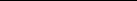
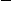

# 10. On Other Graphs

## Table of Contents

- [Mean-field theory](#sec-10-10-1)
- [On complete graphs](#sec-10-10-2)
- [Main results for the complete graph](#sec-10-10-3)
- [The size of the largest component](#sec-10-10-5)
- [Proofs of main results for complete graphs](#sec-10-10-6)
- [The nature of the singularity](#sec-10-10-7)
- [Large deviations](#sec-10-10-8)
- [The critical point for a tree](#sec-10-10-10)
- [(Non-)uniqueness of measures on trees](#sec-10-10-11)
- [On non-amenable graphs](#sec-10-10-12)

Summary. Exact solutions are known for the random-cluster models on complete graphs and on regular trees, and these provide theories of meanfield-type. There is a special argument for the complete graph which utilizes the theory of Erdos–R˝ enyi´ random graphs, and leads to exact calculations valid for all values of $q$ ∈ (0, ∞). The transition is of first order if and only if $q$ ∈ (2, ∞). The (non-)uniqueness of random-cluster measures on a tree, when subject to a variety of boundary conditions, may be studied via an iterative formula permitting exact calculations of the critical value and the percolation probability. There is a discussion of the random-cluster model on a general non-amenable graph.

## 10.1 Mean-field theory

The theory of phase transitions addresses primarily singularities associated with spaces of finite dimension. There are two reasons for considering a ‘mean-field’ theory in which the number d of dimensions may be considered to take the value ∞. Firstly, the major problemsconfrontingthe mathematicslie in the geometrical constraints imposed by finite-dimensional Euclidean space; a solution for ‘infinite dimension’ can cast light on the case of finite dimension. The second reason is the desire to understand better the d-dimensional process in the limit of large d. One is led thus to the problems of establishing the theory of a process viewed as ∞-dimensional, and to proving that this is the limit in an appropriate sense of the d-dimensional process. Progress is well advanced on these two problems for percolation (see [154, Chapter 10]) but there remains much to be done for the random-cluster model.

Being informed by progress for percolation, it is natural to consider as meanfield modelsthe random-clustermodelsoncomplete graphsand on an infinite tree. In the formercase, we consider the modelon the complete graph Kn on n vertices, and we pass to the limit as n → ∞. The vertex-degrees tend to ∞ as n → ∞, and some re-scaling is done in order to establish a non-trivial limit. The correct

way to do this is to set $p$ = λ/n for fixed λ > 0. The consequent theory may be regarded as an extension of the usual Erdos–R˝ enyi´ theory of random graphs, [61, 194]. This model is expounded in Section 10.2. The main results are described in Section 10.3, and are proved in Sections 10.4–10.6. The nature of the phase transition is discussed in Section 10.7, and the consequences for large deviations of cluster-counts are presented in Section 10.8. The principal reference1 is [62], of which heavy use is made in this chapter.

The random-cluster model on a finite tree is essentially trivial. Owing to the absenceofcircuits,arandom-clustermeasurethereonissimplyaproductmeasure. The tree is a more interesting setting when it is infinite and subjected to boundary conditions. There is a continuum of random-cluster measures indexed by the set of possible boundaryconditions. The present state of knowledgeis summarizedin Sections 10.9–10.11. The relevant references are [160, 167, 196] but the current treatment is fundamentally different.

Trees are examples of graphs whose boxes have surface/volumeratios bounded away from 0. Such graphs are termed ‘non-amenable’ and, subject to further conditions, they may have three phases rather than the more usual two. A brief account of this phenomenon may be found in Section 10.12.

## 10.2 On complete graphs

Thus, for any given n, p, q, the measure φn,p,$q$ is the law of a random graph with n verticeswhich we denoteby Gn,p,q. We sometimeswrite φn,p,q(F) as φV,p,q(F).

1The random-cluster model on the complete graph is related to the ‘first-shell’ model of Whittle, [317, 318].

Itwillturn outthatthe proportionofverticesinthelargestcomponentisroughly constant, namely θ(λ,q), for large n. It is convenient to introduce a definition of θ immediately, namely

0 if λ < λc(q), θmax if λ ≥ λc(q),

(10.5) θ(λ,q) =

where θmax is the largest root of the equation (10.6) e−λθ =

1 − θ 1 + (q − 1)θ

. The roots of (10.6) are illustrated in Figure 10.2.

We note some of the properties of θ(λ,q). Firstly, θ(λ,q) > 0 if and only if either: λ > λc(q), or: λ = λc(q) and $q$ > 2,

see Lemma 10.12. Secondly, for all q ∈ (0,∞), θ(λ,q) is non-decreasing in λ, and it follows that θ(·,q) is continuous if $q$ ∈ (0,2], and has a unique (jump) discontinuity at λ = λc(q) if $q$ ∈ (2,∞). This jump discontinuity corresponds to a phase transition of first order.

We say that ‘almost every (a.e.) Gn,p,q satisfies property ’, for a given sequence $p$ = pn and a fixed q, if

φn,p,q(Gn,p,q has ) → 1 as n → ∞. We summarize the main results of the following sections as follows. (a) If 0 < λ < λc(q) and $q$ ∈ (0,∞), then almost every Gn,λ/n,q has largest component of order log n.

- (b) If λ > λc(q) and $q$ ∈ (0,∞), then almost every Gn,λ/n,q consists of a ‘giant component’ of order θ(λ,q)n, together with other components of order log n or smaller.
- (c) If λ = λc(q) and $q$ ∈ (0,2], then almost every Gn,λ/n,q has largest component of order n2/3.

The behaviourof Gn,λ/n,q with q ∈ (2,∞) and λ = λn → λc(q)has been studied further in the combinatorial analysis of [238].

There are two main steps in establishing the abovefacts. The first is to establish the relation (10.6) by studying the size of the largestcomponentof Gn,λ/n,q. When q ∈ (2,∞), (10.6) has three solutions for large λ, see Figure 10.2. In order to decide which of these is the density of the largest component, we shall study the number of edges in Gn,λ/n,q. That is to say, we shall find the function ψ(λ,q) such that almost every Gn,λ/n,q has (order) ψ(λ,q)n edges. It will turn out that the function ψ(·,q) is discontinuous at the critical point of a first-order phase transition.

The material presented here for the random-cluster model on Kn is taken from [62]. See also [238].

[10.3] Main results for the complete graph 281

## 10.3 Main results for the complete graph

Let q ∈ (0,∞) and $p$ = λ/n where λ is a positive constant. For ease of notation, we shall sometimes suppress explicit reference to q. We shall make heavy use of the critical value λc(q) given in (10.4), and the function θ(λ) = θ(λ,q) defined in (10.5)–(10.6). The properties of roots of (10.6) will be used in some detail, but these are deferred untilLemma 10.12. For the momentwe note only that θ(λ) = 0 if and only if: either λ < λc(q), or λ = λc(q) and $q$ ≤ 2.

Therearethreeprincipaltheoremsdealingrespectivelywith the subcriticalcase λ < λc(q), the supercritical case λ > λc(q), and the critical case λ = λc(q). In the matter of notation, for a sequence (Xn : n = 1,2,. . .) of random variables, we write Xn = Op( f (n)) if Xn/f (n) is bounded in probability:

P |Xn| ≤ f (n)ω(n) → 1 as n → ∞

for any sequence ω(n) satisfying ω(n) → ∞ as n → ∞. Similarly, we write Xn = op( f (n)) if Xn/f (n) → 0 in probability as n → ∞:

P |Xn| ≤ f (n)/ω(n) → 1 as n → ∞ for some sequence ω(n) satisfying ω(n) → ∞. Convergence in probability is denoted by the symbol →P .

(d) The number of edges in Gn,λ/n,$q$ is λn/(2q) + op(n).

### (10.8) Theorem (Supercritical case) [62]. Let q ∈ (0,∞) and λ > λc(q).

- (a) Almost every Gn,λ/n,q consists of a giant component, trees, and unicyclic components.
- (b) The number of vertices in the giant component is θ(λ)n + op(n), and the number of edges is

1 + (q − 1)θ(λ)2 n + op(n).

### (10.9) Theorem (Critical case) [62]. Let q ∈ [1,2] and λ = λc(q).

(a) Almost every Gn,λ/n,q consists of trees, unicyclic components, and Op(1)

components with more than one cycle. (b) The largest component has order op(n). (c) The total number of vertices in unicyclic components is Op(n2/3). (d) The largest tree has order Op(n2/3).

More detailed asymptotics are available for Gn,λ/n,q by lookingdeeperinto the proofs. The last theorem has been extendedto the cases q ∈ (0,1) and $q$ ∈ (2,∞) in [238], where a detailed combinatorial analysis has been performed.

The giant component, when it exists, has orderapproximatelyθ(λ)n, with θ(λ) given by (10.5)–(10.6). We study next the roots of (10.6). Note first that θ = 0 satisfies (10.6) for all λ and $q$, and that all strictly positive roots satisfy 0 < θ < 1. Let

1 θ

log{1 + (q − 1)θ} − log(1 − θ) , θ ∈ (0,1),

(10.10) f (θ) =

and note that θ ∈ (0,1) satisfies (10.6) if and only if f (θ) = λ. Here are two elementary lemmas concerning the function f .

(10.11)Lemma. Thefunction f isstrictlyconvexon(0,1),andsatisfies f (0+) = q and f (1−) = ∞.

(a) If q ∈ (0,2], the function f is strictly increasing. (b) If q ∈ (2,∞), there exists θmin ∈ (0,1) such that f is strictly decreasing

on (0,θmin) and strictly increasing on (θmin,1).

Proof. If t > −1 then (1 + tθ)−1 is a strictly convex function of θ on (0,1). Hence, the function

q−1

f (θ) =

= q + 21q(2 − q)θ + O(θ2),

[10.4] The fundamental proposition 285

Therefore, the probability that the red graph is (V1, E1) and the green graph is (V2, E2) equals

p|E1∪E2|(1 − p)(n2)−|E1∪E2|qk(V,E1∪E2) Zn,p,q

rk(V1,E1)(1 − r)k(V2,E2)

= cφV1,p,rq(E1)φV2,p,(1−r)q(E2),

for some positive constant c = c(n, p,q,n1). Hence, conditional on R = V1 and the green subgraph being (V2, E2), the probability that the red subgraph is (V1, E1) is precisely φV1,p,rq(E1).

In this context, we shall write N rather than n1 for the (random) number of red vertices. Thus N is a random variable, and GN,p,rq is a random graph on a random number of vertices.

If q ∈ [1,∞) and r = q−1, the red subgraph is distributed as GN,p. Much is known about such a random graph, see [61, 194]. By studying the distribution of N and using known facts about GN,p, one may deduce much about the structure of Gn,p,q. Similarly, in order to study the random-cluster model with q ∈ (0,1), one applies Proposition 10.16 to Gn,p with r = q, obtaining that the red subgraph is distributed as GN,p,q. By using known facts about Gn,p, together with some distributional propertiesof N, we may derive results for Gm,p,q with m large. The details of the q ∈ (0,1) case are omitted but may be found in [62].

Here is a corollary which will be of use later.

(10.17) Lemma. Let q ∈ [1,∞). For any sequence $p$ = pn, almost every Gn,p,q has at most one component with order at least n3/4.

Proof. Let L = L(G) be the number of components of a random graph G having order at least n3/4. Suppose L ≥ 2, and pick two of these in some arbitrary way. With probability r2 both of these are coloured red. Setting r = q−1, we find by [61, Thm VI.9] that

r2φn,p,q(L ≥ 2) ≤

φm,p,1(L ≥ 2)φn,p,q(|R| = m)

n3/4≤m≤n

≤ max

φm,p,1(L ≥ 2)

n3/4≤m≤n

→ 0 as n → ∞.

## 10.5 The size of the largest component

We assume henceforth that q ∈ [1,∞). Let nn denote the number of vertices in the largest component of Gn,λ/n,q, and note that 0 < n ≤ 1. If two or more ‘largest components’ exist, we pick one of these at random. All other components are called ‘small’ and, by Lemma 10.17, all small components of almost every Gn,λ/n,q have orders less than n3/4.

ConsiderthecolouringschemeofProposition10.16withr = q−1, andsuppose that Gn,λ/n,q has components of order nn,ν2,ν3,. . .,νk where k is the total number of componentsand we shall assume that νi ≤ n3/4 for i ≥ 2. The number of red vertices in the small components has conditional expectation

k

νir = r(1 − n)n

i=2

and variance

k

k

νi2 ≤ n max

νi ≤ n7/4.

νi2r(1 − r) ≤

i≥2

i=2

i=2

Hence, there is a total ofr(1− n)n+op(n) red vertices in the small components.

Since the largest component may or may not be coloured red, there are two possibilities for the red graph:

(i) with probability r, it has

nn + r(1 − n)n + op(n) = [r + (1 − r) n]n + op(n) vertices, of which nn belong to the largest component,

(ii) with probability 1 − r, it has r(1 − n)n + op(n) vertices, and the largest component has order less than n3/4.

In the first case, the red graph is distributed as a supercritical Gn′,λ′/n′ graph, and in the second case as a subcritical Gn′′,λ′′/n′′ graph. Here, n′ and n′′ are random integers and, with probability tending to 1, λ′ = n′ $p$ > 1 > λ′′ = n′′ p. This leads to the next lemma.

(10.18) Lemma. If λ > q ≥ 1, there exists θ0 > 0 such that n ≥ θ0 for almost every Gn,λ/n,q. Proof. The assertionis wellknownwhen $q$ = 1, see forexample[61, ThmVI.11]. Therefore, we may assume $q$ > 1 and thus r < 1.

Let θ0 = (λ−q)/(2λ), πn = φn,p,q( n < θ0), and ǫ > 0. By considering the event that the largest component is not coloured red, we find that, with probability at least (1 − r)πn + o(1), the number N of red vertices satisfies

N ≥ r(1 − θ0)n − ǫn,

[10.5] The size of the largest component 287

for ǫ sufficiently small, and we pick ǫ accordingly. Conditional on the value N, almost every GN,p has a component of order at least δN (≥ δn/λ by (10.19)) for some δ > 0. Therefore, (1 − r)πn → 0 as n → ∞.

for the random graph Gn,pn and any sequence (pn). Applying this to the red subgraph, on the event that it contains the largest component of Gn,λ/n,q, we obtain for general q ∈ [1,∞) that

n N − 1 + op(1)

e−λ n + r + (1 − n r) n − 1 = e−p nn + n

→P 0 as n → ∞, where N is the number of red vertices. The claim follows.

Combining these lemmas, we arrive at the following theorem. (10.21) Theorem [62].

(a) If q ∈ [1,2] and λ ≤ q, or if $q$ ∈ (2,∞) and λ < λmin where λmin is given in Lemma 10.12(b), then n →P 0 as n → ∞. (b) Ifq ∈ [1,∞)and λ > q, then n →P θ(λ)where θ(λ)isthe unique (strictly) positive solution of (10.6).

This goes some way towards proving Theorems 10.7–10.8. Overlooking for the moment the more detailed asymptotical claims of those theorems, we note that the major remaining gap is when q ∈ (2,∞) and λmin ≤ λ ≤ q. In this case, by Lemma 10.20, n is approximately equal to one of the three roots of (10.6)

(including the trivial root θ = 0). Only after the analysis of the next two sections shall we see which root is the correct one for given λ.

Proof. The function

φn,p,q n ∈ Z + (−ǫ,ǫ) → 1 as n → ∞.

Under the assumption of (a), Z contains the singleton 0, and the claim follows. Under(b), Z containsa uniquestrictly positivenumberθ(λ), andthe claim follows by Lemma 10.18.

We turn now to the number of edges in the largest component. Let nn denote the number of edges of Gn,p,q. We pick one of its largest components at random, and write nn forthe numberof its edges. Let q ∈ (1,∞). Arguingas in Sections 10.4–10.5with r = q−1, almost every Gn,p,q has at most n3/4 edges in each small component (a ‘small’ component is any component except the largest, picked above)2. Furthermore, the total number of red edges in the small components is r( n − n)n + op(n). Hence, the red subgraph has either:

(i) with probability r, [ n + r(1 − n)]n + op(n) vertices and [ n + r( n − n)]n + op(n) edges, or (ii) otherwise, r(1 − n)n + op(n) vertices and r( n − n)n + op(n) edges. Assume that $p$ = O(n−1). Since almost every GN,p has

N 2

p + Op(Np1/2) = 21 N2 p + op(N) edges, the following two equations follow from the two cases above,

(10.22) n + r( n − n) n = 21 n + r(1 − n) 2n2 p + op(n), (10.23) r( n − n)n = 21[r(1 − n)]2n2 p + op(n), yielding when $p$ = λ/n that

(10.24) n + r( n − n) = 21λ n + r(1 − n) 2 + op(1), (10.25) r( n − n) = 21λ[r(1 − n)]2 + op(1). We solve for n and n, and let n → ∞ to obtain the next theorem.

2One needs here the corresponding result for $q$ = 1, which follows easily from the corresponding result for the number of vertices used above, together with results on the components having more edges than vertices given in [61, 192, 193].

Whereas we proved this theorem under the assumption that $q$ > 1, its conclusions are valid for $q$ = 1 also, by [61, Thms VI.11, VI.12].

## 10.6 Proofs of main results for complete graphs

The results derivedso far are combinednextwith a newargumentin orderto prove Theorems 10.7–10.9 for $q$ ∈ [1,∞). The results are well known when $q$ = 1 (see [61, Chapters V, VI] and [239]), and we assume henceforth that q ∈ (1,∞). The acyclic part of a graph is the union of all components that are trees, and the cyclic part is the union of the remaining components. A graph is called cyclic if its acyclic part is empty. We begin by showing that the cyclic part of almost every Gn,λ/n,q consists principally of the largest componentonly (when this component is cyclic).

(10.29) Lemma. The numbers of vertices and edges in the small cyclic components of Gn,λ/n,q are op(n).

Proof. Let k be an integer satisfying k ≥ q. In the colouring scheme of Section 10.4 with r = q−1, we introduce the refinement that each component is coloured dark red with probability k−1 and light red with probability r − k−1. Let M be the number of edges in the small cyclic components of Gn,λ/n,q.

φn,p,q(Mi ≥ M/k for some i) < 1, in contradiction of the equality ki=1 Mi = M.

Therefore, with probability at least r/k, the red subgraph contains the largest componenttogetherwith smallcyclic componentshavingatleast M/k edges. The result now follows from the known case $q$ = 1, see [60], [61, Thm VI.11].

Let Pn,p,q(m, j,k,l) be the sum of Pn,p,q(F) over edge-sets F that define a graph with |F| = m edges and a cyclic part with j components, k vertices, and l

edges. Since such graphs have an acyclic part with n −k vertices and m −l edges, and therefore n − k − m + l components, we obtain (10.30)

n k

c(j,k,l) f (n − k,m − l)pm(1 − p)(n2)−mqn−k−m+l+j

Pn,p,q(m, j,k,l) =

See (10.27) and (10.28). If λ > q, we assume also that θ > 0, see Lemma 10.18 and Theorem 10.21(b).

θ θ + r(1 − θ)

(10.40) , l n1 → ξ1 =

j (10.41) n1 → 0. It is easy to check the analogues of (10.6) and (10.32)–(10.33), namely,

ξ θ + r(1 − θ)

,

(10.42) e−λ1θ1 = 1 − θ1, ξ1 = λ1θ1(1 − 12θ1), ψ1 = ξ1 + 21λ1(1 − θ1)2. Now, (10.36) is valid with $q$ = 1, since θ > 0. Hence, (10.43) 1 ≥ Pn1,p1,1(m1, j,k,l)

for all large n. Combining this with (10.43), equality follows in (10.44) for some suitable j,k,l.

[r(1 − θ)]r(1−θ) (1 − θ)1−θ[θ + r(1 − θ)]θ+r(1−θ)

=

1 + (q − 1)θ 1 − θ

n→∞

q(q − 1)[q − 2 − 2(q − 1)θ]θ (1 − θ)2[1 + (q − 1)θ]2

g′′(θ) = −

.

3We shall see that there is a unique such θ∗, except possibly when λ = λc(q) and $q$ > 2.

[10.7] The nature of the singularity 295

Therefore, g′′(θ) has a unique zero in (0,1), at the point θ = 21(q − 2)/(q − 1). At this point, g′(θ) has a negative minimum. It follows that g(θ) < 0 on (0,θ0), and g(θ) > 0 on (θ0,1) where θ0 = (q − 2)/(q − 1).

and, for this value of λ, the three roots of (10.6) are 0, 12θ0, θ0. Therefore, λmin < λc(q) < q, and

θ∗ =

0 if λ < λc(q), θmax(λ) if λ > λc(q).

This completes the proof of the assertions concerning the order of the largest component. The claims concerning the numbers of edges in Gn,p,q and in the largest component follow by Theorem 10.26. Proofs of the remaining assertions about the structure of Gn,p,q are omitted, but may be obtained easily using the colouring argument and known facts for Gn,p, see [61, 239].

## 10.7 The nature of the singularity

It is an important problem of statistical physics to understand the nature of the singularity at a point of phase transition. For the mean-field random-clustermodel on a complete graph, the necessary calculations may be performed explicitly, and the conclusions are as follows.

θ(λ) + (12q − 1)θ(λ)2 ,

describingthe orderof the giantcomponent,and the numbers of edgesin the graph and in its giant component, respectively. All three functions are non-decreasing on (0,∞). In addition, ψ is strictly increasing, while θ(λ) and ξ(λ) equal 0 for λ < λc and are strictly increasing on [λc,∞).

A fourth function of interest is the pressure η(λ) given in Theorem 10.14. These four functions are real-analytic on (0,∞) \ {λc}. At the singularity λc, the following may be verified with reasonable ease.

(a) Let q ∈ [1,2). Then θ, ψ, ξ, and η are continuous at the point λc(q) = q. The functions θ and ξ have discontinuous first derivatives at λc, with

2 q(2 − q)

- 1

- 2 as λ ↓ λc.

θ(λ) ∼ ξ(λ) ∼ 2 3(λ − λc)

Thus, θ′(λc+) = ξ′(λc+) = ∞. The function ψ′ has a jump at λc in that ψ′(λc−) = 41, ψ′(λc+) = 1. Also, η′ is continuous, but η′′ has a jump at λc in that η′′(λc−) = 0, η′′(λc+) = 83. The functionsψ and η are real-analytic on (0,λc] and on [λc,∞).

(c) Let q ∈ (2,∞). Then θ, ψ, and ξ have jumps at λc, and it may be checked

that ψ(λc−) = λc/(2q) < 12 < ψ(λc+). The pressure η is continuous at λc, but its derivative η′ has a jump at λc,

## 10.8 Large deviations

The partition function Zn,p,q of (10.2) may be written4 as the exponential expectation

Zn,p,$q$ = φn,p,1(qk(ω)).

This suggests a link, via a Legendre transform, to the theory of large deviations of the cluster-count k(ω) in a random-cluster model. We summarize the consequent theory in this section, and we refer the reader to [62] for the proofs. Related arguments concerning the random-cluster model on a lattice may be found in [298].

Let5 q ∈ [1,∞), λ ∈ (0,∞), and let Cn be the number of components of the graph Gn,λ/n,q. Our target is to show how the exact calculation of pressure in Theorem10.14may be used to estimate probabilitiesof the form φn,p,q(Cn ≤ αn) andφn,p,q(Cn ≥ βn)forgivenconstantsα,β. Whenq = 1,thisgivesinformation about the probabilities of large deviations of Cn in an Erdos–R˝ enyirandom graph.´

As in the language of large-deviation theory, [99, 164], let

n,λ,q(ν) = logφn,p,q(eνCn/n), ν ∈ R,

Details of the above calculations may be found in [62]. We write Fλ,q for the set of ‘exposed points’ of ∗

λ,q, and one may see after some work that

(0,1) if λ ≤ 2, (0,1) \ [κ−(λ, Q),κ+(λ, Q)] if λ > 2,

(10.57) Fλ,$q$ =

where Q is chosen to satisfy λ = λc(Q). The following LDP is a consequence of the Gartner–Ellis¨ theorem, [99, Thm 2.3.6].

### (10.58) Theorem (Large deviations) [62]. Let q ∈ [1,∞) and λ ∈ (0,∞).

whenever 0 < α ≤ κ(λ,q) ≤ β < 1. (ii) Let q ∈ (2,∞) and λ = λc(q). Then (10.59)–(10.60) hold for α, β satisfying

0 < α ≤ κ−(λ,q) < κ+(λ,q) ≤ β < 1.

(iii) Let q ∈ (2,∞) and λ = λc(q). Let Q be such that λ = λc(Q). Then (10.59)–(10.60) hold for any α, β satisfying 0 < α ≤ κ(λ,q) ≤ β < 1 except possibly when

κ−(λ, Q) < α ≤ κ+(λ, Q) or κ−(λ, Q) ≤ β < κ+(λ, Q).

n→∞

exists, and the probabilities φn,p,q(Cn ≤ αn), φn,p,q(Cn ≥ βn) decay at least as fast as exponentially when α < κ < β. The exact (exponential) rate of decay can be determined except when the levels αn and βn lie within the interval of discontinuity of a first-order phase transition. In the exceptional case with λ = λc(q) and $q$ ∈ (2,∞), a similar conclusion holds when α < κ− and β > κ+.

Since first-order transitions occur only when q ∈ (2,∞), and since the critical λ-values of such q fill the interval (2,∞), there is a weak sense in which the value λ = 2 marks a singularity of the asymptotics of the random graph Gn,λ/n,q. This holds for any value of $q$, including $q$ = 1. That is, the Erdos–R˝ enyi´ random graph senses the existence of a first-order phase transition in the random-cluster model, butonly throughits large deviations. Itis well knownthat the Erdos–R˝ enyi´ random graph undergoes a type of phase transition at λ = 1, and it follows from the above that it has a (weak) singularity at λ = 2 also.

Therefore,φp,q istheproductmeasureon withdensityπ. Thesituationbecomes more interesting when we introduce boundary conditions.

Let T be an infinite labelled tree with root 0, and let R = R(T) be the set of all infinite (self-avoiding) paths of T beginning at 0, termed 0-rays. We may think of a boundary condition on T as being an equivalence relation ∼ on R, the

0

Figure 10.4. Part of the infinite binary tree T2.

‘physical’ meaning of which is that two rays ρ, ρ′ are considered to be ‘connected at infinity’ whenever ρ ∼ ρ′. Such connections affect the counts of connected components of subgraphs. The two extremal boundary conditions are usually termed ‘free’ (meaning that there exist no connections at infinity) and ‘wired’ (meaning that all rays are equivalent). The wired boundary condition on T has been studied in [167, 196], and general boundary conditions in [160]. There has been a similar development for Ising models on trees with boundary conditions, see for example [48, 49, 188] in the statistical-physics literature and [114, 248, 256] in the probability literature under the title ‘broadcasting on trees’.

We restrict ourselves to the so-called binary tree T = T2, the calculations are easily extended to a regular m-ary tree Tm with m ∈ {2,3,. . .}. Thus T = (V, E) is taken henceforth to be a regular labelled tree, with a distinguished root labelled 0, and such that every vertex has degree 3. See Figure 10.4.

We turn T into a directed tree by directing every edge away from 0. There follows some notation concerning the paths of T. Let x be a vertex. An x-ray is defined to be an infinite directed path of T with (unique) endvertex x. We denote by Rx the set of all x-rays of T, and we abbreviate R0 to R. We shall use the term ray to mean a member of some Rx. The edge of T joining vertices x and y is denoted by x, y when undirected, and by [x, y when directed from x to y. For any vertex x, we write R′x for the subset of R comprising all rays that pass through x. Any ray ρx ∈ Rx is a sub-ray of a unique ray ρx′ ∈ R, and thus there is a natural one–one correspondence ρx ↔ ρx′ between Rx and R′x.

Let E be the set of equivalencerelations on the set R. Any equivalencerelation ∼ on R may be extendedto an equivalencerelation on v∈V Rv by: for ρu ∈ Ru, ρv ∈ Rv, we have ρu ∼ ρv if and only if ρu′ ∼ ρv′ .

One may define the random-cluster measure corresponding to any given member ∼ of a fairly large sub-class of E, but for the sake of simplicity we shall concentrate in the main on the two extremal equivalence relations, as follows.

There is a partial order ≤ on E given by: (10.63) ∼1 ≤ ∼2 if: for all ρ,ρ′ ∈ R, ρ ∼2 ρ′ whenever ρ ∼1 ρ′.

There is a minimal (respectively, maximal) partial order which we denote by ∼0 (respectively, ∼1). The equivalence classes of ∼0 are singletons, whereas ∼1 has the single equivalence class R. We refer to ∼0 (respectively, ∼1) as the ‘free’ (respectively, ‘wired’) boundary condition.

Let be a finite subset of V, and let E be the set of edges of T having both endvertices in . For ξ ∈ \Omega = \{0,1\}^E, we write ξ for the (finite) subset of

containing all configurations ω satisfying ω(e) = ξ(e) for e ∈ E \ E ; these are the configurations that agree with ξ off . For simplicity, we shall restrict ourselves to sets of a certain form. A subset C of V is called a cutset if every infinite path from 0 intersects C, and C is minimal with this property. It may be seen by an elementary argument that every cutset is finite. Let C be a cutset, and write out(C) for the set of all vertices x such that: x ∈/ C and the (unique) path from 0 to x intersects C. A box is a set of the form V \ out(C) for some cutset C, and we write ∂ for the corresponding C.

Let be a box, and let ∼ ∈ E, ξ ∈ , and ω ∈ ξ . The configuration ω gives rise to an ‘open graph’ on , namely G( ,ω) = ( ,η(ω) ∩ E ). We augment this graph by adding certain new edges representing the action of the equivalence relation ∼ in the presence of the externalconfiguration ξ. Specifically, for distinct u,v ∈ ∂ , we add a new edge between the pair u, v if there exist ξ-open rays ρu ∈ Ru, ρv ∈ Rv satisfying ρu ∼ ρv. We write Gξ,∼( ,ω) for the resulting augmented graph, and we let kξ,∼( ,ω) be the number of connected components of Gξ,∼( ,ω). These definitions are motivated by the idea that each equivalence class of rays leads to a common ‘point at infinity’ through which vertices may be connected by open paths.

We define next a random-clustermeasure correspondingto a given equivalence

relation ∼. Let ξ ∈ , and let p ∈ [0,1] and $q$ ∈ (0,∞). We define φ ,ξ,∼p,q as the random-cluster measure on the box ( , E ) with boundary condition (ξ,∼).

More precisely, $\phi_{\Lambda, p, q}^{\xi, \sim}$ is the probability measure on the pair $(\Omega, \mathcal{F})$ given by

$$
(10.64) \quad \phi_{\Lambda, p, q}^{\xi, \sim}(\omega) = \begin{cases}
\frac{1}{Z} \left\{ \prod_{e \in E_\Lambda} p^{\omega(e)} (1-p)^{1-\omega(e)} \right\} q^{k_{\xi,\sim}(\Lambda,\omega)} & \text{if } \omega \in \Omega_{\Lambda}^{\xi}, \\
0 & \text{otherwise.}
\end{cases}
$$

boundary conditions, and it has been studied in a slightly disguised form in [167, 196].

For any finite subset ⊆ V, let T denote the σ-field generated by the set {ω(e) : e ∈ E \ E } of states of edges having at least one endvertex outside . For e ∈ E, Te denotes the σ-field generated by the states of edges other than e.

Let p ∈ [0,1], q ∈ (0,∞), and let ∼ be an equivalence relation that satisfies a certain measurability condition to be stated soon. A probability measure φ on ($\Omega, \mathcal{F}$) is called a (∼)DLR-random-cluster measure with parameters p and $q$ if: for all A ∈ F and all boxes ,

(10.66) φ(A | T )(ξ) = φ ,ξ,∼p,q(A) for φ-a.e. ξ. The set of such measures is denoted by R∼p,q. The set R∼p,$q$ is convex whenever it is non-empty (as in Theorem 4.34).

We introduce next the relevant measurability assumption on the equivalence relation ∼. Sincetheleftsideof(10.66)isameasurablefunctionof ξ,therightside must be measurable also. For a box and distinct vertices u,v ∈ ∂ , let Ku∼,v, denote the set of ω ∈ such that there exist ω-open rays ρu ∈ Ru, ρv ∈ Rv satisfying ρu ∼ ρv. We call the equivalence relation ∼ measurable if Ku∼,v, ∈ F for all such u, v, . It is an easy exercise to deduce, if ∼ is measurable, that φ ,ξ,∼p,q(A) is a measurable function of ξ, thus permitting condition (10.66). We write Em for the set of all measurable elements of E. It is easily seen that the extremal equivalence relations ∼0, ∼1 are measurable.

For simplicity of notation we write R∼p,0q = R0p,q and similarly R∼p,1q = R1p,q. Members of R0p,q (respectively, R1p,q) are called ‘free’ random-cluster measures (respectively, ‘wired’ random-cluster measures). There follows an existence theorem. Any probability measure µ on ($\Omega, \mathcal{F}$) is called automorphism-invariant if the vectors (ω(e) : e ∈ E) and (ω(τe) : e ∈ E) have the same laws under µ, for any automorphism τ of the tree T.

(10.67) Theorem [167]. Let p ∈ [0,1] and $q$ ∈ (0,∞).

- (a) The set R0p,q of free random-cluster measures comprises the singleton φπ only, where π = π(p,q) is given in (10.62). The product measure φπ belongs to R1p,q if and only if π ≤ 21.

- (b) The set R1p,q of wired random-cluster measures is non-empty. (c) If q ∈ [1,∞), the weak limit

φp1,$q$ = lim ↑V

φ ,1 p,q (10.68)

exists and belongs to R1p,q. Furthermore, φp1,$q$ is an extremal element of the convex set R1p,q and is automorphism-invariant.

Here are some comments on this theorem. Part (b) will be proved at Theorem 10.82(c). Parts (a) and (c) are proved later in the currentsection, and we anticipate

this with a brief discussion of the condition π ≤ 21. This will be recognized as the conditionforthe almost-sureextinctionof a branchingprocesswhose family-sizes

have the binomial bin(2,π) distribution. That is, π ≤ 21 if and only if (10.69) φπ(0 ↔ ∞) = 0,

see [164, Thm 5.4.5]. It turns out that the product measure φπ lies in R1p,q if and only if it does not ‘feel’ the wired boundary condition ∼1, that is to say, if there exist (φπ-almost-surely) no infinite clusters6.

We turn briefly to more general boundary conditions than merely the free and wired, see [160] for further details. The set R of rays may be viewed as a compact topological space with the product topology. Let ∼ be an equivalence relation on R. We call ∼ closed if the set {(ρ1,ρ2) ∈ R2 : ρ1 ∼ ρ2} is a closed subset of R2. It turns out that closed equivalence relations are necessarily measurable. For q ∈ [1,∞) and a closed relation ∼, the existence of the weak limit φp1,,∼$q$ = lim ↑V φ ,1,∼p,q follows by stochastic ordering, and it may be shown that φp1,,∼$q$ is a (∼)DLR-random-cluster measure.

Theorem 10.67 leaves open the questions of deciding when φπ = φp1,q, and

when R1p,q comprises a singleton only. We return to these questions in Sections 10.10–10.11.

Proof of Theorem 10.67. (a) Consider the free boundary condition ∼0, and let A be a cylinder event. By (10.61),

φ ,ξ,∼p0,q(A) = φπ(A)

for all boxes that are sufficiently large that A is defined on the edge-set E . For φ ∈ R0p,q, by (10.66),

φ(A | T ) = φπ(A), φ-almost-surely, for all sufficiently large , and therefore

φ(A) = φ(φ(A | T )) = φπ(A)

as required. The second part of (a) is proved after the proof of (c). (c) The existence of the weak limit in (10.68) follows by positive assocation as in the proof of Theorem 4.19(a). In orderto show that the limit measure lies in R1p,q, we shall make use of the characterization of random-cluster measures provided by Proposition 4.37; this was proved with the lattice Ld in mind but is valid also in the present setting with the same proof.

For v ∈ V, let v be the set of infinite undirected paths of T with endvertex v. Let $e = \langle x, y \rangle$ , and let Ke1 be the event that there exist open vertex-disjoint paths

e φ-almost-surely, where Je = {e is open}.

(10.71) φ(Je | Te) = π + (p − π)1K1

For ξ ∈ and W ⊆ V, write [ξ]W for the set of all configurations that agree

and we prove this as follows. Let ′, ′′ be boxes satisfying ⊆ ′ ⊆ ⊆ ′′. Since ψ (·) = φ1 (· | [ξ] \e) is a random-cluster measure on an altered graph (see Theorem 3.1(a)) and since g is increasing on and non-increasing in , we have by positive association that

ψ ′′(g ) ≤ ψ (g ) ≤ ψ (g ′).

Let ′′ ↑ V, ↑ V, and ′ ↑ V, in that order, to conclude (10.73) by monotone convergence.

By the martingale convergence theorem again,

φ1(g | [ξ] \e) → g(ξ) as ↑ V, for φ1-a.e. ξ, and (10.71) follows by (10.72)–(10.73).

The extremality of φp1,$q$ is a consequence of positive association, on noting that

φp1,q ≥st φ for all φ ∈ R1p,q. Let τ be an automorphism of the graph T. In the notation of Section 4.3, for any increasing cylinder event A and all boxes ,

φ ,1 p,q(A) = φτ ,1 p,q(τ−1A), and, by positive association,

φτ ,1 p,q(τ−1A) ≥ φ ,1 p,q(τ−1A) if ⊇ τ . Letting ↑ V, we obtain that

φ ,1 p,q(A) ≥ φp1,q(τ−1A),

so that φp1,q(A) ≥ φp1,q(τ−1A). Equality must hold here, and the claim of automorphism-invariance follows.

Turning to the final statement of part (a), by the discussion around (10.71),

φπ ∈ R1p,q if and only if φπ(Ke1) = 0 for all e ∈ E. Since φπ is a product measure, this condition is equivalent to (10.69).

## 10.10 The critical point for a tree

We concentrate henceforth on the binary tree T = T2 = (V, E) and the wired equivalence relation ∼1. It is shown in this section how the series/parallel laws may be used to study random-cluster measures on T. Corresponding results are valid for the m-ary tree with m ≥ 2.

The results of this section are valid for all q ∈ (0,∞), and we begin by proving the existence of the wired weak-limit for all p and $q$, thereby extending part of Theorem 10.67(c). The limit as ↑ V is taken along an arbitrary increasing sequence of boxes.

An important quantity is the maximal root ρ = ρ(p,q) in [0,1] of the equation

fp,q(x) = x. In particular, we will need to know under what conditions ρ(p,q) is strictly positive. (10.81) Proposition. Let p ∈ [0,1] and $q$ ∈ (0,∞). Let ρ = ρ(p,q) be the maximal solution in the interval [0,1] of the equation fp,q(x) = x. Then:

ρ > 0 if and only if $p$ > κq when 0 < q ≤ 2, ≥ κq when $q$ > 2.

The proof of this proposition is elementary and is omitted. Illustrations of the three cases q ∈ (0,1), q ∈ [1,2], q ∈ (2,∞) appear in Figure 10.5. We now state the main theorem of this section.

(10.82) Theorem. Let p ∈ [0,1] and $q$ ∈ (0,∞). Then:

(a) θ(p,q) = gq(ρ) where ρ is the maximal root in [0,1] of the equation

fp,q(x) = x, (b) pc(q) = κq where κq is given in (10.78), (c) φp1,q ∈ R1p,q, (d) R1p,$q$ = {φπ} whenever θ(p,q) = 0.

This theorem may be found in essence in [167] but with different proofs. In contrast to the direct calculations7 of this section, the proofs in [167] proceed via a representation of random-cluster measures on T in terms of a certain class of multi-type branching processes.

Proof of Theorem 10.74. We use the series/parallel laws of Theorem 3.89. The basic fact is that three edges in the configuration on the left side of Figure 10.6, with parameter-values as given there, may be replaced as indicated by a single edge with parameter Fp,q(x, y). This is easy to check: the two lower edges in parallel may be replaced by a single edge with parameter 1 − (1 − x)(1− y), and the latter may then be combined with the upper edge in series.

Let n = {x ∈ V : |x| ≤ n}, where |x| denotes the number of edges in the path from 0 to x. We consider first the measures φ1 n,p,q, in the limit as n → ∞.

Let Hr be the graph obtained from the finite tree ( r, E r) by adding two new edges [x, x′ , [x, x′′ to each terminal vertex x ∈ ∂ r. We colour these new

7The current method was mentioned in passing in [160].

0

x

x′

x′′

Figure 10.7. To each boundary vertex x of the box 2 is attached two new (green) edges [x, x′ , [x, x′′ . The resulting graph is denoted by H2.

where φr1,∞ is the wired random-cluster measure on Hr in which the green edges have parameter ρ.

When q ∈ [1,∞), the random-cluster measure is positively associated, and (10.85) implies (10.75) for general . When q ∈ (0,1), a separate argument is needed in order to extend the limit in (10.85) to a general increasing sequence of boxes. Let be a box with ⊇ r+1, and let

a = a( ) = max{n : n ⊆ }, b = b( ) = min{n : ⊆ n}.

The measure φ ,1 p,q may be viewed as the random-cluster measure on 1b in which edges of E b \ E have parameter 1. We may reduce 1b to Hr1 via the series/parallel laws as above. Since Fp,q(x, y) is increasing in p, x, y, the green edges of Hr1 acquire parameter values lying between fp(,bq−r)(1) and fp(,aq−r)(1). Now a,b → ∞ as → V, and

f (b−r)

p,q (1) → ρ, f (a−r)

p,q (1) → ρ. It follows as above that

(10.86) φ ,1 p,q(E) → φr1,∞(E) as ↑ V.

There remains a detail. Each φ ,1 p,$q$ is a probability measure on the compact state space . Therefore, the family of such φ ,1 p,q, as ranges over boxes, is tight. By Prohorov’s theorem, [42], every subsequence contains a convergent sub(sub)sequence. The limiting probabilityof any cylinderevent E is, by (10.86), independent of the choice of subsequence. Therefore, the weak limit in (10.75) exists, and the theorem is proved.

Proof of Theorem 10.82. (a) Let ρ be as given. We claim that

(10.87) φ1 n,p,q(0 ↔ ∂ n) → gq(ρ) as n → ∞. By series/parallel replacement as in the proof of Theorem 10.74,

θn(p,q) = φ1 n,p,q(0 ↔ ∂ n) satisfies

θn(p,q) = θ1( fp(,nq)(1),q).

By (10.83), θn(p,q) → θ1(ρ,q) as n → ∞. It is an easy calculation that θ1(z,q) = gq(z), and (10.87) follows.

The proof of Proposition 5.11 is valid in the current setting, whence θ(p,q) = lim

θn(p,q) = gq(ρ), whenever q ∈ [1,∞). This proves (a) for $q$ ∈ [1,∞).

n→∞

Suppose that q ∈ (0,1). The situation is now harder since we may not appeal to positive association. Instead, we use the weaker inequalities (5.117)–(5.118) which we summarize as:

(10.88) φG,p,1 ≤st φG,p,q ≤st φG,π,1, for any finite graph G, where π = p/[p + q(1 − p)]. By Proposition 4.10(a), corresponding inequalities hold for the weak limits of random-cluster measures.

Let p ≤ κq, so that ρ = 0. Then π = p/[p + q(1 − p)] ≤ 21, and therefore φπ1(0 ↔ ∞) = 0. By (10.88), θ(p,q) = ρ = 0 as claimed.

Let $p$ > κq, so that ρ > 0. By Theorem 10.74, θ(p,q) = lim

(10.89) φp1,q(0 ↔ ∂ r)

r→∞

φ1 s,p,q(0 ↔ ∂ r). Now,

= lim

lim

r→∞

s→∞

φ1 s,p,q(0 ↔ ∂ r) ≥ φ1 s,p,q(0 ↔ ∂ s), r ≤ s, and therefore, by (10.87), (10.90) θ(p,q) ≥ gq(ρ).

By (10.87) and (10.89), θ(p,q) − gq(ρ) = lim

(10.91) φ1 s,p,q(0 ↔ ∂ r, 0 ↔/ ∂ s)

lim

r→∞

s→∞

φr1,∞(0 ↔ ∂ r, 0 ↔/ ∂ r+1),

= lim

r→∞

where φr1,∞ is defined after (10.85).

For ω ∈ and r ≥ 0, let Gr be the set of vertices x ∈ ∂ r such that 0 is joined to x by an open path of the tree, and write Nr = |Gr|. We claim that (10.92) for k = 1,2,. . ., φp1,q(1 ≤ Nr ≤ k) → 0 as r → ∞, and we prove this as follows. Let k ∈ {1,2,. . .}, and define the random sequence R(0), R(1), R(2),. . . by R(0) = 0 and

R(i + 1) = min s > R(i) : 1 ≤ Ns ≤ k , i ≥ 0.

The length of the sequence is I + 1 where I = I(ω) = |{r ≥ 1 : 1 ≤ Nr ≤ k}|, and we prove next that

(10.93) φp1,q(I < ∞) = 1.

Let i ≥ 0, and suppose we are given that I(ω) ≥ i. Conditional on R(0), R(1), R(2),. . . , R(i), and on the states of all edges in E R(i), there is a certain (conditional) probability that, for all x ∈ GR(i), x is incident to no vertex in ∂ R(i)+1. By Theorem3.1(a),the appropriate(conditional)probabilitymeasureis a randomcluster measureon a certain graphobtainedfrom T by the deletionand contraction of edgesin E R(i). Since |GR(i)| ≤ k, there are nomore than2k edgesof T joining GR(i) to ∂ R(i)+1 and, by the second inequality of (10.88),

φp1,q(I = i | I ≥ i) ≥ (1 − π)2k. Therefore,

φp1,q(I ≥ i + 1 | I ≥ i) ≤ 1 − (1 − π)2k, i ≥ 0, whence

φp1,q(I ≥ i) ≤ 1 − (1 − π)2k i, i ≥ 0, and, in particular, (10.93) holds. Hence, M = sup{r : 1 ≤ Nr ≤ k} satisfies φp1,q(M < ∞) = 1, implying as required that

whence, for φp1,q-almost-every ξ ∈ Ke1,

φr1,∞(Je | [ξ]r) − φr1,∞(Je | x, y ↔ ∂ r+1 off e) → 0 as r → ∞. By Theorem 3.1,

φr1,∞(Je | x, y ↔ ∂ r+1 off e) = p, and therefore,

φp1,q(Je | Te) = p, φp1,q-a.s. on Ke1. When combined with (10.96), this implies (10.71), and the claim follows.

(d) Let φ ∈ R1p,q, where $p$ and $q$ are such that θ(p,q) = 0. By the argument in the proof of part (a), φ(0 ↔ ∞) = 0, and therefore φ(Ke1) = 0 for e ∈ E. By (10.71), φ(Je | Te) = π, φ-almost-surely, whence φ = φπ as claimed.

[10.11] (Non-)uniqueness of measures on trees 313

## 10.11 (Non-)uniqueness of measures on trees

For which p, $q$ is there a unique wired random-cluster measure on the binary tree T? We assume for simplicity that q ∈ [1,∞). By Theorem 10.82, R1p,$q$ = {φπ} whenever $p$ is sufficiently small that φp1,q(0 ↔ ∞) = 0. The last holds if and only if $p$ ≤ κq for $q$ ∈ [1,2], < κq for $q$ ∈ (2,∞),

where κq is given in (10.78). Larger values of $p$ are considered in the following conjecture.

(10.97) Conjecture [167]. We have that |R1p,q| = 1 if : either q ∈ [1,2], or q ∈ (2,∞) and $p$ > q/(q + 1).

When q ∈ (2,∞) and κq ≤ p ≤ q/(q + 1), there exists a continuum of wired random-cluster measures, see [167]. These may be cooked up on the basis of the following two facts:

(i) φπ(0 ↔ ∞) = 0 when p ≤ q/(q + 1), (ii) φp1,$q$ = φπ when q ∈ (2,∞) and $p$ ≥ κq,

where π = p/[p + q(1 − p)]. The recipe is as follows. Let x be a vertex of T other than its root. The set Rx of x-rays constitutes an infinite binary tree denoted by Tx = (Vx, Ex) with root x (the vertex x has degree 2 in Tx). Let ex denote the unique edge of T with endvertex x and not belonging to Tx, and let Ex′ = Ex ∪ {ex}. Let µx be the measure on ($\Omega, \mathcal{F}$) given by:

- (a) the states of edges in Ex′ are independent of those of edges in E \ Ex′ , and have as law the product measure on {0,1}Ex with density π,
- (b) the states of edges in E \ Ex′ have as law the conditional measure of φp1,q given that ex is closed.

That µx ∈ R1p,q may be seen in very much the same way as in the proof of Theorem 10.67(c), under the condition that there exist, φπ-almost-surely, no infinite open clusters. Thus, µx ∈ R1p,q if $p$ ≤ q/(q + 1). If, in addition, q ∈ (2,∞) and $p$ ≥ κq, then φp1,q(0 ↔ ∞) > 0. This implies that

φp1,q(x ↔ ∞ in Tx | ex is closed) > 0,

whence µx = φp1,q. It is not hard to see that µx = µy whenever x = y, subject to the above conditions on p, q. Since V is countably infinite, there exist (at least)

countably infinitely many members of R1p,q. This conclusion may be strengthened by choosing an infinite sequence x =

(xi : i = 1,2,. . .) of vertices such that: for every i, xi is incident to no e ∈ Ex′j with j < i. One performs a construction similar to the above, but with product

measure on each of the sets Exi, i = 1,2,. . .. This results in a probability measure µx belonging to R1p,q and labelled uniquely by the sequence x. There

314 On Other Graphs [10.11]

are uncountably many choices for x, and therefore uncountably many distinct members of R1p,q. For the sake of clarity, we point out that one way to choose a large class of possible x is to take an infinite directed path of T, and to consider the power set of the set of all neighbours of that do not belong to .

Partial progress towards a verification of Conjecture 10.97 may be found in [196]. A broader class of equivalence relations has been considered in [160]. (10.98) Theorem [160, 196]. Let q ∈ [1,∞) and let p ≥ 2q/(2q + 1). The set R1p,q comprises the singleton φp1,q only.

The condition of this theorem is not best possible in the case $q$ = 1, and therefore is unlikely to be best possible for $q$ ∈ (1,∞).

There has been extensive study of the Ising model on a tree. It turns out that therearetwocriticalpointsonthebinarytree T. Thefirstcriticalpointcorresponds to the random-cluster transition at the point $p$ = κ2 = 32, and the second arises as follows. Consider the Ising model on T with free boundary conditions. There is a critical value of the inverse-temperature at which the corresponding Gibbs state ceases to be extremal. In the parametrization of this chapter, this critical point is given by psg = 2/(1 +

√2), see [49, 188, 189, 250]. This value arises also in the study of a related ‘Edwards–Anderson’spin-glass problem on T, see [89] and Section 11.5. Itmay be seen by a processof spin-flippingthat the spin-glassmodel with ±1 interactionscan be mappedto a ferromagneticIsing modelwith boundary conditions taken uniformly and independently from the spin space {−1,+1}. It turns out that this model has critical value psg also, and for this reason psg is commonly referred to as the ‘spin-glass critical point’.

In summary, for $p$ = 1 − e−β < 32, the Ising model has a unique Gibbs state.

For p ∈ (32, psg), the + Gibbs state differs from the free state, whereas ‘typical’ boundary conditions (in the sense of boundary conditions chosen randomly ac-

cordingto the free state) result in the free measure. When $p$ > psg, the free state is no longeran extremalGibbsstate. This doubletransitionis notevidentin the analysis of this chapter since it is restricted to boundary conditions of ‘unconditioned’ random-cluster-type.

Sketch proof of Theorem 10.98. Note first that p ≥ 2q/(2q + 1) if and only if π = p/[p + q(1 − p)] satisfies π ≥ 32. Under this condition we may obtain, by a branching-process argument, the φπ-almost-sure existence in T of a (random) set W of vertices such that: (i) every 0-ray passes through some vertex of W, and (ii) every w ∈ W is the root of an infinite open sub-tree of T. The argument then continues rather as in the proof of Theorem 5.33(b). The details may be found in [160, 196].

## 10.12 On non-amenable graphs

Thepropertiesofinteractingsystemsontreesareoftenquitedifferentfromthoseof lattice systems, fortwo reasons. Firstly, trees have a multiplicity of ‘infinite ends’, and secondly, the surface/volume ratios of boxes are bounded away from 0. The latter property is especially interesting and leads to an important categorization of graphs. Let G = (V, E) be an infinite connected locally finite graph. We call G amenable if its ‘isoperimetric constant’

(10.99) χ(G) = inf |∂W| |W|

: W ⊆ V, 0 < |W| < ∞

satisfies χ(G) = 0. The graph is called non-amenable if χ(G) > 0. It is easily seen that the lattices Ld and the regular m-ary tree Tm satisfy

χ(Ld) = 0, χ(Tm) > 0 for m ≥ 2, so that lattices are amenable, and regular trees of degree 3 or more are not.

It is convenient to make certain assumptions of homogeneity on the graph G = (V, E). An automorphism8 of G is a bijection γ : V → V such that

x, y ∈ E if and only if γ x,γ y ∈ E. A subgroup Ŵ of the automorphism group Aut(G) is said to act transitively on G if, for every pair x, y ∈ V, there exists γ ∈ Ŵ such that γ x = y. We say that Ŵ acts quasi-transitively if V may be partitioned as the finite union V = mi=1 Vi such that, for every i = 1,2,. . .,m and every pair x, y ∈ Vi, there exists γ ∈ Ŵ such that γ x = y. The graph G is called transitive (respectively, quasi-transitive) if Aut(G) acts transitively (respectively,quasi-transitively). Resultsfortransitivegraphsareusuallyprovable for quasi-transitive graphs also and, for simplicity, we shall usually assume G to be transitive.

For any graph G, the stabilizer S(x) of the vertex x is defined to be the set of automorphisms of G that do not move x,

S(x) = {γ ∈ Aut(G) : γ x = x}.

We write S(x)y for the set of images of y ∈ V under members of S(x),

S(x)y = {γ y : γ ∈ S(x)},

and we call G unimodular9 if |S(x)y| = |S(y)x| whenever x and y belong to the same orbit of Aut(G).

8See Section 4.3 for the basic definitions associated with the automorphism group Aut(G). 9The terms ‘amenable’ and ‘unimodular’ come from group theory, see [265, 290, 312]. The

assumption of unimodularity is equivalent to requiring that the left and right Haar measures on Aut(G) be the same.

There is a useful class of graphs arising from group theory. Let Ŵ be a finitely generated group and let S be a symmetric generating set. The associated (right) Cayley graph is the graph G = (V, E) with V = Ŵ and

E = x, y : x, y ∈ Ŵ, xg = y for some g ∈ S .

There are many Cayley graphs of interest to probabilists, including the lattices Ld and the trees Tm. All Cayley graphs are unimodular, see [241, Chapter 7]. One may take Cartesian products of Cayley graphs to obtain further graphs of interest, includingthe well-knownexampleLd ×Tm, which has beenstudied in some depth in the context of percolation, [162].

The graph-property of (non-)amenability first became important in probability throughtheworkofKestenonrandomwalks, [205,206]. In[162]itwasshownthat percolation on the non-amenablegraph Ld ×Tm possesses three phases. Pemantle [267] developed a related theory for the contact model on a tree, while Benjamini and Schramm [32] laid down further challenges for non-amenable graphs. There has been a healthy interest since in stochastic models on non-amenable graphs, and a systematic theory has developed. More recent references include [29, 30, 174, 176, 196, 197, 240, 241, 293].

Let G = (V, E) beaninfinite, connected,locallyfinite, transitivegraph, andlet \Omega = \{0,1\}^E. As usual, for F ⊆ E, we write FF for the σ-field generated by the

states of edges in F, TF = FE\F, and F for the σ-field generated by the finite-dimensional cylinders. The tail σ-field is T = F TF where the intersection is over all finite subsets F of E. A probability measure µ on ($\Omega, \mathcal{F}$) is called tail-trivial if µ(A) ∈ {0,1} for all A ∈ T .

The translations of Ld play a special role in considerations of mixing and ergodicity. For graphs G of the above type, this role is played by automorphism subgroups with infinite orbits. Let Ŵ be a subgroup of Aut(G). We say that Ŵ has an infinite orbit if there exists x ∈ V such that the set {γ x : γ ∈ Ŵ} has infinite cardinality. It is easy to see that a group Ŵ of automorphisms has an infinite orbit if and only if every orbit of Ŵ is infinite.

We turn now to random-cluster measures on the graph G = (V, E). Let p ∈ (0,1), and assume for simplicity that q ∈ [1,∞). Let = ( n : n = 1,2,. . .) be an increasing sequence of finite sets of vertices such that n ↑ V as n → ∞. We concentrate as usual on two extremal random-cluster measures given very much as in Section 10.9, and we specify these informally as follows. Let be a finite subset of V, and let φ ,p,q be the random-cluster measure on 0 with parameters p, q, as in (4.11) with ξ = 0. By stochastic monotonicity, the limit

φp0,$q$ = lim

φ n,p,q

n→∞

exists, and it is called the ‘free’ random-cluster measure on G. We note as before that the limit measure φp0,q does not depend on the choice of , and that φp0,$q$ is automorphism-invariant.

In definingthe wired measure, we veertowardsthe recipeof Section 10.9rather than the lattice-theoretic (4.11). This amounts in rough terms to the following. Let be a finite subset of V, and identify the set ∂ as a single vertex. Write φ ,1 p,q for the random-cluster measure with parameters p, q on this new graph, and view φ ,1 p,q as a measure on the infinite measurable pair ( ,F ). As above, the limit

φp1,$q$ = lim

φ1 n,p,q

n→∞

exists and does not depend on the choice of . We call φp1,q the ‘wired’ randomcluster measure on G, and we note that φp1,$q$ is automorphism-invariant.

As pointed out in [240], the method of proof of Theorem 4.19(d) is valid

for general graphs, and implies that the measures φpb,q are tail-trivial. Let Ŵ be a subgroup of Aut(G) with an infinite orbit. By an adaptation of the proof of

Theorem 4.19, the φpb,q are Ŵ-ergodic. Indeed, the φpb,q satisfy the following form of the mixing property. Since Ŵ has an infinite orbit, all its orbits are infinite. For

x ∈ V and y lying in the orbit of x under Ŵ, let γx,y ∈ Ŵ be an automorphism mapping x to y. For x ∈ V and A, B ∈ F ,

φpb,q(A ∩ γx,yB) = φpb,q(A)φpb,q(B), b = 0,1,

(10.100) lim

δ(x,y)→∞

in that, for ǫ > 0, there exists N such that

φpb,q(A ∩ γx,yB) − φpb,q(A)φpb,q(B) < ǫ if δ(x, y) ≥ N, where δ(x, y) denotes the length of the shortest path from x to y.

The measures φpb,q satisfy different ‘one-point specifications’, namely:

φp0,q(Je | Te) = π + (p − π)1Ke, φp0,q-a.s., φp1,q(Je | Te) = π + (p − π)1K1

e , φp1,q-a.s.,

for $e = \langle x, y \rangle$ . Here, as in (10.71), Je is the event that e is open, Te is the σ-field generated by states of edges other than e, and π = p/[p+q(1− p)]. In addition,

Ke = {x ↔ y off e}, Ke1 = {x ↔ y off e} ∪ {x ↔ ∞, y ↔ ∞}.

Many questions may be asked about the free and wired measures on a general graph G. We restrict ourselves here to the existence and number I of infinite open clusters. The critical points are defined by

pcb(q) = sup p : φpb,q(I = 0) = 1 , b = 0,1.

By the tail-triviality of the φpb,q,

φpb,q(I = 0) =

1 if $p$ < pcb(q), 0 if $p$ > pcb(q).

We note the elementaryinequality pc1(q) ≤ pc0(q). Itis an openquestionto decide when strict inequality holds here. As in (5.4), we have that pc1(q) = pc0(q) for lattices, and the proof of this may be extended to all amenable graphs, [196]. On the other hand, by Theorem 10.82, pc1(q) < pc0(q) for the regular binary tree T2 when q ∈ (2,∞).

If there exists an infinite open cluster with positive probability, under what further conditions is this cluster almost-surely unique? The property of having a uniqueinfinite clusteris notmonotoneinthe configuration: thereexist ω1,ω2 ∈ such that ω1 ≤ ω2 and I(ω1) = 1, I(ω2) ≥ 2. Nevertheless, it turns out that, for transitive unimodular graphs, the set of values of $p$ for which I = 1 is indeed (almost surely) an interval.

The ‘uniqueness critical point’ is given by

pub(q) = inf p : φpb,q(I = 1) = 1 , b = 0,1. and satisfies

pcb(q) ≤ pub(q), b = 0,1. Since G is transitive, Aut(G) has an infinite orbit. The event {I = 1} is Aut(G)invariant whence, by the Aut(G)-ergodicity of the φpb,q,

φpb,q(I = 1) = 0, $p$ < pub.

(10.101) Theorem [240]. Let G be an infinite connected locally finite graph that is transitive and unimodular, and let b ∈ {0,1}. If φpb,q(I = 1) = 1 then φpb′,q(I = 1) = 1 for $p$′ ≥ p. In particular,

φpb,q(I = 1) = 1, $p$ > pub.

The proof is based upon the following proposition whose proof is omitted from the current work. A probability measure µ on ($\Omega, \mathcal{F}$) is called insertion-tolerant if, for all e ∈ E and A ∈ F ,

µ(Ae) > 0 whenever µ(A) > 0,

where Ae is the set of configurations obtained from members of A by declaring e to be an open edge. Insertion-tolerance is a weak form of finite-energy, see (3.4). The symbol 0 denotes an arbitary vertex of G called its ‘origin’.

(10.102) Proposition [242]. Let G be an infinite connected locally finite graph that is transitive and unimodular, and let µ be an Aut(G)-ergodic probability measure on ($\Omega, \mathcal{F}$) that is positively associated and insertion-tolerant. Then µ(I = 1) = 1 if and only if

inf

µ(0 ↔ x) > 0.

x∈V

Theorem 10.101 is an immediate consequence, since the φpb,q(0 ↔ x) are non-decreasing in p.

Supposethat G is unimodular. By Theorem10.101and a well knownargument from [261], the free and wired random-cluster measures have (each) three phases: for b = 0,1,

$$
I = \begin{cases}
0 & \text{if } p < p_c^b(q), \\
\infty & \text{if } p_c^b(q) < p < p_u^b(q), \\
1 & \text{if } p > p_u^b(q).
\end{cases}
\quad \phi_{p,q}^b\text{-a.s.}
$$

It is an open problem to obtain necessary and sufficient criteria for the strict inequalities

(10.103) pc1(q) < pu1(q), pc0(q) < pu0(q),

and the reader is referred to [174] for a discussion of this. The Burton–Keane argument, [72, 129], may be adapted to show that equalities hold in (10.103) when G is amenable. On the other hand, the inequalities may be strict, see [174, 240].

It is natural to ask for the value of I when $p$ equals one of the critical values

pcb, pub. The picture is far from complete, and the reader is referred to [29, 30, 33, 167, 174] and Section 10.11 for the current state of knowledge.

