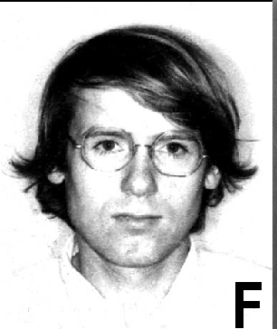
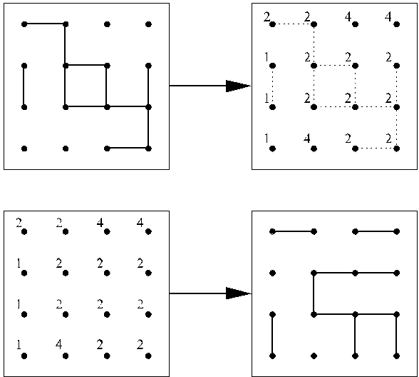

## Preface

Kees Fortuin (1971) | Piet Kasteleyn (1968)

The random-cluster model was invented by Kees Fortuin and Piet Kasteleyn around 1969 as a unification of percolation, Ising, and Potts models, and as an extrapolation of electrical networks. Their original motivation was to harmonize the series and parallel laws satisfied by such systems. In so doing, they initiated a study in stochastic geometry which has exhibited beautiful structure in its own right, and which has become a central tool in the pursuit of one of the oldest challenges of classical statistical mechanics, namely to model and analyse the ferromagnet and especially its phase transition.

The importance of the model for probability and statistical mechanics was not fully recognized until the late 1980s. There are two reasons for this period of dormancy. Although the early publications of 1969–1972 contained many of the basic properties of the model, the emphasis placed there upon combinatorial aspects may have obscured its potential for applications. In addition, many of the geometrical arguments necessary for studying the model were not known prior to 1980, but were developed during the ‘decade of percolation’ that began then. In 1980 was published the proof that pc = 1/2 for bond percolation on the square lattice, and this was followed soon by Harry Kesten’s monograph on two-dimensional percolation.

Percolation moved into higher dimensions around 1986, and many of the mathematical issues of the day were resolved by 1989. Interest in the random-cluster model as a tool for studying the Ising/Potts models was rekindled around 1987. Swendsen and Wang utilized the model in proposing an algorithm for the time-evolution of Potts models; Aizenman, Chayes, Chayes, and Newman used it to show discontinuity in long-range one-dimensional Ising/Potts models; Edwards and Sokal showed how to do it with coupling.

One of my main projects since 1992 has been to comprehend the (in)validity of the mantra ‘everything worth doing for Ising/Potts is best done via random-cluster’. There is a lot to be said in favour of this assertion, but its unconditionality is its weakness. The random-cluster representation has allowed beautiful proofs of important facts including: the discontinuity of the phase transition for large values of the cluster-factor q, the existence of non-translation-invariant ‘Dobrushin’ states for large values of the edge-parameter p, the Wulff construction in two and more dimensions, and so on. It has played important roles in the studies of other classical and quantum systems in statistical mechanics, including for example the Widom– Rowlinson two-type lattice gas and the Edwards–Anderson spin-glass model. The last model is especially challenging because it is non-ferromagnetic, and thus gives rise to new problems of importance and difficulty.

The random-cluster model is however only one of the techniques necessary for the mathematical study of ferromagnetism. The principal illustration of its limitations concerns the Ising model. This fundamental model for a ferromagnet has exactly two local states, and certain special features of the number 2 enable a beautiful analysis via the so-called ‘random-current representation’ which does not appear to be reproducible by random-cluster arguments.

In pursuing the theory of the random-cluster model, I have been motivated not only by its applications to spin systems but also because it is a source of beautiful problems in its own right. Such problems involve the stochastic geometry of interacting lattice systems, and they are close relatives of those treated in my monograph on percolation, published first in 1989 and in its second edition in 1999. There are many new complications and some of the basic questions remain unanswered, at least in part. The current work is primarily an exposition of a fairly mature theory, but prominence is accorded to open problems of significance.

New problems have arrived recently to join the old, and these concern primarily the two-dimensional phase transition and its relation to the theory of stochastic Löwner evolutions. SLE has been much developed for percolation and related topics since the 1999 edition of Percolation, mostly through the achievements of Schramm, Smirnov, Lawler, and Werner. We await an extension of the mathematics of SLE to random-cluster and Ising/Potts models.

Here are some remarks on the contents of this book. The setting for the vast majority of the work reported here is the d-dimensional hypercubic lattice Zd where d ≥ 2. This has been chosen for ease of presentation, and may usually be replaced by any other finite-dimensional lattice in two or more dimensions, although an extra complication may arise if the lattice is not vertex-transitive. An exception to this is found in Chapter 6, where the self-duality of the square lattice is exploited.

Following the introductory material of Chapter 1, the fundamental properties of monotonic and random-cluster measures on finite graphs are summarized in Chapters 2 and 3, including accounts of stochastic ordering, positive association, and exponential steepness.

A principal feature of the model is the presence of a phase transition. Since singularities may occur only on infinite graphs, one requires a definition of the random-cluster model on an infinite graph. This may be achieved as for other systems either by passing to an infinite-volume weak limit, or by studying measures which satisfy consistency conditions of Dobrushin–Lanford–Ruelle (DLR) type. Infinite-volume measures in their two forms are studied in Chapter 4.

The percolation probability is introduced in Chapter 5, and this leads to a study of the phase transition and the critical point pc(q). When p < pc(q), one expects that the size of the open cluster containing a given vertex of Zd is controlled by exponentially-decaying probabilities. This is unproven in general, although exponential decay is proved subject to a further condition on the parameter p.

The supercritical phase, when p > pc(q), has been the scene of recent major developments for random-cluster and Ising/Potts models. A highlight has been the proof of the so-called ‘Wulff construction’ for supercritical Ising models. A version of the Wulff construction is valid for the random-cluster model subject to a stronger condition on p, namely that p > pc(q) where pc(q) is (for d ≥ 3) the limit of certain slab critical points. We have no proof that pc(q) = pc(q) except when q = 1,2, and to prove this is one of the principal open problems of the day. A second problem is to prove the uniqueness of the infinite-volume limit whenever p = pc(q).

The self-duality of the two-dimensional square lattice Z2 is complemented by a duality relation for random-cluster measures on planar graphs, and this allows a fuller understanding of the two-dimensional case, as described in Chapter 6. There remain important open problems, of which the principal one is to obtain a clear proof of the ‘exact calculation’ pc(q) = √q/(1 + √q). This calculation is accepted by probabilists when q = 1 (percolation), q = 2 (Ising), and when q is large, but the “exact solutions” of theoretical physics seem to have no complete counterpart in rigorous mathematics for general values of q satisfying q ∈ [1,∞). There is strong evidence that the phase transition with d = 2 and q ∈ [1,4) will be susceptible to an analysis using SLE, and this will presumably enable in due course a computation of its critical exponents.

In Chapter 7, we consider duality in three and more dimensions. The dual model amounts to a probability measure on surfaces and certain topological complications arise. Two significant facts are proved. First, it is proved for sufficiently large q that the phase transition is discontinuous. Secondly, it is proved for q ∈ [1,∞) and sufficiently large p that there exist non-translation-invariant ‘Dobrushin’ states.

The model has been assumed so far to be static in time. Time-evolutions may be introduced in several ways, as described in Chapter 8. Glauber dynamics and the Gibbs sampler are discussed, followed by the Propp–Wilson scheme known as ‘coupling from the past’. The random-cluster measures for different values of p may be coupled via the equilibrium measure of a suitable Markov process on [0,1]E, where E denotes the set of edges of the underlying graph.

The so-called ‘random-current representation’ was remarked above for the Ising model, and a related representation using the ‘flow polynomial’ is derived in Chapter 9 for the q-state Potts model. It has not so far proved possible to exploit this in a full study of the Potts phase transition. In Chapter 10, we consider the random-cluster model on graphs with a different structure than that of finite-dimensional lattices, namely the complete graph and the binary tree. In each case one may perform exact calculations of mean-field type.

The final Chapter 11 is devoted to applications of the random-cluster representation to spin systems. Five such systems are described, namely the Potts and Ashkin–Teller models, the disordered Potts model, the spin-glass model of Edwards and Anderson, and the lattice gas of Widom and Rowlinson.

There is an extensive literature associated with ferromagnetism, and I have not aspired to a complete account. Salient references are listed throughout this book, but inevitably there are omissions. Amongst earlier papers on random-cluster models, the following include a degree of review material: [8, 44, 136, 149, 156, 169, 240].

I first encountered the random-cluster model one day in late 1971 when John Hammersley handed me Cees Fortuin’s thesis. Piet Kasteleyn responded enthusiastically to my 1992 request for information about the history of the model, and his letters are reproduced with his permission in the Appendix. The responses from fellow probabilists to my frequent requests for help and advice have been deeply appreciated, and the support of the community is gratefully acknowledged. I thank Laantje Kasteleyn and Frank den Hollander for the 1968 photograph of Piet, and Cees Fortuin for sending me a copy of the image from his 1971 California driving licence. Raphaël Cerf kindly offered guidance on the Wulff construction, and has supplied some of his beautiful illustrations of Ising and random-cluster models, namely Figures 1.2 and 5.1. A number of colleagues have generously commented on parts of this book, and I am especially grateful to Rob van den Berg, Benjamin Graham, Olle Häggström, Chuck Newman, Russell Lyons, and Senya Shlosman. Jeff Steif has advised me on ergodic theory, and Aernout van Enter has helped me with statistical mechanics. Catriona Byrne has been a source of encouragement and support. I express my thanks to these and to others who have, perhaps unwittingly or anonymously, contributed to this volume.
