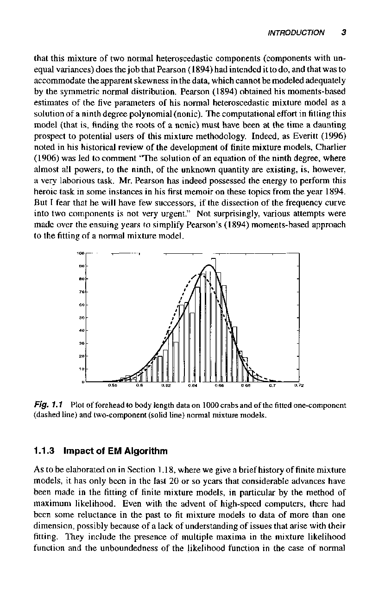
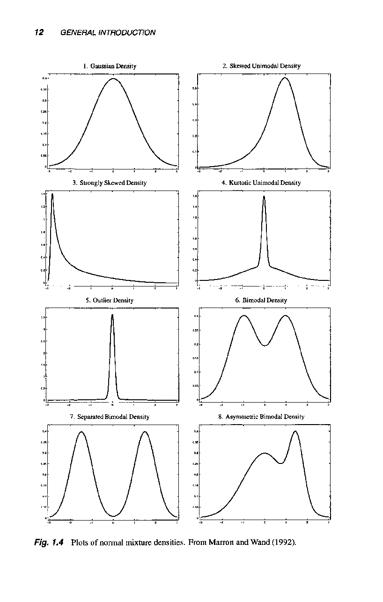
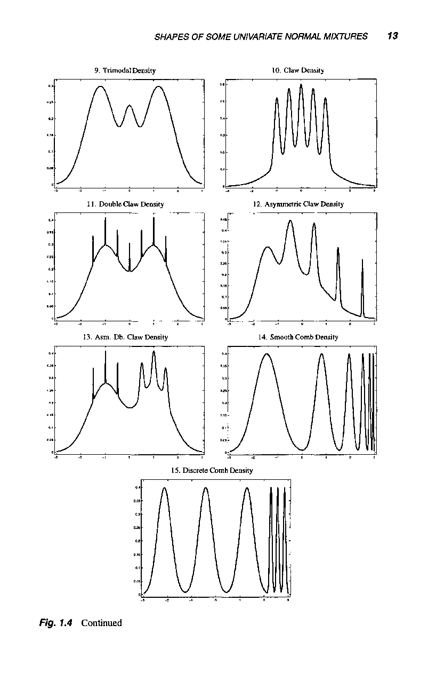
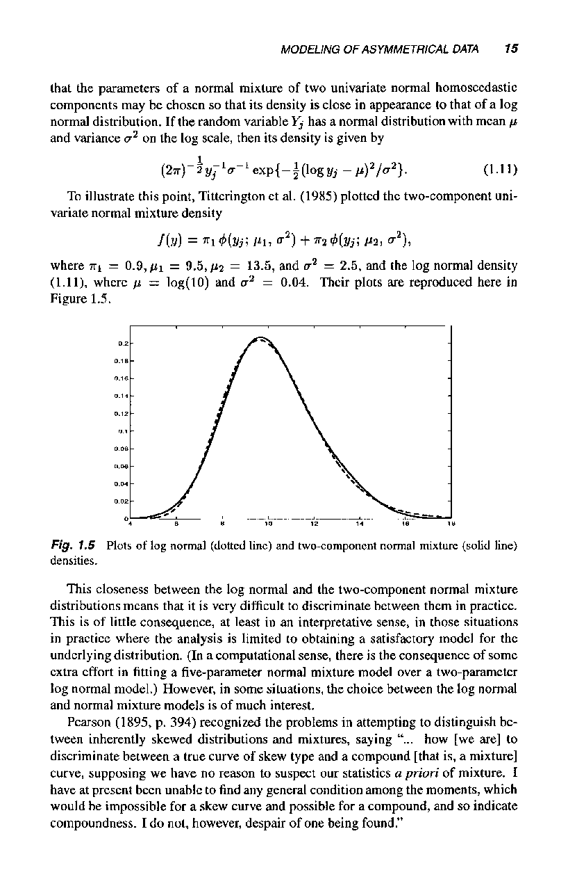
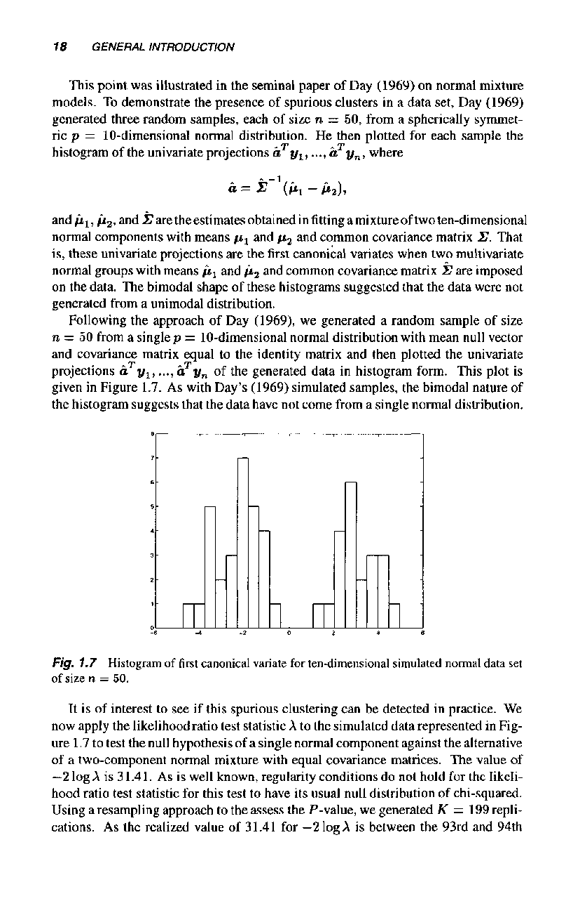

# General Introduction

# 1.1 INTRODUCTION

# 1.1.1 Flexible Method of Modeling

Finite mixtures of distributions have provided a mathematical-based approach to the statistical modeling of a wide variety of random phenomena. Because of their usefulness as an extremely flexible method of modeling; finite mixture models have continued to receive increasing attention over the years, from both a practical and theoretical of view. Indeed, in the past decade the extent and the potential of the applications of finite mixture models have widened considerably. Fields in which mixture models have been successfully applied include astronomy; biology; genetics; medicine; psychiatry; economics; engineering, and marketing, among many other fields in the biological, physical, and social sciences. In these applications; finite mixture models underpin a variety of techniques in major areas of statistics, including cluster and latent class analyses, discriminant analysis, image analysis; and survival analysis, in addition to their more direct role in data analysis and inference of providing descriptive models for distributions. point

The usefulness of mixture distributions inthe modeling ofheterogencity in acluster analysis context is obvious. In another example where there is group structure have a very useful role in assessing the error rates (sensitivity and specificity) of diagnostic and screening procedures in the absence of a standard. But as any continuous distribution can be approximated arbitrarily well by a finite mixture of normal densities with common variance (or covariance matrix in the multivariate case), mixture models provide a convenient semiparametric framework in which to they gold model unknown distributional whatever the objective; whether it say, density estimation or the flexible construction of Bayesian priors. For example, Priebe (1994) showed that with n = 10, 000 observations, a normal density can be well approximated by a mixture of about 30 normals. In contrast, a kernel density estimator uses a mixture of 10,000 normals. A mixture model is able to model quite complex distributions through an appropriate choice of its components to represent accurately the local areas of support of the true distribution: It can thus handle situations where a single parametric family is unable to provide a satisfactory model for local variations in the observed data. Inferences about the modeled phenomenon can be made without difficulties from the mixture components, since the latter are chosen for their tractability. shapes , be, log

(Bishop, 1995, Section 5.9). For with neural networks formed using radial basis functions, the input data can be modeled by a mixture model (for example; a normal mixture). That is, the basis functions can be taken to be the components of this mixture model after estimation by maximum likelihood from the input data. The second-layer weights in the neural network can then be estimated from the input data and their known outputs.

# 1.1.2 Initial Approach to Mixture Analysis

One of the first major analyses involving the use of mixture models was undertaken just over 100 years ago by the famous biometrician Karl Pearson. In his now classic paper, Pearson (1894) fitted a mixture of two normal probability density functions to some data provided by Weldon (1892, 1893) The latter paper may have been the first ever to advocate statistical analysis as a primary method for studying biological problems (Pearson, 1906); see Stigler (1986, Chapter 8) and Tarter and Lock (1993, Chapter 1) for a more detailed account.

The data set analyzed by Pearson (1894) consisted of measurements on the ratio of forehead to body length of n = 1000 crabs sampled from the of Naples. These measurements, which were recorded in the form of v =29 intervals; are displayed in Figure 1.1, along with the plot of the density of a single normal distribution fitted to them. Weldon (1893) had speculated that the asymmetry in the histogram of these data might be a signal that this population was evolving toward two new subspecies. Sensing that his own mathematical training was inadequate; Weldon turned to his colleague Karl Pearson for assistance: Bay that this mixture of two normal heteroscedastic components (components with unequal variances) does the job that Pearson (1894) had intended it todo, and that was to accommodate the apparent skewness in the data, which cannot be modeled adequately by the symmetric normal distribution. Pearson (1894) obtained his moments-based estimates of the five parameters of his normal heteroscedastic mixture model as a solution of a ninth degree polynomial (nonic) The computational effort in fitting this model (that is, finding the roots of a nonic) must have been at the time a daunting prospect to potential users of this mixture methodology Indeed, as Everitt (1996) noted in his historical review of the development of finite mixture models, Charlier (1906) was led to comment "The solution of an equation of the ninth degree, where almost all powers, to the ninth, of the unknown quantity are existing, is, however, a very laborious task. Mr: Pearson has indeed possessed the energy to perform this heroic task in some instances in his first memoir on these topics from the year 1894. But I fear that he will have few successors, if the dissection of the frequency curve into two components is not very urgent: Not surprisingly, various attempts were made over the to the of a normal mixture model . fitting

Pearson's (1894) mixture model-based approach suggested that there were two subspecies present. This paper was the first of two monstrous memoirs in series of 'Contributions to the Mathematical Theory of Evolution" (Stigler, 1986, Chapter 10) In Figure 1.1 we have plotted the density of the two-component normal mixture, as obtained by using maximum likelihood to fit this model to the data in their original interval form. Pearson (1894) had used the method of moments to fit this mixture model tothe mid-points of the intervals; which, for this data set, gives afit very similar tothat obtained with the more efficient method of maximum likelihood. Itcan be seen

# 1.1.3 Impact of EM Algorithm

As to be elaborated on in Section 1.18, where we give a brief history of finite mixture models; it has only been in the last 20 or so years that considerable advances have been made in the of finite mixture models, in particular by the method of maximum likelihood. Even with the advent of high-speed computing, there had been some reluctance in the past to fit mixture models to data of more than one dimension; possibly because of a lack of understanding of issues that arise with their include the presence of multiple maxima in the mixture likelihood function and the unboundedness of the likelihood function in the case of normal fitting They components with unequal covariance matrices. But asthedifficulties concerning these computational issues came to be properly understood and successfully addressed, it led to the increasing use of mixture models in practice In the 1960s, the fitting of finite mixture models by maximum likelihood had been studied in a number of papers, including the seminal papers by (1969) and Wolfe (1965, 1967, 1970). However, it was the publication of the seminal paper of Dempster, Laird, and Rubin (1977) on the EM algorithm that greatly stimulated interest in the use of finite mixture distributions to model heterogeneous data. This is because the of mixture models by maximum likelihood is aclassic example of a problem that is simplified considerably by the EMs conceptual unification of maximum likelihood (ML) estimation from data that can be viewed as being incomplete. As Aitkin and Aitkin (1994) noted; almost all the post-1978 applications of mixture modeling reported in the books on mixtures by Titterington; Smith; and Makov (1985) and McLachlan and Basford (1988) use the EM algorithm; see McLachlan and Krishnan (1997, Section 1.8). This also applies to the applications in this book. Day fitting

# 1.2 OVERVIEW OF BOOK

The use of the EM algorithm for the of finite mixture models, especially normal mixture models, has been demonstrated by McLachlan and Basford (1988) for the analysis of data arising from a wide variety of fields. For most commonly used parametric formulations of finite mixture models, the use of the EM algorithm to find alocal maximizer of the likelihoodfunction is 'straightforward. However; a number of issues remain. For example, as the likelihood function for mixture models usually has multiple local maxima, there is the question of which root of the likelihood equation corresponding to local maximum of the likelihood function (that is, which local the desired root corresponds to the global maximizer of the likelihood function in those situations where the likelihood function is bounded over the parameter space. But with mixtures of normal components with unequal variances in the univariate case or unequal covariance matrices in the multivariate case, the likelihood function is unbounded. In this case, the choice of root of the likelihood equation is not as obvious as in the bounded case and so requires careful consideration in practice. There is also the associated problem of how to select suitable starting values for the EM algorithm in the search of appropriate roots of the likelihoodequation in the first instance. Another important consideration with the of finite mixture models concerns the choice of the number of components g in the mixture model in those applications where g has to be inferred from the data. fitting fitting

In this book we give an extensive coverage of these problems, focusing on the latest developments. Indeed, almost 409 of the references in the book have been published since 1995.

Practitioners are increasingly turning to Bayesian methods for the analysis of complicated statistical models. This move is due in large part to the advent of inexpensive high speed computers and the simultaneous rapid development in posterior simulation techniques such as Markov chain Monte Carlo (MCMC) methods for enabling Bayesian estimation to be undertaken. In this book, we consider the latest developments in Bayesian estimation of mixture models.

One of the major problems of interest in mixture models concerns the choice of the number ofcomponents. In recent times; anumberof new criteriahave been suggested, some of which, like the integrated classification criterion; have given encouraging results in empirical studies designed to test their performance. In this book we discuss these various criteria; with standard criteria such as the Bayesian information criterion (BIC) and the bootstrap likelihood ratio test. along

As many applications of nonnormal mixtures are withcomponents belonging tothe exponential family; consideration is given to the family of mixtures of generalized linear models (GLMs). In this framework, the mixing proportions; as well as the component distributions, are allowed to depend on some associated covariates. A common way in which mixtures of GLMs arises in practice is in the handling of overdispersion in single GLM. A convenient way to proceed in this case is to introduce a random effect into the linear predictor and to consider a mixture of such models with different intercepts in different proportions.

In work related to mixtures of GLMs, the mixtures-of-experts model is considered, along with its extension; the hierarchical mixtures-of-experts (HMEs) model. This approach; which combines aspects of finite mixture models and GLMs, provides a comparatively fast learning and good generalization for nonlinear regression lems, including classification. It is thus a serious competitor to well-known statistical procedures such as MARS and CART. prob-

On other material concerning the use of nonnormal components, there is treatment of the case where the feature variables are mixed, with some categorical and some continuous There is also a separate chapter devoted to mixture distributions in modeling failure-time data with competing risks. A case study is presented on the use of mixtures of Kent distributions for the analysis of multivariate directional data. being

The problem of fitting finite mixture models to binned and truncated data is also covered The methodology is illustrated with a case study on the diagnosis of iron deficient anemia by the mixture modeling of binned and truncated data on a patient in the form of volume and hemoglobin concentration of red blood cells, as measured by a cytometric blood cell counter.

This book contains a number of recent results on mixture models by the authors, includingthe use of mixtures of t distributionsto provide a robust extension of normal mixture models, and the use of mixtures of factor analyzers to enable the of normal mixture models to high-dimensional data. With the considerable attention given to the analysis of large data sets; as in typical data mining applications, recent work on speeding up the implementation of the EM algorithm is discussed, including (a) the use of the sparselincremental EM and of multiresolution kd-trees and (b) the scaling of the EM algorithm to massively large databases where there is limited memory buffer. fitting being

Hidden Markov models are increasingly being used, as provide a way of formulating an extension of mixture models to allow for dependent data. This book reviews the latest results on maximum likelihoodand Bayesian methods of estimation they for such models. It concludes with a concise summary of software available for the fitting of mixture models, including the EMMIX program (McLachlan et al., 1999)

Numerous examples of applications of mixture models are given throughout the book to demonstrate the methodology: Where available; the data sets considered in

# 1.3 BASIC DEFINITION

We let Yí, Yn denote a random sample of size n, where $Y_j$ is a p-dimensional random vector with probability density function $f(y_j)$ onRP In practice; $Y_j$ contains the random variables corresponding to p measurements made on the jth recording of some features on the phenomenon under study. We let Y= (YI Y)T , where the superscript T denotes vector transpose. Note that we are using Yto represent the entire sample; that is, Y is an n-tuple of points in RP \_ Where possible, a realization of a random vector is denoted by the corresponding lower-case letter. For example, 9 = yT)T denotes an observed random sample where %j is the observed value of the random vector $Y_j$.

Although we are taking the feature vector $Y_j$ t0 be a continuous random vector here, we can still view $f(y_j)$ as density in the case where $Y_j$ is discrete by the adoption of counting measure. We suppose that the density j(v;) of $Y_j$ can be written in the form

$$
f ( y _ { j } ) = \sum _ { i } \pi _ { i } \, f _ { i } ( y _ { j } ) ,
$$

where the f:(u;) are densities and the $\pi_i$ are nonnegative quantities that sum to one; that is,

and

$$
\sum _ { i = 1 } ^ g \pi _ { i } = 1 .
$$

The quantities $\pi_1, \dots, \pi_g$ are called the mixing proportions or wcights. As the density (1.1) as a g-component finite mixture density and refer to its corresponding distribution function F($y_j$) as a g-component finite mixture distribution. Since we shall be focusing almost exclusively on finite mixtures of distributions, we shall usually refer to finite mixture models as just mixture models in the sequel.

In this formulation ofthe mixture model, the number of components g is considered fixed. But of course in many applications; the value of g is unknown and has to be inferred from the available data; along with the mixing proportions and the parameters in the specified forms for the component densities.

When the number of components is allowed to increase with the sample size n, the model is called a Gaussian mixture sieve; see Geman and Hwang (1982), Roeder

(1992), Priebe and Marchette (1993), Priebe (1994), and Roeder and Wasserman (1997).

# 1.4 INTERPRETATION OF MIXTURE MODELS

An obvious way of generating a random vector $Y_j$ with the g-component mixture taking on the values 1, 9 with probabilities $\pi_1, \dots, \pi_g$, respectively; and suppose that the conditional density of $Y_j$ given $Z_j$ is = 1 9). Then the unconditional density of $Y_j$ (that is, its marginal density) is given by $f(y_j)$ In this context, the variable Zj can be thought of as the component label of the feature vector Yj In later work, it is convenient to work with a 9-dimensional componentlabel vector $Z_j$ in place of the single categorical variable Zj, where the ith element of Zj, Zij = (Zj)i,isdefined to be one or zero, according to whether the component of origin of Yj in the mixture is cqual to i or not (i = 1, 9) Thus $Z_j$ is distributed according to a multinomial distribution consisting of one draw on 9 categories with probabilities $\pi_1, \dots, \pi_g$; that is,

We write

where T = (71, "g)T .

In the interpretation above of a mixture model, an obvious situation where the g-component mixture model (1.1) is directly applicable is where $Y_j$ is drawn from a population G which consists of g groups, in proportions $\pi_1, \dots, \pi_g$, then the density of $Y_j$ has the g-component mixture form (1.1). In this situation, the g components of the mixture can be physically identified with the 9 externally existing groups; G1, Gg G1, G9'

In biometric applications for instance; a source of the heterogeneity is often age, sex , species, geographical origin, and cohort status. For example; apopulation G may consist of two groups G1 and G2, corresponding to those members with or without particular disease that is under study. The problem may be t0 estimate the disease prevalence (that is, the mixing proportion T1 here) on the basis of some feature vector measured on a randomly selected sample of members of the population: In the case study of Do and McLachlan (1984), in which p = on the skulls of Malaysian rats collected from owl pellets, the components of the fitted mixture corresponded to g =7 different species of rats. The aim oftheir study was to assess the rat diet of owls in terms of the proportion of each species of rat represented in the fitted mixture model.

We shall see in this book that there are many other examples in practice where the population is a mixture of g distinct groups that are known a priori to exist in some physical sense. However, there are also many examples invol the use of mixture Iving models where the components cannot be identified with externally existing groups as allow for greater flexibility in modeling a heterogeneous population that is apparently unable to be modeled by a single component distribution. At the extreme end of this exercise, we obtain the nonparametric kernel estimate of a density if we fit a mixture of 9 =n components in equal proportions 1/n, where n is the size of the observed Yn denote an observed (univariate) sample of size n, then we obtain the kernel estimate of the density of $Y_j$ given by

$$
\hat { f } ( y _ { j } ) = \frac { 1 } { n h } \sum _ { i = 1 } ^ { 1 } k ( ( y _ { j } - y _ { i } ) / h ) ,
$$

if in (1.1) we set g = n and $\pi_i = 1/n$ and take

$$
f _ { i } ( y _ { j } ) = h ^ { - 1 } k ( ( y _ { j } - y _ { i } ) / h )
$$

for some kernel function k(-) and parameter h\_ Usually; the kernel k(:) , which is density, has its mode at the origin; see, for example; the monographs of Devroye and Györfi (1985), Silverman (1986), and Scott (1992) on nonparametric density estimation.

Thus for values of the number of components g between 1 and the sample size n, mixture models can be can be viewed as a semiparametric compromise between (a) the fully parametric model as represented by a single (9 1) parametric family and (b) a nonparametric model as represented in the case of g = by the kernel method of density estimation. Although a single normal distribution is obviously inadequate for modeling a continuous skewed distribution, a mixture of two normal distributions may provide an adequate fit as, for example, considered in Section 1.6 on the modeling of the distribution of blood pressure in humans.

Thus it can be seen that mixture models occupy an interesting niche between parametric and nonparametric approaches to statistical estimation: As explained by Jordan and Xu (1995), mixture model-based approaches are parametric in that parametric forms 0;) are specified for the component density functions, but that can also be regarded as nonparametric by allowing the number of components 9 to grow. Hence mixture models have much of the flexibility of nonparametric approaches; while retaining some of the advantages of parametric approaches, such as keeping the dimension of the parameter space down to a reasonable size. Mix ture models therefore provide a convenient method of density estimation that lies somewhere between parametric models and kernel density estimators. they

Concerning the modeling of count data, the of a single Poisson distribution often forces too much structure on the data leading toproblems such as overdispersion. The use of a mixture model allows a compromise between the homogeneous Poisson model and nonparametric models which; although avoiding strong distributional assumptions, have other disadvantages including high-data dependency of model estimates (Böhning et al,, 1994; Böhning, 1999). The problem of overdispersion in the modeling of count data is to be taken up further in Chapter 5. fitting

# 1.5 SHAPES OF SOME UNIVARIATE NORMAL MIXTURES

# 1.5.1 Mixtures of Two Normal Homoscedastic Components

To illustrate some of the shapes taken by a univariate normal mixture density; we first consider a mixture of two univariate normal components with common variance proportions $\pi_1$ and T2, 80 that 02

$$
( 1 7 )
$$

where

denotes the univariate normal density with mean / and variance 0? .

If the two component normal densities are sufficiently far apart; then one would expect the mixture density $f(y_j)$ toresemble two normal densities side by side, that is, bimodal density. To demonstrate this, we have plotted this normal mixture density in Figure 1.2 for various values of A in the case where +1 = 0 the proportions are equal ($\pi_1 = \pi_2$ 0.5). It can be seen that as 4 increases, the shape of the mixture density f($y_j$) changes from unimodal to bimodal. The threshold for this change, in the present case of two univariate normal densities in equal proportions; is A =2 where, more generally; being

$$
\Delta = | \, \mu _ { 1 } - \mu _ { 2 } \, | \, / \sigma
$$

is the Mahalanobis distance between the homoscedastic components of the normal mixture density; see Titterington et al. (1985, Section 5.5). This figure demonstrates the graphical resolution of a mixture into its constituent components can be a straightforward task for widely separated components (A =3 and 4), but that it can be quite a challenge when the components are close together (4 = 1). how

If the means of the two component densities in the mixture model (1.7) are close enough together; then the overlap between the two component densities wouldtend to obscure the distinction between them and the result wouldbe an asymmetric density if the components are not represented in equal proportions. To demonstrate we give in Figure 1.3 the plots ofthe mixture density f ($y_j$) corresponding to those in Figure 1.2 but where now the components are mixed in the unequal proportions $\pi_1 = 0.75$ and $\pi_2 = 0.25$. In this case, it can be seen that the shape of the mixture density f($y_j$) changes from being bimodal to skewed in appearance for A 4 in Figure 1.3(d). The shape of the mixture density f($y_j$) for A = 3 in Figure 1.3(c) demonstrates bitangentiality; which occurs when there are two distinct at which there is a common tangent to the density. Thus, bitangentiality is implied by, but does not imply; bimodality. Informally; bimodality implies an extra hump, but bitangentiality merely an extra bump in departures from unimodality (Titterington et al. 1985, Section 3.3) points For the univariate normal mixture density f($y_j$) given by (1.7), Preston (1953) obtained explicit expressions for its skewness Y1 and kurtosis Y2 in terms of the separation between its components and the relative size of its mixing proportions, namely

Fig. 1.2 Plot of a mixture density of two univariate normal components in equal proportions with common variance 02 = = 4 in the cases; (a) A =I; () 4

1.3 Plot of a mixture density of two univariate normal components in proportions 0.75 and 0.25 with common variance 1 and means /1 in the cases: (a) Fig.

$$
\gamma _ { 1 } = \frac { a ( a - 1 ) \Delta ^ { 3 } } { \{ a \Delta ^ { 2 } + ( a + 1 ) ^ { 2 } \} ^ { 3 / 2 } }
$$

and

$$
\gamma _ { 2 } = \frac { a ( a ^ { 2 } - 4 a + 1 ) \Delta ^ { 4 } } { \{ a \Delta ^ { 2 } + ( a + 1 ) ^ { 2 } \} ^ { 2 } } ,
$$

where @ is the ratio of the larger mixing proportion to the smaller.

For simplicity here, we have taken the normal mixture to have only 9 =2 components with a common variance. Obviously; more flexibility is introduced by having more than two components and not necessarily constraining them to have the same variances; as illustrated in the next section.

# 1.5.2 Mixtures of Univariate Normal Heteroscedastic Components

useful paper in characteri the shape of the density of a mixture of two norinstance, this density cannot be bimodal if izing

$$
^ { 2 } < ( 2 7 \sigma _ { 2 } ^ { 2 } ) / \{ 4 ( 1 + k ) \} ,
$$

where k =

$$
\Delta ^ { 2 } > ( 2 7 \sigma _ { 2 } ^ { 2 } ) / \{ 4 ( 1 + k ) \} ,
$$

a value of T1 exists for which the density is bimodal.

As the family of g-component normal mixtures is very flexible; Marron and Wand (1992) used it to represent a wide variety of density shapes in their analytical study of the mean integrated squared error of the kernel density estimator. To demonstrate that the family of normal mixtures is indeed a very broad one, gave fifteen examples of the (univariate) normal mixture density; corresponding to various combinations of the components, as listed in Table 1.1. The plots are reproduced here in Figure 1.4. The idea that any density can be approximated arbitrarily closely by a normal mixture is made visually clear in Figure 1.4. they

Some idea of the range of provided by mixtures of bivariate normal components may be obtained from Johnson (1987, Section 4.2), where contour plots are given for various selections of the parameters in the case of g = 2 components. shapes

2. Skewed Unimodal Density

1. Gaussian Density

1. Kurtotic Unimodal

1. Outlier Density

1. Bimodal Density

1. Asymmctric Bimodal Density

Fig. 1.4 Plots of normal mixture densities. From Marron and Wand (1992)

9. Trimodal Density

10. Claw Density

11. Asymmetric Claw Density

12. Asm. Db. Claw Density

13. Smooth Comb Density

14. Discrete Comb Density

Table 1.1 Parameters for Fifteen Examples of a Normal Mixture Density

| Density                    | f(y)         |
| -------------------------- | ------------ |
| 1 Gaussian                 | N(O,1)       |
| 2. Skewed unimodal         |              |
| 3 Strongly skewed          |              |
| 4. Kurtotic unimodal       |              |
| 5 Outlier                  |              |
| 6. Bimodal                 |              |
| 7. Separated bimodal       |              |
| 8. Skewed bimodal          |              |
| 9 Trimodal                 |              |
| 10. Claw                   |              |
| 11. Double claw            | (166)?)      |
| 12. Asymmetric claw        |              |
| 13. Asymmetric double claw | 1 N(2i \_ 1, |
| 14. Smooth comb            | /63) N((65   |
| 15. Discrete comb          | Ei- ?N((12i  |

Source: Adapted from Marron and Wand (1992)

# 1.6 MODELING OF ASYMMETRICAL DATA

As seen in the previous section; normal mixture densities can play a useful role in modeling the distribution of data that have asymmetrical distributions; as recognized by Pearson (1894). Another way of proceeding with the modeling of skewed data is to first apply a transformation in an attempt to remove or reduce the asymmetry in the data. For this purpose the transformation is often helpful, It is well known log that the parameters of normal mixture of two univariate normal homoscedastic components may be chosen so that its density is close in appearance to that of a and variance 02 on the scale, then its density is given by log log

$$
( 2 \pi ) ^ { - \frac { 1 } { 2 } } y _ { j } ^ { - 1 } \sigma ^ { - 1 } \exp \{ - \frac { 1 } { 2 } ( \log y _ { j } - \mu ) ^ { 2 } / \sigma ^ { 2 } \} .
$$

To illustrate this point; Titterington et al. (1985) plotted the two-component univariate normal mixture density

$$
f ( y ) = \pi _ { 1 } \phi ( y _ { j } ; \mu _ { 1 } , \sigma ^ { 2 } ) + \pi _ { 2 } \phi ( y _ { j } ; \mu _ { 2 } , \sigma ^ { 2 } ) ,
$$

= = = 13.5, and 02 2.5, and the normal density = log(10) and 02 0.04. Their plots are reproduced here in Figure 1.5. log

0.2

0,18

0.16

0.14

0.12

0.1

0.08

0.06

04

0.02

Fig. 1.5 Plots of log normal (dotted line) and two-component normal mixture (solid line) densities .

This closeness between the normal and the two-component normal mixture distributions means that it is very difficult to discriminate between them in practice. This is of little consequence at least in an interpretative sense, in those situations in practice where the analysis is limited to obtaining a satisfactory model for the underlying distribution: (In acomputational sense; there is the consequence of some extra effort in a five-parameter normal mixture model over a two-parameter normal model.) However; in some situations, the choice between the log normal and normal mixture models is of much interest. log fitting log

Pearson (1895, p. 394) recognized the problems in attempting t0 distinguish between inherently skewed distributions and mixtures, saying how [we are] to discriminate between a true curve of skew type and a compound [that is, a mixture] curve, supposing we have no reason to suspect our statistics a of mixture. 1 have at present been unable to find any general condition among the moments;, which would be impossible for a skew curve and possible for a compound, and so indicate compoundness . Ido not, however; despair of one found:" priori being As an example of these problems, there are the issues associated with the model of the distribution of blood pressure by a mixture of two normal homoscedastic components, which surfaced in the very heated debate in the 1950s and 1960s (the famous 'Pickering/Platt" debate) about the pathophysiology of hypertension; see Swales (1985) and Schork, Weder, and Schork (1990) and the references therein. Pickering and Platt were two noted English internists with differing views on the etiology of essential hypertension. Platt (1963) claimed that hypertension was a "disease" and placed much emphasis on his personal observations that the distribution of blood pressure has a skewness that may be the manifestation of the effects of Mendelian dominant gene (that is, the blood pressure distribution admits a (twocomponent) mixture as the consequence of the mixing of two groups corresponding to the "hypertensive" and "normotensive' subpopulations). Pickering (1968) staunchly opposed Platt's interpretation; arguing that the designation 'hypertension' was entirely arbitrary; merely a label assigned to those with blood pressure readings in the upper tail of the distribution. Many researchers, including Clark et al. (1968) and McManus (1983), have since then attempted to settle the dispute by fitting normal mixtures to large samples of blood pressure values, but results have been inconclusive; see Schork, Allison; and Thiel (1996) for a recent account As Schork et al. (1990) have noted, investigations into this issue should be widened to include the use of mixtures of normal heteroscedastic components. To demonstrate the inconclusive nature of this issue, we have plotted in Figure 1.6the two-component normal mixture and normal models fitted by Schork et al. (1990) to systolic and diastolic blood pressures collected on 941 white male subjects participating in a random, statewide blood pressure screening program in Michigan. The data were first standardized to adjust for the effects of age, height;, and weight. ing being log The effect of skewness on hypothesis tests for the number ofcomponents in normal mixture models is to be considered further in Section 6.1.3. This problem has been considered by Maclean et al. (1976), Schork and Schork (1988), Gutierrez et al. (1995),and Ning and Finch (2000). In their work the Box-Cox (1964) transformation is employed initially in an attempt to obtain normal components.

5

|

13

12

132

13

Adjusted Systolic Blood Pressure

Adjusted Diastolic Blood Pressure

Fig. 1.6 Histograms of height-, weight- and age-adjusted systolic and diastolic blood pres sures of 941 men. The superimposed solid and dotted curves represent the density of the fitted mixture of two normal homoscedastic components and single normal component; respectively . From Schork et al. (1990). log

# 1.7 NORMAL SCALE MIXTURE MODEL

Normal mixture models have been used in the investigation of the performances of certain estimators to departures from normality. In addition tothis latter role of assessthe performance of estimators in nonnormal situations; normal mixture models have been used of course in the development of robust estimators. For example, under the contaminated normal family as suggested by Tukey (1960), the density of an observation is taken to be a mixture of two univariate normal densities with the same means but where the second component has a greater variance than the first. This family was introduced to model population which follows a normal distribution except on those few occasions where a grossly atypical observation is recorded. That is, ing

$$
( 1 . 1 2 )
$$

where k is large and T2 =1-T1 is small, representing the small proportion of obser vations that have a relatively large variance. Huber (1964) subsequently considered more general forms of contamination of the normal distribution in the development of his robust M-estimators of a location parameter.

The normal scale mixture model (1.12) can be written as

$$
f ( y _ { j } ) = \int \phi ( y _ { j } ; \mu ; \sigma ^ { 2 } / u ) \, d H ( u ) ,
$$

where H is the probability distribution that places mass $\pi_1$ at the point u = 1 and mass $\pi_2 = 1 - \pi_1$ at the 1/k. If we replace H by the distribution of a chisquared random variable on its degrees of freedom v* we obtain the t distribution with v degrees of freedom. The family of t distributions provides a heavy-tailed alternative to the normal family: The t distribution is considered further in Chapter 7 in the context of mixtures of multivariate t components* point fitting

# 1.8 SPURIOUS CLUSTERS

We have seen in Section 1.5 that the shape of the density of a mixture of two normal components will be bimodal in appearance if the two components have sufficient separation between them. Hence; in practice; bimodality in a histogram of the feature data will obviously be suggestive of the possibility that the data have been drawn from a mixture distribution: However, bimodality in histograms of the data (or of linear combinations of the data if multivariate) does not always imply that the data have been sampled from a mixture distribution.

This was illustrated in the seminal paper of (1969) on normal mixture models . To demonstrate the presence of spurious clusters in a data set, (1969) generated three random samples, each of sizc n = 50, from a spherically symmet ric p = 10-dimensional normal distribution. He then plotted for each sample the point Day Day

$$
\hat { a } = \hat { \Sigma } ^ { - 1 } ( \hat { \mu } _ { 1 } - \hat { \mu } _ { 2 } ) ,
$$

and amixture oftwoten-dimensional is, these univariate projections are the first canonical variates when two multivariate on the data: The bimodal shape of these histograms suggested that the data were not generated from a unimodal distribution: fitting

Following the approach of (1969), we gencrated a random sample of size n = 50 from a single p = l0-dimensional normal distribution with mean null vector and covariance matrix equal to the identity matrix and then plotted the univariate projections â à Un of the generated data in histogram form:. This plot is given in Figure 1.7. As with Day's (1969) simulated samples, the bimodal nature of the histogram suggests that the data have not come from a single normal distribution: Day

Fig. 1.7 Histogram of first canonical variate for ten-dimensional simulated normal data set of size n = 50.

It is of interest to see if this spurious clustering can be detected in practice. We now apply the likelihoodratio test statistic X to the simulated data represented in Fig ure 1.7t0 test the null hypothesis of a single normal component against the alternative of a two-component normal mixture with equal covariance matrices. The value of ~2log X is 31.41. As is well known, regularity conditions do not hold for the likelihood ratio test statistic for this test to have its usual null distribution of chi-squared. a resampling approach to the assess the P-value; we generated K = 199 replications. As the realized value of 31.41 for ~2l0g X is between the 93rd and 94th Using smallest replicated values of -2 x, the P-value is assessed as approximately 479 . Hence the null hypothesis of a single normal component would be retained at any conventional level of significance. log The problem oftesting for the number of components in amixture model, including by the likelihood ratio test, is to be considered in Chapter 6.

# 1.9 INCOMPLETE-DATA STRUCTURE OF MIXTURE PROBLEM

In Section 1.4 we introduced the component-label vector Zj of zeroone indicator variables to define the component in the mixture model (1.1) from which the feature random vector $Y_j$ is viewed to have arisen. The concept of there label vector Zj associated with each feature vector $Y_j$ is a useful one, even though in a physical It will be seen that this conceptualization of the mixture model in terms of Yj and $Z_j$ is most useful in that it allows the maximum likelihood estimate (MLE) of the mixture distribution to be computed via a straightforward application of the EM algorithm: It is also useful in implementing the MCMC methods in the of mixture models in a Bayesian framework. being fitting

In this book the emphasis is on the estimation of mixture distributions on the basis Un, usually available in the form of an observed random sample taken from the mixture density (1.1). That is, V1, Yn are the realized values of n independent and identically distributed (i.id.) random vectors Yi, Yn with common density $f(y_j)$ We write

$$
( 1 , 1 4 )
$$

where F '(u;) denotes the distribution function corresponding to the mixture density f($y_j$)

In the EM framework, the feature data %1, Yn are viewed as being incomplete since their associated component-indicator vectors, 21, Zn, are not available. The complete-data vector is therefore declared to be

$$
y _ { c } = ( y ^ { T } , z ^ { T } ) ^ { T } ,
$$

where

is the observed-data or incomplete-data vector and where

$$
( 1 . 1 6 )
$$

$$
z = ( z _ { 1 } ^ { T } , \dots , z _ { n } ^ { T } ) ^ { T }
$$

is the unobservable vector of component-indicator variables. It is assumed here that all the observations $y_j$ have been completely recorded.

The component-label vectors 21, zn are taken to be the realized values of the random vectors Zn, where, for independent feature data; it is appropriate to Z1, assume that are distributed unconditionally as they

$$
z _ { 1 } , \dots , z _ { n } \stackrel { i . i . d . } { \sim } \ M u l t _ { g } ( 1 , \pi ) .
$$

The ith belongs to the ith component of the mixture (i 1, 9) while the posterior probability that the entity belongs to the ith component with u; having been observed on it, is given by

$$
\tau _ { i } ( y _ { j } ) \ & = \ \Pr \{ \, \text {entity} \in \text {ith component} \ | \ y _ { j } \} \\ & = \ \Pr \{ Z _ { i j } = 1 \ | \ y _ { j } \} \\ & = \ \pi _ { i } f _ { i } ( y _ { j } ) / f ( y _ { j } ) \quad ( i = 1 , \dots , g ; \, j = 1 , \dots , n ) .
$$

In Section 1.15.2 we shall consider the formation of an optimal rule of allocation in terms of these posterior probabilities of component membership $\tau_i(y_j)$

Itcan be seen that in this incomplete-datacontext; the mixture model arises because the component-label vectors are 'missing" from thecomplete-data vector; and wehave to estimate the mixture distribution on data available from the marginal distribution of $Y_j$ only rather than from the joint distribution of the feature vector Yj and its component label Zj. It will be seen in Section 2.8 that the EM algorithm exploits this reduced simplicity of working with the joint distribution of $Y_j$ and Zj to compute the MLEs on the basis ofthe observed (marginal) data $y_j$ It forms the likelihood function on the basis of the complete-data vector Uc and then overcomes the fact that the label vectors $z_j$ are unknown by iteratively working with the conditional expectation of the complete-data likelihood given the observed data %, which is effected using the current fit for the unknown parameters. log

were available, then estimation of the mixture distribution would be more straightforward than on the basis of the observed data y, since each component density f;(u) could be estimated directly from the data known to have come from it; that is, from those feature data Uj with zij = ($z_j$)i = 1 This would be a trivial task if, say; the component densities were postulated to be multivariate normal. The only other parameters then to be estimated would be the mixing proportions which, in the case of a mixture sampling design for the classified data; can be estimated by the proportion of these data from each component; namely

$$
\zeta _ { i j } / n
$$

The reader is referred to McLachlan (1992) for a comprehensive account of discriminant analysis.

Hence we shall not consider further the fitting of mixture models to data that are completely classified with respect to the components of the mixture model to be fitted unless the component densities themselves are specified to be finite mixtures. McLachlan and Gordon (1989) used such models in their development of a discrimi nant rule for the diagnosis of renal artery stenosis; see also McLachlan (1992, Section mal mixtures by proposing a discriminant rule where the group-conditional densities are modeled as finite mixtures of normal homoscedastic components.

In the standard case of independent data where (1.18) is valid, Titterington (1990) contrived the nomenclature hidden multinomial for the mixture model. The advan tages of this nomenclature is that links can be made with two more general structures in the case of dependent data. If the 21, zn are assumed to follow a Markov has become in the modeling of speech patterns (Rabiner, 1989) If the component-label vectors 21, correspond to some two-dimensional lattice for which a Markov random field is adopted, then the model can be described as a hidden Markov random field model. The application of the EM algorithm to these last two models for dependent data is to be considered in Chapter 13. As tobe discussed there, the E-step can still be undertaken explicitly for the hidden Markov model, but exact calculations are not feasible for both the E- and M-steps in the case of the hidden Markov random field model. Qian and Titterington (1991) have considered approx imations to the E- and M-steps and their links with the approaches of Besag (1986) and Geman and Geman (1984). popular

# 1.10 SAMPLING DESIGNS FOR CLASSIFIED DATA

As discussed in the previous section, in some applications of mixture models, the feature vector Yj can be physically identified with having come from one of the 9 components. If this is the case and the associated component-label vector Zj is known; then we shall say that Yj is classified with respect to the components of the mixture model.

Inthis book we shall be primarily concerned with the ofmixture models to an observed random sample from the mixture (1.1), U1 Un, which are unclassified with respect to the components of the mixture. However; we shall also consider the case where the available data are partially classified; that is, after an appropriate relabeling of the sample, the component-indicator vectors 21, are known for Y1, m < n) fitting Zm

realized: (a) joint or mixture sampling and (b) z-conditional or separate sampling. correspond, respectively; to sampling from the joint distribution of Yj and $Z_j$ and to sampling from the distribution of Yj conditional on zjMixture sampling is common in prospective studies and diagnostic situations. In a prospective study design involving population of distinct groups, sample of individuals from the population is followed until their group memberships (component labels) are determined. With separate sampling in practice; the feature vectors are observed for a sample of m; entities taken separately from each group G; corresponding to the ith component (i = 1, 9) Hence it is appropriate to retrospective studies which are common in epidemiological investigations. For example; with the simplest retrospective case-control study of a disease; one sample is taken from the cases that They occurred during the study period and the other sample is taken from the group of indi viduals who remained free of the disease. As many diseases are rare and even a large prospective study may produce few diseased individuals, retrospective sampling can result in important economies in cost and study duration. But of course with separate sampling, the observed proportions of entities from the groups (components of the mixture) do not provide estimates of the mixing proportions F;.

# 1.11 PARAMETRIC FORMULATION OF MIXTURE MODEL

In many applications; the component densities f:(u;) are specified to belong to some parametric family. In this case, the component densities are specified as 0;), where 0; is the vector of unknown parameters in the postulated form for the ith component density in the mixture. The mixture density f($y_j$) can then be written as

$$
( 1 . 2 0 )
$$

where the vector $ containing all the unknown parameters in the mixture model can be written as

$$
t _ { 1 } , \dots , \pi _ { g - 1 } , \xi ^ { T } ) ^ { T } ,
$$

where & is the vector containing all the parameters in 01, 0g known a to be distinct. We let / denote the specified parameter space for $\Psi$. Since the mixing proportions T; sum to unity; one of them is redundant. In defining $ as (1.21), we have arbitrarily omitted the gth mixing proportion priori

To demonstrate the notation above for defining parametric mixture, we consider mixture of univariate normal and Laplace components with a common mean p, as considered in Kanji (1985) and Jones and McLachlan (1990a) in modeling the distribution of wind shears during aircraft landing. For this model, the mixture density of the measurement Yj of wind shear can be represented as

$$
f ( y _ { j } ; \Psi ) = \pi _ { 1 } \phi ( y _ { j } ; \mu , \sigma ^ { 2 } ) + \pi _ { 2 } ( 2 \kappa ) ^ { - 1 } \exp ( - \left | \, y _ { j } - \mu \, \right | / \kappa ) ,
$$

where

and

$$
\Psi = ( \pi _ { 1 } , \xi ^ { T } ) ^ { T }
$$

$$
\xi = ( \mu , \, \sigma ^ { 2 } , \, \kappa ) ^ { T } .
$$

family: The mixture density f(u;; ") will then have the form

$$
; \Psi ) = \sum _ { i = 1 } ^ { \infty } \pi _ { i } f ( y _ { j } ; \theta _ { i } ) ,
$$

where f( ; 0) denotes a generic member of the parametric family;

$$
\{ f ( y _ { j } ; \theta ) \colon \theta \in \Theta \}
$$

and 0 denotes the parameter space for 8. Throughout this book, we use f as generic symbol for a density; for example; $f(y_j; \Psi)$ denotes the mixture density and f($y_j$; 0;) denotes the ith component density under (1.23).

In practice; the components are often taken to belong to the normal family, leading to normal mixtures. In the case of multivariate normal components, we have that

where If H is degenerate with mass one at an unknown point 01 (that is,9 = 1), then (1.27) is an ordinary parametric model, referred to in the literature as the one-component; unmixed, or homogeneity model. If H is discrete; with g points of support; then H) is a g-component mixture model. shown that the optimal rate of convergence in estimating H is f(yji n-1/4

$$
f ( y _ { j } ; \theta _ { i } ) = \phi ( y _ { j } ; \mu _ { i } , \Sigma _ { i } ) ,
$$

$$
- \, ^ { \frac { P } { 2 } } \, | \, \Sigma _ { i } \, | ^ { - \frac { 1 } { 2 } } \, \exp \{ - \frac { 1 } { 2 } ( y _ { j } - \mu _ { i } ) ^ { T } \Sigma _ { i } ^ { - 1 } ( y _ { j } - \mu _ { i } ) \}
$$

denotes the multivariate normal density with mean (vector) L; and covariance matrix 9) In this case, the vector € of unknown parameters is given by

$$
\Psi = ( \pi _ { 1 } , \dots , \pi _ { g - 1 } , \xi ^ { T } ) ^ { T } ,
$$

where € consists of the elements of the component means, 1, and the distinct elements of the component-covariance matrices; 21, of normal homoscedastic components where the component-covariance matrices $Z_j$ are restricted to equal, being

$$
\Sigma \quad ( i = 1 , \dots , g ) ,
$$

é consists of the elements of the component means Pg and the distinct elements of the common component-covariance matrix >.

# 1.12 NONPARAMETRIC ML ESTIMATION OF A MIXING DISTRIBUTION

In the case of a finite mixture model defined by (1.22), each of 01, an element of the same parameter space 0. We can then think of

$$
\pi =
$$

as defining a discrete probability distribution H(0) over 0, where

$$
H ( \theta _ { i } ) \ & = \ \Pr \{ \theta = \theta _ { i } \} \\ & = \ \pi _ { i } & ( i = 1 , \dots , g ) .
$$

In this way; we can with the discrete probability measure with 9 points of support 01, 0g and corresponding masses T1, Tg. The function H is called the mixing distribution; and with the discrete probability measure H on 0 defined by (1.26), (1.22) may be formally rewritten as

$$
f ( y _ { j } ; H ) = \int f ( y _ { j } ; \theta ) \, d H ( \theta ) .
$$

Although H is a (finite) discrete probability measure defined on @, the form (1.27) does suggest its generalization to more general mixture densities by taking H to be a more general probability measure. Lindsay (1983) considered the 'nonparametric" ML estimation of the mixing distribution H , where the latter is not necessarily restricted to finite, discrete probability measure. He showed that finding the MLE involved a standard problem of convex optimization;, that of maximizing a concave function over a convex set. relaxation of this finite restriction;, as as the likelihoodis bounded, the MLE of II is concentrated on a support of cardinality at most that of the number of distinct data points in the sample. This is a useful, if somewhat surprising, result because it means that a potentially difficult nonparametric estimation problem reduces to a sim ple one having finite dimensions; and hence algorithms can be constructed to find the solution: In particular;, it is possible to determine by evaluation of a simple gradient function how close a candidate estimator H\* is to a ML solution Î . The gradient function can itself be the basis for an algorithm or it can be used in combination with the EM algorithm (Laird, 1978) or other general-purpose algorithms (Böhning, 1995). being long: very

The identifiability question for nonparametric ML estimation of a mixing distri bution has been considered by Teicher (1963), Barndorff-Nielsen (1965), Chandra (1977), Jewell (1982), and Lindsay and Roeder (1992), among others . The reader is referred to the recent monographs by Lindsay (1995) and Böhning (1999) for detailed accounts of the nonparametric ML estimation of a mixing distribution.

The mixture model (1.27)is also appropriate for empirical Bayes estimation (Robbins, 1964 and 1983; Laird, 1982) In this context, the mixing distribution H is an unknown prior distribution; the objective is to estimate the posterior distribution of 0 without assuming a functional form for the distribution\_ prior

Ifin (1.27), the density f(u;; €) also depends on other parameters, say regression parameters, then (1.27) is referred to as a semiparametric mixture model. A common example of such a model is a GLM in which a random intercept term is introduced into the linear predictor to handle overdispersion; see Section 5.6. A general account of semiparametric mixture models may be found in the review paper by Lindsay and Lesperance (1995) and in the monograph of Lindsay (1995).

# 1.13 ESTIMATION OF MIXTURE DISTRIBUTIONS

Over the years, a varicty of approaches have been used t0 estimate mixture distriinclude graphical methods; method of moments; minimum-distance methods, maximum likelihood, and Bayesian approaches. As surmised by TitteringThey ton (1996) , perhaps the main reason for the huge literature on estimation methodology for mixtures is the fact that explicit formulas for parameter estimates are typically not available. For example, the MLE for the mixing proportions and the component means and varianceslcovariances cannot be written down in closed form for normal mixtures. These MLEs have to be computed iteratively. However, as to be pursued further in Section 2.8, their computation is straightforward using the EM algorithm of Dempster et al. (1977).

As discussed in Section 1.1.2, it can be argued that the problem of fitting mixture models started in earnest with the work of Pearson (1894) on the estimation of the parameters of a mixture of two univariate normal heteroscedastic components by the method of moments. In recent times there has been renewed interest in this method of estimation for normal mixtures with the work by Lindsay and Basak (1993) and by Furman and Lindsay (1994a, 1994b); see also Withers (1996) In the special case of g = 2 normal components with common covariance matrix, Lindsay and Basak (1993) derived a system of moment equations whose unique solution gives a consistent estimator of € . Recently; Craigmile and Titterington (1998) have considered the method of moments as well as maximum likelihood for mixtures of uniform distributions; extending material in Gupta and Miyawaki (1978).

Another way of estimating the vector of parameters V in a mixture model is by using the value of V that minimizes

$$
( 1 , 2 8 )
$$

the distance between the mixture distribution F + and the empirical distribution function Ên that places mass one at each data point %; (j = 1, n). Titterington et al. (1985) have provided acomprehensive account ofthe properties ofminimum-distance estimators for mixtures, in particular; for the estimation of the mixing proportions. described various distances & that have been used, including those where den sities rather than distribution functions were used in (1.28) This class includes the They

$$
I ( \hat { F } _ { n } , F _ { \Psi } ) = \int \log \{ d \hat { F } _ { n } ( w ) / d F _ { \Psi } ( w ) \} \, d \hat { F } _ { n } ( w ) .
$$

When only the mixing proportions are unknown; some distances that have been considered include the Wolfowitz distance (Choi and Bulgren; 1968), the Levy distance (Yakowitz; 1969), the Cramér-von Mises distance (Macdonald, 1971), the squared L2 norm (Clarke; 1989; Clarke and Heathcote; 1994), and the Hellinger distance (Woodward, Whitney; and Eslinger; 1995). For the more general problem in which all the parameters are unknown; the Wolfowitz distance was considered by Choi (1969), the Cramér-von Mises distance by Woodward et al. (1984) and Lindsay (1994), the squared L2 norm by Clarke and Heathcote (1994), the Kolmogorov distance by Deely and Kruse (1968) and Blum and Susarla (1977), the Hellinger distance by Cutler and Cordiero-Braña (1996) and Karlis and Xekalaki (1998), and a distance a kernel density estimate by Cao, Cuevas, and Fraiman (1995). Chen and Kalbfleisch (1996)considered a penalized minimum-distance approach. A penal using ized likelihood approach was discussed in Leroux (1992b) and Leroux and Puterman (1992)

Often in practice, where the primary interest in a mixture model is to es timate the mixing proportions; the component densities either are specified or can be estimated separately from available classified data. This considerably simplifies the problem: McLachlan and Basford (1988, Chapter 4) have devoted a full chapter to this problem. As discussed there, other methods of estimation besides maximum likelihood, such as minimum distance as mentioned above, have been applied; see Ganesalingam and McLachlan (1981) and McLachlan (1982b) for some efficiency results of the discriminant analysis and method of moments estimators relative to the MLE. fitting

In arecent development, DasGupta (1999) has presented an algorithm forthe of normal components with equal component-covariance matrices. His algorithm fits the component means to within the precision specified by the user with high probability. Itruns in time only linear in the dimension thedata and polynomial in the number ofcomponents g This algorithm has three phases. The first phase involves projecting the data into a very small subspace without significantly increasing the overlapoftheclusters. The dimension ofthis subspace is independent of the number of data points n and of p. After this projection; clusters that were elliptical become more spherical in shape, and hence more manageable. In the second phase; a clustering procedure is used to locate the modes of the data in this low-dimensional subspace. Finally; in the third phase, the low-dimensional modes are used to reconstruct the original centers. fitting

In this book, the emphasis is on the fitting of mixture models by ML estimation via the EM algorithm. However, we shall also cover the recent developments with a Bayesian approach. The use of Bayesian methods for estimation of mixture distribu tions had been somewhat limited until the appearance of the paper by Gelfand and Smith (1990). They broughtinto focus the tremendous potential of the Gibbs sampler in a wide variety of statistical problems. In particular, observed that almost any Bayesian computation could be carried out via the Gibbs sampler. they

# 1.14 IDENTIFIABILITY OF MIXTURE DISTRIBUTIONS

The estimation of $\Psi$ is identifiable. In general, a parametric family of densities f(uj; ") is identifiable if distinct values of the parameter $\Psi$ determine distinct members of the family of densities

$$
\{ f ( y _ { j } ; \Psi ) \colon \ \Psi \in \Omega \} ,
$$

if and only if

$$
( 1 . 2 9 )
$$

$$
( 1 . 3 0 )
$$

Identifiability for mixture distributions is defined slightly different. To see why and fh 0) that belong t0 the same parametric family. Then (1.29) will still hold when the component labels i and h are interchanged in 4. That is, although densities belong to the same parametric family, then f (u;; ") is invariant under the 9! permutations of the component labels in %.

Let

$$
f ( y _ { j } ; \Psi ) = \sum _ { i = 1 } ^ { g } \pi _ { i }
$$

and

$$
f ( y _ { j } ; \Psi ^ { * } ) = \sum _ { i = 1 } ^ { g ^ { \cdot } } \pi _ { i } ^ { * } f _ { i } ( y _ { j } ; \theta _ { i } ^ { * } )
$$

be any two members of a parametric family of mixture densities. This class of finite

$$
f ( y _ { j } ; \Psi ) \equiv f ( y _ { j } ; \Psi ^ { * }
$$

if and only if g = 9\* and we can permute the component labels so that

$$
\pi _ { i } = \pi _ { i } ^ { * } \ \text { and } \ f _ { i } ( y _ { j } ; \theta _ { i } ) = f _ { i } ( y _ { j } ; \theta _ { i } ^ { * } ) \ \ ( i = 1 , \dots , g ) .
$$

Here = implies equality of the densities for almost all $y_j$ relative to the underlying measure on

The lack of identifiability of € due to the interchanging of component labels is generally handled by the imposition of an appropriate constraint on %.

For example, the approach of Aitkin and Rubin (1985) is to impose the restriction that

$$
\pi _ { 1 } \leq \pi _ { 2 } \leq \dots \leq \pi _ { g } ,
$$

but to carry out the ML estimation without this restriction on the estimates of the mixing proportions restriction on the solution; for example, 71,

$$
( \mu _ { 1 } ) _ { 1 } \leq ( \mu _ { 2 } ) _ { 1 } \leq \dots \leq ( \mu _ { g } ) _ { 1 } .
$$

Sometimes in practice, in particular with univariate data, there may be a natural ordering of the components according to the size of their means. In the work to be presented here, we do not explicitly impose any restriction on the Ti, but in any situation; wereport the result for only one of the possible arrangements of the elements of y.

Thus this lack of identifiability is not of concern in the normal course of events in the fitting of mixture models by maximum likelihood, say; via the EM algorithm. However, it does cause major problems in a Bayesian framework where posterior simulation is to make inferences from the mixture model. It is known as the used label-switching problem and will be one of the issues addressed in Chapter 4 on the Bayesian analysis of mixture models.

Another approach to the identifiability problem is to use an identifying function (Kadane, 1974). This is essentially the same as Redner's (1981) approach of using the quotient topological space ñ obtained by mapping equivalent values of $ into a single point.

As noted by Crawford (1994), among others; nonidentifiability due to overfitting (that is, too many components in the model) is more problematic. For example; modeling mixture of g 1 components incorrectly by a mixture of g components can be handled in two ways: fitting

- 1 One of the mixing proportions in the g-component mixture can be set equal to zero\_
- 2 Two component densities in the g-component mixture can be taken to be the same.

For example; suppose that the true density is 0), but that a model with two f(yji

$$
\Omega _ { 1 } = \{ \Psi \colon \pi _ { 1 } = 1 , \, \theta _ { 1 } = \theta \} \cup \{ \Psi \colon \pi _ { 1 } = 0 , \, \theta _ { 2 } = \theta \}
$$

and

$$
\Omega _ { 2 } = \{ \Psi \colon \pi _ { 1 } \in ( 0 , 1 ) , \theta _ { 1 } = \theta _ { 2 } = \theta \} .
$$

Then for all % belonging to

$$
\Omega _ { 1 } \cup \Omega _ { 2 } ,
$$

we have

$$
f ( y _ { j } ; \Psi ) = f ( y _ { j } ; \theta ) .
$$

The extension to arbitrary g is straightforward.

As to be discussed later, convergence results can still be obtained in this case. For instance, Redner (1981) extended Wald's (1949) results on the consistency of the MLEof $ by using the quotient topological space ñ. In the above example; all V in (1.34) correspond to the same in n. Feng and McCulloch (1996) obtained the parallel result in Euclidean space, as to be discussed in Chapter 2 point

Titteringtonet al. (1985, Section 3.1) have given a lucid account of the concept of identifiability for mixtures. pointed out that most finite mixtures of continuous densities are identifiable; an exception is a mixture of uniform densities. Teicher (1960) showed that a finite mixture of Poisson distributions is identifiable; whereas mixtures of binomial distributions are not identifiable if They

$$
N < 2 g - 1 ,
$$

where N is the common number of trials in the component binomial distributions. ponent distributions are identifiable.

# 1.15 CLUSTERING OF DATA VIA MIXTURE MODELS

# 1.15.1 Mixture Likelihood Approach to Clustering

In some applications of mixture models, questions related to clustering may arise only after the mixture model has been fitted. For instance, suppose that in the first instance the reason for a mixture model was to obtain a satisfactory model for the distribution of the data. If this were achieved by the of, say; a threecomponent mixture model, then it may then be of interest to consider the problem further to see if the three components can be identified with three externally existing groups or subpopulations or if the clusters implied by the fitted mixture model reveal the existence of previously unrecognized or undefined subpopulations. fitting fitting

However; in other applications ofmixture models, the clustering of the data at hand is the primary aim of the analysis. In thiscase, the mixture model is used purely as a device for exposing any grouping that may underlie the data. McLachlan and Basford (1988) highlighted the usefulness of mixture models as a way of providing an effective clustering of various data sets under a variety of 'experimental designs. being

With a mixture model-based approach to clustering, it is assumed that the data to be clustered are from a mixture of an initially specified number 9 of groups in various proportions. That is; each data is taken to be a realization of the mixture density (1.20), where the 9 components correspond to the 9 groups. On specifying a parametric form for each component density by maximum likelihood (or some other method). Once the mixture model has been fitted, a probabilistic clustering of the data into g clusters can be obtained in terms of the fitted posterior probabilities of component membership for the data: An outright assignment of the data into 9 clusters is achieved by assigning each data to the component to which it has the highest estimated posterior probability of belonging: Although these estimated posterior probabilities may have limited reliability in small samples, may well give a satisfactory outright assignment of the data. This is considered further in the next section, where the theoretical basis for performing mixture is presented. point fi($y_j$; point point

In the above, there is a one-to-one correspondence between the mixture components and the groups. In those cases where the underlying population consists of groups in which the feature vector is unable to be modeled by single normal distribution but needs a normal mixture formulation; the components in the fitted g-component normal mixture model and the consequent clusters will correspond to g subgroups rather than to the smaller number of actual groups represented in the data.

It can be seen that this mixture likelihood-based approach t0 clustering is model based in that the form of each component density of an observation has to be specified in advance. Hawkins, Muller, and ten Krooden (1982, p. 353) commented that most writers on cluster analysis more stress on algorithms and criteria in the belief that intuitively reasonable criteria should produce good results over a wide range of possible (and generally unstated) models: For example, the trace W criterion; where Wis the pooled within-cluster sums of squares and products matrix; is predicated on "lay

normal groups with (equal) spherical covariance matrices; but as pointed out, many users apply this criterion even in the face ofevidence ofnonspherical clusters or, equivalently; would use Euclidean distance as a metric. They strongly supported the increasing emphasis on a model-based approach to clustering- Indeed, as remarked by Aitkin; Anderson; and Hinde (1981) in the reply to the discussion of their paper, "when clustering samples from a population; no cluster method is, a priori believable without a statistical model? Concerning the use of mixture models to represent nonhomogeneous populations; noted in their paper that "Clustering methods based on such mixture models allow estimation and hypothesis testing within the framework of standard statistical theory:? Previously, Marriott (1974,p. 70) had noted that the mixture likelihood-based approach "is about the only clustering technique that is entirely satisfactory from the mathematical of view. It assumes a welldefined mathematical model, investigates it by well-established statistical techniques, and provides a test of 'significance for the results. they they point

The mixture likelihood-based approach to clustering can obviously play a major role in any exploratory data anals in both searching for groupings in the data and testing the validity of any cluster structure discovered; that is, testing whether the apparent clusters are due to random fluctuations or whether reflect a real separation of the data into distinct groups. lysis they

# 1.15.2 Decision-Theoretic Approach

Decision theory provides a convenient framework for the construction of discriminant rules in the situation where an allocation of an unclassified entity is required . In the context of a finite mixture model, the allocation is with respect to the components of the mixture. For this purpose we let r($y_j$) denote an allocation rule for assigning the feature vector $\Psi$; to one of the components of the mixture model, where r($y_j$) implies that the observation is assigned to the ith component (i = 1, 9)

$$
r _ { B } ( y _ { j } ) & = i \quad \text {if } \, \tau _ { i } ( y _ { j } ) \geq \tau _ { h } ( y _ { j } ) \quad ( h = 1 , \dots , g ) . \\ \text {That is,} & \quad r _ { B } ( y _ { j } ) = \arg \max _ { h } \tau _ { h } ( y _ { j } ) .
$$

That is,

The rule 'rB(u;) is not uniquely defined at %; ifthe maximum of the posterior probabilities of component membership is achieved with respect to more than one component. In this case, the entity can be assigned arbitrarily to one of the components for which the corresponding posterior probabilities are equal to the maximum value. We are assuming here that the cost of a correct allocation is zero and all misallocations are taken to have the same cost; see McLachlan (1992, Chapter 1).

As the posterior probabilities of component membership $\tau_i(y_j;$) have the same common denominator $f(y_j)$ rB(u;) can be defined in terms of the relative sizes of the component densities weighted according to the mixing (prior) probabilities; that is, The Bayes rule can be estimated by the so-called plug-in rule, rB(uj; "), where denotes the estimate of the unknown parameter vector 4 . This approach, where the component densities (that is, the group-conditional densities) are directly modeled for use in the formation of the posterior probabilities of group membership, is called the sampling approach by Dawid (1976). Another approach to the estimation of the Bayes rule is to model these posterior probabilities directly; as with the logistic model. Dawid (1976) calls this approach the diagnostic paradigm. With this approach, the interest is not on what the component densities of the feature vector $Y_j$ look like, but on the distributionof the component-indicator vectors; 21, zn, for the observed feature data %1, Un and similar values. This is the main approach with neural networks (Ripley; 1996, p 7). However, the diagnostic paradigm is limited to the case where there are classified data available.

$$
r _ { B } ( y _ { j } ) = i \text { if } \pi _ { i } f _ { i } ( y _ { j } ) \geq \pi _ { h } f _ { h } ( y _ { j } ) \quad ( h = 1 , \dots , g ) .
$$

# 1.15.3 Clustering of I.I.D. Data

Suppose that the purpose of fitting the finite mixture model (1.20) is to cluster an observed random sample %1 , Un intog components. In terms of the complete-data specification (1.15) of the mixture model, we wish to infer the associated component labels 21, zn of these feature data vectors That is, we wish to infer the $z_j$ on the After we fit the g-component mixture model to obtain the estimate € of the vector of unknown parameters in the mixture model, we can give probabilistic clustering of the n feature observations %1, Un in terms of their fitted posterior probabilities of component membership. For each %j the g proportions $\pi_1$ give the estimated posterior probabilities that this observation belongs to the first;, second, and gth components; respectively; of the mixture (j = 1, n)

We can give an outright or hard clustering of these data by assigning each V; of belonging. That is, we estimate the component-label vector $z_j$ by {j, where

$$
1 ,
$$

$$
\ = \ 0 , \quad \text {otherwise} ,
$$

for i = 1, g; j = 1,

It follows from (1.35) that this use of the assignment criterion (1.37) corresponds to using the so-called plug-in sample version of the Bayes (optimal) rule, rB($y_j$ #), whereby V is replaced by $in rB(u; ").

Ifthe postulated component densities provide agood fit and the mixingproportions are able to beestimated with some precision; then the plug-in rule of the mixture can be identified with 9 externally existing groups G1,

approximation to the Bayes rule r_B(\Psi) in the case where the components Gg in which the ith group-conditional densities of $Y_j$ can be modeled by 0;) (i = 1, 9) TB($y_j$; good may still be a reasonable allocation rule. It can be seen from (1.36) that for rB(uj; ") to be a good approximation to rB($y_j$; "), it is only necessary that the boundaries defining the allocation regions,

$$
) , \quad i < h = 2 , \dots , g \} , \quad ( 1 . 3 8 )
$$

be estimated precisely. This implies at least for well-separated groups that in consideration of the estimated group-conditional densities; it is the fit in the tails rather than in the main body of the distributions that is crucial. This is what one would expect. reasonable allocation rule should be able to allocate correctly an entity whose group of origin is obvious from its feature vector. Its accuracy is really determined by how well it can handle entities of doubtful origin. Their feature vectors tend to occur in the tails of the distributions. If rcliable estimates of the posterior probabilities of component-membership T;(uj; %) are sought in their own right and not just for the purposes of making an outright assignment, then the fit of the estimated group-conditional density ratios f; 0) is important for all values of Uj and not just on the boundaries (1.38). Any

It can therefore be seen in clustering applications of mixture models that the estimates of the component densities are not of interest as an end in themselves, but rather how useful their ratios are in providing estimates of the posterior probabilities ofcomponent membership or at least an estimate of the Bayes rule. However, for con venience, the question of model fit in practice is usually approached by consideration of the individual fit of each estimated component density

We have assumed here that the clustering is to be undertaken on iid. data sets, which suffices for many applications in practice. However, the assumption of independence is not always tenable with some applications, in particular with those that occur in the field of image analysis.

# 1.15.4 Image Segmentation or Restoration

We suppose here that the observed feature data %1 , Un are vectors of intensities measured on n pixels in some two-dimensionalscene or voxels in a three-dimensional scene Here the components of the postulated mixture model for the intensity vector correspond to the true colors of the pixels. The problem is to infer the totality of the component-label vectors

$$
z = ( z _ { 1 } ^ { T } , \dots , z _ { n } ^ { T } ) ^ { T }
$$

on the basis of the observed intensity vectors

$$
y = ( y _ { 1 } ^ { T } , \dots , y _ { n } ^ { T } ) ^ { T } .
$$

This clustering process is referred to as segmentation. It can also be referred to as restoration. image

An estimate à can be produced by considering each $z_j$ individually and allocating

$$
( 1 , 3 9 )
$$

For instance; the pixels can be individually allocated by choosing â; to be the value of $z_j$ that has maximum posterior probability given $Y_j$ (1.39). It follows from Section 1.15.2 that this approach of maximizing the posterior marginal probability for each pixel corresponds to maximizing the expected number of correctly assigned pixels in the scene It is thus biased towards a low rate of misallocated pixcls rather than overall appearance. With the widely used ICM algorithm of (1986), segmentation is performed on the basis of Besag

$$
, z _ { \partial j } \} ,
$$

wherc contains the label vectors ofthose pixels lying in aprescribed neighborhood n) z8j

its n subvectors $z_j$ (j = 1, n) An to be the value of z that maximizes

$$
\ p r \{ Z = z \ | \ y \} .
$$

That is, 2 is taken to be the mode of the posterior distribution of Z. It is therefore viewpoint; 2 corresponds to the adoption of a zero-one loss function according t0 whether the reconstructed image is perfect or not\_ The maximization of (1.40) would appear at first sight to be an ambitious task, given that there are 9" possible values of 2 . Geman and Geman (1984) approached this formidable problem using simulated annealing.

# 1.16 HIDDEN MARKOV MODELS

As to be considered in Chapter 13, one way of formally extending mixture models to the analysis of dependent data is to adopt a stationary Markovian model for the vector z containing the component-indicator labels, 21, For example; in the context of the segmentation of pixels as discussed in the previous section; we could algorithm is unable to be implemented exactly for a Markov random field. However; an approximation can be obtained by first performing a restoration step, on which a current estimate of z is obtained by a segmentation, for example, by using the ICM or MAP estimates as mentioned above The M-step can then be performed conditionally on this current estimate of z if the distribution of z is approximated by the pseudo likelihood (Besag, 1975).

In other work on mixture models for dependent data, Wong and Li (2000) recently generalized the Gaussian MTD (mixture transition distribution) model introduced by Le; Martin, and Raftery (1996) to the mixture autoregressive (MAR) model for the modeling of nonlinear time series: The MTD model was first introduced by Raftery (1985) in the discrete case as a model for high-order Markov chains; see also Raftery and Tavaré (1994). Le et al. (1996)illustrated the usefulness of their MAR model with two examples: thecommon stock closing series for International Business Machines (IBM) and the Canadian lynx data. They noted that many published nonlinear time series models can be shown to have multimodal marginal or conditional distri butions. For example, the zeroth-order self-exciting threshold autoregressive model (Tong, 1990) can be shown to have a mixture of Gaussian distributions marginally (Jalali and Pemberton, 1995). In some other work on mixtures of time series, Shephard (1994) has considered Bayesian techniques appropriate for handling time series models whose noise is drawn from a Gaussian mixture. Harrison and Stevens (1976) call such a structure a multiprocess model. There is a huge literature on this model (Pãna and Guttman; 1988; Kitagawa; 1989). Using simulation techniques like those developed by Shephard (1994), Billio; Montfort, and Robert (1999) have considered Bayesian analysis of switching ARMA models. prices

# 1.17 TESTING FOR THE NUMBER OF COMPONENTS IN MIXTURE MODELS

In some applications of mixture models, there is sufficient a information for the number of components g in the mixture model tobe specified with no uncertainty. For example; this would be the case where the components correspond to externally existing groups in which the feature vector is known to be normally distributed. However; on many occasions, the number of components has to be inferred from the data, along with the parameters in the component densities. If, say; a mixture model is used to describe the distribution of some data, the number of components in the final version of the model may be of interest beyond matters of a technical or computational nature\_ For example, McLaren et al. (1991) used a two-component log normal mixture distribution to modcl the distribution of the volume of red blood cells in patients recovering from anemia. The red blood cell volume distribution of healthy individuals can be modeled adequately by a single normal component. However, for patients not completely recovered from anemia, their red blood cell distribution; although unimodal in appearance toward the end of the iron therapy treatment, may still need to be modeled by a two-component normal mixture due to the presence of a sufficient number of microcytic cells in relation to the normocytic cells. Thus the result of a statistical test on the number of components in the normal mixture model for a specific patient can be used as an early to aid clinicians in making a decision when to suspend iron therapy treatment for the patient. A nonsignificant test result is consistent with the red blood cell distribution of the patient having returned to a healthy state (McLaren, 1996; McLachlan, McLaren, and Matthews, 1995). priori being log log log guide

Another example concerns the modeling ofthe distributionof in vivo insulin action in PimaIndians by Bogardus et al. (1989). Ifasingle gene produced insulin resistance; with environmental effects creating some additional variance, insulin action might be distributed as amixture oftwo normal distributions if the gene is dominant orrecessive or as a mixture of three normal distributionsif the gene is codominant. Bogardus et al. (1989)concluded that three components were needed in their normal mixture model, which noted was consistent with the hypothesis that among Pima Indians, insulin resistance is determined by a single gene with a codominant mode of inheritance. they7

In applications of mixture models in cluster and latent analyses; the problem of assessing the number of components in a particular mixture model arises with the question of how many clusters or latent classes there are. An obvious way of approaching the problem is to use the likelihood ratio statistic to test for the smallest valuc of g compatible with the data. Unfortunately with mixture models; regularity conditions do not hold for -2 X to have its usual distribution of chi-squared with degrees of freedom equal to the difference between the number of parameters under the null and alternative hypotheses. log

The problem of testing for the number of components in a mixture model is clearly of much theoretical and practical importance; and so has attracted considerable atten tion in many studies over the years. These studies are to be reviewed in Chapter 6-

# 1.18 BRIEF HISTORY OF FINITE MIXTURE MODELS

We have seen in Section 1.1 that the history of finite mixture models goes back to over a century ago with the classic paper of Pearson (1894)on his moments-based of mixture of two univariate normal components to some crab measurements provided by his colleague Weldon (1892, 1893). The possibility of resolving a normal mixture into its constituent components was; of course, implicit in Quetelet's (1846, 1852) work and was mentioned explicitly by Galton in 1869; see Stigler (1986, Chapter 10) for an absorbing account of this early work on mixtures Another early reference on mixtures is Holmes (1892), who brought in the concept of mixtures of populations in his suggestion that an average alone was inadequate in consideration of wealth disparity; see Billard (1997). fitting"

Given the amount of algebra involved withthe approach of Pearson (1894), various attempts were made in the early part of the twentieth century to simplify the method, including by Charlier (1906). During the next 30 years; work continued on the use of the method of moments for this mixture problem. It was extended to thc casc of bivariate normal components by Charlier and Wicksell (1924) and to the case of more than two univariate normal components by Doetsch (1928). Strömgren (1934) also considered the use of cumulants, while Rao (1948) considered the use of k statistics. In more recent work, Cohen (1967) subsequently showed how the solving of Pearson's nonic could be circumvented through an iterative process which involves solving a cubic equation for a unique negative root. This approach was suggested by the solution in the case of equal variances where the estimates depend uniquely on the negative root of a cubic equation constructed from the first four moments; see Charlier and Wicksell (1924) and Rao (1952, Section 8b.6). However, Tan and (1972) and Fryer and Robertson (1972), among others; showed that the method of moments was inferior to ML estimation for this problem. As noted earlier, there has been renewed interest in this method of estimation for normal mixtures with the work by Lindsay and Basak (1993), among others. Chang As speculated by Fowlkes (1979)in his study of diagnostic plotting procedures for the detection of univariate mixtures, it was probably because of the intractability of the moment estimators and the absence of modern computer technology that attention was focused on graphical techniques for mixtures during the early and mid-190Os. Pioneering work on these techniques was undertaken by Harding (1948), Preston (1953), and Cassie (1954) and was continued by Bhattacharya (1967) and Wilk and Gnanadesikan (1968), among others. Tarter and Silvers (1975) presented a graphical procedure based on the properties of the bivariate Gaussian density function; while Chhikara and Register (1979) developed a numerical classification technique based on computer-aided methods for the display of the data. More recently; Tarter and Lock (1993, Chapter 5) described a curve-estimation approach, called the X method, which is mainly a graphical approach to the decomposition of mixtures. Loosely speaking, a 1 curve is derived from the original density by reducing the standard deviations of any constituent components without affecting any other characteristics of the distribution. Thus, if a distribution has more than one component, the > method enhances the differences between the components making them easier to see Medgyessy (1961) brought the X methodology first proposed by the mathematician Doetsch (1928, 1936),t0 the attention of the applied statistical community; see Tarter and Lock (1993, Chapter 5).

With the advent of high-speed computers, attention was turned to ML estimation of the parameters in amixture distribution. The first use of this method for a mixture model has been attributed to Rao (1948) who used Fisher's method of scoring for a mixture of two univariate distributions with equal variances. However; Butler (1986) pointed out that Newcomb (1886), predating even Pearson's (1894) early attempt on mixture models with the method of moments, suggested an iterative reweighting scheme which can be interpreted as an application of the EM algorithm of Dempster et al. (1977) to compute the MLE of the common mean of a mixture in known proportions of a finite number of univariate normal populations with known variances. Also; Butler (1986) noted that Jeffreys (1932) used essentially the EM algorithm in iteratively computing the estimates of the means of two univariate normal populations which had known variances and which were mixed in known proportions: Following Rao's (1948) paper, ML estimation appears not to have been pursued further until Hasselblad (1966, 1969) addressed the problem, initially for a mixture of g univariate normal distributions with equal variances, and then for mixtures of distributions from (1970), and its multivariate analogue was studied by Wolfe (1965, 1967, 1970, 1971) and (1969) in major papers. (1969) concentrated on the solution for two normal populations with the same covariance matrix, while Wolfe (1965, 1967, 1970, 1971) dealt with an arbitrary number of normal heteroscedastic populations as well as mixtures of multivariate Bernoulli distributions for use in latent class analysis. As with Hasselblad (1966, 1969), their solutions were presented in an iterative form corresponding to particular applications of the EM algorithm of Dempster et al. (1977) Other works on ML estimation of mixtures with the computation of the estimates expressed in this iterative form are by Peters and Coberly (1976) Duda and Hart (1973), and Hosmer (1973a, 1973b) Day Day However; it was not until Dempster et al. (1977) had formalized this iterative scheme in a general context through their EM algorithm that the convergence properties of the ML solution for the mixture problem were established on a theoretical basis . This paper of Dempster et al. (1977) proved to be a timely catalyst for further research into the applications of finite mixture models. This is witnessed by the subsequent stream of papers on finite mixtures in the literature, commencing with, for example, Ganesalingam and McLachlan (1978, 1979a, 1979b, 1980a), 0'Neill (1978), and Aitkin (1980).

By now; there is quite an extensive literature on finite mixture models. Hence it is not our intention to provide an exhaustive bibliography here. We have attempted to reference the main results, with the emphasis on the more recent developments and applications. Earlier references on mixture models may be found in the comprehensive bibliographies in the previous books on finite mixture distributions by Everitt and Hand (1981), Titterington et al. (1985), McLachlan and Basford (1988) Lindsay (1995), and Böhning (1999) In addition, there are the review articles of Holgersson and Jorner (1978), Gupta and Huang (1981), Redner and Walker (1984), and Titterington (1990), as well as the encyclopedia entries by Blischke (1978) and Everitt (1985). The latter entry has bccn updated by Titterington (1996). Previously; McLachlan (1982a) had reviewed the of mixture models, concentrating on their a role as a device for clustering. In more recent papers, Airoldi, and Biber (1992) and McLachlan (1994) have provided nontechnical reviews of some basic concepts of mixture model-based analysis. Additional references on mixture models in a medical context may be found in the issue of the journal Statistical Methods in Medical Research on Finite Mixture Models (1995, 5, 107-211) Applications of mixture models in marketing are given in Wedel and Kamakura (1998, Chapters 6 and 7). fitting Flury ,

In some applications; the component densities of a mixture are specified to be dif ferent. A special case of called a nonstandard mixture, is for ag = 2component mixture with one of the components degenerate; having mass one placed at a single Nonstandard mixtures are considered in some depth in the report by a panel of the Committee on Applied and Theoretical Statistics of the Board on Mathematical Sciences of the National Research Council, chaired by Professor D. Guthrie (Panel on Nonstandard Mixtures of Distributions, 1989). point.

# 1.19 NOTATION

We now define the notation that is used consistently throughout the book. Less frequently used notation will be defined later when it is first introduced.

All vectors and matrices are in boldface. The superscript T denotes the transpose of a vector or matrix. The trace of a matrix A is denoted by tr(A), while the determinant of A is denoted by |Al' The null vector is denoted by 0 The notation diag(a1, an) is used for a matrix with diagonal elements 01, @n and all off-diagonal elements zero.

We let Y1, denote a random sample of size n where $Y_j$ is a p-dimensional random vector with probability density function $f(y_j)$ onRP Inpractice, $Y_j$ contains the random variables corresponding to p measurements made on the _th recording of some features on the phenomenon under study. We let Y = Y)T _ Note that we are Yto represent the entire sample; that is, Yis an n-tuple of in RP Where possible, a realization of a random vector is denoted by the = to avoid any confusion with the use of Yfor the entire random sample, we shall always use $Y_j$ for an individual observation even when only one observation is being considered. using points

The probability density function of the random vector $Y_j$ under a g-component mixture model is written in parametric form as

$$
( 1 . 4 1 )
$$

where the vector $\Psi$ containing all the unknown parameters in the mixture model is written as

$$
( 1 . 4 2 )
$$

and € is the vector containing all the parameters in 01, 0g known a priori to be distinct. We let / denote the specified parameter space for $\Psi$, and we let

$$
\pi = ( \pi _ { 1 } , \dots , \pi _ { g } ) ^ { T }
$$

be the vector of mixing proportions. one of them is redundant. In defining ", we have arbitrarily omitted the mixing proportion gth

The ML of the mixture density f(uj; ") to an obscrved random sample fitting

$$
y = ( y _ { 1 } ^ { T } , \, .
$$

is undertaken using the EM algorithm. In theEM framework, this problemis viewed as being incomplete due to the unavailability of the associated component-label vectors where = ($z_j$); is defined to be one or zero, according to whether Uj is viewed or not viewed as having arisen from the ith component of the mixture model being fitted. The complete-data vector Uc is given by 21, Zij

$$
y _ { c } = ( y ^ { T } , z ^ { T } ) ^ { T } ,
$$

where The likelihood function for $ formed from the observed data y is denoted by formed from the complete-data vector Uc if it were completely observable.

$$
z = ( z _ { 1 } ^ { T } , \dots , z _ { n } ^ { T } ) ^ { T } .
$$

In this EM framework, the posterior probability that the entity belongs to the ith component with U; having been observed on it is given by

$$
\tau _ { i } ( y _ { j } ) \ & = \ \Pr \{ \, \entity { \boldsymbol \eta } \in \mathfrak { i } \text { component } \ | \ y _ { j } \} \\ & = \ \Pr \{ Z _ { i , j } = 1 \ | \ y _ { j } \} \\ & = \ \pi _ { i } f _ { i } ( y _ { j } ) / f ( y _ { j } ) \ \ ( i = 1 , \dots , g ; \, j = 1 , \dots , n ) .
$$

The (incomplete-data) score statistic is given by

$$
\partial \log I
$$

$$
( 1 . 4 6 )
$$

while

denotes the corresponding complete-data score statistic;

A given sequence of EM iterates is denoted by the MLE.

The observed information matrix is denoted by I(#; y), where

$$
( 1 . 4 7 )
$$

$$
( 1 . 4 8 )
$$

The (incomplete-data) expected information matrix is denoted by I(v) , where under

regularity conditions we obtain

$$
\begin{array} { r l r } { \mathcal { I } ( \Psi ) } & { = } & { E _ { \Psi } \{ S ( $Y_j$ \Psi ) S ^ { T } ( $Y_j$ \Psi ) \} } \\ & { = } & { E _ { \Psi } \{ I ( \Psi ; Y ) \} . } \end{array}
$$

Here and elsewhere in this book, the operator Ev denotes expectation using the parameter vector €.

For the complete data, we let

$$
I _ { c } ( \Psi ; y _ { c } ) = - \partial ^ { 2 } \log L _ { c } ( \Psi ) / \partial \Psi \partial \Psi ^ { T } ,
$$

while its conditional expectation given the observed data y is denoted by

$$
Y _ { c } ) \, | \, y \} .
$$

The expected information matrix corresponding to the complete data is given by

$$
\mathcal { I } _ { c } ( \Psi ) = E _ { \Psi } \{ I _ { c } ( \Psi ; Y _ { c } ) \} .
$$

In other notations involving I, the symbol Ia is used to denote the d x d identity matrix, while IA (æ) denotes the indicator function that is 1 if æ belongs to the set A and is zero otherwise.

The density of a random vector W having a p-dimensional multivariate normal

$$
\Sigma
$$

The notation ø(w; p, 02) is used to denote the density of a random variable having

univariate normal distribution with mean / and variance 02

