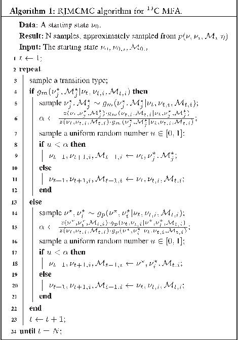
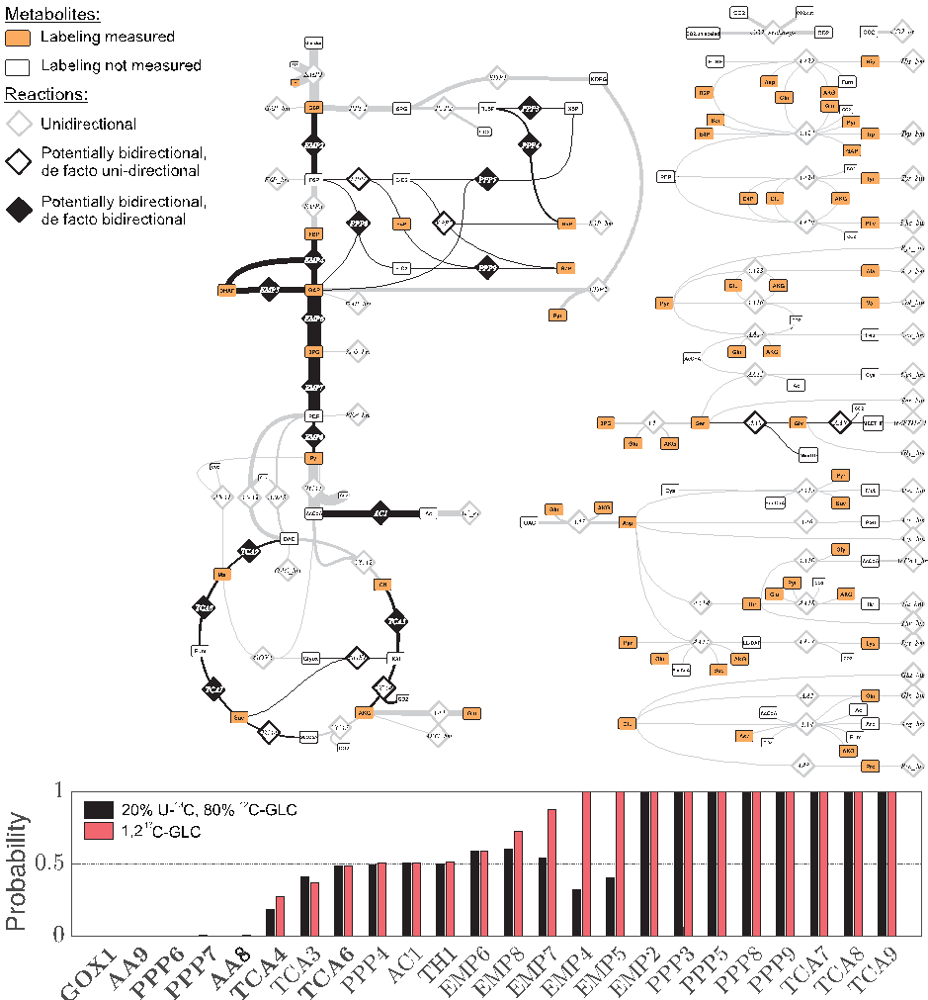

# Reversible jump MCMC for multi-model inference in Metabolic Flux Analysis

## Contents

- [Abstract](#abstract)
- [1 Introduction](#1-introduction)
- [2 Approach](#2-approach)
  - [2.1 $^{13}$C Metabolic Flux Analysis](#21-$13$c-metabolic-flux-analysis)
  - [2.2 Inferring probabilities of reaction bidirectionalities](#22-inferring-probabilities-of-reaction-bidirectionalities)
    - [2.2.1 Bridging BMA and Ockham’s Razor](#221-bridging-bma-and-ockhams-razor)
- [3 Algorithms](#3-algorithms)
  - [3.1 RJMCMC for multi-model sampling](#31-rjmcmc-for-multi-model-sampling)
  - [3.2 $^{13}$C MFA-tailored RJMCMC transition densities](#32-$13$c-mfa-tailored-rjmcmc-transition-densities)
    - [3.2.1 Intra-model transition density $g_p$](#321-intra-model-transition-density-g-p)
    - [3.2.2 Inter-model transition density $g_m$](#322-inter-model-transition-density-g-m)
  - [3.3 Implementation details](#33-implementation-details)
- [4 Results and discussion](#4-results-and-discussion)
  - [4.1 Computational feasibility of the RJMCMC algorithm](#41-computational-feasibility-of-the-rjmcmc-algorithm)
  - [4.2 Recovering bidirectional reaction steps from $^{13}$C data](#42-recovering-bidirectional-reaction-steps-from-$13$c-data)
- [5 Conclusion](#5-conclusion)
- [Acknowledgements](#acknowledgements)
- [References](references/TN2020.md)

## Abstract

Motivation: The validity of model based inference, as used in systems biology, depends on the underlying model formulation. Often, a vast number of competing models is available, that are built on different assumptions, all consistent with the existing knowledge about the studied biological phenomenon. As a remedy for this, Bayesian Model Averaging (BMA) facilitates parameter and structural inferences based on multiple models simultaneously. However, in fields where a vast number of alternative, high-dimensional and non-linear models are involved, the BMA-based inference task is computationally very challenging.

Results: Here we use BMA in the complex setting of Metabolic Flux Analysis (MFA) to infer whether potentially reversible reactions proceed uni- or bidirectionally, using $^{13}$C labeling data and metabolic networks. BMA is applied on a large set of candidate models with differing directionality settings, using a tailored multi-model Markov Chain Monte Carlo (MCMC) approach. The applicability of our algorithm is shown by inferring the in vivo probability of reaction bidirectionalities in a realistic network setup, thereby extending the scope of $^{13}$C MFA from parameter to structural inference.

## 1 Introduction

Quantitative models in systems biology are tools that formalize assumptions to make inferences from data. With that, these models are key to generating hypotheses about, and gaining insights into, biological phenomena that are not directly measurable ( Cvijovic et al. , 2014 ; Kremling, 2013 ). In particular, in the field of biochemical network modeling, this process has become an accepted state-of-the-art where models, which are operated as measurement instruments, are constructed from assumptions that rest upon known biochemical interactions. However, even though the biochemistry is unquestioned, it only informs about what can happen and not what does happen in living cells. What actually does happen depends on many factors, for example the in vivo intracellular conditions, which are known to be poorly characterized ( Teusink et al. , 2000 ; Tummler and Klipp, 2018 ). The discrepancy between what can happen and what does happen, forces modelers to introduce assumptions to their models, that go way beyond firm knowledge, and are therefore of a more subjective nature.

Becoming part of the model (as part of its mathematical structure or as parameter), subjective assumptions pose a double edge: On the one hand, seeing the model as a measurement instrument, they introduce uncertainty into the drawn inferences. On the other hand, the assumptions can be proven false by the data, thereby prompting the modeler to reconsider what is known about the system. The latter is the driver of knowledge generation in the scientific method. However, in biology knowledge generation by model rejection faces limitations when the space of potential model formulations grows combinatorially with the number of subjective assumptions. In this case, selection of a single model for making inferences is often no longer justified by the data ( Brenner, 2010 ; Kirk et al. , 2015 ).

Where a large number of models, based on competing assumption sets, are at hand, approaches have been introduced that compensate for the lack of knowledge. One principal trait of methods relies on the principle of parsimony (Rish and Grabarnik, 2014). Such sparse modeling approaches deliver a single minimalistic model that captures essential features, conditioned to the type of complexity punishment applied. Consequently, such approaches are unable to yield confidence in, or disprove of, subjective assumptions. An alternative paradigm is to compensate for the lack of knowledge by random sampling. Sampling approaches tie hand-crafted model classes to available data to make joint inferences with the ensuing model ensembles (Kuepfer et al., 2007; Liu et al., 2015; Miskovic and Hatzimanikatis, 2011; Tran et al., 2008). These ensemble methods are geared towards increasing prediction robustness, however, they have not been formalized in a probability theoretic framework. Hence, they do also not have the potential to evaluate the probability of the made assumptions. Statistically rigorous approaches have been developed within the Bayesian framework to facilitate models as quantitative measurement instruments, despite conflicting subjective assumption sets, often aiming at distinguishing and ranking models according to their appropriateness (Toni et al. , 2009; Vyshemirsky and Girolami, 2008). A Bayesian approach, suited to deal with many 'on par models', is Bayesian Model Averaging (BMA), an established statistical technique for addressing model uncertainty, which uses an ensemble of models and grades the importance of inferences made by each of these models with the probability of that model (Hoeting et al. , 1999). BMA is rarely applied in systems biology, with sparse exceptions (Oates et al. , 2014; Timonen et al. , 2018).

Here, we explore the potential of the BMA methodology in quantitative inference problems, where the models are assembled partly from set-in-stone biochemistry and partly from more subjective assumptions. In this context an important, yet computationally challenging class of these problems is the flux inference problem that originates from $^{13}$C Metabolic Flux Analysis (MFA) in the field of fluxomics ( Wiechert, 2001 ). The final outcome of a $^{13}$C MFA study is a flux map, that visualizes the metabolic (net) rates of central carbon metabolism. The unique feature of this technique is its potential to reveal not only the net fluxes, as this is the case for many fluxomics tools, but enables a statement about whether a potentially reversible reaction proceeds uni- or bidirectionally (i.e. progresses in either forward or backward direction or in forward and backward direction simultaneously). In $^{13}$C MFA, as in the general case, the biochemistry which governs the assembly of metabolic models is considered set-in-stone, but in vivo aspects, such as whether a reaction progresses in a single direction only or is bidirectional, is less clear ( Cornish-Bowden and Ca ´rdenas, 2000 ; Wiechert, 2007 ). In the traditional toolbox of $^{13}$C MFA, the more subjective assumptions on the reaction bidirectionality are typically handled in an exhaustive way, i.e. all reactions that potentially carry a bidirectional flux are made bidirectional. This single-model paradigm is susceptible to overfitting, since it yields overly complex models with many degrees of freedom. In contrast, BMA handles this challenge using a multi-model approach, where each model has declared a unique combination of reactions bidirectional. The individual models are simpler than the exhaustive model in the single-model approach and are, thus, less prone to overfitting. Most importantly, instead of leaving the choice of bidirectionalities in the hands of subjective assumptions, BMA infers the probability of unknown bidirectionalities and simultaneously performs flux inference, taking the model probabilities into account.

The class of $^{13}$C MFA multi-model BMA inference problems we address here, is computationally very challenging, since typical $^{13}$C MFA models, describing the fractional labeling enrichment of the intracellular labeled species, are non-linear, comprise tens of flux parameters and millions of assumption sets. To tackle this challenge we utilize Reversible Jump Markov Chain Monte Carlo (RJMCMC) ( Green, 1995 ), which is a special class of MCMC sampling.

## 2 Approach

### 2.1 $^{13}$C Metabolic Flux Analysis

$^{13}$C MFA is the state-or-the-art technique to infer in vivo metabolic reaction rates (fluxes) using data generated in carbon labeling experiments (CLE) ( Wiechert, 2001 ; Zamboni et al. , 2009 ). Inferring the fluxes h from the labeling data g is a typical inverse problem. First, assuming that the fluxes h are known, the labeling data of a CLE is predicted in silico using a computational model $\mathcal{M}_i$ of cell metabolism. Herein, the predicted labeling is calculated by solving a high-dimensional equation system derived from mass balancing ( forward problem ). Then, the unknown fluxes h are inferred by solving the inverse problem: Starting from some initial guesses, the fluxes are altered in an iterative manner, until the model predicted labeling is coherent with the experimentally observed one. Coherence between the predicted and the observed labeling is measured by means of the so-called likelihood function $p(g \mid h)$ , which states how likely the experimental outcome is, given that the model $\mathcal{M}_i$ and the inferred fluxes $h$ are correct.

Bayesian interpretations of the flux inference problem have been introduced by Kadirkamanathan et al. (2006) and Theorell et al. (2017) . The center piece of Bayesian inference is Bayes’ theorem ( Wasserman, 2013 ). In the context of $^{13}$C MFA it states that the posterior probability distribution of the fluxes h conditioned on the data g , $p(h \mid g)$ , is proportional to the likelihood $p(g \mid h)$ and the prior flux distribution $p(h)$ , formalizing relevant available knowledge about the fluxes:

$$
p(\nu \mid g) = \frac{p(g \mid \nu)\, p(\nu)}{\int_{\nu} p(g \mid \nu)\, p(\nu)\, d\nu} \tag{1}
$$

Herein, all probabilities are given with respect to a particular model $\mathcal{M}_i$, which is chosen prior to flux inference. Therewith, the flux inference methodology essentially is a single-model approach, relying on the assumption that the correct model structure is known.

Precisely, a $^{13}$C MFA model $\mathcal{M}_i$ is composed of a set of metabolic reactions with specified stoichiometry, their associated atom transitions and assignments of the reactions’ (bi)directionalities, besides inequality constraints on the fluxes to exclude physiologically meaningless system states ( Wiechert, 2001 ). Precisely, a reaction can either be unidirectional , if operating in a single direction only, or bidirectional , if the labeling is exchanged between the reactants. Consequently, while the rate of a unidirectional reaction is fully characterized by its net flux, bidirectional reactions are accompanied by two flux values, the net and exchange fluxes ( Wiechert and de Graaf, 1997 ), constituting the flux vector h . Here, the net flux specifies the overall reaction rate, which is the difference between the reaction’s forward and backward flux. Complementary, an exchange flux quantifies the exchange of label between the reactants (by nature, non-negative), which is oblivious of the direction. Precisely, an exchange flux is defined as the minimum of the forward and backward flux. Thus, a unidirectional reaction is characterized by a zero exchange flux.

While the reaction stoichiometries and atom transitions are found in biochemistry textbooks and reaction databases, whether a reversible enzymatic reaction actually operates uni- or bi-directionally essentially depends on the thermodynamic driving forces in the in vivo conditions. Therefore, in the model, the choice of the reaction bidirectionalities is often not clear. In this case, it is generally recommended to set the reaction bidirectional (Wiechert, 2007).

### 2.2 Inferring probabilities of reaction bidirectionalities

An underlying assumption of Eq. (1) is that the chosen model $\mathcal{M}_i$ is equipped with the correct reaction bidirectionality setting. However, commonly, the reaction bidirectionality setting is subject to uncertainty, implying that selection of any one particular setting risks biasing the flux inference. In view of the ultimate goal of $^{13}$C MFA, quantitative flux inference, acknowledging these sources of model uncertainty is desirable.

In the following, instead of one single model $\mathcal{M}_i$, we consider the model, $\mathcal{M}$, to be a random variable with outcomes in a family of $2^n$ models $\{\mathcal{M}_i\}_i$, where $n$ is the number of reversible reactions (see Supplementary Information S.2 for nomenclature used throughout). Each model $\mathcal{M}_i$ is associated with a set of flux parameters $h_i$. The probability of the $k$th reaction (out of $n$ reversible ones) being bidirectional in view of the data, averaged over the model family, is denoted $p(\Delta_k \mid g)$, where $\Delta_k$ is a binary random variable determining whether the reaction is bidirectional. For a single model $\mathcal{M}_i$, $\Delta_{k \mid \mathcal{M}_i}$ is 0 or 1 depending on whether the $k$th reaction is uni- or bidirectional, respectively ($\Delta_k$ is fully determined by outcomes of $\mathcal{M}$). The posterior probability $p(\Delta_k \mid g)$ relates to in how many of the models in the family $\{\mathcal{M}_i\}_i$ the reaction is bidirectional and how probable these models are.

To calculate $p(\Delta_k \mid g)$, we first introduce how $p(\Delta_k \mid g)$ is expressed in terms of the whole model family and then transform that expression into a form that relates to the single models $\mathcal{M}_i$ with their associated fluxes $h_i$. Expressing a single probability in terms of a model family is formalized in BMA ( Hoeting et al. , 1999 ). Here, the probability of the $k$th reaction to be bidirectional, $p(\Delta_k \mid g)$, is averaged over its bidirectionality probabilities determined for all single models $\mathcal{M}_i$ in the model family, $\Delta_{k \mid \mathcal{M}_i}$, weighted with the posterior probabilities of the single models:

$$
p(\Delta_k \mid g) = \sum_i p(\Delta_k \mid \mathcal{M}_i, g)\, p(\mathcal{M}_i \mid g)
= \sum_i \Delta_{k \mid \mathcal{M}_i}\, p(\mathcal{M}_i \mid g) \tag{2}
$$

Herein, the second equality follows from definition, $p(\Delta_k \mid \mathcal{M}_i, g) = \Delta_{k \mid \mathcal{M}_i}$, since the directionality of a reaction is directly known from the model. Eq. (2) shows where the 'averaging' in BMA comes from: the probability $p(\Delta_k \mid g)$ is the average of $\Delta_{k \mid \mathcal{M}_i}$, weighted with the posterior probability of the model, $p(\mathcal{M}_i \mid g)$. To calculate averaged reaction direction probabilities, the probability $p(\mathcal{M}_i \mid g)$ for each model out of the model family $\{\mathcal{M}_i\}_i$ is to be determined. To calculate these probabilities Bayes' theorem is employed, analogous to Eq. (1), but for models rather than the fluxes. Since each model $\mathcal{M}_i$ relies on associated fluxes $h_i$, we marginalize over the models' flux spaces. Combining Bayes' theorem and marginalization (Wasserman, 2013), then leads to the expression for the posterior probability of the model $\mathcal{M}_i$:

$$
p(\mathcal{M}_i \mid g) = \frac{\int_{\chi_i} p(g \mid \nu, \chi_i, \mathcal{M}_i)\, p(\nu, \chi_i \mid \mathcal{M}_i)\, p(\mathcal{M}_i)\, d\chi_i}
{\sum_j \int_{\chi_j} p(g \mid \nu, \chi_j, \mathcal{M}_j)\, p(\nu, \chi_j \mid \mathcal{M}_j)\, p(\mathcal{M}_j)\, d\chi_j} \tag{3}
$$

For the combined posterior probability distribution $p(\nu, \chi_i, \mathcal{M}_i \mid g)$ Bayes’ theorem gives:

$$
p(\nu, \chi_i, \mathcal{M}_i \mid g) = \frac{p(g \mid \nu, \chi_i, \mathcal{M}_i)\, p(\nu, \chi_i \mid \mathcal{M}_i)\, p(\mathcal{M}_i)}
{\sum_j \int_{\chi_j} p(g \mid \nu, \chi_j, \mathcal{M}_j)\, p(\nu, \chi_j \mid \mathcal{M}_j)\, p(\mathcal{M}_j)\, d\chi_j} \tag{4}
$$

Inserting Eq. (3) into Eq. (2) (and recognizing that the normalizing constants are identical), yields the expression for the probability of the $k$th reaction to be bidirectional for the model family $\{\mathcal{M}_i\}_i$:

$$
p(\Delta_k \mid g) = \sum_i \int_{\chi_i} \Delta_{k \mid \mathcal{M}_i}\, p(\nu, \chi_i, \mathcal{M}_i \mid g)\, d\chi_i \tag{5}
$$

In realistic problems, evaluation of $p(\Delta_k \mid g)$ in Eq. (5) amounts to calculating a high dimensional integral. Since the integral does not have a closed-form solution, numerical approximation is required. To approximate the posterior $p(\Delta_k \mid g)$ we use MCMC which stochastically generates samples mimicking the unknown probability distribution. The design of the MCMC sampler represents the core algorithmic innovation of this work, which is detailed in Section 3.

#### 2.2.1 Bridging BMA and Ockham’s Razor

Before presenting algorithmic details, a remark is appropriate concerning the relation between single- and multi-model paradigms. The posterior probability of the model $\mathcal{M}_i$, $p(\mathcal{M}_i \mid g)$, in Eq. (3) is determined by the value of the likelihood function $p(g \mid h_i, \mathcal{M}_i)$ for the average fluxes (average with respect to the prior $p(h_i \mid \mathcal{M}_i)$, rather than for the optimal flux values). This property penalizes over-parameterized models, since these are overly flexible and therefore have well-performing best parameter sets, but show poor performance on average ( Mackay, 2003 ). This links Bayesian model probability to Ockham’s Razor, also known as the principle of parsimony, which states that simple explanations are preferable to more complex ones. BMA inherits Ockham’s Razor from the model probabilities, since it weights the importance of each model by its probability. This recognition relates to the single-model approach sketched in the introduction, in which the fluxes are inferred from a complex ‘super-model’ with all potentially bidirectional reactions set bidirectional. Importantly, this single-model approach cannot yield the probability of the bidirectionalities, since it, by only considering one model, neglects that simpler models are more likely. Therefore the super-model approach does not take model probability, and thereby Ockham’s Razor, into account. The multi-model approach, via BMA, examines conditional probabilities of the super-model through the candidate models, where each candidate model is an instance of the super-model with some exchange fluxes conditioned to be zero.

## 3 Algorithms

To estimate the posterior distribution of the reaction bidirectionalities, the high-dimensional integral in Eq. (5) needs to be approximated numerically. Solving such kind of problems has been revolutionized by MCMC methods ( Brooks et al. , 2011 ). Using MCMC, integrals on the form of Eq. (5) are approximated by means of the law of large numbers ( Wasserman, 2013 ). This requires that the integral is reformulated in the form of an expectation:

$$
p(\Delta_k \mid g) = \mathbb{E}_{p(\mathcal{M} \mid g)}[\Delta_k] \tag{6}
$$

Then, to approximate the posterior probability of the reaction bidirectionality, $p(\Delta_k \mid g)$, samples from the target distribution $p(\nu, \chi_i, \mathcal{M}_i \mid g)$ are generated by MCMC. According to the law of large numbers, the average over these samples converges to the desired expected value in the limit of large sample size. In MCMC, samples are generated by constructing a Markov Chain, which induces a series of evolving states $(\nu^t, \chi_i^t)$, with stationary distribution equal to the desired target distribution. To create a Markov Chain with target distribution $p(\nu, \chi_i, \mathcal{M}_i \mid g)$, the Metropolis-Hastings (MH) algorithm is used (Brooks et al., 2011). The MH algorithm is defined by a Markov Chain-inducing transition density $g$ and an acceptance/rejection criterion, which corrects the induced Markov Chain to have the desired stationary distribution.

For single-model target distributions with a continuous state space, a range of efficient transition densities are at hand (Brooks et al., 2011). In this context, efficient means that consecutive states in the Markov Chain have low autocorrelation time relative to the computation time of the state transitions. For the multi-model case considered in this work, we have to transition between model state spaces, represented by fluxes $h_i$, using the binary indicator variable $\Delta_k$. Remember, a distinct property of the model family $\{\mathcal{M}_i\}_i$ is that any reaction that is bidirectional contributes a net flux and a (positive) exchange flux value to $h_i$, while all unidirectional reactions solely contribute one net flux (the exchange flux is zero). To make the composition of $h_i$ and its relation to the model structure explicit, henceforth, we denote the net and exchange fluxes of model $\mathcal{M}_i$, $\nu$ and $\chi_i$, respectively. Here, as $\Delta_k$, the net fluxes are void of the subscript $i$ because they are present in all models of the family $\{\mathcal{M}_i\}_i$, while the subscript $i$ for the exchange fluxes $\chi_i$ stresses that these are specific to one model $\mathcal{M}_i$. Notice that only inference about the shared entities (net fluxes $\nu$ and reaction bidirectionalities $\Delta_k$) is possible for the whole model family.

Operating a Markov Chain across a model family, thus, requires the transition density to account for differing state space dimensionalities depending on the bidirectionality (and exchange flux) setting associated with the model states. The computational key challenge of multi-model inference encountered when solving Eq. (6) is sampling from the joint posterior distribution $p(\nu, \chi_i, \mathcal{M}_i \mid g)$ in Eq. (4). We tackle this challenge by employing RJMCMC ( Green, 1995 ). RJMCMC is a sub-class of MCMC methods tailored for drawing posterior samples spanning multiple parametric models together with their model-specific parameters, by jumping between models as part of the sampling.

### 3.1 RJMCMC for multi-model sampling

The core element of our RJMCMC sampler for multi-model inference is the transition density $g$ for sampling from the joint posterior distribution $p(\nu, \chi_i, \mathcal{M}_i \mid g)$. This RJMCMC transition density $g$ consists of two densities: the density $g_p$ for model-specific flux exploration updating the flux vectors $\nu$, $\chi_i$ (intra-model jumping), and the density $g_m$ for model space exploration updating the exchange flux-model pair $\chi_i$, $\mathcal{M}_i$ (inter-model jumping). Notice that, for both $g_p$ and $g_m$, $\chi_i$ only contains the exchange fluxes that are part of $\mathcal{M}_i$, thus the updates never change the value of an exchange flux outside the scope of the present model.

Before discussing the transition distributions in detail, the general setup of the RJMCMC algorithm is outlined (Algorithm 1). Starting from initial model and flux states, a Markov chain of states $(\nu^t, \chi_i^t, \mathcal{M}_i^t)$ is produced, indicated by the subscript $t$. Sampling from the mixed RJMCMC transition density $g$ is done in two steps: first it is determined whether the sample is drawn from either $g_m$ or $g_p$ with fixed probability (Algorithm 1, L3), then an inter- or intra-model sample is drawn from the selected distribution (Algorithm 1, L5, 14).

The proposed states (indicated by superscript $\star$) are then accepted or rejected according to given criteria, following the standard MH scheme. In our case, two rejection criteria are posed, one for inter- and one for intra-model jumping. The rejection criteria depend on the transition densities $g_m$, $g_p$ of the proposed states, the likelihood $p(g \mid \nu, \chi_i, \mathcal{M}_i)$, as well as the prior $p(\nu, \chi_i, \mathcal{M}_i)$ (Algorithm 1, L6, 15 using the shorthand $z(\nu, \chi_i, \mathcal{M}_i) = p(g \mid \nu, \chi_i, \mathcal{M}_i) \cdot p(\nu, \chi_i, \mathcal{M}_i)$). Depending on whether the value of the rejection criterion, $\alpha$, exceeds a random uniform number $u \in [0,1]$ or not, the proposed states are either rejected or accepted (Algorithm 1, L8–12, 17–21). In case of acceptance, the proposed state is the next state, in case of rejection, the next state remains identical to the present state. This way, $N$ samples are obtained for evaluating Eq. (6).

### 3.2 $^{13}$C MFA-tailored RJMCMC transition densities

The key for a computationally efficient RJMCMC algorithm is a well-designed transition density $g$ that allows the Markov Chain to explore the state space, so that the visited states have short autocorrelation time in relation to the computational cost of producing samples. Here, the desired behaviour of the transition density is to suggest states that are as different from the present state as possible, without causing high rejection rates. Next, we describe how the transition densities for intra- and inter-model jumping are constructed.

#### 3.2.1 Intra-model transition density $g_p$

The transition density $g_p$ operates on the net fluxes $\nu$, that take values in continuous space and have fixed number of dimensions. Thereby, it is equivalent to the transition density employed in Theorell et al. (2017) , also used in this work, which relies on a classic hit-and-run transition density ( Be ´lisle et al. , 1993 ) to update the flux states $\nu$, $\chi_i$. For the hit-and-run direction choices, the probability of a direction is proportional to the width of the maximum volume ellipsoid, fitted within the flux space ( Zhang and Gao, 2003 ).

Algorithm 1: RJMCMC algorithm for $^{13}$C MFA.

#### 3.2.2 Inter-model transition density $g_m$

The underlying idea of the inter-model density $g_m$ is that model jumps are proposed by going through the list of reversible reactions and changing some of the directionalities. In the context of $^{13}$C MFA, switching a reaction from bidirectional to unidirectional is equivalent to annihilate the exchange of label between substrate and product pools of the reaction, i.e. setting the exchange flux to zero ( Wiechert, 2001 ). Thus, in $g_m$, model switches are caused by either turning zero exchange fluxes to a non-zero value (referred to as direction activation ) or turning non-zero exchange fluxes to zero (referred to as direction deactivation ). In the update mechanism that we deploy, net fluxes remain constant under inter-model jumps.

To achieve high acceptance rates, the proposed transition density $g_m(\nu^{j\star}, \mathcal{M}^{j\star} \mid \nu^t, \chi_i^t, \mathcal{M}_i^t)$ nullifies exchange fluxes that are close to zero. This leads to only small changes in the simulated labeling fractions and, therefore, small changes in the value of $z(\nu, \chi_i, \mathcal{M}_i)$, the product of the likelihood and the prior, implicating high acceptance rates. Therefore, the probability to deactivate the $k$th reaction of state $t$ is set to $(\chi_{i,k}^t / \max_j \chi_{i,j}^t)^\beta$ with $\beta > 0$ controlling the deactivation rate (Algorithm 2, L4). Here, a high (low) value for $\beta$ gives a high (low) deactivation rate. Notice that, after convergence of the sampler, the policy of increasing the deactivation probability for near-zero fluxes has no effect on the produced posterior, since the increased probability is matched by an increase in MH rejections.

For activating reactions, no heuristic, similar to the one used for reaction deactivation, is possible, since all non-active exchange fluxes are 0. Therefore, the activation probability $\gamma \in [0,1]$ is introduced and the probability for a reaction unidirectional in $\mathcal{M}_i^t$ to become bidirectional in $\mathcal{M}^{j\star}$, is set to $\gamma$ (Algorithm 2, L14). Due to so-called dimensionality matching (Green, 1995), the activated exchange fluxes cannot be initialized with the value 0, but must be given a random value from some continuous distribution. Therefore, an activation distribution $p_{\mathrm{act}}(\chi_{j,k}^{\star})$ is introduced, from which the values of activated exchange fluxes are sampled (Algorithm 2, L16).

An important aspect of the MH algorithm is that it requires both the forward probability of the proposed state $g_m(\nu^{j\star}, \mathcal{M}^{j\star} \mid \nu^t, \chi_i^t, \mathcal{M}_i^t)$ and the backward probability of the current state $g_m(\nu^t, \chi_i^t, \mathcal{M}_i^t \mid \nu^t, \chi^{j\star}, \mathcal{M}^{j\star})$, when jumping from the current model $\mathcal{M}_i^t$ to the proposed model $\mathcal{M}^{j\star}$ (Algorithm 1, L6). This means, that the changes in bidirectionality have to be tracked. To this end, four index sets are introduced:

- 1. $\mathcal{L}_{\mathrm{deact}}$: indices of the reactions that switch from bidirectional in $\mathcal{M}_i^t$ to unidirectional in $\mathcal{M}^{j\star}$ (Algorithm 2, L6),
- 2. $\mathcal{L}_{\mathrm{inc}}$: indices of reactions that are bidirectional in both models (Algorithm 2, L8),
- 3. $\mathcal{L}_{\mathrm{act}}$: indices of reactions that switch from unidirectional in $\mathcal{M}_i^t$ to bidirectional in $\mathcal{M}^{j\star}$ (Algorithm 2, L16),
- 4. $\mathcal{L}_{\mathrm{exc}}$: indices of reactions that are unidirectional in both models (Algorithm 2, L18).

Back- and forward transition probabilities are calculated by multiplying the probability of all events recorded by the index sets. Note that when computing the backward probability, the activation and deactivation sets swap roles, since fluxes that are activated in one jump direction are deactivated in the other (Algorithm 2, L21–22).

### 3.3 Implementation details

The presented RJMCMC algorithm for reaction direction inference from labeling data was implemented in C++.

Algorithm 2: Transition density $g_m$ for Markov Chain jump proposals.

MCMC methods risk displaying pseudo-convergence, which is a state where the Markov Chain appears to have converged, but has in fact only explored some of the target modes ( Brooks et al. , 2011 ). To make the Markov Chains more robust towards pseudo-convergence, parallel tempering with dynamic temperature selection was used ( Vousden et al. , 2016 ). The parallel tempering scheme was parallelized for computational efficiency. For the simulations, 30 parallel chains were run. To decrease the influence of the starting state, all benchmark runs were preceded by a burn-in period of 10 5 samples. MCMC requires generation of a large number of state proposals to achieve convergence of the Markov Chains, in realistic $^{13}$C MFA settings up to millions ( Theorell et al. , 2017 ). Each new state requires the simulation of the labeling fractions emerging from the flux-model pairs $h_i$, $\mathcal{M}_i$. For efficient network simulation, the high-performance computation suite 13CFLUX2 was used ( Weitzel et al. , 2013 ). The specification of the model is given in the FluxML format ( Beyß et al. , 2019 ).

For computations, the (de)activation parameters $\beta$ and $\gamma$ were set to 0.1. As activation distribution $p_{\mathrm{act}}$ a normal distribution was used, truncated to $[0,1]$, with zero mean and standard deviation 0.1. To avoid changes in the prior volume when switching between models with different number of exchange fluxes, all exchange fluxes are transformed linearly to lie in the interval [0, 1]. The influence of these parameters on the performance of the RJMCMC-algorithm is investigated further in a parameter sensitivity study (Supplementary Information S.2). The parameter study shows that the RJMCMC performance is relatively insensitive to the parameter values, as long as extreme choices are avoided (such as $\beta = 1$ or $\gamma = 1$).

## 4 Results and discussion

Due to the novelty of our $^{13}$C MFA multi-model approach, two aspects are of primary interest:

- Computational feasibility: High-dimensional MCMC for traditional single-model flux inference with network models of realistic complexity is computationally highly intensive ( Theorell et al. , 2017 ). A multi-model approach might increase this high computational burden excessively. Thus, first we test the computational tractability of the RJMCMC algorithm in a realistic $^{13}$C MFA scenario. To get insights into the computational performance of the RJMCMC-sampler, we compare it to the closest published algorithm, namely single-model MCMC.

- Reaction bidirectionality recovery: We investigate the capacity of our multi-model approach to quantify the probabilities of reversible reactions to be uni- or bidirectional in vivo . We do this with a network model, typical for the field of $^{13}$C MFA, and a measurement configuration, that is considered cutting edge ( Kappelmann et al. , 2016 ). Since the single-model approach does not yield probabilities for the reaction bidirectionalities (Section 2.2.1), direct comparison between the outcomes of the single- and multi-model approaches in this point is infeasible. Therefore, the ability of the multi-model approach to determine bidirectionality is studied in a setting with known reference solution and two labeling strategies at hand.

To demonstrate the utility of the multi-model approach and the proposed RJMCMC sampler in these two aspects, we selected a realistic $^{13}$C MFA application with the model organism E.coli , based on the study by Crown et al. (2015) . The metabolic network, typical in its size, includes all major metabolic pathways of central carbon metabolism, lumped amino acid synthesis and biomass formation, as this is representative for the vast majority of studies in the field.

The network model features 119 metabolites and 64 reactions, out of which 24 are considered potentially reversible ( Fig. 1 ). Out of these 24 potentially reversible reactions, 23 are set reversible in the original model ( Crown et al. , 2015 ). One additional reaction was added to the set of reversible fluxes since it was recently discovered to be bidirectional ( Long et al. , 2017 ). In their original study, 18 of the 23 exchange fluxes were found to be practically unidentifiable, despite extensive measurement sets stemming from 14 CLEs. To generate a reference flux map, for the net fluxes (all reactions are equipped with net fluxes, 8 independent) the best flux estimates reported by Crown et al. (2015) were used. For the exchange fluxes, the 24 potentially bidirectional reactions were divided into two groups (see Fig. 1 ), 7 de facto uni- and 17 bidirectional, in which all exchange flux values were set to 0 and 100, respectively. Using these reference fluxes, LC-MS/MS measurements were simulated according to the setup given in ( Kappelmann et al. , 2016 ) and equipped with Gaussian noise (absolute measurement error of 0.01). The full network and measurement specifications are provided in Supplementary Information S.1 .

### 4.1 Computational feasibility of the RJMCMC algorithm

To assess the computational performance of the RJMCMC sampling algorithm, it is compared to the single-model MCMC approach. A standard measure when comparing the performance of MCMC methods, is the relative speedup in Effective Sample Size (ESS) ( Gilks et al. , 1995 ). To make both MCMC sampling scenarios as similar as possible, the single-model MCMC sampler was run for the E.coli model where all potentially bidirectional reactions were set bidirectional. MCMC convergence was monitored with the net fluxes, since these are shared by all models (the posterior distributions of the net and exchange fluxes are provided in Supplementary Information S.2). The minimal obtained ESS over all covariates after 10 6 samples (only each 100th sample was saved to reduce disc memory usage), averaged over ten independent runs, was recorded for both samplers. As a complement to ESS, several convergence tests were performed ( Supplementary Information S.2). These include the Potential Scale Reduction Factor (PSRF), mixing plots to show convergence for the continuous parameters, and discrete mixing plots to show convergence in the model space. All tests indicate convergence of the RJMCMC sampler.

The MCMC and RJMCMC samplers obtained an average ESS of $8 \pm 2$ and $854 \pm 128$ respectively, showing that the RJMCMC sampler achieves approximately a 107-fold increase in sample quality. Each of the ten independent runs took on average 16.2 and 19.7h for MCMC and RJMCMC respectively in wall clock time.

This is a remarkable performance difference, recognizing that the time to convergence of many MCMC samplers has been shown to increase with the number of dimensions ( Beskos et al. , 2013 ; Roberts et al. , 1997 ). We conclude that the faster convergence of RJMCMC is explained by the difference in dimensionality, where the single-model used for MCMC had 32 (8 net, 24 exchange) degrees of freedom (DOF) and the RJMCMC models had 21.5 DOF on average. The faster convergence of RJMCMC implies that the speed-up caused by the lower dimensionality outweighs the increase in complexity of the multi-model inference task caused by the multiplicity in model formulation. With this, we conclude that the multi-model approach is computationally feasible, and furthermore, introduces a significant speedup compared to the single model approach.

### 4.2 Recovering bidirectional reaction steps from $^{13}$C data

After approving computational tractability, we evaluated the ability of the RJMCMC algorithm to identify whether reactions are uni- or bidirectional from given data. A specific characteristic of $^{13}$C MFA is that the choice of the isotopically labeled substrate used in the CLE crucially influences the quality of traditional flux inference ( Crown et al. , 2015 ; Mo ¨llney et al. , 1999 ). Therefore, we took the same network model and measurement configuration as before, and considered two different input labeling compositions: (i) a comparably cheap, often used 1:4 mixture of uniformly [U-$^{13}$C]- and unlabeled glucose, and (ii) 100% [1,2-$^{13}$C]-glucose, which has been reported to be more informative ( Crown et al. , 2015 ).

By applying the RJMCMC algorithm to the network model, we derived the posterior probability of each reversible reaction being bidirectional for both labeling sets (Fig. 1). Inspecting the reactions that were unidirectional in the reference flux map, but set potentially bidirectional in the model, GOX1, AA10, PPP6, PPP7, TCA4, AA9 and TCA6 , we see that all fluxes, except TCA4 and TCA6 , were identified as unidirectional with high certainty, independently of the tracer used. For TCA4 and TCA6 , none of the two datasets could inform whether the reactions were uni- or bi-directional, which is expressed in the intermediate probabilities of the reactions. The reactions EMP2, PPP3, PPP5, PPP8, PPP9, TCA7, TCA8 and TCA9 were correctly identified as bidirectional by both datasets, whereas EMP4 and EMP5 were correctly identified as bidirectional for the [1,2-$^{13}$C]-glucose tracer, but remained undecided for the tracer mixture. For the remaining reactions (all bidirectional in the reference flux map), both datasets lacked information for uni- or bi-directionality classification (probabilities between 0.05 and 0.95).

Fig. 1. Metabolic network of the central carbon metabolism of *E. coli* used in this study. Potentially bidirectional reactions are divided in *de facto* uni- and bidirectional reactions, indicating their bidirectionality in the reference solution. The bars show the posterior probability of the reactions being bidirectional, for two CLE scenarios: a 20/80 mix of [U-$^{13}$C]- and [$^{12}$C]-glucose and 100% [1,2-$^{13}$C]-glucose labeling. Flux names written in bold correspond to the *de facto* unidirectional reactions of the reference flux map. A probability of 0.5 means that no information whether a reaction is uni- or bidirectional is contained in the measurements. The specification of the network model, including atom transitions, constraints and measurements is given in Supplementary Information S.1

As shown in Supplementary Information S.2 , the RJMCMC runs are highly reproducible and also visit the true (data generating) model several times per run. Thus, the lack of perfect recovery whether a reaction is bidirectional does not depend on the RJMCMC-algorithm, but shows that the information content of the measurements is insufficient to confirm the reaction’s uni- or bidirectionality.

In our scenario, we were able to identify the directionality of 63 and 54% of the reactions, depending on the input substrate. We consider this a surprisingly large proportion, since exchange fluxes, and therewith reaction bidirectionalities, are notoriously hard to identify (Wiechert and de Graaf, 1997). This also highlights the impact of our multi-model approach: the reactions that were left with uncertain directionality do not restrict us from performing the analysis, nor force us to make ungrounded assumptions about their directionality. Interestingly, the comparison of the tracer choices show a relatively minor information gain of the expensive [1,2-$^{13}$C]-glucose tracer compared to the cheap mixture of unlabeled and uniformly labeled glucose. Though performed using simulated data, these simulations indicate what identifiability we can expect, using the method with real data.

## 5 Conclusion

In $^{13}$C MFA, inferences about the in vivo fluxes are drawn on the basis of a metabolic network model formulation. Here, we go beyond the traditional flux inference approach, solely concerned with parameter inference, and instead perform simultaneous model and parameter inference. In particular, we consider uncertainty in the bidirectionality of reversible reactions originating from the exchange flux formulation. Enabled by the Bayesian paradigm, structural inferences are drawn from a family of alternative model structures, formalized using Bayesian Model Averaging. Computationally, a RJMCMC sampling algorithm is constructed with a tailored, mixed transition density, allowing the sampler to navigate through the joint model-flux space. In terms of structural inferences, we show that, using two different experimental setups, our multi-model approach provides statistically solid inferences, without the need to resolve the structure completely and without additional computational effort. Thereby, BMA, computed with RJMCMC, enables knowledge generation in situations where the available data is insufficient to completely resolve a network structure. This is not only relevant in $^{13}$C MFA, which was showcased here, but also in the general setting of quantitative systems biology where models are operated as measurement instruments.

## Acknowledgements

The authors are thankful to Johnjoe McFadden for insightful discussions about Ockham's Razor and its relation to BMA, and to Wolfgang Wiechert for excellent working conditions at the IBG-1.

### Funding

A.T. was supported by Grant No. ERA-IB-14-81 DYNAMICS.

*Conflict of Interest*: none declared.
